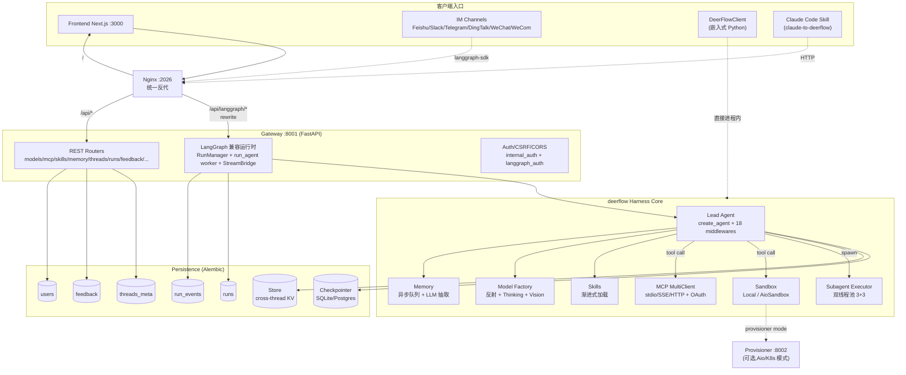
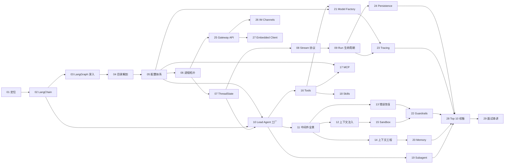

# 00 · 学习路线总览 —— bytedance/deer-flow 面试导向精读（v3）

> 本目录是为「**高级 Agent 开发工程师** 面试准备」量身设计的源码精读路线。
> 节奏：**一次只产出一份 md，本份是路线总览，请确认目录与依赖关系后再进入下一份。**

**v3 调整**（在 v2 基础上）：
- ✅ 新增 **`05 配置体系：AppConfig + ExtensionsConfig + 反射装配`**，覆盖 26 份子配置组合、`$ENV_VAR` 解析、mtime 缓存失效、`resolve_variable` 反射加载工具/沙箱/Provider 的全套机制。这是后面所有"插件化"章节的前置。
- ✅ 原 `15 Tools & MCP` 拆为两份独立 md：`16 Tools 系统`（内建+community+四源合并+`@tool`/`BaseTool` 协议）+ `17 MCP 集成`（多服务器+OAuth+lazy cache+Tool Search 协作）。
- ✅ 02 LangChain 章节走 **C 方案**：源码逐行解 `create_agent` + 对比 `create_react_agent` + DeerFlow 中间件 walkthrough，篇幅会显著加长。

**v2 已落地**：
- ✅ LangGraph/LangChain 深度章节拆为两份独立 md（02 LangChain Agent + Middleware；03 LangGraph 深入），不再"速通带过"。
- ✅ 三方向兼顾（生产化/可观测/IM + 多 agent 编排/Context Engineering），不砍任何章节，面试视角小节按"业务型 + 创业型"双视角给问题。
- ✅ 显式补齐两个原计划深度不够的章节：**Run 生命周期 + StreamBridge 抽象**（09）、**Persistence Alembic 五表设计**（24）；并把"反思纠错"和"可观测性"的细节按清单落到 13 / 14 / 23 三份 md 里。

---

## 1. 项目一句话定位

> **DeerFlow 2.0 是一个基于 LangGraph + LangChain 的「Super Agent Harness（超级智能体宿主）」**：它不是又一个 Agent 框架，而是把"沙箱、记忆、技能、子智能体、可观测性、IM 接入"等 Agent 运行所需的基础设施**预装成一套可扩展的运行时**，让一个 LLM 真正像「拥有一台电脑的同事」一样工作。

它解决的核心痛点：
1. **Agent 不只是"调工具"，而是要在一个有状态的环境里工作** —— 因此有沙箱 + 虚拟文件系统。
2. **复杂任务必须能并行分解** —— 因此有 Subagent 双线程池 + 并发上限护栏。
3. **长任务必须能跨会话记住用户** —— 因此有异步去重的长期记忆。
4. **Agent 容易跑飞、循环、撞 Token 上限** —— 因此有 LoopDetection / Summarization / SubagentLimit / DanglingToolCall 等 18 个中间件协同保护。
5. **企业级落地要可观测、可审计、可分发** —— 因此有 RunJournal、Guardrails、Tracing、Gateway/Channels 多入口、Alembic 五表持久化。

---

## 2. 整体物理拓扑（一张图把项目装进脑子里）

---

## 3. 学习目标地图（读完整套文档你能回答的高级问题）

| 维度 | 你将能回答 |
|---|---|
| LangGraph 内功 | StateGraph 的 reducer 解决什么并发问题？Checkpointer + Store 各自的边界？`Command(goto=END)` 与 `interrupt` 的区别？|
| LangChain Agent | `create_agent` 相比 `create_react_agent` 多了什么？AgentMiddleware 五个钩子 `before_agent` / `before_model` / `modify_model_request` / `after_model` / `after_agent` 各在哪一步执行？|
| 系统设计 | 为什么 DeerFlow 选择"Middleware 链 + create_agent"而不是手写 StateGraph？|
| 状态管理 | ThreadState 的 `merge_artifacts` / `merge_viewed_images` reducer 设计动机？|
| 运行时 | RunManager 状态机 pending→running→completed/cancelled 如何防并发？pre-run checkpoint 怎么做"回滚到取消前"？|
| 流式协议 | LangGraph `stream_mode=["values","messages-tuple","custom"]` 的语义差异？为什么 messages-tuple 是 delta 而 values 不能重复合成？|
| 并发 | 双线程池 + `MAX_CONCURRENT_SUBAGENTS=3` 如何防止 fan-out 爆炸？|
| 安全 | 为什么 LocalSandbox 默认禁用 host bash？虚拟路径如何防逃逸？|
| 上下文 | DanglingToolCall + LoopDetection + Summarization 如何协同避免"history 损坏"和 token 爆炸？|
| 工具 | MCP cache 为什么用 mtime invalidation？OAuth token 流为什么放在 client 层？|
| 模型 | 反射 `use: module:Class` 路径相比硬编码工厂模式的取舍？vLLM 自定义 Provider 解决了什么？|
| 持久化 | 五表（threads_meta / runs / run_events / feedback / users）为什么这么切？Checkpointer 与业务表为什么不能合并？Alembic 怎么管理迁移？|
| 可观测 | RunJournal vs LangSmith vs Langfuse 的分工？`tags=["middleware:summarize"]` 解决了什么 trace 可读性问题？|
| 工程化 | harness/app 双层依赖防线是怎么用 CI 测试守住的？|

---

## 4. 完整文档目录（29 份，按学习顺序编号）

> 编号格式 `NN-name.md`；推荐按顺序阅读，跨章节有依赖关系，见第 5 节依赖图。

### A. 项目认知层（5 份） —— 你在地图上的位置 + 内功打底

- **`01-positioning-and-mental-model.md` —— 项目定位与心智模型**
  从"Deep Research 框架 → Super Agent Harness"的转向；Agent Harness 六要素与 DeerFlow 的对应；与 LangGraph 官方 prebuilt、CrewAI、AutoGen 的横向对比。

- **`02-langchain-agent-and-middleware-protocol.md` —— LangChain：`create_agent` + AgentMiddleware 协议深讲**（**深度版 · C 方案**）
  - **源码逐行解读** `langchain.agents:create_agent` 内部如何展开成 StateGraph（`model_request` 节点 / `tools` 节点 / 条件边路由）
  - AgentMiddleware 五个钩子（`before_agent` / `before_model` / `modify_model_request` / `after_model` / `after_agent`）的"洋葱模型"执行栈与具体调用时机
  - **对比 `create_react_agent`（prebuilt）**：前者无中间件、固定 ReAct 循环；后者可插拔，能在 `after_model` 用 `Command(goto=END)` 提前终止 —— DeerFlow 的 `ClarificationMiddleware` 就是范例
  - **DeerFlow 真实中间件 walkthrough**：以 `SubagentLimitMiddleware` / `ClarificationMiddleware` / `ViewImageMiddleware` 三个最具代表性的中间件为例，演示 `after_model` / `before_model` / `modify_model_request` 三种钩子的真实落地写法
  - BaseTool / `@tool` 装饰器与 Pydantic schema 推断；async vs sync tool 的执行路径差异
  - 为后续 18 个中间件章节铺底。

- **`03-langgraph-deep-dive.md` —— LangGraph 深入：StateGraph / Reducer / Checkpointer / Store / Streaming**（**深度版**，原速通章节的后半）
  - `StateGraph` 与 `MessagesState` 的关系；自定义 `Annotated[T, reducer]` 的语义与并发写入安全性
  - `Checkpointer`（per-thread 状态快照）vs `Store`（cross-thread KV，DeerFlow 用于 user-scoped memory）的分工
  - `Command(goto=END/node, update={...})` 路由 + 状态更新原子化
  - `interrupt(value)` 与人工介入；`Send(node, state)` 与 map-reduce / fan-out
  - `stream_mode` 全模式（`values` / `updates` / `messages` / `messages-tuple` / `custom` / `debug`）语义对照表
  - 一个最小 30 行的 StateGraph demo 演示 reducer 并发合并行为 —— 让你跳过"只跑过 demo"阶段

- **`04-directory-anatomy-and-harness-app-split.md` —— 工程目录解剖：harness/app 双层架构**
  为什么把 `deerflow` 拆成可发布的 harness 包 + 私有 app 层？`tests/test_harness_boundary.py` 如何用 AST/import 扫描守护"harness 永不导入 app"的依赖防线；DeerFlowClient 与 Gateway 同源 schema 哲学。

- **`05-config-system.md` —— 配置体系：AppConfig + ExtensionsConfig + 反射装配** ⭐ **新增**
  - `config.yaml` 26 份子配置如何组合成 **`AppConfig`** 总聚合根（models / tools / tool_groups / sandbox / skills / memory / summarization / token_usage / loop_detection / title / subagents / tool_search / guardrails / channels / ...）
  - **`$ENV_VAR` 解析机制**：什么时机替换、嵌套 dict 如何递归、解析失败的回退策略
  - **配置缓存 + mtime 失效**：`get_app_config()` 为什么不是简单 `@lru_cache`，而是要比对路径变化 + 文件 mtime —— 让 Gateway 和 LangGraph 在 `config.yaml` 编辑后**无需重启**就能拿到新配置
  - **配置版本管理**：`config_version` 字段 + `make config-upgrade` 如何自动合并新增字段
  - **反射装配三件套**：`reflection/resolve_variable(path)` 与 `resolve_class(path, base_class)` 如何把 `use: deerflow.community.aio_sandbox:AioSandboxProvider` 这种字符串解析成可调用对象；缺包时的 actionable 错误提示
  - **ExtensionsConfig**（`extensions_config.json`）：MCP servers + skills 的 enabled 状态如何与 `AppConfig` 解耦管理；Gateway API 修改后如何触发 LangGraph 端的失效
  - 配置优先级（CLI arg → env var → cwd → project root）的设计动机
  - 这是后面所有"可插拔"章节（沙箱/工具/MCP/模型/Provider/Guardrail/Channel）的前置心智模型

### B. 整体架构层（4 份） —— 系统是怎么跑起来的

- **`06-runtime-and-process-topology.md` —— 进程拓扑与启动链**
  Nginx → Gateway → LangGraph 兼容运行时 → `make_lead_agent` 的完整调用链；`langgraph.json` 的 `graphs/auth/checkpointer` 三键解读；本地/Docker/Prod 四种启动模式如何映射到同一份代码；`make_checkpointer` 工厂的作用。

- **`07-thread-state-and-state-reducers.md` —— ThreadState 与状态合并语义**
  `ThreadState(AgentState)` 扩展字段：`sandbox`/`artifacts`/`todos`/`uploaded_files`/`viewed_images`；自定义 reducer `merge_artifacts`（按 path 去重）与 `merge_viewed_images`（合并/清空哨兵）的设计动机与潜在并发 bug；为什么必须在 ThreadState 而不是在中间件里做合并。

- **`08-streaming-protocol-and-stream-modes.md` —— 流式协议与 stream_mode 语义不变量**
  LangGraph `stream_mode=["values","messages-tuple","custom"]` 三种事件的产生时机与字段差异；DeerFlow 为什么**不**把 messages-tuple 重新合成回 values（防重复投递的核心不变量）；DeerFlowClient `stream()` 与 Gateway SSE 的"per-id dedup"机制；`docs/STREAMING.md` 设计还原。

- **`09-run-lifecycle-and-stream-bridge.md` —— Run 生命周期 + StreamBridge 抽象** ⭐ **新增**
  - `RunManager` 状态机：`pending → running → completed / failed / cancelled / timeout`，并发取消的 race-condition 防护
  - `run_agent` worker 协程：从 RunManager 拉任务 → 调用 `make_lead_agent` → 桥接事件流到 StreamBridge
  - **pre-run checkpoint 快照与回滚**：cancel 后如何让 thread state 不残留半截 AI message
  - **SSE 事件桥 + heartbeat**：客户端断线重连时如何用 `runs/{rid}/join` 续接；为什么要心跳
  - **为什么 `StreamBridge` 是抽象的**：`memory.py`（单进程） vs `async_provider.py`（跨 worker 协调）；面向未来 Redis / NATS 实现的口子
  - `runtime/runs/schemas.py` 的 Pydantic 模型 = REST 路由 `/api/threads/{tid}/runs/*` 与 `/api/runs/*` 的契约

### C. 核心模块层（10 份） —— 一个模块一份

- **`10-lead-agent-factory.md` —— Lead Agent 工厂与 Prompt 装配**
  `make_lead_agent` → `_make_lead_agent` 全流程；`apply_prompt_template` 如何把 skills/memory/subagent 拼进系统提示；bootstrap 模式 vs 普通模式 vs 自定义 agent 三分支；`_resolve_model_name` 三级回退；`filter_tools_by_skill_allowed_tools` 工具策略闸门。

- **`11-middleware-chain-overview.md` —— 18 个中间件全景与执行顺序**
  `build_lead_runtime_middlewares` + `_build_middlewares` 的两阶段装配；为什么 ClarificationMiddleware 必须最后；中间件执行顺序如何影响异常恢复路径；一张时序图把"洋葱"展开。

- **`12-middleware-deep-1-context-injection.md` —— 上下文注入三件套**
  `ThreadDataMiddleware`（per-thread 目录 + `get_effective_user_id()` 解析）、`UploadsMiddleware`（文件注入）、`SandboxMiddleware`（沙箱生命周期 acquire/release）—— 它们如何把"运行时上下文"喂给 LLM。

- **`13-middleware-deep-2-error-recovery.md` —— 错误处理三件套 + LoopDetection** ⭐ **强化**
  - `DanglingToolCallMiddleware`：为什么需要补占位 ToolMessage（OpenAI 严格校验 `tool_call_id` 序列）；如何同时清理 `additional_kwargs["tool_calls"]` 防 provider 端二次报错
  - `LLMErrorHandlingMiddleware`：Provider 错误归一化为 assistant-facing 可恢复消息
  - `ToolErrorHandlingMiddleware`：工具异常 → 错误 ToolMessage，保证 run 不中断
  - `LoopDetectionMiddleware`：**hash + 滑动窗口算法**（`from_config` 解读阈值），命中后 hard-stop 同时清 `tool_calls` 与 `additional_kwargs.tool_calls`
  - 四道防线协同时序图

- **`14-middleware-deep-3-context-engineering.md` —— 上下文工程层** ⭐ **强化**
  - `SummarizationMiddleware`：`trigger`（tokens / messages / fraction）与 `keep`（recent N）策略；为什么用 `with_config(tags=["middleware:summarize"])` 标记内部 LLM 调用；`preserve_recent_skill_*` 保留最近技能内容；`memory_flush_hook` 在压缩前强制 flush 记忆
  - `DynamicContextMiddleware`：日期 / 记忆注入到 first HumanMessage 而**不**入 system prompt 的关键动机 —— **保住 prefix-cache 命中率**
  - `ViewImageMiddleware`：vision 模型才注入 base64；`merge_viewed_images` reducer 的清空哨兵
  - `TitleMiddleware`：首轮自动标题；structured 内容归一化

- **`15-sandbox-system.md` —— 沙箱系统与虚拟路径**
  `Sandbox` 抽象 + `SandboxProvider.acquire/get/release`；`LocalSandboxProvider` 单例 vs `AioSandboxProvider` 容器化；虚拟路径 `/mnt/user-data/{workspace,uploads,outputs}` 双向翻译；为什么本地默认禁用 host bash；`file_operation_lock.py` 的 `(sandbox_id, path)` 锁粒度；search.py / security.py 的越权防护。

- **`16-tools-system.md` —— 工具系统：四源合并 + 内建/Community + Schema 协议** ⭐ **拆分独立**
  - **`get_available_tools` 四源合并**：config-defined tools / MCP tools / 内建 builtins / subagent task —— 顺序与去重策略
  - **`tools/builtins/`**：`present_files` / `ask_clarification`（→ Clarification 中断）/ `view_image`（按模型 vision 能力条件加载）/ `setup_agent`（bootstrap）/ `update_agent`（custom-agent self-update）
  - **`@tool` 装饰器与 BaseTool**：Pydantic schema 自动推断、async/sync 路径、`ToolMessage` 返回值规范
  - **Community 工具栈**：`tavily` / `jina_ai` / `firecrawl` / `infoquest` / `exa` / `serper` / `ddg_search` / `image_search` / `aio_sandbox` —— 不同搜索/抓取后端如何用同一抽象接入
  - **ACP agent 工具**：`invoke_acp_agent` 接外部 ACP-compatible agent；per-thread workspace 路径协议
  - **`tools/sync.py`** 工具同步与 `tools/types.py` 的统一类型

- **`17-mcp-integration.md` —— MCP 集成：多服务器 + OAuth + 懒加载缓存** ⭐ **拆分独立**
  - **MultiServerMCPClient（langchain-mcp-adapters）**：DeerFlow 在它之上做了什么薄封装
  - **三种 transport**：stdio（command-based）/ SSE / HTTP 的连接生命周期与可靠性差异
  - **OAuth token 流**：`client_credentials` + `refresh_token` 的两段式获取；Authorization header 自动注入；token 过期/刷新失败的降级策略
  - **懒加载 + mtime cache invalidation**：`mcp/cache.py` 为什么不用 TTL 而用文件 mtime；首次工具调用才连接 server 的代价权衡
  - **运行时热更新**：Gateway `PUT /api/mcp/config` 写回 `extensions_config.json` → LangGraph 端通过 mtime 自然失效
  - **`DeferredToolFilterMiddleware` 与 Tool Search 协作**：动态隐藏未启用 MCP 工具的 schema，控制 prompt 体积
  - 与第 16 章的边界：本章只讲 MCP；第 16 章只讲非 MCP 的工具源

- **`18-skills-system.md` —— 技能系统：渐进式能力加载**
  SKILL.md 前置元信息（name/description/license/allowed-tools）；`skills/{public,custom}` 双源扫描；`.skill` ZIP 安装 + `security_scanner.py`；`filter_tools_by_skill_allowed_tools` 工具策略闸门；"按需加载"如何控制 prompt 体积。

- **`19-subagent-system.md` —— 子智能体：双线程池调度与并发护栏**
  `SubagentExecutor` 调度池(3) + 执行池(3) 拆分动机；`task()` 工具 → 5s 轮询 → SSE 事件流；`SubagentLimitMiddleware` 在 `after_model` 截断多余 tool_calls 的硬限；15 分钟超时 + `token_collector` 把 sub 的 token 计费回归到主调点。

### D. 关键技术点层（5 份） —— 横切能力

- **`20-long-term-memory.md` —— 长期记忆：异步抽取 + 去重 + 多用户隔离**
  `MemoryMiddleware` 过滤 → `MemoryQueue` 30s 防抖 → 后台线程 LLM 抽取 → 原子写文件；为什么必须在 enqueue 时捕获 `user_id`（contextvar 在 timer 线程不可用）；事实去重的"空白归一化"细节；每用户/每 agent 隔离 + legacy migration 脚本；`summarization_hook.py` 的 `memory_flush_hook` 与 Summarization 中间件的协同。

- **`21-model-factory-and-providers.md` —— 模型工厂：反射、Thinking、Vision、CLI Provider**
  `create_chat_model` 的反射加载；`when_thinking_enabled` 与 `extra_body.chat_template_kwargs.enable_thinking`（Qwen / vLLM 0.19）；自定义 `VllmChatModel` 保留非标 `reasoning` 字段；Codex/Claude OAuth CLI Provider 的凭证加载策略；`patched_*` 系列对官方 LangChain provider 的最小侵入式修复。

- **`22-guardrails-and-security.md` —— 安全护栏体系**
  `GuardrailMiddleware` 工具调用前置鉴权（AllowlistProvider / OAP / 自定义 Protocol）；`SandboxAuditMiddleware` 命令审计；artifact 强制下载防 XSS；本地沙箱的非隔离边界声明；`guardrails.enabled` 配置开关；护栏与 LoopDetection 的责任划分。

- **`23-tracing-and-observability.md` —— RunJournal + Token Usage + LangSmith + Langfuse** ⭐ **强化**
  - **RunJournal**（`runtime/journal.py`）：运行内事件流落库到 `run_events` 表；`event_store` 与 SSE 的双写关系
  - **Token Usage**（`TokenUsageMiddleware`）：`record_token_usage` 的 **message-position 合并**（不依赖 message id，避免 retry 错位）；subagent 用 `tool_call_id` 缓存后合并回主 AIMessage
  - **LangSmith / Langfuse**（`tracing/factory.py`）：双 callback 注入；`with_config(tags=["middleware:summarize"])` 让 trace 中能区分"summarize 子调用"与 lead_agent 主调用 —— 可观测性最容易被忽略的一个细节
  - 三层观测的分工：RunJournal（内部业务）/ LangSmith（云端 trace）/ Langfuse（自托管 trace）

- **`24-persistence-alembic-and-five-tables.md` —— Persistence：Alembic 迁移 + 五表设计** ⭐ **新增**
  - **五表设计**：`threads_meta`（标题/用户/创建时间）+ `runs`（运行元数据）+ `run_events`（事件流，append-only）+ `feedback`（用户反馈）+ `users`（认证）
  - 为什么**不**把这些塞进 LangGraph Checkpointer：Checkpointer 是 per-thread state 黑盒，业务表需要跨 thread 查询/分页/反馈关联
  - `engine.py` + `base.py`：SQLite/Postgres 双后端；`json_compat.py` 抹平 JSON 列在不同数据库的语法差异
  - **per-user 隔离**：所有业务表的查询必须经过 `user_id` 过滤
  - `migrations/`（Alembic）：版本演进与 `make migrate` 流程；`env.py` 如何接到 DeerFlow `engine`
  - Checkpointer/Store vs 业务表的分工三视图：State / Event / Index

### E. 工程实践层（3 份） —— 生产化

- **`25-gateway-api-design.md` —— Gateway 路由设计与 LangGraph 兼容层**
  REST 路由族（models/mcp/skills/memory/threads/runs/feedback/...）；`/api/langgraph/*` rewrite 兼容前端 langgraph-sdk；分页 `after_seq/before_seq` cursor；artifact 下载安全策略；CORS+CSRF 同源/分源切换；`internal_auth.py` 进程内服务间认证。

- **`26-channels-and-im-integration.md` —— IM 通道适配模式**
  `MessageBus`（pub/sub）+ `ChannelManager`（dispatcher）+ `Channel`（platform impl）三层；Feishu 卡片在位 patch vs Slack/Telegram `runs.wait`；DingTalk AI Card 流式打字机；`channel:chat[:topic]` 三级 thread 映射键；Channel 进程内通过 langgraph-sdk 调 Gateway 的 internal_auth 注入。

- **`27-embedded-client-and-conformance-tests.md` —— DeerFlowClient 与 Gateway 一致性测试**
  Embedded 与 HTTP 同源的设计哲学；`TestGatewayConformance` 如何用 Pydantic 校验 schema 一致性；为什么这是一种比 OpenAPI 更轻量的契约保证。

### F. 面试串讲层（2 份） —— 最后冲刺

- **`28-design-tradeoffs-top10.md` —— 设计权衡 Top 10**
  从全套源码中提炼的 10 个最值得讨论的工程取舍。预览：
  1. 为什么 sandbox lock 用 `(sandbox_id, path)` 而不是全局
  2. 为什么 messages-tuple 是 delta 而 values 不是
  3. 为什么 ThreadDataMiddleware 必须在 SandboxMiddleware 之前
  4. 为什么 Memory 用异步队列而不是同步写
  5. 为什么 Subagent 拆调度池/执行池两个 pool
  6. 为什么业务五表不放进 Checkpointer
  7. 为什么 StreamBridge 必须抽象
  8. 为什么 LocalSandbox 默认禁 host bash
  9. 为什么用反射 `use: module:Class` 而不是工厂注册
  10. 为什么 DynamicContext 注入到 first HumanMessage 而不是 system prompt

- **`29-interview-grand-summary.md` —— 高级 Agent 工程师面试串讲**
  按"Agent Harness 六要素"组织：反馈循环 / 记忆持久化 / 动态上下文 / 安全护栏 / 工具集成 / 可观测性 —— 每要素 2 个高频面试题 + 教科书答案 + DeerFlow 源码佐证。同时提供"业务型大厂面试卷"+"创业型 AI 公司面试卷"两套配比。

---

## 5. 文档依赖关系图

**关键依赖路径**（如果你时间有限只能挑读）：
- **最短面试速通路径（12 份）**：01 → 02 → 03 → 05 → 06 → 09 → 10 → 11 → 15 → 19 → 20 → 29
- **完整深度路径（29 份）**：按编号顺序

---

## 6. 学习节奏与互动规则

1. 我每次只输出**一份 md**，输出后停下来问你 2-3 个**理解性问题**。
2. 你回答（或者直接说"下一份"）之后，我才进入下一份。
3. 每份 md 严格遵守你给定的 9 节结构（学习目标 / 源码定位 / Mermaid 图 / 核心讲解 / 通用模式 / 六要素映射 / 常见坑 / 动手实操 / 面试视角 / 延伸阅读）。
4. 所有代码引用形如 `packages/harness/deerflow/agents/lead_agent/agent.py::_make_lead_agent`，可点击直跳。
5. 面试视角小节按"业务型大厂卷 + 创业型 AI 公司卷"双视角各出 1 题，覆盖你提到的三个方向。
6. 如果你发现某个模块在路线里漏了或顺序需要调整，**现在是调整的最佳时机**。

---

## 7. v3 最终确认 —— 直接回复"OK"即可进入 01

29 份目录已锁定，节奏不精简，02 走 C 方案（源码逐行 + prebuilt 对比 + DeerFlow 中间件 walkthrough），新增 05 配置体系、16/17 工具与 MCP 拆分。如果还有任何调整请现在指出；否则我开始产出 **`01-positioning-and-mental-model.md`**。
