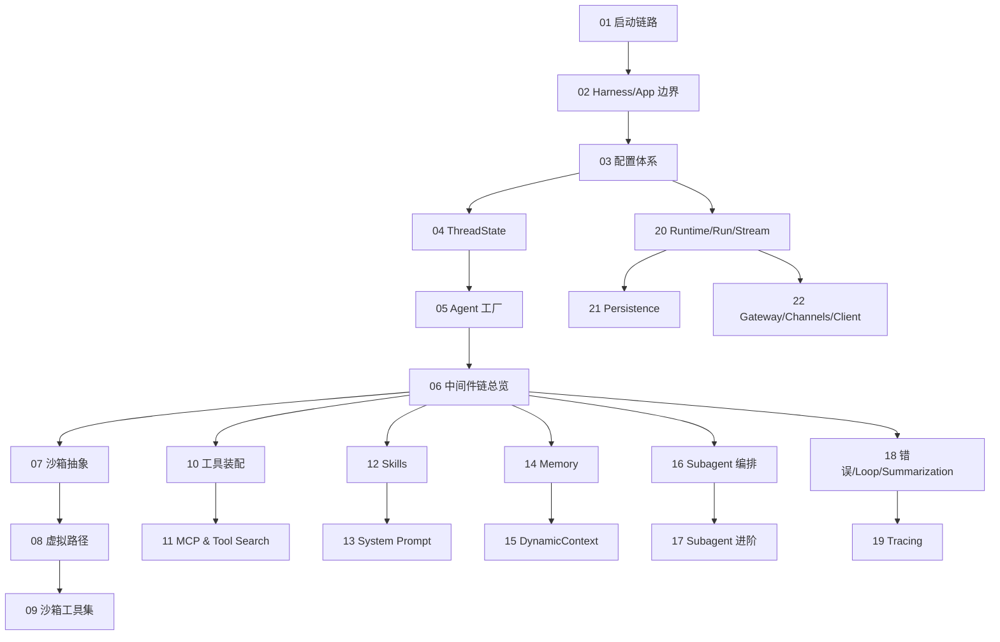

# 00 · 学习路线总览（DeerFlow 全栈 Agent 系统）

> 教练定位：这份文档不是给"读 README 就够了"的人看的。它写给已经能跑通 LangGraph + Pydantic Hello World、但还没真正读过一个**生产级多智能体系统**的工程师。
>
> 目标：把 `bytedance/deer-flow` 这个 ~5 万行（仅 backend Python ≈ 30k+ 行）的工程，按模块切片、按依赖顺序拆成 **22 份**自洽的 Markdown，让你既能"通"也能"深"。
>
> 风格：所有论断都带源码路径 + 行号锚点；没有源码佐证的部分一律标注"待后续确认"。

---

## 1. 仓库结构地图（实际扫描结果）

下面这棵树是我刚刚通过 `find` 在你本地 `/Users/sanshi/PycharmProjects/deer-flow/` 上跑出来的（剔除了 `.git / .venv / node_modules / __pycache__ / dist`），不是 README 的宣传图。

```
deer-flow/
├── Makefile                         # 根目录 make 入口（dev / start / docker-* / up / down）
├── config.example.yaml              # 主配置模板（44KB）
├── extensions_config.example.json   # MCP + Skills 启用状态
├── docker/
│   ├── docker-compose.yaml          # 生产
│   ├── docker-compose-dev.yaml      # 开发
│   ├── dev-entrypoint.sh
│   ├── nginx/{nginx.conf, nginx.local.conf}
│   └── provisioner/{Dockerfile, app.py, README.md}   # K8s 沙箱供给器
├── scripts/                         # 顶层运维脚本（setup_wizard, doctor, check, configure, deploy, docker, serve）
├── skills/public/<22 个内置 skill>   # 公开 skills（agent 系统提示中可见的能力清单）
├── frontend/                        # Next.js 前端（src/{app,components,core,...}）
│   └── src/core/{agents,api,artifacts,auth,mcp,memory,messages,models,
│                 settings,skills,streamdown,tasks,threads,todos,tools,uploads,...}
└── backend/                         # 本次学习重点
    ├── Makefile                     # 后端 make（dev / gateway / test / lint）
    ├── langgraph.json               # LangGraph Studio 入口（graphs/auth/checkpointer 三处装配点）
    ├── pyproject.toml
    ├── debug.py                     # 调试脚本入口
    ├── packages/harness/
    │   ├── pyproject.toml           # 独立可发布包 deerflow-harness
    │   └── deerflow/                # **import 前缀: deerflow.*；不依赖 app.***
    │       ├── __init__.py
    │       ├── client.py            # 1278 行：DeerFlowClient 内嵌 SDK
    │       ├── agents/
    │       │   ├── __init__.py             # 触发 skills 预热
    │       │   ├── factory.py              # create_deerflow_agent（纯参数工厂）
    │       │   ├── features.py             # RuntimeFeatures + @Next/@Prev 注解
    │       │   ├── thread_state.py         # ThreadState/SandboxState 状态 schema
    │       │   ├── lead_agent/{agent.py, prompt.py}   # 主智能体 + 823 行系统提示
    │       │   ├── memory/{queue, updater, storage, prompt, message_processing, summarization_hook}
    │       │   └── middlewares/<18 个 .py>  # 见 §3 中间件矩阵
    │       ├── sandbox/
    │       │   ├── sandbox.py / sandbox_provider.py     # 抽象接口
    │       │   ├── tools.py                              # 1583 行：bash/read/write/str_replace/ls/glob/grep + 虚拟路径系统
    │       │   ├── middleware.py / security.py / search.py / exceptions.py
    │       │   └── local/{local_sandbox.py, local_sandbox_provider.py}
    │       ├── community/aio_sandbox/  # Docker/K8s 沙箱（aio_sandbox_provider 707 行）
    │       ├── subagents/
    │       │   ├── executor.py                       # 828 行：双线程池 + 隔离 event loop
    │       │   ├── registry.py / config.py / token_collector.py
    │       │   └── builtins/{general_purpose, bash_agent}
    │       ├── tools/
    │       │   ├── tools.py                  # get_available_tools 装配
    │       │   ├── skill_manage_tool.py / sync.py / types.py
    │       │   └── builtins/{task_tool, view_image_tool, present_file_tool,
    │       │                 clarification_tool, setup_agent_tool, update_agent_tool,
    │       │                 invoke_acp_agent_tool, tool_search}
    │       ├── mcp/{client.py, cache.py, oauth.py, tools.py}
    │       ├── skills/{installer, parser, security_scanner, tool_policy, validation,
    │       │           types, storage/{local_skill_storage, skill_storage}}
    │       ├── models/{factory, claude_provider, vllm_provider, openai_codex_provider,
    │       │           mindie_provider, patched_{openai,deepseek,minimax}, credential_loader}
    │       ├── guardrails/{builtin.py, provider.py, middleware.py}
    │       ├── runtime/
    │       │   ├── runs/{manager, worker, schemas, store/{base,memory}}    # RunManager + run_agent
    │       │   ├── stream_bridge/{base, memory, async_provider}            # SSE 桥
    │       │   ├── checkpointer/{provider, async_provider}                 # 持久化
    │       │   ├── events/store/{base, db, jsonl, memory}                  # 事件落库
    │       │   ├── store/{provider, async_provider, _sqlite_utils}         # LangGraph Store
    │       │   ├── journal.py / serialization.py / user_context.py / converters.py
    │       ├── persistence/
    │       │   ├── engine.py / base.py / json_compat.py
    │       │   ├── feedback/{model, sql} · run/{model, sql} · thread_meta/{base, sql, memory, model}
    │       │   ├── user/{model} · models/{run_event}
    │       │   └── migrations/{env.py, versions/}
    │       ├── config/<26 份 *_config.py>   # AppConfig 主体 + 子配置（auth/sandbox/memory/...）
    │       ├── reflection/resolvers.py      # resolve_variable / resolve_class
    │       ├── tracing/factory.py           # LangFuse 集成
    │       ├── uploads/manager.py
    │       └── utils/{file_conversion, network, readability, time}
    ├── app/
    │   ├── gateway/
    │   │   ├── app.py            # FastAPI 入口 + lifespan 钩子
    │   │   ├── auth_middleware.py / csrf_middleware.py / internal_auth.py / langgraph_auth.py
    │   │   ├── auth/<13 个文件>   # JWT、本地 Provider、Sqlite 仓库、密码、reset_admin
    │   │   ├── deps.py            # langgraph_runtime 上下文
    │   │   ├── authz.py / services.py / config.py
    │   │   └── routers/<15 个 router>   # threads, thread_runs, runs, feedback,
    │   │                                  uploads, artifacts, agents, suggestions,
    │   │                                  channels, auth, mcp, memory, models, skills,
    │   │                                  assistants_compat
    │   └── channels/                # IM 集成
    │       ├── message_bus.py / manager.py / service.py / base.py / store.py / commands.py
    │       └── feishu / slack / telegram / dingtalk / wechat / wecom / discord
    └── tests/  (178 个 test_*.py)   # 包含 test_harness_boundary.py 强制 app 单向依赖
```

> ⚠️ 注意：根目录的 `config.yaml`、`extensions_config.json` 已经存在并被你本地修改过，启动逻辑会优先从 **项目根目录**（不是 backend/）读取。这点见 `packages/harness/deerflow/config/app_config.py:112` 的 `resolve_config_path`。

---

## 2. 我的切分原则

1. **依赖优先**：先讲"被依赖"的（配置、状态、Reflection），再讲"依赖别人"的（agent、middleware、subagent）。
2. **从外到内**：先有"我能跑起来"的感性认识（启动链路 + 一次请求的全景），再钻进每个中间件的内部状态机。
3. **以中间件链为骨架**：deer-flow 的核心架构就是 **`build_lead_runtime_middlewares` + `_build_middlewares`** 这条 14–18 节中间件链——它是 Harness 工程六要素的物理对应物。
4. **把"易混淆点"单独成章**：例如 ThreadState vs RunContext vs LangGraph configurable、Local vs Aio Sandbox、Run vs Thread Run vs Stateless Run 这些点很容易踩坑，单独抽出来讲。
5. **每份文档都能独立读懂**：但模块依赖图见 §4，按编号顺序最高效。

---

## 3. 中间件链矩阵（一张图先入脑）

```mermaid
flowchart LR
    A0["ThreadDataMiddleware<br/>(lazy_init=True)"] --> A1[UploadsMiddleware]
    A1 --> A2["SandboxMiddleware<br/>(lazy_init=True)"]
    A2 --> A3[DanglingToolCallMiddleware]
    A3 --> A4[LLMErrorHandlingMiddleware]
    A4 --> A5{"guardrails.enabled?"}
    A5 -- yes --> A6[GuardrailMiddleware]
    A5 -- no --> A7
    A6 --> A7[SandboxAuditMiddleware]
    A7 --> A8[ToolErrorHandlingMiddleware]
    A8 --> A9[DynamicContextMiddleware]
    A9 --> A10{"summarization.enabled?"}
    A10 -- yes --> A11[DeerFlowSummarizationMiddleware]
    A10 -- no --> A12
    A11 --> A12{"plan_mode?"}
    A12 -- yes --> A13[TodoMiddleware]
    A12 -- no --> A14
    A13 --> A14{"token_usage.enabled?"}
    A14 -- yes --> A15[TokenUsageMiddleware]
    A14 -- no --> A16
    A15 --> A16[TitleMiddleware]
    A16 --> A17[MemoryMiddleware]
    A17 --> A18{"model.supports_vision?"}
    A18 -- yes --> A19[ViewImageMiddleware]
    A18 -- no --> A20
    A19 --> A20{"tool_search.enabled?"}
    A20 -- yes --> A21[DeferredToolFilterMiddleware]
    A20 -- no --> A22
    A21 --> A22{"subagent_enabled?"}
    A22 -- yes --> A23[SubagentLimitMiddleware]
    A22 -- no --> A24
    A23 --> A24{"loop_detection.enabled?"}
    A24 -- yes --> A25[LoopDetectionMiddleware]
    A24 -- no --> A26
    A25 --> A26["ClarificationMiddleware<br/>**ALWAYS LAST**"]
```



源码佐证：
- `packages/harness/deerflow/agents/middlewares/tool_error_handling_middleware.py:129`（`build_lead_runtime_middlewares`）—— 负责 ① ~ ⑦
- `packages/harness/deerflow/agents/lead_agent/agent.py:240`（`_build_middlewares`）—— 负责 ⑧ ~ ⑱
- Clarification 必须最后：见 `factory.py:286` 注释 `# Clarification (always last among built-ins)`

---

## 4. 22 份学习文档的切分方案

> 每份文档至少 1 张 Mermaid 图、≥3 个源码引用、1 段最小可运行示例 / 3 个 debug 任务。。

### Part A · 全局观与启动链路（3 篇 · 约 6h）

| # | 文档标题 | 一句话简介 |
|---|----------|-----------|
| 01 | **项目定位与启动链路** | 弄懂 `make dev` 背后到底起了几个进程（Gateway / Frontend / Nginx），langgraph.json 的三个挂载点（graphs/auth/checkpointer）如何串起来。 |
| 02 | **Harness ↔ App 双层架构与导入边界** | 为什么 `packages/harness/` 是可发布包、`app/` 不是？`test_harness_boundary.py` 如何在 CI 里物理拦截 `from app.*` 反向引用？ |
| 03 | **配置体系：AppConfig + ExtensionsConfig + 反射装配** | 26 份子配置如何组合成 AppConfig；`$ENV_VAR` 解析、配置缓存 mtime 失效、`resolve_variable` 反射加载工具/沙箱/Provider 的全套机制。 |

### Part B · LangGraph 状态与图核心（3 篇）

| # | 文档标题 | 一句话简介 |
|---|----------|-----------|
| 04 | **ThreadState 状态模型与 Reducer** | `merge_artifacts` 去重、`merge_viewed_images` 清空语义、AgentState 继承体系；Configurable / Context / State 的边界。 |
| 05 | **Agent 工厂双轨：make_lead_agent vs create_deerflow_agent** | 一条是 config 驱动的应用入口、一条是纯参数 SDK 入口；它们如何共享中间件装配并避免循环导入。 |
| 06 | **中间件链总览（14–18 节）与构建顺序契约** | 为什么 ClarificationMiddleware 必须最后？`@Next/@Prev` 注解如何允许第三方插入中间件？冲突检测算法实现。 |

### Part C · 沙箱与文件系统（3 篇）

| # | 文档标题 | 一句话简介 |
|---|----------|-----------|
| 07 | **沙箱抽象与生命周期：Sandbox/Provider/Middleware 三件套** | 抽象基类 → LocalSandboxProvider 单例 → Docker(AioSandbox) → K8s Provisioner 的差异；lazy_init 为什么默认 True。 |
| 08 | **虚拟路径系统与多挂载点** | `/mnt/user-data/{workspace,uploads,outputs}`、`/mnt/skills`、`/mnt/acp-workspace` 如何映射到物理路径；`replace_virtual_path` 的 4 类替换策略 + 路径回填到日志的反向脱敏。 |
| 09 | **沙箱工具集：bash/read/write/str_replace/ls/glob/grep** | 1583 行 `sandbox/tools.py` 的安全护栏（路径校验、命令分词、`..` 拒绝、相同 path 的细粒度锁、stdout/stderr 回收）。 |

### Part D · 工具系统与 MCP（2 篇）

| # | 文档标题 | 一句话简介 |
|---|----------|-----------|
| 10 | **工具装配：get_available_tools + 反射 + 去重** | 用户配置工具 → 内置工具 → MCP 工具 → ACP 工具的合并顺序；issue #1803 的命名冲突如何被拦截；同步/异步包装。 |
| 11 | **MCP 集成与 Tool Search（延迟工具）** | `MultiServerMCPClient`、mtime 缓存失效、OAuth client_credentials/refresh_token、ToolSearch 让 LLM "按需发现"工具的 DeferredToolRegistry。 |

### Part E · Skills 与 Prompt（2 篇）

| # | 文档标题 | 一句话简介 |
|---|----------|-----------|
| 12 | **Skills 系统：从 SKILL.md 到 system prompt** | 22 个内置 skill 的发现/解析/安全扫描/启用持久化；`allowed-tools` 如何反向裁剪工具集。 |
| 13 | **823 行系统 Prompt 的拼装艺术** | `apply_prompt_template` 的 9 个动态片段（soul/skills/deferred/subagent/acp/mounts/self-update/reminders/thinking）；为何把易变内容塞进 first HumanMessage 而非 system prompt。 |

### Part F · 记忆系统（2 篇）

| # | 文档标题 | 一句话简介 |
|---|----------|-----------|
| 14 | **MemoryMiddleware + 异步 Queue + Updater** | 用户/AI 消息过滤、按 thread_id 去重的 debounced timer、LLM 抽取事实 / topOfMind 三字段、原子写文件、whitespace 归一化的事实去重。 |
| 15 | **DynamicContextMiddleware 与 Prefix Cache 友好的注入策略** | 为什么 memory + 当前日期不放 system prompt，而是塞进 first HumanMessage 的 `<system-reminder>`？Prefix cache 命中率的工程权衡。 |

### Part G · 子智能体与并发（2 篇）

| # | 文档标题 | 一句话简介 |
|---|----------|-----------|
| 16 | **Subagent 编排：task 工具 + Executor + 双线程池** | `MAX_CONCURRENT_SUBAGENTS=3`、隔离的 asyncio 事件循环、`SubagentLimitMiddleware` 如何在 after_model 截断超额 tool_calls。 |
| 17 | **Subagent 注册表 + token 回收 + tool_call_id 缓存** | 内置 `general-purpose / bash` 子智能体、定制 subagent 如何 wire 进来；`SubagentTokenCollector` 把子图 token 用量回灌到父 AIMessage。 |

### Part H · 反思纠错与可观测性（2 篇）

| # | 文档标题 | 一句话简介 |
|---|----------|-----------|
| 18 | **错误处理三件套 + LoopDetection + Summarization** | DanglingToolCallMiddleware（补占位 ToolMessage）、LLMErrorHandlingMiddleware、ToolErrorHandlingMiddleware；循环检测的 hash+滑窗算法；上下文压缩的 trigger 与 keep 策略。 |
| 19 | **Tracing & Observability：RunJournal + Token Usage + LangFuse** | `event_store` 落库、callbacks 注入、`record_token_usage` 的 message-position 合并、`tags=["middleware:summarize"]` 在 trace 中的可读化。 |

### Part I · 运行时与持久化（2 篇）

| # | 文档标题 | 一句话简介 |
|---|----------|-----------|
| 20 | **RunManager + run_agent worker + StreamBridge** | Run 生命周期（pending→running→completed/cancelled）、pre-run checkpoint 快照与回滚、SSE 事件桥 + heartbeat；为什么 StreamBridge 是抽象的。 |
| 21 | **Persistence：Alembic 迁移、threads_meta / runs / run_events / feedback / users 五表设计** | per-user 隔离、JSON 列兼容层、SQLite/Postgres 双后端、Checkpointer/Store 与业务表的分工。 |

### Part J · 接入层与 SDK（1 篇）

| # | 文档标题 | 一句话简介 |
|---|----------|-----------|
| 22 | **Gateway API + IM Channels + DeerFlowClient 三种接入方式** | 15 个 FastAPI Router 的职责切分、AuthMiddleware/CSRFMiddleware 双闸门、IM Channels 通过 langgraph-sdk 同协议接入、`DeerFlowClient` 嵌入式 SDK 与 Gateway 的 1:1 对齐。 |

---

## 5. 文档依赖关系图



> 推荐顺序：先纵向打通 **01→06**（脑子里建图），然后横向按兴趣展开 D/E/F/G/H（任选一条），最后回到 **20→22** 看接入层。

---

## 6. 质量约束（贯穿全 22 篇）

1. ❌ 每份文档都不允许出现"大概 / 应该 / 可能是"这类描述源码行为的模糊词。
2. ✅ 每个论断要么挂源码路径行号、要么挂可执行验证步骤。
3. ✅ 中间件 / 工具 / 配置项名称必须与仓库里的实际命名一致（已在本总览中校对过）。
4. ✅ Mermaid 图统一用 `flowchart` / `sequenceDiagram` / `stateDiagram-v2`，禁外链图。

---

## 7. 接下来的交付节奏

- **下一轮**：交付 `01-startup-and-runtime.md`（启动链路与 LangGraph Studio 三处挂载点）。
- 我每交付一份会主动停下来等你反馈：是要继续、调整切分，还是先深挖某一篇。
- 如果你在某份文档读到不通的地方，可以直接告诉我"第 X 章的 Y 不懂"，我会在下一轮的开头先回这个问题再继续推进。

---

**请确认：**

1. 这 22 份的切分方案 OK 吗？是否想合并 / 拆分某几篇？（例如 16+17 是否合并？或者把 22 拆成 Gateway / Channels / Client 三份？）
2. 学习节奏（4 周）和耗时（40–55h）是否符合你的实际可用时间？
3. 是否希望我在每篇文档结尾加入一个"快速记忆卡"小节（5 条可背诵的精华点）？

确认完，我就开始写 **01-startup-and-runtime.md**。
