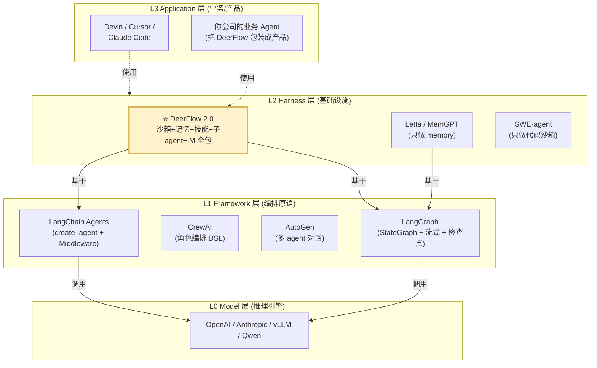
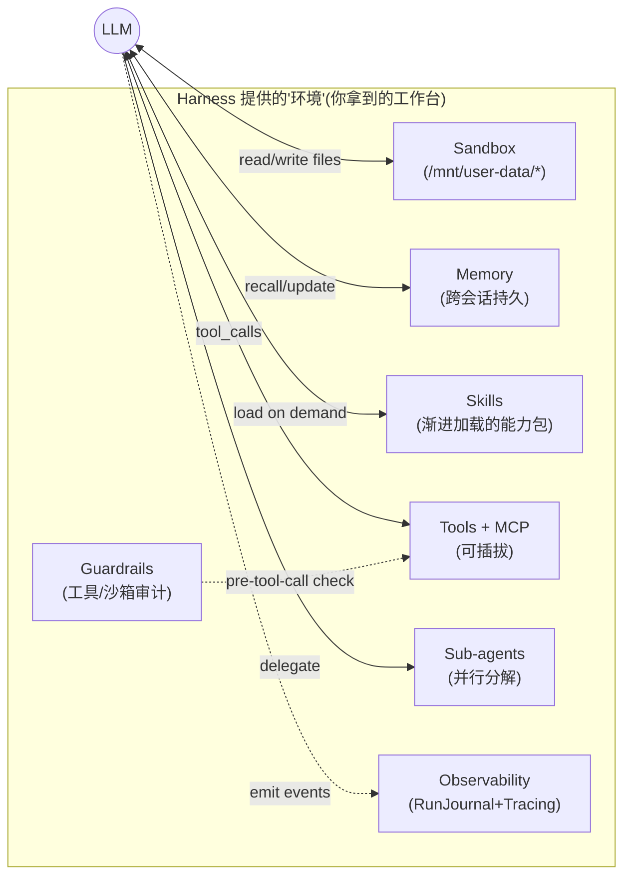

# 01 · 项目定位与心智模型

> 本章是路线的"零基础认知层"。读完这一份，你应该能在 3 分钟之内向面试官**清晰区分** "Agent Framework" / "Agent Harness" / "Agent Application" 三者，并准确说出 DeerFlow 站在哪一层、为什么这样站。

---

## 🎯 学习目标

读完这份文档，你能回答：

1. **"Super Agent Harness（超级智能体宿主）" 到底是什么？** 它和 LangGraph / CrewAI / AutoGen 这种 Framework，以及 Devin / Claude Code 这种 Application 各自的边界在哪？
2. **DeerFlow 为什么从 v1 的 Deep Research 框架，**ground-up rewrite **成 v2 Harness**？这个转向背后的工程信号是什么？
3. **"Agent Harness 六要素"是什么**？DeerFlow 用哪些目录/模块/类对应这六要素？这是一张你在后续 28 份 md 都要反复回看的「精读地图」。
4. **如果让你重新设计一个面向垂直领域（如金融研报 / 代码助手）的 Agent Harness**，你会从 DeerFlow 借鉴哪些设计、放弃哪些？

---

## 🗂️ 源码定位

| 关注点 | 路径 / 锚点 |
|---|---|
| 项目自定位语句 | `README.md` L12 —— "open-source **super agent harness** that orchestrates sub-agents, memory, and sandboxes" |
| v1 → v2 转向叙事 | `README.md` L557-565 —— "From Deep Research to Super Agent Harness" |
| 顶层架构总结 | `backend/CLAUDE.md` —— "Project Overview" / "Architecture" 节 |
| Harness 的"骨架" | `packages/harness/deerflow/` 一级子目录：`agents/`、`sandbox/`、`subagents/`、`tools/`、`mcp/`、`skills/`、`models/`、`memory/`、`runtime/`、`persistence/`、`tracing/`、`guardrails/`、`uploads/`、`config/` —— **这就是"六要素"的物理表达** |
| 把 Harness 装配出来的入口 | `packages/harness/deerflow/agents/lead_agent/agent.py::make_lead_agent`（**唯一**的 LangGraph graph 入口，见 `langgraph.json::graphs.lead_agent`） |
| 扩展 State 的核心 | `packages/harness/deerflow/agents/thread_state.py::ThreadState`（继承自 `langchain.agents.AgentState`，扩展 5 个字段 + 2 个 reducer） |
| Harness/App 双层防火墙 | `tests/test_harness_boundary.py`（CI 强制 harness 永不导入 app）|

---

## 🧭 心智模型图

### 1. Framework vs Harness vs Application：你站在哪一层？



> **一句话**：Framework 是"积木"，Harness 是"已经搭好的工作台"，Application 是"工作台上做出来的产品"。
> DeerFlow 2.0 把自己显式定位在 **L2 Harness 层** —— 它不和 LangGraph 竞争（事实上深度依赖 LangGraph），它和 Letta / SWE-agent 这类"单点能力 Harness"竞争「**全栈 Harness**」的位置。

### 2. DeerFlow 的 Harness "解剖"：LLM 不是孤立的，它周围环绕着"基础设施"



> **隐含的设计哲学**：把 LLM 当成"刚入职的同事" —— 它需要工位（沙箱）、需要记忆（不用每次自我介绍）、需要培训材料（技能）、需要工具箱、需要可以让下属帮忙（子 agent）、需要被审计（护栏 + tracing）。DeerFlow 把这些**都预装好了**，你只需要带一个 LLM 来上班。

---

## 🔍 核心逻辑讲解

### 1. 为什么"Harness（宿主）"比"Framework（框架）"更适合生产场景？

**关键对比**：

| 维度 | Framework | Harness |
|---|---|---|
| 你需要写多少代码 | 大量（节点、边、状态、工具、记忆都得自己拼） | 几乎不写（只配置 + 选模型 + 写 SKILL.md） |
| 灵活性 | 极高（图随便画） | 中等（被 ThreadState + Middleware 模式限制） |
| 解决"未知未知"的能力 | 弱（出了坑自己踩） | 强（已经替你踩过：DanglingToolCall / LoopDetection / SubagentLimit） |
| 演示价值 vs 生产价值 | 演示价值高 | 生产价值高 |
| 学习曲线 | 陡，先苦后甜 | 平，先甜后苦（要改默认行为时） |

**面试金句**：
> "Framework 让你**能**做 Agent，Harness 让你**敢**把 Agent 上生产。"

### 2. v1 → v2 的转向：被社区"逼"出来的设计

`README.md L557-565` 有一段近乎"产品复盘"的话，**值得一字一字读**：

> "DeerFlow started as a Deep Research framework — and the community ran with it. Since launch, developers have pushed it far beyond research: building data pipelines, generating slide decks, spinning up dashboards, automating content workflows. **Things we never anticipated.**
>
> That told us something important: DeerFlow wasn't just a research tool. It was a **harness** — a runtime that gives agents the infrastructure to actually get work done.
>
> So we rebuilt it from scratch."

**这段话翻译成工程语言**：
1. v1 是"应用"（一个 Deep Research workflow）。用户把它当"宿主"来跑别的工作流，结果验证了"宿主"才是真需求。
2. v1 → v2 **共享零行代码**（`README.md L17` 明示"DeerFlow 2.0 is a ground-up rewrite. It shares no code with v1."）—— 这是一个非常强烈的工程信号：**当抽象层次错位时，重写比改造便宜**。
3. v2 的"宿主"定位强迫团队把工作流相关的部分外移到 `skills/`（用户可拔插），保留通用的"基础设施"（sandbox / memory / sub-agents / tools / observability）作为**不动产**。

### 3. DeerFlow 解决的 5 个 Agent 痛点（与你的 28 份精读路线一一对应）

| # | 痛点 | DeerFlow 的解法 | 后续详读章节 |
|---|---|---|---|
| 1 | **LLM 没有状态，工作流跑两步就忘** | `ThreadState` + `Checkpointer` + 沙箱虚拟文件系统 | 06 / 07 / 09 / 15 |
| 2 | **复杂任务无法并行分解** | `task()` 工具 → `SubagentExecutor` 双线程池 + `SubagentLimitMiddleware` 并发护栏 | 19 |
| 3 | **跨会话记不住用户** | `MemoryMiddleware` → 异步抽取队列 → 每用户 `memory.json` | 20 |
| 4 | **Agent 容易跑飞：循环 / token 爆炸 / tool_call 序列损坏** | LoopDetection / Summarization / DanglingToolCall / LLMError / ToolError 五道防线 | 13 / 14 |
| 5 | **不可观测、不可审计 → 不敢上生产** | RunJournal（业务事件流）+ LangSmith / Langfuse（trace）+ SandboxAudit（审计） | 23 |

### 4. ⚖️ 设计权衡（Trade-off）：选 Harness 就意味着……

DeerFlow 用 **Middleware 链 + `create_agent`** 而不是手写 `StateGraph`，本质是放弃了 **图拓扑的自由度**，换来 **横切关注点的可组合性**。

| 你换来了 | 你付出了 |
|---|---|
| 18 个中间件可独立启停、按顺序组合 | 不能随便往 graph 里塞自定义节点（要么改 ThreadState，要么写新 middleware） |
| ThreadState reducer 内置并发安全 | State schema 一旦改动就是破坏性变更（要小心 backward compat） |
| 一行 `create_agent(model, tools, middleware, system_prompt)` | 你看不到底层那张图长什么样（02 章会逐行揭开） |
| MCP / Skills / Sub-agent / Sandbox 全是"开箱即用" | 反过来想用它们的子集，得做"减法"配置 |

**这是一个明确的"工程师 vs 研究员"取舍** —— DeerFlow 选择了工程师友好的那一侧。

---

## 🧩 体现的通用 Agent 设计模式

DeerFlow 不是"一种"Agent 模式，而是**一个多模式集成宿主**。这是它能"做几乎任何事"的根本原因。

| 设计模式 | 谁来触发 | DeerFlow 中的实现 |
|---|---|---|
| **ReAct**（reason ↔ act 默认循环） | 始终启用 | `create_agent` 默认就是 ReAct |
| **Plan-and-Execute** | `is_plan_mode=True` | `TodoMiddleware` 注入 `write_todos` 工具，task in_progress / completed 状态机 |
| **Reflection**（自我反思总结） | 启动 Memory + Summarization | `MemoryMiddleware` 用 LLM 抽取事实；`SummarizationMiddleware` 用 LLM 压缩历史 |
| **Supervisor / Hierarchical** | `subagent_enabled=True` | Lead Agent ⇄ Subagent（双线程池），通过 `task()` 工具委派 |
| **Tool Use**（结构化外部能力） | 始终启用 | 四源合并：config tools + MCP + builtins + subagent |
| **Skill Composition**（能力组合） | 始终启用 | 渐进加载的 SKILL.md，按需进入 prompt |
| **Routing / Conditional**（条件分支） | 始终启用 | `ClarificationMiddleware` 用 `Command(goto=END)` 在 `after_model` 提前路由 |

> 面试时**别背模式名**，要能说出"在 DeerFlow 中，这种模式是被哪个文件/中间件实现的"。

---

## 🧱 与 Agent Harness 六要素的对应关系

> 这张表是你的**精读地图**。后面 28 份 md 中，每一份的"六要素映射"小节都会回到这张表。

| 六要素 | DeerFlow 实现位置 | 精读章节 |
|---|---|---|
| **① 反馈循环（Feedback Loop）** | ReAct（`create_agent`）+ `DanglingToolCallMiddleware` + `LoopDetectionMiddleware`（hash+滑窗）+ `ToolErrorHandlingMiddleware` | 02 · 11 · 13 |
| **② 记忆持久化（Memory Persistence）** | `MemoryMiddleware` + 异步抽取队列 + per-user `memory.json` + `Checkpointer` + `runs/run_events` 表 | 20 · 24 |
| **③ 动态上下文（Dynamic Context）** | `DynamicContextMiddleware`（日期/记忆注入到 first HumanMessage）+ `SummarizationMiddleware`（trigger/keep）+ Skills 渐进加载 + `ViewImageMiddleware` | 14 · 18 |
| **④ 安全护栏（Safety Guardrails）** | `GuardrailMiddleware`（pluggable provider）+ `SandboxAuditMiddleware` + `SubagentLimitMiddleware` + LocalSandbox 默认禁 host bash + artifact 强制下载 | 22 |
| **⑤ 工具集成（Tool Integration）** | `get_available_tools` 四源 + MCP MultiClient + Skills allowed-tools 闸门 + DeferredToolFilter | 16 · 17 · 18 |
| **⑥ 可观测性（Observability）** | `RunJournal` + `TokenUsageMiddleware`（message-position 合并）+ LangSmith + Langfuse + `tags=["middleware:summarize"]` | 23 |

---

## ⚠️ 常见坑与调试技巧

### 坑 1：把 Harness 当 Framework 用 —— 想塞自定义 LangGraph 节点

❌ 错误做法：直接在 `_make_lead_agent` 里 `graph.add_node(...)`。
✅ 正确做法：**所有横切逻辑都走中间件**。如果一定要插入"流程节点"，思考它能否被表达成 `before_model` / `after_model` 钩子。如果不能，再考虑改 `ThreadState`。

### 坑 2：误以为 LocalSandbox 有进程隔离

DeerFlow 的 `LocalSandboxProvider` **就在宿主机上跑命令**，单例。所以：
- `config.yaml` 中的 LocalSandbox 默认禁用 host bash。
- 想要"隔离"，必须切换到 `AioSandboxProvider`（Docker 容器）。
- **面试常见追问**：你怎么把 LocalSandbox 配成"看似隔离"？答：用 chroot / namespaces / cgroups，但都不是 DeerFlow 默认行为，配置层无法做到 —— 这是 Harness 留给应用层的责任边界。

### 坑 3：忽略 `tests/test_harness_boundary.py` 这条 CI 红线

```python
# 你不能在 packages/harness/deerflow/ 里写
from app.gateway.routers.uploads import xxx  # ❌ CI 会失败
```
**为什么**：harness 是要发布到 PyPI 给嵌入式用户用的（`DeerFlowClient`）；如果它依赖 `app.*`，会拖入 FastAPI 等一大堆只在 Gateway 才需要的依赖。这条边界是项目能"既做 SDK 又做 Server"的根本。

### 坑 4：把"功能写在 SKILL.md 里" 还是 "写成 Python 工具"？

- **Python 工具**（`tools/builtins`）：每次都加载，prompt 永远带着。
- **SKILL.md**：渐进式加载，按 description 匹配后才进 prompt。
- **规则**：如果是 5 行能讲清的能力 → 工具；如果是多步工作流 → Skill。

---

## 🛠️ 动手实操

### 最小可运行 demo（30 行）：跑通"什么都不开"的最纯净 Harness

> 目的：让你**直觉**地感受到"Harness 默认就有沙箱、tools、ThreadState"，即使你一行配置都没改。

**前置**：先按 README 跑 `make setup` 配好 `config.yaml`（至少一个 model + API key）。

```python
# scripts/harness_minimal_demo.py
"""
脱离 HTTP 服务的最小 Harness demo。
跑法:  PYTHONPATH=backend uv run python scripts/harness_minimal_demo.py
"""
import asyncio
from deerflow.client import DeerFlowClient


async def main():
    client = DeerFlowClient()

    # 1. 看看 Harness 默认装了哪些能力（不需要 HTTP，是嵌入式 SDK）
    print("=== Models ===", client.list_models())
    print("=== Skills ===", client.list_skills())

    # 2. 跑一轮带流式的对话,thread_id 是 Harness "工位" 的标识
    print("\n=== Chat 流式输出 ===")
    for event in client.stream(
        "请在 /mnt/user-data/outputs/hello.txt 写一行 'hello deerflow', 然后 ls 一下",
        thread_id="demo-thread-001",
    ):
        if event.type == "messages-tuple":
            data = event.data
            if data.get("type") == "ai":
                # delta 文本(注意:这是增量,不是全量,需自己拼)
                print(data.get("content", ""), end="", flush=True)
            elif data.get("type") == "tool":
                # 工具结果(完整,不是 delta)
                print(f"\n[TOOL] {data.get('name')} → {data.get('content')[:120]}...")
        elif event.type == "end":
            print(f"\n=== END usage={event.data.get('usage')} ===")


if __name__ == "__main__":
    asyncio.run(main())
```

### 调试任务

1. **打断点位置**：`packages/harness/deerflow/agents/lead_agent/agent.py::_make_lead_agent`，第 360 行附近 `cfg = _get_runtime_config(config)`。
   - 观察 `cfg` 里有哪些 `configurable` 字段（`thinking_enabled` / `is_plan_mode` / `subagent_enabled` / `agent_name` / ...）。
   - 这些就是 Harness **对外暴露的"开关旋钮"**。
2. **打印 ThreadState 流转**：在 demo 里改一行：
   ```python
   for event in client.stream("...", thread_id="demo-thread-001"):
       if event.type == "values":
           print("STATE keys:", list(event.data.keys()))
           print("artifacts:", event.data.get("artifacts"))
   ```
   你会看到 `messages` / `sandbox` / `thread_data` / `artifacts` / `viewed_images` —— 这就是 `ThreadState` 在跑路时的形状。

### 改造练习

1. **练习 A（简单）**：把 demo 改成 `thread_id` 复用 —— 同一个 thread 跑两轮对话。第二轮问"刚才你写了什么文件？"。看 Agent 能不能记起来（取决于 Memory + Checkpointer）。
2. **练习 B（中等）**：把 prompt 改成 "请用 task() 工具，启动 3 个 subagent 并行回答 3 个不同问题"，前提是先在 `config.yaml` 把 `subagents.enabled: true` 打开。观察 `task_started` / `task_completed` 事件流。
3. **预期输出**：练习 A 应该能记起；练习 B 应该看到 3 个 subagent 状态机事件，且**绝对不会超过 3 个并发**（即使你让它启动 5 个）。

### 验证方式

- 文件实际写到了 `backend/.deer-flow/users/default/threads/demo-thread-001/user-data/outputs/hello.txt`（验证沙箱虚拟路径生效）。
- 练习 B 中第 4、5 个 subagent 调用被 `SubagentLimitMiddleware` 静默截断（验证并发护栏）。

---

## 🎤 面试视角

### 业务型大厂卷（字节/阿里/腾讯）

**问 1**：你怎么向团队解释 "Super Agent Harness" 和 "CrewAI" / "LangGraph" 的区别？

> **教科书答案**：
> CrewAI 和 LangGraph 是 **Framework**，它们提供**编排原语**（Crew/Agent/Task；StateGraph/Node/Edge），但**不预装基础设施**——沙箱、记忆持久化、可观测性、Tool 热加载这些得你自己写。
> DeerFlow 是 **Harness**，它在 LangChain `create_agent` + LangGraph 之上**预装**了沙箱（Local/Aio）、长期记忆（异步队列）、子智能体调度（双线程池 + 并发护栏）、可观测性（RunJournal + 双 Tracing）、多入口（Gateway / IM / Embedded）—— 你拿到的不是"工具箱"，是"已经搭好的工位"。
> **业务取舍**：Framework 适合做 PoC / 研究；Harness 适合做要上生产、要被多个团队复用、要可观测可审计的内部平台。

**问 2**：DeerFlow 用一个 `ThreadState(AgentState)` 把 sandbox / artifacts / todos / viewed_images 全塞进去，你觉得这种"胖 State"设计 OK 吗？换成你会怎么做？

> **教科书答案**：
> "胖 State" 的优势是 LangGraph Checkpointer 一次性持久化所有上下文，故障恢复 / 续接非常干净。劣势是 State schema 一旦变更是破坏性的，且 reducer 必须自己写并发安全（DeerFlow 的 `merge_artifacts` / `merge_viewed_images` 就是这类自定义 reducer）。
> 换我设计的话：会拆出"**短期 State**"（sandbox_id / viewed_images / todos）放进 LangGraph State，"**长期 State**"（artifacts / uploaded_files 的元数据）放进业务表（Persistence 五表），State 里只存 ID。理由：artifacts 列表会越积越大，State 序列化每轮都要走一遍，是写放大隐患。**DeerFlow 当前用反向方案（artifacts 进 State）的代价是赌单 thread artifact 数量有限**——这是可以质疑的设计选择，也是面试中很好的"挑刺点"。

### 创业型 AI 公司卷

**问 3**：让你**从零**设计一个面向"金融研报生成"垂直领域的 Agent Harness，你会从 DeerFlow 借鉴哪 3 个设计？放弃哪 1 个？

> **参考答案**（你应该有自己的版本）：
> **借鉴**：
> 1. **Middleware 链 + AgentMiddleware 协议** —— 横切关注点（如"研报输出合规审查"）必须作为可插拔中间件，不能写死在工作流里。
> 2. **Skills 渐进加载** —— 不同金融子领域（宏观 / 个股 / 行业）用不同 SKILL.md 包，按需进 prompt，控制 token。
> 3. **RunJournal + 业务五表分离** —— 合规审计需要按 user / thread / run 跨维度查询，必须有独立业务表。
>
> **放弃**：
> - **多种 IM Channel 接入** —— 金融场景大概率走 IDE + Web 后台，IM 不是核心入口；DeerFlow 这部分代码量大但对你 ROI 低。
>
> **加强**：
> - 引入**领域 RAG 子系统**（DeerFlow 当前对 RAG 偏弱，只是把搜索当工具）。

---

## 📚 延伸阅读

- **Anthropic — Building Effective Agents (2024)** ：https://www.anthropic.com/research/building-effective-agents
  *为什么"工具调用 + 反馈循环"已经足够强，何时引入 Reflection / Planner。配合阅读后回头看 DeerFlow 中间件链你会"恍然大悟"。*
- **LangGraph 官方 Tutorial — Multi-agent collaboration**：https://langchain-ai.github.io/langgraph/tutorials/multi_agent/
  *看完后你会理解 DeerFlow 的"Subagent 双线程池"是 LangGraph 原生 multi-agent 的工业化补强。*
- **Letta / MemGPT paper** ：https://arxiv.org/abs/2310.08560
  *DeerFlow 的"异步抽取 + 事实去重"记忆是 MemGPT 哲学的工程实现，但更轻量。*
- **SWE-agent paper** ：https://arxiv.org/abs/2405.15793
  *只做"代码沙箱"的极端 Harness 范例。对照 DeerFlow 体会"全栈 Harness vs 单点 Harness"的取舍。*
- **DeerFlow 自身的 architecture doc**：`backend/docs/ARCHITECTURE.md`（看完本章你应该能挑出其中至少 2 处可以更深的地方）。

---

## 🎤 互动检查 —— 请回答这 3 个问题，我们再进入 02

> 答得不需要长，**一句话即可**。我会根据你的回答决定 02 的深度配比。

1. **概念区分题**：用你自己的话给同事解释 "Framework / Harness / Application" 的区别 —— 给一个生活类比（如"工具箱 / 工位 / 产品"）。
2. **源码定位题**：DeerFlow 的"Harness 骨架"主要散落在 `packages/harness/deerflow/` 的 14 个子目录里，请你**只挑出**与 Agent Harness 六要素之"**反馈循环**"和"**记忆持久化**"直接相关的子目录名，各列 1-2 个。
3. **取舍判断题**：本章第 4 节列了一张 "Harness 换来 / 付出" 的对照表。如果你是一家中等规模 SaaS 公司的技术 leader，DeerFlow 这种 "Middleware 链锁定 + 不能随便加 graph 节点" 的取舍，你**愿意接受**还是**会担心**？为什么？
