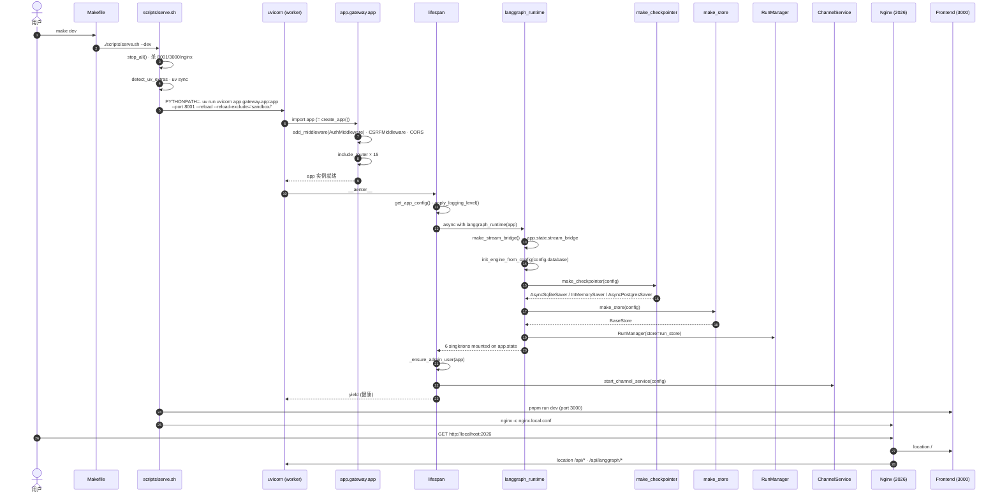

# 01 · 启动链路与运行时入口

> 上一章见 [00-overview.md](./00-overview.md)。这一章回答一个朴素的问题：当我在项目根目录敲下 `make dev` 之后，到底发生了什么？哪几个进程被拉起？请求是怎么从浏览器一路走到 LangGraph Agent 的？

---

## 1. 模块定位（Why this matters）

deer-flow 是一个 **"三进程 + 一张 LangGraph 图"** 的系统：

| 进程 | 端口 | 角色 |
|------|------|------|
| Nginx | 2026 | 反向代理（同源入口） |
| Gateway（FastAPI + uvicorn） | 8001 | REST API + LangGraph 兼容运行时 |
| Frontend（Next.js） | 3000 | 用户界面 |

很多人读 deer-flow 时第一个迷惑点是：**LangGraph 运行时到底独立部署、还是嵌在 Gateway 里？** 答案是后者——`make dev` 模式下根本没有独立的 `langgraph dev` 进程，整个 LangGraph 兼容层是 Gateway 内部用 `RunManager + run_agent + StreamBridge` 自己造出来的（见 [`packages/harness/deerflow/runtime/`](../packages/harness/deerflow/runtime/)）。Nginx 只是把 `/api/langgraph/*` 改写到 Gateway 的 `/api/*` 上。

不读这部分会错过 3 个关键认知：

1. **`langgraph.json` 不是配置文件，它是装配点**：里头的 `graphs / auth / checkpointer` 三个字段，分别决定了"哪个函数被当成图入口"、"谁来鉴权"、"哪个 Saver 承担 state 持久化"，并且这三者必须由 Gateway 启动时主动接入。
2. **uvicorn `--reload` 的边界很重要**：sandbox 目录、`.deer-flow/` 数据目录都被排除了热重载——否则一次 agent 跑完就触发 reload，状态全丢。
3. **lifespan 钩子 = 控制反转**：所有"全局单例"（StreamBridge、Checkpointer、RunManager、Store、ThreadStore、FeedbackRepository、ChannelService）都通过 `AsyncExitStack` 在 lifespan 里按依赖顺序构造和销毁。这是 deer-flow 的**真正启动顺序**。

对应到 Harness 六要素：本章主要给你打下 **"工具集成 + 可观测性"** 这两条骨架——后续每一章的中间件、工具、追踪点，都是挂载到这套 lifespan 单例上的。

---

## 2. 源码地图（Source Map）

### 2.1 关键文件清单（按调用顺序排列）

| 路径 | 角色 |
|------|------|
| [`Makefile`](../../Makefile)（根） | `make dev` → `scripts/serve.sh --dev` |
| [`scripts/serve.sh`](../../scripts/serve.sh) | 编排 Gateway / Frontend / Nginx 三进程 |
| [`docker/nginx/nginx.local.conf`](../../docker/nginx/nginx.local.conf) | 端口 2026 + 路由表 |
| [`backend/Makefile`](../Makefile) | 单独跑后端：`make gateway` / `make dev` |
| [`backend/langgraph.json`](../langgraph.json) | LangGraph 装配点（graphs / auth / checkpointer） |
| [`backend/app/gateway/app.py`](../app/gateway/app.py) | FastAPI 入口、`lifespan`、`create_app` |
| [`backend/app/gateway/deps.py`](../app/gateway/deps.py) | `langgraph_runtime()` 异步上下文 + 单例 Getter |
| [`backend/app/gateway/langgraph_auth.py`](../app/gateway/langgraph_auth.py) | 兼容 LangGraph Studio 的 JWT/CSRF 鉴权 |
| [`backend/packages/harness/deerflow/runtime/checkpointer/async_provider.py`](../packages/harness/deerflow/runtime/checkpointer/async_provider.py) | `make_checkpointer()` 异步工厂 |
| [`backend/packages/harness/deerflow/agents/lead_agent/agent.py`](../packages/harness/deerflow/agents/lead_agent/agent.py) | `make_lead_agent(config)` 图入口 |

### 2.2 关键符号速查表

| 符号 | 文件:行 | 一句话职责 |
|------|---------|-----------|
| `make dev` | `Makefile:116` | 调 `scripts/serve.sh --dev` |
| `stop_all()` | `scripts/serve.sh:74` | 按进程名 + 端口双重杀进程 |
| `run_service()` | `scripts/serve.sh:231` | nohup + 端口探活包装 |
| `app = create_app()` | `app/gateway/app.py:385` | uvicorn 实际导入的对象 |
| `lifespan(app)` | `app/gateway/app.py:161` | 启动/关闭钩子的总入口 |
| `langgraph_runtime(app)` | `app/gateway/deps.py:42` | 6 个单例的 AsyncExitStack 装配 |
| `make_stream_bridge(config)` | `deerflow/runtime/stream_bridge/async_provider.py` | SSE 桥 |
| `make_checkpointer(config)` | `deerflow/runtime/checkpointer/async_provider.py:125` | 选 memory / sqlite / postgres |
| `make_store(config)` | `deerflow/runtime/store/async_provider.py` | LangGraph Store（per-thread KV） |
| `make_run_event_store(cfg)` | `deerflow/runtime/events/store/__init__.py` | 事件落库（jsonl / db / memory） |
| `RunManager(store=...)` | `deerflow/runtime/runs/manager.py:50` | 业务侧 Run 生命周期管家 |
| `make_lead_agent(config)` | `deerflow/agents/lead_agent/agent.py:343` | LangGraph 兼容的图工厂 |
| `auth` | `app/gateway/langgraph_auth.py:25` | LangGraph SDK 的 `Auth()` 实例 |
| `AuthMiddleware` | `app/gateway/auth_middleware.py:??` | FastAPI 全局认证闸门（fail-closed） |
| `CSRFMiddleware` | `app/gateway/csrf_middleware.py:??` | Double-Submit-Cookie CSRF |

### 2.3 启动时序图

下面这张图把"`make dev` 到第一个请求能跑"这条链完整画出来。每一个方块都能在源码里找到对应行号。



> 第 11–12 步是新人常踩的坑：`add_middleware` 的注册顺序是**反向应用**的（Starlette 约定），所以 `AuthMiddleware` 先 add → 最外层；`CSRFMiddleware` 后 add → 更靠内。看 `app.py:308-311` 这两行即可印证。

### 2.4 请求路由全景

```mermaid
flowchart LR
    Browser([浏览器]) -->|http://localhost:2026/...| Nginx[Nginx :2026]
    Nginx -->|location /| Front[Next.js :3000]
    Nginx -->|location /api/langgraph/<br/>rewrite → /api/| GW[Gateway :8001]
    Nginx -->|location /api/threads/.../uploads<br/>client_max_body_size 100M| GW
    Nginx -->|location /api/...<br/>fallback| GW
    GW --> AuthMW[AuthMiddleware<br/>fail-closed]
    AuthMW --> CSRFMW[CSRFMiddleware<br/>Double Submit Cookie]
    CSRFMW --> Router{FastAPI Router}
    Router -->|/api/v1/auth/*| AuthRouter
    Router -->|/api/threads/{id}/runs/*| ThreadRuns
    Router -->|/api/runs/stream| StatelessRuns
    ThreadRuns --> RM[RunManager]
    RM --> Worker[run_agent worker]
    Worker --> Agent[make_lead_agent → CompiledStateGraph]
    Worker --> Bridge[StreamBridge.publish]
    Bridge --> SSE[SSE → 浏览器]
```

源码佐证：路由表见 `docker/nginx/nginx.local.conf:39-237`；FastAPI 中间件注册见 `app/gateway/app.py:308-324`；router 注册见 `app/gateway/app.py:326-370`。

---

## 3. 核心逻辑精读（Deep Dive）

下面挑 5 段最关键的代码逐行讲。

### 3.1 `make dev` → uvicorn 启动行

```bash
# scripts/serve.sh:256
run_service "Gateway" \
    "cd backend && PYTHONPATH=. uv run uvicorn app.gateway.app:app --host 0.0.0.0 --port 8001 $GATEWAY_EXTRA_FLAGS > ../logs/gateway.log 2>&1" \
    8001 30
```

**关键点**：

1. `PYTHONPATH=.`：把 `backend/` 加入 sys.path，让 `app.gateway.app` 和 `deerflow.*`（通过 `packages/harness/` 的 hatch wheel） 同时可被导入。删掉这行，启动会立刻 `ModuleNotFoundError`。
2. `uv run uvicorn ...`：用 [uv](https://docs.astral.sh/uv/) 解析虚拟环境而不是直接 `python -m uvicorn`。`uv sync --all-packages` 已经把 `packages/harness/` 作为可编辑包安装。
3. `$GATEWAY_EXTRA_FLAGS` 来自 `scripts/serve.sh:131-135`：

   ```bash
   if $DEV_MODE && ! $DAEMON_MODE; then
       GATEWAY_EXTRA_FLAGS="--reload --reload-include='*.yaml' --reload-include='.env' \
                            --reload-exclude='*.pyc' --reload-exclude='__pycache__' \
                            --reload-exclude='sandbox/' --reload-exclude='.deer-flow/'"
   ```

   **为什么这么写？** sandbox 在工作时会往 `backend/.deer-flow/users/.../workspace/` 里大量读写。如果不排除，agent 调用 `write_file` 一次就会触发 uvicorn 全量 reload，状态全丢（因为 LangGraph 的 `InMemorySaver` 默认是进程内的）。

4. `wait-for-port.sh 8001 30`：30 秒超时，端口探活失败就 `tail -20 logs/gateway.log` 然后 cleanup。这是 deer-flow 的**第一道可观测性**——启动卡住时直接看 `logs/gateway.log`。

**值得借鉴的工程技巧**：`run_service` 函数（`serve.sh:231`）把 nohup + 探活 + 日志兜底封装成统一 API，三个服务（Gateway / Frontend / Nginx）共用一套生命周期管理，避免到处 `&` 加 `sleep`。

**可能的改进空间**：探活只看 TCP 端口，看不到 `/health` 是否真的 200。如果 lifespan 卡在 `make_checkpointer`（例如 PostgreSQL 不可达），端口可能已开但请求会一直 503。

### 3.2 `lifespan` 钩子的执行顺序

```python
# app/gateway/app.py:161
@asynccontextmanager
async def lifespan(app: FastAPI) -> AsyncGenerator[None, None]:
    # ① 加载配置（任何后续逻辑都要靠 app.state.config）
    try:
        app.state.config = get_app_config()
        apply_logging_level(app.state.config.log_level)
        logger.info("Configuration loaded successfully")
    except Exception as e:
        error_msg = f"Failed to load configuration during gateway startup: {e}"
        logger.exception(error_msg)
        raise RuntimeError(error_msg) from e
    config = get_gateway_config()
    logger.info(f"Starting API Gateway on {config.host}:{config.port}")

    # ② 装配 6 个 LangGraph 运行时单例（StreamBridge / Checkpointer / Store / RunManager / 等）
    async with langgraph_runtime(app):
        logger.info("LangGraph runtime initialised")

        # ③ 第一次启动时打印 /setup 提示；后续启动时迁移 orphan thread 到 admin
        #    必须放在 langgraph_runtime() 之后，因为 _migrate_orphaned_threads
        #    需要 app.state.store
        await _ensure_admin_user(app)

        # ④ 如果 config 中配了 IM Channel，启动 channel service（Feishu / Slack / ...）
        try:
            from app.channels.service import start_channel_service
            channel_service = await start_channel_service(app.state.config)
            logger.info("Channel service started: %s", channel_service.get_status())
        except Exception:
            logger.exception("No IM channels configured or channel service failed to start")

        yield  # ⑤ 应用进入"服务请求"阶段

        # ⑥ Shutdown：channel service 关停有 5s 超时
        try:
            from app.channels.service import stop_channel_service
            await asyncio.wait_for(stop_channel_service(), timeout=_SHUTDOWN_HOOK_TIMEOUT_SECONDS)
        except TimeoutError:
            logger.warning("Channel service shutdown exceeded %.1fs; proceeding with worker exit.",
                           _SHUTDOWN_HOOK_TIMEOUT_SECONDS)
```

**注意 3 个细节**：

1. **顺序敏感**：步骤 ③ 必须在 `langgraph_runtime` 之后，因为它要读 `app.state.store`。`app.py:181-182` 的注释明确写了。
2. **`yield` 之前 vs 之后**：之前是 startup、之后是 shutdown。shutdown 路径用 `asyncio.wait_for(..., timeout=5.0)` 包了 channel service 的关闭，防止 uvicorn `--reload` 的 worker 卡死。这个 5 秒的来源是 `app.py:48` 的 `_SHUTDOWN_HOOK_TIMEOUT_SECONDS`。
3. **从来不 catch 配置异常**：步骤 ① 里只 catch、re-raise（带可读化的 `RuntimeError`），让 uvicorn 直接退出——这是正确做法，因为 `app.state.config` 缺失之后跑啥都是错的。

### 3.3 `langgraph_runtime` 的 6 个单例

```python
# app/gateway/deps.py:42
@asynccontextmanager
async def langgraph_runtime(app: FastAPI) -> AsyncGenerator[None, None]:
    from deerflow.persistence.engine import close_engine, get_session_factory, init_engine_from_config
    from deerflow.runtime import make_store, make_stream_bridge
    from deerflow.runtime.checkpointer.async_provider import make_checkpointer
    from deerflow.runtime.events.store import make_run_event_store

    async with AsyncExitStack() as stack:
        config = getattr(app.state, "config", None)
        if config is None:
            raise RuntimeError("langgraph_runtime() requires app.state.config to be initialized")

        # 1. SSE 桥
        app.state.stream_bridge = await stack.enter_async_context(make_stream_bridge(config))

        # 2. 初始化 SQLAlchemy 引擎（必须在 checkpointer 之前，postgres 后端会自动建库）
        await init_engine_from_config(config.database)

        # 3. LangGraph Checkpointer（state 持久化）
        app.state.checkpointer = await stack.enter_async_context(make_checkpointer(config))

        # 4. LangGraph Store（per-thread KV，供工具/中间件读写）
        app.state.store = await stack.enter_async_context(make_store(config))

        # 5. 业务侧仓库（Run / Feedback / ThreadMeta）
        sf = get_session_factory()
        if sf is not None:
            from deerflow.persistence.feedback import FeedbackRepository
            from deerflow.persistence.run import RunRepository
            app.state.run_store = RunRepository(sf)
            app.state.feedback_repo = FeedbackRepository(sf)
        else:
            from deerflow.runtime.runs.store.memory import MemoryRunStore
            app.state.run_store = MemoryRunStore()
            app.state.feedback_repo = None
        from deerflow.persistence.thread_meta import make_thread_store
        app.state.thread_store = make_thread_store(sf, app.state.store)

        # 6. 事件存储（用于 trace / journal）
        run_events_config = getattr(config, "run_events", None)
        app.state.run_event_store = make_run_event_store(run_events_config)

        # 7. RunManager 装配上面的 store
        app.state.run_manager = RunManager(store=app.state.run_store)

        try:
            yield
        finally:
            await close_engine()
```

**精妙之处**：

- **`AsyncExitStack` 而不是手写 try/finally**：所有 `enter_async_context` 注册的资源会按 LIFO 顺序在 stack 退出时自动 `__aexit__`。如果 step 5 失败，step 1-4 也会被干净地清理。这比 `asynccontextmanager` 嵌套 5 层可读得多。
- **`make_*` 是异步上下文管理器，不是普通函数**：例如 `make_checkpointer` 返回的是 `@contextlib.asynccontextmanager` 装饰的工厂，背后是 `AsyncSqliteSaver.from_conn_string(...)` 这种需要长连接的资源。
- **降级有兜底**：当 `get_session_factory()` 返回 `None`（即没配 database），`run_store` 自动降级到 `MemoryRunStore`；`feedback_repo` 降级到 `None`，使用方 `_require("feedback_repo", ...)` 会让对应 endpoint 直接返回 503。**绝不让请求悄悄"成功"但其实没存储**。

**对比常见替代方案**：

- 如果用 `@app.on_event("startup")` / `"shutdown"`（FastAPI 0.65 之前的方式），这种"按序构造、按反序销毁"的语义就要靠手写 list + try/finally 实现，且不能享受异常自动传播。
- 如果用 module-level 单例（`module._checkpointer = AsyncSqliteSaver(...)`），就没法在测试里替换 mock，也没法在 `--reload` 之后干净地重建。

### 3.4 `langgraph.json` 的三个挂载点

```json
{
  "$schema": "https://langgra.ph/schema.json",
  "python_version": "3.12",
  "dependencies": ["."],
  "env": ".env",
  "graphs": {
    "lead_agent": "deerflow.agents:make_lead_agent"
  },
  "auth": {
    "path": "./app/gateway/langgraph_auth.py:auth"
  },
  "checkpointer": {
    "path": "./packages/harness/deerflow/runtime/checkpointer/async_provider.py:make_checkpointer"
  }
}
```

**为什么这是装配点而不是配置？**

- LangGraph CLI / Studio 启动时**直接 import 这三个变量**：
  - `make_lead_agent` 必须满足签名 `(config: RunnableConfig) -> CompiledStateGraph`。
  - `auth` 必须是 `langgraph_sdk.Auth` 的实例（见 `app/gateway/langgraph_auth.py:25`）。
  - `make_checkpointer` 必须是 `@asynccontextmanager` 的工厂（见 `async_provider.py:125`）。
- **deer-flow 的设计很狡猾**：`make dev` 模式根本不跑 `langgraph dev` CLI——它跑的是 Gateway 的 uvicorn，Gateway 内部用同一个 `make_lead_agent` 装配出 agent、用同一个 `make_checkpointer` 装配出 saver。这就把 LangGraph Studio 兼容性和 Gateway 嵌入运行时**用同一段代码**实现了。
- `langgraph_auth.py:25` 那个 `auth = Auth()` 只在 LangGraph Server / Studio 走兼容路径时才生效；Gateway 模式走的是 `AuthMiddleware`（`app/gateway/auth_middleware.py`）。两者都校验同一份 JWT、同一份 CSRF（见 `langgraph_auth.py:_check_csrf`），所以双轨不会漂移。

**作者的工程权衡**：完全可以让 Gateway 直接 spawn 一个 `langgraph dev` 子进程，但那样会引入 2 个进程间的协议（thread/run 协议、SSE 协议），调试和部署都更难。当前做法相当于在 Gateway 里"再实现一个最小可用 LangGraph Server"（`packages/harness/deerflow/runtime/`），代价是要自己维护 RunManager / StreamBridge / Worker 三件套（共 ~1800 行），收益是单进程、热重载、Trace 一致。

### 3.5 `make_lead_agent` 作为图入口

```python
# packages/harness/deerflow/agents/lead_agent/agent.py:343
def make_lead_agent(config: RunnableConfig):
    """LangGraph graph factory; keep the signature compatible with LangGraph Server."""
    runtime_config = _get_runtime_config(config)
    runtime_app_config = runtime_config.get("app_config")
    return _make_lead_agent(config, app_config=runtime_app_config or get_app_config())
```

**注意**：

1. 签名 `(config: RunnableConfig)`——这是 LangGraph CLI/Studio 的硬性合同。
2. 但内部又允许 `runtime_config["app_config"]` 覆盖全局 `AppConfig`，这是 **per-request 配置注入** 的入口。Gateway 内部的 `run_agent` worker 会通过 `config["configurable"]` 把当前请求级的 `AppConfig` 塞进来，从而实现"同一进程跑不同租户配置"（后续 02、03 篇详谈）。
3. `make_lead_agent` 是**纯函数**：每次请求都重新构造图。对 deer-flow 这种动态启用/关闭中间件的设计来说是必须的——例如 `is_plan_mode`、`subagent_enabled` 在每个请求里都可能不同，图结构也跟着变。

**对比方案**：很多 LangGraph 项目把图在模块加载时一次构造（`graph = builder.compile()`），然后 import 进来。那种写法的代价是图结构固定，没法做"按请求开关中间件"。deer-flow 用工厂函数换来动态性，付出的代价是每次请求都要重跑一遍 `_build_middlewares()`（见 `agent.py:240`）——但实际上中间件实例只是装配开销，远小于 LLM 调用，可以接受。

---

## 4. 关键问题答疑（Key Questions）

### Q1：`make dev` 一共起了几个进程？怎么验证？

**3 个**：Gateway（uvicorn）、Frontend（pnpm/Next.js）、Nginx。验证：

```bash
lsof -iTCP -sTCP:LISTEN | grep -E '(2026|3000|8001)'
# COMMAND   PID
# nginx     ...    127.0.0.1:2026
# next-server ...  127.0.0.1:3000
# python    ...    127.0.0.1:8001   ← uvicorn worker
```

**注意**：如果开了 `aio_sandbox` 模式，每个 thread 第一次跑工具时还会拉起一个 Docker 容器，那是动态进程，不算 Gateway 启动时拉起的。

### Q2：reload 模式下，为什么改 `.deer-flow/` 不会触发重启？改 `*.yaml` 反而会？

看 `scripts/serve.sh:132`：

```
--reload-include='*.yaml' --reload-include='.env'
--reload-exclude='*.pyc' --reload-exclude='__pycache__'
--reload-exclude='sandbox/' --reload-exclude='.deer-flow/'
```

`.deer-flow/` 是 thread 工作区（`backend/.deer-flow/users/{user_id}/threads/{thread_id}/user-data/...`），agent 跑工具时会高频写入；`sandbox/` 是 Docker 沙箱可能落盘的位置。两者都排除。`*.yaml` 走 include 是因为 `config.yaml` 改了需要立刻生效（虽然 `AppConfig` 本身也带 mtime 缓存——见 03 篇）。

### Q3：lifespan 启动顺序里，为什么 `init_engine_from_config` 必须在 `make_checkpointer` 之前？

看 `deps.py:62-66` 的注释：

> Initialize persistence engine BEFORE checkpointer so that auto-create-database logic runs first (postgres backend).

`init_engine_from_config` 会在 postgres 后端下自动建库（`CREATE DATABASE IF NOT EXISTS ...`）。如果 `make_checkpointer` 先跑，它会用 `AsyncPostgresSaver.from_conn_string(...)` 直接连库，目标库不存在就报错。

### Q4：`AuthMiddleware` 和 `langgraph_auth.py` 里的 `Auth()` 是什么关系？

- 两者**都校验同一份 JWT** + 同一份 CSRF。
- `AuthMiddleware`（`app.py:308`）是 FastAPI 路径上的全局闸门，所有请求都过它。
- `langgraph_auth.py:auth` 只在 LangGraph SDK / Studio 走兼容路径时才生效（即不通过 FastAPI router、直接走 LangGraph Server 的请求）。
- 两套代码都调用同一个 `decode_token` + `get_local_provider().get_user(...)`（见 `langgraph_auth.py:22-23, 76, 83`），所以行为一致。

### Q5：如果我只想跑后端调试，不要 Nginx + Frontend，怎么办？

```bash
cd backend
make gateway   # = uvicorn app.gateway.app:app --host 0.0.0.0 --port 8001
```

见 `backend/Makefile:7-8`。然后所有 API 直接打 `http://localhost:8001`（不需要 `/api/langgraph/` 前缀——那是 Nginx 的改写，不是 Gateway 的真实路由）。

### Q6：什么时候用 `make start` 而不是 `make dev`？

看 `scripts/serve.sh:131-135`：dev 模式开 `--reload`，prod 模式没有。prod 模式还会用 `pnpm run preview` 加上随机生成的 `BETTER_AUTH_SECRET`，跑预构建的前端。**长跑测试或 benchmark 时一定用 `make start`**，否则 reload 进程会干扰性能数据。

---

## 5. 横向延伸与面试级洞察（Interview-Grade Insights）

### 5.1 单进程 vs 双进程：deer-flow 的取舍

| 方案 | 代表 | 优点 | 缺点 |
|------|------|------|------|
| **进程 A：Gateway + LangGraph Server 同进程**（deer-flow） | deer-flow 当前架构 | 一致的 Trace、共享 state、热重载只刷一次 | 必须自己实现 RunManager / StreamBridge / Worker |
| **进程 B：Gateway + 独立 `langgraph dev`** | LangGraph 官方 Quickstart | 用 SDK 现成实现 | 双进程通信、双份配置、双份认证 |

deer-flow 选了 A。结果就是 `packages/harness/deerflow/runtime/` 那 ~1800 行 worker/manager/bridge 是它"自造的 LangGraph Server 缩水版"。**面试时可以讲："deer-flow 把 LangGraph Server 嵌入到 Gateway 进程内，用 AsyncExitStack 统一管理 6 个运行时单例，换来了单进程热重载和 Trace 一致性，代价是自己维护 RunManager/StreamBridge。"**

### 5.2 `AsyncExitStack` 这个写法在多智能体系统里为什么是好范式

LangChain / LangGraph 生态里大量的 Saver、Store、Bridge 都是异步上下文管理器。如果一个项目要装配 N 个，传统的 try/finally 嵌套 N 层是噩梦——既不可读，也无法在中间任意失败时优雅清理。`AsyncExitStack`：

1. **失败原子性**：第 5 个 enter 失败时，前 4 个自动按 LIFO 撤销。
2. **可读性**：所有依赖在同一个块里平铺，依赖关系靠注释表达。
3. **可测试性**：测试时只需 mock `make_*` 工厂返回 `MagicMock` 即可。

这正是 LangGraph 官方在 [LangGraph Platform 的 server 装配](https://langchain.com/langgraph-platform) 里用的同一套范式。**deer-flow 在 `deps.py:42-97` 那 56 行代码，是这类大型 Agent 系统最干净的范式之一。**

### 5.3 vs AutoGen / CrewAI

- **AutoGen** 没有"图"概念，是 message-passing 框架；启动模型一般是 `python -m autogen.app`，没有标准化的 lifespan 与 reverse proxy。
- **CrewAI** 类似，是 task-based 编排，没有 LangGraph 风格的 state 复用，自然也没必要装这套 lifespan 体系。
- **LangGraph 官方示例** 一般也只 demo 单文件 `compile()`，没有把 Gateway / Studio / Checkpointer 三方拧成一根线的工程例子。

> **面试金句**：deer-flow 是少数把 LangGraph 当成"运行时基座"而不是"图编排库"来用的开源项目，`langgraph.json` 的 `graphs / auth / checkpointer` 三个挂载点，是它向 LangGraph Studio 输出兼容性同时又复用 Gateway 单例的关键合同。

---

## 6. 实操教程（Hands-on Lab）

### 6.1 最小可运行示例：直接调 `make_lead_agent`

下面这段不依赖 Gateway / Nginx / Frontend，纯 Python 验证"图能跑起来"。在 `backend/` 下保存为 `debug_smoke.py` 并 `uv run python debug_smoke.py`：

```python
# backend/debug_smoke.py
import asyncio
from langgraph.checkpoint.memory import InMemorySaver

from deerflow.agents import make_lead_agent


async def main():
    # 1. 构造 LangGraph 入口需要的 RunnableConfig
    config = {
        "configurable": {
            "thread_id": "smoke-001",
            "subagent_enabled": False,
            "is_plan_mode": False,
            # 让 _resolve_model_name 走 config.yaml 的默认模型
            "model_name": None,
        }
    }
    # 2. make_lead_agent 是同步函数（返回 CompiledStateGraph）
    agent = make_lead_agent(config)
    # 3. 手动塞个 checkpointer（Gateway 模式下由 lifespan 注入）
    agent.checkpointer = InMemorySaver()

    # 4. 一次最小对话
    result = await agent.ainvoke(
        {"messages": [{"role": "user", "content": "你好，用一句话自我介绍。"}]},
        config=config,
    )
    print("AI:", result["messages"][-1].content)


if __name__ == "__main__":
    asyncio.run(main())
```

**预期观察**：

- 终端打印一行 AI 的自我介绍。
- 同时在 logs（或控制台）能看到 `Create Agent(default) -> thinking_enabled=..., reasoning_effort=..., model_name=...` 的日志，这是 `agent.py:383-392` 的 `logger.info`。

### 6.2 Debug 任务清单

#### 实验 ①：观察 `lifespan` 6 单例的构造顺序

1. 在 `app/gateway/deps.py:60` 那一行（`make_stream_bridge`）之前加一行 `import pdb; pdb.set_trace()`。
2. 跑 `cd backend && make gateway`。
3. 在 pdb 里用 `p type(stack)`、`n`、`p app.state.__dict__.keys()` 逐步观察 6 个单例如何依次挂上 `app.state`。
4. **能学到**：`AsyncExitStack` 的失败原子性——故意把 `make_checkpointer` 改成 `raise RuntimeError("boom")`，看 `stream_bridge` 是否被正确 `__aexit__`（在 bridge 内部加日志验证）。

#### 实验 ②：观察 `--reload` 的真实边界

1. 跑 `make dev`。
2. 在 `backend/.deer-flow/` 下创建任意一个 `.py` 文件，观察 uvicorn 是否 reload（**应该不会**，因为 exclude 了）。
3. 把同一个文件创建到 `packages/harness/deerflow/agents/` 下，观察是否 reload（**应该会**）。
4. 修改根目录的 `config.yaml`（例如改 `log_level`），观察是否 reload（**应该会**，include=`*.yaml`）。

#### 实验 ③：手动验证 Nginx 路由表

1. 跑 `make dev` 起完所有服务。
2. 用 `curl` 验证 5 个 location：
   ```bash
   # 同源同 Origin 不会被 CSRF 拒
   curl -i http://localhost:2026/health        # → 经 Nginx 转到 Gateway，200
   curl -i http://localhost:8001/health        # → 直连 Gateway，200
   curl -i http://localhost:2026/api/models     # → Nginx /api/models block → Gateway
   curl -i http://localhost:2026/api/langgraph/threads -X GET  # → rewrite 到 /api/threads
   curl -i http://localhost:2026/                 # → 转给 Frontend
   ```
3. **能学到**：nginx 的 `rewrite ^/api/langgraph/(.*) /api/$1 break` 是 path rewrite 而不是 redirect，浏览器侧 URL 不变，Gateway 侧收到的是 `/api/...`。

---

## 7. 与下一模块的衔接

读完本章你应该已经能：

- 在脑子里画出"`make dev` → 3 进程 → 路由 → LangGraph 图"这条主链路。
- 在 `app.py` / `deps.py` 里准确指出每个单例的装配位置。
- 区分 Gateway 嵌入运行时 vs LangGraph Studio 兼容路径。

但你还**没看到**两件事：

1. 为什么 `packages/harness/` 和 `app/` 是**严格单向依赖**？这条边界是如何在 CI 里物理强制的？
2. `app_config = get_app_config()` 背后的 26 份子配置如何组合？为什么 `$ENV_VAR` 解析、mtime 失效、反射加载放在一个类里？

这两点是 **02 篇（Harness ↔ App 双层架构与导入边界）** 和 **03 篇（配置体系：AppConfig + ExtensionsConfig + 反射装配）** 的核心。02 篇会用 `tests/test_harness_boundary.py` 这段 AST 扫描代码作为线索，讲清楚 deer-flow 为什么花这么大力气维护这条边界。

---

📌 **本章已交付**。请你检查后告诉我：
- 哪几段读起来不顺？
- 是否需要补某个角度（例如想看 Docker 模式的启动链路 vs 本地模式的差异）？
- 还是直接进入 02 篇？
