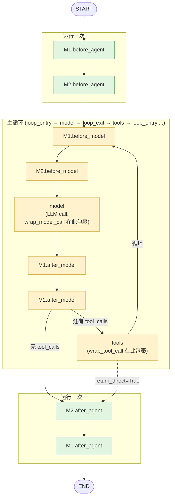
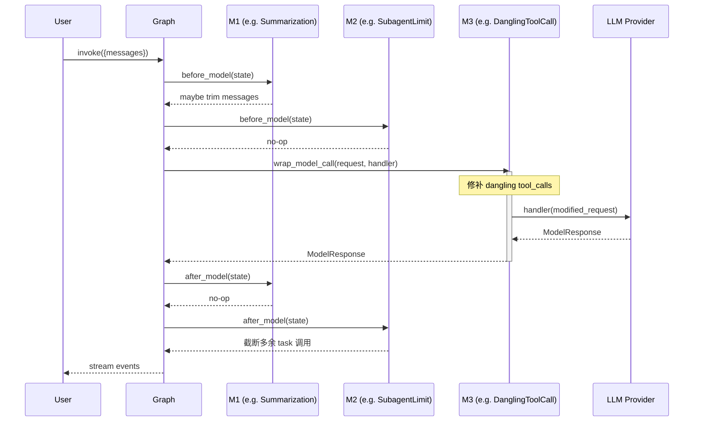

# 02 · LangChain `create_agent` + AgentMiddleware 协议深讲

> 这是路线的"内功打底"章，**篇幅有意写长**。你只跑过 LangGraph 文档 demo，这一份要让你跳到"能读懂任何基于 `create_agent` 的开源 Agent 项目"的水平。
>
> 采用 **C 方案**：源码逐行解读 `langchain.agents.factory:create_agent` 的图构造 + 对比 `langgraph.prebuilt.create_react_agent` + DeerFlow 真实中间件 walkthrough。

> **⚠️ 重要纠错**：DeerFlow `CLAUDE.md` 和我之前的 overview 都说 AgentMiddleware 是"5 个钩子"且包含 `modify_model_request`。**这是过期信息**。本仓库实际依赖的 **LangChain 1.2.15** 把 `modify_model_request` 重命名为 `wrap_model_call`（around 模式），且新增了 `wrap_tool_call`。**实际是 6 个钩子**。这种"框架版本变快、文档跟不上"的细节是面试官最爱挖的坑 —— 本章会逐一对照。

---

## 🎯 学习目标

读完这份文档，你能回答：

1. `create_agent(model, tools, middleware, system_prompt, state_schema)` 内部展开成一张什么样的 `StateGraph`？它和你之前手写 `StateGraph + add_node + add_edge` 的关系是什么？
2. **AgentMiddleware 的 6 个钩子**（`before_agent` / `before_model` / `wrap_model_call` / `after_model` / `after_agent` / `wrap_tool_call`）各自在 graph 里被装成哪种"节点 + 边"？它们的"洋葱模型"具体是怎么实现的？
3. `create_agent`（LangChain 1.2，可插拔中间件）和 `create_react_agent`（LangGraph prebuilt，固定 ReAct 循环）的本质差异是什么？什么时候用哪个？
4. DeerFlow 为什么用 `after_model` 实现 `SubagentLimitMiddleware`、用 `wrap_tool_call` 实现 `ClarificationMiddleware`、用 `wrap_model_call` 实现 `DanglingToolCallMiddleware`？**钩子选错了会出什么 bug？**

---

## 🗂️ 源码定位

| 关注点 | 文件 | 关键符号 / 行号 |
|---|---|---|
| `create_agent` 工厂函数（1869 行） | `langchain/agents/factory.py`（已安装：`.venv/.../langchain/agents/factory.py`） | `create_agent` L684；`model_node` L1296；`amodel_node` L1344；图构造 L1365-L1601 |
| AgentMiddleware 基类与钩子 | `langchain/agents/middleware/types.py` | `AgentMiddleware` L380；`before_agent` L406；`before_model` L430；`after_model` L454；`wrap_model_call` L478；`after_agent` L625；`wrap_tool_call` L649 |
| LangGraph prebuilt 对照组 | `langgraph/prebuilt/chat_agent_executor.py` | `create_react_agent`（**已被官方标记为偏向 DSL，新代码推荐用 LangChain `create_agent`**） |
| DeerFlow 中间件总入口 | `packages/harness/deerflow/agents/lead_agent/agent.py` | `_make_lead_agent` L350；`_build_middlewares` L240；`create_agent(...)` 调用 L416 / L434 |
| 钩子用法范例（DeerFlow） | `packages/harness/deerflow/agents/middlewares/` | `subagent_limit_middleware.py`（`after_model`）；`summarization_middleware.py`（`before_model`）；`dangling_tool_call_middleware.py`（`wrap_model_call`）；`clarification_middleware.py`（`wrap_tool_call`）；`view_image_middleware.py`（`before_model`） |

---

## 🧭 架构图

### 1. `create_agent` 实际构造的 StateGraph 拓扑（这张图请反复看）



> **关键不变量**：
> - `before_agent` / `after_agent` 各**只跑一次**（进入图 / 离开图）
> - `before_model` / `after_model` 每个 LLM 迭代都跑（tool 调用循环时反复跑）
> - `wrap_model_call` 不是独立节点，它是 `model` 节点**内部**的洋葱包裹器（同理 `wrap_tool_call` 包裹 `tools` 节点）

### 2. 洋葱模型（执行栈视角）



---

## 🔍 核心逻辑讲解（源码逐行）

### Part 1 · `create_agent` 内部到底做了什么？

> 文件：`.venv/.../langchain/agents/factory.py`，函数 `create_agent` 从 L684 开始，主体 L1020 起进入图构造逻辑。我们摘出**最具决定性**的几段，逐段解释。

#### Step 1 · 收集状态 schema（L1020）

```python
# Use provided state_schema if available, otherwise use base AgentState
base_state = state_schema if state_schema is not None else AgentState
```

- 你传给 `create_agent` 的 `state_schema=ThreadState`（DeerFlow 的扩展）就在这里被采纳。
- 中间件也可以**自带 state_schema**（`AgentMiddleware.state_schema`），LangChain 会把所有中间件的 schema **合并**到 base_state 上，做去重 + 字段并集（L412 `_resolve_schema`）。这就是为什么 DeerFlow 的 `TitleMiddleware` 能定义自己的 `TitleMiddlewareState` 而不需要污染全局 `ThreadState`。

#### Step 2 · 构造 `model` 节点（L1296-L1365）

```python
def model_node(state: AgentState[Any], runtime: Runtime[ContextT]) -> list[Command[Any]]:
    # 1. 构建 ModelRequest:把 system_prompt + messages + tools 拼好
    # 2. 应用 wrap_model_call 洋葱链(由 _chain_model_call_handlers 组装)
    # 3. 调用 LLM.invoke(...)
    # 4. 把响应包成 Command(update=...) 返回给 graph
    ...

async def amodel_node(...): ...   # async 版本

graph.add_node("model", RunnableCallable(model_node, amodel_node, trace=False))
```

**关键洞察**：`model_node` 是个**单一节点**，但内部用 `_chain_model_call_handlers`（L219）把所有 `wrap_model_call` 钩子组成洋葱链 —— 这就是为什么 `wrap_model_call` 在 mermaid 图里没有独立节点框。

#### Step 3 · 为每个中间件添加可见节点（L1372-L1453）

这是整个 factory 最精彩的一段。简化版伪代码：

```python
for m in middleware:
    if m.__class__.before_agent is not AgentMiddleware.before_agent:
        graph.add_node(f"{m.name}.before_agent", RunnableCallable(m.before_agent, m.abefore_agent))

    if m.__class__.before_model is not AgentMiddleware.before_model:
        graph.add_node(f"{m.name}.before_model", ...)

    if m.__class__.after_model is not AgentMiddleware.after_model:
        graph.add_node(f"{m.name}.after_model", ...)

    if m.__class__.after_agent is not AgentMiddleware.after_agent:
        graph.add_node(f"{m.name}.after_agent", ...)
```

**逐字解读**：
- `m.__class__.before_agent is not AgentMiddleware.before_agent` —— 这是 LangChain 检查"子类是否**真的覆盖了**这个钩子"的方式。基类的 hook 返回 `None`（空实现），如果你的子类没动 `before_agent`，LangChain **不会**为你加一个空节点（节省图复杂度）。
- 每个 middleware 的可见节点命名为 `{m.name}.{hook}`，所以你在 LangGraph Studio / LangSmith trace 里能直接看到 `SummarizationMiddleware.before_model`、`SubagentLimitMiddleware.after_model` 这种节点。
- `RunnableCallable(sync_fn, async_fn)` 是 LangChain 的同异步双轨包装器 —— **同一个 graph 既能 `.invoke()` 又能 `.ainvoke()`**，靠的就是这一层。

#### Step 4 · 入口 / 循环 / 出口节点的选择（L1455-L1481）

```python
# 入口节点(runs once at start):优先 before_agent → before_model → model
if middleware_w_before_agent:
    entry_node = f"{middleware_w_before_agent[0].name}.before_agent"
elif middleware_w_before_model:
    entry_node = f"{middleware_w_before_model[0].name}.before_model"
else:
    entry_node = "model"

# 循环入口(tools 回流时跳回的节点):排除 before_agent
if middleware_w_before_model:
    loop_entry_node = f"{middleware_w_before_model[0].name}.before_model"
else:
    loop_entry_node = "model"

# 循环出口(每轮 model 后):优先 after_model
if middleware_w_after_model:
    loop_exit_node = f"{middleware_w_after_model[0].name}.after_model"
else:
    loop_exit_node = "model"

# 出口节点(runs once at end):优先 after_agent → END
if middleware_w_after_agent:
    exit_node = f"{middleware_w_after_agent[-1].name}.after_agent"
else:
    exit_node = END
```

**这段 25 行代码隐藏了 4 个关键设计决策**：

1. **`before_agent` 只在 entry 跑、不在 loop_entry 跑** —— 所以你**不能**用它做"每轮注入"，那是 `before_model` 的活。
2. **`loop_exit_node`** 是 `after_model` 第一个中间件（注意是 `[0]`，不是 `[-1]`）—— 因为 graph 的边连接是从 model 流向 `[0]`，再链式流到 `[-1]`。
3. **`exit_node`** 是 `after_agent` **最后一个** 中间件（`[-1]`）—— 因为整条 `after_agent` 链按"洋葱外层后跑"的顺序连接：`AA1 → AA2 → ... → END`。这就是 mermaid 图里 `M2.after_agent → M1.after_agent → END` 看似"反序"的根源。
4. **没有中间件时退化为纯 ReAct 循环** —— `START → model → (tools ↔ model) → END`，跟 `create_react_agent` 完全等价。

#### Step 5 · 条件边路由（L1495-L1545）

```python
# tools 跑完之后,回到 loop_entry 还是 exit?
graph.add_conditional_edges("tools", _make_tools_to_model_edge(...), tools_to_model_destinations)

# loop_exit 之后,继续跑 tools 还是直接 END?
graph.add_conditional_edges(loop_exit_node, _make_model_to_tools_edge(...), model_to_tools_destinations)
```

这两条**条件边**就是 ReAct 循环的"灵魂" —— `_make_model_to_tools_edge` 检查最近一条 AIMessage 是否有 `tool_calls`，有就走 tools，没有就走 END（或 `after_agent`）。

**面试常见追问**：DeerFlow 的 `ClarificationMiddleware` 怎么"提前终结"循环？答：它的 `wrap_tool_call` 拦截 `ask_clarification` 工具调用，**直接返回 `Command(goto=END)`** —— LangGraph 看到 Command 的 goto 后会跳过条件边判断直接路由。源码见 `clarification_middleware.py::_handle_clarification` L148-L156。

---

### Part 2 · AgentMiddleware 6 个钩子：精确语义对照

> **关键纠正**：本仓库依赖的 LangChain 1.2.15 已经**没有 `modify_model_request`** 了。被替换成 `wrap_model_call`（around 模式）+ 新增 `wrap_tool_call`。下表是**实测准确**的 6 钩子矩阵。

| # | 钩子 | 调用次数 | 数据流向 | 能改 messages 吗 | 能 short-circuit 吗 | DeerFlow 范例 |
|---|---|---|---|---|---|---|
| 1 | `before_agent` | **1 次** | 入口 | ✅ 返回 dict 更新 state | ❌ 不能 | （无典型用例，DeerFlow 主要用 before_model） |
| 2 | `before_model` | **每轮 1 次** | model 之前 | ✅ | ❌ | `SummarizationMiddleware`、`ViewImageMiddleware`、`TodoMiddleware`（注入提醒） |
| 3 | `wrap_model_call` | **每轮 1 次** | model **包裹** | ✅ 改 request 也可 | ✅ 可以不调 handler | `DanglingToolCallMiddleware`（补 ToolMessage 后再调）、`LLMErrorHandlingMiddleware`（捕异常归一化）、`DeferredToolFilterMiddleware`（剔除 schema） |
| 4 | `after_model` | **每轮 1 次** | model 之后 | ✅ 改 AIMessage | ✅ 返回 `Command(goto=END)` | `SubagentLimitMiddleware`（截断超额 tool_calls）、`LoopDetectionMiddleware`（hard-stop）、`TitleMiddleware`、`TokenUsageMiddleware` |
| 5 | `after_agent` | **1 次** | 出口 | ✅ | ❌ | （无典型用例） |
| 6 | `wrap_tool_call` | **每个 tool_call 一次** | tool **包裹** | ✅ | ✅ 可直接返回 `Command(goto=END)` | `ClarificationMiddleware`（拦 `ask_clarification` → END） |

#### 选钩子的核心心法（面试 + 实战通杀）

| 需求 | 该选哪个钩子？ | 为什么不能选其他？ |
|---|---|---|
| 在 LLM 调用前**改 messages**（如 trim history） | `before_model` | 用 `before_agent` 只跑 1 次；用 `wrap_model_call` 改 request 也行，但写法更繁 |
| 在 LLM 调用前后**做副作用**（埋点、计数） | `before_model` / `after_model` | 用 `wrap_model_call` 也能埋点但要包整个 handler |
| **依赖 LLM 响应再决策**（如截断、纠错、重发） | `after_model` | `before_model` 还看不到 AIMessage |
| **想把 messages 注入到 `model_node` 内部**而不暴露给 state | `wrap_model_call` 改 `request.messages` | 用 `before_model` + add_messages reducer 会泄漏到全局 state，后续步骤都能看到 —— **这正是 `DanglingToolCallMiddleware` 用 `wrap_model_call` 的原因**（见源码注释 L11-L13） |
| **拦截单个 tool 调用，根据参数决定要不要执行** | `wrap_tool_call` | `after_model` 看到的是"AIMessage 整体"，粒度太粗 |
| **跑一次性的初始化** | `before_agent` | 选错就重复跑 |

#### "为什么 `DanglingToolCallMiddleware` 一定要用 `wrap_model_call` 而不能用 `before_model`？"

这是本章**最值得记的源码注释**。打开 `dangling_tool_call_middleware.py` L7-L14：

```text
Note: Uses wrap_model_call instead of before_model to ensure patches are inserted
in the correct position within the message list, not appended to the end as
before_model + add_messages reducer would do.
```

**展开解释**：`before_model` 返回的 dict 会经过 `add_messages` reducer **追加**到 messages 末尾。但孤儿 `tool_calls` 的修复需要"在原位置后插入占位 ToolMessage"，**位置敏感**。`wrap_model_call` 修改的是发给 LLM 的 `request.messages`（不入 state），可以精确控制顺序 —— 这是个**框架行为驱动的设计选择**，不读源码注释绝对踩坑。

---

### Part 3 · 对比 `create_react_agent`（LangGraph prebuilt）

```python
# LangGraph 老路:
from langgraph.prebuilt import create_react_agent
agent = create_react_agent(model, tools)  # 没有 middleware 参数!

# LangChain 新路:
from langchain.agents import create_agent
agent = create_agent(model, tools, middleware=[...], state_schema=ThreadState, system_prompt=...)
```

**本质差异表**：

| 维度 | `create_react_agent`（LangGraph） | `create_agent`（LangChain 1.2+） |
|---|---|---|
| 图拓扑 | 固定 ReAct：`START → agent ↔ tools → END` | 可扩展：插入任意中间件节点 |
| 横切关注点 | ❌ 没办法插（你得 fork) | ✅ `AgentMiddleware` 6 个钩子 |
| State schema 扩展 | ❌ 固定 `AgentState` | ✅ `state_schema=` 任意继承 `AgentState` |
| 异步 | ✅ | ✅（`RunnableCallable` 同异步双轨） |
| 路由控制 | ❌ 只能改 model 决定下一步 | ✅ `Command(goto=...)` 可在任意钩子提前路由 |
| 流式 | ✅ | ✅（且能流式 messages-tuple 增量） |
| **现状定位** | 教学 / 简单 PoC | 生产首选 |

**面试金句**：
> "LangGraph 把图当画布，`create_react_agent` 是上面预先画好的一笔；LangChain 1.2 的 `create_agent` 是同一张画布上**带图层的画法** —— 中间件就是图层，可以加、可以删、可以排序、不冲突。"

---

### Part 4 · DeerFlow 真实中间件 walkthrough（3 个具代表性的范例）

#### 范例 A · `SubagentLimitMiddleware`（`after_model` 模式）

文件：`packages/harness/deerflow/agents/middlewares/subagent_limit_middleware.py`

```python
class SubagentLimitMiddleware(AgentMiddleware):
    def __init__(self, max_concurrent: int = MAX_CONCURRENT_SUBAGENTS):
        self.max_concurrent = _clamp_subagent_limit(max_concurrent)

    def _truncate_task_calls(self, state: AgentState) -> dict | None:
        # 找到最后一条 AIMessage,检查 tool_calls 里有几个 task 调用,超过就砍掉
        ...

    def after_model(self, state: AgentState, runtime: Runtime) -> dict | None:
        return self._truncate_task_calls(state)

    async def aafter_model(self, state: AgentState, runtime: Runtime) -> dict | None:
        return self._truncate_task_calls(state)
```

**为什么是 `after_model`？**
- 这是个**响应后的硬切**：必须等 LLM 已经决定要 fan-out 多少个 subagent，才能数 `tool_calls` 数量。
- 在 `before_model` 阶段，AIMessage 还不存在，你**没法**知道 LLM 想干什么。
- 用 `wrap_tool_call`？不行 —— wrap_tool_call 是逐个 tool_call 拦截，但 LangChain 在 tools_node 里是**并行**执行 tool_calls 的，你拦第 4 个的时候第 1-3 个已经在跑了。**必须在 tools_node 启动前就截断**。

#### 范例 B · `SummarizationMiddleware` 的 `before_model`

文件：`summarization_middleware.py` L120

```python
def before_model(self, state: AgentState, runtime: Runtime) -> dict | None:
    # 检查 token 数是否超过 trigger 阈值
    if self._should_summarize(state["messages"]):
        # 调用 summary LLM(带 tags=["middleware:summarize"] 让 trace 可读)
        summary = self._call_summary_model(state["messages"])
        # 用 SummaryMessage 替换前 N 条历史
        return {"messages": [RemoveMessages(...), SummaryMessage(summary)]}
    return None
```

**为什么是 `before_model`？**
- 必须在 LLM 调用**之前**完成压缩，让裁剪过的 messages 喂进去。
- 用 `wrap_model_call` 也可以（改 request.messages），但 `before_model` 把"新的压缩状态"写回 state，后续中间件也能看到、Checkpointer 也能记录 —— 设计选择是"压缩状态要可见"。

#### 范例 C · `ClarificationMiddleware` 的 `wrap_tool_call`（最精巧）

文件：`clarification_middleware.py` L159

```python
def wrap_tool_call(
    self,
    request: ToolCallRequest,
    handler: Callable[[ToolCallRequest], ToolMessage | Command],
) -> ToolMessage | Command:
    if request.tool_call.get("name") == "ask_clarification":
        return self._handle_clarification(request)   # 直接 Command(goto=END)
    return handler(request)                          # 其他 tool 正常走
```

**它干了什么**：
1. 拦截**所有** tool 调用，但只对 `ask_clarification` 做特殊处理。
2. 返回 `Command(goto=END, update={"messages": [格式化的澄清问题]})` —— 让 graph 直接结束这一轮，把澄清问题作为最后一条消息暴露给用户。

**为什么必须是 `wrap_tool_call` 而不能是 `after_model`？**
- `after_model` 看到的 AIMessage 可能同时包含多个 tool_calls。你想"只跳过 ask_clarification、其他 tool 正常跑"是不可能的 —— LangGraph 的 tools_node 是 all-or-nothing 调度。
- `wrap_tool_call` 是**单 tool 粒度**的拦截，可以精确放过其他 tool，只拦目标 tool。

---

### Part 5 · 设计权衡（trade-off）

**当前设计：洋葱模型 + 可见节点**

| 你换来了 | 你付出了 |
|---|---|
| LangSmith trace 里每个中间件都是独立 span，可读性极高 | graph 节点数 = 1（model） + 1（tools） + 5N（N 个中间件），节点爆炸 |
| 每个中间件能独立测试（注入空 state，跑钩子） | 中间件之间通信只能走 state，写复杂的"跨中间件协调"不优雅 |
| 同异步双轨 `RunnableCallable` 让一份代码两边跑 | 你不能在 sync 钩子里 await，反之也不能（容易写错） |
| `wrap_model_call` / `wrap_tool_call` 提供"around"语义，能 short-circuit | "around" 钩子如果忘记调 `handler(request)`，整个调用链断（**最容易踩的坑**） |

---

## 🧩 体现的通用 Agent 设计模式

| 模式 | 钩子映射 | 哪里能看到 |
|---|---|---|
| **Decorator / Around Advice**（AOP） | `wrap_model_call` / `wrap_tool_call` | DanglingToolCall / Clarification |
| **Pipeline / Filter Chain** | `before_model` 链 + `after_model` 链 | Summarization → ViewImage → ...（一串 before_model） |
| **Strategy**（按条件换实现） | `wrap_model_call` 内根据 state 选不同 model | LangChain 自带的 `ModelFallbackMiddleware` |
| **Circuit Breaker**（熔断） | `after_model` 返回 `Command(goto=END)` | LoopDetection 命中后 hard-stop |
| **Interception / HITL**（人在环路） | `wrap_tool_call` 返回特殊 Command + interrupt | Clarification |

---

## 🧱 与 Agent Harness 六要素的对应关系

| 六要素 | LangChain `create_agent` / Middleware 怎么提供基础设施 |
|---|---|
| ① 反馈循环 | `model` ↔ `tools` 的条件边天然就是 ReAct 循环；`after_model` 可中断；`wrap_tool_call` 可拦截 |
| ② 记忆持久化 | `state_schema` 可挂自定义字段 + Checkpointer 自动持久化；中间件可读写 |
| ③ 动态上下文 | `before_model` / `wrap_model_call` 注入 dynamic context；`state_schema` 字段被 reducer 安全合并 |
| ④ 安全护栏 | `wrap_tool_call` 是工具级 guardrail 的**官方钩子**；DeerFlow 的 `GuardrailMiddleware` 就靠它 |
| ⑤ 工具集成 | `tools=` 直接传；中间件可自带 `tools: Sequence[BaseTool]` 字段注册额外 tool |
| ⑥ 可观测性 | 每个中间件钩子都是独立 graph 节点 → trace 自动分段；`with_config(tags=[...])` 加标签 |

---

## ⚠️ 常见坑与调试技巧

### 坑 1 · `wrap_*` 钩子忘了调 `handler(request)`，调用链直接断

```python
# ❌ 错误:忘了调 handler,model 永远不会被调用,agent 卡死
def wrap_model_call(self, request, handler):
    request.messages = self._inject_context(request.messages)
    # 忘了 return handler(request)!

# ✅ 正确
def wrap_model_call(self, request, handler):
    request.messages = self._inject_context(request.messages)
    return handler(request)
```

**调试技巧**：在自己的 `wrap_*` 钩子里加一条 log `logger.debug("calling handler")`，如果跑 demo 看不到这行，就是断链了。

### 坑 2 · 在 `before_model` 里返回 messages 后，state 行为不符合预期

LangGraph 的 `add_messages` reducer 默认行为：
- 普通 message → **追加**到 messages 末尾
- 同 id 的 message → **替换**
- `RemoveMessage(id)` → **删除**对应 id

**坑**：如果你想"中间插入"一条 message，`before_model` 返回 `{"messages": [...]}` 是做不到的，只会被追加。要么用 `RemoveMessage + new message` 重写一段，要么用 `wrap_model_call` 改 `request.messages`（**不入 state**）。

### 坑 3 · `after_model` 改 AIMessage 时忘了 `id`

```python
# ❌ 错误:新 AIMessage 没有 id,被当作"新增"追加,state 里出现两条 AIMessage
def after_model(self, state, runtime):
    last = state["messages"][-1]
    return {"messages": [AIMessage(content=last.content + " [truncated]")]}

# ✅ 正确:保留原 id,被 add_messages reducer 识别为"替换"
def after_model(self, state, runtime):
    last = state["messages"][-1]
    return {"messages": [AIMessage(id=last.id, content=last.content + " [truncated]")]}
```

DeerFlow `SubagentLimitMiddleware._truncate_task_calls` 就严格保留了 `id`，你应该照学。

### 坑 4 · 用了过时文档里的 `modify_model_request`

LangChain 1.2 之前 `AgentMiddleware` 有 `modify_model_request` 钩子，文档/StackOverflow 答案大量引用。**在 1.2+ 已删除，被 `wrap_model_call` 取代**。如果你抄旧代码，运行时不报错（基类没这方法、子类自定义方法不会被框架调用），但**钩子永远不会触发** —— 静默失效，最难调。

---

## 🛠️ 动手实操

> 按新规则，demo 长度不受限。下面这个完整 demo 覆盖：**6 个钩子全部触发观察 + Command short-circuit + 同异步双轨验证** —— 跑一遍胜过读 100 行文档。

### Demo · 100 行可跑代码，把 6 个钩子全打印一遍

> 把这个文件放在 `backend/scripts/middleware_hook_trace.py`，跑：
> `PYTHONPATH=. uv run python scripts/middleware_hook_trace.py`
>
> 不需要 DeerFlow，只需要 `langchain` + `langchain-openai`（任意 LangChain 1.2.x agent 工程都能跑）。

```python
"""
Hook trace demo — 完整覆盖 AgentMiddleware 6 个钩子.

观察要点:
1. before_agent 只跑 1 次,after_agent 只跑 1 次,无论 ReAct 循环几轮
2. before_model / wrap_model_call / after_model 每轮 tool_call 循环都跑
3. wrap_tool_call 是逐 tool 拦截,可 short-circuit
4. 多个中间件的同种钩子按"列表顺序"执行 before_*,按"反序"执行 after_*
"""

import os
from typing import Any, Callable
from langchain.agents import create_agent
from langchain.agents.middleware import AgentMiddleware
from langchain.agents.middleware.types import ModelRequest, ModelResponse, ToolCallRequest
from langchain_core.messages import AIMessage, ToolMessage
from langchain_core.tools import tool
from langgraph.types import Command


# ====== 1. 准备 2 个工具 ======
@tool
def fake_search(query: str) -> str:
    """Search the web."""
    return f"[result for '{query}': 42]"


@tool
def ask_user(question: str) -> str:
    """Ask the user a question to clarify."""
    return f"asked: {question}"   # 我们要拦它,这里返回值永远不会被使用


# ====== 2. 写一个能打印 5 个钩子的中间件 ======
class HookTracer(AgentMiddleware):
    """打印每个钩子的触发次数和调用位置."""
    def __init__(self, tag: str):
        self.tag = tag
        self.counters = {h: 0 for h in
                         ["before_agent", "before_model", "wrap_model_call",
                          "after_model", "after_agent", "wrap_tool_call"]}

    @property
    def name(self) -> str:
        return f"HookTracer[{self.tag}]"

    def before_agent(self, state, runtime):
        self.counters["before_agent"] += 1
        print(f"  📍 [{self.tag}] before_agent  (#{self.counters['before_agent']})")
        return None

    def before_model(self, state, runtime):
        self.counters["before_model"] += 1
        print(f"  📍 [{self.tag}] before_model  (#{self.counters['before_model']}, "
              f"messages={len(state['messages'])})")
        return None

    def wrap_model_call(self, request: ModelRequest,
                        handler: Callable[[ModelRequest], ModelResponse]) -> ModelResponse:
        self.counters["wrap_model_call"] += 1
        print(f"  🧅 [{self.tag}] wrap_model_call ENTER (#{self.counters['wrap_model_call']})")
        result = handler(request)        # ← 千万别忘了调 handler!
        print(f"  🧅 [{self.tag}] wrap_model_call EXIT")
        return result

    def after_model(self, state, runtime):
        self.counters["after_model"] += 1
        last = state["messages"][-1]
        has_tools = bool(getattr(last, "tool_calls", None))
        print(f"  📍 [{self.tag}] after_model   (#{self.counters['after_model']}, "
              f"last_has_tool_calls={has_tools})")
        return None

    def after_agent(self, state, runtime):
        self.counters["after_agent"] += 1
        print(f"  📍 [{self.tag}] after_agent   (#{self.counters['after_agent']})")
        return None

    def wrap_tool_call(self, request: ToolCallRequest,
                       handler: Callable[[ToolCallRequest], ToolMessage | Command]
                       ) -> ToolMessage | Command:
        self.counters["wrap_tool_call"] += 1
        name = request.tool_call.get("name")
        print(f"  🛠 [{self.tag}] wrap_tool_call (#{self.counters['wrap_tool_call']}, "
              f"tool='{name}')")
        # ✨ 演示 Command short-circuit:拦截 ask_user 工具,直接结束 agent
        if name == "ask_user":
            print(f"  🛑 [{self.tag}] SHORT-CIRCUIT: ask_user → Command(goto=END)")
            return Command(
                goto="__end__",
                update={"messages": [ToolMessage(
                    content="[Clarification needed — agent stopped]",
                    tool_call_id=request.tool_call["id"],
                )]},
            )
        return handler(request)


# ====== 3. 创建 agent,挂两个 tracer 看顺序 ======
from langchain_openai import ChatOpenAI

model = ChatOpenAI(
    model=os.getenv("MODEL", "gpt-4o-mini"),
    api_key=os.getenv("OPENAI_API_KEY"),
)

tracer1 = HookTracer("M1")
tracer2 = HookTracer("M2")

agent = create_agent(
    model=model,
    tools=[fake_search, ask_user],
    middleware=[tracer1, tracer2],
    system_prompt="You are a helpful assistant. Use tools when needed.",
)


# ====== 4. 跑两个 case 对比 ======
print("\n========== CASE 1: 触发普通工具 (fake_search) ==========")
result = agent.invoke({
    "messages": [{"role": "user", "content": "Search for the meaning of life. Just return the search result."}]
})
print(f"\n✅ 最终回复:{result['messages'][-1].content[:80]}...")

print("\n========== CASE 2: 触发 ask_user → Command short-circuit ==========")
result = agent.invoke({
    "messages": [{"role": "user", "content": "I want to book a flight. Use ask_user to ask me where I'm going."}]
})
print(f"\n✅ 最终消息:{result['messages'][-1].content[:80]}...")

print("\n========== 钩子计数总览 ==========")
for t in [tracer1, tracer2]:
    print(f"  {t.name}: {t.counters}")
```

### 调试任务

1. **打断点位置**：
   - `.venv/.../langchain/agents/factory.py:1483` (`graph.add_edge(START, entry_node)`) —— 看 `entry_node` 解析成什么值
   - `.venv/.../langchain/agents/factory.py:1495` (`graph.add_conditional_edges("tools", ...)`) —— 看条件边怎么连
   - 你自己的 `HookTracer.wrap_model_call` —— 在 `ENTER` 和 `EXIT` 打印之间步进，确认是真的"环绕"
2. **打印什么**：
   - Case 1 期待：`before_agent → before_model → wrap_model_call → after_model → wrap_tool_call(fake_search) → before_model → wrap_model_call → after_model → after_agent`
   - Case 2 期待：`before_agent → before_model → wrap_model_call → after_model → wrap_tool_call(ask_user) → SHORT-CIRCUIT → after_agent`（注意 `wrap_tool_call` short-circuit 后**不会**再跑 before_model）
3. **人为制造异常**：
   - 把 `wrap_model_call` 里的 `result = handler(request)` 注释掉，看 agent 卡死。
   - 在 `after_model` 改 AIMessage 时**故意不传 id**，看 messages 变两条。

### 改造练习

1. **练习 A**：实现一个 `RateLimitMiddleware`，用 `wrap_model_call` 在调用 LLM 前 sleep 1 秒，最多允许每分钟 30 次。
2. **练习 B**：实现一个 `ContextCacheMiddleware`，用 `before_model` + `after_model` 配合：
   - `before_model` 检查 cache，如果有缓存就 `return {"messages": [AIMessage(cached_content)]}` 并配合一个机制跳过 model 节点（提示：`Command(goto=loop_exit_node)` 或返回特殊 update）
   - `after_model` 把新结果写入 cache
3. **挑战题**：阅读 DeerFlow `DanglingToolCallMiddleware` 完整源码（230 行），用一句话回答："如果改成 `before_model` 实现，messages 列表会出现什么畸形结构？"

### 预期输出 & 验证方式

- Demo 跑通后你会看到 **钩子触发顺序与上面图 2 完全一致**。
- Case 2 中 `wrap_tool_call` 触发后立即跳过剩余循环，`after_model` 在 short-circuit 那一轮**不再触发**第二次（因为 graph 直接 goto END）。
- 计数总览中 `wrap_model_call` 的次数应该等于 ReAct 循环轮数（Case 1 = 2，Case 2 = 1）。

---

## 🎤 面试视角

### 业务型大厂卷

**问 1**：`langchain.agents.create_agent` 和 `langgraph.prebuilt.create_react_agent` 你团队应该用哪个？说出至少 3 个判据。

> **教科书答案**：
> 1. **是否需要横切关注点**：日志、限流、guardrail、HITL、token 统计 —— `create_agent` 的 Middleware 链是标准答案；`create_react_agent` 没有钩子，只能 fork 代码或 wrap 一层。
> 2. **是否需要扩展 State**：要往 state 里塞 `sandbox` / `artifacts` / `todos` 这种业务字段时，`create_agent(state_schema=...)` 直接传；`create_react_agent` 你得自己 patch。
> 3. **可观测性需求**：`create_agent` 给每个 middleware 钩子独立 graph 节点，trace 默认就分得很清楚；`create_react_agent` 只有 `agent` 和 `tools` 两个节点。
> **补充判据**：是否需要"未来从 prebuilt 平滑迁移到自定义图" —— `create_agent` 的中间件协议是个 forward-compatible 的中间形态，比 `create_react_agent` 容易演进。

**问 2**：DeerFlow 的 `CLAUDE.md` 文档里写 AgentMiddleware 有 `modify_model_request` 钩子，但实际依赖的 LangChain 1.2.15 里这个钩子不存在了。你**怎么发现这件事**？这暴露了什么工程问题？

> **教科书答案**：
> 发现方式：1) `grep -r modify_model_request packages/harness/deerflow/`，**完全没有命中** —— 文档说有但代码没用；2) 看 `langchain/agents/middleware/types.py` 实际代码，找不到这个方法；3) 看 git blame 项目里的 middleware 文件，发现新中间件全用 `wrap_model_call`。
> 暴露的问题：
> - **文档与代码失同步**（DeerFlow 主仓维护的 CLAUDE.md 没跟上 LangChain 升级）
> - **依赖快速演进的库时缺少版本锁机制**（CLAUDE.md 里没标 langchain 版本，导致历史信息无人维护）
> - **隐式钩子失效是 silent failure**（旧名钩子不会报错，只是不触发，最难发现）
> **工程改进建议**：用 CI 跑一个 AST 扫描 —— 检查项目内所有继承 `AgentMiddleware` 的类，确保它们的方法签名都在当前 langchain 版本的 `AgentMiddleware` 里存在；不在的话直接 fail build。

### 创业型 AI 公司卷

**问 3**：让你写一个"成本上限"中间件 —— 当某用户的累计 token 消耗超过额度时，停止接受新的 user message 并友好提示。你怎么设计？用哪个钩子？

> **参考答案**：
> - 用 `before_agent`（runs once at start）做"硬关门"：检查 state 里携带的 user_id → 查 DB 累计 token → 若超限，返回 `{"messages": [AIMessage("额度已用尽")]}` + `Command(goto="__end__")`，直接终止。
> - 用 `after_model` 每轮累加新增的 token 到 DB（结合 `TokenUsageMiddleware` 的 message-position 合并逻辑，避免 retry 重复计费）。
> - 用 `wrap_model_call` 做"软限流"：超额前 80% 时把 max_tokens 调低，超 100% 时返回缓存的歉意消息。
> **不要用** `after_agent` 做关门 —— 它在一次完整 run 之后才跑，意味着你已经多调了至少一次 LLM 才知道超额，钱花掉了。

**问 4**：你团队接到任务："给现有 LangChain agent 加 HITL（人在环路）功能，让用户能在 agent 调用某些敏感工具前确认"。你会用哪个钩子？为什么不是 `after_model`？

> **教科书答案**：
> 用 **`wrap_tool_call`**。原因：
> 1. HITL 是**单 tool 粒度**的关注点：用户只想确认"删除文件"工具，不想确认"读取文件"工具。`wrap_tool_call` 直接看 `request.tool_call["name"]`，匹配则 `interrupt()` 等用户确认，不匹配走 `handler(request)`。
> 2. 用 `after_model` 不行 —— 一次 AIMessage 可能含多个 tool_calls，你"想拦其中一个、放过其他"做不到（LangGraph 的 tools_node 是并行 all-or-nothing）。
> 3. LangChain 1.2 标配的 `HumanInTheLoopMiddleware`（在 `langchain.agents.middleware.human_in_the_loop`）就是用 `wrap_tool_call` + `interrupt()` 实现的，可以直接抄。
> **DeerFlow 中 `ClarificationMiddleware` 是 HITL 的轻量变体**：它不等用户回复，而是直接结束 agent 把澄清问题暴露给用户、下次用户回复时作为新 user message 进来。

---

## 📚 延伸阅读

- **LangChain Agents Docs（v1.2）**：https://python.langchain.com/docs/concepts/agents/
  *官方文档，重点看 "Middleware" 章节。*
- **LangChain `create_agent` 源码**：你已经看过了 —— 路径 `.venv/.../langchain/agents/factory.py`。**强烈建议**通读一遍，1869 行不到，是 Agent Framework 设计的教科书。
- **LangGraph `create_react_agent` 源码**：`.venv/.../langgraph/prebuilt/chat_agent_executor.py`，对比 `create_agent` 看"DSL 简化"和"可扩展性"的取舍。
- **LangGraph Streaming 概念页**：https://langchain-ai.github.io/langgraph/concepts/streaming/ —— 为下下章 `08-streaming-protocol-and-stream-modes.md` 铺路。
- **Anthropic — Building Effective Agents (2024)**：再读一遍，对照中间件 6 钩子去对应 paper 里的模式（Augmented LLM / Prompt Chaining / Routing / Parallelization / Orchestrator-workers / Evaluator-optimizer）。

---

## 🎤 互动检查 —— 请回答这 3 个问题

> 答得不需要长，**两句话即可**。

1. **钩子选择题**：你要给一个 agent 加"敏感词输出过滤"（如果 LLM 想输出 SSN / 信用卡号，截断并替换为 `***`）—— 你选 `before_model` / `wrap_model_call` / `after_model` 中的哪一个？为什么**不**选另外两个？
2. **源码定位题**：本章说 `create_agent` 的"loop_exit_node 是 `after_model` 的第一个中间件"。请你打开 `.venv/.../langchain/agents/factory.py` 找到对应行号，并解释为什么是 `[0]` 而不是 `[-1]`。
3. **DeerFlow 应用题**：DeerFlow 的 `LoopDetectionMiddleware` 同时实现了 `after_model` 和 `aafter_model`（同步和异步两版）。如果它只实现了 `after_model` 没实现 `aafter_model`，会有什么后果？（提示：看 factory.py L1415-L1430 那段双重检查）

回答后我们进入 **`03-langgraph-deep-dive.md`** —— StateGraph / Reducer 并发安全 / Checkpointer vs Store / Command vs interrupt / 全 `stream_mode` 对照 + 完整可跑 demo。
