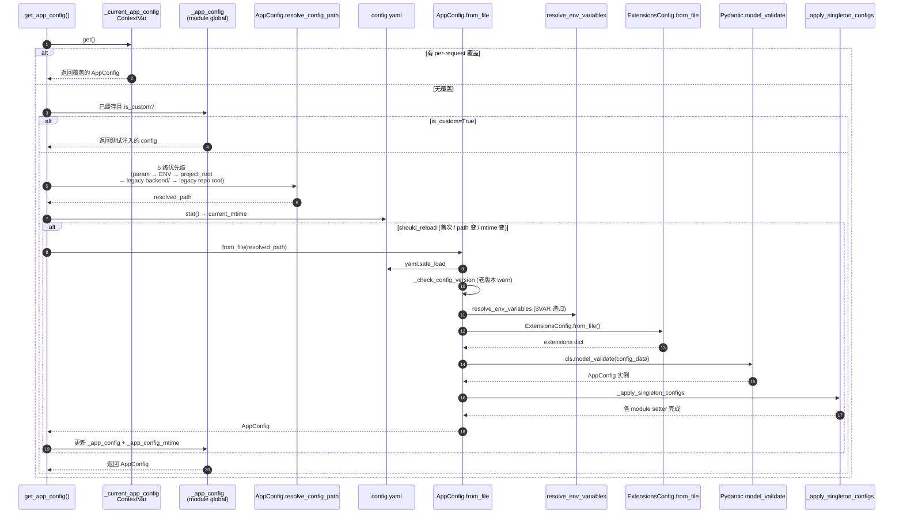

# 03 · 配置体系：AppConfig + ExtensionsConfig + 反射装配

> 上一章把 harness/app 边界讲清楚了。这一章回答的是一个支配整个 deer-flow 运行行为的问题：**当你改 `config.yaml` 的一行 `use: deerflow.community.tavily.tools:web_search_tool`，凭什么进程不重启就能换掉一个工具？又凭什么这种字符串能被解析成一个可调用的 Python 对象？**
>
> 这一章是后面 04-22 篇的"语法基础"。看完它，你才能读懂为什么 `ModelConfig`、`SandboxConfig`、`ToolConfig`、`SkillsConfig` 等 26 份子配置可以共存于一个 Pydantic 类，又为什么"工具/沙箱/Provider"全是通过字符串路径动态装配。

---

## 1. 模块定位（Why this matters）

deer-flow 有 **两层配置**：

| 配置 | 文件 | 格式 | 谁修改 | 单例 | 缓存策略 |
|------|------|------|--------|------|---------|
| **AppConfig** | `config.yaml` | YAML | 人工 + `make config-upgrade` | `_app_config` | **mtime 失效自动 reload** |
| **ExtensionsConfig** | `extensions_config.json` | JSON | 人工 + Gateway API（运行时） | `_extensions_config` | 只能手动 reload |

这是一个看似平常但实则非常重要的设计决策：

1. **静态决策 vs 运行时决策分开存**：`config.yaml` 是部署期决定（用哪个模型、装哪些工具、起哪个沙箱），`extensions_config.json` 是运行时决定（哪个 MCP server 现在启用、哪个 Skill 此刻开关）。前者是版本管理对象，后者是用户配置数据。
2. **`use:` 字段是反射装配的核心**：`use: deerflow.sandbox.tools:bash_tool` 这样的字符串，被 `reflection/resolvers.py` 通过 `importlib + getattr` 解析成可调用对象。这是 deer-flow 实现"插件化"的物理机制。
3. **mtime 失效是"开发者友好"的关键**：你改 `config.yaml`，不用重启 Gateway（dev 模式下 uvicorn `--reload` 也排除了 `.deer-flow/`），下一次 `get_app_config()` 会自动检测 mtime 变化并重载。

不读这部分会错过 3 个易踩的坑：

- 修改 `extensions_config.json` 后**为什么 MCP 工具没刷新**？因为它**没有** mtime 失效，得调 Gateway 的 `/api/mcp/config` API 触发 reload，或者重启进程。
- 为什么 `push_current_app_config` / `pop_current_app_config` 是 ContextVar？因为它们用来在**一次请求内**覆盖配置（例如多租户场景），不能影响全局单例。
- 为什么 `_apply_singleton_configs` 要把每个子配置"广播"到模块级别 setter？因为有些老代码不能拿 `AppConfig` 当参数传，只能读模块全局——这是历史遗留的兼容层（注释里直说了 "Compatibility singleton layer"）。

对应到 Harness 六要素：本章打下的是 **"动态上下文 + 工具集成"** 的基础——所有"按需装配"的能力（工具/沙箱/Provider/MCP/Skills）都站在反射装配这块地基上。

---

## 2. 源码地图（Source Map）

### 2.1 关键文件清单

| 路径 | 角色 |
|------|------|
| [`packages/harness/deerflow/config/app_config.py`](../packages/harness/deerflow/config/app_config.py) | 主聚合类 `AppConfig`（456 行）、缓存、ContextVar 覆盖 |
| [`packages/harness/deerflow/config/extensions_config.py`](../packages/harness/deerflow/config/extensions_config.py) | `ExtensionsConfig`（MCP + Skills 启用状态） |
| [`packages/harness/deerflow/config/runtime_paths.py`](../packages/harness/deerflow/config/runtime_paths.py) | `project_root()` / `runtime_home()` / `existing_project_file()` |
| [`packages/harness/deerflow/config/tool_config.py`](../packages/harness/deerflow/config/tool_config.py) | `ToolConfig.use` 字段约定 |
| [`packages/harness/deerflow/config/sandbox_config.py`](../packages/harness/deerflow/config/sandbox_config.py) | `SandboxConfig.use` 字段约定 |
| [`packages/harness/deerflow/config/model_config.py`](../packages/harness/deerflow/config/model_config.py) | `ModelConfig.use` 字段（model class path） |
| [`packages/harness/deerflow/reflection/resolvers.py`](../packages/harness/deerflow/reflection/resolvers.py) | `resolve_variable` / `resolve_class`（96 行） |
| [`config.example.yaml`](../../config.example.yaml) | 全部字段的注释化样例（44KB，`config_version: 9`） |
| [`extensions_config.example.json`](../../extensions_config.example.json) | MCP + Skills 样例 |
| [`scripts/config-upgrade.sh`](../../scripts/config-upgrade.sh) | 把新字段合并进用户 `config.yaml` |

### 2.2 关键符号速查表

| 符号 | 文件:行 | 一句话职责 |
|------|---------|-----------|
| `class AppConfig(BaseModel)` | `app_config.py:83` | Pydantic 聚合根 |
| `model_config = ConfigDict(extra="allow")` | `app_config.py:105` | 允许 yaml 写未声明字段 |
| `AppConfig.resolve_config_path()` | `app_config.py:112` | 5 级优先级解析 yaml 路径 |
| `AppConfig.from_file()` | `app_config.py:142` | yaml 解析 + env 注入 + 子配置广播 |
| `AppConfig._check_config_version()` | `app_config.py:224` | 老 config 升级提示 |
| `AppConfig.resolve_env_variables()` | `app_config.py:269` | 递归 `$VAR` 解析 |
| `AppConfig._apply_singleton_configs()` | `app_config.py:186` | 把每个子配置 setter 广播 |
| `_app_config` (module global) | `app_config.py:330` | 单例缓存 |
| `_app_config_mtime` | `app_config.py:332` | mtime 失效判据 |
| `_current_app_config: ContextVar` | `app_config.py:334` | per-request 覆盖 |
| `_load_and_cache_app_config()` | `app_config.py:346` | 写缓存 + 更新 mtime |
| `get_app_config()` | `app_config.py:358` | 入口：runtime override → custom → mtime check |
| `reload_app_config()` | `app_config.py:390` | 手动强制重载 |
| `set_app_config()` | `app_config.py:420` | 测试注入 |
| `push_current_app_config()` | `app_config.py:440` | per-request 覆盖入口 |
| `class ExtensionsConfig(BaseModel)` | `extensions_config.py:57` | MCP + Skills 启用 |
| `populate_by_name=True` | `extensions_config.py:69` | 同时接受 `mcp_servers` 和 `mcpServers`（JS 风格 alias） |
| `ExtensionsConfig.from_file()` | `extensions_config.py:125` | JSON 加载 |
| `ExtensionsConfig.is_skill_enabled()` | `extensions_config.py:190` | 默认值: public/custom 启用 |
| `resolve_variable()` | `reflection/resolvers.py:25` | `importlib.import_module + getattr` |
| `resolve_class()` | `reflection/resolvers.py:73` | resolve_variable + 子类校验 |
| `MODULE_TO_PACKAGE_HINTS` | `reflection/resolvers.py:3` | 把 `langchain_anthropic` 提示成 `uv add langchain-anthropic` |
| `_build_missing_dependency_hint()` | `reflection/resolvers.py:11` | 缺包时给可读化安装命令 |
| `project_root()` | `runtime_paths.py:7` | `DEER_FLOW_PROJECT_ROOT` 或 cwd |
| `runtime_home()` | `runtime_paths.py:19` | `DEER_FLOW_HOME` 或 `project_root/.deer-flow` |

### 2.3 配置加载时序图



### 2.4 反射装配的全景

```mermaid
flowchart LR
    YAML[config.yaml<br/>tools:<br/>  - use: deerflow.sandbox.tools:bash_tool] --> Parse[ToolConfig.use:str]
    Parse --> RV[resolve_variable<br/>'deerflow.sandbox.tools:bash_tool']
    RV --> Split[rsplit(':', 1)<br/>module_path, var_name]
    Split --> Imp[importlib.import_module<br/>'deerflow.sandbox.tools']
    Imp -->|ImportError| Hint[_build_missing_dependency_hint<br/>→ uv add ...]
    Imp -->|OK| GetAttr[getattr(module, 'bash_tool')]
    GetAttr -->|AttributeError| AttrErr[ImportError: module doesn't<br/>define bash_tool]
    GetAttr -->|OK| TypeCheck[isinstance(BaseTool)?<br/>(if expected_type)]
    TypeCheck -->|OK| Result[(BaseTool 实例)]
```

---

## 3. 核心逻辑精读（Deep Dive）

### 3.1 `AppConfig`：把 21 份子配置塞进一个 Pydantic 类

```python
# packages/harness/deerflow/config/app_config.py:83-110
class AppConfig(BaseModel):
    """Config for the DeerFlow application"""

    log_level: str = Field(default="info", ...)
    token_usage: TokenUsageConfig = Field(default_factory=TokenUsageConfig, ...)
    models: list[ModelConfig] = Field(default_factory=list, ...)
    sandbox: SandboxConfig = Field(...)                              # ← 必填
    tools: list[ToolConfig] = Field(default_factory=list, ...)
    tool_groups: list[ToolGroupConfig] = Field(default_factory=list, ...)
    skills: SkillsConfig = Field(default_factory=SkillsConfig, ...)
    skill_evolution: SkillEvolutionConfig = Field(...)
    extensions: ExtensionsConfig = Field(...)                        # ← 注入式：from_file 时填
    tool_search: ToolSearchConfig = Field(...)
    title: TitleConfig = Field(...)
    summarization: SummarizationConfig = Field(...)
    memory: MemoryConfig = Field(...)
    agents_api: AgentsApiConfig = Field(...)
    acp_agents: dict[str, ACPAgentConfig] = Field(default_factory=dict, ...)
    subagents: SubagentsAppConfig = Field(...)
    guardrails: GuardrailsConfig = Field(...)
    circuit_breaker: CircuitBreakerConfig = Field(...)
    loop_detection: LoopDetectionConfig = Field(...)
    model_config = ConfigDict(extra="allow")                         # ← 关键：允许未声明字段
    database: DatabaseConfig = Field(default_factory=DatabaseConfig, ...)
    run_events: RunEventsConfig = Field(default_factory=RunEventsConfig, ...)
    checkpointer: CheckpointerConfig | None = Field(default=None, ...)
    stream_bridge: StreamBridgeConfig | None = Field(default=None, ...)
```

**3 个值得注意的设计**：

1. **`sandbox: SandboxConfig = Field(...)` 是必填项**（用了 `Field(description=...)` 但没有 `default`，等同 `...` 占位），其它都有 `default_factory`。没有 sandbox 配置，Gateway 启动会直接挂——因为没有沙箱整个 agent 系统就跑不起来。
2. **`extra="allow"`**：yaml 里写 deer-flow 还没声明的字段不会报错，只是 Pydantic 不会校验。这是个工程缓冲——新功能可以先在 yaml 里写、运行时再用 `getattr(config, "new_field", None)` 读，避免每次都改 schema。
3. **`extensions` 字段是"被注入"的**：你看 `from_file` 实现（行 168-169）：

   ```python
   extensions_config = ExtensionsConfig.from_file()       # 从独立 JSON 读
   config_data["extensions"] = extensions_config.model_dump()
   ```

   它**不是从 yaml 读**。YAML 不会写 extensions——它是另一份独立 JSON。这就把"部署期配置"和"运行时配置"在物理上隔开了。

### 3.2 配置路径的 5 级优先级

```python
# packages/harness/deerflow/config/app_config.py:111-139
@classmethod
def resolve_config_path(cls, config_path: str | None = None) -> Path:
    """Resolve the config file path.

    Priority:
    1. If provided `config_path` argument, use it.
    2. If provided `DEER_FLOW_CONFIG_PATH` environment variable, use it.
    3. Otherwise, search the caller project root.
    4. Finally, search legacy backend/repository-root defaults for monorepo compatibility.
    """
    if config_path:
        path = Path(config_path)
        if not Path.exists(path):
            raise FileNotFoundError(f"Config file specified by param `config_path` not found at {path}")
        return path
    elif os.getenv("DEER_FLOW_CONFIG_PATH"):
        path = Path(os.getenv("DEER_FLOW_CONFIG_PATH"))
        if not Path.exists(path):
            raise FileNotFoundError(f"Config file specified by environment variable `DEER_FLOW_CONFIG_PATH` not found at {path}")
        return path
    else:
        project_config = existing_project_file(("config.yaml",))
        if project_config is not None:
            return project_config
        for path in _legacy_config_candidates():
            if path.exists():
                return path
        raise FileNotFoundError("`config.yaml` file not found in the project root or legacy backend/repository root locations")
```

**5 个层级**（注释只写了 4 级，但实际是 5）：

1. **显式参数 `config_path`**（多用于测试）。
2. **`DEER_FLOW_CONFIG_PATH` 环境变量**——容器化部署的常用方式。
3. **`project_root() / "config.yaml"`**——`project_root()` 默认是 `Path.cwd()`，可通过 `DEER_FLOW_PROJECT_ROOT` 覆盖（见 `runtime_paths.py:7`）。
4. **`backend_dir / "config.yaml"`**——monorepo 兼容。
5. **`repo_root / "config.yaml"`**——monorepo 兼容。

**为什么有 4 + 5 这两条 legacy 路径？** 因为 deer-flow 早期把 config.yaml 放在 `backend/`，后来挪到了项目根目录。直接删掉旧逻辑会让老用户升级时找不到配置。`_legacy_config_candidates()`（`app_config.py:52`）就是这种平滑过渡的实现。

**`existing_project_file` 怎么用 cwd**：`runtime_paths.py:34-41` 找的是 `project_root() / "config.yaml"`，而 `project_root()` 默认是当前工作目录（`Path.cwd()`）。所以 `cd backend && make gateway` 找的是 `backend/config.yaml`，`cd .. && make dev` 找的是项目根 `config.yaml`。**这个细节决定了为什么文档反复说"`config.yaml` 应该放在项目根目录"——只有那样 `make dev` 和 `make gateway` 才用同一份**。

### 3.3 `$VAR` 解析与 mtime 失效

#### `$VAR` 递归解析

```python
# packages/harness/deerflow/config/app_config.py:268-291
@classmethod
def resolve_env_variables(cls, config: Any) -> Any:
    """Recursively resolve environment variables in the config.
    Example: $OPENAI_API_KEY
    """
    if isinstance(config, str):
        if config.startswith("$"):
            env_value = os.getenv(config[1:])
            if env_value is None:
                raise ValueError(f"Environment variable {config[1:]} not found for config value {config}")
            return env_value
        return config
    elif isinstance(config, dict):
        return {k: cls.resolve_env_variables(v) for k, v in config.items()}
    elif isinstance(config, list):
        return [cls.resolve_env_variables(item) for item in config]
    return config
```

**3 个细节**：

- **`if config.startswith("$")` 严格 `$` 开头**：意味着 `"$OPENAI_API_KEY"` 会替换，`"Bearer $TOKEN"` 不会。如果你 yaml 里写 `prefix-$VAR-suffix` 也不会替换——这是有意为之的简单语义。
- **缺失环境变量直接 raise**：和 `ExtensionsConfig.resolve_env_variables`（`extensions_config.py:152-180`）的"缺失就赋空串"不同。AppConfig 启动失败 = uvicorn 退出；Extensions 缺失只让 MCP 服务器拿不到密钥。两者风险等级不一样。
- **递归而非一次性 replace**：深层嵌套的 dict / list 都会被遍历。`models[0].api_key: $VOLCENGINE_API_KEY` 这种深层路径也能正确替换。

#### mtime 失效

```python
# packages/harness/deerflow/config/app_config.py:358-387
def get_app_config() -> AppConfig:
    global _app_config, _app_config_path, _app_config_mtime

    runtime_override = _current_app_config.get()
    if runtime_override is not None:
        return runtime_override                       # ① per-request 覆盖优先

    if _app_config is not None and _app_config_is_custom:
        return _app_config                            # ② 测试注入的 config 不重载

    resolved_path = AppConfig.resolve_config_path()
    current_mtime = _get_config_mtime(resolved_path)

    should_reload = (
        _app_config is None                           # ③.a 首次
        or _app_config_path != resolved_path          # ③.b 路径变了（罕见）
        or _app_config_mtime != current_mtime         # ③.c 文件被改过
    )
    if should_reload:
        if (_app_config_path == resolved_path
            and _app_config_mtime is not None
            and current_mtime is not None
            and _app_config_mtime != current_mtime):
            logger.info("Config file has been modified (mtime: %s -> %s), reloading AppConfig",
                        _app_config_mtime, current_mtime)
        _load_and_cache_app_config(str(resolved_path))
    return _app_config
```

**精妙之处**：

- **三种 fast path**（① runtime override / ② custom / ③ cache hit）按优先级排序，最终才走 mtime 比较。
- **mtime 变化日志**：只在"文件确实被改过"（不是首次加载）时才打 INFO 日志，避免冷启动时刷屏。
- **`should_reload` 是 OR 不是 if/elif**：意味着只要任一条件成立就重载，逻辑上是"最保守"的——宁可多加载一次，也不放过任何潜在的不一致。

**对比常见替代方案**：

| 方案 | 优点 | 缺点 |
|------|------|------|
| **A. 进程启动时一次加载，永不重载** | 简单 | 改配置必须重启 |
| **B. 每次都重新读 yaml** | 简单 | 高频 I/O，YAML 解析慢 |
| **C. mtime 检查 + 缓存**（deer-flow） | 改配置即时生效，无重启 | 多个 worker 进程时各自缓存 |
| **D. 用 watchdog 监听文件事件** | 即时通知 | 引入额外依赖、跨平台行为不一致 |

deer-flow 选 C。代价是每次 `get_app_config()` 都调一次 `os.stat()`——但 `stat()` 在现代 OS 上是亚毫秒级，可以接受。

### 3.4 `_apply_singleton_configs`：兼容老代码的"配置广播"

```python
# packages/harness/deerflow/config/app_config.py:186-209
@classmethod
def _apply_singleton_configs(cls, config: Self, acp_agents: dict[str, ACPAgentConfig]) -> None:
    from deerflow.config.checkpointer_config import get_checkpointer_config

    previous_checkpointer_config = get_checkpointer_config()

    load_title_config_from_dict(config.title.model_dump())
    load_summarization_config_from_dict(config.summarization.model_dump())
    load_memory_config_from_dict(config.memory.model_dump())
    load_agents_api_config_from_dict(config.agents_api.model_dump())
    load_subagents_config_from_dict(config.subagents.model_dump())
    load_tool_search_config_from_dict(config.tool_search.model_dump())
    load_guardrails_config_from_dict(config.guardrails.model_dump())
    load_checkpointer_config_from_dict(config.checkpointer.model_dump() if config.checkpointer is not None else None)
    load_stream_bridge_config_from_dict(config.stream_bridge.model_dump() if config.stream_bridge is not None else None)
    load_acp_config_from_dict({name: agent.model_dump() for name, agent in acp_agents.items()})

    if previous_checkpointer_config != config.checkpointer:
        # These runtime singletons derive their backend from checkpointer config.
        from deerflow.runtime.checkpointer import reset_checkpointer
        from deerflow.runtime.store import reset_store

        reset_checkpointer()
        reset_store()
```

**为什么需要这一段？** 因为 deer-flow 历史上有两种代码风格混存：

- **新代码**：函数签名带 `app_config: AppConfig` 参数，显式传入。
- **老代码**：函数直接读全局 `get_xxx_config()`（例如 `get_title_config()`），返回 module-level 的 `_title_config` 变量。

`_apply_singleton_configs` 就是这个兼容层——`AppConfig.from_file` 加载完后，把每一个子配置 `dump → load_xxx_config_from_dict` 同步到对应模块的全局 setter，让两种代码风格在同一个进程里看到一致的配置。

**最后那个 `if previous_checkpointer_config != config.checkpointer` 是关键**：checkpointer 与 store 都是"长寿命"资源（SQLite/Postgres 连接池），不能简单覆盖全局变量。如果 checkpointer 配置变了，必须把已有的 connection pool 关掉、重建，否则会用旧连接打新库。这一段就是干这件事的。

> **可以学到的工程技巧**：当你也在做类似的"配置驱动重资源"系统时，记得"配置变更"的语义不只是"换一个值"，而是要触发**关联资源**的重建。比较 `previous_*` 和当前 `*` 是个干净的手法。

### 3.5 反射装配：96 行的 `resolve_variable`

```python
# packages/harness/deerflow/reflection/resolvers.py:25-70
def resolve_variable[T](
    variable_path: str,
    expected_type: type[T] | tuple[type, ...] | None = None,
) -> T:
    """Resolve a variable from a path.

    Args:
        variable_path: The path to the variable (e.g. "parent.sub.module:variable_name").
        expected_type: Optional type or tuple of types to validate the resolved variable against.

    Returns:
        The resolved variable.

    Raises:
        ImportError: If the module path is invalid or the attribute doesn't exist.
        ValueError: If the resolved variable doesn't pass the validation checks.
    """
    try:
        module_path, variable_name = variable_path.rsplit(":", 1)
    except ValueError as err:
        raise ImportError(f"{variable_path} doesn't look like a variable path. "
                          "Example: parent_package_name.sub_package_name.module_name:variable_name") from err

    try:
        module = import_module(module_path)
    except ImportError as err:
        module_root = module_path.split(".", 1)[0]
        err_name = getattr(err, "name", None)
        if isinstance(err, ModuleNotFoundError) or err_name == module_root:
            hint = _build_missing_dependency_hint(module_path, err)
            raise ImportError(f"Could not import module {module_path}. {hint}") from err
        # Preserve the original ImportError message for non-missing-module failures.
        raise ImportError(f"Error importing module {module_path}: {err}") from err

    try:
        variable = getattr(module, variable_name)
    except AttributeError as err:
        raise ImportError(f"Module {module_path} does not define a {variable_name} attribute/class") from err

    # Type validation
    if expected_type is not None:
        if not isinstance(variable, expected_type):
            type_name = expected_type.__name__ if isinstance(expected_type, type) else " or ".join(t.__name__ for t in expected_type)
            raise ValueError(f"{variable_path} is not an instance of {type_name}, got {type(variable).__name__}")

    return variable
```

**3 段最值得学的代码**：

#### 段 ① `rsplit(":", 1)` 而不是 `split`

`"langchain_openai:ChatOpenAI"` 用 `rsplit(":", 1)` 拆成 `("langchain_openai", "ChatOpenAI")`。**为什么用 rsplit？** 因为 Windows 路径里可能含冒号（虽然 Python 模块路径里几乎不会），rsplit 从右切只取最后一个冒号当分隔符，更安全。

#### 段 ② 可读化的缺包提示

```python
MODULE_TO_PACKAGE_HINTS = {
    "langchain_google_genai": "langchain-google-genai",
    "langchain_anthropic": "langchain-anthropic",
    "langchain_openai": "langchain-openai",
    "langchain_deepseek": "langchain-deepseek",
}


def _build_missing_dependency_hint(module_path: str, err: ImportError) -> str:
    module_root = module_path.split(".", 1)[0]
    missing_module = getattr(err, "name", None) or module_root

    package_name = MODULE_TO_PACKAGE_HINTS.get(module_root)
    if package_name is None:
        package_name = MODULE_TO_PACKAGE_HINTS.get(missing_module,
                                                    missing_module.replace("_", "-"))

    return (f"Missing dependency '{missing_module}'. "
            f"Install it with `uv add {package_name}` "
            f"(or `pip install {package_name}`), then restart DeerFlow.")
```

**为什么把这层包装做出来？** 因为 deer-flow 用大量字符串路径动态加载，一旦缺包，原生 ImportError 报的是模块名（例如 `No module named 'langchain_anthropic'`）。用户多半不知道 PyPI 包名长什么样（`langchain-anthropic` 还是 `langchain_anthropic`？是否有命名空间前缀？）。这个 hint 表把"模块名 → PyPI 包名"的映射写死，让错误信息直接给出可执行命令。

**可借鉴的工程技巧**：任何"插件化"系统都该有这种 dev-friendly 错误提示。错误是开发者最频繁的接触点。

#### 段 ③ `expected_type` 用 `isinstance` 而不是 `issubclass`

```python
if not isinstance(variable, expected_type):
```

这是 `resolve_variable` 的合同：它解析的是**变量**（实例），不是类。所以 `resolve_variable("deerflow.sandbox.tools:bash_tool", BaseTool)` 检查的是 `bash_tool` 是不是 `BaseTool` 的实例。

而 `resolve_class`（行 73）是它的"姐妹"，专门解析**类**，里面用 `issubclass`：

```python
def resolve_class[T](class_path: str, base_class: type[T] | None = None) -> type[T]:
    model_class = resolve_variable(class_path, expected_type=type)
    if not isinstance(model_class, type):
        raise ValueError(f"{class_path} is not a valid class")
    if base_class is not None and not issubclass(model_class, base_class):
        raise ValueError(f"{class_path} is not a subclass of {base_class.__name__}")
    return model_class
```

**两者的应用场景**：

| 函数 | 用例 |
|------|------|
| `resolve_variable("...tools:bash_tool", BaseTool)` | 工具是单例 `@tool` 实例 |
| `resolve_class("langchain_openai:ChatOpenAI", BaseChatModel)` | 模型是类，要 `ChatOpenAI(**kwargs)` 实例化 |
| `resolve_variable("...:LocalSandboxProvider")` | Provider 既可能是单例也可能是类——按当下用法 |

---

## 4. 关键问题答疑（Key Questions）

### Q1：我改了 `config.yaml`，需要重启 Gateway 吗？

**不需要**（前提：`make dev` 模式 + 一个 worker 进程）。

- `serve.sh:132` 的 `--reload-include='*.yaml'` 会让 uvicorn 直接 reload。
- 即使不 reload（例如 `make start` 模式），下一次 `get_app_config()` 调用也会 mtime 检测到改动并重载（`app_config.py:378-386`）。

**但有例外**：

- 改的是 `models[*]` 里某个 model 的配置，且这个 model 之前已经被 LangChain bind 到了 agent 上——那个 agent 实例是不会自动重建的。**只对"下次新建 agent"生效**。
- 多 worker 部署时（`gunicorn -w 4`），每个 worker 各自缓存，需要重启所有 worker 才能完全同步。

### Q2：改 `extensions_config.json` 呢？

`extensions_config.py` 里 `_extensions_config` 单例**没有 mtime 检查**。一旦缓存了就不会刷新。Gateway 提供 `/api/mcp/config` 这种 endpoint 时会主动调 `reload_extensions_config()`。如果你绕过 API 直接改 JSON，需要：

- 重启 Gateway，或者
- 调 `POST /api/memory/reload` 之类的端点（不同 router 实现不同——见 11 篇的 MCP 缓存讲解）。

**为什么不给 extensions 加 mtime？** 我的判断：extensions 主要是被 Gateway API 程序化修改的（用户在 UI 上点"启用 MCP server"，Gateway 写 JSON 并刷新单例）。手改 JSON 是 dev-only 行为。给它加 mtime 反而会引入"用户改 JSON → 自动重载 → MCP 工具被换掉 → 进行中的 agent 调用失败"这种竞态。

### Q3：`use: deerflow.sandbox.tools:bash_tool` 真的能找到那个变量吗？怎么验证？

最简短的验证：

```bash
cd backend
PYTHONPATH=. uv run python -c \
  "from deerflow.reflection import resolve_variable; \
   print(resolve_variable('deerflow.sandbox.tools:bash_tool'))"
```

应该打印 `name='bash' description='...' args_schema=...` 这样的 `StructuredTool` 实例。

如果故意写错路径：

```bash
PYTHONPATH=. uv run python -c \
  "from deerflow.reflection import resolve_variable; \
   resolve_variable('langchain_anthropic:ChatAnthropic')"
```

没装 `langchain-anthropic` 时会报：
```
ImportError: Could not import module langchain_anthropic.
Missing dependency 'langchain_anthropic'.
Install it with `uv add langchain-anthropic` (or `pip install langchain-anthropic`), then restart DeerFlow.
```

### Q4：`push_current_app_config` 是给谁用的？

主要场景是 **per-request 配置覆盖**——例如 Gateway 内部的 `run_agent` worker 想让某次请求用一个不同的 AppConfig（多租户、A/B test、临时切换模型集等）。看 `app_config.py:440-455`：

```python
def push_current_app_config(config: AppConfig) -> None:
    """Push a runtime-scoped AppConfig override for the current execution context."""
    stack = _current_app_config_stack.get()
    _current_app_config_stack.set(stack + (_current_app_config.get(),))
    _current_app_config.set(config)


def pop_current_app_config() -> None:
    stack = _current_app_config_stack.get()
    if not stack:
        _current_app_config.set(None)
        return
    previous = stack[-1]
    _current_app_config_stack.set(stack[:-1])
    _current_app_config.set(previous)
```

**用栈而不是覆盖**：支持嵌套覆盖（subagent 里再覆盖一次）。`finally: pop_current_app_config()` 配对调用。

`get_app_config()` 第一行就检查这个 ContextVar（`app_config.py:368-370`），所以 push 之后所有 `get_app_config()` 调用都拿到的是覆盖后的版本，**直到 pop**。

### Q5：`extra="allow"` 是不是安全隐患？yaml 里写 `<script>...</script>` 会怎样？

不会。`extra="allow"` 只控制 Pydantic 是否对未声明字段报错。yaml.safe_load 不会执行任何 Python 代码——它是纯数据解析。`extra="allow"` 让 unknown 字段成为 `BaseModel` 实例的属性，你可以用 `getattr(config, "weird_field", None)` 拿到，但它不会自动被任何代码读到。

真正的风险点是 `use:` 字段——如果用户能修改 `config.yaml`，他可以指向任意 `module:variable`，包括恶意构造的 `os:system`。但**改 `config.yaml` 等同于改源码**——能改源码的人本来就有任意代码执行能力，这条不是新增风险。

### Q6：`_check_config_version` 为什么向上搜索 5 层？

```python
# app_config.py:236-247
example_path = None
search_dir = config_path.parent
for _ in range(5):  # search up to 5 levels
    candidate = search_dir / "config.example.yaml"
    if candidate.exists():
        example_path = candidate
        break
    parent = search_dir.parent
    if parent == search_dir:
        break
    search_dir = parent
```

`config.yaml` 和 `config.example.yaml` 都在项目根目录。**但用户可能用 `DEER_FLOW_CONFIG_PATH=/some/where/else/config.yaml` 指到任意位置**——这时 `config.example.yaml` 找不到的话，就没法版本对比。向上搜 5 层是一个"尝试找到附近的 example"的兜底，找不到就静默放弃（行 247-248），不影响主流程。

---

## 5. 横向延伸与面试级洞察（Interview-Grade Insights）

### 5.1 反射装配 vs 注册中心

很多 agent 框架的工具/插件加载用**注册中心模式**：

```python
# 假想的 CrewAI 风格
@register_tool(name="web_search")
class WebSearchTool: ...

# 用户配置只写名字
tools: [web_search, ...]
```

deer-flow 的反射装配是**字符串路径模式**：

```yaml
- name: web_search
  use: deerflow.community.ddg_search.tools:web_search_tool
```

| 维度 | 注册中心 | 反射装配（deer-flow） |
|------|---------|----------------------|
| 工具入口 | 装饰器 `@register_tool` | YAML `use:` 字符串 |
| 加载时机 | import 时 | 首次 `get_available_tools()` 时 |
| 缺包检测 | import 期立刻 | 真正用到时才报 |
| 加新工具的成本 | 改 Python + 装饰器 | 只改 YAML（不动 Python） |
| 第三方贡献工具 | 必须开发者 import | 把包发 PyPI 即可 |
| 拼写错误 | 静态检查可见 | 运行时报错 |

**deer-flow 的赌注**：反射装配的"晚绑定"换来了**配置驱动的极致灵活性**——一个全新的工具，开发者只需要 `pip install my_tool && echo "use: my_tool:my_func" >> config.yaml`，**不动 deer-flow 一行代码**。代价是错误延迟到运行时，但有 `_build_missing_dependency_hint` 兜底。

### 5.2 mtime 失效 vs 文件监听 vs reload signal

| 方案 | 例子 | 适合场景 |
|------|------|---------|
| **mtime 检查**（deer-flow） | 每次 `get_app_config()` 比对 mtime | 配置读取已经是高频操作；额外 stat() 开销可忽略 |
| **文件监听** | inotify / watchdog | 配置极少改，监听比每次 stat 更省 |
| **reload signal** | `kill -HUP <pid>` | 多进程协调时清晰的"全部 reload" |
| **etcd / Consul** | 分布式 K-V 配置 | 多机部署 + 集中管理 |

**面试金句**：deer-flow 选 mtime 是因为单进程为主、配置读取是高频操作（每个 router 都调 `get_app_config()`）。如果他们要做分布式部署，就该转向 etcd-style 中心化配置——mtime 在多机时各机会脱步。

### 5.3 ContextVar 覆盖单例：现代 Python 的"依赖注入"

`push_current_app_config` 是非常 Pythonic 的"作用域覆盖"——比传统 DI 框架（FastAPI 的 `Depends`、django.conf.settings 的 override_settings）轻量很多：

```python
# 传统 DI
def handler(config: AppConfig = Depends(get_app_config)): ...

# ContextVar override
async def handler():
    push_current_app_config(custom_config)
    try:
        result = await some_func()  # some_func 内部调 get_app_config() 拿到 custom
    finally:
        pop_current_app_config()
```

后者的好处是**深层调用栈里的代码不需要感知**——`some_func` 嵌套调用 100 层后某个工具调 `get_app_config()`，照样拿到 custom 配置。这就是 ContextVar task-local 语义的威力。

### 5.4 vs LangChain `langchain_core.runnables.config.RunnableConfig`

LangChain 也有"运行时配置注入"，叫 `RunnableConfig`，是字典形式：

```python
agent.invoke({"messages": [...]}, config={"configurable": {"model_name": "gpt-4"}, "tags": ["..."]})
```

deer-flow 同时用了两套：
- **`RunnableConfig.configurable`** 走 LangGraph 标准通道（per-call、随消息流动）。
- **`push_current_app_config()`** 走 ContextVar（per-async-context、不进消息）。

两者的边界：
- `configurable` 用于"图行为参数"（`is_plan_mode`, `subagent_enabled`, `model_name`）。
- `push_current_app_config` 用于"AppConfig 整体替换"（罕见场景：测试 / A/B）。

> **可以记住的判断**：如果你改的是一个值（threshold/flag），用 configurable；如果你改的是一整套配置（换 tool set / 换 sandbox），用 push_current_app_config。

---

## 6. 实操教程（Hands-on Lab）

### 6.1 最小可运行示例：从 yaml 到 agent 工具的反射装配全流程

```python
# backend/debug_config.py
"""演示：AppConfig 如何把 yaml 转成可调用的工具"""
import json
from deerflow.config import get_app_config
from deerflow.reflection import resolve_variable
from langchain.tools import BaseTool


def main():
    cfg = get_app_config()

    print(f"=== AppConfig loaded from cache ===")
    print(f"  log_level    = {cfg.log_level}")
    print(f"  models       = {[m.name for m in cfg.models]}")
    print(f"  tools (yaml) = {[(t.name, t.group, t.use) for t in cfg.tools[:5]]}")
    print(f"  sandbox.use  = {cfg.sandbox.use}")
    print(f"  sandbox.allow_host_bash = {cfg.sandbox.allow_host_bash}")
    print(f"  guardrails.enabled = {cfg.guardrails.enabled}")
    print()

    # 反射加载第一个工具
    if cfg.tools:
        first = cfg.tools[0]
        print(f"=== Reflective load: {first.use} ===")
        tool: BaseTool = resolve_variable(first.use, BaseTool)
        print(f"  type    = {type(tool).__name__}")
        print(f"  .name   = {tool.name}")
        print(f"  .description (first 80 chars) = {tool.description[:80]}...")
        print()

    # 演示 $VAR 解析（模拟 yaml 内的 $OPENAI_API_KEY）
    import os
    os.environ["MY_TEST_VAR"] = "secret-123"
    fake = {"api_key": "$MY_TEST_VAR", "nested": {"deep": ["$MY_TEST_VAR"]}}
    from deerflow.config.app_config import AppConfig
    resolved = AppConfig.resolve_env_variables(fake)
    print(f"=== $VAR resolution ===")
    print(f"  before = {fake}")
    print(f"  after  = {resolved}")


if __name__ == "__main__":
    main()
```

跑：

```bash
cd backend && PYTHONPATH=. uv run python debug_config.py
```

**预期观察**：

- 第一段会打印你 yaml 里实际配置的 model / tool / sandbox。
- 第二段 `resolve_variable` 把 `deerflow.community.ddg_search.tools:web_search_tool` 这种字符串变成了一个真正可调用的 `BaseTool`。
- 第三段证明 `$VAR` 递归解析连嵌套 list 里的字符串都覆盖了。

### 6.2 Debug 任务清单

#### 实验 ①：观察 mtime 失效如何工作

1. 起一个 Python 解释器（`PYTHONPATH=. uv run python`），不要退出：
   ```python
   from deerflow.config import get_app_config
   c1 = get_app_config()
   print(c1.log_level)         # 当前值
   ```
2. **另开终端**，改一下 `config.yaml`：
   ```bash
   sed -i.bak 's/^log_level:.*/log_level: debug/' /Users/sanshi/PycharmProjects/deer-flow/config.yaml
   ```
3. 回到 Python 解释器：
   ```python
   c2 = get_app_config()
   print(c2.log_level)         # 应该变成 "debug"
   print(c1 is c2)             # False — 是新实例
   ```
4. 还原：`mv /Users/sanshi/PycharmProjects/deer-flow/config.yaml.bak /Users/sanshi/PycharmProjects/deer-flow/config.yaml`

**能学到**：mtime 失效让你**不重启进程**就能感知配置改动。在 logs 里能看到 `Config file has been modified (mtime: X -> Y), reloading AppConfig` 这一行。

#### 实验 ②：故意触发"缺包"的可读化报错

1. 临时把第一个 model 的 `use:` 改成一个不存在的模块：
   ```yaml
   # 在某个 model 块（已启用的那个）
   - name: doubao-seed
     use: nonexistent_package:SomeClass   # ← 改成这个
     ...
   ```
2. 重启 Gateway 或调 `get_app_config(); resolve_class(...)`。
3. 观察报错：
   ```
   ImportError: Could not import module nonexistent_package.
   Missing dependency 'nonexistent_package'.
   Install it with `uv add nonexistent-package`
   (or `pip install nonexistent-package`), then restart DeerFlow.
   ```
4. **进阶**：把它改成 `langchain_anthropic:ChatAnthropic`（确实没装），看 `MODULE_TO_PACKAGE_HINTS` 是否生效——hint 里应该是 `uv add langchain-anthropic`（带连字符而非下划线）。

**能学到**：deer-flow 把"缺包错误"做成了"可执行建议"。这是工程上的最佳实践。

#### 实验 ③：ContextVar 风格的临时覆盖

```python
# PYTHONPATH=. uv run python
from copy import deepcopy
from deerflow.config import get_app_config
from deerflow.config.app_config import push_current_app_config, pop_current_app_config

real = get_app_config()
fake = deepcopy(real)
fake.log_level = "ERROR"   # 假装一个测试用 config

push_current_app_config(fake)
try:
    c = get_app_config()
    print(c.log_level)      # ERROR
    print(c is fake)        # True
finally:
    pop_current_app_config()

c = get_app_config()
print(c.log_level)          # 恢复到 yaml 原值
```

**能学到**：push/pop 配对让你能"临时换配置"。这是 deer-flow 内部测试和多租户场景的关键机制。

---

## 7. 与下一模块的衔接

读完本章你应该能：

- 解释为什么 deer-flow 有两份配置文件（一份 yaml、一份 JSON），各自的边界。
- 用源码佐证 `get_app_config()` 的三种 fast path 和 mtime 失效机制。
- 知道 `use: module:variable` 这种字符串如何被 `resolve_variable` 解析成可调用对象。
- 区分 ContextVar 风格的"临时覆盖"和 module-global 的"缓存单例"。

但你还**没看到**：

- LangGraph 的 `AgentState` 是什么样？deer-flow 是怎么扩展成 `ThreadState` 的？
- 为什么 `artifacts` 字段要带 reducer `merge_artifacts`？多个并发分支同时往里塞文件，怎么去重？
- `viewed_images` 的"空 dict 等于清空"语义为什么这么设计？

这些是 **04 篇（ThreadState 状态模型与 Reducer）** 的核心。理解了 ThreadState 之后，再往后看任何一个 middleware（它们读写的就是 ThreadState 上的字段）才会真的"看进去"。

---

📌 **本章已交付**。请你检查后告诉我：
- 哪几段读起来不顺？
- 是否要补"`config.example.yaml` 完整 schema 详解"这一节（罗列全部 26 份子配置的字段）？
- 还是直接进入 04 篇？
