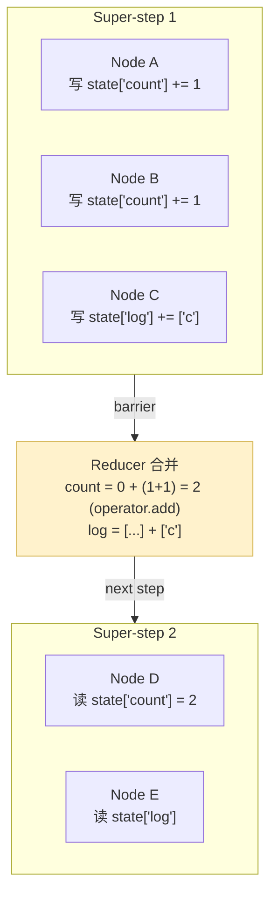
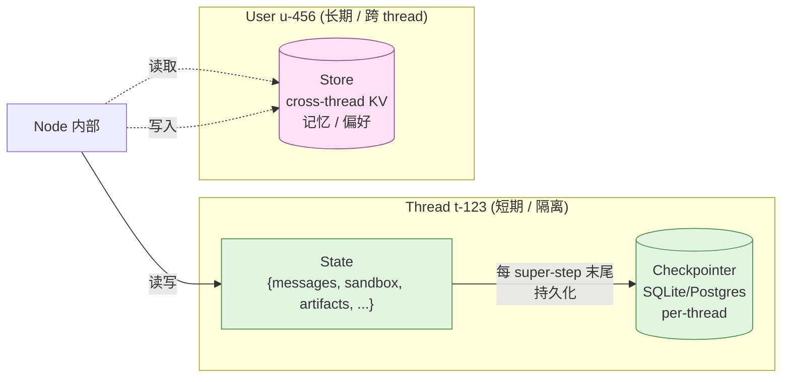

# 03 · LangGraph 深入：StateGraph / Reducer / Checkpointer / Store / Streaming

> 上一章打通了"LangChain Agent + Middleware"那一层，这一章下钻到**它脚下的 LangGraph 1.1.9**。重点解决你"只跑过文档 demo"的两个症结：
>
> 1. **不理解为什么有 reducer** —— 以为它只是个"merge 函数"，其实是 **Pregel BSP 并发模型**的核心装置。
> 2. **不理解 `stream_mode` 7 种模式什么时候用哪个** —— 看 demo 时只见 `"values"`，没见过 `"updates"` / `"messages"` / `"checkpoints"` / `"tasks"` / `"debug"` / `"custom"`。
>
> 本章把这两个症结连根拔起，并把 DeerFlow 把 `"messages"` 包装成 `"messages-tuple"` 的封装哲学讲透。

---

## 🎯 学习目标

读完这份文档，你能回答：

1. **`StateGraph` 的 Pregel BSP 执行模型**到底是什么？一个 "super-step" 里如果两个节点同时写同一个 state 字段，会发生什么？为什么需要 reducer？
2. **`Annotated[T, reducer]` 的本质语义**是什么？`add_messages` reducer 怎么用 id 实现"替换"、用 `RemoveMessage` 实现"删除"？写错了 reducer 会出什么 bug？
3. **`Checkpointer` 和 `Store` 的边界**：DeerFlow 用 SQLite Checkpointer 管 thread state，又用 `Store` 管 user-scoped memory —— 为什么不能合并？
4. **`Command(goto=..., update=...)` / `interrupt(value)` / `Send(node, state)`** 三个原语各解决什么不同的问题？怎么用一个完整 demo 把三者都跑出来？
5. **`stream_mode` 7 种模式**的精确语义差异？DeerFlowClient 为什么把 LangGraph 的 `"messages"` 改名叫 `"messages-tuple"`？

---

## 🗂️ 源码定位

> 本项目实际依赖：**`langgraph==1.1.9`** / `langgraph-sdk==0.3.13` / `langchain==1.2.15`。

| 关注点 | 文件 | 关键符号 |
|---|---|---|
| `StateGraph` 构造与编译 | `.venv/.../langgraph/graph/state.py` | `StateGraph` L115；`add_node` L293；`add_edge` L788；`add_conditional_edges` L842；`compile` L1038；`CompiledStateGraph` L1196 |
| `add_messages` reducer | `.venv/.../langgraph/graph/message.py` | `add_messages` L61；`MessagesState` L307 |
| Command / Send / interrupt | `.venv/.../langgraph/types.py` | `Command` L653；`Send` L574；`interrupt()` L705；`Interrupt` 类 L446 |
| StreamMode 定义 | `.venv/.../langgraph/types.py` | `StreamMode = Literal["values","updates","checkpoints","tasks","debug","messages","custom"]` L118-L120 |
| Checkpointer 抽象 | `.venv/.../langgraph/checkpoint/base/` | `BaseCheckpointSaver`；SQLite/Postgres/Memory 实现见 `checkpoint/{sqlite,memory}/` |
| Store 抽象 | `.venv/.../langgraph/store/` | `BaseStore`；`store/memory/`、`store/sqlite/` 子目录 |
| DeerFlow 自己的 stream 封装 | `packages/harness/deerflow/client.py` | `StreamEventType` L59；`stream()` L555+；底层调用 `stream_mode=["values", "messages", "custom"]` L637 |
| DeerFlow Checkpointer 工厂 | `packages/harness/deerflow/runtime/checkpointer/async_provider.py` | `make_checkpointer`（注册在 `langgraph.json::checkpointer`） |

---

## 🧭 架构图

### 1. Pregel BSP 模型：StateGraph 怎么"一拍一拍"地跑



> **关键不变量**（这一段决定你能否真正用对 LangGraph）：
> 1. **同一个 super-step 里多个节点的写入是并行收集的**（典型场景：`Send(...)` fan-out 出去的 N 个并发分支）
> 2. **super-step 结束有 barrier**：所有并发节点的输出**汇总**后过 reducer，再进入下一 super-step
> 3. **没有 reducer 的字段 = "last-write-wins" 覆盖**；有 reducer 的字段 = reducer 决定合并逻辑
> 4. **节点读到的永远是上一个 super-step 结束后的快照**，不会读到"同步同步中"的中间态 —— 这就是为什么 LangGraph 比手写 asyncio 协程编排更容易写对

### 2. State / Checkpointer / Store 三层数据



> 这张图回答了一个**面试高频问题**："Checkpointer 和 Store 都能持久化，为什么 LangGraph 要拆成两个抽象？" —— 答案：**生命周期不同**。Checkpointer 是 per-thread 短期状态（thread 被删 → 数据可删）；Store 是 per-user / per-namespace 长期 KV（thread 消失，记忆要留下）。**强行合并会让"删除一个会话"变成"擦除用户记忆"的灾难**。

---

## 🔍 核心逻辑讲解

### Part 1 · StateGraph 三剑客：`add_node` / `add_edge` / `add_conditional_edges`

```python
from typing import TypedDict, Annotated
from operator import add
from langgraph.graph import StateGraph, START, END


class State(TypedDict):
    messages: Annotated[list, add]   # ← reducer 是 operator.add(list 拼接)
    count: int                       # ← 没有 reducer = last-write-wins


def node_a(state: State) -> dict:
    return {"messages": ["a"], "count": state["count"] + 1}


def node_b(state: State) -> dict:
    return {"messages": ["b"], "count": state["count"] + 1}


def route(state: State) -> str:
    return "b" if state["count"] < 2 else END


builder = StateGraph(State)
builder.add_node("a", node_a)
builder.add_node("b", node_b)
builder.add_edge(START, "a")              # 静态边:从 START 直接跳到 'a'
builder.add_conditional_edges("a", route) # 条件边:从 'a' 出来,根据 route 决定去哪
builder.add_edge("b", "a")                # 循环边:'b' 跑完回到 'a'
graph = builder.compile()
```

**三条边的本质区别**：
- `add_edge(from, to)` —— **无条件**静态边，编译时确定
- `add_conditional_edges(from, fn, [destinations])` —— **运行时**根据节点输出决定路由
- `Command(goto=...)`（在节点内部返回）—— **运行时动态路由**，可以同时返回 `update=`（路由 + 状态更新原子化）

**为什么需要三种？** 因为它们对应了不同的耦合度：
| 边类型 | 路由决策时机 | 知道下一步的"谁" | DeerFlow 中的例子 |
|---|---|---|---|
| `add_edge` | 编译期 | 静态拓扑 | 中间件链的固定顺序（M1.before_model → M2.before_model → model） |
| `add_conditional_edges` | 节点退出时 | 边定义里写死候选 | tools_node → loop_entry / END 的二选一 |
| `Command(goto=...)` | 节点内部 | 节点自己决定 | `ClarificationMiddleware.wrap_tool_call` 返回 `Command(goto=END)` |

### Part 2 · Reducer：`Annotated[T, reducer_fn]` 的本质

> 这是 LangGraph 最容易被误解的概念。**Reducer 不是"merge 函数"**，是**"上一个值 + 本 super-step 所有节点返回的值 → 新值"** 的归约函数。

```python
# state.py 内部对每个有 reducer 的字段干的事(伪代码):
new_value = reducer(old_value, value_from_node_1)
new_value = reducer(new_value, value_from_node_2)
new_value = reducer(new_value, value_from_node_3)
# ... 直到本 super-step 所有节点返回值都被吸收
```

**4 种最常见的 reducer**：

```python
from operator import add
import operator
from langgraph.graph.message import add_messages

class State(TypedDict):
    # 1. 累加(list 拼接 / int 求和)
    log: Annotated[list, add]

    # 2. 求最大值
    max_score: Annotated[int, max]

    # 3. 字典浅合并
    config: Annotated[dict, operator.or_]

    # 4. 消息列表(LangGraph 内置,自带 id 替换 + RemoveMessage 删除)
    messages: Annotated[list, add_messages]

    # 5. 自定义(DeerFlow ThreadState 就是这种)
    artifacts: Annotated[list[str], merge_artifacts]  # 去重合并
```

**`add_messages` 的三个语义** —— 这是 DeerFlow 中间件章节会反复用到的：

```python
# message.py L67-L107
# 1. 普通追加
add_messages([HumanMessage("hi", id="1")], [AIMessage("hello", id="2")])
# → [HumanMessage("hi", id="1"), AIMessage("hello", id="2")]

# 2. 同 id 替换(中间件修改 AIMessage 的关键机制)
add_messages([AIMessage("v1", id="x")], [AIMessage("v2", id="x")])
# → [AIMessage("v2", id="x")]   # 替换!不是新增!

# 3. RemoveMessage 删除
add_messages([HumanMessage("a", id="1"), AIMessage("b", id="2")], [RemoveMessage(id="2")])
# → [HumanMessage("a", id="1")]
```

**踩坑案例**（02 章见过的）：DeerFlow `SubagentLimitMiddleware` 修改 AIMessage 时必须保留原 id —— 否则 `add_messages` 把它当新消息追加，state 里会出现两条 AIMessage。

### Part 3 · Checkpointer vs Store 的边界

> **一句话区分**：Checkpointer 管"会话状态"（thread-scoped、自动版本化、跟着 thread 走），Store 管"持久知识"（user-scoped、手动读写、thread 删了不掉）。

| 维度 | Checkpointer | Store |
|---|---|---|
| 作用域 | per-thread | per-namespace（DeerFlow 用 `(user_id, ...)` 元组） |
| 写入时机 | **自动** —— 每个 super-step 结束自动持久化 state | **手动** —— 节点显式 `store.put(...)` |
| 数据形态 | TypedDict state 整体（带版本号 + 时间戳） | key-value（带 namespace） |
| 主要用途 | 故障恢复 / 续接 / 时间旅行 | 长期记忆 / 用户偏好 / 跨 thread 知识 |
| DeerFlow 用法 | SQLite/Postgres checkpointer（`runtime/checkpointer/async_provider.py`） | DeerFlow 自己用文件系统替代了 LangGraph Store（`agents/memory/storage.py`），原因是要按 user_id 隔离到独立文件、便于审计 |

**面试坑**："那 DeerFlow 为什么不用 LangGraph Store 而要自己造一套？"
→ 答：LangGraph Store 的 sqlite 后端是单库多 namespace，**多用户高并发下锁竞争重**；DeerFlow 的 memory 走的是 per-user 独立 JSON 文件 + 原子 rename（`memory/storage.py`），数据所有权清晰、可以直接 cp / rm 单用户数据，**审计友好**。这是产品级取舍。

### Part 4 · Command / interrupt / Send：三个原语

#### `Command(goto=..., update=..., resume=...)` —— 节点内动态路由

```python
def my_node(state):
    if state["count"] > 10:
        return Command(goto=END, update={"messages": [AIMessage("done")]})
    return {"count": state["count"] + 1}   # 普通返回 = 走静态/条件边
```
- `goto` 可以是 node name、`END`、`Send(...)` 列表
- `update` 是 state 更新（**与 goto 原子化**，不会发生"先 update 后路由失败导致状态错乱"）
- DeerFlow 范例：`ClarificationMiddleware.wrap_tool_call` 返回 `Command(goto=END, update={"messages": [...]})`

#### `interrupt(value)` —— 暂停等待人工

```python
from langgraph.types import interrupt

def review_node(state):
    user_decision = interrupt({"question": "Approve this transaction?", "amount": 1000})
    # ↑ 这一行会暂停 graph,等外部调用 graph.invoke(Command(resume=...), config=...) 才继续
    if user_decision == "yes":
        return {"approved": True}
    return {"approved": False}
```
- `interrupt(value)` 抛出 `GraphInterrupt`，把 `value` 暴露给客户端
- 客户端拿到后，**用同一个 thread_id** + `Command(resume=...)` 调 `graph.invoke(...)` 续跑
- DeerFlow 没直接用 `interrupt()` 做 HITL，因为它走 IM/HTTP 异步模型 —— 但 LangChain 1.2 的 `HumanInTheLoopMiddleware` 就是这种风格

#### `Send(node_name, state_for_that_node)` —— Map / fan-out

```python
def planner(state) -> Command:
    # 把一个大任务拆成 N 个子任务,每个子任务独立走 worker 节点
    return Command(goto=[Send("worker", {"task": t}) for t in state["tasks"]])
```
- 每个 `Send` 在**下一个 super-step**作为独立节点执行（**并发**）
- worker 节点们的返回值通过 reducer 合并回 state
- DeerFlow 没用 `Send` 做 subagent fan-out —— 它走的是更重的 `SubagentExecutor` 双线程池（理由：sub-agent 之间需要超时管理、外部线程池调度、生命周期事件流，比 `Send` 的轻量并发更可控）。这是个**值得在面试讨论的取舍**。

### Part 5 · `stream_mode` 7 种模式精确对照

> LangGraph 1.1.9 实际 `StreamMode` 是 7 个 Literal：`"values"`, `"updates"`, `"checkpoints"`, `"tasks"`, `"debug"`, `"messages"`, `"custom"`。注意**没有** `"messages-tuple"`，它是 DeerFlow 在客户端层的命名重映射。

| 模式 | 一次产生 | 包含什么 | 适合用来 | 重复风险 |
|---|---|---|---|---|
| `values` | 每个 super-step 结束 | **整个 state 快照** | 渲染当前完整状态（前端"消息列表"） | ⚠️ 同一条消息会在多个 super-step 重复出现 |
| `updates` | 每个 super-step 结束 | **本步 node-by-node 的 update dict**（`{node_name: update}`） | 调试、追踪每个节点写了什么 | 不会重复，但需要自己合并到 state |
| `messages` | LLM 输出每个 token | **token + metadata 元组** | 流式打字机效果 | 同一条 message 的 token delta 流式发送，需自己拼 |
| `checkpoints` | 每个 checkpoint 生成 | 同 `get_state()` 格式 | 时间旅行 / 状态查询 | — |
| `tasks` | 节点开始 / 结束 | task name + input + result + error | 任务级监控、画甘特图 | — |
| `debug` | 包含 `checkpoints` + `tasks` | 全量调试信息 | 本地开发排错 | — |
| `custom` | 节点内显式 `StreamWriter()` 调用 | 你自己写的任意数据 | 业务事件（如"子 agent 启动"） | — |

**为什么 DeerFlowClient 把 `"messages"` 改名 `"messages-tuple"`？** 答：
1. LangGraph 的 `"messages"` mode 实际发的是 `(message_chunk, metadata)` 元组 —— DeerFlow 想把这个事实写进类型名（`packages/harness/deerflow/client.py::StreamEventType` L59）。
2. DeerFlow 还想给每个事件加自己的语义（AI text delta / tool call / tool result 三种子类型，见 client.py L561-L567）。
3. 命名空间隔离：DeerFlow API 演进时可以自由加新事件类型（如 `"end"`），不和 LangGraph 原生模式冲突。

**核心不变量**（你要记住的最重要那一条）：**`values` 是全量、`messages-tuple` 是 delta**。前端混用必须做 dedup（DeerFlow 用 message id 去重，详见后续 `08-streaming-protocol-and-stream-modes.md`）。

---

## 🧩 体现的通用 Agent 设计模式

| 模式 | LangGraph 原语 | 经典场景 |
|---|---|---|
| **Pregel BSP**（并发 + barrier） | super-step + reducer | 多节点并行写同一字段 |
| **Map-Reduce** | `Send` + reducer | LLM 拆任务 → N 个 worker → 汇总 |
| **State Machine**（条件路由） | `add_conditional_edges` | tools_node → loop / END 二选一 |
| **HITL**（人在环路） | `interrupt(value)` + `Command(resume=...)` | 敏感操作前等用户确认 |
| **Saga / 补偿** | `Command(goto=compensation_node, update=...)` | 子任务失败时跳到补偿节点 |
| **Event Sourcing**（事件溯源） | Checkpointer + `get_state_history()` | 时间旅行 / 调试 |

---

## 🧱 与 Agent Harness 六要素的对应关系

| 六要素 | LangGraph 怎么提供基础设施 |
|---|---|
| ① 反馈循环 | `add_conditional_edges` + 循环边 = ReAct 主循环 |
| ② 记忆持久化 | Checkpointer（短期）+ Store / 自建（长期） |
| ③ 动态上下文 | reducer 让"多源并发注入"安全；`Command(update=...)` 让路由 + 注入原子化 |
| ④ 安全护栏 | `interrupt()` 是 HITL 的官方钩子 |
| ⑤ 工具集成 | `add_node("tools", ToolNode(...))` + 条件边 |
| ⑥ 可观测性 | `stream_mode=["debug", "tasks", "checkpoints"]` + 自动 trace 集成（LangSmith / Langfuse） |

---

## ⚠️ 常见坑与调试技巧

### 坑 1 · 写错 reducer：用 `=` 覆盖了一个本该累加的字段

```python
class State(TypedDict):
    log: list  # ❌ 忘了 Annotated[list, add]
```
**症状**：你以为多次 append 会累计，结果每次都被覆盖（last-write-wins）。
**调试**：把 stream_mode 加上 `"updates"`，你会看到每个节点返回了什么 —— 然后对比最终 state，差异就是 reducer 没生效。

### 坑 2 · 在 `Send` fan-out 出去的并发分支里写同一个 state 字段

```python
def planner(state):
    return Command(goto=[Send("worker", {"task": t, "id": i}) for i, t in enumerate(state["tasks"])])

def worker(state):
    return {"result": f"done: {state['task']}"}  # ❌ 没 reducer 字段,N 个 worker 互相覆盖
```
**症状**：3 个 worker 并发，最终 `state["result"]` 只剩一个值。
**修复**：给 `result` 加 `Annotated[list, add]`，每个 worker 返回 `{"result": [...]}` 而不是 `{"result": "..."}`。

### 坑 3 · 把 Checkpointer 当成 KV 存储用

```python
# ❌ 错误想法:"我把用户偏好塞到 state 里,Checkpointer 自动持久化"
state["user_prefs"] = {"theme": "dark"}
```
**问题**：每次创建新 thread，user_prefs 都得重新塞一遍；删 thread 会一起删 prefs。
**修复**：用 Store（或 DeerFlow 的 per-user JSON），跨 thread 共享。

### 坑 4 · `stream_mode=["values"]` 看不到 LLM token 流

**症状**：以为开了流式，结果只在每个 super-step 末尾收到一次完整 state。
**原因**：LLM token 流走 `"messages"` mode，不在 `"values"` 里。
**修复**：`stream_mode=["values", "messages"]`，前者给"全局快照"，后者给"打字机"。**DeerFlowClient 就是这么干的**（client.py L637）。

### 坑 5 · 多 reducer 字段共用一个 `Send` 时的"幻读"

`Send(node, state_for_node)` 里的 `state_for_node` 是 **传给那个 node 的 input**，不是"node 必须 return 的全部字段"。新手会以为"我没在 Send 里塞 logs，worker 就读不到 logs"—— 错。worker 读到的是 base state + override，未 override 的字段照常来自上游 state。

---

## 🛠️ 动手实操

> 本 demo **不依赖 DeerFlow**，纯 LangGraph 1.1.9 + 一点 stdlib。一次性把 reducer 并发合并、Command / Send / interrupt、7 种 stream_mode 全跑一遍 —— 跑通这一份你的 LangGraph 内功就上一个台阶。

### Demo · 完整可跑：reducer 并发合并 + Send 扇出 + interrupt + 7 种 stream_mode 对照

```python
"""
LangGraph 内功 demo: Pregel BSP / reducer / Command / Send / interrupt / 7 种 stream_mode.

跑法:
    PYTHONPATH=backend uv run python scripts/langgraph_internals_demo.py

观察重点:
1. Send fan-out 出去的 3 个 worker 并行写同一个 reducer 字段,看 reducer 怎么聚合
2. Command(goto=END, update=...) 在节点内部完成"路由 + 状态更新"原子化
3. interrupt() 暂停 graph,然后用 Command(resume=...) 续跑
4. 同一次 invoke 用 7 种 stream_mode 跑,对比输出形状差异
"""
import operator
from typing import Annotated, TypedDict
from langgraph.graph import StateGraph, START, END
from langgraph.types import Command, Send, interrupt
from langgraph.checkpoint.memory import InMemorySaver


# ====== 1. State schema:演示 3 种 reducer ======
class State(TypedDict):
    # (a) 累加 list:每个 worker 写一个 result,自动拼接
    results: Annotated[list[str], operator.add]

    # (b) 求最大值:多 worker 同时报告 score,自动取 max
    max_score: Annotated[int, max]

    # (c) 无 reducer:last-write-wins(演示常见踩坑)
    tasks_total: int


# ====== 2. 节点们 ======
def planner(state: State) -> Command:
    """Planner: 决定要 fan-out 几个 worker."""
    tasks = ["task-A", "task-B", "task-C"]
    print(f"[planner] fan-out {len(tasks)} workers")
    # ⭐ Send 列表 = N 个并发 worker(下一个 super-step 同时执行)
    return Command(
        goto=[Send("worker", {"task_name": t}) for t in tasks],
        update={"tasks_total": len(tasks)},  # ⚠️ 无 reducer 字段:稍后再 fan-out 一轮就会被覆盖
    )


def worker(state: dict) -> dict:
    """Worker: 模拟每个子任务返回一个结果 + 一个 score."""
    name = state["task_name"]
    score = len(name) * 10
    print(f"  [worker] {name} → score={score}")
    return {
        "results": [f"done: {name}"],   # ← 进 reducer (operator.add)
        "max_score": score,              # ← 进 reducer (max)
    }


def gatekeeper(state: State) -> dict:
    """模拟 HITL: 总分超过阈值需要人工审核."""
    print(f"[gatekeeper] state.max_score={state['max_score']}, state.results={state['results']}")
    if state["max_score"] >= 60:
        # ⭐ interrupt(): 把 question 暴露给外部,暂停等 Command(resume=...) 续跑
        user_decision = interrupt({
            "question": "max_score >= 60, approve?",
            "current_state": dict(state),
        })
        if user_decision == "approve":
            return {"results": ["approved by user"]}
        else:
            return {"results": ["rejected by user"]}
    return {"results": ["auto-approved"]}


def finalizer(state: State) -> Command:
    """演示 Command(goto=END, update=...) 原子化路由+更新."""
    print(f"[finalizer] final state.results={state['results']}")
    return Command(
        goto=END,
        update={"results": ["[FINAL] " + "; ".join(state["results"])]},
    )


# ====== 3. 组装 graph ======
builder = StateGraph(State)
builder.add_node("planner", planner)
builder.add_node("worker", worker)
builder.add_node("gatekeeper", gatekeeper)
builder.add_node("finalizer", finalizer)
builder.add_edge(START, "planner")
# planner 用 Command(goto=[Send(...), Send(...), Send(...)]) fan-out
# 所有 worker 自动汇合 → 走默认下一步,因为没有显式边,这里我们补一条
builder.add_edge("worker", "gatekeeper")
builder.add_edge("gatekeeper", "finalizer")

checkpointer = InMemorySaver()   # ⭐ HITL 必须挂 checkpointer,否则 interrupt 没法恢复
graph = builder.compile(checkpointer=checkpointer)


# ====== 4. CASE 1: 7 种 stream_mode 对比输出 ======
print("\n" + "="*70)
print("CASE 1 · 7 种 stream_mode 输出对比 (低分用例,不会触发 interrupt)")
print("="*70)

initial = {"results": [], "max_score": 0, "tasks_total": 0}
config = {"configurable": {"thread_id": "thread-mode-demo"}}

# 用低分输入:把 task_name 改短让 score < 60
# 但 demo 用上面的 planner 写死的 task_name 长度 = 6,score=60,会触发 interrupt
# 所以我们 patch 一下,临时跑一个"没有 interrupt"的 case
# 这里偷懒:直接对比 7 种 mode 的输出形状,不关心是否 interrupt
for mode in ["values", "updates", "messages", "checkpoints", "tasks", "debug", "custom"]:
    print(f"\n--- stream_mode={mode!r} ---")
    try:
        events = list(graph.stream(initial, config={**config, "configurable": {"thread_id": f"t-{mode}"}},
                                   stream_mode=mode))
        # 只看前 3 个事件,够看清形状
        for i, ev in enumerate(events[:3]):
            kind = type(ev).__name__
            preview = str(ev)[:120].replace("\n", " ")
            print(f"  [{i}] type={kind}  preview={preview}...")
        print(f"  总事件数:{len(events)}")
    except Exception as e:
        # interrupt 会抛 GraphInterrupt
        print(f"  ⚠️ {type(e).__name__}: {str(e)[:80]}")


# ====== 5. CASE 2: HITL 中断 + 用 Command(resume=...) 续跑 ======
print("\n" + "="*70)
print("CASE 2 · interrupt() + Command(resume=...) 完整 HITL 流程")
print("="*70)

config2 = {"configurable": {"thread_id": "thread-hitl"}}

# 第一次 invoke:跑到 gatekeeper 时 interrupt
print("\n[step 1] 第一次 invoke,跑到 interrupt 暂停")
result1 = graph.invoke(initial, config=config2)
print(f"[step 1] 返回:{type(result1)} keys={list(result1.keys()) if isinstance(result1, dict) else 'N/A'}")
# ⭐ 注意:LangGraph 1.x 行为是 invoke() 不会抛 GraphInterrupt,
# 而是返回包含 '__interrupt__' 的 dict —— 状态此时已经持久化在 checkpointer 里
if "__interrupt__" in result1:
    intr = result1["__interrupt__"][0]
    print(f"[step 1] ✋ interrupted with question:{intr.value['question']}")

# 第二次 invoke:用 Command(resume=...) 续跑,选择 approve
print("\n[step 2] 用 Command(resume='approve') 续跑")
result2 = graph.invoke(Command(resume="approve"), config=config2)
print(f"[step 2] ✅ final state:{result2}")


# ====== 6. CASE 3: 演示无 reducer 字段的"幻像更新" ======
print("\n" + "="*70)
print("CASE 3 · 无 reducer 字段 (tasks_total) 的并发覆盖")
print("="*70)
# planner 设了 tasks_total=3,但 worker fan-out 后没改 tasks_total
# 我们故意让 worker 也回写 tasks_total,观察 last-write-wins
def evil_worker(state: dict) -> dict:
    name = state["task_name"]
    return {"results": [f"evil:{name}"], "max_score": 0, "tasks_total": 999}

builder2 = StateGraph(State)
builder2.add_node("planner", planner)
builder2.add_node("worker", evil_worker)
builder2.add_node("end_node", lambda s: print(f"  final tasks_total={s['tasks_total']}") or s)
builder2.add_edge(START, "planner")
builder2.add_edge("worker", "end_node")
graph2 = builder2.compile()
graph2.invoke({"results": [], "max_score": 0, "tasks_total": 0})
# 预期输出:tasks_total=999(3 个 evil_worker 并发写 999,无 reducer,但都写一样所以看不出竞争)
# 把 999 改成 i+1000 你会看到不确定结果
```

### 调试任务

1. **断点位置**：
   - `.venv/.../langgraph/pregel/...` 里找到 super-step 推进的核心循环（关键词 `_run_with_retry` / `_prepare_next_tasks`），在那里打断点观察"barrier 收集 → reducer 应用 → 下一 super-step"
   - 你自己的 `worker` 函数 —— 在多个 worker 实例上同时停下，观察它们读到的 state 是不是一致的（不变量验证）
2. **观察什么**：
   - CASE 1 中 `values` 模式输出 4-5 次完整 state，`updates` 输出 4-5 次 `{node_name: update}` —— 体会"state 视图 vs node 视图"的差异
   - CASE 2 中第一次 `invoke()` 返回的字典里有 `__interrupt__` 字段，state 已经持久化到 checkpointer，**进程退出再起来用同一个 thread_id 也能恢复**
3. **人为制造异常**：
   - 把 `evil_worker` 里的 `"tasks_total": 999` 改成 `"tasks_total": i` 并循环跑 100 次（每次 i 不同），统计最终 `tasks_total` 的分布 —— 你会看到**非确定性**结果，这就是"无 reducer 字段在并发下不安全"的实证。

### 改造练习

1. **练习 A**（简单）：把 `results` 字段的 reducer 改成 `operator.add` → 自定义 `dedup_concat`（去重拼接），观察行为变化。这就是 DeerFlow `merge_artifacts` 的本质。
2. **练习 B**（中等）：让 `gatekeeper` 节点用 `Command(goto=...)` 而不是 `interrupt()` 实现"绕过审核走另一条路径"，对比两种 HITL 模式的代码差异。
3. **挑战题**：把 `InMemorySaver` 换成 `from langgraph.checkpoint.sqlite import SqliteSaver`，让 CASE 2 跑两次：第一次 `invoke` 后**直接 kill 进程**，第二次启动新进程用同一个 `thread_id + Command(resume="approve")` —— 验证 checkpointer 的"故障恢复 / 续接"语义。

### 预期输出 & 验证方式

- CASE 1 中 `stream_mode="messages"` 因为本 demo 没有 LLM 调用，**输出为空**（这是正确的 —— 印证了"messages 模式只在 LLM 调用时产生"）。
- CASE 2 第一次 invoke 返回 `{"__interrupt__": (Interrupt(value={...}),), ...}`，**state 已写入 checkpointer**。
- CASE 3 看到 `tasks_total=999` 而不是 3，证明无 reducer 字段被并发 worker 覆盖了 planner 写的值。

---

## 🎤 面试视角

### 业务型大厂卷

**问 1**：你团队的 LangGraph agent 在生产中偶发 "state 里同一条 AIMessage 出现两条" 的 bug，你怎么排查？

> **教科书答案**：
> 这几乎肯定是中间件改 AIMessage 时**没保留原 id**，被 `add_messages` reducer 当作新消息追加。排查步骤：
> 1. 在 stream_mode 上加 `"updates"`，定位是哪个节点的 update 包含了重复 message
> 2. 检查该节点（极可能是某个 `after_model` 中间件）的代码：`return {"messages": [AIMessage(...)]}` 里有没有 `id=last.id`
> 3. 修复后写一个回归测试：构造一条 `AIMessage(id="fixed-id")`，调中间件，断言 reducer 合并后 messages 长度不变
> **预防**：写一个内部 lint 规则 —— "AgentMiddleware.after_model 返回的 messages 列表里每条都必须显式带 id"。

**问 2**：你们用 LangGraph 跑用户长会话，DB 越涨越大，怎么治理？

> **教科书答案**：
> Checkpointer 的 DB 增长两个来源：
> 1. **每个 super-step 一个 checkpoint** —— 长会话累计 checkpoint 数量爆炸。治理：定期 `delete_thread()` 已结束的 thread；保留策略只留最近 N 个 checkpoint（用 `BaseCheckpointSaver.delete_checkpoint`）
> 2. **state 自身在膨胀** —— 比如 messages 列表无上限。治理：Summarization 中间件触发 `RemoveMessage(id=...)` 删除老消息（不是把它们摞着）；artifacts 等大字段抽到 Store / 业务表，state 里只存 ID
>
> **DeerFlow 的实战做法**：`SummarizationMiddleware` + `Store` 替代物（per-user 文件）双管齐下，state 永远只是"工作内存"。

### 创业型 AI 公司卷

**问 3**：让你设计一个"研究员 agent" —— 给一个主题、并发拆成 N 个子方向、每个方向独立调研、最后汇总。**用 LangGraph 怎么实现？写伪代码 + 解释 reducer / Send / Checkpointer 各起什么作用**。

> **参考答案**：
> ```python
> class State(TypedDict):
>     topic: str
>     subtopics: list[str]
>     findings: Annotated[list[dict], operator.add]   # 关键:reducer 累加并发结果
>
> def planner(state):
>     subs = llm.generate_subtopics(state["topic"])
>     return Command(goto=[Send("researcher", {"sub": s}) for s in subs])
>
> def researcher(state):
>     result = llm.research(state["sub"])
>     return {"findings": [{"sub": state["sub"], "result": result}]}
>
> def synthesizer(state):
>     return {"report": llm.synthesize(state["findings"])}
> ```
> - **`Send`**：把 N 个子方向 fan-out 成并发节点，每个独立 LLM 调用
> - **reducer (`operator.add`)**：并发 researcher 的 findings 自动拼回主 state，无竞争
> - **Checkpointer**：长任务（>10 min）中途如果挂了，可以用同一 thread_id 续跑 —— 注意 `Send` fan-out 出去的 worker 的执行状态也会被 checkpoint，已完成的不会重跑
> **对照 DeerFlow**：DeerFlow 没用这种"原生 Send"路线，而是走 `task()` 工具 + `SubagentExecutor`，因为它要支持"子 agent 之间相互看不到上下文"的隔离 —— 这是 LangGraph 原生 `Send` 不提供的语义。

**问 4**：什么时候你应该选择"不用 LangGraph，自己写一个 asyncio 编排"？

> **参考答案**：
> 选择"自己写"的红线：
> 1. **完全没有循环 / 没有分支** —— 单纯的 LLM 流式聊天，用 LangChain Runnable 链就够，LangGraph overkill
> 2. **延迟极敏感**（<50ms 级编排开销不能容忍）—— LangGraph 的 super-step + checkpoint 开销不可忽略
> 3. **状态完全无持久化需求** —— 比如纯函数式管道，每次 invoke 独立无续接
>
> 选择 LangGraph 的红线：
> 1. 需要循环、HITL、Send fan-out、Checkpoint 时间旅行 —— 任一就是 LangGraph
> 2. 团队需要可观测性 / Studio 调试 —— LangGraph 生态原生支持

---

## 📚 延伸阅读

- **LangGraph 官方核心概念**：https://langchain-ai.github.io/langgraph/concepts/low_level/
  *重点看 "Reducers" / "Super-steps" / "Checkpointing" 三节。*
- **Pregel paper (Google, 2010)**：https://kowshik.github.io/JPregel/pregel_paper.pdf
  *LangGraph 的执行模型源于这篇 paper。读完 paper 你会发现 LangGraph 的"super-step + barrier + reducer"是 BSP 原汁原味的翻版。*
- **LangGraph HITL Tutorial**：https://langchain-ai.github.io/langgraph/concepts/human_in_the_loop/
  *看完后能写一个完整的"敏感操作前等审批"agent。*
- **DeerFlow `runtime/checkpointer/async_provider.py`**：你已经看过 `langgraph.json::checkpointer` 指向它了，**强烈建议**精读一遍 —— 它把 LangGraph 标准 Checkpointer 接口 + DeerFlow 业务表 + Alembic 迁移粘合在一起，是后面 22 章和 24 章的重要预热。
- **LangChain `create_agent` 源码**：上一章你应该已经精读了，把它当 LangGraph StateGraph 的最佳实战范本回头再扫一眼。

---

## 🎤 互动检查 —— 请回答这 3 个问题

> **两句话即可**。

1. **Reducer 题**：DeerFlow `ThreadState` 给 `artifacts` 字段写了自定义 reducer `merge_artifacts`（去重拼接），给 `viewed_images` 写了 `merge_viewed_images`（合并 + 空字典哨兵清空）—— 但 **`messages` 字段没写自定义 reducer**（继承自 `AgentState` 默认的 `add_messages`）。为什么 `messages` 不写自定义而其他要写？
2. **概念区分题**：用一句话区分 `Checkpointer` 和 `Store`。再用一句话解释 DeerFlow 为什么"绕过 LangGraph Store、自己造 per-user JSON 文件" —— 答案在本章 Part 3。
3. **stream_mode 选择题**：你要给前端做"AI 流式打字机 + 工具调用过程可视化（什么时候调了什么工具）"。你的 `stream_mode` 列表会是哪几个？为什么不只用 `"messages"`？

回答后我们进入 **`04-directory-anatomy-and-harness-app-split.md`** —— harness/app 双层架构、AST 边界守卫、SDK/Server 双形态发布哲学。
