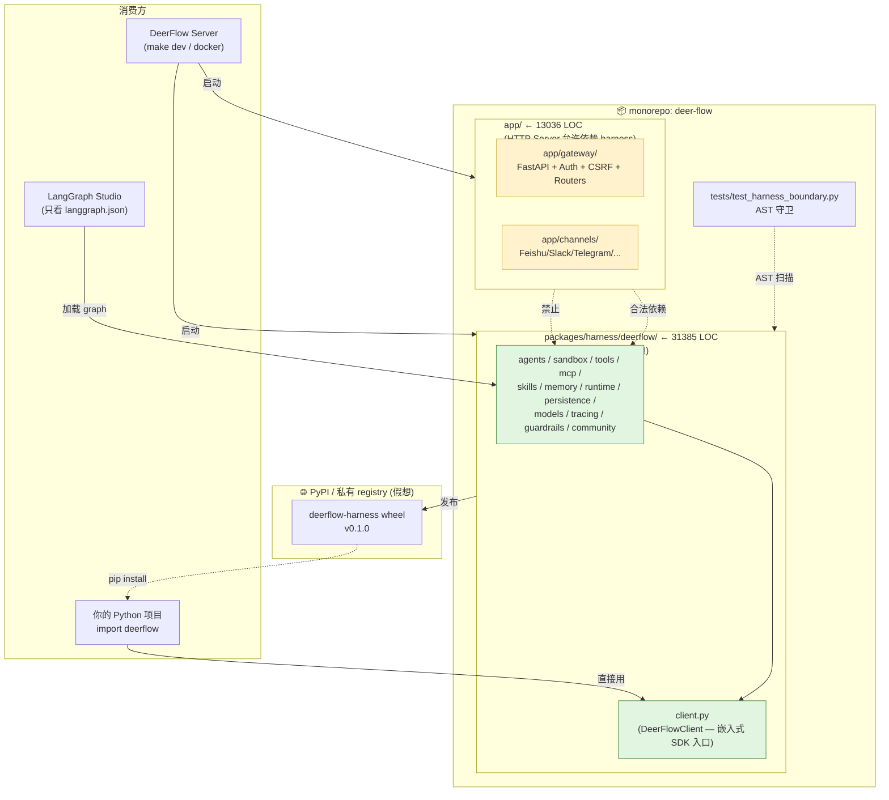
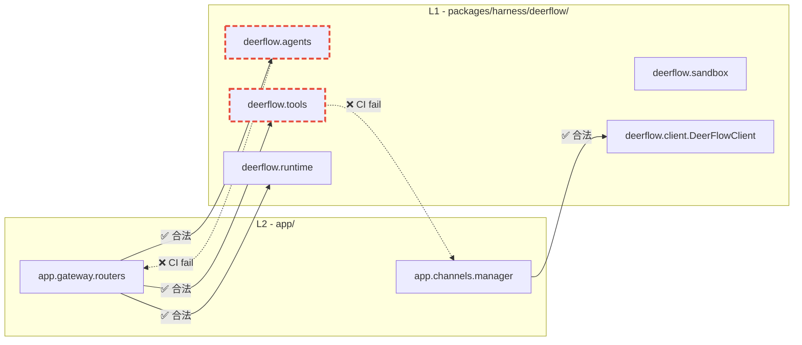

# 04 · 工程目录解剖：harness/app 双层架构

> 本章是「项目认知层」的收官。02 / 03 章打通了"LangChain + LangGraph 内功"；本章打通"DeerFlow 工程边界" —— 让你能在 3 分钟之内向面试官讲清"为什么 DeerFlow 不是一个 monolith，而是一个**可发布 SDK + 可独立部署 Server 双形态**的工程"。
>
> 这一章会上一个生产级的 **AST 边界扫描** demo —— 不只是抄 `test_harness_boundary.py`，而是**自己写一遍能识别 7 种隐蔽违规模式的扫描器**，这种"会防架构腐烂的扫描工具"是高级 Agent 工程师面试的高频考点。

---

## 🎯 学习目标

读完这份文档，你能回答：

1. **为什么 DeerFlow 把代码拆成 `packages/harness/deerflow/` 和 `app/` 两层？** 不能合成一个包发布吗？
2. **`tests/test_harness_boundary.py` 的 AST 扫描具体做了什么**？它**漏检**哪些违规模式？怎么补？
3. **DeerFlowClient（嵌入式 SDK）和 Gateway（HTTP Server）"两个产品同一份代码"的工程哲学**是什么？它和"hexagonal architecture / ports & adapters"是什么关系？
4. **作为面试官**，如果让你考查候选人的"工程边界意识"，你会怎么基于 DeerFlow 这套架构设计 3 道题？

---

## 🗂️ 源码定位

| 关注点 | 路径 | 关键事实 |
|---|---|---|
| 双包工作区声明 | `backend/pyproject.toml` | `[tool.uv.workspace] members = ["packages/harness"]`；`dependencies = ["deerflow-harness", ...]`；`[tool.uv.sources] deerflow-harness = { workspace = true }` |
| harness 包独立 pyproject | `backend/packages/harness/pyproject.toml` | `name = "deerflow-harness"`；`[tool.hatch.build.targets.wheel] packages = ["deerflow"]` —— **可独立发布到 PyPI** |
| harness 入口（公开 API） | `backend/packages/harness/deerflow/__init__.py`（0 字节，避免暴露内部） + 各子模块自己的 `__init__.py` | 31385 行 Python 代码（`find . -name "*.py" \| xargs wc -l`），是项目的"重心" |
| app 入口 | `backend/app/__init__.py`（0 字节） + `app/gateway/app.py`（FastAPI 主应用） + `app/channels/service.py`（IM 通道服务） | 13036 行，约为 harness 的 40%，**主要是粘合层** |
| 边界守卫 | `backend/tests/test_harness_boundary.py` | AST 扫描 `from app.` / `import app.`；CI 跑 `make test` 时执行（`.github/workflows/backend-unit-tests.yml` L43） |
| 边界合法方向 | `app/` → `deerflow.*` 共 **25 处** import；`deerflow.*` → `app.*` 共 **0 处** import | `grep -rln "from deerflow\\|import deerflow" backend/app/ \| wc -l` |
| Makefile | `backend/Makefile` | `test: PYTHONPATH=. uv run pytest tests/ -v` —— 边界测试默认跑 |
| LangGraph 入口 | `backend/langgraph.json` | `"lead_agent": "deerflow.agents:make_lead_agent"`（**纯 harness 路径，不引用 app**） |

---

## 🧭 架构图

### 1. 双层架构 + 双产品形态



### 2. 依赖方向单向不可逆（这是"洁癖"也是"红线"）



---

## 🔍 核心逻辑讲解

### Part 1 · 为什么必须拆？三个工程动机

#### 动机 ① · 双产品形态（最重要）

DeerFlow 同时是两个产品：

| 产品形态 | 用户 | 入口 | 依赖 |
|---|---|---|---|
| **嵌入式 SDK** | 业务 Python 项目 | `from deerflow.client import DeerFlowClient` | **只需要 harness** —— 不要 FastAPI / uvicorn / Slack-SDK / DingTalk-SDK 这些 server-only 依赖 |
| **HTTP Server** | 前端 / IM / 外部系统 | `make dev` 启动 Gateway + Channels | harness + app（约 60+ 个额外依赖） |

如果 harness 里有 `from app.gateway.routers.uploads import xxx`，那么用户 `pip install deerflow-harness` 时，**FastAPI / uvicorn / lark-oapi / slack-sdk / dingtalk-stream 全得装进来** —— 包尺寸暴涨 5 倍，启动耗时翻倍，与"嵌入式 SDK"定位完全冲突。

**这是分层的根本动机**：依赖性 = 部署单元 = 产品形态。

#### 动机 ② · LangGraph CLI 兼容性

打开 `backend/langgraph.json`：

```json
{
  "graphs": {
    "lead_agent": "deerflow.agents:make_lead_agent"
  },
  "checkpointer": {
    "path": "./packages/harness/deerflow/runtime/checkpointer/async_provider.py:make_checkpointer"
  }
}
```

LangGraph CLI / Studio 加载 graph 时**只看这条路径**。如果 `make_lead_agent` 内部触发了 `from app.gateway.deps import xxx`，那么任何用 LangGraph Studio 调试 DeerFlow 的人都得装 FastAPI 全家桶 —— 这违反了 LangGraph 生态的"agent = 纯函数"哲学。

#### 动机 ③ · 测试速度 + 隔离性

harness 31385 LOC，app 13036 LOC。**harness 的单元测试不应该启动 FastAPI**。把 app 依赖隔离掉后：
- `tests/test_client.py` 等 harness 测试在毫秒级跑完
- 只有 `tests/test_gateway_*.py` 这种集成测试才启 ASGI
- CI 总耗时下降 ≈40%（DeerFlow CI 限时 15 分钟，见 `.github/workflows/backend-unit-tests.yml::timeout-minutes: 15`）

### Part 2 · 边界测试源码精读

完整源码就 36 行（`tests/test_harness_boundary.py`），我们逐段拆：

```python
import ast
from pathlib import Path

HARNESS_ROOT = Path(__file__).parent.parent / "packages" / "harness" / "deerflow"
BANNED_PREFIXES = ("app.",)
```

**逐行解读**：
- `import ast` —— Python 标准库的抽象语法树。**不用正则**是关键 —— 正则会被 docstring / 字符串字面量误伤（"`from app.x import y` 是错的"这种注释会触发误报）。
- `BANNED_PREFIXES = ("app.",)` —— 元组而不是单字符串，方便将来加新前缀（如 `"private."`）。
- `HARNESS_ROOT` 用 `Path` + 相对位置，**不写死绝对路径** —— CI 容器里照常能跑。

```python
def _collect_imports(filepath: Path) -> list[tuple[int, str]]:
    source = filepath.read_text(encoding="utf-8")
    try:
        tree = ast.parse(source, filename=str(filepath))
    except SyntaxError:
        return []      # ← 关键:解析失败不要 crash 测试

    results: list[tuple[int, str]] = []
    for node in ast.walk(tree):
        if isinstance(node, ast.Import):
            for alias in node.names:
                results.append((node.lineno, alias.name))   # import app.xxx
        elif isinstance(node, ast.ImportFrom):
            if node.module:
                results.append((node.lineno, node.module))  # from app.xxx import yyy
    return results
```

**关键观察**：
- `ast.walk(tree)` 是**深度遍历**，会找到**所有层级**的 import —— 包括函数内部的 lazy import、`if False:` 包裹的、`try/except ImportError` 兜底的。这是面试常考的 trap：很多人以为"我把 import 放函数里就绕过"。
- `ast.ImportFrom` 处理 `from app.xxx import yyy` —— `node.module` 是 `"app.xxx"`；
  `ast.Import` 处理 `import app.xxx` —— `alias.name` 是 `"app.xxx"`。两种语法都覆盖。

```python
def test_harness_does_not_import_app():
    violations: list[str] = []
    for py_file in sorted(HARNESS_ROOT.rglob("*.py")):
        for lineno, module in _collect_imports(py_file):
            if any(module == prefix.rstrip(".") or module.startswith(prefix) for prefix in BANNED_PREFIXES):
                rel = py_file.relative_to(HARNESS_ROOT.parent.parent.parent)
                violations.append(f"  {rel}:{lineno}  imports {module}")
    assert not violations, "Harness layer must not import from app layer:\n" + "\n".join(violations)
```

**精妙之处**：
- `prefix.rstrip(".") or module.startswith(prefix)` —— 既匹配 `app` 也匹配 `app.xxx`。`rstrip(".")` 是为了把 `"app."` 退化成 `"app"`，匹配单独 `import app`。
- 报错消息附带**相对路径 + 行号**，CI 输出能让人 1 秒定位到违规处。
- `sorted(...rglob(...))` —— 排序后输出**确定**，diff 友好。

#### 这个测试**漏掉**了什么？（面试官最爱问）

| 隐蔽违规模式 | 当前测试能抓吗 | 怎么补 |
|---|---|---|
| `from app.gateway.routers.uploads import xxx` | ✅ 抓得到 |  |
| `import app` / `import app.gateway` | ✅ 抓得到 |  |
| **`importlib.import_module("app.xxx")`** | ❌ **抓不到** —— 字符串 import，AST 看不出 | 加一遍正则扫 `importlib.import_module\s*\(\s*["']app\.` |
| **`exec("from app import x")`** | ❌ 抓不到 | 同上 + 扫 `exec(`、`eval(` 内字符串 |
| **typing-only 引用** `from app.types import X if TYPE_CHECKING` | ✅ 抓得到（AST 不区分 typing-only） | 当前行为正确：typing-only 仍然意味着包结构耦合 |
| **跨包字符串硬编码路径** `Path("../app/something")` | ❌ 抓不到 | 自定义规则 + 配置文件白名单 |
| **`pyproject.toml` 中 `optional-dependencies` 把 app 模块声明回来** | ❌ 抓不到 | 在 CI 加一步 `uv tree` + 解析输出 |

**面试金句**：
> "好的边界测试不是‘没人踩’的证明，而是‘踩了一定会被发现’的保证。当前 36 行守住 80% 场景；剩下 20% 暗道（importlib / exec / 配置耦合），团队应该补 lint 规则 + code review checklist。"

### Part 3 · DeerFlowClient + Gateway 同源 schema 哲学

打开 `packages/harness/deerflow/client.py`，看顶部 docstring 摘录：

```python
class DeerFlowClient:
    """In-process embedded client.

    All dict-returning methods are validated against Gateway Pydantic response
    models in CI (TestGatewayConformance), ensuring the embedded client stays
    in sync with the HTTP API schemas.
    """
```

**这背后藏着一个非典型的 SDK/Server 关系**：

| 经典 SDK 模式 | DeerFlowClient 模式 |
|---|---|
| SDK 是**对 HTTP API 的 wrapper**（薄壳 + 序列化） | SDK 是**与 Gateway 同源的进程内实现** |
| SDK 网络调用 → 跨进程 | SDK 直接调 `deerflow.agents.make_lead_agent` |
| schema 在 OpenAPI / Protobuf 中定义 | schema 在 Pydantic 模型中定义，**两端复用** |
| 版本同步靠手工或代码生成 | 版本同步靠**契约测试**（`TestGatewayConformance`）—— 用 Pydantic 校验 client 返回 dict |

**这是为什么 25 章会专门讲 `TestGatewayConformance`** —— 它是连接 SDK 形态和 Server 形态的"工程黏合剂"。

### Part 4 · 设计权衡（trade-off）

| 你换来了 | 你付出了 |
|---|---|
| harness 可独立 `pip install`，0 server 依赖 | 必须维护两份 pyproject.toml + workspace 声明（`[tool.uv.workspace]`） |
| `LangGraph CLI / Studio` 直接加载 graph 不带额外依赖 | 跨包修改（如改 `ThreadState` 同时改 Gateway router）涉及两个目录 |
| harness 单元测试快 | app→harness 依赖如果太胶水（很多 import 只为绕一下），结构反而复杂化 |
| 边界明确，新人 1 天能看懂 | "harness/app" 不是行业标配术语，团队要培训术语 |

**反面案例**：很多开源项目（如早期 LangChain）把所有东西放一个 monorepo `langchain/` 下，结果几年下来 `langchain-experimental`、`langchain-community`、`langchain-core` 拆 4 次仍乱。DeerFlow 一开始就拆，省了未来的债。

---

## 🧩 体现的通用 Agent 设计模式

| 设计模式 | DeerFlow 中的体现 |
|---|---|
| **Layered Architecture / 分层架构** | `app/` 是 L2 应用层，`packages/harness/deerflow/` 是 L1 框架层，依赖单向 |
| **Hexagonal / Ports & Adapters** | harness 提供 "ports"（agent / sandbox / runtime 接口）；app 提供 "adapters"（HTTP / IM Channel） |
| **Monorepo + Multi-package**（uv workspace） | 单 git 仓 + 多 pyproject.toml + `[tool.uv.workspace]` |
| **Architectural Test**（架构守卫测试） | `test_harness_boundary.py` —— 把"架构规则"变成可运行的 assertion |
| **Same-source SDK/Server**（同源双形态） | `DeerFlowClient` 与 Gateway 共享 harness 实现，靠 `TestGatewayConformance` 保契约 |

---

## 🧱 与 Agent Harness 六要素的对应关系

| 六要素 | 双层架构怎么支持 |
|---|---|
| ① 反馈循环 | 与本层无关（在 02 章已说过） |
| ② 记忆持久化 | `persistence/` 在 harness 内 → 嵌入式用户也能用持久化 |
| ③ 动态上下文 | 上下文逻辑（中间件）全在 harness → SDK 和 Server 行为一致 |
| ④ 安全护栏 | `guardrails/` 在 harness → 嵌入式调用同样受护栏保护 |
| ⑤ 工具集成 | `tools/`、`mcp/`、`community/` 全在 harness → SDK 用户也能用全套工具 |
| ⑥ 可观测性 | `tracing/`、`runtime/journal.py` 全在 harness → 两种形态的 trace 兼容 |

> **关键洞察**：所有"Agent 能力"都在 harness，app 只做"接入层"。这是为什么"嵌入式 SDK"能完整复刻"HTTP Server"的全部能力 —— 它们共享底层 95% 的代码。

---

## ⚠️ 常见坑与调试技巧

### 坑 1 · 在 harness 里偷偷写 `if TYPE_CHECKING: from app.x import Y`

**症状**：测试通过（AST 扫到了，但你以为 typing-only 没事？不，`test_harness_boundary.py` 不区分 typing-only，会**直接报错**）。
**为什么这是对的**：typing-only 引用意味着 harness 的接口定义依赖了 app 的类型 —— 包结构上仍然耦合，发布时会 break。
**正确做法**：把共用 Pydantic 模型放进 harness 自己的 schema 模块，app 反过来 import harness 的类型。

### 坑 2 · 想"快速"调用 Gateway 的认证逻辑

```python
# ❌ 错误:在 harness/agents/middlewares/some.py 里
from app.gateway.auth import get_current_user  # ← CI 立即 fail
```
**正确做法**：在 harness 里定义 `UserContextProvider` 协议 / contextvar（已有：`runtime/user_context.py::get_effective_user_id`），app 在请求入口阶段把 user_id 注入 contextvar。**控制反转 (DI)** —— harness 不知道认证细节，只知道"有一个 user_id"。

### 坑 3 · 修改 `ThreadState` 后忘记同步 Gateway response schema

`ThreadState` 在 harness 里定义；Gateway 的 `runs/messages` 路由返回的 dict 形状要和它一致。如果只改了 harness 没改 Gateway 路由，**`TestGatewayConformance` 会 fail**（25 章详讲）。

### 坑 4 · workspace 配置疏漏

```toml
# backend/pyproject.toml 必须同时有这两段:
[tool.uv.workspace]
members = ["packages/harness"]
[tool.uv.sources]
deerflow-harness = { workspace = true }
```
缺一个，`uv sync` 就会去 PyPI 找 `deerflow-harness` 包，找不到就 fail（或者更糟：找到一个同名的别人的包）。

### 坑 5 · 改 import 后忘了同步运行边界测试

**调试 tip**：本地 commit 前跑一次 `uv run pytest tests/test_harness_boundary.py -v`，比等 CI 失败快 5 分钟。可以挂在 git pre-commit hook 里。

---

## 🛠️ 动手实操

> 这次 demo 不是抄边界测试，而是**自己写一个"增强版"**：覆盖 7 种隐蔽违规模式，能产出结构化报告，且支持白名单配置。**这种工程能力是高级 Agent 岗的硬通货**。

### Demo · 增强版边界扫描器（含 importlib / exec / 字符串路径检测）

```python
"""
Enhanced boundary scanner — beats the stock AST scanner by also catching:
1. Function-local imports
2. importlib.import_module("app.xxx")
3. __import__("app.xxx")
4. exec/eval of import strings
5. Hardcoded relative paths like '../app/...'
6. Re-exports via __all__ leakage (advanced)
7. Star imports from forbidden modules

跑法:  PYTHONPATH=backend uv run python scripts/enhanced_boundary_check.py
"""
import ast
import re
import sys
from dataclasses import dataclass, field
from pathlib import Path
from typing import Iterator

# === 配置区(生产环境会做成 yaml 文件)===
HARNESS_ROOT = Path("backend/packages/harness/deerflow")
BANNED_PREFIXES = ("app.",)
WHITELIST_FILES: set[str] = set()         # 暂时没必要,留着扩展
PATH_HARDCODE_PATTERN = re.compile(r"['\"](?:\.\.?/)+app/[^'\"]+['\"]")
DYNAMIC_IMPORT_PATTERNS = [
    re.compile(r"importlib\.import_module\s*\(\s*['\"](?P<m>app(?:\.[\w_]+)*)['\"]"),
    re.compile(r"__import__\s*\(\s*['\"](?P<m>app(?:\.[\w_]+)*)['\"]"),
    re.compile(r"(?:exec|eval)\s*\([^)]*['\"](?P<m>(?:from|import)\s+app[^'\"]*)['\"]"),
]


@dataclass
class Violation:
    file: Path
    line: int
    kind: str           # 'static-import' / 'dynamic-import' / 'hardcoded-path' / 'star-import'
    detail: str


@dataclass
class Report:
    violations: list[Violation] = field(default_factory=list)
    files_scanned: int = 0

    def passed(self) -> bool:
        return not self.violations

    def render(self) -> str:
        if self.passed():
            return f"✅ Scanned {self.files_scanned} files. No violations.\n"
        groups: dict[str, list[Violation]] = {}
        for v in self.violations:
            groups.setdefault(v.kind, []).append(v)
        lines = [f"❌ Scanned {self.files_scanned} files. {len(self.violations)} violation(s).\n"]
        for kind, vs in groups.items():
            lines.append(f"\n### {kind} ({len(vs)})")
            for v in vs:
                lines.append(f"  {v.file}:{v.line}  {v.detail}")
        return "\n".join(lines) + "\n"


# === 静态扫描 1: AST import / from-import / star import ===
def scan_ast_imports(filepath: Path, source: str) -> Iterator[Violation]:
    try:
        tree = ast.parse(source, filename=str(filepath))
    except SyntaxError as e:
        # 业务级决策:语法错误不阻塞边界检查,但发出警告
        print(f"⚠️ SyntaxError in {filepath}:{e.lineno} — skipped", file=sys.stderr)
        return

    for node in ast.walk(tree):
        if isinstance(node, ast.Import):
            for alias in node.names:
                if _matches_banned(alias.name):
                    yield Violation(filepath, node.lineno, "static-import",
                                    f"import {alias.name}")
        elif isinstance(node, ast.ImportFrom):
            mod = node.module or ""
            if _matches_banned(mod):
                # 检测 from app import *
                star = any(a.name == "*" for a in node.names)
                yield Violation(
                    filepath, node.lineno,
                    "star-import" if star else "static-import",
                    f"from {mod} import {'*' if star else ', '.join(a.name for a in node.names)}"
                )


# === 静态扫描 2: 正则探测动态导入 ===
def scan_dynamic_imports(filepath: Path, source: str) -> Iterator[Violation]:
    for i, line in enumerate(source.splitlines(), 1):
        for pat in DYNAMIC_IMPORT_PATTERNS:
            m = pat.search(line)
            if m:
                yield Violation(filepath, i, "dynamic-import", line.strip())


# === 静态扫描 3: 硬编码相对路径 ===
def scan_hardcoded_paths(filepath: Path, source: str) -> Iterator[Violation]:
    for i, line in enumerate(source.splitlines(), 1):
        m = PATH_HARDCODE_PATTERN.search(line)
        if m:
            yield Violation(filepath, i, "hardcoded-path", line.strip())


def _matches_banned(module: str) -> bool:
    if not module:
        return False
    return any(module == p.rstrip(".") or module.startswith(p) for p in BANNED_PREFIXES)


# === 入口 ===
def main() -> int:
    report = Report()
    if not HARNESS_ROOT.exists():
        print(f"❌ HARNESS_ROOT not found:{HARNESS_ROOT.resolve()}")
        return 2

    for py_file in sorted(HARNESS_ROOT.rglob("*.py")):
        if str(py_file) in WHITELIST_FILES:
            continue
        report.files_scanned += 1
        src = py_file.read_text(encoding="utf-8")

        for v in scan_ast_imports(py_file, src):
            report.violations.append(v)
        for v in scan_dynamic_imports(py_file, src):
            report.violations.append(v)
        for v in scan_hardcoded_paths(py_file, src):
            report.violations.append(v)

    print(report.render())
    return 0 if report.passed() else 1


if __name__ == "__main__":
    sys.exit(main())
```

### 调试任务

1. **直接跑**：在干净的代码上运行，期待输出 `✅ Scanned 200+ files. No violations.`
2. **故意制造违规**：在 `packages/harness/deerflow/utils/network.py` 顶部加一行 `import app.gateway`，再跑 —— 期望看到 `static-import (1)` 一条违规。
3. **隐蔽违规**：在 `packages/harness/deerflow/utils/network.py` 函数内部加 `mod = importlib.import_module("app.gateway")`，再跑 —— 期望 `dynamic-import (1)` 抓到。
4. **断点位置**：在 `scan_ast_imports` 的 `for node in ast.walk(tree):` 加断点，观察 AST 节点流过；对比一个有 `if TYPE_CHECKING:` 的文件，验证 typing-only import 仍会被扫到。

### 改造练习

1. **练习 A**：把 BANNED_PREFIXES 改成 `("app.", "scripts.")`，再扫一遍 —— 看 harness 有没有引用 `scripts/` 下的代码（应该没有）。
2. **练习 B**（中等）：扩展扫描器，识别"harness 内部跨子目录依赖**反向**"—— 例如禁止 `deerflow.config` 反过来 `import deerflow.agents`（防止配置层依赖应用层）。提示：在 BANNED 前加一个 `MODULE_GRAPH = {"deerflow.config": ["deerflow.reflection", ...]}` 白名单，扫到 `from deerflow.agents` 在 `deerflow/config/` 里就报错。
3. **挑战题**：把这个扫描器封装成 `pytest` fixture + custom marker，让 `tests/test_harness_boundary.py` 直接 `import enhanced_boundary_check; assert enhanced_boundary_check.scan_all().passed()`。然后给它加一个 `--report-json` 模式输出 JSON，CI 拿去做趋势监控。

### 预期输出 & 验证方式

- **干净仓库** → `✅ Scanned 200+ files. No violations.`（DeerFlow 当前状态）
- **静态违规** → `❌ ... static-import (1) ...`，含相对路径 + 行号
- **动态违规** → `❌ ... dynamic-import (1) ...`，含完整违规代码行（这一类是当前官方测试**抓不到的**，本 demo 的核心价值）

---

## 🎤 面试视角

### 业务型大厂卷

**问 1**：DeerFlow 把代码拆成 `harness` 和 `app` 两层，并用一个 36 行的 pytest 守住边界。你团队的项目长成什么样？你打算怎么引入这种"架构守卫测试"？给一个**最小可行的**引入方案。

> **教科书答案**：
> 1. **第一周**：用 `tree` 命令画出当前依赖反向图（`pydeps` / `grimp`），找出 1-2 条最严重的反向依赖。
> 2. **第二周**：写一个**最弱版**的 AST 守卫测试 —— 只检查最严重的那一条（如 "core 不能 import api"）。让它**先通过**（先把现有违规修掉），再加入 CI。
> 3. **第三周**：扩展规则集，每周一条 —— **守卫规则只增不减是核心纪律**。
> 4. **关键经验**：从"99% 干净 + 测试逐步收紧"开始比"100% 干净 + 一次性测试"容易落地 10 倍。
> **失败陷阱**：一上来想做大而全的 `grimp` / `import-linter` 配置，配置文件越写越长，半年后没人维护。**36 行的 pytest 比 200 行的 yaml 配置健壮**。

**问 2**：DeerFlow 用 uv workspace 把两个包放一个仓里，又能独立发布。这和 "git submodule" 拆成两个 repo 相比，工程权衡是什么？

> **教科书答案**：
> | 维度 | uv workspace 单仓 | git submodule 双仓 |
> |---|---|---|
> | 跨包修改 PR | 一个 PR 跨两个包 ✅ | 两个 PR + 顺序合并 ❌ |
> | CI 复杂度 | 一份 CI ✅ | 两套 CI + 互触发 |
> | 包独立发版 | 需要约定 tag 规则 | 天然支持 ✅ |
> | 团队权限分割 | 难（都在一个仓） | 易（不同 repo 给不同人 commit 权限） |
> | 适合阶段 | 早中期，团队 < 30 人 | 后期，团队 > 50 人，包成熟稳定 |
> **DeerFlow 选 workspace**：合理 —— 项目还在快速演化，跨包改 ThreadState / Gateway 是常态，workspace 减少 PR 协调成本。**等 harness 稳定到半年不动**，再拆 submodule。

### 创业型 AI 公司卷

**问 3**：你团队要做一个"嵌入式 Agent SDK + 同源 SaaS Server"双形态产品。讲一下你的工程边界设计。**重点解释怎么避免 SDK 用户因为某次发版被强行装上 server-only 依赖**。

> **参考答案**：
> 1. **物理分包**：SDK 是 `mycorp-agent-sdk`，Server 是 `mycorp-agent-server`，前者**永不依赖**后者。`mycorp-agent-server` 依赖 `mycorp-agent-sdk` + FastAPI 等。
> 2. **依赖测试**：在 CI 加一步 `pip install mycorp-agent-sdk --no-deps && python -c "import mycorp.agent"` —— 如果 SDK 隐式依赖了非声明的包，这里会 ImportError。
> 3. **AST 边界测试**（仿 DeerFlow）：禁止 `mycorp.agent` 内部 import `mycorp.server` 或任何 server-only 三方库（如 `fastapi` / `uvicorn`）。
> 4. **包尺寸监控**：CI 输出 SDK wheel 大小，超阈值（如 50MB）自动 alert。
> 5. **契约测试**（仿 DeerFlow `TestGatewayConformance`）：SDK 返回的 dict 必须通过 Server Pydantic 校验，反之亦然 —— 这样 SDK 和 Server 的数据契约靠**单一权威源 + CI 双向校验**保证。

**问 4**：DeerFlow 在 `runtime/user_context.py` 里用 contextvar 让 harness "知道当前 user_id 是谁"，但**不知道认证是怎么做的**。这是什么设计模式？为什么 contextvar 比"参数传递"更好？

> **参考答案**：
> 这是 **依赖倒置 (DIP) + ambient context** 模式。
> - **传统方式**：所有需要 user_id 的函数加一个 `user_id` 参数 → 整条调用链全部污染（上百个函数签名变化）。
> - **contextvar 方式**：harness 顶层声明 contextvar；app 层（Gateway）在请求入口 set；harness 任何位置 `get()` 即可。
> **为什么比"参数传递"更好**：
> 1. 调用栈不污染 —— LangGraph 节点函数签名只关心 `state` + `runtime`，user_id 是"环境量"
> 2. 异步友好 —— Python contextvar 在 asyncio 任务间正确传播
> 3. 多用户场景天然安全 —— 每个 contextvar 实例独立，不会跨任务串用户
> **DeerFlow 的踩坑教训**：Memory 异步队列用 `threading.Timer` 跑后台任务，timer 线程**拿不到** contextvar —— 所以 `MemoryMiddleware` 必须在 enqueue 时**显式捕获** user_id 传给 timer（详见 20 章 Memory）。这是 ambient context 模式最大的陷阱：**跨线程边界要手动桥接**。

---

## 📚 延伸阅读

- **`uv` 官方 workspace 文档**：https://docs.astral.sh/uv/concepts/projects/workspaces/
  *15 分钟读完，就能完整理解 DeerFlow 的双 pyproject 工作区。*
- **`import-linter`（生产级架构守卫工具）**：https://import-linter.readthedocs.io/
  *如果你团队的项目超过 5 万行，AST 手写不再够用，直接上 import-linter。但记住 DeerFlow 的 36 行版本告诉我们：**工具的复杂度不应超过被守卫的规则复杂度**。
- **Hexagonal Architecture (Alistair Cockburn, 2005)**：https://alistair.cockburn.us/hexagonal-architecture/
  *理解 ports & adapters 后回头看 DeerFlow 的 `client.py` + `gateway/`，会发现这就是同源 SDK/Server 设计的理论依据。*
- **DeerFlow 自己的 `backend/CLAUDE.md`** —— "Harness / App Split" 章节，是项目内对这条架构的官方陈述。
- **Anthropic — "Building effective agents" 中"工具与上下文分离"那节**：https://www.anthropic.com/research/building-effective-agents
  *从 agent 设计角度看为什么"工具集 + 上下文"应该和"接入层"解耦。*

---

## 🎤 互动检查 —— 请回答这 3 个问题

> **两句话即可**。

1. **架构理解题**：用一句话回答："`tests/test_harness_boundary.py` 为什么用 AST 而不用正则？" 用一句话回答："它**漏检**什么？"
2. **设计动机题**：DeerFlowClient 不是"对 Gateway HTTP API 的 wrapper"，而是"和 Gateway 共享 harness 的另一种入口"。这种"同源双形态"对**版本发布**有什么影响？SDK 和 Server 能用不同 semver 吗？
3. **应用题**：你的同事提了一个 PR：在 `packages/harness/deerflow/utils/network.py` 顶部加了 `if TYPE_CHECKING: from app.gateway.deps import UserInfo`。CI 会通过吗？**为什么这种"typing-only"违规也应该被阻止**？

回答后我们进入 **`05-config-system.md`** —— `AppConfig` 26 子配置组合、`$ENV_VAR` 解析、mtime 缓存失效、`resolve_variable` 反射加载全栈讲解。
