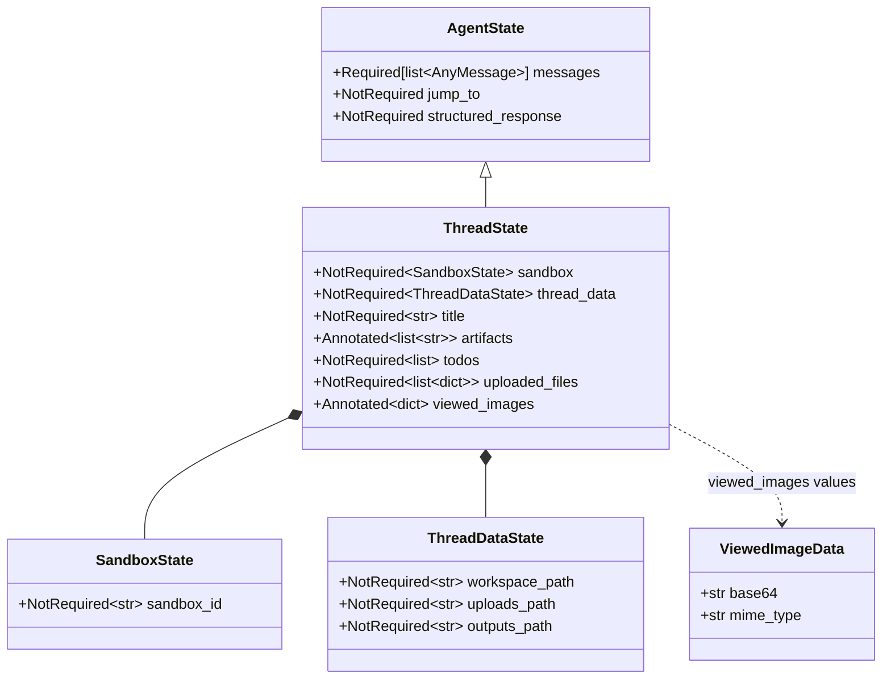

# 04 · ThreadState 状态模型与 Reducer

> 03 篇结尾说："理解了 ThreadState 之后，再看任何 middleware 才会真的看进去"。这一章兑现承诺：deer-flow 的整个 agent 运行时，所有 18 个 middleware 和所有内置工具，都是在读写**一个共享 TypedDict 对象**。这个对象叫 `ThreadState`，55 行的源代码里藏着 LangGraph 状态合并机制的全部精髓。

---

## 1. 模块定位（Why this matters）

LangGraph 是一个**状态机框架**。所谓"图"，本质上是节点之间共享一个 state（字典），节点的输出会按字段名 merge 回 state。**state 的 schema 决定了能放什么、怎么 merge**。

deer-flow 在 LangChain 官方的 `AgentState` 之上加了 6 个字段，并给其中两个字段挂了**自定义 reducer**：

```python
class ThreadState(AgentState):
    sandbox: NotRequired[SandboxState | None]
    thread_data: NotRequired[ThreadDataState | None]
    title: NotRequired[str | None]
    artifacts: Annotated[list[str], merge_artifacts]           # ← 带 reducer
    todos: NotRequired[list | None]
    uploaded_files: NotRequired[list[dict] | None]
    viewed_images: Annotated[dict[str, ViewedImageData], merge_viewed_images]   # ← 带 reducer
```

不读这一章会错过 4 个关键认知：

1. **LangGraph state 合并的"默认行为是覆盖"**：节点返回 `{"title": "hello"}` 会直接覆盖原值。要"追加 / 去重 / 清空"必须用 `Annotated[..., reducer]` 显式声明。
2. **`merge_viewed_images` 的"空 dict 等于清空"是个反直觉但必要的设计**：它让 `ViewImageMiddleware` 能在 LLM 看完图后把 base64 数据清掉，避免 ContextVar 在多轮里累积（base64 一张图可能几百 KB，3 张就把 prompt 炸了）。
3. **`NotRequired` vs `Required`**：`messages` 是 `Required[Annotated[list, add_messages]]`，意味着必须有；其它字段是 `NotRequired`，意味着可以缺失。中间件读取时必须 `state.get(field, default)` 而不能 `state[field]`。
4. **三个易混淆的"状态/上下文"**：
   - `ThreadState`：LangGraph 状态，按字段名合并，跨节点共享，持久化到 checkpointer。
   - `RunContext`：deer-flow 自己定义的 dataclass（`runtime/runs/manager.py`），装基础设施单例（checkpointer/store/event_store），**不进 state**。
   - `RunnableConfig.configurable`：LangChain 标准的"per-call 配置"（thread_id、model_name、is_plan_mode），**不进 state**，每次调用都新传。

对应到 Harness 六要素：本章打下的是 **"动态上下文 + 反馈循环"** 的基础——状态是上下文的容器，reducer 是反馈合并的协议。

---

## 2. 源码地图（Source Map）

### 2.1 关键文件清单

| 路径 | 角色 |
|------|------|
| [`packages/harness/deerflow/agents/thread_state.py`](../packages/harness/deerflow/agents/thread_state.py) | `ThreadState` / `SandboxState` / `ThreadDataState` / `ViewedImageData` + 2 个 reducer（55 行全部源码） |
| `.venv/lib/python3.12/site-packages/langchain/agents/middleware/types.py` | 父类 `AgentState`（依赖 langchain 1.2+） |
| [`packages/harness/deerflow/agents/middlewares/thread_data_middleware.py`](../packages/harness/deerflow/agents/middlewares/thread_data_middleware.py) | `thread_data` 字段的唯一写入方 |
| [`packages/harness/deerflow/sandbox/middleware.py`](../packages/harness/deerflow/sandbox/middleware.py) | `sandbox` 字段的唯一写入方 |
| [`packages/harness/deerflow/agents/middlewares/title_middleware.py`](../packages/harness/deerflow/agents/middlewares/title_middleware.py) | `title` 字段的唯一写入方 |
| [`packages/harness/deerflow/agents/middlewares/uploads_middleware.py`](../packages/harness/deerflow/agents/middlewares/uploads_middleware.py) | `uploaded_files` 字段的唯一写入方 |
| [`packages/harness/deerflow/agents/middlewares/todo_middleware.py`](../packages/harness/deerflow/agents/middlewares/todo_middleware.py) | `todos` 字段的读写方 |
| [`packages/harness/deerflow/tools/builtins/present_file_tool.py`](../packages/harness/deerflow/tools/builtins/present_file_tool.py) | `artifacts` 字段的唯一写入方（工具，不是 middleware） |
| [`packages/harness/deerflow/tools/builtins/view_image_tool.py`](../packages/harness/deerflow/tools/builtins/view_image_tool.py) | `viewed_images` 字段的写入方 |
| [`packages/harness/deerflow/agents/middlewares/view_image_middleware.py`](../packages/harness/deerflow/agents/middlewares/view_image_middleware.py) | `viewed_images` 字段的读取方（注入 base64 给 LLM） |

### 2.2 关键符号速查表

| 符号 | 文件:行 | 一句话职责 |
|------|---------|-----------|
| `class ThreadState(AgentState)` | `thread_state.py:48` | 主状态 schema |
| `class SandboxState(TypedDict)` | `thread_state.py:6` | 嵌套：`sandbox_id` |
| `class ThreadDataState(TypedDict)` | `thread_state.py:10` | 嵌套：`workspace_path / uploads_path / outputs_path` |
| `class ViewedImageData(TypedDict)` | `thread_state.py:16` | 嵌套：`base64 / mime_type` |
| `merge_artifacts(existing, new)` | `thread_state.py:21` | 拼接 + dict.fromkeys 去重保序 |
| `merge_viewed_images(existing, new)` | `thread_state.py:31` | 普通 merge + 空 dict 清空特例 |
| `Annotated[list[str], merge_artifacts]` | `thread_state.py:52` | reducer 通过 Annotated 元数据挂载 |
| `Annotated[dict[...], merge_viewed_images]` | `thread_state.py:55` | 同上 |
| `class AgentState(TypedDict)` | langchain types.py:350 | 父类，自带 `messages / jump_to / structured_response` |
| `Required[Annotated[list, add_messages]]` | langchain types.py:353 | 消息列表用 LangGraph 内置 reducer |

### 2.3 ThreadState 字段全景



### 2.4 字段所有权矩阵

| 字段 | Reducer | 写入方 | 读取方 | 何时清空 |
|------|---------|-------|--------|---------|
| `messages` | `add_messages`（LangChain 内置） | 所有 middleware / tool | LLM 节点 + 所有 middleware | 不清空，靠 SummarizationMiddleware 折叠 |
| `sandbox` | 无（默认覆盖） | `SandboxMiddleware.before_agent` | 所有沙箱工具 + Audit | `SandboxMiddleware.after_agent`（条件） |
| `thread_data` | 无 | `ThreadDataMiddleware.before_agent` | 沙箱工具（路径翻译）、`present_file_tool`、`view_image_tool` | 不清空（thread 生命周期内复用） |
| `title` | 无 | `TitleMiddleware.after_agent` | Gateway 写 thread metadata | 不清空 |
| `artifacts` | `merge_artifacts`（去重保序） | `present_file_tool` | Gateway 序列化给前端 | 不清空（追加为主） |
| `todos` | 无 | `TodoMiddleware` + `write_todos` tool | TodoMiddleware 注入 prompt + Gateway | 不清空 |
| `uploaded_files` | 无 | `UploadsMiddleware.before_agent`（每轮重算） | UploadsMiddleware 注入 first HumanMessage | 每轮覆盖 |
| `viewed_images` | `merge_viewed_images`（带"空 dict 清空"特例） | `view_image_tool` | `ViewImageMiddleware` 注入 base64 给 LLM | LLM 看完图后由 ViewImageMiddleware 返回 `{}` 清空 |

> 这张矩阵是本章最重要的一张表。每一个字段都有唯一的"写入方"和明确的"清空策略"。**新加字段时如果不能填这张表，那这个字段的设计就有问题**。

---

## 3. 核心逻辑精读（Deep Dive）

### 3.1 全部源码 55 行

```python
# packages/harness/deerflow/agents/thread_state.py:1-55
from typing import Annotated, NotRequired, TypedDict

from langchain.agents import AgentState


class SandboxState(TypedDict):
    sandbox_id: NotRequired[str | None]


class ThreadDataState(TypedDict):
    workspace_path: NotRequired[str | None]
    uploads_path: NotRequired[str | None]
    outputs_path: NotRequired[str | None]


class ViewedImageData(TypedDict):
    base64: str
    mime_type: str


def merge_artifacts(existing: list[str] | None, new: list[str] | None) -> list[str]:
    """Reducer for artifacts list - merges and deduplicates artifacts."""
    if existing is None:
        return new or []
    if new is None:
        return existing
    # Use dict.fromkeys to deduplicate while preserving order
    return list(dict.fromkeys(existing + new))


def merge_viewed_images(existing: dict[str, ViewedImageData] | None, new: dict[str, ViewedImageData] | None) -> dict[str, ViewedImageData]:
    """Reducer for viewed_images dict - merges image dictionaries.

    Special case: If new is an empty dict {}, it clears the existing images.
    This allows middlewares to clear the viewed_images state after processing.
    """
    if existing is None:
        return new or {}
    if new is None:
        return existing
    # Special case: empty dict means clear all viewed images
    if len(new) == 0:
        return {}
    # Merge dictionaries, new values override existing ones for same keys
    return {**existing, **new}


class ThreadState(AgentState):
    sandbox: NotRequired[SandboxState | None]
    thread_data: NotRequired[ThreadDataState | None]
    title: NotRequired[str | None]
    artifacts: Annotated[list[str], merge_artifacts]
    todos: NotRequired[list | None]
    uploaded_files: NotRequired[list[dict] | None]
    viewed_images: Annotated[dict[str, ViewedImageData], merge_viewed_images]
```

让我们逐块分析。

### 3.2 父类 `AgentState`（来自 langchain 1.2+）

```python
# .venv/.../langchain/agents/middleware/types.py:350-356
class AgentState(TypedDict, Generic[ResponseT]):
    """State schema for the agent."""

    messages: Required[Annotated[list[AnyMessage], add_messages]]
    jump_to: NotRequired[Annotated[JumpTo | None, EphemeralValue, PrivateStateAttr]]
    structured_response: NotRequired[Annotated[ResponseT, OmitFromInput]]
```

**3 个细节**：

1. **`TypedDict` 而不是 Pydantic `BaseModel`**：LangGraph 的状态系统是字典语义，性能与 Python 原生 dict 一致，没有 Pydantic 验证开销。代价是字段类型只在静态检查时生效，运行时不强制。
2. **`Required[Annotated[list, add_messages]]`**：双层 typing 包装。`Required` 是"必填"的元信息；`Annotated[..., add_messages]` 是给 LangGraph 看的 reducer 提示。
3. **`add_messages`** 是 LangGraph 内置 reducer，它会按 message id 去重，同 id 则后者覆盖前者（典型用例：LLM 流式 chunk 累积成 final message）。

### 3.3 嵌套 TypedDict 的 3 个小类

```python
class SandboxState(TypedDict):
    sandbox_id: NotRequired[str | None]
```

**为什么外面包一层？** 把 `sandbox_id` 放进嵌套类而不是直接 `sandbox_id: str | None` 平铺在 `ThreadState` 顶层，是为了**预留扩展位**——未来可能要加 `sandbox_type / acquired_at / pool_index` 等字段。这种"先包一个外层 dict，里面只放 NotRequired 字段"的模式在 deer-flow 出现 3 次（SandboxState / ThreadDataState / ViewedImageData），体现了"字段分组 + 可演进"的设计意图。

**`ViewedImageData` 的两个字段是 Required（不带 NotRequired）**：因为它代表的是单张图的元数据，缺一不可——没有 base64 就没意义、没有 mime_type 就不能 inline 注入。这跟 SandboxState 的"可能还没分配 sandbox_id" 是不同的语义。

### 3.4 `merge_artifacts`：去重 + 保序

```python
def merge_artifacts(existing: list[str] | None, new: list[str] | None) -> list[str]:
    """Reducer for artifacts list - merges and deduplicates artifacts."""
    if existing is None:
        return new or []
    if new is None:
        return existing
    # Use dict.fromkeys to deduplicate while preserving order
    return list(dict.fromkeys(existing + new))
```

**逐行剖析**：

- `existing is None`：首次写入，没有历史 artifacts。返回 `new or []` 是为了避免回 `None`（reducer 的契约是返回非 None list）。
- `new is None`：节点没动 artifacts，保留原值。
- `list(dict.fromkeys(existing + new))`：**这一行是关键**。`dict.fromkeys` 用每个元素当 key、`None` 当 value 构造 dict，Python 3.7+ 的 dict 保插入顺序，最后 `list()` 还原成列表。**效果是去重保序**，比 `set` 的去重快得多且不打乱顺序。

**为什么 artifacts 需要 reducer？** 看用法：

```python
# packages/harness/deerflow/tools/builtins/present_file_tool.py:115-121
# The merge_artifacts reducer will handle merging and deduplication
return Command(
    update={
        "artifacts": normalized_paths,
        "messages": [ToolMessage("Successfully presented files", tool_call_id=tool_call_id)],
    },
)
```

`present_files` 工具一次调用只返回 *本次* 要展示的文件。如果不去重：

- 用户多次调用 `present_files`（例如先展示 `report.md`，后来又展示 `report.md` 和 `chart.png`），artifacts 会变成 `["report.md", "report.md", "chart.png"]`，前端会出现重复条目。
- 多个并行 task（subagent 模式下）同时调 `present_files`，也会引入重复。

**`set(...)` 不行的原因**：`set` 在 Python 里不保序。`{"a", "b", "c"}` 转回 list 后顺序不定，前端展示顺序会乱跳。`dict.fromkeys` 是最简洁的保序去重写法。

### 3.5 `merge_viewed_images`：那个"空 dict 等于清空"的反直觉特例

```python
def merge_viewed_images(existing, new):
    """Reducer for viewed_images dict - merges image dictionaries.

    Special case: If new is an empty dict {}, it clears the existing images.
    This allows middlewares to clear the viewed_images state after processing.
    """
    if existing is None:
        return new or {}
    if new is None:
        return existing
    # Special case: empty dict means clear all viewed images
    if len(new) == 0:
        return {}
    # Merge dictionaries, new values override existing ones for same keys
    return {**existing, **new}
```

**这个 reducer 是 deer-flow 整个 state 设计里最巧妙的一段**。问题背景：

1. `view_image_tool` 把图片读出来 base64 编码塞进 `viewed_images: {path: {base64, mime_type}}`。
2. `ViewImageMiddleware` 在下一轮 LLM 调用前，把所有 `viewed_images` 转成 `image_url` block 注入 first HumanMessage，让 LLM 能"看到"图。
3. 看完之后，**base64 数据已经在消息里了，state 里的副本就是冗余**——而且每张图可能几百 KB，3-5 张就足以把后续每一轮的 prompt 都拖肥。
4. 所以 ViewImageMiddleware 需要"清空 viewed_images"——但 LangGraph 的 reducer 默认行为是 merge，**直接返回 `{}` 会被认为是"没新增"而被忽略**。

**deer-flow 的解法**：在 reducer 里加一行 `if len(new) == 0: return {}`，给"空 dict"赋予"清空"的特殊语义。这样 ViewImageMiddleware 只需要 `return {"viewed_images": {}}` 就能清空。

```python
# packages/harness/deerflow/agents/middlewares/view_image_middleware.py 的清空场景（注释行 92-93）
# Return a properly formatted text block, not a plain string array
# 注入 image 之后，state 中可以返回 {"viewed_images": {}} 来清空
```

**对比常见替代方案**：

| 方案 | 优点 | 缺点 |
|------|------|------|
| **A. ViewImageMiddleware 直接覆写 state["viewed_images"] = {}**（不走 reducer） | 简单 | 违反 LangGraph 规范，绕过 checkpointer 序列化 |
| **B. 用 `_CLEAR_SENTINEL = object()` 当哨兵值** | 显式 | 哨兵无法被 JSON 序列化，checkpointer 报错 |
| **C. 给 reducer 加 `"空 dict 清空"` 特例**（deer-flow） | 兼容 LangGraph 规范、JSON 友好 | 需要在文档/代码注释说明这个特例 |

**作者的精妙之处**：选了 C，并且把这条特例**写在 docstring 里**（行 36-37：`"Special case: ..."`），让任何看这段代码的人都不会误以为 reducer 是普通的"merge"。

**可能的改进空间**：如果未来需要"清空单张图"，目前的 reducer 不支持（`{path: None}` 不会触发删除）。可以扩展为 `value=None` 表示"删 key"。

### 3.6 `Annotated[..., reducer]` 怎么被 LangGraph 识别？

```python
class ThreadState(AgentState):
    artifacts: Annotated[list[str], merge_artifacts]
    viewed_images: Annotated[dict[str, ViewedImageData], merge_viewed_images]
```

LangGraph 在创建 `StateGraph(ThreadState)` 时会：

1. 用 `typing.get_type_hints(include_extras=True)` 读出每个字段的类型注解。
2. 检查注解是否是 `Annotated`，如果是就取 `__metadata__`。
3. 在 metadata 里找 callable —— 找到的话作为 reducer 注册到这个 channel；找不到就用默认的"last write wins"。

**没带 `Annotated` 的字段（`sandbox / thread_data / title / todos / uploaded_files`）**就是默认覆盖语义。这正是 deer-flow 的有意为之：

- `sandbox`：一个 thread 只对应一个 sandbox，覆盖语义就够。
- `thread_data`：一次性算好的路径，整轮不变。
- `title`：一次性生成。
- `todos`：完整列表整体替换（TodoMiddleware 每次返回完整列表）。
- `uploaded_files`：每轮 UploadsMiddleware 重算并覆盖。

**只有 `artifacts` 和 `viewed_images` 是 "多轮增量积累 / 跨工具并发追加"**的语义，才需要 reducer。

---

## 4. 关键问题答疑（Key Questions）

### Q1：为什么不用 Pydantic `BaseModel` 而用 `TypedDict`？

LangGraph 的状态系统就是基于 dict 的（reducer 看到的是 dict，channel 之间传递的是 dict）。用 `TypedDict` 是为了：

1. **零运行时开销**：`state["messages"]` 等于普通 dict 访问，没有 Pydantic 的 validation overhead。
2. **JSON 兼容**：dict 天然可以 `json.dumps`（checkpointer 序列化用）。Pydantic model 要走 `model_dump`。
3. **静态检查仍然有效**：mypy / Pylance 把 `TypedDict` 看作严格类型；运行时 Python 看到的就是普通 dict。

代价：字段类型不强制。但 deer-flow 的 middleware 都很守规矩（每个字段只有一个写入方），实际不会出岔子。

### Q2：`messages` 用的是什么 reducer？

LangChain 内置的 `add_messages`（`from langgraph.graph.message import add_messages`）。它的行为：

- 列表拼接。
- 按 message id 去重——同 id 的消息后者覆盖前者。
- 兼容流式：LLM streaming 时多个 chunk 共享同一个 message id，最终累积成 final message。

**为什么 `messages` 用内置 reducer 而 `artifacts` 用自定义？** 因为 message 有 id 概念可以去重，而 artifact 就是字符串路径，需要自己写去重逻辑。

### Q3：`NotRequired` 的字段没填，`state.get("field")` 返回什么？

返回 `None`（不是空字符串、不是空列表）。所以 middleware 里读的标准写法是：

```python
todos: list[Todo] = state.get("todos") or []  # type: ignore[assignment]
```

注意 `or []` ——`state.get("todos")` 可能返回 `None` 也可能返回 `[]`（已初始化但空），统一兜底成 `[]`。

### Q4：如果多个并发分支（subagent）同时写 `artifacts`，会冲突吗？

不会。LangGraph 的 reducer 设计就是为并发场景：

- 每个并发分支独立产出 `update={"artifacts": [...]}`。
- LangGraph 把所有 update 收集后，按字段名调用 reducer 合并。
- `merge_artifacts(existing, new1)`、`merge_artifacts(result, new2)`……顺序应用。
- `dict.fromkeys` 自带去重，重复的不会进最终结果。

所以即使 subagent A 和 subagent B 同时 present 同一份文件，最终 artifacts 也只会有一份。

### Q5：`thread_data` 字段什么时候清空？为什么不在 after_agent 清？

**永远不清**（直到 thread 被删除）。因为 `workspace_path / uploads_path / outputs_path` 是 thread 物理目录的路径——thread 多轮对话期间，这个目录都在用，每轮都重新算路径既浪费也无意义。

`ThreadDataMiddleware.before_agent`（[thread_data_middleware.py:82](../packages/harness/deerflow/agents/middlewares/thread_data_middleware.py)）每次都会重新算并写入，但因为算出来的值一样，效果上等同"幂等地刷新"。

### Q6：`ThreadState` vs `RunContext` vs `Configurable` 到底怎么区分？

这是 deer-flow 新人最容易混的三个概念：

| 维度 | `ThreadState` | `RunContext` | `RunnableConfig.configurable` |
|------|---------------|--------------|------------------------------|
| **定义位置** | `agents/thread_state.py:48` | `runtime/runs/manager.py` 附近 | LangChain 标准类型 |
| **形态** | TypedDict（dict 语义） | Python dataclass | dict |
| **生命周期** | 跨节点共享，进 checkpointer，跨多轮对话保留 | 一次 run 的范围 | 一次 invoke/stream 的范围 |
| **典型字段** | `messages / sandbox / artifacts / ...` | `checkpointer / store / event_store / app_config` | `thread_id / model_name / is_plan_mode / subagent_enabled` |
| **谁写谁读** | middleware + tool | Gateway 启动时装配，worker 读 | Gateway router 构造，传给 graph |
| **持久化** | ✅ checkpointer 序列化 | ❌ | ❌ |
| **是否进 prompt** | `messages` 进，其它字段不直接进 | 不进 | 不进 |

**最简单的判断**：
- 要让"下一次对话能看到"——用 ThreadState。
- 要让"中间件能拿到全局单例"——用 RunContext。
- 要让"这次请求换个 model"——用 configurable。

---

## 5. 横向延伸与面试级洞察（Interview-Grade Insights）

### 5.1 Reducer 是 LangGraph 的并发模型

很多人觉得 LangGraph 的图就是 DAG + state，但其实 reducer 是它处理并发的核心机制。对比：

| 框架 | 并发分支结果合并 |
|------|------------------|
| **LangGraph** | 各分支独立产出 partial state，reducer 按字段合并 |
| **AutoGen** | 没有"图状态"，message passing 风格，并发结果靠 conversation order |
| **CrewAI** | task 顺序执行为主，并发是次要场景 |
| **OpenAI Swarm** | 单循环 handoff，没有真正并发 |

**deer-flow 在 ThreadState 上的 reducer 设计是 LangGraph 并发能力的工程示范**：
- `messages` 用内置 `add_messages` 处理 LLM 流式 chunk 合并。
- `artifacts` 用 `merge_artifacts` 处理多 subagent 并发 `present_files`。
- `viewed_images` 用 `merge_viewed_images` 处理"积累后清空"语义。

### 5.2 "空值哨兵清空"反模式 vs 这次的合理性

通常我们觉得"空 dict 等于清空"是反模式——它让 reducer 行为非显式。但在 deer-flow 这个具体场景下：

- ✅ 不引入 sentinel object（不破坏 JSON 序列化）。
- ✅ 行为在 reducer 函数的 docstring 里明确说明。
- ✅ 使用方（ViewImageMiddleware）只有一个，集中可控。

**面试金句**：reducer 的"清空"语义是一个工程权衡——干净的方案是引入 sentinel 类型（如 `Clear` 单例），但代价是破坏 JSON 兼容；deer-flow 选择给"空 dict"赋予特殊含义，因为它有 docstring 说明、有唯一使用方、且有 checkpointer 序列化的硬约束。

### 5.3 vs Redux / Zustand 状态管理

JS 生态的状态管理（Redux）也是 reducer 思想：

```javascript
// Redux
function reducer(state, action) {
    switch(action.type) {
        case "ADD_ARTIFACT": return {...state, artifacts: [...state.artifacts, action.payload]}
    }
}
```

LangGraph 的 reducer 是**字段级**的（每个字段独立 reducer），更细粒度。Redux 是**整 state 级**的 switch-case。

deer-flow 的字段级 reducer 比 Redux 风格更适合 agent 场景——agent 各种 middleware/tool 关心的字段子集不同，字段级 reducer 让"我只关心我写的那个字段"成为可能。

---

## 6. 实操教程（Hands-on Lab）

### 6.1 最小可运行示例：直接观察 reducer 工作

```python
# backend/debug_state.py
"""演示 ThreadState 的 reducer 行为，无需起 agent"""
from deerflow.agents.thread_state import (
    ThreadState,
    merge_artifacts,
    merge_viewed_images,
)

print("=== merge_artifacts (去重保序) ===")
print(merge_artifacts(["a.md", "b.png"], ["a.md", "c.csv"]))
#  → ['a.md', 'b.png', 'c.csv']     ← a.md 去重，顺序保留

print(merge_artifacts(None, ["x"]))   # → ['x']
print(merge_artifacts(["y"], None))   # → ['y']
print(merge_artifacts(None, None))    # → []

print()
print("=== merge_viewed_images (空 dict = 清空) ===")
img1 = {"img/a.png": {"base64": "AAA", "mime_type": "image/png"}}
img2 = {"img/b.png": {"base64": "BBB", "mime_type": "image/png"}}

merged = merge_viewed_images(img1, img2)
print("merge:", list(merged.keys()))      # ['img/a.png', 'img/b.png']

cleared = merge_viewed_images(merged, {})
print("clear:", cleared)                  # {}  ← 空 dict 特例触发！

# 对比：如果 new=None 反而保留 existing
preserved = merge_viewed_images(merged, None)
print("None preserves:", list(preserved.keys()))   # ['img/a.png', 'img/b.png']
```

跑：`cd backend && PYTHONPATH=. uv run python debug_state.py`

**能观察到的 4 个事实**：

1. artifacts 去重时 `a.md` 只剩一份，**第一次出现的位置保留**。
2. `new=None` 不等于 `new={}`：前者保留 existing，后者清空。
3. `existing=None` 不会抛 KeyError——reducer 优雅处理首次写入。
4. `merge_viewed_images` 同 key 时 new 覆盖 existing（行 46：`{**existing, **new}`）。

### 6.2 Debug 任务清单

#### 实验 ①：观察 reducer 在 LangGraph 中的真实调用

在 `merge_artifacts` 里打日志：

```python
# 临时改 packages/harness/deerflow/agents/thread_state.py:21
import logging
logger = logging.getLogger(__name__)

def merge_artifacts(existing, new):
    logger.warning("merge_artifacts: existing=%r new=%r", existing, new)
    if existing is None:
        return new or []
    ...
```

跑一次正常对话，让 agent 调用 `present_files` 至少 2 次。观察日志：

- 第一次调用时 `existing=[]`、`new=["...report.md"]`。
- 第二次调用时 `existing=["...report.md"]`、`new=["...chart.png"]`。
- 用日志验证 reducer 真的被 LangGraph 调度。

**还原**：`git checkout packages/harness/deerflow/agents/thread_state.py`

#### 实验 ②：故意触发"空 dict 清空"

写一个最小自定义 middleware，强制清空 viewed_images：

```python
# 临时塞进 backend/debug_clear_images.py
from langchain.agents.middleware import AgentMiddleware
from langgraph.runtime import Runtime

class ForceCleanMiddleware(AgentMiddleware):
    def before_agent(self, state, runtime):
        print(">>> Before clean:", list(state.get("viewed_images", {}).keys()))
        return {"viewed_images": {}}   # 触发空 dict 清空
```

把它注入 `_build_middlewares` 试跑（实际操作 06 篇会详谈 `@Next/@Prev` 机制）。观察：清空后下一个 middleware 看到 `viewed_images == {}`。

#### 实验 ③：故意触发 NotRequired 读取的 None bug

```python
# PYTHONPATH=. uv run python
from typing import get_type_hints
from deerflow.agents.thread_state import ThreadState

print(get_type_hints(ThreadState, include_extras=True))
# 会打印每个字段的完整 typing，包括 Annotated 里的 reducer 函数对象
```

**能学到**：`Annotated[list[str], <function merge_artifacts>]` 这种结构就是 LangGraph 在 import 时拿到的"reducer 注册表"。

---

## 7. 与下一模块的衔接

读完本章你应该能：

- 用 55 行源码逐字解释 ThreadState 每个字段的设计意图。
- 知道 `merge_artifacts` / `merge_viewed_images` 在并发场景下的行为。
- 区分 ThreadState / RunContext / Configurable 三个易混淆物。
- 给一张"字段所有权矩阵"——任意 middleware/tool 在动 ThreadState 的哪一格。

但你还**没看到**：

- `make_lead_agent(config)` 和 `create_deerflow_agent(...)` 到底什么关系？为什么 deer-flow 要弄两套 agent 工厂？
- `RuntimeFeatures` 那个 `@Next` / `@Prev` 装饰器是干啥的——让"第三方往中间件链里插自己的 middleware"成为可能？
- 中间件链具体怎么按 14-18 节装配？

这些是 **05 篇（Agent 工厂双轨：make_lead_agent vs create_deerflow_agent）** 的核心。看完 05 后再去 **06 篇（中间件链总览）** 才能真的把 deer-flow 的中枢机制理透。

---

📌 **本章已交付**。请你检查后告诉我：
- 哪几段读起来不顺？
- 是否要补"messages 字段的 add_messages reducer 细节 + LLM 流式 chunk 合并"这一节？
- 还是直接进入 05 篇？
