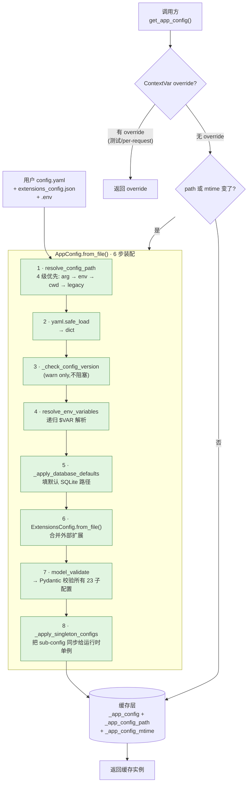
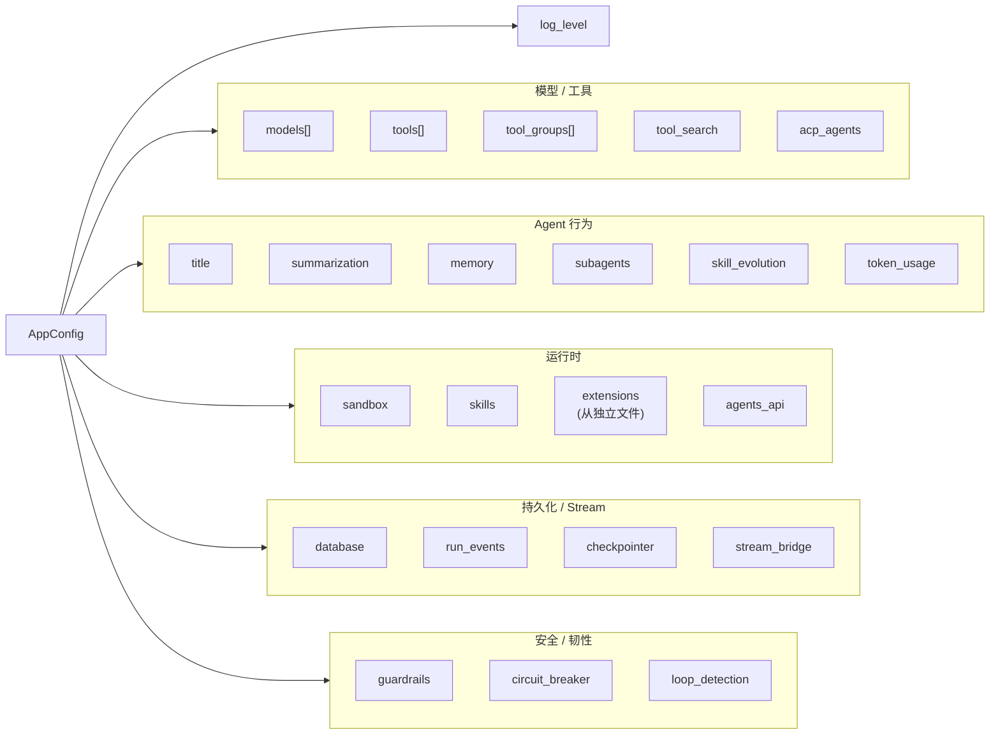

# 05 · 配置体系：AppConfig + ExtensionsConfig + 反射装配

> 这是「项目认知层」收官的最后一份，也是后续所有"可插拔"章节（沙箱 / 工具 / MCP / 模型 / Provider / Guardrails / Channels / Persistence）的**前置心智模型**。
>
> 读完本章你应该不再把"配置"当 YAML 当字典看，而是看成 **DI 容器 + 反射工厂 + 缓存策略 + 版本治理** 的复合体。这正是高级 Agent 工程师面试中"项目工程化能力"的高频考点。

---

## 🎯 学习目标

读完这份文档，你能回答：

1. **DeerFlow 把配置切成了 23 个子 Pydantic 模型聚合成 `AppConfig`**（外加 `ExtensionsConfig` 单独成文件）。为什么不放一个大类里？这种"配置切片化"的工程红利是什么？
2. **`$ENV_VAR` 解析机制**：DeerFlow 怎么递归地把 `api_key: $OPENAI_API_KEY` 替换成真值？**AppConfig 在 $VAR 缺失时 raise，ExtensionsConfig 在 $VAR 缺失时静默置空 ""** —— 这两种"看似不一致"的策略各有什么理由？
3. **配置缓存为什么不能用 `@lru_cache`？** `get_app_config()` 的"路径变更 + mtime 比对"双重失效是什么？什么场景能踩到？
4. **`resolve_variable("deerflow.community.aio_sandbox:AioSandboxProvider")` 内部 5 行干了什么？** 缺包时怎么产生"actionable hint"？反射加载相对硬编码工厂有什么取舍？
5. **`AppConfig` 的 ContextVar override 栈（`push_current_app_config` / `pop_current_app_config`）** 是为什么？测试与生产分别用得到吗？

---

## 🗂️ 源码定位

| 关注点 | 文件 | 关键符号 |
|---|---|---|
| `AppConfig` 聚合根（455 行） | `packages/harness/deerflow/config/app_config.py` | `AppConfig` L83；`resolve_config_path` L111；`from_file` L141；`resolve_env_variables` L268；`_check_config_version` L223；`_apply_singleton_configs` L185；`get_app_config` L358；ContextVar 栈 L334-L335 + L440-L455 |
| 23 个子配置模型 | `packages/harness/deerflow/config/` | `model_config.py`、`tool_config.py`、`sandbox_config.py`、`skills_config.py`、`memory_config.py`、`summarization_config.py`、`title_config.py`、`token_usage_config.py`、`subagents_config.py`、`guardrails_config.py`、`loop_detection_config.py`、`tool_search_config.py`、`agents_api_config.py`、`acp_config.py`、`database_config.py`、`run_events_config.py`、`checkpointer_config.py`、`stream_bridge_config.py`、`skill_evolution_config.py`、`agents_config.py`、`tracing_config.py`、`extensions_config.py` |
| 独立成文件的 `ExtensionsConfig` | `packages/harness/deerflow/config/extensions_config.py`（264 行） | `ExtensionsConfig` L57；`resolve_env_variables` L151；`from_file` L124；`get_enabled_mcp_servers` L182；`is_skill_enabled` L190 |
| 反射装配 | `packages/harness/deerflow/reflection/resolvers.py`（96 行） | `resolve_variable` L25；`resolve_class` L73；`MODULE_TO_PACKAGE_HINTS` L3；`_build_missing_dependency_hint` L11 |
| 运行时路径解析 | `packages/harness/deerflow/config/runtime_paths.py` | `project_root` L7；`runtime_home` L19；`resolve_path` L26；`existing_project_file` L34 |
| 反射的调用现场（9 处） | grep 出来的: `sandbox_provider.py`、`models/factory.py`、`mcp/tools.py`、`tools/tools.py`、`guardrails/provider.py`、`skills/storage/__init__.py`、`agents/middlewares/tool_error_handling_middleware.py` | 这些就是"插件挂载点" |
| 配置入口示例 | `config.example.yaml` / `config.yaml`（项目根） + `extensions_config.example.json` / `extensions_config.json`（项目根） | 用户实际编辑的两个文件 |

---

## 🧭 架构图

### 1. 配置加载全流程



### 2. AppConfig 23 子配置版图（按"领域"分组）



> **数一数：23 个子配置 + 1 个 ExtensionsConfig（外部文件）+ 4 个环境变量（`DEER_FLOW_CONFIG_PATH` / `DEER_FLOW_EXTENSIONS_CONFIG_PATH` / `DEER_FLOW_PROJECT_ROOT` / `DEER_FLOW_HOME`）= 总览所提的"26 子配置"** —— 这是 DeerFlow 配置面的实际广度。

---

## 🔍 核心逻辑讲解

### Part 1 · 为什么切成 23 个子 Pydantic 模型而不是一个 God Class？

打开 `app_config.py` 顶部 33 行 import，会看到：

```python
from deerflow.config.acp_config import ACPAgentConfig, load_acp_config_from_dict
from deerflow.config.agents_api_config import AgentsApiConfig, load_agents_api_config_from_dict
from deerflow.config.checkpointer_config import CheckpointerConfig, load_checkpointer_config_from_dict
from deerflow.config.database_config import DatabaseConfig
...
```

**模式很明显**：每个子配置 ≈ 一个 `XxxConfig` Pydantic 模型 + 一个 `load_xxx_config_from_dict()` 应用函数。这是 **领域内聚 (DDD-style)** 的切法。

工程红利：

| 红利 | 说明 |
|---|---|
| **独立测试** | `tests/test_memory_config.py` 只需要 import `MemoryConfig`，不需要构造整个 AppConfig |
| **独立演化** | 加一个 `loop_detection_config.py` 不影响其他 22 个模型 |
| **缩短 ImportError 链** | 改 `subagents_config.py` 的字段名只影响 import 它的模块；如果是一个 God class，整个 app 启动就崩 |
| **可选依赖友好** | `acp_config.py` 缺失时整体仍能跑 |
| **Pydantic 验证局部化** | 每个子模型自己 `@field_validator`，错误消息精准定位 |

**对比反例**：早期 LangChain 把所有 config 放进 `langchain.utils.config_dict`，结果 v0.1 → v0.3 期间字段重命名时多次出现"改一处崩一片"。

### Part 2 · 配置加载 6 步装配的精读

#### Step 1 · `resolve_config_path`：4 级优先策略（L111-L139）

```python
@classmethod
def resolve_config_path(cls, config_path: str | None = None) -> Path:
    if config_path:           # 1. 显式参数(测试/脚本场景)
        ...
    elif os.getenv("DEER_FLOW_CONFIG_PATH"):   # 2. 环境变量(Docker/CI 场景)
        ...
    else:
        project_config = existing_project_file(("config.yaml",))   # 3. 项目根
        if project_config:
            return project_config
        for path in _legacy_config_candidates():    # 4. 兼容老 monorepo 路径
            if path.exists():
                return path
        raise FileNotFoundError(...)
```

**4 级优先的设计动机**：
- L1 给测试 / 脚本 / 嵌入式 SDK 用户（`DeerFlowClient(config_path=...)`）
- L2 给 Docker / K8s / CI（环境变量是容器化的标准注入方式）
- L3 给本地开发者（`make dev` 直接 cwd）
- L4 给老 monorepo 路径（`_legacy_config_candidates()`：backend/config.yaml 和 repo_root/config.yaml）—— 向后兼容

**为什么不用 `appdirs` / `XDG_CONFIG_HOME`** ？答：配置是项目级别的（不是用户级别），不同项目要不同 `config.yaml`，全局 XDG 反而错。

#### Step 2 · `resolve_env_variables`：递归 `$VAR` 解析（L268-L291）

```python
@classmethod
def resolve_env_variables(cls, config: Any) -> Any:
    if isinstance(config, str):
        if config.startswith("$"):
            env_value = os.getenv(config[1:])
            if env_value is None:
                raise ValueError(f"Environment variable {config[1:]} not found ...")   # ⚠️ 严格策略
            return env_value
        return config
    elif isinstance(config, dict):
        return {k: cls.resolve_env_variables(v) for k, v in config.items()}
    elif isinstance(config, list):
        return [cls.resolve_env_variables(item) for item in config]
    return config
```

**精读要点**：
- **只识别完全以 `$` 开头的字符串**（不是 `$$` 转义、不是中间出现 `$`）—— 没用 `string.Template` 这类完整模板引擎，是**有意降级**，避免歧义。
- **递归处理 dict 和 list** —— 嵌套到任意深度都能解。模型配置那种 `models[0].api_key = $OPENAI_API_KEY` 自然就行。
- **缺失环境变量直接 raise** —— 严格策略，宁可启动失败也不让 agent 跑在错误 key 上。

#### Step 3 · ExtensionsConfig 的**不同**策略（"严格 vs 宽松"的有意分歧）

打开 `extensions_config.py` L151-L180，**同一个方法名**（也叫 `resolve_env_variables`）行为却不同：

```python
for key, value in config.items():
    if isinstance(value, str):
        if value.startswith("$"):
            env_value = os.getenv(value[1:])
            if env_value is None:
                # Unresolved placeholder — store empty string so downstream
                # consumers (e.g. MCP servers) don't receive the literal "$VAR"
                config[key] = ""               # ⚠️ 宽松策略:静默置空
            else:
                config[key] = env_value
        ...
```

**为什么不一致？这是面试金题**：
- **AppConfig**（核心配置）：如果用户写了 `api_key: $OPENAI_API_KEY` 但环境里没设，agent 跑起来一定 401，**早失败好于晚失败**。
- **ExtensionsConfig**（扩展配置）：MCP server 可选配置（`env: {"X_API_KEY": "$X_KEY"}`），用户可能临时不用某个 server。如果一处缺失就让整个 DeerFlow 拒绝启动，**扩展性破产**。这里宽松策略 + 空串是**让单个 MCP server 优雅退化**而不是拖垮全局。

→ **设计哲学**：核心配置严格 fail-fast；扩展配置宽松 degrade-gracefully。这种"双策略"是配置工程的成熟体现。

#### Step 4 · `_apply_singleton_configs`：子配置同步给运行时单例（L185-L209）

```python
@classmethod
def _apply_singleton_configs(cls, config: Self, acp_agents) -> None:
    previous_checkpointer_config = get_checkpointer_config()

    load_title_config_from_dict(config.title.model_dump())
    load_summarization_config_from_dict(config.summarization.model_dump())
    load_memory_config_from_dict(config.memory.model_dump())
    load_agents_api_config_from_dict(config.agents_api.model_dump())
    ...

    if previous_checkpointer_config != config.checkpointer:
        from deerflow.runtime.checkpointer import reset_checkpointer
        from deerflow.runtime.store import reset_store
        reset_checkpointer()
        reset_store()
```

**精读要点**：
- **每个子配置都有一个 `load_xxx_from_dict` 的入口** —— 把"配置数据"同步给"运行时单例"（如 title middleware 内部缓存的提示词阈值）。这是**典型的 Settings → Runtime 桥接模式**。
- **`previous_checkpointer_config != config.checkpointer` 触发 reset_checkpointer / reset_store** —— 这是热重载的关键：配置改了 checkpointer 后端（如从 sqlite 切到 postgres），就要把 LangGraph 的 Checkpointer 单例摧毁重建。
- **lazy import** 避免循环依赖：`from deerflow.runtime.checkpointer import reset_checkpointer` 放在函数体内。

#### Step 5 · `_check_config_version`：版本治理（L223-L266）

```python
def _check_config_version(cls, config_data: dict, config_path: Path) -> None:
    user_version = int(config_data.get("config_version", 0))
    # 沿 config_path 父目录向上找 config.example.yaml,最多 5 层
    example_path = None
    search_dir = config_path.parent
    for _ in range(5):
        candidate = search_dir / "config.example.yaml"
        if candidate.exists():
            example_path = candidate
            break
        ...
    if example_path is None:
        return    # 找不到示例就放过
    example_version = int(example_data.get("config_version", 0))
    if user_version < example_version:
        logger.warning("Your config.yaml (version %d) is outdated ...")
```

**关键设计：warn-only**。即使版本不一致，也不阻塞启动 —— 只是日志提醒用户跑 `make config-upgrade`。

**这背后是一个版本治理哲学**：
- **配置不该有 breaking change**（新增字段必须给默认值；删字段必须保留兼容期）
- 用户旧 config.yaml + 新 DeerFlow 版本应该能**继续启动**，只是有些新能力默认关
- `config_version` 不是"硬版本"，是"建议升级提示"

### Part 3 · 缓存策略：mtime 比对 + ContextVar 双层

打开 `get_app_config()` L358-L387：

```python
def get_app_config() -> AppConfig:
    runtime_override = _current_app_config.get()     # 层 1:ContextVar override
    if runtime_override is not None:
        return runtime_override

    if _app_config is not None and _app_config_is_custom:   # 层 2:set_app_config 注入的
        return _app_config

    resolved_path = AppConfig.resolve_config_path()
    current_mtime = _get_config_mtime(resolved_path)

    should_reload = (
        _app_config is None
        or _app_config_path != resolved_path        # 路径变了
        or _app_config_mtime != current_mtime       # 文件变了
    )
    if should_reload:
        _load_and_cache_app_config(str(resolved_path))
    return _app_config
```

**为什么不能用 `@lru_cache`？**

| 角度 | `@lru_cache` 不行 | 当前实现行 |
|---|---|---|
| 路径切换 | `lru_cache` 按入参缓存，但 `get_app_config()` 无参 → 切了 `DEER_FLOW_CONFIG_PATH` 没法刷新 | 显式比对 `_app_config_path` |
| 文件修改 | 不感知 mtime → 用户编辑 yaml 后需重启 | mtime 比对自动失效 |
| 测试隔离 | `lru_cache` 是模块级 → 多个测试相互污染 | `reset_app_config()` / `set_app_config()` 都能精确清 |
| 嵌套 override | 不支持 | ContextVar 栈支持嵌套 push/pop |

**热重载实战例子**：
1. `make dev` 启动 DeerFlow → 加载 config.yaml (mtime=t0)
2. 用户在 IDE 改 `models[0].model: gpt-4o-mini` → 文件 mtime 更新为 t1
3. 前端发新 chat → Gateway 调 `get_app_config()` → 检测 mtime 变了 → reload → 新 chat 用新模型
4. **无需重启进程**

这是 DeerFlow `backend/CLAUDE.md` 里"Config Caching"那节描述的真实机制。

#### ContextVar 栈：为什么需要 push/pop？

```python
_current_app_config: ContextVar[AppConfig | None] = ContextVar("...", default=None)
_current_app_config_stack: ContextVar[tuple[AppConfig | None, ...]] = ContextVar("...", default=())

def push_current_app_config(config: AppConfig) -> None:
    stack = _current_app_config_stack.get()
    _current_app_config_stack.set(stack + (_current_app_config.get(),))
    _current_app_config.set(config)

def pop_current_app_config() -> None:
    stack = _current_app_config_stack.get()
    if not stack:
        _current_app_config.set(None)
        return
    previous = stack[-1]
    _current_app_config_stack.set(stack[:-1])
    _current_app_config.set(previous)
```

**应用场景**：
1. **测试**：在测试里临时切配置，跑完恢复，**不污染** singleton。
2. **per-request override**（理论支持）：Gateway 拦截一个 admin 请求，临时用 admin config 跑 agent，结束后弹栈。
3. **嵌套**：测试 A 用配置 A，调用一个 helper 又 push 配置 B，helper 返回时 pop 回 A —— **栈结构保证嵌套正确**。

**为什么是 contextvar 而不是 thread-local？** 答：异步友好。asyncio 任务切换时 contextvar 正确传播；thread-local 在同线程的不同 task 间共享会串扰。

### Part 4 · 反射装配：`resolve_variable` / `resolve_class`

打开 `reflection/resolvers.py`，96 行代码做了 3 件大事：

```python
def resolve_variable[T](variable_path: str, expected_type=None) -> T:
    module_path, variable_name = variable_path.rsplit(":", 1)    # ← 关键分隔符 ":"
    try:
        module = import_module(module_path)
    except ImportError as err:
        ...
        if isinstance(err, ModuleNotFoundError) or err_name == module_root:
            hint = _build_missing_dependency_hint(module_path, err)
            raise ImportError(f"Could not import module {module_path}. {hint}") from err
        raise ImportError(f"Error importing module {module_path}: {err}") from err

    try:
        variable = getattr(module, variable_name)
    except AttributeError as err:
        raise ImportError(f"Module {module_path} does not define a {variable_name} attribute/class") from err

    if expected_type is not None and not isinstance(variable, expected_type):
        raise ValueError(...)

    return variable
```

**精读要点**：

1. **`:` 而不是 `.` 作为分隔符**
   - 写 `deerflow.community.aio_sandbox:AioSandboxProvider`，不是 `deerflow.community.aio_sandbox.AioSandboxProvider`
   - **理由**：明确"模块边界 vs 属性访问"。点号有歧义（module path 自己也带点）；冒号一目了然。
   - 这种风格沿用自 Gunicorn `module:app`、Celery `mymod:task`、LangGraph `module:graph`。

2. **`MODULE_TO_PACKAGE_HINTS` —— actionable error 的核心**
   ```python
   MODULE_TO_PACKAGE_HINTS = {
       "langchain_google_genai": "langchain-google-genai",
       "langchain_anthropic": "langchain-anthropic",
       ...
   }
   ```
   Python 包名与 import 名经常不一致（下划线 vs 连字符）。直接拿 `err.name` 提示 `uv add langchain_anthropic` 会失败 —— 这张映射表把 import 名翻译成 PyPI 安装名。
   **错误提示长这样**：
   ```
   ImportError: Could not import module deerflow.models.X.
   Missing dependency 'langchain_anthropic'.
   Install it with `uv add langchain-anthropic` (or `pip install langchain-anthropic`),
   then restart DeerFlow.
   ```

3. **`expected_type` 验证**
   `resolve_class` 包装在 `resolve_variable` 上，加了一层 `issubclass(model_class, base_class)` 校验。**反射加载 + 类型校验**两件事一次性做掉，调用方不用再手动判类型。

4. **9 个真实调用点**：grep 出来 —— sandbox provider、model factory、MCP tool resolver、tool config resolver、guardrails provider、skills storage 等都用它。**所有"用户在 yaml 写一行 `use: x.y:Z` 就能换实现"的能力**都建在这 96 行上。

**反射加载 vs 硬编码工厂的取舍**：

| 方案 | 反射 (`use: x.y:Z`) | 硬编码工厂 (`if name=="aio": return AioSandboxProvider()`) |
|---|---|---|
| 加新 provider | 写一个类即可，无需改框架代码 | 必须改 factory 函数 |
| 用户体验 | yaml 一行配置 | 用户得 PR 框架仓 |
| 类型安全 | 运行时检查 | 编译时（IDE 高亮） |
| 错误调试 | 错了得跑起来才知道 | 静态检查就能发现 |
| **DeerFlow 选择** | ✅（用户/社区可拓展 sandbox/model/provider） | — |

**DeerFlow 的退路**：`expected_type` 检查 + actionable hint 把反射的两个最大痛点（类型不安全 + 错误难诊断）补到了"够用"的程度。

---

## 🧩 体现的通用 Agent 设计模式

| 模式 | DeerFlow 中的体现 |
|---|---|
| **DI Container（依赖注入容器）** | `AppConfig` 实际上是一个轻量 DI 容器 —— sandbox / model / tool 怎么实例化都被它声明 |
| **Reflection / Plugin Loading** | `resolve_variable` + `use: x.y:Z` = 用户可拔插的能力 |
| **Settings 单例 + ContextVar 栈** | 主线程读 singleton；测试 / 嵌套场景 push/pop |
| **fail-fast vs degrade-gracefully** | AppConfig 严格、ExtensionsConfig 宽松，分场景设防 |
| **Layered Config Resolution** | 4 级优先（arg → env → cwd → legacy）= 12-factor app 配置层级标准 |
| **Schema Evolution / Versioning** | `config_version` + warn-only 升级提示 |

---

## 🧱 与 Agent Harness 六要素的对应关系

| 六要素 | 配置体系怎么提供基础设施 |
|---|---|
| ① 反馈循环 | `loop_detection_config` + `circuit_breaker` 配置可调 |
| ② 记忆持久化 | `memory_config` + `database_config` + `checkpointer_config` |
| ③ 动态上下文 | `summarization_config` + `title_config` + `tool_search_config`（DeferredToolFilter） |
| ④ 安全护栏 | `guardrails_config` + `sandbox_config.allow_host_bash` |
| ⑤ 工具集成 | `tools` / `tool_groups` / `extensions.mcp_servers` —— **完全靠反射 + 配置文件**装配 |
| ⑥ 可观测性 | `token_usage_config` + `run_events_config` + tracing 走 `LANGSMITH_*` 环境变量 |

**关键洞察**：六要素中 ④⑤ 两个的"可插拔"是 DeerFlow 最强的差异化 —— 用户写 yaml 就能换护栏 / 加工具 / 改沙箱。

---

## ⚠️ 常见坑与调试技巧

### 坑 1 · `$VAR` 写错形式没报错

```yaml
models:
  - name: gpt-4
    api_key: ${OPENAI_API_KEY}   # ❌ 不被识别为环境变量(DeerFlow 只认开头 $)
```
**症状**：api_key 真的就是字符串 `"${OPENAI_API_KEY}"`，请求时 401。
**修复**：去掉花括号 → `$OPENAI_API_KEY`。这是与 docker-compose 语法的不一致点，新手容易混。

### 坑 2 · 改完 yaml 没生效

**症状**：编辑 `config.yaml` 改了模型名，新对话仍走旧模型。
**可能原因 A**：你启动了 daemon 模式（`make dev-daemon`），但 daemon 进程的 Pydantic 缓存没被刷 —— 检查 `_app_config` 模块全局变量，看 `_app_config_mtime` 是不是最新。
**可能原因 B**：你启动时用了 `DEER_FLOW_CONFIG_PATH` 指向某个绝对路径，但你改的是项目根的 `config.yaml` —— 路径不匹配，缓存不会失效。

### 坑 3 · 反射路径写错冒号

```yaml
sandbox:
  use: deerflow.community.aio_sandbox.AioSandboxProvider   # ❌ 用了点号
```
**报错**：`doesn't look like a variable path. Example: parent_package_name.sub_package_name.module_name:variable_name`
**修复**：把最后一个点号换成冒号。

### 坑 4 · "缺包" hint 把你引导到错误包名

DeerFlow 维护了一张 `MODULE_TO_PACKAGE_HINTS` 表，但**只覆盖 4 个 langchain provider**。如果你引用了一个没在表里的 provider（如 `langchain_groq:ChatGroq`），错误提示会用 `replace("_", "-")` 兜底 → `langchain-groq`，**碰巧对**。但如果你的包是 `my_internal_thing:Foo`，hint 会建议 `pip install my-internal-thing`，包不存在。
**心智**：错误 hint 是"启发式"不是"权威"，最终还得自己确认 PyPI 上的真实包名。

### 坑 5 · ContextVar override 忘记 pop

```python
push_current_app_config(test_config)
try:
    do_test()
finally:
    pop_current_app_config()   # ← 务必放 finally
```
忘了 pop，后续整个进程都用 test_config，bug 噩梦。封装一个 contextmanager 是更安全的姿势：

```python
from contextlib import contextmanager

@contextmanager
def app_config_override(config):
    push_current_app_config(config)
    try:
        yield
    finally:
        pop_current_app_config()
```

---

## 🛠️ 动手实操

> 这个 demo 把配置系统的 5 个核心机制全跑一遍。**有意写得稍长，分 5 个 case，跑完你对配置系统的所有质感都建立起来了**。

### Demo · 配置系统全机制走一遍（mtime / env / reflection / contextvar override）

```python
"""
DeerFlow 配置系统完整走读 demo.

跑法 (项目根有 config.yaml 时):
    PYTHONPATH=backend uv run python scripts/config_system_walkthrough.py

5 个 case 依次演示:
1. AppConfig 切片观察 — 哪 23 个子模型 + 哪些被默认填充
2. $ENV_VAR 严格 vs 宽松 — AppConfig 与 ExtensionsConfig 不同策略实证
3. mtime 缓存失效 — 改文件后 get_app_config() 自动 reload
4. ContextVar override 栈 — 测试场景下"临时换配置"的正确姿势
5. resolve_variable/resolve_class 反射 — 成功 + 失败两条路径
"""
import os
import sys
import time
from contextlib import contextmanager
from pathlib import Path

# === 准备 ===
sys.path.insert(0, "backend/packages/harness")
sys.path.insert(0, "backend")

from deerflow.config.app_config import (
    AppConfig,
    get_app_config,
    reload_app_config,
    reset_app_config,
    push_current_app_config,
    pop_current_app_config,
    set_app_config,
)
from deerflow.config.extensions_config import ExtensionsConfig
from deerflow.reflection.resolvers import resolve_variable, resolve_class


# === Case 1: AppConfig 切片观察 ===
print("\n" + "=" * 70)
print("CASE 1 · AppConfig 23 子配置切片观察")
print("=" * 70)

app = get_app_config()
sub_fields = [
    "log_level", "token_usage", "models", "sandbox", "tools", "tool_groups",
    "skills", "skill_evolution", "extensions", "tool_search", "title",
    "summarization", "memory", "agents_api", "acp_agents", "subagents",
    "guardrails", "circuit_breaker", "loop_detection", "database",
    "run_events", "checkpointer", "stream_bridge",
]
print(f"AppConfig 直接字段数:{len(sub_fields)}(预期 23)")
for name in sub_fields:
    val = getattr(app, name, None)
    kind = type(val).__name__
    extra = ""
    if isinstance(val, list):
        extra = f" len={len(val)}"
    elif val is None:
        extra = " (None - 子模块未启用)"
    print(f"  {name:<20} {kind}{extra}")


# === Case 2: $VAR 严格 vs 宽松策略实证 ===
print("\n" + "=" * 70)
print("CASE 2 · AppConfig (严格) vs ExtensionsConfig (宽松) 的 $VAR 策略")
print("=" * 70)

# 2a · 严格策略:故意制造缺失的环境变量,看 AppConfig.resolve_env_variables 报错
print("\n[2a] AppConfig.resolve_env_variables → 缺失 $VAR 直接 raise:")
sample = {"some_key": "$DEERFLOW_TEST_NONEXISTENT_VAR_xx"}
try:
    AppConfig.resolve_env_variables(sample)
except ValueError as e:
    print(f"  ✅ raised as expected: {e}")

# 2b · 宽松策略:同样输入,ExtensionsConfig.resolve_env_variables 静默置空
print("\n[2b] ExtensionsConfig.resolve_env_variables → 缺失 $VAR 静默置空:")
sample = {"some_key": "$DEERFLOW_TEST_NONEXISTENT_VAR_xx"}
result = ExtensionsConfig.resolve_env_variables(sample)
print(f"  结果:{result}  ← 注意 some_key='' (空串,而非异常)")

# 2c · 验证递归
print("\n[2c] 递归 dict + list 解析:")
os.environ["DEERFLOW_TEST_USERNAME"] = "alice"
sample = {
    "outer": {"inner_list": [{"username": "$DEERFLOW_TEST_USERNAME"}]},
    "plain": "no_dollar_no_change",
}
result = AppConfig.resolve_env_variables(sample)
print(f"  {result}")


# === Case 3: mtime 缓存失效 ===
print("\n" + "=" * 70)
print("CASE 3 · mtime 缓存失效演示")
print("=" * 70)

# 找到 config.yaml 路径
config_path = AppConfig.resolve_config_path()
print(f"配置路径:{config_path}")

# 第一次取(冷启动)
reset_app_config()
t0 = time.perf_counter()
a1 = get_app_config()
dt1 = (time.perf_counter() - t0) * 1000

# 第二次取(命中缓存)
t0 = time.perf_counter()
a2 = get_app_config()
dt2 = (time.perf_counter() - t0) * 1000
print(f"冷启动 get_app_config: {dt1:.1f}ms")
print(f"缓存命中 get_app_config: {dt2:.1f}ms (应该快 100x+)")
print(f"两次返回是同一对象? {a1 is a2}")

# 模拟"用户编辑了 config.yaml"
print("\n模拟用户 touch config.yaml(改 mtime),不动内容...")
config_path.touch()
time.sleep(0.05)
t0 = time.perf_counter()
a3 = get_app_config()
dt3 = (time.perf_counter() - t0) * 1000
print(f"mtime 变化后 get_app_config: {dt3:.1f}ms (会触发 reload,慢)")
print(f"a1 is a3? {a1 is a3}  ← 应该 False,因为 reload 创建了新实例")


# === Case 4: ContextVar override 栈 ===
print("\n" + "=" * 70)
print("CASE 4 · ContextVar override 栈:测试场景临时换配置")
print("=" * 70)

base = get_app_config()
print(f"baseline log_level={base.log_level}")

# 构造一个"假装"是测试配置的实例(model_copy 只改一个字段)
fake_config = base.model_copy(update={"log_level": "debug"})
print(f"fake_config log_level={fake_config.log_level}")


@contextmanager
def app_config_override(cfg):
    """这是教科书写法,DeerFlow 自己没封,你自己可以加."""
    push_current_app_config(cfg)
    try:
        yield
    finally:
        pop_current_app_config()


# 嵌套 override 演示
print("\n嵌套 override:")
print(f"  外层 log_level={get_app_config().log_level}")
with app_config_override(fake_config):
    print(f"    层 1 log_level={get_app_config().log_level}")
    deeper = base.model_copy(update={"log_level": "warning"})
    with app_config_override(deeper):
        print(f"      层 2 log_level={get_app_config().log_level}")
    print(f"    层 1 (pop 层 2 后) log_level={get_app_config().log_level}")
print(f"  外层 (pop 层 1 后) log_level={get_app_config().log_level}")


# === Case 5: resolve_variable / resolve_class 反射 ===
print("\n" + "=" * 70)
print("CASE 5 · 反射装配:resolve_variable / resolve_class")
print("=" * 70)

# 5a · 成功:加载 add_messages reducer
print("\n[5a] 加载 langchain 的 add_messages reducer:")
add_messages_fn = resolve_variable("langgraph.graph.message:add_messages")
print(f"  resolved: {add_messages_fn!r}")
print(f"  type: {type(add_messages_fn).__name__}")

# 5b · 成功:resolve_class 加载 ChatOpenAI 并校验是 BaseChatModel 子类
print("\n[5b] resolve_class 加载 ChatOpenAI 并校验是 BaseChatModel 子类:")
from langchain_core.language_models import BaseChatModel
cls = resolve_class("langchain_openai:ChatOpenAI", base_class=BaseChatModel)
print(f"  resolved class: {cls.__name__}")
print(f"  is subclass of BaseChatModel? {issubclass(cls, BaseChatModel)}")

# 5c · 失败:模块不存在 → actionable hint
print("\n[5c] 加载不存在的模块,看 actionable hint:")
try:
    resolve_variable("langchain_does_not_exist:Foo")
except ImportError as e:
    print(f"  ✅ {e}")

# 5d · 失败:模块存在但属性不存在
print("\n[5d] 模块存在但找不到属性:")
try:
    resolve_variable("langchain_openai:ThisDoesNotExist")
except ImportError as e:
    print(f"  ✅ {e}")

# 5e · 失败:路径少冒号
print("\n[5e] 路径写错(用了点号代替冒号):")
try:
    resolve_variable("langchain_openai.ChatOpenAI")
except ImportError as e:
    print(f"  ✅ {e}")


print("\n" + "=" * 70)
print("DONE · 所有 case 跑通即代表你对配置系统的全部核心机制有了实操级理解")
print("=" * 70)
```

### 调试任务

1. **断点位置**：
   - `app_config.py::get_app_config` 那个 `should_reload = ...` 三态 OR 表达式 —— Case 3 跑到那里时看 `_app_config_path / current_path / _app_config_mtime / current_mtime` 四个值
   - `app_config.py::resolve_env_variables` 递归调用 —— Case 2c 时观察栈深
   - `reflection/resolvers.py::resolve_variable` 的 `except ImportError` 分支 —— Case 5c 跑到时观察 `err.name` 和 `_build_missing_dependency_hint` 输出
2. **打印什么**：
   - Case 3 中 `should_reload` 第一次 = True（冷启动），第二次 = False（缓存命中），第三次 = True（mtime 变了）
   - Case 4 中 `_current_app_config_stack` 在层 2 时长度 = 2
3. **人为制造异常**：
   - 在 yaml 里写一个 `api_key: $NONEXISTENT_VAR_xxx` 然后启动 DeerFlow —— 看 AppConfig 真的 fail-fast
   - 把 `sandbox.use` 改成 `deerflow.foo.bar:NonExistent` —— 看反射错误如何冒泡到启动期 traceback

### 改造练习

1. **练习 A（简单）**：给 `app_config_override` 加成一个 DeerFlow 官方 API（封装在 `app_config.py` 里），写一个测试用例验证嵌套场景。
2. **练习 B（中等）**：扩展 `MODULE_TO_PACKAGE_HINTS`，让它从一个 yaml 文件加载（`config/package_hints.yaml`），社区贡献的新 provider 直接编辑这个 yaml 就能生效。
3. **挑战题**：写一个 `validate_config_yaml_strict()` 工具 —— 不仅按 Pydantic schema 校验，**还要**验证：
   - 每个 `use:` 路径都能被 `resolve_class` 解析成功（缺包提前发现）
   - 每个 `$VAR` 引用的环境变量都存在（缺 key 提前发现）
   - 每个 `models[].name` 唯一不重复
   - 输出"配置健康度"报告，可作为 `make doctor` 的子能力

### 预期输出 & 验证方式

- Case 1 你能看到 23 个子字段 + 大部分有默认值（说明用户最小 config 只需写一个 model）
- Case 2a vs 2b 输出能直观看到"严格 vs 宽松"两种策略的差异
- Case 3 第三次 `get_app_config` 比第二次慢 100x+（reload 有 yaml 解析 + Pydantic 校验开销）
- Case 4 嵌套 override 后 log_level 像栈一样进出
- Case 5c 输出大致是 `Could not import module langchain_does_not_exist. Missing dependency 'langchain_does_not_exist'. Install it with 'uv add langchain-does-not-exist'...`

---

## 🎤 面试视角

### 业务型大厂卷

**问 1**：DeerFlow 把配置切成 23 个子 Pydantic 模型。如果让你 review 这个设计，你会提哪 2 个改进点？

> **参考答案**：
> 改进点 ①：**`_apply_singleton_configs` 是个隐式耦合点**。新增子配置必须**记得**在这里加一行 `load_xxx_from_dict(...)`，否则运行时单例拿不到新配置 —— 这是 hidden contract。改进：用一个注册装饰器 `@register_singleton_loader("title")` 让子配置模块自己声明 loader，AppConfig 启动时遍历调用，避免漏改。
> 改进点 ②：**`extra="allow"`** 的存在意味着用户 typo 字段名不会报错（`maxFacts: 200` 当成 `max_facts: ...` 的 typo，Pydantic 静默接受）。改进：在 dev 模式下切到 `extra="forbid"`，强制用户改对；prod 模式保持 allow 兼容老配置。
> **加分项**：指出 23 个子模型的"领域分组"目前没在代码上结构化（只在 mermaid 图里有），可以把每个子模型加一个 `domain: str` 元字段，前端"配置面板"按领域自动分页。

**问 2**：DeerFlow 用 mtime 比对做热重载，**没用 inotify / watchfiles**。这个选择背后的取舍是什么？什么时候你会推动改成 file watcher？

> **教科书答案**：
> mtime 比对方案：
> - **优势**：零依赖、跨平台（macOS / Linux / Windows / Docker volume mount 都一致）；查询时才检查；**惰性**。
> - **劣势**：必须有人主动调 `get_app_config()` 才触发检查 —— 如果 agent 长时间不在 LLM 调用前 read config，旧配置会一直用。
>
> inotify / watchfiles 方案：
> - **优势**：文件改了**立即**通知，主动 push；适合"配置变更要立即影响所有 in-flight 请求"。
> - **劣势**：需要长驻 watcher 线程；Docker volume mount + 跨平台兼容性差（macOS 上 fsevents 偶有 miss）；增加复杂度。
>
> **DeerFlow 选 mtime 是合理的**：配置变更不是事务性的，让"下一次请求读到新值"比"所有 in-flight 立即更新"更安全（中途换配置可能造成 inconsistency）。
> 切换成 file watcher 的触发条件：**有运营自动化系统在生产中下发配置**，要求秒级生效；或者要做"配置变更审计 trail"（哪个 PID 何时读到了哪个版本）。

### 创业型 AI 公司卷

**问 3**：你要让你的 Agent 框架支持"用户自定义 sandbox provider"。说说你会怎么用反射 + 配置实现一个完整方案。

> **参考答案**：
> 1. **抽象接口**：`SandboxProvider` 协议（`acquire / get / release`），用 `Protocol` 或 ABC，**放进可发布 SDK 层**。
> 2. **配置字段**：`sandbox.use: str` 字符串路径 + `sandbox.config: dict` 自由参数。
> 3. **反射加载**：`resolve_class(config.use, base_class=SandboxProvider)` —— 这里 `base_class` 校验非常关键，防止用户传一个无关类把整个 agent 跑飞。
> 4. **错误诊断**：缺包给 actionable hint（仿 DeerFlow `MODULE_TO_PACKAGE_HINTS`）；接口不匹配给"该类不是 SandboxProvider 子类"清晰错误。
> 5. **生态**：发布"sandbox provider 开发指南" + 一个 cookiecutter 模板，社区可以做 `mycorp-vault-sandbox` 这种第三方 provider。
> 6. **测试**：CI 跑一个 smoke test，加载几个示例 provider 配置确保 `resolve_class` 不挂。

**问 4**：DeerFlow 的 ContextVar override 栈让"测试时换配置"很方便，但有个隐含约束你能说出来吗？

> **参考答案**：
> 隐含约束：**override 只在当前 `contextvars.Context` 中生效**。如果你在测试里 `push_current_app_config(test_cfg)` 然后**用 `threading.Thread` 启动另一个线程**，那个线程**不继承** contextvar override —— 它会回退到全局 singleton 配置 → 测试漏过 bug。
> **DeerFlow 的真实踩坑**（20 章 Memory 会展开）：MemoryMiddleware 用 `threading.Timer` 在后台抽取记忆，timer 线程同样拿不到 contextvar 的 user_id。所以 DeerFlow 在 enqueue 时**显式捕获 user_id 传给 timer**。
> **结论**：ContextVar override 只在"同 context 内（同一个 asyncio task / 同一个 sync 调用栈）"安全；跨线程必须手动桥接。这是 ambient context 模式的通用陷阱。

---

## 📚 延伸阅读

- **The Twelve-Factor App — Config**：https://12factor.net/config
  *经典 12-factor 第 3 条 "Store config in the environment"。DeerFlow 的 4 级优先就是这条规范的实现细节。*
- **Pydantic v2 文档 — Settings**：https://docs.pydantic.dev/latest/concepts/pydantic_settings/
  *Pydantic 官方的 `BaseSettings`（带 env var 加载）。看完后你会发现 DeerFlow 没用它，是因为 Pydantic Settings 不支持递归嵌套 dict 的 env var 替换。*
- **Python `contextvars` 文档**：https://docs.python.org/3/library/contextvars.html
  *15 分钟看完，理解为什么它比 thread-local 适合 asyncio。*
- **Hatchling 多包工作区**：https://hatch.pypa.io/latest/config/build/
  *如果你要把"双包工作区"用到自己项目（仿 DeerFlow 的 packages/harness 模式）。*
- **DeerFlow 自己的 `config.example.yaml`**（项目根）：实际跑通 demo 后回去再读一遍，每个字段你应该都知道由哪个子 Pydantic 模型校验、被哪个模块消费。

---

## 🎤 互动检查 —— 请回答这 3 个问题

> **两句话即可**。

1. **设计动机题**：DeerFlow `AppConfig.resolve_env_variables` 在 `$VAR` 缺失时**raise**，`ExtensionsConfig.resolve_env_variables` 在缺失时**静默置空 ""**。这种"看似不一致"的策略为什么是对的？
2. **机制理解题**：用一句话回答："`get_app_config()` 为什么不能用 `@lru_cache`？"用一句话回答："`@lru_cache` 改写后哪些场景会破？"
3. **应用题**：你的同事写了一个新的 sandbox provider `myco.sandbox:VaultSandboxProvider`，但用户跑起来报 `Could not import module myco.sandbox. Missing dependency 'myco'. Install it with 'uv add myco'`。**问题是真包名叫 `mycorp-vault-sandbox`**。你怎么改 DeerFlow 让错误提示更准？

回答后我们进入 **`06-runtime-and-process-topology.md`** —— Nginx → Gateway → LangGraph 兼容运行时 → `make_lead_agent` 完整调用链。
