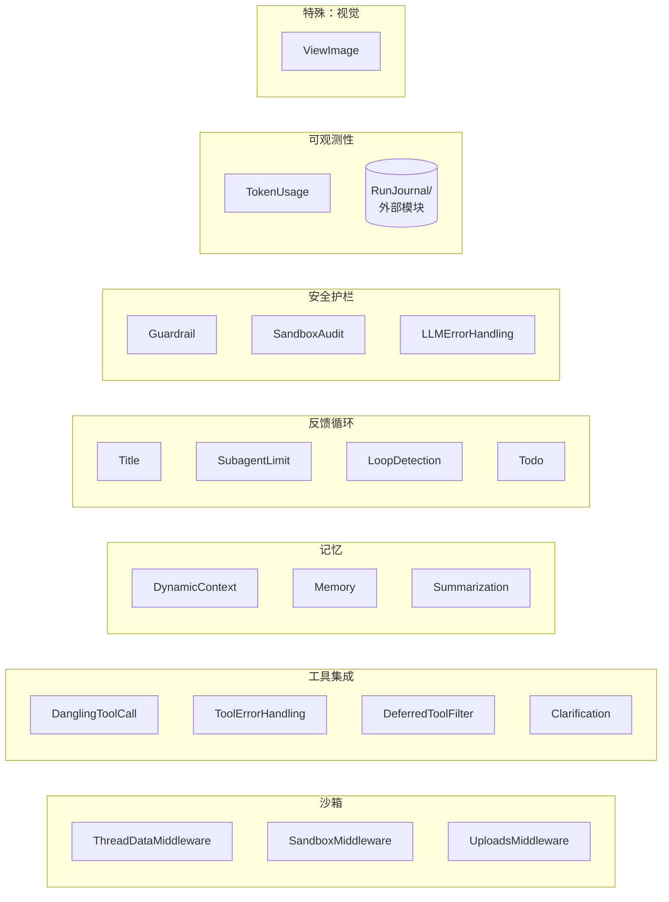
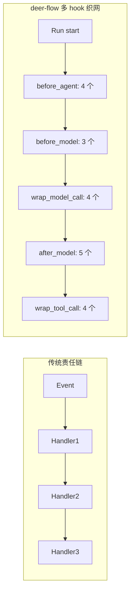

# 06 · 中间件链总览（14–18 节）与构建顺序契约

> 04 篇讲了 state，05 篇讲了 agent 工厂如何把中间件 list 传给 `create_agent`。这一章把那个 list 里**每一个中间件**摆出来，讲清楚它们各自的责任、各自挂在哪个 hook、以及"为什么 ClarificationMiddleware 必须最后" 这种顺序契约是怎么物理保证的。
>
> 这是 deer-flow 整个 agent 系统的"脊柱图"。看完这一章，你脑子里就该有一张能"按需展开"的链路图——遇到具体 middleware 的细节，知道去哪一篇深挖。

---

## 1. 模块定位（Why this matters）

很多 LangGraph 项目的 middleware 加起来 1-3 个。deer-flow 一次 lead agent 启动会装配 **14-18 个中间件**（按 config 开关数）。它们形成了 deer-flow 的整个"控制平面"——LLM 请求和工具调用之间发生的所有事情，都是这些 middleware 在管。

| 维度 | 解释 |
|------|------|
| **总数** | 最小 4 个（always-on），最大 18 个（全开 + 自定义） |
| **挂载顺序** | 严格固定，由两个函数 `build_lead_runtime_middlewares` + `_build_middlewares` 共同决定 |
| **不变量** | ClarificationMiddleware 必须最后（物理保证：05 篇讲过的尾不变性兜底） |
| **Hook 类型** | `before_agent / after_agent / before_model / after_model / wrap_model_call / wrap_tool_call` 6 大类 |

不读这一章会错过 3 个关键认知：

1. **中间件链不是"装饰器栈"，而是混合 hook 的多重网**：不同 middleware 挂在不同 hook 上，相互之间不一定有顺序依赖。`SandboxMiddleware` 挂 `before_agent / after_agent`，`ClarificationMiddleware` 挂 `wrap_tool_call`，**它们看似都在"链"里，实际跑的是不同时机**。
2. **顺序契约只对"同一个 hook 内的多个 middleware"才有意义**：例如 `before_model` 上有 SummarizationMiddleware 和 ViewImageMiddleware，它们的相对顺序决定了"先压缩还是先注入图片"。但 `SandboxMiddleware.before_agent` 和 `MemoryMiddleware.after_agent` 没有顺序关系——一个是请求开始时跑、一个是结束时跑。
3. **deer-flow 的中间件链是"双源拼装"**：`build_lead_runtime_middlewares`（在 `tool_error_handling_middleware.py:129`）负责前 1-8 段、`_build_middlewares`（在 `lead_agent/agent.py:240`）负责后 9-18 段。这两段都各有自己的 config 分支条件。

对应到 Harness 六要素：本章覆盖**全部 6 要素**——每个中间件都精确对应到某一要素（沙箱、工具集成、记忆、反馈、上下文、可观测性）。这是为什么我说"中间件链是 Harness 工程六要素的物理对应物"。

---

## 2. 源码地图（Source Map）

### 2.1 关键文件清单

| 路径 | 角色 |
|------|------|
| [`packages/harness/deerflow/agents/middlewares/tool_error_handling_middleware.py`](../packages/harness/deerflow/agents/middlewares/tool_error_handling_middleware.py) | `build_lead_runtime_middlewares` (line 129) — 前 1-8 段装配 |
| [`packages/harness/deerflow/agents/lead_agent/agent.py`](../packages/harness/deerflow/agents/lead_agent/agent.py) | `_build_middlewares` (line 240) — 后 9-18 段装配 |
| [`packages/harness/deerflow/agents/factory.py`](../packages/harness/deerflow/agents/factory.py) | `_assemble_from_features` (line 155) — SDK 工厂的平行实现 |
| `.venv/.../langchain/agents/middleware/types.py:380+` | `AgentMiddleware` 基类的 hook 定义 |
| `tests/test_*_middleware.py` | 每个 middleware 都有独立测试 |

### 2.2 18 个中间件 × 6 个 hook 的全景表

下面这张表是本章最重要的一张图。每一行对应一个 middleware，标 ✅ 的列就是它实际挂载的 hook。

| # | Middleware | 文件:行 | `before_agent` | `before_model` | `wrap_model_call` | `after_model` | `wrap_tool_call` | `after_agent` |
|---|-----------|--------|:-:|:-:|:-:|:-:|:-:|:-:|
| 1 | **ThreadDataMiddleware** | `thread_data_middleware.py:82` | ✅ | | | | | |
| 2 | **UploadsMiddleware** | `uploads_middleware.py` | ✅ | | | | | |
| 3 | **SandboxMiddleware** | `sandbox/middleware.py:52` | ✅ | | | | | ✅ |
| 4 | **DanglingToolCallMiddleware** | `dangling_tool_call_middleware.py` | | | ✅ | | | |
| 5 | **LLMErrorHandlingMiddleware** | `llm_error_handling_middleware.py` | | | ✅ | | | |
| 6 | **GuardrailMiddleware** (opt.) | `guardrails/middleware.py` | | | | | ✅ | |
| 7 | **SandboxAuditMiddleware** | `sandbox_audit_middleware.py` | | | | | ✅ | |
| 8 | **ToolErrorHandlingMiddleware** | `tool_error_handling_middleware.py:21` | | | | | ✅ | |
| 9 | **DynamicContextMiddleware** | `dynamic_context_middleware.py` | ✅ | | | | | |
| 10 | **DeerFlowSummarizationMiddleware** (opt.) | `summarization_middleware.py` | | ✅ | | | | |
| 11 | **TodoMiddleware** (opt.) | `todo_middleware.py` | ✅ | ✅ | ✅ | ✅ | | ✅ |
| 12 | **TokenUsageMiddleware** (opt.) | `token_usage_middleware.py` | | | | ✅ | | |
| 13 | **TitleMiddleware** | `title_middleware.py` | | | | ✅ | | |
| 14 | **MemoryMiddleware** | `memory_middleware.py` | | | | | | ✅ |
| 15 | **ViewImageMiddleware** (vision) | `view_image_middleware.py` | | ✅ | | | | |
| 16 | **DeferredToolFilterMiddleware** (opt.) | `deferred_tool_filter_middleware.py` | | | ✅ | | ✅ | |
| 17 | **SubagentLimitMiddleware** (opt.) | `subagent_limit_middleware.py` | | | | ✅ | | |
| 18 | **LoopDetectionMiddleware** | `loop_detection_middleware.py` | | | | ✅ | | |
| 19 | **ClarificationMiddleware** | `clarification_middleware.py` | | | | | ✅ | |

> **注意**：第 11 的 `TodoMiddleware` 是六个 hook 全挂的"重量级"——它要在 before_agent 注入 todos prompt、before_model 校验状态、wrap_model_call 拦截 write_todos 调用、after_model / after_agent 维护 todos 列表。这是为什么 04 篇说"`todos` 字段是 TodoMiddleware 全权拥有"。

### 2.3 LangGraph 节点循环与 hook 触发位置

```mermaid
sequenceDiagram
    autonumber
    participant Loop as LangGraph Loop
    participant BA as before_agent
    participant BM as before_model
    participant WM as wrap_model_call
    participant LLM as LLM Call
    participant AM as after_model
    participant WT as wrap_tool_call
    participant Tool as Tool Call
    participant AA as after_agent

    Loop->>BA: 进入图，run start
    Note over BA: ThreadData, Uploads,<br/>Sandbox, DynamicContext,<br/>(Todo)

    Loop->>BM: 准备调 LLM
    Note over BM: Summarization,<br/>ViewImage, (Todo)

    Loop->>WM: 包裹模型调用
    Note over WM: DanglingToolCall,<br/>LLMErrorHandling,<br/>DeferredToolFilter,<br/>(Todo)
    WM->>LLM: 实际调用
    LLM-->>WM: response
    WM-->>BM: 返回

    Loop->>AM: 模型返回后
    Note over AM: Title, TokenUsage,<br/>LoopDetection,<br/>SubagentLimit,<br/>(Todo)

    alt 有 tool_calls
        Loop->>WT: 包裹每个 tool call
        Note over WT: Guardrail,<br/>SandboxAudit,<br/>ToolErrorHandling,<br/>DeferredToolFilter,<br/>Clarification
        WT->>Tool: 实际调用
        Tool-->>WT: ToolMessage
        WT-->>AM: 返回
        AM->>BM: 回到 before_model 准备下一轮
    end

    Loop->>AA: 一次 run 结束
    Note over AA: Sandbox(release),<br/>Memory(queue),<br/>(Todo)
```

> **重点**：`before_agent / after_agent` 在**一次完整 run**的边界（一次 `invoke()`）；`before_model / after_model / wrap_model_call` 在**每一轮 LLM call** 的边界（一次 run 可能多轮）；`wrap_tool_call` 在**每一次 tool 调用**的边界。

### 2.4 中间件→Harness 六要素对应



---

## 3. 核心逻辑精读（Deep Dive）

### 3.1 两段装配的入口：`build_lead_runtime_middlewares` + `_build_middlewares`

```python
# packages/harness/deerflow/agents/middlewares/tool_error_handling_middleware.py:129-136
def build_lead_runtime_middlewares(*, app_config: AppConfig, lazy_init: bool = True) -> list[AgentMiddleware]:
    """Middlewares shared by lead agent runtime before lead-only middlewares."""
    return _build_runtime_middlewares(
        app_config=app_config,
        include_uploads=True,
        include_dangling_tool_call_patch=True,
        lazy_init=lazy_init,
    )
```

```python
# packages/harness/deerflow/agents/middlewares/tool_error_handling_middleware.py:70-126
def _build_runtime_middlewares(*, app_config, include_uploads, include_dangling_tool_call_patch, lazy_init):
    """Build shared base middlewares for agent execution."""
    from deerflow.agents.middlewares.llm_error_handling_middleware import LLMErrorHandlingMiddleware
    from deerflow.agents.middlewares.thread_data_middleware import ThreadDataMiddleware
    from deerflow.sandbox.middleware import SandboxMiddleware

    middlewares: list[AgentMiddleware] = [
        ThreadDataMiddleware(lazy_init=lazy_init),    # ① 1
        SandboxMiddleware(lazy_init=lazy_init),       # ② 3
    ]

    if include_uploads:
        from deerflow.agents.middlewares.uploads_middleware import UploadsMiddleware
        middlewares.insert(1, UploadsMiddleware())    # ③ 2 (插到 1 和 3 之间)

    if include_dangling_tool_call_patch:
        from deerflow.agents.middlewares.dangling_tool_call_middleware import DanglingToolCallMiddleware
        middlewares.append(DanglingToolCallMiddleware())   # ④ 4

    middlewares.append(LLMErrorHandlingMiddleware(app_config=app_config))   # ⑤ 5

    # Guardrail middleware (if configured)
    if guardrails_config.enabled and guardrails_config.provider:
        # 反射加载 provider class + 实例化
        ...
        middlewares.append(GuardrailMiddleware(...))       # ⑥ 6

    from deerflow.agents.middlewares.sandbox_audit_middleware import SandboxAuditMiddleware
    middlewares.append(SandboxAuditMiddleware())            # ⑦ 7
    middlewares.append(ToolErrorHandlingMiddleware())       # ⑧ 8
    return middlewares
```

**为什么 `build_lead_runtime_middlewares` 不直接全打头？** 因为它还要服务 **subagent 运行时**（`build_subagent_runtime_middlewares` 在同文件 line 139）。Lead agent 和 subagent 共享"沙箱 + 工具错误处理"基础，但 lead agent 还要 uploads + dangling tool call 兜底（subagent 不需要——subagent 不接受 user upload，且它的 tool_call 是 lead 控制的）。

**`include_uploads / include_dangling_tool_call_patch` 是两个开关**——把基础装配做成可配置，复用度更高。

```python
# packages/harness/deerflow/agents/lead_agent/agent.py:240-318
def _build_middlewares(config, model_name, agent_name=None, custom_middlewares=None, *, app_config=None):
    resolved_app_config = app_config or get_app_config()
    middlewares = build_lead_runtime_middlewares(app_config=resolved_app_config, lazy_init=True)
    #                                                                   ↑ 前 8 段在这里返回

    # 9 - DynamicContextMiddleware（总是挂，注入当前日期 + memory）
    from deerflow.agents.middlewares.dynamic_context_middleware import DynamicContextMiddleware
    middlewares.append(DynamicContextMiddleware(agent_name=agent_name, app_config=resolved_app_config))

    # 10 - Summarization（条件）
    summarization_middleware = _create_summarization_middleware(app_config=resolved_app_config)
    if summarization_middleware is not None:
        middlewares.append(summarization_middleware)

    # 11 - Todo（条件，runtime config 控制）
    cfg = _get_runtime_config(config)
    is_plan_mode = cfg.get("is_plan_mode", False)
    todo_list_middleware = _create_todo_list_middleware(is_plan_mode)
    if todo_list_middleware is not None:
        middlewares.append(todo_list_middleware)

    # 12 - TokenUsage（条件）
    if resolved_app_config.token_usage.enabled:
        middlewares.append(TokenUsageMiddleware())

    # 13 - Title（总是挂）
    middlewares.append(TitleMiddleware(app_config=resolved_app_config))

    # 14 - Memory（总是挂；但内部会按 memory_config.enabled 决定是否真做事）
    middlewares.append(MemoryMiddleware(agent_name=agent_name, memory_config=resolved_app_config.memory))

    # 15 - ViewImage（按 model.supports_vision 条件）
    model_config = resolved_app_config.get_model_config(model_name) if model_name else None
    if model_config is not None and model_config.supports_vision:
        middlewares.append(ViewImageMiddleware())

    # 16 - DeferredToolFilter（条件）
    if resolved_app_config.tool_search.enabled:
        ...

    # 17 - SubagentLimit（条件，runtime config 控制）
    subagent_enabled = cfg.get("subagent_enabled", False)
    if subagent_enabled:
        max_concurrent_subagents = cfg.get("max_concurrent_subagents", 3)
        middlewares.append(SubagentLimitMiddleware(max_concurrent=max_concurrent_subagents))

    # 18 - LoopDetection（按 config.loop_detection.enabled 条件）
    if resolved_app_config.loop_detection.enabled:
        middlewares.append(LoopDetectionMiddleware.from_config(loop_detection_config))

    # Inject custom middlewares before ClarificationMiddleware
    if custom_middlewares:
        middlewares.extend(custom_middlewares)

    # 19 - Clarification 必须最后
    middlewares.append(ClarificationMiddleware())
    return middlewares
```

**5 个值得圈点的设计**：

1. **`build_lead_runtime_middlewares` 返回的 list 被直接 append**：前 8 段是顺序固定的"基础设施"，后 11 段是按 config 开关装配的"业务能力"。把两段拆开能让基础设施单独复用给 subagent。
2. **`MemoryMiddleware` 总是挂，但**内部按 `memory_config.enabled` 判断**是否做事**：这种"挂但躺平"的设计避免了"先挂了又卸"的复杂性——middleware 内部一行 if 处理。
3. **`ViewImageMiddleware` 是按 model 能力条件挂**：不像其他按 config 条件，它读 `model.supports_vision`。换 model 后需要重建 agent（这就是为什么 `DeerFlowClient._ensure_agent` 缓存 key 里有 model_name）。
4. **`custom_middlewares` 是 19 之前的最后一个口**：用户传的中间件直接 append 到 Clarification 之前。和 `create_deerflow_agent` 的 `@Next/@Prev` 不一样——这里更原始，没有 anchor 系统，纯顺序。
5. **`ClarificationMiddleware()` 最后 append**：这是 18 节中"为什么 Clarification 必须最后"的物理保证。如果有 custom_middlewares，它们会被插在 Clarification 之前。

### 3.2 4 个 always-on 中间件

无论 config 怎么开关，下面这 4 个**永远**会出现在 chain 里：

| # | Middleware | 来源 | 不可关原因 |
|---|-----------|------|----------|
| 1 | `ThreadDataMiddleware` | `build_lead_runtime_middlewares` | thread_data 是 sandbox/tools 的前置依赖 |
| 5 | `LLMErrorHandlingMiddleware` | 同上 | LLM 调用失败时把错误转为 ToolMessage，否则整个图崩 |
| 8 | `ToolErrorHandlingMiddleware` | 同上 | 工具异常转 ToolMessage，否则 LangGraph 抛 GraphBubbleUp |
| 19 | `ClarificationMiddleware` | `_build_middlewares` | 拦截 `ask_clarification` 工具调用、interrupt 等用户输入 |

这 4 个是 deer-flow agent 跑起来的**最小集合**。`create_deerflow_agent(model)`（minimal mode）也至少装这 4 个 + `DanglingToolCall + LoopDetection`（features 默认开）= 6 个。

### 3.3 三个最容易混淆的"顺序契约"

下面 3 组顺序是新人最容易踩坑的：

#### 契约 A：**`ThreadData → Uploads → Sandbox`** 必须按此顺序

```python
middlewares = [
    ThreadDataMiddleware(lazy_init=lazy_init),    # ① 算 thread paths
]
if include_uploads:
    middlewares.insert(1, UploadsMiddleware())    # ② 列出 uploads_path 下的文件
middlewares.append(SandboxMiddleware(...))        # ③ 获取 sandbox_id
```

**原因**：

- UploadsMiddleware.before_agent 要读 `state["thread_data"]["uploads_path"]` 才能 ls 那个目录。
- SandboxMiddleware.before_agent 要 thread_id（runtime context 拿）来 acquire sandbox——理论上不依赖前两者，但目前装配里固定排在它们之后。
- **反过来会怎样？** Uploads 在 ThreadData 之前跑，`state["thread_data"]` 是 None，ls 拿不到路径，要么 crash 要么静默丢 uploads。

#### 契约 B：**`Summarization → ViewImage`** 不能反

两者都挂在 `before_model`。

```python
# _build_middlewares 里的顺序
... → DynamicContext → Summarization → Todo → TokenUsage → Title → Memory → ViewImage → ...
```

**原因**：

- Summarization 把"旧消息"折叠成 summary。如果在它之前注入 base64 图片，图片可能进 summary（被 LLM 总结成文本"用户曾经发过一张图，是 PNG，约 300KB"——丢失了图本身）。
- ViewImage 必须在 Summarization 之后注入，确保 base64 数据进入"最近的 HumanMessage"（不会被折叠）。

#### 契约 C：**`LoopDetection → SubagentLimit` 在 `after_model`**

两者都在 `after_model` 截断 LLM 输出。

```python
# 17 在 18 之前
if subagent_enabled:
    middlewares.append(SubagentLimitMiddleware(...))   # 截断超过 3 个的 task tool_calls
if loop_detection_config.enabled:
    middlewares.append(LoopDetectionMiddleware.from_config(loop_detection_config))
```

**原因**：

- SubagentLimit 截断 task tool_calls 到 ≤3（避免一次 fan out 过多）。
- LoopDetection 检测连续 N 轮的工具调用 hash 是否重复，重复就强制清空 tool_calls 转纯文本回答。
- **两者执行顺序**：LangGraph 的 `after_model` 按 middleware 顺序执行，前者先截断、后者再检测循环。**如果反过来**：LoopDetection 先看到 100 个 task tool_calls（实际只能跑 3 个），可能误判为"不是循环"。

### 3.4 Hook 多挂的 TodoMiddleware

`TodoMiddleware` 是唯一一个挂 6 个 hook 的中间件：

```python
# packages/harness/deerflow/agents/middlewares/todo_middleware.py 概览
class TodoMiddleware(AgentMiddleware):
    def before_agent(self, state, runtime):
        # 注入 system_prompt 段：把当前 todos 列出来给 LLM 看
        ...
    def before_model(self, state, runtime):
        # 二次校验 todos 状态
        ...
    def wrap_model_call(self, request, handler):
        # 在 LLM 调用前后做包装，例如检测 write_todos 工具调用
        ...
    def after_model(self, state, runtime):
        # 把 LLM 调用 write_todos 时传的 todos 写回 state
        ...
    def after_agent(self, state, runtime):
        # run 结束时做收尾
        ...
```

**为什么这么多 hook？** 因为 `todos` 是个"双向状态"——LLM 既读它（写 prompt），也写它（调 `write_todos` 工具）。要保证读写一致，得在多个时机校验和同步。

**对比 SandboxMiddleware**（只挂 2 个 hook）：sandbox 是"单向资源"——middleware 只负责 acquire/release，sandbox 的实际使用是工具内部的事。

**经验法则**：**hook 挂得越多，状态语义越复杂**。重构时如果发现一个 middleware 挂了 4+ 个 hook，多半是状态设计有问题。

---

## 4. 关键问题答疑（Key Questions）

### Q1：18 个 middleware 一次跑完，开销有多大？

每个 hook 调用是普通 Python 函数调用 + 字典查询，单次开销在微秒级。**18 个 middleware × ~5 个 hook 平均 ≈ 90 次函数调用 / 一轮**——相比 LLM 调用（数百毫秒至数秒）完全可忽略。**性能瓶颈在 LLM，不在中间件**。

唯一例外：`MemoryMiddleware.after_agent` 会把对话扔进队列做"30 秒后异步 LLM 抽取记忆"——但那是异步的，不阻塞 run 完成。

### Q2：`wrap_model_call` 和 `before_model + after_model` 的本质区别？

| 类型 | 行为 |
|------|------|
| `before_model + after_model` | 拦截"上下文"——只能在调用前后改 state，**不能影响 LLM 调用本身** |
| `wrap_model_call` | 拦截"调用"——可以重试、跳过、改请求/响应 |

例如 `LLMErrorHandlingMiddleware` 用 `wrap_model_call` 是因为它要 catch 异常并转 fallback ToolMessage；用 `before_model` 做不到（异常发生在 model call 内部）。

### Q3：装配里 `lazy_init=True` 是干嘛的？

`ThreadDataMiddleware(lazy_init=True)`、`SandboxMiddleware(lazy_init=True)` 都默认 `lazy_init=True`。意思是：

- `lazy_init=False`：`before_agent` 立刻创建物理目录 / acquire sandbox。
- `lazy_init=True`：`before_agent` 只算路径 / 不 acquire，**真正用到时才创建**（例如第一次调用 sandbox 工具）。

**为什么默认 lazy？** 因为大量请求是"只跟 agent 聊天，不调任何文件工具"——没必要为每个 thread 都开沙箱（Docker 沙箱开一次要几百毫秒、占内存）。lazy 模式下"只聊天的 thread"永远不消耗沙箱资源。

### Q4：自定义中间件能插到 `build_lead_runtime_middlewares` 那 8 段里吗？

走 `make_lead_agent` 路径：**不能直接**。`custom_middlewares` 参数只能在 9-18 之后、Clarification 之前插。

走 `create_deerflow_agent` 路径：**可以**——用 `@Next(DanglingToolCallMiddleware)` 这种装饰器精确插入到任何位置（05 篇详细讲过）。

### Q5：能不能完全跳过 `build_lead_runtime_middlewares`，做一个"全自定义"agent？

可以，但你需要用 `create_deerflow_agent(model, middleware=[...])` 的 **Full Takeover** 模式——`middleware` 参数完全覆盖整个 list，feature 系统不生效。这种用法只在做单元测试或极简 demo 时合适。

### Q6：为什么 `MemoryMiddleware` 挂在 `after_agent` 而不是 `after_model`？

`after_model` 在**每一轮 LLM 调用后**触发；一次完整 run 可能有 N 轮（N 次工具调用 + LLM 调用循环）。Memory 应该捕捉**完整的对话**——所以挂 `after_agent`（一次 run 结束）只触发一次。如果挂 after_model，会把"中间过程的 AI 消息"也送进 memory 抽取，污染记忆数据（看 14 篇）。

---

## 5. 横向延伸与面试级洞察（Interview-Grade Insights）

### 5.1 中间件链 vs 责任链 vs 装饰器

deer-flow 的中间件链看起来像责任链，但实际是**多 hook 织网**：

- **责任链**：一个事件按顺序传给一连串处理器，处理器之间是"串"。
- **deer-flow 的 hook 织网**：18 个 middleware × 6 个 hook，每个 middleware 挂自己关心的 hook。不同 hook 上的 middleware 完全独立。



**为什么织网更合适？** Agent 的生命周期有**不同的时机**（run 边界、model 边界、tool 边界），不同关注点对应不同时机。织网模型让"关注点"和"时机"解耦。

### 5.2 与 Web 框架 middleware 的对比

| 维度 | Express/FastAPI middleware | deer-flow middleware |
|------|---------------------------|----------------------|
| 触发位置 | 请求/响应入口 | run / model / tool 多个边界 |
| 顺序意义 | 强（next() 调用栈） | 同一 hook 内强、跨 hook 弱 |
| 状态共享 | 通过 request/response 对象 | 通过 dict-like state + reducer |
| 中断/短路 | next() 不调即可 | `return None` / `Command(goto=END)` |

deer-flow 的设计更适合"长生命周期、状态丰富、多边界"的 agent 场景。Web 框架的 middleware 只覆盖"请求边界"一个时机。

### 5.3 设计契约 vs 物理保证

deer-flow 的"ClarificationMiddleware 必须最后"是个**设计契约**。它的物理保证有两层：

1. **应用工厂**：`_build_middlewares` 最后一行硬编码 `middlewares.append(ClarificationMiddleware())`。
2. **SDK 工厂**：`_assemble_from_features` 在所有 extras 插入后，主动找出 Clarification 实例 pop 出来再 append 到末尾（factory.py:294-296）。

**这是个值得学的范式**：**重要不变量不能只靠"约定"——必须有物理保证**。05 篇我们学过 `_insert_extra` 的尾不变性兜底就是另一例。

### 5.4 vs AutoGen / CrewAI 的扩展机制

| 框架 | 扩展机制 | 局限 |
|------|---------|------|
| **AutoGen** | 继承 `ConversableAgent` 重写方法 | 一次只能继承一个，组合扩展难 |
| **CrewAI** | 用 `Callback` 类挂在 task / crew 上 | callback 时机比 deer-flow 少（主要是 task 边界） |
| **LangGraph 原生** | 自己 `add_node / add_edge` 改图 | 重新写 graph，复用难 |
| **deer-flow** | 实现 `AgentMiddleware` 子类 + `@Next/@Prev` 锚定 | 学习曲线略陡，但极致可组合 |

**面试金句**：deer-flow 把 LangGraph 原生的"改图"式扩展，封装成了 18 个 middleware × 6 个 hook 的"声明式插件"系统——开发者无需理解图结构，只需要在 6 个时机点上选挂哪个。`@Next/@Prev` 让第三方扩展不依赖物理 list index，是声明式编程在 Python agent 框架里少见的成熟范式。

---

## 6. 实操教程（Hands-on Lab）

### 6.1 最小可运行示例：打印当前 agent 的中间件链

```python
# backend/debug_middleware_chain.py
"""列出当前 agent 加载的全部 middleware + 它们各自挂的 hook"""
from langchain_core.runnables import RunnableConfig
from deerflow.agents import make_lead_agent


def hooks_implemented(mw) -> list[str]:
    """检测一个 middleware 实例重写了哪些 hook（与基类不同）"""
    from langchain.agents.middleware import AgentMiddleware
    base = AgentMiddleware
    candidates = [
        "before_agent", "before_model", "wrap_model_call",
        "after_model", "wrap_tool_call", "after_agent",
    ]
    implemented = []
    for name in candidates:
        cls_method = getattr(type(mw), name, None)
        base_method = getattr(base, name, None)
        if cls_method is not None and cls_method is not base_method:
            implemented.append(name)
        # 也检查 async 版本
        async_name = "a" + name
        async_cls = getattr(type(mw), async_name, None)
        async_base = getattr(base, async_name, None)
        if async_cls is not None and async_cls is not async_base:
            if async_name not in implemented:
                implemented.append(async_name)
    return implemented


config: RunnableConfig = {
    "configurable": {
        "thread_id": "chain-inspector",
        "is_plan_mode": False,
        "subagent_enabled": False,
    }
}

agent = make_lead_agent(config)
# agent 的 middleware list 藏在 builder 内部，我们重新调一次 _build_middlewares 即可
from deerflow.agents.lead_agent.agent import _build_middlewares
from deerflow.config import get_app_config

mws = _build_middlewares(config, model_name=None, app_config=get_app_config())

print(f"\n=== Total: {len(mws)} middlewares ===\n")
for i, m in enumerate(mws):
    hooks = hooks_implemented(m)
    print(f"  {i:2d}. {type(m).__name__:35s} → {', '.join(hooks) or '(none)'}")
```

跑：`cd backend && PYTHONPATH=. uv run python debug_middleware_chain.py`

**能看到**：18 节中间件按实际顺序列出来，每节后面是它实际挂载的 hook 名。

### 6.2 Debug 任务清单

#### 实验 ①：观察 always-on 中间件

把 `RuntimeFeatures` 所有 feature 关到最小，看仍然有多少 middleware：

```python
from unittest.mock import MagicMock, patch
from deerflow.agents import create_deerflow_agent, RuntimeFeatures

with patch("deerflow.agents.factory.create_agent") as mock_create:
    mock_create.return_value = MagicMock()
    create_deerflow_agent(
        MagicMock(),
        features=RuntimeFeatures(
            sandbox=False, memory=False, summarization=False,
            subagent=False, vision=False, auto_title=False,
            guardrail=False, loop_detection=False,    # 全关
        ),
    )
    mws = mock_create.call_args[1]["middleware"]
    for i, m in enumerate(mws):
        print(f"  {i}: {type(m).__name__}")
```

**预期观察**：`DanglingToolCallMiddleware + ToolErrorHandlingMiddleware + ClarificationMiddleware` 至少这 3 个总在。这是 deer-flow 的"最小可用 agent"。

#### 实验 ②：违反 ThreadData→Uploads→Sandbox 顺序契约

故意把 sandbox 中间件放到 ThreadData 之前（模拟一个 bug），观察会发生什么。

```python
# 在 backend/debug_violate_order.py 里
from langchain.agents.middleware import AgentMiddleware
from deerflow.agents.middlewares.thread_data_middleware import ThreadDataMiddleware
from deerflow.sandbox.middleware import SandboxMiddleware

# 故意把 sandbox 在 thread_data 之前
ordered = [SandboxMiddleware(), ThreadDataMiddleware()]
# 用这个 list 跑 create_deerflow_agent(model, middleware=ordered)
# 调一个 sandbox 工具，观察 KeyError 或 None 异常
```

**能学到**：契约不是"建议"，是"必要"。

#### 实验 ③：分析 hook 重叠

写一段小代码，按 hook 分类列出 middleware：

```python
from collections import defaultdict
# 复用 debug_middleware_chain.py 里的 hooks_implemented
by_hook = defaultdict(list)
for m in mws:
    for h in hooks_implemented(m):
        by_hook[h].append(type(m).__name__)

for hook, names in by_hook.items():
    print(f"\n{hook} ({len(names)}):")
    for n in names:
        print(f"   - {n}")
```

**能学到**：哪些 hook 是"热点"——例如 `after_model` 通常有 4-5 个 middleware，`wrap_tool_call` 有 4 个，`before_agent` 有 3-4 个。这种"分布感"有助于你在加新 middleware 时判断它的影响面。

---

## 7. 与下一模块的衔接

读完本章你应该能：

- 画出 18 个 middleware × 6 个 hook 的全景表（且知道每行的源码位置）。
- 解释 4 个 always-on middleware 为什么不能关。
- 说出 3 个易混淆的顺序契约（ThreadData→Uploads→Sandbox / Summarization→ViewImage / SubagentLimit→LoopDetection）的原因。
- 区分"挂多 hook 的复杂 middleware"和"挂单 hook 的简单 middleware"。

接下来 **Part C（07-09 篇）** 进入沙箱系统——`ThreadData / Uploads / Sandbox` 这 3 节中间件的"被服务对象"。看完沙箱再回头看 06 篇时，你会清楚为什么它们要在最前面装配。

---

📌 **本章已交付**。请你检查后告诉我：
- 哪几段读起来不顺？
- 是否要补"每节中间件的单文件深度阅读清单（哪几篇文档分别讲哪几节）"？
- 还是直接进入 07 篇？
