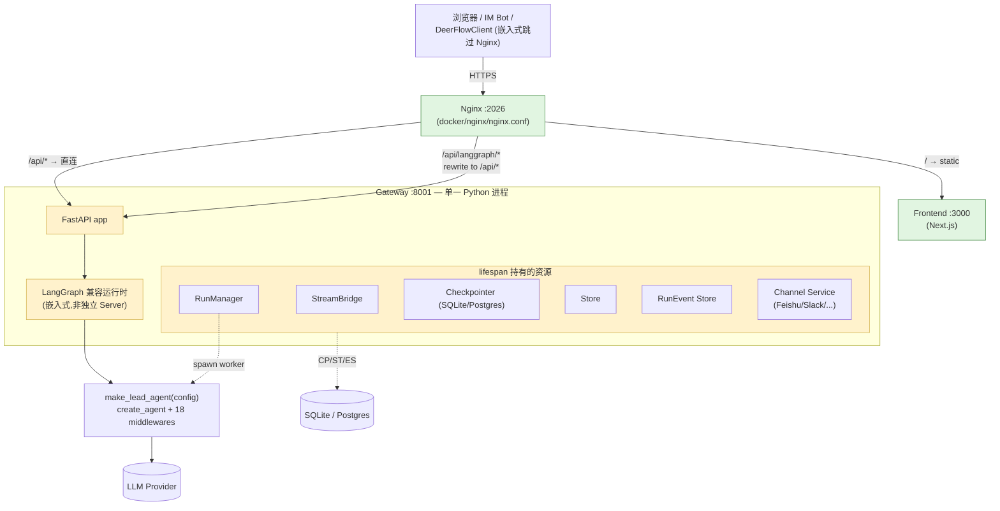
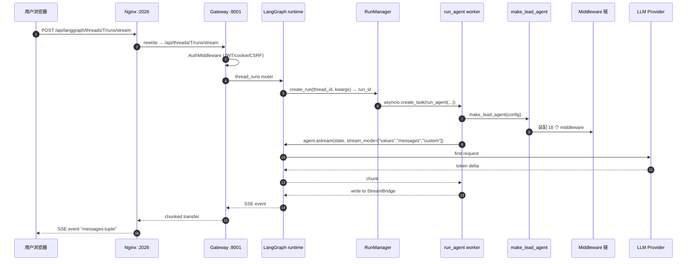

# 06 · 运行时拓扑与启动链：从 `make dev` 到 `make_lead_agent`

> 这是「整体架构层」的开篇。前 5 章完成了"心智模型 + 内功 + 工程边界 + 配置体系"四块奠基；本章开始**拉运行时**——从用户敲 `make dev` 到一个 user message 走到 LLM 之间经过的所有层。
>
> 本章的关键设计**与 LangGraph 官方推荐做法相反**：DeerFlow **没有独立部署 LangGraph Server**，而是把 LangGraph 兼容运行时**嵌入到 FastAPI Gateway 内部**。这个选择带来的运维简化和契约成本都值得反复琢磨。

---

## 🎯 学习目标

读完这份文档，你能回答：

1. **从 `make dev` 到一个 user message 触发 LLM**，途中经过了哪些进程 / 端口 / 路由 / 函数调用？请说出 6 层以上的链路。
2. **DeerFlow 把 LangGraph 兼容运行时"嵌入"在 Gateway 内**（同进程跑 FastAPI + LangGraph runtime），与 LangGraph 官方推荐的"独立 Server 部署"相比 —— 工程取舍是什么？
3. **`langgraph.json` 的三个键 `graphs` / `auth` / `checkpointer`** 在 DeerFlow 中各被谁消费？什么时候会激活那条"独立 Server 兼容路径"，什么时候不会？
4. **Gateway FastAPI lifespan 8 步启动序列**的顺序为什么是这个顺序？哪一步出错会让整个 Gateway 拒绝启动？
5. **`/api/langgraph/*` 路径前缀 rewrite 成 `/api/*` 的设计**解决了什么"双客户端"问题？

---

## 🗂️ 源码定位

| 关注点 | 路径 | 关键锚点 |
|---|---|---|
| 启动脚本 | `Makefile` 项目根（`dev` / `start` / `up` / `down`）；`scripts/serve.sh`；`scripts/docker.sh`；`scripts/deploy.sh` | 入口工具一览 |
| Gateway 本地启动命令 | `backend/Makefile` | `dev: PYTHONPATH=. uv run uvicorn app.gateway.app:app --host 0.0.0.0 --port 8001 --reload` |
| Gateway 主入口 | `backend/app/gateway/app.py` | `lifespan` 异步上下文；`create_app` L195+；`app.include_router(...)` L328-L370（共 14 个 router） |
| Gateway 配置 | `backend/app/gateway/config.py` | `get_gateway_config()`、`GATEWAY_ENABLE_DOCS`、`GATEWAY_CORS_ORIGINS` |
| LangGraph 运行时启动 | `backend/app/gateway/deps.py` | `async def langgraph_runtime(app)` —— 装载 StreamBridge / Checkpointer / Store / RunManager / event store |
| RunManager | `backend/packages/harness/deerflow/runtime/runs/manager.py` | `RunRecord`、`RunManager`（async lock + 可选 store backing） |
| run_agent worker | `backend/packages/harness/deerflow/runtime/runs/worker.py` | `run_agent` L120+；`_rollback_to_pre_run_checkpoint` L422+；`_lg_mode_to_sse_event` L520+ |
| LangGraph 入口 | `backend/langgraph.json` | `graphs.lead_agent = "deerflow.agents:make_lead_agent"`；`auth.path = "./app/gateway/langgraph_auth.py:auth"`；`checkpointer.path = "./packages/harness/deerflow/runtime/checkpointer/async_provider.py:make_checkpointer"` |
| LangGraph 独立 Server 兼容 | `backend/app/gateway/langgraph_auth.py` | "DeerFlow runtime is embedded in Gateway; scripts and Docker deployments do not load this module. Retained for LangGraph tooling, Studio, or direct LangGraph Server compatibility through `langgraph.json`'s `auth.path`." —— 顶部 docstring |
| Nginx 反代 | `docker/nginx/nginx.conf` + `docker/nginx/nginx.local.conf` | `listen 2026`；`/api/langgraph/` rewrite 到 `/api/$1`；`/api/` → gateway；`/` → frontend |
| 通道服务（lifespan 启动） | `backend/app/channels/service.py` | `start_channel_service` / `stop_channel_service` |

---

## 🧭 架构图

### 1. 物理进程拓扑（一个完整请求穿过几层）



### 2. 单次"用户发消息→ LLM 返回首 token"的时序



### 3. Gateway lifespan 8 步启动（按时间轴）

```mermaid
gantt
    title FastAPI lifespan 启动序列 (秒)
    dateFormat X
    axisFormat %s
    section 启动阶段
    1 load config         :done, c1, 0, 1
    2 apply log level     :done, c2, after c1, 1
    3 init persistence engine :done, c3, after c2, 1
    4 init StreamBridge   :done, c4, after c3, 1
    5 init Checkpointer + Store :done, c5, after c4, 1
    6 init RunEvent store :done, c6, after c5, 1
    7 _ensure_admin_user / migrate orphan :done, c7, after c6, 1
    8 start_channel_service :done, c8, after c7, 1
    section 服务态
    yield (accept HTTP)    :active, after c8, 8
```



---

## 🔍 核心逻辑讲解

### Part 1 · DeerFlow 的"反共识"决定：嵌入式 LangGraph 运行时

#### LangGraph 官方的"标准部署"长这样

```
[Client] → [Nginx] → [LangGraph Server (独立进程)] → [Your Graph Code]
                                 ↑
                       (来自 langgraph dev / Docker image)
```

LangGraph Server 是 LangChain 官方提供的运行时，承担：
- HTTP API (`/threads/*`, `/assistants/*`, `/runs/*`)
- 流式 SSE
- Checkpointer / Store
- Auth (从 `langgraph.json::auth.path` 加载)

**用户**通常用 `langgraph dev` 命令或 `langchain/langgraph-api` Docker 镜像来跑它，graph 代码作为依赖被加载。

#### DeerFlow 把它"吃掉"嵌入到 Gateway 内

打开 `backend/app/gateway/deps.py::langgraph_runtime`，关键 7 行：

```python
async def langgraph_runtime(app: FastAPI) -> AsyncGenerator[None, None]:
    async with AsyncExitStack() as stack:
        app.state.stream_bridge = await stack.enter_async_context(make_stream_bridge(config))
        await init_engine_from_config(config.database)
        app.state.checkpointer = await stack.enter_async_context(make_checkpointer(config))
        app.state.store = await stack.enter_async_context(make_store(config))
        # ... 进一步初始化 RunManager / RunEventStore / Repositories
```

这里**直接**调用了 LangGraph 官方 Server 内部用的同一套 `make_checkpointer` / `make_store`，**没经过 LangGraph Server 进程**。Gateway 的 FastAPI router（`runs.py` / `thread_runs.py` / `assistants_compat.py`）**自己实现了 LangGraph HTTP API 的兼容子集**。

**`backend/app/gateway/langgraph_auth.py`** 的顶部 docstring 把这件事写得很坦白：

> "The default DeerFlow runtime is embedded in the FastAPI Gateway; scripts and Docker deployments do not load this module. It is retained for LangGraph tooling, Studio, or direct LangGraph Server compatibility through `langgraph.json`'s `auth.path`."

**翻译**：`langgraph.json` 留着，是为了**让 LangGraph Studio 仍能调试**（Studio 会读 `graphs` / `auth` / `checkpointer` 三个字段）。**生产部署根本不跑 LangGraph Server**。

#### 这是个有意识的"反共识"取舍

| 维度 | LangGraph 官方推荐 | DeerFlow 嵌入式 |
|---|---|---|
| 进程数 | 至少 2（Server + Gateway） | 1（Gateway 单进程） |
| 端口数 | 至少 2（如 8000 + 8001） | 1（8001） |
| 部署复杂度 | 高（Server 容器 + Gateway 容器） | 低（一个 Docker image 跑全部） |
| LangGraph API 兼容性 | 100% 自动 | **DeerFlow 自己实现兼容子集**，需手写 router |
| LangGraph Studio 调试 | 自动支持 | 需 `langgraph.json` 留作"兼容路径" |
| 端到端延迟 | 多一跳 Server-Gateway 通信 | 同进程直调，零额外 hop |
| 故障域 | 隔离（一个挂另一个不挂） | 共享（整体挂） |
| 版本升级 | LangGraph Server 独立升 | 必须随 DeerFlow 整体升 |

**DeerFlow 选择嵌入的核心动机**：
1. **简化部署**：让普通用户 `docker compose up` 一条命令就能跑（少一个容器）
2. **减少调用链**：所有 DeerFlow 业务 API 和 LangGraph API 共享 FastAPI middleware 栈（Auth / CSRF / CORS）
3. **共享生命周期**：Checkpointer / Store / StreamBridge / RunManager 都在 `app.state` 上，所有 router 直接拿 `request.app.state.xxx`
4. **统一 schema**：LangGraph 业务表 + DeerFlow 业务表共用一个 SQLAlchemy engine，省一套数据库连接池

**代价**：每次 LangGraph Server API 升级，DeerFlow 都必须**手动跟进** `app/gateway/routers/runs.py` 等兼容 router 的实现。这就是 25 章会强调的 `TestGatewayConformance` 存在的根本原因。

### Part 2 · `langgraph.json` 三个键各被谁消费

```json
{
  "$schema": "https://langgra.ph/schema.json",
  "python_version": "3.12",
  "dependencies": ["."],
  "env": ".env",
  "graphs": {
    "lead_agent": "deerflow.agents:make_lead_agent"
  },
  "auth": {
    "path": "./app/gateway/langgraph_auth.py:auth"
  },
  "checkpointer": {
    "path": "./packages/harness/deerflow/runtime/checkpointer/async_provider.py:make_checkpointer"
  }
}
```

| 键 | 嵌入路径用不用？ | 兼容路径（LangGraph CLI / Studio）用不用？ |
|---|---|---|
| `graphs.lead_agent` | ✅ Gateway router 也通过 `make_lead_agent` 工厂调用 | ✅ Studio 加载 graph |
| `auth.path` | ❌ Gateway 用自己的 `AuthMiddleware`（`app/gateway/auth_middleware.py`） | ✅ LangGraph Server / Studio 调试时用它 |
| `checkpointer.path` | ✅ `langgraph_runtime` 直接 `import make_checkpointer` 调用 | ✅ LangGraph Server 启动时也走同一函数 |
| `dependencies / env / python_version` | ❌ uvicorn / docker 直接管 | ✅ `langgraph dev` 命令读取 |

**关键洞察**：`langgraph.json` 在 DeerFlow 里**不是必需文件**，但作者保留它有两个用途：
1. **Studio 兼容**：方便贡献者用 LangGraph Studio 可视化调试
2. **未来切换可逆性**：如果哪天 LangGraph Server 进化得更值得用，DeerFlow 仅需"摘掉嵌入路径，启用 Server 路径"

### Part 3 · FastAPI lifespan 启动序列精读

打开 `app/gateway/app.py::lifespan`，8 步异步上下文：

```python
@asynccontextmanager
async def lifespan(app: FastAPI) -> AsyncGenerator[None, None]:
    # Step 1: 加载 config(失败 = 启动失败,fail-fast)
    app.state.config = get_app_config()

    # Step 2: 应用 log_level(不影响第三方库)
    apply_logging_level(app.state.config.log_level)

    # Step 3-7: langgraph_runtime 把 LangGraph 运行时资源串成 AsyncExitStack
    async with langgraph_runtime(app):
        # Step 8a: 首次启动 admin bootstrap;否则 migrate 老的 orphan thread
        await _ensure_admin_user(app)

        # Step 8b: 启动 IM 通道服务
        channel_service = await start_channel_service(app.state.config)

        yield   # ← Gateway 在此开始接受请求

        # 关闭(逆序):通道 → langgraph_runtime AsyncExitStack 自动 close
        await asyncio.wait_for(stop_channel_service(), timeout=5.0)
```

**为什么是这个顺序？**

| Step | 顺序为何重要 |
|---|---|
| 1 → 2 | config 加载完才知道 `log_level`；早了 log 还是 INFO |
| 2 → 3 | 必须先打开正确日志级别，下面的初始化才能 debug 友好 |
| 3 → 4 | DB engine 先初始化（自动建库逻辑），checkpointer / store 才不会因连不上 DB 而挂 |
| 4 → 5 | StreamBridge 在 checkpointer 之前 —— 因为后者运行时已能写事件，需要 SB 在 |
| 6 → 7 | admin bootstrap 必须在 store 可用后跑 —— orphan thread 迁移要写元数据 |
| 7 → 8 | channel 启动放最后 —— Feishu/Slack 收到的第一条消息要能立刻进入 RunManager，所有上游资源已就绪 |
| `yield` 后 | shutdown **必须** bounded by timeout（DeerFlow 用 5 秒）—— 否则 uvicorn `--reload` 卡死 |

**`AsyncExitStack` 的妙用**：
```python
async with AsyncExitStack() as stack:
    app.state.stream_bridge = await stack.enter_async_context(make_stream_bridge(config))
    app.state.checkpointer = await stack.enter_async_context(make_checkpointer(config))
    app.state.store = await stack.enter_async_context(make_store(config))
```

任何一步打开后失败，**已打开的资源都会按 LIFO 顺序自动 close** —— 这是 Python 3.10+ 推荐的"多上下文资源"模式，比手动 try/finally 嵌套强 10 倍。

### Part 4 · Nginx 路由 + `/api/langgraph/*` Rewrite 的双客户端兼容

打开 `docker/nginx/nginx.conf` 关键三段：

```nginx
# 1) /api/langgraph/* → 兼容 LangGraph 前端 SDK 调用
location /api/langgraph/ {
    rewrite ^/api/langgraph/(.*) /api/$1 break;
    proxy_pass http://$gateway_upstream;
    proxy_buffering off;     # SSE 流式
    proxy_set_header X-Accel-Buffering no;
    proxy_connect_timeout 600s;
}

# 2) /api/* → DeerFlow REST API (models/skills/mcp/memory/...)
location /api/ {
    proxy_pass http://$gateway_upstream;
}

# 3) / → Next.js 前端
location / {
    proxy_pass http://$frontend_upstream;
}
```

**为什么需要 rewrite？**

DeerFlow 前端用 `langgraph-sdk-js` 调 Gateway。这个 SDK 默认请求路径是 `/threads/{id}/runs/stream` 这种"无前缀"的形式。但**同时**，Gateway 自己的业务 API 也叫 `/threads/{id}/...`，要避免冲突 ——

| 客户端 | 调用形式 | Nginx 看到 | Gateway 收到 |
|---|---|---|---|
| `langgraph-sdk-js`（仿 LangGraph Server 客户端） | `/api/langgraph/threads/T/runs/stream` | 命中 location 1 | `/api/threads/T/runs/stream`（rewrite 后） |
| DeerFlow 业务前端 | `/api/threads/T/uploads` | 命中 location 2 | `/api/threads/T/uploads`（不 rewrite） |
| DeerFlow 业务前端 | `/api/skills/` | 命中 location 2 | `/api/skills/` |

**两条路径汇入同一个 Gateway**，但前缀命名空间隔离 —— 这是"嵌入式 LangGraph 运行时 + 业务 REST API 共存"的工程封装。

**`X-Accel-Buffering: no` + `proxy_buffering off`** 是 SSE 流式必须；`proxy_connect_timeout 600s` 是因为 Agent 跑长任务可能 10 分钟级。

### Part 5 · RunManager + run_agent worker 的角色（本章只点题，08 章详讲）

```python
# manager.py L42-L72(简化)
@dataclass
class RunRecord:
    run_id: str
    thread_id: str
    status: RunStatus       # pending / running / completed / failed / cancelled
    task: asyncio.Task | None     # ← 实际的 worker 协程任务
    abort_event: asyncio.Event    # ← 取消时被 set,worker 协程能察觉
    error: str | None = None

class RunManager:
    def __init__(self, store: RunStore | None = None):
        self._runs: dict[str, RunRecord] = {}
        self._lock = asyncio.Lock()   # ← 所有变更经此锁
        self._store = store           # ← 可选持久化层(异步写)
```

`RunManager` 是 Gateway lifespan 的常驻成员（`app.state.run_manager`）。当一个 thread_runs POST 进来：
1. Router 调 `run_manager.create_run(...)` → 拿到 run_id
2. Router 调 `asyncio.create_task(run_agent(...))` → 后台跑
3. Router 立刻返回 SSE response，从 StreamBridge 拉事件流

**完整生命周期 + pre-run checkpoint rollback** 留到 **08 章 Run 生命周期** 详讲。本章你只需要知道：**Gateway lifespan 里持有的 RunManager 是"Agent 异步任务的内存调度中心"**。

---

## 🧩 体现的通用 Agent 设计模式

| 模式 | DeerFlow 中的体现 |
|---|---|
| **Embedded Runtime / Single-Process Stack**（嵌入式运行时） | LangGraph 运行时不独立部署，与 Gateway 共进程 |
| **AsyncExitStack 资源编排** | `langgraph_runtime` 串联 5 个上下文管理器，失败自动回滚 |
| **Path-prefix Compatibility Layer**（路径前缀兼容层） | `/api/langgraph/*` rewrite，让"两个 schema 的客户端"共用同一个 Gateway |
| **Lifespan-managed Singletons** | StreamBridge / Checkpointer / Store / RunManager 都挂 `app.state`，请求处理函数从 `request.app.state.xxx` 拿 |
| **Optional Standalone Server Fallback** | `langgraph.json` 留作"独立 Server 兼容路径"，主路径用嵌入式 |

---

## 🧱 与 Agent Harness 六要素的对应关系

| 六要素 | 运行时拓扑层提供的基础设施 |
|---|---|
| ① 反馈循环 | RunManager 持有 `abort_event` —— 中途取消时 worker 协程能感知 |
| ② 记忆持久化 | `make_checkpointer(config)` + `make_store(config)` 在 lifespan 装载 |
| ③ 动态上下文 | StreamBridge 提供"双向"事件通道，运行时事件 / 业务事件都能流出 |
| ④ 安全护栏 | `AuthMiddleware` + `CSRFMiddleware` + Nginx 同源策略层 |
| ⑤ 工具集成 | `langgraph_runtime` 装载完毕后，`make_lead_agent` 才能用反射加载工具 |
| ⑥ 可观测性 | RunEvent store / token usage 都在 lifespan 启动；trace callback 通过 channel service 钩入 |

---

## ⚠️ 常见坑与调试技巧

### 坑 1 · LangGraph Studio 调试时"运行不正常"

**症状**：你用 `langgraph dev` 命令打开 Studio，发现 agent 行为和生产 Gateway 不一致。
**原因**：Studio 走的是 LangGraph **独立 Server** 兼容路径 —— 加载 `langgraph.json::auth.path` 的 `langgraph_auth.py`，**不会**经过 Gateway 的 `AuthMiddleware` / `CSRFMiddleware` / channel service 等启动钩子。
**调试**：明确区分"嵌入路径调试"（启 Gateway，HTTP 调 `/api/langgraph/...`）vs "独立 Server 路径调试"（启 Studio，HTTP 调 LangGraph Server）。前者覆盖率高，后者更接近 LangGraph 官方 contract。

### 坑 2 · uvicorn `--reload` 频繁触发但代码没改

**症状**：`make dev` 跑着跑着 worker 反复 reload。
**常见原因**：`config.yaml` mtime 改了 → 05 章讲的"配置热重载"触发 `get_app_config()` 内部刷新 —— 这本身**不**触发 uvicorn reload；但你如果同时改了 `.deer-flow/` 下任何文件（如 sandbox workspace 写入 + uvicorn watch 默认包含 cwd），就会 reload。
**修复**：在 uvicorn 命令上加 `--reload-dir packages/harness --reload-dir app`，把 watch 范围限到代码目录。

### 坑 3 · 通道服务启动失败把整个 Gateway 拉挂

**症状**：`config.yaml` 配了 Feishu 凭据但凭据无效，Gateway 启动 panic。
**实际行为（重要）**：DeerFlow `lifespan` 里通道启动包了 `try/except` —— **不会**拖挂 Gateway，只 log error。但有些版本里这一行 try 外置不当，会传播异常。
**调试**：lifespan 启动失败一定是 `Step 1-7`，看日志里"Channel service started"行有没有打印 —— 如果有，至少前 7 步成功了。

### 坑 4 · 启动顺序 race condition（已修）

DeerFlow 早期版本曾经把 `_ensure_admin_user` 放在 `langgraph_runtime` **之前**，结果 admin bootstrap 想读 `app.state.store` 但 store 还没初始化。**当前版本**把它移到 `langgraph_runtime` block 内、`yield` 前 —— 这是"Step 排序对正确性致命"的活教材。

### 坑 5 · Nginx 不 rewrite 也"看起来能用"

**症状**：直接绕 Nginx 调 Gateway `http://localhost:8001/api/threads/T/runs/stream` 也能跑。
**实际**：DeerFlow 内部测试常这么干。但**生产**前端走 `/api/langgraph/threads/T/runs/stream` —— **rewrite 才把它正名为 `/api/threads/T/runs/stream`**。如果你不经过 Nginx 直接 hit Gateway，**容易写错前端 URL 但 dev 时蒙混过关**。

---

## 🛠️ 动手实操

> 本 demo 不需要起前端，只测 Gateway 的"启动序列 + 路由约定 + SSE 流"。建议先 `make dev` 让 Gateway 跑在 :8001。

### Demo · 用 curl 一步步还原一个 chat 请求穿过的全部层级

```bash
#!/usr/bin/env bash
# 跑法:
#   chmod +x scripts/runtime_topology_probe.sh
#   ./scripts/runtime_topology_probe.sh
#
# 本脚本逐步演示:
# 1. 健康检查
# 2. 路由前缀对照(直连 Gateway / 经 Nginx)
# 3. SSE 流式 chat,观察事件类型
# 4. 取消运行,验证 RunManager 状态机
# 5. 触发热重载,验证 mtime 缓存(配合 05 章理解)

set -euo pipefail

# === 0. 变量 ===
GATEWAY="${GATEWAY:-http://localhost:8001}"   # 直连 Gateway
PROXY="${PROXY:-http://localhost:2026}"        # 经 Nginx(本地若没起 Nginx 改成 Gateway)
THREAD="probe-$(date +%s)"

echo "==> 0. 选择 base = $GATEWAY,thread = $THREAD"

# === 1. 健康检查(Gateway-only,Nginx 不会代理 /health)===
echo "==> 1. Gateway /health"
curl -fsS "$GATEWAY/health"
echo

# === 2. 路由前缀对照 ===
echo "==> 2. /api/models 直连 vs 经 Nginx rewrite"
echo "    a) 直连 Gateway"
curl -fsS "$GATEWAY/api/models" | head -c 300; echo
echo "    b) 经 Nginx (langgraph-sdk 风格,实际效果与 (a) 等价)"
curl -fsS "$PROXY/api/langgraph/models" 2>/dev/null | head -c 300 || \
    echo "    (本地没起 Nginx,跳过)"
echo

# === 3. SSE chat 流式 ===
echo "==> 3. 发起 SSE chat (走 Gateway 嵌入 runtime)"
# 注意:实际 endpoint 是 /api/threads/{thread_id}/runs/stream,
# DeerFlow 兼容 LangGraph runs API
curl -sN -X POST "$GATEWAY/api/threads/$THREAD/runs/stream" \
    -H "Content-Type: application/json" \
    -d '{
        "assistant_id": "lead_agent",
        "input": {"messages": [{"role": "user", "content": "用一句话告诉我现在几点?"}]},
        "stream_mode": ["values", "messages-tuple", "custom"]
    }' \
    2>/dev/null | head -80     # 看前 80 行 SSE 事件

# === 4. (可选) 列出当前所有 run,然后取消最近一个 ===
echo
echo "==> 4. 列出 thread 下所有 run"
curl -fsS "$GATEWAY/api/threads/$THREAD/runs" | python3 -m json.tool | head -40 || true

# === 5. 演示配置热重载(touch config.yaml 后下一次请求应触发 reload)===
echo
echo "==> 5. 触发配置热重载(touch config.yaml)"
CONFIG_FILE="$(cd "$(dirname "$0")/.." && pwd)/config.yaml"
if [[ -f "$CONFIG_FILE" ]]; then
    OLD_MTIME=$(stat -f %m "$CONFIG_FILE" 2>/dev/null || stat -c %Y "$CONFIG_FILE")
    touch "$CONFIG_FILE"
    NEW_MTIME=$(stat -f %m "$CONFIG_FILE" 2>/dev/null || stat -c %Y "$CONFIG_FILE")
    echo "    mtime: $OLD_MTIME -> $NEW_MTIME"
    echo "    现在再调一次 /api/models,Gateway 日志会打印:"
    echo "    'Config file has been modified ..., reloading AppConfig'"
    curl -fsS "$GATEWAY/api/models" > /dev/null
    echo "    ✅ 已触发,去看 Gateway 日志验证"
else
    echo "    config.yaml 不在预期路径,跳过"
fi
```

### 调试任务

1. **断点位置**：
   - `app/gateway/app.py::lifespan` 第一行 `app.state.config = get_app_config()` —— 启动时停住，单步走完 8 步，每步打印 `app.state.__dict__` 看资源依次出现
   - `app/gateway/routers/thread_runs.py` 的 POST `/runs/stream` 处理函数 —— 看它怎么调 `RunManager.create_run`
   - `runtime/runs/worker.py::run_agent` L120 —— 看 `make_lead_agent(config)` 在 worker 协程里何时被调
2. **观察什么**：
   - `app.state.checkpointer` 在 Step 5 之后才存在；Step 4 之前访问会 AttributeError
   - SSE 事件流前几个事件依次是 `event: metadata` → `event: values` → `event: messages-tuple` → ... → `event: end`（与 05 章 StreamMode 章节对照）
3. **人为制造异常**：
   - 故意把 `config.yaml` 写一个语法错（如 `models: {`），重启 Gateway —— 看 Step 1 fail-fast，日志显示 `Failed to load configuration during gateway startup`
   - 把 `make_stream_bridge` 临时 raise，看 `AsyncExitStack` 回滚 —— 已经打开的资源（如 DB engine）会按 LIFO 顺序 close

### 改造练习

1. **练习 A**（简单）：给 lifespan 加一个 "Step 0：fail if `langgraph.json` exists but `graphs.lead_agent` is missing/wrong"。让"配置错位"在启动期就暴露。
2. **练习 B**（中等）：用 [`structlog`](https://www.structlog.org/) 替换 lifespan 里的 `logger.info` 调用，让 8 步启动序列输出结构化日志（`{step: 4, name: "stream_bridge", duration_ms: 12}`）—— 这样可以做"启动耗时趋势监控"。
3. **挑战题**：把 DeerFlow 改成"嵌入式 + 独立 Server 双模"运行时，通过环境变量 `DEER_FLOW_RUNTIME_MODE=embedded|standalone` 切换。`standalone` 模式下 Gateway 启动时不再 `import` LangGraph 运行时，改为通过 HTTP 调用 `http://langgraph-server:8000`。**评估**：哪些 router 必须重写？哪些 Pydantic schema 必须共享？

### 预期输出 & 验证方式

- **Step 1**：health check 返回 `{"status":"ok"}` 或类似
- **Step 3**：SSE 事件流首行包含 `event: metadata`，紧接着 `event: values`，最后 `event: end`
- **Step 5**：Gateway stderr / log 出现 `Config file has been modified (mtime: X -> Y), reloading AppConfig` —— 这是 05 章实战的二次验证

---

## 🎤 面试视角

### 业务型大厂卷

**问 1**：DeerFlow 把 LangGraph 运行时嵌进 Gateway 内（同进程），与 LangGraph 官方推荐的"独立 Server"相比是少数派做法。**你在自己团队里会怎么选**？

> **教科书答案**：
> 默认选 **嵌入式**：部署简单、调用链短、共享 lifespan。**切换到独立 Server** 的两个边界：
> 1. **故障隔离需求**：一个 graph 死循环把 worker 卡住时，独立 Server 重启不会影响业务 API
> 2. **多 graph 多团队**：不同业务 team 各自维护 graph，希望各自独立部署 / 升级 / 弹性扩容
> **DeerFlow 选嵌入合理**：它是"单一 super agent harness"产品，不是"多团队 graph 平台"，故障隔离不如部署简单划算。
> **加分项**：明确提到这种选择会带来 `TestGatewayConformance` 这类**契约测试**的必要性（25 章），因为 Gateway 自己实现了 LangGraph API 兼容子集，要靠 Pydantic 双向校验保证不漂移。

**问 2**：FastAPI lifespan 用 `AsyncExitStack` 串了 5 个资源上下文。**为什么不写 5 个嵌套的 `async with`**？

> **教科书答案**：
> 三个理由：
> 1. **可选资源**：某些资源（如 `make_stream_bridge` 在某些配置下返回 None-context-manager）用 `AsyncExitStack.enter_async_context` 比 `if x: async with x:` 嵌套清晰得多
> 2. **统一错误回滚**：5 个 `async with` 嵌套时，第 3 个失败会让第 1、2 个走各自的 `__aexit__`；`AsyncExitStack` LIFO 顺序一致，逻辑可推理
> 3. **延展性**：将来加第 6 个资源时只需追加一行 `await stack.enter_async_context(...)`，而不是改 5 层嵌套
> **DeerFlow 这里写法是 Python 3.10+ 资源编排的最佳实践**。

### 创业型 AI 公司卷

**问 3**：你团队要做一个 "Agent + Web SaaS" 产品，借鉴 DeerFlow 的"嵌入式 LangGraph 运行时"路线。**首要风险是什么？怎么规避？**

> **参考答案**：
> 首要风险：**LangGraph API 兼容子集长期手工维护，容易和 LangGraph 官方漂移**。规避路径：
> 1. **契约测试**：仿 `TestGatewayConformance`，**双向**校验 Pydantic schema —— SDK 返回 dict 通过 Server 模型；Server 返回 dict 通过 SDK 模型。任一向失败就 fail CI。
> 2. **API surface 显式声明**：在 README 列出"我们实现的 LangGraph API 端点是哪些"，明确"不支持 X / Y / Z"。用户预期管理。
> 3. **降级路径预留**：保留 `langgraph.json`，让 Studio 等工具仍能用 LangGraph Server 模式连上 —— 给未来"如果嵌入式撑不下去，可切回独立 Server"留余地。
> 4. **依赖锁**：在 `pyproject.toml` 里把 `langgraph` 版本写紧（如 `>=1.1.9,<1.2.0`），LangGraph 升大版本走"评估 + 兼容测试 + 主动迁移"流程。

**问 4**：DeerFlow 的 `langgraph_auth.py` 顶部 docstring 说自己"is not loaded by scripts and Docker deployments"。你认为这种"代码在仓库里但默认走不到"的设计**值得**还是**应该删**？

> **参考答案**：
> **值得保留**（教科书答案），三个理由：
> 1. **可选兼容路径价值大**：保留它意味着任何贡献者都能用 LangGraph Studio 调试，不必跑整套 Gateway
> 2. **未来切换可逆性**：如果哪天嵌入式撑不下去，留着的 langgraph_auth.py 让"切到独立 Server"是配置而不是重写
> 3. **代码已通过 import 测试 + 边界守卫**：留着不会"腐烂"
> **但要做的工程治理**：
> - 文件头部 docstring 写清"何时启用此模块"（DeerFlow 已经做了）
> - CI 增加一个 smoke：**真正用 `langgraph dev` 启动一次**，确保这条兼容路径**还能跑**；否则它名存实亡

---

## 📚 延伸阅读

- **LangGraph Server 官方部署文档**：https://langchain-ai.github.io/langgraph/cloud/deployment/setup/
  *看完后再回头读 DeerFlow，能体会"嵌入式 vs 独立 Server"的实际差别。*
- **FastAPI `lifespan` 文档**：https://fastapi.tiangolo.com/advanced/events/#lifespan
  *15 分钟读完，理解为什么 DeerFlow 用 lifespan 而不是 startup/shutdown event。*
- **Python `contextlib.AsyncExitStack`**：https://docs.python.org/3/library/contextlib.html#contextlib.AsyncExitStack
  *理解为什么这是 Python 3.10+ "多资源协调"的最佳实践。*
- **`langgraph.json` 配置规范**：https://langchain-ai.github.io/langgraph/cloud/reference/cli/#configuration-file
  *DeerFlow 的 `langgraph.json` 是 LangGraph 官方规范的最小可用子集。*
- **DeerFlow 自己的 `docker/nginx/nginx.conf`**：把整个文件读一遍，重点是三段 `location` 块，特别是 `proxy_buffering off` / `X-Accel-Buffering no` 这种 SSE 关键设置。

---

## 🎤 互动检查 —— 请回答这 3 个问题

> **两句话即可**。

1. **设计权衡题**：DeerFlow 选"嵌入式 LangGraph 运行时"放弃了什么？保留 `langgraph.json` 又换回了什么？
2. **顺序敏感题**：lifespan Step 7（`_ensure_admin_user`）**必须在** Step 5（`make_store`）之后，**为什么**？反过来会出什么 bug？
3. **路径前缀题**：用户从浏览器 hit `http://localhost:2026/api/langgraph/threads/T/runs/stream`，**Gateway 实际收到的路径是什么**？换成 `http://localhost:2026/api/threads/T/runs/stream`，Gateway 还收得到吗？

回答后我们进入 **`07-thread-state-and-state-reducers.md`** —— `ThreadState` 5 字段扩展、自定义 reducer 的并发安全设计、潜在 bug。
