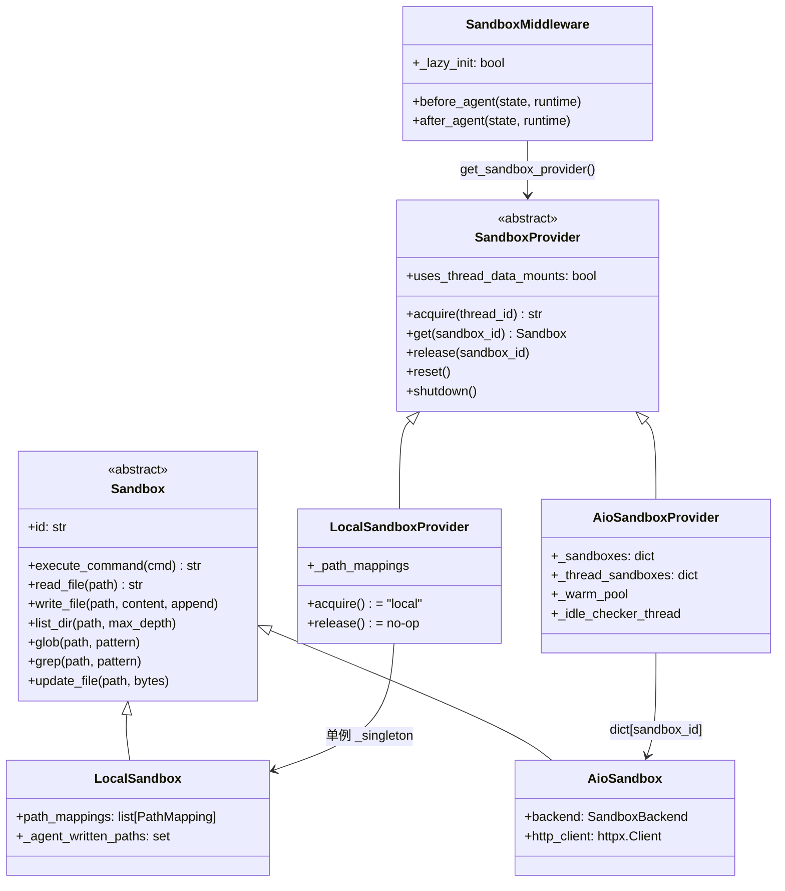
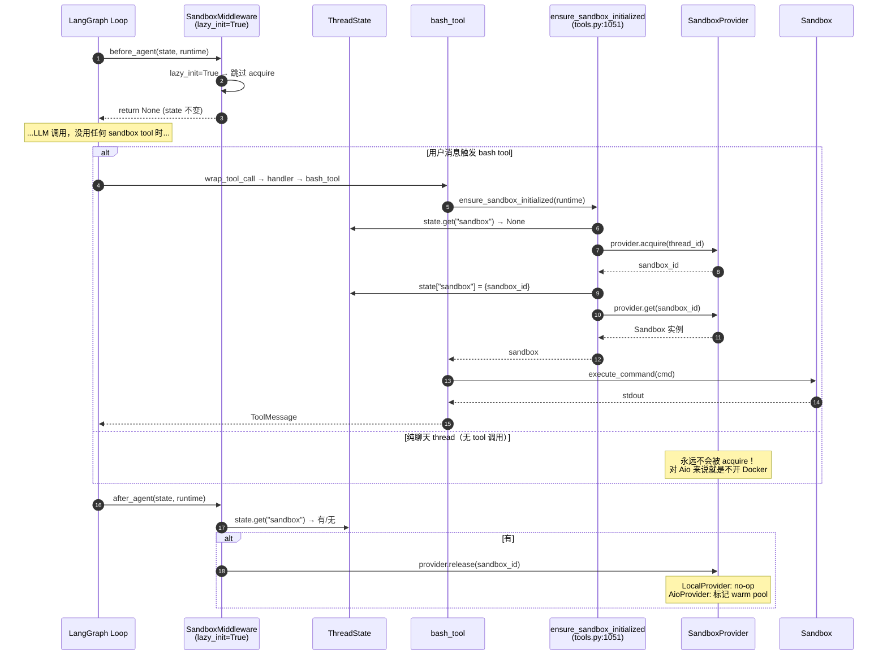
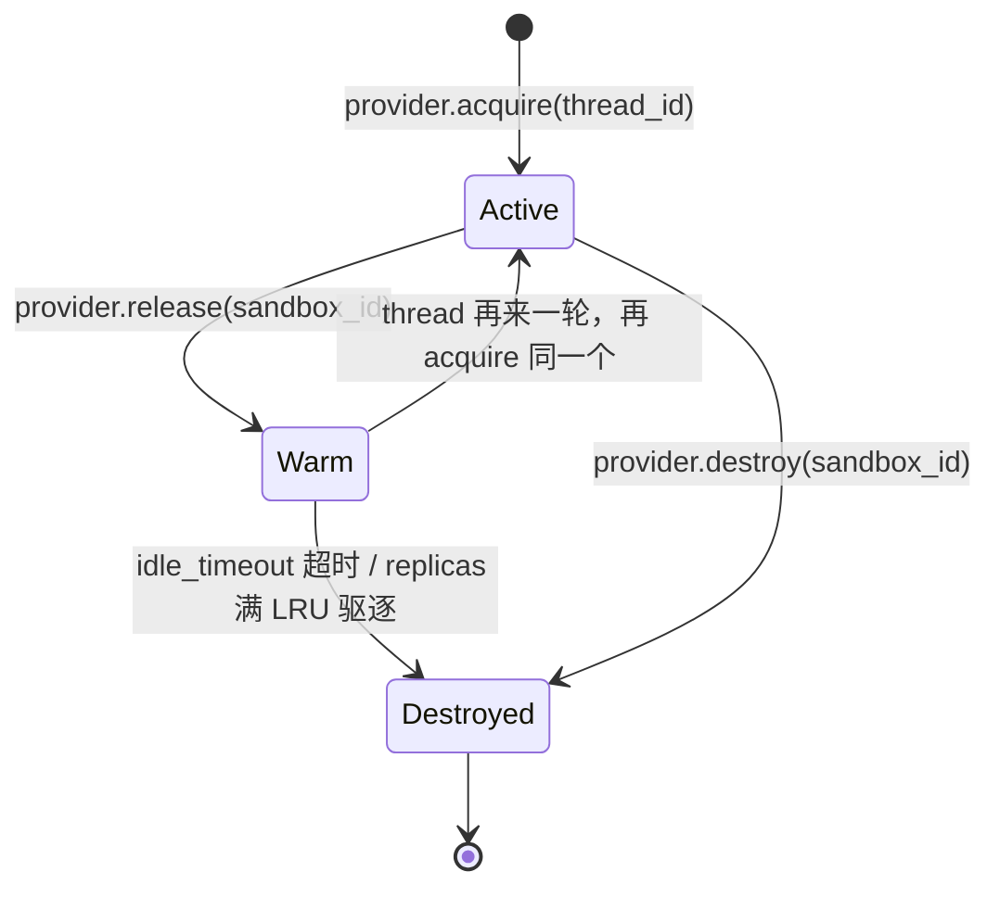

# 07 · 沙箱抽象与生命周期：Sandbox / Provider / Middleware 三件套

> 06 篇排出了 18 节中间件链。前 3 节（ThreadData / Uploads / Sandbox）服务的是一个对象——**沙箱**。这一章把"沙箱是什么、谁拥有它、它什么时候被创建、什么时候被销毁"这一整套生命周期讲清楚。
>
> 这是 deer-flow 整个工具系统的物理基础。bash / read_file / write_file / glob / grep 这些工具内部都会找当前 thread 的沙箱来执行；如果沙箱生命周期模型搞错，agent 跑两次就会出现"上一轮的文件丢了"或者"两个 thread 共用一个沙箱串数据"这种事故。

---

## 1. 模块定位（Why this matters）

deer-flow 把"代码/命令的执行环境"抽象成 3 层：

| 层 | 名字 | 职责 |
|----|------|------|
| 1 | **`Sandbox`**（抽象基类） | 单个沙箱实例的行为接口：`execute_command / read_file / write_file / glob / grep / list_dir / update_file` |
| 2 | **`SandboxProvider`**（抽象基类） | 多个 `Sandbox` 的生命周期管理：`acquire / get / release / reset / shutdown` |
| 3 | **`SandboxMiddleware`**（LangGraph 中间件） | 把 `Provider` 的 acquire/release 钩到 agent 的 `before_agent / after_agent` 时机点 |

**为什么分 3 层？**

- **抽象 Sandbox**让我们能换沙箱实现而不动调用方（LocalSandbox / AioSandbox / 未来 K8sSandbox 都满足同一接口）。
- **抽象 Provider**让我们能换"沙箱怎么来"的策略（Local 单例 vs Docker 多实例 LRU vs K8s Pod 池）。
- **Middleware**把"啥时候 acquire/release"这种 agent 生命周期决策和沙箱实现解耦——`SandboxMiddleware` 不知道你用的是 LocalSandbox 还是 AioSandbox，它只调 `provider.acquire(thread_id)`。

不读这章会错过 4 个关键认知：

1. **`lazy_init=True` 是 deer-flow 的默认且关键的优化**——`SandboxMiddleware.before_agent` 在 lazy 模式下**不 acquire**，state 里也没 sandbox_id。**真正用到沙箱的工具**（bash / read_file ...）调用 `ensure_sandbox_initialized()` 时才 acquire。结果：纯聊天的 thread 永远不消耗沙箱资源（对 AioSandboxProvider 来说就是不开 Docker 容器）。
2. **`LocalSandboxProvider` 是单例**：所有 thread 共享同一个 `LocalSandbox("local")` 实例，靠"虚拟路径映射"做 thread 隔离（08 篇讲）。这是为什么 `is_local_sandbox()` 判断 `sandbox_id == "local"`——只有一个就是叫 "local"。
3. **`AioSandboxProvider` 是 multi-instance LRU**：每个 thread 对应一个 Docker 容器；超过 `replicas`（默认 3）时 LRU 驱逐空闲的；`idle_timeout`（默认 600s）后台线程定期清理。
4. **`SandboxMiddleware.after_agent` 调 `release` 但 `LocalSandboxProvider.release` 是 no-op**——单例不需要 release。`AioSandboxProvider.release` 也只是把 sandbox 标记为"warm pool"等待 idle 检查器回收，不会立刻 stop 容器。**这两个 release 的语义完全不同**，初读源码很容易误判。

对应到 Harness 六要素：本章对应 **"沙箱执行 + 安全护栏"** 的基础设施层。

---

## 2. 源码地图（Source Map）

### 2.1 关键文件清单

| 路径 | 角色 |
|------|------|
| [`packages/harness/deerflow/sandbox/sandbox.py`](../packages/harness/deerflow/sandbox/sandbox.py) | `Sandbox` 抽象基类（93 行） |
| [`packages/harness/deerflow/sandbox/sandbox_provider.py`](../packages/harness/deerflow/sandbox/sandbox_provider.py) | `SandboxProvider` 抽象 + 单例工厂（109 行） |
| [`packages/harness/deerflow/sandbox/middleware.py`](../packages/harness/deerflow/sandbox/middleware.py) | `SandboxMiddleware`（83 行） |
| [`packages/harness/deerflow/sandbox/__init__.py`](../packages/harness/deerflow/sandbox/__init__.py) | 公开 API：3 个符号 |
| [`packages/harness/deerflow/sandbox/local/local_sandbox.py`](../packages/harness/deerflow/sandbox/local/local_sandbox.py) | `LocalSandbox` 实现（451 行） |
| [`packages/harness/deerflow/sandbox/local/local_sandbox_provider.py`](../packages/harness/deerflow/sandbox/local/local_sandbox_provider.py) | `LocalSandboxProvider`（131 行，单例 + path mapping 装配） |
| [`packages/harness/deerflow/community/aio_sandbox/aio_sandbox.py`](../packages/harness/deerflow/community/aio_sandbox/aio_sandbox.py) | `AioSandbox` 实现（238 行，HTTP client 包装容器） |
| [`packages/harness/deerflow/community/aio_sandbox/aio_sandbox_provider.py`](../packages/harness/deerflow/community/aio_sandbox/aio_sandbox_provider.py) | `AioSandboxProvider`（707 行，多实例 + LRU + idle checker） |
| [`packages/harness/deerflow/sandbox/tools.py`](../packages/harness/deerflow/sandbox/tools.py) | `ensure_sandbox_initialized` 是 lazy 模式的"真正 acquire 入口"（line 1051） |
| `docker/provisioner/app.py` | K8s 模式下的沙箱供给服务（外部进程） |

### 2.2 关键符号速查表

| 符号 | 文件:行 | 一句话职责 |
|------|---------|-----------|
| `class Sandbox(ABC)` | `sandbox.py:6` | 8 个 abstractmethod 定义沙箱行为 |
| `class SandboxProvider(ABC)` | `sandbox_provider.py:8` | `acquire / get / release / reset` + `uses_thread_data_mounts` 类标志 |
| `get_sandbox_provider()` | `sandbox_provider.py:48` | 单例工厂，用 `resolve_class(config.sandbox.use, SandboxProvider)` |
| `reset_sandbox_provider()` | `sandbox_provider.py:65` | 测试用：清缓存 + 调 `provider.reset()` 清模块级状态 |
| `shutdown_sandbox_provider()` | `sandbox_provider.py:86` | 进程退出用：调 `provider.shutdown()` 释放所有沙箱 |
| `class SandboxMiddleware` | `sandbox/middleware.py:21` | LangGraph 中间件 |
| `_acquire_sandbox(thread_id)` | `sandbox/middleware.py:45` | thin wrapper 调 `provider.acquire` |
| `before_agent` | `sandbox/middleware.py:52` | `lazy_init=False` 时 acquire；`True` 时跳过 |
| `after_agent` | `sandbox/middleware.py:68` | 调 `provider.release(sandbox_id)` |
| `class LocalSandboxProvider` | `local_sandbox_provider.py:13` | 单例 sandbox + 路径映射 |
| `_setup_path_mappings()` | `local_sandbox_provider.py:20` | 装 `skills` + `config.sandbox.mounts` 到 `PathMapping` |
| `_singleton` (module-global) | `local_sandbox_provider.py:10` | 全局共享的 LocalSandbox 实例 |
| `_RESERVED_CONTAINER_PREFIXES` | `local_sandbox_provider.py:51` | `/mnt/skills / /mnt/acp-workspace / /mnt/user-data` 不能被用户 mounts 覆盖 |
| `class AioSandboxProvider` | `aio_sandbox_provider.py:69` | 多实例 + LRU + idle checker |
| `_sandboxes` | `aio_sandbox_provider.py:95` | `sandbox_id -> AioSandbox` 当前 active |
| `_thread_sandboxes` | `aio_sandbox_provider.py:97` | `thread_id -> sandbox_id` 反向索引 |
| `_warm_pool` | （aio_provider 内部） | 已 release 但还没被 idle checker 回收的容器 |
| `_idle_checker_loop()` | `aio_sandbox_provider.py:318` | 后台线程，按 `idle_timeout` 回收 |
| `_evict_oldest_warm()` | `aio_sandbox_provider.py:540` | LRU 驱逐（当 replicas 满时） |
| `is_local_sandbox(runtime)` | `sandbox/tools.py:1019` | 判 `sandbox_id == "local"` |
| `ensure_sandbox_initialized(runtime)` | `sandbox/tools.py:1051` | **lazy 模式下工具调用时的 acquire 入口** |
| `sandbox_from_runtime(runtime)` | `sandbox/tools.py:1022` | DEPRECATED，要求 sandbox 已初始化 |

### 2.3 三件套关系图



### 2.4 lazy_init 下的双轨 acquire



---

## 3. 核心逻辑精读（Deep Dive）

### 3.1 `Sandbox` 抽象基类：8 个行为契约

```python
# packages/harness/deerflow/sandbox/sandbox.py:6-93 (节选)
class Sandbox(ABC):
    """Abstract base class for sandbox environments"""

    _id: str

    def __init__(self, id: str):
        self._id = id

    @property
    def id(self) -> str:
        return self._id

    @abstractmethod
    def execute_command(self, command: str) -> str:
        """Execute bash command in sandbox.
        Returns:
            The standard or error output of the command.
        """

    @abstractmethod
    def read_file(self, path: str) -> str: ...

    @abstractmethod
    def list_dir(self, path: str, max_depth=2) -> list[str]: ...

    @abstractmethod
    def write_file(self, path: str, content: str, append: bool = False) -> None: ...

    @abstractmethod
    def glob(self, path: str, pattern: str, *,
             include_dirs: bool = False, max_results: int = 200) -> tuple[list[str], bool]: ...

    @abstractmethod
    def grep(self, path: str, pattern: str, *, glob=None, literal=False,
             case_sensitive=False, max_results=100) -> tuple[list[GrepMatch], bool]: ...

    @abstractmethod
    def update_file(self, path: str, content: bytes) -> None:
        """Update a file with binary content."""
```

**5 个值得圈点的设计**：

1. **接口对齐 LLM 工具描述**：`execute_command / read_file / write_file / glob / grep` 几乎一一对应 sandbox/tools.py 里的 `bash_tool / read_file_tool / write_file_tool / glob_tool / grep_tool`。这种"接口和工具一一对应"让"加一个新工具"几乎只需要在 Sandbox 基类加一个 abstractmethod 然后两个实现各填一遍。
2. **`update_file(bytes)` 是 binary write 专用**：`write_file` 接收 `str`，`update_file` 接收 `bytes`。两者分开是因为 binary 文件（图片、PDF）不能走 utf-8 编码。
3. **`glob / grep` 返回 `tuple[list, bool]`**：第二个 bool 是 "truncated" 标志（结果被 `max_results` 截断）。这种"返回数据 + 元信息"的 pattern 让工具能在 prompt 里告知 LLM "结果不完整，请缩小范围"。
4. **没有 `delete_file`**：deer-flow 故意不暴露删除文件的能力——LLM 想清理工作区时只能用 `bash("rm ...")`，而 bash 又有 `SandboxAuditMiddleware` 审计。这是 safety-by-design。
5. **不强制 async**：所有 abstractmethod 都是同步签名。LocalSandbox 是同步实现（直接调系统）、AioSandbox 是同步包装一个 httpx 同步 client。**避免引入 async 复杂度**。

### 3.2 `SandboxProvider` 抽象：5 个生命周期方法

```python
# packages/harness/deerflow/sandbox/sandbox_provider.py:8-42
class SandboxProvider(ABC):
    """Abstract base class for sandbox providers"""

    uses_thread_data_mounts: bool = False

    @abstractmethod
    def acquire(self, thread_id: str | None = None) -> str:
        """Acquire a sandbox environment and return its ID."""

    @abstractmethod
    def get(self, sandbox_id: str) -> Sandbox | None:
        """Get a sandbox environment by ID."""

    @abstractmethod
    def release(self, sandbox_id: str) -> None:
        """Release a sandbox environment."""

    def reset(self) -> None:
        """Clear cached state that survives provider instance replacement."""
        pass
```

**4 个值得圈点的设计**：

1. **`uses_thread_data_mounts: bool = False` 是类标志**：让上层（sandbox_audit、path 翻译等）能知道"这个 provider 是否依赖宿主机文件目录映射"。LocalSandboxProvider = True，AioSandboxProvider 视配置而定。
2. **`acquire(thread_id)` 而不是 `acquire()`**：thread_id 是参数。Local 不用（单例），Aio 用它做"thread → sandbox 复用"（同 thread 多轮对话用同一个容器）。**单一 API 服务两种语义**靠"参数可选"。
3. **`release` 不是 abstractmethod 但语义不强制**：Local 是 no-op，Aio 是"放回 warm pool"。**真正的销毁靠 `shutdown` 或 idle checker**——这是和 "acquire 就要 release" 的传统语义不同的关键点。
4. **`reset` 非抽象**：默认空实现。但子类要重写，比如 LocalSandboxProvider 必须把 `_singleton` 也清掉（行 123-126），否则换 provider 后老 sandbox 还在。

### 3.3 `get_sandbox_provider`：反射 + 单例

```python
# packages/harness/deerflow/sandbox/sandbox_provider.py:45-62
_default_sandbox_provider: SandboxProvider | None = None


def get_sandbox_provider(**kwargs) -> SandboxProvider:
    """Get the sandbox provider singleton."""
    global _default_sandbox_provider
    if _default_sandbox_provider is None:
        config = get_app_config()
        cls = resolve_class(config.sandbox.use, SandboxProvider)   # ← 反射！
        _default_sandbox_provider = cls(**kwargs)
    return _default_sandbox_provider
```

**关键**：`config.sandbox.use` 是 yaml 里写的字符串（例如 `"deerflow.sandbox.local:LocalSandboxProvider"`），通过 03 篇讲的 `resolve_class` 反射出 class 然后 `cls()` 实例化。这就是为什么"换沙箱实现只需要改一行配置"——

```yaml
# config.yaml
sandbox:
  use: deerflow.sandbox.local:LocalSandboxProvider     # 本地
  # use: deerflow.community.aio_sandbox:AioSandboxProvider   # Docker
```

**为什么是单例？** 因为沙箱状态（已分配的 sandbox_id 表、空闲池、Docker client）必须在整个进程内共享。两个 provider 实例会导致两套 state，acquire 出来的 sandbox 找不到 release。

`shutdown_sandbox_provider()` 在 03 篇见过——`AppConfig._apply_singleton_configs` 里检测到 checkpointer 变更时会调用，但**注意它不主动清沙箱 provider**（沙箱不依赖 checkpointer 配置）。沙箱的 shutdown 只在进程退出时手动调（一般通过 signal handler）。

### 3.4 `LocalSandboxProvider`：单例 + 路径映射

```python
# packages/harness/deerflow/sandbox/local/local_sandbox_provider.py:10-14, 102-126 (节选)
_singleton: LocalSandbox | None = None


class LocalSandboxProvider(SandboxProvider):
    uses_thread_data_mounts = True

    def acquire(self, thread_id: str | None = None) -> str:
        global _singleton
        if _singleton is None:
            _singleton = LocalSandbox("local", path_mappings=self._path_mappings)
        return _singleton.id   # 永远是 "local"

    def get(self, sandbox_id: str) -> Sandbox | None:
        if sandbox_id == "local":
            if _singleton is None:
                self.acquire()
            return _singleton
        return None

    def release(self, sandbox_id: str) -> None:
        # LocalSandbox uses singleton pattern - no cleanup needed.
        pass

    def reset(self) -> None:
        # reset_sandbox_provider() must also clear the module singleton.
        global _singleton
        _singleton = None
```

**3 个看似奇怪实则合理的设计**：

1. **`_singleton` 是模块级全局变量而不是 instance attribute**：为什么？因为 provider 自己也是单例，但 provider 实例可能在 `reset_sandbox_provider()` 时被替换；**沙箱 `_singleton` 必须比 provider 实例更长寿**——除非 `reset()` 主动清掉，否则保持。
2. **`acquire(thread_id)` 忽略 thread_id 参数**：返回的总是 "local"。这意味着所有 thread 共用一个 LocalSandbox 实例。**thread 隔离怎么做？** 靠虚拟路径——每个 thread 看到的 `/mnt/user-data/workspace` 映射到不同的物理目录（`.deer-flow/users/{user_id}/threads/{thread_id}/user-data/workspace`）。这是 08 篇的核心。
3. **`release` 是 no-op**：因为单例不能销毁。但 `SandboxMiddleware.after_agent`（行 68-83）会无脑调 `provider.release(sandbox_id)`——对 Local 来说就是空操作，对 Aio 来说是真有效果。**多态接口 + 不同实现**的典型案例。

### 3.5 `AioSandboxProvider`：多实例 + LRU + idle checker

```python
# packages/harness/deerflow/community/aio_sandbox/aio_sandbox_provider.py (节选)
class AioSandboxProvider(SandboxProvider):
    def __init__(self):
        self._sandboxes: dict[str, AioSandbox] = {}        # sandbox_id -> active 容器
        self._warm_pool: dict[str, AioSandbox] = {}         # 已 release 但未销毁
        self._thread_sandboxes: dict[str, str] = {}         # thread_id -> sandbox_id 反向索引
        self._thread_locks: dict[str, threading.Lock] = {}  # 防并发 acquire 同一 thread
        self._config = self._load_config()
        if self._config.get("idle_timeout", DEFAULT_IDLE_TIMEOUT) > 0:
            self._start_idle_checker()   # 启动后台清理线程
        self._register_signal_handlers()  # SIGTERM/SIGINT 时 shutdown
```

**精妙之处 1：double-dict**——

- `_sandboxes` 给"按 id 找 sandbox"。
- `_thread_sandboxes` 给"按 thread 找 sandbox_id"。

为什么不只一个 dict？因为两个查询方向都是高频的：
- LLM 工具调用时给 `sandbox_id`，要找 sandbox 实例 → `_sandboxes`。
- thread 多轮对话时给 `thread_id`，要复用同一个 sandbox → `_thread_sandboxes`。

**精妙之处 2：warm pool**——



`release` 不立刻销毁是因为：

- 用户可能立刻发下一条消息（thread 复用），再启 Docker 容器要几百毫秒。
- 把 sandbox 放进 `_warm_pool`，再次 `acquire(same thread_id)` 时直接复用——零延迟。
- 真正销毁靠两个机制：**`idle_timeout` 后台线程定期清理**（默认 600s）+ **`replicas` 满时 LRU 驱逐最老的 warm**。

**精妙之处 3：`_thread_locks` 防并发 acquire**——

```python
def _get_thread_lock(self, thread_id: str) -> threading.Lock:
    # 每个 thread 一把独立锁，避免一个 thread 的并发 acquire 各拿一个容器
```

如果一个 thread 的两个并发请求（subagent 同时调 task tool）同时 `acquire`，没有锁会创建两个容器。锁保证一个 thread 至多对应一个 sandbox。

### 3.6 `SandboxMiddleware`：lazy 模式的关键开关

```python
# packages/harness/deerflow/sandbox/middleware.py:21-83 (节选)
class SandboxMiddleware(AgentMiddleware[SandboxMiddlewareState]):
    """Create a sandbox environment and assign it to an agent.

    Lifecycle Management:
    - With lazy_init=True (default): Sandbox is acquired on first tool call
    - With lazy_init=False: Sandbox is acquired on first agent invocation (before_agent)
    """

    def __init__(self, lazy_init: bool = True):
        super().__init__()
        self._lazy_init = lazy_init

    def _acquire_sandbox(self, thread_id: str) -> str:
        provider = get_sandbox_provider()
        sandbox_id = provider.acquire(thread_id)
        logger.info(f"Acquiring sandbox {sandbox_id}")
        return sandbox_id

    @override
    def before_agent(self, state, runtime):
        if self._lazy_init:
            return super().before_agent(state, runtime)        # ← 跳过 acquire！

        # eager mode（仅在 lazy_init=False 时走这里）
        if "sandbox" not in state or state["sandbox"] is None:
            thread_id = (runtime.context or {}).get("thread_id")
            if thread_id is None:
                return super().before_agent(state, runtime)
            sandbox_id = self._acquire_sandbox(thread_id)
            return {"sandbox": {"sandbox_id": sandbox_id}}
        return super().before_agent(state, runtime)

    @override
    def after_agent(self, state, runtime):
        sandbox = state.get("sandbox")
        if sandbox is not None:
            sandbox_id = sandbox["sandbox_id"]
            logger.info(f"Releasing sandbox {sandbox_id}")
            get_sandbox_provider().release(sandbox_id)
            return None
        if (runtime.context or {}).get("sandbox_id") is not None:
            # 即使 state 里没 sandbox（lazy 模式下纯聊天），context 里可能有
            sandbox_id = runtime.context.get("sandbox_id")
            logger.info(f"Releasing sandbox {sandbox_id} from context")
            get_sandbox_provider().release(sandbox_id)
            return None
        return super().after_agent(state, runtime)
```

**lazy mode 是如何"真正延迟"的**：

1. `before_agent` 不做任何 acquire——state 里没 `sandbox`。
2. 工具调用（例如 bash_tool）的实现里调 `ensure_sandbox_initialized(runtime)`（`sandbox/tools.py:1051`）。
3. 该函数检测 state 里没 sandbox，**这时才** `provider.acquire(thread_id)`，并把 sandbox_id 写回 `runtime.state["sandbox"]`。
4. 工具调用结束后，state 里有了 sandbox_id。
5. `after_agent` 看到 sandbox_id，调 `release`（Local: no-op；Aio: 放入 warm pool）。

**为什么 `after_agent` 还要看 `runtime.context.get("sandbox_id")`？** 因为 `ensure_sandbox_initialized` 不仅写 `runtime.state["sandbox"]`，也写 `runtime.context["sandbox_id"]`（见 tools.py:1106）。某些场景 state 已被 LangGraph 重新构造而 context 还保留——这是 fail-safe，确保 release 不漏。

---

## 4. 关键问题答疑（Key Questions）

### Q1：Local 模式下两个 thread 同时写 `/mnt/user-data/workspace/foo.txt` 会冲突吗？

不会。两个 thread 的虚拟路径 `/mnt/user-data/workspace/foo.txt` 会被翻译成不同的物理路径：

- thread A: `.deer-flow/users/{userA}/threads/{threadA}/user-data/workspace/foo.txt`
- thread B: `.deer-flow/users/{userB}/threads/{threadB}/user-data/workspace/foo.txt`

虽然底层只有一个 LocalSandbox 实例，**翻译层做了隔离**。08 篇会讲这层翻译的实现。

### Q2：`lazy_init=False` 还有什么用？

测试时常用——希望 sandbox 在 `before_agent` 就 ready，而不是隐藏在某次工具调用之后才被 acquire。debug 跑通比性能优先。

生产 `make dev/start` 模式下应该坚持用 `lazy_init=True`，对 AioSandboxProvider 来说能省掉大量"开了不用"的 Docker 容器。

### Q3：`AioSandboxProvider.replicas=3` 意味着只能 3 个并发吗？

不是"3 个并发"，是"3 个并存"。看 aio_sandbox_provider.py:585-588 的注释：

> Enforce replicas: only warm-pool containers count toward eviction budget.
> ...
> The replicas limit is a soft cap; we never forcibly stop a container.

`replicas` 是**软上限**——当总数（active + warm）≥ replicas 时，**优先驱逐 warm 池里最老的**。如果 warm 池空了（所有都在 active），新的 acquire 会**突破上限**创建第 4 个容器，并打 warning。所以并发上限实际由内存/CPU 决定，不是 replicas。

### Q4：进程崩溃后，AioSandboxProvider 留下的 Docker 容器怎么办？

看 `_reconcile_orphans()`（aio_sandbox_provider.py:194-230）。下一次进程启动时，provider 会扫描所有带 deer-flow 前缀的 Docker 容器，把和当前 `_sandboxes` / `_warm_pool` 都对不上的"孤儿"标记进 warm pool。然后 idle checker 会按 `idle_timeout` 自然清理掉。

这是个**自愈机制**——崩溃恢复时不需要手动清理。

### Q5：`SandboxAuditMiddleware`（06 篇第 7 节）和 `SandboxMiddleware` 是同一个吗？

不是！**两个完全不同的 middleware**：

- **`SandboxMiddleware`**（`sandbox/middleware.py`）：生命周期管理（acquire/release）。
- **`SandboxAuditMiddleware`**（`agents/middlewares/sandbox_audit_middleware.py`）：审计层——拦截 `bash / write_file / str_replace` 这些"危险"工具调用，写安全日志，可选 deny。

两者都跟沙箱有关但职责完全分离。Audit 是 09 篇的内容（沙箱工具集 + 安全护栏）。

### Q6：如果我想自己写一个 SandboxProvider 怎么办？

只要：

1. 继承 `SandboxProvider`，实现 `acquire / get / release`。
2. 你的 sandbox 实例必须实现 `Sandbox` 抽象基类。
3. 把它发布或本地可 import。
4. `config.yaml` 写：
   ```yaml
   sandbox:
     use: my_package.my_module:MySandboxProvider
   ```

`get_sandbox_provider()` 通过 03 篇的反射会自动加载。**完全不动 deer-flow 一行代码**。

---

## 5. 横向延伸与面试级洞察（Interview-Grade Insights）

### 5.1 单例 vs 多实例：deer-flow 的二象性

deer-flow 同时支持两种沙箱拓扑：

| 模式 | 沙箱数 | thread 隔离方式 | 资源开销 |
|------|--------|---------------|---------|
| **Local（单例）** | 1 | 虚拟路径翻译 | 极低（共享进程） |
| **Aio（多实例）** | N | 容器隔离 + 路径翻译 | 中（每 thread 一容器） |
| **K8s Provisioner**（外部） | 视集群 | Pod 隔离 | 高（更安全） |

**关键洞察**：deer-flow 没把这三种藏在一个"魔法配置"后面（例如 `mode: local|docker|k8s`），而是用 `SandboxProvider` 这个抽象 + `use:` 反射配置让用户**显式选择**。这种"抽象不应该泄露实现细节"的设计纪律，让每种 provider 都能用自己的最优数据结构（Local 用全局单例、Aio 用 dict + warm pool）。

### 5.2 lazy_init = "性能为先"的工程决策

`lazy_init=True` 看似只是性能优化，实际是 deer-flow 区别于"教科书式 LangGraph 例子"的关键决策。多数 LangGraph 教程会写：

```python
# 教科书写法
@middleware
def before_agent(state, runtime):
    state["resource"] = expensive_acquire()
    return state
```

deer-flow 选择：

```python
# 工程化写法
@middleware
def before_agent(state, runtime):
    if self._lazy_init:
        return None      # 不做事
    # 否则 eager 模式

# 真正用到资源的工具内部：
def my_tool(runtime):
    resource = ensure_initialized(runtime)   # 真正用到才 acquire
```

**收益**：纯聊天 thread 零沙箱开销。对 AioSandboxProvider 这种"acquire 要开 Docker 容器"的场景，**省 100-500ms 启动时间 + 大量内存**。

**代价**：第一次工具调用要等 acquire（user-perceived latency 第一次工具用时变高）。这是个**典型 trade-off**——deer-flow 选了"99% 的纯聊天 thread 流畅" 而不是 "1% 的首次工具调用更快"。

### 5.3 release 的非对称语义：架构师视角

LocalProvider 的 `release` 是 no-op、Aio 的 `release` 是"放回 warm pool"——这是"接口统一，语义非对称"的典型例子。在大型系统里这种 pattern 很常见：

- 数据库连接池的 `close()` 实际是"归还连接"，不是"关闭"。
- HTTP keep-alive 的 connection 也是类似——客户端代码看到的是 "close"，底层是"放回池子"。

**面试金句**：deer-flow 的 SandboxProvider 抽象做到了"接口约定 = 资源归还"，让 SandboxMiddleware 不需要知道沙箱是单例还是多实例。这种"接口的最小公约数 + 实现的最优数据结构"是抽象设计的关键技巧。

### 5.4 vs 同行框架

| 框架 | 代码执行沙箱 |
|------|------------|
| **AutoGen** | 自带 Docker executor，无 lazy_init |
| **CrewAI** | 默认无沙箱，依赖第三方工具 |
| **LangChain** | `PythonREPLTool` 直接进程内执行（不安全） |
| **deer-flow** | 三层抽象 + 三种 provider + lazy_init |

deer-flow 在沙箱这一层的工程深度，明显领先于多数 LangChain 生态项目。这反映出 ByteDance 团队对"agent 在生产环境下要不要执行不受信任代码"这个问题的认真态度。

---

## 6. 实操教程（Hands-on Lab）

### 6.1 最小可运行示例：直接用 LocalSandboxProvider

```python
# backend/debug_sandbox_basic.py
"""不走 agent loop，直接调 sandbox provider"""
from deerflow.sandbox import get_sandbox_provider


provider = get_sandbox_provider()
print(f"Provider: {type(provider).__name__}")
print(f"uses_thread_data_mounts: {provider.uses_thread_data_mounts}")

# acquire
sandbox_id = provider.acquire(thread_id="demo-thread")
print(f"\nAcquired sandbox_id: {sandbox_id}")

sandbox = provider.get(sandbox_id)
print(f"Sandbox class: {type(sandbox).__name__}")
print(f"Sandbox id: {sandbox.id}")

# 跑一个命令
out = sandbox.execute_command("echo Hello from sandbox && pwd")
print(f"\nCommand output:\n{out}")

# 列目录（Local 模式下，没填 thread_data 的话会按 cwd）
files = sandbox.list_dir(".", max_depth=1)
print(f"\nList ./ → {len(files)} entries")

# release（Local 是 no-op）
provider.release(sandbox_id)
print("\nReleased (no-op for LocalSandboxProvider)")
```

跑：`cd backend && PYTHONPATH=. uv run python debug_sandbox_basic.py`

**能学到**：

- LocalSandboxProvider 真的是单例——再调一次 `acquire` 返回同一个 `"local"`。
- `release` 对 Local 没任何效果——再 `get("local")` 还能拿到。
- `execute_command` 直接调宿主机 shell（注意：`config.sandbox.allow_host_bash` 控制是否允许 bash_tool 真的对外暴露）。

### 6.2 Debug 任务清单

#### 实验 ①：观察 lazy_init 的"延迟 acquire"

```python
# backend/debug_sandbox_lazy.py
import logging
logging.basicConfig(level=logging.INFO)

from deerflow.sandbox import get_sandbox_provider

# reset 让 provider 重新拿，观察日志
from deerflow.sandbox.sandbox_provider import reset_sandbox_provider
reset_sandbox_provider()

provider = get_sandbox_provider()
print("Step 1: provider created, NO acquire yet")

# 模拟 lazy mode 下"never used"——不调 acquire
# 此时 _singleton (Local) 也没创建
# Aio 模式下：也不会有任何 Docker 容器
print("Step 2: still no acquire")

# 模拟工具被调用，触发 acquire
sandbox_id = provider.acquire("test-thread")
print(f"Step 3: NOW acquired: {sandbox_id}")
```

跑两遍 —— 第一遍可能 Docker 没启容器（如果配的是 AioSandboxProvider），第二遍因为 _singleton 已经在了，立刻返回。

#### 实验 ②：故意配错 `config.sandbox.use`

```yaml
# 改 config.yaml
sandbox:
  use: deerflow.sandbox.local:NotARealClass
```

跑 `make gateway` 或调 `get_sandbox_provider()`——观察 03 篇讲的 `resolve_class` 缺失类报错：

```
ImportError: Module deerflow.sandbox.local does not define a NotARealClass attribute/class
```

**能学到**：反射加载的失败模式是"启动时早爆"，而不是运行时神秘行为。

#### 实验 ③：触摸 LocalSandbox singleton 的边界

```python
from deerflow.sandbox import get_sandbox_provider
from deerflow.sandbox.local import local_sandbox_provider as lsp_module

p = get_sandbox_provider()
p.acquire("thread-A")
print("After A:", lsp_module._singleton)   # LocalSandbox 实例

p.acquire("thread-B")
print("After B:", lsp_module._singleton)   # 还是同一个！不是新的

# reset 之后 _singleton 被清
p.reset()
print("After reset:", lsp_module._singleton)  # None
```

**能学到**：`acquire(thread_id)` 在 Local 模式下根本不看 thread_id。thread 隔离是另一个机制（虚拟路径，08 篇详谈）。

---

## 7. 与下一模块的衔接

读完本章你应该能：

- 用三件套（Sandbox / Provider / Middleware）描述沙箱生命周期。
- 解释 lazy_init 的"延迟 acquire"为什么对 AioSandboxProvider 很关键。
- 知道 LocalSandboxProvider 是单例、AioSandboxProvider 是 multi-instance + warm pool + LRU。
- 区分 `SandboxMiddleware`（生命周期）和 `SandboxAuditMiddleware`（审计）。

但你还**没看到**：

- LocalSandboxProvider 的 _setup_path_mappings 怎么把"虚拟路径 /mnt/user-data/workspace" 映射到 ".deer-flow/users/.../user-data/workspace"？
- replace_virtual_path 怎么做"双向翻译"（agent 给虚拟路径、宿主机要物理路径；日志反过来要把物理路径"打回"虚拟路径避免泄露）？
- `_RESERVED_CONTAINER_PREFIXES` 这种"安全 reserved 路径"是怎么防 user-defined mount 偷渡的？

这些是 **08 篇（虚拟路径系统与多挂载点）** 的核心。看完 08 你就能完全理解 deer-flow 对"thread 隔离 + 安全边界"的工程实现。

---

📌 **本章已交付**。请你检查后告诉我：
- 哪几段读起来不顺？
- 是否要补"AioSandbox HTTP client + Docker backend 的协议层细节"？
- 还是直接进入 08 篇？
