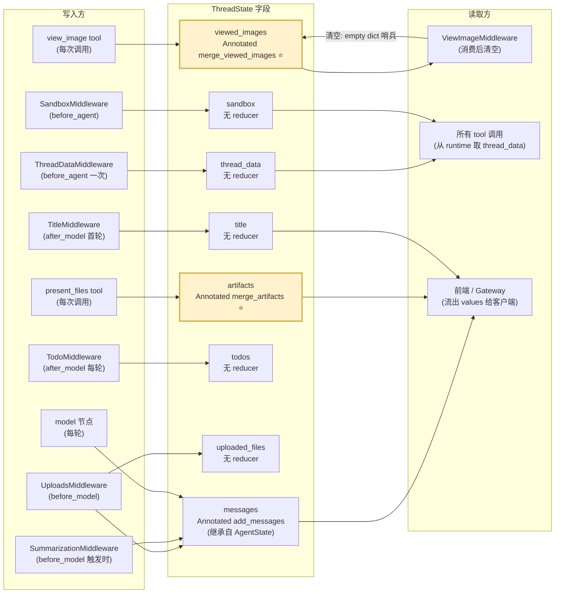

# 07 · `ThreadState` 与状态合并语义

> 整体架构层第 2 篇。06 章拉开了"运行时拓扑"，**本章把目光从进程拓扑拉到 graph 内部的"状态字段"层**。
>
> 这是一份**"看似只有 56 行源码、实际埋着 3 个微妙并发陷阱"** 的章节。`thread_state.py` 全文加在一起就 56 行，但它定义了 DeerFlow 18 个中间件、所有 `Command(update=...)`、所有自定义工具能**安全互相写状态**的契约。

---

## 🎯 学习目标

读完这份文档，你能回答：

1. `ThreadState` 在 LangChain `AgentState` 之上**只扩展了 7 个字段**，但 DeerFlow 把"沙箱、上传、工件、todos、图片"等一堆"运行时附件"都塞进了这 7 个字段 —— **为什么 7 个就够？哪些信息有意被排除？**
2. **5 个字段没有 reducer，2 个字段有自定义 reducer，1 个字段继承默认 reducer**。这种"7+1 异构 reducer 矩阵"背后有什么并发设计思想？
3. **`merge_viewed_images` 的"空字典清空哨兵"** 这个看似奇怪的设计是为了解决什么问题？为什么不能用 `None` 表示清空？
4. **如果你给 DeerFlow 加一个 `bookmarks: list[Bookmark]` 字段**（用户收藏的中间产物），你会选哪种 reducer？为什么不能简单用 `operator.add`？
5. `ThreadState` 在 LangGraph Checkpointer 里的"短期 vs 长期"边界在哪？哪些字段是"thread 死了就该删"，哪些是"thread 死了也想保留"？

---

## 🗂️ 源码定位

| 关注点 | 文件 / 行号 | 关键内容 |
|---|---|---|
| `ThreadState` 主文件（56 行） | `packages/harness/deerflow/agents/thread_state.py` | `SandboxState` L6；`ThreadDataState` L10；`ViewedImageData` L16；`merge_artifacts` L21；`merge_viewed_images` L31；`ThreadState` L48 |
| 父类 `AgentState`（继承的 `messages` 字段在这里） | `.venv/.../langchain/agents/middleware/types.py` | `AgentState` L350；`messages: Required[Annotated[list[AnyMessage], add_messages]]` L353 |
| **字段 ↔ 写入方** 映射 | grep 出来的真实使用 | `artifacts` 由 `tools/builtins/present_file_tool.py` 写入；`viewed_images` 由 `tools/builtins/view_image_tool.py` 写入、`agents/middlewares/view_image_middleware.py` 消费 + 清空；`title` 由 `title_middleware.py` 写入；`todos` 由 `todo_middleware.py` 读写；`uploaded_files` 由 `uploads_middleware.py` 读写；`sandbox` 由 `sandbox/middleware.py` 设置；`thread_data` 由 `thread_data_middleware.py` 设置 |
| 中间件**自带** state schema 扩展（合并到 ThreadState） | `agents/middlewares/uploads_middleware.py` | `UploadsMiddlewareState` L63 `uploaded_files: NotRequired[list[dict] \| None]` —— 与 ThreadState 同名字段，LangChain 会**字段并集**合并 |
| reducer 注解类型（前置阅读） | 03 章 `langgraph.graph.message.add_messages` | 三语义：append / 同 id 替换 / RemoveMessage 删除 |

---

## 🧭 架构图

### 1. ThreadState 的 7 字段地图（按"谁写 / 谁读 / 有无 reducer"）



### 2. Reducer 矩阵（一眼对照）

| 字段 | 类型 | Reducer | 并发写时的行为 | 谁可能并发写 |
|---|---|---|---|---|
| `messages` | `list[AnyMessage]` | `add_messages`（继承） | append + 同 id 替换 + RemoveMessage 删 | 几乎所有 middleware + model + tools |
| `artifacts` | `list[str]` | **`merge_artifacts`**（自定义） | 去重拼接（保留顺序） | 多个 `present_files` 调用 |
| `viewed_images` | `dict[str, ViewedImageData]` | **`merge_viewed_images`**（自定义） | 浅合并 + empty dict 哨兵清空 | 多次 `view_image` 调用 + ViewImageMiddleware 消费后清空 |
| `sandbox` | `SandboxState \| None` | 无 | last-write-wins | 实际只有 SandboxMiddleware 一处写 |
| `thread_data` | `ThreadDataState \| None` | 无 | last-write-wins | 实际只有 ThreadDataMiddleware 一处写 |
| `title` | `str \| None` | 无 | last-write-wins | 实际只有 TitleMiddleware 一处写 |
| `todos` | `list \| None` | 无 | last-write-wins | 实际只有 TodoMiddleware 一处写 |
| `uploaded_files` | `list[dict] \| None` | 无 | last-write-wins | UploadsMiddleware 一处写 |

> **关键观察**：DeerFlow 给字段加 reducer 的规则**不是**"所有可变集合都加"，而是**"只有可能多源并发写的才加"**。`title` / `todos` / `sandbox` 等"单源写"字段故意不加 reducer，省掉每次合并开销。这是个**精准的工程取舍**。

---

## 🔍 核心逻辑讲解

### Part 1 · 为什么 7 个字段就够？哪些被有意排除？

打开 `thread_state.py::ThreadState` L48：

```python
class ThreadState(AgentState):
    sandbox: NotRequired[SandboxState | None]
    thread_data: NotRequired[ThreadDataState | None]
    title: NotRequired[str | None]
    artifacts: Annotated[list[str], merge_artifacts]
    todos: NotRequired[list | None]
    uploaded_files: NotRequired[list[dict] | None]
    viewed_images: Annotated[dict[str, ViewedImageData], merge_viewed_images]
```

从 `AgentState` 继承的 `messages` —— 这一个 + 上面 7 个 = 8 个字段，**这就是 DeerFlow agent 的全部"短期状态"**。

#### 7 个字段各自承载什么职责？

| 字段 | 承载内容 | 是"运行时附件" 还是"业务数据"？ |
|---|---|---|
| `messages` | LLM 对话历史（含 tool calls） | LangGraph 原生 |
| `sandbox` | `sandbox_id` —— 沙箱实例引用 | 运行时附件 |
| `thread_data` | `workspace_path` / `uploads_path` / `outputs_path` | 运行时附件 |
| `title` | 自动生成的会话标题 | 业务数据 |
| `artifacts` | `present_files` 工具暴露给前端的文件列表 | 业务数据 |
| `todos` | TodoMiddleware 维护的任务清单 | 业务数据 |
| `uploaded_files` | 当前对话中已上传文件的元数据 | 运行时附件 |
| `viewed_images` | 已 view_image 加载的图片 base64 | 运行时附件（临时缓存） |

#### 被**有意排除**的（典型反例 + DeerFlow 的替代方案）

| 没塞进 ThreadState 的 | 为什么不塞 | DeerFlow 的替代方案 |
|---|---|---|
| `user_id` / `user_email` | 是"环境量"，跨 thread 不变 | `runtime/user_context.py` 的 contextvar（见 04 章） |
| `model_name` / `thinking_enabled` | 运行时配置，可能每次请求不同 | `RunnableConfig.configurable` |
| **`memory` 内容（长期事实）** | 跨 thread 持久，要按 user 隔离 | per-user `memory.json` 文件（20 章） |
| **`run_id` / `run_status`** | 是 RunManager 的运行时调度数据，不是 graph state | Gateway `app.state.run_manager`（06 章） |
| **`token_usage` 累积** | 跨 thread 聚合，业务表存 | `run_events` 表 + `TokenUsageMiddleware` |
| `feedback` | 用户反馈是异步行为 | `feedback` 表（24 章） |
| 任何"系统的"配置 | 不该被 LLM 的回复污染 | `AppConfig` |

> **设计哲学**：**ThreadState 只装"必须 in-loop 可见、必须 per-thread 持久化"的数据**。其他都通过 contextvar、RunnableConfig、外部 store、业务表分流。

**为什么这条边界很重要**：每加一个 ThreadState 字段，意味着：
1. 字段会**进入每次 Checkpointer 写入**（写放大）
2. 字段会被**流式 `values` 模式重复发送**（07 章 streaming 详讲）
3. 改字段语义是**破坏性变更**（已有 thread 的 checkpoint 怎么迁移？）

→ **加字段的门槛比想象的高**。

### Part 2 · `merge_artifacts` 的并发去重设计精读

```python
def merge_artifacts(existing: list[str] | None, new: list[str] | None) -> list[str]:
    """Reducer for artifacts list - merges and deduplicates artifacts."""
    if existing is None:
        return new or []
    if new is None:
        return existing
    # Use dict.fromkeys to deduplicate while preserving order
    return list(dict.fromkeys(existing + new))
```

**逐行解读**：
- `existing is None` 和 `new is None` 是 LangGraph 初始化空 state 的兜底（**第一次写入时**，老值是 None，要把 new 当作"初始集"）
- `dict.fromkeys(existing + new)` —— Python 3.7+ dict 有序，这一行同时做了**去重 + 顺序保留**。比 `list(set(...))` 强（set 在 Python 中不保证遍历顺序）。
- 注意**不是** `list(set(existing) | set(new))` —— 那样会丢顺序。

**实际写入现场**（`tools/builtins/present_file_tool.py`）：

```python
return Command(
    update={
        "artifacts": normalized_paths,    # ← 一次写入若干路径
        "messages": [ToolMessage("Successfully presented files", tool_call_id=tool_call_id)],
    },
)
```

**为什么需要去重？** 真实场景：用户反复让 agent "展示 report.md"，每次调 `present_files`，路径列表会越积越长。**reducer 帮我们自动去重**，前端拿到的列表干净。

**Trade-off**：`dict.fromkeys` 的 O(n) 拷贝在 artifacts 列表很长（几千项）时会成本可见。但 DeerFlow 的设计假设是"artifacts 是 user-facing 列表，不会过千"。**如果你的场景会，请考虑用一个 deduplicating set 字段而不是 list**。

### Part 3 · `merge_viewed_images` 的"空字典清空哨兵" —— 最微妙的设计

```python
def merge_viewed_images(existing, new) -> dict[str, ViewedImageData]:
    if existing is None:
        return new or {}
    if new is None:
        return existing
    # Special case: empty dict means clear all viewed images
    if len(new) == 0:
        return {}
    return {**existing, **new}
```

**关键的第 5 行**：**当一个中间件返回 `{"viewed_images": {}}` 时，整个字段会被**清空**而不是"什么都不变"**。

**为什么需要这个哨兵？**

打开 `view_image_middleware.py` L98 看消费侧：

```python
def before_model(self, state, runtime):
    viewed_images = state.get("viewed_images", {})
    if not viewed_images:
        return None
    # 把 base64 注入到最近一条 HumanMessage 内部(供 LLM 看到图片)
    for image_path, image_data in viewed_images.items():
        ...
    # 处理完后清空,避免下一轮重复注入
    return {..., "viewed_images": {}}    # ← 这就是"empty dict 哨兵"清空
```

**没有哨兵会怎样？** 假设没有这个特例 + 用普通 dict 合并：
- 第 1 轮：用户调 `view_image("a.png")` → state.viewed_images = {a.png: {...}}
- ViewImageMiddleware 注入 base64 给 LLM，但**没法清空** —— 因为返回 None 不改变，返回 `{}` 也只是"什么都不合并"
- 第 2 轮：用户再调 `view_image("b.png")` → state.viewed_images = {a.png: {...}, b.png: {...}}
- ViewImageMiddleware **又把 a.png 的 base64 注入一次**（重复 token，浪费 context）

**为什么不能用 `None` 表示清空？**

```python
return {..., "viewed_images": None}   # ❌ 不行
```

LangGraph 的 reducer 调用是 `reducer(existing, new)`。如果中间件返回 `None`：
- LangGraph 会**视为"该字段没更新"** —— 不调用 reducer
- reducer 永远不知道你想清空

**`{}` 的妙处**：是个**显式的、非 None 的、可识别的"清空意图"信号**。reducer 拿到 `new={}` 时知道"调用方明确表达了 clear"，区别于"调用方没碰这个字段"（`new is None`）。

**等价语义模式**：LangGraph 自家的 `add_messages` 也支持 `RemoveMessage(id="x")` 这种特殊节点表示"删除某条 message"。**DeerFlow 的"空字典哨兵"是同一哲学的轻量版本**。

### Part 4 · 同名字段 + 中间件自带 state schema：LangChain 字段并集

**`uploads_middleware.py` L63**：
```python
class UploadsMiddlewareState(TypedDict):
    uploaded_files: NotRequired[list[dict] | None]
```

**`thread_state.py` L54**：
```python
uploaded_files: NotRequired[list[dict] | None]
```

两个地方**都**定义了同名字段。会冲突吗？**不会**。

LangChain `create_agent` 内部（02 章 Part 1 提过）会把所有中间件的 `state_schema` 与 `ThreadState` 做**字段并集 + 去重**（`langchain.agents.factory._resolve_schema` L412）。结果是**一个统一的 state schema，包含所有字段，每个字段只出现一次**。

**为什么 DeerFlow 这么写？**
- 让 `UploadsMiddleware` 的代码**自描述**："我会读写 uploaded_files 字段"
- 让 `ThreadState` 的代码**完整声明**全部字段（前端 / Gateway 也能直接看到 ThreadState 类型）
- 两边声明一致 + 字段并集去重 → **声明性强、无运行时冲突**

**反例（不要这么做）**：如果只在 UploadsMiddlewareState 里声明，不在 ThreadState 里声明 → 中间件没启用时字段不存在 → 前端读到 KeyError。

### Part 5 · 设计权衡：胖 State vs 瘦 State

**当前设计：胖 State**

```python
class ThreadState(AgentState):
    sandbox: ...        # ← "运行时附件"
    thread_data: ...    # ← "运行时附件"
    artifacts: ...      # ← "业务数据"
    todos: ...          # ← "业务数据"
```

胖 State 优势：
- LangGraph Checkpointer 一次性持久化所有 → 故障恢复 / 续接干净
- 同一份 state 在所有 middleware / tool 内可见，**无需额外参数传递**

胖 State 代价：
- **写放大**：每个 super-step 末都要把整个 state 序列化进 checkpointer。artifacts 列表如果膨胀到几千项，每轮要拷贝几千项
- **状态污染**：调试时一个胖字典看不出问题在哪
- **schema 演化困难**：删字段是破坏性变更，已有 thread 的 checkpoint 怎么处理？

**反例：瘦 State + 业务表**

```python
class ThreadState(AgentState):
    pass    # 只有 messages

# artifacts、todos、title 全去业务表 (Persistence 五表)
```

瘦 State 优势：
- Checkpointer 永远只存 messages，写放大可控
- 删字段 / 改 schema 不影响 checkpoint
- 业务字段可独立查询、分页、索引

瘦 State 代价：
- 中间件、tool 想读写业务字段必须**额外注入 DB session** → 调用链复杂
- 持久化语义割裂：messages 在 checkpointer 里、artifacts 在业务表里，两边事务一致性谁保证？

**DeerFlow 选胖 State 是合理的折中**：
- 8 个字段中 5 个是"运行时附件" → 跟 messages 同生命周期，胖 State 自然
- 2 个有 reducer 字段（artifacts / viewed_images）**有界**：artifacts 不会过千、viewed_images 每轮被清空
- 真正"无界"的长期数据（memory、feedback）已经被显式排除到业务表

**这是一个面试金题** —— 高级 Agent 工程师必须能在 5 分钟内讲清这个权衡的两面。

---

## 🧩 体现的通用 Agent 设计模式

| 模式 | DeerFlow 中的体现 |
|---|---|
| **Sentinel Value**（哨兵值） | `merge_viewed_images` 的"空字典 = 清空"意图 |
| **State Schema Union**（schema 字段并集） | 中间件自带 schema + ThreadState 同名字段合并 |
| **Asymmetric Reducer Strategy**（异构 reducer 策略） | 5 字段无 reducer + 2 字段自定义 reducer，**按"是否多源并发写"决定** |
| **Per-Field Lifecycle Discipline**（按字段生命周期分流） | "运行时附件" 进 ThreadState；"长期数据" 进业务表 |
| **Convention over Configuration** | 字段命名（`viewed_images` / `uploaded_files`）即"用法约定"，无需外部 metadata |

---

## 🧱 与 Agent Harness 六要素的对应关系

| 六要素 | ThreadState 怎么提供基础设施 |
|---|---|
| ① 反馈循环 | `messages` 是 ReAct 反馈的载体；`todos` 让 plan-and-execute 可见可改 |
| ② 记忆持久化 | ThreadState 是 thread 范围的"短期记忆"；reducer 保证多源并发写不损坏 |
| ③ 动态上下文 | `viewed_images` 的注入-消费-清空闭环就是"按需带入上下文" |
| ④ 安全护栏 | `artifacts` 限定为字符串路径（不是任意对象），跨 trust boundary 时序列化安全 |
| ⑤ 工具集成 | `present_files` / `view_image` 把"工具输出"装回 state，自动暴露给前端 |
| ⑥ 可观测性 | ThreadState 进 Checkpointer 后可"时间旅行"看历史 super-step；`stream_mode=["values"]` 也是看 ThreadState 全量 |

---

## ⚠️ 常见坑与调试技巧

### 坑 1 · 中间件改 AIMessage 没保留原 id（02、03 章反复提到）

回到 02 章范例：`SubagentLimitMiddleware._truncate_task_calls` 改 AIMessage 时**必须** `AIMessage(id=last.id, ...)`，否则 `add_messages` 当成新增。**ThreadState 没有自定义 `messages` reducer，完全依赖父类 `add_messages` 的 id 替换语义**。

### 坑 2 · 想清空 `artifacts` 但没有"清空哨兵"

`merge_artifacts` 没实现哨兵清空 —— 你只能"追加去重"，**不能清空**。

```python
return {"artifacts": []}   # ❌ 这会被当成"追加 0 项",artifacts 保持原样
```
如果某天需要"清空 artifacts"（如用户发"clear my files"），**必须改 `merge_artifacts` 实现哨兵**，或在 reducer 外用 LangGraph 的 `Command(goto=..., update=...)` 替换整个 state。这是 ThreadState 当前的一个**不对称设计**：`viewed_images` 能清，`artifacts` 不能。

### 坑 3 · 多个 `present_files` 调用并发执行时

如果 LLM 在一次 AIMessage 里同时发 3 个 `present_files` tool_calls，**它们在 tools_node 里并发执行**（LangGraph 默认行为）。每个 tool 各自返回 `Command(update={"artifacts": [path]})`。

**`merge_artifacts` 的并发安全性**：每次 reducer 调用都基于上一次的 result，依次合并。即使 3 个并发同时回来，LangGraph 的 BSP barrier 保证**先汇总再 reduce**，结果稳定。✅

**但**：如果有两个 tool 都试图返回 `{"artifacts": [...]}` 且**路径完全相同**，`merge_artifacts` 通过 `dict.fromkeys` 去重 → 结果只保留一份。**这通常正确**。但如果你想统计"被 present 了几次"（重复有意义），那就别用这个 reducer。

### 坑 4 · ThreadState 字段 `NotRequired` 与 `Annotated[..., reducer]` 不能共存

注意 `thread_state.py`：
```python
class ThreadState(AgentState):
    sandbox: NotRequired[SandboxState | None]                    # ← NotRequired,无 reducer
    artifacts: Annotated[list[str], merge_artifacts]             # ← 有 reducer,无 NotRequired
```

**为什么有 reducer 的字段没标 `NotRequired`？** TypedDict 语义上："必填且初始值为空容器"。reducer 第一次被调用时 `existing` 是 None（LangGraph 的初始化兜底），reducer 内部用 `existing or []` 兜底。**这是个安全约定** —— 加 reducer 的字段事实上一定有"空集"初始值。

**踩坑示例**：如果你给 `bookmarks` 加自定义 reducer 但同时声明 `NotRequired`，第一次读 `state["bookmarks"]` 时可能 `KeyError`（因为 NotRequired 让字段可以不出现）。**最佳实践**：有 reducer 的字段不标 NotRequired，让 reducer 兜底。

### 坑 5 · ContextVar 字段（如 user_id）误写到 ThreadState

**症状**：你新人，看到 ThreadState 里没有 user_id，以为是 bug，加了一行 `user_id: str`。
**问题**：
1. user_id 是"环境量"，**跨整个 thread 不变** → 每个 super-step 重复存它是写放大
2. user_id 是 auth 决定的，**不应该被 LLM 的回复污染** → 装进 state 等于打开攻击面（恶意 prompt 让模型改 user_id）
3. 已有 contextvar 方案（04 章）

**调试**：发现某中间件需要 user_id 时，用 `from deerflow.runtime.user_context import get_effective_user_id`，**不要**塞 ThreadState。

---

## 🛠️ 动手实操

> 本 demo 完全脱离 DeerFlow 主进程，**只用 LangGraph + 一个迷你 ThreadState 复刻**，把 5 种 reducer 行为全跑一遍。读 56 行源码 → 跑这个 demo → 你就把 ThreadState 的 7 个字段全摸过一遍。

### Demo · ThreadState 7 字段并发写实验

```python
"""
ThreadState 并发写实验 — 全部 reducer 行为一次跑通.

跑法:  PYTHONPATH=backend uv run python scripts/thread_state_concurrency_demo.py

实验项:
1. messages: add_messages 三语义 (append / 同 id 替换 / RemoveMessage 删)
2. artifacts: merge_artifacts 并发去重(模拟 3 个 present_files 并发)
3. viewed_images: 普通合并 → 空字典哨兵清空
4. sandbox: 无 reducer 字段的 last-write-wins(并发互覆盖)
5. uploaded_files: 中间件自带 schema 并集合并(同名字段不冲突)
"""

import operator
from typing import Annotated, NotRequired, TypedDict
from langchain_core.messages import AIMessage, HumanMessage, RemoveMessage
from langgraph.graph import StateGraph, START, END
from langgraph.graph.message import add_messages
from langgraph.types import Command, Send


# ====== 1. 复刻一个简版 ThreadState ======
class SandboxState(TypedDict):
    sandbox_id: NotRequired[str | None]


def merge_artifacts(existing, new):
    if existing is None:
        return new or []
    if new is None:
        return existing
    return list(dict.fromkeys(existing + new))


def merge_viewed_images(existing, new):
    if existing is None:
        return new or {}
    if new is None:
        return existing
    if len(new) == 0:
        return {}
    return {**existing, **new}


class State(TypedDict):
    messages: Annotated[list, add_messages]
    sandbox: NotRequired[SandboxState | None]
    artifacts: Annotated[list[str], merge_artifacts]
    viewed_images: Annotated[dict[str, dict], merge_viewed_images]
    uploaded_files: NotRequired[list[dict] | None]


# ====== 2. 实验 1: messages add_messages 三语义 ======
print("\n" + "=" * 70)
print("实验 1 · messages add_messages 三语义")
print("=" * 70)

def m_append(state):
    return {"messages": [AIMessage(content="first", id="msg-1")]}

def m_replace(state):
    return {"messages": [AIMessage(content="REPLACED", id="msg-1")]}

def m_remove(state):
    return {"messages": [RemoveMessage(id="msg-1")]}

g1 = StateGraph(State)
g1.add_node("append", m_append)
g1.add_node("replace", m_replace)
g1.add_node("remove", m_remove)
g1.add_edge(START, "append")
g1.add_edge("append", "replace")
g1.add_edge("replace", "remove")
g1.add_edge("remove", END)

result = g1.compile().invoke({"messages": [HumanMessage("hi")], "artifacts": [], "viewed_images": {}})
print(f"最终 messages:{[(m.type, getattr(m, 'content', None), getattr(m, 'id', None)) for m in result['messages']]}")
print("观察:msg-1 被替换→删除,只剩最初的 HumanMessage")


# ====== 3. 实验 2: artifacts 并发去重 (Send fan-out 模拟 3 个 present_files) ======
print("\n" + "=" * 70)
print("实验 2 · artifacts merge_artifacts 并发去重")
print("=" * 70)

def planner(state):
    paths = ["a.md", "b.md", "a.md", "c.md", "b.md"]    # 故意有重复
    return Command(goto=[Send("present_one", {"_path": p}) for p in paths])

def present_one(state):
    return {"artifacts": [state["_path"]]}

g2 = StateGraph(State)
g2.add_node("planner", planner)
g2.add_node("present_one", present_one)
g2.add_node("collect", lambda s: s)
g2.add_edge(START, "planner")
g2.add_edge("present_one", "collect")
g2.add_edge("collect", END)

result = g2.compile().invoke({"messages": [], "artifacts": [], "viewed_images": {}})
print(f"5 次写入(2 个重复) → artifacts = {result['artifacts']}")
print("观察:重复被去掉,顺序保留")


# ====== 4. 实验 3: viewed_images 哨兵清空 ======
print("\n" + "=" * 70)
print("实验 3 · viewed_images 普通合并 vs 空字典哨兵清空")
print("=" * 70)

def view_a(state):
    return {"viewed_images": {"a.png": {"base64": "AAAA", "mime_type": "image/png"}}}

def view_b(state):
    return {"viewed_images": {"b.png": {"base64": "BBBB", "mime_type": "image/png"}}}

def consume_then_clear(state):
    # 模拟 ViewImageMiddleware 消费后清空
    images = state.get("viewed_images") or {}
    print(f"  consume_then_clear 看到 {len(images)} 张图片;清空")
    return {"viewed_images": {}}

g3 = StateGraph(State)
g3.add_node("view_a", view_a)
g3.add_node("view_b", view_b)
g3.add_node("consume", consume_then_clear)
g3.add_edge(START, "view_a")
g3.add_edge("view_a", "view_b")
g3.add_edge("view_b", "consume")
g3.add_edge("consume", END)

result = g3.compile().invoke({"messages": [], "artifacts": [], "viewed_images": {}})
print(f"最终 viewed_images: {result['viewed_images']}  (应为空 dict — 哨兵清空生效)")


# ====== 5. 实验 4: sandbox 无 reducer last-write-wins (并发覆盖演示) ======
print("\n" + "=" * 70)
print("实验 4 · sandbox 无 reducer 字段并发写 → 不确定性")
print("=" * 70)

def sb_planner(state):
    return Command(goto=[Send("write_sb", {"_id": f"sb-{i}"}) for i in range(5)])

def write_sb(state):
    return {"sandbox": {"sandbox_id": state["_id"]}}

g4 = StateGraph(State)
g4.add_node("sb_planner", sb_planner)
g4.add_node("write_sb", write_sb)
g4.add_node("end_node", lambda s: s)
g4.add_edge(START, "sb_planner")
g4.add_edge("write_sb", "end_node")
g4.add_edge("end_node", END)

result = g4.compile().invoke({"messages": [], "artifacts": [], "viewed_images": {}})
print(f"5 个并发 worker 各写一次 sandbox → 最终 sandbox = {result.get('sandbox')}")
print("观察:无 reducer 字段 = last-write-wins,**结果可能每次不同**")


# ====== 6. 实验 5: 中间件自带 state schema 与 ThreadState 同名字段并集合并 ======
print("\n" + "=" * 70)
print("实验 5 · 同名字段 in middleware schema vs ThreadState (LangChain 字段并集)")
print("=" * 70)

# 模拟一个"自带 schema 的 middleware",它声明 uploaded_files
# 在 LangChain create_agent 里这两个 schema 会被合并;这里直接验证 State 完整声明能正常工作
def uploads_middleware_sim(state):
    return {"uploaded_files": [{"name": "report.pdf", "size": 1024}]}

g5 = StateGraph(State)
g5.add_node("upload_sim", uploads_middleware_sim)
g5.add_edge(START, "upload_sim")
g5.add_edge("upload_sim", END)

result = g5.compile().invoke({"messages": [], "artifacts": [], "viewed_images": {}, "uploaded_files": None})
print(f"uploaded_files = {result['uploaded_files']}")
print("观察:即便 middleware 单独声明此字段,ThreadState 完整声明保证字段可见")
```

### 调试任务

1. **断点位置**：
   - `agents/thread_state.py::merge_artifacts` —— 实验 2 跑到 5 次合并时观察每次入参
   - `agents/thread_state.py::merge_viewed_images` 第 5 行（`if len(new) == 0: return {}`）—— 实验 3 跑到 `consume` 节点时观察哨兵触发
   - `langgraph/channels/` 内 channel 写入逻辑（深入可看）—— 看 reducer 在 super-step 末如何被调用
2. **观察什么**：
   - 实验 1：`result["messages"]` 长度从 2 变 1 再变 1（remove 删除）
   - 实验 2：`artifacts = ["a.md", "b.md", "c.md"]` 而不是 5 项（去重 + 顺序保留）
   - 实验 3：consume 节点之前 viewed_images 有 2 项，之后为空 dict
   - 实验 4：每次跑结果中 `sandbox_id` 可能是 sb-0~sb-4 任一（last-write-wins 不确定）
3. **人为制造异常**：
   - 把实验 1 中第二步 `AIMessage(content="REPLACED", id="msg-1")` 的 id 改成 `"msg-2"` → 看 messages 变 2 条而不是 1 条（id 替换 vs append 的关键差异）
   - 把实验 3 中 `{"viewed_images": {}}` 改成 `{"viewed_images": None}` → 看 reducer 走"未更新"分支，viewed_images 没被清空
   - 删除 State 里 `artifacts: Annotated[...]` 的 reducer，只声明 `artifacts: list[str]` → 重跑实验 2 → 看到 artifacts 变成最后一个 worker 的写入而不是合并去重

### 改造练习

1. **练习 A（简单）**：给 `artifacts` 加"清空哨兵" —— 改 `merge_artifacts`，让传入 `[None]` 表示清空（不是空字符串、不是空列表，因为这两个都有"歧义"）。然后跑测试，验证既能正常去重也能正常清空。
2. **练习 B（中等）**：给 ThreadState 加一个 `bookmarks: Annotated[dict[str, str], merge_bookmarks]` 字段（user → 收藏文件路径）。`merge_bookmarks` 要支持："覆盖同 user 的 bookmark"、"用 `{"__remove": user}` 哨兵删除某 user 的 bookmark"。
3. **挑战题**：写一个 `assert_state_consistency()` 工具 —— 输入一个 ThreadState 实例，检查：(1) `messages` 中每条 `AIMessage` 的 `tool_calls` 都对应有 `ToolMessage`（不是 dangling，13 章会讲）；(2) `artifacts` 中每个路径在沙箱 outputs 目录确实存在；(3) `viewed_images` 中的 base64 是合法 image。这是给 13 章 `DanglingToolCallMiddleware` 铺前菜。

### 预期输出 & 验证方式

- 实验 1：messages 最终 1 条（HumanMessage 'hi'），msg-1 经 replace→remove 后消失
- 实验 2：`artifacts = ['a.md', 'b.md', 'c.md']`
- 实验 3：`viewed_images = {}`（清空成功）
- 实验 4：每次跑 `sandbox.sandbox_id` 可能不同（不确定性）
- 实验 5：`uploaded_files = [{"name": "report.pdf", "size": 1024}]`

---

## 🎤 面试视角

### 业务型大厂卷

**问 1**：DeerFlow `ThreadState` 只给 `artifacts` 和 `viewed_images` 加自定义 reducer，其他 5 个字段（`sandbox` / `thread_data` / `title` / `todos` / `uploaded_files`）都没有 reducer。**这看起来"不对称"，你怎么向团队解释这个设计选择？**

> **教科书答案**：
> 加 reducer 的成本：每次 super-step 末多一次合并函数调用（cpu 开销）+ 必须保证 reducer 是结合律 / 幂等的（认知开销）。
> 不加 reducer 的成本：last-write-wins（不确定性）—— **只有在"实际只有单一写入方"时才安全**。
> DeerFlow 的判断：
> - `artifacts`：多个 present_files 调用并发 → 必须 reducer
> - `viewed_images`：多个 view_image 调用并发 + 中间件清空 → 必须 reducer + 哨兵语义
> - `sandbox` / `thread_data`：只有 SandboxMiddleware / ThreadDataMiddleware 一处写，一次写完不再变 → 不需 reducer
> - `title`：只有 TitleMiddleware 写，首轮决定后不变 → 不需 reducer
> - `todos`：TodoMiddleware **替换**整个列表（不是 delta 合并）→ 不需 reducer
> - `uploaded_files`：UploadsMiddleware 替换 → 不需 reducer
> **核心原则**：reducer **不是越多越好**；按"是否多源并发写"决定，**让 reducer 服务于真实并发风险**。
> **加分项**：指出"虽然现在 sandbox 是单写入，但如果未来加'多沙箱并存'特性，需要重新评估"——展现"为可演化性预设安全边界"的思维。

**问 2**：`merge_viewed_images` 用"空字典作清空哨兵"是一种 sentinel 值设计。**你能举两个 Python 标准库 / 流行框架里类似的 sentinel 设计吗**？这种设计的优缺点是？

> **教科书答案**：
> Sentinel 实例：
> 1. **`dict.pop(key, _MISSING)` / `dict.get(key, default)`** —— 默认值 vs "未提供" 用 sentinel 对象区分
> 2. **LangGraph `RemoveMessage(id=...)`** —— 用一个特殊 message 类型表示"删除"
> 3. **React `useState`'s `setState((prev) => prev === init ? init : new)`** —— 函数式更新里用同一对象引用表示"不更新"
> **优点**：
> - 无需引入新参数 / 新方法 / 新数据类型
> - 通过现有数据类型的特殊值（空 dict、None、特定类型实例）表达额外意图，API 表面保持简洁
> **缺点**：
> - **隐式约定** —— 读代码的人必须知道这个 sentinel 才理解行为；新手容易踩坑
> - **可能误触发** —— 例如哪天有合法场景需要"传入空字典 = 无更新"，sentinel 语义就冲突了
> **何时该用**：当行为变种很少（2-3 个）且 API 不希望膨胀；当不应用时：变种多于 3 个、读者需要快速理解。

### 创业型 AI 公司卷

**问 3**：你团队的 Agent 在生产中遇到一个 bug：用户上传 100 张图片，agent 调 view_image 100 次后**OOM**了。你怎么用 ThreadState 的设计原则定位 + 修复？

> **参考答案**：
> 定位 + 修复思路：
> 1. **看 viewed_images reducer**：每次 `view_image` 写 `{path: {base64: ...}}` → state 越积越大
> 2. **看 ViewImageMiddleware 的清空逻辑**：它在每轮 `before_model` 消费后清空。但如果**没有触发 LLM 调用**（如用户连续发 100 张图都没让 agent 回复），中间件不跑 → 不清空 → OOM
> 3. **修复方向**：
>    - **短期**：在 view_image_tool 本身限制 `viewed_images` 累积上限（>20 时拒绝写）
>    - **中期**：把 viewed_images 移出 state，存 sandbox 文件系统，state 里只放路径
>    - **长期**：评估是否给 state 上一个"总大小护栏" —— Checkpointer 在 state 体积 > 10MB 时报警
> **DeerFlow 视角**：viewed_images 在 state 里**是有意识的取舍** —— 短链路 / 单 LLM 周期内的图片缓存；长期持久化应在沙箱文件系统 + base64 lazy load。当前设计**有边界假设**：图片数量 < 20、用户不在长不交互场景滥用。把这个假设暴露出来 = 工程透明度。

**问 4**：你团队要把 DeerFlow ThreadState 改成"瘦 State + 业务表" —— `artifacts` / `todos` / `title` 全去业务表。**用一个完整的设计 RFC**回答这个问题（不超过 200 字）。

> **参考 RFC 框架**：
> **问题**：胖 ThreadState 在 artifacts 列表 >1000 项时写放大严重（每个 super-step 都序列化全部）。
> **方案**：
> 1. `ThreadState` 只留 messages + 短期附件（sandbox / thread_data / viewed_images）
> 2. `artifacts` / `todos` / `title` 移到业务表（`thread_artifacts` / `thread_todos` / `threads_meta.title`）
> 3. 工具调用通过 `Command(update={...}, side_effect=...)` 触发业务表写 → 但 LangGraph 没原生 side_effect → **改造 1**：在 `run_agent` worker 里拦截 update，分流到业务表
> 4. 前端读 `state` 时由 Gateway router 合并 ThreadState + 业务表 → **改造 2**：定义"View State"概念
> **代价**：
> - 中间件 / tool 调用链复杂化（要传 DB session）
> - 失去 checkpointer 自动持久化语义 → 需要自己保证一致性
> **不做**：暂不改，因为 DeerFlow 当前用户 artifacts 平均 <50 项，写放大问题不显著。**保留 RFC**，等真实问题出现再实施。

---

## 📚 延伸阅读

- **LangGraph "Low Level Concepts > Reducers"**：https://langchain-ai.github.io/langgraph/concepts/low_level/#reducers
  *如果你 03 章 demo 跑过了再回头读，会更深一层。*
- **PEP 705 — TypedDict NotRequired / Required**：https://peps.python.org/pep-0705/
  *理解为什么 `NotRequired` 和 `Annotated[..., reducer]` 不能同时声明。*
- **Python `dict.fromkeys` order preservation**：https://docs.python.org/3/library/stdtypes.html#dict.fromkeys
  *3.7+ dict 顺序保证是 `merge_artifacts` 工作的关键前提。*
- **DeerFlow `tools/builtins/view_image_tool.py` + `view_image_middleware.py` 配对源码**：把这两个文件对照着读一遍，你会清晰地看到 "写入端 → reducer → 消费端 → 哨兵清空" 的完整 4 段闭环。
- **Anthropic — "Engineering long agent runs"**：https://www.anthropic.com/research/building-effective-agents（同篇）
  *作者讨论"长任务里 state 如何不爆"的工程心得，与本章设计观正交补充。*

---

## 🎤 互动检查 —— 请回答这 3 个问题

> **两句话即可**。

1. **设计判断题**：DeerFlow `ThreadState` 没有给 `todos` 字段加 reducer。如果让你**给 TodoMiddleware 加并发能力**（两个 subagent 同时改 todos），你**必须先**改什么？为什么？
2. **机制理解题**：`merge_viewed_images` 用"空字典哨兵清空"。如果让你设计 `merge_artifacts` 的清空哨兵，你会选什么？为什么"空列表" `[]` 不行？
3. **应用题**：你的同事提了 PR：在 ThreadState 里加 `user_id: str` 字段。请用一句话告诉他**为什么这是个 bad idea**。

回答后我们进入 **`08-streaming-protocol-and-stream-modes.md`** —— LangGraph 7 种 `stream_mode` 语义不变量 + DeerFlowClient "messages-tuple" 重映射的工程哲学。
