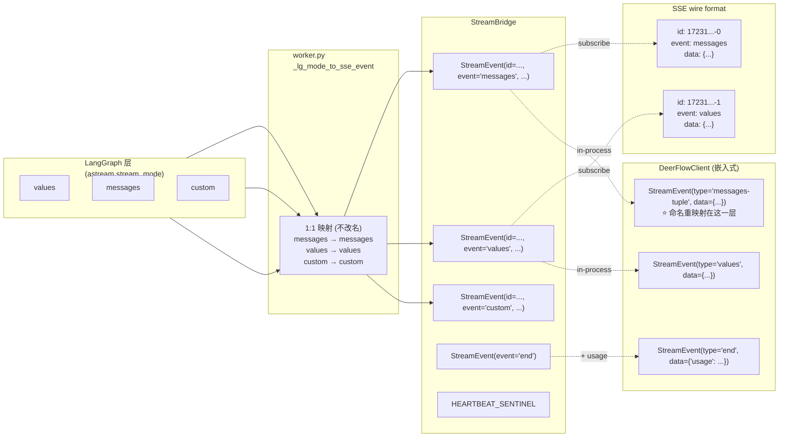
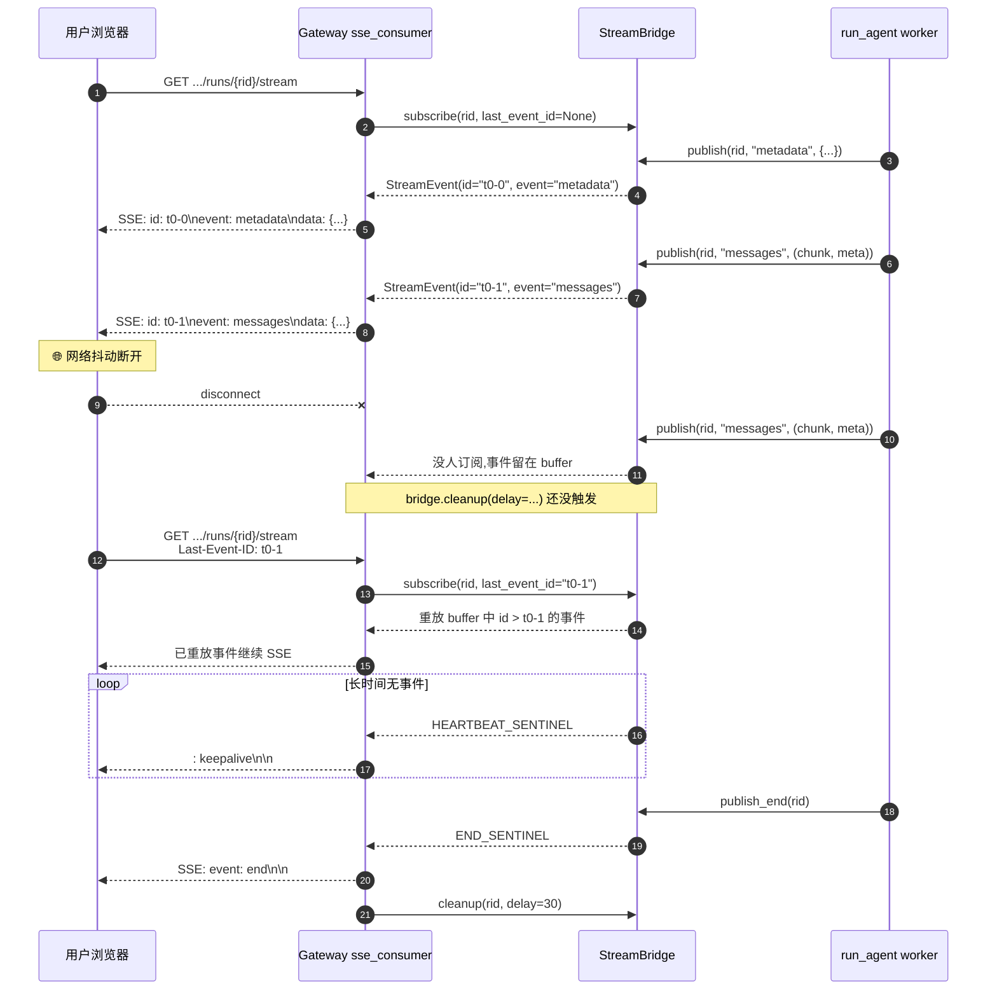

# 08 · 流式协议与 stream_mode 语义不变量

> 整体架构层第 3 篇。06 章拉运行时拓扑、07 章拉状态合并语义；本章把目光定在**事件如何流出 Gateway 给到客户端**——SSE 协议 + StreamBridge 抽象 + DeerFlowClient 的"messages-tuple"重映射。
>
> 03 章已经从 LangGraph 视角概览了 7 种 `stream_mode`；**本章从 DeerFlow 视角再讲一遍**，重点在三个"被忽略的工程细节"：
> 1. **去重不变量** —— `values` 全量 + `messages-tuple` 增量两个流并行，**前端必须靠 message id 去重**，否则一条 AI 消息会被渲染两次。
> 2. **断线重连机制** —— SSE 的 `Last-Event-ID` 头如何让客户端从断点续传，DeerFlow `MemoryStreamBridge` 留 256 事件 ring buffer。
> 3. **心跳哨兵** —— 长任务超过 15 秒无事件时，bridge 主动发空事件防止中间代理断连。

---

## 🎯 学习目标

读完这份文档，你能回答：

1. **DeerFlow 在哪一层做"`messages` → `messages-tuple`"的命名重映射？为什么不是在 Gateway 路由层做？** 这个边界放错会出什么 bug？
2. **`values` 模式发的是全量 state、`messages-tuple` 模式发的是 token 增量**。前端同时订阅这两个流时，如何避免同一条 AI 消息被渲染两次？DeerFlowClient 用了哪 4 个"集合 / 计数器"实现去重？
3. **SSE 断线重连**：客户端拿着上次最后收到的 event id（`Last-Event-ID` HTTP 头）重新连接，DeerFlow 的 MemoryStreamBridge 怎么决定"从哪一条开始重放"？256 事件的 ring buffer 上限超过怎么办？
4. **`StreamBridge` 抽象**有 `publish` / `publish_end` / `subscribe` / `cleanup` 4 个方法。**`cleanup` 有个 `delay` 参数 —— 为什么不能立即清理？**
5. **`HEARTBEAT_SENTINEL` 和 `END_SENTINEL`** 这两个特殊事件为什么用类常量而不是 `None` 表示？

---

## 🗂️ 源码定位

| 关注点 | 文件 | 关键锚点 |
|---|---|---|
| LangGraph 7 个 `StreamMode` 定义（前置） | `.venv/.../langgraph/types.py` L118-L132 | 03 章已精读 |
| StreamBridge 抽象 | `packages/harness/deerflow/runtime/stream_bridge/base.py`（68 行） | `StreamEvent` L13；`HEARTBEAT_SENTINEL` L27；`END_SENTINEL` L28；`StreamBridge` L31；4 个抽象方法 L36-L70 |
| MemoryStreamBridge 实现 | `packages/harness/deerflow/runtime/stream_bridge/memory.py` | `_RunStream` L14；`_next_id` L46（格式 `{ts}-{seq}`）；`_resolve_start_offset` L52（`Last-Event-ID` 重放）；`publish` L73（ring buffer 截断）；`queue_maxsize=256` |
| StreamBridge 工厂 | `packages/harness/deerflow/runtime/stream_bridge/async_provider.py` | `make_stream_bridge` async context manager |
| 生产者 — worker 调用 publish | `packages/harness/deerflow/runtime/runs/worker.py` | `_lg_mode_to_sse_event` L520（注释明确："`messages` stays `messages`"，**worker 不改名**）；`await bridge.publish(...)` L290 / L308 / L357；`publish_end` L402 |
| 消费者 — SSE 路由 | `backend/app/gateway/routers/runs.py` + `backend/app/gateway/services.py::sse_consumer` | `StreamingResponse` + media_type `text/event-stream`；headers 含 `X-Accel-Buffering: no` |
| DeerFlowClient 客户端重映射 | `packages/harness/deerflow/client.py` L555-L760+ | `stream()` 方法；`stream_mode=["values", "messages", "custom"]` L637；**4 个 dedup 集合**：`seen_ids` L595、`streamed_ids` L598、`counted_usage_ids` L602、`sent_additional_kwargs_by_id` L603；`cumulative_usage` L604 |
| 客户端公开的 8 种事件形状 | `packages/harness/deerflow/client.py` L560-L568 | docstring 列出 `values` / `custom` / `messages-tuple`(5 变体) / `end` |

---

## 🧭 架构图

### 1. 三层抽象关系（StreamMode / SSE Event / Client Type 不是一回事）



> **关键洞察**：**worker 不重命名**，bridge 不重命名，**HTTP SSE 协议层用的事件名就是 `messages` / `values` / `custom`**（与 LangGraph 一致）。**重命名只发生在 DeerFlowClient 这个 SDK 形态里**（在 `client.py::stream` 内部）。这是个非常精确的"边界放在哪"决定。

### 2. 单次 run 的事件时间线（包含心跳与断连重放）



---

## 🔍 核心逻辑讲解

### Part 1 · `StreamBridge` 为什么必须是抽象？

打开 `base.py`，看 `StreamBridge` 的 4 个抽象方法：

```python
class StreamBridge(abc.ABC):
    @abc.abstractmethod
    async def publish(self, run_id: str, event: str, data: Any) -> None: ...

    @abc.abstractmethod
    async def publish_end(self, run_id: str) -> None: ...

    @abc.abstractmethod
    def subscribe(
        self,
        run_id: str,
        *,
        last_event_id: str | None = None,
        heartbeat_interval: float = 15.0,
    ) -> AsyncIterator[StreamEvent]: ...

    @abc.abstractmethod
    async def cleanup(self, run_id: str, *, delay: float = 0) -> None: ...
```

**这 4 个方法看似可以用 LangGraph 自己的 `astream` 替代** —— 为什么 DeerFlow 要多写一层抽象？

| 直接用 `astream` 的局限 | StreamBridge 解决方式 |
|---|---|
| **生产者和消费者必须同协程** —— `astream` 只支持"调用方持有 iterator" | bridge 把生产者 / 消费者解耦：worker 是后台 task，HTTP 请求是另一个协程，通过 run_id 寻址 |
| **断线重连无法续传** —— `astream` 不缓冲，断了就丢 | bridge 保留 ring buffer，`subscribe(last_event_id=...)` 从指定 id 重放 |
| **跨进程不可能** —— `astream` 是进程内 generator | bridge 抽象留了跨进程实现的口子（如 Redis Streams / NATS），未来可加 |
| **无心跳机制** —— 长任务中间没事件时连接静默 | bridge 在 `subscribe()` 内置 15s 心跳，主动发 HEARTBEAT_SENTINEL |

**这条抽象的核心**：把"agent 跑出来的事件"和"用户能看到的事件"**解耦** —— 中间多了一个**可定位（按 run_id）、可缓冲（ring buffer）、可重放（Last-Event-ID）、可监控（心跳）**的事件总线。

### Part 2 · MemoryStreamBridge 的事件 id 格式 + ring buffer 设计

打开 `memory.py::_next_id`：

```python
def _next_id(self, run_id: str) -> str:
    self._counters[run_id] = self._counters.get(run_id, 0) + 1
    ts = int(time.time() * 1000)
    seq = self._counters[run_id] - 1
    return f"{ts}-{seq}"
```

**Event id 格式 `{毫秒时间戳}-{序列号}`**：
- 时间戳让 id **大致单调递增**，便于人肉对照"哪个事件在前"
- 序列号防止同一毫秒内多事件冲突
- **不用 UUID** 的理由：UUID 是无序的，调试时看不出顺序；id 也作为 SSE 协议的 `Last-Event-ID`，**有顺序信息有助于客户端判定"是否真的有事件被错过"**

**Ring buffer 截断（`publish` 内）**：

```python
async def publish(self, run_id: str, event: str, data: Any) -> None:
    stream = self._get_or_create_stream(run_id)
    entry = StreamEvent(id=self._next_id(run_id), event=event, data=data)
    async with stream.condition:
        stream.events.append(entry)
        if len(stream.events) > self._maxsize:
            overflow = len(stream.events) - self._maxsize
            del stream.events[:overflow]
            stream.start_offset += overflow      # ⭐ 关键
        stream.condition.notify_all()
```

`queue_maxsize=256` 是默认值。**`start_offset` 累计已被丢弃的事件数** —— 这一行特别关键：

```python
def _resolve_start_offset(self, stream, last_event_id):
    if last_event_id is None:
        return stream.start_offset    # 新订阅者只看后续(不重放历史)

    for index, entry in enumerate(stream.events):
        if entry.id == last_event_id:
            return stream.start_offset + index + 1    # 从下一条开始

    if stream.events:
        logger.warning(
            "last_event_id=%s not found in retained buffer; replaying from earliest retained event",
            last_event_id,
        )
    return stream.start_offset
```

**如果客户端 last_event_id 太老（已被 ring buffer 推出）**：
- 在 buffer 里找不到那个 id
- 退回到 `start_offset` —— **从 buffer 中最早还在的事件开始重放**
- **打一条 warning** 告诉运维"这次重连有事件丢失"

**Trade-off**：256 这个数字 = 工作内存上限 vs 续传可靠性的折中。
- 一个普通 chat run（10 轮对话）约产生 80-150 事件 → 大多数能完全续传
- 一个超长 run（几十个 subagent fan-out）可能产生上千事件 → 早期事件丢失但客户端能感知（warning）
- **如果需要更高可靠性**：换成 `async_provider.py` 接 Redis Streams / PostgreSQL（这是 StreamBridge 抽象留口的目的）

### Part 3 · `cleanup` 的 `delay` 参数 —— 为什么不能立即清

```python
@abc.abstractmethod
async def cleanup(self, run_id: str, *, delay: float = 0) -> None:
    """Release resources associated with *run_id*.

    If *delay* > 0 the implementation should wait before releasing,
    giving late subscribers a chance to drain remaining events.
    """
```

**真实场景**：
1. Worker 完成 → `publish_end(rid)` → `END_SENTINEL` 入队
2. 此时**某个客户端可能刚刚断线**，5 秒后用 `Last-Event-ID` 重连
3. 如果立即 `cleanup`，buffer 被清，重连后客户端**收不到 END_SENTINEL**，永远不知道 run 已结束（前端 spinner 转死）

**有了 `delay=30`**（典型值）：
- 给晚到的订阅者 30 秒窗口
- 30 秒内重连能拿到完整重放 + END
- 30 秒后才真正清

**Gateway 实际怎么用**：见 `app/gateway/services.py::sse_consumer` —— 在 `END_SENTINEL` 到达后**通常** 安排一个 `asyncio.create_task` 去延迟 cleanup。**这是个隐藏的"内存能否被回收"的依赖**——如果 delay 设得太长，每个完成的 run 都占内存到 delay 结束。

### Part 4 · DeerFlowClient 的"4 集合 + 1 累计"去重不变量

打开 `client.py::stream` 顶部局部变量声明（L595-L604）：

```python
seen_ids: set[str] = set()                              # values 模式的去重
streamed_ids: set[str] = set()                          # 跨模式握手:messages 已发 → values 跳过
counted_usage_ids: set[str] = set()                     # usage_metadata 只计一次
sent_additional_kwargs_by_id: dict[str, dict] = {}      # additional_kwargs 增量发送
cumulative_usage: dict[str, int] = {                     # 累计 token 用量
    "input_tokens": 0, "output_tokens": 0, "total_tokens": 0,
}
```

**这 4 个集合 + 1 个累计字典是整个去重不变量的核心**。逐一解释：

#### ① `seen_ids` —— `values` 模式去重

`values` 模式每个 super-step 后发一次**全量 messages 列表**。如果一条 AIMessage `id=msg-1` 在第 3、4、5 super-step 都在 messages 里，会被发 3 次。

**修复**：维护 `seen_ids`，每条 message 只在第一次出现时发给客户端。

```python
# values 模式处理
messages = chunk.get("messages", [])
for msg in messages:
    msg_id = getattr(msg, "id", None)
    if msg_id and msg_id in seen_ids:
        continue                # ← 已见过的跳过
    if msg_id:
        seen_ids.add(msg_id)
    ...
```

#### ② `streamed_ids` —— 跨模式握手（解决双流重复的核心）

**问题**：`messages` 模式发 token delta，**最后一个 delta** 完成时该 message 已是完整的；与此同时，`values` 模式在下一个 super-step 末发 messages 全量，**同一条 AIMessage 又出现一遍**。如果前端两个流都渲染，**一条消息会显示两次**。

**修复**：`messages` 模式发出某 id 时记到 `streamed_ids`；`values` 模式跳过那些 id。

```python
# messages 模式
if msg_id:
    streamed_ids.add(msg_id)
yield self._ai_text_event(msg_id, text, ...)

# values 模式（同一函数内）
for msg in messages:
    msg_id = getattr(msg, "id", None)
    if msg_id in streamed_ids:
        continue   # ← 已通过 messages 模式发过,跳过
```

**这就是 03 章反复提到的"核心不变量"**：**前端永远不会同时从 `values` 和 `messages-tuple` 流里收到同一条消息**。

#### ③ `counted_usage_ids` —— usage 重复计数防护

`usage_metadata` 在两个地方都会到达：
- `messages` 模式的最后一个 chunk 上有累计 usage
- `values` 模式的全量 messages 也带同样的 usage

如果两边都计入，**total_tokens 翻倍**。修复：

```python
def _account_usage(msg_id, usage):
    if msg_id and msg_id in counted_usage_ids:
        return None             # ← 这条已计过,不重复加
    if msg_id:
        counted_usage_ids.add(msg_id)
    cumulative_usage["input_tokens"] += usage.get("input_tokens", 0)
    ...
```

**这种"按 message id 去重计费"是面试金题** —— 与 23 章 `TokenUsageMiddleware` 的"message-position 合并"是**同一抽象的不同实现**（一个在客户端、一个在中间件，都解决"防止 token 重复计费"）。

#### ④ `sent_additional_kwargs_by_id` —— additional_kwargs 增量发送

LLM provider 经常在 streaming 中**逐步**填充 `additional_kwargs`（如 reasoning tokens）。如果每个 token delta 都把整个 additional_kwargs 重发一次，前端拼起来会重复。

修复：记录每个 message id **已发送过的 kwargs key** → 后续 delta 只发"新增 / 变化"的部分。

```python
def _unsent_additional_kwargs(msg_id, additional_kwargs):
    sent = sent_additional_kwargs_by_id.setdefault(msg_id, {})
    delta = {k: v for k, v in additional_kwargs.items() if sent.get(k) != v}
    if not delta:
        return None             # 没新增 → 不发
    sent.update(delta)
    return delta
```

#### ⑤ `cumulative_usage` —— 累计 token 用量

最终在 `"end"` 事件里返回给客户端 —— 这是整个 run 的总 token 消耗，便于显示成本。

#### 这 5 个变量合起来保证什么？

**"客户端整个 run 期间，每条 message 只被有效处理一次，每个 usage 只被计一次"** ——这种"客户端层维护去重不变量"的设计在生产 SSE 系统里**非常关键**，DeerFlowClient 用 50 行实现得很干净。

### Part 5 · 边界：为什么命名重映射放在客户端而不是 Gateway 路由？

**对照表**：

| 层 | 看到的事件名 | 为什么 |
|---|---|---|
| LangGraph `astream` | `messages` / `values` / `custom` | 框架本来就这么叫 |
| `worker.py::_lg_mode_to_sse_event` | `messages` / `values` / `custom` | **identity 映射**，注释明示"messages stays messages" |
| SSE HTTP 协议（Gateway 发出去） | `event: messages` / `event: values` / `event: custom` | 与 LangGraph Server 原版一致，让 `langgraph-sdk-js` 等第三方客户端能识别 |
| **DeerFlowClient.stream() 返回的 `StreamEvent`** | `messages-tuple` / `values` / `custom` / `end` | **DeerFlow 自己的语义层** |

**为什么 DeerFlowClient 要重命名？**
1. **明确语义**：LangGraph 的 `"messages"` 实际是 `(message_chunk, metadata)` 元组 → DeerFlow 写在类型名里
2. **加自己的事件类型**：`"end"` 是 DeerFlow 自己加的（结束时带累计 usage），LangGraph 不发这个
3. **隔离 SDK 演进**：未来 DeerFlow SDK 想加新事件类型（如 `"sub_agent_started"`），不会和 LangGraph 协议冲突

**为什么不把重命名放 Gateway 路由层？**
- 那样 HTTP SSE 出去的就是 `event: messages-tuple` —— 直接破坏 `langgraph-sdk-js` 客户端兼容性
- 任何"非 DeerFlow 自己的客户端"都收到不认识的事件名

**这就是 04 章讲的"同源 SDK / Server" 的另一面**：两条路径共享底层 harness，**SDK 形态可以加自己的语义层**，HTTP 形态保持协议兼容。

---

## 🧩 体现的通用 Agent 设计模式

| 模式 | DeerFlow 中的体现 |
|---|---|
| **Pub/Sub Broker**（发布订阅总线） | StreamBridge 按 run_id 寻址，生产者 / 消费者解耦 |
| **Ring Buffer / Retention Window**（环形缓冲） | MemoryStreamBridge `queue_maxsize=256` |
| **At-least-once Replay**（至少一次重放） | `Last-Event-ID` + ring buffer 让客户端可断点续传 |
| **Sentinel Event**（哨兵事件） | `HEARTBEAT_SENTINEL` / `END_SENTINEL` 用类型而非 None |
| **Heartbeat / Keepalive** | bridge `subscribe(heartbeat_interval=15)` |
| **Client-side Dedup Invariant**（客户端去重不变量） | DeerFlowClient 4 集合 + cumulative usage |
| **Layered Naming Translation** | LangGraph `messages` → SSE `messages` → SDK `messages-tuple` 三层 |

---

## 🧱 与 Agent Harness 六要素的对应关系

| 六要素 | 流式协议怎么提供基础设施 |
|---|---|
| ① 反馈循环 | SSE 让用户**逐 token 看到**反馈，缩短"敲完到看到 LLM 在思考"的时长 |
| ② 记忆持久化 | bridge 的 ring buffer 是**短期记忆**（30 秒级），与 Checkpointer（持久状态）分层 |
| ③ 动态上下文 | `custom` 模式让中间件能发出"业务事件"（如 subagent_started），前端可视化 agent 内部进度 |
| ④ 安全护栏 | SSE response headers 含 `X-Accel-Buffering: no` 防中间代理缓冲 / 缓存敏感数据 |
| ⑤ 工具集成 | tool_call / tool_result 通过 `messages` 模式实时流出，前端可显示工具调用过程 |
| ⑥ 可观测性 | 每个 event 带 id，便于运维做 trace；usage 在 `end` 事件附带，方便记账 |

---

## ⚠️ 常见坑与调试技巧

### 坑 1 · 前端从 `values` 和 `messages-tuple` 两个流都渲染 → 消息重复

**症状**：每条 AI 回复在前端显示**两次**。
**原因**：前端没做去重 —— `messages-tuple` 已经把 AI 文本逐 token 推过来了，`values` 又把整条 AIMessage 重发了一次。
**修复**：前端用 message id 去重（`Map<id, content>` 而不是 `[]`）—— DeerFlowClient 的 `streamed_ids` 就是把这件事在 SDK 层先做了。如果你用 HTTP 形态，**必须**自己做。

### 坑 2 · 长任务 SSE 在中间代理处被断开

**症状**：Agent 跑超过 60 秒，前端 SSE 连接被切断。
**原因**：中间代理（Nginx 默认 60s 超时；CDN；公司内网代理）认为连接 idle 了。
**修复**：
- Nginx 端：`proxy_read_timeout 600s; proxy_connect_timeout 600s;` （`docker/nginx/nginx.conf` 已配）
- bridge 端：发心跳（`heartbeat_interval=15`）—— **DeerFlow 默认就是 15 秒**，足够大多数代理
- 客户端端：实现 `Last-Event-ID` 重连兜底

### 坑 3 · `Last-Event-ID` 错过 buffer 窗口

**症状**：客户端断线 5 分钟后重连，发现"中间事件丢了一截"。
**原因**：MemoryStreamBridge `queue_maxsize=256`，超长 run 的早期事件已被推出。
**修复**：
- **客户端层**：识别 bridge 返回的 warning（`logger.warning("last_event_id=%s not found ...")`），告诉用户"网络中断时间过长，部分中间过程已丢失，正在显示后续事件"
- **服务端层**：把 `queue_maxsize` 调高（但会占内存）；或换成持久化 bridge

### 坑 4 · `END_SENTINEL` 收到后立刻断连，导致 cleanup 提前

**症状**：客户端在 `event: end` 后立刻关连接 → bridge cleanup 触发 → buffer 立即清；如果其它客户端晚来重连，**啥都收不到**。
**修复**：cleanup 用 `delay > 0`（DeerFlow 通常用 30 秒）—— 给"晚到客户端"窗口。

### 坑 5 · 调试 SSE 用 `curl`，看不到事件流

```bash
# ❌ 默认 curl 会缓冲输出
curl -X POST ... 

# ✅ 加 -N 禁用缓冲
curl -N -X POST ...
```
**调试技巧**：`-N`（`--no-buffer`）让 curl 实时输出每行；`-s` 静默；`2>/dev/null | head -N` 限定输出行数。

---

## 🛠️ 动手实操

> 本 demo 不依赖 DeerFlow 主进程也不依赖 LangGraph —— **直接用 `MemoryStreamBridge` 自己起一个生产者协程 + 一个消费者协程**，把"4 个抽象方法 + 心跳 + 断点续传"全跑一遍。然后再用 DeerFlowClient 跑一次真实 chat 看 6 种事件形状。

### Demo A · 纯 MemoryStreamBridge 跑通：心跳 + 断线重连

```python
"""
StreamBridge 内功 demo.

跑法:  PYTHONPATH=backend uv run python scripts/stream_bridge_internals_demo.py

观察:
1. publish/subscribe 解耦 — 生产者发,消费者订阅,run_id 寻址
2. Last-Event-ID 重连 — 中断后用上次 id 续传
3. heartbeat — 长期无事件时主动发心跳
4. END_SENTINEL — 结束信号
5. ring buffer 超限 — 早期事件丢失时的 warning
"""
import asyncio
import logging
from deerflow.runtime.stream_bridge.memory import MemoryStreamBridge
from deerflow.runtime.stream_bridge.base import HEARTBEAT_SENTINEL, END_SENTINEL

logging.basicConfig(level=logging.WARNING)


async def producer(bridge, run_id, total=10):
    """模拟 worker 后台发事件."""
    for i in range(total):
        await bridge.publish(run_id, "messages", {"chunk": i, "text": f"hello-{i}"})
        await asyncio.sleep(0.1)
    await bridge.publish_end(run_id)


async def case_a_basic():
    """Case A · 基本 publish / subscribe / END."""
    print("\n========== CASE A · 基本 publish / subscribe / END ==========")
    bridge = MemoryStreamBridge()
    run_id = "run-A"

    producer_task = asyncio.create_task(producer(bridge, run_id, total=5))

    async for ev in bridge.subscribe(run_id, heartbeat_interval=10.0):
        if ev is END_SENTINEL:
            print(f"  [consumer] END received")
            break
        print(f"  [consumer] id={ev.id}  event={ev.event}  data={ev.data}")

    await producer_task
    await bridge.cleanup(run_id, delay=0)


async def case_b_reconnect():
    """Case B · 断连 → 用 Last-Event-ID 重连续传."""
    print("\n========== CASE B · 断线重连 (Last-Event-ID) ==========")
    bridge = MemoryStreamBridge()
    run_id = "run-B"

    producer_task = asyncio.create_task(producer(bridge, run_id, total=8))

    # 第一次订阅:消费前 3 个事件就主动断开
    last_seen = None
    consumed = 0
    async for ev in bridge.subscribe(run_id, heartbeat_interval=10.0):
        if ev is END_SENTINEL:
            break
        print(f"  [phase 1] id={ev.id}  event={ev.event}")
        last_seen = ev.id
        consumed += 1
        if consumed >= 3:
            print(f"  [phase 1] 🌐 断连!last_event_id={last_seen}")
            break

    # 等生产者跑完
    await producer_task

    # 第二次订阅:用 last_event_id 续传
    print(f"  [phase 2] 用 last_event_id={last_seen} 重连")
    async for ev in bridge.subscribe(run_id, last_event_id=last_seen, heartbeat_interval=10.0):
        if ev is END_SENTINEL:
            print(f"  [phase 2] END received")
            break
        print(f"  [phase 2] id={ev.id}  event={ev.event}")


async def case_c_heartbeat():
    """Case C · 长时间无事件 → 心跳."""
    print("\n========== CASE C · 心跳 (HEARTBEAT_SENTINEL) ==========")
    bridge = MemoryStreamBridge()
    run_id = "run-C"

    async def slow_producer():
        await bridge.publish(run_id, "messages", {"chunk": 0})
        await asyncio.sleep(2.5)        # 故意停 2.5 秒
        await bridge.publish(run_id, "messages", {"chunk": 1})
        await bridge.publish_end(run_id)

    asyncio.create_task(slow_producer())

    heartbeats = 0
    async for ev in bridge.subscribe(run_id, heartbeat_interval=1.0):
        if ev is HEARTBEAT_SENTINEL:
            heartbeats += 1
            print(f"  [consumer] 💓 heartbeat #{heartbeats}")
            if heartbeats >= 3:        # 防止 demo 卡死
                break
            continue
        if ev is END_SENTINEL:
            print(f"  [consumer] END received")
            break
        print(f"  [consumer] data={ev.data}")


async def case_d_buffer_overflow():
    """Case D · ring buffer 超限 → 旧事件丢失,Last-Event-ID 找不到时退化."""
    print("\n========== CASE D · ring buffer 超限 ==========")
    # 故意把 buffer 调到 5,模拟早期事件被推出
    bridge = MemoryStreamBridge(queue_maxsize=5)
    run_id = "run-D"

    # 先发 10 个事件,buffer 只留最后 5 个
    for i in range(10):
        await bridge.publish(run_id, "messages", {"chunk": i})

    # 用一个老 id 重连(应该找不到 → 退化到最早还在的)
    print(f"  尝试用 last_event_id='ancient-id' 重连 (buffer 里没有这个 id)")
    received = 0
    async def consume():
        nonlocal received
        async for ev in bridge.subscribe(run_id, last_event_id="ancient-id", heartbeat_interval=10.0):
            if ev is END_SENTINEL:
                break
            print(f"    [consumer] id={ev.id}  chunk={ev.data['chunk']}")
            received += 1
            if received >= 5:
                break

    asyncio.create_task(consume())
    await asyncio.sleep(0.3)


async def main():
    await case_a_basic()
    await case_b_reconnect()
    await case_c_heartbeat()
    await case_d_buffer_overflow()


if __name__ == "__main__":
    asyncio.run(main())
```

### Demo B · 真实跑一次 chat 看 6 种事件形状（需要 DeerFlow 配好 config.yaml）

```python
"""
跑法: PYTHONPATH=backend uv run python scripts/deerflow_stream_events_demo.py

观察 DeerFlowClient.stream() 的 6 种事件形状.
"""
from collections import Counter
from deerflow.client import DeerFlowClient


def main():
    client = DeerFlowClient()
    counter = Counter()
    payload_samples: dict[str, dict] = {}

    print("\n=== Real chat stream — 计数 + 第一例 payload ===")
    for ev in client.stream(
        "请用 bash 跑 `echo hello` 然后告诉我输出", thread_id="stream-shape-demo"
    ):
        # 进一步细分 messages-tuple 的子类型
        kind = ev.type
        if kind == "messages-tuple":
            subtype = ev.data.get("type")
            if subtype == "ai":
                if "tool_calls" in ev.data:
                    kind = "messages-tuple/ai+tool_calls"
                elif "additional_kwargs" in ev.data:
                    kind = "messages-tuple/ai+additional_kwargs"
                else:
                    kind = "messages-tuple/ai+text"
            elif subtype == "tool":
                kind = "messages-tuple/tool"

        counter[kind] += 1
        if kind not in payload_samples:
            payload_samples[kind] = dict(ev.data) if isinstance(ev.data, dict) else {"_raw": str(ev.data)[:200]}

    print("\n=== 事件类型计数 ===")
    for kind, n in counter.most_common():
        print(f"  {kind:<40} ×{n}")

    print("\n=== 每种第一例 payload 抠出来看 ===")
    for kind, sample in payload_samples.items():
        compact = {k: (str(v)[:80] + "..." if len(str(v)) > 80 else v) for k, v in sample.items()}
        print(f"  {kind}:")
        for k, v in compact.items():
            print(f"      {k}: {v}")


if __name__ == "__main__":
    main()
```

### 调试任务

1. **断点位置**：
   - `memory.py::publish` 那个 ring buffer 截断分支 —— Case D 跑到时停下，看 `start_offset` 变化
   - `memory.py::_resolve_start_offset` —— Case B 重连时停下，看 `last_event_id` 怎么定位到 buffer 中位置
   - `client.py::stream` 内部 `if msg_id in streamed_ids: continue` —— 跑 Demo B 时观察哪些 message id 命中了"跨模式跳过"
2. **观察什么**：
   - Case B 重连后第一个事件 id 严格大于 `last_event_id`
   - Case C 心跳和事件**交替**出现（生产者停 2.5 秒，心跳每 1 秒一次，所以会有 2 次心跳）
   - Case D 在 stderr 输出 warning，因为 last_event_id 未找到
   - Demo B 中 `values` 模式的事件计数应该**远小于** `messages-tuple/ai+text` 的计数（值流是按 super-step，消息流是按 token）
3. **人为制造异常**：
   - 把 Case D 的 `queue_maxsize` 改成 100，再用一个能找到的 id 重连 → 看 phase 2 续传成功
   - Case B 中**不传** `last_event_id` 重连 → 看 phase 2 从最新事件开始（错过中间）

### 改造练习

1. **练习 A（简单）**：给 `case_b_reconnect` 加一层断言："`phase 2` 收到的所有 event id **严格大于** `last_seen`" —— 这是 SSE 续传正确性的核心不变量。
2. **练习 B（中等）**：实现一个 `RedisStreamBridge` 骨架（不需要真的连 Redis，先把 `subscribe` 用 `asyncio.Queue` 模拟跨进程语义）。验证：两个 Python 进程 import 同一个 bridge 实例，一个 publish 一个 subscribe，事件能传到。
3. **挑战题**：写一个端到端的"前端去重不变量"集成测试 —— 用 `httpx.AsyncClient` 同时订阅 Gateway 的 SSE，断言"任何 message id 在所有事件里出现总次数 = 1"（modulo additional_kwargs 增量）。这能反向验证 DeerFlowClient 在 SDK 层做的去重在 HTTP 层是否被前端正确复现。

### 预期输出 & 验证方式

- Case A：发出 5 条 → 5 条全部收到 + END
- Case B：phase 1 收前 3 条，phase 2 收后 5 条 + END，**两段加起来恰好 8 条**（无重复无缺失）
- Case C：4-5 个事件交替 + 至少 2 次心跳
- Case D：phase 2 收到 4-5 条（buffer 留 5 个，部分时间 race 后剩 4-5），stderr 有 warning
- Demo B：`messages-tuple/ai+text` ×100+（每 token 一次），`values` ×3-5，`tool_calls` ×1-2，`tool` ×1-2，`end` ×1

---

## 🎤 面试视角

### 业务型大厂卷

**问 1**：DeerFlow 的 SSE 流既有 `values`（全量）又有 `messages-tuple`（增量）。**前端工程师怀疑你这种设计"信息冗余"，质疑为什么不只发增量。** 你怎么回应？

> **教科书答案**：
> 两个流各有不可替代价值：
> - **`messages-tuple` 增量**：用于"打字机效果" —— token 一出来立刻渲染，UX 关键
> - **`values` 全量**：用于"保证最终一致性" —— super-step 末发的是 LangGraph state 真实快照，前端可以**用它做核对**，万一增量流有 race / 客户端 bug 没拼对，全量到达时**自动纠正**
> **不能只发增量**的边界：
> - 增量流是 in-process Python 对象序列化，前端代码 bug 可能拼错（如忘了处理空字符串 chunk）
> - 中间件 / 工具调用产生的 ToolMessage、artifacts 不在 token 增量里，必须靠 values 才看得到
> **设计代价**：前端必须实现去重不变量（按 message id）。DeerFlow 在 SDK 层（DeerFlowClient）已经做了；HTTP 客户端（如前端 langgraph-sdk-js）也内置了对应去重。所以"看似冗余"其实是**冗余 + 校验 + 不可替代信息源**三合一。

**问 2**：你团队的 Agent 在生产中出现"用户长任务断线重连后看到一片混乱"的 bug。给你 1 小时排查，**从哪几个方向入手**？

> **教科书答案**：
> 5 个排查方向，按"成本低到高"排：
> 1. **客户端 `Last-Event-ID` 头是否真的发了** —— Chrome devtools 看 EventSource 自动行为；自己实现的客户端常忘了发
> 2. **bridge ring buffer 上限是否够** —— 看 `queue_maxsize`，看 warning 日志是否大量出现"last_event_id not found"
> 3. **`cleanup(delay=...)` 是否设得太短** —— 客户端断到重连超过 delay 就完蛋
> 4. **Nginx / CDN 是否缓冲了 SSE** —— 检查 response header 是否含 `X-Accel-Buffering: no`；检查 nginx 配置 `proxy_buffering off`
> 5. **客户端去重是否实现正确** —— 是不是把同一 message id 渲染了两次（前端是不是 `[].push(...)` 而不是 `Map.set(id, ...)` ）
> **加分项**：建议加一条"SSE 健康监控" —— 给每个 run_id 记录"buffer 命中率"（重连用的 last_event_id 在 buffer 里找到的占比），低于 95% 就 alert。

### 创业型 AI 公司卷

**问 3**：DeerFlow 在 client.py 用 4 个集合做去重不变量。**这看起来很复杂，能不能简化成 1 个集合？** 简化的风险是什么？

> **参考答案**：
> 不能简单合并，因为 4 个集合处理的是**4 个语义独立的去重维度**：
> - `seen_ids` —— values 模式内部去重
> - `streamed_ids` —— values 跳过 messages 已发的（**跨模式去重**）
> - `counted_usage_ids` —— usage 计费去重
> - `sent_additional_kwargs_by_id` —— kwargs 增量去重
> 强行合并成 1 个 `set` 会发生：当某个 message id "已被 messages 模式发过"，应不应该被 usage_metadata 再计入？应不应该被 additional_kwargs delta 再发？答案**不一样**：usage 仍要计、kwargs 仍可能要发 delta。**4 个集合各自表达"用过 / 没用过"的不同维度**。
> **可以简化**的方向：用 1 个 `dict[msg_id, MessageStats]`，里面字段 `seen_in_values: bool, streamed_in_messages: bool, usage_counted: bool, kwargs_keys_sent: set[str]` —— 数据结构上更紧凑，但**语义维度还是 4 个**，复杂度没真正降低。**4 个 set 是更直接的表达**。

**问 4**：你的 Agent 在做"100 个 subagent fan-out"时，前端 SSE 因为事件量太大变卡。**怎么优化？请给出 3 个不同层级的方案**。

> **参考答案**：
> 3 层方案：
> 1. **客户端层**：前端做 throttle —— 接收 token delta 时 `requestAnimationFrame` 合批渲染，60Hz 而不是几百 Hz
> 2. **协议层**：worker 在 publish 前做 batching —— 多个 messages chunk 合并成一个 SSE event 推。**风险**：增加首字节延迟；需要在响应速度 vs 系统压力之间调
> 3. **架构层**：subagent fan-out 不通过 SSE 暴露所有内部事件 —— 只暴露 `task_started` / `task_completed` 这类"汇总事件"，subagent 内部 token 流走"按需展开"（用户点击某个 subagent 才订阅它的事件）。**这是 17 章 subagent 系统会展开的设计**
> **DeerFlow 当前实际**：选了第 3 种 —— `task()` 工具的事件流是 SSE-internal，subagent 内部 token 不外泄到 lead-agent SSE 流，避免事件爆炸。

---

## 📚 延伸阅读

- **WHATWG SSE 规范**：https://html.spec.whatwg.org/multipage/server-sent-events.html
  *半小时读完，理解 `Last-Event-ID` 头 / `id:` 字段 / `event:` 字段 / `data:` 字段的 wire format。*
- **LangGraph Streaming 概念页**：https://langchain-ai.github.io/langgraph/concepts/streaming/
  *与 03 章对照看。*
- **DeerFlow 自己的 `docs/STREAMING.md`** —— DeerFlow 维护团队对这套机制的"内部白皮书"，本章很多设计点都和它直接对应。
- **`Last-Event-ID` 在生产中的真实坑**：https://web.dev/articles/eventsource-basics
  *EventSource 自动重连的细节，配合 DeerFlow `subscribe(last_event_id=...)` 看。*

---

## 🎤 互动检查 —— 请回答这 3 个问题

> **两句话即可**。

1. **边界判断题**：DeerFlowClient 把 `"messages"` 重命名为 `"messages-tuple"`，但 Gateway SSE 出去的事件名**没有重命名**。给出**两个**这样做的理由。
2. **去重题**：DeerFlowClient `seen_ids` 和 `streamed_ids` 这两个集合的区别是什么？如果只保留其中一个，**会出什么 bug**？
3. **应用题**：你的 Agent 跑长任务，**bridge cleanup `delay=0`**（默认）。某用户 SSE 断线 10 秒后重连，发现"看不到任何事件，连结束都不知道"。**bug 在 cleanup `delay=0` 这一点上**——你怎么解释这个 bug 的因果链？

回答后我们进入 **`09-run-lifecycle-and-stream-bridge.md`** —— Run 生命周期状态机 + run_agent worker + pre-run checkpoint 快照与回滚。
