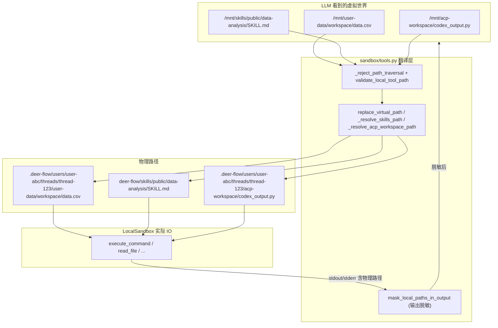
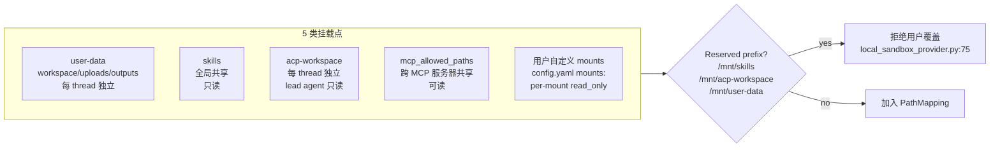

# 08 · 虚拟路径系统与多挂载点

> 07 篇结尾说：LocalSandboxProvider 是单例，所有 thread 共享一个 LocalSandbox 实例。那它怎么做 thread 隔离？答案就是这一章——**虚拟路径系统**：让每个 thread 在 prompt 里看到的都是同一组路径（`/mnt/user-data/workspace`），底层翻译到不同的物理目录。
>
> 这一章不只讲"翻译"，更讲**防御**：路径校验、`..` 拒绝、reserved prefix、双向脱敏。deer-flow 在这层的工程深度，是它区别于"教科书 LangChain 代码"的关键证据之一。

---

## 1. 模块定位（Why this matters）

deer-flow 的 agent 在 prompt 里只看见 **3 类虚拟路径**：

| 虚拟路径前缀 | 物理来源 | 权限 | 隔离粒度 |
|------------|---------|------|---------|
| `/mnt/user-data/{workspace,uploads,outputs}` | `{base_dir}/users/{user_id}/threads/{thread_id}/user-data/...` | 读 + 写 | per-thread, per-user |
| `/mnt/skills/{public,custom}/...` | `{repo}/skills/` | **只读** | 全局共享（多 thread / 多 user 共享） |
| `/mnt/acp-workspace/...` | `{base_dir}/users/{user_id}/threads/{thread_id}/acp-workspace/` | 对 lead agent **只读** | per-thread |
| 用户自定义 `mounts:` | `config.yaml` 显式映射 | 按 `read_only` 标志 | 视配置，但不能覆盖上面 3 类 |

不读这部分会错过 4 个关键认知：

1. **同一个 LocalSandbox 实例服务多 thread 的原理**：thread 隔离不靠"不同沙箱实例"，而靠"同一虚拟路径翻译到不同物理路径"。LocalSandbox 自己不知道 thread——它只看翻译后的真实路径。
2. **双向翻译**：`replace_virtual_path`（agent→host）让工具能读真实文件；`mask_local_paths_in_output`（host→agent）让工具的输出 / 错误信息里**不泄露宿主机绝对路径**。**只有正向翻译**会导致 traceback 把 `/Users/sanshi/.deer-flow/users/.../workspace/foo.py` 写进 LLM context——把 user_id、thread_id 全暴露了。
3. **多层防御**：在虚拟路径阶段拒 `..`、reserved prefix 阶段拒覆盖、解析后用 `path.relative_to(base)` 再校验一次。**任何一层失守都会被下一层挡住**。
4. **Docker-in-Docker (DooD) 的隐藏陷阱**：Gateway 跑在 Docker 里、它又要驱动宿主机 Docker daemon 起 sandbox 容器，宿主机看到的 path ≠ Gateway 容器内看到的 path。`DEER_FLOW_HOST_BASE_DIR` 是这条裂缝的桥梁。

对应到 Harness 六要素：本章对应**沙箱执行 + 安全护栏**两条要素——路径翻译是沙箱执行的物理基础，路径校验是安全护栏的第一道门。

---

## 2. 源码地图（Source Map）

### 2.1 关键文件清单

| 路径 | 角色 |
|------|------|
| [`packages/harness/deerflow/config/paths.py`](../packages/harness/deerflow/config/paths.py) | `Paths` 类（351 行）— 所有路径计算的中心 |
| [`packages/harness/deerflow/config/runtime_paths.py`](../packages/harness/deerflow/config/runtime_paths.py) | `project_root() / runtime_home()` — 03 篇见过 |
| [`packages/harness/deerflow/sandbox/tools.py`](../packages/harness/deerflow/sandbox/tools.py) | 路径翻译 + 校验（1583 行，重点在 81–800 段） |
| [`packages/harness/deerflow/sandbox/local/local_sandbox.py`](../packages/harness/deerflow/sandbox/local/local_sandbox.py) | `PathMapping` dataclass + `_reverse_resolve_paths_in_output` |
| [`packages/harness/deerflow/sandbox/local/local_sandbox_provider.py`](../packages/harness/deerflow/sandbox/local/local_sandbox_provider.py) | `_setup_path_mappings` — 启动时装配 skills + custom mounts |
| [`packages/harness/deerflow/agents/middlewares/thread_data_middleware.py`](../packages/harness/deerflow/agents/middlewares/thread_data_middleware.py) | `before_agent` 把 `workspace_path / uploads_path / outputs_path` 写进 ThreadState |

### 2.2 关键符号速查表

| 符号 | 文件:行 | 一句话职责 |
|------|---------|-----------|
| `VIRTUAL_PATH_PREFIX = "/mnt/user-data"` | `paths.py:9` | 虚拟路径前缀常量 |
| `_SAFE_THREAD_ID_RE` | `paths.py:11` | 严格白名单 `^[A-Za-z0-9_\-]+$` |
| `_SAFE_USER_ID_RE` | `paths.py:12` | 同上 |
| `_validate_thread_id` | `paths.py:20` | 拒绝任何非白名单字符 |
| `class Paths` | `paths.py:62` | 集中路径计算 |
| `Paths.base_dir` | `paths.py:113` | `DEER_FLOW_HOME` 或 `project_root/.deer-flow` |
| `Paths.host_base_dir` | `paths.py:92` | DooD 兼容：`DEER_FLOW_HOST_BASE_DIR` 优先 |
| `Paths.sandbox_work_dir(thread, user)` | `paths.py:191` | `{base}/users/{user}/threads/{thread}/user-data/workspace` |
| `Paths.ensure_thread_dirs` | `paths.py:260` | 创目录 + `chmod 0o777`（跨容器 UID 适配） |
| `Paths.resolve_virtual_path` | `paths.py:291` | 虚拟→物理 + relative_to 防穿越 |
| `Paths.delete_thread_dir` | `paths.py:282` | 幂等删除（thread 移除时调） |
| `replace_virtual_path(path, thread_data)` | `sandbox/tools.py:436` | **正向翻译** + longest-prefix-first |
| `mask_local_paths_in_output(output, thread_data)` | `sandbox/tools.py:502` | **反向脱敏** 4 类：skills/acp/user-data/custom |
| `validate_local_tool_path(path, thread_data, read_only)` | `sandbox/tools.py:585` | 虚拟路径访问权限校验 |
| `_reject_path_traversal(path)` | `sandbox/tools.py:576` | 拒 `..` 段 |
| `_is_skills_path / _is_acp_workspace_path / _is_custom_mount_path` | `sandbox/tools.py:126/156/191` | 三类前缀判别 |
| `_get_skills_container_path` | `sandbox/tools.py:81` | `config.skills.container_path`（默认 `/mnt/skills`） |
| `_get_custom_mounts()` | `sandbox/tools.py:161` | 从 config 取 + host_path.exists() 过滤 + 缓存 |
| `_resolve_skills_path / _resolve_acp_workspace_path` | `sandbox/tools.py:132/267` | 两类只读路径的解析 |
| `_RESERVED_CONTAINER_PREFIXES` | `local_sandbox_provider.py:51` | `/mnt/skills /mnt/acp-workspace /mnt/user-data` 不可被用户 mount 覆盖 |
| `class PathMapping` | `local_sandbox.py:15` | `(container_path, local_path, read_only)` 的不可变数据类 |
| `_thread_virtual_to_actual_mappings(thread_data)` | `sandbox/tools.py:472` | 构造 3 + 1 条映射 dict |

### 2.3 翻译流程示意



### 2.4 多挂载点对比



---

## 3. 核心逻辑精读（Deep Dive）

### 3.1 `Paths` 类：所有路径计算的中心

```python
# packages/harness/deerflow/config/paths.py:62-86 (节选)
class Paths:
    """
    Centralized path configuration for DeerFlow application data.

    Directory layout (host side):
        {base_dir}/
        ├── memory.json
        ├── USER.md          <-- global user profile
        ├── agents/
        │   └── {agent_name}/
        │       ├── config.yaml
        │       ├── SOUL.md
        │       └── memory.json
        └── threads/
            └── {thread_id}/
                └── user-data/         <-- mounted as /mnt/user-data/
                    ├── workspace/
                    ├── uploads/
                    └── outputs/

    BaseDir resolution (in priority order):
        1. Constructor argument `base_dir`
        2. DEER_FLOW_HOME environment variable
        3. Caller project fallback: `{project_root}/.deer-flow`
    """
```

**值得圈点的 3 处设计**：

1. **每个用户都有自己的子树（`users/{user_id}/threads/...`）**：21 篇会详谈这条迁移路径，但已经在 `Paths` 里物理实现了。`thread_dir(thread_id, user_id=user_id)` 不传 user_id 走老布局。
2. **`{base_dir}/memory.json` 和 `users/{user}/memory.json` 共存**：全局 memory + per-user memory。14 篇详谈。
3. **`agents/{agent_name}/SOUL.md` 是自定义 agent 的人设文件**：05 篇见过 `agent_config.skills`、`agent_config.model`，那是 `config.yaml`；`SOUL.md` 是 LLM 看到的人设描述。

**`base_dir` 的解析（行 112-121）**：

```python
@property
def base_dir(self) -> Path:
    """Root directory for all application data."""
    if self._base_dir is not None:
        return self._base_dir
    if env_home := os.getenv("DEER_FLOW_HOME"):
        return Path(env_home).resolve()
    return _default_local_base_dir()    # → runtime_home() → {project_root}/.deer-flow
```

三级优先级：**构造参数 → 环境变量 → `{cwd}/.deer-flow`**。和 03 篇的 `AppConfig.resolve_config_path` 是同一套设计哲学。

### 3.2 `host_base_dir`：DooD 的关键

```python
# packages/harness/deerflow/config/paths.py:92-104
@property
def host_base_dir(self) -> Path:
    """Host-visible base dir for Docker volume mount sources.

    When running inside Docker with a mounted Docker socket (DooD), the Docker
    daemon runs on the host and resolves mount paths against the host filesystem.
    Set DEER_FLOW_HOST_BASE_DIR to the host-side path that corresponds to this
    container's base_dir so that sandbox container volume mounts work correctly.

    Falls back to base_dir when the env var is not set (native/local execution).
    """
    if env := os.getenv("DEER_FLOW_HOST_BASE_DIR"):
        return Path(env)
    return self.base_dir
```

**这段代码解决的问题**：

```mermaid
flowchart LR
    subgraph Container[Gateway 容器内]
        GW[Gateway 进程<br/>base_dir = /app/.deer-flow]
    end
    subgraph DockerDaemon[宿主机 Docker daemon]
        DD[需要 host path<br/>例如 /Users/sanshi/.deer-flow]
    end
    subgraph Sandbox[Sandbox 容器]
        SB[/mnt/user-data/<br/>← bind mount]
    end

    GW -->|"docker run -v {host_path}:/mnt/user-data"| DD
    DD --> SB

    GW -.错误：传 /app/.deer-flow.-> DD
    DD -.daemon 在 host 上找不到该路径.-> Sandbox
```

如果 Gateway 容器内的 `base_dir = /app/.deer-flow`，但要在**宿主机的 Docker daemon** 上 `docker run -v /app/.deer-flow/.../workspace:/mnt/user-data/workspace ...`，宿主机根本没有 `/app/.deer-flow` 这个路径——daemon 会创建一个空目录并挂载，agent 看不到任何用户文件。

**解法**：`DEER_FLOW_HOST_BASE_DIR=/Users/sanshi/.deer-flow` 告诉 deer-flow"宿主机上对应的真实路径是什么"。`host_base_dir` 返回它（不是 `base_dir`），所有 `host_sandbox_*_dir` 方法都用它构造 mount source。**容器内读写仍用 `base_dir`（自己看得到的）**，向 Docker daemon 发出的 mount 命令用 `host_base_dir`。

这是个**典型的"两侧视角不同"问题**，deer-flow 的解法是显式提供两套 API：

| 方法 | 给谁用 | 路径基准 |
|------|--------|---------|
| `Paths.sandbox_work_dir(thread_id)` | 进程内做文件 IO | `base_dir`（自己看得到） |
| `Paths.host_sandbox_work_dir(thread_id)` | 调 Docker API 时做 mount | `host_base_dir`（daemon 看得到） |

### 3.3 `_validate_thread_id`：路径校验的第一道门

```python
# packages/harness/deerflow/config/paths.py:11-31
_SAFE_THREAD_ID_RE = re.compile(r"^[A-Za-z0-9_\-]+$")
_SAFE_USER_ID_RE = re.compile(r"^[A-Za-z0-9_\-]+$")


def _validate_thread_id(thread_id: str) -> str:
    """Validate a thread ID before using it in filesystem paths."""
    if not _SAFE_THREAD_ID_RE.match(thread_id):
        raise ValueError(f"Invalid thread_id {thread_id!r}: only alphanumeric characters, hyphens, and underscores are allowed.")
    return thread_id
```

**4 处巧妙**：

1. **白名单（only alphanumeric + `_` + `-`）而不是黑名单**：黑名单永远漏（`%2e%2e` URL 编码、Unicode 同形字符、Windows 保留名 `CON`、`PRN`……）。白名单从源头堵死。
2. **`^...+$` 不含空字符串**：防 `thread_id=""` 之类。
3. **每次构造路径都校验**：`thread_dir`、`host_thread_dir` 都调一次。**重复校验不重复成本**——正则是 O(n)，路径构造本来就是 O(n)。
4. **`/`、`\`、`.`、`..`、空格都被天然排除**：所以下游不需要单独处理路径分隔符或 traversal——白名单已经堵了。

**对比**：很多开源框架会写 `if ".." in thread_id`——但 `..` 只是冰山一角。deer-flow 直接白名单是更可靠的工程纪律。

### 3.4 `resolve_virtual_path`：单点翻译 + 防御

```python
# packages/harness/deerflow/config/paths.py:291-325
def resolve_virtual_path(self, thread_id: str, virtual_path: str, *, user_id: str | None = None) -> Path:
    """Resolve a sandbox virtual path to the actual host filesystem path."""
    stripped = virtual_path.lstrip("/")
    prefix = VIRTUAL_PATH_PREFIX.lstrip("/")

    # Require an exact segment-boundary match to avoid prefix confusion
    # (e.g. reject paths like "mnt/user-dataX/...").
    if stripped != prefix and not stripped.startswith(prefix + "/"):
        raise ValueError(f"Path must start with /{prefix}")

    relative = stripped[len(prefix) :].lstrip("/")
    base = self.sandbox_user_data_dir(thread_id, user_id=user_id).resolve()
    actual = (base / relative).resolve()

    try:
        actual.relative_to(base)
    except ValueError:
        raise ValueError("Access denied: path traversal detected")

    return actual
```

**4 重防御**：

1. **`stripped != prefix and not stripped.startswith(prefix + "/")`**：要求**段边界**对齐。`mnt/user-dataX/foo` 会被拒（因为 `mnt/user-dataX` 不等于 `mnt/user-data` 且不以 `mnt/user-data/` 开头）。这堵死"前缀劫持"：恶意构造的 `/mnt/user-dataEVIL/...` 不会被错认成合法路径。
2. **`base.resolve()` + `actual.resolve()` + `actual.relative_to(base)`**：双重 resolve 把符号链接、`./`、`..` 全展开，最后用 `relative_to` 校验是否仍在 `base` 子树内。即使前面的字符串校验漏过去，**`relative_to` 是兜底**——任何"逃出" `base` 的路径都会 ValueError。
3. **`_validate_thread_id` 已经在 `sandbox_user_data_dir → thread_dir` 路径上隐式调用**——thread_id 含恶意字符的话，构造 base 时就炸了。
4. **不接受相对路径**：函数接收的虚拟路径必须带 `/mnt/user-data/` 前缀；任何不带的（例如 `foo.txt`）会被第一个 if 拒。**强制要求 absolute virtual path** 是统一翻译边界的关键。

### 3.5 `replace_virtual_path`：longest-prefix-first 翻译

```python
# packages/harness/deerflow/sandbox/tools.py:436-469
def replace_virtual_path(path: str, thread_data: ThreadDataState | None) -> str:
    """Replace virtual /mnt/user-data paths with actual thread data paths."""
    if thread_data is None:
        return path

    mappings = _thread_virtual_to_actual_mappings(thread_data)
    if not mappings:
        return path

    # Longest-prefix-first replacement with segment-boundary checks.
    for virtual_base, actual_base in sorted(mappings.items(), key=lambda item: len(item[0]), reverse=True):
        if path == virtual_base:
            return actual_base
        if path.startswith(f"{virtual_base}/"):
            rest = path[len(virtual_base) :].lstrip("/")
            result = _join_path_preserving_style(actual_base, rest)
            if path.endswith("/") and not result.endswith(("/", "\\")):
                result += _path_separator_for_style(actual_base)
            return result

    return path
```

**为什么要 longest-prefix-first**？看 `_thread_virtual_to_actual_mappings` 构造的 dict（行 472-494）：

```python
mappings = {
    "/mnt/user-data/workspace": ".deer-flow/.../workspace",
    "/mnt/user-data/uploads": ".deer-flow/.../uploads",
    "/mnt/user-data/outputs": ".deer-flow/.../outputs",
    "/mnt/user-data": ".deer-flow/.../user-data",          # 共同父目录映射
}
```

如果按短→长顺序遍历，`/mnt/user-data/workspace/foo` 会先匹配上 `/mnt/user-data` → `.deer-flow/.../user-data/workspace/foo`——错误！实际目标是 `.deer-flow/.../workspace/foo`（短一级）。

按长→短遍历：先匹配 `/mnt/user-data/workspace` → 正确。

**`if path.startswith(f"{virtual_base}/")` 的段边界**：和 `resolve_virtual_path` 同样的小心——必须在 `/` 处断开。

### 3.6 `mask_local_paths_in_output`：反向脱敏

```python
# packages/harness/deerflow/sandbox/tools.py:502-573 (节选)
def mask_local_paths_in_output(output: str, thread_data: ThreadDataState | None) -> str:
    """Mask host absolute paths from local sandbox output using virtual paths.

    Handles user-data paths (per-thread), skills paths, and ACP workspace paths (global).
    """
    result = output

    # Mask skills host paths
    skills_host = _get_skills_host_path()
    skills_container = _get_skills_container_path()
    if skills_host:
        raw_base = str(Path(skills_host))
        resolved_base = str(Path(skills_host).resolve())
        for base in _path_variants(raw_base) | _path_variants(resolved_base):
            escaped = re.escape(base).replace(r"\\", r"[/\\]")
            pattern = re.compile(escaped + r"(?:[/\\][^\s\"';&|<>()]*)?")
            def replace_skills(match, _base=base):
                matched_path = match.group(0)
                if matched_path == _base:
                    return skills_container
                relative = matched_path[len(_base) :].lstrip("/\\")
                return f"{skills_container}/{relative}" if relative else skills_container
            result = pattern.sub(replace_skills, result)

    # ... 同样处理 acp-workspace ...
    # ... 同样处理 user-data ...
    return result
```

**这段做的事**：

- 用户工具调用产生的 stdout/stderr 里可能含**宿主机绝对路径**——例如 `Traceback (most recent call last): File "/Users/sanshi/.deer-flow/users/user-abc/threads/thread-123/user-data/workspace/script.py"`。
- 这些路径暴露了 user_id、thread_id、宿主机用户名——任何一条都不该进 LLM context。
- 反向扫所有已知的物理 base，用正则替换回 `/mnt/user-data/workspace/script.py`。

**4 个工程细节**：

1. **`raw_base` 和 `resolved_base` 都扫**：Python 的 `Path("/Users/sanshi/..").resolve()` 可能比原始字符串短或长（符号链接、相对路径展开）。两个都要替换，否则 traceback 里某些路径漏。
2. **`_path_variants(base)`**：还会生成 Windows 风格（反斜杠）变体——跨平台兼容。
3. **`escape().replace(r"\\", r"[/\\]")`**：把分隔符处理成"接受 `/` 或 `\`"。避免 Windows 路径里反斜杠不匹配。
4. **正则贪婪匹配 + 排除分隔符**：`r"(?:[/\\][^\s\"';&|<>()]*)?"`——后缀用 `[^\s\"';&|<>()]*` 防止把 path 之后的引号 / shell 字符也吃掉。这是从 bash 输出脱敏的边界 case。

**反向脱敏 vs 正向翻译的对偶**：

| 方向 | 函数 | 输入 | 输出 |
|------|------|------|------|
| 正向 | `replace_virtual_path` | `/mnt/user-data/...` | `.deer-flow/.../...` |
| 反向 | `mask_local_paths_in_output` | `.deer-flow/.../...` 出现在文本里 | `/mnt/user-data/...` |

**为什么不直接用 `replace_virtual_path` 反过来？** 因为反向情况输入是**任意文本**（stdout/stderr/traceback），不是单一路径。需要正则在文本里找路径。

### 3.7 `validate_local_tool_path`：5 类前缀的访问权限

```python
# packages/harness/deerflow/sandbox/tools.py:585-637 (节选)
def validate_local_tool_path(path: str, thread_data: ThreadDataState | None, *, read_only: bool = False) -> None:
    """Validate that a virtual path is allowed for local-sandbox access.

    Allowed virtual-path families:
      - /mnt/user-data/*       — always allowed (read + write)
      - /mnt/skills/*          — allowed only when *read_only* is True
      - /mnt/acp-workspace/*   — allowed only when *read_only* is True
      - Custom mount paths     — respects per-mount `read_only` flag
    """
    if thread_data is None:
        raise SandboxRuntimeError("Thread data not available for local sandbox")

    _reject_path_traversal(path)

    # Skills paths — read-only access only
    if _is_skills_path(path):
        if not read_only:
            raise PermissionError(f"Write access to skills path is not allowed: {path}")
        return

    # ACP workspace paths — read-only access only
    if _is_acp_workspace_path(path):
        if not read_only:
            raise PermissionError(f"Write access to ACP workspace is not allowed: {path}")
        return

    # User-data paths — always allowed
    ...

    # Custom mount paths — read-only flag varies per mount
    ...
```

**这是 deer-flow 的"五前缀访问矩阵"**：

| 前缀 | 读 | 写 |
|------|-----|-----|
| `/mnt/user-data/*` | ✅ | ✅ |
| `/mnt/skills/*` | ✅ | ❌（强制只读） |
| `/mnt/acp-workspace/*` | ✅ | ❌（强制只读） |
| 自定义 mount | ✅ | 看 `read_only` flag |
| 其它任何路径 | ❌ | ❌ |

**为什么 skills 强制只读**？因为 skills 是**全局共享**资源（多 thread 多 user 都可能在用）。让 agent 改 skills 会导致跨用户污染——你的 agent 改了 `data-analysis/SKILL.md`，下一秒我的 agent 也会被影响。

**为什么 acp-workspace 是 read-only**？因为 ACP workspace 是**外部 ACP agent（例如 codex）**的产出物。Lead agent 只该读不该写——写应该走 `/mnt/user-data/workspace`（自己的工作目录）。

**注意 read_only 参数的传入方**：`read_file_tool` 调用时传 `read_only=True`，`write_file_tool / bash_tool` 调用时传 `read_only=False`。这把"工具语义"和"路径校验"对齐——09 篇会详谈每个工具怎么调它。

### 3.8 `_RESERVED_CONTAINER_PREFIXES`：阻止用户 mount 覆盖

```python
# packages/harness/deerflow/sandbox/local/local_sandbox_provider.py:51-80
_RESERVED_CONTAINER_PREFIXES = [container_path, "/mnt/acp-workspace", "/mnt/user-data"]
sandbox_config = config.sandbox
if sandbox_config and sandbox_config.mounts:
    for mount in sandbox_config.mounts:
        host_path = Path(mount.host_path)
        container_path = mount.container_path.rstrip("/") or "/"

        if not host_path.is_absolute():
            logger.warning("Mount host_path must be absolute, skipping...")
            continue

        if not container_path.startswith("/"):
            logger.warning("Mount container_path must be absolute, skipping...")
            continue

        # Reject mounts that conflict with reserved container paths
        if any(container_path == p or container_path.startswith(p + "/")
               for p in _RESERVED_CONTAINER_PREFIXES):
            logger.warning(
                "Mount container_path conflicts with reserved prefix, skipping: %s",
                mount.container_path,
            )
            continue

        if host_path.exists():
            mappings.append(PathMapping(...))
```

**3 重防御**：

1. **`host_path` 必须 absolute**：相对路径会被解析成相对 cwd——而 cwd 在不同启动模式下不一样（`make dev` 在 repo root、`make gateway` 在 backend/）。强制 absolute 把这层不确定性堵死。
2. **`container_path` 必须 absolute**：同样的逻辑——agent 看到的路径应该是 `/some/place`，不能是 `some/place`（相对哪？相对什么？）。
3. **Reserved prefix 不能覆盖**：用户在 yaml 写 `mounts: [{container_path: /mnt/user-data/secret, ...}]`，会被拒——否则用户 mount 会覆盖系统的 thread 隔离机制，导致跨 thread 数据泄露。

这是**防御性 API 设计**的好范本——不假设用户配置正确，主动拒绝危险配置。

---

## 4. 关键问题答疑（Key Questions）

### Q1：为什么不直接让 agent 看真实路径？

3 个原因：

1. **多租户安全**：真实路径含 user_id、thread_id。让 LLM 知道这些就破坏了"会话隔离"——LLM 可能学到把别人的 path 拼出来读。
2. **跨实例可移植**：今天 base_dir 是 `/Users/sanshi/.deer-flow`，明天 docker 部署后是 `/app/.deer-flow`。如果 prompt 里写死了真实路径，每次部署都得改 prompt。
3. **跨 sandbox provider 一致**：Local 实际是宿主机路径，Aio 是容器内路径。agent 看虚拟路径就和实现解耦。

### Q2：`/mnt/user-data/workspace/../skills/foo.md` 会怎样？

被 `_reject_path_traversal` 拒（`sandbox/tools.py:576`），任何含 `..` 段的路径直接 PermissionError。

**进阶**：即使 reject_path_traversal 没拦住（假设有 bug），`Paths.resolve_virtual_path` 第二道防御（`actual.relative_to(base)`）也会拦住——resolve 后路径不在 base 子树内就 ValueError。

### Q3：Docker 模式下，`DEER_FLOW_HOST_BASE_DIR` 没设会怎样？

- **AioSandboxProvider** 会把 mount source 用 Gateway 容器内的 `base_dir`（`/app/.deer-flow` 这种）。
- 宿主机 Docker daemon 找不到那个路径——会**创建一个空目录并挂载**。
- 结果：sandbox 容器内 `/mnt/user-data/workspace` 看到的是空目录，agent 上传的文件 / 写的内容**全丢**。
- 不会报错，但用户感受到的是"文件莫名其妙不见"。

**对策**：docker-compose 里**必须**设置 `DEER_FLOW_HOST_BASE_DIR`，例如：

```yaml
environment:
  - DEER_FLOW_HOST_BASE_DIR=${PWD}/.deer-flow   # 宿主机 cwd 下的 .deer-flow
```

### Q4：可以把同一个 `host_path` mount 到两个不同的 `container_path` 吗？

可以。`_setup_path_mappings` 只检查 `container_path` 不冲突 reserved prefix；不检查 `host_path` 是否重复。你可以让 `/mnt/data` 和 `/mnt/data-alias` 同时映射到同一个宿主机目录。但**意义不大**——agent 看到两个路径其实是一个东西，反而可能引起 LLM 混淆。

### Q5：`mask_local_paths_in_output` 会把"恰好等于物理路径"的文本误改吗？

理论上会。比如 LLM 的回复里包含字符串 `/Users/sanshi/.deer-flow/users/.../foo.py`（不论它是真路径还是 LLM 幻觉），都会被替换成 `/mnt/user-data/.../foo.py`。

但**实操中很少出问题**：

- LLM 的回复（最终给用户的 AI message）**不走** mask——`mask_local_paths_in_output` 只在 LocalSandbox 的 `execute_command / read_file` 的输出里调用（`local_sandbox.py` 的 `_reverse_resolve_paths_in_output`）。
- 即使误替，结果仍是 agent prompt 里的"虚拟路径"，没有安全风险——只是文本不够精准。

### Q6：单独 mount `/mnt/datasets` 这种用户数据怎么用？

用 `config.yaml` 的 `sandbox.mounts:`：

```yaml
sandbox:
  use: deerflow.sandbox.local:LocalSandboxProvider
  mounts:
    - host_path: /Users/sanshi/datasets
      container_path: /mnt/datasets
      read_only: true
```

启动后 agent 在 prompt 里能看到 `/mnt/datasets` 是个挂载点（13 篇讲怎么注入提示）。bash/read_file 调用 `/mnt/datasets/foo.csv` 会被翻译成 `/Users/sanshi/datasets/foo.csv`。

**注意**：reserved prefix `/mnt/user-data / /mnt/skills / /mnt/acp-workspace` 不能用。

---

## 5. 横向延伸与面试级洞察（Interview-Grade Insights）

### 5.1 双向翻译是"沙箱隔离"的工程精髓

很多团队做沙箱只做"正向翻译"——把 agent 给的路径翻译到真实路径。然后用户突然抱怨"为什么 AI 的回复里出现了 `/Users/xxx/...`"——因为 traceback / stderr 里夹带了物理路径。

deer-flow 一开始就做了**反向脱敏**（`mask_local_paths_in_output`）。这不是事后补丁，而是**沙箱抽象的一部分**。任何 Local 模式的 stdout/stderr 都会经过它。

**面试金句**：deer-flow 的虚拟路径系统是双向对偶——正向翻译让 agent 操作物理文件，反向脱敏让物理路径不渗透回 LLM context。这种"防御深度"在 agent 沙箱设计里很少见。

### 5.2 白名单 + 段边界 + relative_to 的三道防御

任何处理"用户提供的路径"的代码都该用这三道：

1. **白名单字符**（thread_id / user_id 必须 `[A-Za-z0-9_-]`）。
2. **段边界**（startswith 必须配 `/` 防前缀混淆）。
3. **resolve + relative_to** 兜底（即使前两道都漏，最终的物理路径必须在预期 base 子树内）。

**这套防御范式适用于任何文件路径 API**——包括 web 服务的静态文件服务、容器引擎的卷挂载、CLI 工具的路径参数。deer-flow 在 sandbox/tools.py 里把这套做得很完整，是个高质量参考实现。

### 5.3 reserved prefix vs allowlist

deer-flow 的 mount 系统用的是 **"允许任何，禁止 reserved"** 模型，不是 **"必须在白名单"** 模型。

| 模型 | 优点 | 缺点 |
|------|------|------|
| **禁止 reserved**（deer-flow） | 用户配置自由度大 | 必须仔细维护 reserved list |
| **必须在白名单** | 配置安全 | 加新挂载点要改代码 |

deer-flow 选前者是因为 "agent 需要给用户挂任意业务数据"是核心场景——总不能每加一个数据集就改一行代码。reserved list 的维护成本反而低（只有 3 个，且很少加）。

### 5.4 vs 同行框架

| 框架 | 文件系统隔离 |
|------|------------|
| **OpenAI Code Interpreter** | 完全隔离的 sandbox 容器，用户只能上传/下载 |
| **AutoGen** | 默认无隔离；Docker executor 可选 |
| **CrewAI** | 几乎无 file 抽象；工具自己处理 |
| **LangChain** | 工具 by 工具，没有统一翻译层 |
| **deer-flow** | 统一虚拟路径系统 + 5 类挂载 + 双向翻译 |

deer-flow 的设计接近 OpenAI Code Interpreter，但**用户能自定义 mount**——是 self-host agent 系统里少见的工程深度。

---

## 6. 实操教程（Hands-on Lab）

### 6.1 最小可运行示例：观察路径翻译

```python
# backend/debug_paths.py
"""演示虚拟路径双向翻译"""
from deerflow.sandbox.tools import (
    replace_virtual_path,
    mask_local_paths_in_output,
    validate_local_tool_path,
)


# 模拟一个 thread_data
thread_data = {
    "workspace_path": "/Users/sanshi/.deer-flow/users/user-abc/threads/thread-123/user-data/workspace",
    "uploads_path":   "/Users/sanshi/.deer-flow/users/user-abc/threads/thread-123/user-data/uploads",
    "outputs_path":   "/Users/sanshi/.deer-flow/users/user-abc/threads/thread-123/user-data/outputs",
}


print("=== 正向翻译（agent → host）===")
print(replace_virtual_path("/mnt/user-data/workspace/data.csv", thread_data))
# /Users/sanshi/.deer-flow/.../workspace/data.csv

print(replace_virtual_path("/mnt/user-data/uploads/report.pdf", thread_data))
# /Users/sanshi/.deer-flow/.../uploads/report.pdf

print(replace_virtual_path("/etc/passwd", thread_data))
# /etc/passwd  ← 不是虚拟路径，原样返回（但 validate_local_tool_path 会拒）

print()
print("=== 反向脱敏（host → agent）===")
traceback = """Traceback (most recent call last):
  File "/Users/sanshi/.deer-flow/users/user-abc/threads/thread-123/user-data/workspace/script.py", line 5, in <module>
    raise ValueError("oops")
ValueError: oops"""
print(mask_local_paths_in_output(traceback, thread_data))
# Traceback (most recent call last):
#   File "/mnt/user-data/workspace/script.py", line 5, in <module>
#     raise ValueError("oops")
# ValueError: oops

print()
print("=== 路径访问校验 ===")
try:
    validate_local_tool_path("/mnt/user-data/workspace/foo.txt", thread_data)
    print("✓ /mnt/user-data/workspace/foo.txt allowed (write)")
except PermissionError as e:
    print(f"✗ Denied: {e}")

try:
    validate_local_tool_path("/mnt/skills/public/data-analysis/SKILL.md", thread_data, read_only=False)
    print("✓ /mnt/skills/... write allowed")
except PermissionError as e:
    print(f"✗ Denied: {e}")
# 应该输出 ✗（skills 写被拒）

try:
    validate_local_tool_path("/mnt/skills/public/data-analysis/SKILL.md", thread_data, read_only=True)
    print("✓ /mnt/skills/... read-only allowed")
except PermissionError as e:
    print(f"✗ Denied: {e}")
# 应该输出 ✓

try:
    validate_local_tool_path("/mnt/user-data/../../../etc/passwd", thread_data)
except PermissionError as e:
    print(f"✗ Traversal blocked: {e}")
# 应该输出 ✗
```

跑：`cd backend && PYTHONPATH=. uv run python debug_paths.py`

### 6.2 Debug 任务清单

#### 实验 ①：观察 longest-prefix-first 的必要性

把 `replace_virtual_path` 第 459 行的 `key=lambda item: len(item[0]), reverse=True` 改成 `reverse=False`（短→长），跑同一段输入：

```python
# /mnt/user-data/workspace/foo.csv
# 改前：→ /Users/.../workspace/foo.csv ✓
# 改后：→ /Users/.../user-data/workspace/foo.csv ✗
```

**能学到**：排序方向是个隐藏的 critical bug 点。

**还原**：`git checkout packages/harness/deerflow/sandbox/tools.py`

#### 实验 ②：故意触发 path traversal 防御

```python
from deerflow.config.paths import Paths
p = Paths()
try:
    p.resolve_virtual_path("safe-id", "/mnt/user-data/../../etc/passwd")
except ValueError as e:
    print(f"Blocked: {e}")
```

应该看到 `Access denied: path traversal detected` 或 `Path must start with /mnt/user-data`（取决于哪道防御先 hit）。

#### 实验 ③：故意配冲突 mount

在 `config.yaml` 加：

```yaml
sandbox:
  use: deerflow.sandbox.local:LocalSandboxProvider
  mounts:
    - host_path: /Users/sanshi/secret
      container_path: /mnt/user-data/secret   # ← 冲突 reserved
      read_only: false
```

启动后看 logs：

```
WARNING Mount container_path conflicts with reserved prefix, skipping: /mnt/user-data/secret
```

**能学到**：reserved prefix 防御在启动阶段生效，运行时不会有惊喜。

#### 实验 ④：DooD 模拟（不真起 Docker）

```python
import os
os.environ["DEER_FLOW_HOST_BASE_DIR"] = "/host/looks/different"

from deerflow.config.paths import Paths
p = Paths(base_dir="/container/sees/this")
print("base_dir       =", p.base_dir)           # /container/sees/this
print("host_base_dir  =", p.host_base_dir)      # /host/looks/different
print("\n--- 沙箱 IO 用 base_dir：")
print("workspace      =", p.sandbox_work_dir("t1", user_id="u1"))
print("\n--- Docker mount 用 host_base_dir：")
print("host_workspace =", p.host_sandbox_work_dir("t1", user_id="u1"))
```

**能学到**：两套 API 的真实差异——容器内读写用一套、向 Docker daemon 申明 mount 用另一套。

---

## 7. 与下一模块的衔接

读完本章你应该能：

- 解释 LocalSandbox 单例如何用虚拟路径翻译做 thread 隔离。
- 用 5 类挂载点 + 5 行访问权限矩阵描述 deer-flow 的文件系统视图。
- 知道双向翻译（正向 + 反向脱敏）的必要性和工程实现。
- 区分 `base_dir` 和 `host_base_dir`，知道 DooD 模式怎么避免 mount 错乱。
- 用三道防御（白名单字符 + 段边界 + relative_to）作为任何路径处理 API 的范式。

接下来 **09 篇（沙箱工具集：bash / read / write / str_replace / ls / glob / grep）** 会把"翻译/校验/脱敏"和具体工具实现拼起来——你会看到每一个工具调用是如何把虚拟路径转换成真实 IO 的、`bash_tool` 的命令分词怎么防 shell 注入、`str_replace_tool` 的细粒度锁怎么防并发改同一文件冲突。

---

📌 **本章已交付**。请你检查后告诉我：
- 哪几段读起来不顺？
- 是否要补"AioSandboxProvider 的 mount 装配（和 Local 略有不同）"？
- 还是直接进入 09 篇？
