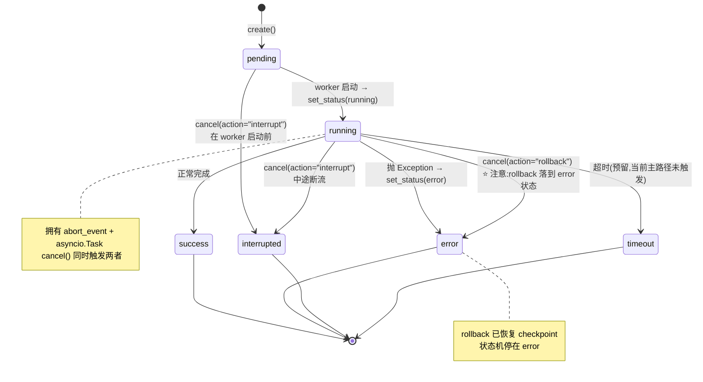
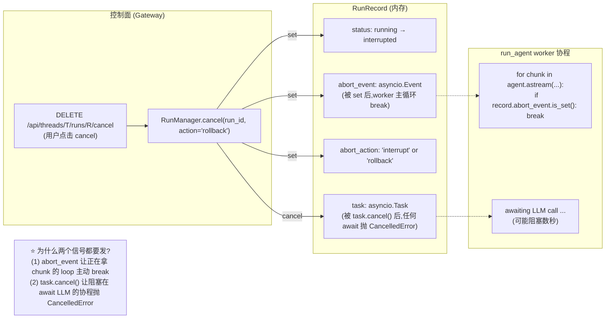

# 09 · Run 生命周期 + StreamBridge 抽象

> 整体架构层收官。**06 章定运行时拓扑、07 章定状态合并、08 章定事件流式协议** —— 本章把这三条线**汇拢到一个核心抽象**：`RunManager` 调度的 **Run** 是 DeerFlow 后端调度模型的最小执行单位。
>
> 本章的关键内容是：**6 状态机 + pre-run checkpoint 快照与回滚 + 双重取消信号**。把这三个机制讲透，你就能向面试官说清"DeerFlow 是怎么让一个跑了 10 分钟的 Agent 任务，**在用户点击 cancel 后做到干净中断不留半截 AIMessage**"。

---

## 🎯 学习目标

读完这份文档，你能回答：

1. **RunStatus 6 个状态**（pending / running / success / error / timeout / interrupted）的转换图是什么？哪些转换被代码**禁止**？
2. **`cancel(action="interrupt")` 和 `cancel(action="rollback")`** 行为有什么区别？为什么 DeerFlow 要在 cancel 里**同时** `abort_event.set()` 和 `task.cancel()`？只用一个不行吗？
3. **Pre-run checkpoint 快照机制**：worker 在哪个时刻拍快照？快照里存哪些字段（`checkpoint` / `metadata` / `pending_writes` / `checkpoint_ns`）？rollback 时是 *"原地恢复"* 还是 *"创建新 checkpoint"*？
4. **`multitask_strategy`** 的 reject / interrupt / rollback 三种行为，对应了什么真实业务场景？为什么 DeerFlow 把"原子检查 + 插入" 收进单一 `create_or_reject` 方法？
5. **`run_agent` worker 的 8 步** 顺序为什么是固定的？把 Step 2（publish metadata） 放在 Step 4（attach checkpointer）之后会出什么问题？

---

## 🗂️ 源码定位

| 关注点 | 文件 / 行号 | 关键锚点 |
|---|---|---|
| `RunStatus` 6 状态枚举 | `packages/harness/deerflow/runtime/runs/schemas.py` | `RunStatus(StrEnum)` —— pending / running / success / error / timeout / interrupted；`DisconnectMode` |
| `RunRecord` 数据类（运行时记录） | `packages/harness/deerflow/runtime/runs/manager.py` L22-L41 | 字段：`run_id` / `thread_id` / `assistant_id` / `status` / `task: asyncio.Task` / `abort_event: asyncio.Event` / `abort_action: str` / `metadata` / `kwargs` |
| `RunManager` API（11 个方法） | `packages/harness/deerflow/runtime/runs/manager.py` | `_lock: asyncio.Lock` L51；`create` L82；`get` L113；`list_by_thread` L117；`set_status` L124；`cancel` L154；**`create_or_reject` L179**（原子 TOCTOU 防御）；`has_inflight` L247；`cleanup` L252 |
| `cancel()` 双重信号 | `manager.py` L154-L177 | `record.abort_event.set()` + `record.task.cancel()` 在同一把锁里同时做 |
| `run_agent` worker 主流程 | `packages/harness/deerflow/runtime/runs/worker.py` | `run_agent` L120-L407；8 步标注 `# 1. Mark running` 至 `# 8. Final status` |
| Pre-run checkpoint 快照 | `worker.py` L173-L190 | `checkpointer.aget_tuple(...)` 拿当前 + `copy.deepcopy` 三个字段（checkpoint / metadata / pending_writes） |
| `_rollback_to_pre_run_checkpoint` | `worker.py` L422-L490 | 用 `_call_checkpointer_method("aput", ..., new_checkpoint_marker)` 把快照作为**新 checkpoint** 写回 |
| 异常路径 | `worker.py` L329-L370 | 三个分支：`asyncio.CancelledError`（取消）/ 通用 `Exception`（出错）/ 正常完成 |
| Runtime context 注入 | `worker.py` L100-L120 + `_install_runtime_context` L88 | 因为 worker 用 `astream(config=...)` 驱动 graph，**官方 `context=` 参数走不到** —— 手动注入到 config.configurable |

---

## 🧭 架构图

### 1. RunStatus 状态机（所有合法转换）



> **不直观的设计**：`cancel(action="rollback")` 最终把状态打成 **`error`**（带 `error="Rolled back by user"` 消息），而不是单独的 "rolled_back" 状态。
> **理由**：业务侧（前端 / API）只关心"成功还是没成功"，rollback 在语义上是"这次 run 视为失败 + 状态已回滚到 pre-run"，归类到 error + error message 标注更符合既有 UX 约定。

### 2. RunRecord 数据流向 + 双重取消信号



### 3. `run_agent` 8 步时间线 + checkpoint 快照位置

```mermaid
gantt
    title run_agent worker 协程 8 步骤
    dateFormat X
    axisFormat %s

    section 初始化
    init RunJournal :done, c1, 0, 1
    1 set_status running :done, c2, after c1, 1
    snapshot pre-run checkpoint ⭐ :crit, snap, after c2, 1

    section 准备
    2 publish metadata :done, c3, after snap, 1
    3 build agent + Runtime ctx :done, c4, after c3, 1
    4 attach checkpointer/store :done, c5, after c4, 1
    5 set interrupt nodes :done, c6, after c5, 1
    6 build stream_mode list :done, c7, after c6, 1

    section 执行
    7 agent.astream loop ⭐ :active, run, after c7, 8

    section 收尾
    8 final status :done, c8, after run, 1
    cleanup (delay) :done, c9, after c8, 2
```



---

## 🔍 核心逻辑讲解

### Part 1 · RunStatus 6 状态机：背后的"业务语义切片"

```python
# schemas.py
class RunStatus(StrEnum):
    pending = "pending"          # 创建后,worker 启动前
    running = "running"           # 正在跑
    success = "success"           # 跑完成功
    error = "error"               # 抛了 Exception(含 rollback 落点)
    timeout = "timeout"           # 超时(预留,主路径未触发)
    interrupted = "interrupted"   # 用户取消,选 'interrupt' 模式
```

**为什么是这 6 个？** 不是更多也不是更少 —— **每一种状态对应一种业务下游决策**：

| 状态 | UI 显示 | 重试逻辑 | 计费 | 触发清理 |
|---|---|---|---|---|
| pending | "排队中" | 可重排队 | 不计 | 不计 |
| running | "进行中" | — | 部分计（按 token 已用） | — |
| success | "完成" ✅ | 不重试 | 全计 | 5 分钟后 cleanup |
| error | "失败" ❌ | 可重试 | 全计（已消耗 token） | 5 分钟后 cleanup |
| timeout | "超时" | 配置驱动重试 | 全计 | 立即 cleanup |
| interrupted | "已中断" ⏸ | 不重试，等用户决定 | 全计 | 5 分钟后 cleanup |

**`error` 包含 rollback 的设计取舍**：DeerFlow 没有引入 "rolled_back" 第 7 种状态，而是把它归并入 `error` —— 用 `error` 消息字段（`"Rolled back by user"`）区分语义。这降低了状态机分支数，前端只需处理 6 种 UI。

#### 状态机的"禁止转换"

`set_status` 内部没有显式守卫（DeerFlow 信任调用方），但 `cancel()` 在 L160 有一条关键守卫：

```python
async def cancel(self, run_id: str, *, action: str = "interrupt") -> bool:
    async with self._lock:
        record = self._runs.get(run_id)
        if record is None:
            return False
        if record.status not in (RunStatus.pending, RunStatus.running):
            return False        # ⭐ 已结束的 run 不能再 cancel
        ...
```

**禁止**：`success` / `error` / `interrupted` / `timeout` 任一终态状态都**不能再 cancel**。这避免"已完成 run 被晚到的 cancel 误打成 interrupted"的竞态。

### Part 2 · 双重取消信号 —— `abort_event` + `task.cancel` 的工程必要性

打开 `cancel()` 关键 4 行（L172-L175）：

```python
record.abort_action = action
record.abort_event.set()                              # ← 信号 ①
if record.task is not None and not record.task.done():
    record.task.cancel()                              # ← 信号 ②
record.status = RunStatus.interrupted
```

**为什么需要两个信号？** —— worker 协程在 cancel 来时**可能处在两种状态之一**：

#### 状态 A · worker 正在 `async for chunk in agent.astream(...)` 的主循环里拿事件

```python
async for chunk in agent.astream(graph_input, ...):
    if record.abort_event.is_set():       # ← 关键检查
        logger.info("Run %s abort requested — stopping", run_id)
        break
    sse_event = _lg_mode_to_sse_event(...)
    await bridge.publish(run_id, sse_event, serialize(chunk, mode=...))
```

**这种情况**：worker 在两个 chunk 间隙，**主动检查** `abort_event` 是否被 set。**信号 ① 起作用**。
**信号 ②（task.cancel）的副作用**：让下次 `await` 抛 `CancelledError` —— `except asyncio.CancelledError:` 分支也能干净停。

#### 状态 B · worker **阻塞在 `await llm.invoke(...)` 里**（典型场景：等 LLM 回 token）

LLM provider 调用可能阻塞 5-60 秒。这期间 `abort_event` 即使被 set，worker **没有机会检查它** —— 因为它在 await。
**信号 ② `task.cancel()`** 让阻塞的 await 立即抛 `CancelledError`，worker 进入 `except asyncio.CancelledError:` 分支：

```python
except asyncio.CancelledError:
    action = record.abort_action
    if action == "rollback":
        await run_manager.set_status(run_id, RunStatus.error, error="Rolled back by user")
        await _rollback_to_pre_run_checkpoint(...)
    else:
        await run_manager.set_status(run_id, RunStatus.interrupted)
```

#### 为什么不能**只用 `task.cancel()`**

光 `task.cancel()` 在状态 A（worker 正在拿 chunk）**也能**让协程退出，但**位置不可控** —— 可能正好停在 `await bridge.publish(...)` 中间，导致**最后一个事件没被发完整**。

`abort_event` 让 worker **在自然的 chunk 边界**主动 break，发完最后一个 chunk 再退出 → **事件流原子性**更好。

→ **设计原则**：**协作式取消（cooperative cancellation）+ 强制取消（preemptive cancellation）双保险**。这是 asyncio 高级应用的经典模式。

### Part 3 · Pre-run checkpoint 快照：为什么需要 deepcopy

打开 worker.py L173-L190：

```python
if checkpointer is not None:
    try:
        config_for_check = {"configurable": {"thread_id": thread_id, "checkpoint_ns": ""}}
        ckpt_tuple = await checkpointer.aget_tuple(config_for_check)
        if ckpt_tuple is not None:
            ckpt_config = getattr(ckpt_tuple, "config", {}).get("configurable", {})
            pre_run_checkpoint_id = ckpt_config.get("checkpoint_id")
            pre_run_snapshot = {
                "checkpoint_ns": ckpt_config.get("checkpoint_ns", ""),
                "checkpoint": copy.deepcopy(getattr(ckpt_tuple, "checkpoint", {})),       # ⭐
                "metadata": copy.deepcopy(getattr(ckpt_tuple, "metadata", {})),           # ⭐
                "pending_writes": copy.deepcopy(getattr(ckpt_tuple, "pending_writes", []) or []),  # ⭐
            }
    except Exception:
        snapshot_capture_failed = True
        ...
```

**4 个被快照的字段**：
1. **`checkpoint`** —— LangGraph state 的整体 dict（含 messages / artifacts / 所有 reducer 已应用后的 final values）
2. **`metadata`** —— checkpoint 的元数据（source / step / parents）
3. **`pending_writes`** —— LangGraph 内部"待提交但未持久"的写入（罕见场景，但断电恢复要用）
4. **`checkpoint_ns`** —— namespace（subgraph 隔离用，默认是 `""`）

**为什么必须 `deepcopy`？** —— LangGraph 内部对返回的 checkpoint dict **持有引用**。Worker 后续步骤会**修改** state（写入新 message / 新 artifact）。如果不 deepcopy，**rollback 时拿出的"原始 state"已经被污染**了。

**`snapshot_capture_failed` 标志位的作用**：拍照失败（DB 抽风 / 网络抖动）时**不阻塞 run** —— run 照跑，但 rollback 不可用（fallback 退到 `set_status(error)` 不做 state 恢复）。这是个**"快照是 best effort，run 是关键路径"** 的取舍。

### Part 4 · Rollback 的实现：**不**原地恢复，而是写一个**新 checkpoint**

打开 `_rollback_to_pre_run_checkpoint` 的关键段（worker.py L466-L490）：

```python
restore_marker = _new_checkpoint_marker()
checkpoint_to_restore = {
    **checkpoint_to_restore,
    "id": restore_marker["id"],          # ⭐ 用新 id,不复用原 id
    "ts": restore_marker["ts"],
}
...
restore_config = {"configurable": {"thread_id": thread_id, "checkpoint_ns": checkpoint_ns}}
restored_config = await _call_checkpointer_method(
    checkpointer,
    "aput", "put",
    restore_config,
    checkpoint_to_restore,         # ← 把快照作为新 checkpoint 写入
    metadata_to_restore,
    new_versions,
)
```

**关键决策**：不是"删除新写入的 checkpoint 回到旧的"，而是"**把旧 checkpoint 拷贝一份、换个新 id，写为最新 checkpoint**"。

**为什么这么做？**

| 原地恢复方案 | 当前"写一个新 checkpoint"方案 |
|---|---|
| 删除 run 期间产生的 checkpoint | 不删（保留 audit trail） |
| `current_checkpoint_id` 指针指回老 id | `current_checkpoint_id` 指向新 id |
| Audit log 会"丢失" | Audit log 完整保留 |
| 实现需要 checkpointer 支持"删特定 checkpoint" | 用通用 `put` 即可 |

**Trade-off**：DeerFlow 选第二种 —— **审计可追溯优于存储节省**。生产环境中，"这次 run 跑了一半被回滚了"是个值得被记录的事件；如果存储成本敏感，可以加定期 GC 删除"被 rollback 跳过的中间 checkpoint"。

### Part 5 · `multitask_strategy` 三策略与 TOCTOU 防御

`RunManager.create_or_reject` 是个**原子操作**，避免 "has_inflight + create" 两步之间被另一个并发请求插队（Time-Of-Check-Time-Of-Use 经典竞态）：

```python
async def create_or_reject(self, thread_id, ..., multitask_strategy="reject", ...):
    """Atomically check for inflight runs and create a new one."""
    async with self._lock:        # ⭐ 锁住"检查 + 插入"两步
        # 1. 找该 thread 上未结束的 run
        inflight = [r for r in self._runs.values()
                    if r.thread_id == thread_id and r.status in (pending, running)]

        # 2. 按 strategy 决策
        if inflight:
            if multitask_strategy == "reject":
                raise ConflictError("Thread has inflight run")
            elif multitask_strategy in ("interrupt", "rollback"):
                for r in inflight:
                    r.abort_event.set()
                    if r.task: r.task.cancel()
                # 等已有 run 真正结束 ...

        # 3. 创建新 RunRecord
        ...
```

**三策略对应三种业务场景**：

| 策略 | 行为 | 场景 |
|---|---|---|
| `"reject"` | 已有 inflight → 抛 ConflictError | 严格 UI（如"同一对话不允许并发"），避免用户混乱 |
| `"interrupt"` | 已有 inflight → 取消（保留 state） | 用户改主意，新消息覆盖旧的，但旧 partial 留作"参考" |
| `"rollback"` | 已有 inflight → 取消 + 回滚 state | 用户改主意，要求"假装旧消息没发过"，state 干净 |

**TOCTOU 防御对比**：
```python
# ❌ 错误:两步操作中间有窗口
if not run_manager.has_inflight(thread_id):
    record = await run_manager.create(thread_id, ...)
# ↑ 窗口里另一个请求可能 create 进来,两个 run 并发跑同一 thread
```
```python
# ✅ 正确:原子操作
record = await run_manager.create_or_reject(thread_id, ..., multitask_strategy="reject")
```

→ **这就是为什么 `_lock` 是 `asyncio.Lock` 不是 `threading.Lock`** —— asyncio 协程间共享 RunManager 实例。

### Part 6 · `run_agent` 8 步顺序的不可调换性

| Step | 做什么 | 必须在前一步之后的理由 |
|---|---|---|
| 0 | init RunJournal | RunJournal 需要 event_store（lifespan 已就绪） |
| ⭐ snapshot | 拍 pre-run checkpoint | 必须在**任何 LLM 调用之前** —— 一旦 run 写了任何东西，checkpoint 就变了，rollback 拿到的就是"已被污染的快照" |
| 1 | set_status(running) | 必须在 snapshot 之后？**不一定**，但放后面让"状态变更" 比"快照失败"晚一点，更安全 |
| 2 | publish metadata | 让前端立刻知道 run_id + thread_id —— 否则 SSE 第一秒"假死" |
| 3 | build agent | 用 RunnableConfig + Runtime 上下文构建 |
| 4 | attach checkpointer | 必须在 agent build 之后（agent 是个 CompiledStateGraph，需要先有图） |
| 5 | set interrupt_before / after nodes | 必须在 agent 上设置 |
| 6 | build LG stream_mode list | 必须在调用 astream 之前确定 |
| 7 | astream loop（核心） | 主循环，所有事件 publish 在此 |
| 8 | final status | 主循环退出后才能定状态 |

**"为什么 snapshot 不放更前？"** —— 因为 RunJournal init 即使失败也只是"少记日志"，run 仍能跑；snapshot 失败也只是"失去 rollback 能力"，run 仍能跑。这两个失败是**互相独立**的，**先做哪个都行** —— DeerFlow 选 RunJournal 先做，因为"日志缺失"比"无法 rollback"更严重（影响审计）。

---

## 🧩 体现的通用 Agent 设计模式

| 模式 | DeerFlow 中的体现 |
|---|---|
| **Cooperative + Preemptive Cancellation**（协作 + 强制双取消） | `abort_event.set()` + `task.cancel()` 双信号 |
| **Atomic Check-and-Insert**（原子 TOCTOU 防御） | `create_or_reject` 单一加锁方法 |
| **Snapshot-and-Restore**（快照与恢复） | `pre_run_snapshot` deepcopy + 新 id put |
| **State Machine with Terminal States**（终态守卫的状态机） | `cancel()` 拒绝已结束 run |
| **Audit-Preserving Rollback**（审计友好回滚） | rollback 写新 checkpoint 而非删旧的 |
| **Best-Effort + Critical-Path Separation**（最佳努力 vs 关键路径分离） | snapshot 失败不阻塞 run |

---

## 🧱 与 Agent Harness 六要素的对应关系

| 六要素 | RunManager / run_agent 怎么提供基础设施 |
|---|---|
| ① 反馈循环 | `abort_event` 是用户中断这个反馈循环的入口 |
| ② 记忆持久化 | pre-run checkpoint snapshot 是"记忆回滚"机制 |
| ③ 动态上下文 | Runtime context 在 Step 3 注入 graph，让中间件 / tool 拿到 thread_id / run_id / user_id |
| ④ 安全护栏 | `multitask_strategy` 防"同 thread 重叠 run" 的并发护栏；终态守卫防"取消已完成 run" 的状态机护栏 |
| ⑤ 工具集成 | Step 3 build agent 时 `agent_factory` 反射加载工具 |
| ⑥ 可观测性 | RunJournal 作为 LangChain callback handler 注入，记录 lifecycle + token usage 到 `run_events` 表（23 章详讲） |

---

## ⚠️ 常见坑与调试技巧

### 坑 1 · 测试里 `cancel()` 后立刻断言状态 = interrupted

```python
await run_manager.cancel(run_id)
assert (await run_manager.get(run_id)).status == RunStatus.interrupted   # 可能 race
```
**问题**：`cancel()` 把 status 直接写成 `interrupted`（manager.py L174），但 worker 协程的 `except asyncio.CancelledError` 分支也会调 `set_status(...)`，**可能稍晚把状态盖回**。具体行为依赖 worker 异常处理代码，**testing 时要等 task 真的结束再断言**。

**修复**：
```python
await run_manager.cancel(run_id)
record = run_manager.get(run_id)
if record.task:
    with contextlib.suppress(asyncio.CancelledError):
        await record.task            # 等真退出
assert (await run_manager.get(run_id)).status == RunStatus.interrupted
```

### 坑 2 · Pre-run snapshot 失败但被 silently 吞了

如果 DB 临时抽风 → `snapshot_capture_failed = True` → run 照跑 → **如果之后用户点击 rollback 取消，rollback skip 掉了**。前端可能误以为"回滚成功"但实际啥都没回滚。

**修复**：worker 在发 `error` 事件时附带 "rollback skipped due to snapshot capture failure" 给前端；或者**直接拒绝 cancel(rollback)** 当 snapshot 不可用。

### 坑 3 · `multitask_strategy="reject"` 用户报 ConflictError

**症状**：用户在前端连续敲两次发送 → 第二次报 409 Conflict。
**问题**：前端没等第一次 run 结束就发了第二次请求。
**修复（产品侧）**：前端在 inflight 时禁用"发送"按钮，或者改用 `multitask_strategy="interrupt"`，让新消息自然取消上一次。

### 坑 4 · Runtime context 没注入 → tool 拿不到 user_id / thread_id

`run_agent` Step 3 显式注入 Runtime context 到 `config.configurable["__pregel_runtime"]`。**如果你跳过这一步**（如手写 worker 调 `agent.astream(...)` 没经过 `run_agent`），tool 内部 `runtime.context.thread_id` 是 None。
**修复**：永远通过 `run_agent` 调度，不要绕过它直接调 `agent.astream`。

### 坑 5 · `cleanup(delay=300)` 占内存

每个完成的 run 在 RunManager 内存里保留 5 分钟。如果你高并发产生 1000 个短 run，**RunManager 内存里同时存 1000 条 RunRecord** 直到 5 分钟过去。
**修复**：监控 `len(run_manager._runs)`，超阈值时手动 cleanup；或调小 delay；或换成持久化 RunStore（已经支持 `_store` 参数）。

---

## 🛠️ 动手实操

> 本 demo 用一个**假 agent_factory** 模拟"会被取消的 LLM 调用"，端到端跑通 RunManager + run_agent + StreamBridge + Checkpointer 整个生命周期。

### Demo · Run 生命周期 5 个场景实测

```python
"""
Run 生命周期完整演示.

跑法:  PYTHONPATH=backend uv run python scripts/run_lifecycle_demo.py

5 个场景:
1. Happy path — 正常完成,状态 running → success
2. cancel(action="interrupt") — 中途取消,保留 checkpoint
3. cancel(action="rollback") — 中途取消,回滚到 pre-run checkpoint
4. multitask_strategy="reject" — 同 thread 二次提交被拒
5. multitask_strategy="interrupt" — 同 thread 二次提交,自动取消上一个
"""
import asyncio
import logging
from dataclasses import dataclass
from typing import Any

from langchain_core.messages import HumanMessage, AIMessage
from langgraph.checkpoint.memory import InMemorySaver

from deerflow.runtime.runs.manager import RunManager
from deerflow.runtime.runs.schemas import RunStatus, DisconnectMode
from deerflow.runtime.runs.worker import run_agent, RunContext
from deerflow.runtime.stream_bridge.memory import MemoryStreamBridge
from deerflow.runtime.stream_bridge.base import END_SENTINEL

logging.basicConfig(level=logging.INFO, format="%(asctime)s [%(levelname)s] %(message)s")


# ====== 1. 假 agent_factory:一个 mini graph,可控速度 ======
def make_fake_agent_factory(slow_seconds: float = 0.5, total_chunks: int = 6):
    """返回一个 agent_factory,它产出一个能慢速跑的 graph."""
    from langgraph.graph import StateGraph, START, END
    from typing import Annotated
    from langgraph.graph.message import add_messages

    class State(dict):
        pass

    async def think(state):
        # 模拟 LLM 慢调用
        await asyncio.sleep(slow_seconds)
        return {"messages": [AIMessage(content="thought")]}

    async def respond(state):
        await asyncio.sleep(slow_seconds)
        return {"messages": [AIMessage(content="final answer", id="ans-1")]}

    def factory(config, **kwargs):
        from typing import TypedDict, Annotated
        class S(TypedDict):
            messages: Annotated[list, add_messages]
        b = StateGraph(S)
        b.add_node("think", think)
        b.add_node("respond", respond)
        b.add_edge(START, "think")
        b.add_edge("think", "respond")
        b.add_edge("respond", END)
        return b.compile()

    return factory


# ====== 2. 构造一个最小 RunContext(免去 lifespan)======
async def make_ctx(checkpointer):
    return RunContext(
        checkpointer=checkpointer,
        store=None,
        event_store=None,
        run_events_config=None,
        thread_store=None,
        app_config=None,
    )


# ====== 3. 跑一个 run 的统一入口 ======
async def kick_off_run(
    bridge: MemoryStreamBridge,
    mgr: RunManager,
    thread_id: str,
    factory,
    checkpointer,
    *,
    multitask_strategy: str = "reject",
) -> dict[str, Any]:
    record = await mgr.create_or_reject(
        thread_id=thread_id,
        assistant_id="fake",
        on_disconnect=DisconnectMode.cancel,
        multitask_strategy=multitask_strategy,
    )

    ctx = await make_ctx(checkpointer)
    task = asyncio.create_task(
        run_agent(
            bridge,
            mgr,
            record,
            ctx=ctx,
            agent_factory=factory,
            graph_input={"messages": [HumanMessage("hi")]},
            config={"configurable": {"thread_id": thread_id}},
            stream_modes=["values"],
        )
    )
    record.task = task
    return {"record": record, "task": task}


# ====== Case 1: Happy path ======
async def case_happy():
    print("\n========== CASE 1 · Happy path ==========")
    bridge = MemoryStreamBridge()
    mgr = RunManager()
    cp = InMemorySaver()
    factory = make_fake_agent_factory()

    info = await kick_off_run(bridge, mgr, "t-happy", factory, cp)
    await info["task"]
    print(f"  最终状态: {(await mgr.get(info['record'].run_id)).status}  (期望 success)")


# ====== Case 2: cancel(action="interrupt") ======
async def case_cancel_interrupt():
    print("\n========== CASE 2 · cancel(action='interrupt') 中途取消 ==========")
    bridge = MemoryStreamBridge()
    mgr = RunManager()
    cp = InMemorySaver()
    factory = make_fake_agent_factory()

    info = await kick_off_run(bridge, mgr, "t-int", factory, cp)
    await asyncio.sleep(0.2)
    cancelled = await mgr.cancel(info["record"].run_id, action="interrupt")
    print(f"  cancel returned: {cancelled}")
    try:
        await info["task"]
    except asyncio.CancelledError:
        pass
    print(f"  最终状态: {(await mgr.get(info['record'].run_id)).status}  (期望 interrupted)")

    # 看 checkpoint 是否保留
    snap = await cp.aget_tuple({"configurable": {"thread_id": "t-int"}})
    msgs = snap.checkpoint.get("channel_values", {}).get("messages", []) if snap else []
    print(f"  checkpoint 残留 messages 数: {len(msgs)}  (interrupt 保留 partial,可能 0~1 条)")


# ====== Case 3: cancel(action="rollback") ======
async def case_cancel_rollback():
    print("\n========== CASE 3 · cancel(action='rollback') ==========")
    bridge = MemoryStreamBridge()
    mgr = RunManager()
    cp = InMemorySaver()
    factory = make_fake_agent_factory(slow_seconds=0.3)

    # 先跑一个 run 让 thread 有 baseline checkpoint
    info1 = await kick_off_run(bridge, mgr, "t-rb", factory, cp)
    await info1["task"]
    snap_before = await cp.aget_tuple({"configurable": {"thread_id": "t-rb"}})
    baseline_n = len(snap_before.checkpoint["channel_values"].get("messages", []))
    print(f"  baseline messages 数: {baseline_n}")

    # 再发一个 run,中途 rollback
    info2 = await kick_off_run(bridge, mgr, "t-rb", factory, cp, multitask_strategy="interrupt")
    await asyncio.sleep(0.15)
    await mgr.cancel(info2["record"].run_id, action="rollback")
    try:
        await info2["task"]
    except asyncio.CancelledError:
        pass

    snap_after = await cp.aget_tuple({"configurable": {"thread_id": "t-rb"}})
    after_n = len(snap_after.checkpoint["channel_values"].get("messages", []))
    print(f"  rollback 后 messages 数: {after_n}  (期望 = baseline = {baseline_n})")
    print(f"  最终状态: {(await mgr.get(info2['record'].run_id)).status}  (期望 error,带 'Rolled back by user')")


# ====== Case 4: multitask_strategy="reject" ======
async def case_multitask_reject():
    print("\n========== CASE 4 · multitask_strategy='reject' ==========")
    bridge = MemoryStreamBridge()
    mgr = RunManager()
    cp = InMemorySaver()
    factory = make_fake_agent_factory()

    info1 = await kick_off_run(bridge, mgr, "t-rj", factory, cp, multitask_strategy="reject")
    try:
        info2 = await kick_off_run(bridge, mgr, "t-rj", factory, cp, multitask_strategy="reject")
        print(f"  第二次 create_or_reject 成功了?这不对!")
    except Exception as e:
        print(f"  第二次 create_or_reject 被拒: {type(e).__name__}: {e}")
    await info1["task"]


# ====== Case 5: multitask_strategy="interrupt" ======
async def case_multitask_interrupt():
    print("\n========== CASE 5 · multitask_strategy='interrupt' 自动取消上一个 ==========")
    bridge = MemoryStreamBridge()
    mgr = RunManager()
    cp = InMemorySaver()
    factory = make_fake_agent_factory(slow_seconds=0.4)

    info1 = await kick_off_run(bridge, mgr, "t-mi", factory, cp, multitask_strategy="interrupt")
    await asyncio.sleep(0.1)
    info2 = await kick_off_run(bridge, mgr, "t-mi", factory, cp, multitask_strategy="interrupt")
    print(f"  run1 状态(在 run2 提交后): {(await mgr.get(info1['record'].run_id)).status}")
    for info in (info1, info2):
        try:
            await info["task"]
        except asyncio.CancelledError:
            pass
    print(f"  最终 run1: {(await mgr.get(info1['record'].run_id)).status}  (期望 interrupted)")
    print(f"  最终 run2: {(await mgr.get(info2['record'].run_id)).status}  (期望 success)")


async def main():
    await case_happy()
    await case_cancel_interrupt()
    await case_cancel_rollback()
    await case_multitask_reject()
    await case_multitask_interrupt()


if __name__ == "__main__":
    asyncio.run(main())
```

### 调试任务

1. **断点位置**：
   - `manager.py::cancel` L172-L175 —— 看 abort_event.set() 和 task.cancel() 同时触发
   - `worker.py::run_agent` 主循环 `if record.abort_event.is_set(): break` —— 看 Case 2 在 Step 7 主循环里 break
   - `worker.py` 的 `except asyncio.CancelledError:` 分支 —— 看 Case 3 走这条路径
   - `worker.py::_rollback_to_pre_run_checkpoint` —— 看 Case 3 的 deepcopy 在哪里被读、`aput` 在哪里被调
2. **观察什么**：
   - Case 1 最终 status = `success`
   - Case 2 最终 status = `interrupted`，checkpoint 可能有 partial 数据
   - Case 3 最终 status = `error`（带 `error="Rolled back by user"`），messages 数回到 baseline
   - Case 4 第二次抛 ConflictError 或类似
   - Case 5 run1 自动变 `interrupted`，run2 完成 `success`
3. **人为制造异常**：
   - 把 fake agent 内某节点改成 `raise RuntimeError(...)` → 看 worker.py `except Exception:` 分支 → 最终 status = `error`
   - 把 Case 3 的 `cp` 换成 `None`（无 checkpointer）→ 看 rollback 走 "no checkpointer" 退路（worker.py L425-L427）
   - 在 Case 2 跑前**先** `mgr._lock.acquire()`（手动拿锁不释放）→ 看 cancel 永远卡在等锁 → 这就是为什么 RunManager 操作都包了超时（生产环境要小心）

### 改造练习

1. **练习 A（简单）**：扩展 Case 1，让 agent_factory 抛 `ValueError` 在第 2 个节点 → 看 status 变 `error` + bridge 收到 `event: error`。
2. **练习 B（中等）**：实现一个"按 thread 全局速率限制"装饰器 —— `RunManager.create_or_reject` 之前先检查"过去 60 秒该 thread 创建了几个 run，超过 10 就拒"。注意：必须在 `_lock` 内做检查 + 计数（**避免 TOCTOU**）。
3. **挑战题**：实现一个**"幂等 cancel"**：同一 run_id 被 cancel 多次（如用户连点 3 下），只第一次真正生效，后续返回 `False` 但不抛错。提示：`cancel` 内部 L160 已有的状态守卫已经处理了，**写测试验证**它真的幂等。

### 预期输出 & 验证方式

- Case 1：`最终状态: RunStatus.success`
- Case 2：`最终状态: RunStatus.interrupted`，checkpoint 有 0-1 条 messages
- Case 3：`最终状态: RunStatus.error`，messages 数 = baseline（rollback 生效）
- Case 4：第二次提交抛 ConflictError
- Case 5：run1 = interrupted，run2 = success

---

## 🎤 面试视角

### 业务型大厂卷

**问 1**：DeerFlow `cancel()` 同时发 `abort_event.set()` 和 `task.cancel()`。**你能不能简化成只用 `task.cancel()`？什么场景会出问题？**

> **教科书答案**：
> 不能简化。原因：
> 1. **`task.cancel()` 在 worker 等 LLM await 时有效**（会让 await 抛 CancelledError）
> 2. **但 worker 不在 await 而在 publish 中间时**（没 await IO），cancel 信号要到下次 await 才到达 —— 期间可能有"半个 SSE event 发了一半"的非原子状态
> 3. **`abort_event` 让 worker 在自然 chunk 边界主动检查并 break**，事件流原子性更好
> 协作式 cancel + 强制 cancel 双保险是 asyncio 应用的经典模式（Trio、AnyIO 都有同等设计）。
> **加分项**：指出 Python 3.11+ 的 `asyncio.timeout()` 也是同样的双轨思想 —— TimeoutError 走"协作式取消"路径，到点才抛。

**问 2**：`pre_run_snapshot` deepcopy 是个隐藏的性能成本 —— 长 thread 的 checkpoint 可能上 MB。**你怎么评估这个成本是否能接受？什么时候应该改成不 deepcopy？**

> **教科书答案**：
> 评估方法：
> - **小规模**：一个 chat thread 累计 20 轮对话 → checkpoint 约 50KB → deepcopy ~5ms。完全可接受。
> - **中规模**：长任务跑 100 个 super-step + 大量 artifacts → checkpoint 可能到 MB 级 → deepcopy 100ms。**接近边缘**。
> - **大规模**：subagent fan-out 把 state 堆爆 → checkpoint 几十 MB → deepcopy 秒级。**不能接受**。
> **不 deepcopy 的代价**：worker 后续步骤一旦修改 state，pre_run_snapshot 跟着变，rollback 拿到的是"已被污染的快照"。**rollback 失效**。
> **改进路径**：
> 1. 把 checkpointer 改成 immutable / copy-on-write 数据结构（pyrsistent 或类似）→ 不需要 deepcopy
> 2. 把"大字段"（artifacts、long messages）抽到外部 store，state 里只存 ID → snapshot 体积下降
> 3. **DeerFlow 当前没这么做**，因为它依赖 LangGraph Checkpointer 的标准接口，不能自由换数据结构。
> **结论**：当前实现适用 95% 场景；剩下 5% 的"超大长任务"应该用第 2 种路径降低 state 体积，**不是改 worker 实现**。

### 创业型 AI 公司卷

**问 3**：DeerFlow 把 rollback 后状态打成 `error` 而不是单独的 "rolled_back" 状态。**给你机会重新设计 RunStatus 7 个状态，你会加 "rolled_back" 吗**？

> **参考答案**：
> 不加。理由：
> 1. **业务下游决策没变**：rolled_back 在前端 UI 上显示什么？大概率是"已取消，状态已回滚" —— **没必要**独立颜色 / 图标
> 2. **rolled_back 是 error 的"原因子类型"**：与 "API timeout"、"tool exception" 是同一层 —— 应该是 `error.reason` 字段而不是顶层状态
> 3. **更原则上**：状态机分支越多，前端代码 / 监控指标 / 重试逻辑都得加分支处理 —— **状态数应该按业务下游决策数定**，而不是按"内部原因"细分
> **加分项**：如果一定要加，会加为 `error.kind = "rollback" | "timeout" | "tool_failure" | "llm_failure"` 这种子类型，**保留 error 顶级语义**。

**问 4**：你团队要做一个"长任务批量取消"功能 —— 管理员点一下取消某 user 名下所有 inflight runs。**怎么用 RunManager API 实现？要注意什么并发陷阱？**

> **参考答案**：
> 实现框架：
> ```python
> async def cancel_all_for_user(user_id: str, action: str = "interrupt"):
>     # 1. 拿一份当前 inflight runs 的 snapshot(必须在 lock 内拿)
>     async with run_manager._lock:
>         runs_to_cancel = [
>             r for r in run_manager._runs.values()
>             if r.metadata.get("user_id") == user_id
>             and r.status in (RunStatus.pending, RunStatus.running)
>         ]
>     # 2. 在锁外逐个 cancel(cancel 内部会再加锁,不能在外层锁里调,会死锁)
>     for r in runs_to_cancel:
>         await run_manager.cancel(r.run_id, action=action)
> ```
> **陷阱**：
> 1. **死锁**：`cancel()` 内部 `async with self._lock:` —— 如果你在外层已持锁再调 cancel，**死锁**。必须先 release 再 cancel
> 2. **TOCTOU**：snapshot 拿到后到 cancel 之间，可能有 new run 创建。这种是"近似批量取消"，不是 strict serializable —— 业务可接受
> 3. **取消顺序**：如果某 user 有 100 个 run，串行 cancel 慢；并行 `asyncio.gather` 又可能给 cancel 流量打满 —— 用 `Semaphore(10)` 限制并发
> **DeerFlow 当前没有这种 API**，作为 RFC 提出是合理的。

---

## 📚 延伸阅读

- **Python `asyncio.Task.cancel()` 与协作式取消**：https://docs.python.org/3/library/asyncio-task.html#asyncio.Task.cancel
  *理解为什么 cancel 抛 CancelledError 而不是直接 kill 协程。*
- **TOCTOU 问题（Wikipedia）**：https://en.wikipedia.org/wiki/Time-of-check_to_time-of-use
  *理解为什么 `create_or_reject` 必须原子化。*
- **LangGraph Checkpoint 内部数据结构** —— 看 `langgraph.checkpoint.base::Checkpoint`、`CheckpointTuple`，理解 deepcopy 的 4 个字段各代表什么。
- **DeerFlow 自己的 `runtime/runs/manager.py` 完整源码**：现在你应该能完整读懂它 270 行。重点是 `_lock` 在哪些方法里被持有，确认所有写操作都加锁。
- **AnyIO / Trio 的 structured concurrency**：https://anyio.readthedocs.io/en/stable/cancellation.html
  *Trio 的"取消域"模型是 asyncio 的进阶版,理解后你会发现 DeerFlow 的双信号 cancel 是 asyncio 时代的"折中解"。*

---

## 🎤 互动检查 —— 请回答这 3 个问题

> **两句话即可**。

1. **设计选择题**：为什么 DeerFlow 把 `cancel(action="rollback")` 的最终状态打成 `error` 而不是新增一个 `rolled_back` 状态？
2. **机制理解题**：为什么 `_rollback_to_pre_run_checkpoint` 是"写一个新 checkpoint（带新 id）"而不是"原地恢复回老 checkpoint id"？给出**一个**审计角度的理由。
3. **应用题**：你的同事写了一个 cancel 实现，只发 `task.cancel()` 不发 `abort_event.set()`。**给出一个真实场景** 说明这会出什么 bug。

回答后我们进入 **`10-lead-agent-factory.md`** —— `make_lead_agent` 三分支（bootstrap / 普通 / 自定义 agent） + `_resolve_model_name` 三级回退 + Skills 工具策略闸门。
