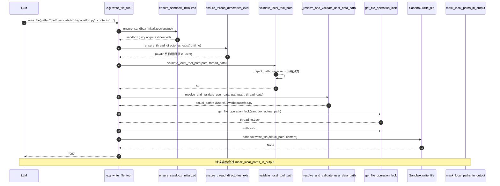
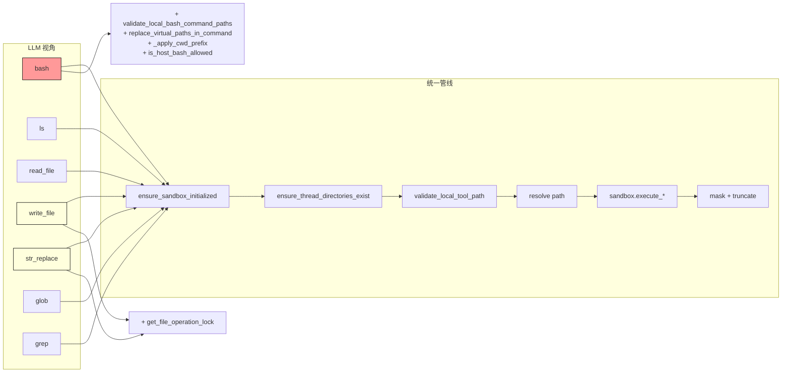

# 09 · 沙箱工具集：bash / read / write / str_replace / ls / glob / grep

> 07-08 篇讲了"沙箱抽象 + 虚拟路径"。这一章把它们拼在一起：**7 个被 LLM 直接调用的工具**——每一个都建立在前两章的基础上，再叠加自己的安全护栏和工程细节。
>
> 这是整个 deer-flow 1583 行的 `sandbox/tools.py` 的主章节。读完这一篇你应该能拍着脑袋说："给 LLM 一个 bash 工具是个工程问题，不是 5 行代码的事。"

---

## 1. 模块定位（Why this matters）

deer-flow 给 lead agent 装的"沙箱工具"有 7 个：

| 工具 | LLM 可见名 | 工厂位置 | 主要风险 |
|------|-----------|---------|---------|
| **bash** | `bash` | `tools.py:1224` | shell 注入、cwd 越界、危险绝对路径 |
| **ls** | `ls` | `tools.py:1273` | 读越界（绝对路径） |
| **glob** | `glob` | `tools.py:1320` | 大结果集打爆 context |
| **grep** | `grep` | `tools.py:1370` | 同上 + 正则灾难 |
| **read_file** | `read_file` | `tools.py:1440` | 读越界 + 文件过大 |
| **write_file** | `write_file` | `tools.py:1494` | 写越界 + 并发冲突 |
| **str_replace** | `str_replace` | `tools.py:1535` | 读越界 + 并发冲突 + 替换不止一处 |

它们都被 `@tool(name, parse_docstring=True)` 装饰，签名第一个参数固定是 LLM **必填**的 `description: str`（让 LLM 在调工具时强制写"我为啥要调这个"），是 deer-flow 对 trace 可读性的工程选择。

不读这章会错过 4 个关键认知：

1. **7 个工具有统一的 4 阶段管线**：lazy acquire → lazy mkdir → 虚拟路径校验 → 翻译 → `sandbox.execute_*` → 输出脱敏/截断。**任何一步失守，整个调用链就漏**。
2. **`bash_tool` 在 Local 模式下默认禁用**：必须 `config.sandbox.allow_host_bash: true` 显式打开。这避免了"我 brew install 了 deer-flow，第一次跑就被 LLM `rm -rf ~`"这种事故。
3. **`write_file` / `str_replace` 都用 `(sandbox.id, path)` 粒度的可重入锁**：同一虚拟路径并发写会序列化，避免 read-modify-write race。**这把锁的 key 是 `(sandbox_id, path)` 而不是 `path`**——不同沙箱实例上同名虚拟路径不串扰（07 篇讲到的 LocalSandbox 单例下 thread A 和 B 的 `/mnt/user-data/workspace/foo.txt` 翻译后是不同物理路径）。
4. **`bash` 的命令解析用 `shlex` 做 token 级校验**：不是简单的字符串匹配。命令里 cd 到 `..`、`/tmp`、`$VAR`、`~` 都会被 token 级拦截。**这是 deer-flow 在工程深度上甩开多数 LangChain 项目的关键证据之一**。

对应到 Harness 六要素：本章对应 **沙箱执行 + 工具集成 + 安全护栏**——一次性踩三条。

---

## 2. 源码地图（Source Map）

### 2.1 关键文件清单

| 路径 | 角色 |
|------|------|
| [`packages/harness/deerflow/sandbox/tools.py`](../packages/harness/deerflow/sandbox/tools.py) | 7 个工具（1583 行，主战场） |
| [`packages/harness/deerflow/sandbox/file_operation_lock.py`](../packages/harness/deerflow/sandbox/file_operation_lock.py) | `(sandbox_id, path)` 锁（28 行） |
| [`packages/harness/deerflow/sandbox/security.py`](../packages/harness/deerflow/sandbox/security.py) | `is_host_bash_allowed(config)` |
| [`packages/harness/deerflow/sandbox/exceptions.py`](../packages/harness/deerflow/sandbox/exceptions.py) | `SandboxError / SandboxRuntimeError / SandboxNotFoundError` |
| [`packages/harness/deerflow/sandbox/search.py`](../packages/harness/deerflow/sandbox/search.py) | `find_glob_matches / find_grep_matches / GrepMatch` |
| [`packages/harness/deerflow/sandbox/local/local_sandbox.py`](../packages/harness/deerflow/sandbox/local/local_sandbox.py) | `LocalSandbox.execute_command / read_file / write_file ...` |

### 2.2 关键符号速查表

| 符号 | 文件:行 | 一句话职责 |
|------|---------|-----------|
| `@tool("bash", parse_docstring=True)` | `tools.py:1223` | LangChain 装饰器，让函数变 BaseTool |
| `bash_tool(runtime, description, command)` | `tools.py:1224` | shell 执行 + 巨量安全检查 |
| `ls_tool(runtime, description, path)` | `tools.py:1273` | 树形列目录（max_depth=2） |
| `read_file_tool(runtime, description, path, start_line, end_line)` | `tools.py:1440` | 读文件 + 行号切片 |
| `write_file_tool(runtime, description, path, content, append)` | `tools.py:1494` | 覆盖/追加 写文件 + lock |
| `str_replace_tool(runtime, description, path, old_str, new_str, replace_all)` | `tools.py:1535` | substring 替换 + lock + read-modify-write |
| `glob_tool(...)` | `tools.py:1320` | 路径模式匹配 |
| `grep_tool(...)` | `tools.py:1370` | 文本内容搜索 |
| `validate_local_bash_command_paths(command, thread_data)` | `tools.py:891` | bash 路径校验入口 |
| `replace_virtual_paths_in_command(command, thread_data)` | `tools.py:933` | bash 命令里的虚拟路径替换 |
| `_apply_cwd_prefix(command, thread_data)` | `tools.py:981` | 命令前加 `cd {workspace} && ` |
| `_split_shell_tokens(command)` | `tools.py:709` | 用 `shlex` 做 token 切分 |
| `_validate_local_bash_shell_tokens(command, allowed_paths)` | `tools.py:826` | token 级校验 cd、root 路径、`..` |
| `_validate_local_bash_cwd_target(...)` | `tools.py:790` | cd 目标必须在白名单 |
| `get_file_operation_lock(sandbox, path)` | `file_operation_lock.py:20` | `(sandbox.id, path)` 粒度 lock + WeakValueDictionary 防泄漏 |
| `is_host_bash_allowed(config)` | `sandbox/security.py` | `config.sandbox.allow_host_bash` 总开关 |
| `_truncate_bash_output / _truncate_read_file_output / _truncate_ls_output` | `tools.py` 内部 | 三种不同的截断策略 |

### 2.3 工具调用的统一 4 阶段管线



### 2.4 工具家族 + 调用图



---

## 3. 核心逻辑精读（Deep Dive）

### 3.1 共有的 `@tool + runtime + description` 范式

```python
# packages/harness/deerflow/sandbox/tools.py:1494-1497 (write_file 为例)
@tool("write_file", parse_docstring=True)
def write_file_tool(
    runtime: Runtime,
    description: str,
    path: str,
    content: str,
    append: bool = False,
) -> str:
    """Write text content to a file. By default this overwrites the target file; set append to true to add content to the end without replacing existing content.

    Args:
        description: Explain why you are writing to this file in short words. ALWAYS PROVIDE THIS PARAMETER FIRST.
        path: The **absolute** path to the file to write to. ALWAYS PROVIDE THIS PARAMETER SECOND.
        content: The content to write to the file. ALWAYS PROVIDE THIS PARAMETER THIRD.
        append: Whether to append content to the end of the file instead of overwriting it. Defaults to false.
    """
```

**4 个值得圈点的设计**：

1. **`@tool(name, parse_docstring=True)`**：LangChain 1.x 的标准 tool 装饰器。`name` 显式指定（不依赖函数名），`parse_docstring=True` 让 docstring 的 Args 部分自动变成 JSON schema 的参数描述。
2. **第一个参数固定是 `runtime: Runtime`**：这是 LangChain 1.x 的 `InjectedToolCallId` 风格——LLM **看不到也填不了** runtime 参数，由 LangGraph 注入。这让工具能在不污染 LLM API 的前提下访问 state、context、config。
3. **第二个参数必填 `description: str`**：注意 docstring 里有句 `ALWAYS PROVIDE THIS PARAMETER FIRST` ——这是 prompt engineering。LLM 看到这句话，调工具时会强制写"我为啥要 write_file"。这条信息会进 trace，让事后回溯 agent 决策变得可读。
4. **同步函数**：所有 7 个工具都是 sync。LangGraph 的 `ToolNode` 会用 `make_sync_tool_wrapper`（10 篇详谈）保证统一调度。这是 deer-flow 故意的——避免一半 async 一半 sync 的混乱。

### 3.2 4 个非 bash 工具的统一管线（以 `write_file` 为例）

```python
# packages/harness/deerflow/sandbox/tools.py:1510-1522
try:
    sandbox = ensure_sandbox_initialized(runtime)                # ① lazy acquire
    ensure_thread_directories_exist(runtime)                     # ② lazy mkdir
    requested_path = path
    if is_local_sandbox(runtime):
        thread_data = get_thread_data(runtime)
        validate_local_tool_path(path, thread_data)              # ③ 安全门
        if not _is_custom_mount_path(path):
            path = _resolve_and_validate_user_data_path(path, thread_data)   # ④ 翻译
        # Custom mount paths are resolved by LocalSandbox._resolve_path()
    with get_file_operation_lock(sandbox, path):                 # ⑤ 锁
        sandbox.write_file(path, content, append)                # ⑥ 真 IO
    return "OK"
except SandboxError as e:
    return f"Error: {e}"
except PermissionError:
    return f"Error: Permission denied writing to file: {requested_path}"
except IsADirectoryError:
    return f"Error: Path is a directory, not a file: {requested_path}"
except OSError as e:
    return f"Error: Failed to write file '{requested_path}': {_sanitize_error(e, runtime)}"
except Exception as e:
    return f"Error: Unexpected error writing file: {_sanitize_error(e, runtime)}"
```

**6 个阶段**：

| # | 阶段 | 位置 | 责任 |
|---|------|------|------|
| ① | `ensure_sandbox_initialized` | `tools.py:1051` | 07 篇讲过，lazy 模式下首次工具调用时才真正 acquire |
| ② | `ensure_thread_directories_exist` | `tools.py:1110` | Local 模式下 `mkdir -p` 真物理目录（Aio 已在 mount 时建好） |
| ③ | `validate_local_tool_path` | `tools.py:585` | 08 篇讲过，5 类前缀访问矩阵 + path traversal |
| ④ | `_resolve_and_validate_user_data_path` | `tools.py:667` | 翻译 `/mnt/user-data/...` → 物理 + relative_to 防御 |
| ⑤ | `get_file_operation_lock` | `file_operation_lock.py:20` | 这次 write 串行化，避免并发改同一文件 |
| ⑥ | `sandbox.write_file(...)` | `local_sandbox.py` 或 `aio_sandbox.py` | 真正落盘 |

**3 个分支补充说明**：

- **`if is_local_sandbox(runtime):`** 包住 3-4 阶段——Aio 模式下不需要做"虚拟路径→宿主机物理路径"翻译，因为路径已经映射到容器内的 `/mnt/user-data/...`（路径名一致，sandbox 内直接读写就行）。Local 才需要翻译。
- **`if not _is_custom_mount_path(path):`**：自定义 mount 的路径由 `LocalSandbox._resolve_path()` 自己处理（08 篇讲过的 `PathMapping` 机制）——工具层不重复翻译。
- **异常分类捕获**：`SandboxError / PermissionError / IsADirectoryError / OSError / Exception` 各自有不同的错误信息，**且 message 里只放 `requested_path`（虚拟路径），不放翻译后的物理路径**——这是反向脱敏的工具层兜底。

### 3.3 `bash_tool` 的额外 4 道工序

```python
# packages/harness/deerflow/sandbox/tools.py:1236-1254
try:
    sandbox = ensure_sandbox_initialized(runtime)
    if is_local_sandbox(runtime):
        if not is_host_bash_allowed():                                    # ⓪ 总开关
            return f"Error: {LOCAL_HOST_BASH_DISABLED_MESSAGE}"
        ensure_thread_directories_exist(runtime)
        thread_data = get_thread_data(runtime)
        validate_local_bash_command_paths(command, thread_data)           # ① 命令级路径校验
        command = replace_virtual_paths_in_command(command, thread_data)  # ② 命令级翻译
        command = _apply_cwd_prefix(command, thread_data)                 # ③ cd 到 workspace
        output = sandbox.execute_command(command)
        # ④ 输出脱敏 + 截断
        return _truncate_bash_output(mask_local_paths_in_output(output, thread_data), max_chars)
```

**逐层拆解**：

#### ⓪ `is_host_bash_allowed()` —— Local 模式默认拒绝 bash

```python
# packages/harness/deerflow/sandbox/security.py
def is_host_bash_allowed(config: AppConfig | None = None) -> bool:
    """Return True only when host bash is explicitly enabled in config."""
    cfg = config or get_app_config()
    if not cfg.sandbox:
        return False
    return bool(getattr(cfg.sandbox, "allow_host_bash", False))
```

**这一行守住了 deer-flow 最大的安全坑**——LocalSandbox 的 `execute_command` 实际就是在**宿主机**跑 shell。`brew install deer-flow && make dev` 后第一次 LLM 调 bash 如果不拦，等于把宿主机 shell 暴露给 LLM。

**默认 `allow_host_bash: false`**。用户必须主动在 `config.yaml` 写：

```yaml
sandbox:
  use: deerflow.sandbox.local:LocalSandboxProvider
  allow_host_bash: true   # ← 明确确认风险
```

而 `get_available_tools` 在装配 `tools` list 时也会过滤掉 bash 工具（看 `packages/harness/deerflow/tools/tools.py:69-71`）：

```python
# Do not expose host bash by default when LocalSandboxProvider is active.
if not is_host_bash_allowed(config):
    tool_configs = [tool for tool in tool_configs if not _is_host_bash_tool(tool)]
```

即使 LLM 试图调 `bash`，工具根本不在 schema 里——双重防御。

#### ① `validate_local_bash_command_paths` —— token 级校验

```python
# packages/harness/deerflow/sandbox/tools.py:826-832 (节选)
def _validate_local_bash_shell_tokens(command: str, allowed_paths: list[str]) -> None:
    """Conservatively reject relative path escapes missed by absolute-path scanning."""
    if re.search(r"\$\([^)]*\b(?:cd|pushd)\b", command):
        raise PermissionError(f"Unsafe working directory change in command substitution. "
                              f"Use paths under {VIRTUAL_PATH_PREFIX}")

    tokens = _split_shell_tokens(command)
    # ... 遍历 tokens，识别 cd/pushd/popd 等的目标 ...
    # ... 识别 ls/cat/rm 等危险命令对 / 的引用 ...
```

**用 `shlex` 拆 token 而不是正则**：

```python
# packages/harness/deerflow/sandbox/tools.py:709-719
def _split_shell_tokens(command: str) -> list[str]:
    try:
        normalized = command.replace("\r\n", "\n").replace("\r", "\n").replace("\n", " ; ")
        lexer = shlex.shlex(normalized, posix=True, punctuation_chars=True)
        lexer.whitespace_split = True
        lexer.commenters = ""
        return list(lexer)
    except ValueError:
        # The shell will reject malformed quoting later
        return command.split()
```

**`shlex` 是 Python 标准库的 shell 词法分析器**。它能正确处理引号、转义、`&&`、`|`、重定向等。比正则可靠百倍——你写正则永远防不住 `cat "/etc/passwd"` 这种带引号的形式。

**`punctuation_chars=True`**：让 `;` `&&` `||` `|` 这些 shell punctuation 也被识别成独立 token——而不是某个长字符串的一部分。这样后面的 cwd cd 目标识别才能用 `_is_shell_command_separator` 分段。

**`replace("\n", " ; ")`**：把换行变成显式分隔，防止多行命令绕过单 token 校验。

#### ② `replace_virtual_paths_in_command` —— 命令文本里的路径替换

```python
# packages/harness/deerflow/sandbox/tools.py:933 附近
def replace_virtual_paths_in_command(command: str, thread_data: ThreadDataState | None) -> str:
    """Substitute every /mnt/user-data/* occurrence in a bash command with its
    actual host path. Preserves quoting and skips non-file URL tokens (http://, file://).
    """
```

简单说：命令字符串里所有 `/mnt/user-data/...` 会被替换成对应的宿主机绝对路径，让 bash 实际能找到文件。

**注意**：和 `replace_virtual_path`（单个路径）不同，这是**命令级**的——内部会扫描命令的每个 token，识别路径再替换。

#### ③ `_apply_cwd_prefix` —— 自动 cd 到 workspace

```python
# packages/harness/deerflow/sandbox/tools.py:981 附近
def _apply_cwd_prefix(command: str, thread_data: ThreadDataState | None) -> str:
    """Prepend 'cd {workspace_path} && ' to the command so the agent's commands
    run from /mnt/user-data/workspace by default.
    """
```

这是 prompt engineering 的工程兜底——prompt 里告诉 LLM 默认工作目录是 workspace，但 LLM 偶尔会忘记带绝对路径。`_apply_cwd_prefix` 在最外层把命令包成 `cd /Users/.../workspace && {agent's command}`，让相对路径默认指向 workspace。

#### ④ `mask_local_paths_in_output + _truncate_bash_output`

```python
return _truncate_bash_output(mask_local_paths_in_output(output, thread_data), max_chars)
```

输出先脱敏（08 篇讲过）、再截断到 `bash_output_max_chars`（默认 20000）。**两步顺序很关键**——脱敏在前，截断在后。如果倒过来截断在前，可能把 `/Users/sanshi/.deer-flow/users/abc/...` 截断成 `/Users/sanshi/.deer-flow/users/abc...`（缺尾），脱敏正则就不匹配了。

`_truncate_bash_output` 是 **middle-truncated**（保留头 + 保留尾），因为命令的核心信息往往在头尾——开头是命令执行情况、结尾是 exit code 和最后一段 stderr。

### 3.4 `write_file / str_replace` 的并发锁

```python
# packages/harness/deerflow/sandbox/file_operation_lock.py (全文 28 行)
import threading
import weakref

from deerflow.sandbox.sandbox import Sandbox

_LockKey = tuple[str, str]
_FILE_OPERATION_LOCKS: weakref.WeakValueDictionary[_LockKey, threading.Lock] = weakref.WeakValueDictionary()
_FILE_OPERATION_LOCKS_GUARD = threading.Lock()


def get_file_operation_lock_key(sandbox: Sandbox, path: str) -> tuple[str, str]:
    sandbox_id = getattr(sandbox, "id", None)
    if not sandbox_id:
        sandbox_id = f"instance:{id(sandbox)}"
    return sandbox_id, path


def get_file_operation_lock(sandbox: Sandbox, path: str) -> threading.Lock:
    lock_key = get_file_operation_lock_key(sandbox, path)
    with _FILE_OPERATION_LOCKS_GUARD:
        lock = _FILE_OPERATION_LOCKS.get(lock_key)
        if lock is None:
            lock = threading.Lock()
            _FILE_OPERATION_LOCKS[lock_key] = lock
        return lock
```

**4 个精妙处**：

1. **`(sandbox.id, path)` 而不是 `path`**：08 篇见过，不同 thread 的 `/mnt/user-data/workspace/foo.txt` 翻译后是不同物理路径，**根本不会传同样的 path 进来**——所以单 `path` 就够。但 deer-flow 还是把 sandbox_id 加入 key——**未来如果有多个 sandbox 实例 mount 同一物理路径**（罕见但可能），key 自然就分开了。这是预防性设计。
2. **`WeakValueDictionary`**：lock 对象在所有持有它的代码退出后会自动 GC，dict entry 也跟着消失。**避免长时间运行进程下 dict 越积越大的内存泄漏**。
3. **`_FILE_OPERATION_LOCKS_GUARD`**：dict 的 get + set 操作也要原子。两个并发线程同时取 lock 时，没这个 guard 会创建两个不同的 lock 对象——失去序列化语义。**这是细粒度锁的经典坑**。
4. **`fallback to id(sandbox)` 当 sandbox.id 缺失**：测试或边界场景可能拿到没 id 的 sandbox 实例，`id(sandbox)` 是 Python 对象的内存地址，至少在进程内唯一。**不让 None 进 key 是为了避免哈希异常**。

**`str_replace_tool` 的 read-modify-write**：

```python
# packages/harness/deerflow/sandbox/tools.py:1564-1574
with get_file_operation_lock(sandbox, path):
    content = sandbox.read_file(path)                 # READ
    if not content:
        return "OK"
    if old_str not in content:
        return f"Error: String to replace not found in file: {requested_path}"
    if replace_all:
        content = content.replace(old_str, new_str)  # MODIFY
    else:
        content = content.replace(old_str, new_str, 1)
    sandbox.write_file(path, content)                # WRITE
return "OK"
```

**read + modify + write 必须在同一把锁内**——否则两个并发 str_replace 会出现：
1. A 读到 v1
2. B 读到 v1
3. A 写 v1.replace(X, Y) = v2
4. B 写 v1.replace(Z, W) = v3 → **A 的修改被覆盖**

锁保证整段串行。

### 3.5 `glob / grep`：结果截断与可观察的 truncated 标志

```python
# packages/harness/deerflow/sandbox/tools.py:1320-1336 (glob 签名)
@tool("glob", parse_docstring=True)
def glob_tool(
    runtime: Runtime,
    description: str,
    pattern: str,
    path: str,
    include_dirs: bool = False,
    max_results: int = _DEFAULT_GLOB_MAX_RESULTS,
) -> str:
    """Find files or directories that match a glob pattern under a root directory.
    ...
    """
```

`max_results` 默认 200。`grep` 默认 100。两者都返回 `tuple[list, bool]`——bool 是 `truncated` 标志（07 篇 §3.1 见过）。

工具实现里会把 truncated 信息 format 进给 LLM 的字符串：

```python
# packages/harness/deerflow/sandbox/tools.py:379-403 (节选)
def _format_glob_results(root_path: str, matches: list[str], truncated: bool) -> str:
    if not matches:
        return "(no matches)"
    suffix = ""
    if truncated:
        suffix = f"\n... (results truncated to {len(matches)} matches; refine your pattern)"
    return ...
```

LLM 看到 `... (results truncated to 200 matches; refine your pattern)` 这种提示后，会主动缩小搜索范围。**这是 deer-flow 在工具输出格式里夹带 prompt 引导**——简单但有效。

### 3.6 输出截断的 3 种策略

不同工具的 stdout / 文件内容 / 目录列表性质不同，截断策略也不一样：

| 工具 | 默认上限 | 截断方向 | 配置项 |
|------|---------|---------|--------|
| **bash** | 20000 chars | **middle**（头 + 尾各一半） | `sandbox.bash_output_max_chars` |
| **read_file** | 50000 chars | **head**（保留前面） | `sandbox.read_file_output_max_chars` |
| **ls** | 20000 chars | **head** | `sandbox.ls_output_max_chars` |

**为什么 bash 是 middle truncated**？因为 bash 输出的"信息密度"前后高、中间低：
- 头部：命令开始执行、初始化日志、stack trace 起点。
- 尾部：错误信息、exit code、最后几行 log（最相关）。
- 中间：一般是大段 progress / warnings，价值低。

middle truncated 保留头尾两半，丢中间。

**read_file 是 head truncated**：因为读源码 / 配置时，前面的部分（import / config 头）信息密度最高，截断后给 LLM 仍能形成可用的"开头印象"，再让它用 `start_line/end_line` 二次精确读。

### 3.7 异常分类的工程价值

7 个工具都用一致的 `try/except` 分层：

```python
except SandboxError as e:                          # ① 沙箱层错误
    return f"Error: {e}"
except PermissionError as e:                       # ② 权限错误
    return f"Error: {e}"
except FileNotFoundError:                          # ③ 不存在
    return f"Error: File not found: {requested_path}"
except IsADirectoryError:                          # ④ 类型错误
    return f"Error: Path is a directory, not a file: {requested_path}"
except OSError as e:                               # ⑤ 通用 IO
    return f"Error: ..."
except Exception as e:                             # ⑥ 兜底
    return f"Error: Unexpected error ...: {_sanitize_error(e, runtime)}"
```

**3 个工程价值**：

1. **每种错误给 LLM 不同的提示**：`File not found` vs `Path is a directory` 让 LLM 走不同的修复路径（前者可能改路径、后者可能改用 ls）。
2. **不抛异常，统一返回字符串**：因为 06 篇讲的 `ToolErrorHandlingMiddleware` 会兜底，但工具自己先抛字符串错误对 LLM 体验更好（避免 ToolErrorHandlingMiddleware 兜底的笼统 "Tool 'X' failed with..."）。
3. **`_sanitize_error` 兜底**（行 422-433）：未知异常的 message 还会走一遍 `mask_local_paths_in_output`，防止 traceback 把物理路径漏出去。

---

## 4. 关键问题答疑（Key Questions）

### Q1：为什么所有工具都要 `description` 参数？

为了 trace 可读性。LLM 调 `write_file(description="保存生成的报告", path="...", content="...")` 这条 trace 比单纯的 `write_file(path, content)` 信息量大得多——事后回溯 agent 决策时，`description` 字段说明了为什么这一步做这件事。

**强 docstring**："ALWAYS PROVIDE THIS PARAMETER FIRST" 反复出现是 deer-flow 训练 LLM 一定填这个参数的 prompt engineering。

### Q2：可以直接 `import bash_tool` 当函数调吗？

不能。`@tool(...)` 装饰后，`bash_tool` 不再是函数，而是 `langchain.tools.StructuredTool` 实例。要调它必须：

```python
result = bash_tool.invoke({"description": "...", "command": "..."})
```

但**正常使用就让 agent 调**，别手动调。手动调的话 `runtime` 注入不到，行为不对。

### Q3：`write_file` 和 `str_replace` 的锁是进程内的——多 worker 部署怎么办？

**不能跨进程同步**。当前实现假设：

- 单 worker（默认 `uvicorn` 无 `-w`）：锁完全 work。
- 多 worker：每个 worker 自己的 lock dict——两个 worker 同时改同一文件会 race。

**解法**：

1. 单 worker 部署（最常见，agent 系统本来 IO 密集型，多 worker 收益小）。
2. 用 `flock` 系统调用做跨进程文件锁（deer-flow 当前没做）。
3. 沙箱层做（Aio 的容器内只有一个 worker，自然没问题）。

实际上 deer-flow 的 Aio + LocalSandbox 都是单 worker 友好的——所以这个限制不致命。

### Q4：`bash_tool` 在 Aio 模式下走什么路径？

看 `tools.py:1255-1263`：

```python
ensure_thread_directories_exist(runtime)
# ... 取 max_chars ...
return _truncate_bash_output(sandbox.execute_command(command), max_chars)
```

**Aio 模式不做 bash 命令的路径校验和翻译**——因为容器内 `/mnt/user-data/...` 就是真实路径（已 bind mount），bash 直接用就行。也不做 `is_host_bash_allowed` 检查——因为命令跑在容器里，宿主机安全。

但 `mask_local_paths_in_output` 不调用？看代码确实没有——因为 Aio 容器内根本看不到宿主机路径，stdout 里不会出现 `/Users/sanshi/...`。

### Q5：`str_replace` 如果 `old_str` 在文件里多次出现且 `replace_all=False` 会怎样？

看 `tools.py:1572-1573`：

```python
if replace_all:
    content = content.replace(old_str, new_str)
else:
    content = content.replace(old_str, new_str, 1)   # ← 只替换第一处
```

**不报错，只替换第一处**。注意工具 docstring 说"如果 replace_all=False，需要 old_str 出现 exactly once"（行 1545），但代码实际上没强制——只是替换第一处。docstring 是给 LLM 看的 prompt（鼓励它写出 unique substring），代码是工程兜底。

### Q6：`glob_tool` 的 pattern 怎么传？

按 `**/*.py` 这种 shell glob 写。底层走 `find_glob_matches`（`sandbox/search.py`）。注意 `pattern` 是**相对 path 根目录**的，不是绝对路径。

### Q7：write_file 不存在的目录会自动创建吗？

是的（如果父目录在虚拟路径下）。`sandbox.write_file` 实现里会 `mkdir -p`。但你写 `/mnt/user-data/workspace/a/b/c/foo.py` 时 `a/b/c` 会被自动建。

---

## 5. 横向延伸与面试级洞察（Interview-Grade Insights）

### 5.1 给 LLM 的工具应该是"safe by default"

`is_host_bash_allowed` 默认 `False` 是 deer-flow 的安全文化体现。对比：

- **LangChain `PythonREPLTool`**：默认就是 `eval` 在进程内跑 Python——任何代码注入都直接执行。
- **AutoGen Docker executor**：默认开，但需要 Docker 环境配合。
- **deer-flow**：默认禁 host bash + Local 模式下工具也根本不被装到 agent 的 tools list 里。

**面试金句**：deer-flow 对 LLM 工具的"安全默认"是双重的——不仅工具内部检查 `is_host_bash_allowed`，外层 `get_available_tools` 还会过滤掉它，让 LLM 连 schema 都看不到。这是"defense in depth"在 agent 工程的实践。

### 5.2 `description` 必填是 trace-friendly 的工程纪律

很多 agent 框架（甚至 deerflow 早期版本）的 tool 不要求 `description`——LLM 直接调 `write_file(path=...)`，trace 里只有"写了文件"。事后 debug 时根本不知道 agent 当时在想什么。

deer-flow 让 description 必填，本质是**牺牲一点 token（每次调工具多写几个字）换 trace 的可读性**。对 production agent 系统这是值得的——出问题时省下的 debug 时间远超那点 token 钱。

### 5.3 文件锁的"WeakValueDictionary + guard" 范式

deer-flow 的 `file_operation_lock.py` 是个**很值得参考的微型库**——28 行解决 3 个问题：

1. **细粒度锁**（per file）。
2. **自动 GC**（WeakValueDictionary）。
3. **创建原子性**（guard lock）。

这个范式可以无脑套用到任何"按 key 串行化的资源"——HTTP 请求去重、缓存 key 锁、分布式 ID 生成等。**面试时讲细粒度锁问题，能背出 deer-flow 这 28 行的人是少数**。

### 5.4 对比 OpenAI Code Interpreter

| 维度 | OpenAI Code Interpreter | deer-flow |
|------|------------------------|-----------|
| 沙箱隔离 | 完全独立 sandbox 进程 | Local 模式共享、Aio 模式容器隔离 |
| 命令解析 | 沙箱内部处理 | 工具层 shlex token 级校验 |
| 文件操作 | 沙箱内文件系统 | 虚拟路径翻译 + 锁 |
| LLM 看到的工具 | 一个统一的 `python` | 7 个分工具 |
| trace 可读性 | 中（看代码） | 高（每工具有 description） |

deer-flow 多了"工具分类 + 命令解析"，对 self-host 场景更可控、可审计。代价是工具更多，LLM 调度要选哪个工具——这又被 deer-flow 的 prompt（13 篇）和工具命名设计补回来。

---

## 6. 实操教程（Hands-on Lab）

### 6.1 最小可运行示例：手动跑一遍工具管线

```python
# backend/debug_sandbox_tool.py
"""不通过 LLM 直接调用工具，观察校验/翻译/lock"""
from langchain_core.runnables import RunnableConfig
from langgraph.runtime import Runtime

from deerflow.agents.thread_state import ThreadState
from deerflow.sandbox.tools import write_file_tool, read_file_tool, ls_tool


# 模拟 runtime（实际由 LangGraph 注入）
fake_state: ThreadState = {
    "messages": [],
    "thread_data": {
        "workspace_path": "/tmp/deerflow-debug/workspace",
        "uploads_path":   "/tmp/deerflow-debug/uploads",
        "outputs_path":   "/tmp/deerflow-debug/outputs",
    },
    "sandbox": {"sandbox_id": "local"},
    "artifacts": [],
    "viewed_images": {},
}
fake_context = {"thread_id": "debug-thread"}
fake_runtime = Runtime(context=fake_context)
fake_runtime.state = fake_state
fake_runtime.config = {"configurable": {"thread_id": "debug-thread"}}

import os
os.makedirs("/tmp/deerflow-debug/workspace", exist_ok=True)

# 写文件
out = write_file_tool.invoke({
    "runtime": fake_runtime,
    "description": "测试写文件",
    "path": "/mnt/user-data/workspace/hello.txt",
    "content": "Hello DeerFlow!",
})
print("write_file:", out)

# 读回来
out = read_file_tool.invoke({
    "runtime": fake_runtime,
    "description": "测试读文件",
    "path": "/mnt/user-data/workspace/hello.txt",
})
print("read_file:", out)

# 列目录
out = ls_tool.invoke({
    "runtime": fake_runtime,
    "description": "测试列目录",
    "path": "/mnt/user-data/workspace",
})
print("ls:", out)

# 故意路径越界
out = write_file_tool.invoke({
    "runtime": fake_runtime,
    "description": "故意越界",
    "path": "/etc/passwd",
    "content": "evil",
})
print("evil write:", out)   # 应该是 Error: ...
```

跑：`cd backend && PYTHONPATH=. uv run python debug_sandbox_tool.py`

### 6.2 Debug 任务清单

#### 实验 ①：观察 bash 默认禁用

```python
import os
os.environ.pop("OPENAI_API_KEY", None)  # 不真调 LLM
from deerflow.tools import get_available_tools

tools = get_available_tools(model_name=None, subagent_enabled=False)
for t in tools:
    print(f"  - {t.name}")
# 默认配置下，'bash' 不在列表里（除非 config.yaml 改了 allow_host_bash: true）
```

**能学到**：Local 模式下 bash 工具的"双重默认禁用"——既 schema 里没有，工具内部也会拦截。

#### 实验 ②：故意触发 file_operation_lock 串行化

写两个线程同时改同一文件，观察 `str_replace_tool` 的 read-modify-write 是否被串行化：

```python
import threading, time
# 准备同一虚拟路径
write_file_tool.invoke({
    "runtime": fake_runtime,
    "description": "init",
    "path": "/mnt/user-data/workspace/counter.txt",
    "content": "value=0",
})

def increment():
    for _ in range(100):
        out = str_replace_tool.invoke({
            "runtime": fake_runtime,
            "description": "incr",
            "path": "/mnt/user-data/workspace/counter.txt",
            "old_str": "value=",   # 故意宽松
            "new_str": "VALUE=",
        })
        # 把 VALUE= 改回 value= 准备下一轮
        # ... 略

t1 = threading.Thread(target=increment)
t2 = threading.Thread(target=increment)
t1.start(); t2.start(); t1.join(); t2.join()
```

**能学到**：有 lock 时不会出现 `VALUE=value=` 这种 race 残骸（注：实验设计要小心，关键是观察"互斥串行执行"）。

#### 实验 ③：观察输出截断的 middle vs head 策略

调一个会产生大输出的 bash：

```bash
seq 1 5000   # 输出 1 到 5000，每行一个数
```

观察工具返回：

- bash_tool 默认 max=20000 chars，可能会 middle-truncated——你能在结尾看到 4990-5000 这些尾数。
- 如果改成 `seq 1 5000 > big.txt && cat big.txt`，cat 输出走 bash 通道仍然是 middle-truncated。
- 改用 read_file_tool 读 big.txt：返回的是 head-truncated——只看到 1-N，看不到 5000。

**能学到**：不同工具的截断哲学不同，要按工具选用。

---

## 7. 与下一模块的衔接

读完本章你应该能：

- 默写 7 个沙箱工具的名字 + 各自风险点。
- 用 6 阶段管线描述任何非 bash 工具的调用流程。
- 解释 `bash_tool` 多出来的 4 道工序（开关 / 命令校验 / 命令翻译 / cwd 前缀）。
- 描述 `(sandbox_id, path)` 粒度文件锁的 4 个工程精妙点。

接下来 **Part D（10–11 篇）** 进入"工具集成的全景"——`get_available_tools` 怎么把"config 定义工具 + 内置工具 + MCP 工具 + ACP 工具"合并去重；MCP 系统的延迟加载、OAuth、Tool Search 是怎么工作的。这两章后，你就能完全理解 deer-flow 是怎么把一个 agent 武装成"工具齐全"的状态了。

---

📌 **本章已交付**。请你检查后告诉我：
- 哪几段读起来不顺？
- 是否要补"bash command 解析的细节（看 `_validate_local_bash_*` 几个函数的完整逻辑）"？
- 还是直接进入 10 篇？
