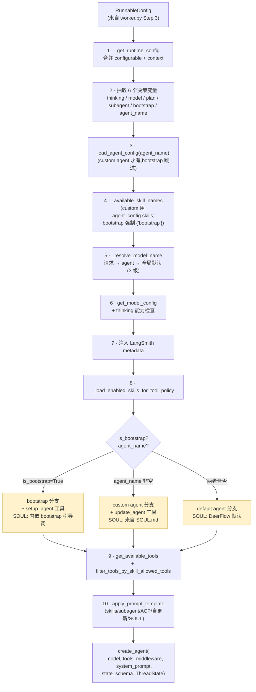
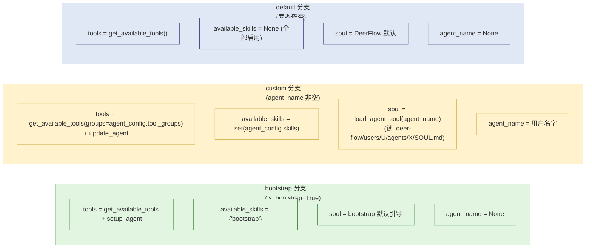
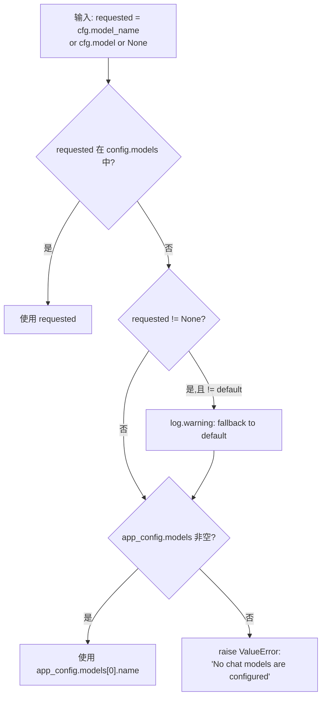

# 10 · Lead Agent 工厂与 Prompt 装配

> 核心模块层第 1 篇。前 9 章把"宿主、运行时、状态、流式、生命周期"全铺好；**本章拉到"agent 本身是怎么被造出来的"**。
>
> `make_lead_agent` 是整个 DeerFlow 唯一的 LangGraph graph 入口（见 `langgraph.json::graphs.lead_agent`），它一行调用展开出**三套不同形态的 agent**（bootstrap / 普通 / 自定义 agent），动态绑定模型 / 工具 / 中间件链 / 系统提示词。本章把这个 100 行核心函数逐字段拆开。

---

## 🎯 学习目标

读完这份文档，你能回答：

1. **`make_lead_agent(config)` 进来一个 `RunnableConfig`，出去一个 `CompiledStateGraph`** —— 这中间发生了什么？关键的 6 个决策变量（agent_name / model_name / thinking_enabled / is_plan_mode / subagent_enabled / is_bootstrap）各驱动什么不同行为？
2. **三分支**（bootstrap / 自定义 agent / 默认 agent）：每个分支专属的 system prompt / 工具集 / extra tools 各是什么？为什么 setup_agent 工具只在 bootstrap 出现、update_agent 只在自定义 agent 出现？
3. **`_resolve_model_name` 三级回退**（请求 → agent config → 全局默认）：每一级回退的边界条件是什么？回退发生时有没有日志告警？
4. **`filter_tools_by_skill_allowed_tools` 的"允许-工具策略闸门"**：当任何一个启用的 skill 显式声明 `allowed-tools` 时，**legacy 没声明的 skill 不再贡献任何工具** —— 这个"白名单 fail-secure"语义为什么是对的？
5. **system prompt 为什么必须保持"对所有用户/会话静态"**？日期、记忆、user_id 这些"会变的内容"DeerFlow 是怎么塞进去而不破坏 prefix cache 的？

---

## 🗂️ 源码定位

| 关注点 | 文件 / 行号 | 关键锚点 |
|---|---|---|
| LangGraph 入口（**全项目唯一 graph**） | `backend/langgraph.json` | `"lead_agent": "deerflow.agents:make_lead_agent"` |
| Factory 顶层 | `packages/harness/deerflow/agents/lead_agent/agent.py` | `make_lead_agent` L343；`_make_lead_agent` L350-L446 |
| Runtime config 提取 | 同上 | `_get_runtime_config` L29（合并 `configurable` + `context`） |
| 模型名解析三级回退 | 同上 | `_resolve_model_name` L38-L50 |
| 三分支主体 | 同上 | bootstrap L413-L427；自定义 / 默认 L431-L446 |
| 可用 skills 集合 | 同上 | `_available_skill_names` L321；`_load_enabled_skills_for_tool_policy` L329 |
| 中间件装配（详见 11 章） | 同上 | `_build_middlewares` L240-L318 |
| Prompt 装配主入口（823 行） | `packages/harness/deerflow/agents/lead_agent/prompt.py` | `apply_prompt_template` L768-L823；`SYSTEM_PROMPT_TEMPLATE` |
| 子模块：subagent 描述 / skills section / 自更新 section / ACP section | `prompt.py` | `_build_subagent_section` L213；`get_skills_prompt_section` L626；`_build_self_update_section` L667；`_build_acp_section` L717 |
| Skills 工具策略闸门 | `packages/harness/deerflow/skills/tool_policy.py` | `allowed_tool_names_for_skills`；`filter_tools_by_skill_allowed_tools` |
| Custom agent 配置 | `packages/harness/deerflow/config/agents_config.py` | `AgentConfig` L38（name / description / model / tool_groups / skills）；`validate_agent_name` L27；`load_agent_config` L80；`load_agent_soul` L129 |
| 工具集装配 | `packages/harness/deerflow/tools/tools.py` | `get_available_tools(groups, include_mcp, model_name, subagent_enabled, *, app_config)` —— 16 章详讲 |
| 创建模型 | `packages/harness/deerflow/models/factory.py` | `create_chat_model(name, thinking_enabled, ...)` —— 21 章详讲 |
| 创建 LangChain Agent | `.venv/.../langchain/agents/factory.py` | `create_agent(model, tools, middleware, system_prompt, state_schema)` —— 02 章已精读 |

---

## 🧭 架构图

### 1. `make_lead_agent` 调用链（10 步组装）



### 2. 三分支对照



### 3. `_resolve_model_name` 三级回退决策树



---

## 🔍 核心逻辑讲解

### Part 1 · `_make_lead_agent` 100 行 = 10 步组装

打开 `agent.py::_make_lead_agent` L350-L446，按结构拆解：

#### Step 1-2 · 决策变量提取（L355-L365）

```python
cfg = _get_runtime_config(config)
resolved_app_config = app_config

thinking_enabled = cfg.get("thinking_enabled", True)
reasoning_effort = cfg.get("reasoning_effort", None)
requested_model_name: str | None = cfg.get("model_name") or cfg.get("model")
is_plan_mode = cfg.get("is_plan_mode", False)
subagent_enabled = cfg.get("subagent_enabled", False)
max_concurrent_subagents = cfg.get("max_concurrent_subagents", 3)
is_bootstrap = cfg.get("is_bootstrap", False)
agent_name = validate_agent_name(cfg.get("agent_name"))
```

**6 个核心决策变量**：

| 变量 | 默认 | 改变了什么 |
|---|---|---|
| `thinking_enabled` | True | 模型是否启用扩展思考；不支持时自动降级 + log.warning |
| `reasoning_effort` | None | OpenAI o-series 模型的推理强度 |
| `requested_model_name` | None | 显式请求的模型；不存在时回退 |
| `is_plan_mode` | False | 是否挂 `TodoMiddleware`（注入 write_todos 工具）|
| `subagent_enabled` | False | 是否挂 `task()` 工具 + 中间件限并发 |
| `is_bootstrap` | False | 是否走 bootstrap 分支（用于自定义 agent 创建流程） |
| `agent_name` | None | 是否走 custom agent 分支 |

**注意 `requested_model_name: cfg.get("model_name") or cfg.get("model")`** —— 兼容两种字段名（`model_name` 和 `model`）。这种**兼容两种入参** 是常见的"渐进式 API 命名"做法：早期项目用 `model`，后来想加更结构化命名 → 同时支持，**永远不要 break 老客户端**。

#### Step 3 · `load_agent_config` 与 `_available_skill_names`（L367-L368）

```python
agent_config = load_agent_config(agent_name) if not is_bootstrap else None
available_skills = _available_skill_names(agent_config, is_bootstrap)
```

**为什么 bootstrap 跳过 agent_config 加载？**
- bootstrap 是"创建 agent 流程"本身 —— 此时 agent 尚未存在，没有 SOUL.md / config.yaml 给它读
- bootstrap 用一个特殊 `available_skills = {"bootstrap"}` —— 只加载 bootstrap 这一个特殊 skill 进 prompt（引导模型如何 `setup_agent`）

#### Step 4-6 · 模型解析 + 能力检查（L370-L382）

```python
agent_model_name = agent_config.model if agent_config and agent_config.model else None
model_name = _resolve_model_name(requested_model_name or agent_model_name, app_config=resolved_app_config)
model_config = resolved_app_config.get_model_config(model_name)

if model_config is None:
    raise ValueError("No chat model could be resolved. ...")
if thinking_enabled and not model_config.supports_thinking:
    logger.warning(f"Thinking mode is enabled but model '{model_name}' does not support it; fallback to non-thinking mode.")
    thinking_enabled = False
```

**模型解析的优先级链**：
1. 请求里 `cfg.get("model_name") or cfg.get("model")` —— **最高优先级**（per-run 指定）
2. 自定义 agent 的 `agent_config.model` —— 中等优先级（这个 agent 的默认模型）
3. `app_config.models[0]` —— 兜底（全局默认）

**`thinking_enabled` 兜底降级**：模型不支持 thinking 时**自动降级 + 警告**，不抛错。这是个**用户友好**取舍 —— 我宁可少跑一段 thinking，也别让用户看到 500 错误。

#### Step 7 · 注入 LangSmith metadata（L395-L409）

```python
config["metadata"].update({
    "agent_name": agent_name or "default",
    "model_name": model_name or "default",
    "thinking_enabled": thinking_enabled,
    "reasoning_effort": reasoning_effort,
    "is_plan_mode": is_plan_mode,
    "subagent_enabled": subagent_enabled,
    "tool_groups": agent_config.tool_groups if agent_config else None,
    "available_skills": sorted(available_skills) if available_skills is not None else None,
})
```

**这 8 个字段会自动出现在 LangSmith / Langfuse trace 上** —— 让你在云端就能看到"这个 trace 是哪个 agent / 模型 / 模式跑的"。运维同学很爱这个。**`sorted(available_skills)` 是为了 trace diff 时确定性顺序**。

#### Step 8 · `_load_enabled_skills_for_tool_policy`（L411）

```python
skills_for_tool_policy = _load_enabled_skills_for_tool_policy(available_skills, app_config=resolved_app_config)
```

把 enabled skills 加载出来，准备喂给后续的工具策略闸门（Part 4 详讲）。

#### Step 9 · 三分支调用 `create_agent`

这是本章的核心 —— 见 Part 2 / Part 3 详讲。

### Part 2 · 三分支精读

#### 分支 A · bootstrap（L413-L427）

```python
if is_bootstrap:
    tools = get_available_tools(model_name=model_name, subagent_enabled=subagent_enabled, app_config=resolved_app_config) + [setup_agent]
    return create_agent(
        model=create_chat_model(name=model_name, thinking_enabled=thinking_enabled, app_config=resolved_app_config),
        tools=filter_tools_by_skill_allowed_tools(tools, skills_for_tool_policy),
        middleware=_build_middlewares(config, model_name=model_name, app_config=resolved_app_config),
        system_prompt=apply_prompt_template(
            subagent_enabled=subagent_enabled,
            max_concurrent_subagents=max_concurrent_subagents,
            available_skills=set(["bootstrap"]),    # ← 强制 bootstrap-only
            app_config=resolved_app_config,
        ),
        state_schema=ThreadState,
    )
```

**专属特征**：
- `+ [setup_agent]` —— 额外塞入 `setup_agent` 工具，**只在这里加**
- `available_skills={"bootstrap"}` —— prompt 里只看到 bootstrap skill 的指引
- `agent_name=None`（前置 step 没赋值）—— SOUL 取默认 DeerFlow 引导

**这是个"meta-agent"流程**：用户对一个 bootstrap agent 说"帮我创建一个叫 my_research_agent 的 agent，专门做学术搜索" → bootstrap agent 调用 `setup_agent` 工具 → 写 SOUL.md + config.yaml 到 `.deer-flow/users/U/agents/my_research_agent/` → 之后用户就能用 `agent_name="my_research_agent"` 跑这个 agent。

#### 分支 B · custom agent（agent_name 非空）

```python
extra_tools = [update_agent] if agent_name else []
tools = get_available_tools(model_name=model_name, groups=agent_config.tool_groups if agent_config else None, subagent_enabled=subagent_enabled, app_config=resolved_app_config)
return create_agent(
    model=create_chat_model(...),
    tools=filter_tools_by_skill_allowed_tools(tools + extra_tools, skills_for_tool_policy),
    middleware=_build_middlewares(config, model_name=model_name, agent_name=agent_name, app_config=resolved_app_config),
    system_prompt=apply_prompt_template(
        subagent_enabled=subagent_enabled,
        max_concurrent_subagents=max_concurrent_subagents,
        agent_name=agent_name,              # ← 传 agent_name,prompt 内部取 SOUL.md
        available_skills=set(agent_config.skills) if agent_config and agent_config.skills is not None else None,
        app_config=resolved_app_config,
    ),
    state_schema=ThreadState,
)
```

**专属特征**：
- `+ [update_agent]` —— **只有自定义 agent 才能改自己的 SOUL.md / config.yaml**
- `groups=agent_config.tool_groups` —— 仅启用该 agent 配置的工具组（不是全部）
- `available_skills=set(agent_config.skills)` —— 受配置精确控制；`None` 表示"全部启用"，`[]` 表示"全部禁用"，`["a","b"]` 表示"只用这两个"
- `agent_name` 传给 prompt → SOUL 取自 SOUL.md，**MemoryMiddleware 也按 agent_name 隔离记忆**（20 章详讲）

#### 分支 C · default agent（agent_name = None 且 is_bootstrap = False）

走与分支 B 同一段代码，但：
- `extra_tools = []`（**不**给 update_agent，默认 agent 不能 self-update）
- `groups=None` → 所有 tool_groups 启用
- `agent_name=None` → prompt 用 "DeerFlow 2.0" 作为名字 + 默认 SOUL

**为什么"默认 agent 不能 self-update"？** 默认 agent 是所有用户共享的；如果允许 self-update，**一个用户的指令会污染所有人的默认 agent SOUL**。这是个安全 / 隔离层考虑 —— self-update 必须 scope 到 custom agent。

### Part 3 · `_resolve_model_name` 三级回退（L38-L50）

```python
def _resolve_model_name(requested_model_name: str | None = None, *, app_config: AppConfig | None = None) -> str:
    app_config = app_config or get_app_config()
    default_model_name = app_config.models[0].name if app_config.models else None
    if default_model_name is None:
        raise ValueError("No chat models are configured. Please configure at least one model in config.yaml.")

    if requested_model_name and app_config.get_model_config(requested_model_name):
        return requested_model_name

    if requested_model_name and requested_model_name != default_model_name:
        logger.warning(f"Model '{requested_model_name}' not found in config; fallback to default model '{default_model_name}'.")
    return default_model_name
```

**精读**：

1. **`app_config.models[0]` 是"全局默认"**（约定：YAML 第一个就是默认）。如果 list 空 → fail-fast。
2. **"请求模型在 config 里" → 直接用**。
3. **"请求模型在 config 不存在" → 回退到全局默认 + warning**。**关键细节**：`requested_model_name != default_model_name` 那个判断是为了**避免重复 warning**（如果用户请求的就是默认名但名字对不上，那只是个普通匹配失败，不需要每次告警）。

**为什么不抛 KeyError？** —— DeerFlow 选 graceful degradation：用户写了一个不存在的 model 名，我宁可用默认让 agent 跑起来 + log，也不要让前端弹错误。**对用户友好**。

**反面教训**：如果安全/合规场景**禁止**fallback（例如用户付费按模型计费，回退到便宜模型会被投诉），应该在 `_resolve_model_name` 加一个 `strict=True` 参数。**DeerFlow 当前缺这个**，是个值得提的 PR。

### Part 4 · `filter_tools_by_skill_allowed_tools` 工具策略闸门

`packages/harness/deerflow/skills/tool_policy.py`：

```python
def allowed_tool_names_for_skills(skills: list[Skill]) -> set[str] | None:
    """Return the union of explicit skill allowed-tools declarations.

    None means legacy allow-all behavior. It is returned only when no loaded
    skill declares allowed-tools. Once any skill declares the field, legacy
    skills without the field contribute no tools instead of disabling the
    explicit restrictions from other skills.
    """
    if not skills:
        return None

    allowed: set[str] = set()
    has_explicit_declaration = False
    for skill in skills:
        if skill.allowed_tools is None:
            continue
        has_explicit_declaration = True
        ...
        allowed.update(skill.allowed_tools)

    if not has_explicit_declaration:
        return None     # ← 没人声明 → 全放行(legacy 兼容)
    return allowed


def filter_tools_by_skill_allowed_tools(tools, skills):
    allowed = allowed_tool_names_for_skills(skills)
    if allowed is None:
        return tools                           # 全放行
    return [tool for tool in tools if tool.name in allowed]
```

**关键设计：fail-secure 白名单**：
- **没有任何 skill 声明 `allowed-tools` 字段** → 全放行（legacy 兼容）
- **任何一个 skill 显式声明了 `allowed-tools`** → **进入严格白名单模式**，没声明的 skill **不再贡献任何工具**

**这种"任一启用即激活严格模式"为什么是对的？**

| 场景 | 没声明 | 一个声明 + 一个没声明 |
|---|---|---|
| 旧 skill 没字段 | 全工具放行 | 旧 skill 不再贡献工具 |
| 新 skill 显式 `allowed-tools: [read_file]` | — | 只放行 `read_file` |
| 安全姿态 | **宽松**（向后兼容） | **严格**（白名单生效） |

**翻译成业务语义**：**一旦你升级到"新 skill 用 allowed-tools 声明工具"，老的没声明的 skill 自动被视为"不可信，不贡献工具"**。这避免了"老 skill 偷偷继续给新 agent 引入意外工具"的安全问题。

**踩坑案例**：你升级了一个 skill 加 allowed-tools，**没动其他 skill** → 突然其他 skill 注册的工具消失了。**这是设计行为，不是 bug**。修复路径：要么给所有 skill 都加 `allowed-tools`（推荐），要么让那个新 skill 干脆别声明（保留 legacy 全放）。

### Part 5 · `apply_prompt_template` 与 prefix-cache 优化

打开 `prompt.py::apply_prompt_template` L768-L823：

```python
def apply_prompt_template(
    subagent_enabled, max_concurrent_subagents, *,
    agent_name=None, available_skills=None, app_config=None,
) -> str:
    # subagent / skills / deferred / acp / custom mounts 各 section 拼装
    subagent_section = _build_subagent_section(n, app_config=app_config) if subagent_enabled else ""
    subagent_reminder = "..." if subagent_enabled else ""
    skills_section = get_skills_prompt_section(available_skills, app_config=app_config)
    deferred_tools_section = get_deferred_tools_prompt_section(app_config=app_config)
    acp_section = _build_acp_section(app_config=app_config)
    custom_mounts_section = _build_custom_mounts_section(app_config=app_config)

    # ⭐ 关键设计:这段静态 prompt 对所有用户/会话保持一致,以最大化 prefix cache 命中
    # 日期、记忆通过 DynamicContextMiddleware 在 first HumanMessage 里以
    # <system-reminder> 形式注入
    return SYSTEM_PROMPT_TEMPLATE.format(
        agent_name=agent_name or "DeerFlow 2.0",
        soul=get_agent_soul(agent_name),
        ...
    )
```

**核心设计：system prompt 必须对所有用户 / 会话**静态**。**

**为什么？** 现代 LLM 提供商（OpenAI / Anthropic / Bedrock）都支持 **prefix cache** —— 同一段开头的输入只算一次 token 费用 + 加速首字节响应。如果你把 user_id / 当前时间 / 用户记忆 拼进 system prompt，**每次都不一样 → prefix cache 失效 → 慢 + 贵**。

**DeerFlow 的解决方案**：system prompt 保持静态，**所有动态内容由 `DynamicContextMiddleware` 注入到 first HumanMessage 里**（11/14 章详讲）：

```
[system]  长 prompt — 同一 agent 对所有用户都一样 → prefix cache 命中
[human]   <system-reminder>
            Today: 2026-05-17
            Memory: 用户偏好简洁回答; 工作于金融行业...
          </system-reminder>
          {真实用户消息}
[ai]      ...
```

**这是个高级 prompt engineering 取舍** —— 大多数项目把 dynamic content 塞进 system prompt 图方便，**牺牲了 prefix cache**。DeerFlow 显式把"静态/动态"边界拉到 prompt template 设计层面。

---

## 🧩 体现的通用 Agent 设计模式

| 模式 | DeerFlow 中的体现 |
|---|---|
| **Factory Method**（工厂方法） | `make_lead_agent` 是 LangGraph 的标准 graph factory |
| **Branch by Mode**（按模式分支） | 三分支（bootstrap / custom / default）共享主流程，分歧在 tools / SOUL / prompt section |
| **Resolution Chain**（解析链 / 三级回退） | `_resolve_model_name` 请求 → agent → 全局默认 |
| **Allow-list with Fail-secure Default**（白名单 + 安全默认） | `filter_tools_by_skill_allowed_tools` 任一启用即严格 |
| **Static-prompt + Dynamic-injection**（静态 prompt + 动态注入） | system prompt 静态 + DynamicContextMiddleware 注入到 first HumanMessage |
| **Meta-agent / Self-modification** | `update_agent` 工具让 custom agent 改自己的 SOUL.md |

---

## 🧱 与 Agent Harness 六要素的对应关系

| 六要素 | factory 怎么提供基础设施 |
|---|---|
| ① 反馈循环 | 中间件链 + state_schema=ThreadState 让 ReAct 循环完整 |
| ② 记忆持久化 | `agent_name` 传给 MemoryMiddleware → 按 agent + user 隔离记忆 |
| ③ 动态上下文 | static prompt + DynamicContextMiddleware 双轨注入 |
| ④ 安全护栏 | `filter_tools_by_skill_allowed_tools` 工具白名单；`thinking_enabled` 不支持时降级 |
| ⑤ 工具集成 | `get_available_tools(groups=...)` + bootstrap / custom 各自的 extra_tools |
| ⑥ 可观测性 | LangSmith metadata 注入 8 个字段 + 中间件链每个钩子是独立 graph 节点 |

---

## ⚠️ 常见坑与调试技巧

### 坑 1 · `is_bootstrap=True` 同时传了 `agent_name` —— 三分支冲突

代码逻辑（agent.py L367 + L413）：
```python
agent_config = load_agent_config(agent_name) if not is_bootstrap else None
...
if is_bootstrap:
    # ↑ 这条分支生效,agent_name 被 effectively ignored
```

**症状**：日志显示 "Create Agent(my-custom-agent) ..."，但实际 agent 行为完全是 bootstrap 模式。
**修复**：API 层应该拒绝同时传两个标志，或 lifespan 启动加 assert。DeerFlow 当前没显式校验 —— 是个值得提的 PR。

### 坑 2 · `agent_config.skills = []`（显式空列表）行为反直觉

```python
# agents_config.py L48-L51 注释:
# - None (or omitted): load all enabled skills (default fallback behavior)
# - [] (explicit empty list): disable all skills
# - ["skill1", "skill2"]: load only the specified skills
```

很多人以为"空列表 = 跟没填一样" → **错**！DeerFlow 把 `[]` 当作"**显式禁用全部 skills**"。
**调试**：自定义 agent 没有任何 skill section 出现在 system prompt → 检查 `agent_config.skills` 是不是 `[]`。

### 坑 3 · `thinking_enabled` 没生效但没报错

```python
if thinking_enabled and not model_config.supports_thinking:
    logger.warning(f"...fallback to non-thinking mode.")
    thinking_enabled = False
```
**症状**：你确信 prompt 让模型 think，但实际 trace 显示模型没 think → 检查模型 `supports_thinking: false`（在 config.yaml 里）。**会被静默降级**，只在 warning log 里看得到。

### 坑 4 · `_resolve_model_name` warning 被吞了

如果 logger level > WARNING（如 prod 只 INFO 不显示 WARN），用户写了不存在的 model 名 → 默默用默认 model → **没人注意到**。
**修复**：把这一行 `logger.warning(...)` 改成 `logger.error(...)`；或在 metadata 里加一个 `model_name_resolution: "fallback"` 字段让前端可见。

### 坑 5 · LangGraph Studio 调试时 `agent_config` 找不到

Studio 启动**独立 LangGraph Server**（06 章讲），它有自己的 `runtime_paths.project_root` 解析。**custom agent 的 SOUL.md 在 `.deer-flow/users/U/agents/X/` 下** —— Studio 不知道 user_id，可能拿不到。
**修复**：Studio 调试用 `agent_name=None` 走默认 agent，或显式设置 `DEER_FLOW_PROJECT_ROOT`。

---

## 🛠️ 动手实操

> 本 demo 不依赖完整 DeerFlow 启动 —— 直接调 `make_lead_agent` 跑三分支对比。**前置**：项目根有 config.yaml + 至少一个 model 配置。

### Demo · 三分支 + 模型回退 + skill 白名单实测

```python
"""
make_lead_agent 三分支对照 + 各种回退行为实测.

跑法:  PYTHONPATH=backend uv run python scripts/lead_agent_factory_walkthrough.py
"""
import logging
import os
import sys
from pathlib import Path

logging.basicConfig(level=logging.INFO, format="%(asctime)s [%(levelname)s] %(name)s: %(message)s")

sys.path.insert(0, "backend")
sys.path.insert(0, "backend/packages/harness")
os.chdir(Path(__file__).resolve().parents[1])

from deerflow.agents import make_lead_agent
from deerflow.agents.lead_agent.agent import _resolve_model_name
from deerflow.config.app_config import get_app_config
from deerflow.skills.tool_policy import filter_tools_by_skill_allowed_tools, allowed_tool_names_for_skills
from deerflow.skills.types import Skill, SkillCategory


# ====== Case 1: 三分支创建对比 ======
print("\n" + "=" * 70)
print("CASE 1 · 三分支创建对比 (default / bootstrap / custom)")
print("=" * 70)

base_config = {
    "configurable": {"thread_id": "factory-demo-thread"},
    "context": {},
}

# 1a · default agent
agent_default = make_lead_agent({**base_config, "metadata": {}, "configurable": {**base_config["configurable"]}})
print(f"\n[default]  agent={type(agent_default).__name__}")
print(f"           tools: {[t.name for t in agent_default.tools_by_name.values()]}")
print(f"           # of nodes: {len(list(agent_default.get_graph().nodes))}")

# 1b · bootstrap
bootstrap_cfg = {**base_config, "metadata": {}, "configurable": {**base_config["configurable"], "is_bootstrap": True}}
agent_boot = make_lead_agent(bootstrap_cfg)
print(f"\n[bootstrap] agent={type(agent_boot).__name__}")
print(f"            tools 末尾: {[t.name for t in agent_boot.tools_by_name.values()][-5:]}")
print(f"            注意:'setup_agent' 应该在工具列表里")
print(f"            有 setup_agent? {'setup_agent' in agent_boot.tools_by_name}")
print(f"            有 update_agent? {'update_agent' in agent_boot.tools_by_name}  (期望 False)")

# 1c · custom agent (仅当你本地有 .deer-flow/users/default/agents/X 才生效)
# 演示:即使没有真实 custom agent,通过 cfg 设置 agent_name 也能看到行为
custom_cfg = {**base_config, "metadata": {}, "configurable": {**base_config["configurable"], "agent_name": "DEMO_NONEXISTENT_AGENT"}}
try:
    agent_custom = make_lead_agent(custom_cfg)
    print(f"\n[custom]   agent={type(agent_custom).__name__}")
    print(f"           有 update_agent? {'update_agent' in agent_custom.tools_by_name}")
    print(f"           有 setup_agent? {'setup_agent' in agent_custom.tools_by_name}  (期望 False)")
except Exception as e:
    print(f"\n[custom]   ⚠️ {type(e).__name__}: {e}")
    print(f"           (如果没真实 custom agent 目录,这里可能优雅退化或抛错)")


# ====== Case 2: _resolve_model_name 三级回退 ======
print("\n" + "=" * 70)
print("CASE 2 · _resolve_model_name 三级回退")
print("=" * 70)

app = get_app_config()
default_name = app.models[0].name if app.models else None
print(f"\n  app_config.models[0].name = {default_name!r}")

# 2a · 请求合法名
if len(app.models) >= 1:
    legal = app.models[0].name
    resolved = _resolve_model_name(legal)
    print(f"\n  [2a] 请求合法名 {legal!r} → 解析 {resolved!r}")

# 2b · 请求未知名 → fallback + warning
resolved = _resolve_model_name("MODEL_DOES_NOT_EXIST_X")
print(f"\n  [2b] 请求未知 'MODEL_DOES_NOT_EXIST_X' → 解析 {resolved!r}  (期望 = default)")
print(f"       检查日志,应该有 'Model ... not found in config; fallback to default' warning")

# 2c · 请求 None → 走默认
resolved = _resolve_model_name(None)
print(f"\n  [2c] 请求 None → 解析 {resolved!r}  (期望 = default)")


# ====== Case 3: filter_tools_by_skill_allowed_tools 白名单 ======
print("\n" + "=" * 70)
print("CASE 3 · skill allowed-tools 白名单语义")
print("=" * 70)

# 构造 3 个假 skill 用于测试
def make_skill(name: str, allowed: list[str] | None) -> Skill:
    return Skill(
        name=name,
        description=f"Skill {name}",
        category=SkillCategory.public,
        path=Path(f"/tmp/{name}"),
        allowed_tools=allowed,
    )

class FakeTool:
    def __init__(self, name):
        self.name = name

tools = [FakeTool(n) for n in ["bash", "read_file", "write_file", "web_search", "view_image"]]

# 3a · 没有 skill 声明 allowed-tools → 全放行
case_a_skills = [make_skill("legacy_a", None), make_skill("legacy_b", None)]
allowed = allowed_tool_names_for_skills(case_a_skills)
filtered = filter_tools_by_skill_allowed_tools(tools, case_a_skills)
print(f"\n  [3a] 无声明 → allowed_set = {allowed}  → 全放行 {len(filtered)} 个工具")

# 3b · 一个 skill 声明了,其他没声明 → 严格白名单激活
case_b_skills = [
    make_skill("new_skill", ["bash", "read_file"]),
    make_skill("legacy_b", None),
]
allowed = allowed_tool_names_for_skills(case_b_skills)
filtered = filter_tools_by_skill_allowed_tools(tools, case_b_skills)
print(f"\n  [3b] 1 个声明 + 1 个没声明 → allowed_set = {allowed}")
print(f"       filtered tools: {[t.name for t in filtered]}")
print(f"       注意:'web_search' / 'write_file' / 'view_image' 被砍掉,legacy_b 不再贡献")

# 3c · 两个 skill 都声明,allowed-tools 是并集
case_c_skills = [
    make_skill("research", ["web_search", "read_file"]),
    make_skill("editor", ["read_file", "write_file"]),
]
allowed = allowed_tool_names_for_skills(case_c_skills)
filtered = filter_tools_by_skill_allowed_tools(tools, case_c_skills)
print(f"\n  [3c] 2 个都声明 → allowed_set = {allowed}  (并集)")
print(f"       filtered tools: {[t.name for t in filtered]}")
```

### 调试任务

1. **断点位置**：
   - `agent.py::_make_lead_agent` 第 363-369 行（决策变量提取 + agent_config 加载）—— 看每个变量从 `cfg` 里取什么值
   - `agent.py` 的 `if is_bootstrap:` 分支与下一段 default/custom 路径分叉 —— Case 1 三个分支各自走哪个
   - `tool_policy.py::allowed_tool_names_for_skills` —— Case 3 看 `has_explicit_declaration` 翻转那一刻
2. **观察什么**：
   - Case 1 中 default agent 的工具列表**没有** setup_agent 也**没有** update_agent
   - Case 1 中 bootstrap 工具列表有 setup_agent 但无 update_agent
   - Case 2 中 [2b] 日志显示 fallback warning
   - Case 3 中 [3b] 严格模式激活，legacy_b 没贡献工具
3. **人为制造异常**：
   - 把 config.yaml 的 `models: []` 改空（备份原文件！）→ 跑脚本 → 看 `_resolve_model_name` 抛 ValueError
   - Case 1 改 `is_bootstrap=True, agent_name="X"` 同时传 → 看 bootstrap 分支吃掉 agent_name
   - Case 3 [3a] 加一个 `make_skill("ghost", [])`（显式空列表）→ 看 `has_explicit_declaration` 翻 True，allowed_set 仍是 `{}` → 所有工具都被砍掉

### 改造练习

1. **练习 A（简单）**：在 `_resolve_model_name` 加 `strict=False` 参数；为 True 时未知模型直接 raise 而不 fallback。写一个 unit test 验证两种模式。
2. **练习 B（中等）**：扩展 `apply_prompt_template`，让它接受一个 `extra_sections: dict[str, str]` —— 让 custom agent 配置里可以声明额外 system prompt 片段（如 "tone": "正式商务"）。注意保持静态 prompt 的 prefix-cache 友好性。
3. **挑战题**：实现一个 `agent_factory_smoke_test()` —— 给定一个 thread_id，依次跑三分支创建，断言每个分支产出的 `CompiledStateGraph` 含有正确的工具、正确数量的中间件节点、正确的 SOUL 文本片段。作为 CI 一部分跑，防止三分支被改坏。

### 预期输出 & 验证方式

- Case 1：default 工具列表无 setup/update_agent；bootstrap 有 setup；custom 有 update
- Case 2：[2a] 解析到合法名；[2b] log warning + 解析到 default；[2c] 解析到 default
- Case 3：[3a] 全放行 5 个；[3b] 严格模式 2 个；[3c] 并集 3 个

---

## 🎤 面试视角

### 业务型大厂卷

**问 1**：DeerFlow 的 `make_lead_agent` 用了"三分支共享主流程"。**为什么不写三个独立 factory 函数**（`make_default_agent` / `make_bootstrap_agent` / `make_custom_agent`）？你支持哪种？

> **教科书答案**：
> 当前"单 factory + 三分支"的优势：
> 1. **LangGraph 入口固定**：`langgraph.json::graphs` 只能指向一个函数 → 三个独立 factory 需要外层再加 dispatcher
> 2. **6 个决策变量统一处理**：thinking 降级、metadata 注入、model 解析这些逻辑三分支都要，写一次不重复
> 3. **三分支差异有限**：核心就是 `tools / agent_name / available_skills / extra_tools` 4 个变量分支，**不到 30 行代码**
> 三独立 factory 的优势：
> 1. **可读性**：每个函数职责单一
> 2. **可测试**：写测试更简单（不用 mock is_bootstrap 等）
> 我的选择：**保持当前设计**。理由：三个分支共享 80% 逻辑，强行拆开会导致 DRY 失效。
> **改进**：把三分支的差异提到一个小函数 `_apply_branch_specific_overrides(cfg, is_bootstrap, agent_name) -> (tools_extra, available_skills, prompt_kwargs)`，主 factory 就更清爽。

**问 2**：`_resolve_model_name` 的 graceful fallback（未知模型默默用默认）你怎么评价？什么场景应该改成 strict？

> **教科书答案**：
> 评价：**对新手友好但对生产场景有隐患**。
> 改 strict 的场景：
> 1. **付费按模型计费**：用户写 `gpt-4o`，结果回退到便宜的 `gpt-3.5` → 投诉
> 2. **合规要求**：金融场景必须用特定 audited 模型，不能 silently 退化
> 3. **A/B 测试**：实验组指定 model X，回退到默认就脏了数据
> 改造方式：加 `strict_model: bool = False` 配置；strict 模式下未知模型抛 4xx 错误而不是降级。
> **加分项**：指出当前 fallback 还有第二个隐患 —— **`thinking_enabled` 不支持时也是 silent 降级**。如果生产系统要求"思考过程可见"作为 SLA，这条降级也应该是 strict 的。

### 创业型 AI 公司卷

**问 3**：DeerFlow 把 system prompt 设计成"对所有用户静态" + 通过 `DynamicContextMiddleware` 注入到 first HumanMessage。**这种设计对你团队的实际 token 节省 / 延迟优化有多大价值**？怎么量化？

> **参考答案**：
> 价值评估：
> - **OpenAI Prefix Cache 折扣**：缓存命中部分约 0.5x 输入价格、加速 80%+ 首字节时延（cached 内容直接返回缓存的预计算结果）
> - **典型 system prompt 2000-5000 tokens**，如果 100% 命中 cache，每次请求节省 1000-2500 tokens 等价价格
> - **每用户每天 50 请求** → 单用户每天节省 50K-125K tokens
> 量化方法：
> 1. 在 LangSmith metadata 上记录 `cached_tokens`（OpenAI provider 返回 `usage.prompt_tokens_details.cached_tokens`）
> 2. dashboard 上画 "命中率 = cached_tokens / prompt_tokens" 趋势
> 3. 对照不优化的 baseline（把 user_id / date 直接拼进 system prompt）跑一周对比
> **DeerFlow 的取舍**：这条优化让"3000+ tokens 的 SOUL+skills 内容"几乎免费 —— 是 DeerFlow 能加这么多 prompt 段（subagent / skills / ACP / 自更新）而不破产的关键。

**问 4**：`filter_tools_by_skill_allowed_tools` 一旦"任一 skill 声明 allowed-tools"就进入严格模式。**这个语义升级**对你团队迁移意味着什么？给一个迁移路径。

> **参考答案**：
> 语义升级风险：**当我升级一个 skill 加 allowed-tools 时，所有其他没加的 skill 突然"什么工具都不贡献" → 之前工作的功能可能掉线**。
> 迁移路径（**渐进 + 防御**）：
> 1. **第一周**：盘点所有 enabled skills，列出每个 skill 应该贡献什么工具
> 2. **第二周**：**所有 skill** 同时加 `allowed-tools` 字段（**而不是逐个加**）→ 一刀切，避免半迁移状态
> 3. **第三周**：跑端到端回归测试，确认每个 agent 行为没掉线
> 4. **CI 守护**：加一条 lint：所有 SKILL.md **必须**有 `allowed-tools` 字段（即使是空）→ 让未来新 skill 强制声明
> **DeerFlow 当前不强制**，是个 PR 机会。

---

## 📚 延伸阅读

- **DeerFlow `prompt.py` 完整 823 行源码**：现在你应该能通读它。重点是 `SYSTEM_PROMPT_TEMPLATE`（一个超长 f-string template）和各个 `_build_*_section` 子函数的合作。
- **OpenAI Prompt Caching 文档**：https://platform.openai.com/docs/guides/prompt-caching
  *理解 prefix cache 触发条件 + 命中折扣 + 缓存生命周期 5-10 分钟。*
- **Anthropic Prompt Caching 文档**：https://docs.claude.com/en/docs/build-with-claude/prompt-caching
  *Anthropic 的 cache 是显式控制的（cache_control），DeerFlow 同样的静态 prompt 哲学也兼容它。*
- **LangChain `create_agent` 内部图构造**（02 章）：再回头看一遍，理解 `make_lead_agent` 怎么把 model / tools / middleware / system_prompt 这 4 个参数变成一张 StateGraph。
- **DeerFlow `rfc-create-deerflow-agent.md`**：项目内对 custom agent / bootstrap 流程的设计文档，配合本章读会理解 self-update 的产品动机。

---

## 🎤 互动检查 —— 请回答这 3 个问题

> **两句话即可**。

1. **设计取舍题**：DeerFlow 把 system prompt 设计成对所有用户静态 + 用 DynamicContextMiddleware 注入到 HumanMessage。**给出至少 2 条**这种设计的实际好处。
2. **机制理解题**：`filter_tools_by_skill_allowed_tools` 的"任一启用即严格"语义解决的是"老 skill 暗中引入意外工具"问题。**举一个具体场景**说明如果没有这个语义会发生什么。
3. **应用题**：你的同事提了 PR：在 `_resolve_model_name` 改为"未知模型抛 KeyError"（破坏 fallback）。**给出至少 2 条**这个改动可能破坏的合理 use case。

回答后我们进入 **`11-middleware-chain-overview.md`** —— `build_lead_runtime_middlewares` + `_build_middlewares` 双阶段装配 + 18 个中间件全景执行顺序图。
