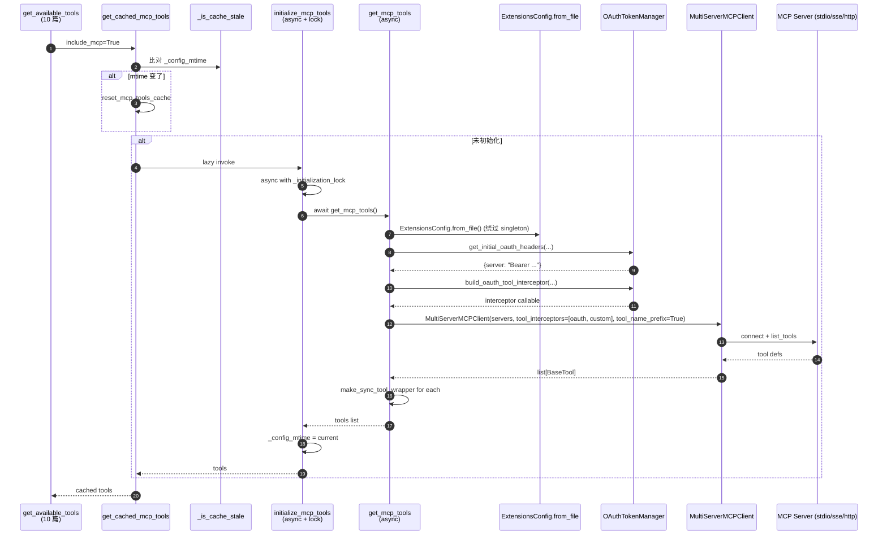

# 11 · MCP 集成与 Tool Search（延迟工具）

> 10 篇结尾说："MCP 工具是怎么从外部进程取来"是这一章的核心。这一章把 MCP 的全栈讲清楚：从 transport（stdio/sse/http）到 OAuth token 管理、再到 ToolSearch 怎么让 "几百个 MCP 工具" 这种规模也能塞进 LLM 视野——不堵塞 prompt 上下文。

---

## 1. 模块定位（Why this matters）

**MCP（Model Context Protocol）** 是 Anthropic 推的"agent 工具的 USB-C"——任何 server 实现 MCP 协议，任何 client 都可以接入它的工具。deer-flow 用 `langchain-mcp-adapters` 作为 client 库，但在它之上加了 3 层有价值的工程：

1. **mtime 失效的缓存**：用户在 Gateway UI 启用/禁用 MCP server 写 `extensions_config.json`，下一次 `get_cached_mcp_tools()` 会自动重新初始化——**不重启进程**。
2. **OAuth token manager**：对 HTTP/SSE 类型的 MCP server，支持 `client_credentials` / `refresh_token` grant、有 `refresh_skew_seconds` 提前刷新、有 per-server `asyncio.Lock` 防 token 同时刷新两次。
3. **Tool Search（延迟工具）**：当一个 MCP server 暴露几十个工具（例如 GitHub MCP 暴露 100+ 个），把它们全塞进 LLM 的 tool schema 会污染 prompt 上下文 + 让 LLM 选择时分心。deer-flow 的解法是 **把这些工具"按名字列在 prompt 里" + 提供一个 `tool_search` 让 LLM 按需查询完整 schema**。

不读这一章会错过 4 个关键认知：

1. **MCP 工具是 100% async**：所有 MCP 协议交互都是 async（stdio 也用 asyncio subprocess），这就是为什么 10 篇的 `make_sync_tool_wrapper` 在 MCP loaders 里也调了一次。
2. **`extensions_config.json` 的优先级是"从硬盘读"而非"读缓存"**：`get_mcp_tools` 调 `ExtensionsConfig.from_file()` 而不是 `get_extensions_config()`——文档里明确写了原因：Gateway API 改了文件后，LangGraph runtime（可能在另一进程）要立刻看到，**单例 cache 反而碍事**。
3. **OAuth 重刷锁是 per-server 的**：`{server_name: asyncio.Lock()}` 而非全局一把锁——避免一个慢的 OAuth server 阻塞其他 server。
4. **`tool_search` 的 promote 用 ContextVar 隔离请求**：两个并发请求各自有独立 registry 状态，互不污染。10 篇讲的"工具装配 first-wins"防的是重复名字，这里讲的"deferred registry 隔离"防的是并发污染——两个 issue。

对应到 Harness 六要素：本章对应**工具集成 + 动态上下文 + 安全护栏**——MCP 是工具集成的接入点、Tool Search 是动态上下文的优化、OAuth 是安全护栏的一部分。

---

## 2. 源码地图（Source Map）

### 2.1 关键文件清单

| 路径 | 角色 |
|------|------|
| [`packages/harness/deerflow/mcp/__init__.py`](../packages/harness/deerflow/mcp/__init__.py) | 公开 API（14 行） |
| [`packages/harness/deerflow/mcp/client.py`](../packages/harness/deerflow/mcp/client.py) | `build_server_params / build_servers_config`（68 行） |
| [`packages/harness/deerflow/mcp/tools.py`](../packages/harness/deerflow/mcp/tools.py) | `get_mcp_tools` 异步加载入口（94 行） |
| [`packages/harness/deerflow/mcp/cache.py`](../packages/harness/deerflow/mcp/cache.py) | `get_cached_mcp_tools / initialize_mcp_tools` mtime 缓存（142 行） |
| [`packages/harness/deerflow/mcp/oauth.py`](../packages/harness/deerflow/mcp/oauth.py) | `OAuthTokenManager` + interceptor（150 行） |
| [`packages/harness/deerflow/tools/builtins/tool_search.py`](../packages/harness/deerflow/tools/builtins/tool_search.py) | `DeferredToolRegistry / tool_search`（202 行） |
| [`packages/harness/deerflow/agents/middlewares/deferred_tool_filter_middleware.py`](../packages/harness/deerflow/agents/middlewares/deferred_tool_filter_middleware.py) | `DeferredToolFilterMiddleware` 把 deferred 工具从 bind_tools 隐藏 |
| [`packages/harness/deerflow/config/extensions_config.py`](../packages/harness/deerflow/config/extensions_config.py) | `ExtensionsConfig / McpServerConfig / McpOAuthConfig`（03 篇读过） |

### 2.2 关键符号速查表

| 符号 | 文件:行 | 一句话职责 |
|------|---------|-----------|
| `get_cached_mcp_tools()` | `mcp/cache.py:82` | 主入口；lazy + mtime stale 检查 |
| `initialize_mcp_tools()` | `mcp/cache.py:56` | async；带 `_initialization_lock` 防并发初始化 |
| `_is_cache_stale()` | `mcp/cache.py:31` | 比对 `_config_mtime` 和当前 mtime |
| `reset_mcp_tools_cache()` | `mcp/cache.py:133` | 测试用 / Gateway API 改完调 |
| `get_mcp_tools()` | `mcp/tools.py:16` | 真正调 `MultiServerMCPClient.get_tools()` |
| `build_server_params(name, config)` | `mcp/client.py:11` | yaml→`MultiServerMCPClient` 参数 |
| `build_servers_config(extensions)` | `mcp/client.py:45` | enabled 过滤 + 错误隔离 |
| `class OAuthTokenManager` | `mcp/oauth.py:25` | per-server token 管理 |
| `get_authorization_header(server)` | `mcp/oauth.py:47` | "double-check locking" 模式 |
| `_fetch_token(oauth)` | `mcp/oauth.py:72` | client_credentials / refresh_token 两 grant |
| `_is_expiring(token, oauth)` | `mcp/oauth.py:67` | `refresh_skew_seconds` 提前刷新 |
| `build_oauth_tool_interceptor(extensions)` | `mcp/oauth.py:122` | 给 MCP client 装的 interceptor（每次 tool call 注 Auth header） |
| `get_initial_oauth_headers(extensions)` | `mcp/oauth.py:140` | 初始化 server 连接时（tool discovery 阶段）注 header |
| `class DeferredToolRegistry` | `tool_search.py:39` | per-context 注册表 |
| `_registry_var: ContextVar` | `tool_search.py:145` | per-request 隔离 |
| `DeferredToolRegistry.search(query)` | `tool_search.py:69` | 3 种 query 形式：`select:` / `+keyword` / 正则 |
| `DeferredToolRegistry.promote(names)` | `tool_search.py:54` | 把 deferred 工具"晋升"到 active |
| `@tool tool_search(query)` | `tool_search.py:164` | LLM 可调的工具 |
| `MAX_RESULTS = 5` | `tool_search.py:24` | 每次 search 返回数上限 |
| `DeferredToolFilterMiddleware` | `agents/middlewares/deferred_tool_filter_middleware.py` | wrap_model_call 时把 deferred 工具从 bind 列表移除 |

### 2.3 MCP 加载时序



### 2.4 Tool Search 全景

```mermaid
flowchart TB
    A[MCP 加载完成<br/>N 个 tools] --> Branch{config<br/>.tool_search<br/>.enabled?}
    Branch -- no --> Direct[全部加入<br/>get_available_tools 的输出]
    Branch -- yes --> Reg[set_deferred_registry<br/>(ContextVar)]
    Reg --> Builtin[把 tool_search 加进 builtin]
    Reg --> Filter[DeferredToolFilterMiddleware<br/>wrap_model_call 时<br/>从 bind_tools 移除 deferred 工具]
    Reg --> Prompt[Prompt 里列出 deferred tool 名字<br/>(get_deferred_tools_prompt_section)]

    LLM[LLM 调 tool_search&#40;query&#41;] --> Search[registry.search 3 种 query]
    Search --> Promote[promote 匹配的工具]
    Promote --> NextRound[下一轮 LLM 调用<br/>已 promoted 的工具进 bind_tools]
    NextRound --> Call[LLM 真正调那个工具]
```

---

## 3. 核心逻辑精读（Deep Dive）

### 3.1 `get_cached_mcp_tools`：lazy + stale check + 跨 loop 容错

```python
# packages/harness/deerflow/mcp/cache.py:82-130
def get_cached_mcp_tools() -> list[BaseTool]:
    """Get cached MCP tools with lazy initialization."""
    global _cache_initialized

    # Check if cache is stale due to config file changes
    if _is_cache_stale():
        logger.info("MCP cache is stale, resetting for re-initialization...")
        reset_mcp_tools_cache()

    if not _cache_initialized:
        logger.info("MCP tools not initialized, performing lazy initialization...")
        try:
            loop = asyncio.get_event_loop()
            if loop.is_running():
                # If loop is already running (e.g., in LangGraph Studio),
                # we need to create a new loop in a thread
                import concurrent.futures
                with concurrent.futures.ThreadPoolExecutor() as executor:
                    future = executor.submit(asyncio.run, initialize_mcp_tools())
                    future.result()
            else:
                loop.run_until_complete(initialize_mcp_tools())
        except RuntimeError:
            try:
                asyncio.run(initialize_mcp_tools())
            except Exception:
                logger.exception("Failed to lazy-initialize MCP tools")
                return []
        except Exception:
            logger.exception("Failed to lazy-initialize MCP tools")
            return []

    return _mcp_tools_cache or []
```

**4 段拆解**：

1. **stale check（行 99-101）**：如果 `_is_cache_stale()` 返回 True，**先重置缓存**再走 init。这是 mtime 失效机制的实现——Gateway API（另一进程）改了 `extensions_config.json` 后，本进程下一次取 tools 就会重新拉。
2. **lazy 初始化**：如果未初始化，按当前事件循环状态分支：
   - **`loop.is_running()`**（在 LangGraph 的 async runner 里）：用 10 篇讲的"跨 loop 抛到独立线程"模式——`ThreadPoolExecutor.submit(asyncio.run, ...)`。
   - **`loop` 存在但未跑**（旧 sync 代码）：`loop.run_until_complete(...)` 直接复用。
   - **`RuntimeError`**（无 event loop）：`asyncio.run(...)` 临时建一个。
3. **三层 try/except**：每层都 `logger.exception` + 返回 `[]`——任何失败都不让 MCP 加载导致整个 agent 装配失败。10 篇讲的"warn 不 fail"在这里继续。
4. **共享单例 cache（module-global `_mcp_tools_cache`）**：避免每次都重新拉 tools——MCP server 的 stdio 启动可能要几百毫秒。

### 3.2 `_is_cache_stale`：mtime 失效

```python
# packages/harness/deerflow/mcp/cache.py:31-53
def _is_cache_stale() -> bool:
    """Check if the cache is stale due to config file changes."""
    global _config_mtime

    if not _cache_initialized:
        return False  # Not initialized yet, not stale

    current_mtime = _get_config_mtime()

    # If we couldn't get mtime before or now, assume not stale
    if _config_mtime is None or current_mtime is None:
        return False

    # If the config file has been modified since we cached, it's stale
    if current_mtime > _config_mtime:
        logger.info(f"MCP config file has been modified (mtime: {_config_mtime} -> {current_mtime}), cache is stale")
        return True

    return False
```

**3 个工程细节**：

- **未初始化 → "not stale"**：跳过 stale 判定，让下一句 `if not _cache_initialized:` 触发初始化。
- **`mtime is None` → "not stale"**：文件不存在时不重置——避免环境配置缺失导致每次都重 init。
- **比 `>` 不是 `!=`**：只检测"文件被修改"——倒退时间（罕见，例如还原 git 版本）不触发重 init。这是合理的——倒退应该是用户主动行为，他们会自己重启。

**对比 03 篇 `get_app_config` 的 mtime 失效**：那边用 `!=`，这里用 `>`——细微差异，但**两者都是合理的**。AppConfig 是单例级文件（修改 = 想生效）；MCP cache 是高频读取，多一道"是否真变新了"的保护更稳。

### 3.3 `initialize_mcp_tools`：async + `asyncio.Lock` 防并发

```python
# packages/harness/deerflow/mcp/cache.py:56-79
async def initialize_mcp_tools() -> list[BaseTool]:
    """Initialize and cache MCP tools."""
    global _mcp_tools_cache, _cache_initialized, _config_mtime

    async with _initialization_lock:
        if _cache_initialized:
            logger.info("MCP tools already initialized")
            return _mcp_tools_cache or []

        from deerflow.mcp.tools import get_mcp_tools

        logger.info("Initializing MCP tools...")
        _mcp_tools_cache = await get_mcp_tools()
        _cache_initialized = True
        _config_mtime = _get_config_mtime()  # Record config file mtime
        logger.info(f"MCP tools initialized: {len(_mcp_tools_cache)} tool(s) loaded "
                    f"(config mtime: {_config_mtime})")
        return _mcp_tools_cache
```

**精妙点**：

- **`_initialization_lock = asyncio.Lock()`** 在模块 import 时创建——所有并发的 `initialize_mcp_tools` 调用会串行化。
- **double-check pattern**：`async with lock:` 进去后再次 `if _cache_initialized:`——避免"两个并发 task A 和 B：A 先抢到锁初始化完释放，B 拿到锁再初始化一次"的浪费。**这是 concurrent programming 的经典范式**。
- **mtime 在 init 完成后记录**：`_config_mtime = _get_config_mtime()`——记录的是"我们这次基于哪个版本的 config 初始化的"。下次 stale check 用它对比。

### 3.4 `get_mcp_tools`：transport + interceptor + sync wrapper

```python
# packages/harness/deerflow/mcp/tools.py:16-94 (关键段)
async def get_mcp_tools() -> list[BaseTool]:
    """Get all tools from enabled MCP servers."""
    try:
        from langchain_mcp_adapters.client import MultiServerMCPClient
    except ImportError:
        logger.warning("langchain-mcp-adapters not installed...")
        return []

    # NOTE: We use ExtensionsConfig.from_file() instead of get_extensions_config()
    # to always read the latest configuration from disk.
    extensions_config = ExtensionsConfig.from_file()
    servers_config = build_servers_config(extensions_config)

    if not servers_config:
        return []

    try:
        # Inject initial OAuth headers
        initial_oauth_headers = await get_initial_oauth_headers(extensions_config)
        for server_name, auth_header in initial_oauth_headers.items():
            if server_name not in servers_config:
                continue
            if servers_config[server_name].get("transport") in ("sse", "http"):
                existing_headers = dict(servers_config[server_name].get("headers", {}))
                existing_headers["Authorization"] = auth_header
                servers_config[server_name]["headers"] = existing_headers

        # Build interceptor chain
        tool_interceptors = []
        oauth_interceptor = build_oauth_tool_interceptor(extensions_config)
        if oauth_interceptor is not None:
            tool_interceptors.append(oauth_interceptor)

        # Custom user-declared interceptors (mcpInterceptors in extensions_config.json)
        raw_interceptor_paths = (extensions_config.model_extra or {}).get("mcpInterceptors")
        # ... 用 resolve_variable 反射加载 ...

        client = MultiServerMCPClient(servers_config, tool_interceptors=tool_interceptors,
                                       tool_name_prefix=True)
        tools = await client.get_tools()

        # Patch tools to support sync invocation
        for tool in tools:
            if getattr(tool, "func", None) is None and getattr(tool, "coroutine", None) is not None:
                tool.func = make_sync_tool_wrapper(tool.coroutine, tool.name)

        return tools
    except Exception as e:
        logger.error(f"Failed to load MCP tools: {e}", exc_info=True)
        return []
```

**6 个值得圈点**：

1. **`ExtensionsConfig.from_file()` 而非 `get_extensions_config()`**：注释明确说"绕过 singleton 直接读盘"。原因：Gateway API（另一进程）刚改完 `extensions_config.json`，但本进程的 singleton 还是老的——读盘保证拿到最新。**这是和 cache.py 的 mtime 失效配合的双保险**。
2. **`get_initial_oauth_headers` vs `build_oauth_tool_interceptor` 双注入**：
   - **`get_initial_oauth_headers`**：在 server 连接阶段（tool discovery / session 初始化）就要带 Auth header——某些 OAuth-protected MCP server 连接时就要鉴权。
   - **`build_oauth_tool_interceptor`**：每次 tool call 之前注 header——支持 token 过期后自动刷新（interceptor 里调 `get_authorization_header`，内部判定到期会自动 refetch）。
3. **`tool_name_prefix=True`**：让 MCP 工具的名字带 server 前缀（例如 `github_create_issue` 而非 `create_issue`）——防止多个 MCP server 都有 `create_issue` 这种重名工具时碰撞。10 篇讲的去重在 deer-flow 这层是 first-wins，但 prefix 让冲突更少发生。
4. **`raw_interceptor_paths` 支持用户自定义 interceptor**：在 `extensions_config.json` 写 `"mcpInterceptors": ["pkg.module:builder_func"]`——deer-flow 用 03 篇的 `resolve_variable` 反射加载，调用 `builder()` 拿到 interceptor。**让 MCP 这层完全可扩展**。
5. **`raw_interceptor_paths` 接受 str 或 list[str]**：写一个就 `"pkg:func"`，多个就 `["pkg1:func1", "pkg2:func2"]`——容忍两种写法。
6. **sync wrapper 二次装载**：10 篇讲过 `_ensure_sync_invocable_tool` 也会装，这里 MCP loader 自己也装一遍——双保险。

### 3.5 `OAuthTokenManager`：per-server lock + double-check

```python
# packages/harness/deerflow/mcp/oauth.py:25-65
class OAuthTokenManager:
    """Acquire/cache/refresh OAuth tokens for MCP servers."""

    def __init__(self, oauth_by_server: dict[str, McpOAuthConfig]):
        self._oauth_by_server = oauth_by_server
        self._tokens: dict[str, _OAuthToken] = {}
        self._locks: dict[str, asyncio.Lock] = {name: asyncio.Lock() for name in oauth_by_server}

    async def get_authorization_header(self, server_name: str) -> str | None:
        oauth = self._oauth_by_server.get(server_name)
        if not oauth:
            return None

        token = self._tokens.get(server_name)
        if token and not self._is_expiring(token, oauth):
            return f"{token.token_type} {token.access_token}"

        lock = self._locks[server_name]
        async with lock:
            token = self._tokens.get(server_name)
            if token and not self._is_expiring(token, oauth):
                return f"{token.token_type} {token.access_token}"

            fresh = await self._fetch_token(oauth)
            self._tokens[server_name] = fresh
            logger.info(f"Refreshed OAuth access token for MCP server: {server_name}")
            return f"{fresh.token_type} {fresh.access_token}"
```

**3 个工程亮点**：

1. **`self._locks = {name: asyncio.Lock() for name in oauth_by_server}`**：每个 server 一把锁。这样一个慢的 OAuth server 不会阻塞其他 server 的刷新。
2. **双重 if（行 52-54 和 行 58-60）**：经典的 double-check locking。第一次外面检查（fast path，无锁），如果不需要刷新直接返回；如果需要刷新，进锁后再次检查（可能在等锁的时候别的 task 已经刷新了）——避免重复刷 token。
3. **`_is_expiring` 用 `refresh_skew_seconds`**：默认 60 秒——token 还有 60s 过期时就主动刷。这避免"刚拿到 token 调用就过期"的边界 race。

```python
# packages/harness/deerflow/mcp/oauth.py:67-70
@staticmethod
def _is_expiring(token: _OAuthToken, oauth: McpOAuthConfig) -> bool:
    now = datetime.now(UTC)
    return token.expires_at <= now + timedelta(seconds=max(oauth.refresh_skew_seconds, 0))
```

`max(..., 0)` 兜底——用户配 `refresh_skew_seconds: -10` 也不会变成"延迟过期判定"。

### 3.6 `build_oauth_tool_interceptor`：每次 tool call 注 header

```python
# packages/harness/deerflow/mcp/oauth.py:122-137
def build_oauth_tool_interceptor(extensions_config: ExtensionsConfig) -> Any | None:
    """Build a tool interceptor that injects OAuth Authorization headers."""
    token_manager = OAuthTokenManager.from_extensions_config(extensions_config)
    if not token_manager.has_oauth_servers():
        return None

    async def oauth_interceptor(request: Any, handler: Any) -> Any:
        header = await token_manager.get_authorization_header(request.server_name)
        if not header:
            return await handler(request)

        updated_headers = dict(request.headers or {})
        updated_headers["Authorization"] = header
        return await handler(request.override(headers=updated_headers))

    return oauth_interceptor
```

**精妙处**：

- **闭包持有 `token_manager`**：每次 interceptor 调用都用同一个 token cache——所有 tool call 共享 OAuth 状态。
- **`request.override(headers=...)`** 是 langchain-mcp-adapters 提供的 API——immutable 风格的请求修改。
- **返回 `None` 表示"没需要 OAuth 的 server"**——这种情况就不装 interceptor，省一层调用开销。

### 3.7 `DeferredToolRegistry`：3 种 query 形式

```python
# packages/harness/deerflow/tools/builtins/tool_search.py:69-109
def search(self, query: str) -> list[BaseTool]:
    """Search deferred tools by regex pattern against name + description.

    Supports three query forms (aligned with Claude Code):
      - "select:name1,name2" — exact name match
      - "+keyword rest" — name must contain keyword, rank by rest
      - "keyword query" — regex match against name + description
    """
    if query.startswith("select:"):
        names = {n.strip() for n in query[7:].split(",")}
        return [e.tool for e in self._entries if e.name in names][:MAX_RESULTS]

    if query.startswith("+"):
        parts = query[1:].split(None, 1)
        required = parts[0].lower()
        candidates = [e for e in self._entries if required in e.name.lower()]
        if len(parts) > 1:
            candidates.sort(key=lambda e: _regex_score(parts[1], e), reverse=True)
        return [e.tool for e in candidates][:MAX_RESULTS]

    # General regex search
    try:
        regex = re.compile(query, re.IGNORECASE)
    except re.error:
        regex = re.compile(re.escape(query), re.IGNORECASE)

    scored = []
    for entry in self._entries:
        searchable = f"{entry.name} {entry.description}"
        if regex.search(searchable):
            score = 2 if regex.search(entry.name) else 1
            scored.append((score, entry))

    scored.sort(key=lambda x: x[0], reverse=True)
    return [entry.tool for _, entry in scored][:MAX_RESULTS]
```

**3 种 query 范式 + 它们各自的设计意图**：

| Query | 用途 | 举例 |
|-------|------|------|
| `select:Read,Edit,Grep` | LLM 已知确切名字，要拿 schema | claude-code 风格的 "selected tools" |
| `+slack send` | "名字含 slack"是必要条件，然后按 "send" 排序 | 多个 slack 工具按相关度排 |
| `notebook jupyter` | 正则模糊搜 name + description | 通用 search |

**`MAX_RESULTS = 5`**——每次最多返回 5 个工具的完整 schema，避免 LLM 一次 search 就把 token 用光。

**回退到 escape 正则**：`except re.error:` 块——LLM 给了非法正则就当作 literal string 搜，**不让 LLM 的输入炸掉 search**。

### 3.8 `ContextVar` 让 deferred registry per-request

```python
# packages/harness/deerflow/tools/builtins/tool_search.py:136-158
# Using a ContextVar instead of a module-level global prevents concurrent
# requests from clobbering each other's registry.

_registry_var: contextvars.ContextVar[DeferredToolRegistry | None] = contextvars.ContextVar(
    "deferred_tool_registry", default=None
)


def get_deferred_registry() -> DeferredToolRegistry | None:
    return _registry_var.get()


def set_deferred_registry(registry: DeferredToolRegistry) -> None:
    _registry_var.set(registry)


def reset_deferred_registry() -> None:
    """Reset the deferred registry for the current async context."""
    _registry_var.set(None)
```

**为什么用 ContextVar 而非 module global**？看注释：

> In asyncio-based LangGraph each graph run executes in its own async context, so each request gets an independent registry value. For synchronous tools run via `loop.run_in_executor`, Python copies the current context to the worker thread.

**关键场景**：

- 两个并发请求都启用 tool_search。
- 每个请求各自的 deferred registry 状态不同（A 已经 promote 了工具 X，B 还没）。
- 用 module global 会**互相污染** —— A 的 promote 让 B 也能直接用 X。
- 用 ContextVar，每个 async task 有自己的 view —— 隔离。

**`reset_deferred_registry` 没人调？** 它是给重置场景留的——例如长 thread 跨多 run，每个 run 想要独立的 registry 状态。当前 deer-flow 没用到，但 API 备好。

### 3.9 `tool_search` + `promote`：晋升机制

```python
# packages/harness/deerflow/tools/builtins/tool_search.py:164-202
@tool
def tool_search(query: str) -> str:
    """Fetches full schema definitions for deferred tools so they can be called."""
    registry = get_deferred_registry()
    if not registry:
        return "No deferred tools available."

    matched_tools = registry.search(query)
    if not matched_tools:
        return f"No tools found matching: {query}"

    tool_defs = [convert_to_openai_function(t) for t in matched_tools[:MAX_RESULTS]]

    # Promote matched tools so the DeferredToolFilterMiddleware stops filtering
    # them from bind_tools — the LLM now has the full schema and can invoke them.
    registry.promote({t.name for t in matched_tools[:MAX_RESULTS]})

    return json.dumps(tool_defs, indent=2, ensure_ascii=False)
```

**整套流程**：

1. **初始状态**：`set_deferred_registry(...)` 把所有 MCP tools 注册成 deferred；prompt 里只列 tool 名字 + 短 description。
2. **LLM 想用某个工具**：调 `tool_search(query="github slack")` 拿到完整 schema（JSON 格式）。
3. **`promote(names)` 从 registry 移除**：这些 tool 现在 active。
4. **下一轮 LLM 调用**：`DeerFlowSummarizationMiddleware` / `DeferredToolFilterMiddleware` 看到这些 tool 不在 deferred list 里了，**让它们出现在 bind_tools 里** → LLM 真正能调它们。

**`convert_to_openai_function` 是 LangChain 内置**——把 `BaseTool` 转成 OpenAI Function Calling 风格的 JSON schema。**所有 LLM provider 都能消化这种格式**（不只 OpenAI），所以这是 model-agnostic 的选择。

---

## 4. 关键问题答疑（Key Questions）

### Q1：我改了 `extensions_config.json`，多久能生效？

**下一次 `get_cached_mcp_tools()` 调用时**——通常是下一次 `get_available_tools(...)`，即下一次 agent 实例创建。具体：

- Gateway API（`/api/mcp/config` PUT）：写完文件 + 主动调 `reset_mcp_tools_cache()`——立即生效。
- 直接编辑文件：等下一次 agent 装配触发 stale check（mtime 比对）—— 通常下一个对话即可。

### Q2：为什么 MCP tool 全部是 async？

因为 MCP 协议本身是异步消息流：

- **stdio transport**：subprocess 双向 pipe，读写都用 asyncio。
- **sse/http transport**：HTTP 长连接 + Server-Sent Events，本质就是 async。

`langchain-mcp-adapters` 自然把工具包装成 async function。所以才需要 10 篇的 `make_sync_tool_wrapper` 给同步调用路径兜底。

### Q3：`tool_search` 模式下，LLM 怎么知道有哪些 tool 可用？

通过 system prompt 里的 `<available-deferred-tools>` 段（13 篇详谈 `apply_prompt_template`）。这段会列出所有 deferred tool 的名字 + 短 description——但**不带 schema**。LLM 看到名字 + 描述判断需要哪个，再调 `tool_search` 拿完整 schema。

### Q4：OAuth 重试机制如何？

`OAuthTokenManager._fetch_token` 没有显式重试——只有 `httpx.AsyncClient` 的 timeout=15s。失败会 raise 出去，被 interceptor 或 caller 处理。

**没做重试是合理的**——OAuth 失败基本是配置错（client_id/secret 不对、token endpoint 改了），重试也是同样错。立刻 fail 比"几次重试后 fail"对用户更友好。

### Q5：`tool_name_prefix=True` 会让 LLM 调工具时也带前缀吗？

是的。LLM 看到的工具名就是 `github_create_issue`、`slack_post_message` 这种。它调时也写完整带 prefix 的名字。这就是 langchain-mcp-adapters 的命名空间机制——server 名 + tool 名。

### Q6：如果 MCP server 启动慢（stdio subprocess 启动几秒）会阻塞 agent 吗？

会的。`initialize_mcp_tools` 是 async 但被 `await`——agent 装配会等这一步完成。**实际工程上**：

- 用 lazy 初始化（默认）——只有第一次工具调用才触发。
- 用 cache——第二次开始就快了。
- 如果有 server 经常挂、慢——考虑用 SSE/HTTP transport（远程服务，启动开销在远端）。

---

## 5. 横向延伸与面试级洞察（Interview-Grade Insights）

### 5.1 mtime 失效 + ContextVar 隔离 = "正确的状态管理"

deer-flow 的 MCP 模块同时用了两种状态隔离：

- **跨进程**：mtime 失效——Gateway 和 LangGraph runtime 进程通过 `extensions_config.json` 同步状态。
- **进程内跨 task**：ContextVar——一个进程内并发请求各自隔离 deferred registry。

**这是状态管理的"两个维度的隔离"**：
1. 跨进程：共享文件 + mtime checker。
2. 跨 async task：ContextVar。

两个维度独立设计、各自简单——比"一个集中式状态机覆盖全部"工程上更容易做对。

### 5.2 `tool_search` 是 prompt budget 优化的工程示范

LLM 的 prompt context 是有限的（GPT-4 128k、Claude 200k、Gemini 2M）。如果一个 MCP server 暴露 100 个工具：

- 每个 tool schema 约 200-500 tokens（JSON schema + description）。
- 100 个 = 20k-50k tokens 直接被消耗。
- LLM 选择时也要在这 100 个里挑——精度下降、慢。

deer-flow 的解法：

- prompt 里只放 "name + 一行 description"（每个 ~30 tokens × 100 = 3k tokens）。
- LLM 知道工具存在，按需 `tool_search` 拿完整 schema。
- 节省 17k-47k tokens。

**这种"声明 vs 详情分离"是 prompt engineering 的高阶技巧**。

### 5.3 vs Cline / Cursor / Claude Code 的 MCP

| 系统 | MCP 工具管理 |
|------|------------|
| **Cline** | 全部 schema 直接进 prompt（context cost 高） |
| **Cursor** | 类似 |
| **Claude Code** | tool_search 风格（hide tools by default） |
| **deer-flow** | 可选 `tool_search.enabled`——按需开 |

deer-flow 把"全部还是按需"做成配置项——小项目（少 MCP）直接全装、大项目（多 MCP）开 tool_search。**让工程选择灵活**。

### 5.4 vs LangChain 原生 MCP integration

LangChain 自己的 MCP adapter 只做"把 MCP server tools 装成 BaseTool"。deer-flow 加了 3 层：

1. mtime cache。
2. OAuth manager + interceptor。
3. Tool Search。

这 3 层都是**生产级 agent 需要而 SDK 不提供的**——deer-flow 把它们落地成可复用的代码。**面试金句**：从 MCP 的角度看 deer-flow，它做的是 "把 SDK 级工具集成升级到生产级 agent 系统"——加了状态管理、安全（OAuth）、和 prompt budget 优化（Tool Search）3 个常被忽略的工程层。

---

## 6. 实操教程（Hands-on Lab）

### 6.1 最小可运行示例：观察 MCP 工具加载流程

```python
# backend/debug_mcp.py
"""观察 MCP 加载流程"""
import asyncio
import logging
logging.basicConfig(level=logging.INFO)

from deerflow.mcp.cache import (
    initialize_mcp_tools,
    get_cached_mcp_tools,
    reset_mcp_tools_cache,
)


async def main():
    # 1. 显式初始化
    tools = await initialize_mcp_tools()
    print(f"\nLoaded {len(tools)} MCP tools:")
    for t in tools:
        print(f"  - {t.name}: {t.description[:60]}...")

    # 2. 再调一次 cache 看不会重新加载
    print("\n=== Second call ===")
    tools2 = await initialize_mcp_tools()
    assert tools is tools2  # 同对象

    # 3. reset 然后 lazy 再加载
    reset_mcp_tools_cache()
    print("\n=== After reset, calling get_cached_mcp_tools ===")
    tools3 = get_cached_mcp_tools()
    print(f"Lazy loaded {len(tools3)} tools")


if __name__ == "__main__":
    asyncio.run(main())
```

跑：`cd backend && PYTHONPATH=. uv run python debug_mcp.py`

**预期观察**：

- 第一次会有大量 init 日志。
- 第二次基本没日志（cache hit）。
- reset 后再调，又出现 init 日志。

### 6.2 Debug 任务清单

#### 实验 ①：mtime 失效现场

1. 改 `extensions_config.json`，关掉一个 MCP server：
   ```json
   "mcpServers": {
       "github": { "enabled": false }
   }
   ```
2. 不重启 Gateway。直接调 `get_cached_mcp_tools()`：
   ```python
   tools = get_cached_mcp_tools()
   ```
3. 看日志：
   ```
   MCP config file has been modified (mtime: X -> Y), cache is stale
   MCP cache is stale, resetting for re-initialization...
   ```
4. tools 列表里 github 相关消失。

**能学到**：mtime 失效让"用户改 JSON → agent 立刻知道"无需重启。

#### 实验 ②：观察 OAuth token 自动刷新

在 `extensions_config.json` 配一个 OAuth-protected MCP server：

```json
"my-server": {
    "enabled": true,
    "type": "http",
    "url": "https://api.example.com/mcp",
    "oauth": {
        "enabled": true,
        "token_url": "https://auth.example.com/token",
        "grant_type": "client_credentials",
        "client_id": "$MY_CLIENT_ID",
        "client_secret": "$MY_CLIENT_SECRET",
        "refresh_skew_seconds": 30
    }
}
```

加 logging：

```python
import logging
logging.getLogger("deerflow.mcp.oauth").setLevel(logging.DEBUG)
```

观察 token 第一次拿、过期前 30s 自动 refresh、interceptor 每次 tool call 注 header。

#### 实验 ③：手动玩 DeferredToolRegistry

```python
from deerflow.tools.builtins.tool_search import (
    DeferredToolRegistry,
    set_deferred_registry,
    tool_search,
)
from langchain_core.tools import tool


@tool
def github_create_issue(title: str, body: str) -> str:
    """Create a GitHub issue."""
    return "ok"


@tool
def slack_post_message(channel: str, text: str) -> str:
    """Post a Slack message."""
    return "ok"


reg = DeferredToolRegistry()
reg.register(github_create_issue)
reg.register(slack_post_message)
set_deferred_registry(reg)

# 3 种 query 形式
print(tool_search.invoke({"query": "select:slack_post_message"}))  # 直接选
print(tool_search.invoke({"query": "+github issue"}))               # 必含 github
print(tool_search.invoke({"query": "post"}))                        # 模糊正则

# promote 后 registry 缩小
print(f"\nDeferred remaining: {len(reg)}")
```

**能学到**：3 种 query 的不同搜索语义；promote 是 destructive（已 search 过的工具不再 deferred）。

---

## 7. 与下一模块的衔接

读完本章你应该能：

- 用 `extensions_config.json mtime + ContextVar` 描述 deer-flow 在 MCP 上的"两维状态隔离"。
- 解释 `OAuthTokenManager` 的 per-server lock + double-check 是怎么避免 token 同时被刷两次的。
- 知道 `tool_search` 的 3 种 query 形式 + promote 机制如何实现"按需发现工具"。
- 知道 `DeferredToolFilterMiddleware`（06 篇见过名字）是怎么和 tool_search 配合的——把 deferred 工具从 bind_tools 隐藏。

接下来 **Part E（12-13 篇）** 讲 Skills 和 System Prompt——skills 是 deer-flow 给 LLM 的"领域能力包"，apply_prompt_template 是把所有动态片段（skills / deferred tools / subagent / acp / memory）拼成 823 行系统提示的工厂。两章后你能完全理解 deer-flow agent 一上来看到的"那一大段 prompt"是怎么组装出来的。

---

📌 **本章已交付**。请你检查后告诉我：
- 哪几段读起来不顺？
- 是否要补"自定义 MCP interceptor（`mcpInterceptors` 字段）的写法示例"？
- 还是直接进入 12 篇？
