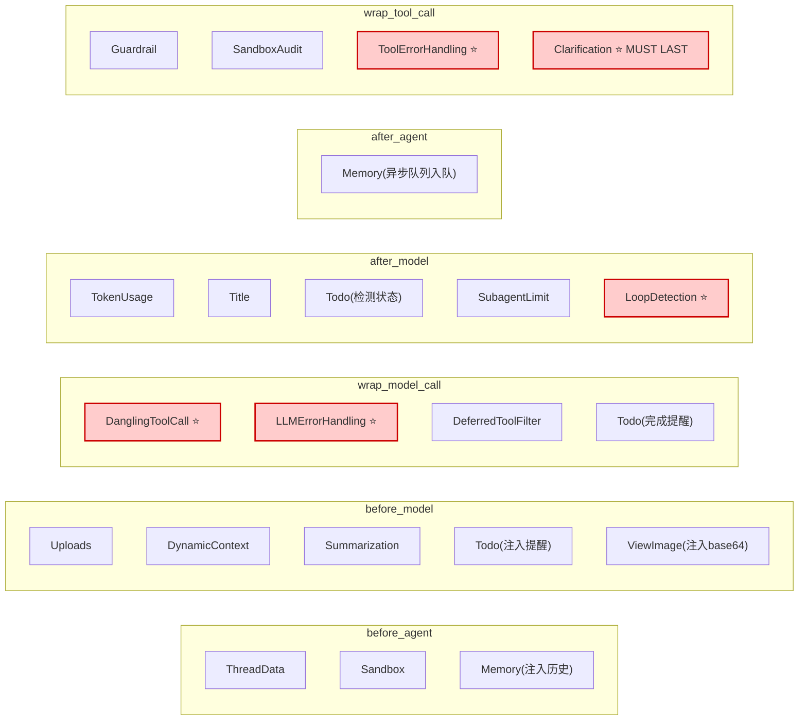

# 11 · 18 个中间件全景与执行顺序

> 核心模块层第 2 篇。10 章把 `make_lead_agent` 内部 100 行的"工厂装配"讲完，本章把其中最重要的一步 —— `_build_middlewares` —— 拉开来讲清。
>
> 这是后续 12 / 13 / 14 三章"中间件深潜系列"的**路由地图**。你不需要现在就理解每个中间件的内部细节，但读完本章你应该能在 **白板上 1 分钟内默写出 18 个中间件的执行顺序，并解释为什么 `ClarificationMiddleware` 必须最后**。

---

## 🎯 学习目标

读完这份文档，你能回答：

1. **DeerFlow 中间件链是"两阶段装配"**：`build_lead_runtime_middlewares`（runtime 共享基础链）+ `_build_middlewares`（lead-only 扩展）。**两阶段拆分的工程动机**是什么？哪些中间件在 lead-agent 和 subagent 之间共享？哪些只能 lead 用？
2. **中间件链 18+ 个位置，每个位置的相邻关系都不可调换**。**用 3 个"如果调换会怎样"的反例**说明这个顺序的不可变性。
3. **`ClarificationMiddleware` 为什么必须最后**？如果把 SubagentLimit 放它后面会出什么 bug？
4. **配置驱动的可选中间件**（Guardrail / Summarization / TodoList / TokenUsage / DeferredToolFilter / SubagentLimit / LoopDetection）—— 它们的 "enabled 开关" 配在哪？什么场景下被启用？
5. **同一个中间件可能同时注册 `before_model` / `after_model` / `wrap_model_call` 三个钩子**（如 TodoMiddleware）。LangChain `create_agent` 实际把它装成几个 graph 节点？

---

## 🗂️ 源码定位

| 关注点 | 文件 / 行号 | 关键锚点 |
|---|---|---|
| 两阶段装配总入口 | `packages/harness/deerflow/agents/lead_agent/agent.py` | `_build_middlewares` L240-L318 |
| 阶段 1：runtime 共享基础链 | `packages/harness/deerflow/agents/middlewares/tool_error_handling_middleware.py` | `build_lead_runtime_middlewares` / `build_subagent_runtime_middlewares` / 内部实现 `_build_runtime_middlewares` |
| 阶段 2：lead-only 扩展 | `lead_agent/agent.py` L260-L317 | DynamicContext → Summarization → TodoList → TokenUsage → Title → Memory → ViewImage → DeferredToolFilter → SubagentLimit → LoopDetection → Custom → Clarification |
| 18 个中间件源文件 | `packages/harness/deerflow/agents/middlewares/` | 17 个 middleware .py + 1 个 `tool_call_metadata.py` 工具模块；外加 `sandbox/middleware.py::SandboxMiddleware`（在 sandbox/ 目录） |
| SandboxMiddleware（不在 middlewares/ 子目录） | `packages/harness/deerflow/sandbox/middleware.py` | 与其他 middleware 同协议但放沙箱模块内 |

---

## 🧭 架构图

### 1. 两阶段装配的完整顺序（19+ 位置）

```mermaid
flowchart TB
    subgraph STAGE1["阶段 1 · build_lead_runtime_middlewares<br/>(与 subagent 共享的 runtime 基础链)"]
        S1A["1 ThreadDataMiddleware<br/>(per-thread 目录 + user_id 解析)"]
        S1B["2 UploadsMiddleware ⭐ lead-only<br/>(注入 uploaded_files 块)"]
        S1C["3 SandboxMiddleware<br/>(acquire/release 沙箱)"]
        S1D["4 DanglingToolCallMiddleware<br/>(wrap_model_call: 补占位 ToolMessage)"]
        S1E["5 LLMErrorHandlingMiddleware<br/>(wrap_model_call: provider 错误归一化)"]
        S1F["6 GuardrailMiddleware? (optional)<br/>(工具调用前置鉴权)"]
        S1G["7 SandboxAuditMiddleware<br/>(命令审计)"]
        S1H["8 ToolErrorHandlingMiddleware<br/>(wrap_tool_call: 工具异常→ToolMessage)"]
    end

    subgraph STAGE2["阶段 2 · _build_middlewares lead-only<br/>(从 lead_agent/agent.py 继续往后追加)"]
        S2A["9 DynamicContextMiddleware<br/>(注入日期/记忆到 first HumanMessage)"]
        S2B["10 SummarizationMiddleware? (optional)<br/>(配置驱动:summarization.enabled)"]
        S2C["11 TodoMiddleware? (optional)<br/>(配置:is_plan_mode)"]
        S2D["12 TokenUsageMiddleware? (optional)<br/>(配置:token_usage.enabled)"]
        S2E["13 TitleMiddleware<br/>(after_model: 首轮自动标题)"]
        S2F["14 MemoryMiddleware<br/>(异步队列入队)"]
        S2G["15 ViewImageMiddleware? (optional)<br/>(模型 supports_vision 才挂)"]
        S2H["16 DeferredToolFilterMiddleware? (optional)<br/>(配置:tool_search.enabled)"]
        S2I["17 SubagentLimitMiddleware? (optional)<br/>(配置:subagent_enabled)"]
        S2J["18 LoopDetectionMiddleware? (optional)<br/>(配置:loop_detection.enabled)"]
        S2K["—— custom_middlewares (extension point)"]
        S2L["⭐ 最后:ClarificationMiddleware<br/>(wrap_tool_call: ask_clarification → Command(goto=END))"]
    end

    S1A --> S1B --> S1C --> S1D --> S1E --> S1F --> S1G --> S1H
    S1H -.-> S2A
    S2A --> S2B --> S2C --> S2D --> S2E --> S2F --> S2G --> S2H --> S2I --> S2J --> S2K --> S2L

    classDef shared fill:#fff2cc,stroke:#d6b656
    classDef leadOnly fill:#e1f5e1,stroke:#4a8e4a
    classDef must fill:#ffcccc,stroke:#cc0000,stroke-width:3px
    class S1A,S1C,S1D,S1E,S1G,S1H shared
    class S1B,S2A,S2E,S2F leadOnly
    class S2L must
```



### 2. 钩子分布对照表（哪个中间件挂哪个钩子）



> **6 个钩子全部被用到**。`wrap_model_call` 和 `wrap_tool_call` 这两个 around 钩子最适合"包裹 + 错误恢复"类逻辑；`before_model` 和 `after_model` 适合"上下文注入 + 响应监控"；`before_agent` / `after_agent` 一次性事件。

---

## 🔍 核心逻辑讲解

### Part 1 · 为什么是"两阶段装配"？

打开 `lead_agent/agent.py::_build_middlewares` L258-L259：

```python
def _build_middlewares(config, model_name, agent_name=None, custom_middlewares=None, *, app_config=None):
    resolved_app_config = app_config or get_app_config()
    middlewares = build_lead_runtime_middlewares(app_config=resolved_app_config, lazy_init=True)
    # ↑ 阶段 1:从 tool_error_handling_middleware.py 拉一条"runtime 共享基础链"

    middlewares.append(DynamicContextMiddleware(...))
    # ↑ 阶段 2:lead-only 的扩展
    ...
```

打开 `tool_error_handling_middleware.py::build_lead_runtime_middlewares`：

```python
def build_lead_runtime_middlewares(*, app_config: AppConfig, lazy_init: bool = True) -> list[AgentMiddleware]:
    return _build_runtime_middlewares(
        app_config=app_config,
        include_uploads=True,                     # lead 才有 uploads
        include_dangling_tool_call_patch=True,
        lazy_init=lazy_init,
    )

def build_subagent_runtime_middlewares(*, app_config=None, model_name=None, lazy_init=True):
    middlewares = _build_runtime_middlewares(
        app_config=app_config,
        include_uploads=False,                    # subagent 没有 uploads(独立上下文)
        include_dangling_tool_call_patch=True,
        lazy_init=lazy_init,
    )
    # 视模型而定再加 ViewImage
    if model_config is not None and model_config.supports_vision:
        middlewares.append(ViewImageMiddleware())
    return middlewares
```

**两阶段拆分的工程动机**：

| 共享的需求（阶段 1） | lead-only 的需求（阶段 2） |
|---|---|
| 沙箱、thread 目录、user_id 解析 | 上传文件注入（subagent 看不到主对话的上传） |
| 错误恢复（dangling tool_call、LLM 错误、工具错误） | Title 生成（只主对话才显示标题） |
| 安全审计（guardrail + sandbox_audit） | Memory（subagent 不写主记忆） |
| 上下文恢复（这些是 agent 运行的"基础设施"） | Summarization（subagent 上下文短，不用压） |
| | Todo（计划模式只 lead 有） |
| | Subagent 限并发（subagent 套娃禁止） |
| | LoopDetection（subagent 自己的循环检测） |
| | Clarification（主入口才能 ask user） |

**核心观察**：**阶段 1 是"agent 安全运行的最小集"**，阶段 2 是"主对话 UX 增强 + 业务逻辑"。subagent 复用阶段 1 但不复用阶段 2 —— 这是 17 章 Subagent 系统会展开的关键设计。

→ **同时也是"DRY 原则"**：错误恢复 / 沙箱审计这种横切关注点不能在 lead 和 subagent 各写一遍，必须共享。

### Part 2 · 18+ 个位置的顺序为什么不可调换

**先看 mermaid 图**给定的顺序，然后逐条解释**核心相邻约束**：

#### ① `ThreadDataMiddleware` 必须最前

**原因**：它在 `before_agent` 阶段创建 per-thread 目录 + 解析 `user_id`。后续所有中间件（Uploads、Sandbox、Memory）都依赖 `state["thread_data"]` 或 `user_id` 已就绪。
**反例**：把 SandboxMiddleware 放它前面 → SandboxMiddleware 想用 `thread_data.workspace_path` 拼沙箱挂载点 → 找不到字段 → 沙箱在错误目录初始化。

#### ② `SandboxMiddleware` 必须在 ThreadDataMiddleware 之后、工具触发之前

**原因**：所有工具（bash / read_file / write_file / present_files）都需要 `state["sandbox"].sandbox_id` 已就绪。
**反例**：把 SandboxMiddleware 放 ToolErrorHandling 后面 → tool 还没 sandbox 就开始用 → AttributeError。

#### ③ `DanglingToolCallMiddleware` 必须在 LLMError 之前

**原因**：DanglingToolCall 用 `wrap_model_call` **修补 messages 序列**（补占位 ToolMessage），再调 `handler(request)` 进 LLM。如果先走 LLMError 包裹，LLMError 在外层捕获 provider 报"messages 不合法"错误时，没机会让 DanglingToolCall 修补 → 永远死循环。
**反例**：调换顺序 → 第一次启动一个被中断的 conversation 时直接 ProviderError 抛出 → run 失败而不是被恢复。

#### ④ `LLMErrorHandlingMiddleware` 必须在 model 调用最外层

**原因**：它要捕获**所有**provider 异常（包括 DanglingToolCall 修补失败后的）。**洋葱最外层**才能 catch all。
**反例**：放在 SummarizationMiddleware 之后 → Summary 调用 LLM 时如果挂了，没被这一层捕获 → 异常上抛 → run 失败。

#### ⑤ `GuardrailMiddleware` 必须在工具调用闸门、SandboxAudit 之前

**原因**：guardrail 决定"该 tool_call 该不该跑"。如果放在 SandboxAudit 之后，等于"先记录 audit log 再拒绝" —— 不一致。
**反例**：被恶意拒绝的命令仍然进了 audit log → 噪音。

#### ⑥ `SandboxAuditMiddleware` 必须在 ToolErrorHandling 之前

**原因**：audit 必须记录 **"实际进入沙箱的"** 命令，不应被 ToolErrorHandling 包装后的错误污染。
**反例**：调换 → audit log 看到的 command 字段会被 ToolError 改写成错误消息。

#### ⑦ `SummarizationMiddleware` 必须在 model 调用前、UploadsMiddleware 之后

**原因**：Summary 需要看到完整的 messages（含 uploaded_files 块）才决定压缩；它要修改 messages 让 LLM 看裁剪后版本。
**反例**：放 Uploads 前 → Summary 决定保留某些 messages，结果 Uploads 又把 uploaded_files 块加在最前 → 占用窗口 → 压缩白做。

#### ⑧ `DynamicContextMiddleware` 必须在 first HumanMessage 处理时早注入

**原因**：日期 / 记忆作为 `<system-reminder>` 注入到 first HumanMessage。**前面的中间件如果改了 messages 顺序（如 Uploads 把 uploaded_files 块插到 HumanMessage 内），DynamicContext 必须能找到正确的"first HumanMessage"**。
**反例**：放 Uploads 之前 → DynamicContext 把日期注入了，然后 Uploads 又在前面塞一段 → 顺序反了。

#### ⑨ `SubagentLimitMiddleware` 必须在 `after_model`，先于 LoopDetection

**原因**：SubagentLimit 在 `after_model` 截断超额 `task` 调用；它修改 AIMessage 的 `tool_calls` 列表。LoopDetection 也在 `after_model` 检查 tool_calls 是否重复 —— **如果 LoopDetection 先跑，看到的是 LLM 原始 N 个 task 调用，可能误判重复**。
**反例**：调换顺序 → LoopDetection 命中"6 个相同 task 调用看起来是循环"，硬停了一个本该截断到 3 个就 OK 的正常 fan-out。

#### ⑩ `ClarificationMiddleware` 必须最后

**原因**：它注册 `wrap_tool_call`，拦截 `ask_clarification` 工具 → 返回 `Command(goto=END)` 提前路由。
- 在它**之后**注册的任何 `wrap_tool_call` 钩子都会被"屏蔽" —— LangChain 的 wrap 链是嵌套式的，最后注册 = 最外层包裹 = 最先被调
- 反过来说：**如果它不是最后**，会被它后面的 `wrap_tool_call` 拦截 → ask_clarification 永远 short-circuit 不到 END

**反例**：把 SubagentLimit（没有 wrap_tool_call 但有 after_model）放到 Clarification 后面 → SubagentLimit 的 after_model 在 ClarificationMiddleware 的 wrap_tool_call 之前还是之后？这取决于 LangChain 的执行顺序：`after_model` 在 tool 调用前发生；`wrap_tool_call` 在 tool 调用环节才生效 —— **不会冲突**。但本章保守原则：**习惯性把所有 short-circuit / 路由控制类中间件放最后**，避免任何顺序 bug。

→ DeerFlow 代码注释（agent.py L317）写得很白：

```python
# ClarificationMiddleware should always be last
middlewares.append(ClarificationMiddleware())
```

### Part 3 · 6 个钩子全部用到，但每个中间件挂 1-3 个

打开几个有代表性的中间件：

**只挂 1 个钩子**（最简单情况）：
- `ThreadDataMiddleware` → 只挂 `before_agent`（一次性创建目录）
- `TokenUsageMiddleware` → 只挂 `after_model`（每轮记录 token）
- `SubagentLimitMiddleware` → 只挂 `after_model`（截断 tool_calls）

**挂 3 个钩子**（最复杂情况）：
- `TodoMiddleware`：
  - `before_model` —— 检测"上轮没 todos 但本轮该有"的 gap，主动注入提醒
  - `after_model` —— 检测 LLM 是否发了 write_todos 调用
  - `wrap_model_call` —— 注入"任务完成时记得更新 todos" 提醒到 request

**挂 2 个钩子**（中等）：
- `MemoryMiddleware`：
  - `before_agent` —— 把 memory 注入 system_reminder（实际是 DynamicContextMiddleware 接手，但内部数据准备在 Memory）
  - `after_agent` —— 把对话入队到 MemoryQueue 异步抽取（20 章详讲）

→ **LangChain `create_agent` 装图时**：每个中间件 × 它声明的钩子数 = 独立 graph 节点数。所以 18 个中间件可能产出 25-30 个独立节点。**LangSmith trace 上你会看到 SubagentLimitMiddleware.after_model 这种节点名 —— 这是可观测性的基础**（02 章已经讲过）。

### Part 4 · 配置驱动的可选中间件 7 个

| 中间件 | 配置开关 | 默认 | 启用场景 |
|---|---|---|---|
| `GuardrailMiddleware` | `guardrails.enabled` + `guardrails.provider` | 关 | 工具调用前置鉴权（生产合规） |
| `SummarizationMiddleware` | `summarization.enabled` | 关 | 长会话 token 控制 |
| `TodoMiddleware` | `is_plan_mode`（per-run） | 关 | 用户显式开"计划模式" |
| `TokenUsageMiddleware` | `token_usage.enabled` | 关 | 需要计费 / 用量监控 |
| `ViewImageMiddleware` | 模型 `supports_vision` | 自动 | 模型支持视觉时自动挂 |
| `DeferredToolFilterMiddleware` | `tool_search.enabled` | 关 | 工具数量爆炸时，按需暴露 |
| `SubagentLimitMiddleware` | `subagent_enabled`（per-run） | 关 | 任务编排模式 |
| `LoopDetectionMiddleware` | `loop_detection.enabled` | 开 | 死循环熔断（默认开） |

**注意**：`is_plan_mode` 和 `subagent_enabled` 是 **per-run** 开关（从 `cfg.configurable` 取），不是全局配置。这让前端能让用户**逐对话** 切换。

**`tool_search.enabled` + `subagent_enabled` 同时开启**会有什么效果？
- DeferredToolFilter 把 deferred tool schemas 隐藏掉，model prompt 体积变小
- 但 LLM 真要用 deferred tool 时，需要先调一个 "tool_search" meta-tool 找出来 → 多一步往返
- 适用于"工具数 >50"的大型环境

### Part 5 · 与 02 章的呼应：实际有多少 graph 节点？

回看 02 章：LangChain `create_agent` 给每个中间件**每个真正实现的钩子**创建一个 graph 节点（命名 `{middleware_name}.{hook_name}`）。

以 DeerFlow 默认配置（不开 plan / subagent / guardrail / summarization）估算实际节点数：

| 阶段 | 必有中间件 × 钩子数 | 节点小计 |
|---|---|---|
| Stage 1 | ThreadData(1) + Uploads(1) + Sandbox(1) + DanglingToolCall(1 wrap) + LLMError(1 wrap) + SandboxAudit(1 wrap_tool) + ToolError(1 wrap_tool) | 7 |
| Stage 2 | DynamicContext(1) + Title(1) + Memory(2) + LoopDetection(1) + Clarification(1 wrap_tool) | 6 |
| 加 model 节点 + tools 节点 | | 2 |

**最小配置 ≈ 15 个节点**。开了 plan + subagent + token_usage + summarization + guardrail 后能堆到 25+ 节点。**LangSmith 上看到的"洋葱"层数大致就是这个数字**。

---

## 🧩 体现的通用 Agent 设计模式

| 模式 | DeerFlow 中的体现 |
|---|---|
| **Layered Middleware Pipeline**（分层中间件管道） | 两阶段装配：runtime base + lead 扩展 |
| **Shared-Runtime + Per-Role Extension**（共享 runtime + 角色扩展） | lead / subagent 共享阶段 1，分别加各自阶段 2 |
| **Sentinel-Order Constraint**（最后位约束） | ClarificationMiddleware 必须最后 |
| **Reflection-driven Optional Middleware**（反射驱动可选挂载） | GuardrailMiddleware 走 `resolve_variable(guardrails_config.provider.use)` |
| **Lazy Init**（延迟初始化） | `lazy_init=True` 让中间件实例化时不立刻分配重资源 |
| **Hook Composition**（钩子组合） | TodoMiddleware 同时挂 before_model / after_model / wrap_model_call |

---

## 🧱 与 Agent Harness 六要素的对应关系

| 六要素 | 全链覆盖度 |
|---|---|
| ① 反馈循环 | LoopDetection（hard-stop）+ DanglingToolCall（修补序列）+ ClarificationMiddleware（主动暂停） |
| ② 记忆持久化 | Memory（异步入队）+ Summarization（裁剪历史） |
| ③ 动态上下文 | DynamicContext + ViewImage + Uploads + Summarization |
| ④ 安全护栏 | Guardrail（工具白名单）+ SandboxAudit（命令审计）+ LoopDetection（成本封顶） |
| ⑤ 工具集成 | DeferredToolFilter（按需暴露）+ ToolError（异常恢复）+ SubagentLimit（并发上限） |
| ⑥ 可观测性 | TokenUsage（计费）+ Title（人类可读 trace 标签）+ 所有钩子各自变独立 graph 节点 |

---

## ⚠️ 常见坑与调试技巧

### 坑 1 · 新加中间件忘了考虑顺序

**症状**：你写一个 `MyAuditMiddleware` 加在末尾，但发现 Guardrail 拒绝的调用没经过你的 audit。
**原因**：Guardrail 在阶段 1，提前 short-circuit 返回错误 ToolMessage → 后续中间件链根本不跑你的 audit。
**修复**：把 audit 放阶段 1 的 Guardrail **之前**；或者放在 `wrap_tool_call` 闭包里包裹 handler 而不是单独的中间件。

### 坑 2 · `lazy_init=True` 引发的初始化先后问题

`_build_runtime_middlewares` 默认 `lazy_init=True` —— ThreadData 和 Sandbox 不在构造时分配资源（连接池 / 文件句柄），而是第一次 `before_agent` 才分配。**好处**：避免 LangGraph Studio 加载 graph 时崩。**坏处**：第一次 invocation 比后续慢。
**调试**：跑 `make_lead_agent` 之后单独 hit `agent.invoke({"messages": [...]})` 计时，第一次 vs 第二次 latency 差距明显。

### 坑 3 · 自定义中间件破坏 ClarificationMiddleware 顺序

`_build_middlewares` 接受一个 `custom_middlewares: list[AgentMiddleware] | None = None` 参数（L243）：

```python
if custom_middlewares:
    middlewares.extend(custom_middlewares)

# ClarificationMiddleware should always be last
middlewares.append(ClarificationMiddleware())
```

**注意**：custom middlewares 注入在 Clarification **之前** —— **DeerFlow 强制保护了"Clarification 最后"的不变量**。但如果你自己实现一个变种 `make_lead_agent`，**别忘了这条约束**。

### 坑 4 · ViewImageMiddleware 条件挂载导致 trace 不一致

```python
model_config = resolved_app_config.get_model_config(model_name) if model_name else None
if model_config is not None and model_config.supports_vision:
    middlewares.append(ViewImageMiddleware())
```

**症状**：同样的 thread，两次跑 trace 形状不一样（节点数不同）—— 因为第一次用了 vision 模型，第二次切到非 vision 模型。
**调试**：在 LangSmith 看 trace 时按 `model_name` metadata 分组，**别把不同 model 的 trace 直接对比**。

### 坑 5 · `tool_call_metadata.py` 不是中间件

`packages/harness/deerflow/agents/middlewares/tool_call_metadata.py` 是个**工具模块**（不是 Middleware 子类），提供给 LoopDetection / SubagentLimit 等共用"解析 AIMessage.tool_calls"的辅助函数。
**调试 tip**：grep 中间件源码时如果 grep "class.*Middleware" 漏了它，正确 —— 它本来就不是中间件。

---

## 🛠️ 动手实操

> 本 demo 把"真实跑起来的中间件链"打印出来 + 验证顺序不变量。**不依赖任何 LLM 调用**。

### Demo · 实际中间件链 introspection

```python
"""
中间件链 introspection demo.

跑法:  PYTHONPATH=backend uv run python scripts/middleware_chain_introspect.py

5 个分析:
1. 默认配置下的链:每个中间件 + 挂的钩子 + 序号
2. 改 RunnableConfig(打开 subagent / plan_mode / loop_detection),链怎么变
3. 验证 ClarificationMiddleware 始终最后
4. 把 lead 链与 subagent 链对比,看共享/差异
5. 算每个中间件实际产出的 graph 节点数
"""
import sys, os
from pathlib import Path

sys.path.insert(0, "backend")
sys.path.insert(0, "backend/packages/harness")
os.chdir(Path(__file__).resolve().parents[1])

from langchain.agents.middleware import AgentMiddleware

from deerflow.agents.lead_agent.agent import _build_middlewares
from deerflow.agents.middlewares.tool_error_handling_middleware import (
    build_lead_runtime_middlewares,
    build_subagent_runtime_middlewares,
)
from deerflow.config.app_config import get_app_config


HOOK_NAMES = ["before_agent", "before_model", "wrap_model_call",
              "after_model", "after_agent", "wrap_tool_call"]


def overridden_hooks(m: AgentMiddleware) -> list[str]:
    """返回这个 middleware 实际覆盖(非默认空实现)的钩子."""
    overridden = []
    for hook in HOOK_NAMES:
        sync_fn = getattr(type(m), hook, None)
        async_fn = getattr(type(m), f"a{hook}", None)
        base_sync = getattr(AgentMiddleware, hook, None)
        base_async = getattr(AgentMiddleware, f"a{hook}", None)
        if sync_fn is not base_sync or async_fn is not base_async:
            overridden.append(hook)
    return overridden


def print_chain(label: str, chain: list[AgentMiddleware]) -> None:
    print(f"\n=== {label} (共 {len(chain)} 个中间件) ===")
    total_nodes = 0
    for i, m in enumerate(chain, 1):
        hooks = overridden_hooks(m)
        total_nodes += len(hooks)
        hook_str = ", ".join(hooks) or "(no hooks!?)"
        print(f"  {i:>2}. {type(m).__name__:<32}  hooks: {hook_str}")
    # +2 for "model" and "tools" node
    print(f"   ⇒ 估算 graph 节点数(中间件 hook 节点 + model + tools): {total_nodes + 2}")


app_config = get_app_config()


# ====== 1. 默认配置 ======
print("\n" + "=" * 70)
print("CASE 1 · 默认配置(不开 plan / subagent / token_usage / loop_detection)")
print("=" * 70)
chain = _build_middlewares({"configurable": {}}, model_name=None, app_config=app_config)
print_chain("默认", chain)


# ====== 2. 打开多个可选中间件 ======
print("\n" + "=" * 70)
print("CASE 2 · 打开 is_plan_mode + subagent_enabled")
print("=" * 70)
chain = _build_middlewares(
    {"configurable": {"is_plan_mode": True, "subagent_enabled": True}},
    model_name=None,
    app_config=app_config,
)
print_chain("plan + subagent", chain)


# ====== 3. 验证 ClarificationMiddleware 始终最后 ======
print("\n" + "=" * 70)
print("CASE 3 · ClarificationMiddleware MUST be last (不变量)")
print("=" * 70)
configs = [
    {"label": "默认", "cfg": {}},
    {"label": "plan_mode", "cfg": {"is_plan_mode": True}},
    {"label": "subagent_enabled", "cfg": {"subagent_enabled": True}},
    {"label": "+ custom",  # 测试 custom_middlewares 注入
     "cfg": {},
     "custom": True},
]

class DummyAuditMiddleware(AgentMiddleware):
    def after_model(self, state, runtime):
        return None

for c in configs:
    custom = [DummyAuditMiddleware()] if c.get("custom") else None
    chain = _build_middlewares({"configurable": c["cfg"]}, model_name=None,
                               custom_middlewares=custom, app_config=app_config)
    last = type(chain[-1]).__name__
    ok = "✅" if last == "ClarificationMiddleware" else "❌"
    print(f"  [{c['label']:<24}] 末位 = {last:<28} {ok}")


# ====== 4. lead 链 vs subagent 链对比 ======
print("\n" + "=" * 70)
print("CASE 4 · lead 链 vs subagent 链 对比")
print("=" * 70)

lead_runtime = build_lead_runtime_middlewares(app_config=app_config)
sub_runtime = build_subagent_runtime_middlewares(app_config=app_config)

lead_names = {type(m).__name__ for m in lead_runtime}
sub_names = {type(m).__name__ for m in sub_runtime}

print(f"  lead 阶段 1 (runtime base): {[type(m).__name__ for m in lead_runtime]}")
print(f"  sub  阶段 1 (runtime base): {[type(m).__name__ for m in sub_runtime]}")

print(f"\n  仅 lead 独有: {lead_names - sub_names}  (应含 Uploads)")
print(f"  仅 sub  独有: {sub_names - lead_names}  (可能含 ViewImage,如果当前模型有 vision)")


# ====== 5. 节点数估算对比 ======
print("\n" + "=" * 70)
print("CASE 5 · 不同配置下 graph 节点数对比")
print("=" * 70)

configs = [
    ({}, "最小"),
    ({"is_plan_mode": True}, "+ plan"),
    ({"subagent_enabled": True}, "+ subagent"),
    ({"is_plan_mode": True, "subagent_enabled": True}, "+ plan + subagent"),
]
for cfg, label in configs:
    chain = _build_middlewares({"configurable": cfg}, model_name=None, app_config=app_config)
    nodes = sum(len(overridden_hooks(m)) for m in chain) + 2
    print(f"  {label:<22}  {len(chain)} 中间件 → 约 {nodes} 个 graph 节点")
```

### 调试任务

1. **断点位置**：
   - `lead_agent/agent.py::_build_middlewares` 整段（L240-L318）—— 在每个 `middlewares.append(...)` 处停，观察当前链长度
   - `tool_error_handling_middleware.py::_build_runtime_middlewares` —— 在 `if include_uploads:` 那条分支停，看 lead vs subagent 差异
2. **观察什么**：
   - Case 1 中默认配置下中间件数（约 10-13 个）
   - Case 2 中加 plan + subagent 后增加了几个（约 +2-3）
   - Case 3 中 4 种配置最后位都是 ClarificationMiddleware
   - Case 4 中 `Uploads` 只在 lead 出现；ViewImage 在 sub 也出现（如果模型支持 vision）
3. **人为制造异常**：
   - 在 `_build_middlewares` 手动改顺序：把 `ClarificationMiddleware` append 改成 insert(0)（最前）。再跑一个真实 chat，看是否还能正确触发 ask_clarification → END。**预期失败**（验证顺序约束的必要性）
   - 把 `ThreadDataMiddleware` 移到 SandboxMiddleware 之后 → 用 LocalSandboxProvider 跑一个调用 `present_files` 的 chat → 看是否能找到 thread 目录（可能错位）

### 改造练习

1. **练习 A（简单）**：写一个 lint：在 `_build_middlewares` 返回前断言 `isinstance(middlewares[-1], ClarificationMiddleware)`，防止有人无意改顺序破坏不变量。
2. **练习 B（中等）**：把"两阶段装配"改成"三阶段"—— 引入 "stage 0: pre-init"（如 `EnvCheckMiddleware`），让 ThreadData / Sandbox 之前能跑一些"启动期校验"。**注意**：阶段 0 不能改 state，只能 raise（fail-fast）。
3. **挑战题**：写一个 "中间件依赖图分析器" —— 静态扫描每个 Middleware 类的 `before_*` / `after_*` 方法体，看它读写哪些 state 字段，**自动生成"必须排在前后"的约束图**。这能让"加新中间件"变成"自动检查顺序合法性"的工程。

### 预期输出 & 验证方式

- Case 1 默认链：含 ThreadData / Uploads / Sandbox / DanglingToolCall / LLMError / SandboxAudit / ToolError / DynamicContext / Title / Memory / LoopDetection / Clarification（约 12 个）
- Case 2 加 plan + subagent：多出 TodoMiddleware + SubagentLimitMiddleware（约 14 个）
- Case 3 末位 4 次都是 ClarificationMiddleware ✅
- Case 4 `Uploads` 在 lead 独有列出
- Case 5 节点数随配置增长但保持在合理范围（15-30）

---

## 🎤 面试视角

### 业务型大厂卷

**问 1**：DeerFlow 的中间件链 18+ 个位置都有严格顺序约束。**你觉得这种"约束都在代码里 + 注释解释"** vs **"显式 dependency graph + 自动拓扑排序"** 哪个更好？

> **教科书答案**：
> "代码里 + 注释"的优势：
> - 简单直接，新人读代码看顺序就懂
> - 启动 0 开销
> - 改顺序的 PR 是显式的，code review 容易
> "显式 dependency graph"的优势：
> - 加新中间件时不用手动确定位置，声明依赖就行
> - 自动检测"环依赖" / "顺序冲突"
> - 适合中间件数量超 50 的大型系统
> **DeerFlow 当前合理**：18 个中间件，每周可能加 1 个，**人工维护 + lint 守护足够**。如果哪天涨到 50+，再考虑 graph-based。
> **加分项**：指出可以用一个"约束断言层"（如本章练习 A 的 ClarificationMiddleware 末位 assert）作为中间形态 —— 不上拓扑排序但加几条 invariant assertion。

**问 2**：DeerFlow 的"两阶段装配"让 lead / subagent 共享 runtime base 中间件。**你能想到 3 个反例**（看似该共享但实际不该）吗？

> **教科书答案**：
> 看似该共享但不该的反例：
> 1. **TokenUsageMiddleware** —— 看起来 subagent 也该计 token；但 DeerFlow 当前把它放阶段 2（lead-only），原因：subagent 的 token 通过 token_collector 回归到主调点统一计入，**单独计会重复**（23 章详讲）
> 2. **MemoryMiddleware** —— subagent 的对话是临时的（任务结束就丢），**写入主记忆会污染**用户长期偏好；只在 lead 写
> 3. **Clarification** —— subagent 无法和用户对话（它在后台）；如果它能 `Command(goto=END)` 提前终止，整个 task tool 会异常结束 —— 必须 lead-only
> **共性原则**：**有"长期副作用"或"需要 user 在线"的中间件不能共享给 subagent**。subagent 是"短任务"，应该只用与之 lifespan 一致的中间件。

### 创业型 AI 公司卷

**问 3**：你接到任务 "给 DeerFlow 加一个 PII（个人信息）脱敏中间件" —— 在 LLM 看到 messages 之前把社保号 / 信用卡号脱敏。**你会插到哪个位置？为什么不放最前？**

> **参考答案**：
> 放在 **`before_model` 阶段，并且在 SummarizationMiddleware 之后、ViewImage 之后**。理由：
> 1. **不放最前（before_agent）**：用户上传的文件名 / sandbox 路径里可能有真实 PII，脱敏前不能让 ThreadData / Sandbox 用错路径
> 2. **不放 DanglingToolCall 之前**：DanglingToolCall 改 messages 时如果脱敏过早，**会改回去** —— 修补结果可能引入 plain-text PII
> 3. **必须在 Summarization 之后**：Summarization 调 LLM 时也要送脱敏内容；如果脱敏在 Summary 后，summary LLM 看到原始 PII → 写进 summary → 永久污染
> 4. **必须在 ViewImage 之后**：ViewImage 注入的 base64 内容本身不含 PII（image bytes），但有些产品会在 image caption 里加 PII —— 这个边界要看具体业务
> **最终位置**：`Uploads / DynamicContext / Summarization / Todo / ViewImage / PII 脱敏 / ...`
> **额外考虑**：脱敏的"还原"也要做（响应里如果模型回了脱敏 token 要还原为真实值给前端 / 不还原；这又涉及 `after_model` 钩子）。**可能需要一对配套中间件**。

**问 4**：DeerFlow 的 `custom_middlewares` extension point 让用户从外面注入中间件。**你能想到一个真实业务场景**用这个点吗？设计你的中间件挂哪些钩子。

> **参考答案**：
> 场景：**业务"敏感操作二次确认"** —— 用户调用 `transfer_money` 工具时，弹窗让用户确认。
> 中间件实现：
> - **`wrap_tool_call`**：拦截工具调用，如果是 `transfer_money` 工具，返回 `Command(goto=END, update={"messages": [...]})` 提示前端"请确认"
> - **`before_agent`**：检查 state 里有没有 user 已确认的 token，有就放行
> 挂载点：放 `custom_middlewares` 列表里，被 _build_middlewares 自动注入到 ClarificationMiddleware **之前** —— 这样 transfer_money 的拦截和 ask_clarification 的拦截各自独立，不互相干扰。
> **DeerFlow 当前架构非常欢迎这种扩展**，因为它不需要 fork 框架，只需要一个外部 module 提供中间件类 + 配置 / 启动钩子里把它加进 custom_middlewares。

---

## 📚 延伸阅读

- **02 章 LangChain `create_agent` 内部图构造**：现在你应该理解"中间件链 → graph 节点"的精确映射。
- **DeerFlow `tool_error_handling_middleware.py` 完整源码** —— 它的命名其实有点误导：除了 ToolErrorHandling 类外，**还包含 `_build_runtime_middlewares` / `build_lead_runtime_middlewares` / `build_subagent_runtime_middlewares` 三个工厂**，是整个"runtime 基础链"的真实源点。
- **DeerFlow `docs/middleware-execution-flow.md`**：项目内官方维护的中间件执行流图，与本章 mermaid 图对照看。
- **AOP / Aspect-Oriented Programming 综述** —— 中间件链是 AOP 在 agent 工程中的具体落地。看完后会理解"为什么 wrap_model_call 是 around advice"。

---

## 🎤 互动检查 —— 请回答这 3 个问题

> **两句话即可**。

1. **顺序约束题**：本章列了 10 条"前后顺序约束"。**挑 3 条**用你自己的话复述，并各举一个"如果调换会发生什么"的具体反例。
2. **共享设计题**：lead 和 subagent 阶段 1 共享 `DanglingToolCallMiddleware`。**给一个具体的 subagent 场景**说明它为什么需要这个中间件（subagent 看起来是新会话啊，怎么会有 dangling tool call？）
3. **应用题**：你的同事提了 PR：把 LoopDetectionMiddleware 移到 Stage 1（runtime base）让 subagent 也用上。**这个改动好不好**？给一个理由。

回答后我们进入 **`12-middleware-deep-1-context-injection.md`** —— 上下文注入三件套（ThreadData / Uploads / Sandbox）深潜。
