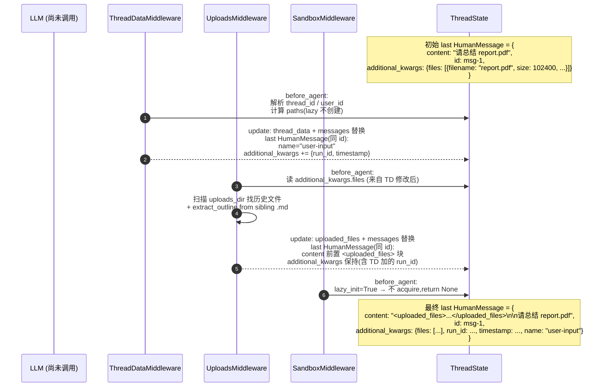
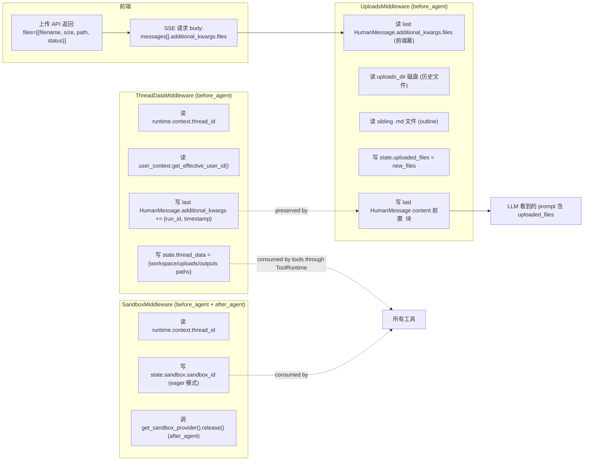

# 12 · 中间件深潜 ①：上下文注入三件套（ThreadData / Uploads / Sandbox）

> 核心模块层第 3 篇 —— **中间件深潜系列的第 1 季**。11 章给了 18+ 个中间件的全景执行顺序，本章把**位置 1-3 的"上下文注入三件套"** 拉到放大镜下。
>
> 这三个中间件全部挂 `before_agent`（一次性），加 SandboxMiddleware 还挂 `after_agent` —— 它们是 agent 启动时的"开机自检 + 资源准备 + 运行环境注入"，决定了后续所有中间件 / 工具能看到什么。
>
> 关键看点：**两个中间件同时改 last HumanMessage 而不冲突的链式协议**、**lazy_init 性能优化**、**HumanMessage `additional_kwargs` 同时承载"前端→后端"和"后端→前端"双向信息的设计**。

---

## 🎯 学习目标

读完这份文档，你能回答：

1. **ThreadData 改 last HumanMessage 加 run_id/timestamp，Uploads 又改一次加 `<uploaded_files>` 块** —— 两次写为什么不会**互相覆盖**？依赖了 LangGraph 的什么机制？
2. **`lazy_init=True` 是 DeerFlow 的默认值**。为什么"默认延迟初始化"？什么场景下应该改成 `eager`？
3. **`UploadsMiddleware` 读 `additional_kwargs.files`** —— 这个字段是**谁写进去的**？前端怎么把"刚上传的文件" 告诉后端的？
4. **`UploadsMiddleware` 同时读取"新文件（kwargs）"和"历史文件（磁盘扫描）"**。两者为什么不能合并成一个？历史文件每轮都重新扫盘，性能问题吗？
5. **SandboxMiddleware 在 `after_agent` 释放 sandbox**，但注释又说"sandbox 跨多轮复用"。这里矛盾吗？怎么调和？

---

## 🗂️ 源码定位

| 关注点 | 文件 / 行号 | 关键锚点 |
|---|---|---|
| ThreadDataMiddleware | `packages/harness/deerflow/agents/middlewares/thread_data_middleware.py` | `ThreadDataMiddlewareState` L18；`ThreadDataMiddleware` L23；`before_agent` L73；`_get_thread_paths` L40；`_create_thread_directories` L56 |
| SandboxMiddleware | `packages/harness/deerflow/sandbox/middleware.py` | `SandboxMiddlewareState` L13；`SandboxMiddleware` L19；`before_agent` L46；`after_agent` L66 |
| UploadsMiddleware | `packages/harness/deerflow/agents/middlewares/uploads_middleware.py` | `UploadsMiddlewareState` L63；`UploadsMiddleware` L70；`before_agent` L182；`_create_files_message` L92；`_files_from_kwargs` L143；`_extract_outline_for_file` L23 |
| 三件套装配顺序 | `agents/middlewares/tool_error_handling_middleware.py::_build_runtime_middlewares` | 默认 `[ThreadData, Sandbox]`；`include_uploads=True` 时 `insert(1, UploadsMiddleware)` —— 最终顺序 `[ThreadData, Uploads, Sandbox]` |
| user_id 解析 | `packages/harness/deerflow/runtime/user_context.py` | `get_effective_user_id()` —— 从 contextvar 拿（04 章详讲） |
| Paths（per-user 路径解析） | `packages/harness/deerflow/config/paths.py` | `Paths` / `get_paths()` / `sandbox_work_dir(thread_id, user_id)` |
| Sandbox provider（acquire/release） | `packages/harness/deerflow/sandbox/sandbox_provider.py` | `get_sandbox_provider()` —— 15 章详讲 |
| Outline 提取（markitdown 副产物） | `packages/harness/deerflow/utils/file_conversion.py::extract_outline` | 读 .md 同名文件的 H1-H6 标题 |
| HumanMessage `additional_kwargs.files` 数据来源 | `app/gateway/routers/uploads.py`（前端上传完成后写回响应） | 前端把上传 API 返回的 files 列表塞进下次 SSE 请求的 `input.messages[].additional_kwargs.files` |

---

## 🧭 架构图

### 1. 三件套在 before_agent 阶段的"链式改 message"



> **关键不变量**：两次 message 替换都**保留 `id="msg-1"`** → LangGraph `add_messages` reducer 识别为"同 message 的更新"而非"新增"，**state 中 messages 列表长度不变**。这是 03/07 章反复讲的不变量在此实战。

### 2. 三件套的"协议读写表"



---

## 🔍 核心逻辑讲解

### Part 1 · `ThreadDataMiddleware.before_agent`：thread 目录 + per-user 隔离 + 元数据注入

#### Step 1 · 解析 thread_id（双重兜底）

```python
context = runtime.context or {}
thread_id = context.get("thread_id")
if thread_id is None:
    config = get_config()
    thread_id = config.get("configurable", {}).get("thread_id")
if thread_id is None:
    raise ValueError("Thread ID is required in runtime context or config.configurable")
```

**两个来源**：
1. **`runtime.context`** —— 09 章讲过，是 `run_agent` worker 在 Step 3 注入的 `_build_runtime_context(thread_id, run_id, config.context, ctx.app_config)`
2. **`config.configurable.thread_id`** —— LangGraph 原生入口

**为什么双兜底？** —— DeerFlow 自己的 worker 走 `runtime.context`；但如果走 LangGraph Studio / 直接调 `astream(config=...)`（如 02 章 demo），`runtime.context` 可能没注入 → 退到 `configurable.thread_id`。

→ **不直接信赖单一来源**，是个鲁棒性的工程取舍。

#### Step 2 · 解析 user_id（contextvar）

```python
user_id = get_effective_user_id()
```

**关键**：`get_effective_user_id()` 从 contextvar 读，由 Gateway 的 `AuthMiddleware` 在请求入口写入（04 章 + 05 章 ambient context 模式）。**无认证模式下默认 `"default"`**。

为什么 user_id 不放 `runtime.context` 而走 contextvar？—— 04 章已经讲过：避免污染 graph state schema。**user_id 是"环境量"，不是 graph 业务字段**。

#### Step 3 · lazy_init 路径计算 vs 立即创建

```python
if self._lazy_init:
    paths = self._get_thread_paths(thread_id, user_id=user_id)  # 只算路径,不 mkdir
else:
    paths = self._create_thread_directories(thread_id, user_id=user_id)  # 立即 mkdir
```

**默认 `lazy_init=True`**：仅计算路径字符串，**不**触发文件系统 IO。

**为什么默认 lazy？**
- 大多数 chat 不调任何沙箱工具 → 用户问个 "今天天气怎么样" → 不需要工作目录
- 文件系统 mkdir + 设权限的 cost ≈ 几 ms × 3 个目录 = 10ms 级
- 100 次 chat 中如果 90 次不用沙箱，那 900ms 的 IO 是浪费

**改成 eager 的场景**：
- 测试场景：要确保目录立刻存在，否则测试断言会乱
- 调试 / 演示：让"目录创建"是个显式可观察事件，方便排查

#### Step 4 · 重写 last HumanMessage 注入元数据

```python
last_message = messages[-1] if messages else None
if last_message and isinstance(last_message, HumanMessage):
    messages[-1] = HumanMessage(
        content=last_message.content,
        id=last_message.id,                   # ⭐ 保留 id 是关键
        name=last_message.name or "user-input",
        additional_kwargs={
            **last_message.additional_kwargs,
            "run_id": runtime.context.get("run_id"),
            "timestamp": datetime.now(UTC).isoformat(),
        },
    )

return {"thread_data": {...paths...}, "messages": messages}
```

**关键设计点**：
1. **保留 `id`** —— 让 `add_messages` reducer 把这次返回当"替换"而非"新增"
2. **`name="user-input"`** —— LangChain `HumanMessage.name` 字段，让 LLM 能区分"用户输入"vs"插件输出的伪装用户消息"
3. **`additional_kwargs` 累积** —— `{**old, run_id, timestamp}`，**不**覆盖原有字段（如 `files`），是个浅合并

**为什么 timestamp + run_id 写到 message 而不是 state 顶层字段？**
- 这两个元数据"绑定到这条消息" —— 不是会话级状态
- 如果有人 fork 这条消息（如 LangGraph 时间旅行），元数据应该跟着走
- 写 state 顶层字段会被 SummarizationMiddleware 误删（messages 被压缩时元数据丢失）

### Part 2 · `UploadsMiddleware.before_agent`：双源读取 + outline 提取 + content 前置

#### Step 1 · 提取"本轮新上传"（来自 `additional_kwargs.files`）

```python
def _files_from_kwargs(self, message: HumanMessage, uploads_dir: Path | None = None) -> list[dict] | None:
    kwargs_files = (message.additional_kwargs or {}).get("files")
    if not isinstance(kwargs_files, list) or not kwargs_files:
        return None

    files = []
    for f in kwargs_files:
        if not isinstance(f, dict):
            continue
        filename = f.get("filename") or ""
        if not filename or Path(filename).name != filename:    # ⚠️ 路径穿越防御
            continue
        if uploads_dir is not None and not (uploads_dir / filename).is_file():
            continue                                            # ⚠️ 物理存在性校验
        files.append({...})
    return files if files else None
```

**两条安全防御**：
1. **`Path(filename).name != filename`** —— 防止前端塞 `"../../etc/passwd"` 这种**路径穿越**。要求 filename 是"纯文件名，无目录分隔符"。
2. **`(uploads_dir / filename).is_file()`** —— 前端可能塞"幻觉文件"（上传失败但前端还报了 success）；后端要校验**物理文件确实存在**才采纳。

#### Step 2 · 扫描"历史文件"（磁盘）

```python
if uploads_dir and uploads_dir.exists():
    for file_path in sorted(uploads_dir.iterdir()):
        if file_path.is_file() and file_path.name not in new_filenames:
            stat = file_path.stat()
            outline, preview = _extract_outline_for_file(file_path)
            historical_files.append({...})
```

**为什么要扫盘？** 用户可能：
- 第 1 条消息上传了 `report.pdf` → 第 2 条消息只问"总结一下" → **第 2 条 message 的 additional_kwargs.files 为空**
- 但 agent 应该仍能看到 `report.pdf` 在 uploads/ 里 → 必须扫盘

**性能**：每个 `before_agent` 触发一次目录遍历 + 每个文件读 outline。**如果用户在 thread 中累积了 100 个上传**，每轮 chat 会重复扫盘 100 次 —— 在长会话里是个隐性开销。

**优化路径**（DeerFlow 当前没做）：
- 缓存 `outline_preview` 到内存（key = file mtime）
- 限制扫描层数（如只看 10 个最近文件）
- 把 outline 计算移到上传接口的后台任务

#### Step 3 · `extract_outline` —— 从 markitdown 副产物拿目录

```python
def _extract_outline_for_file(file_path: Path) -> tuple[list[dict], list[str]]:
    md_path = file_path.with_suffix(".md")     # report.pdf → report.md
    if not md_path.is_file():
        return [], []

    outline = extract_outline(md_path)
    if outline:
        return outline, []

    # 无 heading 时 fallback 到前 5 行 preview
    preview: list[str] = []
    try:
        with md_path.open(encoding="utf-8") as f:
            for line in f:
                stripped = line.strip()
                if stripped:
                    preview.append(stripped)
                if len(preview) >= _OUTLINE_PREVIEW_LINES:
                    break
    except Exception:
        ...
    return [], preview
```

**架构假设**：DeerFlow 上传接口（`gateway/routers/uploads.py`）会自动调 `markitdown` 把 PDF/PPT/Excel/Word 转成同名 `.md` 文件（`report.pdf` → `report.md`）。本中间件**只读这个副产物**，不重新做转换。

**双路径降级**：
- 有 heading → 输出 outline（agent 看 H1/H2/H3 + 行号能精准定位）
- 无 heading → 输出前 5 行 preview（agent 至少看到"开头长什么样"）

**这是个典型的"用结构提升 LLM 工具使用效率"** —— 让 agent 知道"用 `read_file(path, line_start=120, line_end=180)` 直接读某段"，而不是"用 `read_file` 读全文然后 LLM 自己找"，节省大量 token。

#### Step 4 · 把 `<uploaded_files>` 块前置到 content

```python
original_content = last_message.content
if isinstance(original_content, str):
    updated_content = f"{files_message}\n\n{original_content}"
elif isinstance(original_content, list):
    # multimodal: content 是 list[dict] (含 image_url 等)
    files_block = {"type": "text", "text": f"{files_message}\n\n"}
    updated_content = [files_block, *original_content]
```

**两种 content 形态处理**：
- **`str`**：纯文本 user message → 简单拼接
- **`list`**：multimodal（含 image_url / file 等 block） → 用 text block 前置

**为什么前置而不是新加一条 SystemMessage 或 ToolMessage？**
- 不破坏对话历史结构（前端展示侧仍然是"用户问了 N 条，AI 答了 M 条"）
- 让 LLM 觉得 uploaded_files 信息**与用户问题强相关**（同一条消息里，注意力天然连接）
- Prompt cache 友好：固定前缀 `<uploaded_files>...</uploaded_files>` 在多轮中可被部分缓存

**最关键的一行**：

```python
updated_message = HumanMessage(
    content=updated_content,
    id=last_message.id,                          # ⭐ 保留 id
    name=last_message.name,
    additional_kwargs=last_message.additional_kwargs,    # ⭐ 保留 ThreadData 加的 run_id/timestamp
)
```

**双重保留**：id 让 reducer 识别为替换；`additional_kwargs` 让 ThreadDataMiddleware 之前注入的 run_id / timestamp 不丢失。

→ **这就是 11 章讲的"顺序不可调换" 的实战体现**：UploadsMiddleware 必须在 ThreadDataMiddleware 之后，因为它**依赖 ThreadData 已经把 additional_kwargs 准备好**。如果 Uploads 在前，它创建的 updated_message **没机会拿到** ThreadData 后续要加的 run_id —— ThreadData 后写时虽然有 id 替换，但**它从 Uploads 写出的 message 取 additional_kwargs，又会一次浅合并** → 实际上也能凑活；但顺序反了**容易写错 bug**。

### Part 3 · `SandboxMiddleware`：lazy_init 与"跨多轮复用"的真相

#### before_agent

```python
def before_agent(self, state, runtime) -> dict | None:
    if self._lazy_init:
        return super().before_agent(state, runtime)   # 啥都不做(基类默认空)

    if "sandbox" not in state or state["sandbox"] is None:
        thread_id = (runtime.context or {}).get("thread_id")
        if thread_id is None:
            return super().before_agent(state, runtime)
        sandbox_id = self._acquire_sandbox(thread_id)
        return {"sandbox": {"sandbox_id": sandbox_id}}
    return super().before_agent(state, runtime)
```

**`lazy_init=True`（默认）**：完全不动 —— **第一次 tool call** 才会触发 `get_sandbox_provider().acquire(thread_id)`（在工具内部）。

**`lazy_init=False`**：立即 acquire + 写 `state.sandbox.sandbox_id`。

**lazy 的好处**：用户问"今天几点" → agent 无需沙箱 → 不 acquire → 节省 Docker 容器启动 / k8s pod 创建的资源。

#### after_agent —— "release 但 provider 内部可能 cache"

```python
def after_agent(self, state, runtime) -> dict | None:
    sandbox = state.get("sandbox")
    if sandbox is not None:
        sandbox_id = sandbox["sandbox_id"]
        logger.info(f"Releasing sandbox {sandbox_id}")
        get_sandbox_provider().release(sandbox_id)
        return None

    if (runtime.context or {}).get("sandbox_id") is not None:
        ...
        get_sandbox_provider().release(sandbox_id)
```

#### "release 后还能跨多轮复用？" —— 表面矛盾的源码注释

`SandboxMiddleware` 顶部 docstring：
> Sandbox is reused across multiple turns within the same thread.
> Sandbox is NOT released after each agent call to avoid wasteful recreation.
> Cleanup happens at application shutdown via SandboxProvider.shutdown().

但 `after_agent` 明显在调 `release` —— **看起来自相矛盾**。

**真相**：`release()` 在 SandboxProvider 内部**不是真的销毁**容器，而是 **"refcount-- + 标记 idle"**。下次 `acquire(thread_id)` 时，provider 看到这个 thread 之前的容器还 idle 着，**直接复用**而不重建。

→ docstring 描述的是"用户感知"（容器在多轮间持续存在，`/mnt/user-data/workspace` 的写入跨轮保留）；`after_agent` 调的 release 描述的是"代码 API"（中间件协议要求资源生命周期闭合）。

**真实销毁时机**：
- `SandboxProvider.shutdown()`（lifespan 关闭）
- Sandbox `max_sandboxes` 上限超出 → LRU evict（15 章详讲）
- `idle_timeout_seconds`（默认 600）—— 容器闲置 10 分钟自动回收

**对面试者**：这是个**很考察"读源码 + 反向追代码"能力**的设计 —— 注释和实现看似矛盾，必须看 SandboxProvider 才能调和。

---

## 🧩 体现的通用 Agent 设计模式

| 模式 | 三件套中的体现 |
|---|---|
| **Sidecar Initialization**（旁路初始化） | 三件套全在 `before_agent`，是"开机自检 + 资源准备" |
| **Lazy Resource Acquisition**（懒资源申请） | `lazy_init=True` 默认；只在第一次实际需要时分配 |
| **Refcount + Idle Eviction**（引用计数 + 闲置驱逐） | sandbox release 不真销毁，靠 idle timeout / LRU |
| **Ambient Context via Contextvar**（环境量经 contextvar） | `get_effective_user_id()` 让中间件不必显式接收 user_id 参数 |
| **Defense in Depth on User Input**（用户输入多层校验） | Uploads 既校验 filename 不含路径分隔符，又校验物理存在 |
| **Sidecar Format Conversion**（旁路格式转换） | 上传时 markitdown 转 .md，中间件直接消费副产物 |
| **Message Replacement via `id`**（同 id 替换） | 三件套都依赖 LangChain `add_messages` 的同 id 替换语义 |

---

## 🧱 与 Agent Harness 六要素的对应关系

| 六要素 | 三件套怎么提供基础设施 |
|---|---|
| ① 反馈循环 | 不直接相关（属于"启动期一次性"） |
| ② 记忆持久化 | ThreadData 创建 per-thread 目录是**短期**记忆载体（文件系统）；与 20 章 Memory 长期记忆互补 |
| ③ 动态上下文 | Uploads 把"用户刚上传"+"历史已有"的文件 outline 注入 prompt，让 agent **按需读取**而不是全文加载 |
| ④ 安全护栏 | Uploads 的两层校验（路径穿越 + 物理存在）；ThreadData 的 user_id 隔离防止跨用户访问 |
| ⑤ 工具集成 | Sandbox 准备好运行环境；后续所有沙箱工具（bash / read_file / write_file / present_files）都依赖 state.sandbox.sandbox_id |
| ⑥ 可观测性 | ThreadData 注入 run_id + timestamp 到 message 元数据，方便 trace 关联 |

---

## ⚠️ 常见坑与调试技巧

### 坑 1 · 测试时 `thread_id` 没传 → ThreadData 抛 ValueError

`before_agent` 第 78 行：
```python
if thread_id is None:
    raise ValueError("Thread ID is required ...")
```
**症状**：单元测试里直接调 `agent.invoke({"messages": [...]})` → 抛错。
**修复**：测试必须传 `config={"configurable": {"thread_id": "test-t-1"}}`。

### 坑 2 · uploaded_files 重复出现 / 出现两次

**症状**：LLM prompt 里 `<uploaded_files>` 块出现两次。
**原因**：UploadsMiddleware **没有去重 / 没有"已注入" 标记** —— 每次 `before_agent` 都重新前置。如果 `before_agent` 被调多次（罕见，但可能在某些 fork / replay 场景），会重复。
**调试**：在 `_create_files_message` 加日志看调用次数。
**潜在修复**：维护一个"已注入" flag 在 message 的 additional_kwargs 里。

### 坑 3 · 历史文件 outline 提取失败

**症状**：`<uploaded_files>` 块里看到 `(empty)` 或没有 outline。
**原因**：
- 上传接口没把文件转成 `.md`（可能 markitdown 失败 / 文件类型不支持）
- 同名 `.md` 文件被人为删了
- 文件名编码问题（中文 / emoji 在某些 fs 上 path lookup 失败）

**调试**：手动 `ls .deer-flow/users/U/threads/T/user-data/uploads/`，看 `report.pdf` 旁有没有 `report.md`。

### 坑 4 · Uploads 修改 message 但 ThreadData 加的 run_id 不见了

**症状**：trace 上看 last HumanMessage 的 `additional_kwargs` 里只有 `files`，没有 `run_id` / `timestamp`。
**原因**：你在 Uploads 之前**手动**调用了 UploadsMiddleware（如错误的中间件顺序）—— Uploads 先重写 message，**它读不到 ThreadData 后写入的元数据**，然后 ThreadData 改的时候虽然加 run_id 但又被后续步骤覆盖。
**修复**：永远按 `[ThreadData, Uploads, Sandbox]` 顺序装配。

### 坑 5 · `lazy_init=True` 配合 LangGraph Studio 调试时 sandbox 不可见

**症状**：Studio 上跑 graph，看 state 始终没有 `sandbox.sandbox_id` 字段。
**原因**：lazy 模式下 sandbox 第一次 tool call 才 acquire；如果你的 graph 没调任何沙箱工具，**这个字段永远不出现**。
**修复**：调试时改 `lazy_init=False`，或在 graph 里加个无关紧要的 `ls('/')` 调用触发 acquire。

---

## 🛠️ 动手实操

> 本 demo 不需要起 Gateway。直接构造 RunnableConfig 模拟 worker 输入，把三件套在 `before_agent` 阶段的真实数据流跑一遍。

### Demo · 三件套 before_agent 链式数据流可视化

```python
"""
三件套 before_agent 链式数据流 demo.

跑法:  PYTHONPATH=backend uv run python scripts/context_injection_trio_demo.py

实验:
1. 手动构造初始 ThreadState
2. 依次调 ThreadData / Uploads / Sandbox 的 before_agent
3. 打印每步后 state 的 diff —— 看 message id 保留 + content 变化 + 字段叠加
4. 对比 lazy_init=True / False 行为差异
"""
import asyncio
import json
import os
import sys
from pathlib import Path
from langchain_core.messages import HumanMessage
from langgraph.runtime import Runtime

sys.path.insert(0, "backend")
sys.path.insert(0, "backend/packages/harness")
os.chdir(Path(__file__).resolve().parents[1])

from deerflow.agents.middlewares.thread_data_middleware import ThreadDataMiddleware
from deerflow.agents.middlewares.uploads_middleware import UploadsMiddleware
from deerflow.sandbox.middleware import SandboxMiddleware
from deerflow.config.app_config import get_app_config

# 让 user_context 有个默认值
from deerflow.runtime.user_context import user_id_var
user_id_var.set("default")


# ====== 1. 构造初始 state(模拟前端通过 SSE 提交) ======
THREAD_ID = "ctx-injection-demo-thread"

initial_human = HumanMessage(
    content="请帮我总结刚上传的 report.pdf",
    id="msg-1",
    additional_kwargs={
        "files": [
            # 前端上传后塞进 additional_kwargs.files
            {"filename": "report.pdf", "size": 102400, "path": "/mnt/user-data/uploads/report.pdf", "status": "uploaded"},
        ]
    },
)

state = {
    "messages": [initial_human],
    "thread_data": None,
    "sandbox": None,
    "artifacts": [],
    "viewed_images": {},
}

# 假 Runtime — 我们手动塞 context
class FakeRuntime:
    def __init__(self, ctx):
        self.context = ctx
runtime = FakeRuntime({"thread_id": THREAD_ID, "run_id": "run-X-001"})


def print_state(label):
    print(f"\n--- after {label} ---")
    print(f"  thread_data: {state.get('thread_data')}")
    print(f"  sandbox: {state.get('sandbox')}")
    print(f"  uploaded_files: {state.get('uploaded_files', '<unset>')}")
    last = state['messages'][-1]
    print(f"  last_msg.id = {last.id}")
    print(f"  last_msg.name = {last.name}")
    print(f"  last_msg.additional_kwargs.keys = {list(last.additional_kwargs.keys())}")
    content_preview = last.content if isinstance(last.content, str) else str(last.content)
    print(f"  last_msg.content[:120] = {content_preview[:120]!r}")
    print(f"  last_msg.content 长度 = {len(content_preview)}")


# ====== 2. ThreadDataMiddleware.before_agent ======
print("\n" + "=" * 70)
print("STAGE 1 · ThreadDataMiddleware")
print("=" * 70)

td_mw = ThreadDataMiddleware(lazy_init=True)
result = td_mw.before_agent(state, runtime)
state.update(result)        # 模拟 LangGraph 把 update 合并回 state
print_state("ThreadData (lazy_init=True)")
print("  ✅ 验证 1: state.thread_data 已填充 (workspace/uploads/outputs paths)")
print("  ✅ 验证 2: last_msg 保留 id='msg-1' (没被当成新增)")
print("  ✅ 验证 3: additional_kwargs 多了 run_id + timestamp")


# ====== 3. UploadsMiddleware.before_agent ======
print("\n" + "=" * 70)
print("STAGE 2 · UploadsMiddleware")
print("=" * 70)

# Uploads 需要真实物理文件存在,这里模拟把 report.pdf 放到 uploads_dir
uploads_dir = Path(state["thread_data"]["uploads_path"])
uploads_dir.mkdir(parents=True, exist_ok=True)
(uploads_dir / "report.pdf").write_text("dummy pdf content")
(uploads_dir / "report.md").write_text("# Report\n## Section 1\nContent here\n## Section 2\nMore content\n")
# 模拟一个历史文件
(uploads_dir / "old_note.txt").write_text("hello")
(uploads_dir / "old_note.md").write_text("hello")

up_mw = UploadsMiddleware()
result = up_mw.before_agent(state, runtime)
state.update(result)
print_state("Uploads")
print("  ✅ 验证 1: uploaded_files 列表已填充")
print("  ✅ 验证 2: last_msg.content 前置了 <uploaded_files> 块")
print("  ✅ 验证 3: last_msg.additional_kwargs 仍含 run_id + timestamp (ThreadData 的注入没丢)")

print("\n  完整 content 输出(前 300 char):")
print(f"    {state['messages'][-1].content[:300]!r}")


# ====== 4. SandboxMiddleware.before_agent (lazy=True 不做事) ======
print("\n" + "=" * 70)
print("STAGE 3 · SandboxMiddleware (lazy_init=True)")
print("=" * 70)

sbx_mw = SandboxMiddleware(lazy_init=True)
result = sbx_mw.before_agent(state, runtime)
print(f"  返回: {result}")
print(f"  ✅ 验证: lazy 模式下 before_agent 返回 None,不动 state.sandbox")
print_state("Sandbox (lazy_init=True)")


# ====== 5. SandboxMiddleware lazy_init=False 行为对比 ======
print("\n" + "=" * 70)
print("STAGE 3' · SandboxMiddleware (lazy_init=False)")
print("=" * 70)

sbx_mw_eager = SandboxMiddleware(lazy_init=False)
try:
    result = sbx_mw_eager.before_agent(state, runtime)
    print(f"  返回: {result}")
    if result and "sandbox" in result:
        state.update(result)
    print(f"  ✅ eager 模式下 state.sandbox 已被立即分配: {state.get('sandbox')}")
except Exception as e:
    print(f"  ⚠️ 触发了沙箱初始化但本地环境不支持: {type(e).__name__}: {e}")
    print(f"  (说明:lazy_init=True 的设计是有理的 —— 不需要时不分配)")


# ====== 6. 同 id 替换验证(LangGraph add_messages reducer 不变量)======
print("\n" + "=" * 70)
print("STAGE 4 · 验证 add_messages reducer 同 id 替换")
print("=" * 70)
print(f"  state['messages'] 长度 = {len(state['messages'])}")
print(f"  期望: 1 (整个三件套都改了 message 但因 id 保留,长度不变)")
assert len(state["messages"]) == 1, "如果 >1,说明某中间件没保留 id"
print(f"  ✅ 同 id 替换不变量保持")


# ====== 清理 ======
import shutil
shutil.rmtree(uploads_dir.parent.parent.parent, ignore_errors=True)
```

### 调试任务

1. **断点位置**：
   - `thread_data_middleware.py::before_agent` 第 87 行 `messages[-1] = HumanMessage(...)` —— 看 `additional_kwargs` 浅合并的实际结果
   - `uploads_middleware.py::_files_from_kwargs` 第 159 行（路径穿越校验）—— 注入一个 `"../etc/passwd"` 看是否被拒
   - `uploads_middleware.py` L189 的 `uploads_dir.iterdir()` —— 看历史文件扫描的行为
   - `sandbox/middleware.py::after_agent` —— 看 release 调用栈，对照 sandbox_provider.py 看 release 内部是不是真的销毁
2. **观察什么**：
   - Stage 1 后 `additional_kwargs` 多了 `run_id + timestamp`
   - Stage 2 后 content 前置了 `<uploaded_files>`，**ThreadData 加的 run_id 仍在 additional_kwargs**
   - Stage 3 lazy 模式下 sandbox 字段不变（None）
   - 最终 `messages` 列表长度 = 1（同 id 替换不变量）
3. **人为制造异常**：
   - 把 `THREAD_ID` 改成 None / 删除 → 看 ThreadData 抛 ValueError
   - 给 `files` 塞 `{"filename": "../etc/passwd", ...}` → 看 Uploads 静默跳过（路径穿越防御）
   - 不创建 `.md` sibling 文件 → 看 outline 部分为空

### 改造练习

1. **练习 A（简单）**：给 UploadsMiddleware 加"已注入"标记 —— 在 additional_kwargs 里写 `_uploads_injected: True`，下次 `before_agent` 检查到就跳过。验证：连续两次 invoke 同 thread，看 `<uploaded_files>` 块只出现一次。
2. **练习 B（中等）**：实现一个"上传文件去重" —— 同名文件被前端再次上传时，覆盖旧 outline 缓存而不是当 new file。**注意**：要在 Uploads 内部维护一个 `(filename, size, mtime) -> outline` 缓存。
3. **挑战题**：让 ThreadDataMiddleware 支持 "thread 数据**只读**模式" —— 给某些只读 thread（如用户公开的 case study）创建路径但禁止任何工具写入。提示：加一个 `state.thread_data.read_only: bool` 字段，让 sandbox 工具检查这个字段决定是否拒绝写。

### 预期输出 & 验证方式

- Stage 1 后 `thread_data` 含 3 个路径；`additional_kwargs.keys` 含 `files + run_id + timestamp`
- Stage 2 后 `uploaded_files` 含 1-2 条；`content[:300]` 含 `<uploaded_files>` 文本
- Stage 3 (lazy=True) 返回 None；state.sandbox 仍是 None
- 最终 `messages 长度 = 1`

---

## 🎤 面试视角

### 业务型大厂卷

**问 1**：DeerFlow 三件套都默认 `lazy_init=True`。你能列出**至少 3 个**lazy 默认值带来的实际好处？

> **教科书答案**：
> 1. **冷启动延迟降低**：用户刚开新对话问"你好"，agent 不需要沙箱 / 不需要 mkdir → lazy 让 first-byte latency 降低 30-100ms
> 2. **资源节省**：Docker 沙箱启动需要 5-10 秒 + 容器 RAM 占用；如果 90% 的对话不调沙箱工具，eager 模式 90% 资源浪费
> 3. **隔离性提高**：用户不调沙箱时，根本没有容器创建 → 攻击面缩小（容器漏洞、网络配置错误等都接触不到）
> 4. **调试友好**：lazy 模式下，"哪个工具触发了沙箱" 是显式可追溯事件；eager 模式所有 thread 都默默 acquire，看不出谁负责
> 5. **测试加速**：单元测试不需要真起容器
> **加分项**：lazy 也有代价 —— 第一次 tool call 时延迟尖峰（5-10 秒等沙箱启动）；高 SLA 场景应该用 `eager + warm-pool`（启动时预热 N 个空闲沙箱）。**DeerFlow 当前没 warm-pool**，是个可优化点。

**问 2**：DeerFlow 让 ThreadData 和 Uploads 都改 last HumanMessage，依赖"同 id 替换" 不变量。**如果某天 LangChain 把 add_messages 的同 id 替换语义改了**（例如改成"id 冲突就 raise"），DeerFlow 会怎样？你怎么防御？

> **教科书答案**：
> 后果：DeerFlow **所有改 message 的中间件都会崩**（不只是三件套，还有 SubagentLimit / DanglingToolCall 等）。
> 防御 / 应对：
> 1. **依赖锁紧版本**：`pyproject.toml` 锁 `langchain==1.2.15`（不放飞）。**DeerFlow 当前确实锁了**
> 2. **契约测试**：写 unit test 显式断言"同 id 第二次写入会替换不会新增" —— 这样 LangChain 升级 bump 后 CI 立刻报警
> 3. **抽象层 wrap**：自己写个 `replace_message_by_id(messages, new_message)` helper，每个中间件用 helper 而不是直接 return `{"messages": [new_msg]}` —— 万一 LangChain 改了 reducer 语义，只需要改 helper
> 4. **关注 LangChain release notes**：在 CI 里加 `pip-compile-multi` 之类工具，每周 PR 升级补丁版本，让破坏性升级被 review 看到
> **DeerFlow 当前防御层 1 + 4，3 是个可加项**。

### 创业型 AI 公司卷

**问 3**：你团队要做"文档分析 Agent" —— 用户上传一份 100 页 PDF，希望 agent 高效定位特定章节。**借鉴 DeerFlow Uploads 的 outline 机制，你怎么扩展？**

> **参考答案**：
> 借鉴：
> 1. **上传时副产物**：上传 API 后台调 markitdown + 用 LLM 提取章节摘要 → 存 `report.pdf` 同目录的 `report.outline.json`（key = 章节 title, value = 1-2 句摘要 + line range）
> 2. **before_agent 注入**：把 outline.json 内容作为结构化数据塞进 `<uploaded_files>` 块（而不是只 H1/H2 标题），给 LLM 更丰富的"决策线索"
> 3. **工具配套**：增加 `read_section(filename, section_title)` 工具，直接按章节读，比 `read_file(path, line_start, line_end)` 更语义化
> 扩展点：
> - **向量索引**：同时建语义索引，配套 `search_by_meaning(filename, query)` 工具
> - **多文档关联**：outline 包含 "本章节引用了 [其他文件]" 链接，让 agent 跨文档跳转
> - **chunked outline**：超大文档（500 页+）outline 自己也按 hierarchy 分级（一级目录摘要 → 二级目录 outline → 实际内容）
> **DeerFlow 当前是个不错的 baseline**，已经做了 H1-H6 outline + 行号 + .md 副产物三件套；扩展 LLM-extracted summary 工程量小、收益大。

**问 4**：DeerFlow 在 UploadsMiddleware 里**每轮**重新扫描 uploads_dir 找历史文件。**给一个场景**说明这个设计在生产中会成为瓶颈，并提出优化方案。

> **参考答案**：
> 场景：**长会话上传堆积**
> - 用户做"法律案例研究"，整个 thread 持续 1 周，期间累计上传了 200 个 PDF
> - 每次新对话，UploadsMiddleware 都扫描 200 个文件 + 读 200 个 `.md` outline → 单次 before_agent **延迟 500-1000ms**
> - 用户感知"agent 越来越慢"
> **优化方案**：
> 1. **缓存层**：内存 LRU cache `(thread_id, mtime_of_dir) -> historical_files` —— 大多数情况目录 mtime 不变，直接返回
> 2. **磁盘索引**：上传时维护 `report.outline.json` 缓存，避免每次重读
> 3. **数量上限 + LRU**：超 50 个历史文件时，**只显示最近 50 个** + 一个"还有 N 个历史文件，需要时调 list_uploads 工具"提示
> 4. **delta 更新**：把 historical_files 列表持久化到 ThreadState（不是每轮重算）—— 但要小心 07 章讲的"胖 state 写放大"
> **首选方案**：(1) + (3) —— 实现成本低、用户体验改善大、不需要改持久化层。

---

## 📚 延伸阅读

- **DeerFlow `docs/FILE_UPLOAD.md`**：项目内官方文档，详述上传 API + 文件转换 + UploadsMiddleware 的全链路。
- **`langchain_core.messages.HumanMessage` 文档**：`additional_kwargs` 字段的设计意图和"扩展信息"约定。
- **markitdown 项目**：https://github.com/microsoft/markitdown —— DeerFlow 上传转 .md 用的底层库。
- **04 章 / 05 章 contextvar + Paths**：本章 `get_effective_user_id()` 和 `Paths` 的来源在前两章已详讲。

---

## 🎤 互动检查 —— 请回答这 3 个问题

> **两句话即可**。

1. **不变量题**：三件套中 ThreadData + Uploads 都重写 last HumanMessage。**用一句话**说明它们不互相覆盖的核心机制 + 在哪个具体代码字段上体现。
2. **lazy_init 题**：默认 `lazy_init=True` 的 SandboxMiddleware 在 `before_agent` 啥都不做。**那它存在还有意义吗**？给一个理由（提示：`after_agent` 总是要跑）。
3. **应用题**：你的同事提了 PR：把 UploadsMiddleware 改成"只看新 files、不扫历史"。**给一个具体场景**说明这会破坏什么。

回答后我们进入 **`13-middleware-deep-2-error-recovery.md`** —— 错误处理三件套 + LoopDetection 深潜（DanglingToolCall / LLMErrorHandling / ToolErrorHandling 三道防线 + 滑窗 loop 检测算法）。
