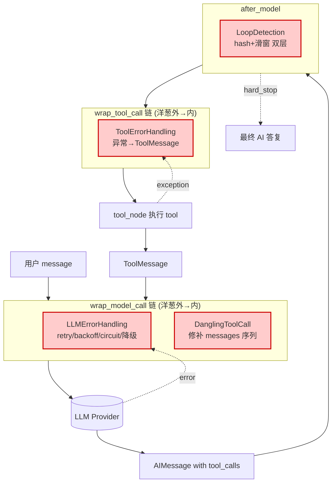
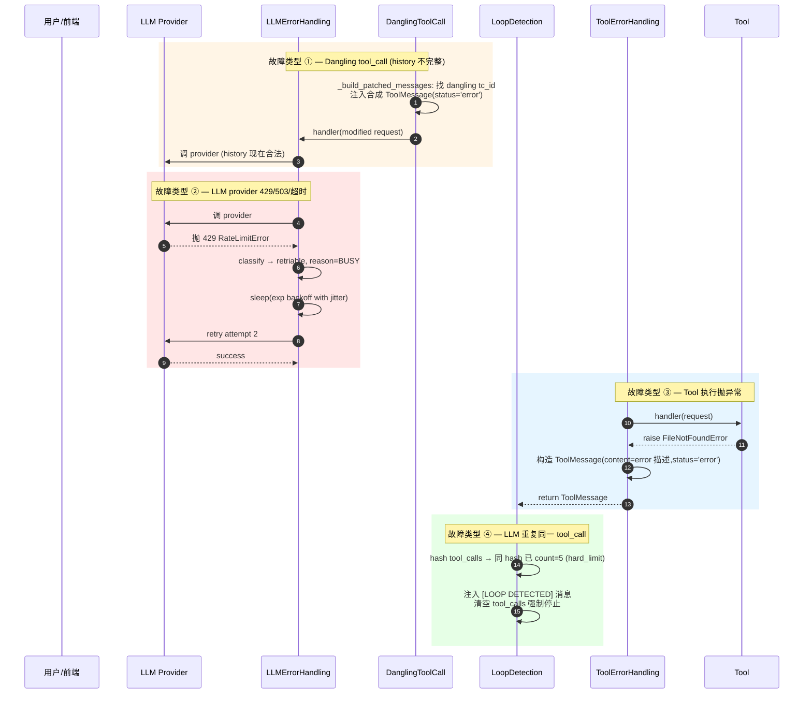
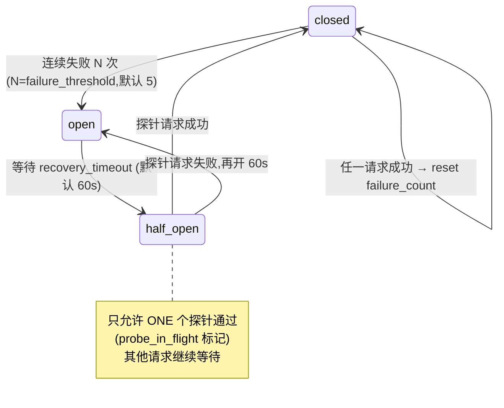

# 13 · 中间件深潜 ②：错误处理三件套 + LoopDetection

> 核心模块层第 4 篇 —— 中间件深潜第 2 季。本章聚焦"Agent 不死的 4 道防线"：
>
> 1. **`DanglingToolCallMiddleware`** —— 修补 messages 历史里的"孤儿 tool_calls"，让 OpenAI 严格校验通过
> 2. **`LLMErrorHandlingMiddleware`** —— retry / backoff / circuit-breaker / 用户友好降级，三种错误分类
> 3. **`ToolErrorHandlingMiddleware`** —— 工具异常 → 错误 ToolMessage，让 run 不中断
> 4. **`LoopDetectionMiddleware`** —— hash + 滑窗 + per-tool 频次双层检测，命中后注入提醒或强制停止
>
> 这是高级 Agent 工程岗的高频考察题 —— 因为它直接决定"agent 在生产环境跑 100 万次能不能不挂"。

---

## 🎯 学习目标

读完这份文档，你能回答：

1. **"Dangling tool_call"是什么具体故障**？为什么 DanglingToolCallMiddleware 必须用 `wrap_model_call` 而不能用 `before_model`？它**同时处理** `tool_calls` 字段和 `additional_kwargs.tool_calls` —— 这两个来源的差异是？
2. **LLMErrorHandlingMiddleware 把错误分成 4 种**（busy / quota / auth / retriable HTTP），每种行为各不同。**为什么 quota 错误不重试？为什么 auth 错误也不重试？**
3. **Circuit Breaker 三态**（closed / open / half_open）：什么时候从 closed → open？open 多久后自动到 half_open？为什么 half_open 状态需要"探针标记"防止并发？
4. **LoopDetection 的"双层检测"**：Layer 1 是 hash-based（**同一 tool_call 多元组**），Layer 2 是 per-tool-type 频次（**同一工具名累计**）—— 为什么需要两层而不是一层？给一个**只能被 Layer 2 抓到**的真实场景。
5. **`read_file` 的 hash key 用 line-bucket（200 行一桶）而 `write_file` 用完整 args** —— 为什么这种"按工具差异化的 key 策略"是对的？

---

## 🗂️ 源码定位

| 关注点 | 文件 / 行号 | 关键锚点 |
|---|---|---|
| DanglingToolCallMiddleware | `packages/harness/deerflow/agents/middlewares/dangling_tool_call_middleware.py` | `_message_tool_calls` L37（归一化 structured + raw）；`_build_patched_messages` L106；`wrap_model_call` L165 |
| LLMErrorHandlingMiddleware | `packages/harness/deerflow/agents/middlewares/llm_error_handling_middleware.py` | 错误分类正则 L27-L66；`LLMErrorHandlingMiddleware` L70；`wrap_model_call` L207；`awrap_model_call` L259；circuit breaker `_check_circuit` / `_record_success` / `_record_failure` |
| ToolErrorHandlingMiddleware | `packages/harness/deerflow/agents/middlewares/tool_error_handling_middleware.py` | `ToolErrorHandlingMiddleware` L22；`_build_error_message` L24；`wrap_tool_call` L42；`awrap_tool_call` L60 |
| LoopDetectionMiddleware | `packages/harness/deerflow/agents/middlewares/loop_detection_middleware.py` | `_hash_tool_calls` L112；`_stable_tool_key` L69（per-tool 差异化 key）；`LoopDetectionMiddleware` L144；`after_model` L210；双层检测逻辑 L274-L335 |
| LoopDetection 配置 | `packages/harness/deerflow/config/loop_detection_config.py` | `LoopDetectionConfig`：`warn_threshold=3 / hard_limit=5 / window_size=20 / tool_freq_warn=30 / tool_freq_hard_limit=50 / tool_freq_overrides` |
| 装配顺序 | `tool_error_handling_middleware.py::_build_runtime_middlewares` + `lead_agent/agent.py::_build_middlewares` | 阶段 1：`Dangling → LLMError → ... → SandboxAudit → ToolError`；阶段 2：`... → LoopDetection → Clarification (last)` |
| `GraphBubbleUp` —— 三件套不能吞 | `langgraph.errors::GraphBubbleUp` | LangGraph 控制流信号（interrupt / pause / resume）—— 错误处理代码要**主动 re-raise**，否则人在环路功能挂 |

---

## 🧭 架构图

### 1. 四道防线在调用链上的位置



### 2. 四类错误的故障传递路径



---

## 🔍 核心逻辑讲解

### Part 1 · `DanglingToolCallMiddleware`：history 修补的"位置敏感"问题

#### 故障是什么？

LLM 对话历史的"合法格式"约束（OpenAI / Anthropic 都强校验）：

> 任何一条 AIMessage 带 `tool_calls=[{id, name, args}, ...]`，**紧接着必须**有 N 条 ToolMessage（`tool_call_id` 一一对应）。

**dangling tool call** = AIMessage 发了 tool_calls，但没有对应 ToolMessage 跟着。常见触发场景：
1. **用户中断**：worker 跑到 AIMessage 已生成、tool 还没跑时被 cancel → history 留下 partial
2. **provider 序列化漂移**：某些 provider 把 raw tool_calls 留在 `additional_kwargs.tool_calls`，结构化 `tool_calls` 是空 —— 严格 validator 仍认这些 raw 项要对应 ToolMessage
3. **手动改 state**：调试时人工 set state 漏了 ToolMessage

#### 为什么必须用 `wrap_model_call` 而不能用 `before_model`？

源码顶部 11-13 行的注释给出了关键答案：

> Note: Uses wrap_model_call instead of before_model to ensure patches are inserted
> at the correct positions (immediately after each dangling AIMessage), not appended
> to the end of the message list as before_model + add_messages reducer would do.

**关键差异**：

| 钩子 | 修改的是什么 | 顺序行为 |
|---|---|---|
| `before_model` | 返回 `{"messages": [...]}` → 经 `add_messages` reducer 进入 state | **追加**到末尾（除非用 RemoveMessage 精确替换） |
| `wrap_model_call` | 修改 `request.messages`（**不入 state**），只影响这次 LLM 调用的输入 | **任意位置插入**都可以 |

**Dangling 修补必须保持顺序**：占位 ToolMessage **紧贴**对应的 AIMessage 后面 —— 不能简单 append。**只有 `wrap_model_call` 满足这个需求**。

→ 同时这有副作用：修补**只对这次 LLM 调用生效**，state 里**仍是 dangling**。下次 invoke 又得修补一次。**这是有意的**——避免污染持久 history。

#### 修补算法（`_build_patched_messages` L106-L160）

```python
def _build_patched_messages(self, messages):
    # 1. 索引所有 ToolMessage by tool_call_id
    tool_messages_by_id: dict[str, ToolMessage] = {}
    for msg in messages:
        if isinstance(msg, ToolMessage):
            tool_messages_by_id.setdefault(msg.tool_call_id, msg)

    # 2. 收集所有 AIMessage 引用过的 tool_call_id
    tool_call_ids: set[str] = set()
    for msg in messages:
        if getattr(msg, "type", None) != "ai":
            continue
        for tc in self._message_tool_calls(msg):   # ⭐ 同时取 structured + raw
            tc_id = tc.get("id")
            if tc_id:
                tool_call_ids.add(tc_id)

    # 3. 重建 messages 列表:把每条 ToolMessage 紧贴到 AIMessage 后
    patched: list = []
    consumed_tool_msg_ids: set[str] = set()
    for msg in messages:
        if isinstance(msg, ToolMessage) and msg.tool_call_id in tool_call_ids:
            continue                              # ⭐ 跳过原位置的 ToolMessage(等下放回正确位置)
        patched.append(msg)
        if getattr(msg, "type", None) != "ai":
            continue
        for tc in self._message_tool_calls(msg):
            tc_id = tc.get("id")
            existing_tool_msg = tool_messages_by_id.get(tc_id)
            if existing_tool_msg is not None:
                patched.append(existing_tool_msg)             # 有真实 ToolMessage,放回这里
                consumed_tool_msg_ids.add(tc_id)
            else:
                patched.append(ToolMessage(                   # ⭐ 没有 → 合成占位
                    content=self._synthetic_tool_message_content(tc),
                    tool_call_id=tc_id, name=tc.get("name", "unknown"),
                    status="error",
                ))

    return patched
```

**算法精读**：
- 这**不只是"补缺"**，更是**"重排"** —— 即使所有 ToolMessage 都存在但位置错乱（如 AIMessage1 → AIMessage2 → ToolMsg1 → ToolMsg2），算法也会重排成正确"紧邻"。
- 跳过原位置 ToolMessage 的关键判断：`if isinstance(msg, ToolMessage) and msg.tool_call_id in tool_call_ids: continue` —— 防止 ToolMessage 被重复插入。
- 合成 ToolMessage 用 `status="error"` —— LLM 看到时知道"这一步出错了" 而不是真实结果，会更优雅地处理。

#### `_message_tool_calls` 的双源归一化（L37-L98）

```python
@staticmethod
def _message_tool_calls(msg) -> list[dict]:
    normalized: list[dict] = []
    tool_calls = getattr(msg, "tool_calls", None) or []
    normalized.extend(list(tool_calls))                          # 来源 ① structured

    raw_tool_calls = (getattr(msg, "additional_kwargs", None) or {}).get("tool_calls") or []
    if not tool_calls:                                            # ⭐ 只在 structured 为空时才解 raw
        for raw_tc in raw_tool_calls:
            ...
            normalized.append({"id": raw_tc.get("id"), "name": name, "args": args})
    return normalized
```

**为什么"只在 structured 为空时才解 raw"？**
- `tool_calls` 是 LangChain 解析后的结构化字段 —— 优先信它
- `additional_kwargs.tool_calls` 是 provider 原始 JSON —— 某些 provider（如 minimax / deepseek 的 patched variant）只填这个，不填 structured
- 如果 structured 已填（典型 OpenAI）→ 解 raw 是重复

**真实踩坑场景**：`patched_minimax.py` / `patched_deepseek.py`（21 章详讲）对接的小模型有时**只**返回 raw tool_calls，不解析成结构化 → DanglingToolCall 必须能识别这些，否则把它们当成"没有 tool_call"，下次 LLM 调用会被 provider 拒绝。

### Part 2 · `LLMErrorHandlingMiddleware`：4 种错误分类 + Circuit Breaker

#### 错误分类正则（L27-L66）

```python
_RETRIABLE_STATUS_CODES = {408, 409, 425, 429, 500, 502, 503, 504}
_BUSY_PATTERNS = ("server busy", "rate limit", "overloaded", "服务繁忙", "请稍后重试", ...)
_QUOTA_PATTERNS = ("insufficient_quota", "quota", "billing", "credit", "余额不足", "欠费", ...)
_AUTH_PATTERNS = ("authentication", "unauthorized", "invalid api key", "无权", "未授权", ...)
```

**4 种分类的处理策略**：

| 类型 | 触发 | 重试? | 走 circuit breaker? | 用户看到 |
|---|---|---|---|---|
| **BUSY**（短期过载） | 429 / "rate limit" / "server busy" | ✅ 指数退避 | ✅ | "服务繁忙，已重试 N 次仍失败 ..." |
| **QUOTA**（额度耗尽） | "insufficient_quota" / "余额不足" | ❌ 不重试 | ❌ | "您的额度不足，请充值后重试" |
| **AUTH**（认证失败） | "unauthorized" / "无权" | ❌ 不重试 | ❌ | "API key 配置错误，请联系管理员" |
| **HTTP retriable** | 408 / 425 / 500 / 502 / 503 / 504 | ✅ 指数退避 | ✅ | "暂时无法连接，已重试 N 次 ..." |

**为什么 QUOTA / AUTH 不重试？** —— 这类错误**不是瞬态**，重试 1000 次还是错。重试只浪费成本 + 加重 quota 超额。

**为什么中文 patterns 大量出现？** —— 国内 LLM provider（Doubao / DeepSeek / Kimi / Qwen）的 error message 经常是中文，必须显式 match。

#### 指数退避 + jitter（`_build_retry_delay_ms`）

```python
retry_base_delay_ms: int = 1000        # 1 秒
retry_cap_delay_ms: int = 8000         # 8 秒
retry_max_attempts: int = 3

# wait_ms = min(base * 2^(attempt-1), cap) + jitter
```

**指数 + 上限 + jitter** 的标准做法 —— 防止"thundering herd"（多个 client 在 429 后同时重试，又一起被限流）。

#### Circuit Breaker 三态机

```python
# (实际源码状态变量)
self._circuit_state: str = "closed"
self._circuit_failure_count: int = 0
self._circuit_open_until: float = 0
self._circuit_probe_in_flight: bool = False    # half_open 阶段的探针标记
```

**三态转换**：



**`probe_in_flight` 的作用**：进入 half_open 后，**第一个**请求是"探针"，被允许真调 LLM；同时把 `probe_in_flight = True` 标记。**其它并发请求看到 probe 在飞，直接返回"服务降级"消息**（不等 probe 结果）。
- 如果 probe 成功 → 整个 circuit 回 closed
- 如果 probe 失败 → 整个 circuit 回 open

**为什么需要这个标记？** 防止 half_open 期间**N 个并发请求同时打到挂了的 provider** —— 等于没保护。**只放 1 个探针**保证 LLM 真的恢复了才放开闸门。

#### **不吞 `GraphBubbleUp`**（重要！）

```python
except GraphBubbleUp:
    with self._circuit_lock:
        if self._circuit_state == "half_open":
            self._circuit_probe_in_flight = False
    raise                                # ⭐ 不要吞,直接 re-raise
```

`GraphBubbleUp` 是 LangGraph 的**控制流信号**（interrupt / pause / resume）—— 它**不是错误**，是"工作流要暂停"的语义。如果 LLMError 把它当成普通异常分类成 retriable / 重试，HITL（人在环路）就**永远暂停不下来**了。

**这是个微妙但关键的设计点** —— 错误处理代码**必须区分"真错误"和"控制信号"**。

### Part 3 · `ToolErrorHandlingMiddleware`：异常 → ToolMessage

```python
@override
def wrap_tool_call(self, request, handler):
    try:
        return handler(request)
    except GraphBubbleUp:
        raise                            # ⭐ 同样不吞控制信号
    except Exception as exc:
        logger.exception("Tool execution failed ...")
        return self._build_error_message(request, exc)
```

**`_build_error_message`**：

```python
def _build_error_message(self, request, exc):
    tool_name = str(request.tool_call.get("name") or "unknown_tool")
    tool_call_id = str(request.tool_call.get("id") or "missing_tool_call_id")
    detail = str(exc).strip() or exc.__class__.__name__
    if len(detail) > 500:
        detail = detail[:497] + "..."
    content = f"Error: Tool '{tool_name}' failed with {exc.__class__.__name__}: {detail}. Continue with available context, or choose an alternative tool."
    return ToolMessage(content=content, tool_call_id=tool_call_id, name=tool_name, status="error")
```

**关键设计**：
- **截 500 字符** —— 防止超长 exception traceback 占用 LLM context
- **`status="error"`** —— LLM 看到时知道这次工具失败
- **附带建议语**："Continue with available context, or choose an alternative tool" —— 引导 LLM 不要死磕这一个工具
- **`missing_tool_call_id`** —— 兜底默认值，防 None 引起后续 dangling

### Part 4 · `LoopDetectionMiddleware`：双层算法 + LRU

#### Layer 1 · hash-based（同一 tool_call 多元组重复）

```python
def after_model(self, state, runtime):
    last_msg = state["messages"][-1]
    if getattr(last_msg, "type", None) != "ai":
        return None
    tool_calls = getattr(last_msg, "tool_calls", None)
    if not tool_calls:
        return None

    call_hash = _hash_tool_calls(tool_calls)

    with self._lock:
        history = self._history.setdefault(thread_id, [])
        history.append(call_hash)
        if len(history) > self.window_size:                # 默认 window=20
            history[:] = history[-self.window_size:]

        count = history.count(call_hash)

        if count >= self.hard_limit:                       # 默认 5
            return _HARD_STOP_MSG, True                    # 强制停 + 注入消息

        if count >= self.warn_threshold:                   # 默认 3
            if call_hash not in self._warned[thread_id]:
                self._warned[thread_id].add(call_hash)
                return _WARNING_MSG, False                 # 注入提醒(每 hash 只一次)
```

#### `_hash_tool_calls` 的 order-independent 设计

```python
def _hash_tool_calls(tool_calls):
    normalized: list[str] = []
    for tc in tool_calls:
        name = tc.get("name", "")
        args, fallback_key = _normalize_tool_call_args(tc.get("args", {}))
        key = _stable_tool_key(name, args, fallback_key)
        normalized.append(f"{name}:{key}")

    normalized.sort()                                       # ⭐ 排序保证 multiset 等价
    blob = json.dumps(normalized, sort_keys=True, default=str)
    return hashlib.md5(blob.encode()).hexdigest()[:12]
```

**关键**：先 sort 再 hash —— 让 `[read_file(a), read_file(b)]` 和 `[read_file(b), read_file(a)]` **得到同一 hash**。如果一次 AIMessage 同时调多个 tool，"调用顺序无关紧要"，**只要 tool 集合一致就视为重复**。

#### `_stable_tool_key` —— per-tool 差异化 key

```python
def _stable_tool_key(name, args, fallback_key):
    if name == "read_file" and fallback_key is None:
        path = args.get("path") or ""
        start_line = ...
        bucket_size = 200
        bucket_start = (start_line - 1) // bucket_size      # ⭐ 200 行一桶
        bucket_end = (end_line - 1) // bucket_size
        return f"{path}:{bucket_start}-{bucket_end}"

    if name in {"write_file", "str_replace"}:
        return json.dumps(args, sort_keys=True, default=str)    # 全 args 参与 hash

    salient_fields = ("path", "url", "query", "command", "pattern", "glob", "cmd")
    stable_args = {field: args[field] for field in salient_fields if args.get(field)}
    ...
```

**3 种 key 策略**：

| 工具 | key 策略 | 理由 |
|---|---|---|
| `read_file` | `path + 200-line bucket` | 反复读同文件不同区间是合法的（探索文档），但**反复读同区间**是循环 |
| `write_file` / `str_replace` | **完整 args** 参与 hash | 同文件不同内容写是合法（迭代修改），**完全相同内容**才算重复 |
| `bash` / `grep` / `web_search` 等 | 只看 `command` / `pattern` / `query` | 同命令重跑算重复，但 cwd / timeout 等参数不参与（噪音字段） |

**这种"按工具差异化的 hash key 策略"是 DeerFlow LoopDetection 的最精妙之处** —— 它认识到"**所有工具一刀切 hash 会要么误报要么漏报**"。

#### Layer 2 · per-tool-type 频次（不同 args 也累计）

```python
freq = self._tool_freq[thread_id]
for tc in tool_calls:
    name = tc.get("name", "")
    freq[name] += 1
    tc_count = freq[name]

    if name in self._tool_freq_overrides:
        eff_warn, eff_hard = self._tool_freq_overrides[name]
    else:
        eff_warn, eff_hard = self.tool_freq_warn, self.tool_freq_hard_limit

    if tc_count >= eff_hard:                # 默认 50
        return _TOOL_FREQ_HARD_STOP_MSG.format(...), True
    if tc_count >= eff_warn:                # 默认 30
        ...
        return _TOOL_FREQ_WARNING_MSG.format(...), False
```

**Layer 2 抓什么场景？** Layer 1 (hash) 抓不到的：**LLM 调用同一工具但每次 args 略不同**。例：
- 1️⃣ `read_file(file_1.py)` → 2️⃣ `read_file(file_2.py)` → ... → 5️⃣0️⃣ `read_file(file_50.py)`
- 每次 path 不同 → hash 不同 → Layer 1 看不出循环
- 但**累计 50 次 read_file** 显然失控 → Layer 2 抓到

#### `tool_freq_overrides` —— 高频工具白名单

`config.yaml`：
```yaml
loop_detection:
  tool_freq_hard_limit: 50
  tool_freq_overrides:
    bash:
      warn: 200
      hard_limit: 300        # bash 在 RNA-seq 这类批处理场景可能跑几百次
```

**这给了一个口子**：业务场景里某些工具天然高频（如批处理脚本里的 bash），全局 50 次限制会误杀 → 提高 override。

#### LRU 内存控制（防止线程 history 无界增长）

```python
def _evict_if_needed(self):
    while len(self._history) > self.max_tracked_threads:
        self._history.popitem(last=False)                   # OrderedDict popitem FIFO = LRU
```

**`max_tracked_threads=100`** —— 同时跟踪最近 100 个 thread。超过 LRU 驱逐 → 适合 SaaS 多租户场景，**不会因为有 100 万 thread 内存爆炸**。

---

## 🧩 体现的通用 Agent 设计模式

| 模式 | 四件套中的体现 |
|---|---|
| **Self-healing History**（自修复历史） | DanglingToolCall 修补缺失 ToolMessage |
| **Exponential Backoff + Jitter** | LLMError 重试策略 |
| **Circuit Breaker (3-state)** | closed / open / half_open + probe 标记 |
| **Pattern-based Classification** | LLMError 用正则 + 中英文 patterns 分类错误 |
| **Sentinel Error Conversion**（异常→哨兵消息） | ToolError 异常 → ToolMessage(status='error') |
| **Sliding Window Loop Detection** | LoopDetection 窗口 + 计数 |
| **Per-type Hash Key Strategy** | `_stable_tool_key` 按工具差异化 |
| **LRU Bounded State** | `max_tracked_threads` + OrderedDict |
| **Control-flow Signal Preservation** | `GraphBubbleUp` 不被吞 |

---

## 🧱 与 Agent Harness 六要素的对应关系

| 六要素 | 四件套怎么提供基础设施 |
|---|---|
| ① 反馈循环 | 全部四件套都服务于"反馈循环不死" —— history 修补 / provider 重试 / tool 异常恢复 / loop 熔断 |
| ② 记忆持久化 | DanglingToolCall 修补**只对本次请求生效**，state 保持原状 → 持久层不被污染 |
| ③ 动态上下文 | LoopDetection 注入 `[LOOP DETECTED]` 消息属于运行时上下文动态补充 |
| ④ 安全护栏 | LoopDetection hard_limit + tool_freq_overrides 是"成本失控"的最后兜底；LLMError circuit breaker 防止"挂掉的 provider 雪崩" |
| ⑤ 工具集成 | ToolError 让工具失败不致命；LoopDetection 让 LLM 不会无限重试同一工具 |
| ⑥ 可观测性 | LLMError emit `llm_retry` custom event；LoopDetection 用 logger.warning/error 输出 thread_id + tool_name + count |

---

## ⚠️ 常见坑与调试技巧

### 坑 1 · DanglingToolCall 在 stage 1 之前 → 没机会修补

11 章讲过：DanglingToolCall **必须在 LLMError 之前** —— 这样它修补完 messages 后再调 handler 进 LLM。如果顺序反了，LLMError 在外层先调 handler，**handler 看到的还是 dangling messages** → provider 400 → LLMError 当 retriable retry → **永远循环**。

### 坑 2 · LLMError 重试导致 token 翻倍计费

**症状**：用户看账单"为什么这次对话花了双倍 token？"。
**原因**：429 retriable → 重试 → 但**有些 provider 在 429 时已经计入 input tokens**（即使没返回输出） → 重试时再计一次。
**修复**：在 metadata 里加 `retry_attempts` 字段（DeerFlow `_emit_retry_event` 已 emit `llm_retry` custom event），前端按 attempts 给用户提示"本次请求有 N 次内部重试"。

### 坑 3 · 误把 GraphBubbleUp 当错误重试

**症状**：开发者自己实现一个类似 wrap 中间件，`except Exception` 没单独处理 `GraphBubbleUp` → interrupt 永远被吞 → HITL 功能不工作。
**修复**：在所有 `wrap_*` 钩子里**先**捕获 `GraphBubbleUp` 然后 raise，再 catch 普通 Exception。**DeerFlow 的 4 道防线全部正确处理了这一点**。

### 坑 4 · LoopDetection 误伤"合法 fan-out"

**症状**：用户开 plan mode，LLM 一次发 5 个 `task()` 调用 fan-out。next time 又发 5 个不同的 task。**Layer 2 频次累计** → 几轮后超 30 → 注入警告 → 用户体验差。
**调试**：检查 trace 里是否有 `tool_freq_warning`。
**修复**：给 `task` 工具加 override：
```yaml
loop_detection:
  tool_freq_overrides:
    task:
      warn: 50
      hard_limit: 100
```

### 坑 5 · `_stable_tool_key` 对自定义工具语义不明确

**症状**：你写了一个 `my_search` 工具，args 是 `{"q": "...", "page": N}`。LoopDetection 会 hash 全 args（因为 `q` 不在 salient_fields 默认列表里？或者它**真在**？）—— 行为不可预测。
**修复**：**两个方向**：
- (1) 扩 `salient_fields` 加 `"q"`（需要改 DeerFlow 源）
- (2) 重命名工具参数用 salient list 里已有的（如把 `q` 改成 `query`）
- 推荐 (2) —— 与生态保持一致更友好。

---

## 🛠️ 动手实操

> 本 demo 把 4 道防线**手动触发**一遍。**不需要起 LLM**（每次都 mock）。

### Demo · 四道防线 + LoopDetection 双层算法实测

```python
"""
错误恢复 4 道防线 + LoopDetection 双层算法实测.

跑法:  PYTHONPATH=backend uv run python scripts/error_recovery_walkthrough.py

5 个场景:
1. DanglingToolCall 修补 — AIMessage 有 tool_calls 但缺 ToolMessage
2. DanglingToolCall 重排 — ToolMessage 顺序错乱
3. LLMError 分类 — 验证 4 种错误分类的正则匹配
4. LoopDetection Layer 1 — 同 hash 触发警告→ hard stop
5. LoopDetection Layer 2 — 不同 args 同工具累计触发
"""
import sys, os
from pathlib import Path

sys.path.insert(0, "backend")
sys.path.insert(0, "backend/packages/harness")
os.chdir(Path(__file__).resolve().parents[1])

from langchain_core.messages import AIMessage, HumanMessage, ToolMessage

from deerflow.agents.middlewares.dangling_tool_call_middleware import DanglingToolCallMiddleware
from deerflow.agents.middlewares.llm_error_handling_middleware import LLMErrorHandlingMiddleware
from deerflow.agents.middlewares.loop_detection_middleware import LoopDetectionMiddleware, _hash_tool_calls
from deerflow.config.app_config import get_app_config


# ============== CASE 1: DanglingToolCall 修补 ==============
print("\n" + "=" * 70)
print("CASE 1 · DanglingToolCall 修补缺失 ToolMessage")
print("=" * 70)

dt = DanglingToolCallMiddleware()
messages = [
    HumanMessage(content="搜索一下"),
    AIMessage(content="", tool_calls=[
        {"id": "call-1", "name": "web_search", "args": {"query": "hello"}},
        {"id": "call-2", "name": "web_search", "args": {"query": "world"}},
    ]),
    # ⚠️ 故意只有 call-1 的 ToolMessage,call-2 dangling
    ToolMessage(content="result for hello", tool_call_id="call-1", name="web_search"),
]

patched = dt._build_patched_messages(messages)
print(f"  原始 messages 长度: {len(messages)}")
print(f"  修补后 messages 长度: {len(patched)}")
for i, m in enumerate(patched):
    kind = type(m).__name__
    extra = f" tool_call_id={m.tool_call_id}" if isinstance(m, ToolMessage) else ""
    print(f"    [{i}] {kind}{extra}")
print(f"  ✅ call-2 应该有一条 synthetic ToolMessage(status='error')")


# ============== CASE 2: DanglingToolCall 重排 ==============
print("\n" + "=" * 70)
print("CASE 2 · DanglingToolCall 重排错位的 ToolMessage")
print("=" * 70)

# AIMessage1, AIMessage2, ToolMsg2, ToolMsg1 — 故意错位
messages = [
    HumanMessage(content="先 A 再 B"),
    AIMessage(content="A", id="ai-1", tool_calls=[{"id": "c-A", "name": "tool_a", "args": {}}]),
    AIMessage(content="B", id="ai-2", tool_calls=[{"id": "c-B", "name": "tool_b", "args": {}}]),
    ToolMessage(content="B done", tool_call_id="c-B", name="tool_b"),
    ToolMessage(content="A done", tool_call_id="c-A", name="tool_a"),
]

patched = dt._build_patched_messages(messages)
print(f"  修补后顺序:")
for i, m in enumerate(patched):
    kind = type(m).__name__
    if isinstance(m, AIMessage):
        tc = m.tool_calls[0]["id"] if m.tool_calls else "—"
        print(f"    [{i}] {kind} tool_call.id={tc}")
    elif isinstance(m, ToolMessage):
        print(f"    [{i}] {kind} tool_call_id={m.tool_call_id}")
    else:
        print(f"    [{i}] {kind}")
print(f"  ✅ 预期顺序:Human → AI(c-A) → ToolMsg(c-A) → AI(c-B) → ToolMsg(c-B)")


# ============== CASE 3: LLMError 错误分类 ==============
print("\n" + "=" * 70)
print("CASE 3 · LLMError 4 种错误分类")
print("=" * 70)

mw = LLMErrorHandlingMiddleware(app_config=get_app_config())
samples = [
    ("BUSY (rate limit)", Exception("Rate limit exceeded, please retry")),
    ("BUSY (中文)", Exception("服务繁忙,请稍后重试")),
    ("QUOTA", Exception("insufficient_quota: please upgrade")),
    ("QUOTA (中文)", Exception("您的账户余额不足")),
    ("AUTH", Exception("Invalid API key, unauthorized")),
    ("AUTH (中文)", Exception("未授权访问")),
    ("Generic 500", Exception("Internal server error")),
    ("Non-retriable", Exception("Malformed input field 'foo'")),
]
for label, exc in samples:
    retriable, reason = mw._classify_error(exc)
    print(f"  {label:<30}  retriable={retriable}  reason={reason}")


# ============== CASE 4: LoopDetection Layer 1 ==============
print("\n" + "=" * 70)
print("CASE 4 · LoopDetection Layer 1 (hash-based)")
print("=" * 70)

cfg = get_app_config().loop_detection
mw = LoopDetectionMiddleware.from_config(cfg)
thread_id = "test-loop-layer1"

# 模拟 LLM 反复发同样 tool_calls
fake_tool_calls = [{"id": "c-x", "name": "web_search", "args": {"query": "stuck"}}]
hash_val = _hash_tool_calls(fake_tool_calls)
print(f"  tool_call hash: {hash_val}")

# 模拟 6 次相同调用,看 warn / hard_stop 触发点
for i in range(1, 7):
    last = AIMessage(content="", tool_calls=fake_tool_calls)
    state = {"messages": [HumanMessage("?"), last]}

    class FakeRuntime:
        context = {"thread_id": thread_id}
    msg, stop = mw._evaluate_tool_calls(state, FakeRuntime())
    status = "STOP" if stop else ("WARN" if msg else "ok")
    print(f"    第 {i} 次:{status}  msg={msg[:50] if msg else None!r}")


# ============== CASE 5: LoopDetection Layer 2 ==============
print("\n" + "=" * 70)
print("CASE 5 · LoopDetection Layer 2 (per-tool-type frequency)")
print("=" * 70)
mw2 = LoopDetectionMiddleware.from_config(cfg)
thread_id2 = "test-loop-layer2"

# 每次调 web_search 但 query 不同 → hash 都不同 → Layer 1 不抓
# 但 Layer 2 按工具名累计
warns = 0
stops = 0
for i in range(1, 35):
    tc = [{"id": f"c-{i}", "name": "web_search", "args": {"query": f"q_{i}"}}]
    state = {"messages": [HumanMessage("?"), AIMessage(content="", tool_calls=tc)]}
    class FakeRuntime:
        context = {"thread_id": thread_id2}
    msg, stop = mw2._evaluate_tool_calls(state, FakeRuntime())
    if stop:
        stops += 1
        print(f"    第 {i} 次:HARD STOP")
        break
    if msg:
        warns += 1
        print(f"    第 {i} 次:WARN")

print(f"  ✅ 触发了 {warns} 次 warn,{stops} 次 hard_stop")
print(f"  ✅ 默认 tool_freq_warn=30 / tool_freq_hard_limit=50,中等敏感度")
```

### 调试任务

1. **断点位置**：
   - `dangling_tool_call_middleware.py::_build_patched_messages` 第 130-145 行 —— 看每个 ToolMessage 被放回 / 合成的决策
   - `llm_error_handling_middleware.py::_classify_error` —— 跑 Case 3 时观察每条 exception 字符串走哪个分类分支
   - `loop_detection_middleware.py` L256（`call_hash = _hash_tool_calls`） + L274（`if count >= self.hard_limit:`）—— 看 Layer 1 命中
2. **观察什么**：
   - Case 1 修补后 messages 长度 = 4（多了一条合成 ToolMessage）
   - Case 2 修补后顺序按 AIMessage 的 tool_calls 重排
   - Case 3 中 8 种错误正确分到 4 类
   - Case 4 第 3 次（warn）和第 5 次（hard）触发
   - Case 5 第 30 次开始 warn，第 50 次 hard_stop
3. **人为制造异常**：
   - 给 Case 1 的 `additional_kwargs` 塞一个 `tool_calls` raw 项（structured 留空）→ 看 `_message_tool_calls` 第二条路径触发
   - Case 5 把 `web_search` 改成 `bash`，看 override 后阈值变化（如果 config 没配 override 就还是 30/50）

### 改造练习

1. **练习 A（简单）**：扩展 `_BUSY_PATTERNS` 加你团队用过的某个 provider 的 busy 消息（如 `"Anthropic api overloaded"`），跑 Case 3 验证。
2. **练习 B（中等）**：实现 LLMError 的"指数衰减不要 retry"模式 —— 当连续 3 次重试都失败时，**不立即降级**，而是 sleep 30 秒再尝试**最后一次** —— 给 provider 真的恢复的余量。
3. **挑战题**：扩展 LoopDetection 加一个 **Layer 3**："tool_call_id 完全相同但短时间内反复出现" —— LLM 偶尔会"卡"在某个 tool_call_id 反复 emit。给一个"id reuse 检测"逻辑 + 测试。

### 预期输出 & 验证方式

- Case 1：messages 长度 4，含 1 条 synthetic ToolMessage
- Case 2：顺序变成 Human → AI(c-A) → ToolMsg(c-A) → AI(c-B) → ToolMsg(c-B)
- Case 3：8 个 sample 中 BUSY×2 / QUOTA×2 / AUTH×2 / Generic×1（retriable）/ Non-retriable×1
- Case 4：第 3 次 WARN，第 5 次 STOP
- Case 5：第 30 次 WARN，第 50 次 STOP

---

## 🎤 面试视角

### 业务型大厂卷

**问 1**：DeerFlow 的 LLMError 三态 Circuit Breaker 用 `probe_in_flight` 标记保护 half_open。**为什么不直接用一个锁让并发请求串行通过 half_open？** 你认为哪种好？

> **教科书答案**：
> "锁串行" 方案：half_open 状态下所有请求**排队**等前一个完成，确认成功才放下一个进入 closed。
> 标记方案（DeerFlow 当前）：half_open 只放 1 个探针真调 provider，**其他请求立即降级**（不等）。
> 对比：
> | 维度 | 锁串行 | 标记降级 |
> |---|---|---|
> | provider 恢复后第一秒响应能力 | 慢（串行 1 个 1 个） | 快（并发涌入立即获益） |
> | provider 仍挂时的浪费 | 大（每个排队请求等超时） | 小（立即返回降级消息） |
> | 用户感知 | 长时间无响应 | 立即看到"服务恢复中"提示 |
> 标记方案**对用户更友好** —— "宁可让 99% 用户立即看到降级，也别让他们等死"。
> **加分项**：指出"标记方案的代价" —— provider 真恢复后的**头几秒 throughput 实际是 0**（除了 probe，其他都被降级）。但这是可接受的代价 —— circuit 半开闸状态只持续到 probe 完成（几秒），代价有限。

**问 2**：DeerFlow 的 LoopDetection 配置 `warn_threshold=3 / hard_limit=5 / window_size=20`。**这个默认值合理吗？给一个真实业务场景说明你会怎么调**。

> **教科书答案**：
> 默认值评价：**中度敏感**。
> - window=20 意味着只在最近 20 轮内重复才算
> - warn=3 意味着在 20 轮里出现 3 次相同 → 警告
> - hard=5 意味着 5 次 → 硬停
> 调整场景：
> 1. **代码生成场景**（如帮用户调试程序）：LLM 反复读同一文件不同片段是正常的。**调高**：`warn=5, hard=8`，宽容度更高
> 2. **客服场景**（用户问类似问题）：循环风险大，**调低**：`warn=2, hard=3`，更敏感
> 3. **批处理场景**（RNA-seq 跑 100 个 bash）：**用 tool_freq_overrides** 单独提高 bash 限制，不动全局
> 4. **超长任务**（research agent 跑 1 小时）：**调大 window**：`window=100`，跨更长历史检测真正的循环
> **更深思考**：默认值是个"折中"，DeerFlow 应该提供**预设方案**（`loop_detection.preset: code_gen | customer_service | batch | research`），降低用户调参门槛。

### 创业型 AI 公司卷

**问 3**：DeerFlow 的 `_stable_tool_key` 给每个工具差异化 hash key。**给一个具体场景**说明全局 "hash 整个 args"（不差异化）会出什么 bug。

> **参考答案**：
> 场景：**LLM 反复 read_file 同一文件不同区间探索文档**
> - 第 1 次：`read_file(path="report.md", start=1, end=100)`
> - 第 2 次：`read_file(path="report.md", start=80, end=180)`
> - 第 3 次：`read_file(path="report.md", start=160, end=260)`
> 全 args hash：每次不同 → hash 不同 → 不触发 Layer 1。**这是对的，没问题**。
> 反方向 bug：用户场景是**真的循环**：
> - 第 1 次：`read_file(path="report.md", start=1, end=200)`
> - 第 2 次：`read_file(path="report.md", start=1, end=200)`  ← 完全一样
> - 第 3 次：`read_file(path="report.md", start=1, end=200)`
> 全 args hash：每次相同 → Layer 1 触发。**这也对**。
> 真正的 bug 场景：**LLM 略微调整 timestamp / cache_buster 参数**
> - `read_file(path="report.md", _cache=12345)` → `read_file(path="report.md", _cache=12346)`
> - 实际是同一个调用，只是 noise 参数变了
> - 全 args hash → 不同 → Layer 1 miss
> 解决方案：`_stable_tool_key` 用 **salient fields whitelist**（`path / url / query / command / pattern / glob / cmd`），**排除 noise** → 同 hash → Layer 1 抓到。
> **DeerFlow 当前算法精妙之处**：每个工具的 "salient args" 不同（read_file 是 path+bucket、write_file 是全 args），**人为设计 per-tool hash 语义**。

**问 4**：你团队的 agent 在生产中遇到 dangling tool call 频繁发生，**怎么定位是用户中断还是 provider 漂移**？给一个排查路径。

> **参考答案**：
> 排查路径：
> 1. **看 RunStatus**（09 章）：被 `cancel(action="interrupt")` 的 run 是用户中断 → state 留 dangling 是预期
> 2. **看 DanglingToolCall warning 日志**：`Injecting N placeholder ToolMessage(s) for dangling tool calls` —— 如果数量稳定（如每次 = 1），是个特定路径触发；如果数量随机（1-10 不等），是 provider 漂移
> 3. **看 `_message_tool_calls` 分支**：用 monkey patch / debug log 标记是 structured 还是 raw 触发修补。**Raw 高频 → provider 漂移**（如 minimax / deepseek 的 patched variant 返回的格式）
> 4. **看 model_name 关联**：在 LangSmith metadata 按 model_name 分组 dangling 频率 —— 哪个 provider 高频 dangling 就找哪家
> 5. **临时修复**：在 patched provider（如 `patched_deepseek.py`）里加 raw → structured 转换的兜底，防止漂移泄漏到中间件
> **DeerFlow 的设计承认 provider 不可靠** —— DanglingToolCall 是为这种"现实主义" 准备的。

---

## 📚 延伸阅读

- **OpenAI Cookbook — "How to handle rate limits"**：https://cookbook.openai.com/examples/how_to_handle_rate_limits
  *指数退避 + jitter 的官方建议。*
- **Martin Fowler — "CircuitBreaker"**：https://martinfowler.com/bliki/CircuitBreaker.html
  *经典论述，理解三态机的工程动机。*
- **DeerFlow `runtime/runs/manager.py::cancel`**（09 章详讲）：理解"用户中断"产生 dangling 的因果链。
- **`patched_deepseek.py` / `patched_minimax.py`**（21 章预告）：DeerFlow 对小模型 provider 的最小侵入式修补 —— 看了之后你会更理解"为什么需要 dangling tool call 修补"。

---

## 🎤 互动检查 —— 请回答这 3 个问题

> **两句话即可**。

1. **机制理解题**：DanglingToolCallMiddleware 用 `wrap_model_call` 修补 messages 但**不写回 state**。**用一句话说**这是为什么。
2. **算法对比题**：LoopDetection Layer 1 / Layer 2 各抓什么场景？**给一个具体例子**：哪种循环只能被 Layer 2 抓到？
3. **应用题**：你团队 LLM 经常返回 429（rate limit），重试也救不回来。**作为快速止血**，你会调 LLMErrorHandling 的哪个参数？长期看怎么改？

回答后我们进入 **`14-middleware-deep-3-context-engineering.md`** —— 上下文工程层（Summarization / DynamicContext / ViewImage / Title）深潜。
