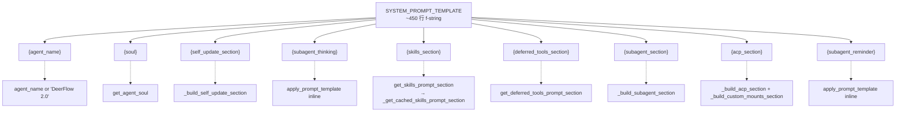
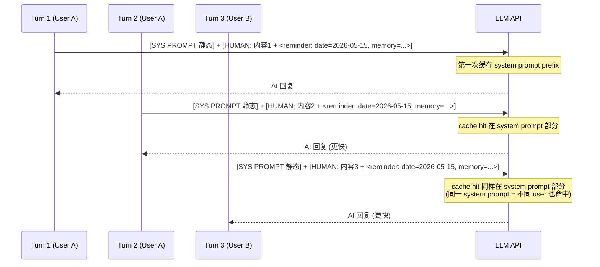

# 13 · 823 行系统 Prompt 的拼装艺术

> 12 篇讲了 skills 怎么从磁盘加载。这一章把焦点从"哪些组件能注入 prompt"提升到"prompt 怎么被组装成一个 LLM 看见的字符串"。
>
> deer-flow 的 `lead_agent/prompt.py` 一共 823 行。其中 ~450 行是字符串模板（`SYSTEM_PROMPT_TEMPLATE` 那块），剩下都是"动态片段构造 + 缓存 + 启动预热"的工程代码。这一章把全部 9 个动态片段、prompt cache 友好策略、skills 预热的并发设计讲清楚。

---

## 1. 模块定位（Why this matters）

`apply_prompt_template` 是 lead agent 的"出生证"——每次 `make_lead_agent`（05 篇）都调它生成 system prompt 字符串。这串 prompt **整轮对话不变**——除了第一个 HumanMessage 里的动态 reminder（15 篇详谈），其它内容跨 turn 完全一致。

不读这部分会错过 4 个关键认知：

1. **prompt 是分层组装的、不是手写的一大段**：`SYSTEM_PROMPT_TEMPLATE` 用 `{slot}` 占位 9 个动态片段，每个片段有独立的 builder 函数。**改一处不影响其它**——这是 deer-flow agent prompt 可维护性的核心。
2. **为 prefix cache 设计**：注释明确写"keeping this prompt identical across users and sessions for maximum prefix-cache reuse"（行 811-812）。memory 和当前日期**不放 system prompt**——放到 first HumanMessage 的 `<system-reminder>` 里。这是 15 篇 DynamicContextMiddleware 的核心动机。
3. **skills 预热用后台线程 + version counter 防 race**：第一次 agent 启动可能不知道 skills 还没扫完，deer-flow 启动时就在后台跑 `_refresh_enabled_skills_cache_worker` 把 skills 预热——request path 永远是非阻塞的。
4. **XML 标签结构**：所有片段都用 `<role>...</role>`、`<thinking_style>...</thinking_style>` 这种 XML 包装。这是 Anthropic 推荐的 prompt 写法，对 Claude / GPT-4 / Gemini 都更稳定。

对应到 Harness 六要素：本章对应 **上下文工程 + 工具集成 + 反馈循环** 三条主线的交汇。

---

## 2. 源码地图（Source Map）

### 2.1 关键文件清单

| 路径 | 角色 |
|------|------|
| [`packages/harness/deerflow/agents/lead_agent/prompt.py`](../packages/harness/deerflow/agents/lead_agent/prompt.py) | 823 行单文件，包含全部 prompt 装配 |
| [`packages/harness/deerflow/agents/__init__.py`](../packages/harness/deerflow/agents/__init__.py) | 启动时调 `prime_enabled_skills_cache()` 预热 |
| [`packages/harness/deerflow/config/agents_config.py`](../packages/harness/deerflow/config/agents_config.py) | `load_agent_soul(agent_name)` 读 SOUL.md |
| [`packages/harness/deerflow/subagents/__init__.py`](../packages/harness/deerflow/subagents/__init__.py) | `get_available_subagent_names()` 给 subagent_section 用 |

### 2.2 关键符号速查表

| 符号 | 文件:行 | 一句话职责 |
|------|---------|-----------|
| `SYSTEM_PROMPT_TEMPLATE` | `prompt.py:363` | ~450 行 f-string 模板，9 个占位符 |
| `apply_prompt_template(...)` | `prompt.py:768` | 唯一公开装配入口 |
| `get_agent_soul(agent_name)` | `prompt.py:659` | 读自定义 agent 的 SOUL.md |
| `_build_self_update_section(agent_name)` | `prompt.py:667` | 自定义 agent 才有的"自我更新指南" |
| `get_skills_prompt_section(...)` | `prompt.py:626` | 12 篇讲过 |
| `_get_cached_skills_prompt_section(...)` | `prompt.py:595` | `@lru_cache` 真正干活的函数 |
| `get_deferred_tools_prompt_section(...)` | `prompt.py:687` | tool_search 启用时列出 deferred 工具名 |
| `_build_subagent_section(n, app_config)` | `prompt.py:213` | subagent_enabled=True 时的大段 prompt |
| `_build_available_subagents_description(...)` | `prompt.py:183` | 列出每个 subagent 类型的描述 |
| `_build_acp_section(app_config)` | `prompt.py:717` | 有 ACP agent 配置时的提示 |
| `_build_custom_mounts_section(app_config)` | `prompt.py:741` | yaml 配的 sandbox.mounts 提示 |
| `_build_skill_evolution_section(enabled)` | `prompt.py:167` | skill 自我升级的开关式提示 |
| `prime_enabled_skills_cache()` | `prompt.py:98` | 启动时预热 |
| `warm_enabled_skills_cache(timeout)` | `prompt.py:102` | 等预热完成（带超时） |
| `_ensure_enabled_skills_cache()` | `prompt.py:65` | 启线程 + 返回 Event |
| `_refresh_enabled_skills_cache_worker()` | `prompt.py:40` | 后台 worker：load + version check |
| `_invalidate_enabled_skills_cache()` | `prompt.py:81` | Skills 改了后清缓存 + 重新预热 |
| `_enabled_skills_refresh_version` | `prompt.py:24` | 单调递增计数器，防 race |
| `_enabled_skills_refresh_event` | `prompt.py:25` | `threading.Event` 通知预热完成 |
| `clear_skills_system_prompt_cache()` | `prompt.py:159` | 暴露给外部的"清缓存"API |
| `refresh_skills_system_prompt_cache_async()` | `prompt.py:163` | async 风格的"清并等" |

### 2.3 `SYSTEM_PROMPT_TEMPLATE` 的 9 个动态片段



### 2.4 各片段的触发条件

| 片段 | 何时为非空 | 行内位置 |
|------|----------|---------|
| `{agent_name}` | 总是（默认 `DeerFlow 2.0`） | `<role>` |
| `{soul}` | 自定义 agent 有 `SOUL.md` | `<soul>...</soul>` 块 |
| `{self_update_section}` | 自定义 agent 模式 | `<self_update>...</self_update>` |
| `{subagent_thinking}` | `subagent_enabled=True` | `<thinking_style>` 内的一行 |
| `{skills_section}` | 有启用的 skill 或 skill_evolution 开 | `<skill_system>` |
| `{deferred_tools_section}` | `config.tool_search.enabled` + 有 deferred | `<available-deferred-tools>` |
| `{subagent_section}` | `subagent_enabled=True` | `<subagent_system>` |
| `{acp_section}` | 配了 ACP agent 或 sandbox.mounts | `<working_directory>` 内 |
| `{subagent_reminder}` | `subagent_enabled=True` | `<critical_reminders>` 内 |

---

## 3. 核心逻辑精读（Deep Dive）

### 3.1 `apply_prompt_template`：装配入口

```python
# packages/harness/deerflow/agents/lead_agent/prompt.py:768-823 (节选)
def apply_prompt_template(
    subagent_enabled: bool = False,
    max_concurrent_subagents: int = 3,
    *,
    agent_name: str | None = None,
    available_skills: set[str] | None = None,
    app_config: AppConfig | None = None,
) -> str:
    # Include subagent section only if enabled (from runtime parameter)
    n = max_concurrent_subagents
    subagent_section = _build_subagent_section(n, app_config=app_config) if subagent_enabled else ""

    # Add subagent reminder to critical_reminders if enabled
    subagent_reminder = (
        "- **Orchestrator Mode**: ... **HARD LIMIT: max {n} `task` calls per response.** ..."
        if subagent_enabled
        else ""
    )

    # Add subagent thinking guidance if enabled
    subagent_thinking = (
        "- **DECOMPOSITION CHECK: Can this task be broken into 2+ parallel sub-tasks? ..."
        if subagent_enabled
        else ""
    )

    # Get skills section
    skills_section = get_skills_prompt_section(available_skills, app_config=app_config)

    # Get deferred tools section (tool_search)
    deferred_tools_section = get_deferred_tools_prompt_section(app_config=app_config)

    # Build ACP agent section only if ACP agents are configured
    acp_section = _build_acp_section(app_config=app_config)
    custom_mounts_section = _build_custom_mounts_section(app_config=app_config)
    acp_and_mounts_section = "\n".join(section for section in (acp_section, custom_mounts_section) if section)

    # Build and return the fully static system prompt.
    # Memory and current date are injected per-turn via DynamicContextMiddleware
    # as a <system-reminder> in the first HumanMessage, keeping this prompt
    # identical across users and sessions for maximum prefix-cache reuse.
    return SYSTEM_PROMPT_TEMPLATE.format(
        agent_name=agent_name or "DeerFlow 2.0",
        soul=get_agent_soul(agent_name),
        self_update_section=_build_self_update_section(agent_name),
        skills_section=skills_section,
        deferred_tools_section=deferred_tools_section,
        subagent_section=subagent_section,
        subagent_reminder=subagent_reminder,
        subagent_thinking=subagent_thinking,
        acp_section=acp_and_mounts_section,
    )
```

**4 个值得圈点**：

1. **subagent_enabled 影响 3 个独立位置**：`{subagent_section}`、`{subagent_reminder}`、`{subagent_thinking}`——分散在不同 XML 块里。**为什么不集中？** 因为 LLM 处理 prompt 时，单一 instruction 在 prompt 多处出现 → "重复强调"的效果，比一处长篇大论更稳。
2. **`acp_and_mounts_section` 合并两个独立 builder**：ACP 段和 custom mounts 段都是"额外目录提示"，自然放在 `<working_directory>` 里。但 builder 分开是为了**逻辑独立**——一段失败不影响另一段。
3. **注释明确说明 prefix-cache 动机**：行 810-812——这是工程意图的"自文档化"。
4. **没有任何动态时间/用户/历史**：所有用到 datetime / user_id / memory 的字段都被"刻意排除"。memory 和当前日期通过 DynamicContextMiddleware 注入到 first HumanMessage（15 篇）。

### 3.2 prefix-cache 友好的设计

OpenAI / Anthropic / Google 的 LLM API 都支持 **prompt prefix caching**：

- 同一 prefix 多次请求，第二次起 prefix 部分**不计费**且**速度更快**。
- 触发条件：**前缀逐字节相同**，连一个空格都不能差。

deer-flow 的设计就是把 system prompt **设计成"绝对静态"**：



**关键洞察**：把"动态内容"挪到 HumanMessage 后，**system prompt 在不同用户、不同时间都 100% 一样** → cache hit 率最大化。

对比错误做法：

```python
# ❌ 错误：把日期塞 system prompt
SYS = f"You are an AI. Current date is {datetime.now().isoformat()}."

# ❌ 错误：把用户名塞 system prompt
SYS = f"You are talking to {user.name}."

# 这两种写法每次日期变 / 用户变都 cache miss。
```

deer-flow 的设计是"system prompt 越静态越好"，把所有动态信息推到 HumanMessage（注意 prefix cache 还能复用到 HumanMessage 的前缀部分，但 system prompt 的命中更全局）。

### 3.3 `SYSTEM_PROMPT_TEMPLATE` 的结构

```python
# packages/harness/deerflow/agents/lead_agent/prompt.py:363-551 (结构骨架)
SYSTEM_PROMPT_TEMPLATE = """
<role>
You are {agent_name}, an open-source super agent.
</role>

{soul}
{self_update_section}
<thinking_style>
- Think concisely ...
{subagent_thinking}- Never write down your full final answer ...
</thinking_style>

<clarification_system>
**WORKFLOW PRIORITY: CLARIFY → PLAN → ACT**
... 详细的 5 种 clarification scenario ...
</clarification_system>

{skills_section}

{deferred_tools_section}

{subagent_section}

<working_directory existed="true">
- User uploads: `/mnt/user-data/uploads`
- User workspace: `/mnt/user-data/workspace`
- Output files: `/mnt/user-data/outputs`
... 文件管理规则 ...
{acp_section}
</working_directory>

<response_style>
- Clear and Concise
- Natural Tone
- Action-Oriented
</response_style>

<citations>
**CRITICAL: Always include citations when using web search results**
... 详细的 markdown 引用格式规范 ...
</citations>

<critical_reminders>
- **Clarification First**: ...
{subagent_reminder}- Skill First: ...
- Progressive Loading
- Output Files
- ...
- Always Respond
</critical_reminders>
"""
```

**这是一个 ~450 行的 f-string**。从 `<role>` 一路到 `<critical_reminders>` 包了 6 大 XML 块。9 个 `{slot}` 占位符散布其中。

**6 大固定块的作用**：

| XML 标签 | 用途 |
|---------|------|
| `<role>` | 身份声明（you are X） |
| `<thinking_style>` | 推理过程规范 |
| `<clarification_system>` | "先问后做"的硬约束（5 种 scenario + 例子） |
| `<working_directory>` | 文件系统视图 |
| `<response_style>` | 输出风格 |
| `<citations>` | 引用规范（research/markdown） |
| `<critical_reminders>` | 总结性提醒（多次强调） |

**为什么 `<clarification_system>` 这么长（行 379-446，~70 行）**？因为它定义了 deer-flow 最核心的产品行为——"信息不全先问"。详细到 5 种 scenario + 完整的 ask_clarification 调用示例。这是 deer-flow vs 其它 agent 框架的差异化设计。

### 3.4 9 个动态片段拆解

#### ① `{agent_name}` 默认 `DeerFlow 2.0`

```python
agent_name=agent_name or "DeerFlow 2.0"
```

非自定义 agent 时，LLM 知道自己叫 `DeerFlow 2.0`。自定义 agent 时拿 agent_name。

#### ② `{soul}`：自定义 agent 的"人设"

```python
# prompt.py:659-664
def get_agent_soul(agent_name: str | None) -> str:
    soul = load_agent_soul(agent_name)
    if soul:
        return f"<soul>\n{soul}\n</soul>\n" if soul else ""
    return ""
```

SOUL.md 是自定义 agent 的"personality + identity"文件——`load_agent_soul` 从 `{base_dir}/users/{user_id}/agents/{agent_name}/SOUL.md` 读。

**注意 `if soul: ... if soul else ""`** 看似冗余（外层 if 已经判断了 soul），实际是历史代码或防御性写法——结果一致。

#### ③ `{self_update_section}`：让自定义 agent 知道怎么自我升级

```python
# prompt.py:667-684
def _build_self_update_section(agent_name: str | None) -> str:
    """Prompt block that teaches the custom agent to persist self-updates via update_agent."""
    if not agent_name:
        return ""
    return f"""<self_update>
You are running as the custom agent **{agent_name}** with a persisted SOUL.md and config.yaml.

When the user asks you to update your own description, personality, behaviour, skill set, tool groups, or default model,
you MUST persist the change with the `update_agent` tool. Do NOT use `bash`, `write_file`, or any sandbox tool to edit
SOUL.md or config.yaml — those write into a temporary sandbox/tool workspace and the changes will be lost on the next turn.

Rules:
- Always pass the FULL replacement text for `soul` (no patch semantics). Start from your current SOUL above and apply the user's edits.
- Only pass the fields that should change. Omit the others to preserve them.
- Pass `skills=[]` to disable all skills, or omit `skills` to keep the existing whitelist.
- After `update_agent` returns successfully, tell the user the change is persisted and will take effect on the next turn.
</self_update>
"""
```

**这是 deer-flow agent "可升级" 设计的关键提示**——LLM 需要知道：

- 它的 SOUL.md 和 config.yaml 在沙箱外（不能用 bash/write_file 改）。
- 改的话必须调 `update_agent` 工具（10 篇讲的工具装配里出现）。
- `soul` 是全替换（no patch），其它字段 omit 保留。

这种 "教 LLM 怎么用自己专属工具"的 prompt 在 deer-flow 里出现多次——例如 subagent / ACP / skill_evolution 都有类似的"工具用法说明"段。

#### ④ `{skills_section}`：12 篇详谈

由 `get_skills_prompt_section` → `_get_cached_skills_prompt_section` 拼出 `<skill_system>`。

#### ⑤ `{deferred_tools_section}`：11 篇 tool_search 启用时

```python
# prompt.py:687-714
def get_deferred_tools_prompt_section(*, app_config: AppConfig | None = None) -> str:
    """Generate <available-deferred-tools> block for the system prompt."""
    from deerflow.tools.builtins.tool_search import get_deferred_registry

    # ... resolve config ...

    if not config.tool_search.enabled:
        return ""

    registry = get_deferred_registry()
    if not registry:
        return ""

    names = "\n".join(e.name for e in registry.entries)
    return f"<available-deferred-tools>\n{names}\n</available-deferred-tools>"
```

只列**名字**（不带 description / schema）——LLM 知道存在但调不动，要靠 `tool_search(query)` 取详情。**这是 prompt budget 优化的实现**（11 篇详谈）。

#### ⑥ `{subagent_section}`：subagent_enabled=True 时的大段提示

`_build_subagent_section`（行 213-360）一个 ~150 行的字符串——deer-flow 整个 prompt 里**最长的动态片段**。包括：

- "Decompose + parallel execution"工作流。
- `max {n} task calls per response` 硬约束（n 来自 `max_concurrent_subagents`）。
- 多 batch 执行示例。
- direct execution 反例。
- **特别注意**：`_build_available_subagents_description` 会列出当前可用的所有 subagent 类型 + 描述（包括用户自定义的——见 17 篇的 subagent registry）。

**这种"指令 + 例子 + 反例"的 3 段式 prompt 写法**是工程化 prompt 的标准范式——LLM 不只是看到规则，还看到正反例子。

#### ⑦ `{acp_section} + {custom_mounts_section}`：动态挂载提示

```python
# prompt.py:717-738
def _build_acp_section(*, app_config: AppConfig | None = None) -> str:
    if app_config is None:
        try:
            from deerflow.config.acp_config import get_acp_agents
            agents = get_acp_agents()
        except Exception:
            return ""
    else:
        agents = getattr(app_config, "acp_agents", {}) or {}

    if not agents:
        return ""

    return (
        "\n**ACP Agent Tasks (invoke_acp_agent):**\n"
        "- ACP agents (e.g. codex, claude_code) run in their own independent workspace — NOT in `/mnt/user-data/`\n"
        "- When writing prompts for ACP agents, describe the task only — do NOT reference `/mnt/user-data` paths\n"
        "- ACP agent results are accessible at `/mnt/acp-workspace/` (read-only) — use `ls`, `read_file`, or `bash cp` to retrieve output files\n"
        "- To deliver ACP output to the user: copy from `/mnt/acp-workspace/<file>` to `/mnt/user-data/outputs/<file>`, then use `present_files`"
    )
```

```python
# prompt.py:741-765
def _build_custom_mounts_section(*, app_config: AppConfig | None = None) -> str:
    # ... resolve config ...
    mounts = config.sandbox.mounts or []
    if not mounts:
        return ""

    lines = []
    for mount in mounts:
        access = "read-only" if mount.read_only else "read-write"
        lines.append(f"- Custom mount: `{mount.container_path}` - Host directory mapped into the sandbox ({access})")

    mounts_list = "\n".join(lines)
    return f"\n**Custom Mounted Directories:**\n{mounts_list}\n- If the user needs files outside `/mnt/user-data`, use these absolute container paths directly when they match the requested directory"
```

两个 builder 各自独立、各自返回空字符串如果不适用。最后被合并到 `acp_and_mounts_section`。

**为什么 ACP 提示这么具体**？因为 ACP（Agent-to-Agent Communication Protocol）是 deer-flow 让 lead agent 调用外部 agent（codex / claude code）的机制，输出目录是独立的 `/mnt/acp-workspace`——LLM 必须知道这个路径并知道**用 `bash cp` 把 ACP 输出搬到 user-data/outputs 才能 present 给用户**。

#### ⑧ `{subagent_reminder}`：critical_reminders 里的 subagent 重复强调

```python
subagent_reminder = (
    "- **Orchestrator Mode**: You are a task orchestrator - decompose complex tasks into parallel sub-tasks. "
    f"**HARD LIMIT: max {n} `task` calls per response.** "
    f"If >{n} sub-tasks, split into sequential batches of ≤{n}. Synthesize after ALL batches complete.\n"
    if subagent_enabled
    else ""
)
```

注意它和 `{subagent_section}` 重复——**同一指令在 prompt 里出现两次**：一次在专属 `<subagent_system>` 块详谈，一次在 `<critical_reminders>` 浓缩。LLM 在长 prompt 里容易遗忘前面的指令，**末尾的总结性重复**显著提升服从率。

#### ⑨ `{subagent_thinking}`：thinking_style 里的 decomposition check

```python
subagent_thinking = (
    "- **DECOMPOSITION CHECK: Can this task be broken into 2+ parallel sub-tasks? If YES, COUNT them. "
    f"If count > {n}, you MUST plan batches of ≤{n} and only launch the FIRST batch now. "
    f"NEVER launch more than {n} `task` calls in one response.**\n"
    if subagent_enabled
    else ""
)
```

这是 subagent 在 `<thinking_style>` 里的第三次出现——指引 LLM **在 thinking 阶段就考虑分解**。三次提醒（thinking_style + 专属 section + critical_reminders）保证 LLM 不会忘。

### 3.5 Skills 预热的并发设计

```python
# packages/harness/deerflow/agents/__init__.py:10
# LangGraph imports deerflow.agents when registering the graph. Prime the
# enabled-skills cache here so the request path can usually read a warm cache
# without forcing synchronous filesystem work during prompt module import.
prime_enabled_skills_cache()
```

```python
# packages/harness/deerflow/agents/lead_agent/prompt.py:65-95
def _ensure_enabled_skills_cache() -> threading.Event:
    global _enabled_skills_refresh_active

    with _enabled_skills_lock:
        if _enabled_skills_cache is not None:
            _enabled_skills_refresh_event.set()
            return _enabled_skills_refresh_event
        if _enabled_skills_refresh_active:
            return _enabled_skills_refresh_event
        _enabled_skills_refresh_active = True
        _enabled_skills_refresh_event.clear()

    _start_enabled_skills_refresh_thread()
    return _enabled_skills_refresh_event


def _invalidate_enabled_skills_cache() -> threading.Event:
    global _enabled_skills_cache, _enabled_skills_refresh_active, _enabled_skills_refresh_version

    _get_cached_skills_prompt_section.cache_clear()
    with _enabled_skills_lock:
        _enabled_skills_cache = None
        _enabled_skills_by_config_cache.clear()
        _enabled_skills_refresh_version += 1
        _enabled_skills_refresh_event.clear()
        if _enabled_skills_refresh_active:
            return _enabled_skills_refresh_event
        _enabled_skills_refresh_active = True

    _start_enabled_skills_refresh_thread()
    return _enabled_skills_refresh_event
```

```python
# packages/harness/deerflow/agents/lead_agent/prompt.py:40-62
def _refresh_enabled_skills_cache_worker() -> None:
    global _enabled_skills_cache, _enabled_skills_refresh_active

    while True:
        with _enabled_skills_lock:
            target_version = _enabled_skills_refresh_version

        try:
            skills = _load_enabled_skills_sync()
        except Exception:
            logger.exception("Failed to load enabled skills for prompt injection")
            skills = []

        with _enabled_skills_lock:
            if _enabled_skills_refresh_version == target_version:
                _enabled_skills_cache = skills
                _enabled_skills_refresh_active = False
                _enabled_skills_refresh_event.set()
                return

            # A newer invalidation happened while loading. Keep the worker alive
            # and loop again so the cache always converges on the latest version.
            _enabled_skills_cache = None
```

**这套设计解决的问题**：

- 启动时立即 prime → 后台线程开始 load skills。
- request path 调 `get_cached_enabled_skills()`：
  - 缓存已就绪 → 直接返回（非阻塞）。
  - 缓存还没好 → 启动 worker（已启则不重启）+ 返回 `[]`。**永不阻塞 request**。
- 用户在 Gateway UI 改了 skill 启用状态 → 调 `clear_skills_system_prompt_cache()` → `_invalidate_enabled_skills_cache()`：
  - `_enabled_skills_refresh_version += 1`（单调递增的版本号）。
  - 启动新 worker 重新 load。
- worker 的 race 防御：
  - 进入时记录 `target_version`。
  - load 完成后比对 `_enabled_skills_refresh_version == target_version`：
    - 一致 → 写缓存退出。
    - 不一致（中途又 invalidate 了）→ **不写**，丢这次结果，**继续 while loop 再 load**。

**这是经典的 "lock-free progress + version counter" 模式**——比"加锁等 load 完成"快得多，且能正确处理"load 期间数据变更"。

### 3.6 `_get_cached_skills_prompt_section` 的 `@lru_cache`

```python
# packages/harness/deerflow/agents/lead_agent/prompt.py:595 (装饰器在外面)
@lru_cache
def _get_cached_skills_prompt_section(
    skill_signature: tuple[tuple[str, str, str, str], ...],
    available_skills_key: tuple[str, ...] | None,
    container_base_path: str,
    skill_evolution_section: str,
) -> str:
    # ... 拼装 XML ...
```

`@lru_cache` 要求参数 hashable——所以 deer-flow 把 list[Skill] 转成 `tuple[tuple[str, str, str, str], ...]`（每个 skill 的 name/description/category/location 四元组）。

**为什么这层 cache 必要**？因为 `apply_prompt_template` 在每次 agent 装配时都会被调用——同一份 skills 列表多次拼装 system prompt 时复用结果。装一个 agent 大约 5-10ms（包括 prompt 拼接），cache 命中后变成 <1ms。

`_invalidate_enabled_skills_cache` 里 **`_get_cached_skills_prompt_section.cache_clear()` 必须显式调**——因为 lru_cache 不知道 skills 变了。

---

## 4. 关键问题答疑（Key Questions）

### Q1：system prompt 总共多长？

非自定义 agent + 默认配置（subagent 关）下大约 **6000–8000 字符**（取决于 skills 数）。开 subagent + 多 skill + tool_search + ACP 后可能到 **15000 字符**。

按 OpenAI tokenizer 大概是 2000-4000 tokens。对 GPT-4 128k context 来说占比 1.5-3%。

### Q2：每次对话都重发整个 system prompt 吗？流量浪费？

LLM API 协议规定每次都要发完整 messages（包括 system）。但 **prefix caching** 让重发的 cost 几乎为零：

- OpenAI：1024+ token 的前缀重发会自动 cache，第二次起 50% 折扣 + 更快。
- Anthropic：需要显式标记 `cache_control: ephemeral` 才生效，最新版可自动。
- Google Gemini：context caching 类似但需要主动 API 调用。

deer-flow 的"system prompt 全静态"设计就是为了把这种 cache 命中率拉满。

### Q3：自定义 agent 怎么知道用什么 model？怎么知道自己的 skill 是哪些？

自定义 agent 的 `config.yaml`（在 `agents/{name}/config.yaml`）写：

```yaml
model: doubao-seed-1.8
skills: [data-analysis, web-design-guidelines]
tool_groups: [web, file:read]
```

`make_lead_agent`（05 篇）会：

- 读 `agent_config.model` 覆盖默认 model。
- 把 `agent_config.skills` 转成 `available_skills` 集合，传给 `apply_prompt_template` → `get_skills_prompt_section` 过滤掉不在集合里的 skill。
- 把 `agent_config.tool_groups` 传给 `get_available_tools` 限制工具集。

**这就是自定义 agent 的工程实现**——三层独立的过滤（model / skill / tool）。

### Q4：subagent_section 里的 `{n}` 是怎么传进去的？

来自 runtime config：

```python
# packages/harness/deerflow/agents/lead_agent/agent.py:362-363
subagent_enabled = cfg.get("subagent_enabled", False)
max_concurrent_subagents = cfg.get("max_concurrent_subagents", 3)
```

→ 传给 `apply_prompt_template(max_concurrent_subagents=...)` → `_build_subagent_section(n=...)` 里到处 f-string 插。

**注意**：`n` 影响 3 个不同片段（subagent_section、subagent_reminder、subagent_thinking），全部都用同一个 n——保证 prompt 内部一致。

### Q5：`clear_skills_system_prompt_cache()` 谁会调？

- Gateway API：`/api/skills/{name}` PUT enabled 状态变更时。
- Gateway API：`POST /api/skills/install` 装新 skill 后。
- `client.update_skill()` / `client.install_skill()` 同理。

清缓存后下次 `apply_prompt_template` 调用就拿到新 skills 列表。

### Q6：deferred_tools_section 在 ContextVar 里——多线程 / 多请求共享吗？

不共享。11 篇详谈过：`_registry_var` 是 ContextVar，async task 间隔离 + 线程间通过 `contextvars.copy_context()` 隔离。但 `apply_prompt_template` 调用时是**同一个 task / 线程**里的——它读的就是当前请求的 deferred registry。

**这意味着**：两个并发请求的 prompt 中 `<available-deferred-tools>` 列出的工具名可能不同（如果它们各自 promote 了不同的工具）。这是合理的——promote 是 per-request 状态。

---

## 5. 横向延伸与面试级洞察（Interview-Grade Insights）

### 5.1 9 个动态片段对应 9 个"agent 能力开关"

deer-flow 的 prompt 装配模式可以总结为：

```
agent capability = static base + Σ(conditional fragment)
```

每个 fragment 对应一个 capability 开关。这种"组合式 prompt"比"if-else 大爆炸的单一字符串"工程上优雅得多——加新 capability = 加一个 builder + 加一个 `{slot}`。

**面试金句**：deer-flow 把 system prompt 设计成"模板 + 9 个可选 slot"的组合式结构，让"开启某项能力"变成"非零字符串注入对应 slot"——这是把 prompt engineering 工程化、可维护化的关键模式。

### 5.2 "三次重复强调"的 prompt engineering

subagent 指令在 prompt 出现 3 次：

1. `<thinking_style>` 里 1 行（DECOMPOSITION CHECK）。
2. `<subagent_system>` 里 ~150 行（详细规则 + 例子 + 反例）。
3. `<critical_reminders>` 里 1 行（HARD LIMIT 浓缩）。

**这不是冗余，是设计**。LLM 在长 prompt 中遗忘前面指令是已知问题——**首部、中部、末尾各一次**显著提升服从率。Anthropic 的 prompt engineering guide 也推荐这种"sandwich"模式。

**对比新手做法**：把所有规则塞在中间一段长篇，希望 LLM 都记住——实际上中间段的 instruction following 最差。

### 5.3 prefix cache 友好 = "拒绝在 system prompt 放任何动态值"的纪律

deer-flow 的 `apply_prompt_template` 输入参数全是"配置/能力开关类"（agent_name、subagent_enabled、available_skills、app_config），**没有任何 request-scoped 数据**（user_id、thread_id、当前时间、用户上一句话）。

这是工程纪律：

```python
# ✅ deer-flow 风格
SYS = apply_prompt_template(subagent_enabled=True, available_skills={"data-analysis"})

# ❌ 反例
SYS = f"You are an AI talking to user {user.name} at {datetime.now()}. ..."
```

任何动态值都必须 push 到 HumanMessage 的 `<system-reminder>`（15 篇）。

### 5.4 vs Cursor / Claude Code 的 prompt 装配

| 框架 | system prompt 装配 |
|------|------------------|
| **Cursor** | 大段固定 + 项目级 rules 文件（`.cursorrules`） |
| **Claude Code** | 类似 deer-flow 的模板 + 动态片段，但更精简 |
| **AutoGen** | 每个 agent 一个独立 system message，无统一模板 |
| **deer-flow** | 模板 + 9 slot + 启动预热 + lru_cache |

deer-flow 的"启动预热 + version counter"在自部署 agent 系统里很少见——多数项目要么每次 sync load（慢）、要么没有 cache invalidation（改 skill 后不生效）。

---

## 6. 实操教程（Hands-on Lab）

### 6.1 最小可运行示例：打印当前 system prompt

```python
# backend/debug_prompt.py
"""打印当前 lead agent 的 system prompt"""
from deerflow.agents.lead_agent.prompt import apply_prompt_template


prompt = apply_prompt_template(
    subagent_enabled=False,
    max_concurrent_subagents=3,
    agent_name=None,
    available_skills=None,
)

print(f"=== System prompt: {len(prompt)} chars ===\n")
print(prompt)
print(f"\n=== End ({len(prompt)} chars) ===")
```

跑：`cd backend && PYTHONPATH=. uv run python debug_prompt.py`

**能学到**：

- 9 个动态 slot 哪些有内容、哪些为空（默认 subagent 关 → subagent_section/thinking/reminder 全空）。
- 完整的 `<clarification_system>` 段有多长（70+ 行）。
- `<skill_system>` 段列了哪些 skills。

### 6.2 Debug 任务清单

#### 实验 ①：观察 subagent_enabled 切换前后 prompt 差异

```python
from deerflow.agents.lead_agent.prompt import apply_prompt_template

p1 = apply_prompt_template(subagent_enabled=False)
p2 = apply_prompt_template(subagent_enabled=True, max_concurrent_subagents=5)

print(f"Off: {len(p1)} chars")
print(f"On (n=5): {len(p2)} chars")
print(f"Delta: +{len(p2) - len(p1)} chars (subagent section + reminder + thinking)")
```

**能学到**：subagent_enabled 这个 flag 对 prompt 的实际体积影响（通常 +3000-5000 chars）。

#### 实验 ②：观察 skills cache 预热

```python
# 在 IPython
import time
from deerflow.agents.lead_agent.prompt import (
    prime_enabled_skills_cache,
    warm_enabled_skills_cache,
    get_cached_enabled_skills,
    clear_skills_system_prompt_cache,
)

# 1. 启动时预热
prime_enabled_skills_cache()

# 2. 立刻请求 → 可能命中 cache 也可能没（看运气）
t0 = time.time()
skills = get_cached_enabled_skills()
print(f"First read: {len(skills)} skills in {(time.time()-t0)*1000:.1f}ms")

# 3. 显式等预热
ok = warm_enabled_skills_cache(timeout_seconds=5.0)
print(f"Warm complete: {ok}")

# 4. 现在一定命中
t0 = time.time()
skills = get_cached_enabled_skills()
print(f"Second read: {len(skills)} skills in {(time.time()-t0)*1000:.1f}ms")

# 5. 模拟"用户改了 skill 启用状态"
clear_skills_system_prompt_cache()
print("Cache cleared, refresh started in background")

t0 = time.time()
skills = get_cached_enabled_skills()
print(f"After clear: {len(skills)} skills in {(time.time()-t0)*1000:.1f}ms (might be 0!)")
```

**能学到**：清缓存后立即读返回 `[]`（不阻塞），下次读才有结果——request path 的非阻塞特性。

#### 实验 ③：验证 prefix-cache 友好性

```python
# 跑两次 apply_prompt_template，参数相同 → 输出应该完全相同
p1 = apply_prompt_template(subagent_enabled=True, max_concurrent_subagents=3)
p2 = apply_prompt_template(subagent_enabled=True, max_concurrent_subagents=3)
print(f"Identical: {p1 == p2}")    # True
print(f"Hash match: {hash(p1) == hash(p2)}")
```

**能学到**：两次调用结果**逐字节相同**——这是 prefix cache 命中的前提。

---

## 7. 与下一模块的衔接

读完本章你应该能：

- 默写 `apply_prompt_template` 的 9 个动态 slot + 对应 builder。
- 解释为什么 system prompt **不能放当前时间 / user_id / memory**——prefix cache 是核心动机。
- 描述 skills 预热的"启动 prime + 后台 worker + version counter"模式。
- 区分 `<subagent_system>`（详谈块）和 `{subagent_reminder}`（重复强调）的"3 次重复"prompt engineering。
- 说出 `_get_cached_skills_prompt_section` 的 `@lru_cache` 装饰为什么需要 hashable 参数（tuple of tuples）。

接下来 **Part F（14-15 篇）** 进入记忆系统。**14 篇** 讲 `MemoryMiddleware` 如何把对话过滤后排进异步队列、`MemoryUpdater` 用 LLM 抽事实、原子写文件。**15 篇** 讲 `DynamicContextMiddleware` 怎么把"当前日期 + 最近 15 条事实"包装成 `<system-reminder>` 注入 first HumanMessage——这正是 13 篇 prompt 设计的另一面（动态部分的归宿）。

---

📌 **本章已交付**。请你检查后告诉我：
- 哪几段读起来不顺？
- 是否要补"`SYSTEM_PROMPT_TEMPLATE` 的逐段精细解读（每个 XML 块的目的）"？
- 还是直接进入 14 篇？
