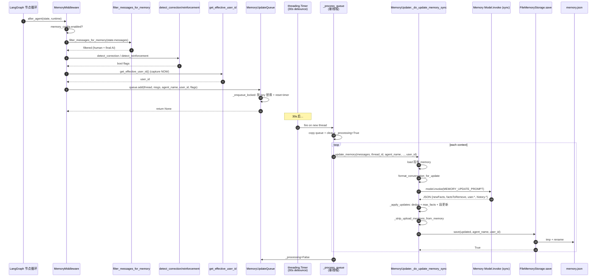
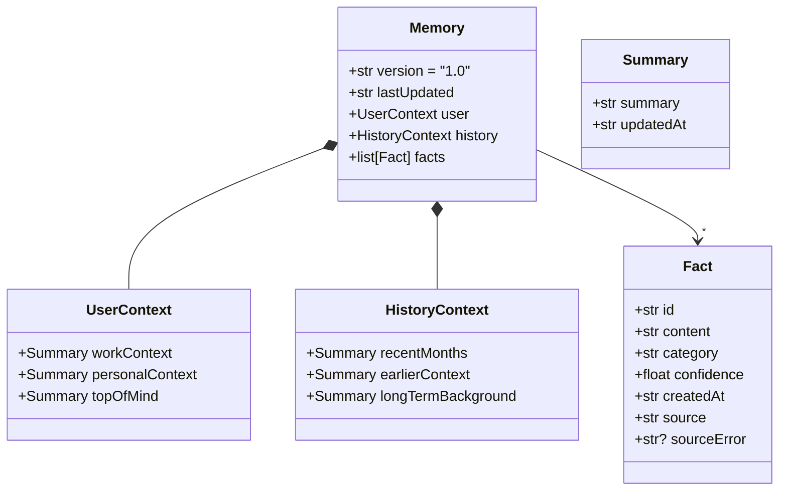

# 14 · MemoryMiddleware + 异步 Queue + Updater

> 13 篇结尾说："memory 不放 system prompt，是为了 prefix cache"。这一章把"memory 实际怎么被采集、抽取、持久化"讲清楚：从 `after_agent` 的消息过滤 → debounce 队列 → 后台线程 → LLM 抽事实 → 原子写文件 → mtime cache。
>
> 这是 deer-flow 整个"长期记忆"系统的核心机制。看完这一章，你会明白为什么 memory 抽取要异步、为什么 user_id 必须显式传递（不能依赖 ContextVar）、为什么用 LLM 抽事实而不是直接存对话。

---

## 1. 模块定位（Why this matters）

deer-flow 的 memory 系统不是简单的"对话历史"——它是一个 **LLM 驱动的事实抽取 + 摘要管道**：

1. **采集**（`MemoryMiddleware.after_agent`）：每次 agent run 结束时，过滤掉工具调用，只保留"用户输入 + 最终 AI 回复"对。
2. **去重排队**（`MemoryUpdateQueue.add`）：按 `(thread_id, user_id, agent_name)` 去重，30 秒 debounce 等更多对话进来一起处理。
3. **异步抽取**（`MemoryUpdater._do_update_memory_sync`）：后台线程用 LLM 读对话 + 现有 memory → 输出 JSON 格式的"该添加/删除哪些事实、哪些 context 段要更新"。
4. **原子写入**（`FileMemoryStorage.save`）：`tmp + rename` 原子替换；写完更新 mtime cache。

不读这一章会错过 4 个关键认知：

1. **`user_id` 必须在 enqueue 时显式捕获**：`MemoryMiddleware.after_agent` 调 `get_effective_user_id()` 然后塞进 `ConversationContext`——**而不是依赖后台 worker 读 ContextVar**。原因：`threading.Timer` 的 callback 在新线程跑，ContextVar 不传播。这是 02 篇 ContextVar 隔离教训的反面。
2. **filter_messages_for_memory 不只是"AI + Human"过滤**：它还做了"剥离 `<uploaded_files>` 块"、"跳过纯 upload-only 的 human + 紧随其后的 AI"两件事——防止"上传文件本身"被记成持久记忆（"用户上传过 foo.csv" 这种事实在下一次对话毫无意义）。
3. **correction + reinforcement 双信号**：deer-flow 用正则识别用户的"你错了" / "对就是这样" 这类信号，传给 LLM 让它特殊处理——记下"错误纠正"和"正确做法"成高 confidence 的 fact。这是把"用户反馈"自动转成"长期偏好"的工程化。
4. **同步 LLM 调用 + `asyncio.to_thread`**：注释明确说 issue #2615——async 路径会导致跨 loop 共享 httpx client、连接池污染。memory updater 强制走 sync `model.invoke()` 在独立线程里跑。

对应到 Harness 六要素：本章对应 **持久化记忆 + 反馈循环 + 上下文工程** 三条主线的核心。

---

## 2. 源码地图（Source Map）

### 2.1 关键文件清单

| 路径 | 角色 |
|------|------|
| [`packages/harness/deerflow/agents/middlewares/memory_middleware.py`](../packages/harness/deerflow/agents/middlewares/memory_middleware.py) | `MemoryMiddleware.after_agent`（111 行） |
| [`packages/harness/deerflow/agents/memory/queue.py`](../packages/harness/deerflow/agents/memory/queue.py) | `MemoryUpdateQueue / ConversationContext`（287 行） |
| [`packages/harness/deerflow/agents/memory/updater.py`](../packages/harness/deerflow/agents/memory/updater.py) | `MemoryUpdater + create_memory_fact + ...`（611 行） |
| [`packages/harness/deerflow/agents/memory/storage.py`](../packages/harness/deerflow/agents/memory/storage.py) | `MemoryStorage` 抽象 + `FileMemoryStorage`（232 行） |
| [`packages/harness/deerflow/agents/memory/prompt.py`](../packages/harness/deerflow/agents/memory/prompt.py) | `MEMORY_UPDATE_PROMPT / format_conversation_for_update`（363 行） |
| [`packages/harness/deerflow/agents/memory/message_processing.py`](../packages/harness/deerflow/agents/memory/message_processing.py) | `filter_messages_for_memory / detect_correction / detect_reinforcement`（109 行） |
| [`packages/harness/deerflow/agents/memory/summarization_hook.py`](../packages/harness/deerflow/agents/memory/summarization_hook.py) | `memory_flush_hook`：summarization 前强制刷 memory（34 行） |
| [`packages/harness/deerflow/config/memory_config.py`](../packages/harness/deerflow/config/memory_config.py) | `MemoryConfig` Pydantic（83 行） |
| [`packages/harness/deerflow/runtime/user_context.py`](../packages/harness/deerflow/runtime/user_context.py) | `get_effective_user_id`（02 篇见过） |

### 2.2 关键符号速查表

| 符号 | 文件:行 | 一句话职责 |
|------|---------|-----------|
| `class MemoryMiddleware` | `memory_middleware.py:28` | only after_agent hook |
| `MemoryMiddleware.after_agent(state, runtime)` | `memory_middleware.py:53` | 过滤消息 + enqueue |
| `filter_messages_for_memory(messages)` | `message_processing.py:56` | 留 human + final AI；剥 uploaded_files |
| `extract_message_text(message)` | `message_processing.py:40` | 兼容 string + list-of-blocks content |
| `detect_correction(messages)` | `message_processing.py:88` | 中英 11 个正则 |
| `detect_reinforcement(messages)` | `message_processing.py:100` | 中英 15 个正则 |
| `_UPLOAD_BLOCK_RE` | `message_processing.py:9` | `<uploaded_files>...</uploaded_files>` 整段匹配 |
| `class ConversationContext` | `queue.py:16` | 单条 enqueue 记录 |
| `class MemoryUpdateQueue` | `queue.py:28` | debounce + 去重 + 后台 timer |
| `MemoryUpdateQueue.add(...)` | `queue.py:52` | 加 + 重置 timer |
| `MemoryUpdateQueue._enqueue_locked(...)` | `queue.py:117` | 按 key 替换已有项 |
| `MemoryUpdateQueue._queue_key(...)` | `queue.py:43` | `(thread_id, user_id, agent_name)` |
| `MemoryUpdateQueue._process_queue()` | `queue.py:166` | timer callback：批量调 updater |
| `MemoryUpdateQueue.flush_nowait()` | `queue.py:228` | summarization 之前用 |
| `get_memory_queue()` | `queue.py:265` | 全局单例 |
| `class MemoryUpdater` | `updater.py:276` | LLM 抽取 + apply + save |
| `MemoryUpdater._prepare_update_prompt(...)` | `updater.py:318` | load + format + correction hint |
| `MemoryUpdater._do_update_memory_sync(...)` | `updater.py:396` | sync path，独立线程跑 |
| `MemoryUpdater.aupdate_memory(...)` | `updater.py:369` | async 包装，`asyncio.to_thread` |
| `MemoryUpdater._apply_updates(...)` | `updater.py:502` | 把 JSON 套到当前 memory dict |
| `MemoryUpdater._finalize_update(...)` | `updater.py:347` | parse + apply + save |
| `_fact_content_key(content)` | `updater.py:267` | whitespace-normalized casefold 去重 |
| `_strip_upload_mentions_from_memory(...)` | `updater.py:244` | 防 upload 事实污染 |
| `class FileMemoryStorage(MemoryStorage)` | `storage.py:62` | `tmp + rename` 原子 + mtime cache |
| `FileMemoryStorage._get_memory_file_path(...)` | `storage.py:84` | 4 级路径解析 |
| `FileMemoryStorage.save(...)` | `storage.py:160` | 原子写 + cache update |
| `get_memory_storage()` | `storage.py:196` | 反射加载 storage backend |
| `create_empty_memory()` | `storage.py:24` | 4 段式空 memory 结构 |
| `MEMORY_UPDATE_PROMPT` | `memory/prompt.py:?` | LLM 抽取的指令模板 |
| `memory_flush_hook` | `summarization_hook.py` | 在 summarization 之前 flush_nowait |

### 2.3 整体数据流



### 2.4 memory.json 的 4 段式结构



---

## 3. 核心逻辑精读（Deep Dive）

### 3.1 `MemoryMiddleware.after_agent`：采集入口

```python
# packages/harness/deerflow/agents/middlewares/memory_middleware.py:53-110
@override
def after_agent(self, state: MemoryMiddlewareState, runtime: Runtime) -> dict | None:
    config = self._memory_config or get_memory_config()
    if not config.enabled:
        return None

    # Get thread ID from runtime context first, then fall back to LangGraph's configurable metadata
    thread_id = runtime.context.get("thread_id") if runtime.context else None
    if thread_id is None:
        config_data = get_config()
        thread_id = config_data.get("configurable", {}).get("thread_id")
    if not thread_id:
        logger.debug("No thread_id in context, skipping memory update")
        return None

    messages = state.get("messages", [])
    if not messages:
        return None

    filtered_messages = filter_messages_for_memory(messages)

    user_messages = [m for m in filtered_messages if getattr(m, "type", None) == "human"]
    assistant_messages = [m for m in filtered_messages if getattr(m, "type", None) == "ai"]

    if not user_messages or not assistant_messages:
        return None

    correction_detected = detect_correction(filtered_messages)
    reinforcement_detected = not correction_detected and detect_reinforcement(filtered_messages)
    # Capture user_id at enqueue time while the request context is still alive.
    # threading.Timer fires on a different thread where ContextVar values are not
    # propagated, so we must store user_id explicitly in ConversationContext.
    user_id = get_effective_user_id()
    queue = get_memory_queue()
    queue.add(
        thread_id=thread_id,
        messages=filtered_messages,
        agent_name=self._agent_name,
        user_id=user_id,
        correction_detected=correction_detected,
        reinforcement_detected=reinforcement_detected,
    )

    return None
```

**5 个值得圈点的设计**：

1. **`only after_agent`**：06 篇讲过——挂在 `after_agent` 而不是 `after_model`。一次 run 结束才捕获完整对话（一个 user message 可能触发多轮 tool call + AI response）。
2. **thread_id 双源回退**：先从 `runtime.context` 取（一般 worker.py 注入），失败再读 `config.configurable`——保证多种调用路径都能拿到。
3. **`not user_messages or not assistant_messages`** 才入队**：纯系统消息或纯 tool 消息没有"对话价值"，跳过。
4. **`not correction_detected and detect_reinforcement(...)`** 互斥：correction 和 reinforcement 不能同时成立——"你错了"和"对就是这样"语义冲突，按 correction 优先。
5. **`user_id = get_effective_user_id()` 在 enqueue 之前同步抓**：这一行是整段 memory 系统最关键的设计决策——见 §3.6 详谈。

### 3.2 `filter_messages_for_memory`：3 重过滤

```python
# packages/harness/deerflow/agents/memory/message_processing.py:56-85
def filter_messages_for_memory(messages: list[Any]) -> list[Any]:
    """Keep only user inputs and final assistant responses for memory updates."""
    filtered = []
    skip_next_ai = False
    for msg in messages:
        msg_type = getattr(msg, "type", None)

        if msg_type == "human":
            content_str = extract_message_text(msg)
            if "<uploaded_files>" in content_str:
                stripped = _UPLOAD_BLOCK_RE.sub("", content_str).strip()
                if not stripped:
                    skip_next_ai = True
                    continue
                clean_msg = copy(msg)
                clean_msg.content = stripped
                filtered.append(clean_msg)
                skip_next_ai = False
            else:
                filtered.append(msg)
                skip_next_ai = False
        elif msg_type == "ai":
            tool_calls = getattr(msg, "tool_calls", None)
            if not tool_calls:
                if skip_next_ai:
                    skip_next_ai = False
                    continue
                filtered.append(msg)

    return filtered
```

**3 重过滤策略**：

| 类型 | 过滤行为 |
|------|---------|
| `human` 带 `<uploaded_files>` 块且整段就是 uploaded_files | **跳过 + 标记 skip_next_ai** |
| `human` 带 `<uploaded_files>` 但还有别的内容 | **剥离 `<uploaded_files>` 后保留** |
| `human` 不带 | 原样保留 |
| `ai` 带 tool_calls | **跳过**（中间步骤的 AI） |
| `ai` 不带 tool_calls | 保留（final response），但前一条 human 是纯 upload 则跳过 |

**`skip_next_ai` 状态机**：

- "纯 upload 的 human" + "紧随的 AI response" → 都跳过。因为这种对话是"我上传了文件" + "好的我看到了"——对未来对话毫无价值。
- "上传文件 + 同时问问题" 的 human → 剥掉 `<uploaded_files>` 保留问题；后面 AI 正常保留。

**`copy(msg)` 而非直接修改**：LangChain Message 对象在 LangGraph state 里共享，直接改会污染原 state。`copy` 一份再改是必要的防御。

### 3.3 `detect_correction / detect_reinforcement`：双语正则

```python
# packages/harness/deerflow/agents/memory/message_processing.py:10-37
_CORRECTION_PATTERNS = (
    re.compile(r"\bthat(?:'s| is) (?:wrong|incorrect)\b", re.IGNORECASE),
    re.compile(r"\byou misunderstood\b", re.IGNORECASE),
    re.compile(r"\btry again\b", re.IGNORECASE),
    re.compile(r"\bredo\b", re.IGNORECASE),
    re.compile(r"不对"),
    re.compile(r"你理解错了"),
    re.compile(r"你理解有误"),
    re.compile(r"重试"),
    re.compile(r"重新来"),
    re.compile(r"换一种"),
    re.compile(r"改用"),
)
_REINFORCEMENT_PATTERNS = (
    re.compile(r"\byes[,.]?\s+(?:exactly|perfect|that(?:'s| is) (?:right|correct|it))\b", re.IGNORECASE),
    re.compile(r"\bperfect(?:[.!?]|$)", re.IGNORECASE),
    re.compile(r"\bexactly\s+(?:right|correct)\b", re.IGNORECASE),
    re.compile(r"\bthat(?:'s| is)\s+(?:exactly\s+)?(?:right|correct|what i (?:wanted|needed|meant))\b", re.IGNORECASE),
    re.compile(r"\bkeep\s+(?:doing\s+)?that\b", re.IGNORECASE),
    re.compile(r"\bjust\s+(?:like\s+)?(?:that|this)\b", re.IGNORECASE),
    re.compile(r"\bthis is (?:great|helpful)\b(?:[.!?]|$)", re.IGNORECASE),
    re.compile(r"\bthis is what i wanted\b(?:[.!?]|$)", re.IGNORECASE),
    re.compile(r"对[，,]?\s*就是这样(?:[。！？!?.]|$)"),
    re.compile(r"完全正确(?:[。！？!?.]|$)"),
    re.compile(r"(?:对[，,]?\s*)?就是这个意思(?:[。！？!?.]|$)"),
    re.compile(r"正是我想要的(?:[。！？!?.]|$)"),
    re.compile(r"继续保持(?:[。！？!?.]|$)"),
)
```

**4 个工程细节**：

1. **中英文混合**：deer-flow 的目标用户群是中文 + 英文，正则双向覆盖。
2. **`\b` word boundary 仅对英文有效**：中文模式不用 `\b`——中文没有词边界概念。
3. **只看最近 6 条 human 消息**（行 90）：`recent_user_msgs = messages[-6:]`——避免历史里偶然出现的"perfect"误判。
4. **`(?:[。！？!?.]|$)` 句末锚定**：reinforcement 模式更严格，要求"句末停顿"——避免"perfectly fine but" 这种"perfect" 误判。

**信号的下游用途**：传给 `MemoryUpdater._build_correction_hint`（行 293），prompt 里告诉 LLM "用户明确纠正了你，请把正确做法记成 high confidence fact"。

### 3.4 `MemoryUpdateQueue`：debounce + 去重 + 后台

```python
# packages/harness/deerflow/agents/memory/queue.py:117-145
def _enqueue_locked(
    self,
    *,
    thread_id: str,
    messages: list[Any],
    agent_name: str | None,
    user_id: str | None,
    correction_detected: bool,
    reinforcement_detected: bool,
) -> None:
    queue_key = self._queue_key(thread_id, user_id, agent_name)
    existing_context = next(
        (context for context in self._queue if self._queue_key(context.thread_id, context.user_id, context.agent_name) == queue_key),
        None,
    )
    merged_correction_detected = correction_detected or (existing_context.correction_detected if existing_context is not None else False)
    merged_reinforcement_detected = reinforcement_detected or (existing_context.reinforcement_detected if existing_context is not None else False)
    context = ConversationContext(
        thread_id=thread_id,
        messages=messages,
        agent_name=agent_name,
        user_id=user_id,
        correction_detected=merged_correction_detected,
        reinforcement_detected=merged_reinforcement_detected,
    )

    self._queue = [context for context in self._queue if self._queue_key(context.thread_id, context.user_id, context.agent_name) != queue_key]
    self._queue.append(context)
```

**核心机制**：

- **key = `(thread_id, user_id, agent_name)`** 三元组——同一 thread 多轮对话只会保留**最新一条** message list。
- **`correction / reinforcement` 用 OR 合并**：debounce 期间任意一轮检测到 correction 就保留这个 flag。
- **list 重建模式**：先 filter 掉 same-key 项 + append 新 context。简洁但 O(n)——对 memory queue 这种"通常 < 10 项"的场景完全够。

```python
# packages/harness/deerflow/agents/memory/queue.py:146-164
def _reset_timer(self) -> None:
    config = get_memory_config()
    self._schedule_timer(config.debounce_seconds)
    logger.debug("Memory update timer set for %ss", config.debounce_seconds)


def _schedule_timer(self, delay_seconds: float) -> None:
    if self._timer is not None:
        self._timer.cancel()

    self._timer = threading.Timer(
        delay_seconds,
        self._process_queue,
    )
    self._timer.daemon = True
    self._timer.start()
```

**debounce 机制**：

- 每次 `add` 都 reset timer——30 秒倒计时重新开始。
- 用户连续聊 3 轮（每轮 5 秒）→ 第 3 轮结束 30 秒后才真正触发 processing。
- **如果 30 秒内没新对话** → 触发 `_process_queue`。

**`daemon=True`** 让 timer 线程跟着主进程退出——避免 Gateway shutdown 时 daemon 卡住。

```python
# packages/harness/deerflow/agents/memory/queue.py:166-214
def _process_queue(self) -> None:
    """Process all queued conversation contexts."""
    from deerflow.agents.memory.updater import MemoryUpdater

    with self._lock:
        if self._processing:
            self._schedule_timer(0)
            return

        if not self._queue:
            return

        self._processing = True
        contexts_to_process = self._queue.copy()
        self._queue.clear()
        self._timer = None

    logger.info("Processing %d queued memory updates", len(contexts_to_process))

    try:
        updater = MemoryUpdater()

        for context in contexts_to_process:
            try:
                logger.info("Updating memory for thread %s", context.thread_id)
                success = updater.update_memory(
                    messages=context.messages,
                    thread_id=context.thread_id,
                    agent_name=context.agent_name,
                    correction_detected=context.correction_detected,
                    reinforcement_detected=context.reinforcement_detected,
                    user_id=context.user_id,
                )
                # ...
            except Exception as e:
                logger.error("Error updating memory for thread %s: %s", context.thread_id, e)

            if len(contexts_to_process) > 1:
                time.sleep(0.5)
    finally:
        with self._lock:
            self._processing = False
```

**4 个工程亮点**：

1. **`if self._processing: self._schedule_timer(0); return`**：另一个 worker 还在跑时，新触发的 process 不重入——而是再排一个 0 秒 timer，等当前 worker 结束。**防止两个 LLM 调用并发跑同一份 memory.json，避免 lost update**。
2. **`copy + clear` 模式**：复制 queue 内容到本地变量再清空——临界区短、锁释放后才跑 LLM。
3. **try-except per context**：一条 context 处理失败不影响其它——partial success 而非 all-or-nothing。
4. **`time.sleep(0.5)` 节流**：批量处理时每条之间停 0.5 秒——防 LLM 端 rate limit。**对 memory 这种"几分钟级别延迟可接受"的工作来说，节流换稳定性是值得的**。

### 3.5 `MemoryUpdater._do_update_memory_sync`：sync path 的工程必要性

```python
# packages/harness/deerflow/agents/memory/updater.py:396-438
def _do_update_memory_sync(
    self,
    messages: list[Any],
    thread_id: str | None = None,
    agent_name: str | None = None,
    correction_detected: bool = False,
    reinforcement_detected: bool = False,
    user_id: str | None = None,
) -> bool:
    """Pure-sync memory update using ``model.invoke()``.

    Uses the *sync* LLM call path so no event loop is created.  This
    guarantees that the langchain provider's globally cached async
    httpx ``AsyncClient`` / connection pool (the one shared with the
    lead agent) is never touched — no cross-loop connection reuse is
    possible.
    """
    try:
        prepared = self._prepare_update_prompt(...)
        if prepared is None:
            return False

        current_memory, prompt = prepared
        model = self._get_model()
        response = model.invoke(prompt, config={"run_name": "memory_agent"})
        return self._finalize_update(
            current_memory=current_memory,
            response_content=response.content,
            thread_id=thread_id,
            agent_name=agent_name,
            user_id=user_id,
        )
    except json.JSONDecodeError as e:
        logger.warning("Failed to parse LLM response for memory update: %s", e)
        return False
    except Exception as e:
        logger.exception("Memory update failed: %s", e)
        return False
```

```python
# packages/harness/deerflow/agents/memory/updater.py:369-394
async def aupdate_memory(self, ...) -> bool:
    """Update memory asynchronously by delegating to the sync path.

    Uses ``asyncio.to_thread`` to run the *sync* ``model.invoke()`` path
    in a worker thread so no second event loop is created and the
    langchain async httpx client pool (shared with the lead agent) is
    never touched.  This eliminates the cross-loop connection-reuse bug
    described in issue #2615.
    """
    return await asyncio.to_thread(
        self._do_update_memory_sync,
        messages=messages,
        ...
    )
```

**issue #2615 的故事**：

- LangChain provider（例如 `langchain_openai.ChatOpenAI`）会在第一次使用时**创建并缓存全局 async httpx Client**。
- 这个 client 绑定的是"创建它时所在的 event loop"。
- Lead agent 在 LangGraph 的 main loop 用它。
- 如果 memory updater 在**另一个 loop 里** `model.ainvoke()` → httpx 试图复用同一个 client，但 client 的 loop 已经关了 → 报 `Event loop is closed` 或 connection pool 错乱。

**deer-flow 的解法**：memory updater 只用 sync `model.invoke()`。sync 路径用 sync httpx Client（独立于 async client），不和 lead agent 共享。即使在 async 路径调用（`aupdate_memory`），也通过 `asyncio.to_thread` 把整个 sync invoke 抛到独立线程跑——线程里完全没有 event loop。

**这是 deer-flow 这种"主流程 + 后台异步任务"双轨架构的最佳实践**。任何长期运行的后台任务都该考虑"我用的资源是否绑死在主 loop 上"。

### 3.6 `user_id` 必须在 enqueue 时同步抓——ContextVar 的反面教训

```python
# packages/harness/deerflow/agents/middlewares/memory_middleware.py:96-99
# Capture user_id at enqueue time while the request context is still alive.
# threading.Timer fires on a different thread where ContextVar values are not
# propagated, so we must store user_id explicitly in ConversationContext.
user_id = get_effective_user_id()
```

**问题背景**：

- 02 篇讲过 `_current_user` 是 `ContextVar`——asyncio task 间自动隔离 + 继承。
- 但 `threading.Timer` 的 callback 在**全新的 OS 线程**里跑，**不**继承父线程的 ContextVar。
- 如果 worker 想知道当前 user_id：
  - 在 worker 里调 `get_effective_user_id()` → 拿到的是默认值（"default"）或 None。
  - 在 enqueue 时调 → 拿到的是真正发起请求的用户 id。

**deer-flow 的解法**：**强制在 enqueue 时同步抓 user_id，塞进 ConversationContext**。worker 从 context 读，不依赖 ContextVar。

**对比 02 篇**：那里讲 ContextVar 是"asyncio task-local 自动继承"。这一篇展示了它的边界——**只对 asyncio task 有效，不对 threading thread 有效**。这是 Python 并发模型里的微妙差异。

**面试金句**：deer-flow 的 memory queue 用 threading.Timer 而非 asyncio Task，所以必须在请求线程同步捕获 user_id 塞入 ConversationContext——这是 ContextVar 在跨执行模型（asyncio ↔ threading）时不传播的反面教训。

### 3.7 `_apply_updates`：fact 去重 + 上限

```python
# packages/harness/deerflow/agents/memory/updater.py:547-575 (节选)
# Add new facts
existing_fact_keys = {
    fact_key for fact_key in (_fact_content_key(fact.get("content")) for fact in current_memory.get("facts", []))
    if fact_key is not None
}
new_facts = update_data.get("newFacts", [])
for fact in new_facts:
    confidence = fact.get("confidence", 0.5)
    if confidence >= config.fact_confidence_threshold:
        raw_content = fact.get("content", "")
        if not isinstance(raw_content, str):
            continue
        normalized_content = raw_content.strip()
        fact_key = _fact_content_key(normalized_content)
        if fact_key is not None and fact_key in existing_fact_keys:
            continue   # 已存在，跳过

        fact_entry = {
            "id": f"fact_{uuid.uuid4().hex[:8]}",
            "content": normalized_content,
            ...
        }
        current_memory["facts"].append(fact_entry)
        if fact_key is not None:
            existing_fact_keys.add(fact_key)

# Enforce max facts limit
if len(current_memory["facts"]) > config.max_facts:
    current_memory["facts"] = sorted(
        current_memory["facts"],
        key=lambda f: f.get("confidence", 0),
        reverse=True,
    )[: config.max_facts]
```

```python
# packages/harness/deerflow/agents/memory/updater.py:267-273
def _fact_content_key(content: Any) -> str | None:
    if not isinstance(content, str):
        return None
    stripped = content.strip()
    if not stripped:
        return None
    return stripped.casefold()
```

**3 个值得圈点**：

1. **`stripped.casefold()` 作 dedup key**：normalize whitespace + case → `"Likes coffee"` 和 `"likes coffee  "` 算同一条。`casefold` 比 `lower` 更激进（处理 Unicode 特殊字符如 `ß` → `ss`）。
2. **confidence threshold 过滤**：低于 `fact_confidence_threshold`（默认 0.7）的新 fact 直接丢弃——防 LLM 抽出"猜测性"事实。
3. **`max_facts` 截断按 confidence 排序**：超过上限时保留 confidence 最高的 N 条——**淘汰最不确定的**，不是淘汰最老的。这是 deer-flow 对"信任度优先"的工程实现。

### 3.8 `FileMemoryStorage.save`：原子写

```python
# packages/harness/deerflow/agents/memory/storage.py:160-189
def save(self, memory_data: dict[str, Any], agent_name: str | None = None, *, user_id: str | None = None) -> bool:
    file_path = self._get_memory_file_path(agent_name, user_id=user_id)
    cache_key = self._cache_key(agent_name, user_id=user_id)

    try:
        file_path.parent.mkdir(parents=True, exist_ok=True)
        # Shallow-copy before adding lastUpdated so the caller's dict is not
        # mutated as a side-effect, and the cache reference is not silently
        # updated before the file write succeeds.
        memory_data = {**memory_data, "lastUpdated": utc_now_iso_z()}

        temp_path = file_path.with_suffix(f".{uuid.uuid4().hex}.tmp")
        with open(temp_path, "w", encoding="utf-8") as f:
            json.dump(memory_data, f, indent=2, ensure_ascii=False)

        temp_path.replace(file_path)

        try:
            mtime = file_path.stat().st_mtime
        except OSError:
            mtime = None

        with self._cache_lock:
            self._memory_cache[cache_key] = (memory_data, mtime)
        logger.info("Memory saved to %s", file_path)
        return True
    except OSError as e:
        logger.error("Failed to save memory file: %s", e)
        return False
```

**4 个工程亮点**：

1. **`uuid.uuid4().hex` 后缀的 tmp 文件名**：防多 worker 同时写时的 tmp 文件冲突。
2. **`temp_path.replace(file_path)`** 是 POSIX 原子操作：要么完整替换、要么没动作——**memory.json 永远不会处于"半写完"状态**。
3. **`{**memory_data, "lastUpdated": ...}` 浅拷贝**：避免 mutate 调用者的 dict + 避免 cache reference 在写失败时已经被更新。
4. **写成功后才 update cache mtime**：保证 cache 状态和文件状态一致。

`load` 方法（行 123-143）的 mtime 比对：

```python
def load(self, agent_name=None, *, user_id=None) -> dict[str, Any]:
    file_path = self._get_memory_file_path(agent_name, user_id=user_id)
    cache_key = self._cache_key(agent_name, user_id=user_id)

    try:
        current_mtime = file_path.stat().st_mtime if file_path.exists() else None
    except OSError:
        current_mtime = None

    with self._cache_lock:
        cached = self._memory_cache.get(cache_key)
        if cached is not None and cached[1] == current_mtime:
            return cached[0]   # hit

    memory_data = self._load_memory_from_file(...)

    with self._cache_lock:
        self._memory_cache[cache_key] = (memory_data, current_mtime)

    return memory_data
```

**和 03 / 11 篇同模式**——mtime cache。Gateway API 直接编辑 memory.json（管理面）后下次 read 就能看到新值。

### 3.9 `memory_flush_hook`：summarization 之前强制刷

```python
# packages/harness/deerflow/agents/memory/summarization_hook.py 全文
from deerflow.agents.memory.queue import get_memory_queue


async def memory_flush_hook(state, runtime, *args, **kwargs) -> None:
    """Hook called before summarization runs.

    Ensures memory queue is flushed so the conversation that's about to be
    summarized has been recorded in memory first. Otherwise summarization
    would truncate the messages and the memory updater would never see them.
    """
    queue = get_memory_queue()
    queue.flush_nowait()
```

**这个 hook 解决的问题**：

- summarization 中间件会"折叠"老消息成 summary（18 篇详谈）。
- 如果 memory updater 还没跑（30 秒 debounce 还没到），summarization 一折叠，**原始对话内容就丢了**——memory 永远抽不到这些事实。

`memory_flush_hook` 在 summarization 触发前强制 enqueue 立刻 process（`flush_nowait`，0 秒 timer）——让 memory 抽取**优先于 summarization**。

**注册位置**：`lead_agent/agent.py:96-97`：

```python
if resolved_app_config.memory.enabled:
    hooks.append(memory_flush_hook)
```

这是个**有意的依赖反转**——memory 系统通过 hook 影响 summarization 中间件的行为，但 memory 模块本身不知道 summarization 存在。

---

## 4. 关键问题答疑（Key Questions）

### Q1：为什么 memory 是异步的（30s debounce）？

3 个原因：

1. **LLM 抽事实慢**：调一次 memory model 大约 1-3 秒——挂在 request path 上用户感受到明显延迟。
2. **debounce 让多轮对话批量处理**：用户连续聊 5 轮 → 抽 1 次（看到完整上下文），而不是抽 5 次。
3. **失败可容忍**：memory 抽错或失败不影响当前对话——可以"best-effort"处理。

代价：用户**最近 30s 内**的对话还没进 memory——但下一轮还有 prefix cache + dynamic context 可以看到完整 ThreadState 的 messages，影响不大。

### Q2：如果进程在 30s debounce 期间崩溃，memory 丢了吗？

会丢。memory queue 是 in-process，没有 WAL（write-ahead log）。daemon thread 也跟着进程退出。

**这是设计取舍**——做持久化队列（Redis / SQLite）会引入额外依赖。memory 只是"best-effort 长期记忆"，不是"必须可靠"的数据流。**关键事实在 ThreadState.messages 里仍可被 LLM 看到**——下一次对话时 memory 系统会重新抽（如果 LangGraph checkpointer 保留了对话历史）。

### Q3：correction 和 reinforcement 双正则会误判吗？

会。比如用户说 "perfect, but next time..." 会触发 reinforcement 但语义其实有 caveat。但：

- 这种边界 case 的影响是 LLM 把当前做法记成 high-confidence fact——下一次可能不太想换。
- 用户下一轮纠正一次就会重新抽——self-correcting。

**正则的意义不是 100% 准确，是给 LLM 一个 hint**——LLM 还会自己判断对话语义后决定怎么 record fact。

### Q4：`max_facts` 上限是多少？怎么淘汰？

默认 100（`MemoryConfig.max_facts`）。超出后按 confidence 排序保留 top 100——**最低 confidence 被淘汰**。

**注意不是淘汰最旧的**——这是 deer-flow 的选择：信任度优先于时间。LLM 抽出的高 confidence 事实多半是用户明确表达的偏好（"我喜欢用 Python"），值得长期保留。

### Q5：memory.json 在哪里？per-user 还是 global？

看 `_get_memory_file_path`（storage.py:84）：

| 场景 | 路径 |
|------|------|
| `user_id != None`, `agent_name != None` | `{base}/users/{user}/agents/{agent}/memory.json` |
| `user_id != None`, `agent_name = None` | `{base}/users/{user}/memory.json` |
| `user_id = None`, `agent_name != None`（legacy） | `{base}/agents/{agent}/memory.json` |
| `user_id = None`, `agent_name = None`（legacy） | `{base}/memory.json` 或 `config.storage_path` |

**当前 deer-flow 鼓励 per-user**——`get_effective_user_id` 在 no-auth 模式下也会返回 "default"，所以默认走 per-user 路径。

### Q6：用户能手工删一条 fact 吗？

可以——通过 Gateway API：

- `POST /api/memory` create_memory_fact（手动加）
- `DELETE /api/memory/{fact_id}` delete_memory_fact
- `PUT /api/memory/{fact_id}` update_memory_fact

底层调 `updater.create_memory_fact / delete_memory_fact / update_memory_fact`（行 96-191）。这给了用户对自己 memory 的完全控制权——这是 deer-flow 对 "memory 应该是用户的、不是黑箱"的工程态度。

---

## 5. 横向延伸与面试级洞察（Interview-Grade Insights）

### 5.1 LLM 抽事实 vs 直接存对话

deer-flow 没选最简单的"把每轮对话原样存进 memory.json"——选了 LLM 抽取：

| 方案 | 优点 | 缺点 |
|------|------|------|
| **原样存** | 简单、无 LLM 成本 | memory 越积越长、prompt 塞爆 |
| **LLM 抽** | 精炼、可控大小、可分类 | 成本（每次 LLM）、有抽错风险 |

deer-flow 选后者是因为**记忆的 prompt budget 是死的**（15 篇 `max_injection_tokens`）—— 必须压缩到可注入的尺寸。LLM 抽取是把"无限对话"压成"有限事实"的工程化。

**面试金句**：deer-flow 的 memory 系统不是日志，是 LLM 抽取的"用户档案 + 长期事实库"——4 段式（user context / history / facts / metadata）让记忆有结构、可裁剪、可手动编辑。这是从"记日记"到"档案管理"的认知升级。

### 5.2 debounce 是 agent 系统的"反直觉"工程

普通 web 服务的事件处理是"立即响应"。但 agent 系统的后台任务（memory / token usage / title 生成）反而要"延迟响应"——因为：

- 单次事件价值低（一轮对话抽不出多少 fact）。
- 批量事件可优化（多轮一起送 LLM 节省 tokens）。
- 实时性要求低（30s 延迟用户感知不到）。

deer-flow 的 `MemoryUpdateQueue` 是这种工程模式的标准实现。同模式还有：

- token_usage（19 篇）也是 after_model batch 累积。
- title 生成在 first AI response 后才触发。

### 5.3 ContextVar vs threading 的边界

这一篇的 user_id 捕获是 deer-flow 整个代码库**最重要的一处 ContextVar 边界教训**。规则总结：

| 跨边界场景 | ContextVar 是否传播 |
|----------|------------------|
| `await asyncio.create_task(...)` | ✅ 自动 |
| `await loop.run_in_executor(...)` | ✅ 自动（context.run 包装） |
| `asyncio.to_thread(fn)` | ✅ 自动 |
| `threading.Thread(...)` | ❌ **不传播** |
| `threading.Timer(delay, fn)` | ❌ **不传播** |
| `concurrent.futures.ThreadPoolExecutor.submit(fn)` | ❌ **不传播** |

**deer-flow 的解决套路**：在"还在 asyncio 上下文"的时候 sync 抓出来塞进 dataclass，传给后续线程。这种"早绑定"模式适用于所有需要跨线程传递 ContextVar 的场景。

### 5.4 vs 同行框架

| 框架 | 长期记忆 |
|------|--------|
| **LangChain** `ConversationSummaryMemory` | 每轮触发 LLM summary，无 debounce |
| **AutoGen** | 默认无长期 memory，靠用户存 |
| **LangGraph 官方** | checkpointer 存 thread state，无"提炼"层 |
| **Letta (MemGPT)** | 复杂的 working memory + archival memory 双层 |
| **deer-flow** | debounce queue + 4 段式 memory + correction/reinforcement 信号 |

deer-flow 的设计简洁但完整——不到 1000 行核心代码实现了 production-quality 的长期记忆。

---

## 6. 实操教程（Hands-on Lab）

### 6.1 最小可运行示例：手动跑一遍 memory 更新

```python
# backend/debug_memory.py
"""不通过 agent，直接喂对话给 MemoryUpdater"""
import logging
logging.basicConfig(level=logging.INFO)

from langchain_core.messages import AIMessage, HumanMessage
from deerflow.agents.memory.updater import MemoryUpdater
from deerflow.agents.memory.storage import get_memory_storage


messages = [
    HumanMessage(content="My name is Sanshi and I work as a Python developer at ByteDance."),
    AIMessage(content="Nice to meet you, Sanshi! I'll remember you're a Python developer at ByteDance."),
    HumanMessage(content="I prefer functional programming style over OOP."),
    AIMessage(content="Got it. I'll lean toward functional patterns in future suggestions."),
    HumanMessage(content="对就是这样"),     # 触发 reinforcement
    AIMessage(content="Glad to hear!"),
]

updater = MemoryUpdater()
success = updater.update_memory(
    messages=messages,
    thread_id="debug-thread-001",
    agent_name=None,
    correction_detected=False,
    reinforcement_detected=True,
    user_id="debug-user",
)
print(f"Success: {success}")

# 看 memory.json 是什么样
storage = get_memory_storage()
mem = storage.load(user_id="debug-user")
print("\n=== Memory state ===")
import json
print(json.dumps(mem, indent=2, ensure_ascii=False)[:1500])
```

跑：`cd backend && PYTHONPATH=. uv run python debug_memory.py`

**能看到**：

- LLM 抽出了"Sanshi", "Python developer", "ByteDance", "prefers functional"等 facts。
- reinforcement_detected=True 让某些 fact 的 confidence > 0.9。
- `user.workContext.summary` 大致为 "Python developer at ByteDance"。

### 6.2 Debug 任务清单

#### 实验 ①：观察 filter_messages_for_memory 的 3 重过滤

```python
from langchain_core.messages import HumanMessage, AIMessage
from deerflow.agents.memory.message_processing import filter_messages_for_memory

msgs = [
    HumanMessage(content="<uploaded_files>file1.csv</uploaded_files>"),   # 纯上传
    AIMessage(content="I see your file"),                                  # 跟随的 AI - 应被跳过
    HumanMessage(content="<uploaded_files>file2.csv</uploaded_files>\nAnalyze this"),  # 混合
    AIMessage(content="", tool_calls=[{"name": "read_file", "args": {}, "id": "1"}]),  # tool call
    AIMessage(content="Here's my analysis"),                               # final response
]

filtered = filter_messages_for_memory(msgs)
for m in filtered:
    print(f"{m.type}: {m.content[:60]}")
# 预期：human (剥掉 uploaded_files) → "Analyze this"
#       ai (final) → "Here's my analysis"
```

**能学到**：3 重过滤的实际行为——纯上传的 human + 跟随 AI 全跳过；混合 human 剥掉 uploaded_files；中间 AI（tool_calls）跳过；final AI 保留。

#### 实验 ②：观察 debounce 行为

```python
import time
from deerflow.agents.memory.queue import get_memory_queue
from langchain_core.messages import HumanMessage, AIMessage

queue = get_memory_queue()
queue.clear()

# 连续 3 次 add 同一 thread
for i in range(3):
    queue.add(
        thread_id="t1",
        messages=[HumanMessage(content=f"msg{i}"), AIMessage(content=f"reply{i}")],
        user_id="u1",
    )
    print(f"After add {i}: pending={queue.pending_count}")
    time.sleep(1)

# 30 秒等 debounce 触发
print("Waiting for debounce (default 30s)...")
time.sleep(35)
print(f"After debounce: pending={queue.pending_count}, processing={queue.is_processing}")
```

**能学到**：pending count 始终 = 1（按 key 替换，不是叠加）；30 秒后才触发 process。

#### 实验 ③：故意造一个 correction 信号

```python
from deerflow.agents.memory.message_processing import detect_correction, detect_reinforcement
from langchain_core.messages import HumanMessage

en_correction = [HumanMessage(content="That's wrong, try again")]
zh_correction = [HumanMessage(content="不对，你理解错了")]
en_reinforcement = [HumanMessage(content="perfect!")]
zh_reinforcement = [HumanMessage(content="对，就是这样")]

print(f"EN correction: {detect_correction(en_correction)}")
print(f"ZH correction: {detect_correction(zh_correction)}")
print(f"EN reinforcement: {detect_reinforcement(en_reinforcement)}")
print(f"ZH reinforcement: {detect_reinforcement(zh_reinforcement)}")
```

**能学到**：中英双语正则都能 hit。如果你写自定义信号（例如领域术语"不太对"），可以扩展 `_CORRECTION_PATTERNS`。

---

## 7. 与下一模块的衔接

读完本章你应该能：

- 解释为什么 memory 抽取是异步 + debounce + 后台线程。
- 说出 `user_id` 必须在 enqueue 时同步抓的原因（ContextVar 不跨 threading 传播）。
- 区分 `filter_messages_for_memory` 的 3 重过滤策略。
- 描述 `_apply_updates` 的 fact 去重 + max_facts 信任度优先淘汰策略。
- 知道 `_do_update_memory_sync` 用 sync `model.invoke()` 是为了避免 issue #2615 的跨 loop httpx client 复用。

接下来 **15 篇（DynamicContextMiddleware 与 Prefix Cache 友好的注入策略）** 把"memory 的另一面"讲清楚——抽好的 facts 怎么被注入到下一轮对话。13 篇结尾说 memory 不放 system prompt，那它放哪里？答案是 `<system-reminder>` 包裹的 first HumanMessage。看完 15 篇你就能完整理解 deer-flow 的"prefix cache + 动态注入"双轨设计。

---

📌 **本章已交付**。请你检查后告诉我：
- 哪几段读起来不顺？
- 是否要补"`MEMORY_UPDATE_PROMPT` 完整模板的逐段解读"？
- 还是直接进入 15 篇？
