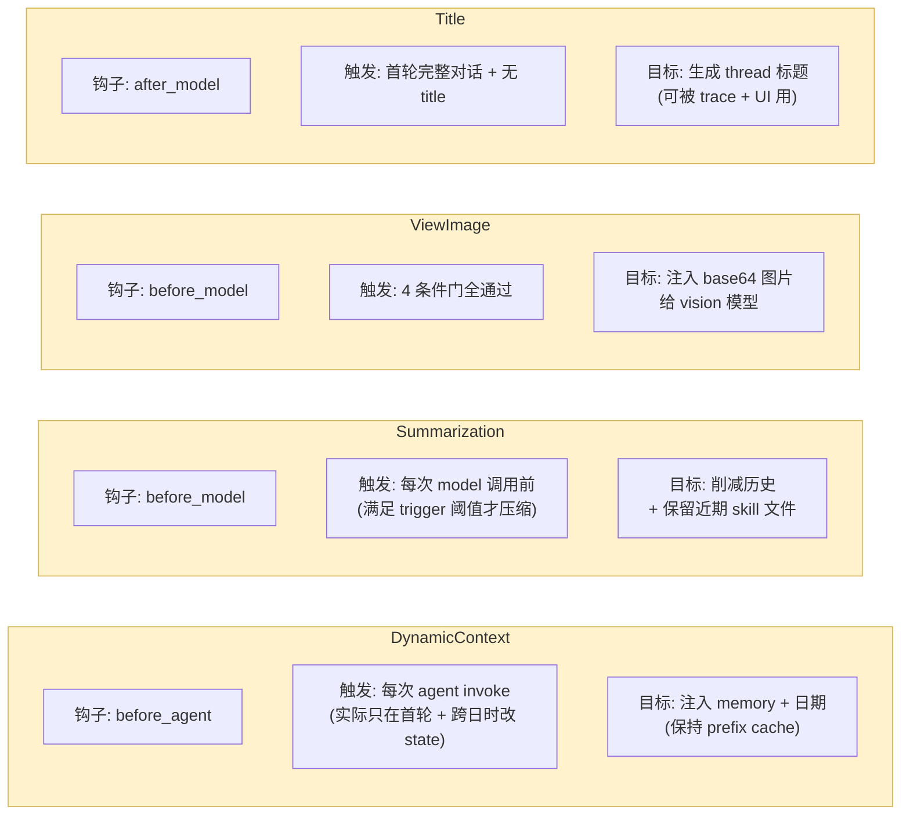
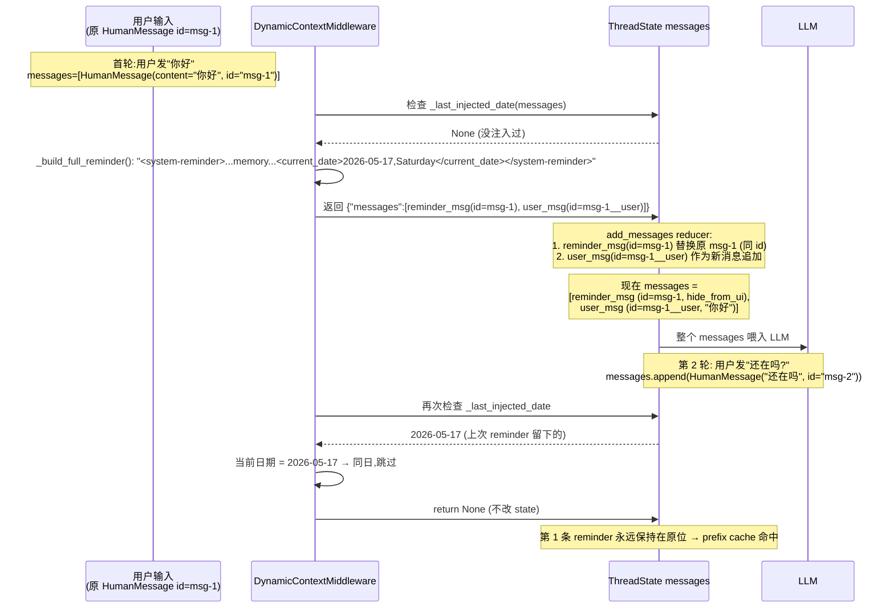
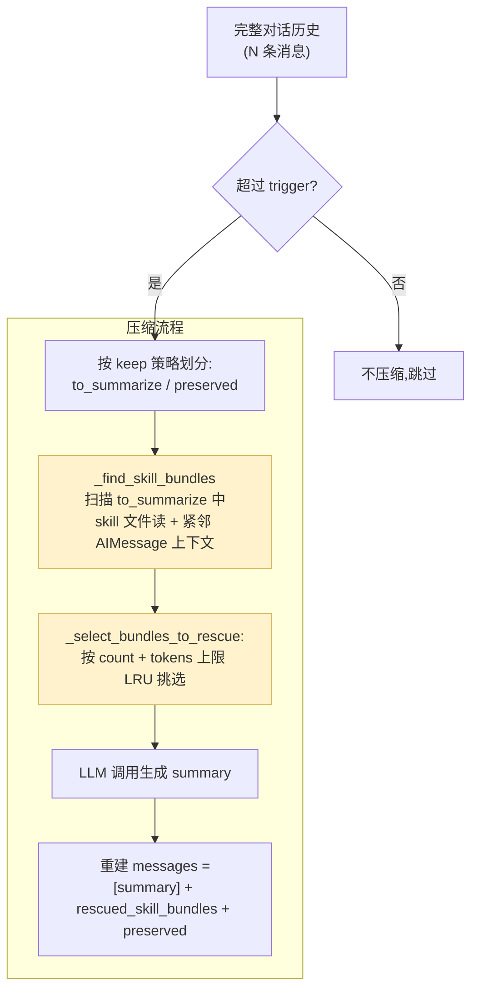

# 14 · 中间件深潜 ③：上下文工程层（Summarization / DynamicContext / ViewImage / Title）

> 核心模块层第 5 篇 —— 中间件深潜第 3 季也是最后一季。前两季讲了"启动初始化"和"错误恢复"；本章讲**"对 LLM 看到什么"的精细操控** —— 这才是 "Context Engineering" 这个词的本意。
>
> 这 4 个中间件全部都在做同一件事：**调整 messages 列表，让 LLM 在每次调用前看到"最优的上下文"**。但它们各自的关注角度不同：Summarization 削减历史、DynamicContext 注入运行时元信息、ViewImage 注入多模态内容、Title 提取一个对话级摘要。
>
> 关键看点：**DynamicContextMiddleware 的"frozen-snapshot + ID-swap"模式** —— 它能在保持 prefix-cache 命中的前提下，把动态信息（日期、记忆）注入到对话最前部。这是 DeerFlow prompt engineering 工程深度最具代表性的设计之一。

---

## 🎯 学习目标

读完这份文档，你能回答：

1. **DeerFlow 的 `SummarizationMiddleware` 继承自 LangChain 官方版本，但额外加了 "skill rescue"** —— 这个机制保护最近 N 个 skill 文件读不被压缩掉。为什么 skill 内容比普通历史更值得保留？
2. **`DynamicContextMiddleware` 的"ID-swap"技术** —— 把 reminder 消息伪装成"对原 user message 的替换"（同 ID），原 user 内容用派生 ID（`{id}__user`）作为下一条。这种迂回为什么是必要的？直接 prepend 一条新 HumanMessage 不行吗？
3. **`DynamicContextMiddleware` 怎么处理"会话跨午夜"**？为什么不简单"每轮都重新注入"？
4. **`ViewImageMiddleware` 的"4 条件门"**（有 AIMessage？含 view_image 调用？全部 tool 完成？还没注入过？）—— 每一条缺失会怎样？
5. **`TitleMiddleware` 是 4 个中间件里唯一调用 LLM 的**。为什么它给 LLM 调用打上 `tags=["middleware:title"]`？这个 tag 在 trace 里起什么作用？

---

## 🗂️ 源码定位

| 关注点 | 文件 / 行号 | 关键锚点 |
|---|---|---|
| `DeerFlowSummarizationMiddleware`（继承 LangChain） | `packages/harness/deerflow/agents/middlewares/summarization_middleware.py` | `SummarizationEvent` L25；`BeforeSummarizationHook` Protocol L36；`DeerFlowSummarizationMiddleware` L98；`_partition_with_skill_rescue` L203；`_find_skill_bundles` L251；`_select_bundles_to_rescue` L313 |
| `SummarizationConfig` | `packages/harness/deerflow/config/summarization_config.py` | `ContextSize`（type=fraction/tokens/messages + value）；`SummarizationConfig` 字段：`trigger / keep / trim_tokens_to_summarize / preserve_recent_skill_count=5 / preserve_recent_skill_tokens=25000 / preserve_recent_skill_tokens_per_skill=5000 / skill_file_read_tool_names` |
| `DynamicContextMiddleware` | `packages/harness/deerflow/agents/middlewares/dynamic_context_middleware.py` | `_DYNAMIC_CONTEXT_REMINDER_KEY` L48；`is_dynamic_context_reminder` L58；`_last_injected_date` L63；`_make_reminder_and_user_messages` L120（ID-swap 核心）；`_inject` L143；`before_agent` L181 |
| `ViewImageMiddleware` | `packages/harness/deerflow/agents/middlewares/view_image_middleware.py` | `ViewImageMiddlewareState` L15；`_get_last_assistant_message` L42；`_has_view_image_tool`；`_all_tools_completed`；`_create_image_details_message` L94；`_should_inject_image_message` L132（4 条件门）；`_inject_image_message` L177；`before_model` |
| `TitleMiddleware` | `packages/harness/deerflow/agents/middlewares/title_middleware.py` | `TitleMiddlewareState` L24；`_should_generate_title` L70；`_strip_think_tags` L116（处理 reasoning 模型）；`_get_runnable_config` L131（注入 trace tag）；`_generate_title_result` L142（sync 走 fallback）；`_agenerate_title_result` L150（async 真调 LLM） |
| `_get_memory_context`（被 DynamicContext 调用） | `packages/harness/deerflow/agents/lead_agent/prompt.py` | L554；返回当前 user / agent 的记忆文本块 |

---

## 🧭 架构图

### 1. 四件套各自的钩子、触发条件、目标



### 2. DynamicContext 的"frozen-snapshot + ID-swap"机制



### 3. Summarization 的 skill rescue 机制



---

## 🔍 核心逻辑讲解

### Part 1 · `DynamicContextMiddleware` —— ID-swap 是怎么保住 prefix cache 的

#### 核心矛盾

**对 LLM 来说**：
- prefix cache 命中要求 messages 列表**前若干条完全字节级一致**
- 如果你想让 LLM 知道"今天是 2026-05-17"，把日期塞进 system prompt → **每天 system prompt 都变** → cache 完全失效
- 把日期塞进 first HumanMessage → 也每轮都变 → cache 仍失效

**DeerFlow 的解法（frozen-snapshot pattern）**：
1. **首轮注入**：把 `<system-reminder>` 作为**单独的 HumanMessage** 插到第一条用户消息**之前**；插入后**永久保存**在 state 中
2. **后续轮次**：state 里已经有这条 reminder 了，**不再改动** → 整个 messages 前部"冻结" → prefix cache 永远命中
3. **跨日检测**：只在跨过午夜时（`last_date != current_date`）才注入一条**轻量** date-update 提醒到**最新**的用户消息前

→ **prefix cache 永远从首条消息开始命中**，跨日只损失"最新一条之前"的几个 token。

#### ID-swap 技术：核心 12 行代码

```python
@staticmethod
def _make_reminder_and_user_messages(original: HumanMessage, reminder_content: str) -> tuple[HumanMessage, HumanMessage]:
    stable_id = original.id or str(uuid.uuid4())
    reminder_msg = HumanMessage(
        content=reminder_content,
        id=stable_id,                                          # ⭐ 占用原 ID
        additional_kwargs={"hide_from_ui": True, _DYNAMIC_CONTEXT_REMINDER_KEY: True},
    )
    user_msg = HumanMessage(
        content=original.content,
        id=f"{stable_id}__user",                                # ⭐ 派生 ID
        name=original.name,
        additional_kwargs=original.additional_kwargs,
    )
    return reminder_msg, user_msg
```

**为什么不直接 prepend 一条新 HumanMessage？**

```python
# ❌ 直觉做法 1:返回新增 reminder 消息
return {"messages": [HumanMessage(reminder, id="new-uuid-1")]}
```

LangGraph 的 `add_messages` reducer：**新 id → append 到末尾**。这样 reminder 跑到末尾去了，**不在 first 位置**，无法把日期"前置"给 LLM。

```python
# ❌ 直觉做法 2:返回 RemoveMessage(原 id) + 新 reminder + 重发原 user
return {"messages": [RemoveMessage(id=original.id), reminder_msg, user_msg]}
```

可以工作，但**有副作用**：
- 删除再插入会让 messages 列表 churn 一遍（前端流式可能短时间看不到任何用户消息）
- 顺序需要小心维护

**ID-swap 做法**：
```python
return {"messages": [reminder_msg, user_msg]}
```
- `reminder_msg` 用**原 ID** → reducer 视为"对原 user_msg 的替换"，**原 messages 列表里 msg-1 这一位被悄悄换成 reminder**
- `user_msg` 用**派生 ID `{id}__user`** → reducer 视为新增，紧接 reminder 之后

**最终效果**：messages 数组在用户视角"还是 1 条"（首条消息内容被悄悄前置了 reminder + 原内容仍在），但**字节序列**变成 `[reminder, user]`。

#### `additional_kwargs.hide_from_ui` —— 前端过滤

```python
additional_kwargs={"hide_from_ui": True, _DYNAMIC_CONTEXT_REMINDER_KEY: True}
```

两个标记：
- **`hide_from_ui: True`** —— 前端流式渲染时跳过这条（不让用户看到 `<system-reminder>` 块）
- **`_DYNAMIC_CONTEXT_REMINDER_KEY: True`** —— 其他中间件（如 Summarization、Title）用 `is_dynamic_context_reminder()` 函数识别后**特殊处理**：
  - Summarization 把它从压缩 partition 里排除
  - Title 在统计"用户消息数"时跳过

#### 跨日检测的精妙之处

```python
def _last_injected_date(messages: list) -> str | None:
    for msg in reversed(messages):
        if is_dynamic_context_reminder(msg):       # 用 additional_kwargs 标记识别
            content_str = msg.content if isinstance(msg.content, str) else str(msg.content)
            return _extract_date(content_str)       # 正则取出 <current_date>...</current_date>
    return None
```

**关键**：用 `additional_kwargs.dynamic_context_reminder` flag 识别 reminder，而**不是**用"content 含 `<system-reminder>`" 字符串匹配 —— **防止用户消息里包含 `<system-reminder>` 字面量被误判**。

**跨日时机**：
- `last_date != current_date` → 注入 date-update reminder 到**最新**用户消息前（不是首条）
- 用同样的 ID-swap：最新用户消息 ID 被 reminder 占用，原内容用派生 ID

→ 这样**首条 reminder 仍冻结**（prefix cache 仍命中前部），只在跨日那一轮的"最后一条之前"插了短 reminder。

### Part 2 · `SummarizationMiddleware` —— Skill rescue 为什么是必要的

#### LangChain 官方 SummarizationMiddleware 的标准行为

LangChain 自带的 SummarizationMiddleware：
- 触发：messages 数 / tokens / fraction 超阈值
- 行为：取最老 N 条 → LLM 生成 summary → 用 1 条 summary message 替换被压缩部分
- 保留：最新 keep 条不动

**问题**：在 DeerFlow 这种用 skills（02 + 10 章讲过）的系统里，"最新 keep 条"可能**正好砍掉了最近读的 skill 文件内容**。

**真实场景**：
- 用户问"帮我写一份周报"
- Agent 调用 `read_file('/mnt/skills/public/report-generation/SKILL.md')` —— 加载了 5000 tokens 的 skill 内容
- Agent 接着调几十个 `bash`、`write_file` —— 推到了 50 条消息
- 触发 summarization → keep=最新 20 条 → **skill 内容被压缩掉**
- Agent 继续工作 → **再也不知道 SKILL.md 里要求"周报必须包含 KPI 表格"**

→ **失败模式**：skill 知识丢失 → agent 行为退化。

#### `_partition_with_skill_rescue` 算法

```python
def _partition_with_skill_rescue(self, messages, ...):
    if self._preserve_recent_skill_count == 0 or self._preserve_recent_skill_tokens == 0 or not to_summarize:
        return to_summarize, preserved              # 配置关或无需压缩 → 走原算法

    bundles = self._find_skill_bundles(to_summarize, ...)
    rescued = self._select_bundles_to_rescue(bundles)

    # 把 rescued 从 to_summarize 移到 preserved 前
    # ...
```

**核心数据结构 `_SkillBundle`**：
```python
@dataclass
class _SkillBundle:
    skill_tool_call_msg: AIMessage                 # 调用 read_file 的 AIMessage
    skill_tool_msg: ToolMessage                    # 对应的 ToolMessage(skill 文件内容)
    skill_tool_tokens: int                         # tokens 占用
    index_range: tuple[int, int]                   # 在 to_summarize 中的位置区间
```

**`_find_skill_bundles`**：扫描 `to_summarize`，识别"对 skill 文件（路径以 skills container 开头）的 read_file 调用 + 紧邻的 ToolMessage"，捆成 bundle。

**`_select_bundles_to_rescue`**：从最新到最老挑 bundle，受 3 个约束：
1. **`preserve_recent_skill_count=5`**：最多保留 5 个 bundle
2. **`preserve_recent_skill_tokens=25000`**：总 token 上限 25K
3. **`preserve_recent_skill_tokens_per_skill=5000`**：单个 bundle 上限 5K，超的不保

```python
def _select_bundles_to_rescue(self, bundles):
    kept = 0
    total_tokens = 0
    rescued = []
    for bundle in reversed(bundles):              # ⭐ 从最新开始
        if kept >= self._preserve_recent_skill_count:
            break
        if bundle.skill_tool_tokens > self._preserve_recent_skill_tokens_per_skill:
            continue                               # 单个超大 skill 文件不保
        if total_tokens + bundle.skill_tool_tokens > self._preserve_recent_skill_tokens:
            break                                   # 总 budget 用完
        rescued.append(bundle)
        kept += 1
        total_tokens += bundle.skill_tool_tokens
    return rescued
```

**关键设计**：
- **从最新开始挑**（reversed）—— 最近的 skill 加载更相关
- **单文件上限**：防止一个 100K tokens 的超大 skill 把整个 budget 吃光
- **LRU 风格**：最旧的 skill 自然被压缩掉

#### `BeforeSummarizationHook` —— 给 Memory 的钩子

```python
@runtime_checkable
class BeforeSummarizationHook(Protocol):
    def __call__(self, event: SummarizationEvent) -> None: ...
```

10 章 prompt 装配里我们看过：

```python
hooks: list[BeforeSummarizationHook] = []
if resolved_app_config.memory.enabled:
    hooks.append(memory_flush_hook)
```

**`memory_flush_hook` 在 Summarization 真的压缩前被调** —— 把"即将被压缩掉的消息内容"喂给 MemoryQueue 异步入队（20 章详讲）。

**这个钩子点的工程意义**：**保留记忆而不保留消息** —— 不让 LLM 看长上下文，但用户的偏好 / 知识沉淀到长期记忆里，下次对话仍可见。

### Part 3 · `ViewImageMiddleware` —— 4 条件门防重复注入

#### 4 条件门（`_should_inject_image_message`）

```python
def _should_inject_image_message(self, state):
    messages = state.get("messages", [])
    if not messages:
        return False                                # 条件 1:有消息

    last_assistant_msg = self._get_last_assistant_message(messages)
    if not last_assistant_msg:
        return False                                # 条件 2:有 AIMessage

    if not self._has_view_image_tool(last_assistant_msg):
        return False                                # 条件 3:含 view_image 调用

    if not self._all_tools_completed(messages, last_assistant_msg):
        return False                                # 条件 4:所有 tool 都完成

    # 条件 5:还没注入过
    assistant_idx = messages.index(last_assistant_msg)
    for msg in messages[assistant_idx + 1:]:
        if isinstance(msg, HumanMessage):
            content_str = str(msg.content)
            if "Here are the images you've viewed" in content_str:
                return False

    return True
```

**逐条门的失败模式**：
- **条件 1 缺失**：对话还没开始 → 没图片要看
- **条件 2 缺失**：用户刚发问，LLM 还没回 → 不应该 view_image
- **条件 3 缺失**：LLM 没调 view_image → 没图要注入
- **条件 4 缺失**：tools 还没跑完（如 view_image_tool 还在抓图）→ 此时注入 → 之后 tool 再追加 → 状态混乱
- **条件 5 缺失（已注入过）**：重复注入 → LLM 看到 2 份 base64 → 浪费上下文 + 可能混淆

→ **4 条件门是个真正的状态机校验，不是冗余检查**。

#### 注入多模态 content（`_create_image_details_message`）

```python
def _create_image_details_message(self, state):
    viewed_images = state.get("viewed_images", {})
    if not viewed_images:
        return [{"type": "text", "text": "No images have been viewed."}]

    content_blocks: list[str | dict] = [{"type": "text", "text": "Here are the images you've viewed:"}]
    for image_path, image_data in viewed_images.items():
        mime_type = image_data.get("mime_type", "unknown")
        base64_data = image_data.get("base64", "")
        content_blocks.append({"type": "text", "text": f"\n- **{image_path}** ({mime_type})"})
        if base64_data:
            content_blocks.append({
                "type": "image_url",
                "image_url": {"url": f"data:{mime_type};base64,{base64_data}"},
            })
    return content_blocks
```

**LangChain multimodal content 协议**：
- `content` 是 `list[dict]` 而不是 `str`
- 每个 dict 是 `{"type": "text" | "image_url" | ...}` block
- `image_url.url` 用 `data:image/png;base64,...` 格式直接嵌入

**为什么不用 ToolMessage 而用 HumanMessage？** —— ToolMessage 的语义是"工具返回结果"，但 view_image 真实结果只是"已加载"，**实际图片内容**得作为"用户提供的视觉输入"才符合 vision provider 的 API 约束。注入成 HumanMessage 把图片"伪装"成用户视觉输入。

#### 与 07 章 `viewed_images` 哨兵清空的协作

回顾 07 章 `merge_viewed_images` reducer：
- 普通合并 + 空字典哨兵清空

ViewImageMiddleware 的"消费 + 清空" 闭环：
1. 用户调 view_image tool → tool 写 `state.viewed_images[path] = {base64, mime}`
2. ViewImageMiddleware 检测到（4 条件门通过）→ 把 viewed_images 转成 HumanMessage 多模态 content
3. **清空 viewed_images**（返回 `{"viewed_images": {}}`，触发空字典哨兵）

**为什么清空？** 防止下一轮再注入 → 重复占用 token。**这是 07 章哨兵设计的实战应用场景**。

### Part 4 · `TitleMiddleware` —— 唯一调 LLM 的中间件

#### `_should_generate_title` 触发条件

```python
def _should_generate_title(self, state):
    if not config.enabled:
        return False
    if state.get("title"):                          # 已有 title → 跳过
        return False
    messages = state.get("messages", [])
    if len(messages) < 2:                            # 至少 1 user + 1 ai
        return False
    user_messages = [m for m in messages if self._is_user_message_for_title(m)]
    assistant_messages = [m for m in messages if m.type == "ai"]
    return len(user_messages) == 1 and len(assistant_messages) >= 1
```

**精确触发点**：**首轮完整对话** —— 1 条用户消息 + ≥1 条 AI 回复。
- 第 2 轮起 `len(user_messages) == 2` → 不再触发
- 没有 AI 回复时 → 不触发（避免"无信息标题"）

**`_is_user_message_for_title`** 跳过 DynamicContextMiddleware 注入的 reminder（用 `is_dynamic_context_reminder` 检查），**只统计真实用户消息**。

#### LLM 调用打 trace tag

```python
def _get_runnable_config(self):
    parent = get_config()                            # 继承 lead-agent 的 config
    config = {**parent}
    config["run_name"] = "title_agent"               # ⭐ trace 上显示的"run name"
    config["tags"] = [*(config.get("tags") or []), "middleware:title"]   # ⭐ trace tag
    return config
```

**为什么必须打 tag？** 这是 23 章 Tracing & Observability 反复强调的细节 —— **LangSmith / Langfuse trace 默认会把 middleware 内的 LLM 调用混淆为 lead_agent 的子调用**。
- 没 tag：你在 trace 上看到 lead_agent run 里嵌套了一个"莫名其妙的 LLM 调用 + 简短 prompt"，**不知道是 title 中间件干的**
- 有 tag：trace 节点显示 `middleware:title` → 一目了然

**`run_name="title_agent"`** 进一步在 trace 节点名上显式标注（不只是 tag，还有可读名）。

#### `<think>` 处理 reasoning 模型

```python
def _strip_think_tags(self, text: str) -> str:
    return re.sub(r"<think>[\s\S]*?</think>", "", text, flags=re.IGNORECASE).strip()
```

**真实需求**：
- DeepSeek-R1 / Minimax / Qwen3 这种 reasoning 模型，会在响应里前置 `<think>...</think>` 块（chain-of-thought）
- 让 LLM 生成 title 时，它可能先 think 半天再给标题
- **不剥离 `<think>`** → state["title"] 里塞了一大坨 thinking 内容 → 前端展示出 bug

**这是个**"小模型对接"必要兼容**点 —— 别小看几行 regex，是生产支持多模型的关键。

#### sync vs async 行为不同

```python
def _generate_title_result(self, state):
    """sync 直接走 fallback,不调 LLM."""
    if not self._should_generate_title(state):
        return None
    _, user_msg = self._build_title_prompt(state)
    return {"title": self._fallback_title(user_msg)}    # ← 截断 user_msg 前 50 字符

async def _agenerate_title_result(self, state):
    """async 真调 LLM."""
    ...
    response = await model.ainvoke(prompt, config=self._get_runnable_config())
    title = self._parse_title(response.content)
    return {"title": title} if title else {"title": self._fallback_title(user_msg)}
```

**关键设计**：sync 路径**不调 LLM** —— 因为 sync 调用阻塞协程，会卡住整个流式响应。**生产部署默认走 async**（FastAPI + asyncio），sync 路径只用于本地调试 / 不支持 async 的场景。

#### Fallback 容错

```python
def _fallback_title(self, user_msg: str) -> str:
    fallback_chars = min(config.max_chars, 50)
    if len(user_msg) > fallback_chars:
        return user_msg[:fallback_chars].rstrip() + "..."
    return user_msg if user_msg else "New Conversation"
```

LLM 调用失败时不抛错，**降级到截断 user_msg** —— 永远有 title，用户体验不挂。

---

## 🧩 体现的通用 Agent 设计模式

| 模式 | 四件套中的体现 |
|---|---|
| **Frozen Snapshot + ID-Swap**（前置快照 + 同 ID 替换） | DynamicContext 把动态信息塞入首条消息，永远冻结 |
| **Hidden / Side-channel Message**（隐藏边带消息） | `additional_kwargs.hide_from_ui` + `dynamic_context_reminder` flag |
| **Skill-aware Summarization**（领域感知压缩） | 普通 history 可压，skill 文件读 LRU 保留 |
| **Pre-hook for Side Effects**（压缩前钩子） | `BeforeSummarizationHook` 让 Memory 在删除前 flush |
| **Multi-condition Idempotency Gate**（多条件幂等门） | ViewImage 4 条件防重复注入 |
| **Subordinate LLM Call with Tag**（带标签的下属 LLM 调用） | Title 用 `tags=["middleware:title"]` 让 trace 可区分 |
| **Sync-degrade, Async-full** | Title 同步走 fallback、异步真调 LLM |
| **Reasoning-model Compat**（reasoning 兼容） | `_strip_think_tags` 处理 R1 / Qwen 等 |

---

## 🧱 与 Agent Harness 六要素的对应关系

| 六要素 | 上下文工程层怎么提供基础设施 |
|---|---|
| ① 反馈循环 | 全部 4 件套都在"调整 LLM 看到的输入" —— 间接优化每轮反馈质量 |
| ② 记忆持久化 | DynamicContext 注入记忆；Summarization 配合 Memory hook 让"压缩前 flush" |
| ③ 动态上下文 | **这一章的核心** —— DynamicContext 注入日期、ViewImage 注入图片、Summarization 选择保留 |
| ④ 安全护栏 | Summarization 的 `trim_tokens_to_summarize` 防"压缩本身消耗超长 tokens"；ViewImage 的幂等门防"图片重复污染" |
| ⑤ 工具集成 | ViewImage 让 view_image 工具的结果能进 vision LLM；Summarization rescue 保留 skill 文件 read 结果 |
| ⑥ 可观测性 | Title 给 LLM 调用打 tag → trace 可读；DynamicContext 的 reminder 用 hide_from_ui 让前端 trace 不噪音 |

---

## ⚠️ 常见坑与调试技巧

### 坑 1 · DynamicContext 注入后 frontend 看到双 HumanMessage

**症状**：前端列表显示一条 "<system-reminder>..." HumanMessage 和一条 "你好"，重复。
**原因**：前端没识别 `additional_kwargs.hide_from_ui`。
**修复**：前端在渲染 messages 列表前过滤 `m.additional_kwargs?.hide_from_ui === true`。

### 坑 2 · Summarization 把 skill 文件读"误判为普通 history"

`_find_skill_bundles` 通过 **`skills_container_path`** 路径前缀识别 skill 文件读。如果用户**用错路径**（如读 `/tmp/skills/public/xxx` 而不是配置中的 `/mnt/skills/`），**不会**被识别为 skill bundle → rescue 失效 → 被压缩掉。
**修复**：确保 `config.skills.container_path` 正确 + 所有 skill 引用统一走配置路径。

### 坑 3 · ViewImage 4 条件门"卡死"

**症状**：明明 view_image 调用了，但 LLM 没收到图片。
**调试路径**：
1. 看 `_has_view_image_tool` —— AIMessage 里有没有 name="view_image" 的 tool_call
2. 看 `_all_tools_completed` —— ViewImage 调用后是否对应有 ToolMessage
3. 看 `_should_inject_image_message` 最后那段循环 —— 是不是上一轮已经注入过的"Here are the images you've viewed" 消息还在

**最常见的卡死**：第 3 条 —— 同一 thread 第二次再调 view_image，**`viewed_images` 经过哨兵清空了**，但**注入的 HumanMessage 仍在 messages 中** → 这一轮算"已经注入过"。
**修复**：每次成功注入后**也给注入消息打个标记**（如 `additional_kwargs.view_image_block_index`），下次按"上次 AIMessage 之后才匹配"严格判定，而不是 "messages 末段有 'Here are the images'"字符串匹配。

### 坑 4 · Title 跑了但前端拿到 None

**症状**：thread 创建后 title 字段一直是 None。
**原因 A**：sync 模式跑（如开发本地用 invoke 不用 ainvoke）→ Title 走 fallback → 但 Gateway 路径有时丢 title 字段。
**修复**：检查 worker 是否走 `agent.astream(...)` 异步路径。
**原因 B**：reasoning 模型的 `<think>` 没被剥干净（含奇怪 unicode）→ `_parse_title` 返回空 → fallback。
**修复**：扩展 `_strip_think_tags` 正则覆盖更多变体（如 `<thinking>` / `<reasoning>`）。

### 坑 5 · DynamicContext 跨日检测在前端 Demo 中"看不到"

**症状**：你在 5 秒内连发 3 条消息 → 不可能跨日 → 看不到 date-update 注入 → 误以为没效。
**调试**：手动 mock `datetime.now()` 让它返回明天的时间，或者把系统时间设到明天 + 重启 → 跑同一 thread 第二轮 → 应该看到 date-update 注入。

---

## 🛠️ 动手实操

> 4 个中间件**直接 mock state + runtime 跑**，不依赖 LLM。

### Demo · 上下文工程四件套行为实测

```python
"""
上下文工程四件套实测.

跑法:  PYTHONPATH=backend uv run python scripts/context_engineering_demo.py

5 个场景:
1. DynamicContext frozen-snapshot — 验证 ID-swap 后 messages 字节序列
2. DynamicContext 跨日更新 — mock 日期前移验证
3. ViewImage 4 条件门 — 各条件单独失败时的行为
4. Title 触发条件 — 首轮 vs 第二轮的 _should_generate_title
5. Summarization skill rescue — 不真调 LLM,只跑 partition 算法
"""
import sys, os
from datetime import datetime, timedelta
from pathlib import Path
from unittest.mock import patch

sys.path.insert(0, "backend")
sys.path.insert(0, "backend/packages/harness")
os.chdir(Path(__file__).resolve().parents[1])

from langchain_core.messages import AIMessage, HumanMessage, ToolMessage

from deerflow.agents.middlewares.dynamic_context_middleware import (
    DynamicContextMiddleware, is_dynamic_context_reminder
)
from deerflow.agents.middlewares.view_image_middleware import ViewImageMiddleware
from deerflow.agents.middlewares.title_middleware import TitleMiddleware
from deerflow.config.app_config import get_app_config


class FakeRuntime:
    def __init__(self, ctx=None):
        self.context = ctx or {"thread_id": "demo-thread"}


# ============== CASE 1: DynamicContext frozen-snapshot ==============
print("\n" + "=" * 70)
print("CASE 1 · DynamicContext frozen-snapshot 验证")
print("=" * 70)

# 启用 memory injection
app_cfg = get_app_config()
dc = DynamicContextMiddleware(app_config=app_cfg)
state = {
    "messages": [HumanMessage(content="你好", id="msg-1")]
}
result = dc.before_agent(state, FakeRuntime())
print(f"  返回 messages 数:{len(result['messages'])}")
for i, m in enumerate(result["messages"]):
    is_reminder = is_dynamic_context_reminder(m)
    preview = m.content[:80] if isinstance(m.content, str) else str(m.content)[:80]
    print(f"    [{i}] id={m.id!r}  reminder={is_reminder}  content={preview!r}")
print("  ✅ 期望:")
print("    第 0 条 id='msg-1' (占用原 ID),是 reminder,含 <current_date>")
print("    第 1 条 id='msg-1__user' (派生 ID),是原始 '你好'")


# ============== CASE 2: DynamicContext 跨日 ==============
print("\n" + "=" * 70)
print("CASE 2 · DynamicContext 跨日更新")
print("=" * 70)

# 把昨天的 reminder 放进 messages
yesterday = datetime.now() - timedelta(days=1)
yesterday_str = yesterday.strftime("%Y-%m-%d, %A")
existing_reminder = HumanMessage(
    content=f"<system-reminder>\n<current_date>{yesterday_str}</current_date>\n</system-reminder>",
    id="msg-1",
    additional_kwargs={"hide_from_ui": True, "dynamic_context_reminder": True},
)
state = {
    "messages": [
        existing_reminder,
        HumanMessage(content="你好", id="msg-1__user"),
        AIMessage(content="你好,有什么可以帮你?", id="ai-1"),
        HumanMessage(content="还在吗?", id="msg-2"),
    ]
}
print(f"  模拟昨天注入的日期:{yesterday_str}")
result = dc.before_agent(state, FakeRuntime())
if result:
    print(f"  ✅ 触发跨日注入,新 messages 数:{len(result['messages'])}")
    for m in result["messages"]:
        if is_dynamic_context_reminder(m):
            print(f"    新 reminder content: {m.content[:120]!r}")
else:
    print(f"  ❌ 没触发 (可能是同日,如果你刚跑昨天的 demo)")


# ============== CASE 3: ViewImage 4 条件门 ==============
print("\n" + "=" * 70)
print("CASE 3 · ViewImage 4 条件门验证")
print("=" * 70)

vi = ViewImageMiddleware()

# 3a: 没消息 → False
state_a = {"messages": []}
print(f"  [3a 无消息] should_inject = {vi._should_inject_image_message(state_a)}  (期望 False)")

# 3b: 有 user 无 AI → False
state_b = {"messages": [HumanMessage(content="看一下图")]}
print(f"  [3b 无 AI] should_inject = {vi._should_inject_image_message(state_b)}  (期望 False)")

# 3c: AI 无 view_image tool → False
ai_no_vi = AIMessage(content="ok", tool_calls=[{"id": "c1", "name": "bash", "args": {"command": "ls"}}])
state_c = {"messages": [HumanMessage(content="跑下 ls"), ai_no_vi]}
print(f"  [3c AI 无 view_image] should_inject = {vi._should_inject_image_message(state_c)}  (期望 False)")

# 3d: AI 有 view_image 但 tool 未完成 → False
ai_vi = AIMessage(content="", tool_calls=[{"id": "c1", "name": "view_image", "args": {"image_path": "/img.png"}}])
state_d = {"messages": [HumanMessage(content="看图"), ai_vi]}
print(f"  [3d tool 未完成] should_inject = {vi._should_inject_image_message(state_d)}  (期望 False)")

# 3e: 全部满足 → True
tool_msg = ToolMessage(content="loaded", tool_call_id="c1", name="view_image")
state_e = {
    "messages": [HumanMessage(content="看图"), ai_vi, tool_msg],
    "viewed_images": {"/img.png": {"base64": "ZmFrZWJhc2U2NA==", "mime_type": "image/png"}},
}
print(f"  [3e 全满足] should_inject = {vi._should_inject_image_message(state_e)}  (期望 True)")

# 3f: 已注入过 → False
already = HumanMessage(content=[{"type": "text", "text": "Here are the images you've viewed:..."}])
state_f = {**state_e, "messages": [*state_e["messages"], already]}
print(f"  [3f 已注入] should_inject = {vi._should_inject_image_message(state_f)}  (期望 False)")


# ============== CASE 4: Title 触发条件 ==============
print("\n" + "=" * 70)
print("CASE 4 · Title 触发条件")
print("=" * 70)

tm = TitleMiddleware(app_config=app_cfg)

# 4a: 没消息 → False
state_a = {"messages": []}
print(f"  [4a 空 state] should_generate = {tm._should_generate_title(state_a)}  (期望 False)")

# 4b: 只有 user → False
state_b = {"messages": [HumanMessage(content="hi", id="m1")]}
print(f"  [4b 只 user] should_generate = {tm._should_generate_title(state_b)}  (期望 False)")

# 4c: 1 user + 1 ai + 无 title → True
state_c = {"messages": [
    HumanMessage(content="hi", id="m1"),
    AIMessage(content="hello", id="a1"),
]}
print(f"  [4c 首轮完整] should_generate = {tm._should_generate_title(state_c)}  (期望 True)")

# 4d: 1 user + 1 ai + 已有 title → False
state_d = {**state_c, "title": "Greeting"}
print(f"  [4d 已有 title] should_generate = {tm._should_generate_title(state_d)}  (期望 False)")

# 4e: 2 user + 2 ai → False (不是首轮)
state_e = {"messages": [
    HumanMessage(content="hi", id="m1"),
    AIMessage(content="hello", id="a1"),
    HumanMessage(content="how are you?", id="m2"),
    AIMessage(content="fine", id="a2"),
]}
print(f"  [4e 第二轮] should_generate = {tm._should_generate_title(state_e)}  (期望 False)")


# ============== CASE 5: Title fallback 截断 + <think> 剥离 ==============
print("\n" + "=" * 70)
print("CASE 5 · Title fallback 截断 + <think> 剥离")
print("=" * 70)

long_msg = "这是一段非常长的用户消息" * 10
print(f"  fallback 截断:'{tm._fallback_title(long_msg)}'")

thinking_response = "<think>用户想要 ... 让我考虑 ...</think>\n机器学习入门指南"
parsed = tm._parse_title(thinking_response)
print(f"  剥离 <think>: '{parsed}'")
```

### 调试任务

1. **断点位置**：
   - `dynamic_context_middleware.py::_make_reminder_and_user_messages` —— 看 ID 派生
   - `summarization_middleware.py::_select_bundles_to_rescue` —— 跑实际压缩时看 bundle 数 + token 总和
   - `view_image_middleware.py::_should_inject_image_message` —— 4 条件分别返回 False 的位置
   - `title_middleware.py::_strip_think_tags` —— 各种 reasoning 模型响应剥离效果
2. **观察什么**：
   - Case 1 第 0 条 id='msg-1' 但 content 是 reminder；第 1 条 id='msg-1__user' content 是原始
   - Case 2 跨日时新 reminder 注入到末尾用户消息**前**而不是最前
   - Case 3 6 个分支按顺序各退化到 False，3e 唯一 True
   - Case 4 5 种状态精确匹配预期
3. **人为制造异常**：
   - Case 1 把 `id="msg-1"` 改成 `id=None` → 看派生 ID 是 `None__user`（DeerFlow 已用 uuid4 兜底防止此情况）
   - Case 5 加上 unicode reasoning 标签如 `<推理>...</推理>` → 验证当前正则**不**剥离非英文标签

### 改造练习

1. **练习 A（简单）**：扩展 `_strip_think_tags` 兼容 `<thinking>` / `<reasoning>` / `<分析>` 等多种 reasoning 标签。
2. **练习 B（中等）**：给 ViewImage 加 `_inject_marker` —— 注入消息时打一个 `additional_kwargs.view_image_injection_id`，下次按 id 比较而不是字符串匹配判断"是否已注入"。
3. **挑战题**：把 `_partition_with_skill_rescue` 的 LRU 改成 "frequency-weighted LRU" —— 一个 skill 文件被读过 5 次比读过 1 次更"应该保留"。需要在 bundle 上加 access count + 改 `_select_bundles_to_rescue` 算法。

### 预期输出 & 验证方式

- Case 1：messages[0].id == messages[1].id 的前缀（"msg-1" / "msg-1__user"）；messages[0] 含 `<current_date>`
- Case 2：触发跨日注入 + 新 reminder 在原 last user msg 前
- Case 3：3a/b/c/d/f → False；3e → True
- Case 4：4c 唯一 True，其他 False
- Case 5：fallback 截断到 50 字符 + "..."；`<think>` 块被剥离

---

## 🎤 面试视角

### 业务型大厂卷

**问 1**：DeerFlow `DynamicContextMiddleware` 用 ID-swap 把 reminder 塞进 first HumanMessage。**为什么不更简单地"每次调用 LLM 时动态构造 messages"**（在 wrap_model_call 里改 request.messages）？

> **教科书答案**：
> wrap_model_call 改 request 也行，**但有 3 个代价**：
> 1. **state 不可见** —— 后续中间件（Title、Memory、Summarization）看不到 reminder，必须各自重做识别逻辑
> 2. **Checkpointer 不持久化 reminder** —— 故障恢复时 reminder 丢失
> 3. **多次 LLM 调用做重复工作** —— 每轮 wrap_model_call 都重建 reminder（虽然内容大概率没变）
> ID-swap 把 reminder **持久化到 state 一次**，后续轮次直接复用 → 效率最佳 + 状态可见 + checkpoint 友好。
> **代价**：实现复杂（ID-swap + hide_from_ui flag + dynamic_context_reminder flag），学习曲线陡。但**这种复杂度只用一次（中间件内）**，对外接口干净 → 是值得的权衡。
> **加分项**：指出真正的"日期/记忆动态注入"应该写在 first HumanMessage 位置而不是 system prompt 位置 —— 才能保护 system prompt 的字节静态性。这是 DeerFlow 整体 prompt cache 优化策略的一致体现（10 章详讲）。

**问 2**：DeerFlow `SummarizationMiddleware` 加了"skill rescue"机制。**你团队 review 这个 PR 时会问什么 5 个问题**？

> **教科书答案**：
> 5 个 review 问题：
> 1. **"skill 文件路径识别可靠吗"**：用 `skills_container_path` 前缀匹配 —— 路径配错就识别失败。需要兜底测试 + 配置校验
> 2. **"rescue 上限合理吗"**：`count=5 + total=25K + per_skill=5K` —— 给个真实场景跑 50 轮看 rescue 效果，验证是否合适
> 3. **"rescue 在 fan-out 场景下安全吗"**：多个 subagent 都用同一 skill 文件，rescue 是否重复保留？需要测试
> 4. **"rescue 顺序：从最新还是最大"**：当前从最新，是否应该按"读取频次"加权？（练习 C）
> 5. **"BeforeSummarizationHook 错误怎么处理"**：memory_flush_hook 抛异常 → 整个 Summarization 挂吗？需要 try/except 兜底
> **额外**：建议加监控指标 `summarization.skill_bundles_rescued / summarization.skill_tokens_rescued`，看生产实际 rescue 行为。

### 创业型 AI 公司卷

**问 3**：你团队的 Agent 在 vision 场景下"反复 view_image 同一张图"。**用 DeerFlow 的 ViewImage 4 条件门思路设计一个"图片访问次数限制"**。

> **参考答案**：
> 设计：扩展 ViewImageMiddleware 加 `_image_access_count: dict[str, int]`（state 字段 with reducer）：
> - 每次注入图片时 += 1
> - 超过 `max_image_access_per_thread`（如 10）时**不再注入**，改注入提示"已访问过 N 次此图，请基于已有信息回答"
> - 用 viewed_images key 区分图片
> 4 条件门扩展为 5 条件：
> 1. 有消息（原）
> 2. 有 AIMessage（原）
> 3. 含 view_image（原）
> 4. tools 完成（原）
> 5. 未注入过（原）
> 6. **访问次数未超限**（新）
> 工程价值：
> - **防 token 浪费**（base64 大图占用 prompt 多）
> - **诱导 LLM 缓存视觉信息到 messages**（强迫 LLM 在 text content 中描述图，下次不再需要原图）
> **DeerFlow 当前没这个机制**，是个好 PR。

**问 4**：你团队的 Title 中间件经常生成"标题质量差"（如 "对话1" / "Untitled" 等）。**给一个完整的优化路径**。

> **参考答案**：
> 优化路径：
> 1. **诊断**：先用 LangSmith trace 按 `middleware:title` tag 拉一周 title prompt + LLM response，看是 prompt 不好还是模型不好
> 2. **prompt 优化**：
>    - 给 LLM 更多上下文（不只是 user 一句话，也带 AI 回复的总结）
>    - 加 few-shot examples（5 个好标题 + 5 个差标题）
>    - 强制约束格式（如"输出格式：动词 + 名词，5-15 字"）
> 3. **模型选择**：title 不是核心能力，应该用**便宜小模型** —— `config.summarization.model_name` 或 `config.title.model_name` 指定，不要默认走主模型
> 4. **后处理**：
>    - 检测垃圾标题（`"Untitled"` / `"对话"` 字符串）→ fallback 到 user_msg 截断
>    - 中英文混合标题统一规范化（首字母大写、去尾标点）
> 5. **A/B 实验**：开两组 thread，一组用新 title prompt，一组用旧的，比较用户在 thread 列表里的点击率（间接衡量"标题是否好辨认"）

---

## 📚 延伸阅读

- **LangChain `SummarizationMiddleware` 源码** —— `langchain.agents.middleware.summarization` —— DeerFlow 继承并扩展的基类，看完后能精确知道哪些是 DeerFlow 加的、哪些是 LangChain 原生的。
- **OpenAI Prompt Caching 设计**（10 章已链）—— 与 DynamicContext 的 frozen-snapshot 配合阅读，体会"为什么 ID-swap 是必要的"。
- **DeepSeek-R1 / Qwen3 / Minimax-M1 文档** —— 看 `<think>` / `<reasoning>` 标签格式，验证 TitleMiddleware 的 strip 正则是否覆盖。
- **07 章 `merge_viewed_images` reducer** —— ViewImage 与 reducer 哨兵清空的协作。
- **23 章 Tracing & Observability** —— `tags=["middleware:title"]` 在 LangSmith trace 的实际可视化效果（本章只是埋伏笔）。

---

## 🎤 互动检查 —— 请回答这 3 个问题

> **两句话即可**。

1. **机制理解题**：`DynamicContextMiddleware` 的 ID-swap 让 reminder "占用原 ID、原内容拿派生 ID"。**用一句话说明**：如果两个消息**都用新 UUID**（不复用原 ID），最终 messages 列表会有什么观察上不同？
2. **算法对比题**：`Summarization` 的 skill rescue 用 LRU（从最新挑）。**给一个场景**说明 "frequency-weighted LRU" 比"纯 LRU"更合理。
3. **应用题**：你的同事提了 PR：把 `TitleMiddleware` 的 sync 路径也改成真调 LLM。**给两条理由**说明这个 PR 应该被拒绝。

回答后我们进入 **`15-sandbox-system.md`** —— 沙箱系统：Local vs AioSandbox + 虚拟路径 + 文件锁 + 防越权深潜。
