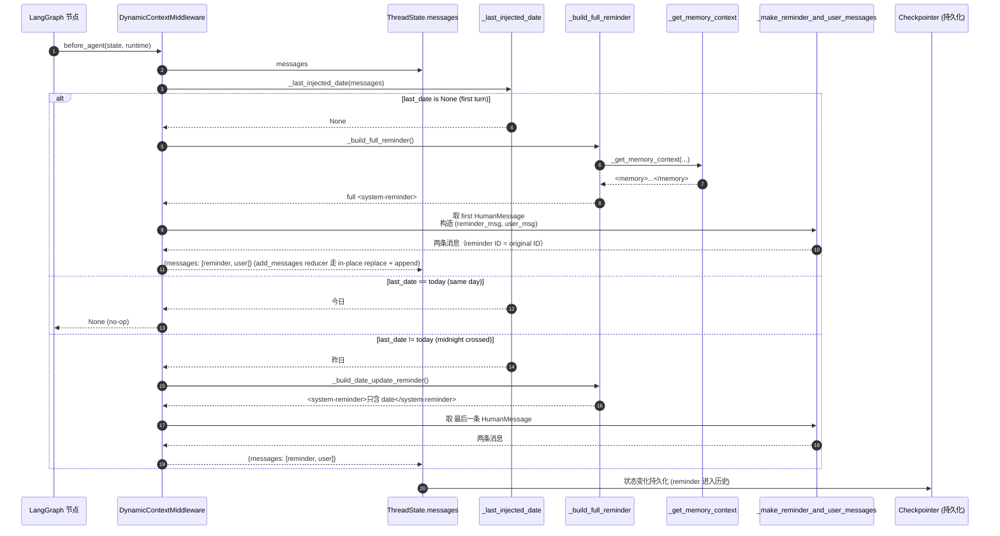
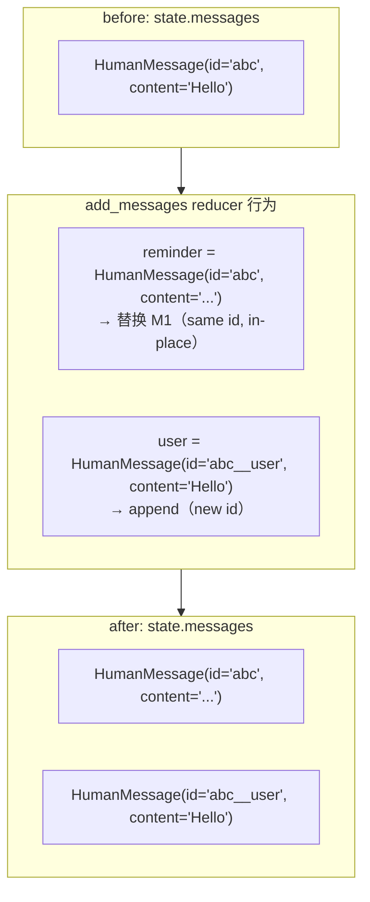

# 15 · DynamicContextMiddleware 与 Prefix Cache 友好的注入策略

> 13 篇结尾说："memory 不放 system prompt 是为了 prefix cache"。14 篇讲了 memory 怎么被抽出来。这一章兑现两边的承诺：抽出的 memory + 当前日期，到底是怎么"动态"地塞回 LLM 对话的？
>
> 这是 deer-flow 整个 prompt cache 设计的最后一块拼图。看完这一章你会明白：为什么注入对象是 first HumanMessage 而不是 system prompt、为什么要分"first turn 全量"+"midnight 增量"两种模式、为什么 reminder 要用 ID swap 技术挤到原 message 前面。

---

## 1. 模块定位（Why this matters）

`DynamicContextMiddleware`（205 行）是 deer-flow 解决"system prompt 静态 vs LLM 需要动态上下文"矛盾的**核心机制**：

| 痛点 | 解法 |
|------|------|
| LLM 需要知道当前日期（"昨天"、"明天"才有意义） | inject `<current_date>` 到第一个 user message |
| LLM 需要看到用户长期 memory | inject `<memory>` 同上 |
| system prompt 必须 100% 静态（prefix cache） | 不动 system prompt，把动态信息搬到 HumanMessage |
| 跨天对话日期会变 | midnight crossing 检测，注入 lightweight date update |
| 重新调用 agent 时不能重复注入 | 用 `additional_kwargs[dynamic_context_reminder]=True` 标记，已注入则跳过 |

不读这一章会错过 4 个关键认知：

1. **注入对象是 first HumanMessage 不是 system prompt**：13 篇讲过 prefix cache 友好的设计纪律——所有动态信息都从 system prompt 搬出去。`DynamicContextMiddleware` 就是把它们搬到 first HumanMessage 的实施层。
2. **ID swap 技术让 reminder "挤"进原消息前**：原 user message 的 ID 被复用给新的 reminder message，原 message 内容改 ID 为 `{id}__user`——LangGraph 的 `add_messages` reducer 看到 same ID 就 in-place replace，新 message append 在后。**这样原消息位置不变、reminder 在前**。
3. **"frozen snapshot" 策略**：first turn 注入的 reminder 会被 checkpointer 持久化——后续 turn 看到 reminder 已存在就不会重新注入。**保证消息列表稳定，prefix cache 在 HumanMessage 这一层也能命中**。
4. **跨天检测 + 增量更新**：对话跨午夜后，`_last_injected_date` 检测到日期变化，只注入一条 lightweight `<current_date>` 更新，不重发整个 memory 段——增量更新最小化 token 浪费。

对应到 Harness 六要素：本章对应 **上下文工程 + 缓存优化** 的工程交汇。

---

## 2. 源码地图（Source Map）

### 2.1 关键文件清单

| 路径 | 角色 |
|------|------|
| [`packages/harness/deerflow/agents/middlewares/dynamic_context_middleware.py`](../packages/harness/deerflow/agents/middlewares/dynamic_context_middleware.py) | 205 行单文件，全部逻辑 |
| [`packages/harness/deerflow/agents/lead_agent/prompt.py`](../packages/harness/deerflow/agents/lead_agent/prompt.py) | `_get_memory_context`（行 554-591）格式化 memory |
| [`packages/harness/deerflow/agents/memory/prompt.py`](../packages/harness/deerflow/agents/memory/prompt.py) | `format_memory_for_injection`（行 201-300）token-aware 格式化 |
| [`packages/harness/deerflow/config/memory_config.py`](../packages/harness/deerflow/config/memory_config.py) | `injection_enabled / max_injection_tokens` |
| [`packages/harness/deerflow/runtime/user_context.py`](../packages/harness/deerflow/runtime/user_context.py) | `get_effective_user_id`（per-user memory 隔离） |

### 2.2 关键符号速查表

| 符号 | 文件:行 | 一句话职责 |
|------|---------|-----------|
| `class DynamicContextMiddleware` | `dynamic_context_middleware.py:81` | before_agent / abefore_agent 两路 |
| `_DYNAMIC_CONTEXT_REMINDER_KEY = "dynamic_context_reminder"` | 行 47 | additional_kwargs 标记 |
| `_DATE_RE` | 行 46 | `<current_date>...</current_date>` 提取 |
| `_extract_date(content)` | 行 51 | regex helper |
| `is_dynamic_context_reminder(msg)` | 行 57 | 按 additional_kwargs flag 判定 |
| `_last_injected_date(messages)` | 行 62 | 反扫消息找最近一次注入的日期 |
| `_is_user_injection_target(msg)` | 行 76 | HumanMessage 且不是 reminder + 不是 summary |
| `_build_full_reminder()` | 行 104 | 全量：memory + date |
| `_build_date_update_reminder()` | 行 121 | 增量：只 date |
| `_make_reminder_and_user_messages(original, content)` | 行 132 | **ID swap 核心技巧** |
| `_inject(state)` | 行 156 | 主流程：first turn / same day / midnight |
| `before_agent(state, runtime)` | 行 199 | sync hook |
| `abefore_agent(state, runtime)` | 行 203 | async hook |
| `_get_memory_context(agent_name, app_config)` | `lead_agent/prompt.py:554` | 调 `format_memory_for_injection` |
| `format_memory_for_injection(data, max_tokens)` | `memory/prompt.py:201` | token-aware 截断 facts |

### 2.3 整体时序



### 2.4 ID swap 技术示意



**关键**：原 user message 被 reminder 替换位置（same ID），原内容以新 ID 重新出现在后面。结果是 reminder 在前、user content 在后——而**列表的"first HumanMessage 位置"没变**。

---

## 3. 核心逻辑精读（Deep Dive）

### 3.1 `_inject` 主流程：3 个分支

```python
# packages/harness/deerflow/agents/middlewares/dynamic_context_middleware.py:156-196
def _inject(self, state) -> dict | None:
    messages = list(state.get("messages", []))
    if not messages:
        return None

    current_date = datetime.now().strftime("%Y-%m-%d, %A")
    last_date = _last_injected_date(messages)

    if last_date is None:
        # ── First turn: inject full reminder as a separate HumanMessage ─────
        first_idx = next((i for i, m in enumerate(messages) if _is_user_injection_target(m)), None)
        if first_idx is None:
            return None
        full_reminder = self._build_full_reminder()
        reminder_msg, user_msg = self._make_reminder_and_user_messages(messages[first_idx], full_reminder)
        return {"messages": [reminder_msg, user_msg]}

    if last_date == current_date:
        # ── Same day: nothing to do ──────────────────────────────────────────
        return None

    # ── Midnight crossed: inject date-update reminder as a separate HumanMessage ──
    last_human_idx = next((i for i in reversed(range(len(messages))) if _is_user_injection_target(messages[i])), None)
    if last_human_idx is None:
        return None

    reminder_msg, user_msg = self._make_reminder_and_user_messages(messages[last_human_idx], self._build_date_update_reminder())
    return {"messages": [reminder_msg, user_msg]}
```

**3 个分支详解**：

#### 分支 ①：first turn（`last_date is None`）

- 反扫消息找不到任何已注入的 reminder → 第一次对话。
- 找到**第一个** `_is_user_injection_target` 的 HumanMessage（即第一个真正的 user 消息，跳过 summary message）。
- 构造 full reminder（memory + date）并 ID swap。

#### 分支 ②：same day（`last_date == current_date`）

- 历史里已经有 reminder，且日期是今天 → 不动。
- 这是最常见的情况——绝大多数对话不跨天。**no-op 的快速返回**保证这条 middleware 在常态下零开销。

#### 分支 ③：midnight crossed（`last_date != current_date`）

- 历史里有 reminder 但日期是昨天。
- 找**最后一条** HumanMessage（即当前 turn 的 user 输入）。
- 构造 lightweight date update（只含日期，不重发 memory）。

**为什么 midnight 不重发 memory**？因为 memory 段往往几百到上千 tokens——跨午夜每条 user 消息都重发太浪费。日期更新只 ~50 tokens。memory 仍然在第一次注入的 reminder 里，LLM 看历史能看到。

### 3.2 `_make_reminder_and_user_messages`：ID swap 核心

```python
# packages/harness/deerflow/agents/middlewares/dynamic_context_middleware.py:131-154
@staticmethod
def _make_reminder_and_user_messages(original: HumanMessage, reminder_content: str) -> tuple[HumanMessage, HumanMessage]:
    """Return (reminder_msg, user_msg) using the ID-swap technique.

    reminder_msg takes the original message's ID so that add_messages replaces it
    in-place (preserving position).  user_msg carries the original content with a
    derived ``{id}__user`` ID and is appended immediately after by add_messages.

    If the original message has no ID a stable UUID is generated so the derived
    ``{id}__user`` ID never collapses to the ambiguous ``None__user`` string.
    """
    stable_id = original.id or str(uuid.uuid4())
    reminder_msg = HumanMessage(
        content=reminder_content,
        id=stable_id,
        additional_kwargs={"hide_from_ui": True, _DYNAMIC_CONTEXT_REMINDER_KEY: True},
    )
    user_msg = HumanMessage(
        content=original.content,
        id=f"{stable_id}__user",
        name=original.name,
        additional_kwargs=original.additional_kwargs,
    )
    return reminder_msg, user_msg
```

**5 个工程亮点**：

1. **`stable_id = original.id or str(uuid.uuid4())`**：原消息可能没 ID（手动调 LangGraph 时常见），生成 UUID 兜底，避免 `None__user` 这种诡异 ID。
2. **reminder 拿到原 ID + user 拿到衍生 ID**：核心 trick。LangGraph 的 `add_messages` reducer 按 ID 去重——same ID 的新消息**原地替换**原消息，new ID 的消息**追加**到末尾。结果是 reminder 占了原位置、user 内容紧随其后。
3. **`hide_from_ui=True` 标记**：前端 SSE 流时识别这个 flag 决定是否展示——reminder 是给 LLM 看的，不该给用户看。
4. **`_DYNAMIC_CONTEXT_REMINDER_KEY=True` 标记**：让后续 `_last_injected_date` 能识别"这是 reminder 不是用户输入"——按 flag 判定比按内容子串匹配（"`<system-reminder>`"）更可靠（用户消息里也可能包含这个字符串）。
5. **保留 `name` 和 `additional_kwargs`**：user_msg 是原消息的"克隆"——name 和 kwargs 完整保留，只是 ID 变了。这保证下游处理（log、UI 显示）看到的 user message 跟原始一样。

### 3.3 `_last_injected_date`：按 flag 判定而非内容

```python
# packages/harness/deerflow/agents/middlewares/dynamic_context_middleware.py:62-73
def _last_injected_date(messages: list) -> str | None:
    """Scan messages in reverse and return the most recently injected date.

    Detection uses the ``dynamic_context_reminder`` additional_kwargs flag rather
    than content substring matching, so user messages containing ``<system-reminder>``
    are not mistakenly treated as injected reminders.
    """
    for msg in reversed(messages):
        if is_dynamic_context_reminder(msg):
            content_str = msg.content if isinstance(msg.content, str) else str(msg.content)
            return _extract_date(content_str)
    return None


def is_dynamic_context_reminder(message: object) -> bool:
    """Return whether *message* is a hidden dynamic-context reminder."""
    return isinstance(message, HumanMessage) and bool(message.additional_kwargs.get(_DYNAMIC_CONTEXT_REMINDER_KEY))
```

**为什么按 flag 不按内容**？看 docstring 给的反例：

- 一个 power user 在对话里写："I want my agent to output messages like `<system-reminder>...</system-reminder>` style."
- 这条消息**内容里有** `<system-reminder>`——按子串匹配会被误判成 reminder。
- 按 `additional_kwargs[_DYNAMIC_CONTEXT_REMINDER_KEY]` flag → 用户消息没这个 flag，不会误判。

这是 deer-flow **"按 marker 不按内容"** 设计纪律的体现——内容是用户输入领域，可能包含任何字符串；marker 是 deer-flow 控制的 metadata，可信。

### 3.4 `_build_full_reminder`：组合 memory + date

```python
# packages/harness/deerflow/agents/middlewares/dynamic_context_middleware.py:104-119
def _build_full_reminder(self) -> str:
    from deerflow.agents.lead_agent.prompt import _get_memory_context

    # Memory injection is gated by injection_enabled; date is always included.
    injection_enabled = self._app_config.memory.injection_enabled if self._app_config else True
    memory_context = _get_memory_context(self._agent_name, app_config=self._app_config) if injection_enabled else ""
    current_date = datetime.now().strftime("%Y-%m-%d, %A")

    lines: list[str] = ["<system-reminder>"]
    if memory_context:
        lines.append(memory_context.strip())
        lines.append("")  # blank line separating memory from date
    lines.append(f"<current_date>{current_date}</current_date>")
    lines.append("</system-reminder>")

    return "\n".join(lines)
```

**输出格式**：

```
<system-reminder>
<memory>
User Context:
- Work: Python developer at ByteDance
- Personal: prefers functional programming
History:
- Recent: Working on agent framework
Facts:
- [preference | 0.95] prefers functional programming style
- [knowledge | 0.85] uses Python 3.12
- ...
</memory>

<current_date>2026-05-19, Monday</current_date>
</system-reminder>
```

**4 个细节**：

1. **`injection_enabled` 独立开关**：和 14 篇的 `memory.enabled` 不同——`enabled` 控制 memory 是否抽取/存储，`injection_enabled` 控制是否注入到 prompt。两者独立。用户可以"我让 deer-flow 收集 memory，但不要往 prompt 里塞"——隐私场景适用。
2. **date 总是注入**：即使 memory 关也注入日期。日期对 LLM 太基础，不开开关。
3. **空 memory_context 时不留空块**：if `memory_context: lines.append(...)`——避免 `<memory></memory>` 这种空标签污染。
4. **空行分隔**：`lines.append("")` 让 memory 段和 date 段视觉分离——LLM 处理多段 XML 时分隔空行能减少结构混淆。

### 3.5 `format_memory_for_injection`：token-aware fact 截断

```python
# packages/harness/deerflow/agents/memory/prompt.py:201-300 (节选)
def format_memory_for_injection(memory_data: dict[str, Any], max_tokens: int = 2000) -> str:
    """Format memory data for injection into system prompt."""
    # ... 格式 user context / history (这些一般不大) ...

    # Format facts (sorted by confidence; include as many as token budget allows)
    facts_data = memory_data.get("facts", [])
    if isinstance(facts_data, list) and facts_data:
        ranked_facts = sorted(
            (f for f in facts_data if isinstance(f, dict) and isinstance(f.get("content"), str) and f.get("content").strip()),
            key=lambda fact: _coerce_confidence(fact.get("confidence"), default=0.0),
            reverse=True,
        )

        # Compute token count for existing sections once, then account
        # incrementally for each fact line to avoid full-string re-tokenization.
        base_text = "\n\n".join(sections)
        base_tokens = _count_tokens(base_text) if base_text else 0
        facts_header = "Facts:\n"
        separator_tokens = _count_tokens("\n\n" + facts_header) if base_text else _count_tokens(facts_header)
        running_tokens = base_tokens + separator_tokens

        fact_lines: list[str] = []
        for fact in ranked_facts:
            content_value = fact.get("content")
            # ... 格式化 line ...
            category = str(fact.get("category", "context")).strip() or "context"
            confidence = _coerce_confidence(fact.get("confidence"), default=0.0)
            source_error = fact.get("sourceError")
            if category == "correction" and isinstance(source_error, str) and source_error.strip():
                line = f"- [{category} | {confidence:.2f}] {content} (avoid: {source_error.strip()})"
            else:
                line = f"- [{category} | {confidence:.2f}] {content}"

            line_text = ("\n" + line) if fact_lines else line
            line_tokens = _count_tokens(line_text)

            if running_tokens + line_tokens <= max_tokens:
                fact_lines.append(line)
                running_tokens += line_tokens
            else:
                break

    # ...
```

**4 个工程亮点**：

1. **`sorted by confidence reverse=True`**：高 confidence 的 fact 优先注入——和 14 篇 `_apply_updates` 的"按 confidence 淘汰"对偶。
2. **增量 token 计数**：先算 base sections 的 tokens，每加一条 fact line 算一次增量——而不是每次都把整个 string `_count_tokens(full_text)`。**O(n) 而不是 O(n²)**。
3. **`max_tokens` 是硬上限**：超出预算的 fact 直接 break，不再添加。**精确控制 prompt budget**。
4. **correction fact 特殊格式**：`- [correction | 0.95] use snake_case (avoid: camelCase)`——把"错误做法"也带上，让 LLM 不只知道"正确做法"还知道"要避免什么"。

`_count_tokens` 用 tiktoken（OpenAI 标准 tokenizer），跨 model 大致准确。

### 3.6 同步 + 异步双 hook

```python
# packages/harness/deerflow/agents/middlewares/dynamic_context_middleware.py:198-204
@override
def before_agent(self, state, runtime: Runtime) -> dict | None:
    return self._inject(state)

@override
async def abefore_agent(self, state, runtime: Runtime) -> dict | None:
    return self._inject(state)
```

**两个 hook 调同一个 `_inject`**——纯计算 + 无 I/O 的中间件，不需要真正的 async（`_get_memory_context` 走 mtime cache 也是 sync）。

deer-flow 几乎所有 middleware 都**同时挂 sync 和 async hook**——这是 LangChain agents 1.x 推荐做法，让 middleware 在 sync agent 路径（`invoke`）和 async 路径（`ainvoke`）都生效。

---

## 4. 关键问题答疑（Key Questions）

### Q1：为什么不直接动态生成 system prompt？

prefix cache 命中要求前缀**逐字节相同**。如果 system prompt 含当前时间：

- Turn 1（10:30:00）：`Current time is 2026-05-19 10:30:00`
- Turn 2（10:31:00）：`Current time is 2026-05-19 10:31:00`

两个 prompt 不一样 → cache miss。整个几千 tokens 的 system prompt 都要重新计费。

deer-flow 的解：system prompt 不放时间（13 篇），动态信息塞到 first HumanMessage。**system prompt 部分始终 cache hit**，HumanMessage 的 prefix 也能 cache（cache 是按 prefix 工作的）。

### Q2：注入到 first HumanMessage 真能命中 prefix cache 吗？

能。**只要这个 HumanMessage 内容不变**——deer-flow 用 "frozen snapshot" 策略保证：first turn 注入后，reminder 内容**永远不变**（除非 midnight crossing 才追加 date update）。

具体看 add_messages reducer：reminder 的 ID 是 stable（first turn 设定后不变），content 在 first turn 后不再修改 → 后续 turn 的 prompt prefix 完全一致（system prompt + 同一个 reminder + 同一个 user message + 历史 AI/tool messages + 新 user）。

### Q3：midnight crossing 后的 date update 会破坏 prefix cache 吗？

会**部分**破坏——但仅破坏从 date update 这一行开始的后续 prefix。前面的 system prompt + first turn reminder 仍命中。

deer-flow 的取舍：每天破一次 cache 是可接受的——比"每次都重发完整 reminder"省太多。

### Q4：用户在历史里写过 `<system-reminder>` 字符串会被误判吗？

**不会**。`_last_injected_date` 按 `additional_kwargs[dynamic_context_reminder]` flag 判定，不按内容子串匹配。用户消息没有这个 flag。

### Q5：first_idx 怎么算？为什么要排除 summary message？

```python
def _is_user_injection_target(message: object) -> bool:
    """Return whether *message* can receive a dynamic-context reminder."""
    return isinstance(message, HumanMessage) and not is_dynamic_context_reminder(message) and message.name != _SUMMARY_MESSAGE_NAME
```

3 个条件：
1. `isinstance(message, HumanMessage)`——只 inject 给 user 输入。
2. `not is_dynamic_context_reminder(message)`——已是 reminder 不重复注入。
3. `message.name != "summary"`——`SummarizationMiddleware`（18 篇）会用 `HumanMessage(name="summary", ...)` 把折叠后的历史封装成 human-style summary 注入到对话开头。**不能把 reminder 注到 summary 之前**——summary 本身已经是浓缩历史，再前面塞 reminder 会让 LLM 困惑顺序。

### Q6：如果第一条消息不是 HumanMessage 怎么办？

`first_idx = next(..., None)` 返回 None → `_inject` 直接 return None，跳过。

这种情况很罕见——一般对话开始都是 user 发起。如果是 agent 主动 push（罕见场景），没注入也无大碍——下一轮 user 发消息时会触发 first turn 注入。

### Q7：reminder 内容会被 checkpointer 持久化吗？

会。`return {"messages": [reminder, user]}` 让 LangGraph reducer 更新 state.messages → checkpointer 保存整个 messages list。**reminder 像普通消息一样存盘**——下次 thread 恢复后还在。

这就是"frozen snapshot"的实现基础——一旦注入，进 checkpointer 历史，永久保留。

---

## 5. 横向延伸与面试级洞察（Interview-Grade Insights）

### 5.1 ID swap 是 LangGraph 的 prompt engineering 技巧

LangGraph 的 `add_messages` reducer 默认按 ID 去重——这个特性原本是为了 "LLM streaming chunks 累积成 final message" 服务。deer-flow 反向用它实现"在原 message 前插入新 message"：

```
用 ID swap = 利用 add_messages 的 "same ID 替换" 行为
```

这种"用框架的标准行为做巧妙的事"是高阶 LangGraph 工程的标志。新手会想着调 `state.messages.insert(0, ...)` 直接改 list——但那破坏了 reducer 的语义，且 checkpointer 看不到变化。

### 5.2 prefix cache + frozen snapshot = 长对话性能优化

deer-flow 的 cache 策略是分层的：

| 层 | 设计 | 命中条件 |
|----|------|--------|
| system prompt | 13 篇全静态设计 | 跨 user / 跨 session 都命中 |
| first HumanMessage 的 reminder | "frozen snapshot"，注入后永不变 | 同 thread 跨 turn 命中 |
| user input | 不可控 | 不命中 |

**结果**：长对话（10+ turn）的 prompt 重发 cost 中，绝大部分都被 cache 吃掉。**只有 user 当前输入 + AI 上次回复是新计费的**。

**面试金句**：deer-flow 的 prefix cache 策略不是某个单点优化，是从 system prompt（全静态） → first HumanMessage（frozen reminder） → 后续历史（自然不可变）的层次化设计——让长对话的实际计费 token 接近"只有当前 turn"。

### 5.3 跨天处理是"长对话场景"才需要的优化

跨天检测 + 增量 date update 看起来麻烦——但它解决的是"对话持续超过 24 小时"的场景。对短对话 agent（一次性问答）完全可以不写这段。

deer-flow 写了 → 暗示它的目标场景是 **agent companion / 长期助理**——会和用户在多个日期持续对话。这种场景下日期感知是必要的（"昨天我说过的那件事..."这种引用 LLM 必须能理解）。

### 5.4 vs LangChain 原生 `RunnableWithMessageHistory`

LangChain 提供的 message history 工具不区分"用户输入"和"系统注入"——所有消息都是 messages list 里的普通项。deer-flow 区分了：

- 用户输入：no marker。
- reminder：`additional_kwargs[dynamic_context_reminder]=True` + `hide_from_ui=True`。

这让前端能正确显示（reminder 不展示给用户）+ 后端能正确处理（reminder 不进 memory 抽取——14 篇的 `filter_messages_for_memory` 会跳过）。

**面试金句**：在 messages list 里区分"用户内容"和"系统注入"是 production agent 系统的必要工程——没区分会让 UI 把内部 marker 展示给用户、memory 抽取把系统消息当用户偏好。deer-flow 用 `additional_kwargs` 标记 + 多个消费方过滤实现了这个区分。

---

## 6. 实操教程（Hands-on Lab）

### 6.1 最小可运行示例：观察 ID swap 行为

```python
# backend/debug_dynamic_context.py
"""观察 DynamicContextMiddleware 的 ID swap"""
from langchain_core.messages import HumanMessage
from deerflow.agents.middlewares.dynamic_context_middleware import (
    DynamicContextMiddleware,
    is_dynamic_context_reminder,
)


mw = DynamicContextMiddleware(agent_name=None, app_config=None)

# 模拟 first turn
state = {
    "messages": [HumanMessage(content="What's the weather today?", id="msg-001")]
}

result = mw._inject(state)
print(f"=== After inject ===")
for m in result["messages"]:
    is_reminder = is_dynamic_context_reminder(m)
    print(f"  id={m.id!r}  reminder={is_reminder}  content={m.content[:80]!r}")
```

跑：`cd backend && PYTHONPATH=. uv run python debug_dynamic_context.py`

**能看到**：

```
=== After inject ===
  id='msg-001'  reminder=True  content='<system-reminder>...<current_date>...</current_date></system-reminder>'
  id='msg-001__user'  reminder=False  content='What's the weather today?'
```

reminder 拿到原 ID `msg-001`，user content 拿到 `msg-001__user`——LangGraph 看到 same ID 替换 + 新 ID 追加。

### 6.2 Debug 任务清单

#### 实验 ①：观察 same-day 的 no-op fast path

```python
state2 = {
    "messages": [
        HumanMessage(
            content="<system-reminder>\n<current_date>" + datetime.now().strftime("%Y-%m-%d, %A") + "</current_date>\n</system-reminder>",
            id="msg-001",
            additional_kwargs={"dynamic_context_reminder": True},
        ),
        HumanMessage(content="Hello", id="msg-001__user"),
        HumanMessage(content="Follow up question", id="msg-002"),
    ]
}

result = mw._inject(state2)
print(f"Same day inject result: {result}")
# 应该是 None — 不做事
```

**能学到**：same day 的 no-op 让中间件在常态下零开销。

#### 实验 ②：模拟 midnight crossing

```python
from datetime import datetime, timedelta
# 故意构造一条"昨天"的 reminder
yesterday = (datetime.now() - timedelta(days=1)).strftime("%Y-%m-%d, %A")
state3 = {
    "messages": [
        HumanMessage(
            content=f"<system-reminder>\n<current_date>{yesterday}</current_date>\n</system-reminder>",
            id="msg-001",
            additional_kwargs={"dynamic_context_reminder": True},
        ),
        HumanMessage(content="Hello", id="msg-001__user"),
        # ... (假设有 AI 回复)
        HumanMessage(content="What day is it now?", id="msg-002"),
    ]
}

result = mw._inject(state3)
for m in result["messages"]:
    print(f"  id={m.id!r}  reminder={is_dynamic_context_reminder(m)}  content={m.content[:80]!r}")
```

**预期**：
- 第一条：`id='msg-002'`（拿到最后 user msg 的 ID）+ reminder=True，只含 date update。
- 第二条：`id='msg-002__user'` + 原内容 "What day is it now?"。

#### 实验 ③：验证 reminder 内容不被误识别

```python
# 用户消息内容里写了 <system-reminder>，但没 flag
state4 = {
    "messages": [
        HumanMessage(content="Show me how to write a `<system-reminder>` block", id="real-user"),
    ]
}
result = mw._inject(state4)
# 应该走 first turn 分支——because no flag in additional_kwargs
print(f"First message after inject: id={result['messages'][0].id!r}")
# 应该是 'real-user' (reminder 拿到这个 ID)
```

**能学到**：按 flag 判定不被内容欺骗——`<system-reminder>` 字符串在 user message 里完全合法。

---

## 7. 与下一模块的衔接

读完本章你应该能：

- 解释为什么 deer-flow 把动态信息（memory + date）注到 first HumanMessage 而非 system prompt——prefix cache 的层次化设计。
- 描述 ID swap 技术：reminder 拿原 ID + user 拿 `{id}__user`，靠 add_messages reducer 实现"插队"。
- 区分 3 个分支（first turn / same day / midnight crossed）+ 各自的处理。
- 知道按 `additional_kwargs[dynamic_context_reminder]` flag 判定而非内容子串，是 deer-flow 的"按 marker 不按内容"纪律。

接下来 **Part G（16-17 篇）** 进入 subagent 系统——`task` 工具背后的 SubagentExecutor 双线程池 + 隔离 event loop、`SubagentLimitMiddleware` 截断超额 task_calls 的"after_model 强制收口"机制、subagent registry 怎么让用户注册自定义 subagent 类型。看完 16-17 篇你能完整理解 deer-flow 是怎么把 lead agent 升级成 "orchestrator"。

---

📌 **本章已交付**。请你检查后告诉我：
- 哪几段读起来不顺？
- 是否要补"`format_memory_for_injection` 的 token 计算细节（tiktoken / 增量算法）"？
- 还是直接进入 16 篇？
