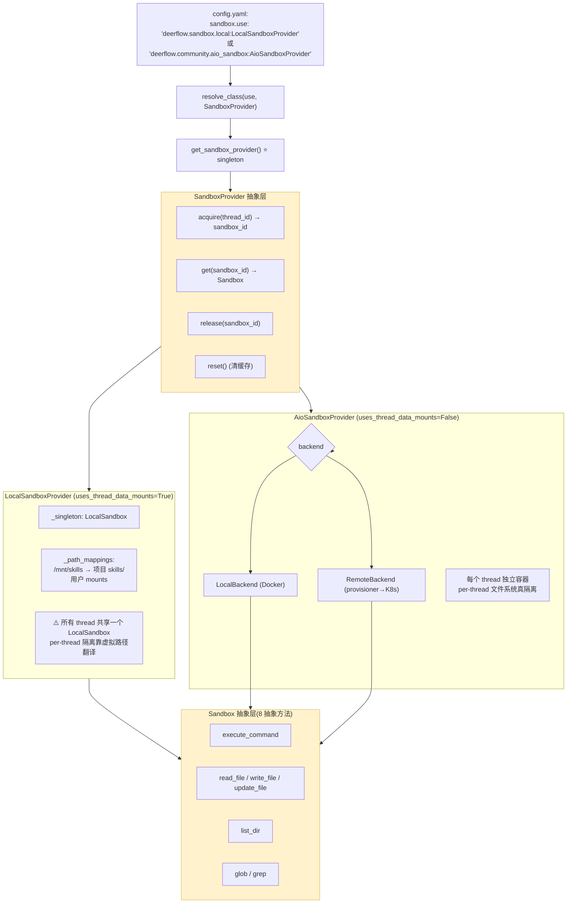
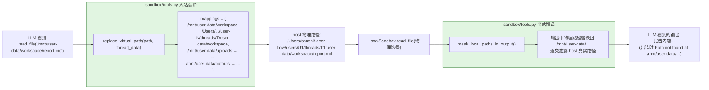
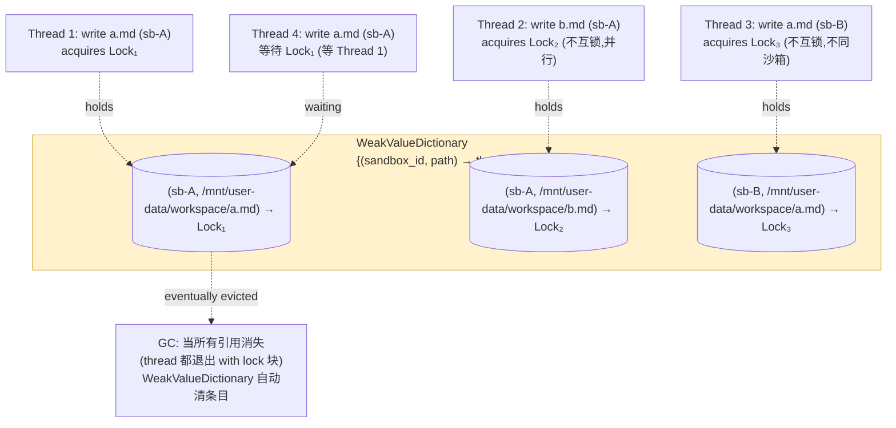

# 15 · 沙箱系统：Sandbox + Provider + 虚拟路径

> 核心模块层第 6 篇。前 14 章都建立在"agent 有一个工作环境"的假设上 —— 但这个**工作环境本身是怎么实现的**？本章把它拆开。
>
> DeerFlow 沙箱系统的目标：**给 LLM 一个干净、安全、可隔离的"computer"**。它要解决三个矛盾：
> 1. **隔离 vs 性能**：容器化隔离好，但启动慢；本地直接跑快，但不安全
> 2. **抽象 vs 灵活**：LLM 该看到统一的 `/mnt/user-data/workspace`，不应感知"在容器里还是本地"
> 3. **多线程并发 vs 数据一致**：多个 tool 调用并发改同一个文件怎么办
>
> 关键看点：**`(sandbox_id, path)` 双键文件锁、虚拟路径双向翻译、`uses_thread_data_mounts` 让两种 backend 各自处理 mount 的设计哲学**。

---

## 🎯 学习目标

读完这份文档，你能回答：

1. **`Sandbox` 抽象基类 + `SandboxProvider` 抽象基类**为什么要拆成两层？只有一个 `Sandbox` 类不够吗？
2. **`/mnt/user-data/workspace` 这个虚拟路径**最终被翻译成什么？LocalSandboxProvider 和 AioSandboxProvider 的翻译方式**根本不同**在哪？
3. **`get_file_operation_lock` 用 `(sandbox_id, path)` 双键 + `WeakValueDictionary`** —— 为什么不能用 path 单键？为什么必须 weak ref？
4. **`LOCAL_HOST_BASH_DISABLED_MESSAGE`** —— LocalSandbox 默认禁用 host bash 的设计意图是什么？为什么不是直接"不实现 execute_command"？
5. **`uses_thread_data_mounts: bool`** 这个 provider 类属性 —— LocalSandboxProvider 设为 True、AioSandboxProvider 设为 False。**这个标志驱动什么行为差异**？

---

## 🗂️ 源码定位

| 关注点 | 文件 / 行号 | 关键锚点 |
|---|---|---|
| `Sandbox` 抽象基类（8 个抽象方法） | `packages/harness/deerflow/sandbox/sandbox.py` | `execute_command` / `read_file` / `write_file` / `list_dir` / `glob` / `grep` / `update_file` + `id` property |
| `SandboxProvider` 抽象基类（4 方法 + 1 类属性） | `packages/harness/deerflow/sandbox/sandbox_provider.py` | `acquire` / `get` / `release` / `reset` + `uses_thread_data_mounts: bool = False`；`get_sandbox_provider()` L48 反射加载；`shutdown_sandbox_provider` L78 |
| LocalSandboxProvider（host 文件系统） | `packages/harness/deerflow/sandbox/local/local_sandbox_provider.py` | `_singleton: LocalSandbox \| None`；`_setup_path_mappings`；`uses_thread_data_mounts = True` L14 |
| LocalSandbox（实际实现） | `packages/harness/deerflow/sandbox/local/local_sandbox.py` | `execute_command` / `read_file` 等的具体实现；`PathMapping` 数据类 |
| AioSandboxProvider（容器化） | `packages/harness/deerflow/community/aio_sandbox/` | `aio_sandbox_provider.py`；`backend.py`（Docker） + `remote_backend.py`（K8s provisioner）；`uses_thread_data_mounts = False` |
| 虚拟路径翻译 | `packages/harness/deerflow/sandbox/tools.py` | `replace_virtual_path` L436；`_thread_virtual_to_actual_mappings` L472；`validate_path` L610；`_reject_path_traversal`；`VIRTUAL_PATH_PREFIX = "/mnt/user-data"`（来自 `config/paths.py`） |
| 文件操作锁 | `packages/harness/deerflow/sandbox/file_operation_lock.py` | `_FILE_OPERATION_LOCKS: WeakValueDictionary`；`get_file_operation_lock(sandbox, path)` |
| 安全护栏 | `packages/harness/deerflow/sandbox/security.py` | `uses_local_sandbox_provider`；`is_host_bash_allowed`；`LOCAL_HOST_BASH_DISABLED_MESSAGE` |
| 异常体系 | `packages/harness/deerflow/sandbox/exceptions.py` | `SandboxError`（base，带 details dict）；`SandboxNotFoundError` / `SandboxRuntimeError` / `SandboxCommandError` / `SandboxFileError` / `SandboxPermissionError` / `SandboxFileNotFoundError` |
| Search 子模块 | `packages/harness/deerflow/sandbox/search.py` | `GrepMatch` 数据类；`should_ignore_name`（gitignore-like） |
| 配置 | `packages/harness/deerflow/config/sandbox_config.py` | `SandboxConfig.use` / `allow_host_bash` / `image` / `port` / `replicas` / `container_prefix` / `idle_timeout` / `mounts[]` / `environment` / `bash_output_max_chars` |

---

## 🧭 架构图

### 1. 三层抽象 + 反射加载



### 2. 虚拟路径双向翻译（核心数据流）



### 3. 文件锁的 (sandbox_id, path) 双键设计



---

## 🔍 核心逻辑讲解

### Part 1 · 为什么 Sandbox + Provider 拆两层

#### Sandbox 抽象：8 个文件系统 + 命令执行方法

```python
class Sandbox(ABC):
    _id: str

    @abstractmethod
    def execute_command(self, command: str) -> str: ...

    @abstractmethod
    def read_file(self, path: str) -> str: ...

    @abstractmethod
    def write_file(self, path: str, content: str, append: bool = False) -> None: ...

    @abstractmethod
    def list_dir(self, path: str, max_depth=2) -> list[str]: ...

    @abstractmethod
    def glob(self, path: str, pattern: str, *, include_dirs: bool = False, max_results: int = 200) -> tuple[list[str], bool]: ...

    @abstractmethod
    def grep(self, path: str, pattern: str, *, glob=None, literal=False, case_sensitive=False, max_results=100) -> tuple[list[GrepMatch], bool]: ...

    @abstractmethod
    def update_file(self, path: str, content: bytes) -> None: ...
```

**对应 LLM 工具集**：
- `execute_command` ↔ `bash` 工具
- `read_file` ↔ `read_file` 工具
- `write_file` ↔ `write_file` 工具
- `list_dir` ↔ `ls` 工具
- `glob` ↔ `glob` 工具
- `grep` ↔ `grep` 工具
- `update_file` ↔ `view_image`/`present_files` 等用到二进制写

**关键观察**：**Sandbox 不知道 thread / user / RunnableConfig** —— 它**只是一个执行环境**。所有"哪个 thread 的哪个用户访问"由调用方（sandbox/tools.py）通过虚拟路径翻译注入。

#### SandboxProvider 抽象：生命周期管理

```python
class SandboxProvider(ABC):
    uses_thread_data_mounts: bool = False

    @abstractmethod
    def acquire(self, thread_id: str | None = None) -> str: ...

    @abstractmethod
    def get(self, sandbox_id: str) -> Sandbox | None: ...

    @abstractmethod
    def release(self, sandbox_id: str) -> None: ...

    def reset(self) -> None: ...
```

**Provider 关心的事**：
- 一个 thread 想用沙箱 → 给它一个 sandbox_id（可能新建容器，可能复用 singleton）
- 拿着 sandbox_id 要做 file op → 通过 `get()` 拿到 Sandbox 实例
- thread 结束（或 cancel）→ 释放沙箱（具体行为由 provider 自定义）

**为什么必须两层？**

| 单层方案（一个 `Sandbox` 类做所有事） | 当前两层方案 |
|---|---|
| 生命周期与文件操作耦合 —— `Sandbox.acquire()` / `Sandbox.read_file()` 都在一个类 | 职责分离：Provider 管生命周期，Sandbox 管运行时 |
| 一个 thread 多次拿沙箱 → 多个 Sandbox 实例 → 状态混乱 | Provider 内部能做"singleton / pool / cache" 决策 |
| 难以加新 backend | 只要实现 Provider + Sandbox 双对子 |
| 不能反射加载（配置驱动） | `resolve_class(config.sandbox.use, SandboxProvider)` 一行切 backend |

→ Sandbox + Provider 拆分是 **GoF 经典 Factory + Strategy 混合模式** 的典型应用。

### Part 2 · `uses_thread_data_mounts` —— 两个 backend 的"行为分歧开关"

打开 LocalSandboxProvider：
```python
class LocalSandboxProvider(SandboxProvider):
    uses_thread_data_mounts = True       # ⭐ 关键标志
```

打开 AioSandboxProvider（默认）：
```python
class AioSandboxProvider(SandboxProvider):
    # uses_thread_data_mounts = False (继承 base)
```

**这个标志驱动什么？**

打开 `sandbox/tools.py` 的工具实现（伪代码）：
```python
def bash(command, runtime):
    provider = get_sandbox_provider()
    if provider.uses_thread_data_mounts:
        # ⭐ LocalSandbox 路径:工具自己翻译虚拟路径 → 物理路径
        thread_data = state.get("thread_data", {})
        command = replace_virtual_paths_in_command(command, thread_data)
    # 然后调 sandbox.execute_command(command)

def read_file(path, runtime):
    provider = get_sandbox_provider()
    if provider.uses_thread_data_mounts:
        path = replace_virtual_path(path, thread_data)
    return sandbox.read_file(path)
```

**两种 backend 的本质区别**：

| 维度 | LocalSandboxProvider | AioSandboxProvider |
|---|---|---|
| `uses_thread_data_mounts` | True | False |
| LLM 看到的路径 | `/mnt/user-data/workspace/x.md` | `/mnt/user-data/workspace/x.md` |
| **谁翻译虚拟路径** | **工具层（sandbox/tools.py）** | **容器层（启动时 docker volume mount）** |
| 实际访问的物理路径 | host 上 `.deer-flow/users/U/threads/T/user-data/workspace/x.md` | 容器内 `/mnt/user-data/workspace/x.md`（已 mount） |
| 隔离性 | 弱（共享 host 文件系统） | 强（容器隔离） |
| 启动速度 | 即时 | 5-10 秒 |
| 资源占用 | 低 | 高（每 thread 一个容器） |

**这是个非常精炼的抽象**：用一个 bool 类属性，让"工具内代码"决定**翻译路径是自己做还是 backend 已经做了**。一段代码两条路径，按 backend 能力自适应。

### Part 3 · 虚拟路径翻译的算法精读

#### `replace_virtual_path` 算法

```python
def replace_virtual_path(path: str, thread_data: ThreadDataState | None) -> str:
    if thread_data is None:
        return path

    mappings = _thread_virtual_to_actual_mappings(thread_data)
    if not mappings:
        return path

    # Longest-prefix-first replacement with segment-boundary checks.
    for virtual_base, actual_base in sorted(mappings.items(), key=lambda item: len(item[0]), reverse=True):
        if path == virtual_base:
            return actual_base
        if path.startswith(f"{virtual_base}/"):           # ⭐ 段边界检查!
            rest = path[len(virtual_base):].lstrip("/")
            result = _join_path_preserving_style(actual_base, rest)
            ...
            return result
    return path
```

**精读两个关键点**：

1. **"Longest-prefix-first"** —— 用 `sorted(..., key=lambda x: len(x[0]), reverse=True)` 让最长的 virtual_base 先匹配。比如：
   - `/mnt/user-data/workspace` → 长 24 字符
   - `/mnt/user-data` → 长 14 字符
   - 路径 `/mnt/user-data/workspace/x.md` 应该匹配 workspace（更具体），不是 root（fallback）
   - 不排序就可能错配。

2. **"段边界检查"** —— `path.startswith(f"{virtual_base}/")` 必须以 `/` 结尾。这避免 `/mnt/user-data-evil/x.md` **错配**到 `/mnt/user-data` 前缀。**典型路径前缀漏洞防御**。

#### `_thread_virtual_to_actual_mappings` 的"共同父目录"奇技

```python
def _thread_virtual_to_actual_mappings(thread_data: ThreadDataState) -> dict[str, str]:
    mappings: dict[str, str] = {}
    workspace = thread_data.get("workspace_path")
    uploads = thread_data.get("uploads_path")
    outputs = thread_data.get("outputs_path")

    if workspace:
        mappings[f"{VIRTUAL_PATH_PREFIX}/workspace"] = workspace
    if uploads:
        mappings[f"{VIRTUAL_PATH_PREFIX}/uploads"] = uploads
    if outputs:
        mappings[f"{VIRTUAL_PATH_PREFIX}/outputs"] = outputs

    # ⭐ 关键的"父目录推断"
    actual_dirs = [Path(p) for p in (workspace, uploads, outputs) if p]
    if actual_dirs:
        common_parent = str(Path(actual_dirs[0]).parent)
        if all(str(path.parent) == common_parent for path in actual_dirs):
            mappings[VIRTUAL_PATH_PREFIX] = common_parent

    return mappings
```

**这段做什么**：如果 workspace / uploads / outputs **都在同一物理父目录**（典型情况，三者都在 `user-data/`），就**额外加一条** `VIRTUAL_PATH_PREFIX → 共同父目录` 映射。

**为什么**：让 `ls /mnt/user-data/` 这种"列出 user-data 目录" 的工具调用能正确翻译到 `ls /Users/U/.deer-flow/users/.../user-data/`。如果没这条 fallback，三个子目录之外的路径会被原样返回（无法解析）。

#### `validate_path` 的 4 区域策略

```python
def validate_path(path: str, *, read_only: bool = False):
    _reject_path_traversal(path)                       # ⭐ 1. 拒绝 ../ 路径穿越

    if _is_skills_path(path):                          # 2. skills:只读
        if not read_only:
            raise PermissionError(...)
        return

    if _is_acp_workspace_path(path):                   # 3. ACP:只读
        if not read_only:
            raise PermissionError(...)
        return

    if path.startswith(f"{VIRTUAL_PATH_PREFIX}/"):     # 4. user-data:读写都行
        return

    if _is_custom_mount_path(path):                    # 5. 用户自定义 mount:配置驱动
        mount = _get_custom_mount_for_path(path)
        if mount and mount.read_only and not read_only:
            raise PermissionError(...)
        return

    raise PermissionError(f"Only paths under {VIRTUAL_PATH_PREFIX}/, ...")
```

**4 个访问域**：
1. **`/mnt/skills/*`** —— 只读（skill 文件不应被 LLM 写）
2. **`/mnt/acp-workspace/*`** —— 只读（ACP 是外部 agent 工作区，LLM 只能读不能改）
3. **`/mnt/user-data/*`** —— 读写都行（用户自己的工作目录）
4. **自定义 mount** —— 按 `mount.read_only` 配置决定

**所有不在这 4 个域的路径** —— 直接拒绝。**白名单 + fail-secure**，攻击面收敛。

### Part 4 · `(sandbox_id, path)` 双键文件锁 —— 工程精度的体现

```python
_LockKey = tuple[str, str]
_FILE_OPERATION_LOCKS: weakref.WeakValueDictionary[_LockKey, threading.Lock] = weakref.WeakValueDictionary()
_FILE_OPERATION_LOCKS_GUARD = threading.Lock()


def get_file_operation_lock_key(sandbox: Sandbox, path: str) -> tuple[str, str]:
    sandbox_id = getattr(sandbox, "id", None) or f"instance:{id(sandbox)}"
    return sandbox_id, path


def get_file_operation_lock(sandbox: Sandbox, path: str) -> threading.Lock:
    lock_key = get_file_operation_lock_key(sandbox, path)
    with _FILE_OPERATION_LOCKS_GUARD:
        lock = _FILE_OPERATION_LOCKS.get(lock_key)
        if lock is None:
            lock = threading.Lock()
            _FILE_OPERATION_LOCKS[lock_key] = lock
        return lock
```

#### 为什么 key 是 `(sandbox_id, path)` 而不是单 `path`

**单 `path` 的问题**：
- LocalSandbox 是 singleton，`/mnt/user-data/workspace/a.md` 翻译后是 host 物理路径
- AioSandbox 每 thread 一个容器，**容器里的 `/mnt/user-data/workspace/a.md` 是独立路径**
- 如果用虚拟 path 当 key → 不同 thread 的同名文件被锁串行（误锁）
- 如果用物理 path 当 key → AioSandbox 不同容器的同路径不同物理，反而又不锁

**用 `(sandbox_id, path)`**：
- 同沙箱内同路径 → 同一 lock（必须串行）
- 不同沙箱同路径 → 不同 lock（并行）—— **这正是我们想要的隔离**

#### 为什么必须 `WeakValueDictionary`

**朴素 `dict` 的问题**：
- 长会话累计访问 10000 个不同文件 → dict 长 10000 → 永远不释放
- 多 thread 长跑 → **内存泄露**

**`WeakValueDictionary` 的语义**：
- key → value 是**弱引用**
- 没人在 `with lock:` 块里持有 lock 时，**GC 自动清条目**

**注意陷阱**：取出 lock 后**必须立刻 acquire**，不能"先 get → 干别的 → acquire"：
```python
# ❌ 错误:lock 取出后没立刻用,可能被 GC
lock = get_file_operation_lock(sb, path)
do_something()                              # ← 这里 lock 可能没人引用,被 GC
lock.acquire()                              # AttributeError

# ✅ 正确
with get_file_operation_lock(sb, path):
    do_work()                                # with 块持有引用,不会 GC
```

**`_FILE_OPERATION_LOCKS_GUARD: threading.Lock`** —— 守卫 dict 本身的 get/set 操作，防止多个 thread 同时 `setdefault` 创建两把不同的 lock。**双层锁**：外层守 dict、内层守文件。

### Part 5 · LocalSandbox 禁用 host bash 的"显式 fail-secure"

打开 `sandbox/security.py`：

```python
LOCAL_HOST_BASH_DISABLED_MESSAGE = (
    "Host bash execution is disabled for LocalSandboxProvider because it is not a secure "
    "sandbox boundary. Switch to AioSandboxProvider for isolated bash access, or set "
    "sandbox.allow_host_bash: true only in a fully trusted local environment."
)

def is_host_bash_allowed(config=None) -> bool:
    if config is None:
        config = get_app_config()
    sandbox_cfg = getattr(config, "sandbox", None)
    if sandbox_cfg is None:
        return False
    if not uses_local_sandbox_provider(config):
        return True                          # 非 Local provider → 默认允许(容器隔离)
    return bool(getattr(sandbox_cfg, "allow_host_bash", False))
```

**逻辑**：
- 用 AioSandboxProvider（容器） → `is_host_bash_allowed = True` 永远（容器是真隔离）
- 用 LocalSandboxProvider → **必须显式** `sandbox.allow_host_bash: true` 才允许

**为什么不直接"LocalSandbox 不实现 execute_command"？**

| "不实现"方案 | 当前"显式禁用 + opt-in"方案 |
|---|---|
| LocalSandbox 没 execute_command → bash 工具不可用 → 用户问"为什么 bash 不能用"困惑 | 显式错误消息告诉用户为什么 + 怎么解决 |
| 开发者本地调试不能跑 bash | `allow_host_bash: true` 提供逃生口 |
| 测试场景没法用 LocalSandbox 验证 bash | 测试可以临时打开 |

**security.py 的设计哲学**：**Verbose security messages > silent failures**。用户做错了事不能默默挂，要清楚告诉他为什么 + 怎么改。

**用户 opt-in 仍是 fail-secure**：默认值 False，**意味着新用户/默认配置永远安全**；只有"明白后果且用 trusted 环境" 的用户才显式 opt-in。

### Part 6 · 异常体系：结构化错误信息

```python
class SandboxError(Exception):
    def __init__(self, message: str, details: dict | None = None):
        super().__init__(message)
        self.message = message
        self.details = details or {}

    def __str__(self) -> str:
        if self.details:
            detail_str = ", ".join(f"{k}={v}" for k, v in self.details.items())
            return f"{self.message} ({detail_str})"
        return self.message


class SandboxCommandError(SandboxError):
    def __init__(self, message: str, command: str | None = None, exit_code: int | None = None):
        details = {}
        if command:
            details["command"] = command[:100] + "..." if len(command) > 100 else command
        if exit_code is not None:
            details["exit_code"] = exit_code
        super().__init__(message, details)
```

**结构化优势**：
- **trace 友好**：LangSmith 自动把 details dict 显示在 error span 里
- **可分类处理**：调用方 `isinstance(exc, SandboxPermissionError)` 决定降级路径
- **command 自动截断**：100 字符上限防止 prompt 注入超长 trace

**6 个子类对应 6 种业务场景**：

| 异常 | 触发场景 | 调用方典型处理 |
|---|---|---|
| `SandboxNotFoundError` | sandbox_id 找不到 | 重新 acquire |
| `SandboxRuntimeError` | provider 配置错 / Docker 启动失败 | fail-fast 启动 |
| `SandboxCommandError` | bash 退出码 ≠ 0 | 把 exit_code 给 LLM 重试 |
| `SandboxFileError` | 通用文件操作失败 | base 类 |
| `SandboxPermissionError` | 路径白名单拒绝 | 告诉 LLM 路径不合法 |
| `SandboxFileNotFoundError` | 文件不存在 | LLM 决定 fallback 路径 |

→ 这些异常都会被 13 章的 `ToolErrorHandlingMiddleware` 捕获，变成 `ToolMessage(status="error", content=...)`。

---

## 🧩 体现的通用 Agent 设计模式

| 模式 | 沙箱系统中的体现 |
|---|---|
| **Strategy + Factory**（策略 + 工厂） | Sandbox + SandboxProvider + 反射加载 |
| **Capability Feature Flag**（能力标志） | `uses_thread_data_mounts` 让工具层适配不同 backend |
| **Singleton with Reset**（带 reset 的单例） | `_default_sandbox_provider` + `reset_sandbox_provider()` |
| **Virtual Filesystem Abstraction** | `/mnt/user-data/*` 双向翻译，对 LLM 透明 |
| **Whitelist Path Authorization** | `validate_path` 4 区域白名单 + path traversal 拒绝 |
| **Composite Lock Key**（复合锁键） | `(sandbox_id, path)` 防误锁 |
| **Weak Reference Cache**（弱引用缓存） | `WeakValueDictionary` 防内存泄露 |
| **Verbose Security Message**（明示安全消息） | 禁用 host bash 时给出可操作建议而不是 silent fail |
| **Structured Exception with Details**（结构化异常） | `SandboxError(message, details)` |

---

## 🧱 与 Agent Harness 六要素的对应关系

| 六要素 | 沙箱系统怎么提供基础设施 |
|---|---|
| ① 反馈循环 | bash / read_file 等是 LLM 反馈循环的"手脚"，没有沙箱 agent 无法执行真实工作 |
| ② 记忆持久化 | sandbox 文件系统是**短期记忆载体**（per-thread workspace） |
| ③ 动态上下文 | 沙箱里的文件可被 LLM 按需读 / write_file 写入产物，是上下文的存储介质 |
| ④ 安全护栏 | **本章最核心** —— validate_path / 禁 host bash / 路径白名单 / read_only mount |
| ⑤ 工具集成 | 8 个 Sandbox 抽象方法 = 8 个工具的执行后端 |
| ⑥ 可观测性 | 结构化异常 + bash_output_max_chars 限输出 + log.info acquire/release |

---

## ⚠️ 常见坑与调试技巧

### 坑 1 · 测试或开发时切 backend 没 reset

```python
# config.yaml 改完 sandbox.use 后
provider = get_sandbox_provider()    # ❌ 仍是旧实例
```
**修复**：`reset_sandbox_provider()` 或重启进程。LocalSandboxProvider 内部还有个 `_singleton: LocalSandbox`，**reset 时 LocalSandboxProvider.reset()** 才会清。

### 坑 2 · 用户自定义 mount 用了保留前缀

```yaml
sandbox:
  mounts:
    - host_path: /home/user/code
      container_path: /mnt/user-data/code   # ❌ 冲突
```
源码 L62-L66 会 silently skip + log warning：
```python
if any(container_path == p or container_path.startswith(p + "/") for p in _RESERVED_CONTAINER_PREFIXES):
    logger.warning("Mount container_path conflicts with reserved prefix, skipping: %s", mount.container_path)
    continue
```
**调试**：grep 启动日志 "conflicts with reserved prefix"。

### 坑 3 · 文件锁取出后没立刻用

见 Part 4 的"WeakValueDictionary 陷阱"。**永远用 `with` 语句**：
```python
with get_file_operation_lock(sandbox, path):
    sandbox.write_file(path, content)
```

### 坑 4 · LocalSandbox 单例导致并发写串行

```python
class LocalSandboxProvider(SandboxProvider):
    _singleton: LocalSandbox  # 整个 process 共享一个 LocalSandbox
```
多 thread 同时跑 → 全部走同一个 `_singleton.execute_command` → bash 是子进程，没冲突；**但 read_file/write_file 走 host 文件系统** → 不同 thread 的 `/mnt/user-data/workspace/a.md` 在物理上**不同路径**（thread_data 翻译后），所以**实际不冲突**。

→ 单例 ok，靠虚拟路径隔离 + (sandbox_id, path) 锁保证并发安全。

### 坑 5 · 切到 AioSandboxProvider 但 LLM 还用 LocalSandbox 路径假设

LocalSandbox 下 LLM 调 `bash 'cd /Users/me/...'`（host 真实路径）能跑 —— 因为路径在 host 上确实存在。
切到 AioSandbox 后 → **容器里没有 `/Users/me/`** → 命令失败。

**修复**：always 用虚拟路径 `/mnt/user-data/workspace/...`，永远不让 LLM 知道 host 真实路径。这就是 `mask_local_paths_in_output` 存在的意义 —— 出站时把物理路径替换回虚拟路径，**不让 LLM "学会"host 真实路径**。

---

## 🛠️ 动手实操

> 本 demo 完全 in-process 跑通 LocalSandboxProvider + 虚拟路径翻译 + 文件锁。

### Demo · 沙箱系统全栈实测

```python
"""
沙箱系统全栈 demo.

跑法:  PYTHONPATH=backend uv run python scripts/sandbox_system_walkthrough.py
"""
import sys, os, threading, time
from pathlib import Path

sys.path.insert(0, "backend")
sys.path.insert(0, "backend/packages/harness")
os.chdir(Path(__file__).resolve().parents[1])

from deerflow.sandbox import get_sandbox_provider
from deerflow.sandbox.sandbox_provider import reset_sandbox_provider
from deerflow.sandbox.file_operation_lock import get_file_operation_lock
from deerflow.sandbox.tools import replace_virtual_path
from deerflow.sandbox.security import (
    uses_local_sandbox_provider, is_host_bash_allowed, LOCAL_HOST_BASH_DISABLED_MESSAGE,
)
from deerflow.config.app_config import get_app_config


# ====== Case 1: Provider 反射加载 ======
print("\n" + "=" * 70)
print("CASE 1 · Provider 反射加载")
print("=" * 70)

reset_sandbox_provider()
provider = get_sandbox_provider()
print(f"  provider type: {type(provider).__name__}")
print(f"  uses_thread_data_mounts: {provider.uses_thread_data_mounts}")
print(f"  is local sandbox provider? {uses_local_sandbox_provider()}")
print(f"  host bash allowed? {is_host_bash_allowed()}")
print(f"  如果不允许,你会看到该消息:")
print(f"    {LOCAL_HOST_BASH_DISABLED_MESSAGE[:120]}...")


# ====== Case 2: 虚拟路径双向翻译 ======
print("\n" + "=" * 70)
print("CASE 2 · 虚拟路径翻译")
print("=" * 70)

fake_thread_data = {
    "workspace_path": "/tmp/demo-user/threads/T1/user-data/workspace",
    "uploads_path": "/tmp/demo-user/threads/T1/user-data/uploads",
    "outputs_path": "/tmp/demo-user/threads/T1/user-data/outputs",
}

test_paths = [
    "/mnt/user-data/workspace/report.md",      # workspace 翻译
    "/mnt/user-data/uploads/data.csv",          # uploads 翻译
    "/mnt/user-data/outputs/summary.txt",       # outputs 翻译
    "/mnt/user-data",                            # 父目录推断
    "/mnt/user-data/",                           # 父目录 + trailing /
    "/mnt/skills/public/report-generation/SKILL.md",  # 不匹配 user-data,原样返回
    "/mnt/user-data-evil/abc",                   # ⭐ 路径前缀漏洞防御:不匹配
]

for path in test_paths:
    resolved = replace_virtual_path(path, fake_thread_data)
    is_translated = resolved != path
    print(f"  {'✅' if is_translated else '·'} {path:<55} → {resolved}")
print(f"\n  ⚠️ '/mnt/user-data-evil/abc' 应该原样返回(不是 /mnt/user-data 的子路径)")


# ====== Case 3: 文件锁 (sandbox_id, path) 双键 ======
print("\n" + "=" * 70)
print("CASE 3 · (sandbox_id, path) 文件锁")
print("=" * 70)

class FakeSandbox:
    def __init__(self, sb_id):
        self.id = sb_id

sb_A = FakeSandbox("sb-A")
sb_B = FakeSandbox("sb-B")

# 3a: 同沙箱同路径 → 同一 lock
lock_1 = get_file_operation_lock(sb_A, "/mnt/x/a.md")
lock_2 = get_file_operation_lock(sb_A, "/mnt/x/a.md")
print(f"  [3a] (sb-A, /mnt/x/a.md) × 2 → 同 lock? {lock_1 is lock_2}  (期望 True)")

# 3b: 同沙箱不同路径 → 不同 lock
lock_3 = get_file_operation_lock(sb_A, "/mnt/x/b.md")
print(f"  [3b] (sb-A, /mnt/x/b.md) vs (sb-A, /mnt/x/a.md) → 同 lock? {lock_1 is lock_3}  (期望 False)")

# 3c: 不同沙箱同路径 → 不同 lock
lock_4 = get_file_operation_lock(sb_B, "/mnt/x/a.md")
print(f"  [3c] (sb-B, /mnt/x/a.md) vs (sb-A, /mnt/x/a.md) → 同 lock? {lock_1 is lock_4}  (期望 False)")


# ====== Case 4: 文件锁并发实证 ======
print("\n" + "=" * 70)
print("CASE 4 · 并发写同文件 — 锁让 thread 串行")
print("=" * 70)

results = []
def worker(name, sb, path):
    with get_file_operation_lock(sb, path):
        start = time.time()
        time.sleep(0.5)                     # 模拟 IO 耗时
        results.append((name, time.time() - start))

# 两个 thread 同时写 (sb-A, a.md) — 必须串行
t1 = threading.Thread(target=worker, args=("T1", sb_A, "/mnt/x/a.md"))
t2 = threading.Thread(target=worker, args=("T2", sb_A, "/mnt/x/a.md"))
# 一个 thread 同时写 (sb-A, b.md) — 与上面并行
t3 = threading.Thread(target=worker, args=("T3", sb_A, "/mnt/x/b.md"))

start = time.time()
t1.start(); t2.start(); t3.start()
t1.join(); t2.join(); t3.join()
elapsed = time.time() - start
print(f"  总耗时: {elapsed:.2f}s  (期望 ≈ 1.0s)")
print(f"  T1+T2 串行(各 0.5s),T3 与它们并行(0.5s)")
print(f"  如果是 1.5s 说明 T3 也被串行了 — 锁粒度错误")


# ====== Case 5: WeakValueDictionary GC 实证 ======
print("\n" + "=" * 70)
print("CASE 5 · 文件锁 WeakValueDictionary GC")
print("=" * 70)

import gc
import weakref
from deerflow.sandbox.file_operation_lock import _FILE_OPERATION_LOCKS

def make_lock_and_drop():
    lock = get_file_operation_lock(FakeSandbox("sb-tmp"), "/mnt/tmp/x")
    return weakref.ref(lock)

before = len(_FILE_OPERATION_LOCKS)
ref = make_lock_and_drop()
gc.collect()                                # 强制 GC
after = len(_FILE_OPERATION_LOCKS)

print(f"  before: {before} keys")
print(f"  after make+drop+gc: {after} keys")
print(f"  weakref still alive? {ref() is not None}  (期望 False)")
print(f"  ✅ 弱引用条目在没人持有时自动清,防内存泄露")
```

### 调试任务

1. **断点位置**：
   - `sandbox_provider.py::get_sandbox_provider` 第一行 —— 看 reflect 加载哪个类
   - `sandbox/tools.py::replace_virtual_path` 内部 `for virtual_base, actual_base in sorted(...)` —— 看 longest-prefix 排序
   - `file_operation_lock.py::get_file_operation_lock` —— 在 `WeakValueDictionary.get` 处停下，看 key
2. **观察什么**：
   - Case 1 provider type 取决于 config.yaml（默认 LocalSandboxProvider）
   - Case 2 evil path `/mnt/user-data-evil/abc` 必须不被翻译（段边界保护）
   - Case 4 总耗时 ≈ 1.0s（T1+T2 串行 0.5×2，T3 并行）
3. **人为制造异常**：
   - 改 config.yaml 把 `sandbox.allow_host_bash: true`，再跑 Case 1 → 看 `is_host_bash_allowed()` 变 True
   - Case 4 把 sb_A 改成相同 id 但不同实例（`FakeSandbox("sb-A")` × 2）→ 仍然是同 lock（id 相同）
   - Case 5 注释 `gc.collect()` → 看 `_FILE_OPERATION_LOCKS` 长度不立即归零（要等下次 GC）

### 改造练习

1. **练习 A（简单）**：写一个 `path_translation_demo.py`：构造各种 evil 路径（`../`、绝对路径符号链接、Unicode 同形字），看 `validate_path` 是否全部拒绝。
2. **练习 B（中等）**：实现一个 `MemorySandbox`（不在磁盘，所有"文件"存内存）的 `Sandbox` 子类 + Provider —— 把它注册成 `mock_sandbox:MemorySandboxProvider`，cu 测试可以反射加载。
3. **挑战题**：扩展 `(sandbox_id, path)` 锁为 **读写锁**（`threading.RLock` + read/write 区分），让多个 read 并行、write 独占。注意：仍要兼容 `WeakValueDictionary` 弱引用语义。

### 预期输出 & 验证方式

- Case 1：provider type = LocalSandboxProvider；`uses_thread_data_mounts=True`；host bash False（默认）
- Case 2：3 个 user-data 路径正确翻译；skills 路径原样返回；evil 路径**不**翻译
- Case 3：3a True，3b/3c False
- Case 4：总耗时 ≈ 1.0s（不是 1.5s）
- Case 5：after = before（GC 后弱引用被清）

---

## 🎤 面试视角

### 业务型大厂卷

**问 1**：DeerFlow 用 `(sandbox_id, path)` 双键做文件锁。**你能设计一个更细粒度的"按字节区间"锁**吗？利弊？

> **教科书答案**：
> 按字节区间锁的设计：
> - key = `(sandbox_id, path, (start, end))`
> - 同 path 不同区间可并行写
> - 类似 POSIX `fcntl(F_SETLK)` 文件区间锁
> 利：
> - 巨大文件多线程拼接（log file / chunked upload）效率高
> - 数据库 / 文件系统经典优化
> 弊：
> - **覆盖检测**复杂：`(0, 100)` 与 `(50, 150)` 重叠 → 锁系统要做区间树
> - 多数 LLM agent 场景文件 < 10MB，整文件锁已足够 → 优化不划算
> - 调试困难（死锁 / 部分写）
> **DeerFlow 选 path 整文件锁是对的** —— Agent 场景写文件是离散的"完整覆盖"或"完整追加"，区间锁是过度工程化。
> **加分项**：指出真要做更细粒度，正确路径是**版本化文件**（每次写新版本，不锁）—— 类似 git；这才是 agent 场景的"乐观并发控制"。

**问 2**：DeerFlow LocalSandboxProvider 是**单例**。**你认为"每个 thread 一个 LocalSandbox 实例"是不是更好**？给出对比。

> **教科书答案**：
> 当前单例方案：
> - 一个 LocalSandbox 整个进程共享
> - per-thread 隔离靠虚拟路径翻译 + (sandbox_id, path) 锁
> - 资源占用低（共享 path mappings）
> per-thread 实例方案：
> - 每 thread acquire 时创建新 LocalSandbox
> - 隔离更彻底（thread 内状态完全独立）
> - 但增加 thread 数 × 实例数 的内存
> 对比：
> | 维度 | 单例 | per-thread |
> |---|---|---|
> | 内存 | O(1) | O(threads) |
> | path mappings 重复 | 不重复 | 重复 |
> | acquire 延迟 | 即时（返回 singleton id） | 创建实例时间 |
> | 隔离粒度 | 虚拟路径隔离 | 实例 + 虚拟路径双隔离 |
> | 缓存能力 | 共享 cache | per-thread cache |
> 选哪个：**LocalSandbox 选单例合理**，因为它本质上**没有 thread-specific 状态**（只有 path_mappings + 工具方法）。如果未来加 per-thread cache / context，再切 per-thread。
> **DeerFlow 当前设计正确**，**但要监控** —— 如果 path_mappings 越来越大（用户加大量 mounts）→ singleton 单点 contention 上升，再考虑拆。

### 创业型 AI 公司卷

**问 3**：DeerFlow 用 `uses_thread_data_mounts` bool 让工具层适配两种 backend。**给一个具体场景**说明这个抽象的好处 —— 如果不用这个 flag，工具层得怎么改？

> **参考答案**：
> 场景：**`bash` 工具内的命令路径翻译**
> 当前实现（用 flag）：
> ```python
> def bash(command, runtime):
>     provider = get_sandbox_provider()
>     if provider.uses_thread_data_mounts:
>         command = replace_virtual_paths_in_command(command, thread_data)
>     return sandbox.execute_command(command)
> ```
> 不用 flag 的实现 —— 必须**显式判断 provider 类型**：
> ```python
> def bash(command, runtime):
>     provider = get_sandbox_provider()
>     if isinstance(provider, LocalSandboxProvider):
>         command = replace_virtual_paths_in_command(command, thread_data)
>     elif isinstance(provider, AioSandboxProvider):
>         pass    # 容器自动 mount,不翻译
>     elif isinstance(provider, MyNewProvider):
>         ...     # 加新 provider 又要改这里
>     return sandbox.execute_command(command)
> ```
> 第二种**违反开闭原则** —— 每加新 provider 都要改工具代码。第一种通过 bool flag 把"能力声明"放在 provider 自己 → **工具代码闭合**。
> 这是 **Feature Capability Pattern**（feature flag 的近亲）的工程价值。

**问 4**：你团队接到任务："让 LocalSandboxProvider 支持 chroot 隔离 —— host bash 在 chroot jail 里跑"。**怎么设计？**

> **参考答案**：
> 设计要点：
> 1. **新 Provider 类**：`ChrootLocalSandboxProvider(LocalSandboxProvider)`，复用大部分逻辑
> 2. **`uses_thread_data_mounts = True`**（仍走虚拟路径翻译）
> 3. **execute_command 覆写**：用 `subprocess` 跑前 `chroot()` + `setuid()` 到非特权用户
> 4. **安全标志**：新增 `sandbox.use_chroot: bool`，禁用 / 启用
> 5. **security.py 更新**：`is_host_bash_allowed` 在 chroot 模式下返回 True（视为隔离），但仍保留 verbose 安全消息
> 6. **路径翻译延展**：chroot 后 host 路径必须在 chroot 根之内 → 翻译时检查
> 7. **测试**：用 mocker 验证 `chroot()` 被调；集成测试用真实 chroot（要 root 权限）
> **DeerFlow 当前没这个**，但抽象层（Provider + capability flag）已经准备好接纳 —— **这就是好抽象的价值**。

---

## 📚 延伸阅读

- **DeerFlow `docs/PATH_EXAMPLES.md`**：项目内对虚拟路径的官方文档，包含更多边角案例。
- **`AioSandboxProvider` 完整源码**（`community/aio_sandbox/`）—— 看一个真实容器 backend 怎么用 Docker SDK + provisioner protocol。
- **POSIX `fcntl` 文件锁文档**：理解"区间锁 vs 整文件锁"的标准实现，对照面试问 1 答案。
- **Linux `chroot` / `unshare` / `nsenter` man pages**：理解 OS-level 隔离技术的边界。
- **OWASP Path Traversal**：https://owasp.org/www-community/attacks/Path_Traversal
  *看完后再回头读 `_reject_path_traversal` + `validate_path` 的实现，理解为什么"段边界检查"和"白名单"都必要。*

---

## 🎤 互动检查 —— 请回答这 3 个问题

> **两句话即可**。

1. **抽象设计题**：DeerFlow 把 `uses_thread_data_mounts` 设为 SandboxProvider 的**类属性**而不是配置项。**给一个理由**说明为什么应该是类属性。
2. **机制理解题**：用一句话说明 `(sandbox_id, path)` 锁键为什么不能用 path 单键。再用一句话说明为什么必须 `WeakValueDictionary`。
3. **应用题**：你的同事提了 PR：在 LocalSandbox 里默认允许 host bash，因为"调试方便"。**给两条理由**说明应该拒绝。

回答后我们进入 **`16-tools-system.md`** —— 工具系统：四源合并 + 内建工具 + Community 工具栈 + `@tool`/BaseTool 协议。
