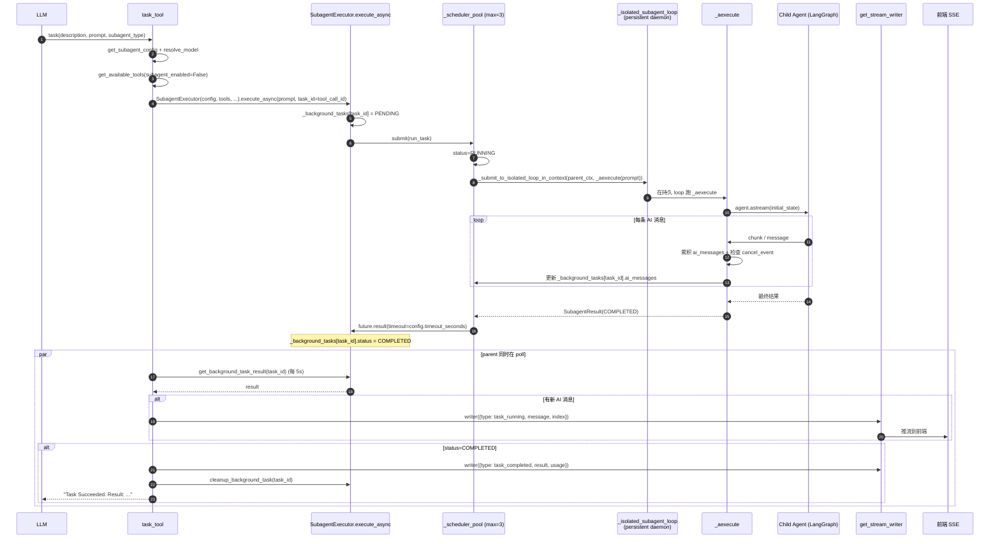
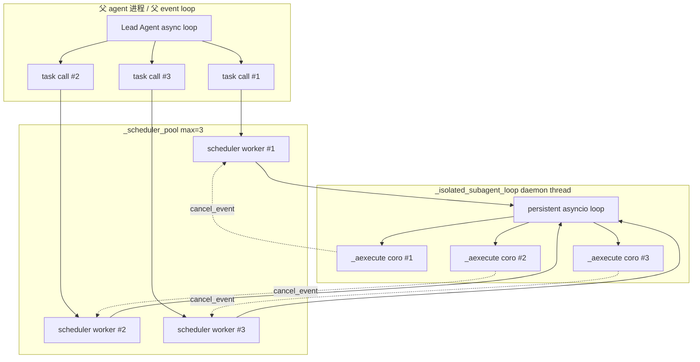

# 16 · Subagent 编排：task 工具 + Executor + 双线程池

> 15 篇结尾说："Part G 进入 subagent 系统"。这一章把 deer-flow 把 lead agent 升级成 "orchestrator" 的核心机制讲清楚：从 LLM 调 `task(...)` → 调度到独立线程跑 → 通过 SSE writer 实时报告进度 → 父 agent 拿到结果继续。
>
> 这是 deer-flow agent system 里最复杂的一段并发代码（executor 828 行 + task_tool 422 行）。看完这一章你会明白为什么 deer-flow 用双线程池 + 一个长寿命隔离 event loop、为什么 `SubagentLimitMiddleware` 在 `after_model` 强制截断比 prompt 约束更可靠。

---

## 1. 模块定位（Why this matters）

deer-flow 的 subagent 模式有 3 层关键组件：

| 组件 | 文件 | 责任 |
|------|------|------|
| **`task` 工具** | `tools/builtins/task_tool.py` | LLM 入口；接收 `(description, prompt, subagent_type)` |
| **`SubagentExecutor`** | `subagents/executor.py` | 执行引擎；隔离 event loop + 独立 agent + 工具过滤 |
| **`SubagentLimitMiddleware`** | `agents/middlewares/subagent_limit_middleware.py` | 截断器；after_model 强制 ≤N 个并行 task 调用 |

不读这一章会错过 4 个关键认知：

1. **`task_tool` 不是 fire-and-forget**：它 `execute_async` 后**自己 polling 5 秒/次** 等结果——同时通过 `get_stream_writer()` 把每个新 AI 消息流式发给前端。从 LLM 视角看，`task` 是"调一次拿到完整结果"的同步工具；从工程视角看，它内部是异步 + 进度上报。
2. **双线程池 + 一个长寿命 event loop**：`_scheduler_pool`（max_workers=3）负责调度 + 等待结果；`_isolated_subagent_loop` 是 daemon 线程上的持久 asyncio loop，所有 subagent coroutine 都跑在它上面。**为什么不用 caller 自己的 loop**？因为 LangChain provider 缓存的 async httpx client 绑死 loop——subagent 跑在新 loop 会和父 agent 抢 client（issue #2615 的近亲）。
3. **`SubagentLimitMiddleware` 在 `after_model` 截断 tool_calls list**：LLM 一次想发 10 个 task 调用，middleware 只保留前 3 个、丢弃后 7 个。这是 "硬约束"——prompt 里写"不要超过 3 个"是软约束，LLM 偶尔会忽略；middleware 直接改 state 才是 enforcement。
4. **token usage 跨 agent 边界回灌**：subagent 跑完时通过 `_report_subagent_usage` 把 token 用量传回父 agent 的 `RunJournal`——这样 trace 里看到的 token cost 是 "lead + 所有 subagent" 的总和。

对应到 Harness 六要素：本章对应 **工具集成 + 反馈循环 + 并发模型 + 可观测性** 四条主线的交汇。

---

## 2. 源码地图（Source Map）

### 2.1 关键文件清单

| 路径 | 角色 |
|------|------|
| [`packages/harness/deerflow/tools/builtins/task_tool.py`](../packages/harness/deerflow/tools/builtins/task_tool.py) | `task_tool` LLM 入口（422 行） |
| [`packages/harness/deerflow/subagents/executor.py`](../packages/harness/deerflow/subagents/executor.py) | `SubagentExecutor + 双线程池 + 隔离 loop`（828 行） |
| [`packages/harness/deerflow/subagents/registry.py`](../packages/harness/deerflow/subagents/registry.py) | `get_available_subagent_names / get_subagent_config`（17 篇详谈） |
| [`packages/harness/deerflow/subagents/config.py`](../packages/harness/deerflow/subagents/config.py) | `SubagentConfig + resolve_subagent_model_name` |
| [`packages/harness/deerflow/subagents/builtins/general_purpose.py`](../packages/harness/deerflow/subagents/builtins/general_purpose.py) | 内置 general-purpose subagent config |
| [`packages/harness/deerflow/subagents/builtins/bash_agent.py`](../packages/harness/deerflow/subagents/builtins/bash_agent.py) | 内置 bash subagent config |
| [`packages/harness/deerflow/agents/middlewares/subagent_limit_middleware.py`](../packages/harness/deerflow/agents/middlewares/subagent_limit_middleware.py) | after_model 截断器（77 行） |
| [`packages/harness/deerflow/agents/middlewares/tool_call_metadata.py`](../packages/harness/deerflow/agents/middlewares/tool_call_metadata.py) | `clone_ai_message_with_tool_calls` 辅助 |

### 2.2 关键符号速查表

| 符号 | 文件:行 | 一句话职责 |
|------|---------|-----------|
| `task_tool(runtime, description, prompt, subagent_type, tool_call_id)` | `task_tool.py:170` | `@tool("task")` 装饰 |
| `_get_runtime_app_config(runtime)` | `task_tool.py:149` | 从 runtime context 取 app_config |
| `_merge_skill_allowlists(parent, child)` | `task_tool.py:158` | parent ∩ child 求交（不解锁更多） |
| `_summarize_usage(records)` | `task_tool.py:117` | 累加 token records |
| `_report_subagent_usage(runtime, result)` | `task_tool.py:128` | 一次性回灌到父 RunJournal（usage_reported 守卫） |
| `_subagent_usage_cache: dict[tool_call_id, usage]` | `task_tool.py:31` | 给 TokenUsageMiddleware 跨工具回写 |
| `class SubagentExecutor` | `executor.py:224` | 执行引擎 |
| `SubagentExecutor.execute_async(task, task_id)` | `executor.py:677` | 主用：提交到 `_scheduler_pool` |
| `SubagentExecutor.execute(task, result_holder)` | `executor.py:631` | sync 路径 |
| `SubagentExecutor._execute_in_isolated_loop(...)` | `executor.py:595` | 检测到 running loop 时走 isolated loop |
| `SubagentExecutor._aexecute(task, result_holder)` | `executor.py:404` | 真正的 async 执行 |
| `_scheduler_pool` | `executor.py:89` | `ThreadPoolExecutor(max_workers=3, prefix="subagent-scheduler-")` |
| `_isolated_subagent_loop` | `executor.py:94` | daemon 线程上的持久 asyncio loop |
| `_get_isolated_subagent_loop()` | `executor.py:150` | lazy 启动 + 5s 超时 + 自愈 |
| `_submit_to_isolated_loop_in_context(context, coro_factory)` | `executor.py:181` | `context.run + run_coroutine_threadsafe` |
| `_background_tasks: dict[task_id, SubagentResult]` | `executor.py:85` | 全局存活 task 表 |
| `_background_tasks_lock` | `executor.py:86` | 共享锁 |
| `request_cancel_background_task(task_id)` | `executor.py:752` | 设 `result.cancel_event` |
| `get_background_task_result(task_id)` | `executor.py:770` | poll 入口 |
| `cleanup_background_task(task_id)` | `executor.py:793` | 仅 terminal 状态 |
| `MAX_CONCURRENT_SUBAGENTS = 3` | `executor.py:749` | 全局默认 |
| `class SubagentResult` | `executor.py:52` | dataclass（status / result / error / ai_messages / token_usage_records / cancel_event） |
| `class SubagentStatus(Enum)` | `executor.py:40` | 6 个状态 |
| `_filter_tools(all_tools, allowed, disallowed)` | `executor.py:194` | allowlist + denylist |
| `class SubagentLimitMiddleware` | `subagent_limit_middleware.py:25` | after_model 截断 |
| `MIN_SUBAGENT_LIMIT = 2 / MAX_SUBAGENT_LIMIT = 4` | `subagent_limit_middleware.py:16-17` | 配置 clamp 范围 |
| `_clamp_subagent_limit(value)` | `subagent_limit_middleware.py:20` | clamp 到 [2, 4] |
| `_truncate_task_calls(state)` | `subagent_limit_middleware.py:41` | 主逻辑 |

### 2.3 整体调度时序



### 2.4 并发模型可视化



**关键洞察**：3 个并发 task 调度到 3 个 scheduler worker 线程，每个 worker 用 `run_coroutine_threadsafe` 把 coroutine 提交到**同一个**持久 isolated loop。结果是 3 个 coroutine 并发跑在同一个 event loop 上（loop 内部 cooperatively interleave）。

---

## 3. 核心逻辑精读（Deep Dive）

### 3.1 `task_tool`：从 LLM 入口到 poll loop

```python
# packages/harness/deerflow/tools/builtins/task_tool.py:169-220 (节选)
@tool("task", parse_docstring=True)
async def task_tool(
    runtime: Runtime,
    description: str,
    prompt: str,
    subagent_type: str,
    tool_call_id: Annotated[str, InjectedToolCallId],
) -> str:
    """Delegate a task to a specialized subagent that runs in its own context.

    Subagents help you:
    - Preserve context by keeping exploration and implementation separate
    - Handle complex multi-step tasks autonomously
    ...

    Args:
        description: A short (3-5 word) description of the task for logging/display. ALWAYS PROVIDE THIS PARAMETER FIRST.
        prompt: The task description for the subagent. Be specific and clear about what needs to be done. ALWAYS PROVIDE THIS PARAMETER SECOND.
        subagent_type: The type of subagent to use. ALWAYS PROVIDE THIS PARAMETER THIRD.
    """
    runtime_app_config = _get_runtime_app_config(runtime)
    cache_token_usage = _token_usage_cache_enabled(runtime_app_config)
    available_subagent_names = get_available_subagent_names(app_config=runtime_app_config) if runtime_app_config is not None else get_available_subagent_names()

    # Get subagent configuration
    config = get_subagent_config(subagent_type, app_config=runtime_app_config) if runtime_app_config is not None else get_subagent_config(subagent_type)
    if config is None:
        available = ", ".join(available_subagent_names)
        return f"Error: Unknown subagent type '{subagent_type}'. Available: {available}"
    if subagent_type == "bash":
        host_bash_allowed = is_host_bash_allowed(runtime_app_config) if runtime_app_config is not None else is_host_bash_allowed()
        if not host_bash_allowed:
            return f"Error: {LOCAL_BASH_SUBAGENT_DISABLED_MESSAGE}"
```

**4 个 entry-time 检查**：

1. **`get_subagent_config(subagent_type)` 校验类型存在**：未知类型立刻返回 friendly error，且 list 出所有可用类型——给 LLM 自我修正的提示。
2. **`bash` 特殊检查**：09 篇见过的 `is_host_bash_allowed`——bash subagent 在 Local 模式下默认禁用，避免"通过 subagent 间接 bypass bash 限制"。
3. **`cache_token_usage` 控制 token usage 缓存**：避免 token tracking 关闭时还存 cache。
4. **`tool_call_id` 作为 `task_id`**：让 trace 里 task_id 和 LangChain 的 tool_call_id 是同一个——日志可关联。

```python
# packages/harness/deerflow/tools/builtins/task_tool.py:240-298 (节选)
    if runtime is not None:
        sandbox_state = runtime.state.get("sandbox")
        thread_data = runtime.state.get("thread_data")
        thread_id = runtime.context.get("thread_id") if runtime.context else None
        ...
        metadata = runtime.config.get("metadata", {})
        parent_model = metadata.get("model_name")
        trace_id = metadata.get("trace_id") or str(uuid.uuid4())[:8]

    parent_available_skills = metadata.get("available_skills")
    if parent_available_skills is not None:
        overrides["skills"] = _merge_skill_allowlists(list(parent_available_skills), config.skills)

    if overrides:
        config = replace(config, **overrides)

    # Get available tools (excluding task tool to prevent nesting)
    from deerflow.tools import get_available_tools
    parent_tool_groups = metadata.get("tool_groups")
    ...
    available_tools_kwargs = {
        "model_name": effective_model,
        "groups": parent_tool_groups,
        "subagent_enabled": False,    # ← 关键：subagent 内不能再调 task
    }
    if resolved_app_config is not None:
        available_tools_kwargs["app_config"] = resolved_app_config
    tools = get_available_tools(**available_tools_kwargs)

    # Create executor
    executor = SubagentExecutor(
        config=config,
        tools=tools,
        parent_model=parent_model,
        sandbox_state=sandbox_state,
        thread_data=thread_data,
        thread_id=thread_id,
        trace_id=trace_id,
        ...
    )

    task_id = executor.execute_async(prompt, task_id=tool_call_id)
```

**5 个继承策略**：

| 继承项 | 来源 | 是否可被 subagent_config 覆盖 |
|--------|------|----------------------------|
| `parent_model` | `metadata["model_name"]` | subagent.model="inherit" 时继承 |
| `sandbox_state` | `runtime.state["sandbox"]` | 直接继承，subagent 用同一个 sandbox |
| `thread_data` | `runtime.state["thread_data"]` | 直接继承，subagent 看同一份 workspace |
| `tool_groups` | `metadata["tool_groups"]` | 直接继承，subagent 看同一份工具集 |
| `available_skills` | `metadata["available_skills"]` | **取交集**——subagent 不能解锁更多 skill |

**`_merge_skill_allowlists` 是 defensive intersection**——subagent 的 allowlist 只能是父 allowlist 的子集。否则 LLM 可能"通过 subagent 用父 agent 看不见的 skill"，破坏 12 篇讲的 skill 边界。

**`subagent_enabled=False` 防递归 nesting**：subagent 内不挂 `task_tool`——避免无限嵌套（subagent 调 subagent 调 subagent...）。

### 3.2 `task_tool` 的 polling 主循环

```python
# packages/harness/deerflow/tools/builtins/task_tool.py:300-396 (节选)
    task_id = executor.execute_async(prompt, task_id=tool_call_id)

    poll_count = 0
    last_status = None
    last_message_count = 0
    max_poll_count = (config.timeout_seconds + 60) // 5

    writer = get_stream_writer()
    writer({"type": "task_started", "task_id": task_id, "description": description})

    try:
        while True:
            result = get_background_task_result(task_id)

            if result is None:
                logger.error(f"[trace={trace_id}] Task {task_id} not found")
                writer({"type": "task_failed", ...})
                cleanup_background_task(task_id)
                return f"Error: Task {task_id} disappeared..."

            if result.status != last_status:
                logger.info(f"[trace={trace_id}] Task {task_id} status: {result.status.value}")
                last_status = result.status

            # Check for new AI messages and send task_running events
            ai_messages = result.ai_messages or []
            current_message_count = len(ai_messages)
            if current_message_count > last_message_count:
                for i in range(last_message_count, current_message_count):
                    message = ai_messages[i]
                    writer({
                        "type": "task_running",
                        "task_id": task_id,
                        "message": message,
                        "message_index": i + 1,
                        "total_messages": current_message_count,
                    })
                last_message_count = current_message_count

            # Check if task completed/failed/cancelled/timed_out
            usage = _summarize_usage(getattr(result, "token_usage_records", None))
            if result.status == SubagentStatus.COMPLETED:
                _cache_subagent_usage(tool_call_id, usage, enabled=cache_token_usage)
                _report_subagent_usage(runtime, result)
                writer({"type": "task_completed", "task_id": task_id, "result": result.result, "usage": usage})
                cleanup_background_task(task_id)
                return f"Task Succeeded. Result: {result.result}"
            elif result.status == SubagentStatus.FAILED:
                ...
            elif result.status == SubagentStatus.CANCELLED:
                ...
            elif result.status == SubagentStatus.TIMED_OUT:
                ...

            await asyncio.sleep(5)
            poll_count += 1
            if poll_count > max_poll_count:
                logger.error(f"[trace={trace_id}] Task {task_id} polling timed out")
                ...
                return f"Task polling timed out after {timeout_minutes} minutes..."
    except asyncio.CancelledError:
        request_cancel_background_task(task_id)
        # ... 见 §3.6 ...
        raise
```

**6 个工程亮点**：

1. **5 秒 poll 间隔**：折中——更频繁会浪费 CPU（agent 多半 LLM 慢；5 秒精度对用户感知足够），更稀疏会让进度上报延迟。
2. **增量发送 ai_messages**：维护 `last_message_count`——只发新加入的消息，不重复发已发过的。前端收到的就是逐条流式更新。
3. **`max_poll_count = (timeout + 60) // 5`** 双层超时：
   - 第一层：executor 内部的 `future.result(timeout=config.timeout_seconds)` —— Thread Pool 超时。
   - 第二层：task_tool 自己的 `max_poll_count` ——比第一层多 60 秒缓冲，作为兜底（怕第一层因为某些原因没生效）。
4. **`get_stream_writer()` 是 LangGraph 提供的 SSE writer**：允许工具内部主动 push SSE 事件。这是 LangGraph 的"custom event"机制。
5. **`cleanup_background_task` 在终态调用**：避免 `_background_tasks` 持续膨胀。
6. **`task_started → task_running × N → task_{completed,failed,cancelled,timed_out}` 是稳定的 SSE 事件协议**：前端能按这个状态机展示 "进度气泡 + 实时消息流 + 最终结果"。

### 3.3 `_isolated_subagent_loop`：长寿命 event loop

```python
# packages/harness/deerflow/subagents/executor.py:100-145
def _run_isolated_subagent_loop(
    loop: asyncio.AbstractEventLoop,
    started_event: threading.Event,
) -> None:
    """Run the persistent isolated subagent loop in a dedicated daemon thread."""
    asyncio.set_event_loop(loop)
    loop.call_soon(started_event.set)
    try:
        loop.run_forever()
    finally:
        started_event.clear()


def _shutdown_isolated_subagent_loop() -> None:
    """Stop and close the persistent isolated subagent loop."""
    global _isolated_subagent_loop, _isolated_subagent_loop_thread, _isolated_subagent_loop_started

    with _isolated_subagent_loop_lock:
        loop = _isolated_subagent_loop
        thread = _isolated_subagent_loop_thread
        _isolated_subagent_loop = None
        _isolated_subagent_loop_thread = None
        _isolated_subagent_loop_started = None

    if loop is None:
        return

    if loop.is_running():
        loop.call_soon_threadsafe(loop.stop)

    if thread is not None and thread.is_alive() and thread is not threading.current_thread():
        thread.join(timeout=1)

    thread_stopped = thread is None or not thread.is_alive()
    loop_stopped = not loop.is_running()

    if not loop.is_closed():
        if thread_stopped and loop_stopped:
            loop.close()
        else:
            logger.warning("Skipping close of isolated subagent loop ...")


atexit.register(_shutdown_isolated_subagent_loop)
```

**为什么用持久 loop 而非每次新 loop**？

- LangChain provider（例如 `langchain_openai.ChatOpenAI`）创建时会缓存 **async httpx Client**，绑死创建时的 event loop。
- 如果每个 subagent 都建一个临时 loop：client 在新 loop 创建 → 用完 loop close → client 留下指向已关闭 loop 的引用 → 下次复用时 `Event loop is closed` 错误。
- 用持久 loop：client 绑到这个 loop 上、loop 永远不关、client 可以一直复用。

**`_get_isolated_subagent_loop` 的自愈**：

```python
# packages/harness/deerflow/subagents/executor.py:150-178
def _get_isolated_subagent_loop() -> asyncio.AbstractEventLoop:
    """Return the persistent event loop used by isolated subagent executions."""
    global _isolated_subagent_loop, _isolated_subagent_loop_thread, _isolated_subagent_loop_started
    with _isolated_subagent_loop_lock:
        thread_is_alive = _isolated_subagent_loop_thread is not None and _isolated_subagent_loop_thread.is_alive()
        loop_is_usable = _isolated_subagent_loop is not None and not _isolated_subagent_loop.is_closed() and _isolated_subagent_loop.is_running() and thread_is_alive

        if not loop_is_usable:
            loop = asyncio.new_event_loop()
            started_event = threading.Event()
            thread = threading.Thread(
                target=_run_isolated_subagent_loop,
                args=(loop, started_event),
                name="subagent-persistent-loop",
                daemon=True,
            )
            thread.start()
            if not started_event.wait(timeout=5):
                loop.call_soon_threadsafe(loop.stop)
                thread.join(timeout=1)
                loop.close()
                raise RuntimeError("Timed out starting isolated subagent event loop")
            _isolated_subagent_loop = loop
            _isolated_subagent_loop_thread = thread
            _isolated_subagent_loop_started = started_event

        if _isolated_subagent_loop is None:
            raise RuntimeError("Isolated subagent event loop is not initialized")
        return _isolated_subagent_loop
```

**4 处自愈细节**：

1. **lazy 启动**：第一次调用才启线程——避免无 subagent 场景下空跑线程。
2. **多重健康检查**：`thread_is_alive + loop not closed + loop running + same thread`——任一不满足就重建。
3. **`started_event.wait(timeout=5)` 启动超时**：保证 loop 真正开始 run_forever 后才返回——避免外面已经 `run_coroutine_threadsafe` 而 loop 还没就绪。
4. **`atexit.register(_shutdown_isolated_subagent_loop)`** 进程退出时清理——daemon 线程虽然会跟着退，但显式 `loop.stop + thread.join(1)` 更干净。

### 3.4 `_submit_to_isolated_loop_in_context`：跨线程 ContextVar 传递

```python
# packages/harness/deerflow/subagents/executor.py:181-191
def _submit_to_isolated_loop_in_context(
    context: Context,
    coro_factory: Callable[[], Coroutine[Any, Any, SubagentResult]],
) -> Future[SubagentResult]:
    """Submit a coroutine to the isolated loop while preserving ContextVar state."""
    return context.run(
        lambda: asyncio.run_coroutine_threadsafe(
            coro_factory(),
            _get_isolated_subagent_loop(),
        )
    )
```

**14 篇讲过 ContextVar 不跨 threading 传播**。这里需要传——subagent 必须知道父请求的 user_id（不然 memory 抽取错位）。

**`context.run(lambda: ...)`** 的作用：

- 在父 task 调 `copy_context()` 抓快照。
- 在 scheduler thread 里 `context.run(...)` 进入这个快照——ContextVar 值临时被绑定到这个快照值。
- 在 run 内调 `asyncio.run_coroutine_threadsafe` 提交 coroutine——coroutine 在 isolated loop 里跑时，又通过另一次 `context.run` 进入正确的 context。

**结果**：subagent coroutine 看到的 ContextVar 值 = 父请求当时的值。**ContextVar 跨 3 个执行环境（父 asyncio task → scheduler thread → isolated loop task）被正确传递**。

这是 Python 并发模型里**最 tricky 也最优雅**的一段 code 之一。

### 3.5 `execute_async` 的 run_task 闭包

```python
# packages/harness/deerflow/subagents/executor.py:677-746
def execute_async(self, task: str, task_id: str | None = None) -> str:
    if task_id is None:
        task_id = str(uuid.uuid4())[:8]

    result = SubagentResult(
        task_id=task_id,
        trace_id=self.trace_id,
        status=SubagentStatus.PENDING,
    )

    with _background_tasks_lock:
        _background_tasks[task_id] = result

    parent_context = copy_context()

    def run_task():
        with _background_tasks_lock:
            _background_tasks[task_id].status = SubagentStatus.RUNNING
            _background_tasks[task_id].started_at = datetime.now()
            result_holder = _background_tasks[task_id]

        try:
            execution_future = _submit_to_isolated_loop_in_context(
                parent_context,
                lambda: self._aexecute(task, result_holder),
            )
            try:
                exec_result = execution_future.result(timeout=self.config.timeout_seconds)
                with _background_tasks_lock:
                    _background_tasks[task_id].status = exec_result.status
                    _background_tasks[task_id].result = exec_result.result
                    _background_tasks[task_id].error = exec_result.error
                    _background_tasks[task_id].completed_at = datetime.now()
                    _background_tasks[task_id].ai_messages = exec_result.ai_messages
            except FuturesTimeoutError:
                logger.error(f"[trace={self.trace_id}] Subagent {self.config.name} execution timed out after {self.config.timeout_seconds}s")
                with _background_tasks_lock:
                    if _background_tasks[task_id].status == SubagentStatus.RUNNING:
                        _background_tasks[task_id].status = SubagentStatus.TIMED_OUT
                        _background_tasks[task_id].error = f"Execution timed out after {self.config.timeout_seconds} seconds"
                        _background_tasks[task_id].completed_at = datetime.now()
                result_holder.cancel_event.set()
                execution_future.cancel()
        except Exception as e:
            logger.exception(f"...")
            with _background_tasks_lock:
                _background_tasks[task_id].status = SubagentStatus.FAILED
                _background_tasks[task_id].error = str(e)
                _background_tasks[task_id].completed_at = datetime.now()

    _scheduler_pool.submit(run_task)
    return task_id
```

**4 处工程精妙**：

1. **`parent_context = copy_context()` 提前抓快照**：在父 task 里抓，闭包持有；scheduler thread 里 run_task 拿到这份快照，传给 `_submit_to_isolated_loop_in_context`。
2. **PENDING → RUNNING 在 scheduler thread 切换**：让 task_tool poll 时能正确看到状态变化。
3. **`if status == RUNNING:` 才设 TIMED_OUT**：防止已 COMPLETED 的 task 被 timeout race condition 覆盖成 TIMED_OUT。
4. **`result_holder.cancel_event.set()` 协作式取消**：timeout 时通知 subagent loop 内的 `_aexecute` 在下一个 yield point 停下。Python `Future.cancel()` 对已经在跑的 coroutine 没用——必须协作式。

### 3.6 取消处理：`asyncio.CancelledError`

```python
# packages/harness/deerflow/tools/builtins/task_tool.py:397-422
    except asyncio.CancelledError:
        # Signal the background subagent thread to stop cooperatively.
        request_cancel_background_task(task_id)

        # Wait (shielded) for the subagent to reach a terminal state so the
        # final token usage snapshot is reported to the parent RunJournal
        # before the parent worker persists get_completion_data().
        terminal_result = None
        try:
            terminal_result = await asyncio.shield(_await_subagent_terminal(task_id, max_poll_count))
        except asyncio.CancelledError:
            pass

        # Report whatever the subagent collected (even if we timed out).
        final_result = terminal_result or get_background_task_result(task_id)
        if final_result is not None:
            _report_subagent_usage(runtime, final_result)
        if final_result is not None and _is_subagent_terminal(final_result):
            cleanup_background_task(task_id)
        else:
            _schedule_deferred_subagent_cleanup(task_id, trace_id, max_poll_count)
        _subagent_usage_cache.pop(tool_call_id, None)
        raise
```

**这段处理"用户中途中断"的优雅退出**：

1. **Signal cancel**：`request_cancel_background_task` 设 `cancel_event` → subagent 在下一个 yield point 退出。
2. **`asyncio.shield` 等终态**：父 cancel 不会让自己也被 cancel——shield 保护"等终态"这个 await 不被中断。
3. **报告最终 token usage**：subagent 即使被 cancel 也产生了 LLM cost——必须计入 trace。
4. **deferred cleanup**：subagent 可能还没真正退出（cooperatively），不强制 cleanup；用 `_schedule_deferred_subagent_cleanup` 后台再 poll 直到 terminal 再清。

**这是 production-quality 的 cancellation handling**——大多数 Python 项目的 cancel 处理都是"raise 出去拉倒"，deer-flow 这套是"通知 + 等清理 + 报数据 + 延迟清理" 4 步。

### 3.7 `SubagentLimitMiddleware`：after_model 截断

```python
# packages/harness/deerflow/agents/middlewares/subagent_limit_middleware.py:25-76
class SubagentLimitMiddleware(AgentMiddleware[AgentState]):
    """Truncates excess 'task' tool calls from a single model response."""

    def __init__(self, max_concurrent: int = MAX_CONCURRENT_SUBAGENTS):
        super().__init__()
        self.max_concurrent = _clamp_subagent_limit(max_concurrent)

    def _truncate_task_calls(self, state: AgentState) -> dict | None:
        messages = state.get("messages", [])
        if not messages:
            return None

        last_msg = messages[-1]
        if getattr(last_msg, "type", None) != "ai":
            return None

        tool_calls = getattr(last_msg, "tool_calls", None)
        if not tool_calls:
            return None

        task_indices = [i for i, tc in enumerate(tool_calls) if tc.get("name") == "task"]
        if len(task_indices) <= self.max_concurrent:
            return None

        indices_to_drop = set(task_indices[self.max_concurrent :])
        truncated_tool_calls = [tc for i, tc in enumerate(tool_calls) if i not in indices_to_drop]

        dropped_count = len(indices_to_drop)
        logger.warning(f"Truncated {dropped_count} excess task tool call(s) from model response (limit: {self.max_concurrent})")

        updated_msg = clone_ai_message_with_tool_calls(last_msg, truncated_tool_calls)
        return {"messages": [updated_msg]}

    @override
    def after_model(self, state: AgentState, runtime: Runtime) -> dict | None:
        return self._truncate_task_calls(state)
```

**5 个关键决策**：

1. **挂 after_model 不挂 wrap_tool_call**：在 LLM 输出**进入 ToolNode 之前**截断——LangGraph 不知道有超额 tool_calls。
2. **只 truncate `task` tool**：其它工具（read_file / bash 等）保留——它们多发并不破坏并发模型，只有 `task` 才会启 sandbox/线程。
3. **`task_indices[self.max_concurrent:]` 丢后面的**：保留前 N 个，按 LLM 输出顺序裁。
4. **`clone_ai_message_with_tool_calls` 保 ID**：用 `clone_ai_message_with_tool_calls` 复用原 message ID → LangGraph `add_messages` reducer 走 in-place replace（和 15 篇 ID swap 同模式）。
5. **`_clamp_subagent_limit(value)` 限制 [2, 4]**：用户配 1 没意义（subagent 失去并发价值），>4 容易打爆 LLM rate limit。

**为什么这个 middleware 是"强约束"而 prompt 是"软约束"**？

- prompt：13 篇讲过 prompt 里有 "**HARD LIMIT: max 3 task calls per response**" 反复三次。但 LLM 偶尔（5-10%）还是会忘。
- middleware：直接改 state 截断——LLM 看不到被丢的 task，下一轮也不知道有这事。**100% enforce**。

这是 deer-flow "prompt + middleware 双保险" 设计哲学的典型——能强制就别只靠 prompt。

---

## 4. 关键问题答疑（Key Questions）

### Q1：为什么 task_tool 的 poll loop 是 5 秒间隔？

权衡：

- **更频繁（如 1s）**：CPU 浪费——agent 调度多半在等 LLM（数秒级），1s 内 80% 是空 poll。
- **更稀疏（如 30s）**：用户感受到的"卡顿"——前端 30s 才看到一条 task_running 更新。
- **5s**：人类感觉"还在动"+ CPU 开销可忽略。

注意：**poll 不是真的轮询 thread 状态**——只是从 `_background_tasks` dict 读最新 `SubagentResult`，几乎零成本。

### Q2：3 个 subagent 同时跑，会真的并发吗？

会，但**底层是 cooperative concurrency**：

- 3 个 scheduler thread 各自把 coroutine 提交到同一个 isolated loop。
- isolated loop 单线程跑——cooperatively interleave 3 个 coroutine（在每个 `await` 点切换）。
- 真正的并发在 **LLM HTTP 请求**层面——3 个 coroutine 各自 `await httpx.AsyncClient.post(...)`，loop 在等响应时让其它 coroutine 跑。

**结果**：3 个 LLM 请求几乎同时发出 + 几乎同时返回。CPU 几乎不被占用——大头都在网络等待。

### Q3：subagent 内还能调 task 吗？

**不能**。看 `task_tool.py:277` 的 `"subagent_enabled": False`——subagent 拉自己的 tools 时显式关掉了 task tool。

如果允许递归 nesting：

- 3 个 lead → 3 个 subagent → 9 个 sub-subagent → 27 个 sub-sub-sub-subagent → ...
- 指数爆炸，几秒就把 sandbox 和 LLM rate limit 打爆。

### Q4：subagent 用什么 model？

3 级 fallback（看 `resolve_subagent_model_name`）：

1. `config.model`（subagent 自己声明的）。
2. `"inherit"` → `parent_model`（父 agent 的 model）。
3. 全局默认 model。

每个 subagent 类型可以独立指定——例如 `bash` subagent 用便宜模型（命令执行不需要 SOTA），`general-purpose` 继承父 model（保持质量一致）。

### Q5：task 超时后，subagent 真停了吗？

**有努力但不保证立即**：

1. `future.cancel()` 对已经在跑的 coroutine 无效。
2. `result_holder.cancel_event.set()` → `_aexecute` 在 `async for chunk in agent.astream(...)` 循环里每次迭代检查 cancel_event → True 则 break 退出。
3. 如果 subagent 当前卡在 LLM 请求里（最常见），要等 LLM 返回才能检查 cancel_event——可能再等几秒到几十秒。

**完美的强制取消在 Python asyncio 里几乎不可能**（除非引入 thread killing）——deer-flow 选了 "best-effort cooperative" + deferred cleanup 来兜底。

### Q6：3 个 task 同时发出，poll loop 怎么知道哪个 task_running 事件对应哪个 task？

每个 `writer({"task_id": task_id, ...})` 都带 `task_id`——前端按 task_id 维护多个 "task 进度气泡"，更新对应那个。

每个 task_tool 实例的 poll loop **只关心自己的 task_id**——3 个 task_tool 各跑自己的 while True 循环，互不干扰。

---

## 5. 横向延伸与面试级洞察（Interview-Grade Insights）

### 5.1 "持久 event loop + ContextVar 跨线程传递" 是 deer-flow 最难的并发设计

deer-flow 整个 codebase 里最复杂的并发模型就是 subagent 系统。它解决了 3 个棘手问题：

1. **LangChain client 不能跨 loop 复用** → 持久 isolated loop。
2. **ContextVar 不跨 threading 传播** → `copy_context() + context.run()` 显式快照。
3. **subagent 必须可取消但 Python async cancel 不可靠** → `cancel_event` + cooperative + deferred cleanup。

**面试金句**：deer-flow 的 subagent 并发模型不是"async/await + 线程池就完事"——它把 "client 生命周期绑死 loop" 这个 langchain 隐藏问题、ContextVar 跨执行模型的传播问题、Python asyncio cancel 不可靠问题三个一起解了。这是 production-quality 异步代码区别于 textbook async 例子的关键。

### 5.2 "after_model 截断" 是 prompt + middleware 双约束的范式

很多人觉得"prompt 写清楚就够了"。deer-flow 的实践是：

- **prompt** 给 LLM **意图引导**——告诉它 "应该" 怎么做。
- **middleware** 提供 **物理 enforcement**——让 LLM "无法" 违反。

适用范围广：

- subagent 并发上限 → SubagentLimitMiddleware
- loop detection → LoopDetectionMiddleware（18 篇）
- tool 调用安全 → SandboxAuditMiddleware（09 篇）
- 字符长度限制 → SummarizationMiddleware（18 篇）

**面试金句**：production agent 系统里，prompt 是"软引导"，middleware 是"硬约束"——任何能用 middleware 强制的规则都不应该只靠 prompt。这是 deer-flow 18 节中间件存在的根本原因。

### 5.3 vs AutoGen GroupChat / CrewAI Crew

| 框架 | 多 agent 协作 |
|------|------------|
| **AutoGen GroupChat** | 多个 agent 在同一对话里轮流发言，无显式 task 调度 |
| **CrewAI Crew** | 多 agent 顺序执行 task，每个 task 独立 LLM 调用 |
| **OpenAI Swarm** | handoff 模式——A agent 切换给 B agent，状态完全转移 |
| **deer-flow** | lead agent 主导，task tool 并发 fan-out 到 subagent，subagent 异步 + SSE 进度上报 |

deer-flow 的"lead orchestrator + parallel subagent"模式更接近**项目经理 + 自由职业者**的工作模式——lead 决策、subagent 干活、并行最大化、有可观测性。

### 5.4 "task_call 截断" 与"prompt 重复三次" 是孪生设计

13 篇讲 prompt 里 subagent 指令出现 3 次（thinking_style / subagent_system / critical_reminders）。这一篇讲 SubagentLimitMiddleware 在 after_model 强制截断。

两者是**孪生设计**：

- prompt 重复 3 次 → 让 LLM 服从率从 ~90% 上升到 ~99%。
- middleware 截断 → 兜底剩下的 1%，让 enforcement 100%。

prompt 和 middleware 不是替代关系——是 **layered defense**。

---

## 6. 实操教程（Hands-on Lab）

### 6.1 最小可运行示例：观察 subagent 执行

```python
# backend/debug_subagent.py
"""直接调 SubagentExecutor，不通过 LLM"""
import logging
logging.basicConfig(level=logging.INFO)

from deerflow.subagents import SubagentExecutor, get_subagent_config
from deerflow.tools import get_available_tools


config = get_subagent_config("general-purpose")
tools = get_available_tools(subagent_enabled=False)

executor = SubagentExecutor(
    config=config,
    tools=tools,
    parent_model=None,
    sandbox_state={"sandbox_id": "local"},
    thread_data={
        "workspace_path": "/tmp/deerflow-subagent-debug/workspace",
        "uploads_path": "/tmp/deerflow-subagent-debug/uploads",
        "outputs_path": "/tmp/deerflow-subagent-debug/outputs",
    },
    thread_id="debug-thread",
)

import os
os.makedirs("/tmp/deerflow-subagent-debug/workspace", exist_ok=True)

# 同步阻塞调用
result = executor.execute("List the contents of /mnt/user-data/workspace and report what you find.")
print(f"\n=== Status: {result.status.value} ===")
print(f"Result: {result.result[:300] if result.result else 'N/A'}")
print(f"AI messages count: {len(result.ai_messages or [])}")
print(f"Token usage records: {len(result.token_usage_records or [])}")
```

跑：`cd backend && PYTHONPATH=. uv run python debug_subagent.py`

**预期看到**：

- subagent 调 `ls /mnt/user-data/workspace`。
- ai_messages 里有 thinking + tool_calls + final response。
- status=COMPLETED。

### 6.2 Debug 任务清单

#### 实验 ①：观察 `_isolated_subagent_loop` 启动

```python
import threading
from deerflow.subagents.executor import _get_isolated_subagent_loop

print(f"Before: {threading.active_count()} threads")
print(f"  Loop singleton: {_get_isolated_subagent_loop().__class__.__name__}")
print(f"After: {threading.active_count()} threads")
print(f"  Thread names: {[t.name for t in threading.enumerate()]}")
# 应该看到 'subagent-persistent-loop' 线程
```

**能学到**：lazy 启动——第一次调用才启线程。

#### 实验 ②：观察 SubagentLimitMiddleware 的截断

```python
from langchain_core.messages import AIMessage
from deerflow.agents.middlewares.subagent_limit_middleware import SubagentLimitMiddleware

mw = SubagentLimitMiddleware(max_concurrent=3)

# 模拟 LLM 输出 5 个 task tool_calls
ai_msg = AIMessage(
    content="",
    id="msg-001",
    tool_calls=[
        {"name": "task", "args": {"description": f"task {i}", "prompt": "...", "subagent_type": "general-purpose"}, "id": f"tc-{i}"}
        for i in range(5)
    ],
)
state = {"messages": [ai_msg]}
result = mw._truncate_task_calls(state)

# 看截断结果
print(f"Result: {result is not None}")  # True
new_msg = result["messages"][0]
print(f"Tool calls after truncate: {len(new_msg.tool_calls)}")  # 3
print(f"Same message ID: {new_msg.id == 'msg-001'}")  # True (replace in place)
```

**能学到**：超过 3 个的 task call 被丢，message ID 不变（in-place replace）。

#### 实验 ③：故意让 subagent 超时

```python
from deerflow.subagents.config import SubagentConfig

config = SubagentConfig(
    name="slow-test",
    description="...",
    system_prompt="You are slow.",
    timeout_seconds=10,        # 10 秒超时
    model="inherit",
    tools=None, disallowed_tools=None, skills=None,
)
executor = SubagentExecutor(config=config, tools=[], ...)
# 给一个超慢任务
result = executor.execute("Write a 10000-word essay step by step.")
print(f"Status: {result.status.value}")
# 应该是 TIMED_OUT 或 FAILED（如果在 10s 内没完）
```

**能学到**：双层超时（executor + task_tool poll）保证不卡死。

---

## 7. 与下一模块的衔接

读完本章你应该能：

- 解释为什么 deer-flow 用持久 isolated loop 而非每次新 loop（LangChain client 绑死 loop）。
- 描述 ContextVar 跨"父 task → scheduler thread → isolated loop coroutine"3 个执行环境传递的 `copy_context() + context.run()` 模式。
- 区分 task_tool 的 5 秒 poll + SSE writer 增量发送 ai_messages 的设计。
- 说出 `SubagentLimitMiddleware` 在 after_model 截断 task_calls 的 "prompt 软约束 + middleware 硬约束" 孪生设计。
- 知道 cancellation 处理的 4 步：signal cancel_event + shield 等终态 + 报 token usage + deferred cleanup。

接下来 **17 篇（Subagent 注册表 + token 回收 + tool_call_id 缓存）** 会把 subagent 系统的另一面讲清楚：用户怎么注册自定义 subagent 类型（YAML 配 `custom_agents`）、`SubagentTokenCollector` 怎么在子图层面累积 token、`_subagent_usage_cache` 怎么让 `TokenUsageMiddleware`（19 篇）把子图 token 回灌到父 AIMessage 的 usage_metadata。

---

📌 **本章已交付**。请你检查后告诉我：
- 哪几段读起来不顺？
- 是否要补"`_aexecute` 主循环（404-590 行）的逐段解读，特别是 cancel_event 检查 + ai_messages 收集"？
- 还是直接进入 17 篇？
