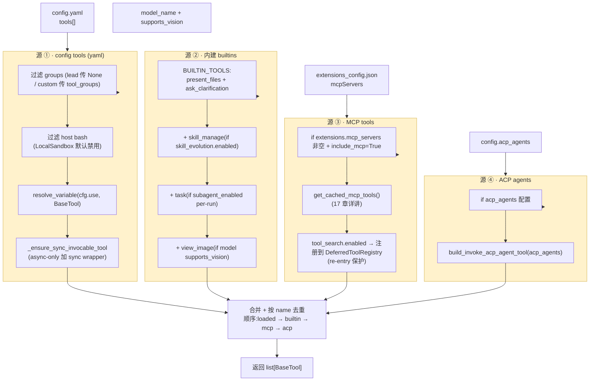
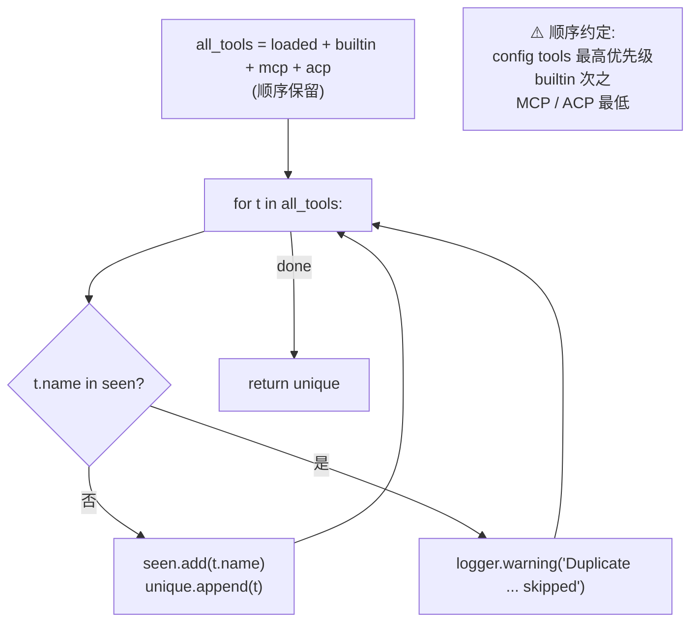
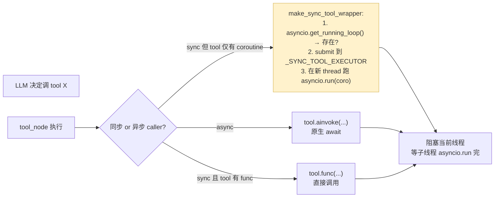

# 16 · 工具系统：四源合并 + 内建工具 + Community 工具栈

> 核心模块层第 7 篇。前面 15 章我们都说"LLM 调工具"，但这些工具**到底从哪里来、怎么装配的**？本章把 `get_available_tools` 这个核心工厂的 200 行源码拆透。
>
> DeerFlow 工具系统的核心是**四源合并 + 配置驱动 + 反射加载**：
> - **源 ①** config-defined tools（用户 yaml 配的）
> - **源 ②** 内建 builtins（DeerFlow 自带的）
> - **源 ③** MCP tools（langchain-mcp-adapters）
> - **源 ④** ACP agent tools（外部 agent 适配）
>
> 关键看点：**name collision 去重 + host bash 安全过滤 + tool_search 重入保护 + async-only 工具的 sync wrapper**。

---

## 🎯 学习目标

读完这份文档，你能回答：

1. **`get_available_tools` 四源加载顺序为什么是这个顺序**？最终去重时"先加载先赢"是个有意 design 还是 implementation detail？
2. **`_is_host_bash_tool` 过滤** —— 在工具加载阶段就拒绝 host bash（如果 LocalSandbox 默认）。**为什么不在工具运行时拒绝？**
3. **tool_search 的"deferred registry 重入保护"** —— `task_tool` 调 `get_available_tools` 给 subagent 构建工具集时，**parent agent 已经把某些 MCP 工具 promote 出来了**，subagent 不能把它们重新 defer 掉。这个 bug 是怎么发生的？怎么修的？
4. **`make_sync_tool_wrapper`** —— 为什么 async-only tool 在 sync 上下文跑要走线程池而不是 `asyncio.run`？什么情况下会走 `_SYNC_TOOL_EXECUTOR` 而不是直接 `asyncio.run`？
5. **DeerFlow 的 `BaseTool.name` 和配置里 `cfg.name` 不一致时，最终绑定哪个？为什么这是个 issue #1803 级别的 bug 源**？

---

## 🗂️ 源码定位

| 关注点 | 文件 / 行号 | 关键锚点 |
|---|---|---|
| 工厂入口 | `packages/harness/deerflow/tools/tools.py` | `get_available_tools` L44-L222；`BUILTIN_TOOLS` L17；`SUBAGENT_TOOLS` L21；`_is_host_bash_tool` L26；`_ensure_sync_invocable_tool` L37 |
| 内建工具 | `packages/harness/deerflow/tools/builtins/` | `clarification_tool.py`（ask_clarification）；`present_file_tool.py`；`view_image_tool.py`；`task_tool.py`（subagent dispatch）；`invoke_acp_agent_tool.py`；`setup_agent_tool.py` / `update_agent_tool.py`（10 章已讲）；`tool_search.py` |
| 异步同步桥接 | `packages/harness/deerflow/tools/sync.py` | `_SYNC_TOOL_EXECUTOR` ThreadPoolExecutor(10)；`make_sync_tool_wrapper` |
| 工具运行时类型 | `packages/harness/deerflow/tools/types.py` | `Runtime = ToolRuntime[dict[str, Any], ThreadState]` |
| skill 管理工具 | `packages/harness/deerflow/tools/skill_manage_tool.py` | 启用 `skill_evolution.enabled` 时加载 |
| Community 工具栈 | `packages/harness/deerflow/community/` | `aio_sandbox` / `ddg_search` / `exa` / `firecrawl` / `image_search` / `infoquest` / `jina_ai` / `serper` / `tavily` |
| Sandbox 工具 | `packages/harness/deerflow/sandbox/tools.py` | `bash_tool` / `read_file_tool` / `write_file_tool` / `str_replace_tool` / `glob_tool` / `grep_tool` / `ls_tool` |
| Host bash 安全护栏 | `packages/harness/deerflow/sandbox/security.py` | `is_host_bash_allowed`（15 章详讲） |
| 反射加载 | `packages/harness/deerflow/reflection/resolvers.py` | `resolve_variable(cfg.use, BaseTool)` |
| Tool 配置 | `packages/harness/deerflow/config/tool_config.py` | `ToolConfig`（name / use / group / description）；`ToolGroupConfig` |
| 工具集成的中间件接口 | 02 章 LangChain `BaseTool` + `@tool` 装饰器 | `BaseTool.invoke / .ainvoke`；`ToolRuntime.context.thread_id` |

---

## 🧭 架构图

### 1. 四源合并流水线



### 2. 去重决策树（"先到先得"）



### 3. 异步 / 同步双轨工具调用



---

## 🔍 核心逻辑讲解

### Part 1 · 四源加载的精确顺序与去重语义

#### 完整加载 200 行的 7 个阶段

```python
def get_available_tools(groups=None, include_mcp=True, model_name=None, subagent_enabled=False, *, app_config=None):
    config = app_config or get_app_config()

    # === 阶段 1: 过滤 config.tools ===
    tool_configs = [tool for tool in config.tools if groups is None or tool.group in groups]
    if not is_host_bash_allowed(config):
        tool_configs = [tool for tool in tool_configs if not _is_host_bash_tool(tool)]   # ⭐ host bash 安全过滤

    # === 阶段 2: 反射加载 ===
    loaded_tools_raw = [(cfg, resolve_variable(cfg.use, BaseTool)) for cfg in tool_configs]

    # === 阶段 3: 名字一致性 warning ===
    for cfg, loaded in loaded_tools_raw:
        if cfg.name != loaded.name:
            logger.warning("Tool name mismatch: config %r vs tool .name %r (issue #1803)...")

    # === 阶段 4: 同异步适配 ===
    loaded_tools = [_ensure_sync_invocable_tool(t) for _, t in loaded_tools_raw]

    # === 阶段 5: 装配 builtins ===
    builtin_tools = BUILTIN_TOOLS.copy()
    if config.skill_evolution.enabled:
        builtin_tools.append(skill_manage_tool)
    if subagent_enabled:
        builtin_tools.extend(SUBAGENT_TOOLS)
    if model_config and model_config.supports_vision:
        builtin_tools.append(view_image_tool)

    # === 阶段 6: 加载 MCP ===
    mcp_tools = []
    if include_mcp:
        ...                                              # 重新读 ExtensionsConfig + tool_search 重入保护

    # === 阶段 7: 加载 ACP ===
    acp_tools = []
    if config.acp_agents:
        acp_tools.append(build_invoke_acp_agent_tool(acp_agents))

    # === 阶段 8: 去重 (顺序优先) ===
    all_tools = loaded_tools + builtin_tools + mcp_tools + acp_tools
    seen_names = set()
    unique_tools = []
    for t in all_tools:
        if t.name not in seen_names:
            unique_tools.append(t)
            seen_names.add(t.name)
        else:
            logger.warning("Duplicate tool name %r detected and skipped (issue #1803)", t.name)
    return unique_tools
```

#### "先到先得"去重的语义

**顺序**：config tools > builtins > MCP > ACP

| 这个顺序的工程含义 | 反过来会怎样 |
|---|---|
| 用户在 yaml 配的优先级最高 → 用户能**覆盖** builtins 行为（如自己写一个比官方更好的 `present_files`） | 反过来：用户辛苦写的工具被框架自带的覆盖 |
| builtins 是 DeerFlow 自带的"刚需"（clarification / present_files）—— 用户没显式覆盖时自动有 | 反之：MCP 服务器装了一个同名 tool 把 builtins 覆盖，行为变得不可预测 |
| MCP / ACP 是"插件"，优先级最低 → 用户安装新 MCP server 不会"突然"破坏既有行为 | 反之：MCP 升级一个工具改了行为 → 用户原本可用的工具被静默换掉 |

→ **这是个 fail-open 兼容性优先的顺序设计**。不只是 implementation detail。

#### 名字不一致的 issue #1803

```python
for cfg, loaded in loaded_tools_raw:
    if cfg.name != loaded.name:
        logger.warning(
            "Tool name mismatch: config name %r does not match tool .name %r ...",
            cfg.name, loaded.name, cfg.use,
        )
```

**真实 bug**（issue #1803）：
- 用户在 `config.yaml` 写：
  ```yaml
  tools:
    - name: web_search
      use: deerflow.community.tavily:tavily_search_tool
  ```
- 但 `tavily_search_tool.name` 实际是 `"tavily_search"`
- LLM 在 prompt 里看到的工具 schema 是用 `loaded.name = "tavily_search"` 注册的
- 但 DeerFlow 内部某些地方还用 `cfg.name = "web_search"`
- → LLM 调 `web_search(...)` → 框架找不到 → "not a valid tool" 错误

**修复**：以 `loaded.name` 为准（LangChain `BaseTool` 内置的 name 字段），**忽略** `cfg.name`。但 warning 日志保留，提醒用户**修 config**让两者一致 → 减少未来配置迷惑。

**面试金句**：**"配置 schema 字段和实际对象字段不一致时，永远以对象的为准 + log warning"** —— 是个**通用配置驱动系统的红线**。

### Part 2 · Host bash 在加载阶段过滤

```python
def _is_host_bash_tool(tool: object) -> bool:
    group = getattr(tool, "group", None)
    use = getattr(tool, "use", None)
    if group == "bash":
        return True
    if use == "deerflow.sandbox.tools:bash_tool":
        return True
    return False


# 在 get_available_tools 内:
if not is_host_bash_allowed(config):
    tool_configs = [tool for tool in tool_configs if not _is_host_bash_tool(tool)]
```

**为什么不在工具运行时拒绝？** 两个选择：

| **加载阶段过滤**（当前） | 运行时拒绝 |
|---|---|
| LLM 根本看不到 bash 工具 schema → 不会调用 | LLM 看到 schema → 调用 → 报错 |
| Prompt 干净（少一个不能用的工具） | Prompt 浪费 token + LLM 困惑 |
| 反射加载次数少 | 每次调用都拒绝一次 |
| 安全姿态：能力**不存在**比"存在但被拒绝"更稳 | 攻击面更大 |

**进一步**：`_is_host_bash_tool` 用**双重识别**（`group == "bash"` 或 `use == "deerflow.sandbox.tools:bash_tool"`）—— 让用户即使把 group 改成别的名字也仍被识别（防止 group rename 绕过安全护栏）。

### Part 3 · `_ensure_sync_invocable_tool` —— async-only 工具的 sync 兜底

#### 问题背景

LangChain `BaseTool` 有两个执行入口：
- `tool.invoke(...)` —— 同步
- `tool.ainvoke(...)` —— 异步

如果工具实现只写了 `coroutine`（async 函数），**没写 sync `func`** —— 当 sync caller 调 `tool.invoke()` 时直接报 "no sync implementation"。

**常见场景**：
- 第三方库（如 `tavily-python`）只提供 async API
- 你用 `@tool` 装饰一个 `async def` 函数

#### `make_sync_tool_wrapper` 的两路径策略

```python
_SYNC_TOOL_EXECUTOR = concurrent.futures.ThreadPoolExecutor(max_workers=10, thread_name_prefix="tool-sync")

def make_sync_tool_wrapper(coro, tool_name):
    def sync_wrapper(*args, **kwargs):
        try:
            loop = asyncio.get_running_loop()
        except RuntimeError:
            loop = None

        if loop is not None and loop.is_running():
            # ⭐ 当前已经在 event loop 内 → 不能再 asyncio.run() → 派给线程池
            future = _SYNC_TOOL_EXECUTOR.submit(asyncio.run, coro(*args, **kwargs))
            return future.result()
        return asyncio.run(coro(*args, **kwargs))     # 无 loop → 直接跑
    return sync_wrapper
```

**两条路径**：

| 调用环境 | 路径 |
|---|---|
| **sync caller，无 asyncio loop**（普通脚本 / 测试） | `asyncio.run(coro(...))` —— 直接 |
| **sync caller，但当前线程在 asyncio loop**（如 LangChain `invoke` 在 FastAPI 内部被同步代码调用） | 子线程 + `asyncio.run` —— **避免"already in event loop"** 异常 |

**为什么不能直接 `asyncio.run` ？** `asyncio.run` 内部检查"当前线程已有 loop" → 抛 `RuntimeError: asyncio.run() cannot be called from a running event loop`。**必须开新线程，新线程内部跑新的 loop**。

#### 共享 ThreadPool 防爆炸

```python
_SYNC_TOOL_EXECUTOR = ThreadPoolExecutor(max_workers=10, thread_name_prefix="tool-sync")
atexit.register(lambda: _SYNC_TOOL_EXECUTOR.shutdown(wait=False))
```

- **`max_workers=10`** —— 上限 10 个并发 sync wrapper 调用，防止内存爆炸
- **共享 executor** —— 所有 async-only tool 共用，不是每个 tool 自己开池
- **`atexit`** 注册 shutdown，进程退出干净

### Part 4 · `tool_search` 重入保护 —— 一个深 bug 的修复

`tools.py` L143-L178 那段长注释**值得逐字读** —— 是个生产 bug fix 的 commit message 凝结。

#### Bug 场景

1. **首次调用 `get_available_tools` 给 lead agent**：
   - MCP tools 全部加进 `DeferredToolRegistry`（"defer 模式" —— 不直接暴露给 LLM，等用 tool_search 主动找出来）
   - lead agent 通过 `tool_search` promote 出 `weather_api` 工具 → 从 registry 移除（promote 操作 drops the entry entirely）

2. **lead agent 调 `task()` 工具 fan-out subagent**：
   - `task_tool` 调 `get_available_tools` 给 subagent 构建工具集
   - 如果**重新构建 registry** → `weather_api` 又被重新 register 成 defer → subagent 看不到它 → 即使 subagent 已经 inherit 了 lead 的 promote 决定，调用时**被 DeferredToolFilterMiddleware 又 hide 掉**
   - 结果：subagent 在 prompt 里能看到 `weather_api` 的存在但**无法实际调用**（issue #2884）

#### 修复方案

```python
existing_registry = get_deferred_registry()
if existing_registry is None:                                  # contextvar 默认 None
    registry = DeferredToolRegistry()
    for t in mcp_tools:
        registry.register(t)
    set_deferred_registry(registry)
else:
    # ⭐ 复用现有 registry,不重置 — 保留 parent 的 promotions
    mcp_tool_names = {t.name for t in mcp_tools}
    still_deferred = len(existing_registry)
    promoted_count = max(0, len(mcp_tool_names) - still_deferred)
    logger.info(f"Tool search active (preserved promotions): ...")
```

**核心机制**：`DeferredToolRegistry` 通过 `contextvars.ContextVar` 持有 —— 同一 graph 运行内的子调用（subagent 重入 `get_available_tools`）**共享同一个 registry**。**新请求/graph run 是新 asyncio task → 新 contextvar → 自动重置**。

#### 为什么"不与最新 mcp_tools snapshot 同步"？

注释中明示：
> Intentionally NOT reconciling against the current ``mcp_tools`` snapshot. The MCP cache only refreshes on ``extensions_config.json`` mtime changes, which in practice happens between graph runs — not inside one.

**关键洞察**：MCP cache 只在 `extensions_config.json` 改动时刷新。在单个 graph run 内部不会发生。所以**run 内复用 registry 安全**。

→ **这是个"利用 ContextVar 给 graph run 划生命周期边界"的精妙设计**。

### Part 5 · 内建工具体系（按职责分类）

```python
BUILTIN_TOOLS = [
    present_file_tool,           # 暴露文件给前端 (07 章讲过 artifacts 写入)
    ask_clarification_tool,      # ⭐ return_direct=True,与 ClarificationMiddleware 配合
]

SUBAGENT_TOOLS = [
    task_tool,                   # subagent 调度入口 (17 章详讲)
]

# 条件加载:
# - skill_manage_tool: skill_evolution.enabled
# - view_image_tool: model.supports_vision
# - setup_agent / update_agent: 由 10 章 lead-agent factory 加,不在这里
# - tool_search: tool_search.enabled + MCP 启用
# - invoke_acp_agent: acp_agents 配置非空
```

#### `ask_clarification_tool` 的 `return_direct=True`

```python
@tool("ask_clarification", parse_docstring=True, return_direct=True)
def ask_clarification_tool(...) -> str:
    """Ask the user for clarification ..."""
```

**`return_direct=True`** 是 LangChain `BaseTool` 的字段：**调用此工具后，agent 立即返回结果给用户，不再回 LLM 续跑**。

但 DeerFlow 不依赖 `return_direct` —— **`ClarificationMiddleware.wrap_tool_call`**（11 章）拦截这个工具直接返回 `Command(goto=END)`，效果更彻底。**`return_direct=True` 是个兼容性兜底**：万一 ClarificationMiddleware 没装（如 subagent 路径），仍有 LangChain 自身的截断。

#### `task_tool` 与 `invoke_acp_agent_tool` 的对比

| | `task_tool` | `invoke_acp_agent_tool` |
|---|---|---|
| 调用对象 | DeerFlow 内置 subagent（同进程） | 外部 ACP 协议 agent（独立进程） |
| 上下文隔离 | 独立 RunnableConfig 但共享 sandbox | 完全独立工作区 |
| 计费归属 | 通过 token_collector 回归到 lead | 独立计 |
| 启动延迟 | 即时（同进程 spawn） | 高（启动外部进程） |
| 何时启用 | `subagent_enabled` per-run | `acp_agents` 配置非空 |

→ DeerFlow 通过这两个工具**给 LLM 两种不同语义的"委派"** —— 17 章会详讲。

### Part 6 · Community 工具栈一览

```
community/
├── aio_sandbox/      # 容器化沙箱 Provider (15 章)
├── ddg_search/       # DuckDuckGo 搜索
├── exa/              # Exa 语义搜索
├── firecrawl/        # Firecrawl 抓取
├── image_search/     # DuckDuckGo 图片搜索
├── infoquest/        # BytePlus InfoQuest 搜索 + 抓取
├── jina_ai/          # Jina Reader 抓取 + 嵌入
├── serper/           # Serper Google 搜索
└── tavily/           # Tavily 搜索 + 抓取
```

**社区工具不预装** —— 全部通过 `config.yaml.tools[]` 的 `use:` 路径反射加载。用户：
```yaml
tools:
  - name: web_search
    use: deerflow.community.tavily:tavily_search_tool
    group: web
```

**为什么放 community/**：
1. **依赖隔离** —— Tavily / Jina / Firecrawl 这些三方 SDK 各自加依赖；放 community/ 让用户**只装自己需要的**
2. **可替换** —— 用户可以 fork 一个 community/ 工具改版本，不动 harness
3. **演示价值** —— community/ 是新人贡献工具的"参考模板"

### Part 7 · `@tool` 装饰器与 `ToolRuntime`

打开 `tools/types.py` 看 DeerFlow 自己的 Runtime 类型：

```python
from langchain.tools import ToolRuntime
from deerflow.agents.thread_state import ThreadState

Runtime = ToolRuntime[dict[str, Any], ThreadState]
```

**`ToolRuntime[ContextT, StateT]`**：
- `ContextT` —— 工具调用时能从 runtime.context 拿到的字典（DeerFlow 用 `dict[str, Any]`，里面有 `thread_id` / `run_id` / `agent_name`）
- `StateT` —— graph state schema（DeerFlow 用 `ThreadState`）

**为什么不用 `ToolRuntime[ContextT, StateT]` 的 unbound TypeVar？**
源码注释：
> Using dict[str, Any] for the context parameter instead of the unbound ContextT TypeVar prevents PydanticSerializationUnexpectedValue warnings when LangChain calls model_dump() on a tool's auto-generated args_schema.

**Pydantic 在工具 args_schema 序列化时遇到 TypeVar 会 warn** → 改成具体 `dict[str, Any]` 抑制 warning。

#### 工具内访问 thread_id 的标准模式

```python
@tool("my_tool", parse_docstring=True)
def my_tool(arg1: str, runtime: Runtime) -> str:
    """Tool that uses thread_id."""
    thread_id = runtime.context.get("thread_id")
    user_id = runtime.context.get("user_id")     # 由 ThreadDataMiddleware 注入
    # ... 业务逻辑
    return f"executed for thread {thread_id}"
```

**关键点**：工具签名里**显式接收 `runtime: Runtime`** —— LangChain `@tool` 装饰器识别这个参数名，不把它当 LLM 参数（不进 schema），而是自动注入运行时上下文。

---

## 🧩 体现的通用 Agent 设计模式

| 模式 | 工具系统中的体现 |
|---|---|
| **Multi-source Plugin Merge**（多源插件合并） | config tools / builtins / MCP / ACP 四源装配 |
| **Reflection-driven Plugin Loading** | `resolve_variable(cfg.use, BaseTool)` |
| **Capability-gated Inclusion**（能力门控加载） | view_image 看 supports_vision；task 看 subagent_enabled |
| **Security Gate at Load Time**（加载时安全门） | host bash 在 tool_configs 阶段过滤掉 |
| **Sync-Async Adapter** | `make_sync_tool_wrapper` 让 async tool 兼容 sync caller |
| **Re-entrant Safe State via ContextVar** | tool_search registry 用 contextvar 自动划分 graph run 生命周期 |
| **Name-collision Dedup with Priority** | 顺序加载 + seen-set 去重 |
| **Inject-via-named-parameter** | `runtime: Runtime` 参数自动注入而不进 schema |

---

## 🧱 与 Agent Harness 六要素的对应关系

| 六要素 | 工具系统怎么提供基础设施 |
|---|---|
| ① 反馈循环 | 工具结果 → ToolMessage → 进入下一轮 LLM 反馈 |
| ② 记忆持久化 | present_files 把工具产物暴露给前端持久 |
| ③ 动态上下文 | tool_search 让"工具空间"按需暴露而不是全展开 |
| ④ 安全护栏 | host bash 加载阶段过滤；name collision dedup 防工具混淆 |
| ⑤ 工具集成 | **本章核心** —— 四源装配是工具集成的工厂 |
| ⑥ 可观测性 | `cfg.name vs loaded.name` warning；duplicate warning；MCP/ACP 加载日志 |

---

## ⚠️ 常见坑与调试技巧

### 坑 1 · 配置 name 与 tool.name 不一致 → LLM "not a valid tool"

见 Part 1 issue #1803。**修复**：把 `cfg.name` 改成 `loaded.name`（让两者一致）。**调试**：grep 启动日志 "Tool name mismatch"。

### 坑 2 · 工具 group 没声明 → host bash 过滤失败

如果你写一个 wrapper 工具调 bash：
```yaml
tools:
  - name: my_bash_wrapper
    use: my.tools:my_bash
    # 没写 group: bash
```

`_is_host_bash_tool` 看 `group == "bash"` 和 `use 后缀` 两个条件，**都不匹配** → 不过滤 → host bash 暴露。**修复**：所有 bash 派生工具显式 `group: bash`。

### 坑 3 · subagent 看到 deferred MCP 工具但调不动（issue #2884）

见 Part 4。修复路径：升级到包含 contextvar registry 复用的版本（DeerFlow 已修）。**自检**：跑一个 subagent + tool_search 启用的 demo，看 subagent 是否能调 promoted MCP 工具。

### 坑 4 · 重名 tool 静默被忽略

```yaml
tools:
  - name: search
    use: deerflow.community.tavily:tavily_search_tool      # name='tavily_search'
  - name: search
    use: deerflow.community.serper:serper_search_tool      # name='serper_search'
```

去重的是 `loaded.name`，所以 tavily_search 和 serper_search **都被保留** —— 但你以为只有一个 "search" 工具。

**反向坑**：如果两个 tool 配置不同但 .name 相同，**只保留第一个**。debug 时检查工具计数。

### 坑 5 · sync_wrapper 把 async 工具拖到子线程引入 ContextVar 丢失

**关键问题**：`asyncio.run(coro)` 在**新线程**跑 → 子线程**继承**当前 `contextvars.Context` 吗？

Python 默认行为：`ThreadPoolExecutor.submit` **不会**自动传播 contextvars。`asyncio.run` 在新 thread 创建新 event loop + 新 Context。**之前 set 的 contextvar 全丢**！

**潜在影响**：
- 工具内调 `get_effective_user_id()` → 拿不到 user_id（contextvar 丢）
- 工具内调 `get_app_config()` → 如果有 override，丢

**修复**（DeerFlow 当前没显式做）：用 `contextvars.copy_context().run(asyncio.run, coro)` 把当前 context 复制到新线程。**这是个潜在的 PR**。

---

## 🛠️ 动手实操

> 本 demo 不需要 LLM，直接调 `get_available_tools` 看不同配置下的工具集变化。

### Demo · 四源加载行为实测

```python
"""
Tools system 四源装配 demo.

跑法:  PYTHONPATH=backend uv run python scripts/tools_system_walkthrough.py
"""
import sys, os
from pathlib import Path

sys.path.insert(0, "backend")
sys.path.insert(0, "backend/packages/harness")
os.chdir(Path(__file__).resolve().parents[1])

from deerflow.tools import get_available_tools
from deerflow.config.app_config import get_app_config


def print_toolset(label, tools):
    print(f"\n--- {label} (共 {len(tools)} 个) ---")
    for t in tools:
        name = getattr(t, "name", "?")
        desc = (getattr(t, "description", "") or "")[:60].replace("\n", " ")
        print(f"  {name:<32}  {desc}...")


# ====== Case 1: 默认配置 ======
print("\n" + "=" * 70)
print("CASE 1 · 默认配置(无 subagent / 无 vision)")
print("=" * 70)
tools = get_available_tools()
print_toolset("默认", tools)


# ====== Case 2: subagent enabled ======
print("\n" + "=" * 70)
print("CASE 2 · subagent_enabled=True")
print("=" * 70)
tools = get_available_tools(subagent_enabled=True)
print_toolset("含 subagent", tools)
print(f"  ⭐ 多出 task 工具? {'task' in [t.name for t in tools]}")


# ====== Case 3: vision model ======
print("\n" + "=" * 70)
print("CASE 3 · 模型 supports_vision=True")
print("=" * 70)
app = get_app_config()
vision_model = next((m for m in app.models if m.supports_vision), None)
if vision_model:
    tools = get_available_tools(model_name=vision_model.name)
    print(f"  使用 vision 模型: {vision_model.name}")
    print(f"  ⭐ 多出 view_image 工具? {'view_image' in [t.name for t in tools]}")
else:
    print(f"  当前 config 无 vision 模型,跳过")


# ====== Case 4: tool_groups 过滤 ======
print("\n" + "=" * 70)
print("CASE 4 · 按 group 过滤 (模拟 custom agent)")
print("=" * 70)
all_groups = list({tool.group for tool in app.tools if tool.group})
print(f"  config 中所有 groups: {all_groups}")
if all_groups:
    first_group = all_groups[0]
    tools = get_available_tools(groups=[first_group])
    config_tools_in_group = [t for t in tools if t.name not in ("present_files", "ask_clarification")]
    print(f"  仅 group='{first_group}' 的工具: {[t.name for t in config_tools_in_group]}")


# ====== Case 5: host bash 加载阶段过滤 ======
print("\n" + "=" * 70)
print("CASE 5 · host bash 安全过滤")
print("=" * 70)
from deerflow.sandbox.security import is_host_bash_allowed, uses_local_sandbox_provider

is_local = uses_local_sandbox_provider()
host_bash_allowed = is_host_bash_allowed()
print(f"  uses_local_sandbox_provider: {is_local}")
print(f"  is_host_bash_allowed: {host_bash_allowed}")

tools = get_available_tools()
has_bash = any(t.name == "bash" for t in tools)
print(f"  bash 工具在 toolset 里? {has_bash}")
if is_local and not host_bash_allowed:
    print(f"  ✅ 期望:bash 不在 toolset 里(LocalSandbox 默认禁用 host bash)")


# ====== Case 6: name collision 去重 (模拟) ======
print("\n" + "=" * 70)
print("CASE 6 · name collision 去重模拟")
print("=" * 70)

from langchain.tools import tool

@tool("dup_tool")
def fake_tool_v1(x: str) -> str:
    """v1"""
    return "v1"

@tool("dup_tool")
def fake_tool_v2(x: str) -> str:
    """v2"""
    return "v2"

# 模拟"加载顺序 = [v1, v2]"
all_tools = [fake_tool_v1, fake_tool_v2]
seen = set()
unique = []
for t in all_tools:
    if t.name in seen:
        print(f"  Duplicate {t.name!r} 被忽略")
        continue
    seen.add(t.name)
    unique.append(t)
print(f"  去重后保留:{[t.name for t in unique]}  (期望只剩 v1)")
print(f"  调用结果:{unique[0].invoke({'x': 'test'})!r}  (期望 v1)")


# ====== Case 7: name mismatch 模拟 ======
print("\n" + "=" * 70)
print("CASE 7 · 验证:cfg.name vs tool.name 不一致时取哪个")
print("=" * 70)

@tool("actual_name", parse_docstring=True)
def my_tool(x: str) -> str:
    """A tool whose name is 'actual_name'."""
    return f"hello {x}"

print(f"  装饰器声明: 'actual_name'")
print(f"  tool.name = {my_tool.name!r}")
print(f"  如果 yaml 配 name: 'my_alias',启动会 warning:")
print(f"    'Tool name mismatch: config name my_alias does not match tool .name actual_name'")
print(f"  最终 LLM 看到的工具名 = {my_tool.name!r}(取 tool.name,issue #1803)")
```

### 调试任务

1. **断点位置**：
   - `tools.py::get_available_tools` 每个"阶段"边界（grep `# ===` 注释）
   - `tools.py` L143 区域的 `existing_registry = get_deferred_registry()` —— 看 contextvar 行为
   - `sync.py::make_sync_tool_wrapper` 内 `loop = asyncio.get_running_loop()` —— 看哪条路径走
2. **观察什么**：
   - Case 1 默认 toolset 含 `present_files / ask_clarification` + config tools；**不**含 `task / view_image / bash`
   - Case 2 多出 `task`
   - Case 3 多出 `view_image`
   - Case 5 在 LocalSandbox 配置下 `bash` 不在 toolset
   - Case 6 重名 v2 被静默忽略
3. **人为制造异常**：
   - 修改 config.yaml 让两个工具同 `name` 不同 `use` → 启动看 "Duplicate" warning
   - 把 `sandbox.allow_host_bash: true` → 重跑 Case 5 → bash 出现

### 改造练习

1. **练习 A（简单）**：写一个 `audit_tool_loading` 函数 —— 把每次 `get_available_tools` 返回的 toolset 含哪些（name + source）写入 audit log，方便生产排查。
2. **练习 B（中等）**：扩展 `_is_host_bash_tool` 加入第三种识别（如 `tool.metadata.sensitive == True`），让用户能给自定义工具打 sensitive 标。
3. **挑战题**：实现 ContextVar 跨线程传递的 `make_sync_tool_wrapper_v2`，用 `contextvars.copy_context().run(...)` 保证子线程看到正确的 user_id / app_config override。写 unit test 验证。

### 预期输出 & 验证方式

- Case 1：toolset 含 `present_files` / `ask_clarification` + config tools
- Case 2：toolset 多 `task`
- Case 3：vision 模型下多 `view_image`
- Case 5：默认配置下 bash 不在 toolset；改 `allow_host_bash: true` 后出现
- Case 6：dup_tool v2 被静默丢弃
- Case 7：装饰器声明的 name 总胜出

---

## 🎤 面试视角

### 业务型大厂卷

**问 1**：DeerFlow 工具去重用"先到先得 + name set"。**如果想改成"按优先级数字字段"** —— 给一个完整设计 + 列出至少 2 个挑战。

> **教科书答案**：
> 完整设计：
> 1. 给 `ToolConfig` 加 `priority: int = 100` 字段
> 2. 内建 / MCP / ACP 各有默认 priority（如 builtin=200、MCP=50、ACP=10）
> 3. 加载完所有 tool 后**按 (name, priority) 排序**，同 name 取 priority 最高
> 4. 配置覆盖时用户在 yaml 写 `priority: 999` 强制最高
> 挑战：
> 1. **可读性下降** —— 用户看 yaml 不知道 "priority=100" 是高还是低（需要 doc 给一张优先级表）
> 2. **冲突调试难** —— 同 priority 时仍要兜底"先到先得"，行为不可预测
> 3. **MCP 服务器动态注册的 tool 拿不到 ToolConfig** —— 必须给 MCP tools 一个统一 default priority，但用户没法 fine-tune
> 4. **向后兼容**：现有项目没声明 priority → 默认值是多少？错了的话静默行为变化
> **我的建议**：**当前"先到先得"够用** —— DeerFlow 工具数 < 50，优先级冲突罕见。priority 系统适合工具数 > 200 的"工具市场" 类系统。

**问 2**：DeerFlow 把 `_SYNC_TOOL_EXECUTOR` 设为模块全局（`max_workers=10`）。**生产中你怎么调这个数值？什么时候要换成"per-thread / per-tool 池"？**

> **教科书答案**：
> 调参逻辑：
> - **`max_workers=10` 的物理含义**：最多 10 个 async-only tool 同时在子线程内跑 `asyncio.run`。这个数应该 ≥ 你最常并发的 tool fan-out 数（DeerFlow 默认 `MAX_CONCURRENT_SUBAGENTS=3`，加上 lead 自己的几个工具调用，10 比较宽裕）
> - **太小**：tool 调用排队，agent 慢
> - **太大**：线程数膨胀 + 每个新 event loop 内存约 100KB → 1000 个线程占 100MB
> 换成 per-tool 池的场景：
> 1. **某个 tool 长跑**（如批量爬虫）—— 把它放专用池，避免堵塞其他 tool
> 2. **某个 tool 有依赖外部连接池**（如数据库 conn pool）—— per-tool 池能严格限并发
> 3. **不同 tier 用户**—— 付费用户优先池，免费用户共享池
> **DeerFlow 当前不分池**，足以应对典型场景。监控指标：`_SYNC_TOOL_EXECUTOR._work_queue.qsize()`，长期 > 5 是要调或拆。

### 创业型 AI 公司卷

**问 3**：你团队接到任务 "DeerFlow 加上'工具调用计费'功能 —— 每次调用某些付费工具时累计扣费"。**用工具系统的扩展点设计**。

> **参考答案**：
> 完整方案：
> 1. **`ToolConfig` 加字段**：
>    ```yaml
>    tools:
>      - name: tavily_search
>        use: deerflow.community.tavily:tavily_search_tool
>        meta:
>          cost_per_call: 0.005    # USD
>          unit: "call"
>    ```
> 2. **加一个 `BillingMiddleware`（11 章扩展点）**：
>    - `wrap_tool_call` 钩子：tool 调用前根据 `tool.meta.cost_per_call` 累计；超阈值拒绝
>    - 把扣费记录写到业务表（24 章 persistence）
> 3. **`get_available_tools` 不动**，让 BillingMiddleware 从 tool 上读 meta 字段
> 4. **前端通知**：在 SSE custom event 流出"已扣费 X 美元"
> 5. **monitoring**：dashboard 显示每用户每日工具花销
> 关键约束：
> - meta 数据**只是装饰**，工具自己不感知付费逻辑 → 工具实现保持纯粹
> - BillingMiddleware **完全可关**（dev / 测试时禁用） → 不破坏既有调用
> - 扣费失败时给 LLM 友好降级消息（如"该工具暂不可用，请用 alternative"）

**问 4**：DeerFlow 内置 community/ 9 个工具（搜索 / 抓取）。**你认为它应该 fold 这些工具到 harness 还是单独发 plugin package**？

> **参考答案**：
> 当前在 `community/` 子目录是个**中间形态** —— 既不是完全独立 plugin，也不是 harness core。
> 选项 A：**fold 到 harness**（当前）
> - 优势：用户开箱即用 / 测试覆盖在一起 / 版本兼容性可控
> - 劣势：harness 包大 / 用户被迫装不用的 SDK
> 选项 B：**拆 plugin packages**（`deerflow-tools-tavily`、`deerflow-tools-firecrawl`...）
> - 优势：按需安装 / 社区贡献门槛低
> - 劣势：版本治理复杂 / 用户 pip install 一堆包
> 选项 C：**保持现状 + 给 community/ 加 `__init__.py` lazy import**
> - 进 harness 主依赖只装核心
> - 每个 community/{tool}/ 标记自己的 optional-dependency
> - 用户 `uv add deerflow-harness[tavily]` 按需启
> **我的推荐 C** —— 折中。从 README 看 DeerFlow 已经在 pyproject.toml 用 `optional-dependencies = {ollama, postgres, pymupdf}` 做这件事，再加 community 工具相关 extras 即可。

---

## 📚 延伸阅读

- **LangChain `@tool` 装饰器 + `BaseTool` 文档**：https://python.langchain.com/docs/concepts/tools/
- **DeerFlow `docs/MCP_SERVER.md`** —— 与 17 章 MCP 集成配合阅读。
- **02 章 LangChain `create_agent` + Middleware**：现在你应该完全理解"工具如何被 LLM agent 框架消费"。
- **community/ 任一工具源码**（推荐看 `tavily/tavily_search_tool.py`）—— 一个真实第三方 API wrapper 工具的"短小可运行示例"，模板价值高。

---

## 🎤 互动检查 —— 请回答这 3 个问题

> **两句话即可**。

1. **设计动机题**：DeerFlow 把 host bash 在**加载阶段**就过滤掉，而不是运行时拒绝。**给至少 2 条**这种选择对用户和安全更优的理由。
2. **机制理解题**：tool_search 用 contextvars 持有 DeferredToolRegistry。**给一个具体场景**说明：如果没用 contextvars 而用全局变量，issue #2884 会怎么再次发生。
3. **应用题**：你的同事提了 PR：在 `get_available_tools` 末尾把工具按 `name` 字母序排序后返回。**给两条理由**说明这个 PR 应该被拒绝。

回答后我们进入 **`17-mcp-integration.md`** —— MCP 集成深潜：多服务器 + OAuth + lazy cache + Tool Search 协作。
