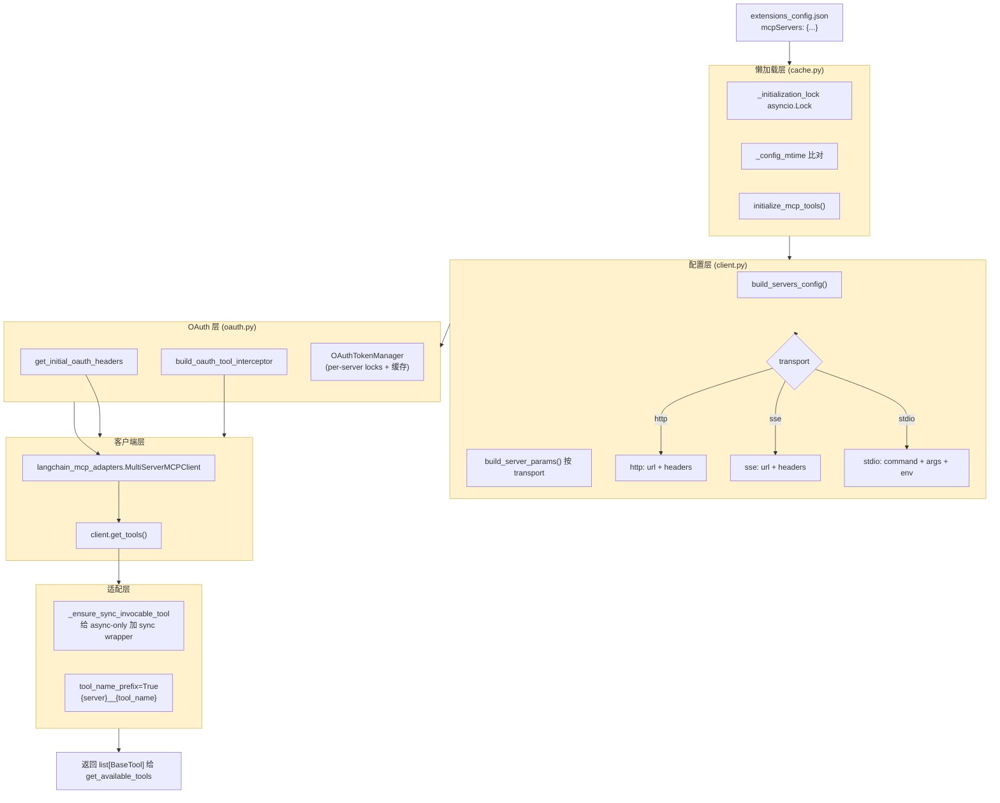
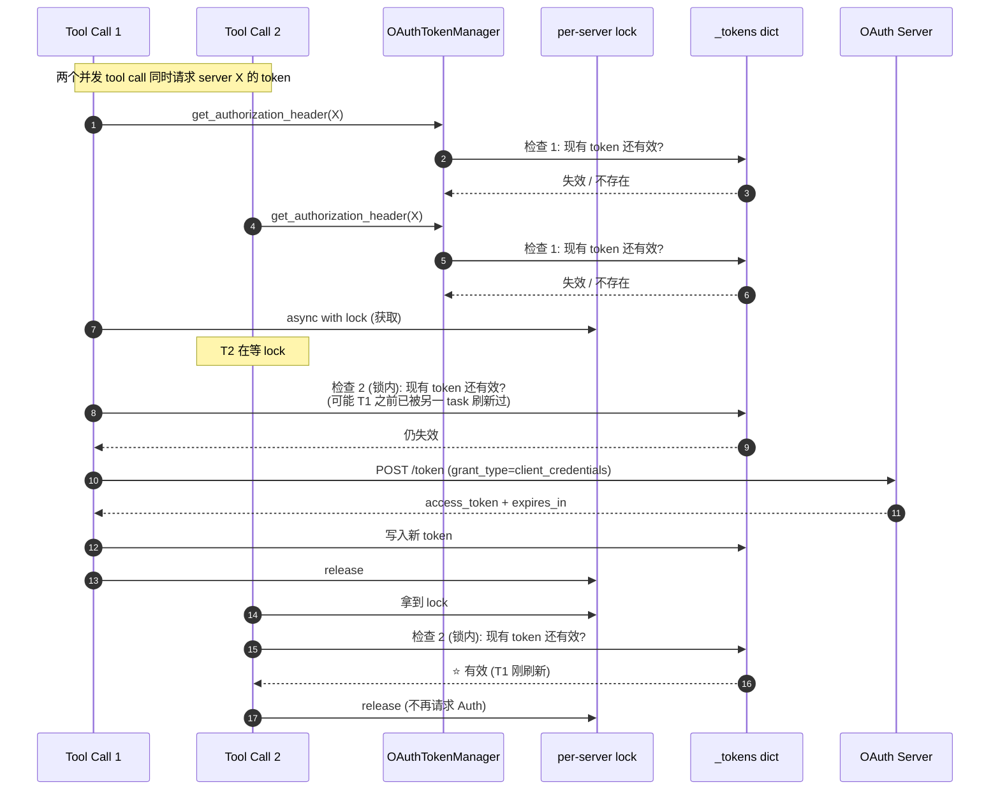
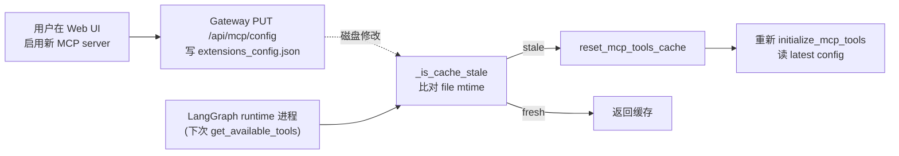
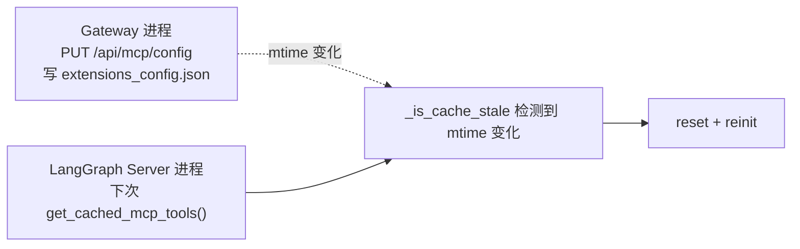

# 17 · MCP 集成：多服务器 + OAuth + 懒加载缓存

> 核心模块层第 8 篇。16 章讲了工具系统的"四源装配"，**第三源 MCP** 因为复杂度高被单独拎出来作为本章。
>
> Model Context Protocol（MCP）是 Anthropic 推出的"LLM ↔ 外部工具"标准协议。DeerFlow 在 `langchain-mcp-adapters` 之上做了 4 层薄封装：
> 1. **多 transport**：stdio / SSE / HTTP
> 2. **OAuth 2.0**：`client_credentials` / `refresh_token` 自动获取 + 刷新
> 3. **懒加载 + mtime 失效**：避免每次 graph run 都重连 MCP servers
> 4. **Tool interceptors**：在 tool 调用前插入 Authorization 等 header
>
> 关键看点：**OAuthTokenManager 的"双重 check 锁模式"、interceptor 注入点、mtime 失效让 Gateway API 跨进程改配置即时生效**。

---

## 🎯 学习目标

读完这份文档，你能回答：

1. **DeerFlow 在 `langchain-mcp-adapters` 之上做了 4 层薄封装**：每一层各解决了什么"原生 langchain-mcp 不解决"的问题？
2. **OAuth `client_credentials` 和 `refresh_token` 的差异**：DeerFlow 怎么决定用哪种？token 过期前多久开始刷新？
3. **`OAuthTokenManager` 用了"double-checked locking"**：拿 lock 前后**各检查一次** token 是否还有效。**为什么必须双重检查**？
4. **mtime cache invalidation** 让用户在 Gateway UI 改 MCP 配置后**不重启 LangGraph runtime 就能生效**。这条跨进程协调链是怎么工作的？
5. **`tool_name_prefix=True`** 让所有 MCP 工具名带 `{server_name}__` 前缀。**给一个具体场景**说明不前缀会出什么 bug。

---

## 🗂️ 源码定位

| 关注点 | 文件 / 行号 | 关键锚点 |
|---|---|---|
| MCP 模块入口 | `packages/harness/deerflow/mcp/__init__.py` | 4 个公共导出（`build_server_params` / `build_servers_config` / `get_mcp_tools` / `initialize_mcp_tools` / `get_cached_mcp_tools` / `reset_mcp_tools_cache`） |
| 客户端构造 | `packages/harness/deerflow/mcp/client.py` | `build_server_params`（按 transport 分支）；`build_servers_config`（过滤 enabled） |
| 工具加载主入口 | `packages/harness/deerflow/mcp/tools.py` | `get_mcp_tools`（async）；`MultiServerMCPClient(..., tool_interceptors=..., tool_name_prefix=True)` |
| 懒加载缓存 | `packages/harness/deerflow/mcp/cache.py` | `_mcp_tools_cache` / `_cache_initialized` / `_config_mtime` / `_initialization_lock`；`_is_cache_stale`；`get_cached_mcp_tools`；`reset_mcp_tools_cache` |
| OAuth | `packages/harness/deerflow/mcp/oauth.py` | `_OAuthToken` dataclass；`OAuthTokenManager`（double-checked locking）；`build_oauth_tool_interceptor`；`get_initial_oauth_headers` |
| 配置 schema | `packages/harness/deerflow/config/extensions_config.py` | `McpServerConfig`（type/command/args/url/headers/oauth）；`McpOAuthConfig`（token_url / grant_type / client_id / client_secret / refresh_token / scope / refresh_skew_seconds） |
| Tool search 协作 | `packages/harness/deerflow/tools/builtins/tool_search.py` | `DeferredToolRegistry`（register / promote）；`tool_search` 工具 |
| Gateway 热更新入口 | `app/gateway/routers/mcp.py` | `PUT /api/mcp/config` 写 `extensions_config.json` |

---

## 🧭 架构图

### 1. MCP 集成的 5 层调用栈



### 2. OAuth Token 双重 check 锁的时序



### 3. mtime 跨进程协调链



---

## 🔍 核心逻辑讲解

### Part 1 · 四层薄封装的工程动机

DeerFlow 的 MCP 集成大约 700 行代码，**`langchain-mcp-adapters` 提供的 MultiServerMCPClient 已经处理 80% 工作**。DeerFlow 在它之上加：

| 加的层 | 解决什么"原生没做"的问题 |
|---|---|
| **缓存层（cache.py）** | 原生：每次实例化 MultiServerMCPClient → 重连所有 MCP server → 慢。DeerFlow：懒加载 + 单例缓存 + mtime 失效 |
| **OAuth 层（oauth.py）** | 原生：langchain-mcp-adapters 接受 `headers` 但**不**主动管 token 刷新。DeerFlow：实现 OAuth client_credentials/refresh_token 流 + 自动续期 |
| **配置层（client.py）** | 原生：你得手写 dict 传给 MultiServerMCPClient。DeerFlow：从 Pydantic `McpServerConfig` 构建，加上 transport 校验 |
| **interceptor 扩展点** | 原生：interceptor 是 langchain-mcp-adapters 暴露但没用例。DeerFlow：用它注入 OAuth header + 加载用户自定义 interceptor（`mcpInterceptors` 配置） |

→ **DeerFlow MCP 集成的核心价值在于"生产化"** —— 不是发明 MCP 集成，而是让它在企业级场景能跑住。

### Part 2 · 三种 Transport 与配置 schema

打开 `client.py::build_server_params` —— 6 行代码按 transport 分支：

```python
def build_server_params(server_name: str, config: McpServerConfig) -> dict[str, Any]:
    transport_type = config.type or "stdio"
    params: dict[str, Any] = {"transport": transport_type}

    if transport_type == "stdio":
        if not config.command:
            raise ValueError(...)
        params["command"] = config.command
        params["args"] = config.args
        if config.env:
            params["env"] = config.env
    elif transport_type in ("sse", "http"):
        if not config.url:
            raise ValueError(...)
        params["url"] = config.url
        if config.headers:
            params["headers"] = config.headers
    else:
        raise ValueError(f"...unsupported transport type: {transport_type}")

    return params
```

**3 种 transport 的适用场景**：

| Transport | 协议 | 工作模式 | 典型用例 |
|---|---|---|---|
| **stdio** | JSON-RPC over stdin/stdout | 子进程，每个 thread 一个？还是单例？取决于 MultiServerMCPClient 实现 | 本地 CLI 工具（如 `npx -y @anthropic/mcp-server-filesystem`） |
| **sse** | Server-Sent Events over HTTP | 长连接 + 服务端推送 | 实时事件型 MCP server |
| **http** | 普通 HTTP request/response | 短连接 | 标准 REST 风格 MCP server |

**配置示例**（`extensions_config.json`）：
```json
{
  "mcpServers": {
    "filesystem": {
      "enabled": true,
      "type": "stdio",
      "command": "npx",
      "args": ["-y", "@anthropic/mcp-server-filesystem", "/path/to/dir"]
    },
    "github": {
      "enabled": true,
      "type": "http",
      "url": "https://api.github.example.com/mcp",
      "headers": {"X-Client": "deerflow"},
      "oauth": {
        "enabled": true,
        "token_url": "https://auth.github.example.com/oauth/token",
        "grant_type": "client_credentials",
        "client_id": "$GH_CLIENT_ID",
        "client_secret": "$GH_CLIENT_SECRET"
      }
    }
  }
}
```

### Part 3 · OAuth Token Manager：double-checked locking

```python
class OAuthTokenManager:
    def __init__(self, oauth_by_server):
        self._oauth_by_server = oauth_by_server
        self._tokens: dict[str, _OAuthToken] = {}
        self._locks: dict[str, asyncio.Lock] = {name: asyncio.Lock() for name in oauth_by_server}

    async def get_authorization_header(self, server_name: str) -> str | None:
        oauth = self._oauth_by_server.get(server_name)
        if not oauth:
            return None

        # ⭐ Check 1 (锁外):快路径,token 还有效就直接返回
        token = self._tokens.get(server_name)
        if token and not self._is_expiring(token, oauth):
            return f"{token.token_type} {token.access_token}"

        lock = self._locks[server_name]
        async with lock:
            # ⭐ Check 2 (锁内):另一并发 task 可能在我们等锁期间刷新过
            token = self._tokens.get(server_name)
            if token and not self._is_expiring(token, oauth):
                return f"{token.token_type} {token.access_token}"

            fresh = await self._fetch_token(oauth)
            self._tokens[server_name] = fresh
            return f"{fresh.token_type} {fresh.access_token}"
```

#### 为什么需要 **double-checked locking**？

**场景**：1000 个并发 tool call 都需要同一 server 的 token，token 刚过期。

| 方案 | 行为 |
|---|---|
| **只检查一次（无锁）** | 1000 个 task 各自发现 token 失效 → 1000 个并发 HTTP POST 去 token endpoint → server 限流 / 失败 |
| **进 lock 才检查一次** | 1000 个 task 全部排队进 lock → 第 1 个刷新成功 → 后面 999 个进来后**没检查就再刷新一次** → 浪费 999 次 |
| **double-checked** ⭐ | 1000 个 task 锁外**都看到 token 失效**；进锁后**第 2 个 task 看到 token 已被刷新**（被第 1 个）→ 直接返回 → 只刷新 1 次 |

**这是 Java 并发界经典模式**（singleton 双重 check），DeerFlow 用 `asyncio.Lock` 在协程层实现同样语义。

#### `_is_expiring` 的 `refresh_skew_seconds`

```python
@staticmethod
def _is_expiring(token: _OAuthToken, oauth: McpOAuthConfig) -> bool:
    now = datetime.now(UTC)
    return token.expires_at <= now + timedelta(seconds=max(oauth.refresh_skew_seconds, 0))
```

**`refresh_skew_seconds=60`（默认）**：token 真过期前 60 秒就触发刷新。
**为什么**：从"决定刷新"到"新 token 拿到"中间有网络延迟（100ms-2s）—— 不能等真过期才刷新，否则中间有窗口期 token 已失效但还没拿到新的。

#### `client_credentials` vs `refresh_token` 流的差异

```python
async def _fetch_token(self, oauth):
    data: dict[str, str] = {
        "grant_type": oauth.grant_type,
        **oauth.extra_token_params,
    }
    if oauth.scope:
        data["scope"] = oauth.scope

    if oauth.grant_type == "client_credentials":
        # 服务对服务,client_id + client_secret 申请
        if oauth.client_id:
            data["client_id"] = oauth.client_id
        if oauth.client_secret:
            data["client_secret"] = oauth.client_secret
    elif oauth.grant_type == "refresh_token":
        # 长期有效的 refresh_token 换短期 access_token
        if not oauth.refresh_token:
            raise ValueError("OAuth refresh_token grant requires refresh_token")
        data["refresh_token"] = oauth.refresh_token

    # ... POST oauth.token_url
```

| Grant Type | 使用场景 | 凭据 | DeerFlow 配置示例 |
|---|---|---|---|
| **`client_credentials`** | 服务对服务，无用户介入 | client_id + client_secret | DeerFlow 后端调外部 MCP server，最常见 |
| **`refresh_token`** | 长期 refresh_token 换 access_token | refresh_token | 用户授权过的场景（如 GitHub OAuth App） |

**注意**：DeerFlow 不实现 `authorization_code` flow —— 那需要 user redirect，不适合后端 service。如果需要，用户应该**先**在外部完成 OAuth dance 拿到 refresh_token，再配进 `refresh_token` grant。

### Part 4 · OAuth 在 MCP 调用链的两个注入点

#### 注入点 ① · 连接建立时（`get_initial_oauth_headers`）

```python
async def get_initial_oauth_headers(extensions_config) -> dict[str, str]:
    token_manager = OAuthTokenManager.from_extensions_config(extensions_config)
    if not token_manager.has_oauth_servers():
        return {}
    headers: dict[str, str] = {}
    for server_name in token_manager.oauth_server_names():
        headers[server_name] = await token_manager.get_authorization_header(server_name) or ""
    return {name: value for name, value in headers.items() if value}
```

在 `get_mcp_tools` 内：
```python
initial_oauth_headers = await get_initial_oauth_headers(extensions_config)
for server_name, auth_header in initial_oauth_headers.items():
    if servers_config[server_name].get("transport") in ("sse", "http"):
        existing_headers = dict(servers_config[server_name].get("headers", {}))
        existing_headers["Authorization"] = auth_header
        servers_config[server_name]["headers"] = existing_headers
```

**用途**：建立 MCP 连接（discovery / session init）时**第一次**注入 `Authorization` header。

#### 注入点 ② · 每次 tool 调用前（`build_oauth_tool_interceptor`）

```python
def build_oauth_tool_interceptor(extensions_config) -> Any | None:
    token_manager = OAuthTokenManager.from_extensions_config(extensions_config)
    if not token_manager.has_oauth_servers():
        return None

    async def oauth_interceptor(request, handler):
        header = await token_manager.get_authorization_header(request.server_name)
        if not header:
            return await handler(request)

        updated_headers = dict(request.headers or {})
        updated_headers["Authorization"] = header
        return await handler(request.override(headers=updated_headers))

    return oauth_interceptor
```

**用途**：每次 LLM 调 MCP 工具时，**重新获取**最新 token + 注入到 request header。**这才是真正解决 token 过期问题的入口** —— 连接建立时的 header 是死的，token 过期后只有 interceptor 能续期。

#### 为什么需要两个注入点？

| 阶段 | 需要 OAuth header 吗 | 谁注入 |
|---|---|---|
| **MCP 连接建立** | ✅（auth 才能 list tools） | `get_initial_oauth_headers` 一次性注入 |
| **MCP 工具调用** | ✅（每次调用都要 auth） | `oauth_interceptor` 每次注入（自动续期） |

**单一注入点不够**：如果只在连接建立时注入，token 过期后**后续工具调用**没新 header → 401。

### Part 5 · 懒加载 + mtime 失效 + 跨进程协调

#### 加载流程

```python
async def initialize_mcp_tools() -> list[BaseTool]:
    global _mcp_tools_cache, _cache_initialized, _config_mtime

    async with _initialization_lock:                    # ⭐ 防止多 task 同时初始化
        if _cache_initialized:
            return _mcp_tools_cache or []

        _mcp_tools_cache = await get_mcp_tools()
        _cache_initialized = True
        _config_mtime = _get_config_mtime()              # ⭐ 记录加载时 mtime
        return _mcp_tools_cache
```

**双重保护**：
- `_initialization_lock` —— 防 N 个并发请求同时触发初始化（thundering herd）
- `_cache_initialized` flag —— 锁内二次检查避免冗余初始化

#### mtime 比对的精妙处

```python
def _is_cache_stale() -> bool:
    if not _cache_initialized:
        return False                                     # ⭐ 没初始化过不算 stale

    current_mtime = _get_config_mtime()
    if _config_mtime is None or current_mtime is None:
        return False                                     # ⭐ 拿不到 mtime 时安全降级

    if current_mtime > _config_mtime:
        logger.info(f"MCP config file has been modified ... cache is stale")
        return True
    return False
```

**关键边界**：
- **`_cache_initialized=False`** 时 `_is_cache_stale=False`（不是 True）—— 让它**走正常 lazy init** 路径而不是 reset
- **`_config_mtime is None or current_mtime is None`** 时 `_is_cache_stale=False`（安全降级）—— 文件被删除时不重置缓存，避免大量请求同时尝试加载丢失的配置
- **严格 `current_mtime > _config_mtime`** 不是 `!=` —— 防止时钟回拨（NTP 调时间）误触发

#### `get_cached_mcp_tools` 的 lazy 路径

```python
def get_cached_mcp_tools() -> list[BaseTool]:
    if _is_cache_stale():
        reset_mcp_tools_cache()

    if not _cache_initialized:
        try:
            loop = asyncio.get_event_loop()
            if loop.is_running():
                # 当前已在 event loop 里 → 不能直接 run,派子线程
                with concurrent.futures.ThreadPoolExecutor() as executor:
                    future = executor.submit(asyncio.run, initialize_mcp_tools())
                    future.result()
            else:
                loop.run_until_complete(initialize_mcp_tools())
        except RuntimeError:
            # 没有 loop,直接 asyncio.run
            asyncio.run(initialize_mcp_tools())
    return _mcp_tools_cache or []
```

**两条路径**与 16 章 `make_sync_tool_wrapper` 一致：
- 已在 event loop → 派子线程跑 `asyncio.run`
- 没 loop → 直接 `asyncio.run`

#### 跨进程协调链（DeerFlow 嵌入式 = 同进程；但兼容独立 LangGraph Server 场景）

虽然 DeerFlow 6 章讲过它是嵌入式（Gateway + LangGraph runtime 同进程），但 mtime 这条机制**也保护了独立 Server 部署场景**：



**这是个解耦得很漂亮的协调**：
- Gateway 和 LangGraph Server **不直接通信**
- 通过**共享文件系统 mtime** 作为信号源
- 任何能修改 `extensions_config.json` 的进程都会被自动感知
- 包括手动 `vim extensions_config.json` 的运维操作

### Part 6 · `tool_name_prefix=True` 防同名冲突

```python
client = MultiServerMCPClient(servers_config, tool_interceptors=tool_interceptors, tool_name_prefix=True)
```

**`tool_name_prefix=True`** 让每个 MCP 工具名变成 `{server_name}__{tool_name}`。

**为什么必须前缀**：
- MCP server A 提供工具 `search`
- MCP server B 也提供工具 `search`
- 没前缀 → 16 章的工具去重逻辑**只保留第一个** → server B 的 search 被静默丢弃
- 加前缀 → `A__search` + `B__search` 共存 → LLM 能区分

**真实场景**：用户同时启用 `tavily` 和 `serper` 两个搜索 MCP server，都暴露 `search` 工具 —— 不前缀就只能用一个。

### Part 7 · 用户自定义 interceptor 扩展点

```python
raw_interceptor_paths = (extensions_config.model_extra or {}).get("mcpInterceptors")
...
for interceptor_path in raw_interceptor_paths:
    try:
        builder = resolve_variable(interceptor_path)
        interceptor = builder()
        if callable(interceptor):
            tool_interceptors.append(interceptor)
    except Exception as e:
        logger.warning(f"Failed to load MCP interceptor {interceptor_path}: {e}", exc_info=True)
```

**`extensions_config.json`** 可加：
```json
{
  "mcpInterceptors": [
    "my_company.deerflow_plugins:audit_interceptor_builder",
    "my_company.deerflow_plugins:rate_limit_interceptor_builder"
  ]
}
```

每个 interceptor 是一个 async 函数 `(request, handler) -> response`，可以：
- 注入额外 header（如 X-Request-ID 用于 distributed trace）
- 限流（rate limiter）
- 加密 / 解密 payload
- 记录审计日志

**用户扩展点的工程价值**：MCP 集成对企业场景的合规要求（audit / encryption）开放，**不用 fork DeerFlow** 就能加自家逻辑。

---

## 🧩 体现的通用 Agent 设计模式

| 模式 | MCP 集成中的体现 |
|---|---|
| **Adapter Layer**（适配层） | DeerFlow 在 langchain-mcp-adapters 之上加薄封装，原生没的能力加上去 |
| **Double-checked Locking**（双重锁检查） | OAuthTokenManager 的并发刷新去重 |
| **Skew-based Expiry**（带余量过期检测） | `refresh_skew_seconds=60` 提前刷新 |
| **Lazy Init with mtime Invalidation** | get_cached_mcp_tools 按文件 mtime 自动失效 |
| **Cross-process Coordination via Filesystem** | Gateway 写文件 → LangGraph 读 mtime 感知变化 |
| **Tool Name Namespacing** | `tool_name_prefix=True` 防同名冲突 |
| **Reflective Plugin Loading** | mcpInterceptors 配置 → resolve_variable 加载 |
| **Sync-Async Adapter**（共享 16 章） | get_cached_mcp_tools 自适应 caller |
| **Two-stage Auth Injection** | initial 连接 + per-call interceptor 各管一段 |

---

## 🧱 与 Agent Harness 六要素的对应关系

| 六要素 | MCP 集成怎么提供基础设施 |
|---|---|
| ① 反馈循环 | MCP 工具结果回到 LLM，扩展 agent 能调用的能力空间 |
| ② 记忆持久化 | MCP tools 缓存 + mtime 失效是"工具集合"的"短期记忆" |
| ③ 动态上下文 | tool_search 让 LLM 按需暴露 MCP 工具，避免 prompt 爆炸 |
| ④ 安全护栏 | OAuth 自动续期防 token 过期失败；interceptor 可加 rate limit / audit |
| ⑤ 工具集成 | **本章核心** —— 把 MCP 协议接入 agent 工具空间 |
| ⑥ 可观测性 | logger.info 报告每次 token 刷新；user interceptor 可加 trace |

---

## ⚠️ 常见坑与调试技巧

### 坑 1 · stdio MCP server 启动失败

```yaml
mcpServers:
  filesystem:
    enabled: true
    type: stdio
    command: npxxx           # ❌ 拼错
    args: ["-y", "..."]
```

`MultiServerMCPClient` 启动子进程时 → 子进程 spawn 失败 → **整个 client 抛错 → get_mcp_tools 走 except 返回 []**。

**调试**：
- log 看 `"Failed to load MCP tools: ..."` 是否含 `FileNotFoundError`
- 手动跑 `npxxx -y ...` 看错误

**修复**：检查 PATH + command 拼写。

### 坑 2 · OAuth token endpoint 返回错误格式

DeerFlow 假设 token 响应有 `access_token` / `token_type` / `expires_in` 字段（OAuth 2.0 标准）。如果你接的是非标准 OAuth：

```yaml
oauth:
  token_field: "my_token"        # 自定义字段名
  token_type_field: "my_type"
  expires_in_field: "my_ttl"
```

**调试**：在 `oauth.py::_fetch_token` 内 debug 打印 `payload`，看 server 实际返回什么字段名。

### 坑 3 · mtime 没变但配置变了 —— 缓存不刷新

**触发场景**：你用 `vim` 编辑 `extensions_config.json` 撤销又保存 → mtime 可能不变（某些 editor 行为）。

**修复**：用 `touch extensions_config.json` 强制更新 mtime。或者重启进程。

### 坑 4 · 多个 task 并发触发 lazy init

虽然 `_initialization_lock` 保护了不会重复 init，但如果 task A 拿着 lock 跑 init（30 秒，因为要 spawn N 个 MCP server 子进程），task B/C/D... 全在 await 锁。**整体冷启动延迟**取决于第一个 task 的初始化时间。

**调试**：监控 `initialize_mcp_tools` 耗时。
**优化**：lifespan 启动时 eager 调一次 `initialize_mcp_tools()`，**摊到启动期** 而不是第一个用户请求。

### 坑 5 · interceptor 顺序

```python
tool_interceptors = []
oauth_interceptor = build_oauth_tool_interceptor(...)
if oauth_interceptor is not None:
    tool_interceptors.append(oauth_interceptor)

for interceptor_path in raw_interceptor_paths:
    # user interceptors append 在 OAuth 之后
    tool_interceptors.append(...)
```

**注意**：用户 interceptor **append 在 OAuth 之后**。MultiServerMCPClient 的 interceptor 链是洋葱顺序 —— **先 append 的先包装** = OAuth 在最外层。

**潜在 bug**：用户写个 interceptor 想读 `request.headers.Authorization`，但**OAuth interceptor 在更内层**还没注入 → 用户读到 None。

**修复**：让 OAuth interceptor 永远最内层（最后 append）。**DeerFlow 当前顺序是反的**，是个潜在 PR 机会。

---

## 🛠️ 动手实操

> 本 demo **不需要真实 MCP server**，用 mock + httpx 模拟 OAuth 流。

### Demo · MCP 集成核心机制实测

```python
"""
MCP 集成 demo — OAuth double-checked locking + mtime 失效 + 配置加载.

跑法:  PYTHONPATH=backend uv run python scripts/mcp_integration_demo.py
"""
import asyncio
import sys, os, time
from pathlib import Path
from datetime import UTC, datetime, timedelta
from unittest.mock import AsyncMock, patch

sys.path.insert(0, "backend")
sys.path.insert(0, "backend/packages/harness")
os.chdir(Path(__file__).resolve().parents[1])

from deerflow.config.extensions_config import (
    ExtensionsConfig, McpServerConfig, McpOAuthConfig,
)
from deerflow.mcp.oauth import OAuthTokenManager, _OAuthToken
from deerflow.mcp.client import build_server_params, build_servers_config
from deerflow.mcp.cache import (
    _is_cache_stale, _get_config_mtime, get_cached_mcp_tools, reset_mcp_tools_cache,
)


# ====== Case 1: build_server_params 三 transport ======
print("\n" + "=" * 70)
print("CASE 1 · build_server_params 三种 transport")
print("=" * 70)

stdio_cfg = McpServerConfig(type="stdio", command="npx", args=["-y", "filesystem"])
print(f"  stdio: {build_server_params('fs', stdio_cfg)}")

sse_cfg = McpServerConfig(type="sse", url="https://example.com/sse", headers={"X-Foo": "1"})
print(f"  sse:   {build_server_params('s1', sse_cfg)}")

http_cfg = McpServerConfig(type="http", url="https://example.com/mcp")
print(f"  http:  {build_server_params('s2', http_cfg)}")

# 错误:stdio 没 command
try:
    bad = McpServerConfig(type="stdio")    # command 缺失
    build_server_params("bad", bad)
except ValueError as e:
    print(f"  ❌ stdio 缺 command: {e}")


# ====== Case 2: OAuth Token Manager 双重 check 锁 ======
print("\n" + "=" * 70)
print("CASE 2 · OAuthTokenManager double-checked locking")
print("=" * 70)

oauth_cfg = McpOAuthConfig(
    enabled=True,
    token_url="https://auth.example.com/token",
    grant_type="client_credentials",
    client_id="test_id",
    client_secret="test_secret",
)
mgr = OAuthTokenManager({"server_A": oauth_cfg})

fetch_count = 0
async def fake_fetch_token(oauth):
    global fetch_count
    fetch_count += 1
    await asyncio.sleep(0.1)        # 模拟网络延迟
    return _OAuthToken(
        access_token=f"token-{fetch_count}",
        token_type="Bearer",
        expires_at=datetime.now(UTC) + timedelta(seconds=3600),
    )


async def test_concurrent_get():
    global fetch_count
    fetch_count = 0
    # 模拟 5 个并发请求,token 不存在,都要触发 fetch
    with patch.object(mgr, "_fetch_token", side_effect=fake_fetch_token):
        tasks = [mgr.get_authorization_header("server_A") for _ in range(5)]
        results = await asyncio.gather(*tasks)
    print(f"  5 个并发请求 token,实际 fetch 次数: {fetch_count}  (期望 1,double-check 去重)")
    print(f"  所有 task 拿到的 token: {set(results)}")


asyncio.run(test_concurrent_get())


# ====== Case 3: refresh_skew_seconds ======
print("\n" + "=" * 70)
print("CASE 3 · refresh_skew_seconds 提前刷新")
print("=" * 70)

# 一个 30 秒后过期的 token,skew=60(默认) → 已经算 expiring
near_expire = _OAuthToken(
    access_token="x",
    token_type="Bearer",
    expires_at=datetime.now(UTC) + timedelta(seconds=30),
)
print(f"  token 30s 后过期,refresh_skew_seconds=60 → is_expiring? {OAuthTokenManager._is_expiring(near_expire, oauth_cfg)}")

far_expire = _OAuthToken(
    access_token="y",
    token_type="Bearer",
    expires_at=datetime.now(UTC) + timedelta(seconds=300),
)
print(f"  token 300s 后过期 → is_expiring? {OAuthTokenManager._is_expiring(far_expire, oauth_cfg)}")


# ====== Case 4: mtime 失效 ======
print("\n" + "=" * 70)
print("CASE 4 · mtime cache invalidation")
print("=" * 70)

reset_mcp_tools_cache()
print(f"  reset 后 _is_cache_stale? {_is_cache_stale()}  (期望 False — 未初始化)")
print(f"  当前 config 文件 mtime: {_get_config_mtime()}")


# ====== Case 5: build_servers_config 过滤 enabled ======
print("\n" + "=" * 70)
print("CASE 5 · build_servers_config 过滤 enabled=False")
print("=" * 70)

ext_cfg = ExtensionsConfig(
    mcp_servers={
        "active": McpServerConfig(enabled=True, type="stdio", command="real"),
        "disabled": McpServerConfig(enabled=False, type="stdio", command="never_runs"),
    }
)
servers = build_servers_config(ext_cfg)
print(f"  enabled 后剩余 servers: {list(servers.keys())}  (期望 ['active'])")


# ====== Case 6: tool_name_prefix 防同名 (模拟) ======
print("\n" + "=" * 70)
print("CASE 6 · tool_name_prefix 防同名冲突")
print("=" * 70)

# 模拟两个 MCP server 都暴露 'search'
mcp_tools_raw = [
    ("tavily", "search"),
    ("serper", "search"),
]
prefixed = [f"{server}__{tool}" for server, tool in mcp_tools_raw]
print(f"  无前缀:{[t for _, t in mcp_tools_raw]} → 16 章去重逻辑只保留第一个")
print(f"  加前缀:{prefixed} → 两个工具共存")
```

### 调试任务

1. **断点位置**：
   - `oauth.py::get_authorization_header` 的两次 `if token and not self._is_expiring(...)` 检查
   - `cache.py::_is_cache_stale` 的 `current_mtime > _config_mtime` 比较
   - `mcp/tools.py::get_mcp_tools` 的 try/except 块 —— 看 ImportError 兜底
2. **观察什么**：
   - Case 2 中 5 个并发请求 fetch_count = 1
   - Case 3 中 30s 后过期的 token is_expiring=True，300s 的 False
   - Case 5 中 disabled server 被过滤
3. **人为制造异常**：
   - Case 1 stdio 缺 command → ValueError
   - 真实试一次：把 `extensions_config.json` 改名后跑 demo，看 `_get_config_mtime` 返回 None → `_is_cache_stale` 走 None 分支返回 False（安全降级）

### 改造练习

1. **练习 A（简单）**：扩展 `_OAuthToken` 加 `refresh_token` 字段 —— `client_credentials` 响应里如果也带 refresh_token，缓存起来，下次过期时**优先用 refresh_token grant** 而不是重新跑 client_credentials。
2. **练习 B（中等）**：把 OAuth interceptor 顺序调成"最后 append"（让它包在最内层），写一个测试验证 user interceptor 能读到 Authorization header。
3. **挑战题**：实现 `audit_interceptor_builder` —— 一个用户自定义 interceptor，把每次 MCP 工具调用写入审计日志（含 tool name / args / server / timestamp / user_id）。配置在 `extensions_config.json` 的 `mcpInterceptors` 字段。

### 预期输出 & 验证方式

- Case 1：3 种 transport 的 dict 输出正确，stdio 缺 command 抛 ValueError
- Case 2：fetch_count = 1（5 并发只刷一次 token）
- Case 3：30s expiring True、300s False
- Case 5：servers 只含 "active"
- Case 6：prefix 后 tavily__search 和 serper__search 共存

---

## 🎤 面试视角

### 业务型大厂卷

**问 1**：DeerFlow OAuthTokenManager 用 double-checked locking 防并发刷新。**给一个具体的"如果没有双重检查"的真实灾难场景**。

> **教科书答案**：
> 灾难场景：**RateLimitedTokenEndpoint 风暴**
> - 你的 OAuth token endpoint（如 AWS Cognito）有 limit "100 token requests / minute / client"
> - DeerFlow 跑了一个 fan-out 任务：10 个 subagent 并发调 MCP 工具
> - 某一刻 token 刚过期
> - **没双重检查**：10 个 task 都看到 token 失效 → 都进锁 → 第一个刷新成功，但**后面 9 个进锁后没再检查，又各刷新一次** → 共 10 次 token 请求
> - 累计若几个用户同时撞上 token 过期 → quickly exceed 100/min limit → token endpoint 开始 429 → 整个 DeerFlow 实例无法刷新 token → 所有 MCP 工具失败
> **double-checked 后**：10 个 task 进锁后**只有第 1 个真刷新**，2-10 看到 cache 已更新直接返回 → 1 次刷新 → 永远不会撞 rate limit。
> **加分项**：指出这是个 **thundering herd 问题** 的标准防御。Java 双重 check 模式来自 1990s 处理 singleton race condition，**asyncio 单线程也有这个问题** —— 因为 await 是协作让出，多个 task 都能进入 "刚看到 token 失效" 状态。

**问 2**：DeerFlow MCP 集成用 mtime 跨进程协调。**如果换成"Redis pubsub"** 怎么做？利弊？

> **教科书答案**：
> Redis pubsub 方案：
> - Gateway 改完配置 → `redis.publish("mcp_config_changed", "...")`
> - LangGraph runtime 启动时 `redis.subscribe("mcp_config_changed")` → 收到事件就 `reset_mcp_tools_cache`
> 利：
> - **实时**：mtime 是"下次请求才检查"，pubsub 是"事件触发立即响应"
> - **跨主机**：mtime 在 NFS / 共享卷场景 work，但 EFS 等有 mtime 漂移问题；pubsub 不受文件系统限制
> 弊：
> - **额外依赖** Redis（部署复杂度 +1）
> - **网络分区**：Redis 不可达时 pubsub 收不到，缓存不刷新
> - **消息丢失**：pubsub at-most-once，订阅断线时事件错过
> **DeerFlow 当前选 mtime 是对的** —— 单机 / 共享卷场景足够，且**零依赖**。Redis 适合**真分布式多机部署**（跨主机 LangGraph runtime 集群）。

### 创业型 AI 公司卷

**问 3**：你团队接到任务："给 DeerFlow MCP 集成加上 distributed tracing"。**用现有 interceptor 扩展点设计**。

> **参考答案**：
> 完整方案：
> 1. **写一个 interceptor builder**：
>    ```python
>    # my_company/deerflow_plugins.py
>    def tracing_interceptor_builder():
>        from opentelemetry import trace
>        tracer = trace.get_tracer("deerflow.mcp")
>
>        async def tracing_interceptor(request, handler):
>            with tracer.start_as_current_span(f"mcp.{request.server_name}.{request.tool_name}") as span:
>                span.set_attribute("mcp.server", request.server_name)
>                span.set_attribute("mcp.tool", request.tool_name)
>                # 注入 traceparent header 到 MCP request
>                headers = dict(request.headers or {})
>                propagator = ...
>                propagator.inject(headers)
>                try:
>                    result = await handler(request.override(headers=headers))
>                    span.set_attribute("mcp.result.length", len(str(result)))
>                    return result
>                except Exception as e:
>                    span.record_exception(e)
>                    raise
>        return tracing_interceptor
>    ```
> 2. **配置启用**：
>    ```json
>    {"mcpInterceptors": ["my_company.deerflow_plugins:tracing_interceptor_builder"]}
>    ```
> 3. **传播 trace 上下文**：MCP server 端必须能识别 `traceparent` header（标准 W3C Trace Context）—— 这才完成跨服务 trace
> 4. **价值**：在 Jaeger / Tempo 上能看到完整调用链 → 客户端 → DeerFlow → MCP → 后端 → 数据库

**问 4**：你团队跑了 100 个 MCP server（夸张但假设），**`get_cached_mcp_tools` 第一次冷启动卡 2 分钟**。怎么优化？

> **参考答案**：
> 4 层优化（从短到长效果）：
> 1. **eager init in lifespan**：在 Gateway 启动时**主动**调一次 `initialize_mcp_tools`，把 2 分钟摊到部署期而不是首个用户请求。
> 2. **并行连接**：当前 `MultiServerMCPClient` 是不是串行连？看源码若串行 → fork 改并行连（每个 server 一个 task）→ 2 分钟降到 max(单 server 延迟)
> 3. **server 分组 lazy**：用户配置里给 MCP server 加 `priority: high/low`，high 的 eager，low 的 lazy（首次用到才连）
> 4. **预热替代**：lifespan 启动时**只**做 stdio server 启动（最快），sse/http 走 lazy 第一次调用时建立
> **DeerFlow 当前是 lazy 不区分**，是个明确的可改进点。生产 100 server 场景应该走 (1) + (3) 组合。

---

## 📚 延伸阅读

- **Model Context Protocol 官方规范**：https://modelcontextprotocol.io/
- **`langchain-mcp-adapters` 源码** —— 上游 MultiServerMCPClient 实现。
- **OAuth 2.0 RFC 6749**：https://datatracker.ietf.org/doc/html/rfc6749 —— `client_credentials` / `refresh_token` grant 的标准。
- **Double-checked locking pattern**：https://en.wikipedia.org/wiki/Double-checked_locking
- **W3C Trace Context**：https://www.w3.org/TR/trace-context/ —— interceptor 加 distributed tracing 的标准。
- **DeerFlow `docs/MCP_SERVER.md`**：项目内官方 MCP 集成文档。

---

## 🎤 互动检查 —— 请回答这 3 个问题

> **两句话即可**。

1. **机制理解题**：OAuthTokenManager 锁外 + 锁内**两次检查** token —— 用一句话说明**锁内那次**为什么必要（如果只锁外检查，进锁后直接刷新，会出什么问题？）
2. **设计动机题**：DeerFlow MCP 集成默认 `tool_name_prefix=True`。**给一个具体场景**说明前缀**不**加会出什么 bug。
3. **应用题**：你的同事提了 PR：把 `_initialization_lock` 改成全局的 `threading.Lock`（不是 `asyncio.Lock`）。**给两条理由**说明应该被拒绝。

回答后我们进入 **`18-skills-system.md`** —— 技能系统：渐进式能力加载 + SKILL.md 解析 + tool_policy 闸门。
