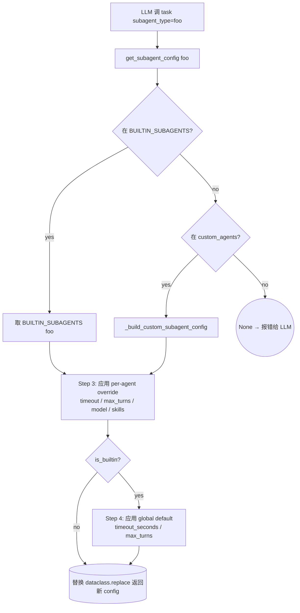
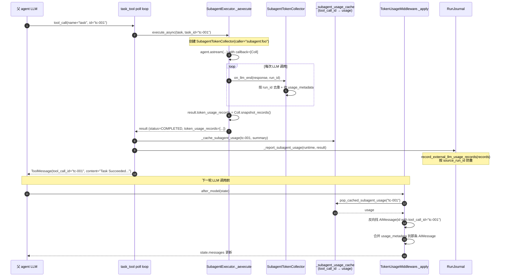

# 17 · Subagent 注册表 + token 回收 + tool_call_id 缓存

> 16 篇讲了 subagent 的并发执行模型。这一章讲它的"配置与计量"另一面：用户怎么在 yaml 里定义新 subagent 类型、override 内置 subagent 的 timeout / model / skills、subagent 跑出来的 token cost 怎么穿过两层执行边界（subagent → task_tool → 父 RunJournal）回灌到父 AIMessage 的 `usage_metadata` 里。
>
> 这一篇的代码量不多但精巧——4 个文件共约 400 行，但把"如何让自定义 subagent 像内置 subagent 一样工作 + 如何让 trace 看到完整 token cost"两个工程问题彻底解决。

---

## 1. 模块定位（Why this matters）

deer-flow 的 subagent 系统是**两类来源 + 三层 override**的注册表：

| 来源 | 装配位置 | 是否可改 |
|------|---------|---------|
| **built-in**（`general-purpose`, `bash`） | `BUILTIN_SUBAGENTS` dict | ❌（dataclass，源码定义） |
| **custom**（yaml 写） | `config.yaml` → `subagents.custom_agents` | ✅（运行时 reload） |

每个 subagent 都可被 3 层 override：

1. **per-agent override**：`config.yaml` → `subagents.agents.<name>` 改 `timeout / max_turns / model / skills`。
2. **global default**（仅 built-in）：`subagents.timeout_seconds / max_turns` 改所有内置 subagent。
3. **dataclass default**：源码里写死的 `timeout_seconds=900 / max_turns=50`。

token 计量也是 3 层：

1. **`SubagentTokenCollector`**：subagent 内部 LangChain callback，按 `run_id` 去重计 token。
2. **`_subagent_usage_cache: dict[tool_call_id, usage]`**：task_tool 模块级 cache，按 tool_call_id 存 usage 等 `TokenUsageMiddleware` 取。
3. **`RunJournal.record_external_llm_usage_records`**：父 agent 的 journal 接收 subagent 的 records，按 `source_run_id` 防双重计数。

不读这一章会错过 4 个关键认知：

1. **internal vs custom subagent 的 override 不对称**：built-in 接受 global default + per-agent override；custom 只接受 per-agent override（其 dataclass default 已是用户的设计意图，全局默认不应覆盖）。
2. **`tool_call_id` 作为跨执行环境的"传票"**：task_tool 接收 `InjectedToolCallId` → 当 task_id → execute_async → subagent 内部 → 子 token 汇总 → `_subagent_usage_cache[tool_call_id]` → `TokenUsageMiddleware._apply` 用 ToolMessage 的 `tool_call_id` 反查 cache → 回灌到对应 AIMessage 的 `usage_metadata`。
3. **`SubagentTokenCollector` 用 `run_id` 防双重计数**：同一 LLM 调用偶尔会触发多次 `on_llm_end`（callback 框架的边界 case），按 run_id 去重。
4. **`record_external_llm_usage_records` 用 `source_run_id` 防双重计数**：record 从 subagent 到父 journal 可能因为 cancel/timeout 报告多次——按 source_run_id 加 set 防重。

对应到 Harness 六要素：本章对应 **配置体系 + 可观测性 + 跨边界数据传递**。

---

## 2. 源码地图（Source Map）

### 2.1 关键文件清单

| 路径 | 角色 |
|------|------|
| [`packages/harness/deerflow/subagents/registry.py`](../packages/harness/deerflow/subagents/registry.py) | 注册表 + 3 层 override（166 行） |
| [`packages/harness/deerflow/subagents/config.py`](../packages/harness/deerflow/subagents/config.py) | `SubagentConfig + resolve_subagent_model_name`（57 行） |
| [`packages/harness/deerflow/subagents/token_collector.py`](../packages/harness/deerflow/subagents/token_collector.py) | `SubagentTokenCollector` LangChain callback（64 行） |
| [`packages/harness/deerflow/subagents/builtins/__init__.py`](../packages/harness/deerflow/subagents/builtins/__init__.py) | `BUILTIN_SUBAGENTS` dict |
| [`packages/harness/deerflow/subagents/builtins/general_purpose.py`](../packages/harness/deerflow/subagents/builtins/general_purpose.py) | 内置：50 行 |
| [`packages/harness/deerflow/subagents/builtins/bash_agent.py`](../packages/harness/deerflow/subagents/builtins/bash_agent.py) | 内置：51 行 |
| [`packages/harness/deerflow/config/subagents_config.py`](../packages/harness/deerflow/config/subagents_config.py) | `SubagentsAppConfig + Override + CustomSubagent` Pydantic（181 行） |
| [`packages/harness/deerflow/tools/builtins/task_tool.py`](../packages/harness/deerflow/tools/builtins/task_tool.py) | `_subagent_usage_cache / pop_cached_subagent_usage`（行 31-49） |
| [`packages/harness/deerflow/agents/middlewares/token_usage_middleware.py`](../packages/harness/deerflow/agents/middlewares/token_usage_middleware.py) | `_apply` 反查 cache 回灌（行 270-314） |
| [`packages/harness/deerflow/runtime/journal.py`](../packages/harness/deerflow/runtime/journal.py) | `record_external_llm_usage_records` 父 journal 接收口（行 405-446） |

### 2.2 关键符号速查表

| 符号 | 文件:行 | 一句话职责 |
|------|---------|-----------|
| `BUILTIN_SUBAGENTS: dict[str, SubagentConfig]` | `subagents/builtins/__init__.py` | 内置 subagent dict |
| `GENERAL_PURPOSE_CONFIG` | `general_purpose.py:5` | 通用 subagent（继承所有工具，max_turns=100） |
| `BASH_AGENT_CONFIG` | `bash_agent.py:5` | bash 专用（tools 限白名单，max_turns=60） |
| `class SubagentConfig` | `subagents/config.py:11` | dataclass 7 字段 |
| `disallowed_tools=field(default=["task"])` | `subagents/config.py:31` | 默认禁 task 防 nesting |
| `resolve_subagent_model_name(config, parent, app_config)` | `subagents/config.py:44` | model 3 级 fallback |
| `class SubagentsAppConfig(BaseModel)` | `subagents_config.py:71` | yaml `subagents:` 段 |
| `class SubagentOverrideConfig(BaseModel)` | `subagents_config.py:10` | per-agent 4 字段 override |
| `class CustomSubagentConfig(BaseModel)` | `subagents_config.py:34` | yaml 定义新 subagent 类型的 schema |
| `SubagentsAppConfig.get_model_for(name)` | `subagents_config.py:107` | per-agent model override |
| `SubagentsAppConfig.get_skills_for(name)` | `subagents_config.py:130` | per-agent skills override |
| `SubagentsAppConfig.get_max_turns_for(name, default)` | `subagents_config.py:121` | 3 级 fallback |
| `get_subagent_config(name, app_config)` | `subagents/registry.py:50` | **主入口** — 应用所有 override |
| `_build_custom_subagent_config(name, app_config)` | `subagents/registry.py:22` | yaml → SubagentConfig |
| `_resolve_subagents_app_config(app_config)` | `subagents/registry.py:14` | 多源 SubagentsAppConfig 解析 |
| `get_subagent_names(app_config)` | `subagents/registry.py:133` | built-in + custom merge |
| `get_available_subagent_names(app_config)` | `subagents/registry.py:150` | 过滤掉 bash（如果禁用） |
| `class SubagentTokenCollector` | `token_collector.py:15` | LangChain callback，按 run_id 去重 |
| `SubagentTokenCollector.on_llm_end(...)` | `token_collector.py:24` | 收 `usage_metadata` |
| `SubagentTokenCollector.snapshot_records()` | `token_collector.py:61` | 返回 records 列表 |
| `_subagent_usage_cache: dict[str, dict]` | `task_tool.py:31` | 按 tool_call_id 存 usage |
| `_cache_subagent_usage(tc_id, usage, enabled)` | `task_tool.py:43` | 写入 cache |
| `pop_cached_subagent_usage(tc_id)` | `task_tool.py:48` | TokenUsageMiddleware 读取 + pop |
| `_report_subagent_usage(runtime, result)` | `task_tool.py:128` | 调 `journal.record_external_llm_usage_records` |
| `record_external_llm_usage_records(records)` | `journal.py:405` | 父 journal 接收（按 source_run_id 防重） |

### 2.3 注册表 + 3 层 override 流程



### 2.4 token 跨边界回灌的全景



---

## 3. 核心逻辑精读（Deep Dive）

### 3.1 `SubagentConfig` dataclass：7 字段定义一个 subagent

```python
# packages/harness/deerflow/subagents/config.py:10-35
@dataclass
class SubagentConfig:
    """Configuration for a subagent."""

    name: str
    description: str
    system_prompt: str | None = None
    tools: list[str] | None = None
    disallowed_tools: list[str] | None = field(default_factory=lambda: ["task"])
    skills: list[str] | None = None
    model: str = "inherit"
    max_turns: int = 50
    timeout_seconds: int = 900
```

**3 个值得圈点**：

1. **`disallowed_tools=["task"]` 默认禁 task**：防 nesting 的最后一道防线——16 篇讲了 `task_tool` 装 tools 时不挂 task 工具，这里再加一道 denylist。
2. **`tools=None` vs `tools=[]`**：None = 继承父所有工具；`[]` = 不要任何工具。**three-state semantics**——和 12 篇 `allowed-tools` 同模式。
3. **`model="inherit"`**：字符串 sentinel——任何不等于 `"inherit"` 的字符串都是显式 model name。看 `resolve_subagent_model_name`（行 44-56）的 3 级 fallback：
   ```
   config.model != "inherit"  →  config.model
   parent_model != None        →  parent_model
   else                        →  app_config.models[0].name (default)
   ```

### 3.2 内置 subagent：general-purpose + bash

```python
# packages/harness/deerflow/subagents/builtins/general_purpose.py:5-50
GENERAL_PURPOSE_CONFIG = SubagentConfig(
    name="general-purpose",
    description="""A capable agent for complex, multi-step tasks that require both exploration and action.
    ...
    Do NOT use for simple, single-step operations.""",
    system_prompt="""You are a general-purpose subagent ...""",
    tools=None,                                       # 继承所有
    disallowed_tools=["task", "ask_clarification", "present_files"],
    model="inherit",
    max_turns=100,
)
```

```python
# packages/harness/deerflow/subagents/builtins/bash_agent.py:5-50
BASH_AGENT_CONFIG = SubagentConfig(
    name="bash",
    description="...",
    system_prompt="...",
    tools=["bash", "ls", "read_file", "write_file", "str_replace"],   # 白名单
    disallowed_tools=["task", "ask_clarification", "present_files"],
    model="inherit",
    max_turns=60,
)
```

**3 个共同的 disallowed**：

- **`task`**：防递归 nesting。
- **`ask_clarification`**：subagent 不能问用户——它运行在独立 context，没法 interrupt 父对话让用户回答。设计纪律：**subagent 必须自决**（system_prompt 也说 "Do NOT ask for clarification - work with the information provided"）。
- **`present_files`**：subagent 不能直接给用户展示文件——展示决策应由 lead agent 做。subagent 把结果通过 `task` 工具的 return 字符串告诉 lead，lead 再决定 `present_files`。

**3 个区别**：

| 字段 | general-purpose | bash |
|------|-----------------|------|
| `tools` | None（继承全部） | 白名单 5 个沙箱工具 |
| `max_turns` | 100 | 60 |
| `system_prompt` | 通用任务流程 | 命令执行专家 |

### 3.3 `SubagentsAppConfig`：yaml `subagents` 段的 schema

```yaml
# config.yaml 示例
subagents:
  enabled: true
  timeout_seconds: 900          # 全局默认（仅影响 built-in）
  max_turns: null               # null = 不改 built-in 默认

  # 每个 subagent 的细粒度 override
  agents:
    bash:
      timeout_seconds: 300
      max_turns: 30
      model: doubao-seed-1.8
    general-purpose:
      skills: [data-analysis, web-design-guidelines]   # 限定可用 skill

  # 用户定义新 subagent 类型
  custom_agents:
    code-reviewer:
      description: "Reviews code for quality and bugs. Use for PR review tasks."
      system_prompt: |
        You are a code reviewer ...
      tools: [read_file, grep, glob]
      disallowed_tools: [task, ask_clarification, present_files]
      skills: [code-documentation]
      model: doubao-seed-1.8
      max_turns: 40
      timeout_seconds: 600

    sql-analyst:
      description: "..."
      system_prompt: "..."
      tools: [bash, read_file]
      model: inherit
```

**对照 Pydantic schema**（`subagents_config.py:10-91`）：

| Pydantic 类 | 用途 | 默认 |
|------------|------|------|
| `SubagentsAppConfig` | 顶层 | `timeout=900, max_turns=None, agents={}, custom_agents={}` |
| `SubagentOverrideConfig` | per-agent override | 全部 None（不动） |
| `CustomSubagentConfig` | 定义新 subagent | `tools=None, disallowed=["task","ask_clarification","present_files"], model="inherit", max_turns=50, timeout=900` |

**为什么 `agents` 和 `custom_agents` 分两个字段**？

- `agents` 是"对已存在 subagent 的覆盖"——可以改 built-in 也可以改 custom。
- `custom_agents` 是"定义新 subagent"——必须提供完整 description + system_prompt。

两个字段分开让 schema 更清晰：要改还是要建一目了然。

### 3.4 `get_subagent_config`：3 层 override 的合并算法

```python
# packages/harness/deerflow/subagents/registry.py:50-116
def get_subagent_config(name: str, *, app_config: Any | None = None) -> SubagentConfig | None:
    """Get a subagent configuration by name, with config.yaml overrides applied.

    Resolution order (mirrors Codex's config layering):
    1. Built-in subagents (general-purpose, bash)
    2. Custom subagents from config.yaml custom_agents section
    3. Per-agent overrides from config.yaml agents section (timeout, max_turns, model, skills)
    """
    # Step 1: Look up built-in, then fall back to custom_agents
    config = BUILTIN_SUBAGENTS.get(name)
    if config is None:
        config = _build_custom_subagent_config(name, app_config=app_config)
    if config is None:
        return None

    # Step 2: Apply per-agent overrides from config.yaml agents section.
    # Only explicit per-agent overrides are applied here. Global defaults
    # (timeout_seconds, max_turns at the top level) apply to built-in agents
    # but must NOT override custom agents' own values — custom agents define
    # their own defaults in the custom_agents section.
    subagents_config = _resolve_subagents_app_config(app_config)
    is_builtin = name in BUILTIN_SUBAGENTS
    agent_override = subagents_config.agents.get(name)

    overrides = {}

    # Timeout: per-agent override > global default (builtins only) > config's own value
    if agent_override is not None and agent_override.timeout_seconds is not None:
        if agent_override.timeout_seconds != config.timeout_seconds:
            overrides["timeout_seconds"] = agent_override.timeout_seconds
    elif is_builtin and subagents_config.timeout_seconds != config.timeout_seconds:
        overrides["timeout_seconds"] = subagents_config.timeout_seconds

    # Max turns: per-agent override > global default (builtins only) > config's own value
    if agent_override is not None and agent_override.max_turns is not None:
        if agent_override.max_turns != config.max_turns:
            overrides["max_turns"] = agent_override.max_turns
    elif is_builtin and subagents_config.max_turns is not None and subagents_config.max_turns != config.max_turns:
        overrides["max_turns"] = subagents_config.max_turns

    # Model: per-agent override only (no global default for model)
    effective_model = subagents_config.get_model_for(name)
    if effective_model is not None and effective_model != config.model:
        overrides["model"] = effective_model

    # Skills: per-agent override only (no global default for skills)
    effective_skills = subagents_config.get_skills_for(name)
    if effective_skills is not None and effective_skills != config.skills:
        overrides["skills"] = effective_skills

    if overrides:
        config = replace(config, **overrides)

    return config
```

**核心规则**：

| 字段 | per-agent override | global default | dataclass default |
|------|--------------------|----------------|--------------------|
| `timeout_seconds` | 任何 subagent 都接受 | **仅 built-in 接受** | 兜底 |
| `max_turns` | 任何 subagent 都接受 | **仅 built-in 接受** | 兜底 |
| `model` | 任何 subagent 都接受 | （不存在 global） | "inherit" |
| `skills` | 任何 subagent 都接受 | （不存在 global） | None |

**"global default 仅 built-in 接受" 的设计动机**（注释 76-77 写得很清楚）：

> Global defaults (timeout_seconds, max_turns at the top level) apply to built-in agents but must NOT override custom agents' own values — custom agents define their own defaults in the custom_agents section.

custom subagent 的 `timeout_seconds: 600` 是**用户的明示设计**（在 yaml 里写过了），不应该被 `subagents.timeout_seconds: 900` 这种"全局兜底值"覆盖。built-in 的 dataclass default 是"框架默认"，应该可以被用户的全局值改。

**`dataclasses.replace(config, **overrides)`**：dataclass 提供的不可变更新 helper，返回新 dataclass 实例，不动原始 `BUILTIN_SUBAGENTS`。**保护 module-global 常量不被运行时修改**。

### 3.5 `get_available_subagent_names`：按 sandbox 能力过滤

```python
# packages/harness/deerflow/subagents/registry.py:150-165
def get_available_subagent_names(*, app_config: Any | None = None) -> list[str]:
    """Get subagent names that should be exposed to the active runtime."""
    names = get_subagent_names(app_config=app_config)
    try:
        host_bash_allowed = is_host_bash_allowed(app_config) if hasattr(app_config, "sandbox") else is_host_bash_allowed()
    except Exception:
        logger.debug("Could not determine host bash availability; exposing all subagents")
        return names

    if not host_bash_allowed:
        names = [name for name in names if name != "bash"]
    return names
```

**为什么有"available" 和 "names" 两个函数**？

- `get_subagent_names`：**注册表里有什么**——纯数据查询。
- `get_available_subagent_names`：**当前运行时能用什么**——加上 sandbox 能力过滤。

13 篇讲过的 system prompt 里列 subagent 类型用 `get_available_subagent_names`——LLM 看到的只是"可用"的，不包含 `bash`（如果 Local 模式没开 allow_host_bash）。**LLM 不知道 bash subagent 存在 = 不会尝试调用它 = 不会撞到"不可用"错误**。

### 3.6 `SubagentTokenCollector`：LangChain callback 计 token

```python
# packages/harness/deerflow/subagents/token_collector.py 全文 (节选)
class SubagentTokenCollector(BaseCallbackHandler):
    """Lightweight callback handler that collects LLM token usage within a subagent."""

    def __init__(self, caller: str):
        super().__init__()
        self.caller = caller
        self._records: list[dict[str, int | str]] = []
        self._counted_run_ids: set[str] = set()

    def on_llm_end(self, response, *, run_id, tags=None, **kwargs) -> None:
        rid = str(run_id)
        if rid in self._counted_run_ids:
            return

        for generation in response.generations:
            for gen in generation:
                if not hasattr(gen, "message"):
                    continue
                usage = getattr(gen.message, "usage_metadata", None)
                usage_dict = dict(usage) if usage else {}
                input_tk = usage_dict.get("input_tokens", 0) or 0
                output_tk = usage_dict.get("output_tokens", 0) or 0
                total_tk = usage_dict.get("total_tokens", 0) or 0
                if total_tk <= 0:
                    total_tk = input_tk + output_tk
                if total_tk <= 0:
                    continue
                self._counted_run_ids.add(rid)
                self._records.append({
                    "source_run_id": rid,
                    "caller": self.caller,
                    "input_tokens": input_tk,
                    "output_tokens": output_tk,
                    "total_tokens": total_tk,
                })
                return

    def snapshot_records(self):
        return list(self._records)
```

**5 个工程亮点**：

1. **`BaseCallbackHandler`**：LangChain 的标准回调接口——subagent 创建 model 时把这个 collector 加入 callbacks，每次 model.invoke 都触发 on_llm_end。
2. **`_counted_run_ids: set[str]` 防重**：同一 LLM 调用偶尔会触发多次 on_llm_end（callback 框架边界 case），按 run_id 去重。
3. **`total_tk <= 0` 兜底计算**：有些 provider 不返回 total_tokens 只返回 input/output——这里加和兜底。
4. **`caller="subagent:foo"`**：标签格式，让父 journal 能按 caller 分类（`subagent:* / lead_agent / middleware:*`，见 18 篇的 token 分类）。
5. **`source_run_id` 字段**：把 LangChain 的 run_id 当成跨边界的 dedup key——下游 RunJournal 用它防重。

### 3.7 `_subagent_usage_cache + pop_cached_subagent_usage`：模块级 cache 跨工具传递

```python
# packages/harness/deerflow/tools/builtins/task_tool.py:31-49
# Cache subagent token usage by tool_call_id so TokenUsageMiddleware can
# write it back to the triggering AIMessage's usage_metadata.
_subagent_usage_cache: dict[str, dict[str, int]] = {}


def _token_usage_cache_enabled(app_config: "AppConfig | None") -> bool:
    if app_config is None:
        try:
            app_config = get_app_config()
        except FileNotFoundError:
            return False
    return bool(getattr(getattr(app_config, "token_usage", None), "enabled", False))


def _cache_subagent_usage(tool_call_id: str, usage: dict | None, *, enabled: bool = True) -> None:
    if enabled and usage:
        _subagent_usage_cache[tool_call_id] = usage


def pop_cached_subagent_usage(tool_call_id: str) -> dict | None:
    return _subagent_usage_cache.pop(tool_call_id, None)
```

**这个 cache 解决的工程问题**：

- subagent token 已经报给 `RunJournal`（trace 层面统计正确）。
- **但 trace 之外**：lead agent 自己的 AIMessage（那条调 task 的）的 `usage_metadata` 里**没有 subagent token**——只有它自己 LLM 调用的 token。
- 前端/客户端按 message 显示 token 用量时会看到"这个 AI message 只用了 100 token"——实际它触发了 5000 token 的 subagent。

**解法**：

1. subagent 跑完时 `_cache_subagent_usage(tool_call_id, summary)` 把 token 用量塞 cache。
2. 下一轮 `TokenUsageMiddleware._apply` 在 state 里看到对应的 ToolMessage（带 tool_call_id），调 `pop_cached_subagent_usage(tool_call_id)` 取出 usage。
3. 反向找到那条 AIMessage（按 tool_calls 里有 tool_call_id 匹配），**合并 usage_metadata**——前端看到的就是"AI message 用了 100 + 5000 = 5100 token"。

**`pop` 而非 `get`**：取一次就删，避免 cache 越积越大。重复 pop 同一个 id 返回 None——幂等。

### 3.8 `TokenUsageMiddleware._apply` 的反查 + 合并

```python
# packages/harness/deerflow/agents/middlewares/token_usage_middleware.py:270-314
def _apply(self, state: AgentState) -> dict | None:
    messages = state.get("messages", [])
    if not messages:
        return None

    # Annotate subagent token usage onto the AIMessage that dispatched it.
    # When a task tool completes, its usage is cached by tool_call_id.  Detect
    # the ToolMessage → search backward for the corresponding AIMessage → merge.
    # Walk backward through consecutive ToolMessages before the new AIMessage
    # so that multiple concurrent task tool calls all get their subagent tokens
    # written back to the same dispatch message (merging into one update).
    state_updates: dict[int, AIMessage] = {}
    if len(messages) >= 2:
        from deerflow.tools.builtins.task_tool import pop_cached_subagent_usage

        idx = len(messages) - 2
        while idx >= 0:
            tool_msg = messages[idx]
            if not isinstance(tool_msg, ToolMessage) or not tool_msg.tool_call_id:
                break

            subagent_usage = pop_cached_subagent_usage(tool_msg.tool_call_id)
            if subagent_usage:
                # Search backward from the ToolMessage to find the AIMessage
                # that dispatched it.  A single model response can dispatch
                # multiple task tool calls, so we can't assume a fixed offset.
                dispatch_idx = idx - 1
                while dispatch_idx >= 0:
                    candidate = messages[dispatch_idx]
                    if isinstance(candidate, AIMessage) and _has_tool_call(candidate, tool_msg.tool_call_id):
                        # Accumulate into an existing update for the same
                        # AIMessage (multiple task calls in one response),
                        # or merge fresh from the original message.
                        existing_update = state_updates.get(dispatch_idx)
                        prev = existing_update.usage_metadata if existing_update else (getattr(candidate, "usage_metadata", None) or {})
                        merged = {
                            **prev,
                            "input_tokens": prev.get("input_tokens", 0) + subagent_usage["input_tokens"],
                            "output_tokens": prev.get("output_tokens", 0) + subagent_usage["output_tokens"],
                            "total_tokens": prev.get("total_tokens", 0) + subagent_usage["total_tokens"],
                        }
                        state_updates[dispatch_idx] = candidate.model_copy(update={"usage_metadata": merged})
                        break
                    dispatch_idx -= 1
            idx -= 1
    # ...
```

**4 个工程亮点**：

1. **双重反向遍历**：外层从末尾向前扫连续 ToolMessage 块（处理"一轮 LLM 输出 3 个并发 task 调用"的场景）；内层从 ToolMessage 再往前找对应 AIMessage。
2. **`_has_tool_call(candidate, tool_call_id)`**：按 tool_call_id 匹配 AIMessage 的 `tool_calls` 列表里某个 id——不能假设固定 offset，因为 ToolMessage 可能不是紧邻它的 AIMessage（中间可能有别的工具消息）。
3. **`state_updates: dict[int, AIMessage]` 累积**：3 个并发 task 都关联同一条 AIMessage 时，3 次 update 累积到一个 model_copy 上——避免覆盖。
4. **`candidate.model_copy(update={"usage_metadata": merged})`**：Pydantic 不可变更新，返回新 AIMessage——LangGraph `add_messages` reducer 看 same ID 走 in-place replace。

**这段是整个 deer-flow token 计量系统最巧妙的代码**——25 行解决了"跨 5 个执行层的 token 数据回灌"。

### 3.9 `RunJournal.record_external_llm_usage_records`：父 journal 接收口

```python
# packages/harness/deerflow/runtime/journal.py:405-446
def record_external_llm_usage_records(
    self,
    records: list[dict[str, int | str]],
) -> None:
    """Record token usage from external sources (e.g., subagents).

    Each record should contain:
        source_run_id: Unique identifier to prevent double-counting
        caller: Caller tag (e.g. "subagent:general-purpose")
        input_tokens: Input token count
        output_tokens: Output token count
        total_tokens: Total token count (computed from input+output if 0/missing)
    """
    if not self._track_tokens:
        return
    for record in records:
        source_id = str(record.get("source_run_id", ""))
        if not source_id:
            continue
        if source_id in self._counted_external_source_ids:
            continue

        total_tk = record.get("total_tokens", 0) or 0
        if total_tk <= 0:
            input_tk = record.get("input_tokens", 0) or 0
            output_tk = record.get("output_tokens", 0) or 0
            total_tk = input_tk + output_tk
        if total_tk <= 0:
            continue

        self._counted_external_source_ids.add(source_id)
        self._total_input_tokens += record.get("input_tokens", 0) or 0
        self._total_output_tokens += record.get("output_tokens", 0) or 0
        self._total_tokens += total_tk

        caller = str(record.get("caller", ""))
        if caller.startswith("subagent:"):
            self._subagent_tokens += total_tk
        elif caller.startswith("middleware:"):
            self._middleware_tokens += total_tk
        else:
            self._lead_agent_tokens += total_tk
```

**3 个工程要点**：

1. **`_counted_external_source_ids` set 防重**：同一 record 可能因为 cancel/timeout 报多次（16 篇见过 `_report_subagent_usage(usage_reported=True)` 守卫）——这里再加一层 set 兜底。
2. **caller 前缀分类**：`subagent:* → _subagent_tokens`、`middleware:* → _middleware_tokens`、其它 → `_lead_agent_tokens`。让 trace 报表能细分 "lead 用了多少 / subagent 用了多少 / summarization 中间件用了多少"。
3. **`_track_tokens` 开关**：和 `token_usage.enabled` 配对——关了就 no-op，零开销。

---

## 4. 关键问题答疑（Key Questions）

### Q1：怎么定义一个新 subagent 类型？

在 `config.yaml`：

```yaml
subagents:
  enabled: true
  custom_agents:
    my-reviewer:
      description: "Reviews code for quality issues."
      system_prompt: |
        You are a code reviewer. Focus on bugs and style issues.
      tools: [read_file, grep, glob]
      model: doubao-seed-1.8
      max_turns: 30
      timeout_seconds: 600
```

LLM 在 system prompt 里会看到 `my-reviewer` 出现在 available subagents 列表（13 篇 `_build_available_subagents_description`），调用方式：

```python
task(
    description="Review auth.py",
    prompt="Review /mnt/user-data/workspace/auth.py for bugs.",
    subagent_type="my-reviewer",
)
```

### Q2：custom subagent 的 description 写在 yaml 里——LLM 怎么知道详情？

`_build_available_subagents_description`（13 篇）会从 registry 取每个 subagent 的 `config.description` 第一行（`split("\n")[0]`）作为简短描述列到 system prompt 里——LLM 看到一行就能判断要不要选这个 subagent。

详细的 system_prompt（包括 guidelines / output_format / working_directory）只在**真正激活 subagent** 时注入到 subagent 自己的对话——lead agent 看不到。**这是符合"上下文最小化"的设计**——lead 只需要知道"有这个工具 + 何时用"，不需要看到 subagent 内部 prompt 长什么样。

### Q3：override 不能改 `tools` 和 `disallowed_tools` 吗？

不能。`SubagentOverrideConfig`（行 10-31）只有 4 个字段：`timeout_seconds / max_turns / model / skills`。

设计哲学：

- `tools` 和 `disallowed_tools` 是 subagent 的**核心能力定义**——改了就是另一个 subagent 了。
- 用户想要不同的 tools list → 在 `custom_agents` 新建一个 subagent 类型，不要 override built-in。

这避免了"我以为我在用 bash subagent，结果 override 把 tools 改成空——什么都做不了"的混乱。

### Q4：为什么 `general-purpose` 的 max_turns=100 而 bash=60？

`general-purpose` 是"复杂多步任务"——可能需要 read 多份文件、grep 多次、迭代尝试 → 100 turns 给足空间。

`bash` 是"命令执行专家"——一般 10-30 个命令就够（git status / build / test 这种流程）→ 60 turns 是合理上限，防卡死循环。

### Q5：subagent 用 sync `model.invoke()` 还是 async `ainvoke()`？

asynchronous。subagent 跑在 isolated event loop 里（16 篇），用 `agent.astream(...)` 异步迭代。`SubagentTokenCollector` 是 LangChain callback——只关心 on_llm_end 回调，不关心 sync/async 差异。

### Q6：subagent 失败时 token 还会被报告吗？

会。看 16 篇的 `_report_subagent_usage` 在 COMPLETED / FAILED / CANCELLED / TIMED_OUT 所有 case 都会调——即使失败也消耗了 LLM cost，trace 必须反映。

`usage_reported=True` 守卫保证不重复报。

### Q7：如果同一个 AIMessage 调了 3 个并发 task，token 会怎么合并？

`TokenUsageMiddleware._apply` 的 `state_updates: dict[int, AIMessage]` 处理这个 case——3 个 ToolMessage 各自反查 cache 取到 3 份 usage，按 dispatch_idx（指向同一 AIMessage）累加到 `state_updates[dispatch_idx]`，最后一次性合并到那条 AIMessage 的 `usage_metadata`。

**结果**：前端看到那条 AIMessage 的 token = lead 自己的 token + 3 个 subagent token 之和。

---

## 5. 横向延伸与面试级洞察（Interview-Grade Insights）

### 5.1 "built-in + custom + override" 三层是 production 配置系统的标准范式

这套设计在很多地方都见过：

- **VS Code**：内置主题 + 扩展主题 + 用户 settings 覆盖。
- **systemd**：vendor unit + user unit + override drop-in。
- **deer-flow subagent**：built-in dict + custom_agents yaml + per-agent override。

**关键纪律**：

- **vendor / built-in 不可变**——dataclass 用 `replace` 返回新实例，保护原始常量。
- **user 定义优先于 vendor 默认**——custom 不被 global default 覆盖。
- **细粒度 override 优先于粗粒度**——per-agent > global > dataclass。

**面试金句**：deer-flow 的 subagent 注册表是 "vendor + user + override" 范式的工程示范——3 个文件 + 250 行代码定义了清晰的优先级链，并通过"global default 不动 custom"的特殊规则保证用户意图的尊重。

### 5.2 `tool_call_id` 是 LangChain agent 系统的"跨边界传票"

deer-flow 多处用 tool_call_id 作为跨边界 dedup key：

- `task_tool` 用 tool_call_id 作 task_id（16 篇）—— 让 trace 关联。
- `_subagent_usage_cache` 按 tool_call_id 存 usage —— 跨工具调用 + 跨 middleware 传递。
- `TokenUsageMiddleware._apply` 用 tool_call_id 反查 AIMessage —— 找回 dispatch source。
- `ToolErrorHandlingMiddleware`（06 篇）用 tool_call_id 兜底错误。

**模式**：**任何需要"在 LangGraph state 里追踪一次工具调用的全生命周期" 的场景，tool_call_id 都是首选 key**。它由 LLM 生成（或框架生成），唯一性强，所有相关 message（AIMessage tool_calls + ToolMessage tool_call_id）都自带。

### 5.3 `SubagentTokenCollector` vs 在 RunJournal 里直接 listen

替代方案：让 RunJournal 直接挂在 subagent 的 callbacks 里——一次性接收。但这有 2 个问题：

1. **跨 loop**：subagent 跑在 isolated loop，RunJournal 在父 loop——直接共享 callback 会 race。
2. **跨 task 边界**：subagent 完成后才"打包报告"给父——更清晰的 ownership。

deer-flow 选 2 步报告（collector → snapshot → record_external_llm_usage_records）：

- 每个 subagent 拥有自己的 collector，互不干扰。
- snapshot 是"快照传递"——值语义，没有共享 mutable state。
- record_external_llm_usage_records 在父进程的安全时机调用，无线程问题。

**面试金句**：deer-flow 把 token 计量做成"subagent collector + snapshot + 父 journal record"的两步报告，避免跨 event loop / 跨线程共享 callback handler 的并发风险——这是工程化 production agent 系统的正确模式。

### 5.4 vs Claude Code / Cursor 的 sub-agent 系统

| 系统 | sub-agent 定义 | token 计量 |
|------|--------------|-----------|
| **Claude Code** | 内置 + 内部协议；用户不能自定义新类型 | Anthropic 后端统一计量 |
| **Cursor** | 内部 agent 链；无用户自定义 | 不展示 token |
| **Cline** | sub-task 是同一 agent 的多步骤 | 不分类 |
| **deer-flow** | built-in + custom_agents yaml；per-agent override | 4 层（subagent / lead / middleware / external）分类 |

deer-flow 的 token 分类粒度是这几个里最细的——对自部署场景的 cost 优化很有帮助。

---

## 6. 实操教程（Hands-on Lab）

### 6.1 最小可运行示例：列出所有 subagent + override 后的 config

```python
# backend/debug_subagent_registry.py
"""列出所有 subagent 类型 + 应用 override 后的 effective config"""
from deerflow.subagents import get_subagent_config, get_available_subagent_names


names = get_available_subagent_names()
print(f"=== Available subagents: {names} ===\n")

for name in names:
    config = get_subagent_config(name)
    if config is None:
        continue
    print(f"--- {config.name} ---")
    print(f"  description: {config.description.split(chr(10))[0][:80]}...")
    print(f"  model: {config.model}")
    print(f"  max_turns: {config.max_turns}")
    print(f"  timeout_seconds: {config.timeout_seconds}")
    print(f"  tools: {config.tools if config.tools is not None else '(inherit all)'}")
    print(f"  disallowed_tools: {config.disallowed_tools}")
    print(f"  skills: {config.skills if config.skills is not None else '(inherit all)'}")
    print()
```

跑：`cd backend && PYTHONPATH=. uv run python debug_subagent_registry.py`

**能看到**：built-in 的 general-purpose + bash（如果开了 allow_host_bash）+ 你 yaml 里写的 custom subagent。

### 6.2 Debug 任务清单

#### 实验 ①：override built-in 的 timeout 看 replace 行为

在 `config.yaml`：

```yaml
subagents:
  enabled: true
  agents:
    bash:
      timeout_seconds: 60
      model: doubao-seed-1.8
```

重启 + 跑 debug_subagent_registry.py。看 bash 的 timeout 是 60 而不是 dataclass default 的 900；model 是 `doubao-seed-1.8` 而非 `inherit`。

**进阶**：检查 `BUILTIN_SUBAGENTS['bash']` 没变——`dataclasses.replace` 返回的是新实例，原始 const 没被修改：

```python
from deerflow.subagents.builtins import BUILTIN_SUBAGENTS
print(BUILTIN_SUBAGENTS["bash"].timeout_seconds)   # 900 (unchanged)
```

#### 实验 ②：custom subagent 不被 global default 覆盖

`config.yaml`：

```yaml
subagents:
  timeout_seconds: 1000       # 全局默认
  custom_agents:
    my-fast:
      description: "Quick task"
      system_prompt: "..."
      timeout_seconds: 60     # custom 自己声明 60
```

跑 debug_subagent_registry.py 看 `my-fast.timeout_seconds`——应该是 60，**不是 1000**。built-in 的 bash/general-purpose 会变成 1000（global default 生效）。

**能学到**：custom 不被 global default 覆盖的设计实际效果。

#### 实验 ③：观察 token 跨边界回灌

```python
# 完整调用一遍 lead agent + task subagent 任务
# 然后检查最后一条 AIMessage 的 usage_metadata
from deerflow.agents import make_lead_agent
import asyncio

config = {
    "configurable": {
        "thread_id": "token-debug",
        "subagent_enabled": True,
    }
}
agent = make_lead_agent(config)

async def main():
    result = await agent.ainvoke(
        {"messages": [{"role": "user", "content": "Use a subagent to list files in /tmp"}]},
        config=config,
    )
    for msg in result["messages"]:
        if msg.type == "ai":
            usage = getattr(msg, "usage_metadata", None)
            print(f"AI message: {msg.content[:60]!r}")
            print(f"  usage: {usage}")

asyncio.run(main())
```

**能看到**：调 task 的那条 AI message 的 `usage_metadata` 会包含 lead + subagent 的 token 总和。

### 6.3 完整 demo：从零写一个 `csv-analyst` custom subagent

下面是个**端到端**的 demo——把 yaml 配置 + 注册验证 + lead agent 调用 + token 观察四步串起来，每一步都给出预期输出。这个 subagent 故意展示 5 个特性：tools 白名单、skills 白名单、自定义 model、自定义 max_turns/timeout、完整 system_prompt。

#### Step 1：在 `config.yaml` 里定义 subagent

在项目根目录的 `config.yaml`（不是 backend/，03 篇讲过路径优先级），找到 `subagents:` 段，加入：

```yaml
subagents:
  enabled: true                         # 必须开
  timeout_seconds: 900                  # global default（仅影响 built-in）
  max_turns: null

  # 不动 built-in 的 agents 段
  agents: {}

  custom_agents:
    csv-analyst:                        # ← 新 subagent 类型名（hyphen-case）
      description: |
        Analyzes CSV files in /mnt/user-data/uploads or /mnt/user-data/workspace.

        Use this subagent when:
        - The user provides a CSV file and asks for analysis (stats / trends / outliers)
        - You need to read multiple CSV files and synthesize findings
        - The analysis would require 5+ file operations

        Do NOT use for:
        - Simple "show me this file" requests (use read_file directly)
        - Tasks that require web access or shell execution
      system_prompt: |
        You are a CSV analysis specialist. Your job is to read CSV files and produce
        concise, actionable insights.

        <guidelines>
        - Always start by listing files in /mnt/user-data/uploads with `ls`
        - Use `read_file` to load CSVs; if file is large, read the first 50 lines
          with start_line/end_line to understand schema before reading more
        - Use `glob` and `grep` to navigate large file collections
        - Write analysis output to /mnt/user-data/workspace as Markdown
        - Do NOT use bash, web tools, or external APIs — file IO only
        </guidelines>

        <output_format>
        Return a concise report containing:
        1. Schema summary (column names + types)
        2. Row count + missing value summary
        3. Top 3-5 findings (e.g., outliers, trends, anomalies)
        4. Path to the Markdown report you wrote
        </output_format>

      tools:                            # ← 工具白名单（不要 bash/web）
        - ls
        - read_file
        - write_file
        - str_replace
        - glob
        - grep
      disallowed_tools:                 # ← 显式禁用（防 nesting + 不能问用户)
        - task
        - ask_clarification
        - present_files
      skills:                           # ← 只能用 data-analysis 这个 skill
        - data-analysis
      model: inherit                    # ← 继承父 agent model
      max_turns: 40                     # ← 上限 40 轮（比 general-purpose 的 100 紧）
      timeout_seconds: 300              # ← 5 分钟超时
```

**关键点说明**：

1. **`tools` 白名单**：明确不给 `bash` 和 web 工具——CSV 分析不该 shell out，也不该联网。
2. **`disallowed_tools` 三件套**：和 built-in 一样防 nesting + 不能问用户 + 不能 present。
3. **`skills: [data-analysis]`**：subagent 只能看到这一个 skill 的 SKILL.md（12 篇讲过）——不会被 23 个内置 skill 的描述污染 context。
4. **`model: inherit`**：继承父 agent 当前在用的 model。如果要钉死成 `doubao-seed-1.8`，改成具体名字。
5. **`timeout_seconds: 300` 比 default 900 紧**：CSV 分析应该快——超过 5 分钟多半卡死了。
6. **`max_turns: 40`**：留足 ls + read 几个文件 + 写 report 的回合，但不允许无限 loop。

#### Step 2：验证 subagent 已注册 + override 生效

跑这段脚本：

```python
# backend/debug_csv_analyst.py
"""验证 csv-analyst 已注册 + override 生效"""
from deerflow.subagents import get_subagent_config, get_available_subagent_names


names = get_available_subagent_names()
print(f"All subagents: {names}\n")

config = get_subagent_config("csv-analyst")
if config is None:
    print("ERROR: csv-analyst not found!")
    print("Check config.yaml subagents.custom_agents section")
    exit(1)

print(f"=== csv-analyst (effective config) ===")
print(f"  name:             {config.name}")
print(f"  model:            {config.model}")
print(f"  max_turns:        {config.max_turns}")
print(f"  timeout_seconds:  {config.timeout_seconds}")
print(f"  tools:            {config.tools}")
print(f"  disallowed_tools: {config.disallowed_tools}")
print(f"  skills:           {config.skills}")
print(f"  description (first line): {config.description.split(chr(10))[0]}")
print()

# 验证 custom 不被 global default 覆盖
print(f"global timeout_seconds (subagents.timeout_seconds):", end=" ")
from deerflow.config.subagents_config import get_subagents_app_config
print(get_subagents_app_config().timeout_seconds)
print(f"csv-analyst timeout_seconds (effective):              {config.timeout_seconds}")
print(f"→ custom 自己的 300 胜出，没被 global default 900 覆盖")
```

跑：`cd backend && PYTHONPATH=. uv run python debug_csv_analyst.py`

**预期输出**：

```
All subagents: ['general-purpose', 'bash', 'csv-analyst']

=== csv-analyst (effective config) ===
  name:             csv-analyst
  model:            inherit
  max_turns:        40
  timeout_seconds:  300
  tools:            ['ls', 'read_file', 'write_file', 'str_replace', 'glob', 'grep']
  disallowed_tools: ['task', 'ask_clarification', 'present_files']
  skills:           ['data-analysis']
  description (first line): Analyzes CSV files in /mnt/user-data/uploads or /mnt/user-data/workspace.

global timeout_seconds (subagents.timeout_seconds): 900
csv-analyst timeout_seconds (effective):              300
→ custom 自己的 300 胜出，没被 global default 900 覆盖
```

如果 `All subagents` 里没出现 csv-analyst：

- 检查 yaml 是否在项目根目录的 `config.yaml`（不是 backend/config.yaml）。
- 检查 `subagents.enabled: true`。
- 重启 Python 解释器——03 篇讲过 `AppConfig` 有 mtime cache，跨进程时建议重启确保 reload。

#### Step 3：让 lead agent 调用 csv-analyst

先准备一份测试 CSV：

```bash
# 在宿主机准备 thread workspace
mkdir -p /tmp/csv-demo-thread/user-data/uploads /tmp/csv-demo-thread/user-data/workspace /tmp/csv-demo-thread/user-data/outputs
cat > /tmp/csv-demo-thread/user-data/uploads/sales.csv <<'EOF'
date,region,product,units,revenue
2026-01-01,North,Widget,100,1000
2026-01-02,South,Gadget,50,2500
2026-01-03,North,Widget,200,2000
2026-01-04,East,Gizmo,,1500
2026-01-05,South,Widget,75,750
2026-01-06,West,Gadget,30,1500
2026-01-07,North,Gizmo,150,3000
EOF
```

然后跑：

```python
# backend/debug_csv_analyst_invoke.py
"""让 lead agent 调用 csv-analyst subagent"""
import asyncio
import logging
import os
from pathlib import Path

logging.basicConfig(level=logging.INFO, format="%(name)s %(levelname)s %(message)s")
logging.getLogger("httpx").setLevel(logging.WARNING)
logging.getLogger("httpcore").setLevel(logging.WARNING)

# 1. 用 DEER_FLOW_HOME 把 thread 路径指到 /tmp（避开污染 .deer-flow/）
os.environ["DEER_FLOW_HOME"] = "/tmp"     # base_dir = /tmp

from deerflow.agents import make_lead_agent

# 2. 构造 RunnableConfig
config = {
    "configurable": {
        "thread_id": "csv-demo-thread",
        "subagent_enabled": True,         # ← 开启 subagent 系统
        "max_concurrent_subagents": 3,
    }
}

# 3. 创建 agent
agent = make_lead_agent(config)
from langgraph.checkpoint.memory import InMemorySaver
agent.checkpointer = InMemorySaver()


async def main():
    # 4. 给 lead agent 一个会触发 csv-analyst 的任务
    user_msg = (
        "I uploaded a CSV file to /mnt/user-data/uploads/sales.csv. "
        "Please use the csv-analyst subagent to give me a summary of the data — "
        "schema, row count, and top findings."
    )
    print(f"\n[USER] {user_msg}\n")

    result = await agent.ainvoke(
        {"messages": [{"role": "user", "content": user_msg}]},
        config=config,
    )

    # 5. 打印所有消息 + token usage
    print("\n=== Message timeline ===\n")
    for i, msg in enumerate(result["messages"]):
        msg_type = getattr(msg, "type", "?")
        content_preview = (str(getattr(msg, "content", ""))[:200].replace("\n", " ")
                           if not isinstance(getattr(msg, "content", None), list)
                           else "[multi-block]")
        usage = getattr(msg, "usage_metadata", None)
        tool_calls = getattr(msg, "tool_calls", None)
        print(f"--- [{i}] {msg_type.upper()} ---")
        print(f"  content: {content_preview!r}")
        if tool_calls:
            for tc in tool_calls:
                args_preview = str(tc.get("args", {}))[:100]
                print(f"  tool_call: {tc.get('name')}(id={tc.get('id')}) args={args_preview!r}")
        if usage:
            print(f"  usage_metadata: {usage}")
        print()


if __name__ == "__main__":
    asyncio.run(main())
```

跑：`cd backend && PYTHONPATH=. uv run python debug_csv_analyst_invoke.py`

**预期看到 3 类消息流**：

1. **第 1 条 HUMAN**：用户的请求（带 ThreadData / DynamicContext 注入的 `<system-reminder>`，看 14-15 篇）。
2. **第 2 条 AI**：lead agent 决定调 `task` 工具，`tool_call: task(id=tc-...) args={'description': 'Analyze sales.csv', 'prompt': '...', 'subagent_type': 'csv-analyst'}`。
3. **第 3 条 TOOL**：`Task Succeeded. Result: ...` —— csv-analyst 的 final response 文本。
4. **第 4 条 AI**：lead agent 整合 subagent 结果，给用户最终回答。

**关注 usage_metadata**：

- 第 2 条 AI（dispatch subagent 的 AIMessage）的 `usage_metadata` 会包含 **lead 自己的 token + csv-analyst 全部 token 之和**——这是 17 篇 §3.8 讲的 `TokenUsageMiddleware._apply` 反查 + 合并的效果。
- 第 4 条 AI（final 整合）的 usage 只含它自己的 LLM 调用。

#### Step 4：在 logs 里追踪关键事件

打开另一个终端 `tail -f` 看 logs：

```bash
# 关注 trace= 标签的日志
PYTHONPATH=. uv run python debug_csv_analyst_invoke.py 2>&1 | grep -E "(trace=|SubagentExecutor|csv-analyst)"
```

**预期看到的关键日志**：

```
deerflow.subagents.executor INFO [trace=abc12345] SubagentExecutor initialized: csv-analyst with 7 tools
deerflow.subagents.executor INFO [trace=abc12345] Subagent csv-analyst starting async execution, task_id=tc-xxx, timeout=300s
deerflow.tools.builtins.task_tool INFO [trace=abc12345] Started background task tc-xxx (subagent=csv-analyst, timeout=300s, polling_limit=72 polls)
deerflow.subagents.executor INFO [trace=abc12345] Task tc-xxx status: running
deerflow.tools.builtins.task_tool INFO [trace=abc12345] Task tc-xxx sent message #1/1
deerflow.tools.builtins.task_tool INFO [trace=abc12345] Task tc-xxx sent message #2/2
... (subagent 内部每个 AI message 都产生一条 sent message 日志)
deerflow.subagents.executor INFO [trace=abc12345] Task tc-xxx status: completed
deerflow.tools.builtins.task_tool INFO [trace=abc12345] Task tc-xxx completed after N polls
```

**3 个观察点**：

| 观察 | 说明 |
|------|------|
| **`7 tools`** | yaml 写了 6 个 + builtin 自动注入的 1 个；可以验证 tools 白名单生效（没有 bash） |
| **`timeout=300s`** | csv-analyst 自己声明的 300 生效，不是 global default 900 |
| **`polling_limit=72 polls`** | `(300+60)/5 = 72`——task_tool 兜底超时 72 次 poll |

#### Step 5：检查 csv-analyst 产出的 workspace 文件

```bash
ls -la /tmp/csv-demo-thread/user-data/workspace/
# 应该有 csv-analyst 写的 Markdown 报告
cat /tmp/csv-demo-thread/user-data/workspace/*.md
```

**预期看到**：csv-analyst 写的 schema 分析 / 行数统计 / top findings 报告。

#### 完整 demo 涵盖的知识点回顾

| 步骤 | 涉及的 deer-flow 概念 |
|------|----------------------|
| yaml 写 custom_agents | 03 篇 AppConfig 反射加载 + 17 篇 CustomSubagentConfig schema |
| tools 白名单 | 10 篇 get_available_tools + 17 篇 `_filter_tools` |
| skills 白名单 | 12 篇 skill 系统 + 17 篇 `_merge_skill_allowlists` |
| model: inherit | 17 篇 resolve_subagent_model_name 3 级 fallback |
| max_turns: 40 | 16 篇 SubagentExecutor + 17 篇 dataclass default 不被覆盖 |
| `task(subagent_type="csv-analyst")` | 16 篇 task_tool poll loop |
| Token 回灌到 dispatch AIMessage | 17 篇 `_subagent_usage_cache` + TokenUsageMiddleware 反查 |
| `trace=abc12345` 关联日志 | 16 篇 trace_id 生成 + Journal 集成（19 篇详谈） |
| `polling_limit=72` 兜底超时 | 16 篇双层超时 |
| workspace 文件产出 | 07-09 篇沙箱系统 + 08 篇虚拟路径 |

**这个 demo 验证了从 16-17 篇的所有 subagent 概念都能落地工作**。如果想进一步扩展：

- 把 `model: inherit` 改成具体 model 名字 → 验证 17 篇 model 3 级 fallback。
- 加 `agents.csv-analyst.timeout_seconds: 60` 段 → 验证 per-agent override 胜出。
- 把 `skills` 改成 `[]` → 验证 "no skills" three-state semantics。
- 让 csv-analyst 故意 loop（system_prompt 加一句"keep retrying"）→ 等 timeout 触发，看 task_timed_out SSE 事件 + token 仍然被报告。

---

## 7. 与下一模块的衔接

读完本章你应该能：

- 解释 deer-flow subagent 注册表的"built-in + custom + override"三层架构 + global default 不动 custom 的特殊规则。
- 默写 `SubagentConfig` 的 7 字段 + 默认 `disallowed_tools=["task"]` 防 nesting。
- 描述 token 跨边界回灌的 5 层路径：`SubagentTokenCollector` → `result.token_usage_records` → `_subagent_usage_cache` → `TokenUsageMiddleware._apply` → AIMessage 的 `usage_metadata`。
- 说出 `tool_call_id` 作为"跨边界传票"在 deer-flow 多处的用法（task_id / cache key / 反查 AIMessage）。

接下来 **Part H（18-19 篇）** 进入反思纠错与可观测性。**18 篇** 讲三件套错误处理（Dangling / LLMError / ToolError）+ LoopDetection 的 hash 滑窗 + Summarization 的 trigger/keep 策略。**19 篇** 讲 RunJournal 完整设计、19 篇里 token 报表的另一面（lead/subagent/middleware/external 4 分类）、LangFuse trace 集成。

---

📌 **本章已交付**。请你检查后告诉我：
- 哪几段读起来不顺？
- 是否要补"完整的 custom subagent 编写教程（含 yaml 示例 + 调用 demo）"？
- 还是直接进入 18 篇？
