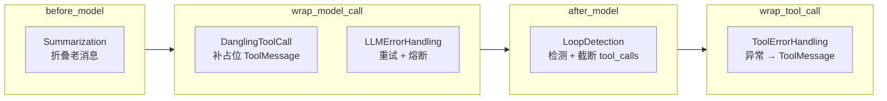
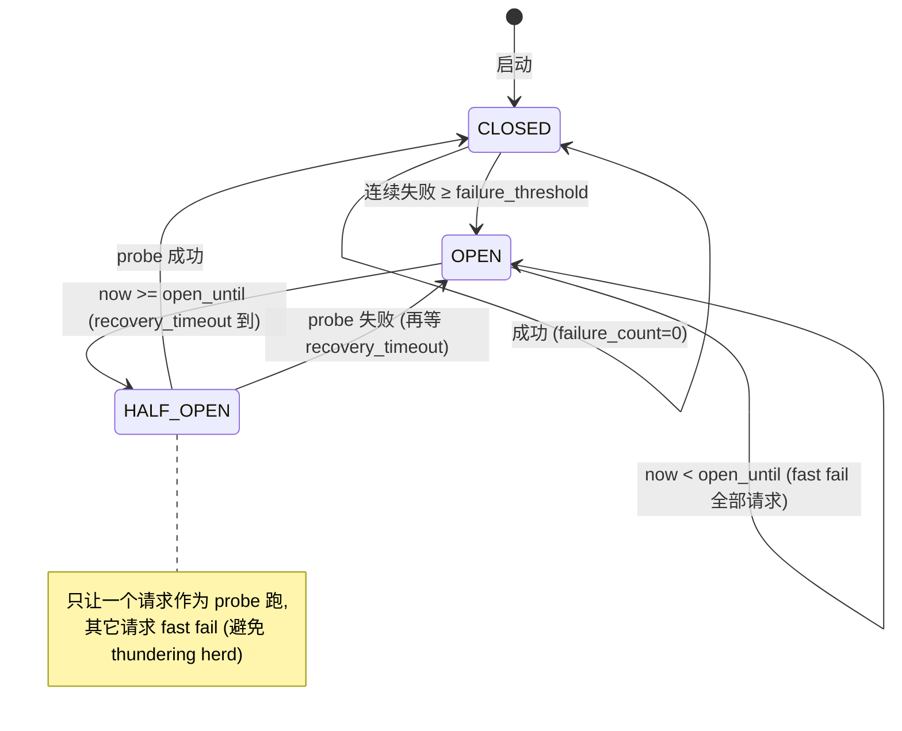

# 18 · 错误处理三件套 + LoopDetection + Summarization

> 06 篇画出过 18 节中间件的全景，其中"反馈循环 / 安全护栏"这条线挂了 5 个中间件：DanglingToolCallMiddleware / LLMErrorHandlingMiddleware / ToolErrorHandlingMiddleware（08 篇见过）/ LoopDetectionMiddleware / DeerFlowSummarizationMiddleware。这一章把它们的内部逻辑全部讲清楚。
>
> 这是 deer-flow 区别于"教科书 LangChain"的核心证据——任何 production agent 系统都会撞到这 5 类问题（消息历史半残、LLM 5xx、工具异常、agent 循环、context 越积越多）。deer-flow 给每一个都配了一个专门的中间件，且实现得相当工程化。

---

## 1. 模块定位（Why this matters）

5 个中间件按职责分 3 组：

| 组 | 中间件 | 解决什么 | hook |
|----|--------|--------|------|
| **A. 消息一致性** | `DanglingToolCallMiddleware` | AIMessage 有 tool_calls 但 ToolMessage 缺失（user 取消 / 进程崩溃后续跑） | `wrap_model_call` |
| **B. 错误重试与降级** | `LLMErrorHandlingMiddleware` | LLM 5xx / 429 / 网络故障 + 熔断 | `wrap_model_call` |
| | `ToolErrorHandlingMiddleware`（09 篇见过） | 工具 Python 异常 | `wrap_tool_call` |
| **C. 自动收口** | `LoopDetectionMiddleware` | agent 卡在重复 tool calls 死循环 | `after_model` |
| | `DeerFlowSummarizationMiddleware` | 对话越来越长打爆 context | `before_model` |

不读这一章会错过 4 个关键认知：

1. **`DanglingToolCallMiddleware` 在 wrap_model_call 重排消息位置**：用 `before_model + state.messages` 添加的 ToolMessage 会被 LangGraph `add_messages` 追加到 list 末尾——而 OpenAI strict 模式要求 ToolMessage **紧跟** dispatch 它的 AIMessage。所以这个中间件不修改 state，只修改 `ModelRequest.messages`——临时给本次 LLM 调用补齐位置，state 本身保留原样。
2. **`LLMErrorHandlingMiddleware` 是熔断 + 重试 + 错误分类三合一**：5 类错误（quota / auth / transient / busy / generic）不同处理；transient/busy 才重试（exponential backoff），quota/auth 直接降级用户友好消息；连续失败触发 circuit breaker（CLOSED → OPEN → HALF_OPEN 三态）。
3. **`LoopDetectionMiddleware` 用 "stable key + multi-set hash" 抗参数微变**：read_file 按 path + 200 行 bucket 桶；write_file/str_replace 用完整 args；其它工具按 `(path, url, query, command, ...)` 7 个 salient 字段。同一组 tool calls 的不同排列产生同一 hash（multi-set 而非 list）。
4. **`DeerFlowSummarizationMiddleware` 的 "skill rescue"**：summarization 默认会把"读 skill 文件"那批 tool_calls 一起折叠——但 LLM 下一轮可能还需要 skill 内容做参考。这个中间件挑出"最近 N 个 skill 相关的 tool call bundle"保留不折，让 LLM 继续能用 skill 指引。

对应到 Harness 六要素：**这一篇覆盖 "反馈循环 + 安全护栏 + 上下文工程" 三条主线**，是 deer-flow agent 健壮性的核心保证。

---

## 2. 源码地图（Source Map）

### 2.1 关键文件清单

| 路径 | 角色 |
|------|------|
| [`packages/harness/deerflow/agents/middlewares/dangling_tool_call_middleware.py`](../packages/harness/deerflow/agents/middlewares/dangling_tool_call_middleware.py) | 消息位置兜底（186 行） |
| [`packages/harness/deerflow/agents/middlewares/llm_error_handling_middleware.py`](../packages/harness/deerflow/agents/middlewares/llm_error_handling_middleware.py) | LLM 错误分类 + 重试 + 熔断（368 行） |
| [`packages/harness/deerflow/agents/middlewares/tool_error_handling_middleware.py`](../packages/harness/deerflow/agents/middlewares/tool_error_handling_middleware.py) | 09 篇见过的 67 行 |
| [`packages/harness/deerflow/agents/middlewares/loop_detection_middleware.py`](../packages/harness/deerflow/agents/middlewares/loop_detection_middleware.py) | hash 滑窗 + 频率检测（439 行） |
| [`packages/harness/deerflow/agents/middlewares/summarization_middleware.py`](../packages/harness/deerflow/agents/middlewares/summarization_middleware.py) | 折叠对话 + skill rescue（374 行） |
| [`packages/harness/deerflow/config/loop_detection_config.py`](../packages/harness/deerflow/config/loop_detection_config.py) | `LoopDetectionConfig` Pydantic 校验 |
| [`packages/harness/deerflow/config/summarization_config.py`](../packages/harness/deerflow/config/summarization_config.py) | `SummarizationConfig` + `ContextSize`（"tokens / messages / fraction" 三种） |
| [`packages/harness/deerflow/config/app_config.py`](../packages/harness/deerflow/config/app_config.py) | `CircuitBreakerConfig.failure_threshold / recovery_timeout_sec` |
| [`packages/harness/deerflow/agents/memory/summarization_hook.py`](../packages/harness/deerflow/agents/memory/summarization_hook.py) | 14 篇见过的 `memory_flush_hook` |

### 2.2 关键符号速查表

| 符号 | 文件:行 | 一句话职责 |
|------|---------|-----------|
| `class DanglingToolCallMiddleware` | `dangling_tool_call_middleware.py:29` | wrap_model_call 重排 |
| `_message_tool_calls(msg)` | `dangling_tool_call_middleware.py:38` | 归一化 tool_calls + invalid_tool_calls + raw additional_kwargs |
| `_build_patched_messages(messages)` | `dangling_tool_call_middleware.py:106` | 主算法 |
| `_synthetic_tool_message_content(tool_call)` | `dangling_tool_call_middleware.py:98` | 两种占位文本 |
| `class LLMErrorHandlingMiddleware` | `llm_error_handling_middleware.py:66` | 重试 + 熔断 + 降级 |
| `_RETRIABLE_STATUS_CODES = {408,409,425,429,500,502,503,504}` | line 27 | 重试触发码 |
| `_BUSY_PATTERNS / _QUOTA_PATTERNS / _AUTH_PATTERNS` | line 28-63 | 中英文 patterns |
| `_classify_error(exc)` | line 138 | 返回 `(retriable, reason)` |
| `_build_retry_delay_ms(attempt, exc)` | line 165 | exponential + cap + Retry-After 优先 |
| `_check_circuit / _record_success / _record_failure` | line 86-136 | 熔断 3 态机 |
| `_extract_retry_after_ms(exc)` | line 332 | 解析 HTTP Retry-After 头（数字秒 / RFC1123 日期） |
| `class LoopDetectionMiddleware` | `loop_detection_middleware.py:144` | after_model 截断 |
| `_DEFAULT_WARN_THRESHOLD=3 / _DEFAULT_HARD_LIMIT=5 / _DEFAULT_WINDOW_SIZE=20` | line 35-37 | 默认值 |
| `_hash_tool_calls(tool_calls)` | `loop_detection_middleware.py:112` | multi-set hash |
| `_stable_tool_key(name, args, fallback)` | `loop_detection_middleware.py:69` | 按工具类型给出 stable key |
| `_normalize_tool_call_args(raw_args)` | `loop_detection_middleware.py:43` | 兼容 dict / json string / None |
| `class DeerFlowSummarizationMiddleware(SummarizationMiddleware)` | `summarization_middleware.py:98` | 父类是 langchain 内置 |
| `_maybe_summarize(state, runtime)` / `_amaybe_summarize` | `summarization_middleware.py:126` | trigger 判定 + summarize |
| `_partition_with_skill_rescue(messages, cutoff)` | `summarization_middleware.py:203` | skill 救援拆分 |
| `_find_skill_bundles(...)` | `summarization_middleware.py:251` | 找出"读 skill 文件"的 bundle |
| `_select_bundles_to_rescue(bundles)` | `summarization_middleware.py:313` | 按 count + tokens 双预算选 |
| `_preserve_dynamic_context_reminders(...)` | `summarization_middleware.py:185` | 保留 15 篇的 reminder |
| `_fire_hooks(...)` | `summarization_middleware.py:352` | 调 `memory_flush_hook` 等 |
| `BeforeSummarizationHook` Protocol | `summarization_middleware.py:35` | 自定义 hook 接口 |
| `ContextSize(type, value)` | `summarization_config.py:11` | trigger/keep 单元 |
| `ContextSizeType = Literal["fraction","tokens","messages"]` | line 7 | 三种类型 |

### 2.3 5 个中间件在 hook 上的"分工图"



**5 个中间件 5 个 hook 各占一个时机**——彼此不抢夺、不冲突。这是 06 篇讲的"hook 织网"的实际运作。

### 2.4 3 个易混淆的"消息修改"对比

| 中间件 | 修改对象 | 修改时机 | 修改后果 |
|--------|---------|---------|---------|
| **DanglingToolCallMiddleware** | `ModelRequest.messages`（临时） | wrap_model_call | 不进 state，只影响本次 LLM 输入 |
| **LoopDetectionMiddleware** | state.messages（永久） | after_model | tool_calls 被剥掉，state 持久化后保留 |
| **DeerFlowSummarizationMiddleware** | state.messages（永久） | before_model | 删除整段老消息 + 注入 summary message |

---

## 3. 核心逻辑精读（Deep Dive）

### 3.1 `DanglingToolCallMiddleware`：消息位置兜底

#### 问题背景

OpenAI / Anthropic 等 strict mode 要求：

```
AIMessage(tool_calls=[tc1, tc2])
ToolMessage(tool_call_id=tc1.id, ...)
ToolMessage(tool_call_id=tc2.id, ...)
```

**ToolMessage 必须紧跟 AIMessage，且 id 配对**。如果中间断了（user 取消导致只有 AIMessage 没 ToolMessage），下一轮 LLM 调用会 400 报错。

**deer-flow 的痛点**：用户随时可能取消 + agent 用 checkpointer 恢复——历史里就可能出现 dangling AIMessage。

#### 解法：wrap_model_call 临时补占位 + 重排

```python
# packages/harness/deerflow/agents/middlewares/dangling_tool_call_middleware.py:106-163
def _build_patched_messages(self, messages: list) -> list | None:
    """Return messages with tool results grouped after their tool-call AIMessage."""
    tool_messages_by_id: dict[str, ToolMessage] = {}
    for msg in messages:
        if isinstance(msg, ToolMessage):
            tool_messages_by_id.setdefault(msg.tool_call_id, msg)

    tool_call_ids: set[str] = set()
    for msg in messages:
        if getattr(msg, "type", None) != "ai":
            continue
        for tc in self._message_tool_calls(msg):
            tc_id = tc.get("id")
            if tc_id:
                tool_call_ids.add(tc_id)

    patched: list = []
    consumed_tool_msg_ids: set[str] = set()
    patch_count = 0
    for msg in messages:
        if isinstance(msg, ToolMessage) and msg.tool_call_id in tool_call_ids:
            continue   # 跳过，下面 AIMessage 处理时再 append

        patched.append(msg)
        if getattr(msg, "type", None) != "ai":
            continue

        for tc in self._message_tool_calls(msg):
            tc_id = tc.get("id")
            if not tc_id or tc_id in consumed_tool_msg_ids:
                continue

            existing_tool_msg = tool_messages_by_id.get(tc_id)
            if existing_tool_msg is not None:
                patched.append(existing_tool_msg)
                consumed_tool_msg_ids.add(tc_id)
            else:
                patched.append(ToolMessage(
                    content=self._synthetic_tool_message_content(tc),
                    tool_call_id=tc_id,
                    name=tc.get("name", "unknown"),
                    status="error",
                ))
                consumed_tool_msg_ids.add(tc_id)
                patch_count += 1

    if patched == messages:
        return None

    if patch_count:
        logger.warning(f"Injecting {patch_count} placeholder ToolMessage(s) for dangling tool calls")
    return patched
```

**算法的 4 步**：

1. **扫一遍消息**：建立"tool_call_id → ToolMessage" 索引，再扫一遍取所有 AIMessage 的 tool_calls 收集成 `tool_call_ids` set。
2. **二次扫**：跳过原 ToolMessage 位置（之后会重新插入）。
3. **遇到 AIMessage 时**：按 tool_calls 顺序，找对应 ToolMessage——找到就插，没找到就**合成一个 "[Tool call was interrupted...]" 的占位 ToolMessage**。
4. **如果 `patched == messages`** 表示原本就是合法格式，return None，省一次复制。

#### `_message_tool_calls` 的 3 源归一化

```python
# packages/harness/deerflow/agents/middlewares/dangling_tool_call_middleware.py:38-95 (节选)
@staticmethod
def _message_tool_calls(msg) -> list[dict]:
    """Return normalized tool calls from structured fields or raw provider payloads."""
    normalized: list[dict] = []

    # 1. 标准 LangChain tool_calls
    tool_calls = getattr(msg, "tool_calls", None) or []
    normalized.extend(list(tool_calls))

    # 2. raw provider payload (additional_kwargs["tool_calls"])
    raw_tool_calls = (getattr(msg, "additional_kwargs", None) or {}).get("tool_calls") or []
    if not tool_calls:
        for raw_tc in raw_tool_calls:
            # 兼容 OpenAI 风格 {"id": ..., "function": {"name": ..., "arguments": "json string"}}
            ...

    # 3. invalid_tool_calls (LangChain 收集的 malformed 调用)
    for invalid_tc in getattr(msg, "invalid_tool_calls", None) or []:
        normalized.append({
            "id": invalid_tc.get("id"),
            "name": invalid_tc.get("name") or "unknown",
            "args": {},
            "invalid": True,
            "error": invalid_tc.get("error"),
        })

    return normalized
```

**为什么 3 源**？因为不同 provider 把 tool_calls 放不同地方：

- LangChain 解析成功 → 标准 `.tool_calls`。
- LangChain 解析失败但提供 raw → `additional_kwargs["tool_calls"]`（OpenAI delta chunk 拼接没成功时这种情况）。
- LangChain 检测出 malformed → `.invalid_tool_calls`。

**3 处都查一遍**保证不漏。然后给 invalid 类型用专门的"参数无效"占位文案。

#### 为什么不挂 before_model？

注释 line 11-13 写得很清楚：

> Note: Uses wrap_model_call instead of before_model to ensure patches are inserted
> at the correct positions (immediately after each dangling AIMessage), not appended
> to the end of the message list as before_model + add_messages reducer would do.

before_model 返回 `{"messages": [new_tool_msgs]}` → `add_messages` reducer 会把新消息**追加**到 list 末尾 → 占位 ToolMessage 落在最后，position 不对。

wrap_model_call 修改 `ModelRequest.messages` 是**本次 LLM 调用的临时输入**，不进 state——位置可以随意重排。**state 还是原状（dangling 状态保留）**——下次进入 wrap_model_call 时再 patch 一次。

### 3.2 `LLMErrorHandlingMiddleware`：3 件套（分类 / 重试 / 熔断）

#### 错误分类的优先级

```python
# packages/harness/deerflow/agents/middlewares/llm_error_handling_middleware.py:138-163
def _classify_error(self, exc: BaseException) -> tuple[bool, str]:
    detail = _extract_error_detail(exc)
    lowered = detail.lower()
    error_code = _extract_error_code(exc)
    status_code = _extract_status_code(exc)

    if _matches_any(lowered, _QUOTA_PATTERNS) or _matches_any(str(error_code).lower(), _QUOTA_PATTERNS):
        return False, "quota"        # ① quota / billing → 不重试，提示用户
    if _matches_any(lowered, _AUTH_PATTERNS):
        return False, "auth"          # ② 认证错 → 不重试，提示用户

    exc_name = exc.__class__.__name__
    if exc_name in {"APITimeoutError", "APIConnectionError", "InternalServerError",
                     "ReadError", "RemoteProtocolError"}:
        return True, "transient"      # ③ 网络层错误 → 重试
    if status_code in _RETRIABLE_STATUS_CODES:    # {408, 409, 425, 429, 500, 502, 503, 504}
        return True, "transient"      # ④ HTTP 5xx/429 → 重试
    if _matches_any(lowered, _BUSY_PATTERNS):
        return True, "busy"            # ⑤ "server busy/overloaded" 文本 → 重试

    return False, "generic"            # ⑥ 其它 → 直接降级
```

**5 类错误 + 兜底**：

| 优先级 | 类型 | 重试？ | 处理 |
|--------|------|------|------|
| 1 | quota / billing / 余额不足 | ❌ | 用户友好消息 + 不重试 |
| 2 | auth / unauthorized / 无权 | ❌ | 用户友好消息 + 不重试 |
| 3 | 异常类名匹配（Timeout / Connection / ...） | ✅ | exponential backoff 重试 |
| 4 | HTTP 状态码在 retriable set | ✅ | exponential backoff 重试 |
| 5 | "server busy / 服务繁忙" 文本 | ✅ | exponential backoff 重试 |
| 6 | 其它（编程错 / 参数错） | ❌ | 用户友好降级 |

**精妙处**：

- **quota / auth 优先级最高**：即使错误同时匹配 "quota" 和 "5xx"，按 quota 处理（不重试）——quota 错误重试 N 次还是 quota 错，浪费。
- **中英文双 pattern**：`服务繁忙` / `负载较高` / `稍后重试` 等——中文 provider（如火山引擎、DeepSeek）的错误消息双向覆盖。
- **`exc.__class__.__name__` 字符串匹配**：避免 import 具体 provider 的异常类——保持 provider 中立。

#### Exponential backoff + Retry-After 优先

```python
# packages/harness/deerflow/agents/middlewares/llm_error_handling_middleware.py:165-170
def _build_retry_delay_ms(self, attempt: int, exc: BaseException) -> int:
    retry_after = _extract_retry_after_ms(exc)
    if retry_after is not None:
        return retry_after
    backoff = self.retry_base_delay_ms * (2 ** max(0, attempt - 1))
    return min(backoff, self.retry_cap_delay_ms)
```

**3 段**：

1. **Retry-After 头**：服务端给的"等多久"是最权威的——优先用。`_extract_retry_after_ms`（行 332）能解析数字秒 + RFC1123 日期。
2. **指数 backoff**：`1s, 2s, 4s, 8s` (cap 8s)。3 次重试最多等 `1 + 2 + 4 = 7s`。
3. **`max(0, attempt - 1)`**：attempt 从 1 开始，避免负指数。

#### 熔断器 3 态机

```python
# packages/harness/deerflow/agents/middlewares/llm_error_handling_middleware.py:86-136
def _check_circuit(self) -> bool:
    """Returns True if circuit is OPEN (fast fail), False otherwise."""
    with self._circuit_lock:
        now = time.time()

        if self._circuit_state == "open":
            if now < self._circuit_open_until:
                return True            # 还在 OPEN 窗口内,fast fail
            self._circuit_state = "half_open"     # 窗口过了 → 转 HALF_OPEN
            self._circuit_probe_in_flight = False

        if self._circuit_state == "half_open":
            if self._circuit_probe_in_flight:
                return True            # 已经有 probe 在跑了 → 其它请求 fast fail
            self._circuit_probe_in_flight = True   # 把当前请求当 probe
            return False               # 让 probe 跑

        return False                   # CLOSED 状态：放行
```

**状态转移**：



**3 个工程亮点**：

1. **`threading.Lock` 保护状态**：熔断器是进程级共享状态，多 thread 调 LLM 时必须互斥。
2. **HALF_OPEN 单一 probe**：避免"刚 recovery 就涌入 100 个请求"再次打挂 LLM。只让一个先试水。
3. **`recovery_timeout_sec` 默认 60s（来自 CircuitBreakerConfig）**：保护 LLM 端有足够时间自愈。

### 3.3 `LoopDetectionMiddleware`：stable key + multi-set hash

#### 为什么不直接 hash `args`？

```python
# 假想错误做法
hash = md5(json.dumps([tc.args for tc in tool_calls]))
```

问题：

- LLM 调 `read_file(path="a.py", start_line=1, end_line=50)` 和 `read_file(path="a.py", start_line=51, end_line=100)` → args 完全不同 → 不同 hash → 不算 loop。
- 但用户视角"读同一个文件多次"明显是 loop。

#### `_stable_tool_key` 的"工具特异性"

```python
# packages/harness/deerflow/agents/middlewares/loop_detection_middleware.py:69-109
def _stable_tool_key(name: str, args: dict, fallback_key: str | None) -> str:
    if name == "read_file" and fallback_key is None:
        path = args.get("path") or ""
        start_line = args.get("start_line")
        end_line = args.get("end_line")

        bucket_size = 200
        # ... 把 (start_line, end_line) bucket 化 ...
        bucket_start = (max(start_line, 1) - 1) // bucket_size
        bucket_end = (max(end_line, 1) - 1) // bucket_size
        return f"{path}:{bucket_start}-{bucket_end}"

    if name in {"write_file", "str_replace"}:
        if fallback_key is not None:
            return fallback_key
        return json.dumps(args, sort_keys=True, default=str)

    salient_fields = ("path", "url", "query", "command", "pattern", "glob", "cmd")
    stable_args = {field: args[field] for field in salient_fields if args.get(field) is not None}
    if stable_args:
        return json.dumps(stable_args, sort_keys=True, default=str)
    ...
```

**3 类工具，3 套策略**：

| 工具类型 | stable key 策略 | 设计意图 |
|---------|--------------|---------|
| **`read_file`** | `path + 200 行 bucket` | 同文件相邻 bucket 视为重复读 → 防止反复读同一段 |
| **`write_file / str_replace`** | 完整 args | 同 path 不同内容是合法迭代 → 不当 loop |
| **其它工具** | `(path, url, query, command, pattern, glob, cmd)` 7 字段 salient | 抓核心参数，忽略 `description` 这种 LLM 描述用字段 |

**为什么 read_file 用 bucket 而不是精确 line range**？因为 LLM 偶尔会把 `(1, 50)` 写成 `(1, 51)` 之类的小漂移 —— bucket 让小漂移落到同一 key，正确识别为 loop。

**为什么 write_file 用完整 args**？因为 "agent 在迭代修改同一个文件" 是正常流程（改 → 看效果 → 再改），不该当 loop。content 不同就不当 loop。

#### multi-set hash

```python
# packages/harness/deerflow/agents/middlewares/loop_detection_middleware.py:112-130
def _hash_tool_calls(tool_calls: list[dict]) -> str:
    """Deterministic hash of a set of tool calls (name + stable key).

    This is intended to be order-independent: the same multiset of tool calls
    should always produce the same hash, regardless of their input order.
    """
    normalized: list[str] = []
    for tc in tool_calls:
        name = tc.get("name", "")
        args, fallback_key = _normalize_tool_call_args(tc.get("args", {}))
        key = _stable_tool_key(name, args, fallback_key)
        normalized.append(f"{name}:{key}")

    # Sort so permutations of the same multiset of calls yield the same ordering.
    normalized.sort()
    blob = json.dumps(normalized, sort_keys=True, default=str)
    return hashlib.md5(blob.encode()).hexdigest()[:12]
```

**`normalized.sort()` 是关键**——LLM 一次调 `[read_file(a), read_file(b)]` 和 `[read_file(b), read_file(a)]` 产生同一 hash。**视为同一组操作**而非两次不同的 call sequence。

#### 两层阈值（warn + hard_limit）

```python
_DEFAULT_WARN_THRESHOLD = 3      # warn after 3 identical calls
_DEFAULT_HARD_LIMIT = 5          # force-stop after 5 identical calls
_DEFAULT_WINDOW_SIZE = 20        # track last N tool calls
```

**两层处理**：

- **第 3 次出现同 hash**：注入 `_WARNING_MSG`（"You are repeating the same tool calls. Stop calling tools and produce your final answer now."）—— **给 LLM 一次自救机会**。
- **第 5 次出现**：强制剥掉 tool_calls，注入 `_HARD_STOP_MSG`——**LLM 被迫输出文本答案**。

**第二层 _TOOL_FREQ 检测**（行 39-40）：单工具总调用次数（不论参数）超 30 次 warn、超 50 次 hard stop。覆盖"agent 不停换参数调同一工具"的另一种 loop。

#### per-thread + LRU eviction

```python
# packages/harness/deerflow/agents/middlewares/loop_detection_middleware.py:194 周边
self._history: OrderedDict[str, list[str]] = OrderedDict()
```

`_history` 按 thread_id 分桶——不同 thread 互不影响。`OrderedDict` 配合 LRU eviction（`_evict_if_needed` 行 219）——超过 `max_tracked_threads=100` 时淘汰最旧。

### 3.4 `DeerFlowSummarizationMiddleware`：trigger / keep / skill rescue

#### trigger / keep 的"3 种单位"

```python
# packages/harness/deerflow/config/summarization_config.py
ContextSizeType = Literal["fraction", "tokens", "messages"]


class ContextSize(BaseModel):
    type: ContextSizeType
    value: float | int

# 配置示例
summarization:
  enabled: true
  trigger:                    # 任一满足即触发
    - {type: messages, value: 50}
    - {type: tokens, value: 4000}
    - {type: fraction, value: 0.8}   # = 模型 max_input 的 80%
  keep:                       # 保留多少
    type: messages
    value: 20
```

**3 种单位的语义**：

| 类型 | 单位 | 适用场景 |
|------|------|---------|
| `messages` | 消息条数 | 简单可预测——"超过 50 条就折叠" |
| `tokens` | tiktoken 计算的 token 数 | 精确 budget 控制 |
| `fraction` | 占 model.max_input_tokens 的比例 | 跨 model 自适应（GPT-4 128k vs Claude 200k） |

**`trigger` 支持 list**——任一满足即触发。default `keep` 是 `messages=20`——保留最近 20 条。

#### `_maybe_summarize` 主流程

```python
# packages/harness/deerflow/agents/middlewares/summarization_middleware.py:126-150
def _maybe_summarize(self, state: AgentState, runtime: Runtime) -> dict | None:
    messages = state["messages"]
    self._ensure_message_ids(messages)

    total_tokens = self.token_counter(messages)
    if not self._should_summarize(messages, total_tokens):
        return None         # 没触发,放行

    cutoff_index = self._determine_cutoff_index(messages)
    if cutoff_index <= 0:
        return None         # cutoff 算出来不合理,放行

    messages_to_summarize, preserved_messages = self._partition_with_skill_rescue(messages, cutoff_index)
    messages_to_summarize, preserved_messages = self._preserve_dynamic_context_reminders(messages_to_summarize, preserved_messages)
    self._fire_hooks(messages_to_summarize, preserved_messages, runtime)
    summary = self._create_summary(messages_to_summarize)
    new_messages = self._build_new_messages(summary)

    return {
        "messages": [
            RemoveMessage(id=REMOVE_ALL_MESSAGES),     # ← LangGraph 的"清空所有"哨兵
            *new_messages,                              # summary message (name="summary")
            *preserved_messages,                        # 保留的近期消息
        ]
    }
```

**6 步流程**：

1. **`_should_summarize`** 检查 trigger 是否满足（继承自父类 langchain.SummarizationMiddleware）。
2. **`_determine_cutoff_index`** 算出"保留几条消息"对应的 index。
3. **`_partition_with_skill_rescue`** 拆成"要折叠"+"要保留"——**自家加的 skill rescue 在这里**（§3.5）。
4. **`_preserve_dynamic_context_reminders`** 保留 15 篇的 reminder 消息。
5. **`_fire_hooks`** 触发自定义 hook（例如 14 篇的 `memory_flush_hook`）。
6. **生成 summary message + 重组 state.messages**——`RemoveMessage(REMOVE_ALL_MESSAGES)` 是 LangGraph 的"清空整个 messages list"哨兵，配合后续 `*new_messages, *preserved_messages` 实现"原子替换"。

#### `_partition_with_skill_rescue`：skill 救援

```python
# packages/harness/deerflow/agents/middlewares/summarization_middleware.py:203-249 (节选)
def _partition_with_skill_rescue(
    self,
    messages: list,
    cutoff_index: int,
) -> tuple[list, list]:
    to_summarize = messages[:cutoff_index]
    to_preserve = messages[cutoff_index:]

    if self._preserve_recent_skill_count == 0 or self._preserve_recent_skill_tokens == 0 or not to_summarize:
        return to_summarize, to_preserve

    skills_root = self._skills_container_path
    bundles = self._find_skill_bundles(to_summarize, skills_root)
    if not bundles:
        return to_summarize, to_preserve

    rescued = self._select_bundles_to_rescue(bundles)
    if not rescued:
        return to_summarize, to_preserve

    # 把 rescued bundles 从 to_summarize 移到 to_preserve
    rescued_indices = {idx for b in rescued for idx in (b.ai_index, *b.skill_tool_indices)}
    new_to_summarize = [m for i, m in enumerate(to_summarize) if i not in rescued_indices]
    new_to_preserve = [to_summarize[i] for i in sorted(rescued_indices)] + to_preserve

    return new_to_summarize, new_to_preserve
```

**步骤**：

1. 先按 cutoff 简单划分。
2. 在"要折叠"那部分扫描"读 skill 文件"的 tool_call bundle（`AIMessage + 跟随的 skill 相关 ToolMessage`）。
3. 按 `count + tokens` 双预算选出"最近 N 个值得救"的 bundle（`_select_bundles_to_rescue`）。
4. 把 rescued 的消息移到"要保留"。

**为什么救 skill bundle**？因为 LLM 看 skill 内容是"长期参考"——下一轮可能还要查。如果 skill 内容被折叠成 summary，LLM 看不到细节就会再次 read_file 加载——浪费 token + 触发 LoopDetection。

#### `_select_bundles_to_rescue` 的双预算

```python
# packages/harness/deerflow/agents/middlewares/summarization_middleware.py:313-339 (节选)
def _select_bundles_to_rescue(self, bundles: list[_SkillBundle]) -> list[_SkillBundle]:
    """Pick bundles to keep, walking newest-first under count/token budgets."""
    kept: list[_SkillBundle] = []
    total_tokens = 0

    for bundle in reversed(bundles):       # newest-first
        if kept >= self._preserve_recent_skill_count:
            break                          # count 预算用完
        if bundle.skill_tool_tokens > self._preserve_recent_skill_tokens_per_skill:
            continue                       # 单个 skill 超过 per-skill 上限,跳过
        if total_tokens + bundle.skill_tool_tokens > self._preserve_recent_skill_tokens:
            break                          # 累计 token 预算用完
        kept.append(bundle)
        total_tokens += bundle.skill_tool_tokens
    return kept
```

**3 个 budget**：

| 预算 | 默认 | 含义 |
|------|------|------|
| `preserve_recent_skill_count` | 5 | 最多保留 5 个 skill bundle |
| `preserve_recent_skill_tokens` | 25_000 | 总 token 上限 25k |
| `preserve_recent_skill_tokens_per_skill` | 5_000 | 单个 skill 超 5k 不救（巨型 skill 不值得保留） |

**newest-first 遍历**：优先保留最近读的 skill——它们对当前对话最相关。

### 3.5 `_fire_hooks`：跨 middleware 协作

```python
# packages/harness/deerflow/agents/middlewares/summarization_middleware.py:352 周边
def _fire_hooks(self, messages_to_summarize, preserved_messages, runtime) -> None:
    if not self._before_summarization_hooks:
        return
    event = SummarizationEvent(
        messages_to_summarize=tuple(messages_to_summarize),
        preserved_messages=tuple(preserved_messages),
        thread_id=_resolve_thread_id(runtime),
        agent_name=_resolve_agent_name(runtime),
        runtime=runtime,
    )
    for hook in self._before_summarization_hooks:
        try:
            hook(event)
        except Exception:
            logger.exception("BeforeSummarizationHook failed: %s", hook)
```

**主要 hook**：14 篇见过的 `memory_flush_hook`——在 summarize 之前 flush memory queue，避免对话被折叠后 memory 抽不到。

**`BeforeSummarizationHook` Protocol**：用户可以注册自定义 hook（结构子类型，无侵入）——例如做 audit log、给某些消息打 tag。

---

## 4. 关键问题答疑（Key Questions）

### Q1：DanglingToolCallMiddleware 的"占位 ToolMessage" 会污染 memory 吗？

**不会**。它修改的是 `ModelRequest.messages`（本次 LLM 调用临时输入），不进 state.messages。MemoryMiddleware（14 篇）从 state.messages 抽消息，看不到占位。

### Q2：LLMErrorHandlingMiddleware 的重试是同步阻塞吗？

异步——`awrap_model_call`（行 255）里用 `await asyncio.sleep(wait_ms / 1000)`。sync 路径（`wrap_model_call`）用 `time.sleep`。**不会卡死 event loop**——sleep 期间其它 task 仍能跑。

但**单个 request 的视角是阻塞的**——用户从 SSE 流里会看到一段静默，然后是 `_emit_retry_event` 推送的 `llm_retry` 事件告诉它"在重试"。

### Q3：熔断器是 per-instance 还是全局？

per-instance（middleware 实例）。每个 agent 装一个 LLMErrorHandlingMiddleware → 每个 agent 自己一套熔断状态。

**但 agent 是按需创建的**（05 篇）——同 thread 多轮对话用同一个 agent 实例 → 熔断状态在 thread 内共享。**跨 thread 不共享**。

这意味着：thread A 触发熔断 → thread B 仍能继续调 LLM（如果它创建了不同的 agent 实例）。这是合理的——不同 thread 用不同 model / 不同 provider 是可能的。

### Q4：LoopDetection 的 hash 会假阳性吗？

**会，但被设计为可控**：

- read_file 用 200 行 bucket → 读 page 1 和 page 2 视为同 key → 真的"分页扫描整个文件"会触发假阳性。
- 但配合 `WARN_THRESHOLD=3`——只警告不强停 → LLM 收到 warn 后会"停或换策略"，避免 false positive 真造成问题。
- 真正强停在 `HARD_LIMIT=5`——5 次同 page bucket 才强停，"分页扫描合法用例"通常 < 5 次（毕竟一个文件最多几十 page）。

**假阳性比假阴性危险小**：假阴性 = 真 loop 没被截断 → 烧 token + 卡进度；假阳性 = 提前结束 → LLM 输出已收集的部分答案，最差是不完整。

### Q5：Summarization 后老消息真的删了吗？checkpointer 怎么恢复？

**真的删了**——`RemoveMessage(REMOVE_ALL_MESSAGES)` 是 LangGraph 的"清空"指令。state 持久化后，下次从 checkpoint 恢复看到的就是新的 messages list（summary + preserved）。

**老消息永久丢失**——除非 checkpointer 保留了历史 version（默认不）。所以 summarization 是**不可逆**的——summary 写不好就丢信息。

### Q6：trigger 用 fraction 怎么算？需要 model 信息吗？

是的——`fraction` 类型的 trigger 会读 `model.max_input_tokens`（model config 里写）。父类 SummarizationMiddleware 在 `__init__` 时接收 model 参数。所以 `_create_summarization_middleware`（05 篇 `lead_agent/agent.py:53`）创建 middleware 时传了 model（同时用 `tags=["middleware:summarize"]` 标记给 RunJournal）。

### Q7：DanglingToolCallMiddleware 和 ToolErrorHandlingMiddleware 都"补"ToolMessage，重复吗？

不重复——职责完全不同：

- **DanglingToolCallMiddleware**：处理"AIMessage 有 tool_calls 但 ToolMessage 缺失"（user 取消导致的历史断裂）——**补占位**。
- **ToolErrorHandlingMiddleware**（09 篇）：处理"工具 Python 异常"（工具实现 crash 了）——**异常 → 错误 ToolMessage**。

前者在 wrap_model_call（LLM 调用前），后者在 wrap_tool_call（工具调用时）。**两个时机两个责任**。

---

## 5. 横向延伸与面试级洞察（Interview-Grade Insights）

### 5.1 "重排 vs 修改 state" 的区分是 LangGraph middleware 设计的核心技巧

DanglingToolCallMiddleware 选了"重排 ModelRequest.messages"而非"修改 state"——是因为它要**保留原始历史的不变性**（dangling 状态本身可能值得 trace）+ **每次重排不污染下一次**（state 不变，下次进 wrap_model_call 又能 patch 一次新出现的 dangling）。

这是 LangGraph middleware 设计的一个进阶模式：

| 需求 | 用 hook | 修改对象 |
|------|--------|---------|
| 永久改 state | before_model / after_model | `return {"messages": [...]}` |
| 临时改 LLM 输入 | wrap_model_call | `request.override(messages=...)` |
| 永久改 tool 调用结果 | wrap_tool_call | `return ToolMessage(...)` |

**面试金句**：deer-flow 用 wrap_model_call 修改 ModelRequest 而不是 state，是因为 dangling 是"输入不合法但 state 合法"的边界 case——state 应该保留对话历史的真实样子，临时补占位只在 LLM 调用面前生效。这是 LangGraph "state vs request" 区分的精妙运用。

### 5.2 熔断器是 production LLM 系统的"必备件"

很多人觉得"重试就够了"。但只有重试会出问题：

- LLM provider 真挂了（不是 transient） → 每个请求重试 3 次 → 1 用户 = 3 倍 LLM 调用 cost → 100 用户排队等同样的挂掉 LLM → cost 爆炸 + 等待时间 100× 倍数。

熔断器把"挂掉时全部 fast fail"——cost 立刻降到 0，等待时间从 100 倍 → 几毫秒。**这是大流量 production 的必备**。

deer-flow 的实现还做了**HALF_OPEN 单 probe**——避免恢复时 thundering herd 把 LLM 再次打挂。**这是熔断器设计的进阶细节**，大多数教科书 circuit breaker 没做。

### 5.3 LoopDetection 的"stable key 工具特异性" 是反直觉但正确的设计

新手做 loop 检测会写"hash(json.dumps(tool_calls))"——结果几乎所有 LLM 操作都被当成不同（因为 args 偶有微变）。

deer-flow 的做法：

- 给每种工具**单独**设计 stable key——read_file bucket、write_file 完整、其它 salient 字段。
- 用 multi-set hash 而非 list hash——参数顺序无关。
- 双阈值（warn + hard_limit）——给 LLM 自救机会。

**面试金句**：production agent 的 loop detection 不是"hash 一下 tool_calls 比对"——必须按工具类型设计 stable key、用 multi-set 防顺序、双阈值平衡假阳性。deer-flow 的实现是这套设计模式的工程示范。

### 5.4 Summarization "skill rescue" 是上下文管理的高阶技巧

普通 summarization：按 cutoff 一刀切，所有老消息折叠。

deer-flow 的 skill rescue：

- **识别**对话中"读 skill 文件" 的 tool_call bundle。
- **优先保留**最近的 skill bundle（不折叠）。
- **预算控制**：count + total tokens + per-skill tokens 三层 budget 避免救援过多。

**为什么重要**？skill 是"长期参考"——折叠后 LLM 再用就要重读，浪费 token + 撞 LoopDetection。**rescue 是 prompt budget 优化的精细化操作**。

类似思路可推广到其它"高价值长内容"——例如 `present_files` 的 artifact 内容、上传文件的 schema、用户写的具体 spec。

### 5.5 vs 同行框架

| 框架 | 错误处理 | Loop 检测 | Summarization |
|------|---------|---------|--------------|
| **LangChain** | 默认 retry decorator | 无内置 | `ConversationSummaryMemory`（无 trigger 策略） |
| **AutoGen** | 无系统级 | 无 | 无内置 |
| **CrewAI** | 简单 retry | 无 | 无 |
| **deer-flow** | 分类 + 重试 + 熔断 + 降级 | stable key + multi-set hash + 双阈值 + skill rescue | trigger/keep 3 单位 + skill rescue + hook 协作 |

deer-flow 在反思纠错这一层的工程深度，明显领先其它 open-source agent 框架。

---

## 6. 实操教程（Hands-on Lab）

### 6.1 最小可运行示例：手动调 hash 看 LoopDetection 的 stable key

```python
# backend/debug_loop_detection.py
"""演示 LoopDetection 的 stable key 在不同工具上的行为"""
from deerflow.agents.middlewares.loop_detection_middleware import _hash_tool_calls


# 1. read_file 同 path 不同 line range（同 bucket）
tcs_v1 = [{"name": "read_file", "args": {"path": "/mnt/user-data/workspace/a.py", "start_line": 1, "end_line": 50}}]
tcs_v2 = [{"name": "read_file", "args": {"path": "/mnt/user-data/workspace/a.py", "start_line": 51, "end_line": 100}}]
tcs_v3 = [{"name": "read_file", "args": {"path": "/mnt/user-data/workspace/a.py", "start_line": 201, "end_line": 250}}]
print(f"read_file(1-50):    {_hash_tool_calls(tcs_v1)}")
print(f"read_file(51-100):  {_hash_tool_calls(tcs_v2)}   # 同 bucket [0,0] → 同 hash")
print(f"read_file(201-250): {_hash_tool_calls(tcs_v3)}   # bucket [1,1] → 不同 hash")
print()

# 2. write_file 同 path 不同 content (不同 hash, 不算 loop)
tcs_w1 = [{"name": "write_file", "args": {"path": "/mnt/user-data/workspace/x.py", "content": "v1"}}]
tcs_w2 = [{"name": "write_file", "args": {"path": "/mnt/user-data/workspace/x.py", "content": "v2"}}]
print(f"write_file(v1): {_hash_tool_calls(tcs_w1)}")
print(f"write_file(v2): {_hash_tool_calls(tcs_w2)}   # content 不同 → 不同 hash")
print()

# 3. multi-set 顺序无关
tcs_pair1 = [
    {"name": "read_file", "args": {"path": "a.py"}},
    {"name": "read_file", "args": {"path": "b.py"}},
]
tcs_pair2 = [
    {"name": "read_file", "args": {"path": "b.py"}},   # 顺序反了
    {"name": "read_file", "args": {"path": "a.py"}},
]
print(f"[read a, read b]: {_hash_tool_calls(tcs_pair1)}")
print(f"[read b, read a]: {_hash_tool_calls(tcs_pair2)}   # multi-set → 同 hash")
```

跑：`cd backend && PYTHONPATH=. uv run python debug_loop_detection.py`

**预期看到**：

```
read_file(1-50):    abc123def456
read_file(51-100):  abc123def456   # 同 bucket [0,0] → 同 hash
read_file(201-250): xyz789ghi012   # bucket [1,1] → 不同 hash

write_file(v1): aaa111bbb222
write_file(v2): ccc333ddd444   # content 不同 → 不同 hash

[read a, read b]: 111222333444
[read b, read a]: 111222333444   # multi-set → 同 hash
```

### 6.2 Debug 任务清单

#### 实验 ①：观察 DanglingToolCallMiddleware 的补占位

```python
# backend/debug_dangling.py
from langchain_core.messages import HumanMessage, AIMessage, ToolMessage
from deerflow.agents.middlewares.dangling_tool_call_middleware import DanglingToolCallMiddleware


mw = DanglingToolCallMiddleware()

# 制造 dangling: AIMessage 有 2 个 tool_calls,但只有 1 个 ToolMessage
messages = [
    HumanMessage(content="Read both files"),
    AIMessage(content="", id="ai-1", tool_calls=[
        {"id": "tc-1", "name": "read_file", "args": {"path": "a.py"}},
        {"id": "tc-2", "name": "read_file", "args": {"path": "b.py"}},
    ]),
    ToolMessage(content="contents of a", tool_call_id="tc-1"),
    # ↑ tc-2 没有对应的 ToolMessage
]

patched = mw._build_patched_messages(messages)
for m in patched:
    type_str = type(m).__name__
    if isinstance(m, ToolMessage):
        print(f"  {type_str}(tool_call_id={m.tool_call_id!r}, content={m.content[:60]!r}, status={m.status!r})")
    elif isinstance(m, AIMessage):
        print(f"  {type_str}(tool_calls=[{', '.join(tc['id'] for tc in m.tool_calls)}])")
    else:
        print(f"  {type_str}(content={str(m.content)[:60]!r})")
```

**预期看到** patched 列表里多了一条 `ToolMessage(tool_call_id='tc-2', content='[Tool call was interrupted ...]', status='error')`。

#### 实验 ②：观察 LLMErrorHandling 熔断 3 态机

```python
import time
from unittest.mock import MagicMock
from deerflow.agents.middlewares.llm_error_handling_middleware import LLMErrorHandlingMiddleware

# 假 app_config
app_config = MagicMock()
app_config.circuit_breaker.failure_threshold = 3
app_config.circuit_breaker.recovery_timeout_sec = 2   # 2 秒方便测试

mw = LLMErrorHandlingMiddleware(app_config=app_config)
print(f"Initial state: {mw._circuit_state}")          # closed

# 模拟 3 次失败
for i in range(3):
    mw._record_failure()
print(f"After 3 failures: {mw._circuit_state}")       # open

# 检查 fast fail
print(f"_check_circuit (should fast fail): {mw._check_circuit()}")   # True

# 等 2 秒后再次检查 → HALF_OPEN
time.sleep(2.1)
print(f"_check_circuit (after timeout, first probe): {mw._check_circuit()}")  # False (放行 probe)
print(f"State: {mw._circuit_state}")                  # half_open

# 第二个请求来 → 仍 fast fail (probe in flight)
print(f"_check_circuit (probe in flight): {mw._check_circuit()}")    # True

# probe 成功 → CLOSED
mw._record_success()
print(f"After success: {mw._circuit_state}")          # closed
```

**能学到**：3 态机的转换实际行为 + HALF_OPEN 单 probe 防 thundering herd。

#### 实验 ③：构造 trigger 配置看 Summarization 行为

`config.yaml`：

```yaml
summarization:
  enabled: true
  trigger:
    - {type: messages, value: 10}   # 10 条消息就触发
  keep:
    type: messages
    value: 5                         # 只保留 5 条
  trim_tokens_to_summarize: 4000
```

跑一个有 15 条消息的对话，观察 logs：

```
deerflow.agents.middlewares.summarization_middleware INFO Triggered summarization at 15 messages
deerflow.agents.middlewares.summarization_middleware INFO Created summary, preserved 5 messages
```

**进阶**：跑后检查 state.messages——应该看到 1 个 summary HumanMessage（name="summary"）+ 5 条最近消息。

#### 实验 ④：`_stable_tool_key` 在 grep / glob / bash 上的实际行为

6.1 的例子主要看 `read_file / write_file`。这一个实验把剩下 4 类工具（`grep / glob / bash / ls`）走一遍，并演示**"salient 字段过滤"** 和 **"假阳性 vs 假阴性"** 两个边界。

```python
# backend/debug_loop_stable_key.py
"""演示 _stable_tool_key 在 grep / glob / bash 等工具上的行为"""
from deerflow.agents.middlewares.loop_detection_middleware import (
    _hash_tool_calls,
    _stable_tool_key,
    _normalize_tool_call_args,
)


def show(label: str, tool_calls: list[dict]) -> None:
    h = _hash_tool_calls(tool_calls)
    keys = []
    for tc in tool_calls:
        args, fallback = _normalize_tool_call_args(tc.get("args", {}))
        keys.append(_stable_tool_key(tc["name"], args, fallback))
    print(f"  {label:55s} hash={h}  keys={keys}")


# ============================================================
# grep — 走 salient fields:(path, pattern, glob)
# ============================================================
print("=== grep ===")
show("grep(path=/ws,pattern=TODO)               ", [
    {"name": "grep", "args": {"path": "/mnt/user-data/workspace", "pattern": "TODO"}},
])
show("grep(path=/ws,pattern=TODO,description=A) ", [
    {"name": "grep", "args": {"path": "/mnt/user-data/workspace", "pattern": "TODO", "description": "find TODOs"}},
])
show("grep(path=/ws,pattern=TODO,description=B) ", [
    {"name": "grep", "args": {"path": "/mnt/user-data/workspace", "pattern": "TODO", "description": "different desc"}},
])
# ↑ 后两个 description 不同,但 description 不在 salient_fields 里 → 同 hash
print("  → description 变化不影响 hash(被 salient 过滤)\n")

show("grep(path=/ws,pattern=TODO,glob=*.py)     ", [
    {"name": "grep", "args": {"path": "/mnt/user-data/workspace", "pattern": "TODO", "glob": "*.py"}},
])
show("grep(path=/ws,pattern=TODO,glob=*.md)     ", [
    {"name": "grep", "args": {"path": "/mnt/user-data/workspace", "pattern": "TODO", "glob": "*.md"}},
])
# ↑ glob 在 salient_fields 里 → 不同 hash
print("  → glob 变化产生不同 hash(glob 在 salient_fields)\n")


# ============================================================
# glob — 走 salient fields:(path, pattern)
# ============================================================
print("=== glob ===")
show("glob(path=/ws,pattern=**/*.py)            ", [
    {"name": "glob", "args": {"path": "/mnt/user-data/workspace", "pattern": "**/*.py"}},
])
show("glob(path=/ws,pattern=**/*.py,max=200)    ", [
    {"name": "glob", "args": {"path": "/mnt/user-data/workspace", "pattern": "**/*.py", "max_results": 200}},
])
# ↑ max_results 不在 salient_fields 里 → 同 hash(用户改 max_results 仍视为同操作)
print("  → max_results 变化不影响 hash\n")


# ============================================================
# bash — 走 salient fields:(command)
# ============================================================
print("=== bash ===")
show("bash(command=ls,description=A)            ", [
    {"name": "bash", "args": {"command": "ls /tmp", "description": "list temp"}},
])
show("bash(command=ls,description=B)            ", [
    {"name": "bash", "args": {"command": "ls /tmp", "description": "list temp dir"}},
])
# ↑ description 不一样,但 command 相同 → 同 hash
print("  → 不同 description 但同 command → 同 hash(description 不在 salient)\n")

# 假阴性边界 — bash 同 command 在 cwd 不同/env 不同时也算同 hash
show("bash(command=python build.py)            ", [
    {"name": "bash", "args": {"command": "python build.py"}},
])
# 但下一次同样命令必然同 hash → 累积到 3 次就 warn
print("  → 同 command 重复 3 次会触发 LoopDetection warn(假阳性:agent 真的需要重跑同命令时)\n")


# ============================================================
# ls — 走 salient fields:(path)
# ============================================================
print("=== ls ===")
show("ls(path=/mnt/user-data/workspace)         ", [
    {"name": "ls", "args": {"path": "/mnt/user-data/workspace"}},
])
show("ls(path=/mnt/user-data/uploads)           ", [
    {"name": "ls", "args": {"path": "/mnt/user-data/uploads"}},
])
# ↑ 不同 path → 不同 hash(没问题)


# ============================================================
# 跨工具 — 不同工具名不会碰撞
# ============================================================
print("\n=== 跨工具碰撞测试 ===")
show("grep(path=X,pattern=Y)                    ", [
    {"name": "grep", "args": {"path": "X", "pattern": "Y"}},
])
show("glob(path=X,pattern=Y)                    ", [
    {"name": "glob", "args": {"path": "X", "pattern": "Y"}},
])
# ↑ key 内容一样但 name 不同 → normalized 为 "grep:..." vs "glob:..." → 不同 hash
print("  → 同 args 不同 name → 不同 hash(name 作前缀)\n")


# ============================================================
# 边界 case — 没有任何 salient 字段
# ============================================================
print("=== 无 salient 字段的工具 ===")
show("present_files(filepaths=[a.md])           ", [
    {"name": "present_files", "args": {"filepaths": ["a.md"]}},
])
show("present_files(filepaths=[b.md])           ", [
    {"name": "present_files", "args": {"filepaths": ["b.md"]}},
])
# ↑ filepaths 不在 salient_fields,但 fallback 到 json.dumps(args) → args 不同 → 不同 hash
print("  → 无 salient 字段时 fallback 到完整 args dump\n")


# ============================================================
# args 是 JSON 字符串(provider 偶尔会这么序列化)
# ============================================================
print("=== args 是字符串(provider 边界) ===")
import json as _json
show('grep(args=JSON str of {path, pattern})    ', [
    {"name": "grep", "args": _json.dumps({"path": "/ws", "pattern": "TODO"})},
])
show("grep(args=dict {path, pattern})            ", [
    {"name": "grep", "args": {"path": "/ws", "pattern": "TODO"}},
])
# ↑ _normalize_tool_call_args 兼容这两种形式 → 同 hash
print("  → JSON 字符串和 dict 形式产生同 hash(_normalize_tool_call_args 兼容)\n")
```

跑：`cd backend && PYTHONPATH=. uv run python debug_loop_stable_key.py`

**预期输出**（注意 hash 值取决于 md5，但**同 hash 关系**应当稳定）：

```
=== grep ===
  grep(path=/ws,pattern=TODO)                              hash=abc123def456  keys=['{"path": "/mnt/user-data/workspace", "pattern": "TODO"}']
  grep(path=/ws,pattern=TODO,description=A)                hash=abc123def456  keys=['{"path": "/mnt/user-data/workspace", "pattern": "TODO"}']
  grep(path=/ws,pattern=TODO,description=B)                hash=abc123def456  keys=['{"path": "/mnt/user-data/workspace", "pattern": "TODO"}']
  → description 变化不影响 hash(被 salient 过滤)

  grep(path=/ws,pattern=TODO,glob=*.py)                    hash=xyz789ghi012  keys=['{"glob": "*.py", "path": "/mnt/user-data/workspace", "pattern": "TODO"}']
  grep(path=/ws,pattern=TODO,glob=*.md)                    hash=jkl345mno678  keys=['{"glob": "*.md", "path": "/mnt/user-data/workspace", "pattern": "TODO"}']
  → glob 变化产生不同 hash(glob 在 salient_fields)

=== glob ===
  glob(path=/ws,pattern=**/*.py)                           hash=...
  glob(path=/ws,pattern=**/*.py,max=200)                   hash=...   (同上)
  → max_results 变化不影响 hash

=== bash ===
  bash(command=ls,description=A)                           hash=...
  bash(command=ls,description=B)                           hash=...   (同上)
  → 不同 description 但同 command → 同 hash(description 不在 salient)
  ...

=== 跨工具碰撞测试 ===
  grep(path=X,pattern=Y)                                   hash=q1w2e3r4t5y6
  glob(path=X,pattern=Y)                                   hash=u7i8o9p0a1s2
  → 同 args 不同 name → 不同 hash(name 作前缀)
```

**5 个能学到的工程洞察**：

| 现象 | 设计含义 |
|------|---------|
| **grep 改 description 不影响 hash** | `description` 是 prompt-engineering 字段（强制 LLM 写"为什么"），不参与 loop 判定——避免 LLM 每次描述措辞不同就被当 loop |
| **grep 改 glob 影响 hash** | `glob` 是真正改变搜索范围的字段——必须区分 |
| **glob 改 max_results 不影响 hash** | 改 max_results 多半是"我想看更多结果"——不该当 loop |
| **bash 改 description 不影响 hash** | 同 command 重复 3 次仍 warn——agent 真需要重跑同命令时这是**已知假阳性**（可以接受，先 warn 一次让 LLM 决定继续还是停） |
| **跨工具同 args 不碰撞** | `_hash_tool_calls` normalize 时加 `name:` 前缀（`"grep:..."` vs `"glob:..."`） → name 区分先于 args |

**进阶：手动算一遍 hash**

```python
import hashlib, json

# grep(path=X, pattern=Y) 的完整 hash 推导
salient_args = {"path": "X", "pattern": "Y"}
key = json.dumps(salient_args, sort_keys=True, default=str)
# → '{"path": "X", "pattern": "Y"}'
normalized = [f"grep:{key}"]
normalized.sort()
blob = json.dumps(normalized, sort_keys=True, default=str)
expected = hashlib.md5(blob.encode()).hexdigest()[:12]
print(f"Manual hash: {expected}")

# 对照 _hash_tool_calls 的输出
from deerflow.agents.middlewares.loop_detection_middleware import _hash_tool_calls
actual = _hash_tool_calls([{"name": "grep", "args": {"path": "X", "pattern": "Y"}}])
print(f"Lib hash:    {actual}")
print(f"Match:       {expected == actual}")  # True
```

**4 个常见错误的诊断**：

| 现象 | 可能原因 |
|------|---------|
| 同一组操作 hash 不同 | 检查 args 里是否有 timestamp / nonce / random id 等动态字段；都不在 salient_fields → 落入 fallback 用完整 args dump |
| 明显不同的操作 hash 相同 | 工具类型走 salient_fields 但实际语义在某个非 salient 字段（例如 view_image 的 `image_path` 不在 salient） → 考虑扩展 `_stable_tool_key` |
| LoopDetection 不触发 | 检查 `warn_threshold` 是否被配大了；或同 hash 出现次数 < 3；或 `_history` 因为 thread_id 不同分开存 |
| 假阳性频繁 | 大概率是 read_file 的 bucket_size=200 触发——同文件第 100-150 行和 50-100 行 hash 同；可以容忍 warn（LLM 自救），如果一直 hard_limit 可以调高 `hard_limit` |

---

## 7. 与下一模块的衔接

读完本章你应该能：

- 默写 5 个反馈/纠错中间件 + 各自挂的 hook + 主要职责。
- 解释 DanglingToolCallMiddleware 为什么用 wrap_model_call 重排而不是 before_model 改 state。
- 描述 LLMErrorHandlingMiddleware 的 6 类错误分类 + exponential backoff + Retry-After 优先 + 熔断 3 态机。
- 说出 LoopDetectionMiddleware 的 stable key 工具特异性（read_file bucket / write_file 完整 / 其它 salient 字段）+ multi-set hash + 双阈值（warn=3 / hard_limit=5）。
- 描述 Summarization 的 trigger/keep 3 单位（messages / tokens / fraction）+ skill rescue 双预算（count + tokens）+ memory_flush_hook 协作。

接下来 **19 篇（Tracing & Observability：RunJournal + Token Usage + LangFuse）** 会把可观测性的全景讲清楚——RunJournal 4 分类的 token bookkeeping（lead/subagent/middleware/external，17 篇见过的）、`record_token_usage` 的 message-position 合并算法、LangFuse 集成、`tags=["middleware:summarize"]` 在 trace 里的可读化、event_store 落库三态（jsonl/db/memory）。

---

📌 **本章已交付**。请你检查后告诉我：
- 哪几段读起来不顺？
- 是否要补"`_hash_tool_calls + _stable_tool_key` 在更多工具类型（grep / glob / bash）上的实际行为"？
- 还是直接进入 19 篇？
