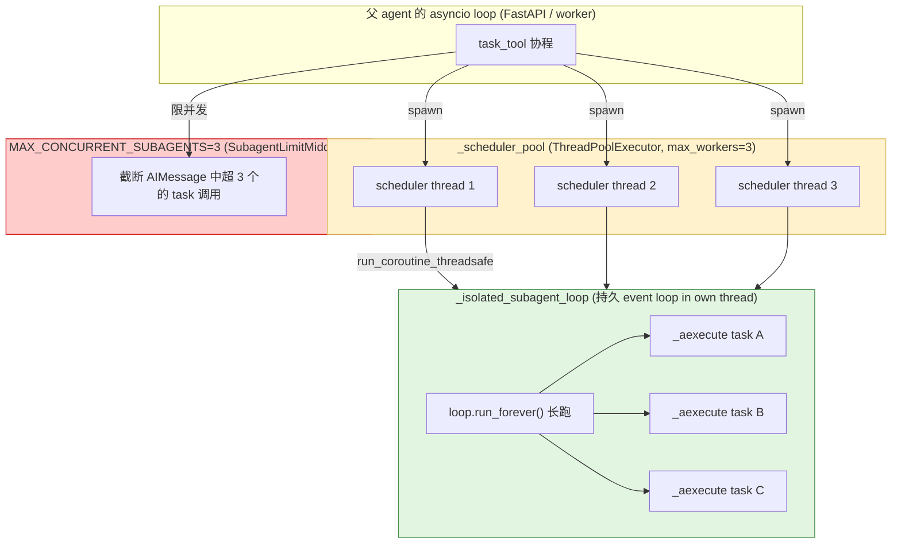
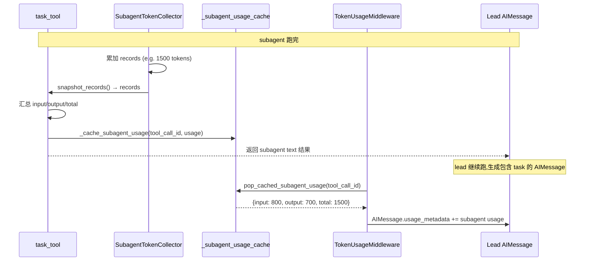

# 19 · 子智能体：双线程池调度 + 并发护栏 + Token 计费归并

> 核心模块层第 10 篇（收官）。**Subagent 是 DeerFlow 把"一个 LLM 任务"拆成"一个调度 LLM + 多个执行 LLM"** 的关键机制。
>
> 这一章把"task() 工具 → SubagentExecutor → 双线程池 → SSE 事件 → token 归并" 的完整链路拆透。关键看点：
> 1. **`_scheduler_pool` 与 isolated event loop 两层调度** 的角色分工
> 2. **`disallowed_tools=["task"]` 默认禁套娃** 的设计
> 3. **`SubagentTokenCollector` + tool_call_id 缓存** 让 subagent token 归并到主 agent 的 AIMessage（与 23 章 TokenUsageMiddleware 联动）
> 4. **15 分钟硬超时 + 5 秒轮询 + deferred cleanup** 的完整生命周期

---

## 🎯 学习目标

读完这份文档，你能回答：

1. **DeerFlow Subagent 系统为什么不直接用 LangGraph 原生 `Send(node, state)` fan-out**（03 章讲过）？两种方案的本质差异？
2. **`_scheduler_pool`（3 workers）+ `_isolated_subagent_loop`（持久 event loop）双层调度** —— 各自负责什么？为什么不能合并？
3. **`SubagentConfig.disallowed_tools = field(default_factory=lambda: ["task"])`** —— 这条默认值防止什么具体灾难？
4. **`_subagent_usage_cache: dict[str, dict]` 按 `tool_call_id` 缓存 subagent token usage** —— 这层缓存怎么和 TokenUsageMiddleware 协作，让 subagent 计费精确归并到 lead agent 的 AIMessage？
5. **SubagentResult 7 个 status**（pending / running / completed / failed / cancelled / timed_out）—— 每个对应什么真实场景？deferred cleanup 解决什么 race condition？

---

## 🗂️ 源码定位

| 关注点 | 文件 / 行号 | 关键锚点 |
|---|---|---|
| 子智能体模块入口 | `packages/harness/deerflow/subagents/__init__.py` | 6 个公共导出 |
| `SubagentConfig` 配置 dataclass | `packages/harness/deerflow/subagents/config.py` | `disallowed_tools=["task"]` L24；`resolve_subagent_model_name` L41 |
| `SubagentExecutor` 核心 | `packages/harness/deerflow/subagents/executor.py` | `SubagentStatus` enum L42；`SubagentResult` L52；`_scheduler_pool` L89；`_isolated_subagent_loop` L94+；`MAX_CONCURRENT_SUBAGENTS=3` L749；`execute` / `execute_async` |
| Token 计费回收 | `packages/harness/deerflow/subagents/token_collector.py` | `SubagentTokenCollector(BaseCallbackHandler)`；`on_llm_end`（按 run_id 去重） |
| 注册表 + 3 级 resolution | `packages/harness/deerflow/subagents/registry.py` | `BUILTIN_SUBAGENTS`；`get_subagent_config`（built-in → custom → per-agent override）；`get_available_subagent_names`（host bash filter） |
| 内建子智能体 | `packages/harness/deerflow/subagents/builtins/` | `general_purpose.py`；`bash_agent.py` |
| `task()` 工具入口 | `packages/harness/deerflow/tools/builtins/task_tool.py` | `_subagent_usage_cache`；`pop_cached_subagent_usage`；`_await_subagent_terminal`（5s 轮询）；`_deferred_cleanup_subagent_task` |
| SubagentLimit 闸门（11 章） | `packages/harness/deerflow/agents/middlewares/subagent_limit_middleware.py` | `after_model` 截断超额 `task` 调用 |
| TokenUsage 归并（23 章） | `packages/harness/deerflow/agents/middlewares/token_usage_middleware.py` | 用 `pop_cached_subagent_usage` 把 cache 写回 lead 的 AIMessage |

---

## 🧭 架构图

### 1. 完整调用链：从 `task()` 调用到 subagent 完成

```mermaid
sequenceDiagram
    autonumber
    participant LLM as Lead LLM
    participant Tool as task() tool
    participant Limit as SubagentLimitMiddleware
    participant Sched as _scheduler_pool (3 workers)
    participant Exec as SubagentExecutor
    participant Loop as isolated event loop
    participant Sub as Subagent LLM
    participant TC as SubagentTokenCollector
    participant Cache as _subagent_usage_cache
    participant TUM as TokenUsageMiddleware

    LLM->>Tool: tool_call task(subagent_type='general-purpose', task='...')<br/>(可能同一 AIMessage 多个 task)
    Tool->>Limit: after_model 检查并发上限
    Limit-->>Tool: 截断超 3 个的 task 调用

    Tool->>Exec: SubagentExecutor(config, parent_model, parent_state)
    Exec->>Sched: execute_async(task) → task_id
    Tool-->>LLM: 立即返回 task_id (异步)

    par 后台执行
        Sched->>Loop: _submit_to_isolated_loop_in_context(_aexecute)
        Loop->>Exec: _aexecute(task)
        Exec->>Sub: 创建独立 agent + 喂初始 state
        Sub->>TC: 每次 LLM 调用 → on_llm_end
        TC->>TC: 记录 usage_metadata (按 run_id 去重)
        Sub-->>Exec: 最终结果
        Exec-->>Sched: SubagentResult(status=COMPLETED, token_usage_records=...)
    and 前台轮询
        Tool->>Tool: _await_subagent_terminal: while not terminal:<br/>  sleep(5); get_background_task_result(task_id)
    end

    Tool->>Cache: _cache_subagent_usage(tool_call_id, usage)
    Tool-->>LLM: 返回 subagent 结果

    Note over LLM,TUM: 主 agent 继续跑,生成包含 task 工具结果的 AIMessage
    TUM->>Cache: pop_cached_subagent_usage(tool_call_id)
    Cache-->>TUM: 取出 subagent usage
    TUM->>TUM: 加到 lead AIMessage.usage_metadata
```

### 2. 双线程池架构



### 3. SubagentStatus 状态机

```mermaid
stateDiagram-v2
    [*] --> PENDING: execute_async() 创建 SubagentResult
    PENDING --> RUNNING: scheduler 拉到任务,启动 _aexecute
    RUNNING --> COMPLETED: agent 正常返回结果
    RUNNING --> FAILED: agent 抛异常
    RUNNING --> CANCELLED: cancel_event.set() + scheduler 感知
    RUNNING --> TIMED_OUT: 超过 timeout_seconds (默认 900s)
    COMPLETED --> [*]: cleanup_background_task
    FAILED --> [*]
    CANCELLED --> [*]: deferred_cleanup 等真正退出
    TIMED_OUT --> [*]

    note right of CANCELLED: cancel 信号发出 ≠ 立即终止<br/>需要 deferred poll 等执行线程真正退出
```



---

## 🔍 核心逻辑讲解

### Part 1 · 为什么不用 LangGraph 原生 `Send`

03 章讲过 LangGraph `Send(node, state)` —— 同 super-step 内 fan-out 多个并发节点，reducer 合并结果。**为什么 DeerFlow 不用？**

| 维度 | LangGraph `Send` 原生方案 | DeerFlow `SubagentExecutor` 方案 |
|---|---|---|
| 上下文隔离 | 共享主 state | 完全独立 thread / state |
| 子任务工具集 | 必须共享主 agent 的 tools | 可配置（含禁用 task 防套娃） |
| 超时管理 | 无原生 | 15 分钟硬超时 |
| 取消语义 | 协程取消传播 | `cancel_event` + 异步 thread 协作 |
| 进度可见 | super-step 末才能见 | 5s 轮询，SSE custom event 流出 `task_running` / `task_completed` |
| token 计费 | 各自统计在 state，需手动归并 | SubagentTokenCollector 自动收集 + cache 回归 lead |
| 错误隔离 | 一个失败影响 reducer | 失败封装为 SubagentResult.error，主 agent 继续 |
| 适合场景 | "纯计算"并发（如同时调 N 个 API） | "智能体"并发（每个自己有 LLM + 工具 + 思考） |

→ **核心区别**：`Send` 是**节点级并发**（同 graph 内 fan-out 普通函数节点），**SubagentExecutor 是 agent 级并发**（每个 subagent 是个完整的小型 agent，自己有 LLM 调用 / 工具调用 / state）。

**面试金句**：
> **"`Send` 给你"100 个 worker 函数并发"，SubagentExecutor 给你"100 个独立 agent 实例并发"** —— 完全不同的 abstraction level。

### Part 2 · 双线程池的角色分工

#### `_scheduler_pool` —— 任务调度

```python
_scheduler_pool = ThreadPoolExecutor(max_workers=3, thread_name_prefix="subagent-scheduler-")
```

**职责**：从 `task_tool` 派出来的 subagent 请求，进入 scheduler 线程做"orchestration"：
- 准备 task_id / trace_id
- 检查 cancel_event
- 把任务**提交**到 isolated event loop
- 处理超时 + 异常封装
- 写入 `_background_tasks` 全局字典

**为什么是线程池而不是 asyncio.Task？** 因为 scheduler 要做的事**有阻塞操作**（等 future / 调底层 thread join），开个独立线程比 await 干净。

**max_workers=3** 与 `MAX_CONCURRENT_SUBAGENTS` 巧合一致 —— 不是强约束，但保持节奏一致。

#### `_isolated_subagent_loop` —— 持久 event loop

```python
_isolated_subagent_loop: asyncio.AbstractEventLoop | None = None
_isolated_subagent_loop_thread: threading.Thread | None = None
```

**职责**：所有 subagent 的 `_aexecute(task)` 实际执行 —— 一个**全局共享的、长跑的** asyncio event loop，运行在自己的线程里。

**为什么需要独立 loop？**

当 task_tool 被 lead agent 的 worker 协程调用时，**worker 自己已经在一个 asyncio loop 里**了。这时候 subagent 也需要 asyncio（LangChain 工具大多 async）。两个选项：

| 方案 | 问题 |
|---|---|
| **在 worker 的同一 loop 跑 subagent** | subagent 内部 `asyncio.run` 会冲突；且 subagent 的异步任务会和 worker 的其它任务**抢同一 event loop**，互相阻塞 |
| **每次 subagent 调用创建新 loop** | 每次创建/销毁 loop 几十 ms 开销；且 loop 里的 async resources（如 httpx client）跨 loop 不能复用 |
| **DeerFlow 选：一个持久 loop 全局共享** | 隔离 + 资源复用 + 启动一次 |

#### 跨 loop 提交：`run_coroutine_threadsafe`

scheduler thread（不在任何 loop 里）→ 提交 coroutine 到 isolated loop（在另一 thread 里跑）：

```python
def _submit_to_isolated_loop_in_context(coro_fn, *args, **kwargs):
    loop = _get_isolated_subagent_loop()
    ctx = copy_context()                          # ⭐ 复制当前 contextvar 上下文
    def runner():
        return ctx.run(asyncio.run_coroutine_threadsafe, coro_fn(*args, **kwargs), loop)
    ...
```

**`copy_context()` 是关键** —— ContextVar（如 user_id）跨线程**默认不传播**。`copy_context().run(...)` 把父协程的 context **复制到子线程**，再用 `run_coroutine_threadsafe` 提交到 isolated loop。**16 章 `make_sync_tool_wrapper` 缺这一步是个潜在 PR**，这里 subagent 路径做对了。

### Part 3 · `SubagentConfig` 与 3 级 resolution

#### 默认值

```python
@dataclass
class SubagentConfig:
    name: str
    description: str
    system_prompt: str | None = None
    tools: list[str] | None = None
    disallowed_tools: list[str] | None = field(default_factory=lambda: ["task"])  # ⭐ 防套娃
    skills: list[str] | None = None
    model: str = "inherit"
    max_turns: int = 50
    timeout_seconds: int = 900
```

#### `disallowed_tools=["task"]` 防套娃

**真实场景**：
- Lead agent 用 `task()` 调 subagent
- 如果 subagent 也能 `task()` → 再调 sub-sub-agent → 套娃
- 5 层套娃 × 每层 3 个 subagent → 3^5 = 243 个并发 LLM 调用 → 成本爆炸 + 调用栈不可控

**默认 disallow `task` 是个 fail-safe 设计**。
**例外**：高级用户可以在自定义 subagent 配置里**显式**清空 `disallowed_tools=[]`，但需要明确知道后果。

#### 3 级 resolution

```python
def get_subagent_config(name, *, app_config=None):
    # ① built-in (BUILTIN_SUBAGENTS dict)
    config = BUILTIN_SUBAGENTS.get(name)
    if config is None:
        # ② custom_agents (从 config.yaml subagents.custom_agents 来)
        config = _build_custom_subagent_config(name, app_config=app_config)
    if config is None:
        return None

    # ③ per-agent overrides (从 config.yaml subagents.agents.<name> 来)
    agent_override = subagents_config.agents.get(name)
    overrides = {}
    if agent_override and agent_override.timeout_seconds:
        overrides["timeout_seconds"] = agent_override.timeout_seconds
    # ... max_turns / model / skills 同理

    if overrides:
        config = replace(config, **overrides)    # dataclass.replace 不可变更新
    return config
```

**3 级优先**：
1. **Built-in**：DeerFlow 自带，最基础（`general-purpose` / `bash`）
2. **custom_agents**：用户在 `config.yaml.subagents.custom_agents.{name}` 完全自定义
3. **per-agent overrides**：在 `config.yaml.subagents.agents.{name}` 局部覆盖（如把 general-purpose 的 timeout 改成 600）

**全局默认 vs 自定义代理的微妙差异**：
- `timeout_seconds` / `max_turns` 全局默认**只覆盖 built-in**（不影响 custom_agents 自己的值）
- `model` / `skills` 全局没默认，只能 per-agent

→ **这是个深思熟虑的 layering 设计**：built-in 是"基础设施可调"，custom_agents 是"完全用户控制"，per-agent 是"再做精细 tuning"。

### Part 4 · Token 计费归并机制

#### `SubagentTokenCollector` —— LangChain callback handler

```python
class SubagentTokenCollector(BaseCallbackHandler):
    def __init__(self, caller: str):
        self.caller = caller
        self._records: list[dict] = []
        self._counted_run_ids: set[str] = set()

    def on_llm_end(self, response, *, run_id, tags=None, **kwargs):
        rid = str(run_id)
        if rid in self._counted_run_ids:
            return                                     # ⭐ 同 run_id 去重

        for generation in response.generations:
            for gen in generation:
                if not hasattr(gen, "message"):
                    continue
                usage = getattr(gen.message, "usage_metadata", None)
                # ... 提取 input_tokens / output_tokens / total_tokens
                if total_tk <= 0:
                    continue
                self._counted_run_ids.add(rid)
                self._records.append({...})
                return                                  # ⭐ 一个 generation 算一次,避免重复
```

**作为 LangChain callback**：注入 subagent agent 的 RunnableConfig 的 callbacks 链 → 每次 LLM 调用结束自动触发 `on_llm_end`。

**两重去重**：
1. `_counted_run_ids` —— 同一 LangChain run_id 多个 generation 只算一次
2. `return` 第一个 valid generation 后立刻退出 —— 防止同一调用的多个候选 generation 重复计

#### `_subagent_usage_cache` —— 跨抽象层的桥梁

打开 `task_tool.py` L34：

```python
_subagent_usage_cache: dict[str, dict[str, int]] = {}


def _token_usage_cache_enabled(app_config) -> bool:
    if app_config is None:
        try:
            app_config = get_app_config()
        except FileNotFoundError:
            return False
    return bool(getattr(getattr(app_config, "token_usage", None), "enabled", False))


def _cache_subagent_usage(tool_call_id, usage, *, enabled=True):
    if enabled and usage:
        _subagent_usage_cache[tool_call_id] = usage


def pop_cached_subagent_usage(tool_call_id) -> dict | None:
    return _subagent_usage_cache.pop(tool_call_id, None)
```

**调用流程**：



**两点工程价值**：
1. **`tool_call_id` 作为 key** —— LangChain 每个 tool_call 都有唯一 id，对应一个 subagent 调用。**用它作 key 比 task_id 准** —— TokenUsage middleware 看到的是 tool_call_id（在 AIMessage.tool_calls 里），不一定能拿到 task_id
2. **`pop` 而不是 `get`** —— 取出后立即从 cache 删除。**防止下一轮重复计** + **防长会话 cache 累积内存泄露**

**`_token_usage_cache_enabled`** 守门：只在配置 `token_usage.enabled=True` 时启用，避免没必要的 cache 占用。

### Part 5 · `SubagentResult` 状态机的 race condition

#### CANCELLED → deferred cleanup

```python
async def _deferred_cleanup_subagent_task(task_id, trace_id, max_polls):
    cleanup_poll_count = 0
    while True:
        result = get_background_task_result(task_id)
        if result is None:
            return
        if _is_subagent_terminal(result):
            cleanup_background_task(task_id)
            return
        if cleanup_poll_count >= max_polls:
            logger.warning(f"Deferred cleanup for task {task_id} timed out after {cleanup_poll_count} polls")
            return
        cleanup_poll_count += 1
        await asyncio.sleep(...)
```

**race condition**：用户点击 cancel → 设置 `cancel_event` → 但**subagent 内部可能正在等一个长 LLM 调用**（无法立刻响应）→ 状态变 `CANCELLED` 但**线程还没真正退出**。

如果立即 `cleanup_background_task(task_id)` 删除 SubagentResult →
1. 主 agent 继续跑，再 call `task_tool.lookup(task_id)` 拿结果 → 返回 None → 不知道到底失败还是成功
2. subagent 线程内部还在跑（不知道自己被 cancel 了），输出到一个**已经被 gc 的 SubagentResult**

**`_deferred_cleanup_subagent_task`** 异步轮询直到 status 变 `_is_subagent_terminal`（即 COMPLETED/FAILED/CANCELLED/TIMED_OUT 之一**且**`completed_at` 已设置）才真删 cache。

#### 7 个 status 的语义

| status | 触发场景 |
|---|---|
| `PENDING` | execute_async 刚创建，scheduler 还没拉到 |
| `RUNNING` | scheduler 拉到，正在跑 |
| `COMPLETED` | agent 正常返回 |
| `FAILED` | agent 抛异常 |
| `CANCELLED` | `cancel_event.set()` + scheduler 感知 |
| `TIMED_OUT` | 超过 `timeout_seconds` |

**注**：源码中 `SubagentStatus` enum 实际只有 6 个（PENDING/RUNNING/COMPLETED/FAILED/CANCELLED/TIMED_OUT），与 09 章的 RunStatus 一一对应（都是无 rolled_back 状态）。

### Part 6 · 内建 2 个 subagent

#### `general-purpose`（`subagents/builtins/general_purpose.py`）

- 拥有除 `task` 之外的所有工具
- 用于"通用研究 / 多步分析"
- 默认 skills 继承父 agent

#### `bash`（`subagents/builtins/bash_agent.py`）

- 只用 bash 工具
- 用于"专攻 shell 命令"
- **`get_available_subagent_names` 过滤**：如果 `is_host_bash_allowed=False`（LocalSandbox 默认）→ bash subagent 不暴露给 lead

→ 这与 15 章 `LOCAL_BASH_SUBAGENT_DISABLED_MESSAGE` 配套 —— **safe-by-default**。

### Part 7 · 与 SubagentLimitMiddleware 的协作（11 章呼应）

```python
MAX_CONCURRENT_SUBAGENTS = 3
```

**SubagentLimitMiddleware（11/13 章已讲）** 在 `after_model` 钩子检查 AIMessage 的 tool_calls 数量 —— 如果一次 emit 多于 3 个 `task` 调用，**截断为前 3 个**。

**为什么放 `after_model` 而不是 `wrap_tool_call`？**
- `wrap_tool_call` 是逐 tool 拦截，**LangGraph 已经并行启动了所有 tool**，截断为时已晚（4-N 个工具已经在跑）
- `after_model` 看到完整 AIMessage，能在 LangGraph 路由到 tool node **之前** 改 tool_calls 列表

**这是个"全局并发护栏"的精妙位置选择**。

---

## 🧩 体现的通用 Agent 设计模式

| 模式 | Subagent 系统中的体现 |
|---|---|
| **Two-pool Scheduling**（双池调度） | scheduler_pool + isolated_loop 分工 |
| **Persistent Event Loop**（持久 event loop） | 全局共享 loop 而不是 per-call new |
| **ContextVar Propagation**（上下文传播） | `copy_context().run` 跨线程传 user_id |
| **Anti-recursion Default**（防套娃） | `disallowed_tools=["task"]` 默认 |
| **Layered Config Resolution** | built-in → custom_agents → per-agent overrides 3 级 |
| **Callback-based Token Collection** | LangChain BaseCallbackHandler 自动捕获 |
| **Inter-layer Bridging via tool_call_id** | `_subagent_usage_cache` 跨抽象层桥接 |
| **Deferred Cleanup with Race Window** | cancel 后等真正退出再 gc 防 dangling read |
| **Polling-based State Inspection** | 5s 轮询 `get_background_task_result` |
| **Capability Filter at Discovery** | `get_available_subagent_names` 过滤 bash |

---

## 🧱 与 Agent Harness 六要素的对应关系

| 六要素 | Subagent 系统怎么提供基础设施 |
|---|---|
| ① 反馈循环 | Subagent 自己有完整 ReAct 循环；主 agent 通过 `task` 调用 + 轮询接收反馈 |
| ② 记忆持久化 | Subagent 完成后结果回到主 state；通过 _subagent_usage_cache 跨抽象层桥接 |
| ③ 动态上下文 | Subagent 完全独立上下文 —— 防止主对话被 subagent 内部讨论污染 |
| ④ 安全护栏 | disallowed_tools 防套娃；MAX_CONCURRENT_SUBAGENTS 限并发；timeout 限时长；bash subagent 在 LocalSandbox 默认禁 |
| ⑤ 工具集成 | Subagent 自己有完整工具集（可配置子集） |
| ⑥ 可观测性 | trace_id 关联父/子；SSE 流出 task_started / task_running / task_completed；token usage 精确回归 |

---

## ⚠️ 常见坑与调试技巧

### 坑 1 · 套娃没禁但用户开 `disallowed_tools=[]`

**症状**：subagent 又能 `task` → 5 层后 LLM 调用爆炸 + cost 失控。
**调试**：log `[trace=X] Subagent {name} ...` 看 trace 树的深度。
**修复**：明确告诉用户**不要清空 disallowed_tools**；或在 `SubagentConfig.__post_init__` 加强制保护：`if "task" not in disallowed_tools and not self._opted_in_recursion: warn(...)`。

### 坑 2 · ContextVar 跨线程丢失（与 16 章呼应）

`_submit_to_isolated_loop_in_context` 用 `copy_context().run(...)` 复制 contextvars 到 isolated loop。**如果你 fork 一个 subagent 路径**没做这一步 → subagent 内部拿不到 user_id / app_config override。
**调试**：subagent 内 `logger.info("user_id=%s", get_effective_user_id())` 看是否为 "default"（contextvar 默认值）。

### 坑 3 · 计费不准 —— `tool_call_id` 拼错

**症状**：subagent 跑了 5000 tokens，但 lead AIMessage 的 usage_metadata 没增加。
**原因**：`_subagent_usage_cache[tool_call_id] = usage` 写入时的 tool_call_id 和 TokenUsageMiddleware `pop_cached_subagent_usage(tool_call_id)` 读时的 tool_call_id 不一致。
**调试**：在 cache 写入和 pop 处加 log，对比 id 是否相同。
**真实场景**：LangChain 中间件改 AIMessage 时**没保留原 id**（07 章 SubagentLimit / DanglingToolCall 同类型 bug） → tool_calls 也跟着换 id。

### 坑 4 · CANCELLED 后立即清 cache → 主 agent 看不到结果

见 Part 5 race condition。**不要直接 `cleanup_background_task`**，永远走 `_deferred_cleanup_subagent_task` 异步轮询。

### 坑 5 · `_isolated_subagent_loop` 在 atexit 没 graceful shutdown

```python
def _shutdown_isolated_subagent_loop():
    ...
    thread.join(timeout=1)
    if thread.is_alive():
        logger.info("Skipping close of isolated subagent loop because shutdown did not complete within timeout ...")
```

**症状**：进程退出时偶发 "RuntimeError: Event loop is closed" 警告。
**原因**：subagent 线程中有未完成的 async resource（如 httpx client）。
**修复**：设计 subagent 时**主动**关闭 async resources（with statement / finally close）。

---

## 🛠️ 动手实操

> 本 demo 不用真 LLM，模拟一个 fake subagent 跑一遍。

### Demo · Subagent 调度与状态机实测

```python
"""
Subagent 系统 demo.

跑法:  PYTHONPATH=backend uv run python scripts/subagent_walkthrough.py
"""
import sys, os, time
from pathlib import Path
from dataclasses import replace
from unittest.mock import patch

sys.path.insert(0, "backend")
sys.path.insert(0, "backend/packages/harness")
os.chdir(Path(__file__).resolve().parents[1])

from deerflow.subagents.config import SubagentConfig, resolve_subagent_model_name
from deerflow.subagents.registry import (
    get_subagent_config, list_subagents, get_subagent_names,
    get_available_subagent_names, BUILTIN_SUBAGENTS,
)
from deerflow.subagents.token_collector import SubagentTokenCollector


# ====== Case 1: BUILTIN_SUBAGENTS 注册表 ======
print("\n" + "=" * 70)
print("CASE 1 · BUILTIN_SUBAGENTS 注册表")
print("=" * 70)
print(f"  内建 subagent: {list(BUILTIN_SUBAGENTS.keys())}")
for name, cfg in BUILTIN_SUBAGENTS.items():
    print(f"  {name}:")
    print(f"    description: {cfg.description[:60]}...")
    print(f"    disallowed_tools: {cfg.disallowed_tools}")
    print(f"    timeout_seconds: {cfg.timeout_seconds}")


# ====== Case 2: 3 级 resolution ======
print("\n" + "=" * 70)
print("CASE 2 · 3 级 resolution: built-in → custom → per-agent override")
print("=" * 70)

cfg = get_subagent_config("general-purpose")
print(f"  built-in 'general-purpose': timeout={cfg.timeout_seconds}, model={cfg.model}")

# 不存在的名字
nonexistent = get_subagent_config("nonexistent-subagent")
print(f"  不存在的名字 → {nonexistent}")


# ====== Case 3: disallowed_tools 默认防套娃 ======
print("\n" + "=" * 70)
print("CASE 3 · disallowed_tools 默认防套娃")
print("=" * 70)

minimal = SubagentConfig(name="test", description="test")
print(f"  default disallowed_tools = {minimal.disallowed_tools}  (期望 ['task'])")
print(f"  ⭐ 用户必须显式覆盖才能让 subagent 套娃")


# ====== Case 4: model resolution ======
print("\n" + "=" * 70)
print("CASE 4 · model 解析:'inherit' / 显式名 / 全局默认")
print("=" * 70)

cfg_inherit = SubagentConfig(name="x", description="x", model="inherit")
cfg_explicit = SubagentConfig(name="y", description="y", model="gpt-4o-mini")

try:
    inherited = resolve_subagent_model_name(cfg_inherit, parent_model="claude-3.5-sonnet")
    print(f"  inherit + parent='claude-3.5-sonnet' → {inherited!r}")

    explicit = resolve_subagent_model_name(cfg_explicit, parent_model="claude-3.5-sonnet")
    print(f"  显式 gpt-4o-mini + parent → {explicit!r}")

    # parent 为 None,从 config 默认拿
    from deerflow.config.app_config import get_app_config
    no_parent = resolve_subagent_model_name(cfg_inherit, parent_model=None)
    default_name = get_app_config().models[0].name if get_app_config().models else None
    print(f"  inherit + parent=None → {no_parent!r}  (期望 = config.models[0] = {default_name!r})")
except Exception as e:
    print(f"  ⚠️ {type(e).__name__}: {e}")


# ====== Case 5: host bash 过滤 ======
print("\n" + "=" * 70)
print("CASE 5 · get_available_subagent_names 过滤 bash")
print("=" * 70)

all_names = get_subagent_names()
visible = get_available_subagent_names()
print(f"  all_names: {all_names}")
print(f"  visible: {visible}")
diff = set(all_names) - set(visible)
print(f"  被过滤的: {diff}  (LocalSandbox 默认时应含 'bash')")


# ====== Case 6: TokenCollector 去重 ======
print("\n" + "=" * 70)
print("CASE 6 · SubagentTokenCollector 去重")
print("=" * 70)

class FakeMessage:
    def __init__(self, in_tk, out_tk):
        self.usage_metadata = {"input_tokens": in_tk, "output_tokens": out_tk, "total_tokens": in_tk + out_tk}

class FakeGen:
    def __init__(self, in_tk, out_tk):
        self.message = FakeMessage(in_tk, out_tk)

class FakeResponse:
    def __init__(self, gens):
        # response.generations 是 list[list[Gen]] (一层是 prompt batch,内层是 generations)
        self.generations = gens

tc = SubagentTokenCollector(caller="test-agent")

# 第 1 次:run_id=r1,100 + 50 tokens
resp1 = FakeResponse([[FakeGen(100, 50)]])
tc.on_llm_end(resp1, run_id="r1")
# 第 2 次:同 run_id=r1 → 应该去重不记
resp2 = FakeResponse([[FakeGen(99, 49)]])
tc.on_llm_end(resp2, run_id="r1")
# 第 3 次:new run_id=r2 → 记
resp3 = FakeResponse([[FakeGen(200, 80)]])
tc.on_llm_end(resp3, run_id="r2")

records = tc.snapshot_records()
print(f"  records: {records}")
print(f"  ✅ 期望 2 条 (r1 一次 + r2 一次,r1 重复被忽略)")


# ====== Case 7: _subagent_usage_cache 操作 ======
print("\n" + "=" * 70)
print("CASE 7 · _subagent_usage_cache 跨抽象层桥接")
print("=" * 70)

from deerflow.tools.builtins.task_tool import (
    _cache_subagent_usage, pop_cached_subagent_usage, _subagent_usage_cache,
)

# 模拟 task_tool 写入
fake_usage = {"input_tokens": 800, "output_tokens": 700, "total_tokens": 1500}
_cache_subagent_usage("tc-001", fake_usage, enabled=True)
print(f"  写入后 cache 大小: {len(_subagent_usage_cache)}")

# 模拟 TokenUsageMiddleware pop
popped = pop_cached_subagent_usage("tc-001")
print(f"  pop 结果: {popped}")
print(f"  pop 后 cache 大小: {len(_subagent_usage_cache)}  (期望 0,pop 删除)")

# 重复 pop:已删
popped_again = pop_cached_subagent_usage("tc-001")
print(f"  重复 pop: {popped_again}  (期望 None)")

# disabled 时不写入
_cache_subagent_usage("tc-002", fake_usage, enabled=False)
print(f"  disabled 写入后 cache 大小: {len(_subagent_usage_cache)}  (期望 0)")
```

### 调试任务

1. **断点位置**：
   - `executor.py::_submit_to_isolated_loop_in_context` 的 `copy_context()` 调用 —— 看是否复制 user_id
   - `token_collector.py::on_llm_end` 的 `_counted_run_ids` 判断 —— 看去重生效
   - `task_tool.py::_await_subagent_terminal` 的 5s sleep —— 看轮询
2. **观察什么**：
   - Case 1：BUILTIN_SUBAGENTS 应含 general-purpose / bash
   - Case 3：默认 disallowed_tools=["task"]
   - Case 5：LocalSandbox 配置下 bash 被过滤
   - Case 6：r1 第一次记，第二次去重；r2 新记
   - Case 7：pop 后 cache 清空，重复 pop 返回 None
3. **人为制造异常**：
   - Case 3 把 `SubagentConfig(... disallowed_tools=[])` → 看 default 不再生效（但你显式清空了，是有意为之）
   - Case 5 config.yaml 设 `sandbox.allow_host_bash: true` → 重跑看 bash 不被过滤

### 改造练习

1. **练习 A（简单）**：扩展 `SubagentTokenCollector` 加 `caller_chain` —— 当 subagent 调 sub-subagent（用户显式允许）时，记录调用链方便归因。
2. **练习 B（中等）**：实现 `SubagentResult.to_dict()` 序列化 —— 供 SSE event 流出给前端实时显示子任务进度。
3. **挑战题**：实现一个 "subagent priority queue" —— 当并发数已经 = 3 时，新 task 进队列等待，而不是被 SubagentLimitMiddleware 截断。注意：要避免 starvation + 加超时弹出。

### 预期输出 & 验证方式

- Case 1：内建 2 个
- Case 3：disallowed_tools=["task"]
- Case 5：LocalSandbox 时 bash 被过滤
- Case 6：records 长度 = 2
- Case 7：pop 后 cache 长度 = 0

---

## 🎤 面试视角

### 业务型大厂卷

**问 1**：DeerFlow 用 `_scheduler_pool` + `_isolated_subagent_loop` 双层调度。**生产监控时，你需要监控哪几个指标 + 阈值是多少**？

> **教科书答案**：
> 关键指标 + 阈值：
> 1. **`_scheduler_pool._work_queue.qsize()`** —— scheduler 队列积压；**> 5 报警**（说明 spawn 速率高于消费）
> 2. **`_background_tasks` size** —— 全局未清理任务数；**> 100 报警**（说明 cleanup 没及时跑或长任务堆积）
> 3. **平均 subagent 执行时长** —— 接近 timeout (900s) 时报警，说明任务太重应该拆
> 4. **`status=TIMED_OUT` 比例** —— 超过 5% 说明 timeout 设短了
> 5. **`status=CANCELLED` 比例** —— 突然飙升说明用户大量取消（前端 UX bug 或 backend 卡）
> 6. **`_isolated_subagent_loop` 健康** —— `thread.is_alive()` 应该永远 True；False 说明 loop 崩了 → 整个 subagent 系统挂
> **加分项**：建议加 Prometheus metrics，每个 subagent 类型（general-purpose / bash / custom-X）单独统计，便于看哪类型主问题。

**问 2**：`disallowed_tools=["task"]` 是个 fail-safe 默认。**给一个具体场景说明用户可能合理地需要嵌套 subagent**。怎么 enable 但仍保持安全？

> **教科书答案**：
> 合理嵌套场景：**"研究 → 综合"两层流水线**
> - lead agent："分析中美贸易关系"
> - 第 1 层 subagent "researcher"：fan-out 5 个 sub-subagent，每个研究一个细分（贸易额 / 关税 / 投资 / 科技 / 农产品）
> - 第 2 层 sub-subagent：用 web_search / read_file 等做单点研究
> 这种"分形分解"是合理的，但需要安全 enable：
> 1. **递归深度上限**：configurable `subagents.max_recursion_depth = 2`
> 2. **总 fan-out 上限**：configurable `subagents.global_fanout_limit = 12`（防止 3 × 5 = 15 个 sub-subagent 并发）
> 3. **token 预算限**：每个 subagent tree 总 token 上限（如 100K）
> 4. **trace_id 强制链路**：sub-subagent 必须把 trace_id 上传给父 trace，便于审计
> **DeerFlow 当前没这些**，但都是可加扩展。

### 创业型 AI 公司卷

**问 3**：DeerFlow `_subagent_usage_cache` 用 `tool_call_id` 跨抽象层桥接 token usage。**给一个具体场景**说明 lead agent 重试某个 task tool 调用时，这个 cache 会出什么 bug？怎么修？

> **参考答案**：
> 场景：**LLMErrorHandlingMiddleware 重试一次失败的 LLM 调用**（13 章）
> 1. 第一次 model_call → AIMessage 含 `tool_call_id="tc-1"` 调 task
> 2. task 启动 → subagent 跑了一会 → tool_call_id="tc-1" 的 usage 已 cache
> 3. 中间网络抖动，LLMErrorHandling 重试 model_call
> 4. **新 model_call 生成新 AIMessage**，新 tool_call_id="tc-2"（不同 id）
> 5. lead 重新调 task → tc-2 → 新 subagent 跑完 → cache 添加 tc-2 entry
> 6. **TokenUsageMiddleware pop("tc-2") → 拿到 tc-2 usage；tc-1 cache 永远不被 pop**
> 7. → cache 内存泄露 + tc-1 那次 subagent token 没被记账
>
> 修复：
> 1. **加 TTL** —— cache 条目 60 分钟未 pop 自动清，配 log warning
> 2. **加锁 + 反查** —— 写 cache 时检查"是否有同样 task description 但不同 id 的已存在条目" → 视为重试 → 合并 token usage
> 3. **trace_id 也作为 key 的一部分** —— `(trace_id, tool_call_id)` 双键，重试时 trace_id 保持相同 → 自动合并
> **DeerFlow 当前是简单单 key + pop**，是个潜在 PR。

**问 4**：你团队接到 PRD："让 subagent 能向 lead agent 实时汇报进度"（不只是 task_started / task_completed）。**给一个完整设计**。

> **参考答案**：
> 设计：
> 1. **`SubagentResult` 加 `progress_messages: list[dict]`** —— 累积进度消息
> 2. **subagent 内部加 `report_progress(msg: str)` 工具** —— LLM 主动调用上报进度
> 3. **report_progress 工具实现**：从 runtime.context 拿 trace_id → 找到对应 SubagentResult → append progress_messages
> 4. **lead 流式拉取**：lead agent 每次轮询 `get_background_task_result` 时，比对 last_seen_progress_index → 流出新 progress 到 SSE custom event
> 5. **前端**：实时显示子任务进度条 + 文字描述
> 边界：
> - **progress 频率限制**：subagent 不能 1 秒 100 次 report —— 加 rate limit
> - **progress 历史上限**：append 但不要超过 100 条 → 超了 truncate 老的
> - **progress 内容安全**：不应允许 subagent 通过 progress 注入 prompt injection 到 lead → 用 `<progress>` tag 隔离
> **DeerFlow 当前没这个**，但架构上可以加 —— `task_tool` 已经在 5s 轮询 result，加上 progress diff 推送是自然延伸。

---

## 📚 延伸阅读

- **Anthropic Claude Agent SDK 的 SubAgent 文档**：https://docs.anthropic.com/en/docs/agents-and-tools/agent-sdk
  *看完后对照 DeerFlow，理解 DeerFlow 是 Claude SubAgent 哲学的 Python 实现。*
- **`asyncio.run_coroutine_threadsafe` 文档**：https://docs.python.org/3/library/asyncio-task.html#asyncio.run_coroutine_threadsafe
  *理解跨线程提交 coroutine 的标准用法。*
- **`contextvars.copy_context`**：https://docs.python.org/3/library/contextvars.html#contextvars.copy_context
  *理解为什么 `copy_context().run(...)` 跨线程传 contextvar。*
- **23 章 Token Usage 中间件**（未完成）：cache pop 的另一头。
- **15 章 Sandbox security**：`LOCAL_BASH_SUBAGENT_DISABLED_MESSAGE` 与 `get_available_subagent_names` 的过滤逻辑。

---

## 🎤 互动检查 —— 请回答这 3 个问题

> **两句话即可**。

1. **抽象设计题**：`_scheduler_pool` 和 `_isolated_subagent_loop` 都跑 subagent —— **用一句话区分**它们各自负责什么。再用一句话说明**合并成一个线程池会出什么问题**。
2. **机制理解题**：`SubagentTokenCollector` 用 `_counted_run_ids` 去重 + 找到第一个 valid generation 后**立即 return**。**用一句话说明**为什么 generation 内不要循环所有 entry 累加（而是只算第一个）。
3. **应用题**：你的同事提了 PR：把 `_subagent_usage_cache` 改成全局**永不过期** dict（永远累积）。**给两条理由**说明应该被拒绝。

回答后我们进入 **`20-long-term-memory.md`** —— 长期记忆：异步抽取 + 去重 + 多用户隔离。
