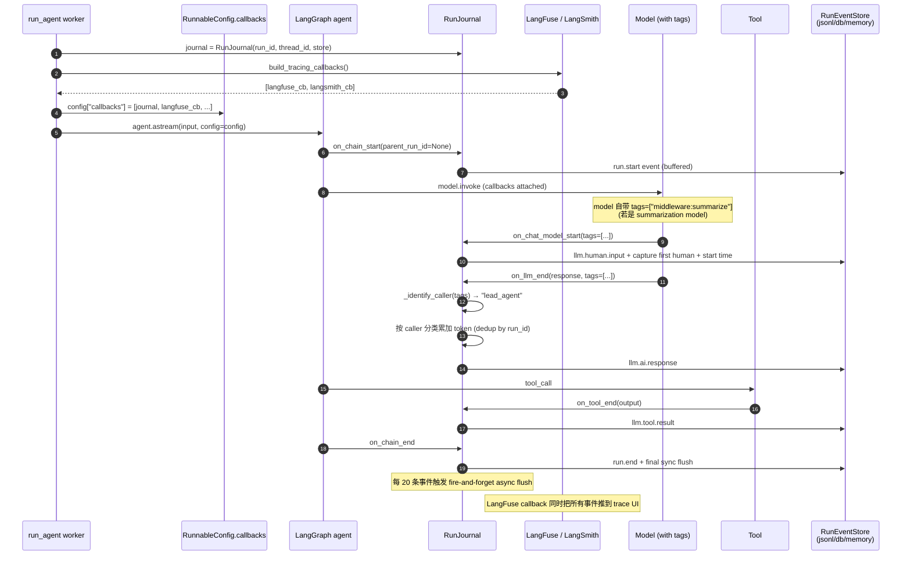
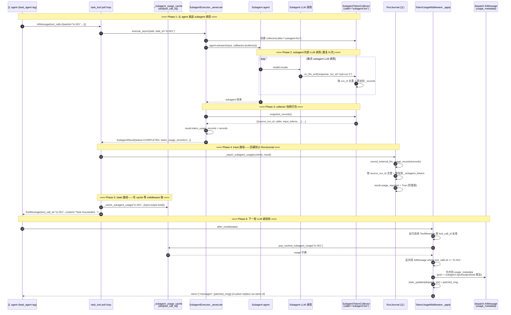

# 19 · Tracing & Observability：RunJournal + Token Usage + LangFuse

> 18 篇结尾说："Part H 的下一篇是可观测性"。这一章把 deer-flow 用来"看清楚 agent 内部发生了什么"的三件套讲清楚：**RunJournal**（LangChain callback 捕获事件 → 落库）+ **TokenUsageMiddleware**（state 层的 token 元数据 + write_todos action 抓取）+ **LangFuse/LangSmith tracing**（第三方 trace 服务集成）。
>
> 没有这一层，agent 出问题时只能靠 print debug。有了这一层，你能在 trace UI 里看到完整的 LLM 请求/响应、每次工具调用、token 在 lead/subagent/middleware 各自消耗了多少、消息历史如何演化——production agent 的"基础设施级"工程。

---

## 1. 模块定位（Why this matters）

deer-flow 的可观测性是**3 层正交**设计：

| 层 | 组件 | 职责 |
|----|------|------|
| **底层捕获** | `RunJournal`（LangChain BaseCallbackHandler） | 捕获 LLM 调用 / 工具调用 / chain 生命周期事件，6 个 token 累加桶 |
| **持久化** | `RunEventStore`（abstract）+ 3 实现（jsonl / db / memory） | 事件落盘；支持 message-only 查询 + 完整 event stream 查询 |
| **第三方 trace** | `tracing/factory.py`（LangFuse / LangSmith callback handler） | 把 callback 同时发给外部 trace 平台 |

外加 **TokenUsageMiddleware**——它和 RunJournal **不是替代关系**：

- **RunJournal**：在 LLM callback 层捕获，按 `caller tag` 分类（lead/subagent/middleware）——**trace 层观察**。
- **TokenUsageMiddleware**：在 state.messages 层操作——回灌 subagent token 到 dispatch AIMessage（17 篇见过）+ 给 write_todos 调用打 action 元数据让前端能展示 "complete X / start Y" 这种语义化进度。

不读这一章会错过 4 个关键认知：

1. **`tags=["middleware:summarize"]` 是 caller 识别的关键**：05 篇的 `_create_summarization_middleware` 给 summarization model 加了这个 tag——RunJournal 看到 tag 就知道"这次 LLM 调用是 summarization 中间件发的，不算 lead agent 的 token"。subagent 的 caller 标签来自 `SubagentTokenCollector(caller="subagent:foo")`（17 篇）。
2. **RunJournal 用 buffer + fire-and-forget async flush**：sync callback 里塞 buffer，达到 20 条触发异步写盘——避免 callback 阻塞 LLM 调用主路径。**`_pending_flush_tasks` 防并发写同一 SQLite**。
3. **RunEvent 有 8 字段 + category 分流**：`category=message` 给前端展示用 + `category=trace/outputs/error/lifecycle` 给 debug 用。前端 API（22 篇 Runs router）按 category 过滤。
4. **3 个 dedup set 防双重计数**：`_counted_llm_run_ids`（防 LangChain 重复触发 on_llm_end）/ `_counted_external_source_ids`（防 subagent 报多次）/ `_counted_message_llm_run_ids`（防消息摘要重复抓）。每个 set 防一种独立 race。

对应到 Harness 六要素：本章覆盖 **可观测性 + 反馈循环** 两条主线，是 deer-flow 区别于"教科书 agent"的工程深度证据。

---

## 2. 源码地图（Source Map）

### 2.1 关键文件清单

| 路径 | 角色 |
|------|------|
| [`packages/harness/deerflow/runtime/journal.py`](../packages/harness/deerflow/runtime/journal.py) | `RunJournal` 主体（500 行） |
| [`packages/harness/deerflow/runtime/events/store/base.py`](../packages/harness/deerflow/runtime/events/store/base.py) | `RunEventStore` 抽象（109 行） |
| [`packages/harness/deerflow/runtime/events/store/jsonl.py`](../packages/harness/deerflow/runtime/events/store/jsonl.py) | JSONL 落盘实现（187 行） |
| [`packages/harness/deerflow/runtime/events/store/db.py`](../packages/harness/deerflow/runtime/events/store/db.py) | SQLAlchemy 实现（309 行） |
| [`packages/harness/deerflow/runtime/events/store/memory.py`](../packages/harness/deerflow/runtime/events/store/memory.py) | In-memory 实现（128 行） |
| [`packages/harness/deerflow/runtime/events/store/__init__.py`](../packages/harness/deerflow/runtime/events/store/__init__.py) | `make_run_event_store(config)` 工厂 |
| [`packages/harness/deerflow/agents/middlewares/token_usage_middleware.py`](../packages/harness/deerflow/agents/middlewares/token_usage_middleware.py) | state 层 token 元数据（358 行） |
| [`packages/harness/deerflow/tracing/factory.py`](../packages/harness/deerflow/tracing/factory.py) | LangFuse / LangSmith 工厂（54 行） |
| [`packages/harness/deerflow/config/tracing_config.py`](../packages/harness/deerflow/config/tracing_config.py) | tracing config schema |
| [`packages/harness/deerflow/config/run_events_config.py`](../packages/harness/deerflow/config/run_events_config.py) | `RunEventsConfig` backend 选择 |
| [`packages/harness/deerflow/agents/lead_agent/agent.py:80`](../packages/harness/deerflow/agents/lead_agent/agent.py) | `model.with_config(tags=["middleware:summarize"])` |
| [`packages/harness/deerflow/runtime/runs/worker.py:224`](../packages/harness/deerflow/runtime/runs/worker.py) | `config.setdefault("callbacks", []).append(journal)` 注入 |

### 2.2 关键符号速查表

| 符号 | 文件:行 | 一句话职责 |
|------|---------|-----------|
| `class RunJournal(BaseCallbackHandler)` | `journal.py:38` | 主体 |
| `on_chain_start` | `journal.py:135` | parent_run_id is None → 发 run.start |
| `on_chain_end` | `journal.py:157` | run.end + sync flush |
| `on_chain_error` | `journal.py:161` | run.error + sync flush |
| `on_chat_model_start` | `journal.py:172` | capture first human + start time |
| `on_llm_end` | `journal.py:222` | llm.ai.response + token 累加 + dedup |
| `on_llm_error` | `journal.py:300` | llm.error trace |
| `on_tool_start / on_tool_end` | `journal.py:304 / 309` | llm.tool.result 事件 |
| `_put(event_type, category, content, metadata)` | `journal.py:332` | buffer 入口 |
| `_flush_sync()` | `journal.py:347` | 触发 async flush task |
| `_flush_async(batch)` | `journal.py:372` | put_batch + 失败回 buffer |
| `_identify_caller(tags)` | `journal.py:393` | tag 前缀匹配 |
| `record_external_llm_usage_records(records)` | `journal.py:405` | 17 篇见过：subagent token 回灌 |
| `_counted_llm_run_ids: set[str]` | `journal.py:73` | LangChain 重复 on_llm_end 防重 |
| `_counted_external_source_ids: set[str]` | `journal.py:74` | subagent 重复报告防重 |
| `_counted_message_llm_run_ids: set[str]` | `journal.py:75` | message summary 防重 |
| `class RunEventStore(ABC)` | `events/store/base.py:17` | 抽象 |
| `class JsonlRunEventStore` | `events/store/jsonl.py:29` | 文件落盘 |
| `class DBRunEventStore` | `events/store/db.py` | SQL backend |
| `class MemoryRunEventStore` | `events/store/memory.py` | dev/test |
| `_SAFE_ID_PATTERN` | `events/store/jsonl.py:26` | 路径安全白名单 |
| `_next_seq(thread_id)` | `events/store/jsonl.py:49` | 单调递增 seq |
| `class TokenUsageMiddleware(AgentMiddleware)` | `token_usage_middleware.py` | state 层补充 |
| `_apply(state)` | `token_usage_middleware.py:270` | 17 篇详谈 |
| `_build_todo_actions(prev, next)` | `token_usage_middleware.py:72` | write_todos 语义化 action |
| `TOKEN_USAGE_ATTRIBUTION_KEY = "token_usage_attribution"` | line 17 | 给 AIMessage 加的 metadata 键 |
| `build_tracing_callbacks()` | `tracing/factory.py:32` | LangFuse / LangSmith 工厂 |
| `_create_langfuse_handler(config)` | `tracing/factory.py:18` | langfuse Python SDK 接入 |
| `_create_langsmith_tracer(config)` | `tracing/factory.py:12` | LangChain 原生 tracer |
| `make_run_event_store(config)` | `events/store/__init__.py` | backend 选择 |
| `RunEventsConfig.backend = "memory"\|"jsonl"\|"db"` | `run_events_config.py` | yaml 配置项 |

### 2.3 事件捕获流程



### 2.4 3 个 dedup set 的"防重坐标系"

```mermaid
flowchart LR
    subgraph Sources[Token 来源]
        A[on_llm_end 直接捕获]
        B[record_external_llm_usage_records<br/>(subagent 调用)]
    end
    A -->|run_id| D1[_counted_llm_run_ids]
    B -->|source_run_id| D2[_counted_external_source_ids]
    A -->|run_id 做 message 摘要| D3[_counted_message_llm_run_ids]
    D1 --> Total[(_total_tokens<br/>_lead_agent_tokens<br/>_subagent_tokens<br/>_middleware_tokens)]
    D2 --> Total
    D3 --> Summary[(_last_ai_msg)]
```

**3 个 set 各防一种 race**：

| Set | 防的是什么 |
|-----|---------|
| `_counted_llm_run_ids` | LangChain callback 框架偶尔同一 run_id 触发 2 次 on_llm_end |
| `_counted_external_source_ids` | subagent 因 cancel/timeout 调多次 `record_external_llm_usage_records` |
| `_counted_message_llm_run_ids` | 一次 on_llm_end 处理多个 generation 时不重复抓 last_ai_msg |

---

## 3. 核心逻辑精读（Deep Dive）

### 3.1 RunJournal 的构造 + 6 个 token 累加桶

```python
# packages/harness/deerflow/runtime/journal.py:38-87 (节选)
class RunJournal(BaseCallbackHandler):
    """LangChain callback handler that captures events to RunEventStore."""

    def __init__(
        self,
        run_id: str,
        thread_id: str,
        event_store: RunEventStore,
        *,
        track_token_usage: bool = True,
        flush_threshold: int = 20,
    ):
        super().__init__()
        self.run_id = run_id
        self.thread_id = thread_id
        self._store = event_store
        self._track_tokens = track_token_usage
        self._flush_threshold = flush_threshold

        # Write buffer
        self._buffer: list[dict] = []
        self._pending_flush_tasks: set[asyncio.Task[None]] = set()

        # Token accumulators (6 buckets)
        self._total_input_tokens = 0
        self._total_output_tokens = 0
        self._total_tokens = 0
        self._llm_call_count = 0
        self._lead_agent_tokens = 0
        self._subagent_tokens = 0
        self._middleware_tokens = 0

        # Dedup (3 sets)
        self._counted_llm_run_ids: set[str] = set()
        self._counted_external_source_ids: set[str] = set()
        self._counted_message_llm_run_ids: set[str] = set()
        ...
```

**6 个 token 累加桶**：

| 字段 | 累加来源 |
|------|---------|
| `_total_input_tokens / _total_output_tokens / _total_tokens` | 所有 LLM 调用的总和 |
| `_llm_call_count` | LLM 调用次数 |
| `_lead_agent_tokens` | 主 agent LLM 调用 |
| `_subagent_tokens` | subagent LLM 调用 + 通过 record_external 注入的 |
| `_middleware_tokens` | summarization / title 等中间件 LLM 调用 |

**为什么需要细分**？因为 token cost 优化时要回答："这次会话钱花哪了"——是 lead 的多轮聊天、还是 subagent 在并发跑、还是 summarization 反复压缩。**4 个分类让 cost 报表立刻定位优化目标**。

### 3.2 `_identify_caller`：tag 前缀匹配

```python
# packages/harness/deerflow/runtime/journal.py:393-401
def _identify_caller(self, tags: list[str] | None) -> str:
    _tags = tags or []
    for tag in _tags:
        if isinstance(tag, str) and (tag.startswith("subagent:") or tag.startswith("middleware:") or tag == "lead_agent"):
            return tag
    # Default to lead_agent: the main agent graph does not inject
    # callback tags, while subagents and middleware explicitly tag themselves.
    return "lead_agent"
```

**约定 3 种 tag**：

| Tag | 谁打的 | 何时 |
|-----|--------|------|
| `lead_agent` | （不主动打，默认） | 主 agent LLM 调用 |
| `subagent:foo` | `SubagentTokenCollector(caller="subagent:foo")` | 17 篇 |
| `middleware:summarize` | `model.with_config(tags=["middleware:summarize"])` | 05 篇 `_create_summarization_middleware` |

**主 agent 不主动打 tag** —— 默认 `lead_agent` 的 fallback 是工程偷懒选择：让"绝大多数 LLM 调用"不带 tag 也能被正确分类。

**关键现场**（05 篇 `lead_agent/agent.py:80`）：

```python
model = create_chat_model(name=config.model_name, thinking_enabled=False, app_config=resolved_app_config)
model = model.with_config(tags=["middleware:summarize"])    # ← 关键这行
```

`model.with_config(tags=[...])` 是 LangChain Runnable 的内置 API——给模型套一层带 tag 的包装。这样每次该模型被调用时，LangChain 会把 tag 传给 callback。**tag 通过 model 实例携带，不需要每次显式传**。

### 3.3 `on_llm_end`：token 累加 + dedup

```python
# packages/harness/deerflow/runtime/journal.py:222-298 (节选)
def on_llm_end(
    self,
    response: Any,
    *,
    run_id: UUID,
    parent_run_id: UUID | None = None,
    tags: list[str] | None = None,
    **kwargs: Any,
) -> None:
    messages: list[AnyMessage] = []
    for generation in response.generations:
        for gen in generation:
            if hasattr(gen, "message"):
                messages.append(gen.message)

    for message in messages:
        caller = self._identify_caller(tags)

        rid = str(run_id)
        start = self._llm_start_times.pop(rid, None)
        latency_ms = int((time.monotonic() - start) * 1000) if start else None

        usage = getattr(message, "usage_metadata", None)
        usage_dict = dict(usage) if usage else {}

        call_index = self._llm_call_index
        if rid not in self._seen_llm_starts:
            self._llm_call_index += 1
            call_index = self._llm_call_index
            self._seen_llm_starts.add(rid)

        # Trace event: llm_response
        self._put(
            event_type="llm.ai.response",
            category="message",
            content=message.model_dump(),
            metadata={
                "caller": caller,
                "usage": usage_dict,
                "latency_ms": latency_ms,
                "llm_call_index": call_index,
            },
        )
        if rid not in self._counted_message_llm_run_ids:
            self._record_message_summary(message, caller=caller)

        # Token accumulation (dedup by run_id)
        if self._track_tokens:
            input_tk = usage_dict.get("input_tokens", 0) or 0
            output_tk = usage_dict.get("output_tokens", 0) or 0
            total_tk = usage_dict.get("total_tokens", 0) or 0
            if total_tk == 0:
                total_tk = input_tk + output_tk
            if total_tk > 0 and rid not in self._counted_llm_run_ids:
                self._counted_llm_run_ids.add(rid)
                self._total_input_tokens += input_tk
                self._total_output_tokens += output_tk
                self._total_tokens += total_tk
                self._llm_call_count += 1

                if caller.startswith("subagent:"):
                    self._subagent_tokens += total_tk
                elif caller.startswith("middleware:"):
                    self._middleware_tokens += total_tk
                else:
                    self._lead_agent_tokens += total_tk

    if messages:
        self._counted_message_llm_run_ids.add(str(run_id))
```

**5 个工程亮点**：

1. **`latency_ms` 跨 start/end 计算**：`_llm_start_times[rid] = time.monotonic()` 在 `on_chat_model_start` 设置；`on_llm_end` 取出来算差。`monotonic` 是单调时钟（不受系统时间调整影响）—— production 测延迟必须用它。
2. **`call_index` 全局单调递增**：`_llm_call_index` 是 run-internal 调用次数计数（第 1 次 / 第 2 次 LLM 调用），帮 trace UI 按调用顺序排列。fallback 处理：如果 on_chat_model_start 没触发（极少数 provider 不发），on_llm_end 也会自增。
3. **`total_tk == 0 → input + output`**：provider 不返回 total 时手算。**避免某些 provider（如部分 vLLM 部署）不算 total 导致 token 被忽略**。
4. **`run_id not in _counted_llm_run_ids` 防重计**：同一 run_id 偶尔会触发 2 次 on_llm_end（LangChain 框架边界）—— set 防重计 token。
5. **`messages` 单独一个 set `_counted_message_llm_run_ids`**：和 token 累加用不同 set——message summary 抓取的逻辑独立于 token 累加。**分开 dedup 让每种逻辑有自己的语义**。

### 3.4 `_put + _flush_sync + _flush_async`：buffer + 异步落盘

```python
# packages/harness/deerflow/runtime/journal.py:332-391
def _put(self, *, event_type: str, category: str, content: str | dict = "", metadata: dict | None = None) -> None:
    self._buffer.append({
        "thread_id": self.thread_id,
        "run_id": self.run_id,
        "event_type": event_type,
        "category": category,
        "content": content,
        "metadata": metadata or {},
        "created_at": datetime.now(UTC).isoformat(),
    })
    if len(self._buffer) >= self._flush_threshold:
        self._flush_sync()


def _flush_sync(self) -> None:
    """Best-effort flush of buffer to RunEventStore.

    BaseCallbackHandler methods are synchronous.  If an event loop is
    running we schedule an async ``put_batch``; otherwise the events
    stay in the buffer and are flushed later by the async ``flush()``
    call in the worker's ``finally`` block.
    """
    if not self._buffer:
        return
    # Skip if a flush is already in flight — avoids concurrent writes
    # to the same SQLite file from multiple fire-and-forget tasks.
    if self._pending_flush_tasks:
        return
    try:
        loop = asyncio.get_running_loop()
    except RuntimeError:
        # No event loop — keep events in buffer for later async flush.
        return
    batch = self._buffer.copy()
    self._buffer.clear()
    task = loop.create_task(self._flush_async(batch))
    self._pending_flush_tasks.add(task)
    task.add_done_callback(self._on_flush_done)


async def _flush_async(self, batch: list[dict]) -> None:
    try:
        await self._store.put_batch(batch)
    except Exception:
        logger.warning(
            "Failed to flush %d events for run %s — returning to buffer",
            len(batch),
            self.run_id,
            exc_info=True,
        )
        # Return failed events to buffer for retry on next flush
        self._buffer = batch + self._buffer
```

**5 个工程亮点**：

1. **callback 是 sync——但实际写盘是 async**：`BaseCallbackHandler` 接口要求 sync 方法，但 SQLAlchemy/aiosqlite 是 async。中间用 `loop.create_task` 桥接：sync 把 batch 抛出去、async task 异步写入。
2. **`flush_threshold=20`**：每 20 条事件批量写一次——折中 IO 频率和实时性。
3. **`if self._pending_flush_tasks: return` 防并发写**：注释说得很清楚——避免多个 fire-and-forget 任务同时往 SQLite 写，可能 lock 冲突。当前在跑就跳过这次（buffer 继续涨，下次再 flush）。
4. **失败回 buffer**：`self._buffer = batch + self._buffer`——前置放（保持原 seq 顺序）。下一次 flush 重试。
5. **`if loop.is_running(): create_task; else: 留 buffer`**：sync caller（例如测试场景没启 loop）直接保留 buffer——worker 的 `finally` block 会做一次最终 async flush 兜底（19 篇剩余部分讲）。

### 3.5 RunEvent 8 字段 + category 分流

```python
# packages/harness/deerflow/runtime/events/store/base.py:28-39 (节选 put 签名)
async def put(
    self,
    *,
    thread_id: str,
    run_id: str,
    event_type: str,
    category: str,
    content: str | dict = "",
    metadata: dict | None = None,
    created_at: str | None = None,
) -> dict:
```

每个事件 8 字段（+ store 自动加 `seq`）：

| 字段 | 类型 | 用途 |
|------|------|------|
| `thread_id` | str | thread 隔离 |
| `run_id` | str | run 隔离 |
| `event_type` | str | 例如 `run.start / llm.human.input / llm.ai.response / llm.tool.result / run.end / run.error` |
| `category` | str | `message / trace / outputs / error / lifecycle` |
| `content` | str/dict | 主体 payload |
| `metadata` | dict | caller / usage / latency 等 |
| `created_at` | ISO 字符串 | 时间戳 |
| `seq` | int | 单调递增（store 分配） |

**category 分流的好处**：

```python
# packages/harness/deerflow/runtime/events/store/base.py:50-65
async def list_messages(self, thread_id, *, limit=50, before_seq=None, after_seq=None) -> list[dict]:
    """Return displayable messages (category=message) for a thread, ordered by seq ascending."""
```

前端只想看"可显示消息"（人输入 / AI 输出 / 工具结果）—— `list_messages` 内部加 `WHERE category='message'`。debug 时想看全量 → `list_events`。**用一份 store 服务两类查询**，不需要双写。

`seq` 单调递增 → 支持 cursor pagination（`before_seq / after_seq`），不用 offset。**前端无限滚动不会跳消息**。

### 3.6 `RunEventStore` 3 实现的取舍

| 实现 | 适用 | 优点 | 缺点 |
|------|------|------|------|
| **`MemoryRunEventStore`** | 单元测试 / dev | 极快、无依赖 | 进程死了就丢 |
| **`JsonlRunEventStore`** | 单机轻量部署 | 简单、无 SQL 依赖、易诊断 | 跨 run 的 message 查询要扫所有文件 |
| **`DBRunEventStore`** | production / 多 worker | SQL 查询 + index、并发安全 | 需要 DB + alembic 迁移 |

#### JSONL 的"路径布局"

```python
# packages/harness/deerflow/runtime/events/store/jsonl.py:41-47
def _thread_dir(self, thread_id: str) -> Path:
    self._validate_id(thread_id, "thread_id")
    return self._base_dir / "threads" / thread_id / "runs"


def _run_file(self, thread_id: str, run_id: str) -> Path:
    self._validate_id(run_id, "run_id")
    return self._thread_dir(thread_id) / f"{run_id}.jsonl"
```

每 run 一个文件：`.deer-flow/threads/{thread_id}/runs/{run_id}.jsonl`。注释里诚实地说："`list_messages()` 必须扫所有 run 文件，`list_events()` 只读一个文件"——架构师不藏短板。

#### seq 单调递增的"crash recovery"

```python
# packages/harness/deerflow/runtime/events/store/jsonl.py:53-68
def _ensure_seq_loaded(self, thread_id: str) -> None:
    """Load max seq from existing files if not yet cached."""
    if thread_id in self._seq_counters:
        return
    max_seq = 0
    thread_dir = self._thread_dir(thread_id)
    if thread_dir.exists():
        for f in thread_dir.glob("*.jsonl"):
            for line in f.read_text(encoding="utf-8").strip().splitlines():
                try:
                    record = json.loads(line)
                    max_seq = max(max_seq, record.get("seq", 0))
                except json.JSONDecodeError:
                    logger.debug("Skipping malformed JSONL line in %s", f)
                    continue
    self._seq_counters[thread_id] = max_seq
```

**进程重启后**：第一次访问某 thread → 扫所有 .jsonl 找出最大 seq → 继续从那里递增。**保证 seq 在 thread 内永远单调**。**malformed line 容错跳过**——日志爆掉不影响后续。

#### 路径安全

`_SAFE_ID_PATTERN = re.compile(r"^[A-Za-z0-9_\-]+$")` —— 08 篇见过的同模式白名单。**防 thread_id="../../etc"** 这种穿越攻击。

### 3.7 `tracing/factory.py`：LangFuse / LangSmith 接入

```python
# packages/harness/deerflow/tracing/factory.py 全文
def _create_langsmith_tracer(config) -> Any:
    from langchain_core.tracers.langchain import LangChainTracer
    return LangChainTracer(project_name=config.project)


def _create_langfuse_handler(config) -> Any:
    from langfuse import Langfuse
    from langfuse.langchain import CallbackHandler as LangfuseCallbackHandler

    # langfuse>=4 initializes project-specific credentials through the client
    # singleton; the LangChain callback then attaches to that configured client.
    Langfuse(
        secret_key=config.secret_key,
        public_key=config.public_key,
        host=config.host,
    )
    return LangfuseCallbackHandler(public_key=config.public_key)


def build_tracing_callbacks() -> list[Any]:
    """Build callbacks for all explicitly enabled tracing providers."""
    validate_enabled_tracing_providers()
    enabled_providers = get_enabled_tracing_providers()
    if not enabled_providers:
        return []

    tracing_config = get_tracing_config()
    callbacks: list[Any] = []

    for provider in enabled_providers:
        if provider == "langsmith":
            callbacks.append(_create_langsmith_tracer(tracing_config.langsmith))
        elif provider == "langfuse":
            callbacks.append(_create_langfuse_handler(tracing_config.langfuse))

    return callbacks
```

**3 个工程亮点**：

1. **三方 callback 和 RunJournal 并列**：worker 把它们都塞 `config["callbacks"]`——每个 LLM 调用同时触发 RunJournal 落库 + LangFuse 推 trace。**两路同源数据**——本地有 + 远程也有。
2. **lazy import**：`from langfuse import ...` 在函数内部——没装 langfuse 包不会让模块加载失败。**可选依赖**。
3. **`validate_enabled_tracing_providers()`** 在最前面校验配置——故意写错 provider 名（例如 `"langsmt"`）启动期就报错，不到运行时。

**用户启用方式**（`config.yaml`）：

```yaml
tracing:
  enabled_providers: ["langfuse"]   # 或 ["langsmith"] 或两者都开
  langfuse:
    secret_key: $LANGFUSE_SECRET_KEY
    public_key: $LANGFUSE_PUBLIC_KEY
    host: https://cloud.langfuse.com
  langsmith:
    project: deer-flow-prod
```

启用后 LangFuse 仪表盘里能看到每个 thread / run 的完整调用树 + token cost。

### 3.8 `TokenUsageMiddleware` 的另一面：write_todos action 抓取

17 篇看过 `_apply` 里反查 subagent token 的部分。但 TokenUsageMiddleware 还有第二个职责——**给 write_todos 调用打 attribution metadata**，让前端能展示语义化的进度。

```python
# packages/harness/deerflow/agents/middlewares/token_usage_middleware.py:72-130 (节选)
def _build_todo_actions(previous_todos: list[Todo], next_todos: list[Todo]) -> list[dict[str, Any]]:
    """Single source of truth for precise write_todos token attribution."""
    previous_by_content: dict[str, list[tuple[int, Todo]]] = defaultdict(list)
    matched_previous_indices: set[int] = set()

    for index, todo in enumerate(previous_todos):
        content = todo.get("content")
        if isinstance(content, str) and content:
            previous_by_content[content].append((index, todo))

    actions: list[dict[str, Any]] = []

    for index, todo in enumerate(next_todos):
        content = todo.get("content")
        # ... 匹配 prev_by_content + index-based fallback ...

        if previous_match is not None:
            previous_content = previous_match.get("content")
            previous_status = previous_match.get("status")
            if previous_content == content and previous_status == todo.get("status"):
                continue        # 没变,不算 action

        actions.append({
            "kind": _todo_action_kind(previous_match, todo),
            "content": content,
        })

    # Removed todos
    for index, todo in enumerate(previous_todos):
        if index in matched_previous_indices:
            continue
        ...
        actions.append({"kind": "todo_remove", "content": content})

    return actions
```

**`_todo_action_kind`**：

```python
# packages/harness/deerflow/agents/middlewares/token_usage_middleware.py:50-69
def _todo_action_kind(previous: Todo | None, current: Todo) -> str:
    status = current.get("status")
    previous_content = previous.get("content") if previous else None
    current_content = current.get("content")

    if previous is None:
        if status == "completed":
            return "todo_complete"
        if status == "in_progress":
            return "todo_start"
        return "todo_update"

    if previous_content != current_content:
        return "todo_update"

    if status == "completed":
        return "todo_complete"
    if status == "in_progress":
        return "todo_start"
    return "todo_update"
```

**4 种 action kind**：`todo_start / todo_complete / todo_update / todo_remove`。

**为什么这么细**？因为前端展示 "complete X / start Y" 这种语义化进度比"updated todo list" 信息量大得多——但这种"diff"需要在 middleware 拿到 prev 和 next 两份 todos 做对比。`token_usage_middleware` 既然已经在 hook 里处理 write_todos 调用，顺便算 diff 写入 attribution。

`TOKEN_USAGE_ATTRIBUTION_KEY = "token_usage_attribution"`（行 17）—— attribution 写到 AIMessage 的 metadata 里，前端按这个 key 取数据展示。

---

## 4. 关键问题答疑（Key Questions）

### Q1：RunJournal 是 per-run 还是 per-thread？

per-run。看 worker 的注入逻辑：每个 run 创建独立的 RunJournal 实例传 `(run_id, thread_id, store)`——run 结束就 GC。**多个 run 各自独立累加 token，互不污染**。

### Q2：为什么 token 累加要按 caller 分桶，而不是只看 total？

production 用例：

- 用户抱怨某次对话特别贵。
- 看 trace 总 token 50k——但不知道是 lead 多轮 / 还是 subagent 跑了 10 个并发 / 还是 summarization 反复折叠。
- **分桶后**：`lead=5k, subagent=40k, middleware=5k`——立刻定位是 subagent fan-out 过多。

**没分桶 = 你只知道贵不知道为什么贵**。

### Q3：`_pending_flush_tasks` 真的会出现并发吗？sync callback 怎么并发？

callback 是 sync——但 deer-flow 跑在 asyncio loop 里，多个 LLM 调用并发（subagent 场景）会导致多个 callback 几乎同时触发 `_flush_sync`——它们都尝试 `loop.create_task` flush async task。

如果不防：

- 5 个并发触发 → 5 个 task 同时跑 `_store.put_batch(batch)` → 5 个 task 同时打开 SQLite → SQLite lock 冲突。

防御：`if self._pending_flush_tasks: return`—— 当前在跑就跳过，本次留 buffer 下次再 flush。**串行化写盘，buffer 自然累积**。

### Q4：LangFuse 集成会让 LLM 调用慢吗？

LangFuse SDK 是异步推送—— callback 把事件放队列、SDK 后台线程异步推到 LangFuse 服务端。**LLM 调用本身不被阻塞**。但有两个边界 case：

- **LangFuse 服务端挂了** → SDK 内部 buffer 涨 → 内存吃紧。这是 LangFuse SDK 的问题，deer-flow 控制不了。
- **进程退出** → 未推送的事件丢。LangFuse SDK 有 `flush(timeout)` API，但 deer-flow 没在 shutdown 时主动调（生产环境可以加）。

### Q5：JSONL backend 性能怎么样？什么时候要换 DB？

每次 `put_batch` 是一次 `open + write + close`——单 thread 单线程下大约 10ms / batch。20 条事件一批 → 1000 LLM 调用约 50 batch * 10ms = 500ms 写盘总开销，分散到整个 run 的几分钟——**完全可以忽略**。

**换 DB 的触发点**：

1. 多 worker（不同进程同时写同一 thread）—— JSONL 的 _seq_counters 是 per-process，多 worker 会 seq 冲突。
2. 跨 thread 的 message 查询频繁 —— JSONL 要扫所有文件，DB 走 index。
3. 需要长期保留 + 分析 —— JSONL 文件累积大，DB 有 retention policy。

### Q6：为什么 RunJournal 不直接调 sync IO？

deer-flow 用的 `aiosqlite` 是 async-only。强行包 `asyncio.run(...)` 在 sync callback 里会和外层 loop 冲突（10 篇讲过 cross-loop 问题）。

**正确做法**：callback 写 buffer + 用 `create_task` 异步执行 put_batch—— callback 本身仍是 sync，不破坏 LangChain 协议。**buffer + 异步 flush 是 sync-async 桥的标准范式**。

### Q7：`middleware:summarize` 这个 tag 是怎么"穿透" LangChain 进 callback 的？

链路：

1. `_create_summarization_middleware`（05 篇）—— `model = model.with_config(tags=["middleware:summarize"])`。
2. LangChain Runnable 的 `with_config` 把 tags 存到模型的 config 上。
3. 这个 model 实例被传给 SummarizationMiddleware 当 LLM。
4. 每次 SummarizationMiddleware 调 `model.invoke(...)`，LangChain 把 tags 传给 callback handler。
5. RunJournal 的 `on_chat_model_start / on_llm_end` 收到 `tags=["middleware:summarize"]`。

**LangChain 已经做完所有 tag 传递**——deer-flow 只需要在 model 创建时调一次 `with_config(tags=...)`。

---

## 5. 横向延伸与面试级洞察（Interview-Grade Insights）

### 5.1 "本地 store + 远程 trace" 双源是 production agent 的标配

很多团队只挂 LangFuse / LangSmith—— trace 是有了，但**遇到 LangFuse 挂了 / 网络断了 / 第三方数据要求不外传** 就抓瞎。

deer-flow 的做法：

- **RunJournal + 本地 RunEventStore**：永远落本地，提供 Gateway 自己的 `/api/threads/{tid}/runs/{rid}/events` 查询接口。
- **可选 LangFuse / LangSmith callback**：并列挂在 `config["callbacks"]`，同源数据双投递。

**好处**：

1. 内网部署 / 离线场景仍有完整 trace。
2. 第三方服务挂了不影响 agent 跑（只影响远程 UI）。
3. 自家前端能基于本地 store 做定制化展示（不依赖 LangFuse UI）。

**面试金句**：production agent 的可观测性不该 100% 依赖第三方 trace 服务——本地 callback handler 落库 + 第三方推送是双源标配，让数据所有权和可用性都掌握在自己手里。

### 5.2 sync callback + async store 的 buffer 桥范式

`RunJournal._flush_sync → _flush_async` 是 sync-async 桥的经典范式。适用于：

- 任何"必须 sync 调用但实际工作要 async"的场景。
- Web 框架的同步中间件 + async DB 操作。
- 老库的 sync API 需要在 async 应用里跑。

3 个关键设计点：

1. **sync 入口写 buffer**（无 IO）。
2. **async task 真正写盘**（`loop.create_task` 抛出去）。
3. **防并发** + **失败回 buffer**——保证最终一致。

### 5.3 token 细分桶 vs 全局总和

很多 agent 框架只报 total token。deer-flow 报 4 类（lead / subagent / middleware / external）——这是把 token 视作"成本归因"问题：

- total = 账单。
- caller buckets = 成本中心（cost center）。

**面试金句**：production agent 的 token 计量不能只看 total——必须按 caller 细分桶，才能回答"花了 50k token，是谁花的"。deer-flow 用 `tags + caller buckets` 实现了 cost center 级别的归因。

### 5.4 `category=message vs trace` 的"一份 store 两套查询"

很多团队会建 2 个表（messages 表 + events 表）—— deer-flow 用 1 个表 + `category` 字段。

优势：

- **一致的 seq 顺序**：消息和 trace 事件在同一时间线，前端能正确穿插展示。
- **少一套迁移 / 索引**：DB schema 简单。
- **未来加 category 不破坏 schema**：例如加 `category=audit` 给安全审计用。

**这是 single-table-design 在 event store 场景的合理应用**——event 是 append-only + schema 同构的，比业务表更适合 single-table。

### 5.5 vs 同行框架

| 框架 | 可观测性 |
|------|---------|
| **LangChain** | 自带 LangSmith callback（要 API key），无本地 store |
| **AutoGen** | 简单日志输出 |
| **CrewAI** | 同 AutoGen |
| **Letta** | 自己的 trace UI + DB |
| **deer-flow** | RunJournal + 3 store 实现 + LangFuse/LangSmith 双投递 + token 4 桶 |

deer-flow 在 observability 这一层的工程深度，明显领先开源 agent 框架——这一层的工作量被低估，做完发现这是 production 部署里最值钱的部分之一。

---

## 6. 实操教程（Hands-on Lab）

### 6.1 最小可运行示例：手动构造 RunJournal 看 token 分桶

```python
# backend/debug_run_journal.py
"""手动构造 RunJournal,模拟 3 类 caller 的 LLM 调用,看 token 分桶"""
from unittest.mock import MagicMock
from langchain_core.outputs import ChatGeneration, LLMResult
from langchain_core.messages import AIMessage

from deerflow.runtime.events.store.memory import MemoryRunEventStore
from deerflow.runtime.journal import RunJournal


store = MemoryRunEventStore()
journal = RunJournal(run_id="r1", thread_id="t1", event_store=store)


def fake_llm_end(usage: dict, tags: list[str], run_id: str):
    msg = AIMessage(content="hello", usage_metadata=usage)
    gen = ChatGeneration(message=msg)
    result = LLMResult(generations=[[gen]])
    journal.on_llm_end(result, run_id=run_id, tags=tags)


# 模拟 3 类 caller
fake_llm_end({"input_tokens": 100, "output_tokens": 50, "total_tokens": 150}, tags=[], run_id="lead-call-1")
fake_llm_end({"input_tokens": 80, "output_tokens": 30, "total_tokens": 110}, tags=["subagent:foo"], run_id="sub-call-1")
fake_llm_end({"input_tokens": 200, "output_tokens": 40, "total_tokens": 240}, tags=["middleware:summarize"], run_id="mw-call-1")

# 防重计验证(同一 run_id 二次触发)
fake_llm_end({"input_tokens": 999, "output_tokens": 999, "total_tokens": 999}, tags=[], run_id="lead-call-1")

print(f"=== Token buckets ===")
print(f"  total:      {journal._total_tokens}")
print(f"  lead:       {journal._lead_agent_tokens}")
print(f"  subagent:   {journal._subagent_tokens}")
print(f"  middleware: {journal._middleware_tokens}")
print(f"  llm_calls:  {journal._llm_call_count}")
```

跑：`cd backend && PYTHONPATH=. uv run python debug_run_journal.py`

**预期输出**：

```
=== Token buckets ===
  total:      500
  lead:       150       # 100 + 50
  subagent:   110
  middleware: 240
  llm_calls:  3
```

第二次 `lead-call-1` 被 dedup 没加进去——`total` 仍是 500 而非 1499。

### 6.2 Debug 任务清单

#### 实验 ①：观察事件流落 JSONL

```python
# 用 JSONL store 跑一遍
import asyncio
import logging
import os
logging.basicConfig(level=logging.INFO)
os.environ["DEER_FLOW_HOME"] = "/tmp"

from deerflow.runtime.events.store.jsonl import JsonlRunEventStore
from deerflow.runtime.journal import RunJournal

store = JsonlRunEventStore(base_dir="/tmp/.deer-flow")
journal = RunJournal(run_id="r-debug-001", thread_id="t-debug", event_store=store)

# 模拟一些事件
journal._put(event_type="run.start", category="trace", content={"chain": "lead_agent"})
journal._put(event_type="llm.human.input", category="message", content={"role": "user", "content": "hi"})
journal._put(event_type="llm.ai.response", category="message", content={"role": "assistant", "content": "hello"})

# flush
async def main():
    await journal._flush_async(journal._buffer)
    journal._buffer.clear()

    # 读出来看看
    events = await store.list_events("t-debug", "r-debug-001")
    for e in events:
        print(f"  seq={e['seq']:3d}  category={e['category']:8s}  event_type={e['event_type']:25s}")

asyncio.run(main())
```

**能看到**：3 条事件按 seq 1/2/3 顺序落盘到 `/tmp/.deer-flow/threads/t-debug/runs/r-debug-001.jsonl`。直接 `cat` 那个文件能看到 JSONL 每行一个事件。

#### 实验 ②：观察 tag 注入对 caller 识别的影响

```python
from langchain_openai import ChatOpenAI

# 不带 tag 的 model
m1 = ChatOpenAI(model="gpt-4o-mini")

# 带 middleware:summarize tag 的 model
m2 = m1.with_config(tags=["middleware:summarize"])

# 看 m1 vs m2 的内部 config
print("m1 tags:", m1.config.get("tags") if hasattr(m1, "config") else "N/A")
print("m2 tags:", m2.config.get("tags") if hasattr(m2, "config") else m2._config_arguments.get("tags"))
# m2 应该有 ["middleware:summarize"]
```

**进阶**：把 m2 真传给 RunJournal 跑一次 LLM 调用，看 `on_llm_end` 收到 tags=["middleware:summarize"] —— token 累到 `_middleware_tokens`。

#### 实验 ③：启用 LangFuse trace

`config.yaml` 加：

```yaml
tracing:
  enabled_providers: ["langfuse"]
  langfuse:
    secret_key: $LANGFUSE_SECRET_KEY
    public_key: $LANGFUSE_PUBLIC_KEY
    host: https://cloud.langfuse.com
```

`.env` 设：

```
LANGFUSE_SECRET_KEY=sk-...
LANGFUSE_PUBLIC_KEY=pk-...
```

跑 `make dev`，发一条消息，到 LangFuse 仪表盘看 trace。**能看到完整的 LLM 请求/响应、调用层级（lead → subagent → tool）、token cost**。

#### 实验 ④：故意触发 dedup 防重计

跑 RunJournal 后看 `_counted_llm_run_ids` 内容：

```python
print(journal._counted_llm_run_ids)
# 应该是 {"lead-call-1", "sub-call-1", "mw-call-1"} — 3 个 unique run_id

# 再 fake 一次 lead-call-1
fake_llm_end({"input_tokens": 999, ...}, tags=[], run_id="lead-call-1")
print(journal._counted_llm_run_ids)
# 还是 3 个 — set 防重
print(journal._total_tokens)
# 还是 500 — 没加
```

**能学到**：set 防重的实际效果。

### 6.3 端到端 token 回灌路径（连接 17 篇 + 19 篇）

17 篇讲了"subagent 内部用 `SubagentTokenCollector` 收集 token"。本篇讲了"RunJournal 用 `record_external_llm_usage_records` 接收外部 token"。但中间**真正怎么连起来**——一条 LLM 调用产生的 token 怎么穿过 5 个边界最终出现在父 RunJournal 的 `_subagent_tokens` 桶和 dispatch AIMessage 的 `usage_metadata`——值得画一遍完整链路图。

#### 端到端 8 步全景



#### 两条独立路径的对照

| 维度 | Path A: trace 路径 | Path B: state 路径 |
|------|------------------|------------------|
| 接收端 | `RunJournal._subagent_tokens` 桶 | dispatch AIMessage 的 `usage_metadata` |
| 触发时机 | task_tool 拿到结果立刻 `_report_subagent_usage` | 下一轮 LLM 调用前的 `TokenUsageMiddleware._apply` |
| dedup key | `source_run_id`（subagent 内部 LLM 的 run_id） | `tool_call_id`（dispatch 用的 AIMessage tool_call id）|
| 防重机制 | `_counted_external_source_ids` set + `result.usage_reported` flag | `pop_cached_subagent_usage`（取一次就删） |
| 消费方 | trace UI / cost 报表 | 前端按 message 显示"这条 AI 消息花了 X token" |
| 持久化 | 进 RunRow / RunEventStore | 进 checkpointer 的 state.messages |

**为什么要两条路径不能合并**？

- **Path A** 需要按 caller 分类聚合——前端拿"this run 共花 X token，其中 subagent Y、lead Z"。
- **Path B** 需要按 message 局部归属——前端拿"这条 AIMessage（调用 subagent 的那条）花了 X token"。

合并后会丢失粒度——要么没有 caller 分类（只有总和）、要么没有 message-level 归属（只有 run-level 总和）。**两条独立路径让两个消费方各得所需**。

#### 端到端实验：手动模拟全链路

```python
# backend/debug_token_end_to_end.py
"""手动跑一遍端到端 token 回灌"""
from unittest.mock import MagicMock
from langchain_core.messages import AIMessage, ToolMessage
from langchain_core.outputs import ChatGeneration, LLMResult

from deerflow.runtime.events.store.memory import MemoryRunEventStore
from deerflow.runtime.journal import RunJournal
from deerflow.subagents.token_collector import SubagentTokenCollector
from deerflow.tools.builtins.task_tool import (
    _cache_subagent_usage,
    pop_cached_subagent_usage,
    _summarize_usage,
)


# ============ Phase 1-3: subagent 内部收集 ============
collector = SubagentTokenCollector(caller="subagent:csv-analyst")

# 模拟 subagent 内部 2 次 LLM 调用
for run_id, usage in [
    ("sub-run-1", {"input_tokens": 500, "output_tokens": 200, "total_tokens": 700}),
    ("sub-run-2", {"input_tokens": 800, "output_tokens": 100, "total_tokens": 900}),
]:
    msg = AIMessage(content="...", usage_metadata=usage)
    result = LLMResult(generations=[[ChatGeneration(message=msg)]])
    collector.on_llm_end(result, run_id=run_id, tags=[])

records = collector.snapshot_records()
print(f"=== Phase 3: collector snapshot ===")
for r in records:
    print(f"  {r}")

# ============ Phase 4: 回灌父 Journal (trace 路径) ============
parent_store = MemoryRunEventStore()
parent_journal = RunJournal(run_id="parent-run", thread_id="t1", event_store=parent_store)

# 父 agent 自己也调了 1 次 LLM
lead_msg = AIMessage(content="dispatching", usage_metadata={"input_tokens": 1000, "output_tokens": 50, "total_tokens": 1050})
lead_result = LLMResult(generations=[[ChatGeneration(message=lead_msg)]])
parent_journal.on_llm_end(lead_result, run_id="lead-run-1", tags=[])  # tag 缺省 → lead_agent

# 现在把 subagent records 回灌
parent_journal.record_external_llm_usage_records(records)

print(f"\n=== Phase 4: trace 路径累加结果 ===")
print(f"  total:      {parent_journal._total_tokens}")
print(f"  lead:       {parent_journal._lead_agent_tokens}")
print(f"  subagent:   {parent_journal._subagent_tokens}")
print(f"  middleware: {parent_journal._middleware_tokens}")

# 防重: 再回灌一次同一批 records
parent_journal.record_external_llm_usage_records(records)
print(f"\n=== 防重验证: 再 record 一次 ===")
print(f"  subagent:   {parent_journal._subagent_tokens}  (应该不变,被 _counted_external_source_ids 拦截)")


# ============ Phase 5-6: state 路径 ============
tool_call_id = "tc-001"
usage_summary = _summarize_usage(records)
print(f"\n=== Phase 5: cache 中存的 usage_summary ===")
print(f"  {usage_summary}")

_cache_subagent_usage(tool_call_id, usage_summary, enabled=True)

# 模拟 TokenUsageMiddleware._apply 的反查
popped = pop_cached_subagent_usage(tool_call_id)
print(f"\n=== Phase 6: TokenUsageMiddleware pop ===")
print(f"  popped: {popped}")

# pop 后再 pop 应该是 None
popped2 = pop_cached_subagent_usage(tool_call_id)
print(f"  second pop: {popped2}  (取一次就删,pop 应返回 None)")

# 模拟合并到 dispatch AIMessage
dispatch_msg = AIMessage(
    content="",
    id="msg-dispatch",
    tool_calls=[{"id": tool_call_id, "name": "task", "args": {}}],
    usage_metadata={"input_tokens": 1000, "output_tokens": 50, "total_tokens": 1050},   # lead 自己的 token
)
prev = dispatch_msg.usage_metadata or {}
merged = {
    **prev,
    "input_tokens": prev.get("input_tokens", 0) + popped["input_tokens"],
    "output_tokens": prev.get("output_tokens", 0) + popped["output_tokens"],
    "total_tokens": prev.get("total_tokens", 0) + popped["total_tokens"],
}
patched_msg = dispatch_msg.model_copy(update={"usage_metadata": merged})

print(f"\n=== Phase 6: dispatch AIMessage 合并后 ===")
print(f"  lead 自己: input=1000 output=50 total=1050")
print(f"  + subagent (回灌): input={popped['input_tokens']} output={popped['output_tokens']} total={popped['total_tokens']}")
print(f"  → merged: {patched_msg.usage_metadata}")
```

跑：`cd backend && PYTHONPATH=. uv run python debug_token_end_to_end.py`

**预期输出**：

```
=== Phase 3: collector snapshot ===
  {'source_run_id': 'sub-run-1', 'caller': 'subagent:csv-analyst', 'input_tokens': 500, 'output_tokens': 200, 'total_tokens': 700}
  {'source_run_id': 'sub-run-2', 'caller': 'subagent:csv-analyst', 'input_tokens': 800, 'output_tokens': 100, 'total_tokens': 900}

=== Phase 4: trace 路径累加结果 ===
  total:      2650             # 1050 (lead) + 700 + 900 (subagent)
  lead:       1050
  subagent:   1600
  middleware: 0

=== 防重验证: 再 record 一次 ===
  subagent:   1600  (应该不变,被 _counted_external_source_ids 拦截)

=== Phase 5: cache 中存的 usage_summary ===
  {'input_tokens': 1300, 'output_tokens': 300, 'total_tokens': 1600}

=== Phase 6: TokenUsageMiddleware pop ===
  popped: {'input_tokens': 1300, 'output_tokens': 300, 'total_tokens': 1600}
  second pop: None  (取一次就删,pop 应返回 None)

=== Phase 6: dispatch AIMessage 合并后 ===
  lead 自己: input=1000 output=50 total=1050
  + subagent (回灌): input=1300 output=300 total=1600
  → merged: {'input_tokens': 2300, 'output_tokens': 350, 'total_tokens': 2650}
```

#### 5 个关键发现

| 现象 | 设计含义 |
|------|---------|
| **Phase 3-4 records 是值传递** | snapshot 返回独立 dict list,跨 task/loop 边界无 mutable state |
| **Phase 4 重复 record 不重计** | `_counted_external_source_ids` 用 `source_run_id` 防重——subagent 因 cancel/timeout 重复报无伤 |
| **Phase 5 cache pop 后即删** | 避免下一轮再次合并产生 double count |
| **Phase 6 合并到 dispatch 后 total 与 Phase 4 一致** | trace 路径的 total (2650) = state 路径合并后的 total (2650)——两条独立路径自然对齐 |
| **lead + subagent 不重计** | Phase 4 是 trace 视角，Phase 6 是 message 视角，**各自累加各自的边界**——两个视角看到不同的数但不冲突 |

#### 调试这条链路的 4 个常见问题

| 现象 | 排查方向 |
|------|---------|
| subagent token 不出现在父 trace | 检查 `_token_usage_cache_enabled` (config.token_usage.enabled) + `_report_subagent_usage` 是否被调用 |
| 同 token 被计两次 | 看 `_counted_external_source_ids` 是否正常工作；检查 source_run_id 是否真的唯一 |
| dispatch AIMessage 的 usage_metadata 没有 subagent token | 检查 `_subagent_usage_cache` 是否有该 tool_call_id；`TokenUsageMiddleware` 是否挂在中间件链里 |
| Cache pop 后 TokenUsageMiddleware 找不到 dispatch AIMessage | 检查 `_has_tool_call(candidate, tool_call_id)`——可能 ToolMessage 的 tool_call_id 和 AIMessage tool_calls 里的 id 不匹配 |

---

## 7. 与下一模块的衔接

读完本章你应该能：

- 描述 RunJournal 的 8 个事件字段 + 6 个 token 累加桶 + 3 个 dedup set。
- 解释 caller 识别的 tag 链路：`model.with_config(tags=[...])` → LangChain 传 callback → `_identify_caller` 前缀匹配。
- 说出 sync callback + async store 的 buffer 桥范式 + 并发防 SQLite lock 的设计。
- 区分 RunEventStore 3 实现的取舍（memory / jsonl / db）+ category 分流的"一份 store 两套查询"模式。
- 知道 LangFuse / LangSmith 集成是和 RunJournal **并列**的 callback，双源同投递。

接下来 **Part I（20-21 篇）** 进入运行时与持久化的底层。**20 篇** 讲 `RunManager + run_agent worker + StreamBridge` 的运行时三件套——一次请求是怎么从 Gateway router 进入 worker、worker 怎么调 agent.astream、流式事件怎么经 StreamBridge 推到 SSE 前端。**21 篇** 讲业务表（threads_meta / runs / run_events / feedback / users 5 表）的 Alembic 迁移 + per-user 隔离 + SQLite/Postgres 双 backend。

---

📌 **本章已交付**。请你检查后告诉我：
- 哪几段读起来不顺？
- 是否要补"`record_external_llm_usage_records` 是怎么和 17 篇 SubagentTokenCollector 配合的（端到端 token 回灌路径）"？
- 还是直接进入 20 篇？
