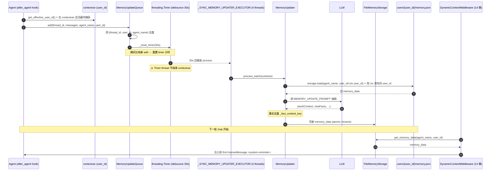
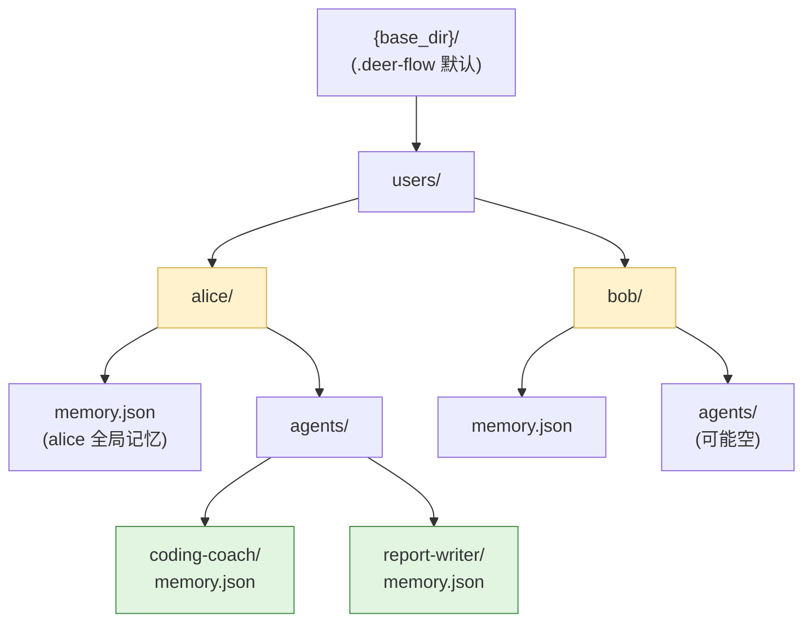
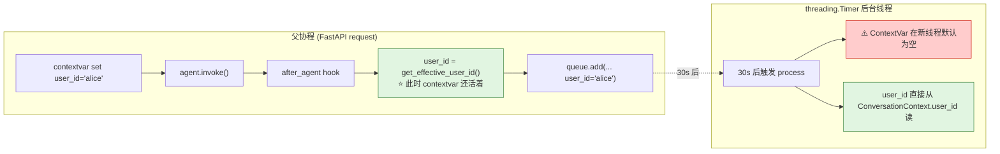

# 20 · 长期记忆：异步抽取 + 事实去重 + 多用户隔离

> 关键技术点层第 1 篇。前 19 章 agent 的"工作记忆"在 ThreadState + Checkpointer；**本章讲跨会话、跨 thread 的"长期记忆"**。
>
> DeerFlow 的 Memory 系统是个 7 文件子模块（storage / queue / updater / prompt / message_processing / summarization_hook / middleware），核心机制：
> 1. **`MemoryMiddleware.after_agent` 入队**（异步、不阻塞主流程）
> 2. **`MemoryUpdateQueue` 30 秒 debounce** —— 同 thread 多次更新批量合并
> 3. **`threading.Timer` 后台执行 LLM 抽取** —— 出口到 `MemoryUpdater`
> 4. **`_fact_content_key` 用 `strip + casefold` 去重** —— 防止"用户偏好简洁"这种事实被反复入库
> 5. **per-(user_id, agent_name) 隔离** —— 不同用户的记忆物理隔离
>
> 最关键的工程坑：**`user_id` 必须在 enqueue 时捕获，而不是在 Timer thread 里再读 contextvar**。

---

## 🎯 学习目标

读完这份文档，你能回答：

1. **为什么 `MemoryMiddleware` 在 `after_agent` 钩子做"入队"** 而不是同步 LLM 抽取？这种"队列 + 异步 + debounce"组合的工程动机是什么？
2. **`user_id = get_effective_user_id()` 必须在 `add()` 入队时调用，不能在 Timer thread 里调** —— **给一个具体场景**说明颠倒会出什么 bug。
3. **`_fact_content_key = strip().casefold()`** —— 这种"轻量归一化"为什么够用？为什么不做 embedding 语义去重？
4. **`MemoryUpdateQueue._queue_key = (thread_id, user_id, agent_name)`** 三元组作为去重 key —— 给一个具体场景说明**只用 thread_id 单键**会出什么 bug。
5. **`memory_flush_hook` 在 Summarization 删除消息前主动 flush 到 queue** —— 为什么 Summarization 删消息时不顺带就把"保留记忆"做了？

---

## 🗂️ 源码定位

| 关注点 | 文件 / 行号 | 关键锚点 |
|---|---|---|
| 中间件入队点 | `packages/harness/deerflow/agents/middlewares/memory_middleware.py` | `MemoryMiddleware.after_agent`；`user_id = get_effective_user_id()` 在 enqueue 处显式捕获 |
| 异步队列 | `packages/harness/deerflow/agents/memory/queue.py` | `ConversationContext` dataclass（含 user_id 字段）；`MemoryUpdateQueue`；`_queue_key = (thread_id, user_id, agent_name)`；`add` / `add_nowait`；`_reset_timer` / `_schedule_timer`；`threading.Timer` |
| LLM 抽取 | `packages/harness/deerflow/agents/memory/updater.py` | `MemoryUpdater`；`_fact_content_key`（strip + casefold）；`_SYNC_MEMORY_UPDATER_EXECUTOR` ThreadPoolExecutor(4)；`update_memory_from_conversation` |
| 文件存储 | `packages/harness/deerflow/agents/memory/storage.py` | `MemoryStorage` 抽象；`FileMemoryStorage`；`create_empty_memory`；`_memory_cache: dict[(user_id, agent_name), (data, mtime)]`；`_validate_agent_name` |
| 消息处理 | `packages/harness/deerflow/agents/memory/message_processing.py` | `filter_messages_for_memory`（只保留 human + final ai）；`detect_correction` / `detect_reinforcement`（用户纠正 / 强化信号） |
| Prompt 模板 | `packages/harness/deerflow/agents/memory/prompt.py` | `MEMORY_UPDATE_PROMPT`；`FACT_EXTRACTION_PROMPT`；`format_conversation_for_update`；`format_memory_for_injection` |
| Summarization 联动 | `packages/harness/deerflow/agents/memory/summarization_hook.py` | `memory_flush_hook(event: SummarizationEvent)` |
| user_context | `packages/harness/deerflow/runtime/user_context.py` | `get_effective_user_id()`；`resolve_runtime_user_id` |
| 配置 | `packages/harness/deerflow/config/memory_config.py` | `MemoryConfig`：enabled / storage_path / debounce_seconds=30 / model_name / max_facts=100 / fact_confidence_threshold=0.7 / injection_enabled / max_injection_tokens |
| 注入 prompt | `packages/harness/deerflow/agents/lead_agent/prompt.py::_get_memory_context` L554 | 由 DynamicContextMiddleware（14 章）调用 |

---

## 🧭 架构图

### 1. 完整数据流：from agent 完成到下次注入



### 2. 存储 layout：per-(user, agent) 隔离



### 3. ConversationContext 的 contextvar 捕获时序



---

## 🔍 核心逻辑讲解

### Part 1 · 为什么 `after_agent` 入队而不是同步 LLM 抽取

#### 同步抽取的灾难

假设 DeerFlow 在 `after_agent` 阶段**直接**调 LLM 抽取记忆：

| 问题 | 后果 |
|---|---|
| 延迟 | 用户消息回完之后还要等 3-5 秒 LLM 抽取记忆 → SSE 'end' 事件晚发 → 前端感知"卡住" |
| 成本 | 每轮 chat 都调一次 memory LLM → token 成本翻倍 |
| 失败影响 | 抽取 LLM 抽风（429 / 超时） → 中间件抛错 → 整个 agent run 失败 |
| 重复工作 | 用户 30 秒内连发 3 条消息 → 抽取 3 次（前 2 次基本被第 3 次覆盖） |

#### DeerFlow 的解法：异步队列 + debounce

```python
def after_agent(self, state, runtime) -> dict | None:
    if not config.enabled:
        return None

    # ... 提取 thread_id / messages / 过滤 ...

    user_id = get_effective_user_id()                # ⭐ contextvar 捕获
    queue = get_memory_queue()
    queue.add(
        thread_id=thread_id, messages=filtered_messages,
        agent_name=self._agent_name, user_id=user_id,
        correction_detected=correction_detected,
        reinforcement_detected=reinforcement_detected,
    )
    return None                                       # ← 不改 state,不阻塞
```

**3 个保护**：
1. **after_agent 立即返回 None** —— 不阻塞主流程
2. **debounce 30s** —— 用户 30 秒内的多次提交合并成一次
3. **异步线程池** —— 抽取失败不影响 agent run

### Part 2 · `user_id` 必须 enqueue 时捕获的 ContextVar 陷阱

#### 陷阱场景

打开 `memory_middleware.py` 关键 4 行：

```python
# Capture user_id at enqueue time while the request context is still alive.
# threading.Timer fires on a different thread where ContextVar values are not
# propagated, so we must store user_id explicitly in ConversationContext.
user_id = get_effective_user_id()
queue.add(..., user_id=user_id)
```

**如果 `user_id` 不在 enqueue 时捕获，而在 Timer thread 内读会怎样？**

```python
# ❌ 错误实现
queue.add(thread_id, messages, agent_name)        # 不传 user_id

# 后台 timer fired:
def _process_queued(context):
    user_id = get_effective_user_id()             # ⚠️ 新 thread,contextvar 默认值 "default"
    storage.save(memory, agent_name, user_id=user_id)
    # → alice 的记忆被写到 "default" 用户名下 → 跨用户污染!
```

**这是个真实的并发 bug 模式**：
- alice 发完消息 → after_agent 入队（无 user_id） → Timer 30s 后触发
- 30s 内 bob 也发了消息 → 现在 timer thread 跑 alice 的更新
- Timer thread 不知道这条消息属于谁 → 读 contextvar → 默认 "default"
- → **alice 的对话写到 default user 下**，**bob 的对话**（30s 后另一 timer）也写到 default → 跨用户混乱

#### DeerFlow 的修复：显式传递 user_id

```python
@dataclass
class ConversationContext:
    thread_id: str
    messages: list[Any]
    timestamp: datetime
    agent_name: str | None = None
    user_id: str | None = None                     # ⭐ 显式存
    ...
```

`ConversationContext.user_id` 是个**普通 dataclass 字段** —— 跨 thread 传递安全（不依赖 contextvar）。

#### 进一步：summarization hook 用 `resolve_runtime_user_id`

```python
def memory_flush_hook(event: SummarizationEvent) -> None:
    ...
    user_id = resolve_runtime_user_id(event.runtime)         # 从 runtime 拿,不依赖 contextvar
    queue = get_memory_queue()
    queue.add_nowait(..., user_id=user_id)
```

**`resolve_runtime_user_id`** 从 `runtime.context` 拿（worker.py Step 3 注入的），比 contextvar 更稳。

→ **教训**：异步边界（线程 / Timer / asyncio.create_task）**永远在边界处显式传上下文，不要靠 contextvar 跨边界**。

### Part 3 · `MemoryUpdateQueue` 的 debounce + 三元组 key

#### debounce 工作流程

```python
def add(self, thread_id, messages, agent_name=None, user_id=None, ...):
    with self._lock:
        self._enqueue_locked(...)
        self._reset_timer()       # ⭐ 每次 add 都重置 timer 倒计时
```

**`_reset_timer` 的语义**：
- 取消现有 timer
- 启动新 timer（30 秒后触发 process）
- → **用户在 debounce 窗口内每发一条消息，都重置倒计时 30 秒**

**效果**：
- 用户 30 秒不再发新消息 → timer 真正触发 process
- 用户 1 秒发 5 条 → timer 重置 5 次 → 只在最后一条 30s 后 process 1 次

#### 三元组 key `(thread_id, user_id, agent_name)`

```python
@staticmethod
def _queue_key(thread_id, user_id, agent_name):
    return (thread_id, user_id, agent_name)


def _enqueue_locked(self, thread_id, messages, ...):
    queue_key = self._queue_key(thread_id, user_id, agent_name)
    existing = next((ctx for ctx in self._queue
                     if self._queue_key(ctx.thread_id, ctx.user_id, ctx.agent_name) == queue_key),
                    None)
    # 把现有的同 key context 替换为新的（合并消息）
    self._queue = [ctx for ctx in self._queue if self._queue_key(...) != queue_key]
    self._queue.append(new_context)
```

**为什么需要 3 元组而不是单 thread_id？**

| key | 反例 |
|---|---|
| 单 `thread_id` | 不同 user 共享同一 thread 时（罕见但可能）→ 互相覆盖 |
| `(thread_id, user_id)` | 同 thread 同 user 但 lead vs custom-agent → 应该分别记 |
| **`(thread_id, user_id, agent_name)`** ⭐ | 三维隔离，安全 |

### Part 4 · 事实去重：`strip + casefold`

```python
def _fact_content_key(content: Any) -> str | None:
    if not isinstance(content, str):
        return None
    stripped = content.strip()
    if not stripped:
        return None
    return stripped.casefold()
```

#### 加入新事实时的去重

```python
existing_fact_keys = {_fact_content_key(fact.get("content"))
                      for fact in current_memory.get("facts", [])
                      if _fact_content_key(...) is not None}

for fact in new_facts:
    if confidence >= config.fact_confidence_threshold:
        normalized_content = raw_content.strip()
        fact_key = _fact_content_key(normalized_content)
        if fact_key is not None and fact_key in existing_fact_keys:
            continue                            # ⭐ 重复事实跳过
        # ... 追加
```

#### 为什么 `strip + casefold` 够用？

**真实重复模式**：
- "用户偏好简洁回答" vs "  用户偏好简洁回答  "（多空格）
- "User prefers concise answers" vs "user prefers concise answers"（大小写）
- "User Prefers Concise Answers"（首字母大写）

→ **`strip + casefold` 全部归一**。

#### 为什么不做 embedding 语义去重？

**embedding 方案**：
- "用户偏好简洁回答" 和 "用户喜欢精炼答复" 视为同义
- 高级，理想

**但实际工程取舍**：
- embedding 调用一次 ~100ms + token cost
- 每次新增 fact × 检查所有 100 条 existing → O(n) 次 embedding 调用 → 慢且贵
- LLM 自己已经做了"事实归纳"（在 LLM 抽取阶段就已经聚合）→ 重复主要是"完全一致或近似"，不是"语义近似"

**`strip + casefold` 是个 5x cheaper, 80% coverage 的实用选择**。**进阶**：如果将来发现"近义重复"严重，再上 embedding。

### Part 5 · `memory_flush_hook` 与 Summarization 联动

打开 14 章已讲过的 `_create_summarization_middleware`：

```python
hooks: list[BeforeSummarizationHook] = []
if resolved_app_config.memory.enabled:
    hooks.append(memory_flush_hook)

return DeerFlowSummarizationMiddleware(..., before_summarization=hooks, ...)
```

`memory_flush_hook` 在 Summarization 真的删除消息前被调：

```python
def memory_flush_hook(event: SummarizationEvent) -> None:
    if not get_memory_config().enabled or not event.thread_id:
        return

    filtered_messages = filter_messages_for_memory(list(event.messages_to_summarize))
    # ... 校验 user + ai messages 配对 ...

    user_id = resolve_runtime_user_id(event.runtime)
    queue = get_memory_queue()
    queue.add_nowait(                                  # ⭐ nowait:立即调度,不走 debounce
        thread_id=event.thread_id,
        messages=filtered_messages,
        agent_name=event.agent_name,
        user_id=user_id,
        ...
    )
```

#### 为什么 Summarization 不顺带把记忆做了？

| Summarization 的语义 | Memory 的语义 |
|---|---|
| 压缩 messages list 让 LLM context 不爆 | 抽取**跨会话**有价值的知识 |
| **删消息后** state 干净 | **写到外部存储**，state 不变 |
| trigger 是"token 多了" | trigger 是"对话发生了"（可能 token 没多） |

**为什么用 hook 解耦**：
- Summarization 关注 in-memory 压缩
- Memory 关注 cross-session 持久化
- 两个生命周期不同但有共同前提："这些消息要被处理"
- → **hook 让 Memory 在被 Summarization "删之前"再看一眼，主动 flush**

**`add_nowait` vs `add`** 的差异：
- `add` 走 30s debounce
- `add_nowait` 立刻调度（Summarization 即将删消息，等不及 debounce）

### Part 6 · `_SYNC_MEMORY_UPDATER_EXECUTOR` —— 同步路径的 4 线程池

```python
_SYNC_MEMORY_UPDATER_EXECUTOR = concurrent.futures.ThreadPoolExecutor(
    max_workers=4,
    thread_name_prefix="memory-updater-sync",
)
atexit.register(lambda: _SYNC_MEMORY_UPDATER_EXECUTOR.shutdown(wait=False))
```

**背景**：DeerFlow 既支持 sync invoke（如本地脚本）也支持 async ainvoke（FastAPI）。记忆 LLM 调用如果在 sync 主线程跑会阻塞 → 推到独立 thread。

**注释解释为什么不用 `asyncio.run`**：
> Unlike the previous asyncio.run() approach, this runs *sync* model.invoke() calls — no event loop is created, so the langchain async httpx client pool (globally cached via @lru_cache) is never touched and cross-loop connection reuse is impossible.

**问题**：`asyncio.run` 每次创建新 event loop → langchain 内部用 `@lru_cache` 共享的 async httpx client pool **会被绑定到第一个 loop**，新 loop 用它会出 "loop is closed" 错误。

**解决**：跑 **`model.invoke()`（同步版）**，避免触碰 async pool 完全。**`_SYNC_MEMORY_UPDATER_EXECUTOR(max_workers=4)`** 提供 4 个独立 thread。

**`atexit` 注册** 进程退出时 graceful shutdown。

### Part 7 · 数据结构：6 段叙事 + facts 列表

```python
def create_empty_memory() -> dict[str, Any]:
    return {
        "version": "1.0",
        "lastUpdated": utc_now_iso_z(),
        "user": {
            "workContext": {"summary": "", "updatedAt": ""},
            "personalContext": {"summary": "", "updatedAt": ""},
            "topOfMind": {"summary": "", "updatedAt": ""},
        },
        "history": {
            "recentMonths": {"summary": "", "updatedAt": ""},
            "earlierContext": {"summary": "", "updatedAt": ""},
            "longTermBackground": {"summary": "", "updatedAt": ""},
        },
        "facts": [],
    }
```

**6 段叙事**：每段都是 1-3 句话的自然语言摘要，由 LLM 在 `MEMORY_UPDATE_PROMPT` 中生成 / 更新。

| 段 | 用途 |
|---|---|
| `user.workContext` | 用户的工作背景（职业 / 行业 / 当前项目） |
| `user.personalContext` | 个人偏好 / 兴趣 / 生活习惯 |
| `user.topOfMind` | 用户最近反复提及的主题 |
| `history.recentMonths` | 近月活动总结 |
| `history.earlierContext` | 几个月前的语境 |
| `history.longTermBackground` | 长期背景（如教育、行业经验） |

**`facts: list[Fact]`** 每个 fact：
```json
{
  "id": "fact_a1b2c3d4",
  "content": "用户偏好简洁回答，避免长篇大论",
  "category": "preference",     // preference / knowledge / context / behavior / goal
  "confidence": 0.9,
  "createdAt": "2026-05-17T...",
  "source": "thread-xyz"
}
```

**配置**：`max_facts=100` 上限，超出后 LLM 在抽取时被指示"挑最重要的 100 条"。

### Part 8 · 注入到 prompt（与 14 章呼应）

`prompt.py::_get_memory_context` 把 memory_data 格式化为 prompt 块：

```text
<memory>
<user_context>
**Work**: 用户是 AI 工程师，主要做 Agent 系统。
**Personal**: 偏好简洁回答，关注工程实践细节。
**Top of mind**: DeerFlow 学习路线、面试准备。
</user_context>

<facts>
- 用户偏好简洁回答 (preference, 0.9)
- 用户当前在准备高级 Agent 工程师面试 (goal, 0.95)
- ...
</facts>
</memory>
```

**注入位置**：14 章讲的 `DynamicContextMiddleware` 把这个块注入到 first HumanMessage 的 `<system-reminder>` 内。**保住 system prompt prefix cache**。

---

## 🧩 体现的通用 Agent 设计模式

| 模式 | Memory 系统中的体现 |
|---|---|
| **Async Pipeline with Debounce** | MemoryUpdateQueue 30s debounce |
| **Cross-thread Context Capture** | 显式 `user_id` 入队字段而不靠 ContextVar |
| **Per-tenant Isolation** | per-(user_id, agent_name) 隔离 |
| **Lightweight Normalization Dedup** | `strip + casefold` 而不是 embedding |
| **Hook for Pre-side-effect** | `memory_flush_hook` 在 Summarization 删消息前 flush |
| **Sync/Async Adapter** | `_SYNC_MEMORY_UPDATER_EXECUTOR` ThreadPool |
| **Confidence-based Filtering** | `fact_confidence_threshold=0.7` 防低质事实污染 |
| **Atomic File Write** | storage.save 用 temp file + rename |
| **Cache with mtime** | FileMemoryStorage._memory_cache 用 mtime 失效 |

---

## 🧱 与 Agent Harness 六要素的对应关系

| 六要素 | Memory 怎么提供基础设施 |
|---|---|
| ① 反馈循环 | 通过 correction_detected / reinforcement_detected 让记忆体现用户纠正信号 |
| ② **记忆持久化** | **本章核心** —— per-user JSON 文件，跨 thread / 跨进程持久 |
| ③ 动态上下文 | DynamicContextMiddleware 注入 memory 到 first HumanMessage |
| ④ 安全护栏 | per-user 隔离防止跨用户读；`_validate_agent_name` 防路径注入；confidence 阈值防垃圾事实 |
| ⑤ 工具集成 | 不直接相关 |
| ⑥ 可观测性 | logger.info 记录每次 enqueue / process 数量 |

---

## ⚠️ 常见坑与调试技巧

### 坑 1 · 进程退出时 timer 还没触发 → 记忆丢失

**症状**：用户发完消息立即关 chrome → 30s debounce 没到 → process 退出（如 docker container restart）→ 这次记忆没写入。
**调试**：log "Memory update queued for thread X, queue size: N" 后再确认 "Memory update processed"。
**修复**：lifespan shutdown 时主动 flush queue（DeerFlow 当前可能没做，是潜在 PR）。

### 坑 2 · 多进程部署时 cache 不一致

**症状**：进程 A 写完 memory.json，进程 B 的 cache 还是旧的。
**机制**：`FileMemoryStorage._memory_cache` 用 mtime 失效 —— 下次 `load(user_id)` 时检查 mtime，发现变化就 reload。
**问题**：如果两个进程**几乎同时**写 → mtime 比较有 race。
**修复**：写 atomic（temp file + rename），让 mtime 永远是某次完整写入的；进程 B 永远读到完整版本。**DeerFlow 当前用 atomic rename**，已经处理。

### 坑 3 · LLM 抽取慢导致 queue 堆积

**症状**：每次 process 一个 context 要 5 秒（LLM 调用慢），但用户发消息频率比 1/5s 还快 → queue 长度持续增长。
**调试**：监控 `len(queue._queue)` —— 长期 > 10 报警。
**修复**：
- 调小 model（用 lightweight 而不是主模型）
- 增加并发（`_SYNC_MEMORY_UPDATER_EXECUTOR(max_workers=8)`）
- debounce_seconds 调大（30 → 60）让更多消息合并

### 坑 4 · `casefold` 对中文不友好但 OK

`casefold()` 是 lower() 的增强版，专门处理国际化大小写（如德语 ß → ss）。**对中文**：no-op（中文没大小写概念）。所以 `strip + casefold` 对中文事实**只 strip 空白**。

**真实风险**：中文事实 "用户偏好简洁" vs "用户偏好 简洁"（中间多空格）—— `strip` 不去中间空格 → 视为不同事实。
**修复**：需要的话改成 `re.sub(r"\s+", " ", stripped).casefold()` 归一所有连续空白。

### 坑 5 · `injection_enabled=False` 但记忆仍在抽取

`MemoryConfig` 有两个开关：
- `enabled` —— 总开关（控制抽取 + 注入）
- `injection_enabled` —— 单独控制注入（抽取仍跑）

**真实用途**：测试时关掉注入避免污染 LLM context，但保留抽取看效果。
**坑**：很多人以为 `injection_enabled=False` 就停止 memory 子系统 → 实际仍跑 LLM 抽取 → 仍 cost token。**修复**：要彻底关，用 `enabled=False`。

---

## 🛠️ 动手实操

> 本 demo 不调真 LLM，模拟 queue + storage + dedup 整套机制。

### Demo · Memory 系统核心机制实测

```python
"""
Memory 系统 demo.

跑法:  PYTHONPATH=backend uv run python scripts/memory_system_walkthrough.py
"""
import sys, os, json, time
from pathlib import Path
from datetime import datetime

sys.path.insert(0, "backend")
sys.path.insert(0, "backend/packages/harness")
os.chdir(Path(__file__).resolve().parents[1])

from deerflow.agents.memory.queue import ConversationContext, MemoryUpdateQueue
from deerflow.agents.memory.updater import _fact_content_key, create_empty_memory
from deerflow.agents.memory.storage import FileMemoryStorage, utc_now_iso_z


# ====== Case 1: empty memory 数据结构 ======
print("\n" + "=" * 70)
print("CASE 1 · empty memory 数据结构")
print("=" * 70)

empty = create_empty_memory()
print(f"  顶级字段: {list(empty.keys())}")
print(f"  user 段: {list(empty['user'].keys())}")
print(f"  history 段: {list(empty['history'].keys())}")


# ====== Case 2: _fact_content_key 去重归一 ======
print("\n" + "=" * 70)
print("CASE 2 · _fact_content_key 归一化")
print("=" * 70)

variations = [
    "User prefers concise answers",
    "  User prefers concise answers  ",
    "user prefers concise answers",
    "USER PREFERS CONCISE ANSWERS",
    "User Prefers Concise Answers",
]
keys = [_fact_content_key(v) for v in variations]
print(f"  5 种变体的归一化 key:")
for v, k in zip(variations, keys):
    print(f"    {v!r:<48} → {k!r}")
print(f"  全部相同? {len(set(keys)) == 1}  (期望 True)")


# ====== Case 3: 三元组 queue_key 去重 ======
print("\n" + "=" * 70)
print("CASE 3 · 三元组 queue_key (thread_id, user_id, agent_name)")
print("=" * 70)

q = MemoryUpdateQueue()

# 同 thread / 同 user / 同 agent → 合并
q._enqueue_locked(
    thread_id="t1", messages=[1, 2], agent_name="default", user_id="alice",
    correction_detected=False, reinforcement_detected=False,
)
q._enqueue_locked(
    thread_id="t1", messages=[3, 4], agent_name="default", user_id="alice",
    correction_detected=False, reinforcement_detected=False,
)
print(f"  同 (t1, alice, default) 入队两次 → queue 长度: {len(q._queue)}  (期望 1,合并)")
print(f"  保留的 messages (后一次): {q._queue[0].messages}")

# 不同 user → 不合并
q._enqueue_locked(
    thread_id="t1", messages=[5, 6], agent_name="default", user_id="bob",
    correction_detected=False, reinforcement_detected=False,
)
print(f"  加入 (t1, bob, default) → queue 长度: {len(q._queue)}  (期望 2)")

# 不同 agent → 不合并
q._enqueue_locked(
    thread_id="t1", messages=[7, 8], agent_name="coding-coach", user_id="alice",
    correction_detected=False, reinforcement_detected=False,
)
print(f"  加入 (t1, alice, coding-coach) → queue 长度: {len(q._queue)}  (期望 3)")


# ====== Case 4: FileMemoryStorage save / load ======
print("\n" + "=" * 70)
print("CASE 4 · FileMemoryStorage per-user 隔离")
print("=" * 70)

import tempfile
storage = FileMemoryStorage()

# 临时修改 paths.base_dir
with tempfile.TemporaryDirectory() as tmpdir:
    os.environ["DEER_FLOW_HOME"] = tmpdir

    # 重置 cache 强制读真实路径
    storage._memory_cache.clear()

    # alice 写
    alice_mem = create_empty_memory()
    alice_mem["user"]["workContext"]["summary"] = "Alice is AI engineer"
    saved = storage.save(alice_mem, agent_name=None, user_id="alice")
    print(f"  alice save ok? {saved}")

    # bob 写
    bob_mem = create_empty_memory()
    bob_mem["user"]["workContext"]["summary"] = "Bob is data scientist"
    saved = storage.save(bob_mem, agent_name=None, user_id="bob")
    print(f"  bob save ok? {saved}")

    # 读 alice
    storage._memory_cache.clear()      # 强制走磁盘
    loaded_alice = storage.load(agent_name=None, user_id="alice")
    print(f"  alice load workContext: {loaded_alice['user']['workContext']['summary']!r}")

    # 读 bob
    loaded_bob = storage.load(agent_name=None, user_id="bob")
    print(f"  bob load workContext: {loaded_bob['user']['workContext']['summary']!r}")
    print(f"  ⭐ 两份记忆物理隔离")

    # 看磁盘文件
    alice_file = Path(tmpdir) / "users" / "alice" / "memory.json"
    bob_file = Path(tmpdir) / "users" / "bob" / "memory.json"
    print(f"  alice file: {alice_file.exists()}")
    print(f"  bob file: {bob_file.exists()}")


# ====== Case 5: ContextVar 跨线程丢失复现 ======
print("\n" + "=" * 70)
print("CASE 5 · ContextVar 跨线程丢失复现")
print("=" * 70)

import threading
from deerflow.runtime.user_context import user_id_var, get_effective_user_id

# 主线程设置
token = user_id_var.set("alice")

# 主线程读
print(f"  主线程 user_id: {get_effective_user_id()}")

# 子线程读(不复制 context)
def child():
    print(f"  子线程 user_id (不传 context): {get_effective_user_id()}  (期望 'default')")

t = threading.Thread(target=child)
t.start()
t.join()

# 子线程读(复制 context)
import contextvars
def child_with_ctx():
    print(f"  子线程 user_id (复制 context): {get_effective_user_id()}  (期望 'alice')")

ctx = contextvars.copy_context()
t2 = threading.Thread(target=lambda: ctx.run(child_with_ctx))
t2.start()
t2.join()

# 清理
user_id_var.reset(token)


# ====== Case 6: 显式存 user_id 在 ConversationContext ======
print("\n" + "=" * 70)
print("CASE 6 · ConversationContext 显式存 user_id 跨线程安全")
print("=" * 70)

ctx = ConversationContext(
    thread_id="t1",
    messages=["msg"],
    agent_name="default",
    user_id="alice",      # ⭐ 显式
)

def timer_callback(captured_ctx):
    # 模拟 timer thread 跑
    print(f"  timer thread 收到 user_id: {captured_ctx.user_id}")
    print(f"  timer thread contextvar 默认值: {get_effective_user_id()}")
    print(f"  ✅ 用 captured_ctx.user_id 而不是 contextvar")

import threading
t3 = threading.Thread(target=timer_callback, args=(ctx,))
t3.start()
t3.join()
```

### 调试任务

1. **断点位置**：
   - `memory_middleware.py::after_agent` 的 `user_id = get_effective_user_id()` —— 看 contextvar 当前值
   - `queue.py::_enqueue_locked` 的 `existing = next(...)` —— 看 3 元组匹配
   - `updater.py::_fact_content_key` —— 看归一化结果
2. **观察什么**：
   - Case 1 数据结构完整
   - Case 2 5 个变体归一化为同一 key
   - Case 3 queue 长度 1 / 2 / 3
   - Case 4 alice / bob 文件在 users/{name}/ 物理隔离
   - Case 5 子线程不复制 context → user_id 退化到默认
3. **人为制造异常**：
   - Case 3 `_enqueue_locked` 传 `user_id=None` × 2 → queue_key = (t1, None, default) → 合并 (None 也作为 key 一部分)
   - Case 6 把 user_id 改成 None → timer 看到 None → 实际 storage save 会调用默认值

### 改造练习

1. **练习 A（简单）**：扩展 `_fact_content_key` 加 `re.sub(r"\s+", " ", stripped).casefold()` 归一化连续空白。验证中文 "用户偏好  简洁" 与 "用户偏好 简洁" 合并。
2. **练习 B（中等）**：实现 lifespan 关闭时主动 flush queue —— Gateway shutdown 前 drain 所有 pending context（最多等 5 秒），避免重启丢记忆。
3. **挑战题**：实现一个 "embedding-based fact dedup" 可选层 —— 配置 `fact_dedup_strategy: "literal" | "semantic"`，semantic 时用 embedding cosine similarity > 0.92 视为重复。注意：缓存 embedding 防重复计算。

### 预期输出 & 验证方式

- Case 2：5 个变体归一化为同一 key
- Case 3：queue 长度 1 / 2 / 3
- Case 4：alice / bob 文件存在 + 内容独立
- Case 5：子线程不复制 context → user_id = "default"；复制 context → user_id = "alice"
- Case 6：显式存 user_id 不丢

---

## 🎤 面试视角

### 业务型大厂卷

**问 1**：DeerFlow Memory 用 `threading.Timer + 30s debounce`。**作为生产 SaaS**，你会怎么改造让它**多机部署**安全？

> **教科书答案**：
> 当前单机：debounce timer 在内存里，进程重启丢失 + 多机各自 debounce 各自 process → 同 user 多机被各处理一次。
> 多机改造：
> 1. **集中式队列**：Redis Streams / Kafka 替换 in-memory queue —— 所有进程共享一个 stream
> 2. **去重 worker**：单独的 memory-updater worker（不是 Gateway 进程）从 stream 消费 → process → 写 DB
> 3. **debounce 改 sliding window**：用 Redis SET key + EXPIRE 实现"30s 内只 process 1 次"
> 4. **存储改 DB 而非文件**：Postgres `users.memory_data: JSONB` —— ACID + 跨机一致
> 5. **lifespan flush** 用 SIGTERM hook 把内存 pending 推 Redis 后再退出
> **DeerFlow 当前是 single-machine 假设** —— SaaS 必须重设计这一层。

**问 2**：`_fact_content_key = strip + casefold` 是 80% 覆盖的实用方案。**给一个具体生产场景**说明这种"轻量归一"会失败 → 必须升级 embedding？

> **教科书答案**：
> 场景：**法律 / 医学领域记忆**
> - LLM 抽取出："患者偏好微创手术"
> - 后来又抽出："病人倾向选择创伤较小的手术方式"
> - `strip + casefold`：不同字符串 → 两条独立 fact
> - 但**业务含义相同** → 记忆膨胀 + LLM 看到重复 → 浪费 prompt
> 触发升级 embedding 的信号：
> - facts 列表平均长度增长率 > 5% / week 但用户没新偏好出现
> - 用户反馈"记忆好像很啰嗦/重复"
> - LLM injected memory 长度逼近 `max_injection_tokens=2000` 上限
> 升级路径：
> 1. **先做监控** —— 算 facts 之间的 embedding 平均相似度，看是否高于阈值
> 2. **加可选 embedding 层** —— 配置开关 + 缓存 embedding 复用
> 3. **graceful fallback** —— embedding LLM 失败时退到 literal dedup

### 创业型 AI 公司卷

**问 3**：DeerFlow per-user memory.json 物理隔离。**多租户 SaaS 场景**下，你会怎么扩展防止数据泄露？

> **参考答案**：
> 5 层加固：
> 1. **文件权限**：`users/{user_id}/memory.json` 700 mode，进程 setuid 到对应 user
> 2. **存储改 DB**：行级 RLS (Row Level Security) 在 Postgres
> 3. **API 层强制 user_id**：每个 API 入口 `current_user.id` 注入 contextvar，**永远不接受 client 传的 user_id**
> 4. **审计日志**：每次 memory 读/写记录到 audit table（who / when / what / IP）
> 5. **加密**：sensitive memory 字段用每 user 的密钥加密（KMS managed）
> DeerFlow 当前**主要是 local-trusted 部署**，所以只做了 (1)；SaaS 要把 (2-5) 都加。

**问 4**：你团队的 PRD："让用户能编辑 / 删除自己的 memory facts"。**用 DeerFlow 现有 API 设计完整方案**。

> **参考答案**：
> 现有 API：
> - `get_memory_data(user_id)` —— 读
> - `delete_memory_fact(fact_id, user_id)` —— 单条删
> - `update_memory_fact(fact_id, content, user_id)` —— 单条更新
> 完整方案：
> 1. **Gateway 暴露 REST API**：
>    - `GET /api/memory` —— 当前用户记忆（脱敏后展示）
>    - `PATCH /api/memory/facts/{fact_id}` —— 编辑（调 update_memory_fact）
>    - `DELETE /api/memory/facts/{fact_id}` —— 删除
>    - `POST /api/memory/clear` —— 一键清空（调 clear_memory_data）
> 2. **前端 UI**：显示 facts 列表 + 6 段 narrative + 编辑 / 删除按钮
> 3. **审计**：每次写操作记录到 audit log
> 4. **撤销窗口**：删除时不真删，标 `is_deleted: true` + 30 天后真清 → 误删可恢复
> 5. **冲突处理**：用户编辑 fact 的同时 LLM 抽取也在跑 → 用 `updatedAt` 时间戳 + last-write-wins 或 user-edit-wins 策略
> **DeerFlow 当前 API 都有，只缺 UI + 审计 + 撤销窗口** —— 是个 1-2 周可以做完的 feature。

---

## 📚 延伸阅读

- **Letta / MemGPT paper**：https://arxiv.org/abs/2310.08560
  *理解"分层记忆"哲学。DeerFlow 6 段叙事是简化版。*
- **DeerFlow `docs/MEMORY_IMPROVEMENTS.md` + `MEMORY_SETTINGS_REVIEW.md`**：项目内官方记忆设计文档。
- **14 章 DynamicContextMiddleware** + **05 章 ContextVar override**：理解 memory 如何注入到 prompt 而不破 prefix cache。
- **Python `contextvars` 跨线程行为**：理解为什么必须显式传 user_id。

---

## 🎤 互动检查 —— 请回答这 3 个问题

> **两句话即可**。

1. **机制理解题**：用一句话说明：MemoryMiddleware 必须在 `after_agent` 入队时**立刻**捕获 user_id —— 推迟到 Timer thread 里捕获会出什么 bug？
2. **设计动机题**：`_fact_content_key = strip + casefold` 不用 embedding —— 给至少 1 条 "literal 够用"的理由 + 1 条 "什么场景必须升级 embedding"。
3. **应用题**：你的同事提了 PR：把 `MemoryUpdateQueue` 的 `_queue_key` 简化为单 `thread_id`。**给两个具体场景**说明这会破坏什么。

回答后我们进入 **`21-model-factory-and-providers.md`** —— 模型工厂：反射 + Thinking + Vision + 自定义 Provider 深潜。
