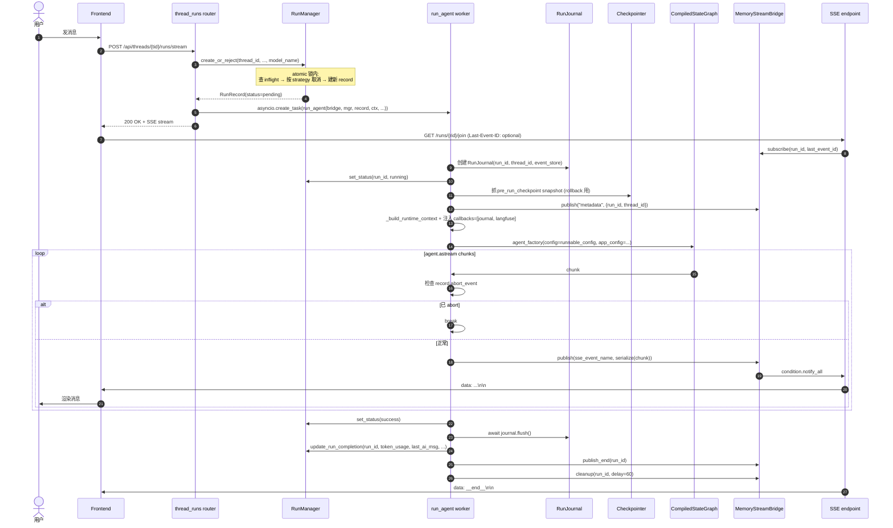
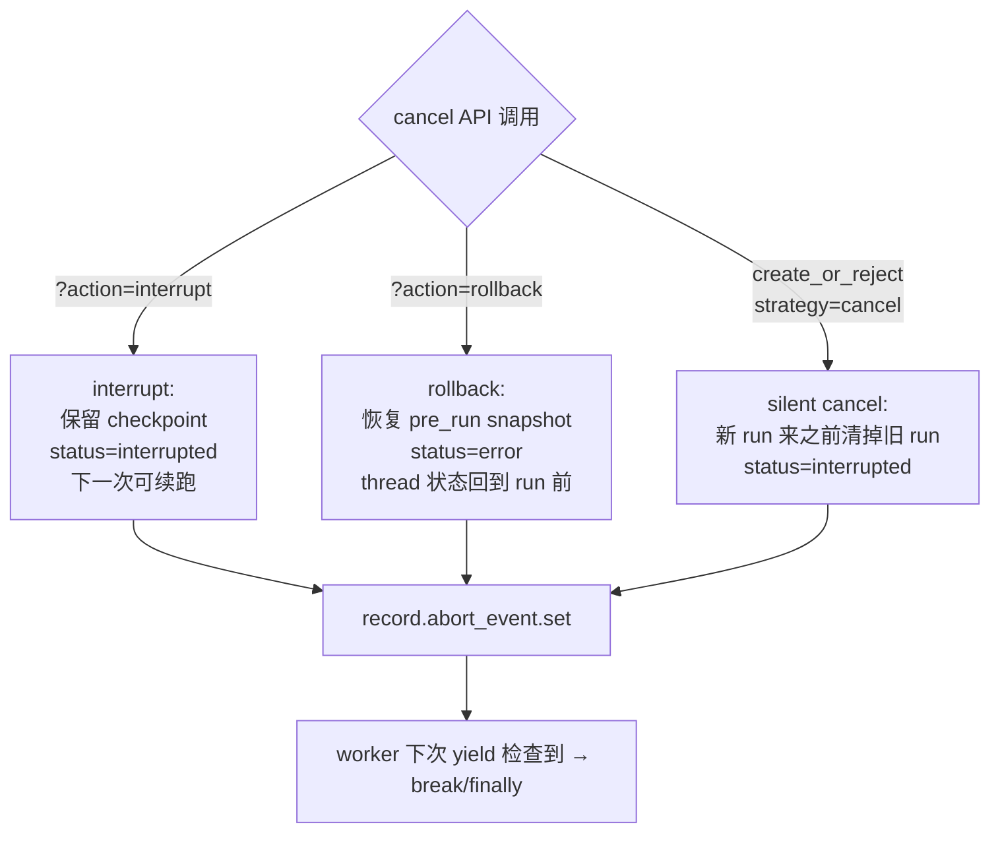
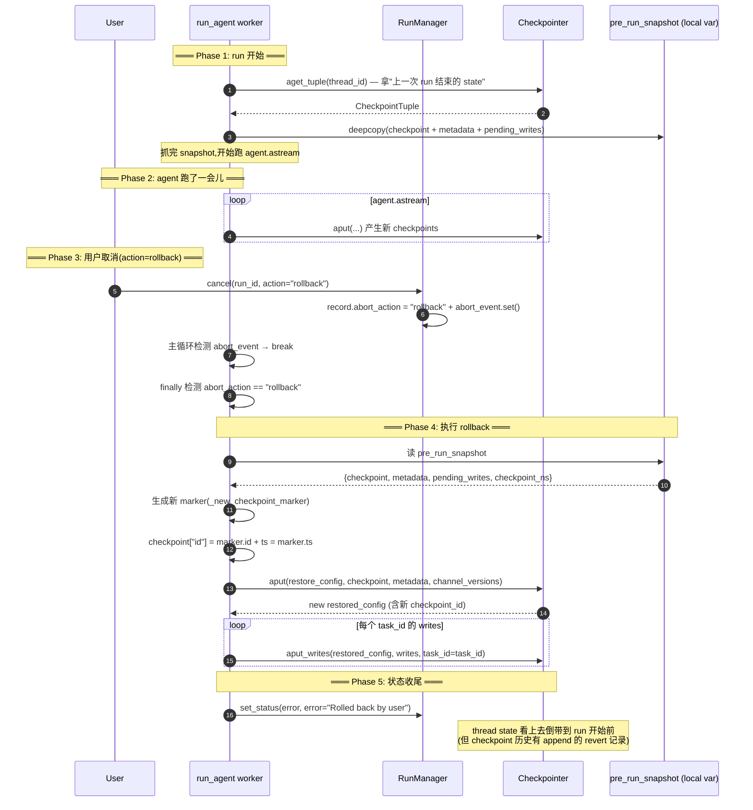

# 20 · RunManager + run_agent worker + StreamBridge

> 01 篇画过 Gateway 的启动链路，其中提到 "deer-flow 自己实现了 LangGraph Server 缩水版"（`packages/harness/deerflow/runtime/`）。这一章把那个"缩水版"的核心三件套讲清楚：**RunManager**（run 注册表 + 生命周期）+ **run_agent worker**（一次 run 的真正执行）+ **StreamBridge**（SSE 流抽象）。
>
> 这是 deer-flow 从"agent 框架"升级到"agent 平台"的关键代码——能多 thread / 能取消 / 能流式 / 能恢复 / 能断线重连。看完这一章你能在脑子里把"用户发一句话 → API 收到 → run 跑起来 → SSE 流到前端"完整跑一遍。

---

## 1. 模块定位（Why this matters）

deer-flow 的运行时层把"一次对话"抽象成 3 个对象：

| 对象 | 谁创建 | 谁消费 | 持续时间 |
|------|--------|--------|---------|
| **RunRecord** | `RunManager.create` | `run_agent worker` + `cancel API` | 一次 run（从 pending → running → completed/interrupted/error） |
| **StreamBridge per-run buffer** | `MemoryStreamBridge.publish` | `SSE endpoint subscribe` | 同 RunRecord 生命周期 + 60s tail（断线重连） |
| **agent (CompiledStateGraph)** | `agent_factory(config)` | `agent.astream` | 每次 run 重新构造 |

不读这一章会错过 4 个关键认知：

1. **`RunManager.create_or_reject` 是 atomic check-then-create**：03 multitask_strategy（reject / interrupt / rollback）在同一锁内完成"查 inflight + 取消旧 + 建新"——消除 TOCTOU race。这是 production agent 平台的基础。
2. **`run_agent worker` 是 600+ 行的核心 orchestrator**：它做 8 件事——init journal / 抓 pre-run checkpoint snapshot / 注 runtime context / 构造 agent / 注 callbacks / `agent.astream` + 发 SSE / 终态处理 / cleanup。**任何 deer-flow run 都走它**——make_dev 嵌入运行时和 DeerFlowClient 嵌入式 SDK 都不重复造这层。
3. **`MemoryStreamBridge` 是 per-run 环形 buffer + AsyncCondition**：保留最近 `queue_maxsize=256` 个事件支持断线重连；`Last-Event-ID` 头让前端能从断点续传。`HEARTBEAT_SENTINEL` 每 15s 推送防中间代理掐连接。
4. **3 种 cancel 语义**：`interrupt`（默认，保留 checkpoint）/ `rollback`（恢复到 pre-run snapshot）/ `cancel`（异步任务 cancel + status=interrupted）。**所有取消都通过 `record.abort_event` 协作式通知** worker 在下一个 yield point 退出。

对应到 Harness 六要素：本章对应 **运行时基础设施 + 反馈循环 + 可观测性** 的底层骨架，是 19 篇 RunJournal 和 22 篇 Gateway API 之间的桥梁。

---

## 2. 源码地图（Source Map）

### 2.1 关键文件清单

| 路径 | 角色 |
|------|------|
| [`packages/harness/deerflow/runtime/runs/manager.py`](../packages/harness/deerflow/runtime/runs/manager.py) | `RunManager + RunRecord`（267 行） |
| [`packages/harness/deerflow/runtime/runs/worker.py`](../packages/harness/deerflow/runtime/runs/worker.py) | `run_agent` worker（580 行） |
| [`packages/harness/deerflow/runtime/runs/schemas.py`](../packages/harness/deerflow/runtime/runs/schemas.py) | `RunStatus / DisconnectMode` enum |
| [`packages/harness/deerflow/runtime/runs/store/base.py`](../packages/harness/deerflow/runtime/runs/store/base.py) | `RunStore` 抽象 |
| [`packages/harness/deerflow/runtime/runs/store/memory.py`](../packages/harness/deerflow/runtime/runs/store/memory.py) | dev/test |
| [`packages/harness/deerflow/persistence/run/sql.py`](../packages/harness/deerflow/persistence/run/sql.py) | production SQL backend（21 篇详谈） |
| [`packages/harness/deerflow/runtime/stream_bridge/base.py`](../packages/harness/deerflow/runtime/stream_bridge/base.py) | `StreamBridge` 抽象 + `StreamEvent / END_SENTINEL / HEARTBEAT_SENTINEL` |
| [`packages/harness/deerflow/runtime/stream_bridge/memory.py`](../packages/harness/deerflow/runtime/stream_bridge/memory.py) | `MemoryStreamBridge`（134 行） |
| [`packages/harness/deerflow/runtime/stream_bridge/async_provider.py`](../packages/harness/deerflow/runtime/stream_bridge/async_provider.py) | `make_stream_bridge(config)` 工厂 |
| [`packages/harness/deerflow/runtime/converters.py`](../packages/harness/deerflow/runtime/converters.py) | LangGraph chunk → SSE event 名 |
| [`packages/harness/deerflow/runtime/serialization.py`](../packages/harness/deerflow/runtime/serialization.py) | LangChain object → JSON-safe |
| [`backend/app/gateway/routers/thread_runs.py`](../app/gateway/routers/thread_runs.py) | Gateway router 调用入口（22 篇详谈） |

### 2.2 关键符号速查表

| 符号 | 文件:行 | 一句话职责 |
|------|---------|-----------|
| `@dataclass RunRecord` | `manager.py:22` | 13 字段 mutable record |
| `class RunStatus(Enum)` | `schemas.py` | pending/running/success/error/interrupted/cancelled |
| `class DisconnectMode(Enum)` | `schemas.py` | cancel/continue/respond |
| `class RunManager` | `manager.py:42` | in-memory registry + optional store |
| `RunManager.create(...)` | `manager.py:82` | 基础版（不查 inflight） |
| `RunManager.create_or_reject(...)` | `manager.py:179` | **atomic**：查 + 取消 + 建 |
| `RunManager.cancel(run_id, action)` | `manager.py:154` | 设 abort_event + cancel task |
| `RunManager.set_status(run_id, status)` | `manager.py:124` | 状态转换 + 持久化 |
| `RunManager.update_run_completion(run_id, ...)` | `manager.py:74` | 持久化 token usage + last_ai_msg |
| `RunManager.cleanup(run_id, delay=300)` | `manager.py:252` | 延迟 GC |
| `class ConflictError` / `UnsupportedStrategyError` | `manager.py:261/265` | 异常类型 |
| `run_agent(bridge, run_manager, record, ctx, ...)` | `worker.py:120` | 主入口 |
| `_build_runtime_context(thread_id, run_id, ctx, app_config)` | `worker.py:44` | 给 runtime.context 准备 dict |
| `_install_runtime_context(config, ctx)` | `worker.py:88` | 注入 `__pregel_runtime` |
| `_rollback_to_pre_run_checkpoint(...)` | `worker.py:422` | 恢复 pre-run state |
| `_new_checkpoint_marker()` | `worker.py:515` | 唯一 marker id |
| `_lg_mode_to_sse_event(mode)` | `worker.py:520` | values→values, messages→messages-tuple |
| `_extract_human_message(graph_input)` | `worker.py:532` | 抓 first human msg |
| `_unpack_stream_item(item, modes, subgraphs)` | `worker.py:557` | 解析 tuple chunk |
| `class StreamBridge(ABC)` | `stream_bridge/base.py:37` | 抽象 |
| `class StreamEvent` | `stream_bridge/base.py:17` | `(id, event, data)` |
| `END_SENTINEL / HEARTBEAT_SENTINEL` | `stream_bridge/base.py:33/34` | sentinel 对象 |
| `class MemoryStreamBridge` | `stream_bridge/memory.py:25` | 默认实现 |
| `_RunStream` | `stream_bridge/memory.py:17` | per-run buffer + condition |
| `MemoryStreamBridge._next_id(run_id)` | `stream_bridge/memory.py:45` | `{millis}-{seq}` |
| `MemoryStreamBridge._resolve_start_offset(stream, last_event_id)` | `stream_bridge/memory.py:51` | Last-Event-ID 续传 |
| `MemoryStreamBridge.subscribe(run_id, last_event_id, heartbeat_interval=15.0)` | `stream_bridge/memory.py:85` | async iterator |
| `MemoryStreamBridge.cleanup(run_id, delay=0)` | `stream_bridge/memory.py:125` | delay 60s 后 GC |

### 2.3 一次 run 的完整时序



### 2.4 3 种 cancel 语义对照



---

## 3. 核心逻辑精读（Deep Dive）

### 3.1 `RunRecord`：mutable + asyncio 原语

```python
# packages/harness/deerflow/runtime/runs/manager.py:21-39
@dataclass
class RunRecord:
    """Mutable record for a single run."""

    run_id: str
    thread_id: str
    assistant_id: str | None
    status: RunStatus
    on_disconnect: DisconnectMode
    multitask_strategy: str = "reject"
    metadata: dict = field(default_factory=dict)
    kwargs: dict = field(default_factory=dict)
    created_at: str = ""
    updated_at: str = ""
    task: asyncio.Task | None = field(default=None, repr=False)
    abort_event: asyncio.Event = field(default_factory=asyncio.Event, repr=False)
    abort_action: str = "interrupt"
    error: str | None = None
    model_name: str | None = None
```

**3 个关键 asyncio 字段**：

- **`task: asyncio.Task | None`**：worker 跑在这个 task 里。Router 创建 run 时通过 `asyncio.create_task(run_agent(...))` 并 `record.task = task` 关联起来——cancel 时调 `task.cancel()`。
- **`abort_event: asyncio.Event`**：协作式 cancel 信号——worker 主循环每次 yield 检查 `record.abort_event.is_set()`，True 则 break。
- **`abort_action: str`**：cancel 时附带的"取消方式"——`interrupt`（默认）/ `rollback`/`cancel`。worker 看 abort_action 决定 finally 走 rollback 还是普通收尾。

**`repr=False` 避免日志/print 打印整个 asyncio 对象**——asyncio 对象的 repr 会很啰嗦。

### 3.2 `create_or_reject`：atomic check-then-create

```python
# packages/harness/deerflow/runtime/runs/manager.py:179-245
async def create_or_reject(
    self,
    thread_id: str,
    assistant_id: str | None = None,
    *,
    on_disconnect: DisconnectMode = DisconnectMode.cancel,
    metadata: dict | None = None,
    kwargs: dict | None = None,
    multitask_strategy: str = "reject",
    model_name: str | None = None,
) -> RunRecord:
    """Atomically check for inflight runs and create a new one.

    For ``reject`` strategy, raises ``ConflictError`` if thread
    already has a pending/running run.  For ``interrupt``/``rollback``,
    cancels inflight runs before creating.

    This method holds the lock across both the check and the insert,
    eliminating the TOCTOU race in separate ``has_inflight`` + ``create``.
    """
    run_id = str(uuid.uuid4())
    now = _now_iso()

    _supported_strategies = ("reject", "interrupt", "rollback")

    async with self._lock:
        if multitask_strategy not in _supported_strategies:
            raise UnsupportedStrategyError(...)

        inflight = [r for r in self._runs.values() if r.thread_id == thread_id and r.status in (RunStatus.pending, RunStatus.running)]

        if multitask_strategy == "reject" and inflight:
            raise ConflictError(f"Thread {thread_id} already has an active run")

        if multitask_strategy in ("interrupt", "rollback") and inflight:
            for r in inflight:
                r.abort_action = multitask_strategy
                r.abort_event.set()
                if r.task is not None and not r.task.done():
                    r.task.cancel()
                r.status = RunStatus.interrupted
                r.updated_at = now
            logger.info("Cancelled %d inflight run(s) on thread %s (strategy=%s)", len(inflight), thread_id, multitask_strategy)

        record = RunRecord(
            run_id=run_id,
            thread_id=thread_id,
            assistant_id=assistant_id,
            status=RunStatus.pending,
            on_disconnect=on_disconnect,
            multitask_strategy=multitask_strategy,
            metadata=metadata or {},
            kwargs=kwargs or {},
            created_at=now,
            updated_at=now,
            model_name=model_name,
        )
        self._runs[run_id] = record

    await self._persist_to_store(record)
    logger.info("Run created: run_id=%s thread_id=%s", run_id, thread_id)
    return record
```

**核心设计**：

1. **`async with self._lock:` 包住整个 check-then-create**：避免 TOCTOU race——如果用 `has_inflight + create` 两步，两步之间另一个并发请求可能成功插入一个 inflight，违反 reject 约束。
2. **3 种 strategy**：
   - `reject`：有 inflight 直接抛 `ConflictError`——前端收到 409 提示"请等当前对话结束"。
   - `interrupt`：取消所有 inflight 并继续创建新的——前端体感"前一次对话被你打断了"。
   - `rollback`：同 interrupt，但 worker finally 时还会回滚 checkpoint——彻底从 thread 历史里抹掉那次 run。
3. **`_persist_to_store(record)` 在锁外**：DB IO 不在临界区，避免长锁。代价：crash window——内存里有了 record 但 DB 里没有；进程重启后 DB 拉不到。**deer-flow 接受这个 trade-off**——run 注册表本身就是 best-effort 持久化。

### 3.3 `RunManager.cancel`：3 步协作式取消

```python
# packages/harness/deerflow/runtime/runs/manager.py:154-177
async def cancel(self, run_id: str, *, action: str = "interrupt") -> bool:
    """Request cancellation of a run.

    Args:
        run_id: The run ID to cancel.
        action: "interrupt" keeps checkpoint, "rollback" reverts to pre-run state.

    Sets the abort event with the action reason and cancels the asyncio task.
    Returns ``True`` if the run was in-flight and cancellation was initiated.
    """
    async with self._lock:
        record = self._runs.get(run_id)
        if record is None:
            return False
        if record.status not in (RunStatus.pending, RunStatus.running):
            return False
        record.abort_action = action
        record.abort_event.set()
        if record.task is not None and not record.task.done():
            record.task.cancel()
        record.status = RunStatus.interrupted
        record.updated_at = _now_iso()
    logger.info("Run %s cancelled (action=%s)", run_id, action)
    return True
```

**3 步执行**：

1. **`record.abort_action = action`**：标记取消方式，worker 的 finally 里要看。
2. **`record.abort_event.set()`**：协作式信号——worker 主循环 `if record.abort_event.is_set(): break`。
3. **`record.task.cancel()`**：硬 cancel——如果 worker 在某个 `await`（例如 `agent.astream`）卡住，会抛 `asyncio.CancelledError`。

**两个机制配合**：

- **abort_event** 是软取消——worker 跑到 yield point 才感知。最干净的退出方式。
- **task.cancel()** 是硬取消——worker 立刻抛 CancelledError。worker 的 `except asyncio.CancelledError` 块兜底处理。

**为什么需要两套**？因为 asyncio Task.cancel 不可靠——某些 await 点不响应 cancel（例如同步 IO 在 thread pool 里）。abort_event 是显式协作信号，更可控。

### 3.4 `run_agent` worker：8 段主流程

worker 580 行做的事可以分 8 段（行号参考）：

| 段 | 作用 | 关键代码 |
|----|------|---------|
| ① 初始化 journal | 创建 RunJournal | `worker.py:168-176` |
| ② set status=running | RunManager 状态转 | `worker.py:179` |
| ③ 抓 pre-run checkpoint | rollback 备用 | `worker.py:181-197` |
| ④ publish metadata | run_id + thread_id 推给前端 | `worker.py:199-207` |
| ⑤ 构造 runtime context + agent | `_build_runtime_context + agent_factory` | `worker.py:209-242` |
| ⑥ 注入 checkpointer/store + 决定 stream_modes | `agent.checkpointer = ...` + `lg_modes` 解析 | `worker.py:244-280` |
| ⑦ `agent.astream` + publish chunks | 主循环 + abort 检查 | `worker.py:282-310` |
| ⑧ 终态处理 + finally 收尾 | 落 RunStore + flush journal + bridge.publish_end | `worker.py:311-403` |

#### 段 ⑦：主循环 + abort 检查

```python
# packages/harness/deerflow/runtime/runs/worker.py:282-310
# 7. Stream using graph.astream
if len(lg_modes) == 1 and not stream_subgraphs:
    # Single mode, no subgraphs: astream yields raw chunks
    single_mode = lg_modes[0]
    async for chunk in agent.astream(graph_input, config=runnable_config, stream_mode=single_mode):
        if record.abort_event.is_set():
            logger.info("Run %s abort requested — stopping", run_id)
            break
        sse_event = _lg_mode_to_sse_event(single_mode)
        await bridge.publish(run_id, sse_event, serialize(chunk, mode=single_mode))
else:
    # Multiple modes or subgraphs: astream yields tuples
    async for item in agent.astream(
        graph_input,
        config=runnable_config,
        stream_mode=lg_modes,
        subgraphs=stream_subgraphs,
    ):
        if record.abort_event.is_set():
            logger.info("Run %s abort requested — stopping", run_id)
            break

        mode, chunk = _unpack_stream_item(item, lg_modes, stream_subgraphs)
        if mode is None:
            continue

        sse_event = _lg_mode_to_sse_event(mode)
        await bridge.publish(run_id, sse_event, serialize(chunk, mode=mode))
```

**4 个细节**：

1. **`abort_event.is_set()` 检查在每次 yield 后**——这是协作式取消的真正实施点。
2. **单 mode vs 多 mode 分支**：LangGraph 的 `astream` 在单 mode 时 yield 原始 chunk，多 mode 时 yield `(mode, chunk)` tuple——deer-flow 分两个分支处理避免每次拆 tuple。
3. **`_lg_mode_to_sse_event(mode)`**：LangGraph 用 `messages` mode，前端期望 `messages-tuple` 事件名——做一层映射。
4. **`serialize(chunk, mode=mode)`**：把 LangChain Message 对象转 JSON-safe dict——前端 SSE 消费方便。

#### 段 ⑧：finally 的 5 件事

```python
# packages/harness/deerflow/runtime/runs/worker.py:366-403 (节选)
finally:
    # 1. Flush journal events
    if journal is not None:
        try:
            await journal.flush()
        except Exception:
            logger.warning("Failed to flush journal for run %s", run_id, exc_info=True)

        # 2. Persist token usage + completion data to RunStore
        try:
            completion = journal.get_completion_data()
            await run_manager.update_run_completion(run_id, status=record.status.value, **completion)
        except Exception:
            logger.warning("Failed to persist run completion for %s (non-fatal)", run_id, exc_info=True)

    # 3. Sync title from checkpoint to threads_meta.display_name
    if checkpointer is not None and thread_store is not None:
        try:
            ckpt_config = {"configurable": {"thread_id": thread_id, "checkpoint_ns": ""}}
            ckpt_tuple = await checkpointer.aget_tuple(ckpt_config)
            if ckpt_tuple is not None:
                ckpt = getattr(ckpt_tuple, "checkpoint", {}) or {}
                title = ckpt.get("channel_values", {}).get("title")
                if title:
                    await thread_store.update_display_name(thread_id, title)
        except Exception:
            logger.debug("Failed to sync title for thread %s (non-fatal)", thread_id)

    # 4. Update threads_meta status based on run outcome
    if thread_store is not None:
        try:
            final_status = "idle" if record.status == RunStatus.success else record.status.value
            await thread_store.update_status(thread_id, final_status)
        except Exception:
            logger.debug("Failed to update thread_meta status for %s (non-fatal)", thread_id)

    # 5. Notify SSE consumers + schedule cleanup
    await bridge.publish_end(run_id)
    asyncio.create_task(bridge.cleanup(run_id, delay=60))
```

**5 件事**：

1. **flush journal**：把 callback buffer 里剩下的事件写盘（19 篇）。
2. **持久化 completion data**：从 journal 取 token usage + last_ai_msg，写 RunStore。
3. **同步 title 到 threads_meta**：title middleware 把生成的标题写 checkpoint，这里再同步到 threads_meta 表（让"线程列表"显示标题）。
4. **更新 threads_meta.status**：success → "idle"，其它 → 对应状态。
5. **bridge.publish_end + delayed cleanup**：通知所有订阅方"流结束了"+ 60 秒后清掉 buffer——给晚加入的订阅者（重连场景）一点时间消费历史事件。

**注意"non-fatal" 关键词**：除了 flush journal，其它都 catch 后 log warning——**不让 finally 里的失败影响 run 状态**。run 本身是 success 的话，finally 里某个非关键写盘失败不应该转 error。

### 3.5 `_build_runtime_context + _install_runtime_context`：runtime 注入

```python
# packages/harness/deerflow/runtime/runs/worker.py:44-100 (节选)
def _build_runtime_context(
    thread_id: str,
    run_id: str,
    request_context: Mapping[str, Any] | None,
    app_config: AppConfig | None,
) -> dict[str, Any]:
    """Build the runtime context dict that middlewares/tools see."""
    ctx: dict[str, Any] = {
        "thread_id": thread_id,
        "run_id": run_id,
    }
    if app_config is not None:
        ctx["app_config"] = app_config
    if request_context:
        ctx.update(request_context)
    return ctx


def _install_runtime_context(config: dict, runtime_context: dict[str, Any]) -> None:
    """Install runtime context into LangGraph's __pregel_runtime config slot."""
    from langgraph.runtime import Runtime
    runtime = Runtime(context=cast(Any, runtime_context))
    config.setdefault("configurable", {})["__pregel_runtime"] = runtime
```

**为什么需要这层**？因为 LangGraph 的 `runtime.context` 默认是空的——deer-flow 的中间件（08 篇 thread_data / 14 篇 memory_middleware）需要从 `runtime.context.get("thread_id")` 读 thread_id。

worker 主动把 thread_id / run_id / app_config 塞进 `runtime.context`——所有中间件都能用。`request_context` 是 router 传进来的额外字段（例如 user 信息），也合并进去。

`__pregel_runtime` 是 LangGraph 内部的 config 槽位——worker 显式注入是因为 deer-flow 不走 `agent.invoke(context=...)` 标准方式（用的是 `agent.astream(config=...)`），必须手动设。

### 3.6 `MemoryStreamBridge`：per-run buffer + AsyncCondition

```python
# packages/harness/deerflow/runtime/stream_bridge/memory.py:17-23
@dataclass
class _RunStream:
    events: list[StreamEvent] = field(default_factory=list)
    condition: asyncio.Condition = field(default_factory=asyncio.Condition)
    ended: bool = False
    start_offset: int = 0
```

每个 run 一个 `_RunStream`：

- **`events: list[StreamEvent]`**：环形 buffer（超过 maxsize 时丢最旧）。
- **`condition: asyncio.Condition`**：subscribers wait 它，publish 时 notify。
- **`ended: bool`**：publish_end 设为 True；subscriber 看到 True 退出。
- **`start_offset: int`**：环形 buffer 起点——丢掉最旧 N 条后 start_offset += N，保证全局 offset 单调。

```python
# packages/harness/deerflow/runtime/stream_bridge/memory.py:68-77
async def publish(self, run_id: str, event: str, data: Any) -> None:
    stream = self._get_or_create_stream(run_id)
    entry = StreamEvent(id=self._next_id(run_id), event=event, data=data)
    async with stream.condition:
        stream.events.append(entry)
        if len(stream.events) > self._maxsize:
            overflow = len(stream.events) - self._maxsize
            del stream.events[:overflow]
            stream.start_offset += overflow
        stream.condition.notify_all()
```

**publish 的 3 步**：

1. 算 next_id（`{millis}-{seq}`格式）。
2. 进 condition 临界区，append + 截断超额（`start_offset += overflow` 保单调）。
3. `notify_all()` 唤醒所有 subscriber。

```python
# packages/harness/deerflow/runtime/stream_bridge/memory.py:85-123
async def subscribe(
    self,
    run_id: str,
    *,
    last_event_id: str | None = None,
    heartbeat_interval: float = 15.0,
) -> AsyncIterator[StreamEvent]:
    stream = self._get_or_create_stream(run_id)
    async with stream.condition:
        next_offset = self._resolve_start_offset(stream, last_event_id)

    while True:
        async with stream.condition:
            if next_offset < stream.start_offset:
                logger.warning("subscriber for run %s fell behind retained buffer; resuming from offset %s", run_id, stream.start_offset)
                next_offset = stream.start_offset

            local_index = next_offset - stream.start_offset
            if 0 <= local_index < len(stream.events):
                entry = stream.events[local_index]
                next_offset += 1
            elif stream.ended:
                entry = END_SENTINEL
            else:
                try:
                    await asyncio.wait_for(stream.condition.wait(), timeout=heartbeat_interval)
                except TimeoutError:
                    entry = HEARTBEAT_SENTINEL
                else:
                    continue

        if entry is END_SENTINEL:
            yield END_SENTINEL
            return
        yield entry
```

**subscribe 的 5 个细节**：

1. **`_resolve_start_offset(stream, last_event_id)`**：支持 `Last-Event-ID` HTTP 头——从指定事件之后续传。如果找不到（buffer 已淘汰），从 buffer 起点开始 + 打 warning。
2. **`next_offset < start_offset` 兜底**：subscriber 太慢 / buffer 被推太快，fallen behind 后强制 resume 到当前起点。
3. **`local_index = next_offset - start_offset`**：把全局 offset 转 buffer 内 index。
4. **`elif stream.ended:` 立刻发 END**：避免 ended 后还在 wait condition 卡住。
5. **`asyncio.wait_for(..., timeout=heartbeat_interval)`**：默认 15 秒没事件就发 HEARTBEAT_SENTINEL——告诉 nginx / 中间代理"连接还活着，别 timeout 关掉"。

### 3.7 `_resolve_start_offset`：Last-Event-ID 续传

```python
# packages/harness/deerflow/runtime/stream_bridge/memory.py:51-64
def _resolve_start_offset(self, stream: _RunStream, last_event_id: str | None) -> int:
    if last_event_id is None:
        return stream.start_offset

    for index, entry in enumerate(stream.events):
        if entry.id == last_event_id:
            return stream.start_offset + index + 1

    if stream.events:
        logger.warning(
            "last_event_id=%s not found in retained buffer; replaying from earliest retained event",
            last_event_id,
        )
    return stream.start_offset
```

**3 个分支**：

| Last-Event-ID | 行为 |
|---------------|------|
| None | 从 buffer 起点（最旧）放——保证晚加入的 subscriber 看到完整历史 |
| 找到对应 entry | 从 entry 下一个继续 |
| 未找到（已被淘汰） | 从 buffer 起点放 + warning |

**断线重连场景**：

1. 前端连着 SSE 收事件，每个事件带 `id: 1234-5`。
2. 网络断了。
3. 前端重连发 `Last-Event-ID: 1234-5` 头。
4. subscribe 找到这个 id 的 entry → 从下一个继续。

**这是 Server-Sent Events 协议的标准做法**——deer-flow 完整实现，前端用 EventSource 浏览器原生 API 即可断线续传。

### 3.8 `_rollback_to_pre_run_checkpoint`：pre-run snapshot 抓取 + 恢复

`rollback` 是 deer-flow 三种 cancel 语义里最有意思的——它要把 thread state "倒带"回 run 开始之前。**这件事在 LangGraph 原生不直接支持**——LangGraph 的 checkpoint 是 append-only history，标准 API 没有"恢复到某一时刻"的直接调用。deer-flow 用 2 阶段实现：**run 开始抓 snapshot + 取消时回放 snapshot 成新 checkpoint**。

#### 阶段 1：run 开始时抓 snapshot

```python
# packages/harness/deerflow/runtime/runs/worker.py:181-197
# Snapshot the latest pre-run checkpoint so rollback can restore it.
if checkpointer is not None:
    try:
        config_for_check = {"configurable": {"thread_id": thread_id, "checkpoint_ns": ""}}
        ckpt_tuple = await checkpointer.aget_tuple(config_for_check)
        if ckpt_tuple is not None:
            ckpt_config = getattr(ckpt_tuple, "config", {}).get("configurable", {})
            pre_run_checkpoint_id = ckpt_config.get("checkpoint_id")
            pre_run_snapshot = {
                "checkpoint_ns": ckpt_config.get("checkpoint_ns", ""),
                "checkpoint": copy.deepcopy(getattr(ckpt_tuple, "checkpoint", {})),
                "metadata": copy.deepcopy(getattr(ckpt_tuple, "metadata", {})),
                "pending_writes": copy.deepcopy(getattr(ckpt_tuple, "pending_writes", []) or []),
            }
    except Exception:
        snapshot_capture_failed = True
        logger.warning("Could not capture pre-run checkpoint snapshot for run %s", run_id, exc_info=True)
```

**3 个关键设计**：

1. **`aget_tuple(config_for_check)`**：LangGraph checkpointer 的标准 API——返回 `CheckpointTuple` 含 `config + checkpoint + metadata + pending_writes`。
2. **`copy.deepcopy` 四样**：避免后续 run 修改这些对象时污染 snapshot。**checkpoint dict 通常嵌套很深（channel_values / channel_versions / pending_sends）—— shallow copy 会被破坏**。
3. **`snapshot_capture_failed` flag 兜底**：抓取失败不让 run 失败——run 还能正常跑，只是 rollback 不可用。**partial degradation 优于 hard fail**。

**抓什么时刻**？看 `aget_tuple` 的语义——返回**最新**的 checkpoint，也就是"上一次 run 结束的状态"。新 run 的 LLM/tool 调用还没产生任何新 checkpoint，所以这就是"this run 开始之前的状态"。

#### 阶段 2：取消时回放 snapshot

```python
# packages/harness/deerflow/runtime/runs/worker.py:422-512 (节选关键步骤)
async def _rollback_to_pre_run_checkpoint(
    *,
    checkpointer: Any,
    thread_id: str,
    run_id: str,
    pre_run_checkpoint_id: str | None,
    pre_run_snapshot: dict[str, Any] | None,
    snapshot_capture_failed: bool,
) -> None:
    """Restore thread state to the checkpoint snapshot captured before run start."""
    if checkpointer is None:
        return
    if snapshot_capture_failed:
        logger.warning("Run %s rollback skipped: pre-run checkpoint snapshot capture failed", run_id)
        return

    # ① 边界 case: 第一次 run 之前没有 checkpoint
    if pre_run_snapshot is None:
        await _call_checkpointer_method(checkpointer, "adelete_thread", "delete_thread", thread_id)
        logger.info("Run %s rollback reset thread %s to empty state", run_id, thread_id)
        return

    # ② 解包 + 校验
    checkpoint = pre_run_snapshot.get("checkpoint")
    if not isinstance(checkpoint, dict):
        logger.warning("Run %s rollback skipped: invalid pre-run checkpoint snapshot", run_id)
        return
    checkpoint_to_restore = checkpoint
    if checkpoint_to_restore.get("id") is None and pre_run_checkpoint_id is not None:
        checkpoint_to_restore = {**checkpoint_to_restore, "id": pre_run_checkpoint_id}
    if checkpoint_to_restore.get("id") is None:
        logger.warning("Run %s rollback skipped: pre-run checkpoint has no checkpoint id", run_id)
        return

    # ③ 关键: 生成新的 marker (新 id + 新 ts) 而不是用原 id
    restore_marker = _new_checkpoint_marker()
    checkpoint_to_restore = {
        **checkpoint_to_restore,
        "id": restore_marker["id"],
        "ts": restore_marker["ts"],
    }

    # ④ 准备 metadata + checkpoint_ns
    metadata = pre_run_snapshot.get("metadata", {})
    metadata_to_restore = metadata if isinstance(metadata, dict) else {}
    raw_checkpoint_ns = pre_run_snapshot.get("checkpoint_ns")
    checkpoint_ns = raw_checkpoint_ns if isinstance(raw_checkpoint_ns, str) else ""

    # ⑤ 用 channel_versions 作为 new_versions(必须传给 aput)
    channel_versions = checkpoint_to_restore.get("channel_versions")
    new_versions = dict(channel_versions) if isinstance(channel_versions, dict) else {}

    # ⑥ aput 把 snapshot 作为新 checkpoint 写回
    restore_config = {"configurable": {"thread_id": thread_id, "checkpoint_ns": checkpoint_ns}}
    restored_config = await _call_checkpointer_method(
        checkpointer,
        "aput",
        "put",
        restore_config,
        checkpoint_to_restore,
        metadata_to_restore,
        new_versions,
    )
    # ⑦ 校验返回值
    if not isinstance(restored_config, dict):
        raise RuntimeError(f"Run {run_id} rollback restore returned invalid config")
    restored_configurable = restored_config.get("configurable", {})
    restored_checkpoint_id = restored_configurable.get("checkpoint_id")
    if not restored_checkpoint_id:
        raise RuntimeError(f"Run {run_id} rollback restore did not return checkpoint_id")

    # ⑧ 恢复 pending_writes (如果有)
    pending_writes = pre_run_snapshot.get("pending_writes", [])
    if not pending_writes:
        return

    writes_by_task: dict[str, list[tuple[str, Any]]] = {}
    for item in pending_writes:
        if not isinstance(item, (tuple, list)) or len(item) != 3:
            raise RuntimeError(f"Run {run_id} rollback failed: pending_write is not a 3-tuple")
        task_id, channel, value = item
        writes_by_task.setdefault(str(task_id), []).append((channel, value))

    for task_id, writes in writes_by_task.items():
        await _call_checkpointer_method(
            checkpointer,
            "aput_writes",
            "put_writes",
            restored_config,
            writes,
            task_id=task_id,
        )
```

**8 个核心步骤**：

| 步骤 | 行为 | 设计意图 |
|------|------|---------|
| ① 处理 None snapshot | 调 `adelete_thread` 清空 thread | 第一次 run 前 thread 是空——回滚就是"再次清空" |
| ② 解包 + 校验 | 检查 checkpoint dict 结构 | 防 snapshot 被破坏后 silent fail |
| ③ **生成新 marker（新 id + 新 ts）** | `_new_checkpoint_marker()` 给 LangGraph 看 | **关键点**——LangGraph 不允许覆盖已有 checkpoint id，必须 append 新版本 |
| ④ 准备 metadata + checkpoint_ns | 把 snapshot 里的字段还原 | 保留原 run 的 metadata 元信息 |
| ⑤ channel_versions → new_versions | aput 协议要求传 versions | 让 reducer 看到"所有 channel 都更新了"（从 snapshot 角度） |
| ⑥ **aput 把 snapshot 写回为新 checkpoint** | 调 checkpointer.aput | 这一步是真正的"回滚"——append 一个新 checkpoint 内容是旧 snapshot |
| ⑦ 校验返回 config | 拿到新 checkpoint_id | 没拿到 → raise 让 worker 走 error 分支 |
| ⑧ 恢复 pending_writes | 按 task_id 分组 + aput_writes | LangGraph pending_writes 是 per-task 的中间产物 |

#### 为什么是"append 新 checkpoint"而不是"删除新 checkpoint"

最直觉的实现："这次 run 产生的所有新 checkpoint 删掉就行"。但 LangGraph 不这么设计：

| 方案 | 问题 |
|------|------|
| **删新 checkpoint** | LangGraph checkpointer 通常没有 "delete by checkpoint_id" API；不同 backend 实现差异大 |
| **append 旧 snapshot 作为新 checkpoint**（deer-flow） | 利用 append-only 语义；后续 `aget_tuple` 拿最新就是 snapshot 内容 |

**deer-flow 选 append-only 是因为 LangGraph 是 event-sourcing 风格**——历史不可变，"回滚"= 写一条新事件让最新状态等于旧状态。这是 git revert vs git reset 的区别——append revert 安全，reset 修改历史危险。

**结果**：rollback 后 `aget_tuple` 拿到的 checkpoint 内容 = snapshot 内容（state 看上去倒带），但 checkpoint 历史是 `... → snapshot → run 中产生的 N 条 → snapshot 复制版`——历史里看得到曾经跑过这次 run。

#### pending_writes 的特殊性

LangGraph 的 `pending_writes` 是**还没真正应用到 state 的待处理写**——每个 task 各自产生一组 `(channel, value)`。回滚时必须连这部分也恢复——否则下次 run 启动看到的 state 会"少一段缓冲区"。

按 task_id 分组的原因：`aput_writes` 是 per-task 的（一个 task 一次性写它所有 channels）。

#### `_call_checkpointer_method` 的 sync/async 兼容

```python
# packages/harness/deerflow/runtime/runs/worker.py:411-419
async def _call_checkpointer_method(checkpointer: Any, async_name: str, sync_name: str, *args: Any, **kwargs: Any) -> Any:
    """Call a checkpointer method, supporting async and sync variants."""
    method = getattr(checkpointer, async_name, None) or getattr(checkpointer, sync_name, None)
    if method is None:
        raise AttributeError(f"Missing checkpointer method: {async_name}/{sync_name}")
    result = method(*args, **kwargs)
    if inspect.isawaitable(result):
        return await result
    return result
```

**5 行支持 2 种 backend**：

- `AsyncSqliteSaver` 有 `aput / aput_writes`（async）。
- `MemorySaver` 只有 `put / put_writes`（sync）。
- 优先 async，没有时 fallback sync；调用结果如果是 awaitable 就 await，否则直接返回。

**面向 LangGraph 多种 checkpointer 后端的兼容层**——01 篇讲过 `make_checkpointer` 支持 3 种 backend（memory / sqlite / postgres），它们 sync/async API 不一致，`_call_checkpointer_method` 帮 worker 不关心这层差异。

#### 完整 rollback 时序



#### 4 个常见问题排查

| 现象 | 排查方向 |
|------|---------|
| rollback 后 thread 还能看到 run 中产生的消息 | 检查 `aput` 是否成功；用 `aget_tuple` 看 latest checkpoint 内容是否真等于 snapshot |
| rollback 后下次 run 看到诡异 channel_versions | `new_versions = dict(channel_versions)` 是否丢失某些 channel；可能 snapshot 抓不全 |
| `pre_run_snapshot is None` 触发清空 thread | 第一次 run 之前 thread 确实是空——这是正常 |
| rollback 时报 "rollback skipped: invalid pre-run checkpoint snapshot" | snapshot 抓的时候 checkpoint 字段不是 dict——可能 checkpointer 版本不兼容；deepcopy 失败 |

---

## 4. 关键问题答疑（Key Questions）

### Q1：`create_or_reject` 锁内做 DB IO 吗？

不做。注释明确说"`_persist_to_store(record)` 在锁外"——锁内只是内存操作（dict insert + cancel task）。这避免长锁阻塞其它请求。

代价：crash window——内存有 record 但 DB 没有；进程重启后 DB 拉不到这条 run。但 RunStore 本身就是 best-effort（运维数据，不是业务数据），可接受。

### Q2：abort_event 和 task.cancel 哪个先生效？

通常 `abort_event` 先——worker 主循环每次 yield 后立刻检查，会比 CancelledError 抛出更早响应。

但如果 worker 卡在某个长 await（例如 `agent.astream` 等 LLM 响应），`task.cancel()` 触发的 CancelledError 会从 await 里抛出来——这时是硬取消。

**两个机制是互补的**——abort_event 在快速取消时生效，task.cancel 在卡死场景兜底。

### Q3：worker 跑在 router 的 async task 里吗？

不是。看 router 调用方式（22 篇详谈）：

```python
record = await mgr.create_or_reject(...)
task = asyncio.create_task(run_agent(bridge, mgr, record, ctx, ...))
record.task = task
return StreamingResponse(...)
```

worker 跑在**独立的 background task**——router handler 立刻返回 SSE response，worker 异步跑。**前端断线（关闭 SSE 连接）不会停 worker**——worker 通过 `on_disconnect` 字段决定要不要继续跑。

### Q4：`on_disconnect` 有几种？

`DisconnectMode` enum 3 种：

- `cancel`：客户端断开后取消 run。
- `continue`：客户端断开后继续跑，结果通过下次 `/runs/{rid}/messages` 查询。
- `respond`：兼容选项。

实际控制 disconnect 行为的代码在 Router 层（22 篇）—— worker 只接收 `record.on_disconnect` 但不直接处理。

### Q5：MemoryStreamBridge 单进程下用，多 worker 怎么办？

需要换成跨进程的实现——例如 Redis Pub/Sub backed。`StreamBridge` 是 ABC，可以扩展（21 篇会涉及多 worker 部署）。

目前 deer-flow 默认 single-worker—— `make dev` 跑 `uvicorn` 不带 `-w`。production 用 docker 部署也是 single worker / 容器。

### Q6：cancel 时 callback handler 还会被调用吗？

会。`record.task.cancel()` 让 `agent.astream` 抛 CancelledError —— LangChain 的 callback handler（包括 RunJournal）的 `on_llm_error / on_chain_error` 会被触发。**所以 trace 里能看到"被 cancel"的事件**。

worker 自己的 except CancelledError 块也会跑—— set_status(interrupted) + finally 走 flush。

### Q7：HEARTBEAT_SENTINEL 在前端怎么处理？

前端 SSE 读到 `event: __heartbeat__` 事件，**直接忽略**。它的作用是保持 TCP 连接活跃——nginx 默认 60 秒无数据就关，HEARTBEAT 15 秒推一次保持连接。

类似 WebSocket 的 ping/pong——但 SSE 自己没有 ping 机制，靠应用层模拟。

---

## 5. 横向延伸与面试级洞察（Interview-Grade Insights）

### 5.1 "in-memory registry + optional persistent store" 是 production agent 的标准范式

agent 注册表的"双源"设计：

- **内存 dict**：极快（O(1) 查询）+ asyncio Task 引用（cancel 需要）。
- **可选 RunStore**：持久化（survive process restart）+ 跨进程共享。

**为什么不只用 DB**？因为 `asyncio.Task` / `asyncio.Event` 是 process-local 的 asyncio 原语——**根本不能持久化**。cancel 操作必须在内存里完成。

**为什么不只用内存**？因为前端"列出我所有 run 历史" + "继续上次断开的 run" 等场景需要跨重启持久化。

deer-flow 把两者分层：内存负责"in-flight management"，DB 负责"history + crash recovery"。

### 5.2 协作式 cancel 是 asyncio 的工程纪律

`asyncio.Task.cancel()` 不可靠——某些 await 点不响应 cancel：

- 同步函数包在 `loop.run_in_executor` 里。
- 长 IO 在 C extension 里（例如某些 SQLAlchemy 驱动）。
- LangChain provider 的 httpx 调用偶尔不响应。

**deer-flow 的双重机制**：

- `abort_event`（asyncio.Event）：显式协作信号——worker 主循环显式检查。
- `task.cancel()`：硬 cancel 兜底。

这是 production asyncio 系统的标准模式——**任何长跑 task 都该提供"协作式取消信号"** 而不是只依赖 Task.cancel。

### 5.3 SSE buffer + Last-Event-ID 是断线重连的优雅实现

很多 agent 系统的"流式输出"没考虑断线——网络抖一下，整段 LLM 响应丢。

deer-flow 的 MemoryStreamBridge：

- **buffer 保留最近 256 个事件**——给重连留窗口。
- **`Last-Event-ID` 头识别上次到哪**——浏览器 EventSource API 原生支持。
- **buffer 淘汰后从最早可用事件 replay**——退化但不丢内容。

**前端代码几乎零修改**——浏览器 EventSource 自动重连 + 发 Last-Event-ID。**协议层面解决问题，应用层无感**。

### 5.4 worker 的 8 段流程 + finally 是 platform-grade 工程

run_agent worker 580 行——主流程 200 行 + finally / except 300 行 + helpers 80 行。比例失衡的原因：**worker 是 "happy path 简单 + 边界情况复杂"** 的典型：

- 正常跑：astream + publish——50 行搞定。
- 取消：协作信号 / 硬 cancel / rollback——独立分支。
- 失败：trace 记录 / SSE error 事件 / status update——多个 store 协调。
- finally：flush + title sync + thread_meta status + bridge cleanup——5 个独立动作各自 catch。

**面试金句**：production agent 的 worker 不是一个 `async for chunk: publish` 循环——是"主流程 + 3 种取消语义 + 5 件 finally 收尾"的状态机。deer-flow 用 580 行实现了 platform-grade 的健壮性。

### 5.5 vs 同行框架

| 框架 | run 管理 | 流式 | cancel |
|------|---------|------|--------|
| **LangChain** | 无内置 run 概念 | `astream` 自带，无 buffer | 靠 Task.cancel |
| **AutoGen** | 无 | 无 | 无内置 |
| **CrewAI** | 无 | 无 | 无 |
| **LangGraph CLI** | 有 thread/run | astream + SSE | Task.cancel only |
| **deer-flow** | RunManager 双源 + 3 strategy | MemoryStreamBridge + Last-Event-ID + heartbeat | abort_event + task.cancel + 3 action（interrupt/rollback/cancel） |

**deer-flow 在运行时基础设施这层的工程深度，比 LangGraph CLI 多一层"前端友好性"**——重连 / 取消 / 多策略都是 production UI 需要的特性。

---

## 6. 实操教程（Hands-on Lab）

### 6.1 最小可运行示例：手动操作 RunManager 看状态转换

```python
# backend/debug_run_manager.py
"""手动操作 RunManager,观察 3 种 multitask_strategy 行为"""
import asyncio
from deerflow.runtime.runs.manager import RunManager, ConflictError
from deerflow.runtime.runs.schemas import RunStatus


async def main():
    mgr = RunManager()

    # 1. 创建第一个 run
    r1 = await mgr.create_or_reject("thread-A", multitask_strategy="reject")
    print(f"Created r1={r1.run_id[:8]} status={r1.status.value}")

    # 2. 模拟 r1 running 状态
    await mgr.set_status(r1.run_id, RunStatus.running)

    # 3. strategy=reject 应该失败
    try:
        r2 = await mgr.create_or_reject("thread-A", multitask_strategy="reject")
    except ConflictError as e:
        print(f"reject: {e}")

    # 4. strategy=interrupt 会取消 r1 + 创建新的
    r3 = await mgr.create_or_reject("thread-A", multitask_strategy="interrupt")
    print(f"\nAfter interrupt:")
    print(f"  r1 status: {mgr.get(r1.run_id).status.value}")   # interrupted
    print(f"  r3 status: {r3.status.value}")                    # pending

    # 5. 不同 thread 互不影响
    r4 = await mgr.create_or_reject("thread-B", multitask_strategy="reject")
    print(f"\nDifferent thread: r4={r4.run_id[:8]} (created OK)")

    # 6. 列 thread-A 的所有 run
    runs_a = await mgr.list_by_thread("thread-A")
    print(f"\nthread-A runs:")
    for r in runs_a:
        print(f"  {r.run_id[:8]} status={r.status.value}")


asyncio.run(main())
```

跑：`cd backend && PYTHONPATH=. uv run python debug_run_manager.py`

**预期输出**：

```
Created r1=abc12345 status=pending
reject: Thread thread-A already has an active run

After interrupt:
  r1 status: interrupted
  r3 status: pending

Different thread: r4=def67890 (created OK)

thread-A runs:
  abc12345 status=interrupted
  ghi98765 status=pending
```

### 6.2 Debug 任务清单

#### 实验 ①：观察 MemoryStreamBridge 的环形 buffer

```python
import asyncio
from deerflow.runtime.stream_bridge.memory import MemoryStreamBridge


async def main():
    bridge = MemoryStreamBridge(queue_maxsize=3)   # 故意小

    # publish 5 条
    for i in range(5):
        await bridge.publish("r1", "test", {"i": i})

    # buffer 只保留最近 3 条
    stream = bridge._streams["r1"]
    print(f"events in buffer: {len(stream.events)}")           # 3
    print(f"start_offset: {stream.start_offset}")              # 2 (前两条被丢)
    print(f"data values: {[e.data['i'] for e in stream.events]}")  # [2, 3, 4]

    # subscribe 从头(其实只能从 offset=2 开始)
    await bridge.publish_end("r1")
    async for event in bridge.subscribe("r1"):
        if event.event == "__end__":
            break
        print(f"  received id={event.id} data={event.data}")


asyncio.run(main())
```

**能学到**：buffer 溢出时 start_offset 自增保单调；subscribe 从 start_offset 开始放，看不到被淘汰的旧事件（但会 warning）。

#### 实验 ②：模拟 Last-Event-ID 续传

```python
async def main():
    bridge = MemoryStreamBridge(queue_maxsize=100)

    # publish 5 条
    ids = []
    for i in range(5):
        await bridge.publish("r1", "test", {"i": i})
        ids.append(bridge._streams["r1"].events[-1].id)

    await bridge.publish_end("r1")

    # 模拟"已经收到第 2 个"，从第 3 个开始续传
    print(f"resuming from id={ids[1]}")
    async for event in bridge.subscribe("r1", last_event_id=ids[1]):
        if event.event == "__end__":
            break
        print(f"  received id={event.id} data={event.data}")
    # 应该只看到 i=2, 3, 4


asyncio.run(main())
```

**能学到**：Last-Event-ID 准确续传——前端断线重连时拿这个 id 不丢消息。

#### 实验 ③：观察 abort_event 协作式 cancel

```python
import asyncio
from deerflow.runtime.runs.manager import RunManager


async def fake_worker(record, mgr):
    """模拟 worker 主循环"""
    for i in range(10):
        if record.abort_event.is_set():
            print(f"  worker stopped at iteration {i} (abort detected)")
            break
        await asyncio.sleep(0.5)
        print(f"  worker iteration {i}")
    await mgr.set_status(record.run_id, mgr.get(record.run_id).status)


async def main():
    mgr = RunManager()
    record = await mgr.create_or_reject("t1")
    task = asyncio.create_task(fake_worker(record, mgr))
    record.task = task

    # 跑 2 秒后取消
    await asyncio.sleep(2)
    print(">>> Cancelling...")
    await mgr.cancel(record.run_id, action="interrupt")

    await task
    print(f"\nFinal status: {mgr.get(record.run_id).status.value}")


asyncio.run(main())
```

**能学到**：abort_event 是 in-loop 检测的协作信号——worker 在 iteration 3 或 4 检测到 → 退出。

---

## 7. 与下一模块的衔接

读完本章你应该能：

- 描述 RunManager 的"内存 dict + 可选 RunStore"双源 + 3 种 multitask_strategy 的 atomic check-then-create。
- 说出 run_agent worker 的 8 段主流程 + finally 5 件事 + 非 fatal 错误处理纪律。
- 解释协作式 cancel 双机制：`abort_event` 软取消 + `task.cancel()` 硬取消兜底。
- 描述 MemoryStreamBridge 的 per-run 环形 buffer + AsyncCondition + Last-Event-ID 续传 + Heartbeat。
- 区分 `interrupt / rollback / cancel` 3 种 cancel 语义。

接下来 **21 篇（Persistence：Alembic 迁移、threads_meta / runs / run_events / feedback / users 5 表设计）** 会把"持久化"层讲透——为什么需要这 5 张表、Alembic 迁移怎么演化 schema、per-user 隔离怎么在 SQL 层强制、SQLite/Postgres 双 backend 怎么共存、checkpointer 和业务表的分工。

---

📌 **本章已交付**。请你检查后告诉我：
- 哪几段读起来不顺？
- 是否要补"`_rollback_to_pre_run_checkpoint` 的实现细节（pre-run snapshot 怎么抓 + 怎么恢复）"？
- 还是直接进入 21 篇？
