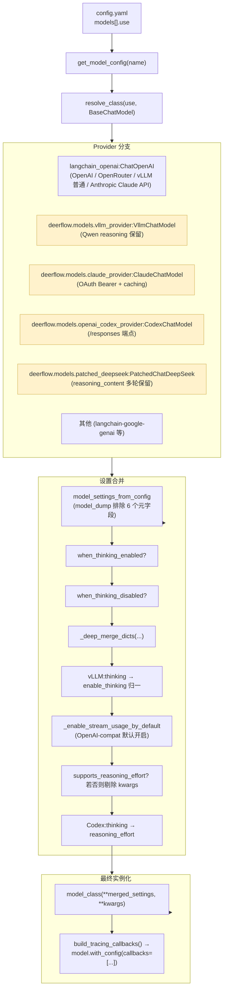
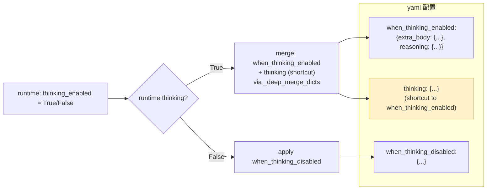
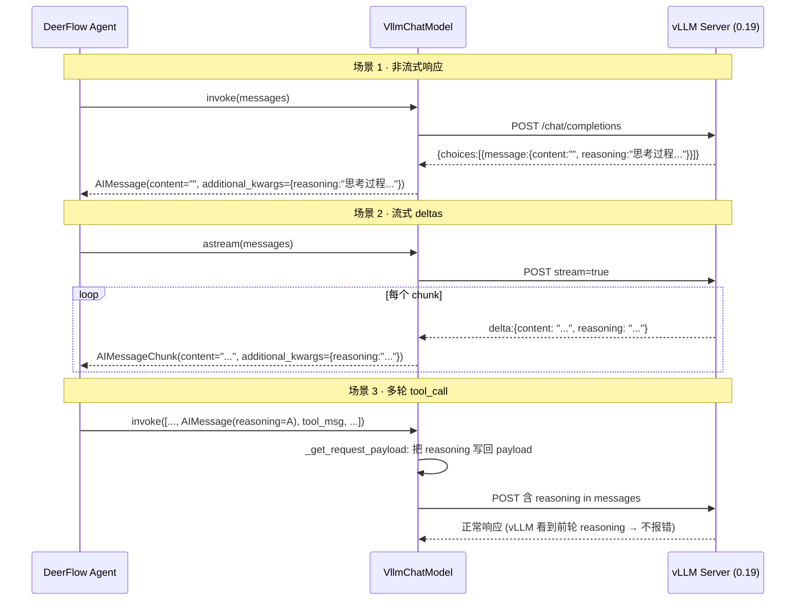

# 21 · 模型工厂：反射 + Thinking + Vision + 自定义 Provider

> 关键技术点层第 2 篇。前 20 章 agent 全程都用"某个 LLM"，但**这个 LLM 实例是怎么造出来的**？
>
> DeerFlow `create_chat_model` 是个**80 行的工厂函数**，但**承载了**：
> 1. **反射加载** —— `resolve_class(use, BaseChatModel)` 让 yaml 一行配置切 provider
> 2. **Thinking 模式管理** —— 7 种不同 provider（Anthropic / OpenAI / DeepSeek / Qwen / vLLM / Codex / Minimax）的 thinking API 形式各不同，工厂统一抹平
> 3. **Vision 能力声明** —— `supports_vision` 驱动 ViewImageMiddleware 是否挂
> 4. **5 个自定义 Provider** —— `VllmChatModel` / `ClaudeChatModel` / `CodexChatModel` / `MindIEChatModel` / `patched_*` —— 每个解决一个 langchain 原生不解决的真实问题
> 5. **Tracing 自动注入** —— LangSmith / Langfuse callbacks 在 factory 内组装
>
> 关键看点：**`when_thinking_enabled` deep merge + Qwen `enable_thinking` 兼容 + Claude OAuth Bearer + DeepSeek `reasoning_content` 多轮保留**。

---

## 🎯 学习目标

读完这份文档，你能回答：

1. **`when_thinking_enabled` / `when_thinking_disabled` / `thinking` 三个字段**在 ModelConfig 中各自的角色 + 合并优先级？为什么不只用一个？
2. **vLLM `VllmChatModel` 自定义 Provider** 解决了什么 LangChain 原生 `ChatOpenAI` **会丢失**的关键信息？为什么会丢？
3. **`_enable_stream_usage_by_default` 为什么对带 `base_url` 的 OpenAI 配置默认开启 stream_usage**？这是个**容易被忽略但影响 token usage 监控**的工程坑。
4. **`PatchedChatDeepSeek` 重载 `_get_request_payload`** —— 为什么 DeepSeek 在 thinking 模式下需要"把 reasoning_content 在多轮中传回"？不传会出什么错？
5. **`ClaudeChatModel` 自动从 `~/.claude/.credentials.json` 读 OAuth token + 用 Bearer 而非 x-api-key** —— 解决了 langchain `ChatAnthropic` 不支持什么场景？

---

## 🗂️ 源码定位

| 关注点 | 文件 / 行号 | 关键锚点 |
|---|---|---|
| 工厂函数（80 行） | `packages/harness/deerflow/models/factory.py` | `create_chat_model` L50；`_deep_merge_dicts` L13；`_vllm_disable_chat_template_kwargs` L24；`_enable_stream_usage_by_default` L34 |
| ModelConfig schema | `packages/harness/deerflow/config/model_config.py` | `name / use / model / use_responses_api / output_version / supports_thinking / supports_reasoning_effort / when_thinking_enabled / when_thinking_disabled / supports_vision / thinking`（shortcut） |
| **vLLM 自定义 Provider** | `packages/harness/deerflow/models/vllm_provider.py` | `VllmChatModel(ChatOpenAI)`；`_normalize_vllm_chat_template_kwargs`（thinking → enable_thinking）；`_reasoning_to_text`；保留 reasoning field 三场景：non-streaming / streaming deltas / multi-turn requests |
| **Claude OAuth Provider** | `packages/harness/deerflow/models/claude_provider.py` | `ClaudeChatModel(ChatAnthropic)`；OAuth Bearer 头注入；`OAUTH_BILLING_HEADER`；prompt caching；thinking budget ratio = 0.8 |
| **Codex Responses Provider** | `packages/harness/deerflow/models/openai_codex_provider.py` | `CodexChatModel`：走 OpenAI 内部 `/responses` 端点 |
| MindIE Provider | `packages/harness/deerflow/models/mindie_provider.py` | 华为昇腾推理引擎适配 |
| **patched_deepseek** | `packages/harness/deerflow/models/patched_deepseek.py` | `PatchedChatDeepSeek._get_request_payload`：把 reasoning_content 注回 payload |
| **patched_minimax / patched_openai** | `packages/harness/deerflow/models/patched_minimax.py` / `patched_openai.py` | 修复 Minimax / OpenAI tool_call 序列化漂移 |
| OAuth credential 加载 | `packages/harness/deerflow/models/credential_loader.py` | `is_oauth_token`（sk-ant-oat 前缀）；`ClaudeCodeCredential`；4 个 fallback 源（env / file_descriptor / explicit path / `~/.claude/.credentials.json`） |
| Tracing 注入 | `packages/harness/deerflow/tracing/factory.py` | `build_tracing_callbacks` —— 在 model bind 时挂上 LangSmith / Langfuse handler |
| 反射加载 | `packages/harness/deerflow/reflection/resolvers.py` | `resolve_class(use, BaseChatModel)` |

---

## 🧭 架构图

### 1. `create_chat_model` 调用链 + 5 个 provider 分支



### 2. ModelConfig `thinking` 三字段语义



### 3. vLLM `reasoning` field 三场景保留



---

## 🔍 核心逻辑讲解

### Part 1 · 反射加载 + ModelConfig schema

#### 反射加载

```python
model_class = resolve_class(model_config.use, BaseChatModel)
```

**`use` 字段是个 `module:Class` 路径字符串**（05 章讲过反射）：
- `langchain_openai:ChatOpenAI` —— 标准 OpenAI
- `deerflow.models.vllm_provider:VllmChatModel` —— DeerFlow 自定义
- `langchain_anthropic:ChatAnthropic` —— Anthropic 标准
- `langchain_google_genai:ChatGoogleGenerativeAI` —— Google Gemini
- ...

**`base_class=BaseChatModel`** 让 `resolve_class` 强制类型校验 —— 不是 BaseChatModel 子类就 raise。

#### `model_settings_from_config` 的 `model_dump` 排除元字段

```python
model_settings_from_config = model_config.model_dump(
    exclude_none=True,
    exclude={
        "use", "name", "display_name", "description",
        "supports_thinking", "supports_reasoning_effort",
        "when_thinking_enabled", "when_thinking_disabled",
        "thinking", "supports_vision",
    },
)
```

**6 类排除**：
- **`use / name / display_name / description`** —— DeerFlow 元数据，provider 用不到
- **`supports_*`** —— 能力声明，driver factory 行为（如挂 ViewImageMiddleware），但**不传给 provider 构造函数**
- **`when_thinking_*` / `thinking`** —— 由 factory 单独处理 thinking 逻辑

**剩下的字段**（如 `api_key / model / base_url / max_tokens / temperature`）作为 kwargs 传 provider 构造。

#### `ConfigDict(extra="allow")`

```python
class ModelConfig(BaseModel):
    ...
    model_config = ConfigDict(extra="allow")
```

**`extra="allow"`** —— Pydantic 不会拒绝未声明字段。用户可以在 yaml 加 provider 特有字段（如 `frequency_penalty: 0.5`）—— Pydantic 保留，model_dump 时一并 dump，传给 provider。**让 ModelConfig 不必为每个 provider 字段都显式声明**。

### Part 2 · `when_thinking_enabled` / `_disabled` / `thinking` 三字段

#### 设计动机

不同 LLM provider 的 thinking API **形式完全不同**：

| Provider | Thinking 启用方式 |
|---|---|
| **OpenAI** o-series | `reasoning_effort: "low" / "medium" / "high"` |
| **Anthropic Claude** | `thinking: {type: "enabled", budget_tokens: ...}` |
| **DeepSeek-R1 / Reasoner** | 默认开，需保留 `reasoning_content` |
| **Qwen 系列 (vLLM 0.19+)** | `extra_body.chat_template_kwargs.enable_thinking: true` |
| **Minimax M1** | `extra_body.chat_template_kwargs.thinking: true` |
| **Doubao** | 模型名后缀（如 `doubao-pro-thinking`） |

**DeerFlow 让 yaml 配置抹平这些差异**：

```yaml
# OpenAI o-series
- name: gpt-5
  use: langchain_openai:ChatOpenAI
  model: gpt-5
  supports_thinking: true
  supports_reasoning_effort: true
  when_thinking_enabled:
    reasoning_effort: medium

# Claude with thinking
- name: claude-sonnet-4.6
  use: deerflow.models.claude_provider:ClaudeChatModel
  model: claude-sonnet-4-6
  supports_thinking: true
  when_thinking_enabled:
    thinking:
      type: enabled
      budget_tokens: 4000

# Qwen 通过 vLLM
- name: qwen3-32b-vllm
  use: deerflow.models.vllm_provider:VllmChatModel
  model: Qwen/Qwen3-32B
  supports_thinking: true
  when_thinking_enabled:
    extra_body:
      chat_template_kwargs:
        enable_thinking: true
```

#### 三字段优先级

```python
has_thinking_settings = (model_config.when_thinking_enabled is not None) or (model_config.thinking is not None)
effective_wte: dict = dict(model_config.when_thinking_enabled) if model_config.when_thinking_enabled else {}

if model_config.thinking is not None:
    effective_wte = _deep_merge_dicts(effective_wte, model_config.thinking)    # ⭐ shortcut merge

if thinking_enabled and has_thinking_settings:
    model_settings_from_config = _deep_merge_dicts(model_settings_from_config, effective_wte)
elif not thinking_enabled and model_config.when_thinking_disabled:
    model_settings_from_config = _deep_merge_dicts(model_settings_from_config, model_config.when_thinking_disabled)
```

**优先级**：
1. **`when_thinking_enabled`** —— 主字段
2. **`thinking`**（shortcut）—— 深 merge 进 `when_thinking_enabled`，覆盖同名键
3. 最终 deep merge 到 `model_settings_from_config`

**为什么需要 `thinking` shortcut？**
- 历史包袱：早期只有 `thinking` 字段，后来发现需要 `when_thinking_disabled` 对称才加了 `when_thinking_*` 系列
- 保持向后兼容 —— 老配置仍能跑
- shortcut 简洁 —— 大多数 case 用户只关心 enabled 时的设置

#### `_deep_merge_dicts` 的递归合并

```python
def _deep_merge_dicts(base: dict | None, override: dict) -> dict:
    merged = dict(base or {})
    for key, value in override.items():
        if isinstance(value, dict) and isinstance(merged.get(key), dict):
            merged[key] = _deep_merge_dicts(merged[key], value)        # ⭐ 递归
        else:
            merged[key] = value
    return merged
```

**为什么需要深合并？**
- `extra_body.chat_template_kwargs` 嵌套两层
- 用户在 base 配 `extra_body: {key1: v1}`，thinking 时加 `extra_body: {key2: v2}`
- 浅合并：thinking 时 `extra_body` 被完全替换 → key1 丢失
- 深合并：合并到 `{key1: v1, key2: v2}` —— 期待行为

### Part 3 · `_enable_stream_usage_by_default` —— 被忽略的工程坑

```python
def _enable_stream_usage_by_default(model_use_path: str, model_settings_from_config: dict) -> None:
    if model_use_path != "langchain_openai:ChatOpenAI":
        return
    if "stream_usage" in model_settings_from_config:
        return                                          # 用户显式配置过 → 尊重
    if "base_url" in model_settings_from_config or "openai_api_base" in model_settings_from_config:
        model_settings_from_config["stream_usage"] = True    # ⭐ 自动开启
```

#### LangChain 默认行为

LangChain `ChatOpenAI` 的 `stream_usage`：
- **配 OpenAI 原生**（无 base_url）→ 自动 True
- **配 OpenAI 兼容 gateway**（有 base_url，如 vLLM / OpenRouter / DeepSeek）→ 自动 False

#### 为什么 DeerFlow 自动反转

**TokenUsageMiddleware（23 章）依赖流式 `usage_metadata`** 来跟踪每次 LLM 调用的 token 消耗。
- 如果 `stream_usage=False` → streaming 的 chunk 不带 usage → middleware 拿不到 token 数 → 用户看不到费用
- LangChain 默认对 base_url 用户保守 False 是因为"兼容 gateway 可能不支持" → 但**大多数现代 OpenAI-compat gateway**（vLLM / OpenRouter / DeepSeek 等）都支持 `stream_options: include_usage: true`

**DeerFlow 反过来 default True** —— 假设用户用的是支持的 gateway，**让 token 统计 default 可用**。如果用户的 gateway 真不支持，**显式配置 `stream_usage: false` 覆盖**。

→ **"convention over configuration"** 经典案例：默认值朝"大多数用户实际需要"倾斜。

### Part 4 · 自定义 Provider 4 个深度案例

#### 案例 A · `VllmChatModel`：保留 `reasoning` field

**问题**：vLLM 0.19 Qwen reasoning 模型在响应里**夹带非标准 `reasoning` 字段**，LangChain `ChatOpenAI` 不识别 → **丢弃**。

```python
# vLLM 响应:
{
  "choices": [{
    "message": {
      "content": "",
      "reasoning": "用户问的是... 我应该...",
      "tool_calls": [...]
    }
  }]
}

# langchain_openai 直接 drop "reasoning",
# 下次 multi-turn 时 messages 里没 reasoning → vLLM 报错"strict reasoning history required"
```

**`VllmChatModel` 的修复**（3 场景）：

```python
# 1. non-streaming: 保留到 additional_kwargs
def _create_chat_result(self, response, ...):
    result = super()._create_chat_result(response, ...)
    for gen in result.generations:
        if isinstance(gen.message, AIMessage):
            raw = response.choices[0].message
            if hasattr(raw, "reasoning") and raw.reasoning:
                gen.message.additional_kwargs["reasoning"] = _reasoning_to_text(raw.reasoning)
    return result

# 2. streaming: 每个 chunk 都从 delta 提取
def _convert_chunk_to_message_chunk(self, chunk, default_class):
    msg_chunk = super()._convert_chunk_to_message_chunk(chunk, default_class)
    delta = chunk.choices[0].delta
    if hasattr(delta, "reasoning") and delta.reasoning:
        msg_chunk.additional_kwargs["reasoning"] = delta.reasoning
    return msg_chunk

# 3. multi-turn payload: 写回 message 字段
def _get_request_payload(self, input_, *, stop=None, **kwargs):
    payload = super()._get_request_payload(input_, stop=stop, **kwargs)
    for msg in payload["messages"]:
        if msg.get("role") == "assistant" and "reasoning" not in msg:
            # 从 additional_kwargs 拿回来
            # ...
    _normalize_vllm_chat_template_kwargs(payload)
    return payload
```

**`_normalize_vllm_chat_template_kwargs`** 兼容旧配置：DeerFlow 早期 docs 推荐 `chat_template_kwargs.thinking`，vLLM 0.19 改用 `enable_thinking` —— provider 在 outgoing payload 里**自动改名**，老配置继续工作。

#### 案例 B · `ClaudeChatModel`：OAuth Bearer + Prompt Caching

**问题 1**：用户用 Claude Code CLI 登录，token 是 OAuth `sk-ant-oat...` 不是 API key —— `ChatAnthropic` 原生只支持 `x-api-key` header。

**`ClaudeChatModel` 的处理**：
1. **`is_oauth_token(token)`** 检测前缀 `sk-ant-oat`
2. 是 OAuth → 用 `Authorization: Bearer ...` 而非 `x-api-key`
3. 注入 `anthropic-beta: oauth-2025-04-20,claude-code-20250219,interleaved-thinking-2025-05-14`
4. 系统提示前置注入 `OAUTH_BILLING_HEADER`（Anthropic OAuth 要求）

**问题 2**：Anthropic 标准 `prompt_caching` 字段需要正确配置 —— `ClaudeChatModel` 自动处理。

**问题 3**：thinking_enabled 时**自动分配 max_tokens 的 80% 给 thinking budget**：

```python
THINKING_BUDGET_RATIO = 0.8
# 例:max_tokens=4096 → thinking budget = 3276
```

#### 案例 C · `PatchedChatDeepSeek`：多轮保留 `reasoning_content`

DeepSeek-R1 / DeepSeek-Reasoner 在 thinking 模式下，每条 AIMessage 都带 `reasoning_content` 字段。**严格 API** 在多轮请求里要求**所有** assistant message 都带 reasoning_content。

**Bug**：`ChatDeepSeek` 标准实现把 `reasoning_content` 存到 `additional_kwargs.reasoning_content`，但**下次构造 request payload 时不读出来** → API 端看到缺失 → 报错。

**修复**：覆写 `_get_request_payload`，从 `additional_kwargs` 把 reasoning_content **注回 message**。

#### 案例 D · `CodexChatModel`：thinking → reasoning_effort 映射

**OpenAI o-series 的 Responses API**（不是 Chat Completions API）：
- 用 `reasoning_effort: "low" | "medium" | "high" | "minimal"` 控制思考强度
- DeerFlow `CodexChatModel` 把 yaml 的 `thinking_enabled: false` 映射成 `reasoning_effort: "none"`，`true` 映射成 `"medium"`（默认）或用户显式指定的值

```python
# factory.py 关键段:
if issubclass(model_class, CodexChatModel):
    explicit_effort = kwargs.pop("reasoning_effort", None)
    if not thinking_enabled:
        model_settings_from_config["reasoning_effort"] = "none"
    elif explicit_effort:
        model_settings_from_config["reasoning_effort"] = explicit_effort
    elif "reasoning_effort" not in model_settings_from_config:
        model_settings_from_config["reasoning_effort"] = "medium"
```

### Part 5 · `credential_loader` 4 个 fallback 源

`packages/harness/deerflow/models/credential_loader.py` 实现 **Claude Code OAuth + Codex CLI** 凭据自动加载：

```python
def load_claude_oauth_credential() -> ClaudeCodeCredential | None:
    # 优先级:
    # 1. CLAUDE_CODE_OAUTH_TOKEN env var
    # 2. ANTHROPIC_AUTH_TOKEN env var
    # 3. CLAUDE_CODE_OAUTH_TOKEN_FILE_DESCRIPTOR (FD 数字)
    # 4. CLAUDE_CODE_CREDENTIALS_PATH env var (显式文件路径)
    # 5. ~/.claude/.credentials.json (默认位置)
```

**用户最方便的路径**：用 Claude Code CLI 登录一次 → `~/.claude/.credentials.json` 存好 → DeerFlow 自动捡起来 —— **无需重复配置 API key**。

**FD descriptor 路径**：用于 Claude Code 外部 spawn DeerFlow 进程时，**通过文件描述符传 token** 而不是 env var（更安全）。

---

## 🧩 体现的通用 Agent 设计模式

| 模式 | Model Factory 中的体现 |
|---|---|
| **Reflective Plugin Loading** | `resolve_class(use, BaseChatModel)` |
| **Capability Declaration via Config** | `supports_thinking / supports_vision / supports_reasoning_effort` |
| **Conditional Settings Merge** | when_thinking_enabled / disabled + shortcut + deep_merge |
| **Provider Adapter Pattern** | 5 个自定义 provider 适配 langchain 不支持的能力 |
| **Sensible Default Inversion** | `_enable_stream_usage_by_default` 反 langchain 默认 |
| **Multi-source Credential Loading** | `credential_loader` 4 个 fallback |
| **Backward-compatible Shortcut** | `thinking` 字段 merge 进 `when_thinking_enabled` |
| **API Version Abstraction** | `use_responses_api` / Codex `reasoning_effort` 映射 |

---

## 🧱 与 Agent Harness 六要素的对应关系

| 六要素 | Model Factory 怎么提供基础设施 |
|---|---|
| ① 反馈循环 | thinking_enabled 让 LLM 在反馈循环内显式 reasoning |
| ② 记忆持久化 | reasoning_content / reasoning field 跨轮保留是"短期推理记忆" |
| ③ 动态上下文 | supports_vision 驱动 ViewImageMiddleware 是否挂 |
| ④ 安全护栏 | credential_loader 多源 fallback 避免凭据明文裸露 |
| ⑤ 工具集成 | model 是 agent 调用工具的核心引擎 |
| ⑥ 可观测性 | `build_tracing_callbacks` 自动挂 LangSmith / Langfuse |

---

## ⚠️ 常见坑与调试技巧

### 坑 1 · vLLM 配 `chat_template_kwargs.thinking` 不生效

**症状**：用户按 DeerFlow 早期 docs 配 `chat_template_kwargs.thinking: true`，但 LLM 不思考。
**原因**：vLLM 0.19 用 `enable_thinking` 不是 `thinking`。
**修复**：`_normalize_vllm_chat_template_kwargs` 自动改名 —— **用户配置无需改**。但启动时 log 一条 info 让用户知道发生了归一化。

### 坑 2 · `stream_usage` 没开 → token usage 全 0

**症状**：DeerFlow 监控面板 token usage 永远 0。
**原因**：用户配了 OpenAI 兼容 gateway 但 gateway 不支持 `stream_options: include_usage`。
**修复**：
- 检查 gateway 文档是否支持
- 如果不支持，**显式** `stream_usage: false` —— DeerFlow factory 尊重显式配置
- 或者改 fallback：用 non-streaming 调用 + post-call usage 提取（但失去流式优势）

### 坑 3 · DeepSeek thinking 模式多轮报错 "reasoning_content required"

**症状**：第 1 轮 OK，第 2 轮起报错。
**原因**：用了 `langchain_deepseek:ChatDeepSeek`（原生）而不是 `deerflow.models.patched_deepseek:PatchedChatDeepSeek`。
**修复**：改 yaml `use: deerflow.models.patched_deepseek:PatchedChatDeepSeek`。

### 坑 4 · Claude OAuth token 过期

**症状**：用 `~/.claude/.credentials.json` 跑了几小时后 401。
**原因**：OAuth access_token 默认有效期（数小时）—— Claude Code CLI 会自动 refresh，但 DeerFlow 拿到的是 access_token 不是 refresh_token。
**修复**：
- 短期：`claude` CLI 重新登录刷新 credentials.json
- 长期：扩展 `credential_loader` 加 refresh 流程（用 `refresh_token` 调 Anthropic OAuth token endpoint）—— **DeerFlow 当前没做**，是个 PR 机会

### 坑 5 · `supports_vision: true` 但模型不支持

**症状**：用户在 yaml 错配 `supports_vision: true`（实际模型不支持） → ViewImageMiddleware 挂 → 模型收到 base64 image → 报错。
**修复**：
- factory 启动时 sanity check（如果 model 名含 'gpt-4o' / 'claude-3' 等已知 vision 模型 → ok；否则 warning）
- 或者运行时降级：第一次 vision 调用失败时关闭 ViewImage —— **DeerFlow 当前都没做**

---

## 🛠️ 动手实操

> 本 demo 不调真 LLM（避免 cost），重点验证 factory 的合并逻辑、反射加载、配置兼容性。

### Demo · Model Factory 核心机制实测

```python
"""
Model Factory demo.

跑法:  PYTHONPATH=backend uv run python scripts/model_factory_walkthrough.py
"""
import sys, os
from pathlib import Path

sys.path.insert(0, "backend")
sys.path.insert(0, "backend/packages/harness")
os.chdir(Path(__file__).resolve().parents[1])

from deerflow.models.factory import (
    _deep_merge_dicts,
    _vllm_disable_chat_template_kwargs,
    _enable_stream_usage_by_default,
)
from deerflow.models.credential_loader import is_oauth_token


# ====== Case 1: _deep_merge_dicts 递归合并 ======
print("\n" + "=" * 70)
print("CASE 1 · _deep_merge_dicts 递归合并")
print("=" * 70)

base = {
    "extra_body": {"key1": "v1", "chat_template_kwargs": {"a": 1}},
    "temperature": 0.7,
}
override = {
    "extra_body": {"key2": "v2", "chat_template_kwargs": {"b": 2}},
    "max_tokens": 4096,
}
merged = _deep_merge_dicts(base, override)
print(f"  base: {base}")
print(f"  override: {override}")
print(f"  merged: {merged}")
print(f"  ✅ extra_body 的 chat_template_kwargs 应该是 {{a:1, b:2}}")


# ====== Case 2: _vllm_disable_chat_template_kwargs ======
print("\n" + "=" * 70)
print("CASE 2 · _vllm_disable_chat_template_kwargs")
print("=" * 70)

cases = [
    {"thinking": True},
    {"enable_thinking": True},
    {"thinking": True, "enable_thinking": True},
    {"unrelated": "x"},
]
for ckw in cases:
    disable = _vllm_disable_chat_template_kwargs(ckw)
    print(f"  input: {ckw}")
    print(f"  disable payload: {disable}")


# ====== Case 3: _enable_stream_usage_by_default ======
print("\n" + "=" * 70)
print("CASE 3 · _enable_stream_usage_by_default")
print("=" * 70)

scenarios = [
    # (use, settings)
    ("langchain_openai:ChatOpenAI", {}),                                # OpenAI 原生:不 touch
    ("langchain_openai:ChatOpenAI", {"base_url": "https://my-gw"}),     # OpenAI-compat gateway:开
    ("langchain_openai:ChatOpenAI", {"base_url": "x", "stream_usage": False}),  # 显式 false:尊重
    ("deerflow.models.vllm_provider:VllmChatModel", {"base_url": "x"}), # 非 ChatOpenAI:不 touch
]

for use, settings in scenarios:
    settings_copy = dict(settings)
    _enable_stream_usage_by_default(use, settings_copy)
    print(f"  use={use!r}")
    print(f"    before: {settings}")
    print(f"    after:  {settings_copy}")


# ====== Case 4: is_oauth_token ======
print("\n" + "=" * 70)
print("CASE 4 · is_oauth_token 前缀检测")
print("=" * 70)

tokens = [
    "sk-ant-api-abc123def456",                # API key
    "sk-ant-oat-01-token-here",                # OAuth token
    "ANTHROPIC_KEY_HERE",                       # bad
    "",
    None,
]
for tk in tokens:
    print(f"  {tk!r:<40} → is_oauth_token: {is_oauth_token(tk)}")


# ====== Case 5: 反射加载几个常见 provider class ======
print("\n" + "=" * 70)
print("CASE 5 · 反射加载常见 provider")
print("=" * 70)

from deerflow.reflection import resolve_class
from langchain.chat_models import BaseChatModel

provider_paths = [
    "langchain_openai:ChatOpenAI",
    "deerflow.models.vllm_provider:VllmChatModel",
    "deerflow.models.patched_deepseek:PatchedChatDeepSeek",
]
for path in provider_paths:
    try:
        cls = resolve_class(path, BaseChatModel)
        print(f"  ✅ {path:<60} → {cls.__name__}")
        print(f"     is subclass of BaseChatModel? {issubclass(cls, BaseChatModel)}")
    except Exception as e:
        print(f"  ❌ {path:<60} → {type(e).__name__}: {str(e)[:60]}")


# ====== Case 6: ModelConfig 三 thinking 字段语义 ======
print("\n" + "=" * 70)
print("CASE 6 · ModelConfig thinking 三字段合并优先级")
print("=" * 70)

from deerflow.config.model_config import ModelConfig

cfg = ModelConfig(
    name="test",
    use="langchain_openai:ChatOpenAI",
    model="test-model",
    supports_thinking=True,
    when_thinking_enabled={"reasoning_effort": "medium", "extra_body": {"key_a": "from_when"}},
    thinking={"extra_body": {"key_b": "from_shortcut", "key_a": "OVERRIDDEN"}},
    when_thinking_disabled={"reasoning_effort": "none"},
)

# 模拟 factory.py 的合并逻辑
effective_wte = dict(cfg.when_thinking_enabled) if cfg.when_thinking_enabled else {}
if cfg.thinking is not None:
    effective_wte = _deep_merge_dicts(effective_wte, cfg.thinking)
print(f"  effective when_thinking_enabled = {effective_wte}")
print(f"  ✅ extra_body.key_a 应该被 thinking shortcut 覆盖为 'OVERRIDDEN'")
print(f"  ✅ extra_body.key_b 由 shortcut 新增")
print(f"  ✅ reasoning_effort='medium' 由 when_thinking_enabled 保留")
```

### 调试任务

1. **断点位置**：
   - `factory.py::create_chat_model` 的 `model_class = resolve_class(...)` —— 看实际加载的类
   - `factory.py` 的 `effective_wte = _deep_merge_dicts(...)` —— 看合并后 dict
   - `vllm_provider.py::_normalize_vllm_chat_template_kwargs` —— 看 thinking → enable_thinking 改名
2. **观察什么**：
   - Case 1：`chat_template_kwargs` 含 a 和 b 两个键
   - Case 2：input 含 thinking → disable payload 含 thinking:False
   - Case 3：base_url 存在 → stream_usage=True 被自动加；显式 False 时不动
   - Case 4：仅 `sk-ant-oat...` 前缀触发 True
   - Case 5：3 个 provider 全部解析成功
   - Case 6：shortcut 覆盖 when_thinking_enabled 同名键

3. **人为制造异常**：
   - Case 5 改成 `"deerflow.models.nonexistent:FakeModel"` → 看 actionable hint
   - Case 6 把 `when_thinking_enabled={"reasoning_effort": "medium"}` 改成 `None` → 看合并结果

### 改造练习

1. **练习 A（简单）**：在 `_enable_stream_usage_by_default` 加 logger.info 报告"自动开启了 stream_usage" —— 让用户启动时能看到这个行为生效。
2. **练习 B（中等）**：扩展 `credential_loader` 加 Claude OAuth refresh_token 流程：检测 token 即将过期时主动调 Anthropic OAuth endpoint 刷新。
3. **挑战题**：写一个 "model capability sanity check" —— 启动时检测每个 model 的 `supports_*` 声明与实际 model 名是否合理（如 model 名含 'gpt-4o' / 'claude-3.5' 时 supports_vision 应该为 True；否则 log warning）。

### 预期输出 & 验证方式

- Case 1：deep merge 成功合并嵌套字段
- Case 2：每条规则正确触发
- Case 3：4 种 scenario 行为如表所述
- Case 4：仅 sk-ant-oat 前缀触发
- Case 5：3 个 provider 全部解析为 BaseChatModel 子类
- Case 6：shortcut 覆盖 when_thinking_enabled 同名键

---

## 🎤 面试视角

### 业务型大厂卷

**问 1**：DeerFlow 维护了 5 个自定义 Provider（vLLM / Claude / Codex / MindIE / patched_*）。**作为 framework 维护者**，怎么决定"什么时候 fork 一个 patched_*" vs "贡献回 langchain upstream"？

> **教科书答案**：
> 决策矩阵：
> | 修复类型 | 建议 |
> |---|---|
> | 与上游核心 API 冲突 / 上游不愿接受 | fork patched_* |
> | 上游开放 issue / PR 长期 stuck | fork + log warning + 定期检查 upstream |
> | bug 上游已修但版本未发布 | 短期 fork，跟版本发布同步删除 |
> | DeerFlow 独有的能力扩展（OAuth Bearer / billing header） | fork 长期维护 |
> DeerFlow 5 个 provider 的归属：
> - `patched_deepseek` / `patched_minimax` / `patched_openai` —— 短期 patched，上游修了就可以撤
> - `VllmChatModel` —— vLLM 上游可能合并，但 DeerFlow 加了 `_normalize_vllm_chat_template_kwargs` 兼容历史配置 → 长期保留
> - `ClaudeChatModel` —— OAuth Bearer + billing header 是 Claude Code 独有，langchain 不会加 → 永久 fork
> - `CodexChatModel` —— Responses API 适配，可能 upstream
> **关键工程纪律**：在每个 patched_* 文件顶部写**为什么 patched + 关联上游 issue 链接 + 何时可以撤**。

**问 2**：`_enable_stream_usage_by_default` 反 langchain 默认，对 OpenAI-compat gateway 默认开启 `stream_usage`。**这种"convention over configuration"取舍**的边界在哪？什么时候不应该自动改 default？

> **教科书答案**：
> 反 default 适用场景：
> 1. **大多数用户实际需要** —— stream_usage 对 OpenAI-compat 用户 99% 都需要
> 2. **不开启的负面 cost 大** —— token usage 0 → 监控丢、计费丢，用户不易察觉
> 3. **开启的负面 cost 小** —— gateway 若不支持，会忽略额外参数（不报错）
> **不应该反 default 的场景**：
> 1. **改变安全姿态**（如默认开 verbose log → 暴露 PII）
> 2. **影响计费**（如默认开高质量模式）
> 3. **不可逆操作**（如默认开 auto delete）
> 通用原则：**default 改动 = "对 sensible default 的全球性 opinion"**。DeerFlow 在 stream_usage 上是有 opinion 的，但**显式 false 仍尊重**（用户能 override）。这是个合格的 opinionated default。

### 创业型 AI 公司卷

**问 3**：你团队接到任务："添加 Google Gemini 2.0 Flash thinking mode 支持"。**用 DeerFlow Model Factory 的扩展点设计完整方案**。

> **参考答案**：
> 步骤：
> 1. **不写新 provider**：langchain_google_genai 已提供 `ChatGoogleGenerativeAI` —— 复用
> 2. **yaml 配置**：
>    ```yaml
>    - name: gemini-2.0-flash-thinking
>      use: langchain_google_genai:ChatGoogleGenerativeAI
>      model: gemini-2.0-flash-thinking-exp
>      api_key: $GEMINI_API_KEY
>      supports_thinking: true
>      supports_vision: true
>      when_thinking_enabled:
>        thinking_config:
>          include_thoughts: true
>          # Google Gemini 特定字段
>    ```
> 3. **测试**：跑一遍 chat，确认 prompt 含 system_prompt + thinking 输出可见
> 4. **如果 langchain 适配器不支持新字段** → 写 `GoogleGeminiPatchedChatModel(ChatGoogleGenerativeAI)`，覆写 `_get_request_payload` 注入字段
> 5. **stream_usage**：检查 Gemini 流式响应是否带 usage —— 如果不带，TokenUsage middleware 拿不到 → 启用 non-streaming 模式监控
> **DeerFlow 的扩展性体现**：90% 情况下**只写 yaml**不写 Python，**仅在 langchain 适配器有 bug / 缺字段时**才 fork patched_*。

**问 4**：你的同事说："5 个 provider patched 太多了，能不能合并？" **逐一评估每个 patched_* 的"合并" 可能性**。

> **参考答案**：
> 评估表：
> | provider | 解决问题 | 能合并吗 | 理由 |
> |---|---|---|---|
> | `patched_deepseek` | reasoning_content 多轮保留 | ✅ 可上游 | langchain-deepseek 没看到长期不修的迹象 |
> | `patched_minimax` | tool_call 序列化漂移 | ✅ 可上游 | 同样可贡献 |
> | `patched_openai` | tool_call 边界场景 | ✅ 已部分修复上游 | 跟版本删除 |
> | `VllmChatModel` | reasoning field 保留 + thinking 归一化 | ❌ 难合并 | vLLM 0.19 这个字段是非标的，OpenAI SDK 不会原生支持。归一化是 DeerFlow 的兼容性需求 |
> | `ClaudeChatModel` | OAuth Bearer + billing header + caching | ❌ 不能合并 | Claude Code 独有，Anthropic 官方不会把它合并到 langchain |
> | `CodexChatModel` | Responses API + reasoning_effort 映射 | ✅ 部分上游 | langchain-openai 已开始支持 responses，部分代码可撤 |
> | `MindIEChatModel` | 华为昇腾 | ❌ 不能合并 | 国内特定生态 |
> **结论**：能合并的可合并，但**永久 fork 的也合理**（OAuth / vendor 独占功能）。**精确说"哪些是临时哪些是长期"** 才能避免"全部撤掉" 这种过度优化。

---

## 📚 延伸阅读

- **LangChain Chat Models 文档**：https://python.langchain.com/docs/integrations/chat/
  *看 langchain 官方支持的 provider 列表 + 标准接口。*
- **vLLM Reasoning Parser**：https://docs.vllm.ai/en/latest/features/reasoning_outputs.html
  *理解 vLLM 0.19 reasoning models 的非标响应字段。*
- **OpenAI Reasoning Effort 文档**：https://platform.openai.com/docs/guides/reasoning
  *理解 reasoning_effort 字段如何影响 o-series 模型行为。*
- **Anthropic Prompt Caching**：https://docs.claude.com/en/docs/build-with-claude/prompt-caching
  *与 ClaudeChatModel 的 caching 实现对照。*
- **DeerFlow `docs/CONFIGURATION.md` model 章节**：项目内官方配置示例。

---

## 🎤 互动检查 —— 请回答这 3 个问题

> **两句话即可**。

1. **机制理解题**：`when_thinking_enabled` 和 `thinking` 字段都能配置 thinking 设置。**用一句话**说明它们的合并优先级 + 一句话说明为什么需要两个字段。
2. **设计动机题**：DeerFlow `_enable_stream_usage_by_default` 反 langchain 的默认（对 base_url 用户**开启** stream_usage）。**给一条**这种反 default 是对的理由 + **一条**潜在的副作用。
3. **应用题**：你的同事提了 PR："移除 `_normalize_vllm_chat_template_kwargs`，强制用户改 yaml 配置用 `enable_thinking`"。**给两条理由**说明应该被拒绝。

回答后我们进入 **`22-guardrails-and-security.md`** —— 安全护栏体系深潜。
