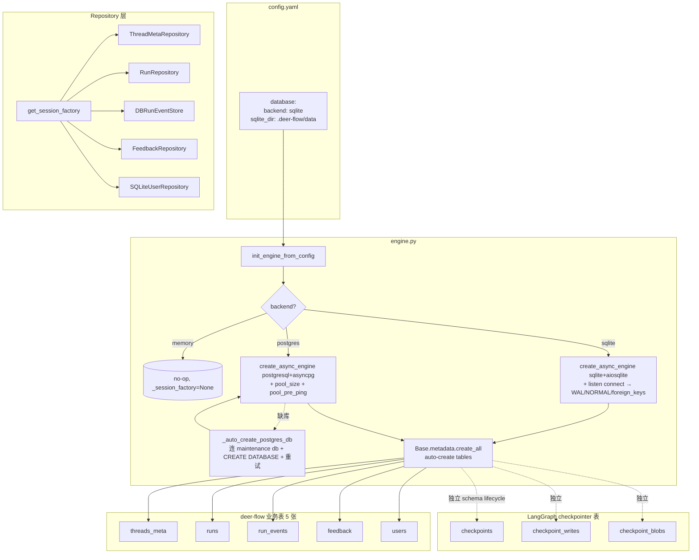
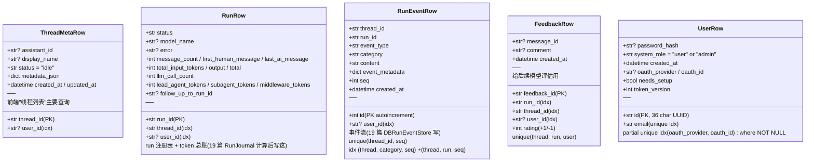

# 21 · Persistence：Alembic 迁移、threads_meta / runs / run_events / feedback / users 5 表设计

> 20 篇结尾说："Part I 的下一篇讲持久化"。这一章把 deer-flow 的业务数据持久化讲透——5 张业务表各自承担什么、为什么选 SQLAlchemy + 异步 + 共享 engine、SQLite 单文件和 Postgres 多 worker 怎么用同一份 schema、per-user 隔离怎么在 SQL 层实现、Alembic 在 deer-flow 当前阶段为什么是"准备但暂未使用"。
>
> 这是 deer-flow 数据层的全景。区别于 LangGraph 自带的 checkpointer 表（agent state 历史）——这 5 张是 deer-flow **自己的业务表**：thread 列表 / run 注册表 / event journal / 用户反馈 / 用户账户。

---

## 1. 模块定位（Why this matters）

deer-flow 数据库有 **2 套 schema 并存**：

| 来源 | 谁管 | 表数 | 责任 |
|------|------|------|------|
| **LangGraph checkpointer** | LangGraph 自己 | 3-4 张（取决于 backend）| agent state 持久化（checkpoint history + writes） |
| **deer-flow 业务表** | deerflow.persistence | 5 张 | 业务元数据（thread/run/event/feedback/user） |

**两套表共用一个 DB**（同一个 SQLite 文件或 Postgres database），但 **schema 独立维护**：

- LangGraph 表由 `make_checkpointer` 调 `saver.setup()` 自动建（01 篇见过）。
- deer-flow 表由 `init_engine + Base.metadata.create_all` 建。
- **Alembic 只管 deer-flow 业务表，绝不动 LangGraph 的**——见 `migrations/env.py:2-4` 注释。

不读这一章会错过 4 个关键认知：

1. **5 张业务表的责任清晰且不重叠**：threads_meta（thread 列表 + 显示名）/ runs（run 注册表 + token 总账）/ run_events（事件流，19 篇 RunEventStore 的存储）/ feedback（rating + comment，给 PR 评估）/ users（账户 + OAuth + token_version 改密码后让旧 token 失效）。
2. **SQLite 必须开 WAL + foreign_keys**：`@event.listens_for(_engine.sync_engine, "connect")` 给每个新连接挂监听器跑 PRAGMA——SQLite PRAGMA 是 per-connection 的，不能"启动时设一次就完事"。WAL 让并发读 + 单写不互相阻塞，是 production SQLite 的必备。
3. **Postgres 缺库自愈**：`init_engine` 第一次连失败时检测 "does not exist" → 连 maintenance db `postgres` → `CREATE DATABASE` → 重建 engine 重试。**用户配 postgres_url 但忘建库不会让 Gateway 启动失败**。
4. **`user_id` 是 nullable + index**：runs / run_events / feedback 都有 nullable user_id ——为"auth 之前的老数据"留 NULL 兼容，新数据由 AuthMiddleware 自动填（02 篇 ContextVar 现场）。这是平滑升级的工程兜底。

对应到 Harness 六要素：本章对应 **持久化 + 安全护栏（per-user 隔离）+ 可观测性（feedback）** 三条主线。

---

## 2. 源码地图（Source Map）

### 2.1 关键文件清单

| 路径 | 角色 |
|------|------|
| [`packages/harness/deerflow/persistence/engine.py`](../packages/harness/deerflow/persistence/engine.py) | `init_engine + close_engine + get_session_factory`（200 行） |
| [`packages/harness/deerflow/persistence/base.py`](../packages/harness/deerflow/persistence/base.py) | `Base = declarative_base()` 共享元数据 |
| [`packages/harness/deerflow/persistence/json_compat.py`](../packages/harness/deerflow/persistence/json_compat.py) | JSON 列在 SQLite/Postgres 的兼容 |
| [`packages/harness/deerflow/persistence/thread_meta/model.py`](../packages/harness/deerflow/persistence/thread_meta/model.py) | `ThreadMetaRow`（24 行） |
| [`packages/harness/deerflow/persistence/thread_meta/sql.py`](../packages/harness/deerflow/persistence/thread_meta/sql.py) | SQL repository |
| [`packages/harness/deerflow/persistence/thread_meta/memory.py`](../packages/harness/deerflow/persistence/thread_meta/memory.py) | dev/test in-memory |
| [`packages/harness/deerflow/persistence/run/model.py`](../packages/harness/deerflow/persistence/run/model.py) | `RunRow`（50 行，含 token 7 桶） |
| [`packages/harness/deerflow/persistence/run/sql.py`](../packages/harness/deerflow/persistence/run/sql.py) | SQL repository |
| [`packages/harness/deerflow/persistence/feedback/model.py`](../packages/harness/deerflow/persistence/feedback/model.py) | `FeedbackRow`（33 行） |
| [`packages/harness/deerflow/persistence/feedback/sql.py`](../packages/harness/deerflow/persistence/feedback/sql.py) | SQL repository |
| [`packages/harness/deerflow/persistence/user/model.py`](../packages/harness/deerflow/persistence/user/model.py) | `UserRow`（60 行） |
| [`packages/harness/deerflow/persistence/models/run_event.py`](../packages/harness/deerflow/persistence/models/run_event.py) | `RunEventRow`（36 行） |
| [`packages/harness/deerflow/persistence/migrations/env.py`](../packages/harness/deerflow/persistence/migrations/env.py) | Alembic environment（68 行） |
| [`packages/harness/deerflow/persistence/migrations/versions/`](../packages/harness/deerflow/persistence/migrations/versions/) | 当前空（只有 .gitkeep） |
| [`packages/harness/deerflow/config/database_config.py`](../packages/harness/deerflow/config/database_config.py) | `DatabaseConfig`（backend / sqlite_dir / postgres_url / pool_size） |

### 2.2 关键符号速查表

| 符号 | 文件:行 | 一句话职责 |
|------|---------|-----------|
| `Base` | `persistence/base.py` | SQLAlchemy declarative_base 共享 metadata |
| `init_engine(backend, url, echo, pool_size, sqlite_dir)` | `engine.py:57` | 主入口 |
| `init_engine_from_config(config)` | `engine.py:168` | 从 DatabaseConfig 调用 |
| `_json_serializer(obj)` | `engine.py:19` | `ensure_ascii=False` 支持中文 |
| `_auto_create_postgres_db(url)` | `engine.py:30` | postgres 缺库自愈 |
| `_enable_sqlite_wal(dbapi_conn, _)` | `engine.py:115` | per-connection PRAGMA 监听器 |
| `get_session_factory()` | `engine.py:182` | 拿 async_sessionmaker（memory backend 返 None） |
| `get_engine()` | `engine.py:187` | 拿 AsyncEngine |
| `close_engine()` | `engine.py:192` | shutdown 释放连接 |
| `class ThreadMetaRow(Base)` | `thread_meta/model.py:13` | thread 列表元数据 |
| `class RunRow(Base)` | `run/model.py:13` | run 注册表 + 7 token 桶 + 3 convenience 字段 |
| `class RunEventRow(Base)` | `models/run_event.py:13` | 事件流 + 3 index |
| `class FeedbackRow(Base)` | `feedback/model.py:13` | rating + comment + unique(thread, run, user) |
| `class UserRow(Base)` | `user/model.py:22` | 账户 + OAuth + token_version |
| `class DatabaseConfig` | `database_config.py` | yaml 配置 schema |
| `DatabaseConfig.sqlite_path` | `database_config.py` | 派生 `{sqlite_dir}/deerflow.db` |
| `DatabaseConfig.app_sqlalchemy_url` | `database_config.py` | 派生 `sqlite+aiosqlite:///...` 或 postgres URL |

### 2.3 数据层全景



### 2.4 5 张表的责任划分



---

## 3. 核心逻辑精读（Deep Dive）

### 3.1 `init_engine`：3 个 backend 分支 + per-connection PRAGMA

```python
# packages/harness/deerflow/persistence/engine.py:57-165 (节选)
async def init_engine(
    backend: str,
    *,
    url: str = "",
    echo: bool = False,
    pool_size: int = 5,
    sqlite_dir: str = "",
) -> None:
    global _engine, _session_factory

    if backend == "memory":
        logger.info("Persistence backend=memory -- ORM engine not initialized")
        return

    if backend == "postgres":
        try:
            import asyncpg  # noqa: F401
        except ImportError:
            raise ImportError(
                "database.backend is set to 'postgres' but asyncpg is not installed.\n"
                ...
            ) from None

    if backend == "sqlite":
        import os
        from sqlalchemy import event

        os.makedirs(sqlite_dir or ".", exist_ok=True)
        _engine = create_async_engine(url, echo=echo, json_serializer=_json_serializer)

        # Enable WAL on every new connection. SQLite PRAGMA settings are
        # per-connection, so we wire the listener instead of running PRAGMA
        # once at startup.
        @event.listens_for(_engine.sync_engine, "connect")
        def _enable_sqlite_wal(dbapi_conn, _record):
            cursor = dbapi_conn.cursor()
            try:
                cursor.execute("PRAGMA journal_mode=WAL;")
                cursor.execute("PRAGMA synchronous=NORMAL;")
                cursor.execute("PRAGMA foreign_keys=ON;")
            finally:
                cursor.close()
    elif backend == "postgres":
        _engine = create_async_engine(
            url,
            echo=echo,
            pool_size=pool_size,
            pool_pre_ping=True,
            json_serializer=_json_serializer,
        )
    else:
        raise ValueError(f"Unknown persistence backend: {backend!r}")

    _session_factory = async_sessionmaker(_engine, expire_on_commit=False)

    # Auto-create tables (dev convenience). Production should use Alembic.
    from deerflow.persistence.base import Base
    try:
        import deerflow.persistence.models  # noqa: F401
    except ImportError:
        logger.debug("deerflow.persistence.models not found; skipping auto-create tables")

    try:
        async with _engine.begin() as conn:
            await conn.run_sync(Base.metadata.create_all)
    except Exception as exc:
        if backend == "postgres" and "does not exist" in str(exc):
            await _auto_create_postgres_db(url)
            await _engine.dispose()
            _engine = create_async_engine(url, echo=echo, pool_size=pool_size, pool_pre_ping=True, json_serializer=_json_serializer)
            _session_factory = async_sessionmaker(_engine, expire_on_commit=False)
            async with _engine.begin() as conn:
                await conn.run_sync(Base.metadata.create_all)
        else:
            raise
```

**5 个值得圈点的设计**：

1. **`asyncpg` import 检查在前**：选 postgres backend 但没装包 → 启动期立刻报错 + 给出 `uv sync --extra postgres` 命令——比启动后第一次 query 才报错友好得多。
2. **`os.makedirs(sqlite_dir, exist_ok=True)`**：sqlite 文件目录可能不存在，自动建。`exist_ok=True` 避免多 worker race condition（两个进程同时启动竞争建目录）。
3. **PRAGMA via `event.listens_for(... "connect")`**：注释非常关键——SQLite PRAGMA 是 per-connection，启动期跑一次只对那一个 connection 生效。**必须挂监听器让每个新建 connection 都跑 PRAGMA**。
4. **`json_serializer=_json_serializer` 用 `ensure_ascii=False`**：默认 json.dumps 会把中文转 `\uXXXX` 转义——存进 DB 后 size 翻倍，且不易直接读。deer-flow 用 ensure_ascii=False 保中文原样。
5. **postgres 缺库自愈**：try/except `"does not exist"` → `_auto_create_postgres_db` → `dispose` 旧 engine（绑了错的 url） → 重建 engine + 重试。**用户配 postgres_url 但忘建库不会让 Gateway 启动失败**。

#### `_auto_create_postgres_db` 的特殊性

```python
# packages/harness/deerflow/persistence/engine.py:30-54
async def _auto_create_postgres_db(url: str) -> None:
    """Connect to the ``postgres`` maintenance DB and CREATE DATABASE.

    The target database name is extracted from *url*.  The connection is
    made to the default ``postgres`` database on the same server using
    ``AUTOCOMMIT`` isolation (CREATE DATABASE cannot run inside a
    transaction).
    """
    from sqlalchemy import text
    from sqlalchemy.engine.url import make_url

    parsed = make_url(url)
    db_name = parsed.database
    if not db_name:
        raise ValueError("Cannot auto-create database: no database name in URL")

    maint_url = parsed.set(database="postgres")
    maint_engine = create_async_engine(maint_url, isolation_level="AUTOCOMMIT")
    try:
        async with maint_engine.connect() as conn:
            await conn.execute(text(f'CREATE DATABASE "{db_name}"'))
    finally:
        await maint_engine.dispose()
```

**3 个 PostgreSQL 特性**：

1. **`isolation_level="AUTOCOMMIT"`**：PostgreSQL 不允许 `CREATE DATABASE` 在 transaction 内——必须用 autocommit 模式。
2. **连 `postgres` maintenance db**：每个 PostgreSQL 实例都有 `postgres` 这个默认库，专门用来做管理操作。从这个库 ssh 进去发 CREATE DATABASE。
3. **`parsed.set(database="postgres")`**：sqlalchemy.URL 的不可变更新——派生一个新 URL 指向 maintenance db。

### 3.2 SQLite PRAGMA 三件套：WAL / NORMAL / foreign_keys

```python
# packages/harness/deerflow/persistence/engine.py:115-123
@event.listens_for(_engine.sync_engine, "connect")
def _enable_sqlite_wal(dbapi_conn, _record):  # noqa: ARG001 — SQLAlchemy contract
    cursor = dbapi_conn.cursor()
    try:
        cursor.execute("PRAGMA journal_mode=WAL;")
        cursor.execute("PRAGMA synchronous=NORMAL;")
        cursor.execute("PRAGMA foreign_keys=ON;")
    finally:
        cursor.close()
```

**3 条 PRAGMA**：

| PRAGMA | 设置 | 作用 |
|--------|------|------|
| **journal_mode=WAL** | Write-Ahead Logging | 并发读 + 单写不互相阻塞（原生 SQLite 是 reader 写 lock 整库） |
| **synchronous=NORMAL** | 只在 WAL checkpoint 时 fsync | 比 FULL 快 10×，足够安全（断电只丢未 checkpoint 的事务） |
| **foreign_keys=ON** | 启用外键约束 | SQLite 默认外键关掉的——必须显式开 |

**为什么必须 per-connection**：注释（行 105-114）写得清楚——SQLite PRAGMA 是 per-connection 状态。每次新建 connection 都要跑一次 PRAGMA，否则新 connection 用默认（rollback journal）。aiosqlite + SQLAlchemy 的连接池会复用 connection——监听 `connect` event 在 connection 真正建立时跑。

**面试金句**：production SQLite 部署必须开 WAL—— deer-flow 用 SQLAlchemy `event.listens_for("connect")` 给每个新连接挂 PRAGMA 监听器，是 per-connection 状态的正确处理。

### 3.3 5 张表的设计精读

#### `RunRow`：token 7 桶 + 3 convenience 字段

```python
# packages/harness/deerflow/persistence/run/model.py:13-49
class RunRow(Base):
    __tablename__ = "runs"

    run_id: Mapped[str] = mapped_column(String(64), primary_key=True)
    thread_id: Mapped[str] = mapped_column(String(64), nullable=False, index=True)
    assistant_id: Mapped[str | None] = mapped_column(String(128))
    user_id: Mapped[str | None] = mapped_column(String(64), index=True)
    status: Mapped[str] = mapped_column(String(20), default="pending")
    # "pending" | "running" | "success" | "error" | "timeout" | "interrupted"

    model_name: Mapped[str | None] = mapped_column(String(128))
    multitask_strategy: Mapped[str] = mapped_column(String(20), default="reject")
    metadata_json: Mapped[dict] = mapped_column(JSON, default=dict)
    kwargs_json: Mapped[dict] = mapped_column(JSON, default=dict)
    error: Mapped[str | None] = mapped_column(Text)

    # Convenience fields (for listing pages without querying RunEventStore)
    message_count: Mapped[int] = mapped_column(default=0)
    first_human_message: Mapped[str | None] = mapped_column(Text)
    last_ai_message: Mapped[str | None] = mapped_column(Text)

    # Token usage (accumulated in-memory by RunJournal, written on run completion)
    total_input_tokens: Mapped[int] = mapped_column(default=0)
    total_output_tokens: Mapped[int] = mapped_column(default=0)
    total_tokens: Mapped[int] = mapped_column(default=0)
    llm_call_count: Mapped[int] = mapped_column(default=0)
    lead_agent_tokens: Mapped[int] = mapped_column(default=0)
    subagent_tokens: Mapped[int] = mapped_column(default=0)
    middleware_tokens: Mapped[int] = mapped_column(default=0)

    follow_up_to_run_id: Mapped[str | None] = mapped_column(String(64))

    created_at: Mapped[datetime] = mapped_column(DateTime(timezone=True), default=lambda: datetime.now(UTC))
    updated_at: Mapped[datetime] = mapped_column(DateTime(timezone=True), default=lambda: datetime.now(UTC), onupdate=lambda: datetime.now(UTC))

    __table_args__ = (Index("ix_runs_thread_status", "thread_id", "status"),)
```

**4 个值得圈点**：

1. **token 7 桶**：和 19 篇 RunJournal 的 6 桶（加 `llm_call_count`）一一对应。worker finally 时 `journal.get_completion_data() + run_manager.update_run_completion(...)` 把内存累加值写表（20 篇）。**总账写表后前端能直接 SQL 报表**——不用每次都重算。
2. **convenience 字段**：`message_count / first_human_message / last_ai_message`——给 thread/run 列表页用。**避免列表页要 join RunEventStore 查最新消息**——直接读 RunRow 一行搞定。
3. **`follow_up_to_run_id`**：把"基于上一次 run 继续聊"建立关联。前端展示 "thread 历史"时能按 follow_up 链追溯。
4. **`Index("ix_runs_thread_status", "thread_id", "status")`**：复合索引——"列出 thread X 的 running run" 这种高频查询走 index。

#### `RunEventRow`：3 个 index 配合 3 种查询

```python
# packages/harness/deerflow/persistence/models/run_event.py:31-35
__table_args__ = (
    UniqueConstraint("thread_id", "seq", name="uq_events_thread_seq"),
    Index("ix_events_thread_cat_seq", "thread_id", "category", "seq"),
    Index("ix_events_run", "thread_id", "run_id", "seq"),
)
```

**3 个索引覆盖 3 种主要查询**：

| 索引 | 查询 |
|------|------|
| `uq_events_thread_seq` (unique) | 保证 seq 在 thread 内单调 + 主键替代 |
| `ix_events_thread_cat_seq` | `list_messages(thread_id, category='message')`——19 篇前端"消息流"查询 |
| `ix_events_run` | `list_events(thread_id, run_id)`——单 run 的完整事件流 |

**index 是 query pattern 倒推的**——不要先建表再想 query，而要先想 query 再建 index。

#### `FeedbackRow`：unique 三元组

```python
# packages/harness/deerflow/persistence/feedback/model.py:16
__table_args__ = (UniqueConstraint("thread_id", "run_id", "user_id", name="uq_feedback_thread_run_user"),)
```

**unique(thread, run, user)** 保证："一个用户对一个 run 只能有一次 feedback"。再次提交 PUT 替换原 rating + comment——不是插入新行。这避免一个用户反复点赞数据膨胀。

`rating: int` 用 +1 / -1 而不是 1-5 星——简化产品 UX 决策（thumbs-up/down）。Comment 是 nullable Text，给用户写详细反馈。

#### `UserRow`：partial unique index + token_version

```python
# packages/harness/deerflow/persistence/user/model.py:51-59
__table_args__ = (
    Index(
        "idx_users_oauth_identity",
        "oauth_provider",
        "oauth_id",
        unique=True,
        sqlite_where=text("oauth_provider IS NOT NULL AND oauth_id IS NOT NULL"),
    ),
)
```

**Partial unique index** 解决"OAuth 用户和密码用户共存"：

- OAuth 用户：`(provider="github", oauth_id="12345")` 全局唯一。
- 密码用户：`(provider=NULL, oauth_id=NULL)` 不参与 unique 约束（被 `sqlite_where` 排除）。

如果不加 `sqlite_where`，所有密码用户的 `(NULL, NULL)` 也会进 unique 约束——只能存一个密码用户。**Partial index 是这种"条件唯一"的标准做法**。

**`token_version: int`**：

- JWT token 里编码 `token_version` 字段（user 当时的值）。
- 用户改密码 → `token_version += 1`。
- 下次校验 token 时对比 `token.version == user.token_version`——不一致 → token 失效 → 用户被强制重新登录。

**避免 JWT 黑名单 DB**——靠 user 表的版本号实现"密码改了之前签发的 token 全部失效"。

### 3.4 Alembic 在 deer-flow 当前阶段

```python
# packages/harness/deerflow/persistence/migrations/env.py:1-6
"""Alembic environment for DeerFlow application tables.

ONLY manages DeerFlow's tables (runs, threads_meta, cron_jobs, users).
LangGraph's checkpointer tables are managed by LangGraph itself -- they
have their own schema lifecycle and must not be touched by Alembic.
"""
```

**当前状态**：

- `migrations/versions/` 只有 `.gitkeep`——**没有任何迁移文件**。
- 实际建表靠 `init_engine` 里的 `Base.metadata.create_all`——开发期 convenience。
- Alembic 装好了，但还没用——**为未来 production schema 演化预留**。

**为什么暂用 `create_all`**？

- deer-flow 还在快速迭代——schema 经常加字段（user_id 就是后加的）。
- `create_all` 只建新表 + 新字段—— **不删旧字段、不改字段类型**。对增量演化 OK。
- 真正破坏性 schema 变更（ALTER TABLE 删字段 / 改类型）才需要 Alembic 迁移脚本。

**Alembic 现状的两段注释揭示工程心态**：

```python
# packages/harness/deerflow/persistence/engine.py:137
# Auto-create tables (dev convenience). Production should use Alembic.
```

```python
# packages/harness/deerflow/persistence/migrations/env.py:1-6
# ONLY manages DeerFlow's tables ... LangGraph's checkpointer tables ... must not be touched by Alembic.
```

**deer-flow 知道未来要用 Alembic + 知道 Alembic 边界**——schema 演化的工程化 ready，只是 production 部署稳定前不投资写迁移文件。

#### `render_as_batch=True` 的 SQLite 兼容

```python
# packages/harness/deerflow/persistence/migrations/env.py:51
render_as_batch=True,  # Required for SQLite ALTER TABLE support
```

**SQLite 的 ALTER TABLE 几乎无法用**——不支持 DROP COLUMN、不支持改类型、不支持加 NOT NULL 约束。Alembic 的 batch mode 会自动用"建新表 + COPY 数据 + 删旧表 + 改名"的方式模拟 ALTER TABLE。

production 用 Alembic 时一定要开 `render_as_batch=True`——SQLite 部署不会断言失败。

### 3.5 per-user 隔离的 SQL 层实施

```python
# 5 张表里 user_id 列的定义
# runs.user_id: nullable + index
# run_events.user_id: nullable + index
# feedback.user_id: nullable + index
# threads_meta.user_id: nullable + index
# users.id: primary key (不需要 user_id 自指)
```

**为什么 nullable**？为"auth 之前的老数据"留兼容：

- auth 模块加进来之前的 thread / run / event 没有 user_id（NULL）。
- 01 篇 `_migrate_orphaned_threads` 在 admin 创建后把所有 NULL user_id 迁到 admin id。
- 新数据由 AuthMiddleware 自动设 `user_id`（02 篇 ContextVar 现场）。

**Repository 层 SQL WHERE 加 user_id**：

```python
# 假想 RunRepository.list_by_thread
async def list_by_thread(self, thread_id: str, *, user_id: str | _AUTO = _AUTO) -> list[RunRow]:
    if user_id is _AUTO:
        user_id = require_current_user().id   # 从 ContextVar 拿
    stmt = select(RunRow).where(RunRow.thread_id == thread_id, RunRow.user_id == user_id)
    ...
```

**3 态参数**（02 篇见过的 `_AUTO` 模式）：

- `_AUTO`（默认）：从 ContextVar 拿，没有则 raise——安全默认。
- 显式 user_id 字符串：用这个值——管理员代查别人用。
- 显式 None：no WHERE clause——迁移脚本 / CLI 用。

**SQL 层强制 user_id 过滤** = 即使 router 忘记加权限检查，DB 层也漏不出别人的数据。**defense in depth**。

### 3.6 共享 engine 的两端：app 表 + LangGraph checkpointer

```python
# 简化版双端模型
sqlite_dir = ".deer-flow/data"
sqlite_path = f"{sqlite_dir}/deerflow.db"

# 同一个文件,两个独立连接池
app_engine = create_async_engine(f"sqlite+aiosqlite:///{sqlite_path}")
langgraph_checkpointer = AsyncSqliteSaver.from_conn_string(sqlite_path)
```

**SQLite 模式**：

- 共享一个 `deerflow.db` 文件——更省心、备份一份就行。
- WAL 模式让两端 reader + writer 不互相阻塞。
- 各自有独立的 connection pool——schema 互不干扰。

**Postgres 模式**：

- 共享一个 database URL。
- 各自的 connection pool + 不同的 pool_size。
- 各自维护自己的 schema。

**这是 "one DB, two schemas" 范式**——节省运维（一个数据库实例 + 一份备份），保持 schema 隔离（两端 schema 演化独立）。

---

## 4. 关键问题答疑（Key Questions）

### Q1：为什么 5 张业务表不和 LangGraph checkpointer 表合并？

3 个原因：

1. **lifecycle 不同**：LangGraph schema 由 LangGraph 升级；deer-flow schema 由 deer-flow 升级。两套互不干涉。
2. **责任清晰**：checkpointer 是 agent state（per-thread 历史快照），业务表是元数据（thread/run/feedback/user）。混在一起会让 schema design 混乱。
3. **可换 backend**：未来 LangGraph 可能支持 PostgreSQL 之外的 backend（例如 etcd / 单独的 vector DB），deer-flow 业务表不必跟着换。

### Q2：`get_session_factory` 返回 None 时 repository 怎么办？

每个 repository 都有 sql + memory 两套实现：

```python
# app/gateway/deps.py:70-81
sf = get_session_factory()
if sf is not None:
    app.state.run_store = RunRepository(sf)
    app.state.feedback_repo = FeedbackRepository(sf)
else:
    app.state.run_store = MemoryRunStore()
    app.state.feedback_repo = None
```

- `MemoryRunStore`（dev/test）：进程死了就丢，但提供完整 API 让测试不需要 DB。
- `FeedbackRepository` 没有 memory 实现 → `feedback_repo = None` → `_require("feedback_repo", ...)` 让对应 endpoint 返 503。

**接受 partial degradation**——memory backend 下没 feedback 是合理代价。

### Q3：Postgres pool_size 应该设多大？

`DatabaseConfig.pool_size = 5`（默认）。规则：

- production 单 worker：5-10 够（agent 不是 web 服务，单次请求多半在等 LLM）。
- 多 worker：每 worker 5-10，总 pool = workers × pool_size 不要超过 Postgres `max_connections`（默认 100）。
- 极大并发场景：考虑用 PgBouncer 做连接池中间件。

### Q4：SQLite 多写场景安全吗？

WAL 模式允许"多 reader + 单 writer"——多写会被 5 秒 busy timeout 串行化。deer-flow 写入主要是：

- RunJournal 异步 flush（19 篇）：每个 run 串行写自己的事件。
- RunRepository 写 RunRow：每个 run 完成时写一次。
- 用户操作：thread 创建 / feedback 提交。

**写频率不高 + 每次写小 + 5 秒 busy timeout**——SQLite 完全 cope。

但**多 Gateway worker 部署时**：多个 worker 同时写 SQLite 会偶尔 busy timeout（5s 内多个写竞争）。生产 推荐换 Postgres。

### Q5：Alembic 还没用，怎么处理 schema 变更？

当前用 `Base.metadata.create_all` —— 它**只增不改**：

- ✅ 新表自动建。
- ✅ 现有表加新字段（如果 nullable 或有 default）—— SQLite 也 OK。
- ❌ 删字段 / 改类型——`create_all` 不会动。

**真正需要破坏性变更时**：

1. `cd backend && uv run alembic revision --autogenerate -m "drop old col"` 生成迁移。
2. 检查 / 修改迁移文件。
3. 部署时 `uv run alembic upgrade head` 执行。

deer-flow 现在没遇到破坏性变更（用 nullable + index 应对），所以 `versions/` 还是空的。

### Q6：`token_version` 怎么和 JWT 配合？

简化流程：

1. 用户登录：JWT 编码 `{sub: user_id, version: user.token_version, exp: ...}`。
2. 用户改密码：`UPDATE users SET token_version = token_version + 1, password_hash = ...`.
3. 用户的旧 token 来访问：AuthMiddleware decode token → 拿 `payload.version` → SELECT user.token_version → 不一致 → 拒绝 + 401。
4. 用户必须重新登录拿新 JWT。

**避免 JWT blacklist DB**——传统做法是把"已撤销的 JWT id"存 DB（每次请求查），高频。**Version 法**只在用户 record 里加一个 int 字段，每次校验已经要查 user record，零额外 query。

### Q7：`metadata_json: Mapped[dict] = mapped_column(JSON, default=dict)` 在 SQLite/Postgres 怎么存？

- SQLite：作为 TEXT 存（用 `_json_serializer` 序列化）。读出来 SQLAlchemy 自动反序列化成 dict。
- Postgres：作为 `JSONB` 列存——支持 SQL 内查询（例如 `WHERE metadata_json->>'agent_name' = 'foo'`）。

**deer-flow 没用 Postgres 的 JSONB 高级特性**——只是用 dict 字段当"schema-less 扩展槽"。这让加新字段不需要 ALTER TABLE。

---

## 5. 横向延伸与面试级洞察（Interview-Grade Insights）

### 5.1 "one DB, two schemas" 是 production agent 平台的标准模式

很多团队会犯两种错：

- **A. 把 agent state 和业务元数据混一个 schema**：agent 改 schema 时业务表跟着出问题。
- **B. 两个独立数据库实例**：运维成本翻倍，跨库事务做不了。

deer-flow 选 "one DB instance + 两个 schema 命名空间"——LangGraph 表用 `checkpoints / checkpoint_writes / checkpoint_blobs`；deer-flow 表用 `threads_meta / runs / run_events / feedback / users`。**名字不重叠 + lifecycle 独立 + 共享 backup**。

### 5.2 PRAGMA per-connection 是 SQLite 的工程纪律

很多人写 SQLite 应用时启动期跑一次 PRAGMA 就结束了——但 SQLAlchemy connection pool 会复用 + 新建 connection。**新 connection 用默认 PRAGMA 不是开发者期望的**。

**正确做法**：用 SQLAlchemy 的 `event.listens_for(... "connect")` 给每个新建 connection 注册监听器——保证 PRAGMA 永远生效。

**面试金句**：production SQLite 的 PRAGMA 必须在 `event.listens_for("connect")` 里设——它是 per-connection 状态而非 per-database 状态。deer-flow 的 `_enable_sqlite_wal` 是这套模式的标准实现。

### 5.3 token_version 是 stateless JWT 的优雅"撤销"

JWT 设计上是 stateless—— server 不存 session，每次校验只看 token 自身签名。代价是"没办法撤销已签发的 token"。常见解法：

| 方案 | 实现 | 问题 |
|------|------|------|
| **黑名单 DB** | 存"已撤销 jti" 集合 | 每次请求查一次 + 集合越积越大 |
| **短 expire + refresh token** | access token 5 分钟、refresh token 在 DB | 用户改密码后 5 分钟才生效 |
| **token_version**（deer-flow） | user record 加 int version | 立刻生效 + 复用现有 user 查询 |

**面试金句**：JWT 的"撤销难题"在用户数据库里加一个 token_version 字段就解决——改密码时 +1，下次校验 token 时对比版本，零额外查询。

### 5.4 `_AUTO` sentinel + ContextVar 是"安全默认"模式

repository 方法签名：

```python
async def list_runs(self, *, user_id: str | _AUTO_TYPE = _AUTO) -> list[RunRow]:
```

3 态：

- 默认 `_AUTO` → ContextVar 拿，没有 → raise（**安全默认**：忘记传 user_id 会立刻报错而不是悄悄查全部）。
- 显式 `user_id="xxx"` → 用这个值。
- 显式 `None` → 不过滤（**只用于 admin/迁移脚本**）。

**面试金句**：repository 用 `_AUTO sentinel` 而不是 default None，是因为 None 在 SQL 里有"不过滤"的语义——sentinel 让"忘记传 user_id" 和"明确不过滤"成为可区分的两件事，前者抛错后者放行。这是 secure-by-default 的范式。

### 5.5 vs 同行框架

| 框架 | 持久化 |
|------|--------|
| **LangChain** | 只有 ConversationBuffer 等记忆，无业务表 |
| **AutoGen** | 无内置 |
| **CrewAI** | 无内置 |
| **LangGraph 官方** | 只有 checkpointer 表 |
| **deer-flow** | 5 业务表 + Alembic ready + per-user 隔离 + SQLite/Postgres 双 backend |

deer-flow 在"agent 平台数据层"的工程深度，明显领先 framework-only 项目。这是它从"agent 框架"升级到"agent 平台"的具体证据。

---

## 6. 实操教程（Hands-on Lab）

### 6.1 最小可运行示例：手动跑 init_engine 看建表

```python
# backend/debug_persistence.py
"""手动跑 init_engine,看 SQLite 文件 + WAL PRAGMA + 5 表自动建"""
import asyncio
import os
import tempfile
from sqlalchemy import text

os.environ.pop("DEER_FLOW_HOME", None)  # 清环境避免污染

from deerflow.persistence.engine import init_engine, get_session_factory, close_engine


async def main():
    tmp = tempfile.mkdtemp()
    url = f"sqlite+aiosqlite:///{tmp}/deerflow.db"
    await init_engine(backend="sqlite", url=url, sqlite_dir=tmp, echo=False)

    sf = get_session_factory()
    assert sf is not None

    # 1. 检查 PRAGMA 生效
    async with sf() as session:
        result = await session.execute(text("PRAGMA journal_mode"))
        print(f"journal_mode = {result.scalar()}")    # WAL
        result = await session.execute(text("PRAGMA synchronous"))
        print(f"synchronous = {result.scalar()}")      # 1 (NORMAL)
        result = await session.execute(text("PRAGMA foreign_keys"))
        print(f"foreign_keys = {result.scalar()}")     # 1

    # 2. 检查 5 表都建了
    async with sf() as session:
        result = await session.execute(text(
            "SELECT name FROM sqlite_master WHERE type='table' ORDER BY name"
        ))
        tables = [row[0] for row in result.all()]
        print(f"\nTables in DB: {tables}")
        # 应该有 threads_meta, runs, run_events, feedback, users

    # 3. 写一条 thread + run + event
    from deerflow.persistence.thread_meta.model import ThreadMetaRow
    from deerflow.persistence.run.model import RunRow
    from deerflow.persistence.models.run_event import RunEventRow

    async with sf() as session:
        session.add(ThreadMetaRow(thread_id="t-debug", user_id="u-1", display_name="Demo Thread"))
        session.add(RunRow(run_id="r-debug", thread_id="t-debug", user_id="u-1", status="success",
                            total_tokens=100, lead_agent_tokens=80, subagent_tokens=20))
        session.add(RunEventRow(thread_id="t-debug", run_id="r-debug", user_id="u-1",
                                 event_type="llm.ai.response", category="message", content="Hi", seq=1))
        await session.commit()

    # 4. 查一下
    async with sf() as session:
        result = await session.execute(text("SELECT thread_id, total_tokens, lead_agent_tokens, subagent_tokens FROM runs"))
        for row in result.all():
            print(f"  run: {row}")

    await close_engine()


asyncio.run(main())
```

跑：`cd backend && PYTHONPATH=. uv run python debug_persistence.py`

**预期输出**：

```
journal_mode = wal
synchronous = 1
foreign_keys = 1

Tables in DB: ['feedback', 'run_events', 'runs', 'threads_meta', 'users']
  run: ('t-debug', 100, 80, 20)
```

### 6.2 Debug 任务清单

#### 实验 ①：验证 PRAGMA 在新 connection 上仍生效

```python
async with sf() as s1:
    r = await s1.execute(text("PRAGMA journal_mode"))
    print(f"connection 1: {r.scalar()}")

# 关掉 session 让 connection 归池
# 再开新 session(可能复用 connection 也可能新建)
for i in range(20):
    async with sf() as s:
        r = await s.execute(text("PRAGMA journal_mode"))
        # 每个 connection 都应该是 wal
        assert r.scalar() == "wal", f"connection {i} 不是 wal!"
print("All connections OK")
```

**能学到**：`event.listens_for("connect")` 给每个新建 connection 都设了 PRAGMA。

#### 实验 ②：故意制造 schema "增量演化"

1. 加一个 nullable 字段到 RunRow（修改 model）：

```python
# 临时改 packages/harness/deerflow/persistence/run/model.py
extra_field: Mapped[str | None] = mapped_column(String(64))   # 新加
```

2. 跑 init_engine——`create_all` 会自动加这个 nullable 列到现有 SQLite 文件。
3. 验证：`PRAGMA table_info(runs)` 看新列出现。
4. 还原：`git checkout packages/harness/deerflow/persistence/run/model.py`。

**能学到**：`create_all` 支持增量演化（加 nullable 字段），不需要 Alembic。

#### 实验 ③：模拟 partial unique index 的"OAuth + 密码共存"

```python
from deerflow.persistence.user.model import UserRow
from uuid import uuid4
from sqlalchemy.exc import IntegrityError

async with sf() as session:
    # 1. 加 2 个密码用户(都是 NULL OAuth) — 不冲突
    session.add(UserRow(id=str(uuid4()), email="pass1@x.com", password_hash="h1"))
    session.add(UserRow(id=str(uuid4()), email="pass2@x.com", password_hash="h2"))
    await session.commit()
    print("2 password users created (no conflict)")

    # 2. 加 1 个 OAuth 用户
    session.add(UserRow(id=str(uuid4()), email="o1@x.com", oauth_provider="github", oauth_id="123"))
    await session.commit()
    print("OAuth user created")

    # 3. 再加同 (github, 123) 应该报错
    try:
        session.add(UserRow(id=str(uuid4()), email="o2@x.com", oauth_provider="github", oauth_id="123"))
        await session.commit()
    except IntegrityError as e:
        print(f"Conflict detected: {type(e).__name__}")
```

**能学到**：partial index 允许多个 NULL/NULL 行 + 禁止真值重复。

---

## 7. 与下一模块的衔接

读完本章你应该能：

- 默写 5 张业务表的 PK + 主要字段 + 各自承担的责任。
- 解释为什么 SQLite 必须用 `event.listens_for("connect")` 设 PRAGMA + WAL 三件套（journal_mode/synchronous/foreign_keys）的作用。
- 描述 postgres 缺库自愈（连 maintenance db + AUTOCOMMIT + CREATE DATABASE + 重试）的实现。
- 区分 deer-flow 业务表和 LangGraph checkpointer 表的边界 + "one DB, two schemas" 模式。
- 说出 `user_id` nullable + index 的设计动机（auth 前老数据兼容 + 现行新数据强制隔离 + `_AUTO` sentinel 安全默认）。
- 知道 `token_version` 是 stateless JWT 撤销的优雅解法。

接下来 **Part J（22 篇）** 是本系列最后一章——把 deer-flow 的三种接入方式（Gateway API HTTP + IM Channels + DeerFlowClient 嵌入式 SDK）讲透。这是把整个 deer-flow 系统对外暴露的"门面"——15 个 FastAPI Router + AuthMiddleware/CSRFMiddleware 双闸门 + IM Channels 通过 langgraph-sdk 同协议接入 + DeerFlowClient 替代 HTTP 的嵌入式调用。

---

📌 **本章已交付**。请你检查后告诉我：
- 哪几段读起来不顺？
- 是否要补"现有 5 表的实际 SQL DDL 长什么样（用 `Base.metadata.create_all` 在 SQLite 生成的真实 CREATE TABLE 语句）"？
- 还是直接进入 22 篇（系列最终章）？
