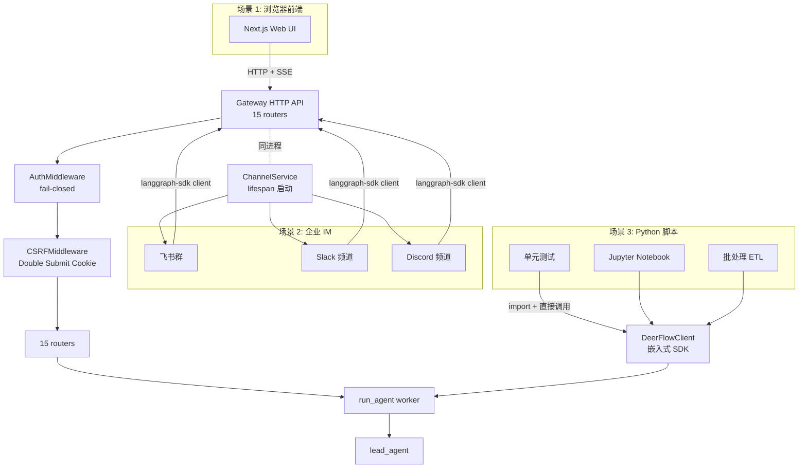
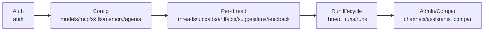
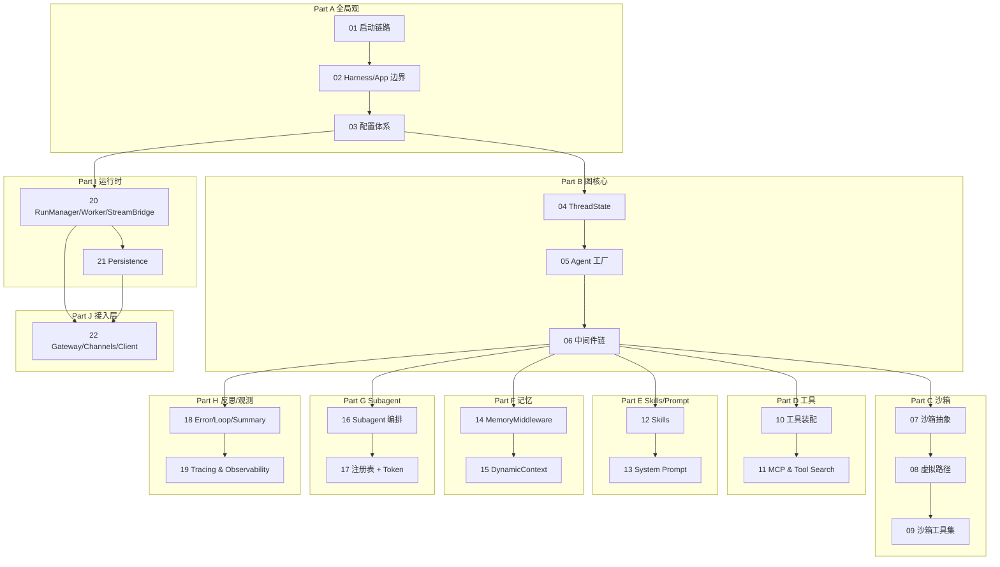

# 22 · Gateway API + IM Channels + DeerFlowClient 三种接入方式（系列最终章）

> 21 篇结尾说："最后一章把 deer-flow 三种接入方式讲透"。这是整个系列的最终章——之前 21 篇讲的所有底层（agent / middleware / sandbox / tool / runtime / persistence / observability）最终要通过某种"门面"暴露给最终用户。deer-flow 给了 3 种：
>
> 1. **Gateway HTTP API**（15 个 FastAPI Router）——前端 / 第三方调用。
> 2. **IM Channels**（Feishu / Slack / Telegram / 等 7 种）——把 agent 接入企业 IM。
> 3. **DeerFlowClient**（嵌入式 Python SDK）——脚本 / 测试 / Notebook 直接调。
>
> 这一章把这 3 条路径的设计取舍 + 共同基础 + 各自特色讲清楚。读完它，你能选对适合自己场景的接入方式 + 知道每种方式背后的实现细节。

---

## 1. 模块定位（Why this matters）

deer-flow 的 3 种接入方式不是冗余——它们针对不同场景：

| 接入 | 协议 | 状态管理 | 适用 | 例子 |
|------|------|---------|------|------|
| **Gateway HTTP** | REST + SSE | 全 server side | 浏览器前端 / 第三方系统 | deer-flow 自带 Web UI |
| **IM Channels** | platform-specific（webhook / 长连接） | server side + IM message id 映射 | 企业内聊机器人 | "在飞书群里@bot 问问题" |
| **DeerFlowClient** | direct Python | 调用方传 checkpointer | 脚本 / 测试 / Notebook | `client.chat("hello")` |

不读这一章会错过 4 个关键认知：

1. **Gateway 有 15 个 router**：按业务边界拆——models / mcp / memory / skills / artifacts / uploads / threads / agents / suggestions / channels / auth / feedback / thread_runs / runs / assistants_compat。**LangGraph SDK 兼容 + 自有 REST 双重 API surface**。
2. **AuthMiddleware + CSRFMiddleware 双闸门**：所有非 public 路径过 AuthMiddleware（fail-closed），所有 state-changing 操作过 CSRFMiddleware（Double Submit Cookie）。两者顺序敏感——`add_middleware(Auth)` 后 `add_middleware(CSRF)` 让 CSRF 内层 / Auth 外层（Starlette 反向应用规则）。
3. **IM Channels 通过 langgraph-sdk 接入自己的 Gateway**：不重新实现 LangGraph 兼容协议——而是用 langgraph-sdk Python client 调 `http://localhost:8001/api/langgraph/threads`。**和前端走完全同一条 API 链路**——保证行为一致。
4. **DeerFlowClient 是"嵌入式 Gateway"而不是"裸 LangChain SDK"**：05 篇讲过它走 `_build_middlewares` 而不是 `create_deerflow_agent`——拿到的是和 Gateway 同样的 14-18 中间件链 agent。**API 设计还和 Gateway 的 router 1:1 对齐**（list_models / get_memory / install_skill ...）—— 让 SDK 用户和 HTTP 用户的代码思路一致。

对应到 Harness 六要素：本章把 **接入层 + 安全护栏 + 工具集成** 全部展示——这是 deer-flow 把所有底层能力组装成 production 产品的最后一步。

---

## 2. 源码地图（Source Map）

### 2.1 关键文件清单

#### Gateway HTTP API

| 路径 | 角色 |
|------|------|
| [`app/gateway/app.py`](../app/gateway/app.py) | `create_app + lifespan`（385 行，01 篇见过） |
| [`app/gateway/auth_middleware.py`](../app/gateway/auth_middleware.py) | `AuthMiddleware` fail-closed 闸门（127 行） |
| [`app/gateway/csrf_middleware.py`](../app/gateway/csrf_middleware.py) | `CSRFMiddleware` Double Submit Cookie（229 行） |
| [`app/gateway/internal_auth.py`](../app/gateway/internal_auth.py) | 进程内 service-to-service 鉴权 |
| [`app/gateway/authz.py`](../app/gateway/authz.py) | `@require_permission` + `AuthContext`（301 行） |
| [`app/gateway/deps.py`](../app/gateway/deps.py) | 单例 Getter + `get_current_user_from_request`（01 篇见过） |
| [`app/gateway/routers/*.py`](../app/gateway/routers/) | 15 个 router 文件 |

#### IM Channels

| 路径 | 角色 |
|------|------|
| [`app/channels/base.py`](../app/channels/base.py) | `Channel` ABC |
| [`app/channels/message_bus.py`](../app/channels/message_bus.py) | `MessageBus` 异步 pub/sub |
| [`app/channels/store.py`](../app/channels/store.py) | `ChannelStore` —— `{channel:chat[:topic]} → thread_id` |
| [`app/channels/manager.py`](../app/channels/manager.py) | `ChannelManager` —— dispatcher + langgraph-sdk client（1039 行） |
| [`app/channels/service.py`](../app/channels/service.py) | `ChannelService` —— 生命周期管理（232 行） |
| [`app/channels/{feishu,slack,telegram,dingtalk,wechat,wecom,discord}.py`](../app/channels/) | 7 个具体 channel 实现 |

#### DeerFlowClient

| 路径 | 角色 |
|------|------|
| [`packages/harness/deerflow/client.py`](../packages/harness/deerflow/client.py) | `DeerFlowClient`（1278 行，**最大单文件之一**） |

### 2.2 关键符号速查表

| 符号 | 文件:行 | 一句话职责 |
|------|---------|-----------|
| `class AuthMiddleware(BaseHTTPMiddleware)` | `auth_middleware.py:52` | 全局认证 fail-closed |
| `_PUBLIC_PATH_PREFIXES / _PUBLIC_EXACT_PATHS` | `auth_middleware.py:25/34` | 白名单 |
| `_is_public(path)` | `auth_middleware.py:45` | 路径检查 |
| `AuthMiddleware.dispatch(request, call_next)` | `auth_middleware.py:75` | 两阶段：cookie 在不在 + JWT 严格校验 |
| `class CSRFMiddleware` | `csrf_middleware.py` | Double Submit Cookie |
| `CSRF_COOKIE_NAME / CSRF_HEADER_NAME` | `csrf_middleware.py:17/18` | `csrf_token / X-CSRF-Token` |
| `should_check_csrf(request)` | `csrf_middleware.py:32` | POST/PUT/DELETE/PATCH 需校验 |
| `is_auth_endpoint(request)` | `csrf_middleware.py:58` | 4 个 auth 端点豁免 first-call |
| `generate_csrf_token()` | `csrf_middleware.py:27` | `secrets.token_urlsafe(64)` |
| `get_configured_cors_origins()` | `csrf_middleware.py:109` | `GATEWAY_CORS_ORIGINS` env |
| `INTERNAL_AUTH_HEADER_NAME` | `internal_auth.py` | service-to-service 头名 |
| `is_valid_internal_auth_token(token)` | `internal_auth.py` | secrets.compare_digest |
| `class AuthContext` | `authz.py` | `user + permissions` |
| `@require_permission(perm, owner_check=False)` | `authz.py` | router decorator |
| `class Channel(ABC)` | `channels/base.py` | start/stop/send 三方法 |
| `class MessageBus` | `channels/message_bus.py` | `publish_inbound / on_outbound` |
| `class ChannelStore` | `channels/store.py` | JSON 文件 `{channel:chat:topic} → thread_id` |
| `class ChannelManager` | `channels/manager.py:541` | 主 dispatcher |
| `class ChannelService` | `channels/service.py:55` | 生命周期 + from_app_config |
| `_CHANNEL_REGISTRY: dict[str, str]` | `channels/service.py:20` | 7 个 channel 反射加载路径 |
| `start_channel_service(app_config)` | `channels/service.py:217` | singleton |
| `class DeerFlowClient` | `client.py:80` | 嵌入式 SDK 主类 |
| `DeerFlowClient.chat(message, thread_id)` | `client.py:762` | 同步阻塞 |
| `DeerFlowClient.stream(message, thread_id)` | `client.py:489` | async generator |
| `DeerFlowClient._ensure_agent(config)` | `client.py:210` | lazy + 5 字段 cache key |
| `DeerFlowClient.reset_agent()` | `client.py:164` | 强制重建 |
| `DeerFlowClient.list_models / get_memory / install_skill / ...` | `client.py:798+` | **Gateway router 1:1 对齐的 dict 返回** |

### 2.3 3 种接入方式的全景



**关键洞察**：

- 3 种接入最终都到 `run_agent worker + lead_agent`——**共享同一套核心**。
- IM Channels 跑在 Gateway 同进程内（lifespan 启动），但**用 langgraph-sdk 自己调自己的 Gateway**——和前端走同一条 HTTP 链路。
- DeerFlowClient 跳过 HTTP，直接 import deer-flow 模块——延迟最低，无网络开销。

### 2.4 Auth + CSRF 双闸门

```mermaid
sequenceDiagram
    autonumber
    participant User
    participant Browser
    participant Nginx
    participant AMW as AuthMiddleware
    participant CMW as CSRFMiddleware
    participant Router

    User->>Browser: 操作(GET 浏览数据 / POST 发消息)
    Browser->>Nginx: Cookie: access_token=...; csrf_token=...
    Note over Browser: state-changing 请求带 X-CSRF-Token header
    Nginx->>AMW: 进 Gateway
    Note over AMW: ① _is_public(path)? 是→放行<br/>(/health, /docs, /api/v1/auth/login...)

    Note over AMW: ② Internal Auth token?<br/>(service-to-service 跳过 JWT)
    alt 有 X-Internal-Auth 且校验通过
        AMW->>CMW: internal_user 通过
    else
        Note over AMW: ③ 检查 access_token cookie<br/>(没 → 401 NOT_AUTHENTICATED)
        Note over AMW: ④ get_current_user_from_request<br/>(decode JWT + DB lookup + token_version check)
        AMW->>AMW: stamp request.state.user<br/>+ set_current_user(ContextVar)
        AMW->>CMW: call_next
    end

    CMW->>CMW: ⑤ should_check_csrf? (POST/PUT/DELETE/PATCH)
    alt GET/HEAD/OPTIONS
        CMW->>Router: 直接放行
    else 是 state-changing
        Note over CMW: ⑥ 比对 cookie csrf_token vs X-CSRF-Token header<br/>(secrets.compare_digest)
        alt 不匹配
            CMW->>Browser: 403 CSRF Forbidden
        else 匹配
            CMW->>Router: 放行
        end
    end

    Router->>Router: 业务逻辑<br/>(repository auto user_id filter via ContextVar)
    Router-->>Browser: 响应

    Note over AMW: finally: reset_current_user(token)
```

---

## 3. 核心逻辑精读（Deep Dive）

### 3.1 Gateway: 15 router 的职责矩阵

| Router | 路径前缀 | 职责 | 主要端点 |
|--------|---------|------|---------|
| **auth** | `/api/v1/auth` | 登录 / 注册 / 改密 / OAuth | login/local, register, logout, setup-status, initialize, me, change-password |
| **models** | `/api/models` | LLM 模型列表 | GET /, GET /{name} |
| **mcp** | `/api/mcp` | MCP server 配置 | GET /config, PUT /config |
| **memory** | `/api/memory` | 长期记忆 CRUD | GET /, POST /reload, GET /status, fact CRUD |
| **skills** | `/api/skills` | skill 启用 + 安装 | GET /, PUT /{name}, POST /install |
| **artifacts** | `/api/threads/{tid}/artifacts` | 产物文件下载 | GET /{path} |
| **uploads** | `/api/threads/{tid}/uploads` | 文件上传 + 自动转 | POST /, GET /list, DELETE /{filename} |
| **threads** | `/api/threads/{tid}` | 删 thread 本地数据 | DELETE / |
| **agents** | `/api/agents` | 自定义 agent CRUD | GET /, POST /, PUT /{name}, DELETE /{name} |
| **suggestions** | `/api/threads/{tid}/suggestions` | follow-up 问题生成 | POST / |
| **channels** | `/api/channels` | IM channels 状态/重启 | GET /, POST /{name}/restart |
| **assistants_compat** | `/api/assistants` | LangGraph Platform 兼容 stub | （兼容性而非真功能） |
| **thread_runs** | `/api/threads/{tid}/runs` | run lifecycle (含 SSE stream) | POST /, POST /stream, POST /wait, GET /, GET /{rid}, POST /{rid}/cancel, GET /{rid}/join |
| **runs** | `/api/runs` | stateless run（无 thread） | POST /stream, POST /wait |
| **feedback** | `/api/threads/{tid}/runs/{rid}/feedback` | rating + comment | PUT /, DELETE /, POST /, GET /, GET /stats |

**5 类划分**：



### 3.2 AuthMiddleware：fail-closed 双阶段验证

```python
# app/gateway/auth_middleware.py:75-126
async def dispatch(self, request: Request, call_next: Callable) -> Response:
    if _is_public(request.url.path):
        return await call_next(request)

    # Internal Auth: service-to-service via header
    internal_user = None
    if is_valid_internal_auth_token(request.headers.get(INTERNAL_AUTH_HEADER_NAME)):
        internal_user = get_internal_user()

    # Non-public path: require session cookie
    if internal_user is None and not request.cookies.get("access_token"):
        return JSONResponse(
            status_code=401,
            content={"detail": AuthErrorResponse(code=AuthErrorCode.NOT_AUTHENTICATED, message="Authentication required").model_dump()},
        )

    # Strict JWT validation: reject junk/expired tokens with 401 right here
    from app.gateway.deps import get_current_user_from_request

    if internal_user is not None:
        user = internal_user
    else:
        try:
            user = await get_current_user_from_request(request)
        except HTTPException as exc:
            return JSONResponse(status_code=exc.status_code, content={"detail": exc.detail})

    # Stamp both request.state.user (for the contextvar pattern)
    # and request.state.auth (so @require_permission's "auth is None"
    # branch short-circuits instead of running the entire JWT-decode
    # + DB-lookup pipeline a second time per request).
    request.state.user = user
    request.state.auth = AuthContext(user=user, permissions=_ALL_PERMISSIONS)
    token = set_current_user(user)
    try:
        return await call_next(request)
    finally:
        reset_current_user(token)
```

**5 个关键设计**：

1. **`_is_public` 在最前**：白名单路径（`/health / /docs / /api/v1/auth/login` 等 5+5 个）完全跳过认证——避免登录页面自己也要先登录的鸡蛋问题。
2. **Internal Auth header 优先**：IM Channels 跑在同进程但要调 Gateway——用 `INTERNAL_AUTH_HEADER_NAME` 头通过 `secrets.compare_digest` 校验。**不需要 user 登录的内部 service**走这条。
3. **两阶段拦截**：先看 cookie 在不在（快速 fail）→ 再 decode + DB lookup（详细 fail）。**两阶段都返不同错误码**（NOT_AUTHENTICATED vs TOKEN_INVALID / USER_NOT_FOUND）。
4. **闭环 ContextVar**：`set_current_user(user) + try/finally: reset_current_user(token)`——repository 层（21 篇 `_AUTO sentinel`）能从 ContextVar 自动拿 user_id 做 SQL 过滤。**route handler 不需要每次手动传 user_id**。
5. **同时 stamp `request.state.user` 和 `request.state.auth`**：`@require_permission` decorator 短路用——避免每个 route handler 重复 decode JWT + DB lookup（行 116-121 注释明确说"省 pipeline 重跑"）。

#### `_is_public` 的两层白名单

```python
# app/gateway/auth_middleware.py:25-49
_PUBLIC_PATH_PREFIXES: tuple[str, ...] = (
    "/health",
    "/docs",
    "/redoc",
    "/openapi.json",
)

_PUBLIC_EXACT_PATHS: frozenset[str] = frozenset({
    "/api/v1/auth/login/local",
    "/api/v1/auth/register",
    "/api/v1/auth/logout",
    "/api/v1/auth/setup-status",
    "/api/v1/auth/initialize",
})


def _is_public(path: str) -> bool:
    stripped = path.rstrip("/")
    if stripped in _PUBLIC_EXACT_PATHS:
        return True
    return any(path.startswith(prefix) for prefix in _PUBLIC_PATH_PREFIXES)
```

- **前缀匹配**：`/docs / /docs/auth / /openapi.json`——基础 docs。
- **精确匹配**：5 个 auth 端点首次调用必须无认证（你还没登录怎么登录）。
- **`/api/v1/auth/me` 不在白名单**——`me` 必须先登录才能查"我是谁"，否则永远返 unauthenticated。

### 3.3 CSRFMiddleware：Double Submit Cookie

```python
# app/gateway/csrf_middleware.py:17-46
CSRF_COOKIE_NAME = "csrf_token"
CSRF_HEADER_NAME = "X-CSRF-Token"
CSRF_TOKEN_LENGTH = 64  # bytes


def generate_csrf_token() -> str:
    """Generate a secure random CSRF token."""
    return secrets.token_urlsafe(CSRF_TOKEN_LENGTH)


def should_check_csrf(request: Request) -> bool:
    """Determine if a request needs CSRF validation."""
    if request.method not in ("POST", "PUT", "DELETE", "PATCH"):
        return False
    path = request.url.path.rstrip("/")
    if path == "/api/v1/auth/me":
        return False
    return True
```

**Double Submit Cookie 原理**：

1. 用户登录时 server 设两个 cookie：`access_token`（HttpOnly）+ `csrf_token`（**non-HttpOnly**——JS 能读）。
2. 前端 JS 读 `csrf_token` cookie + 把值塞进 `X-CSRF-Token` header（每次 state-changing 请求）。
3. CSRFMiddleware 比对 cookie `csrf_token` == header `X-CSRF-Token`——一致才放行。

**防的是什么**：跨站请求（CSRF）——攻击者的 evil.com 网页发请求到 deer-flow.com 时，**浏览器会自动发 cookie**（包括 access_token + csrf_token）——但**evil.com 的 JS 读不到 csrf_token cookie**（同源限制），也就**塞不了 X-CSRF-Token header**。CSRFMiddleware 校验失败 → 403。

**安全要点**：

- **`secrets.compare_digest`** 而不是 `==`——避免 timing attack。
- **`csrf_token` cookie 必须 non-HttpOnly**——JS 要能读才能塞 header。但不影响安全（攻击者要 XSS 才能读，而 XSS 已经赢了）。
- **不豁免 GET/HEAD**：因为 GET 多半是只读，没风险。state-changing 才需要 CSRF。

### 3.4 Auth + CSRF 中间件注册顺序

```python
# app/gateway/app.py:307-324
# Auth: reject unauthenticated requests to non-public paths (fail-closed safety net)
app.add_middleware(AuthMiddleware)

# CSRF: Double Submit Cookie pattern for state-changing requests
app.add_middleware(CSRFMiddleware)

# CORS: the unified nginx endpoint is same-origin by default. Split-origin
# browser clients must opt in with this explicit Gateway allowlist
cors_origins = sorted(get_configured_cors_origins())
if cors_origins:
    app.add_middleware(
        CORSMiddleware,
        allow_origins=cors_origins,
        allow_credentials=True,
        allow_methods=["*"],
        allow_headers=["*"],
    )
```

**Starlette 中间件反向应用**——后 add 的更外层。所以实际执行顺序：

```
请求 → CORS → CSRF → Auth → handler → Auth → CSRF → CORS → 响应
```

- **CORS 最外**——预检请求（OPTIONS）能先过；CORS 头加在最后响应里。
- **CSRF 中间**——只对 state-changing 校验。
- **Auth 最内**——保证 CSRF 通过后才看 user。

**注意**：如果你颠倒 add 顺序（先 add CSRF 后 add Auth），Auth 就外层、CSRF 内层——**实际执行 Auth 先**，但 CSRF 校验本来就在 Auth 之前才有意义（不需要 user 上下文也能校验 token 一致性）。**deer-flow 当前顺序是合理的**。

### 3.5 IM Channels: 通过 langgraph-sdk 自调 Gateway

```python
# app/channels/service.py:62-78
def __init__(self, channels_config: dict[str, Any] | None = None) -> None:
    self.bus = MessageBus()
    self.store = ChannelStore()
    config = dict(channels_config or {})
    langgraph_url = _resolve_service_url(config, "langgraph_url", _CHANNELS_LANGGRAPH_URL_ENV, DEFAULT_LANGGRAPH_URL)
    gateway_url = _resolve_service_url(config, "gateway_url", _CHANNELS_GATEWAY_URL_ENV, DEFAULT_GATEWAY_URL)
    default_session = config.pop("session", None)
    channel_sessions = {name: channel_config.get("session") for name, channel_config in config.items() if isinstance(channel_config, dict)}
    self.manager = ChannelManager(
        bus=self.bus,
        store=self.store,
        langgraph_url=langgraph_url,
        gateway_url=gateway_url,
        default_session=default_session if isinstance(default_session, dict) else None,
        channel_sessions=channel_sessions,
    )
```

**关键**：`langgraph_url` 默认 `http://localhost:8001/api`——**ChannelManager 用 langgraph-sdk 调自己 Gateway 的 LangGraph 兼容 API**。

**为什么这么绕**？因为：

1. **统一 API 路径**——前端、第三方、IM Channels 都走 LangGraph SDK 协议（POST /threads → POST /threads/{tid}/runs/stream）。
2. **Auth 复用**——ChannelManager 用 `INTERNAL_AUTH_HEADER_NAME` header 走内部认证，不需要每个 channel 用户登录。
3. **改动隔离**——IM 协议变化只需要改 channel impl；core agent 协议不变。

**对比"channel 直接 import agent"**：

- 那种方式快——但 channel 和 agent 紧耦合，channel 出 bug 可能影响 agent。
- deer-flow 选 HTTP 自调——多一层网络开销（同进程 localhost 几乎可忽略）但隔离更清晰。

#### `_CHANNEL_REGISTRY` 反射加载

```python
# app/channels/service.py:20-28
_CHANNEL_REGISTRY: dict[str, str] = {
    "dingtalk": "app.channels.dingtalk:DingTalkChannel",
    "discord": "app.channels.discord:DiscordChannel",
    "feishu": "app.channels.feishu:FeishuChannel",
    "slack": "app.channels.slack:SlackChannel",
    "telegram": "app.channels.telegram:TelegramChannel",
    "wechat": "app.channels.wechat:WechatChannel",
    "wecom": "app.channels.wecom:WeComChannel",
}
```

**7 个 channel 全用 03 篇讲过的反射加载**——`resolve_class(import_path, base_class=None)`。

**好处**：

- 装新 channel 只需要写一个 `app/channels/foo.py` 实现 `Channel` ABC + 改 1 行 registry。
- 没在 yaml 启用的 channel 不会 import——例如没装 Discord SDK 也不报错。
- channel 实现可以放在第三方包（用反射加载完整 import path）。

#### `_CHANNEL_CREDENTIAL_KEYS` "credentials 有但 enabled 没开"的友好提示

```python
# app/channels/service.py:103-115 (节选)
for name, channel_config in self._config.items():
    if not channel_config.get("enabled", False):
        cred_keys = _CHANNEL_CREDENTIAL_KEYS.get(name, [])
        has_creds = any(... for k in cred_keys)
        if has_creds:
            logger.warning(
                "Channel '%s' has credentials configured but is disabled. "
                "Set enabled: true under channels.%s in config.yaml to activate it.",
                name, name,
            )
        else:
            logger.info("Channel %s is disabled, skipping", name)
        continue
```

**新人友好的 warning**——用户配了 bot_token 但忘开 enabled → 启动时 warning 提醒。

### 3.6 ChannelStore: thread 映射表

```python
# packages/harness/deerflow/.../channels/store.py 概念
# 文件内容示例 (JSON):
# {
#   "feishu:oc_xxx:topic_yyy": "thread-abc-123",
#   "slack:C12345:thread_67890": "thread-def-456",
#   "telegram:chat_111": "thread-ghi-789"
# }
```

**Key 结构**：

- 一般 chat：`{channel}:{chat_id}` —— "整个聊天对话用同一个 thread"。
- 带 topic（飞书话题群、slack thread）：`{channel}:{chat_id}:{topic_id}` —— "每个话题独立 thread"。

**Value**：deer-flow thread_id。

**为什么需要**：IM 平台用自己的 chat_id（飞书是 oc_xxx，slack 是 C12345，telegram 是 chat_id）—— deer-flow 内部用 thread_id。**Store 做的就是"IM 协议世界 ↔ deer-flow 世界"的双向映射**。

**持久化**：JSON 文件存到 `{base_dir}/channels/store.json`——重启后映射不丢，避免"重启后用户继续聊但 deer-flow 开了新 thread"。

### 3.7 ChannelManager: 主 dispatcher

```python
# 简化版的 ChannelManager._dispatch_loop 概念伪码
async def _dispatch_loop(self):
    while True:
        msg = await self.bus.inbound_queue.get()    # 1. 取入站消息
        thread_id = await self.store.get_or_create_thread(msg)   # 2. 映射 thread
        if msg.command == "/new":                    # 3. 命令分流
            await self.store.reset_mapping(msg.channel, msg.chat_id)
            await self._respond_command(msg, "New thread created")
        elif msg.command == "/status":
            ...
        else:
            # 4. 调 Gateway 自己的 LangGraph 兼容 API
            async for chunk in self.lg_client.runs.stream(
                thread_id=thread_id,
                input={"messages": [{"role": "user", "content": msg.text}]},
                stream_mode=["messages-tuple", "values"],
            ):
                # 5. 翻译 SSE chunk 为 channel 协议消息
                outbound = self._chunk_to_outbound(chunk, msg.chat_id)
                await self.bus.publish_outbound(outbound)
```

**4 个核心职责**：

1. **入站 → 映射 thread**：IM 协议消息 → deer-flow thread_id（store 查或建）。
2. **命令分流**：`/new`、`/status`、`/models`、`/memory`、`/help` 直接本地处理。
3. **调 Gateway API**：用 langgraph-sdk 的 `client.runs.stream` 把消息发给 agent。
4. **出站翻译**：把 SSE chunk 翻译成 channel 协议消息（飞书 patch 卡片、slack 单 message、telegram 多 message）。

**stream vs wait**：

- Feishu 卡片支持 in-place 更新 → 用 `runs.stream(["messages-tuple", "values"])` 增量推。
- Slack/Telegram 一般用 `runs.wait` 拿到最终结果一次性发。
- DingTalk AI Card mode 也支持 streaming——`card_template_id` 配了就走 stream 路径。

### 3.8 DeerFlowClient: 嵌入式 Gateway 等价物

```python
# packages/harness/deerflow/client.py:114-162
def __init__(
    self,
    config_path: str | None = None,
    checkpointer=None,
    *,
    model_name: str | None = None,
    thinking_enabled: bool = True,
    subagent_enabled: bool = False,
    plan_mode: bool = False,
    agent_name: str | None = None,
    available_skills: set[str] | None = None,
    middlewares: Sequence[AgentMiddleware] | None = None,
):
    """Initialize the client.

    Loads configuration but defers agent creation to first use.

    Args:
        config_path: Path to config.yaml. Uses default resolution if None.
        checkpointer: LangGraph checkpointer instance for state persistence.
            Required for multi-turn conversations on the same thread_id.
            Without a checkpointer, each call is stateless.
        ...
    """
    if config_path is not None:
        reload_app_config(config_path)
    self._app_config = get_app_config()
    ...
    self._checkpointer = checkpointer
    self._model_name = model_name
    self._thinking_enabled = thinking_enabled
    self._subagent_enabled = subagent_enabled
    self._plan_mode = plan_mode
    self._agent_name = agent_name
    self._available_skills = set(available_skills) if available_skills is not None else None
    self._middlewares = list(middlewares) if middlewares else []

    # Lazy agent — created on first call, recreated when config changes.
    self._agent = None
    self._agent_config_key: tuple | None = None
```

**3 个工程亮点**：

1. **lazy agent**：构造时不建 agent，第一次调 chat/stream 才建。**避免脚本里 `client = DeerFlowClient()` 写半天还没用就构造大对象**。
2. **`_agent_config_key` cache**：5 字段 tuple（model / thinking / plan_mode / subagent / agent_name）—— key 变了才重建 agent（05 篇见过）。
3. **`checkpointer` 是 optional**：传了 → 多轮对话；不传 → 单次调用每次新 state（stateless）。

#### Gateway router 1:1 对齐的 API

```python
# packages/harness/deerflow/client.py 公开方法节选
# 对应 Gateway router 名:
client.list_models()        # GET /api/models
client.get_model(name)      # GET /api/models/{name}
client.list_skills()        # GET /api/skills
client.get_skill(name)      # GET /api/skills/{name}
client.update_skill(name, enabled=...)   # PUT /api/skills/{name}
client.install_skill(path)               # POST /api/skills/install
client.get_mcp_config()     # GET /api/mcp/config
client.update_mcp_config(servers)        # PUT /api/mcp/config
client.get_memory()         # GET /api/memory
client.reload_memory()      # POST /api/memory/reload
client.upload_files(thread_id, files)    # POST /api/threads/{tid}/uploads
client.get_artifact(thread_id, path) -> (bytes, mime)  # GET /api/threads/{tid}/artifacts/{path}
client.chat(message, thread_id) -> str   # 类似 POST /api/threads/{tid}/runs/wait
client.stream(message, thread_id) -> AsyncIterator   # 类似 POST /api/threads/{tid}/runs/stream
```

**Gateway Conformance Tests**（`tests/test_client.py::TestGatewayConformance`）会跑 Pydantic 校验——验证 client 方法的返回 dict 符合 Gateway response model。**这保证两者 API 长期不漂移**。

#### `chat` vs `stream`

```python
# packages/harness/deerflow/client.py:762 周边
def chat(self, message: str, *, thread_id: str | None = None, **kwargs) -> str:
    """Synchronously chat — blocks until AI response is complete."""
    # 内部累积 stream() 的所有 AI text delta 然后返回
```

```python
# packages/harness/deerflow/client.py:489 周边
def stream(self, message: str, *, thread_id: str | None = None, ...) -> Iterator[StreamEvent]:
    """Stream events as they arrive."""
    # 用 LangGraph astream(stream_mode=["values", "messages", "custom"])
    # 翻译 chunk 为 StreamEvent (type / content / id / usage)
```

`chat` 是 `stream` 的便利包装——内部消费 stream 后聚合 final text。**API 设计兼顾"简单 use case 一行"和"复杂 use case 完全控制"**。

#### 内部走的是 `_build_middlewares`

回顾 05 篇：

```python
# packages/harness/deerflow/client.py:230-241 (节选)
kwargs = {
    "model": create_chat_model(name=model_name, thinking_enabled=thinking_enabled),
    "tools": self._get_tools(model_name=model_name, subagent_enabled=subagent_enabled),
    "middleware": _build_middlewares(config, model_name=model_name, agent_name=self._agent_name, custom_middlewares=self._middlewares),
    "system_prompt": apply_prompt_template(...),
    "state_schema": ThreadState,
}
self._agent = create_agent(**kwargs)
```

**用的是 `_build_middlewares` 而不是 `create_deerflow_agent`**——拿到的是和 Gateway 同样的 14-18 节中间件链 agent。**embedded 模式 ≠ 简化模式**——deer-flow 不卸功能。

### 3.9 3 种接入的对照总结

| 维度 | Gateway HTTP | IM Channels | DeerFlowClient |
|------|-------------|------------|---------------|
| **延迟** | HTTP + nginx 转发 (~ms) | langgraph-sdk → HTTP → ... (~ms) | 直接 import (~μs) |
| **多用户** | ✅ | ✅（每用户对应 IM account） | ❌（单进程） |
| **流式** | ✅ SSE | ✅（取决于 IM 平台） | ✅ async generator |
| **断线重连** | ✅ Last-Event-ID | 部分（IM 协议） | ❌（直接调） |
| **认证** | AuthMiddleware + CSRF | INTERNAL_AUTH_HEADER | 无（信任调用方） |
| **持久化** | 共享 Gateway 的 DB | 同上 + ChannelStore | 调用方传 checkpointer |
| **场景** | Web UI / 第三方 API | 企业 IM bot | 脚本 / 测试 / Notebook |
| **依赖** | uvicorn + nginx + frontend | + 各 IM SDK | 仅 deer-flow harness |

---

## 4. 关键问题答疑（Key Questions）

### Q1：为什么 IM Channels 走 HTTP 而不是直接 import agent？

3 个原因：

1. **隔离 channel 实现 bug**：channel 协议出错（飞书 SDK 抛异常）不会污染 agent 内部状态。
2. **统一行为**：和前端走完全同一条 API 链路——前端跑得通的，channel 一定跑得通。
3. **跨进程未来**：如果 channels 拆出去独立进程（k8s 部署），代码不用改——已经是 HTTP 调用。

代价：localhost HTTP 调用比直接 import 慢几个 ms。对 IM 场景（用户感觉 1-2 秒延迟都正常）完全可忽略。

### Q2：CSRF cookie 必须 non-HttpOnly 吗？这不是安全风险吗？

是必须的（前端 JS 要读它塞 header），但不是风险：

- CSRF cookie 单独泄露**没用**——攻击者拿到 csrf_token 但拿不到 access_token cookie（HttpOnly），还是无法发请求。
- Double Submit Cookie 的安全模型基于"同源限制"——攻击者的 evil.com JS 读不了 deer-flow.com 的 cookie（包括 non-HttpOnly 的）。
- 真正的风险是 XSS——但 XSS 已经能 hijack 整个浏览器，不仅仅是 CSRF。

### Q3：DeerFlowClient 没有 auth 校验，怎么保证安全？

DeerFlowClient 是**信任调用方**的 SDK——调用方就是你的 Python 代码。如果你的脚本被攻击者执行，他能直接 chat —— 但他能执行你的 Python 代码就已经赢了。

**生产场景**：DeerFlowClient 适合**单租户嵌入式**用例（例如"我自己写的 ETL 脚本调 agent 做翻译"）。多租户场景请走 Gateway HTTP。

### Q4：3 种接入能同时启用吗？

可以。`make dev` 启动后：

- Gateway HTTP 监听 8001。
- 如果 `config.yaml` 有 `channels:` 段且 enabled——IM Channels 在 lifespan 里启动。
- DeerFlowClient 任何时候都能 `import` 用——但它**不和 Gateway 共享 checkpointer**（除非你显式传同一个）—— 两边 thread 数据互不通。

### Q5：Internal Auth 怎么避免被外部利用？

`is_valid_internal_auth_token` 用 `secrets.compare_digest`——timing-attack safe。token 本身从环境变量 / 启动随机生成。**nginx 一般会过滤外部请求带 `X-Internal-Auth` header**——这是 deer-flow 的部署约定（虽然代码里没强制）。

实际场景：IM Channels 跑在同进程，知道这个 token；外部用户根本不知道也不能传。

### Q6：Channel 实现要写哪些方法？

```python
# app/channels/base.py 概念
class Channel(ABC):
    @abstractmethod
    async def start(self) -> None:
        """启动 channel(连接 IM 长连接、订阅 webhook)"""

    @abstractmethod
    async def stop(self) -> None:
        """优雅停"""

    @abstractmethod
    async def send(self, msg: OutboundMessage) -> None:
        """发消息到 IM 平台"""

    @property
    def is_running(self) -> bool:
        """状态查询"""
```

`__init__(self, bus, config)` —— 接受 MessageBus（订阅 outbound）+ 自己的配置。

完整 channel 实现一般 200-1000 行（IM SDK 各自不同），看 `app/channels/feishu.py`（698 行）作参考。

### Q7：Gateway router 用 `Depends(get_run_manager)` 拿到 RunManager 是怎么工作的？

01 篇讲过：

- Gateway lifespan 里 `langgraph_runtime(app)` 把 6 个单例挂到 `app.state`。
- `get_run_manager: Callable[[Request], RunManager] = _require("run_manager", "Run manager")` 是 FastAPI dependency 工厂——返回函数从 `request.app.state.run_manager` 取。
- router handler 写 `def list_runs(mgr: RunManager = Depends(get_run_manager)): ...`——FastAPI 自动注入。
- 任何 state 缺失会 raise HTTPException(503)——保证 router 不会拿到 None。

---

## 5. 横向延伸与面试级洞察（Interview-Grade Insights）

### 5.1 "一个 core + 多个 facade" 是 production agent 平台的标准模式

deer-flow 的 3 种接入共享同一个 core（lead_agent / run_agent / RunJournal / ...）。这是**经典的 Facade Pattern 应用**：

- **Core**：domain logic + 数据 + 行为。
- **Facade**：协议适配（HTTP / IM / Python）。

新增第 4 种接入（例如 gRPC API 或 WebRTC）只要写一层 facade，不动 core。这是 deer-flow 能服务多种场景的工程基础。

**面试金句**：deer-flow 把 agent core 和接入层严格分离——15 个 HTTP router + 7 种 IM channel + 嵌入式 SDK，全部 facade 在不同协议下复用同一 core。这是 Hexagonal Architecture 在 agent 平台的具体实现。

### 5.2 IM Channels 自调 Gateway 是"dogfooding"的工程体现

很多团队会让 channel "走捷径" 直接 import agent——一是少一层网络、二是少一层认证。

deer-flow 选 langgraph-sdk 自调 Gateway 的原因：

- **dogfooding**：用 LangGraph SDK 的方式调自己的 API——保证 LangGraph SDK 兼容性永远不破。
- **统一可观测性**：所有 run 都走 Gateway → RunJournal 看到所有调用源，不漏 channel 触发的 run。
- **统一限流 / quota**：未来加 rate limiting 只需在 Gateway 层加，channel 自动受限。

**面试金句**：deer-flow 让 IM Channels 通过 langgraph-sdk client 自调 Gateway——dogfooding 保证 LangGraph SDK 兼容性 + 统一所有 run 入口走同一 RunJournal pipeline。

### 5.3 DeerFlowClient 1:1 对齐 Gateway 是 API 设计纪律

deer-flow 的 client 方法（`list_models / get_memory / install_skill / chat`）和 Gateway router endpoint 一一对应——同样的参数、同样的返回结构、同样的 Pydantic 校验。

**好处**：

- 用户从 HTTP 切到 SDK（或反向）几乎零迁移成本。
- 测试可以同时测两者（同输入同输出）。
- 文档可以共享——一份描述 Gateway 也描述 SDK。

**Gateway Conformance Tests** 强制这层对齐——任何 client 方法的返回 dict 不符合 Gateway Pydantic model → 测试红。**这是 API 一致性的物理强制**。

### 5.4 AuthMiddleware + CSRFMiddleware 双层防御

| 攻击 | 防御层 |
|------|------|
| 没 cookie 直接访问 | AuthMiddleware 401 |
| 伪造 / 过期 JWT | AuthMiddleware decode 失败 401 |
| 第三方网站发 POST（CSRF） | CSRFMiddleware token mismatch 403 |
| 越权访问别人资源 | repository ContextVar `_AUTO` 自动 SQL 过滤 |

**4 层防御深度**——单一层失守不会直接漏出数据。production agent 平台的安全设计就是这种"多层叠加"。

### 5.5 vs 同行框架

| 框架 | 接入方式 |
|------|---------|
| **LangChain** | 只有 Python SDK，无 HTTP / IM 内置 |
| **AutoGen** | 同上 |
| **CrewAI** | 同上 |
| **LangGraph 官方** | LangGraph Server（HTTP） + LangGraph SDK | 无 IM 集成 |
| **deer-flow** | Gateway HTTP（15 router）+ 7 种 IM channel + 嵌入式 SDK + 3 个一致的 API surface |

deer-flow 在"接入层完整性"上明显领先——这是 production agent 平台和 framework-only 项目的关键差异。

---

## 6. 实操教程（Hands-on Lab）

### 6.1 最小可运行示例：3 种接入各跑一次

**Lab 1: HTTP API**

```bash
# 启动 Gateway
cd backend && make gateway &

# 等 8001 端口起来
sleep 5

# 1. 创建 user(需要 admin 第一次,跳过)
# 2. 登录拿 cookie
RESPONSE=$(curl -s -i -X POST http://localhost:8001/api/v1/auth/login/local \
  -H "Content-Type: application/json" \
  -d '{"email":"admin@example.com","password":"yourpassword"}')

ACCESS_COOKIE=$(echo "$RESPONSE" | grep -i "set-cookie: access_token" | head -1)
CSRF_COOKIE=$(echo "$RESPONSE" | grep -i "set-cookie: csrf_token" | head -1)
CSRF_VALUE=$(echo "$CSRF_COOKIE" | sed -n 's/.*csrf_token=\([^;]*\).*/\1/p')

# 3. 列 models(GET 不需要 CSRF)
curl http://localhost:8001/api/models \
  -H "Cookie: $ACCESS_COOKIE" | jq

# 4. 创建 thread(POST 需要 CSRF)
curl -X POST http://localhost:8001/api/threads \
  -H "Content-Type: application/json" \
  -H "Cookie: $ACCESS_COOKIE" \
  -H "X-CSRF-Token: $CSRF_VALUE"
```

**Lab 2: DeerFlowClient**

```python
# backend/debug_client_3ways.py
"""嵌入式 SDK 一行调用"""
from deerflow.client import DeerFlowClient

client = DeerFlowClient()

# 1. 配置查询(对齐 Gateway router)
print("Models:", [m["name"] for m in client.list_models()["models"]])
print("Skills:", [s["name"] for s in client.list_skills()["skills"][:5]])

# 2. chat 一句
response = client.chat("Hello! Reply in one sentence.")
print(f"\nAI: {response}")

# 3. stream
print("\n--- Streaming ---")
for event in client.stream("What's 2+2?"):
    if event.type == "ai" and event.content:
        print(f"  [{event.type}] {event.content[:100]}")
    elif event.type == "end":
        print(f"  [end] usage={event.data.get('usage')}")
```

跑：`cd backend && PYTHONPATH=. uv run python debug_client_3ways.py`

**Lab 3: IM Channels（飞书示例）**

```yaml
# config.yaml 加
channels:
  feishu:
    enabled: true
    app_id: $FEISHU_APP_ID
    app_secret: $FEISHU_APP_SECRET
```

启动 Gateway 后,在飞书机器人对话框 @ bot 发消息——后端 logs 看：

```
deerflow.app.channels.feishu INFO Received inbound from oc_xxx
deerflow.app.channels.manager INFO Mapped feishu:oc_xxx → thread-abc-123
deerflow.app.channels.manager INFO Calling Gateway runs.stream...
```

---

## 7. 系列总结

22 篇至此完成。让我们回顾全景：



**你现在应该能**：

- 在 deer-flow 源码里准确定位任何一段代码的责任。
- 给一个新需求（"我要加一个支持 grpc 的接入"）画出实现路径——加一个 facade、复用 core。
- 给一个新约束（"这个 thread 只能用 token < 10k"）找到该改哪个中间件 + 该写哪条 prompt。
- 排查 production issue（"为什么 token 多算了 / 为什么 cancel 不生效 / 为什么 SSE 断了重连丢消息"）。
- 自己写一个干净的 LangGraph agent 平台——deer-flow 的设计纪律可以直接复用。

**Harness 工程六要素的完整对应**：

| 要素 | 主要章节 |
|------|---------|
| **反馈循环** | 06（中间件链）/ 18（错误+Loop+Summarization）/ 19（Tracing） |
| **记忆持久化** | 14（Memory）+ 15（DynamicContext）+ 21（5 表） |
| **动态上下文** | 13（System Prompt）+ 15（DynamicContext）+ 11（Tool Search） |
| **安全护栏** | 08（虚拟路径防御）+ 09（bash 守卫）+ 12（Skill 安全扫描）+ 22（Auth/CSRF） |
| **工具集成** | 09（沙箱工具）+ 10（工具装配）+ 11（MCP） |
| **可观测性** | 19（Tracing）+ 21（business tables）+ 22（Gateway endpoints） |

---

📌 **本系列已完整交付 22 篇**。请你回顾后告诉我：
- 哪几篇最有收获？
- 哪几篇有 gap 或想深挖？
- 是否要整合一份"高频问答 FAQ" / "deer-flow 关键设计决策一图流" 之类的索引？
