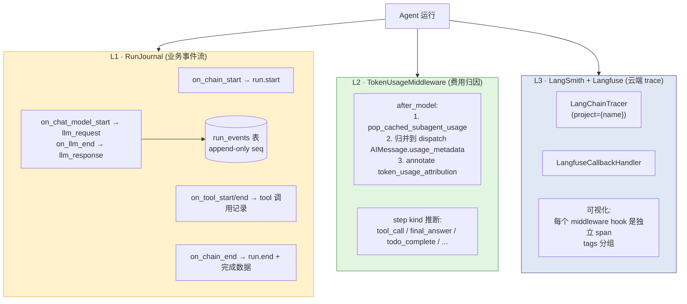
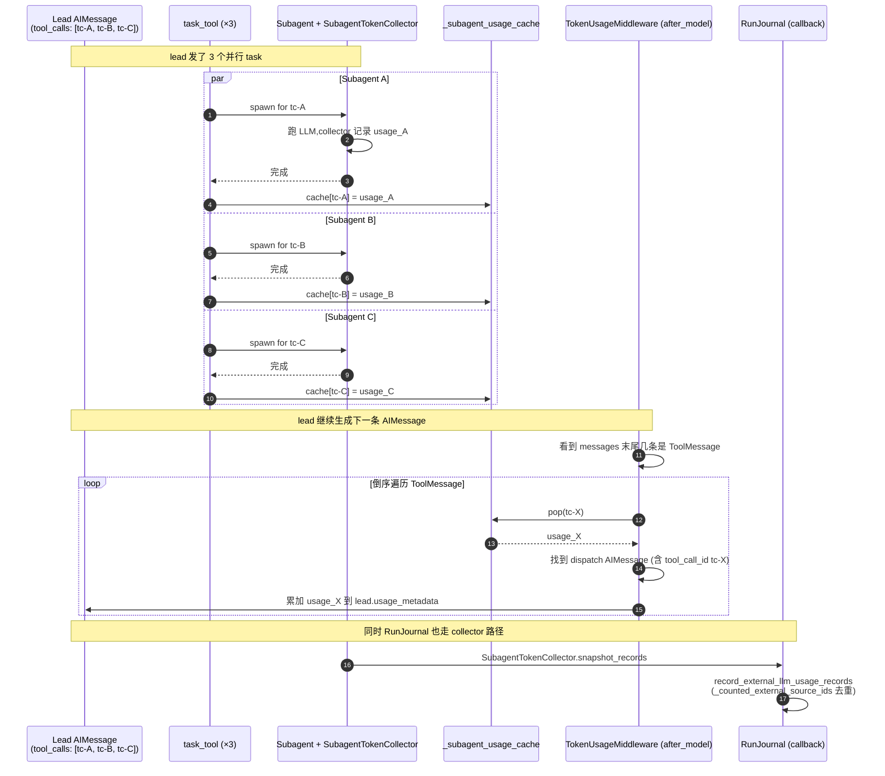
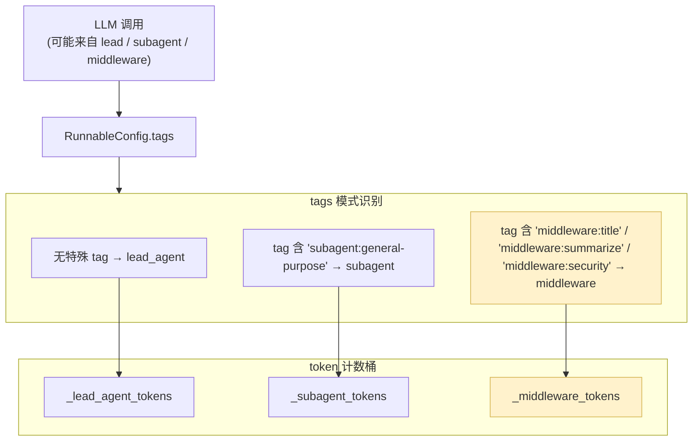

# 23 · Tracing & Observability：RunJournal + Token Usage + LangSmith + Langfuse

> 关键技术点层第 4 篇。前 22 章 agent 的"能不能跑、跑得对不对、安全不安全"全讲完；**本章讲"跑完之后能不能看清发生了什么"** —— 这是企业级 agent 系统的"上岗证"。
>
> DeerFlow 的可观测性分三层：
> 1. **RunJournal**（业务事件流落库）—— LangChain Callback 自动捕获 `on_llm_end / on_chain_start / on_tool_end`，写到 `run_events` 表
> 2. **TokenUsageMiddleware**（费用归因）—— 把 subagent 的 token 通过 `tool_call_id` 缓存回归到主 AIMessage，并按 todo 步骤打"step kind"标签
> 3. **LangSmith / Langfuse**（云端 trace 平台）—— `build_tracing_callbacks` 自动挂到模型 callbacks，可视化整个 agent 调用链
>
> 关键看点：**`_identify_caller` 用 tags 区分 lead / subagent / middleware、`record_external_llm_usage_records` 用 source_run_id 防重复计费、`with_config(tags=["middleware:title"])` 让 trace 节点可读化**。

---

## 🎯 学习目标

读完这份文档，你能回答：

1. **三层观测**（RunJournal / TokenUsage / LangSmith+Langfuse）各自的"职责边界"是什么？哪些数据写哪一层？为什么不合并？
2. **RunJournal `_identify_caller` 用 tags 判断 lead / subagent / middleware** —— 为什么用 tags 而不是 metadata / call stack？给一个 LangSmith trace 上区分困难的具体例子。
3. **TokenUsageMiddleware 用 `tool_call_id` 把 subagent token 回归到 lead AIMessage** —— 19 章 `_subagent_usage_cache` 写 / 本中间件 `pop_cached_subagent_usage` 读。**如果 lead AIMessage 一次发了 3 个 task tool_call，token 应该归到哪一条？**
4. **`build_tracing_callbacks` 启用模式**：fail-fast 抛错而不是 silently 降级。**为什么这是个正确选择**？什么场景下应该改成 fail-open？
5. **RunJournal `on_llm_new_token is NOT implemented`** 顶部注释明示。**为什么不实现**？看似实现了观测更细，到底缺什么导致它"不该实现"？

---

## 🗂️ 源码定位

| 关注点 | 文件 / 行号 | 关键锚点 |
|---|---|---|
| Tracing 工厂 | `packages/harness/deerflow/tracing/factory.py` | `build_tracing_callbacks`；`_create_langsmith_tracer`；`_create_langfuse_handler`；fail-fast init errors |
| RunJournal 主类 | `packages/harness/deerflow/runtime/journal.py` | `RunJournal(BaseCallbackHandler)`；`on_chain_start / on_chat_model_start / on_llm_end / on_tool_end`；`_identify_caller`（tags 判断）；`record_external_llm_usage_records`（subagent 回归） |
| RunEvent 持久化 | `packages/harness/deerflow/runtime/events/store/` | `RunEventStore` 抽象；`memory.py` / `jsonl.py` / `db.py` 三实现；`_flush_async` 批写 |
| RunEvent 数据模型 | `packages/harness/deerflow/persistence/models/run_event.py` | `RunEventRow`：run_id / seq / event_type / category / content / metadata（24 章 5 表之一） |
| TokenUsageMiddleware | `packages/harness/deerflow/agents/middlewares/token_usage_middleware.py` | `TOKEN_USAGE_ATTRIBUTION_KEY`；`_apply`（subagent 回归 + step kind 推断）；`_build_todo_actions`（write_todos 精细归因） |
| Subagent 桥接 | `packages/harness/deerflow/tools/builtins/task_tool.py` | `_subagent_usage_cache` / `pop_cached_subagent_usage`（19 章） |
| SubagentTokenCollector | `packages/harness/deerflow/subagents/token_collector.py`（19 章） | 捕获 subagent LLM 调用 → 上报到父 RunJournal |
| TracingConfig | `packages/harness/deerflow/config/tracing_config.py` | `langsmith.enabled / project` / `langfuse.enabled / public_key / secret_key / host` |
| `with_config(tags=[...])` 标记 | `packages/harness/deerflow/agents/middlewares/title_middleware.py`（14 章）+ `summarization_middleware.py`（14 章）+ `lead_agent/agent.py`（10 章 summarization middleware 创建处） | tags=`["middleware:title"]` / `["middleware:summarize"]` |

---

## 🧭 架构图

### 1. 三层观测的职责边界



### 2. Token 归因完整链路（subagent → lead）



### 3. tags 驱动的 caller 识别



---

## 🔍 核心逻辑讲解

### Part 1 · 三层观测的职责边界

#### L1 · RunJournal —— 业务事件流

**写什么**：
- `run.start` —— root chain 开始
- `llm.human.input` —— 首条用户消息
- `llm_request` / `llm_response` —— 每次 LLM 调用的输入输出（OpenAI 格式）
- `tool_start` / `tool_end` —— 每次工具调用
- `run.end` —— 完成 + 累计 token 数

**存哪**：`run_events` 表（24 章详讲）—— append-only，按 seq 排序，**永远不删**。

**为什么不删**：审计需求。客户问"3 个月前那次对话花了多少钱"，必须能查。

**优势**：完全在自己掌握 —— SQL 查询 / 自定义 dashboard / 不依赖外部 SaaS。

#### L2 · TokenUsageMiddleware —— 费用归因

**写什么**：
- 每个 AIMessage 的 `usage_metadata`（input_tokens / output_tokens / total_tokens）
- 每个 AIMessage 的 `additional_kwargs.token_usage_attribution` —— **step kind 标签**（如 `{kind: "tool_call", actions: [...]}`）
- 把 subagent token 合并回 dispatch AIMessage 的 usage_metadata

**存哪**：消息体本身（state messages → 持久化进 Checkpointer）

**优势**：精确归因到"用户视角的一步"——前端能显示"这条消息花了 X tokens"。

#### L3 · LangSmith / Langfuse —— 云端 trace

**写什么**：完整调用链（每个 middleware hook 都是独立 span / 节点）

**存哪**：第三方 SaaS / 自托管 Langfuse

**优势**：UI 可视化好；跨 run 对比方便；debug 友好。

**劣势**：依赖第三方；数据保留期限受限；费用模型。

#### 为什么不合并？

| 三层 | 主要消费者 | 数据形态 |
|---|---|---|
| RunJournal | 业务后台 / 审计 / SQL 查询 | 结构化 event sequence |
| TokenUsage | 前端 / 用户费用展示 | 嵌在 message 里的 attribution |
| LangSmith / Langfuse | 开发调试 / 大局视角 | trace tree |

**合并的诱惑**：少维护一套。
**合并的代价**：失去针对性 —— LangSmith API 不能跑 SQL；RunJournal 不能可视化 trace；TokenUsage 嵌在 message 里方便前端但不便于跨 run 分析。

**DeerFlow 的选择**：三层各司其职 + 通过 `_identify_caller` 等共享语义保持一致性。

### Part 2 · `_identify_caller` 用 tags 判断

#### tags 注入点

LangChain `RunnableConfig.tags` 是个 list，由调用方设置。DeerFlow 在 3 处主动注入：

1. **`subagents/executor.py`**：subagent agent 创建时 `with_config(tags=[f"subagent:{name}"])`
2. **`middlewares/title_middleware.py::_get_runnable_config`**（14 章）：
   ```python
   config["tags"] = [*(config.get("tags") or []), "middleware:title"]
   ```
3. **`agents/lead_agent/agent.py::_create_summarization_middleware`**（10 章）：
   ```python
   model = create_chat_model(...)
   model = model.with_config(tags=["middleware:summarize"])
   ```

#### `_identify_caller` 实现（简化）

```python
def _identify_caller(self, tags: list[str] | None) -> str:
    if not tags:
        return "lead_agent"
    for tag in tags:
        if tag.startswith("subagent:"):
            return tag                            # 直接返回 "subagent:general-purpose"
        if tag.startswith("middleware:"):
            return tag                            # 直接返回 "middleware:title"
    return "lead_agent"
```

#### 为什么用 tags 不用 metadata / call stack？

| 方案 | 优势 | 劣势 |
|---|---|---|
| **tags 注入**（当前） | LangChain 原生支持，传播自动；不需要改 LangChain | tags 是 list of string，只能传简单字符串 |
| **metadata** | 结构化 dict，灵活 | metadata 传播规则复杂（不一定下传到 child runnable） |
| **call stack inspect** | 不需要主动注入 | 反射开销 + 跨线程不传播 + Python 异步栈难解析 |

**真实痛点**：没有 tags 时，**LangSmith trace 上你看到 6 个嵌套 LLM 调用，但不知道哪个是 title / summarization / lead / subagent —— 全部叫"ChatOpenAI"**。tags 让 trace UI 能用"按 tag 分组" / "tag 过滤"，瞬间可读化。

→ 这是 14 章反复强调 "tags=['middleware:title']" 重要性的真实原因。

### Part 3 · `record_external_llm_usage_records` 防重复计费

#### 完整链路

```python
# subagents/token_collector.py (19 章)
class SubagentTokenCollector(BaseCallbackHandler):
    def on_llm_end(self, response, *, run_id, **kwargs):
        rid = str(run_id)
        if rid in self._counted_run_ids: return
        self._counted_run_ids.add(rid)
        self._records.append({
            "source_run_id": rid,        # ⭐ LangChain run_id 作为去重 key
            "caller": self.caller,        # "subagent:general-purpose"
            "input_tokens": ...,
            "output_tokens": ...,
            "total_tokens": ...,
        })

# runtime/journal.py (本章)
def record_external_llm_usage_records(self, records):
    for record in records:
        source_id = str(record.get("source_run_id", ""))
        if not source_id: continue
        if source_id in self._counted_external_source_ids:    # ⭐ 二重去重
            continue
        self._counted_external_source_ids.add(source_id)
        self._total_input_tokens += record.get("input_tokens", 0)
        ...
        caller = str(record.get("caller", ""))
        if caller.startswith("subagent:"):
            self._subagent_tokens += total_tk
        elif caller.startswith("middleware:"):
            self._middleware_tokens += total_tk
        else:
            self._lead_agent_tokens += total_tk
```

#### 双重去重的工程理由

| 去重位置 | 目的 |
|---|---|
| `SubagentTokenCollector._counted_run_ids` | 防同一 LLM 调用 LangChain 触发多次 on_llm_end（罕见但发生过） |
| `RunJournal._counted_external_source_ids` | 防同一 collector 被两次 `record_external_llm_usage_records`（如 task_tool 重试） |

**两层都必要**：单层任意一层都可能漏。

#### caller-bucketed 累加

```python
self._subagent_tokens += total_tk      # 按 caller 前缀分桶
```

**用户感知**：
- `run.end` 事件含 `{lead: 1500, subagent: 4500, middleware: 200}` 分项
- 前端可显示"主对话 1.5K + 子任务 4.5K + 元服务 0.2K = 共 6.2K tokens"
- 运维查表查"哪类工作消耗 token 最多"做容量规划

### Part 4 · `TokenUsageMiddleware._apply` 的 subagent 归并算法

```python
def _apply(self, state):
    messages = state.get("messages", [])
    state_updates: dict[int, AIMessage] = {}

    if len(messages) >= 2:
        idx = len(messages) - 2
        while idx >= 0:
            tool_msg = messages[idx]
            if not isinstance(tool_msg, ToolMessage) or not tool_msg.tool_call_id:
                break                       # 倒序往前遇到非 ToolMessage 停止

            subagent_usage = pop_cached_subagent_usage(tool_msg.tool_call_id)
            if subagent_usage:
                # 找 dispatch AIMessage
                dispatch_idx = idx - 1
                while dispatch_idx >= 0:
                    candidate = messages[dispatch_idx]
                    if isinstance(candidate, AIMessage) and _has_tool_call(candidate, tool_msg.tool_call_id):
                        # 累加到现有 update(同 AIMessage 多 task)或 merge fresh
                        existing_update = state_updates.get(dispatch_idx)
                        prev = existing_update.usage_metadata if existing_update else (getattr(candidate, "usage_metadata", None) or {})
                        merged = {
                            **prev,
                            "input_tokens": prev.get("input_tokens", 0) + subagent_usage["input_tokens"],
                            "output_tokens": prev.get("output_tokens", 0) + subagent_usage["output_tokens"],
                            "total_tokens": prev.get("total_tokens", 0) + subagent_usage["total_tokens"],
                        }
                        state_updates[dispatch_idx] = candidate.model_copy(update={"usage_metadata": merged})
                        break
                    dispatch_idx -= 1
            idx -= 1

    last = messages[-1]
    if not isinstance(last, AIMessage):
        ...
```

#### 多 task 并发的归并

**lead AIMessage 一次 emit 3 个 task tool_call**（tc-A / tc-B / tc-C），3 个 subagent 各自跑完，token 都该归到这一条 lead AIMessage：

| 步骤 | state messages |
|---|---|
| lead emit 3 task | `[Human, AI(tc-A,tc-B,tc-C)]` |
| 3 subagent 完成 | `[Human, AI(...), ToolMsg(tc-A), ToolMsg(tc-B), ToolMsg(tc-C)]` |
| 下一轮 model_call 后 | `[Human, AI(...), ToolMsg×3, NewAI]` |
| `_apply` 倒序遍历 ToolMsg | 找到每个 ToolMsg 对应的 dispatch AIMessage（都是同一条），累加 3 次 usage 到同一 message_copy |

**关键设计**：`state_updates: dict[int, AIMessage]` 用 **dispatch_idx** 作 key —— 多个 tool_call_id 同 dispatch 时，**累加而不是覆盖**。

#### `_build_attribution`（step kind 推断）

`_apply` 末尾给 `last` AIMessage 加 `token_usage_attribution`：

```python
{
    "kind": "tool_call",            # 或 final_answer / todo_complete / todo_start / ...
    "shared_attribution": True,      # 多个 todo action 共享
    "tool_call_ids": [...],
    "actions": [{"kind": "todo_complete", "todo": {...}}, ...]
}
```

**用途**：前端可显示"这次消耗 800 tokens 用于'完成 todo A + 启动 todo B'"，让用户**透明地看到 token 花在哪里**。

### Part 5 · `build_tracing_callbacks` 的 fail-fast

```python
def build_tracing_callbacks() -> list[Any]:
    validate_enabled_tracing_providers()
    enabled_providers = get_enabled_tracing_providers()
    if not enabled_providers:
        return []

    tracing_config = get_tracing_config()
    callbacks: list[Any] = []

    for provider in enabled_providers:
        if provider == "langsmith":
            try:
                callbacks.append(_create_langsmith_tracer(tracing_config.langsmith))
            except Exception as exc:
                raise RuntimeError(f"LangSmith tracing initialization failed: {exc}") from exc
        elif provider == "langfuse":
            try:
                callbacks.append(_create_langfuse_handler(tracing_config.langfuse))
            except Exception as exc:
                raise RuntimeError(f"Langfuse tracing initialization failed: {exc}") from exc

    return callbacks
```

#### fail-fast 的工程动机

**用户场景**：在 `.env` 里**显式启用** `LANGSMITH_TRACING=true` + 配错了 `LANGSMITH_API_KEY`：

| fail-fast（当前） | silently 降级 |
|---|---|
| 启动时立刻报错"LangSmith initialization failed: ..." | 启动 OK，但 trace 全部丢失 |
| 用户立刻知道配错了 | 用户跑了 1 周才发现没 trace |
| 必须修才能跑 | 监控盲区 |

**fail-fast 是正确选择**因为：
- 用户**显式启用**意味着他**希望它工作**
- 静默失败 = 监控失效 = 安全 / 计费风险

#### 反例：fail-open 适用场景

如果 tracing 是"锦上添花"（如 dev 环境调试）：
- LangSmith 服务挂 → dev 不应该被卡住 → fail-open 合理

**DeerFlow 选 fail-fast** 是因为它面向**生产 SaaS** 部署 —— 配错 = bug，必须修。

### Part 6 · 为什么 `on_llm_new_token` NOT implemented

`journal.py` 顶部注释明示：
> on_llm_new_token is NOT implemented -- only complete messages via on_llm_end

#### 实现 on_llm_new_token 看似有价值

LangChain 流式 LLM 调用，每个 token 触发 `on_llm_new_token(token, run_id)`。**实现它能拿到逐 token 的时序数据** —— 看起来对调试有帮助。

#### 为什么 DeerFlow 不实现

1. **存储量爆炸**：典型 chat 响应 200-500 tokens × 用户每天 100 次 chat = 20-50K events/day/user → DB 写放大严重
2. **数据冗余**：完整 message 在 `on_llm_end` 已经拿到，token-level 是它的可推导子集（token sequence = message.split）
3. **价值有限**：99% 的运维场景只关心"总耗时 + 总 tokens"而不是逐 token 时序
4. **流式语义复杂**：on_llm_new_token 不是严格按时序到达（异步） → 排序需要额外逻辑
5. **回调开销**：每个 token 调一次 callback → 严重影响流式 latency

**DeerFlow 选择**：以 `on_llm_end` 为单元粒度 —— 一条完整 message 一个 event。**粒度对**就够了，不需要 token-level。

**反例**：如果你做"逐 token 的 audit / 合规审查"（如金融 SEC 要求每个 token 都可审计） → 必须实现。但 DeerFlow 默认 agent 应用不需要这种粒度。

### Part 7 · `with_config(tags=[...])` 的可读化威力

#### 没 tags 时的 LangSmith 体验

```
[ChatOpenAI]  span 1
[ChatOpenAI]  span 2
[ChatOpenAI]  span 3
[ChatOpenAI]  span 4
```
**全部叫 ChatOpenAI，分不清谁是谁**。

#### 加 tags 后

```
[ChatOpenAI tags=[middleware:title]]      span 1   → 哦,这是 title 生成
[ChatOpenAI tags=[middleware:summarize]]  span 2   → 这是上下文压缩
[ChatOpenAI tags=[subagent:bash]]         span 3   → 这是 bash 子智能体
[ChatOpenAI tags=[]]                       span 4   → 这是主 lead agent
```

**LangSmith UI 支持 tag 过滤** → 选择 `middleware:*` 只看 middleware；选择 `subagent:*` 只看子任务。

#### `with_config(tags=...)` vs `RunnableConfig(tags=...)`

| | 时机 | 作用范围 |
|---|---|---|
| `model.with_config(tags=...)` | 模型创建时绑定 | **所有**使用该模型实例的调用 |
| `model.invoke(..., config={"tags": [...]})` | 调用时传 | 仅本次 |

DeerFlow 在 SummarizationMiddleware 用前者（模型实例**生来就带** tag）；TitleMiddleware 用后者（每次调用临时加）。

→ **设计取舍**：长期标记用 `with_config`；动态标记用调用时 config。

---

## 🧩 体现的通用 Agent 设计模式

| 模式 | 可观测性中的体现 |
|---|---|
| **Layered Observability**（分层观测） | RunJournal（业务）+ TokenUsage（前端）+ LangSmith/Langfuse（开发） |
| **Callback Pattern** | LangChain BaseCallbackHandler 是标准入口 |
| **Tag-based Categorization** | tags 区分 lead / subagent / middleware |
| **Source-id Deduplication** | `_counted_external_source_ids` 防重复计费 |
| **Append-only Event Log** | RunEvent 按 seq 永不更新 |
| **Fail-fast on Explicit Opt-in** | LangSmith 启用了配错就 raise |
| **Step-kind Attribution** | token_usage_attribution 细到 todo action |
| **Granularity by Design** | on_llm_end 粒度而非 token-level，平衡覆盖与开销 |

---

## 🧱 与 Agent Harness 六要素的对应关系

| 六要素 | Observability 怎么提供基础设施 |
|---|---|
| ① 反馈循环 | run_events 记录每个反馈循环步骤 |
| ② 记忆持久化 | run_events 表 append-only 是审计 trail 持久化 |
| ③ 动态上下文 | token_usage_attribution 让用户看到"每步上下文成本" |
| ④ 安全护栏 | run.end 事件含完整 audit；guardrail deny 也走 callback |
| ⑤ 工具集成 | tool_start / tool_end 记录每次工具调用 |
| ⑥ **可观测性** | **本章核心** —— 三层观测的完整体系 |

---

## ⚠️ 常见坑与调试技巧

### 坑 1 · LangSmith trace 上 LLM 调用看不出来源

**症状**：看到一堆"ChatOpenAI" span，不知道哪个是 middleware / subagent。
**修复**：扩展 DeerFlow 在所有 internal LLM 调用都加 tag —— 14 章 title / summarize 已加，其他 middleware 内部 LLM 调用（如 18 章 security_scanner）也该加。

### 坑 2 · Token 双倍计费

**症状**：subagent 跑了 1500 tokens，但 lead 显示总 token = 3000。
**可能原因**：
- `_subagent_usage_cache` 在 TokenUsageMiddleware pop 后又被 RunJournal 重复计 → 双重去重的两层都没 work
- 检查 `_counted_external_source_ids` 是否 add 进了

**调试**：在 `record_external_llm_usage_records` 加 log 看每个 source_run_id 来一次还是多次。

### 坑 3 · `on_llm_end` 不触发

**症状**：RunJournal 收不到任何 llm_response 事件。
**可能原因**：
- LangChain `CallbackManager` 没被传给 model（factory 没注入 callbacks）
- Provider 子类覆盖了 `_generate` 但忘了调 super → callbacks 没触发
**调试**：在 `on_chat_model_start` 加 log，先确认 start 触发了再追 end。

### 坑 4 · `record_external_llm_usage_records` 时机错

`task_tool` 跑完才把 collector 的 records 上报到 lead RunJournal。如果**task 还在跑就上报** → records 不全。
**修复**：必须等 `SubagentResult.status` 进入终态再上报（19 章讲过 deferred cleanup 也保证这点）。

### 坑 5 · LangSmith 离线时 Gateway 启动失败

**症状**：网络断开，Gateway lifespan 启动到 build_tracing_callbacks 时挂了，整个 Gateway 不能启。
**原因**：fail-fast init —— LangSmith API check 失败 → raise。
**短期修复**：临时 `LANGSMITH_TRACING=false` 关闭。
**长期修复**：把 `_create_langsmith_tracer` 改成"创建 tracer 不连网，第一次 emit 才连网" —— 让启动期不依赖网络。

---

## 🛠️ 动手实操

### Demo · 三层观测核心机制实测

```python
"""
Tracing & Observability demo.

跑法:  PYTHONPATH=backend uv run python scripts/observability_walkthrough.py
"""
import sys, os
from pathlib import Path

sys.path.insert(0, "backend")
sys.path.insert(0, "backend/packages/harness")
os.chdir(Path(__file__).resolve().parents[1])

from langchain_core.messages import AIMessage, HumanMessage, ToolMessage

from deerflow.agents.middlewares.token_usage_middleware import TokenUsageMiddleware
from deerflow.tools.builtins.task_tool import _cache_subagent_usage, _subagent_usage_cache


# ====== Case 1: _identify_caller 模拟 ======
print("\n" + "=" * 70)
print("CASE 1 · _identify_caller 根据 tags 分类")
print("=" * 70)

class FakeJournal:
    def _identify_caller(self, tags):
        if not tags: return "lead_agent"
        for tag in tags:
            if tag.startswith("subagent:"): return tag
            if tag.startswith("middleware:"): return tag
        return "lead_agent"

j = FakeJournal()
test_cases = [
    None,
    [],
    ["custom-tag"],
    ["middleware:title"],
    ["middleware:summarize", "user-tag"],
    ["subagent:general-purpose"],
    ["random", "subagent:bash", "x"],
]
for tags in test_cases:
    caller = j._identify_caller(tags)
    print(f"  tags={tags!r:<50} → caller={caller!r}")


# ====== Case 2: subagent token 归并到 lead AIMessage ======
print("\n" + "=" * 70)
print("CASE 2 · TokenUsageMiddleware subagent 归并")
print("=" * 70)

# 模拟 lead 一次发 3 个 task
lead_ai = AIMessage(
    content="",
    id="ai-1",
    tool_calls=[
        {"id": "tc-A", "name": "task", "args": {"task": "..."}},
        {"id": "tc-B", "name": "task", "args": {"task": "..."}},
        {"id": "tc-C", "name": "task", "args": {"task": "..."}},
    ],
    usage_metadata={"input_tokens": 100, "output_tokens": 50, "total_tokens": 150},
)

# 模拟 3 个 subagent 完成,各自把 usage 放入 cache
_subagent_usage_cache.clear()
_cache_subagent_usage("tc-A", {"input_tokens": 500, "output_tokens": 300, "total_tokens": 800})
_cache_subagent_usage("tc-B", {"input_tokens": 400, "output_tokens": 250, "total_tokens": 650})
_cache_subagent_usage("tc-C", {"input_tokens": 600, "output_tokens": 400, "total_tokens": 1000})

# state 包含 3 个 ToolMessage + 下一条新 AIMessage(non-tool)
messages = [
    HumanMessage("user query"),
    lead_ai,
    ToolMessage(content="result A", tool_call_id="tc-A"),
    ToolMessage(content="result B", tool_call_id="tc-B"),
    ToolMessage(content="result C", tool_call_id="tc-C"),
    AIMessage(content="final answer based on 3 tasks", id="ai-2", usage_metadata={"input_tokens": 200, "output_tokens": 80, "total_tokens": 280}),
]

mw = TokenUsageMiddleware()
result = mw._apply({"messages": messages, "todos": []})

if result:
    updated = result["messages"]
    print(f"  返回 {len(updated)} 条 update")
    for m in updated:
        if isinstance(m, AIMessage):
            usage = m.usage_metadata or {}
            print(f"  {m.id}: input={usage.get('input_tokens')}, output={usage.get('output_tokens')}, total={usage.get('total_tokens')}")

print(f"\n  ⭐ 期望 ai-1 累加 3 个 subagent:")
print(f"     input = 100 + 500+400+600 = 1600")
print(f"     output = 50 + 300+250+400 = 1000")
print(f"     total = 150 + 800+650+1000 = 2600")


# ====== Case 3: pop 后 cache 清空 (与 19 章呼应) ======
print("\n" + "=" * 70)
print("CASE 3 · cache 被 pop 后清空")
print("=" * 70)

print(f"  归并后 cache 剩余: {dict(_subagent_usage_cache)}")
print(f"  ⭐ 全部 3 个 tc-* 已被 pop,cache 应为空")


# ====== Case 4: record_external_llm_usage_records 双重去重 ======
print("\n" + "=" * 70)
print("CASE 4 · 模拟 RunJournal source_run_id 去重")
print("=" * 70)

class FakeRunJournal:
    def __init__(self):
        self._track_tokens = True
        self._counted_external_source_ids = set()
        self._total_input_tokens = 0
        self._total_output_tokens = 0
        self._total_tokens = 0
        self._lead_agent_tokens = 0
        self._subagent_tokens = 0
        self._middleware_tokens = 0

    def record_external_llm_usage_records(self, records):
        for record in records:
            source_id = str(record.get("source_run_id", ""))
            if not source_id: continue
            if source_id in self._counted_external_source_ids:
                continue
            total_tk = record.get("total_tokens", 0)
            if total_tk <= 0:
                total_tk = (record.get("input_tokens", 0) or 0) + (record.get("output_tokens", 0) or 0)
            if total_tk <= 0:
                continue
            self._counted_external_source_ids.add(source_id)
            self._total_input_tokens += record.get("input_tokens", 0)
            self._total_output_tokens += record.get("output_tokens", 0)
            self._total_tokens += total_tk
            caller = str(record.get("caller", ""))
            if caller.startswith("subagent:"):
                self._subagent_tokens += total_tk
            elif caller.startswith("middleware:"):
                self._middleware_tokens += total_tk
            else:
                self._lead_agent_tokens += total_tk


rj = FakeRunJournal()
records_batch1 = [
    {"source_run_id": "run-100", "caller": "subagent:bash", "input_tokens": 200, "output_tokens": 100, "total_tokens": 300},
    {"source_run_id": "run-101", "caller": "middleware:title", "input_tokens": 50, "output_tokens": 20, "total_tokens": 70},
]
records_batch2 = [
    {"source_run_id": "run-100", "caller": "subagent:bash", "input_tokens": 200, "output_tokens": 100, "total_tokens": 300},  # 重复
    {"source_run_id": "run-102", "caller": "subagent:research", "input_tokens": 500, "output_tokens": 300, "total_tokens": 800},
]

rj.record_external_llm_usage_records(records_batch1)
rj.record_external_llm_usage_records(records_batch2)
print(f"  total = {rj._total_tokens}  (期望 300+70+800 = 1170,run-100 重复被忽略)")
print(f"  subagent = {rj._subagent_tokens}  (期望 300+800 = 1100)")
print(f"  middleware = {rj._middleware_tokens}  (期望 70)")
print(f"  lead = {rj._lead_agent_tokens}  (期望 0)")
```

### 调试任务

1. **断点位置**：
   - `journal.py::_identify_caller` 看 tags 分支
   - `token_usage_middleware.py::_apply` while 循环 —— 看倒序遍历 tool_msg
   - `journal.py::record_external_llm_usage_records` 的 source_id 去重判断
2. **观察什么**：
   - Case 1 中 6 种 tags 分别识别为 lead / middleware / subagent
   - Case 2 中 ai-1 的 usage 累加了 3 个 subagent
   - Case 3 cache 在归并后清空（防重复计费）
   - Case 4 重复 run-100 被去重，total = 1170 不是 1470
3. **人为制造异常**：
   - Case 2 删除一个 ToolMessage（缺少 tc-B 的 ToolMessage）→ 看归并跳过 tc-B
   - Case 4 加一条 `source_run_id` 空字符串 → 看被跳过（不计入）

### 改造练习

1. **练习 A（简单）**：扩展 `_identify_caller` 支持自定义前缀（如 `acp:` for ACP agent 调用），并在 17 章 ACP 工具内注入对应 tag。
2. **练习 B（中等）**：实现 `RunJournalMetrics` —— 从 `run_events` 表聚合"每天 / 每用户 / 每 caller 桶"的 token 用量，给运维 dashboard 用。
3. **挑战题**：扩展 LangSmith 集成支持"自定义 attributes" —— 每个 trace 自动带上 `user_id / agent_name / model_name`，让 trace UI 支持按这些维度过滤。

### 预期输出 & 验证方式

- Case 1：6 种 tags 正确分类
- Case 2：ai-1 累加后 total = 2600（150 + 800 + 650 + 1000）
- Case 3：cache 在归并后为空
- Case 4：double-counting 防御生效（run-100 不重复计）

---

## 🎤 面试视角

### 业务型大厂卷

**问 1**：DeerFlow 三层观测（RunJournal / TokenUsage / LangSmith）各司其职。**给一个 incident 场景**说明三层都不可缺。

> **教科书答案**：
> 场景：**客户投诉"上周三对话费用算错了"**
> - 客户提供 thread_id + 大致时间
> - 用 LangSmith 找当时的 trace → 但 LangSmith 保留期 14 天，已过 → **失败**
> - 转用 RunJournal `run_events` 表 → 永久保留 → 拉出当时的 llm.start / llm.end 事件 → 看到每次 LLM 调用的 model + 调用次数
> - 拉 messages 表（24 章）→ 每条 AIMessage.usage_metadata + token_usage_attribution → 精确算出每步费用
> - 三层结合定位:"那次调用错用了 gpt-4o 而非 gpt-4o-mini" + "客户 prompt 触发了 5 次 retry"
> 结论：**LangSmith 是开发调试视图（短期）；RunJournal 是审计存档（长期）；TokenUsage 是用户视角的费用透明**。三个角度都需要，**少一层就有 incident 无法定位**。

**问 2**：DeerFlow `build_tracing_callbacks` fail-fast。**给一个真实生产场景**说明 fail-fast 比 silently 降级好 + **一个反例场景**它会引发新问题。

> **教科书答案**：
> **fail-fast 好的场景**：用户在 .env 配 `LANGSMITH_API_KEY=lsv2_pt_xxxxxxx` 但 typo 成 `lsv2_pt_xxxxxxX`。
> - silently 降级：Gateway 启动 OK，跑了 1 周用户来问"为什么 LangSmith dashboard 没数据" → 监控盲区
> - fail-fast：启动报错 → 用户立刻修
> **fail-fast 引发新问题**：LangSmith 服务**短暂宕机**（如 SaaS 偶发 5xx）→ DeerFlow 启动失败 → **业务完全不可用**只因 trace 服务挂
> 改进方案：
> 1. **lazy init**：tracer 创建时不连网，第一次 emit 时再连 + retry
> 2. **fail-open after first success**：第一次成功创建后，后续 emit 失败只 log + 不挂 Gateway
> 3. **circuit breaker**：13 章的 LLMError 思路，发现 LangSmith 持续失败 → 暂时跳过 → 定期 retry
> **DeerFlow 当前是 strict fail-fast** —— 合理但激进。生产 SaaS 应该升级到 lazy + circuit breaker。

### 创业型 AI 公司卷

**问 3**：你团队想做"实时 token 费用 dashboard" —— 用户能在前端看到自己当前 thread 已经花了多少。**用 DeerFlow 现有 3 层观测怎么实现？**

> **参考答案**：
> 方案选择：用 **L2 TokenUsageMiddleware** + L1 RunJournal
> 实现：
> 1. **前端读取**：每条 AIMessage 流出时已带 `usage_metadata` + `token_usage_attribution` → 前端实时累加（最简单）
> 2. **跨 run 持久化**：RunJournal 写 run_events 时累计 → Gateway 暴露 `GET /api/threads/{tid}/token-usage` 返回历史累计
> 3. **per-step 透明度**：用 `token_usage_attribution.kind` 字段渲染"工具调用 / 思考 / 完成 todo"等步骤标签 + token
> 4. **LangSmith 不直接用**（trace 是开发视图，不该暴露给最终用户）
> 关键工程点：
> - 前端去重：14 章讲的 messages-tuple vs values 双流，必须按 message id 去重 token usage（避免 sum 2 次）
> - 实时性：用 SSE custom event 在 step 完成时主动推 `token_usage_step` 事件
> **DeerFlow 已有 token_usage_attribution 在 message 里**，前端 hook 一下就行 —— **不需要扩展后端**。这是良好分层的红利。

**问 4**：DeerFlow `RunJournal` 不实现 `on_llm_new_token`。**你团队接到 PRD："必须每个 token 都可审计"**（金融合规场景）。怎么办？

> **参考答案**：
> 4 步方案：
> 1. **重新评估需求**：合规真的要 token-level 还是 message-level？大多数 SEC / GDPR 要求 message-level 即可（一条完整输入 / 输出）→ 跟法务确认
> 2. **如果真要 token-level**：实现 `RunJournalDetailed(BaseCallbackHandler)` —— 在专用配置 `audit.token_level_logging: true` 下启用
>    ```python
>    class RunJournalDetailed(RunJournal):
>        def on_llm_new_token(self, token, *, run_id, **kw):
>            self._put(event_type="llm.token", category="audit",
>                      content={"token": token, "ts": time.time()},
>                      metadata={"run_id": str(run_id)})
>    ```
> 3. **存储优化**：token-level event 不写 SQL（写放大太大），写 append-only log 文件 + 异步归档到对象存储（S3）
> 4. **performance 检测**：在 dev 环境 benchmark 启用前后的 latency 差异 → 必要时引入采样（如只对涉及敏感工具的 run 启用）
> **DeerFlow 当前默认是对的**（不实现）—— 但**架构留口子让需要的场景能扩展**，这是 BaseCallbackHandler 抽象的价值。

---

## 📚 延伸阅读

- **DeerFlow `docs/MEMORY_IMPROVEMENTS_SUMMARY.md` + `STREAMING.md`** —— observability 与 streaming / memory 的交叉点。
- **LangSmith 官方 docs**：https://docs.langchain.com/observability/home
- **Langfuse vs LangSmith 对比**：https://langfuse.com/comparisons/langfuse-vs-langsmith
- **24 章 Persistence 五表**（下一章）：run_events 表是 RunJournal 的物理基础，配合阅读理解 append-only seq 设计。
- **OpenTelemetry tracing 标准**：理解 LangSmith / Langfuse 与 OTel 的关系（部分 instrumentation 可桥接到标准 OTel collector）。

---

## 🎤 互动检查 —— 请回答这 3 个问题

> **两句话即可**。

1. **机制理解题**：DeerFlow 用 LangChain `tags` 而非 metadata 区分 caller(lead / subagent / middleware)。**用一句话说明** tags 的传播机制 + 一句话说明为什么 metadata 不行。
2. **设计取舍题**：`on_llm_new_token` 不实现 —— **给 1 条**这种"故意降级粒度"的合理理由 + **1 个**真实场景这种粒度不够。
3. **应用题**:你的同事提了 PR:把 `build_tracing_callbacks` 改成"fail-open 即使 tracing 启用但配置错也不抛错"。**给两条理由**说明应该被拒绝。

回答后我们进入 **`24-persistence-alembic-and-five-tables.md`** —— Persistence 五表设计 + Alembic 迁移深潜。
