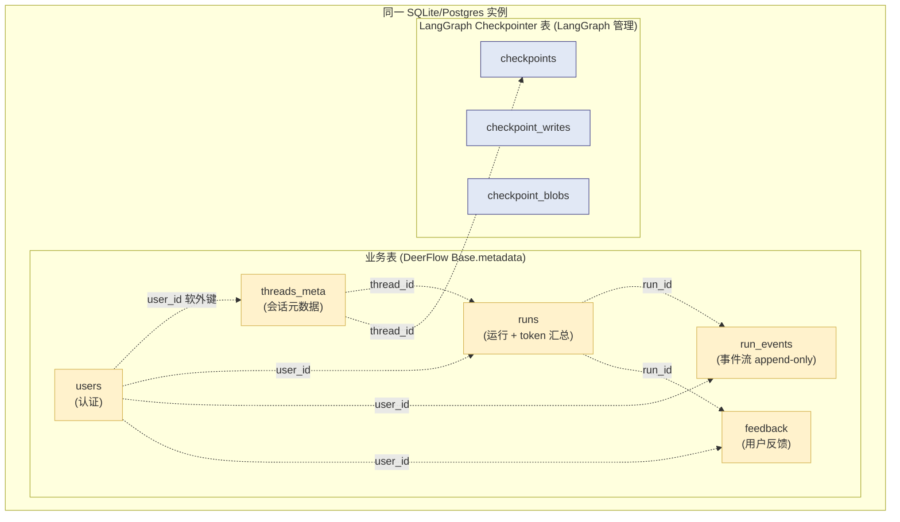
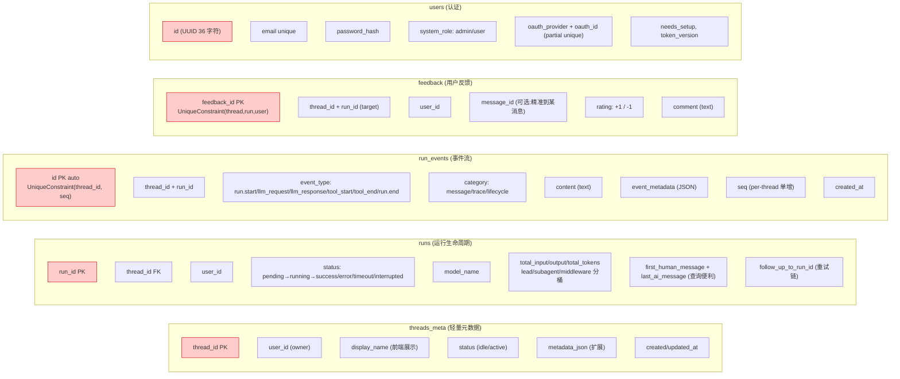
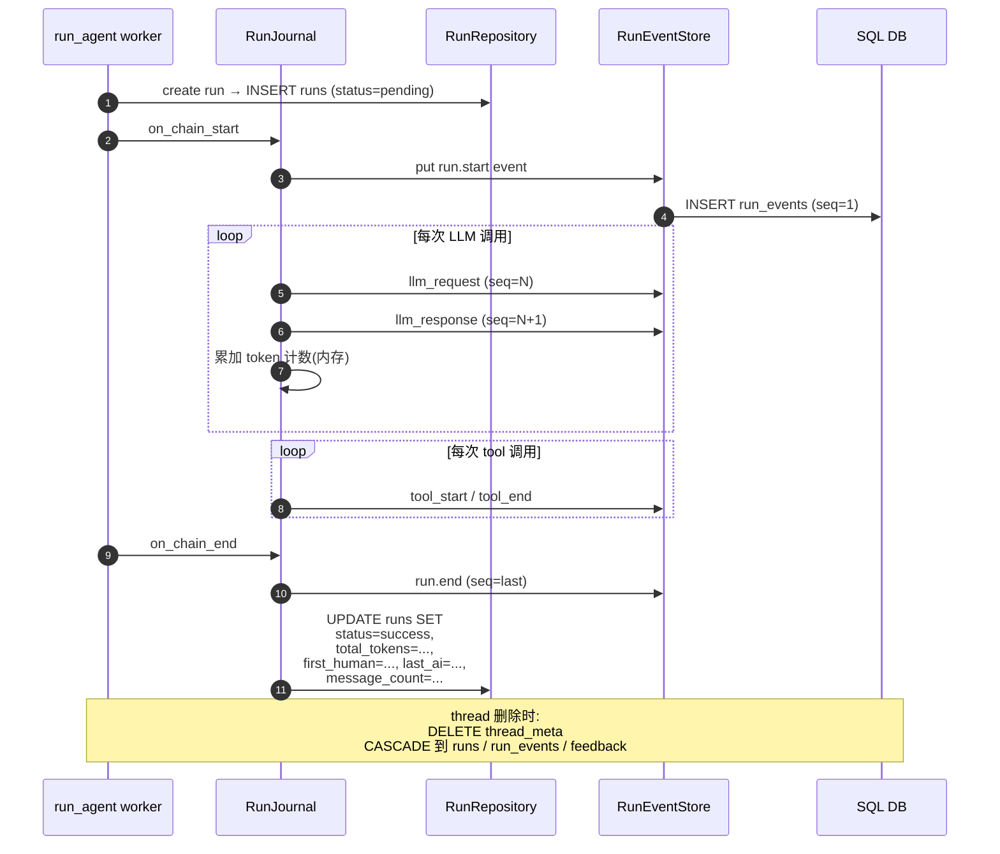

# 24 · Persistence：Alembic 迁移 + 五表设计

> 关键技术点层第 5 篇（收官）。前 23 章都建立在"DeerFlow 有数据库" 的假设上 —— 但**实际是哪 5 个表？为什么是这 5 个？怎么演进？**
>
> DeerFlow 业务持久层 **5 张表**：
> 1. **`threads_meta`** —— 会话元数据（title / status / 用户归属）
> 2. **`runs`** —— 运行记录（生命周期 + token 统计 + 业务关联）
> 3. **`run_events`** —— append-only 事件流（23 章 RunJournal 写的目标）
> 4. **`feedback`** —— 用户对 run / message 的 +1/-1 + 评论
> 5. **`users`** —— 认证 + system_role + OAuth 关联
>
> 关键看点：**Checkpointer vs 业务表分工、`Base` 子类自动 `to_dict`、`json_compat` 双后端 JSON 谓词、Alembic `render_as_batch=True` 让 SQLite ALTER TABLE 安全**。

---

## 🎯 学习目标

读完这份文档，你能回答：

1. **DeerFlow 业务 5 表 + LangGraph Checkpointer 表**为什么分两套？合并会出什么问题？
2. **`run_events` 表为什么是 append-only**（含 `UniqueConstraint(thread_id, seq)`）？为什么不在 `runs` 表上加列就完事了？
3. **`json_compat.py` 的 `JsonMatch`** 抽象了什么"SQLite 和 Postgres 不一致"的痛点？给一个具体的"不抽象会出什么 bug"例子。
4. **`Base.to_dict()` 用 `sa_inspect()`** 自动生成 dict —— 这种"基类自动序列化"哲学对应到 23 章的什么？哪些 ORM 是反例（必须每个 model 手写 to_dict）？
5. **Alembic `env.py` 用 `render_as_batch=True`** —— 这个标志为什么对 SQLite 特别重要？给一个具体场景说明不开会出什么问题。

---

## 🗂️ 源码定位

| 关注点 | 文件 / 行号 | 关键锚点 |
|---|---|---|
| Base 基类 + 自动序列化 | `packages/harness/deerflow/persistence/base.py` | `Base(DeclarativeBase)`；`to_dict(exclude=...)`；`__repr__` |
| Engine 生命周期 | `packages/harness/deerflow/persistence/engine.py` | `init_engine`；`_auto_create_postgres_db`；`_json_serializer`（ensure_ascii=False 支持中文） |
| JSON 双后端兼容 | `packages/harness/deerflow/persistence/json_compat.py` | `JsonMatch`；`validate_metadata_filter_key`（charset 限制防 SQL 注入）；`validate_metadata_filter_value`（int64 范围检查） |
| 5 个 ORM 模型 | `persistence/{thread_meta,run,feedback,user}/model.py` + `persistence/models/run_event.py` | `ThreadMetaRow` / `RunRow` / `FeedbackRow` / `UserRow` / `RunEventRow` |
| Repository 抽象 | `persistence/{thread_meta,run,feedback}/{base,sql,memory}.py` | base.py 抽象基；sql.py SQL 实现；memory.py 内存实现（无 DB 模式） |
| Alembic 配置 | `packages/harness/deerflow/persistence/migrations/` | `alembic.ini`；`env.py`（async runner + `render_as_batch=True`）；`versions/` |
| 数据库配置 | `packages/harness/deerflow/config/database_config.py` | `DatabaseConfig.backend = "memory" / "sqlite" / "postgres"` |
| Runtime 集成 | `app/gateway/deps.py::langgraph_runtime` | `init_engine_from_config(config.database)` 在 langgraph_runtime 内启动 |

---

## 🧭 架构图

### 1. 物理模型：5 张业务表 + 2 套 LangGraph 表



### 2. 5 表的字段责任分工



### 3. RunJournal 与 5 表的数据流



---

## 🔍 核心逻辑讲解

### Part 1 · 业务表 vs Checkpointer 表的分工

#### LangGraph Checkpointer 的"原本能做"

LangGraph Checkpointer (`langgraph.checkpoint.sqlite` / `langgraph.checkpoint.postgres`) 本身就有 3 张表：`checkpoints` / `checkpoint_writes` / `checkpoint_blobs`。**它已经存了**：
- 每个 thread 的完整 state 历史
- 每个 super-step 的中间值

→ **如果只想"恢复"功能**，Checkpointer 够。

#### 那为什么 DeerFlow 还要 5 张业务表？

| 业务表 | Checkpointer 不能做 |
|---|---|
| `threads_meta` | Checkpointer 不知道 thread 的"显示名 / 所属用户 / 创建时间"—— 这些是 UI 元数据，与 state 无关 |
| `runs` | Checkpointer 无 run 概念（一个 thread 多次 invoke 都共享 state，但每次是独立 run）；token 累计 / status / 重试关联都在 Checkpointer 外 |
| `run_events` | Checkpointer 存的是 state，**不是事件**。"何时调了哪个 LLM / 工具 / token 用了多少"无法从 state 反推 |
| `feedback` | 完全独立 —— 用户反馈和 agent 状态正交 |
| `users` | Checkpointer 不知道用户 —— DeerFlow 把 user_id 作为隐性 owner 加到所有业务表 |

#### 合并会出什么问题？

**假设**：把 runs / events / feedback 全塞进 Checkpointer state：
1. 每次 super-step 写入 → state 体积爆炸（events 永久 append → state 几千条消息）
2. Checkpointer 是 per-thread state，**跨 thread 查询不可能**（如"该用户最近 7 天 token 用量"）
3. event 是 append-only 语义，Checkpointer state 是 mutable 语义 —— 强行合并破坏"事件不可变"
4. feedback 是用户操作产生的写入，**与 agent state 无关** —— 不能放进 agent state

→ **正确分工**：**Checkpointer 是 agent 内部短期记忆**（用于断点续传 / 时间旅行）；**业务表是用户 / 产品级长期记忆**（用于审计 / 报表 / 业务查询）。

### Part 2 · `run_events` append-only + `seq` 单增

#### 为什么 append-only

```python
class RunEventRow(Base):
    __tablename__ = "run_events"

    id: Mapped[int] = mapped_column(primary_key=True, autoincrement=True)
    thread_id: Mapped[str] = ...
    run_id: Mapped[str] = ...
    user_id: Mapped[str | None] = ...
    event_type: Mapped[str] = ...        # run.start / llm_request / llm_response / tool_start / tool_end / run.end
    category: Mapped[str] = ...           # message | trace | lifecycle
    content: Mapped[str] = ...
    event_metadata: Mapped[dict] = ...
    seq: Mapped[int] = ...                # ⭐ per-thread 单增
    created_at: Mapped[datetime] = ...

    __table_args__ = (
        UniqueConstraint("thread_id", "seq", name="uq_events_thread_seq"),
        Index("ix_events_thread_cat_seq", "thread_id", "category", "seq"),
        Index("ix_events_run", "thread_id", "run_id", "seq"),
    )
```

**append-only 的优势**：
1. **审计 trail**：永不更新就永不被篡改，合规友好
2. **历史保留**：客户问"3 个月前那次对话发生了什么"可查
3. **并发简单**：只 INSERT 不 UPDATE，无锁竞争
4. **复合事件可演化**：新增 event_type 不破坏老数据

#### `UniqueConstraint(thread_id, seq)` 的关键作用

**seq 是 per-thread 单增**：thread A 的事件 seq = 1, 2, 3, ...；thread B 也是 1, 2, 3, ...；**不全局唯一**。

**为什么这么设计？**
1. **不需要分布式 ID 生成器**（per-thread 内 max+1 就够）
2. **客户端分页友好**：前端按 thread 分页拉事件用 `WHERE thread_id=? AND seq > ?`
3. **跨 thread 顺序不重要**：thread A 和 B 是独立的会话，无需全局序

`UniqueConstraint` 防止并发写同一 (thread_id, seq) —— **如果两个 worker 同时给同一 thread 写事件**，谁先到先得（INSERT 冲突另一个 retry seq+1）。

#### 3 个索引的查询优化

| 索引 | 优化的查询 |
|---|---|
| `uq_events_thread_seq` | `WHERE thread_id=? ORDER BY seq` —— 按时序拉事件 |
| `ix_events_thread_cat_seq` | `WHERE thread_id=? AND category=? ORDER BY seq` —— "只看 message" 过滤 |
| `ix_events_run` | `WHERE thread_id=? AND run_id=? ORDER BY seq` —— 拉特定 run 的所有事件 |

### Part 3 · `Base.to_dict()` 自动序列化

```python
class Base(DeclarativeBase):
    def to_dict(self, *, exclude: set[str] | None = None) -> dict:
        exclude = exclude or set()
        return {c.key: getattr(self, c.key)
                for c in sa_inspect(type(self)).mapper.column_attrs
                if c.key not in exclude}

    def __repr__(self) -> str:
        cols = ", ".join(f"{c.key}={getattr(self, c.key)!r}" for c in sa_inspect(type(self)).mapper.column_attrs)
        return f"{type(self).__name__}({cols})"
```

#### 工程价值

**反例**（必须每个 model 手写）：
```python
class RunRow(SomeBase):
    ...
    def to_dict(self):
        return {
            "run_id": self.run_id,
            "thread_id": self.thread_id,
            "user_id": self.user_id,
            "status": self.status,
            # ... 20 个字段
        }
```
- 加字段忘改 to_dict → silently 漏
- 5 个 model × 20 字段 = 100 行重复

**DeerFlow 用 `sa_inspect()` 反射**：
- 自动遍历 mapper.column_attrs
- 加字段自动生效，**不需要改 to_dict**
- `exclude` 参数给敏感字段（如 `password_hash`）

#### 与 23 章 `Pydantic` 的对照

| | Pydantic `model_dump()` | SQLAlchemy + `sa_inspect()` |
|---|---|---|
| 反射机制 | `__fields__` | `mapper.column_attrs` |
| 嵌套序列化 | 自动 | 不自动（关联表需要 join） |
| 类型校验 | 严格 | 取值即可 |
| 适用 | API 入参 / response | ORM row → dict |

DeerFlow 在两处都用了"反射避免重复" —— **配置和 ORM 是两套独立的工具，但同一哲学**。

### Part 4 · `json_compat.JsonMatch` —— 跨 SQLite/Postgres 的 JSON 谓词

#### 痛点

SQLite 和 Postgres 的 JSON 查询语法**完全不同**：

```sql
-- SQLite
SELECT * FROM runs WHERE json_extract(metadata_json, '$.tag') = 'urgent';

-- Postgres
SELECT * FROM runs WHERE metadata_json ->> 'tag' = 'urgent';
```

**直接写 SQL** → 一份代码不能跨后端跑。

#### DeerFlow 的解法：自定义 SQLAlchemy expression

```python
class JsonMatch(ColumnElement):
    """Dialect-aware JSON value matching for SQLAlchemy (SQLite + PostgreSQL)."""
    ...

@compiles(JsonMatch, "sqlite")
def compile_jsonmatch_sqlite(element, compiler: SQLCompiler, **kwargs) -> str:
    # 编译成 json_extract(col, '$.key') = ? 形式
    ...

@compiles(JsonMatch, "postgresql")
def compile_jsonmatch_postgres(element, compiler: SQLCompiler, **kwargs) -> str:
    # 编译成 col ->> 'key' = ? 形式
    ...
```

`@compiles(..., dialect)` 是 SQLAlchemy 的扩展机制 —— 让同一个 `JsonMatch` 表达式在不同方言下编译成不同 SQL。

#### 安全性：`_KEY_CHARSET_RE`

```python
_KEY_CHARSET_RE = re.compile(r"^[A-Za-z0-9_\-]+$")
```

**关键**：key 名字会被**字面拼**到编译后的 SQL 里（如 `'$."<key>"'`）—— **必须严格白名单字符** 防 SQL/JSON 路径注入。

如果 key 是 `"foo'; DROP TABLE users; --"` → 不通过 charset 检查 → 拒绝。

#### `_INT64_MIN / _MAX` 范围检查

```python
_INT64_MIN = -(2**63)
_INT64_MAX = 2**63 - 1
```

**SQLite 和 Postgres 都用 BIGINT (signed 64-bit)** —— 超出会溢出 / 报错。

`validate_metadata_filter_value` 在**绑定前**拒绝越界值，防"运行时神秘崩溃"。

### Part 5 · Alembic `render_as_batch=True` —— SQLite ALTER 救命药

```python
def do_run_migrations(connection):
    context.configure(
        connection=connection,
        target_metadata=target_metadata,
        render_as_batch=True,             # ⭐ SQLite ALTER TABLE 救命
    )
```

#### SQLite ALTER TABLE 的局限

SQLite **不支持** `ALTER TABLE DROP COLUMN`、`ALTER TABLE ALTER COLUMN`、加 / 删 constraint 等大多数 ALTER 操作（直到非常近期版本）。

#### `render_as_batch=True` 的工作原理

Alembic 检测到 SQLite → 把 ALTER 操作翻译成 **"create new table + copy data + drop old + rename"** 经典模式：

```sql
-- 改 RunRow 加一列(SQLite render_as_batch 输出)
CREATE TABLE _alembic_tmp_runs (...);    -- 新表 + 新列
INSERT INTO _alembic_tmp_runs SELECT *, NULL FROM runs;
DROP TABLE runs;
ALTER TABLE _alembic_tmp_runs RENAME TO runs;
```

**Postgres** 不需要这个（原生支持 ALTER），所以 `render_as_batch` 是**对 Postgres no-op，对 SQLite 救命**。

#### 不开会出什么 bug？

迁移脚本里 `op.drop_column("runs", "old_field")` →
- Postgres: 正常
- SQLite: **`sqlite3.OperationalError: near "DROP": syntax error`**

→ 团队跑 SQLite 的开发者改不动表。**DeerFlow 默认开 batch 让 SQLite 用户无障碍**。

### Part 6 · Repository 抽象 + memory 后端

每个表（thread_meta / run / feedback）都有 3 文件：
```
thread_meta/
├── base.py     # 抽象 Repository
├── sql.py      # SQL 实现 (生产)
└── memory.py   # 内存 dict 实现 (无 DB 模式 + 测试)
```

#### 关键设计：`backend="memory"` 时 engine = None

```python
async def init_engine(backend, ...):
    if backend == "memory":
        logger.info("Persistence backend=memory -- ORM engine not initialized")
        return
    ...

# Repository 抽象:
def get_session_factory() -> async_sessionmaker | None:
    return _session_factory     # backend=memory 时返回 None
```

**Repository 检查 session_factory 是 None 时 fall back 到 memory 实现** —— 给"开箱即用 / 测试 / dev" 用户一个零依赖路径，**不强制配 DB**。

#### Repository 模式的工程价值

| 没 Repository（直接 SQLAlchemy） | 有 Repository |
|---|---|
| 业务逻辑里散布 SQL session 用法 | 业务调 `repo.get(...)` / `repo.put(...)` |
| 切后端必须改业务代码 | 切后端切 repo 实现，业务不动 |
| 难 mock | 在测试里直接 inject memory repo |
| ORM 字段名暴露给业务层 | 业务层只见 dataclass / dict |

### Part 7 · `_json_serializer` 的中文友好

```python
def _json_serializer(obj: object) -> str:
    return json.dumps(obj, ensure_ascii=False)
```

**为什么不用默认**：Python `json.dumps` 默认 `ensure_ascii=True` —— 中文被转义成 `\uXXXX` 形式：

```python
json.dumps({"name": "用户偏好"})
# 默认: '{"name": "\\u7528\\u6237\\u504f\\u597d"}'   ⚠️ 占空间 + 不可读
# DeerFlow: '{"name": "用户偏好"}'                    ✅ 紧凑 + 可读
```

**SQLAlchemy `JSON` 列默认 ensure_ascii=True** → 数据库存的是 `\u...` 编码字符串。DeerFlow 用 `engine = create_async_engine(..., json_serializer=_json_serializer)` 全局覆盖。

**影响**：
- 数据库体积小 25-40%（中文用户场景）
- 直接 SQL 查询时可读
- 备份 / 导出文件可读

→ **国际化场景的小但有用的优化**。

---

## 🧩 体现的通用 Agent 设计模式

| 模式 | Persistence 中的体现 |
|---|---|
| **CQRS-ish 分工**（状态 vs 事件） | Checkpointer 管 state，run_events 管事件 |
| **Append-only Event Log** | run_events + seq 单增 |
| **Per-thread Local Sequence** | seq 不全局唯一，per-thread 单增 |
| **Repository Pattern + Memory Fallback** | base.py 抽象，sql/memory 双实现 |
| **Dialect-aware Compilation** | `@compiles(JsonMatch, "sqlite"/"postgresql")` |
| **Reflective Serialization** | `Base.to_dict()` + `sa_inspect()` |
| **Validate-before-bind** | int64 范围检查防 overflow |
| **SQLite-safe ALTER** | `render_as_batch=True` |
| **Boundary Encoding** | `ensure_ascii=False` 全局 JSON |

---

## 🧱 与 Agent Harness 六要素的对应关系

| 六要素 | Persistence 怎么提供基础设施 |
|---|---|
| ① 反馈循环 | runs.status 状态机记录每个反馈循环的生命周期 |
| ② **记忆持久化** | **本章核心** —— 5 表是产品级长期记忆 |
| ③ 动态上下文 | threads_meta.metadata_json 存用户级偏好 |
| ④ 安全护栏 | user_id 软外键支持 per-tenant 隔离查询；password_hash + system_role |
| ⑤ 工具集成 | tool_start / tool_end 事件写 run_events |
| ⑥ 可观测性 | run_events 是 23 章可观测性的物理基础 |

---

## ⚠️ 常见坑与调试技巧

### 坑 1 · 多进程同时写 run_events 出 UniqueConstraint 冲突

**症状**：偶发 `UNIQUE constraint failed: run_events.thread_id, seq`。
**原因**：两个 worker 同时读取 `max(seq) + 1` 拿到同一 seq 值。
**修复**：在 application 层用乐观锁 retry + seq+1（DeerFlow `RunEventStore` 应该已经做了）。**调试**：grep `UniqueConstraint` retry log，看 retry 频次是否健康。

### 坑 2 · 多 DeerFlow 实例共享 SQLite → WAL 锁

**症状**：跑 2 个 DeerFlow 实例指向同一 SQLite 文件 → 一个写时另一个读 timeout。
**原因**：SQLite 文件锁机制 + WAL 模式 ≠ Postgres 行锁。
**修复**：生产**绝不**多实例共享 SQLite，切 Postgres。

### 坑 3 · Alembic 自动生成迁移漏字段

Alembic `autogenerate` 比对 `Base.metadata` 和 DB schema。**如果 ORM model 没被 import** → metadata 不含 → 漏检测。

打开 `migrations/env.py`：
```python
try:
    import deerflow.persistence.models as models
    _ = models
except ImportError:
    logger.warning("Could not import deerflow.persistence.models; ...")
```

**主动 import** 触发 model 注册。**如果你加新表**，必须确保它能从某个 import 路径触发。

### 坑 4 · `JsonMatch` 用了 disallowed key

```python
JsonMatch(col=metadata_json, key="user.email", value="x@x")
# ❌ "." 不在 charset → validate_metadata_filter_key 返回 False
```

**修复**：扁平化 key（`user_email`）或先 `validate_metadata_filter_key` 在业务层。

### 坑 5 · `render_as_batch=True` 在某些复杂 ALTER 上失败

**症状**：迁移含 "rename column + change type + drop constraint" 复合操作 → batch 模式 fail。
**修复**：拆成多个 migration 文件，每个一个原子改动。**调试**：dry-run alembic 看 SQL 是否合理。

---

## 🛠️ 动手实操

> 本 demo 用 SQLite 跑一遍 init engine → 写入 4 类业务表 → 查询。

### Demo · Persistence 5 表核心机制实测

```python
"""
Persistence demo — Base.to_dict / 5 表 / JsonMatch.

跑法:  PYTHONPATH=backend uv run python scripts/persistence_walkthrough.py
"""
import asyncio
import sys, os
import tempfile
from pathlib import Path

sys.path.insert(0, "backend")
sys.path.insert(0, "backend/packages/harness")
os.chdir(Path(__file__).resolve().parents[1])

from sqlalchemy import select

from deerflow.persistence.base import Base
from deerflow.persistence.thread_meta.model import ThreadMetaRow
from deerflow.persistence.run.model import RunRow
from deerflow.persistence.models.run_event import RunEventRow
from deerflow.persistence.feedback.model import FeedbackRow
from deerflow.persistence.user.model import UserRow
from deerflow.persistence.json_compat import (
    validate_metadata_filter_key, validate_metadata_filter_value,
)
from deerflow.persistence.engine import init_engine, close_engine, get_session_factory


async def main():
    # ====== Case 1: 启动 SQLite 引擎 ======
    print("\n" + "=" * 70)
    print("CASE 1 · 启动 SQLite 引擎 + 自动建表")
    print("=" * 70)
    tmp_dir = tempfile.mkdtemp()
    db_path = Path(tmp_dir) / "demo.db"
    url = f"sqlite+aiosqlite:///{db_path}"

    await init_engine("sqlite", url=url, sqlite_dir=tmp_dir)
    print(f"  ✅ engine 创建 {db_path}")

    # ====== Case 2: 写入 5 表 ======
    print("\n" + "=" * 70)
    print("CASE 2 · 写入 5 表")
    print("=" * 70)

    sf = get_session_factory()
    async with sf() as sess:
        # 1. user
        user = UserRow(
            id="user-1",
            email="alice@example.com",
            password_hash="hashed",
            system_role="user",
            needs_setup=False,
            token_version=0,
        )
        sess.add(user)

        # 2. thread_meta
        thread = ThreadMetaRow(
            thread_id="t-1",
            user_id="user-1",
            display_name="My First Chat",
            status="idle",
            metadata_json={"tag": "urgent", "priority": 1},
        )
        sess.add(thread)

        # 3. run
        run = RunRow(
            run_id="r-1",
            thread_id="t-1",
            user_id="user-1",
            status="success",
            model_name="gpt-4o",
            total_input_tokens=1000,
            total_output_tokens=500,
            total_tokens=1500,
            llm_call_count=3,
            lead_agent_tokens=800,
            subagent_tokens=600,
            middleware_tokens=100,
            message_count=4,
            first_human_message="Hello",
            last_ai_message="Hi! How can I help?",
        )
        sess.add(run)

        # 4. run_events × 4
        for seq, et, cat in [
            (1, "run.start", "trace"),
            (2, "llm_request", "message"),
            (3, "llm_response", "message"),
            (4, "run.end", "lifecycle"),
        ]:
            sess.add(RunEventRow(
                thread_id="t-1", run_id="r-1", user_id="user-1",
                event_type=et, category=cat,
                content=f"sample {et}", event_metadata={"caller": "lead_agent"},
                seq=seq,
            ))

        # 5. feedback
        sess.add(FeedbackRow(
            feedback_id="fb-1",
            run_id="r-1", thread_id="t-1", user_id="user-1",
            message_id=None, rating=1, comment="Great answer!",
        ))

        await sess.commit()
        print(f"  ✅ 写入完成")


    # ====== Case 3: Base.to_dict() 自动序列化 ======
    print("\n" + "=" * 70)
    print("CASE 3 · Base.to_dict() 自动序列化")
    print("=" * 70)

    async with sf() as sess:
        run = (await sess.execute(select(RunRow).where(RunRow.run_id == "r-1"))).scalar_one()
        d = run.to_dict()
        print(f"  run.to_dict 含 {len(d)} 字段:")
        for k, v in list(d.items())[:8]:
            print(f"    {k}: {v}")
        print(f"    ...")

        # 排除敏感字段
        user = (await sess.execute(select(UserRow).where(UserRow.id == "user-1"))).scalar_one()
        safe = user.to_dict(exclude={"password_hash"})
        print(f"\n  user.to_dict(exclude={{'password_hash'}}):")
        for k, v in safe.items():
            print(f"    {k}: {v}")
        print(f"  ✅ password_hash 被排除")


    # ====== Case 4: append-only 拉 run_events ======
    print("\n" + "=" * 70)
    print("CASE 4 · run_events append-only by seq")
    print("=" * 70)

    async with sf() as sess:
        # 按 seq 拉所有事件
        events = (await sess.execute(
            select(RunEventRow)
            .where(RunEventRow.thread_id == "t-1")
            .order_by(RunEventRow.seq)
        )).scalars().all()

        for e in events:
            print(f"  seq={e.seq:<3} type={e.event_type:<15} cat={e.category:<10} content={e.content[:30]!r}")
        print(f"  ✅ 共 {len(events)} 条,严格按 seq 单增")


    # ====== Case 5: JsonMatch 安全校验 ======
    print("\n" + "=" * 70)
    print("CASE 5 · validate_metadata_filter_key/value")
    print("=" * 70)

    keys = ["normal_key", "with-dash", "foo.bar (有点)", "evil'; DROP TABLE--",
            "user_id", "very_long_key_" * 5]
    for k in keys:
        ok = validate_metadata_filter_key(k)
        print(f"  key={k!r:<55} → ok={ok}")

    print()
    values = [None, True, 42, 3.14, "string ok", 2**62, 2**63, [], {}, b"bytes"]
    for v in values:
        ok = validate_metadata_filter_value(v)
        print(f"  value={str(v)[:30]!r:<35} type={type(v).__name__:<10} → ok={ok}")


    # ====== Case 6: UniqueConstraint(thread_id, seq) ======
    print("\n" + "=" * 70)
    print("CASE 6 · UniqueConstraint(thread_id, seq) 防重复")
    print("=" * 70)

    async with sf() as sess:
        try:
            sess.add(RunEventRow(
                thread_id="t-1", run_id="r-1", user_id="user-1",
                event_type="duplicate", category="trace",
                content="dup", event_metadata={}, seq=1,        # ⭐ seq=1 已存在!
            ))
            await sess.commit()
            print(f"  ❌ 重复 seq 居然写入了 (bug)")
        except Exception as e:
            await sess.rollback()
            print(f"  ✅ 重复 seq 被拒绝: {type(e).__name__}: {str(e)[:80]}")


    # ====== 清理 ======
    await close_engine()
    print("\n  ✅ 已关闭引擎")


asyncio.run(main())
```

### 调试任务

1. **断点位置**：
   - `engine.py::init_engine` 看 backend 分支逻辑
   - `base.py::Base.to_dict` 看 `sa_inspect` 迭代
   - `json_compat.py::validate_metadata_filter_key` 看 charset 检查
2. **观察什么**：
   - Case 2 5 表写入无冲突
   - Case 3 to_dict 含全部字段；exclude 生效
   - Case 4 events 按 seq 严格升序
   - Case 5 normal key ok / 含点 + 引号被拒；int64 边界值 ok / 越界被拒
   - Case 6 重复 seq 被 UniqueConstraint 拒绝
3. **人为制造异常**：
   - 删除 `RunEventRow` 的 user_id 字段（注释掉 column） → 看 to_dict 缺这个字段
   - Case 5 试 key="" 空字符串 → 拒绝

### 改造练习

1. **练习 A（简单）**：实现 `RunRow.token_breakdown()` —— 返回 `{lead, subagent, middleware}` 占比百分数。
2. **练习 B（中等）**：写一个查询：拉某 user 过去 7 天 token 用量（按天聚合）。注意：用 group by date_trunc('day', created_at) on Postgres / strftime on SQLite —— 这是另一个 dialect 兼容点。
3. **挑战题**：扩展 Alembic 迁移加一个 `audit_log` 第 6 表（user_id / action / target / timestamp / metadata）—— 写一个真实可跑的 migration，验证 SQLite + Postgres 两边都跑得通。

### 预期输出 & 验证方式

- Case 1：SQLite 文件创建
- Case 2：5 表都写入无错
- Case 3：to_dict 输出含 20+ 字段；user.to_dict(exclude={"password_hash"}) 不含 password_hash
- Case 4：4 条 events 按 seq 1→4 排序
- Case 5：合法 / 非法 key/value 分别处理
- Case 6：重复 seq 被 UniqueConstraint 拒绝

---

## 🎤 面试视角

### 业务型大厂卷

**问 1**：DeerFlow 把业务表（runs / events 等）与 LangGraph Checkpointer 表**分**在同一 DB 里。**给一个具体生产场景**说明分两套设计带来的运维便利 + 一个**合并**反而更好的反例。

> **教科书答案**：
> **分两套的好处**：
> 场景：用户问"最近 30 天哪些 thread 最贵?"
> - 分两套：直接 SQL `SELECT thread_id, SUM(total_tokens) FROM runs WHERE created_at > NOW() - INTERVAL '30 days' GROUP BY thread_id ORDER BY 2 DESC LIMIT 10` —— 几行 SQL 出报表
> - 合并到 Checkpointer state：必须遍历所有 thread state JSON → 反序列化 → 提取 token 累计 → 应用层聚合 → 慢 + 复杂
> **合并更好的反例**：**state 与 events 的强一致性需求**
> - 比如"每条 message 立即落 event 表，事务回滚时 events 也必须 rollback" → 分两套需要分布式事务
> - 但 DeerFlow 用 append-only events + state 是"最终一致"哲学，**不强求事务一致** → 分两套合理
> **结论**：分两套是 **CQRS-like 模式** —— 写复杂、读简单。DeerFlow 选了对的方向（agent 系统读查询场景多）。

**问 2**：DeerFlow `_json_serializer` 用 `ensure_ascii=False`。**给一个具体生产场景**说明这种"小优化" 实际产生了多大业务影响。

> **教科书答案**：
> 场景：**中文用户为主的 SaaS**
> - 平均每条 metadata_json 含 200 字符中文
> - `ensure_ascii=True`: 每个中文字符 → `用` 6 字符表示 = **3x 字节膨胀**
> - 100 万条 metadata × 600 字节 = **600 MB**（默认）vs **200 MB**（ensure_ascii=False）
> - DB 备份慢 3 倍 / 全表 SCAN 慢 3 倍 / 索引也膨胀
> 加分项：**直接 SQL 查询时可读**
> - 运维查 `SELECT metadata_json FROM threads_meta WHERE thread_id=?` → 看到中文不是 `\uXXXX`
> - 调试效率提升明显
> **代价**：几乎没有 —— 一些 ASCII-only 客户端如果用错误编码读会乱码，但 SQLAlchemy 处理得当。
> **这种"低成本高收益"优化是工程师品味的体现**。

### 创业型 AI 公司卷

**问 3**：你团队要把 DeerFlow 从单机 SQLite 升到生产 Postgres 集群。**给完整迁移方案 + 至少 3 个迁移期间的坑**。

> **参考答案**：
> 完整方案：
> 1. **数据导出**：`sqlite3 backup.db .dump > dump.sql` → 加工成 Postgres 兼容 SQL
> 2. **预热 Postgres**：跑 Alembic 在 Postgres 上建表（`alembic upgrade head`），**不导数据**
> 3. **数据导入**：用 `pg_loader` 或自定义脚本把 dump 加载进 Postgres
> 4. **切换 `DATABASE_URL`** 指向 Postgres
> 5. **回滚预案**：保留 SQLite 文件 30 天，配 read-only fallback
> 3 个坑：
> - **JSON 字段差异**：SQLite 存的是 string 但用 JSON ops 查；Postgres 存的是 JSONB —— 导入时**显式强制类型**：`SELECT data::jsonb FROM ...`
> - **时区**：SQLite `DATETIME` 是 string，Postgres 是 timestamptz；时区处理不一致需校对
> - **大小写**：Postgres 表名默认小写，引号包裹时区分大小写;`CREATE TABLE Users` 和 `users` 不同。统一全小写。
> - **整数溢出**：SQLite 整数无限大，Postgres BIGINT 上限 2^63-1 —— 之前讲的 `_INT64_MIN/MAX` 检查在迁移期最关键
> - **NULL 排序**：SQLite NULL 排前面，Postgres NULL 排后面 —— `ORDER BY ... NULLS LAST` 显式指定

**问 4**：DeerFlow `run_events` 表 append-only 永不删。**多年后表会膨胀**。设计一个完整归档策略。

> **参考答案**：
> 4 步归档策略：
> 1. **热数据保留**：最近 90 天 在 `run_events` 主表，索引完整 + 快速查询
> 2. **温数据归档**：90 天 ~ 1 年的数据 INSERT 到 `run_events_archive` 表（只有最少索引），主表 DELETE
> 3. **冷数据 S3**：1 年以上压缩成 Parquet 文件存 S3，按 `year=YYYY/month=MM` 分区
> 4. **查询门面**：写一个 view 或 application-layer query `get_events_for_thread(thread_id, time_range)`，自动决定从哪一层拉
> 工程细节:
> - 归档脚本用 batch 模式(每次 10K 条 + commit) 避免锁表
> - 归档窗口选业务低谷(凌晨 3-5 点)
> - 监控归档延迟 / 归档表与主表 row count 一致性
> - 归档后**保留** thread_meta + runs(轻量) 让用户列表仍能显示
> **DeerFlow 当前没归档机制**,是个**必须添加** 的生产化 PR。

---

## 📚 延伸阅读

- **SQLAlchemy 异步文档**：https://docs.sqlalchemy.org/en/20/orm/extensions/asyncio.html
  *理解 DeerFlow 的 `AsyncEngine` / `async_sessionmaker` 用法。*
- **Alembic batch mode for SQLite**：https://alembic.sqlalchemy.org/en/latest/batch.html
- **CQRS Pattern**：https://martinfowler.com/bliki/CQRS.html
  *理解为什么 state 和 events 分开存在不同表。*
- **23 章 RunJournal**：本章 `run_events` 表的写入端。
- **DeerFlow `Makefile::migrate`**：跑 alembic 升级 / 降级的入口。

---

## 🎤 互动检查 —— 请回答这 3 个问题

> **两句话即可**。

1. **设计动机题**：为什么 `run_events` 单独成表而不是加列到 `runs`？**用一句话** 说明 append-only + per-thread seq 的核心价值。
2. **机制理解题**：`Base.to_dict()` 用 `sa_inspect()` 自动反射。**给 1 个具体场景** 说明这种"基类自动序列化"比"每个 model 手写 to_dict"省了什么。
3. **应用题**:你的同事提了 PR:`render_as_batch=False`(关掉 SQLite batch 模式)。**给两条理由**说明应该被拒绝。

回答后我们进入 **`25-gateway-api-design.md`** —— Gateway 路由设计 + LangGraph 兼容层。
