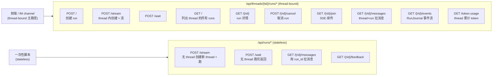
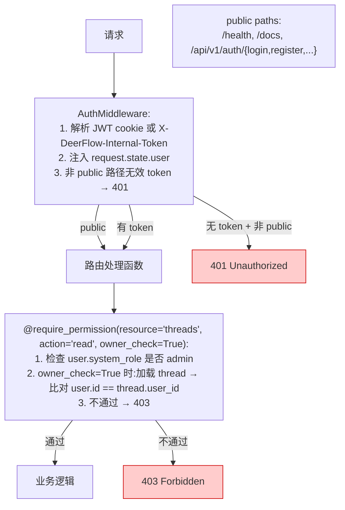

# 25 · Gateway 路由设计 + LangGraph 兼容层

> 工程实践层第 1 篇。前 24 章把"Agent 内部 / 持久层"全讲清;**本章把目光转到对外接口** —— Gateway 是 DeerFlow 唯一的 HTTP 出口,**前端 / IM channel / SDK 全走它**。
>
> Gateway 在 06 章已概览过(嵌入式 LangGraph runtime),本章把它的**路由设计 / 认证链 / 兼容层** 拉到放大镜下。关键看点:
> 1. **15 个 router** 涵盖 models / mcp / memory / skills / artifacts / uploads / threads / agents / channels / runs / thread_runs / feedback / suggestions / auth / assistants_compat
> 2. **3 层中间件栈**:Auth → CSRF → CORS
> 3. **`/api/langgraph/*` rewrite 兼容层** —— 让 `langgraph-sdk-js` 客户端零修改接入
> 4. **cursor-based pagination**(`after_seq` / `before_seq` + `has_more`)
> 5. **`internal_auth` process-local token** 让 IM channel 内部调用免去复杂认证

---

## 🎯 学习目标

读完这份文档,你能回答:

1. **15 个 router 的路径前缀如何避免冲突**?为什么 `runs.py` 和 `thread_runs.py` 是两个独立 router?
2. **`AuthMiddleware` + `CSRFMiddleware` + `CORSMiddleware` 三层顺序**为什么是这个顺序?颠倒会出什么问题?
3. **`internal_auth` 的 process-local random token**怎么保证 IM channel 调 Gateway 安全?**为什么不能用固定 secret**?
4. **cursor-based pagination 用 `after_seq` / `before_seq` 而不是 `offset` / `limit`** —— 给一个具体场景说明 offset-based 在 append-only 表上的问题。
5. **`@require_permission("threads", "read", owner_check=True)` 装饰器**做了什么?为什么需要 `owner_check`?

---

## 🗂️ 源码定位

| 关注点 | 文件 / 行号 | 关键锚点 |
|---|---|---|
| FastAPI 主入口 | `app/gateway/app.py` | `create_app` L195+;`lifespan` L195;14 个 `include_router`;`/health` 路由 |
| Auth 中间件 | `app/gateway/auth_middleware.py` | `AuthMiddleware`(fail-closed 拦截非 public 路径) |
| CSRF 中间件 | `app/gateway/csrf_middleware.py` | Double Submit Cookie 模式;`should_check_csrf`(POST/PUT/DELETE/PATCH);`_AUTH_EXEMPT_PATHS` |
| CORS | `app/gateway/csrf_middleware.py::get_configured_cors_origins` | 与 `GATEWAY_CORS_ORIGINS` 环境变量集成 |
| 内部认证 | `app/gateway/internal_auth.py` | `_INTERNAL_AUTH_TOKEN = secrets.token_urlsafe(32)`(进程启动时随机生成);`create_internal_auth_headers`;`is_valid_internal_auth_token`(`secrets.compare_digest` 防 timing 攻击) |
| 授权装饰器 | `app/gateway/authz.py` | `@require_permission(resource, action, owner_check=...)` |
| 路由清单 | `app/gateway/routers/` | 16 个 .py(含 `__init__.py`) |
| `/runs/*`(stateless) | `app/gateway/routers/runs.py` | `POST /stream` / `POST /wait` / `GET /{rid}/messages` / `GET /{rid}/feedback` |
| `/threads/{tid}/runs/*` | `app/gateway/routers/thread_runs.py` | `POST` / `POST /stream` / `POST /wait` / `GET` 列表 / `GET /{rid}` / `POST /{rid}/cancel` / `GET /{rid}/join` / `GET /{rid}/messages` / `GET /{rid}/events` / `GET /token-usage` |
| `/threads/{tid}/artifacts` | `app/gateway/routers/artifacts.py` | `_ACTIVE_CONTENT_TYPES` 强制下载(22 章已讲) |
| Nginx rewrite 兼容层 | `docker/nginx/nginx.conf` | `location /api/langgraph/ { rewrite ^/api/langgraph/(.*) /api/$1 break; ... }`(06 章已讲) |

---

## 🧭 架构图

### 1. Gateway 完整请求生命周期

```mermaid
flowchart TB
    CLIENT["客户端<br/>浏览器 / IM channel / DeerFlowClient HTTP"]
    NGX["Nginx :2026"]
    REWRITE["/api/langgraph/* → /api/*<br/>rewrite"]
    ROUTE{"路径"}

    subgraph MW["中间件栈(执行顺序)"]
        CORS["CORSMiddleware<br/>跨源 OPTIONS 预检"]
        CSRF["CSRFMiddleware<br/>POST/PUT/DELETE/PATCH 检查 token"]
        AUTH["AuthMiddleware<br/>JWT cookie / 内部 token"]
    end

    subgraph ROUTERS["14 路由组"]
        R_MODELS["/api/models"]
        R_MCP["/api/mcp"]
        R_MEMORY["/api/memory"]
        R_SKILLS["/api/skills"]
        R_THREADS["/api/threads/{tid}"]
        R_AGENTS["/api/agents"]
        R_AUTH["/api/v1/auth"]
        R_RUNS_STATELESS["/api/runs"]
        R_THREAD_RUNS["/api/threads/{tid}/runs"]
        R_FEEDBACK["/api/threads/{tid}/runs/{rid}/feedback"]
        R_ARTIFACTS["/api/threads/{tid}/artifacts"]
        R_UPLOADS["/api/threads/{tid}/uploads"]
        R_SUGGEST["/api/threads/{tid}/suggestions"]
        R_CHANNELS["/api/channels"]
        R_ASSIST["/api/assistants (兼容 stub)"]
    end

    AUTHZ["@require_permission(resource, action, owner_check)"]
    HANDLER["路由处理函数<br/>访问 app.state.run_manager / stream_bridge / ..."]

    CLIENT --> NGX
    NGX --> REWRITE
    REWRITE --> ROUTE
    ROUTE -->|/api/langgraph/*| MW
    ROUTE -->|/api/*| MW
    MW --> CORS --> CSRF --> AUTH
    AUTH --> ROUTERS
    ROUTERS --> AUTHZ
    AUTHZ --> HANDLER

    classDef mw fill:#fff2cc,stroke:#d6b656
    classDef route fill:#e1f5e1,stroke:#4a8e4a
    class MW,CORS,CSRF,AUTH mw
    class ROUTERS,R_MODELS,R_MCP,R_MEMORY,R_SKILLS,R_THREADS,R_AGENTS,R_AUTH,R_RUNS_STATELESS,R_THREAD_RUNS,R_FEEDBACK,R_ARTIFACTS,R_UPLOADS,R_SUGGEST,R_CHANNELS,R_ASSIST route
```



### 2. 双 runs router 的分工



### 3. 认证 + 授权两层防御



---

## 🔍 核心逻辑讲解

### Part 1 · 14 个 router 的路径前缀策略

#### 列表与功能映射

| Router | 前缀 | 主要端点 |
|---|---|---|
| `models` | `/api/models` | `GET /` / `GET /{name}` |
| `mcp` | `/api/mcp` | `GET /config` / `PUT /config` |
| `memory` | `/api/memory` | `GET /` / `POST /reload` / `GET /config` / `GET /status` |
| `skills` | `/api/skills` | `GET /` / `GET /{name}` / `PUT /{name}` / `POST /install` |
| `artifacts` | `/api/threads/{tid}/artifacts` | `GET /{path:path}` |
| `uploads` | `/api/threads/{tid}/uploads` | `POST /` / `GET /list` / `DELETE /{filename}` |
| `threads` | `/api/threads/{tid}` | `DELETE /` |
| `agents` | `/api/agents` | 自定义 agent CRUD |
| `suggestions` | `/api/threads/{tid}/suggestions` | `POST /` |
| `channels` | `/api/channels` | IM 通道状态 |
| `assistants_compat` | `/api/assistants` | LangGraph Platform 兼容 stub |
| `auth` | `/api/v1/auth` | `POST /login/local` / `POST /logout` / `POST /register` / `POST /initialize` / `GET /me` |
| `feedback` | `/api/threads/{tid}/runs/{rid}/feedback` | `PUT /` / `DELETE /` / `POST /` / `GET /` / `GET /stats` / `DELETE /{fid}` |
| `thread_runs` | `/api/threads/{tid}/runs` | 10 个端点(create / stream / wait / list / get / cancel / join / messages / events / token-usage) |
| `runs` | `/api/runs` | 4 个 stateless 端点 |

**冲突避免**:
- `threads.py` 注册的是 `DELETE /api/threads/{tid}` —— 而 `thread_runs.py` 是 `/api/threads/{tid}/runs/...`,**路径前缀不同**
- `runs.py` 是 `/api/runs/...` —— 与 `/api/threads/.../runs/...` **绝对路径根不同**

FastAPI 的路由匹配按**注册顺序 + 路径前缀长度** —— DeerFlow 显式给每个 router 独立前缀避免重叠。

#### `/api/runs` vs `/api/threads/{tid}/runs` 的设计取舍

**Stateless `/api/runs`**(`runs.py`):
- 不指定 thread,Gateway 自动创建 / 复用
- 适合**一次性脚本** / 集成测试 / 简单 API 调用

**Thread-bound `/api/threads/{tid}/runs`**(`thread_runs.py`):
- 显式 thread 上下文
- 支持完整 thread 生命周期:list / cancel / join / messages / events / token-usage
- 适合**前端会话 / IM channel**(thread = conversation)

→ **DeerFlow 两套并存**:简单场景走 stateless,生产场景走 thread-bound。

### Part 2 · 三层中间件栈的执行顺序

```python
# app.py L195+(简化)
app.add_middleware(AuthMiddleware)      # ⭐ 最后 add = 最先执行
app.add_middleware(CSRFMiddleware)
app.add_middleware(CORSMiddleware, allow_origins=cors_origins, ...)
```

**Starlette/FastAPI 中间件栈是 LIFO**:**最后 `add_middleware` 的最先执行**!

#### 执行顺序(从外到内)

```
请求进入 → CORS → CSRF → Auth → 路由处理
响应出去 ← CORS ← CSRF ← Auth ← 路由处理
```

#### 为什么这个顺序?

**CORS 最外**:
- OPTIONS 预检请求**不应该**走 Auth / CSRF(没 cookie / 没 token 是预期的)
- 把 CORS 放最外 → OPTIONS 直接返回 CORS headers,不打扰内层

**CSRF 中层**:
- CSRF 检查需要看 cookie + header 对比
- 如果先走 Auth → 把 401 返回给客户端 → 客户端不知道是 auth 失败还是 CSRF 失败(diagnostic 差)
- CSRF 在 Auth 之前 → 先确认请求来源合法,再检查身份

**Auth 最内**:
- 真正注入 `request.state.user`,后续路由处理函数依赖它
- 最贴近业务,保留所有上下文(已通过 CSRF + CORS)

#### 反例:颠倒顺序会怎样

如果 Auth 最外:
- OPTIONS 预检 → Auth 失败 → 浏览器永远拿不到 CORS headers → 跨源请求全挂

如果 CSRF 最外:
- 浏览器跨源 OPTIONS → CSRF 检查 → 没 cookie → 直接 403 → CORS 也走不到

→ **正确顺序保证不同失败路径有意义的 HTTP 响应**。

### Part 3 · `internal_auth` 的 process-local random token

```python
_INTERNAL_AUTH_TOKEN = secrets.token_urlsafe(32)


def create_internal_auth_headers() -> dict[str, str]:
    return {INTERNAL_AUTH_HEADER_NAME: _INTERNAL_AUTH_TOKEN}


def is_valid_internal_auth_token(token: str | None) -> bool:
    return bool(token) and secrets.compare_digest(token, _INTERNAL_AUTH_TOKEN)
```

#### 使用场景

DeerFlow IM channel(`app/channels/*`)运行在 **Gateway 进程内**(`langgraph_runtime` lifespan 内启动)。它需要调 `/api/threads/{tid}/runs/stream` 跑用户消息。

**问题**:channel 没有 JWT cookie 也没有 user 登录 → 走标准 Auth 会失败。

**解法**:
1. Gateway 进程启动时**随机生成** `_INTERNAL_AUTH_TOKEN`(32 字节 urlsafe = ~256 bit 熵)
2. Channel 用 `create_internal_auth_headers()` 拿到 token
3. 请求带 `X-DeerFlow-Internal-Token: ...`
4. `AuthMiddleware` 看到这个 header → 调 `is_valid_internal_auth_token` 校验 → 通过则注入 `get_internal_user()`(synthetic admin-like user)

#### 为什么不能用固定 secret?

| 固定 secret(如 env var)| process-local random |
|---|---|
| **多机部署可共享**(写 .env) | 多机各自不同 |
| **配置暴露风险**(env 泄露 → 永久泄露) | 进程重启自动换 |
| 需要安全分发 | 不需要 |
| **长期有效** | 进程退出即失效 |

**关键工程哲学**:**channel 与 Gateway 同进程,共享内存 = 同信任域**。token 永远不离开进程 → 不可能被网络层窃听。

#### `secrets.compare_digest` 防 timing 攻击

```python
return bool(token) and secrets.compare_digest(token, _INTERNAL_AUTH_TOKEN)
```

**为什么不用 `==`**:Python `==` 是**短路**比较 —— 不同长度 / 第一个字节就不同会瞬间返回,**攻击者能通过测量响应时间猜出多少字节匹配**。

**`secrets.compare_digest`** 是**常时间比较**(`O(n)` 不管哪里不匹配),防 timing side-channel。

→ 这是个**少见但典型** 的安全细节,生产 auth 代码必备。

### Part 4 · CSRF Double Submit Cookie 模式

#### 背景

CSRF(跨站请求伪造):恶意网站让用户在已登录 DeerFlow 的状态下,**点击恶意链接 → 触发 POST 请求** → 用户的 cookie 自动携带 → DeerFlow 误以为合法请求。

#### Double Submit Cookie 防御

```python
CSRF_COOKIE_NAME = "csrf_token"
CSRF_HEADER_NAME = "X-CSRF-Token"

def should_check_csrf(request) -> bool:
    if request.method not in ("POST", "PUT", "DELETE", "PATCH"):
        return False
    # exempt /api/v1/auth/me 等
    return True
```

**机制**:
1. **登录后**:Gateway 在 response 里 set cookie `csrf_token=ABC123`(httpOnly=False,**JavaScript 可读**)
2. **前端发 POST**:JS 读 cookie 值,在 header `X-CSRF-Token: ABC123` 中显式带上
3. **Gateway 检查**:cookie 中的值 == header 中的值 → 通过

**为什么有效**:
- 跨站 form POST 会自动带 cookie,但**JS 不能读跨域站点的 cookie** → 攻击者拿不到 csrf_token 值 → 没法在 header 里同样设置
- 同源 JS 才能同时读 cookie + 设 header → 通过校验

#### Exempt paths

```python
_AUTH_EXEMPT_PATHS = frozenset({
    "/api/v1/auth/login/local",
    "/api/v1/auth/logout",
    "/api/v1/auth/register",
    "/api/v1/auth/initialize",
})
```

**为什么 exempt auth endpoints**:
- 用户**还没登录**时调 `/login/local` —— 没 cookie,没法走 Double Submit
- `/logout` 用户主动登出,无需 CSRF 保护(失败也没风险)
- `/register` 同理

→ **CSRF 检查只对"已认证用户的状态变更"必要**。

### Part 5 · `@require_permission` 三参数授权

```python
@require_permission("threads", "read", owner_check=True)
async def get_artifact(thread_id: str, ...):
    ...
```

#### 3 个参数的语义

| 参数 | 用途 |
|---|---|
| `resource` | 资源类型(`threads` / `runs` / `models` / ...) |
| `action` | 操作动作(`read` / `write` / `delete` / `admin`) |
| `owner_check` | 是否检查所有权 |

#### `owner_check=True` 的作用

普通用户调 `GET /api/threads/T123/artifacts/x.txt`:
1. Auth 通过(有 cookie)
2. 装饰器看 `user.system_role`:
   - `admin` → 直接通过
   - `user` → 检查 `T123` 是否属于此 user(查 `threads_meta.user_id == user.id`)
3. owner 不匹配 → 403

**真实威胁**:
- 用户 Alice 知道 Bob 的 thread_id(URL 共享 / 猜测)
- 没 owner_check → Alice 能读 Bob 的 artifacts → **数据泄露**

#### `owner_check=False` 的场景

`/api/models`(列出可用模型)— 任何用户都能看,**没有所有权概念** → `owner_check=False`。

#### 为什么不只看 `system_role`?

| 只看 role | 加 owner_check |
|---|---|
| 简单,二元化(admin / user) | 复杂,但精确 |
| 用户级别同质 | 区分"我自己的"和"别人的" |
| 不适合多租户 SaaS | 适合 |

→ DeerFlow 在 `system_role` 之上加 `owner_check`,**让多用户场景下租户隔离自动生效**。

### Part 6 · Cursor-based Pagination

```python
@router.get("/{run_id}/messages")
async def get_run_messages(
    run_id: str,
    request: Request,
    limit: int = Query(default=50, le=200, ge=1),
    before_seq: int | None = Query(default=None),
    after_seq: int | None = Query(default=None),
) -> dict:
    """
    Pagination:
    - after_seq: messages with seq > after_seq (forward)
    - before_seq: messages with seq < before_seq (backward)
    - neither: latest messages
    """
    rows = await event_store.list_messages_by_run(
        thread_id, run_id,
        limit=limit + 1,                              # ⭐ 多拉 1 条判断 has_more
        before_seq=before_seq,
        after_seq=after_seq,
    )
    has_more = len(rows) > limit
    data = rows[:limit] if has_more else rows
    return {"data": data, "has_more": has_more}
```

#### 为什么不用 `offset` / `limit`?

`run_events` 表是 **append-only**(24 章详讲)—— 用户在分页期间表会持续增长!

```python
# ❌ offset-based 的问题:
# 时刻 T1: GET /messages?offset=0&limit=20  → 拉 20 条
# 时刻 T2: 又新写了 5 条 events
# 时刻 T3: GET /messages?offset=20&limit=20 → 拉到的"第 21-40 条"实际是"第 16-35 条"
#         ↑ 前 5 条与上次重复!
```

#### cursor-based 怎么解决

```python
# 第 1 页:GET /messages?limit=20  → data[0..19], 记 last_seq
# 第 2 页:GET /messages?after_seq=last_seq&limit=20  → seq > last_seq 的 → 永不重复
```

**`seq` 是 per-thread 单增**(24 章)→ 即使新写了 events,新 seq 必然 > old last_seq → 分页永远稳定。

#### `limit + 1` 探测 `has_more`

不需要先 `COUNT(*)` 那慢操作 —— **多拉 1 条**,如果实际拉到 N+1 条 → 知道还有更多;只拉到 N 或更少 → 已到底。

→ **这是个零成本的标准 cursor pagination 技巧**。

### Part 7 · `langgraph_runtime` 资源在 lifespan 共享

回看 06 章:

```python
@asynccontextmanager
async def lifespan(app):
    app.state.config = get_app_config()
    apply_logging_level(...)
    async with langgraph_runtime(app):
        # app.state 现在含 stream_bridge / checkpointer / store / run_manager / ...
        yield
```

**路由处理函数访问这些资源**:
```python
@router.post("/{thread_id}/runs/stream")
async def stream_run(thread_id: str, request: Request):
    bridge = get_stream_bridge(request)               # → request.app.state.stream_bridge
    run_mgr = get_run_manager(request)
    ...
```

**关键设计**:
- **资源是进程级单例**(不是 per-request 创建)
- **通过 `request.app.state.X` 访问**(FastAPI 标准模式)
- **`get_*` helper 函数**封装属性访问,便于 mocking 测试

→ 这是 FastAPI 应用的**最佳实践模式** —— DeerFlow 严格遵循。

---

## 🧩 体现的通用 Agent 设计模式

| 模式 | Gateway 中的体现 |
|---|---|
| **LIFO Middleware Stack** | Starlette 中间件后 add 先执行 |
| **Same-process Random Token** | `_INTERNAL_AUTH_TOKEN` 进程生命周期 |
| **Constant-time Compare** | `secrets.compare_digest` 防 timing |
| **Double Submit Cookie CSRF** | cookie + header 对比 |
| **Resource-Action-Owner Authorization** | `@require_permission(resource, action, owner_check)` |
| **Cursor-based Pagination** | `after_seq` / `before_seq` + `limit+1` 探测 |
| **Dual Router Stateful/Stateless** | `/api/runs` + `/api/threads/{tid}/runs` 并存 |
| **Compatibility Layer via URL Rewrite** | Nginx `/api/langgraph/*` → `/api/*` |
| **App-level Singleton via app.state** | FastAPI lifespan + `app.state.X` |

---

## 🧱 与 Agent Harness 六要素的对应关系

| 六要素 | Gateway 怎么提供基础设施 |
|---|---|
| ① 反馈循环 | `/runs/stream` SSE 让 agent 反馈实时回前端 |
| ② 记忆持久化 | `/memory/*` + `/threads/{tid}` 提供 CRUD 给前端 |
| ③ 动态上下文 | `/uploads/*` + `/suggestions/*` 注入 |
| ④ 安全护栏 | 3 层中间件 + `@require_permission` + artifact 强制下载 + internal_auth |
| ⑤ 工具集成 | `/api/mcp/config` 让前端管理 MCP server |
| ⑥ 可观测性 | `/runs/{rid}/events` + `/token-usage` 暴露给前端 |

---

## ⚠️ 常见坑与调试技巧

### 坑 1 · 中间件顺序写错 → CORS 失效

**症状**:前端跨源请求 OPTIONS 预检失败,看 response 没有 `Access-Control-Allow-Origin` header。
**原因**:把 CORSMiddleware 放最先 add → 在内层 → 401 在外层就发出去了。
**修复**:确保 `app.add_middleware(CORSMiddleware, ...)` 是**最后**一个 add。

### 坑 2 · IM channel 拿不到 internal token

**症状**:IM channel(同进程)调 Gateway 仍 401。
**原因**:channel 通过 `langgraph-sdk` HTTP client 调用 → SDK 不自动加 `X-DeerFlow-Internal-Token`。
**修复**:在 `channels/manager.py` 创建 SDK client 时显式注入:
```python
client = get_client(url=..., headers=create_internal_auth_headers())
```

### 坑 3 · CSRF cookie 跨域不送

**症状**:前端在不同域(如 `localhost:3000` vs gateway `localhost:8001`)拿不到 CSRF cookie。
**原因**:浏览器 same-origin 限制 + cookie 默认 SameSite=Lax 不送跨域。
**修复**:
- 生产用 nginx 统一 :2026 端口(同源)
- 开发环境用 `GATEWAY_CORS_ORIGINS=http://localhost:3000` 显式 allow + cookie SameSite=None(需要 HTTPS)

### 坑 4 · `owner_check` 性能问题

每个 artifact GET 都查一次 threads_meta → 高频访问时 DB 压力大。
**修复**:
- 加 thread → user_id mapping 的内存 LRU cache
- 或在 JWT cookie 里存 user 已 owned 的 thread_id 列表(空间换时间,但 token 大)

### 坑 5 · cursor-based 分页同 seq 数据被跳过

**症状**:在 page 1 拿到 `last_seq=100`,page 2 用 `after_seq=100` 查 → 但 seq=100 也是合法数据 → **被跳过**!
**修复**:用 `after_seq=99`(返回数据时多记一位)或语义上明确 `after_seq` = "返回严格 > 此值的"。
**DeerFlow 实际**:`after_seq` 是"> 后"语义 —— 前端要拿"上一页最后一条"作为 next cursor 时,要确认 last_seq 是已包含的。

---

## 🛠️ 动手实操

> 本 demo 演示 internal_auth + middleware 顺序 + 模拟 csrf 双 token 检查。

### Demo · Gateway 核心机制实测

```python
"""
Gateway core mechanisms demo.

跑法:  PYTHONPATH=backend uv run python scripts/gateway_walkthrough.py
"""
import sys, os, secrets
from pathlib import Path

sys.path.insert(0, "backend")
sys.path.insert(0, "backend/packages/harness")
os.chdir(Path(__file__).resolve().parents[1])

from app.gateway.internal_auth import (
    create_internal_auth_headers,
    is_valid_internal_auth_token,
    INTERNAL_AUTH_HEADER_NAME,
    get_internal_user,
)
from app.gateway.csrf_middleware import (
    generate_csrf_token,
    should_check_csrf,
    CSRF_COOKIE_NAME,
    CSRF_HEADER_NAME,
)


# ====== Case 1: internal_auth process-local token ======
print("\n" + "=" * 70)
print("CASE 1 · internal_auth process-local random token")
print("=" * 70)

headers = create_internal_auth_headers()
token = headers[INTERNAL_AUTH_HEADER_NAME]
print(f"  生成的 token(前 20 字符): {token[:20]}...")
print(f"  长度: {len(token)} 字符  (期望 ~43,32 bytes urlsafe)")
print(f"  有效性检查: {is_valid_internal_auth_token(token)}  (期望 True)")
print(f"  随便另一 token: {is_valid_internal_auth_token('random-fake-token')}  (期望 False)")
print(f"  None: {is_valid_internal_auth_token(None)}  (期望 False)")
print(f"  空: {is_valid_internal_auth_token('')}  (期望 False)")

internal_user = get_internal_user()
print(f"  internal_user.id: {internal_user.id}")
print(f"  internal_user.system_role: {internal_user.system_role}")


# ====== Case 2: secrets.compare_digest 常时间比较 ======
print("\n" + "=" * 70)
print("CASE 2 · secrets.compare_digest vs == 的差异")
print("=" * 70)

import time

target = "a" * 100
attacker1 = "z" + "a" * 99       # 第 1 字节不同
attacker2 = "a" * 99 + "z"       # 最后字节不同

# == 测量
def measure_eq(attempts=10000):
    t1_start = time.perf_counter()
    for _ in range(attempts):
        _ = target == attacker1
    t1 = time.perf_counter() - t1_start

    t2_start = time.perf_counter()
    for _ in range(attempts):
        _ = target == attacker2
    t2 = time.perf_counter() - t2_start
    return t1, t2

# compare_digest 测量
def measure_compare(attempts=10000):
    t1_start = time.perf_counter()
    for _ in range(attempts):
        _ = secrets.compare_digest(target, attacker1)
    t1 = time.perf_counter() - t1_start

    t2_start = time.perf_counter()
    for _ in range(attempts):
        _ = secrets.compare_digest(target, attacker2)
    t2 = time.perf_counter() - t2_start
    return t1, t2

eq_t1, eq_t2 = measure_eq()
cd_t1, cd_t2 = measure_compare()
print(f"  ==                 第 1 字节不同: {eq_t1*1000:.2f}ms ;  最后字节不同: {eq_t2*1000:.2f}ms ")
print(f"     差异比 = {abs(eq_t2 - eq_t1) / max(eq_t1, 1e-9) * 100:.1f}%")
print(f"  compare_digest     第 1 字节不同: {cd_t1*1000:.2f}ms ;  最后字节不同: {cd_t2*1000:.2f}ms ")
print(f"     差异比 = {abs(cd_t2 - cd_t1) / max(cd_t1, 1e-9) * 100:.1f}%")
print(f"  ⭐ compare_digest 的差异比应该明显小于 == (常时间)")


# ====== Case 3: should_check_csrf 分支 ======
print("\n" + "=" * 70)
print("CASE 3 · should_check_csrf 分支")
print("=" * 70)

class FakeRequest:
    def __init__(self, method, path):
        self.method = method
        self.url = type("URL", (), {"path": path})()

cases = [
    ("GET", "/api/threads", "GET 永远 exempt"),
    ("HEAD", "/api/threads", "HEAD 永远 exempt"),
    ("POST", "/api/v1/auth/login/local", "auth 端点 exempt(但 should_check_csrf 不处理这个,由 AuthMiddleware 决定)"),
    ("POST", "/api/threads/T/runs", "需要检查"),
    ("PUT", "/api/skills/X", "需要检查"),
    ("DELETE", "/api/threads/T", "需要检查"),
    ("PATCH", "/api/mcp/config", "需要检查"),
    ("POST", "/api/v1/auth/me", "/me 显式 exempt"),
]

for method, path, expected in cases:
    req = FakeRequest(method, path)
    result = should_check_csrf(req)
    print(f"  {method:<8} {path:<35} → {result}  ({expected})")


# ====== Case 4: cursor pagination 模拟 ======
print("\n" + "=" * 70)
print("CASE 4 · cursor-based pagination 模拟")
print("=" * 70)

# 模拟 100 条 events,seq=1..100
all_events = [{"seq": s, "type": "llm_response", "content": f"msg-{s}"} for s in range(1, 101)]

def fetch_page(after_seq: int | None, before_seq: int | None, limit: int = 20):
    if after_seq is not None:
        filtered = [e for e in all_events if e["seq"] > after_seq]
    elif before_seq is not None:
        filtered = [e for e in all_events if e["seq"] < before_seq]
        filtered.reverse()
    else:
        # 最新 → 倒序
        filtered = list(reversed(all_events))
    rows = filtered[:limit + 1]
    has_more = len(rows) > limit
    return {"data": rows[:limit], "has_more": has_more}

# 第 1 页(最新)
p1 = fetch_page(None, None)
print(f"  page 1 (最新): data 长度={len(p1['data'])}, has_more={p1['has_more']}")
print(f"    seq 范围: {p1['data'][0]['seq']} ~ {p1['data'][-1]['seq']}")

# 假设我们想向前(更老)分页 → 用 before_seq
last_oldest_seq = p1["data"][-1]["seq"]
p2 = fetch_page(None, last_oldest_seq, limit=20)
print(f"  page 2 (用 before_seq={last_oldest_seq}): data 长度={len(p2['data'])}")
print(f"    seq 范围: {p2['data'][0]['seq']} ~ {p2['data'][-1]['seq']}")

# 模拟新增 events 不影响已分页结果
new_events = [{"seq": s, "type": "llm_response"} for s in range(101, 121)]
all_events.extend(new_events)
print(f"\n  新增 20 条 events (seq 101-120) 之后...")

# 用同一 cursor 继续向前(更老)分页
p3 = fetch_page(None, p2["data"][-1]["seq"], limit=20)
print(f"  page 3 (用 before_seq={p2['data'][-1]['seq']}): seq 范围 {p3['data'][0]['seq']} ~ {p3['data'][-1]['seq']}")
print(f"  ✅ 用 cursor 分页:历史数据稳定,不会被新事件干扰")


# ====== Case 5: CSRF token 生成 ======
print("\n" + "=" * 70)
print("CASE 5 · CSRF token 生成 (生产)")
print("=" * 70)

for i in range(3):
    t = generate_csrf_token()
    print(f"  生成 #{i}: {t[:30]}... 长度={len(t)}")
print(f"  ⭐ token_urlsafe(64) → ~86 字符 URL-safe base64")
```

### 调试任务

1. **断点位置**:
   - `internal_auth.py::is_valid_internal_auth_token` —— 看 `compare_digest`
   - `csrf_middleware.py::should_check_csrf` —— 看 method 分支
   - 启动 Gateway 后用 `curl` hit 不同路径看 middleware 触发顺序(加日志)
2. **观察什么**:
   - Case 1: token 长度 ~43 字符
   - Case 2: compare_digest 时差比明显小于 ==
   - Case 3: GET/HEAD 永不检查;POST/PUT/DELETE/PATCH 需要(除 exempt)
   - Case 4: 新增 events 不影响 cursor 已分页结果
3. **人为制造异常**:
   - 跑 2 次 Case 1 —— 每次 token **应该相同**(进程内不变)
   - 重启 Python 进程再跑 —— **新的 token**

### 改造练习

1. **练习 A(简单)**:扩展 `should_check_csrf` 加更多 exempt 路径(如 webhook endpoints `/api/webhooks/*`)。
2. **练习 B(中等)**:实现一个 `RateLimitMiddleware` —— per-user / per-endpoint 限速。注意:放在 middleware 栈的哪一层?
3. **挑战题**:实现 cursor pagination 的"双向 cursor"——一次返回 `next_cursor` 和 `prev_cursor`,前端可双向无缝翻页。

### 预期输出 & 验证方式

- Case 1: token 长度 ~43,validate 工作正常
- Case 2: compare_digest 差异比应小于 == 至少 一倍(具体值因系统抖动)
- Case 3: 4 种 method × 8 个路径分类正确
- Case 4: page 3 拉到的数据 seq 严格小于 page 2 last
- Case 5: 每次生成不同 token

---

## 🎤 面试视角

### 业务型大厂卷

**问 1**:DeerFlow Gateway 用 `internal_auth` 让 IM channel 同进程内调用免认证。**给一个具体的真实问题** 说明这种"信任域内免认证"设计如何被滥用 + 怎么补救。

> **教科书答案**:
> 滥用场景:**代码漏洞导致 internal_auth header 被泄露**
> - 比如某 router 的错误处理 dump 了 request headers 到日志
> - 攻击者拿到日志(如同事不当 share)→ 提取 token → 远程调 Gateway
> - 即使 token 是 random,**只要进程没重启就一直有效**
> 补救:
> 1. **限制 internal_auth 只在 localhost 接受** —— 中间件检查 `request.client.host == "127.0.0.1"`
> 2. **rotate token 定时** —— 每小时换一次,旧 token 立即失效
> 3. **请求来源签名** —— 不只是 token 比对,还检查 `X-DeerFlow-Internal-Pid` 是当前进程 PID
> 4. **日志脱敏** —— `INTERNAL_AUTH_HEADER_NAME` 在日志中 mask 成 `***`
> **DeerFlow 当前主要是单机本地部署,默认 OK**;SaaS 场景必须加上面几条。

**问 2**:`@require_permission(resource, action, owner_check=True)` 装饰器在每个 GET artifact 调用都查一次 thread → user_id 映射 → DB 压力大。**给一个完整缓存方案**。

> **教科书答案**:
> 完整方案:
> 1. **数据形态**:`dict[thread_id, user_id]` 用 `cachetools.TTLCache(maxsize=10000, ttl=300)` —— 10K thread / 5 min TTL
> 2. **进程级单例**:lifespan 启动时初始化,所有 router 共享
> 3. **失效**:
>    - thread DELETE 时主动 cache.pop(thread_id)
>    - thread 转 owner(管理员操作)时同理
> 4. **降级**:cache miss → 查 DB + 写 cache
> 5. **监控**:暴露 `cache_hits` / `cache_misses` 比例,目标 hit ratio > 90%
> 边界:
> - **多机部署**:cache 各机独立(可接受,数据不要求强一致 —— 5 分钟 TTL 内同步会自然 reconvert)
> - **如果要强一致**:用 Redis 替代 + pub/sub invalidate
> **DeerFlow 当前没缓存**,是个明确的可优化点。

### 创业型 AI 公司卷

**问 3**:DeerFlow 双 router(`/api/runs` 和 `/api/threads/{tid}/runs`)。**给一个具体的产品 PRD 说明何时该用 stateless,何时该用 thread-bound**。

> **参考答案**:
> PRD 场景对照:
> | 场景 | 选 stateless | 选 thread-bound |
> |---|---|---|
> | 用户多轮对话 | | ✅ 需要 thread 持久化历史 |
> | 一次性 Q&A bot(类似 GPT 简化版) | ✅ 不需要历史 | |
> | Slack /command 触发 | | ✅ 需要 thread-id 关联用户 |
> | API for "summarize this document"(一次性) | ✅ | |
> | webhook 触发的 agent | 看产品策略 | |
> | 后台批处理(每行一个独立 run) | ✅ | |
> 关键判据:**是否需要跨多次 invoke 的历史/上下文持久化**。
> DeerFlow 两套并存是对的 —— **不强迫所有调用方都用 thread 模型**。

**问 4**:你接到任务"给 DeerFlow Gateway 加 WebSocket 支持"(替代 SSE)。**给一个完整设计 + 至少 3 个迁移期间的坑**。

> **参考答案**:
> 完整设计:
> 1. **新增 `WebSocketRouter`** at `/api/ws/threads/{tid}/runs/{rid}`
> 2. **协议设计**:client → server 发 `{"action": "subscribe"|"send"|"cancel"}`;server → client 发 `{"type": "messages-tuple"|"values"|"end", "data": ...}`
> 3. **复用 StreamBridge**(08 章):WebSocket handler subscribe 到 bridge,把 events forward 到 websocket
> 4. **认证**:WebSocket upgrade 时检查 cookie / token(WebSocket 不走 CORS / CSRF 中间件,要 manual)
> 5. **保留 SSE 向后兼容**
> 3 个迁移坑:
> - **认证不走 CORS/CSRF middleware** —— WebSocket 升级是 GET 请求但不是常规 HTTP,FastAPI middleware 不应用;**手动**在 handler 里调 auth check
> - **断线重连**:SSE 用 `Last-Event-ID`;WebSocket 必须自己实现"重连后从 last_seq 重放"
> - **背压**:WebSocket 是双向 → server push 太快 client 处理不过来 → buffer 累积 → OOM。需要**应用层 flow control**(如 server 收到 ack 后才继续 push)
> - **proxy 兼容**:有些反向代理(老 nginx)对 WebSocket 长连接不友好,需要明确 `proxy_read_timeout 0`
> **DeerFlow 当前用 SSE 是合理选择** —— WebSocket 是优化项,不是必需。

---

## 📚 延伸阅读

- **FastAPI 中间件文档**:https://fastapi.tiangolo.com/tutorial/middleware/
  *理解 LIFO 中间件栈的执行顺序。*
- **OWASP CSRF Cheat Sheet**:https://cheatsheetseries.owasp.org/cheatsheets/Cross-Site_Request_Forgery_Prevention_Cheat_Sheet.html
- **`secrets.compare_digest` 设计**:https://docs.python.org/3/library/secrets.html#secrets.compare_digest
- **LangGraph Platform API spec**:https://langchain-ai.github.io/langgraph/cloud/reference/api/
  *与 DeerFlow `thread_runs.py` 的兼容子集对照。*
- **24 章 Persistence + 23 章 Tracing**:Gateway 是这些层的对外门面。

---

## 🎤 互动检查 —— 请回答这 3 个问题

> **两句话即可**。

1. **设计动机题**:中间件栈用 LIFO 顺序(`add_middleware` 后 add 先执行)。**为什么 CORS 应该最外 / Auth 最内**?给一句反例说明颠倒会怎样。
2. **机制理解题**:`internal_auth` 用 `secrets.token_urlsafe(32)` 而不是从 env var 读固定 secret。**用一句话**说明这种"进程级随机 token"的核心安全优势。
3. **应用题**:你的同事提了 PR:把 `should_check_csrf` 改成"GET 也检查 CSRF"。**给两条理由**说明应该被拒绝。

回答后我们进入 **`26-channels-and-im-integration.md`** —— IM 通道适配模式深潜。
