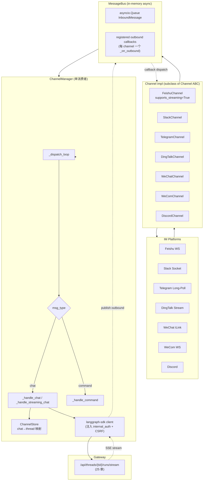
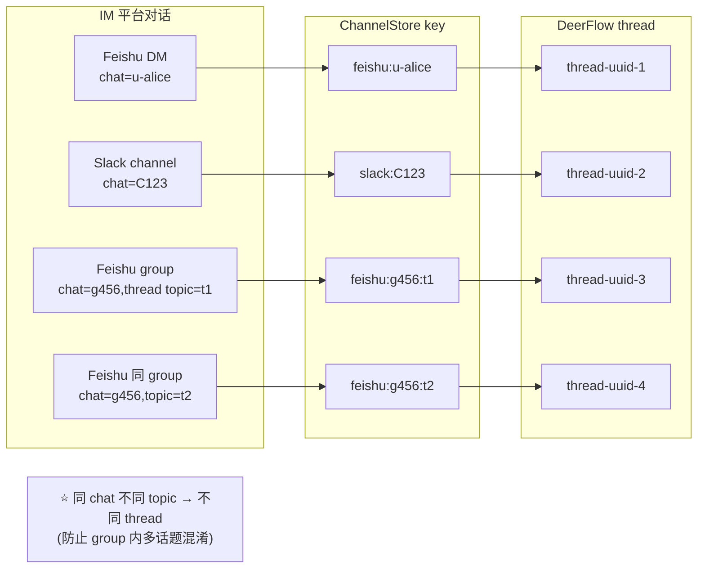
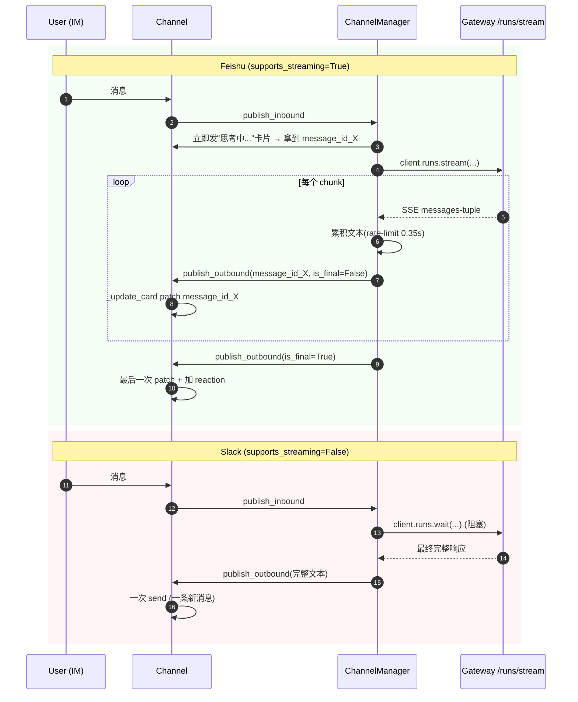

# 26 · IM 通道适配模式:MessageBus + ChannelManager + 7 个 platform 适配

> 工程实践层第 2 篇。前 25 章把 Gateway 路由讲清,**本章聚焦"如何让 DeerFlow 同时接 7 种 IM 平台"** —— Feishu / Slack / Telegram / DingTalk / WeChat / WeCom / Discord。
>
> **架构核心**:**MessageBus + ChannelManager + Channel(abstract base)** 三件套:
> 1. **`MessageBus`** —— async pub/sub 内存总线,InboundMessage 入队、OutboundMessage 派给注册的 channel callbacks
> 2. **`ChannelManager`** —— 单线程消费者,把 InboundMessage 翻译成 Gateway API 调用,流式回写
> 3. **`Channel(ABC)`** —— 抽象基类,7 个 platform 实现各自的 `start / stop / send / send_file / receive_file`
>
> 关键看点:**`channel:chat[:topic]` 三级 thread 映射键、Feishu 卡片 in-place patch vs Slack 一次性 wait、DingTalk AI Card 流式打字机、`internal_auth` + CSRF 双 token 注入**。

---

## 🎯 学习目标

读完这份文档,你能回答:

1. **MessageBus 为什么是 in-memory pub/sub** 不是 Redis / Kafka?这对**多机部署**是个 blocker 吗?
2. **`channel:chat[:topic_id]` 三级 thread 映射键**给一个具体场景说明三层各自的作用 —— 不要 topic_id 会出什么 bug?
3. **Feishu 卡片支持流式 in-place patch**(`config.update_multi=True`),Slack 走 `runs.wait` 不流式 —— 这两种模式背后是什么"平台 API 能力差异"驱动的设计选择?
4. **`CHANNEL_CAPABILITIES` capability flag** 让 ChannelManager 选择 `client.runs.stream()` 还是 `client.runs.wait()`。**给一个具体场景**说明 Discord 支持流式后这张表怎么演进。
5. **ChannelManager 用 `langgraph-sdk` 调 Gateway 而不是直接 import deerflow** —— **为什么这种"绕远路 HTTP 调自己"** 是合理设计?

---

## 🗂️ 源码定位

| 关注点 | 文件 / 行号 | 关键锚点 |
|---|---|---|
| MessageBus | `app/channels/message_bus.py` | `InboundMessage` / `OutboundMessage` / `ResolvedAttachment` dataclass;`MessageBus` async queue + callbacks;`publish_inbound` / `publish_outbound` |
| Channel 抽象基 | `app/channels/base.py` | `Channel(ABC)`:`start / stop / send / send_file / receive_file`;`supports_streaming` property;`_on_outbound` callback;`_make_inbound` helper |
| 三级映射 store | `app/channels/store.py` | `ChannelStore`:JSON 文件 + atomic rename;`_key(channel, chat, topic=None)` —— `"channel:chat"` 或 `"channel:chat:topic"` |
| 中心调度 | `app/channels/manager.py` | `ChannelManager` L541;`_dispatch_loop` L676;`_handle_message` / `_handle_chat` / `_handle_streaming_chat` / `_handle_command`;`CHANNEL_CAPABILITIES` L40 |
| 服务装配 | `app/channels/service.py` | `start_channel_service` / `stop_channel_service`;按 config 实例化各 Channel |
| 共享命令 | `app/channels/commands.py` | `KNOWN_CHANNEL_COMMANDS = {/bootstrap, /new, /status, /models, /memory, /help}` |
| Feishu 完整实现 | `app/channels/feishu.py` | `FeishuChannel`:WebSocket 长连接;`supports_streaming=True`;`_reply_card` / `_update_card`(in-place patch);`receive_file`(从 Feishu 下载文件到沙箱) |
| Slack | `app/channels/slack.py` | Socket Mode + `runs.wait` |
| Telegram | `app/channels/telegram.py` | long-polling |
| DingTalk | `app/channels/dingtalk.py` | AI Card streaming(可选) |
| WeChat | `app/channels/wechat.py` | iLink long-polling |
| WeCom | `app/channels/wecom.py` | WebSocket |
| Discord | `app/channels/discord.py` | discord.py |
| Auth 双注入 | `app/channels/manager.py` L19-L21 | `create_internal_auth_headers()` + `generate_csrf_token()` + CSRF cookie/header pair |

---

## 🧭 架构图

### 1. 三件套数据流



### 2. ChannelStore 三级映射键



### 3. Feishu 流式 vs Slack 一次性



---

## 🔍 核心逻辑讲解

### Part 1 · MessageBus —— in-memory pub/sub 设计哲学

#### 数据结构

```python
class InboundMessage:
    channel_name: str
    chat_id: str
    user_id: str
    text: str
    msg_type: InboundMessageType         # CHAT or COMMAND
    thread_ts: str | None                # 平台 thread 标识(Slack thread / Feishu reply parent)
    topic_id: str | None                 # ⭐ 用户语义的话题分组
    files: list[dict]
    metadata: dict
    created_at: float


class MessageBus:
    def __init__(self):
        self._inbound_queue: asyncio.Queue[InboundMessage] = asyncio.Queue()
        self._outbound_callbacks: list[Callable[[OutboundMessage], Awaitable[None]]] = []

    async def publish_inbound(self, msg: InboundMessage):
        await self._inbound_queue.put(msg)

    async def publish_outbound(self, msg: OutboundMessage):
        # 并发触发所有注册的 callbacks(每 channel 一个)
        await asyncio.gather(*(cb(msg) for cb in self._outbound_callbacks))
```

#### 为什么 in-memory?

| in-memory(当前) | Redis Streams / Kafka |
|---|---|
| **零依赖** —— 直接跑 | 必须运维 Redis/Kafka 集群 |
| **进程内零延迟** —— 同进程指针传递 | 序列化 + 网络 + 反序列化 |
| 单机 → 多机不可用 | 跨机自然支持 |
| 消息丢失风险(进程崩) | 持久化 |
| 适合开发 / 单机部署 | 适合 SaaS / 高可用 |

#### 多机部署如何应对?

**当前架构**:多机 Gateway 实例各自起 channels —— 同一 chat_id 可能被两个实例处理 → 重复消息!

**生产补丁**(DeerFlow 还没做):
1. **Channel sticky 化**:用 chat_id hash 决定路由到哪个 Gateway 实例
2. **MessageBus 抽象升级**:`MessageBus` 改成 Protocol,加 `RedisStreamMessageBus` 实现
3. **leader election**:多机选举一台为"channel host",其他只做 Gateway worker

→ **DeerFlow 当前是 single-machine assumption**;多机部署是已知 limitation,需扩展 MessageBus 抽象层。

### Part 2 · `channel:chat[:topic]` 三级映射键

```python
@staticmethod
def _key(channel_name: str, chat_id: str, topic_id: str | None = None) -> str:
    if topic_id:
        return f"{channel_name}:{chat_id}:{topic_id}"
    return f"{channel_name}:{chat_id}"
```

#### 三级语义

| 级别 | 用途 | 例子 |
|---|---|---|
| **channel_name** | 平台标识 | `feishu` / `slack` / `telegram` |
| **chat_id** | 平台内对话 / 群组 / DM | 一个 Slack channel 或 Feishu group |
| **topic_id**(可选) | **同一对话内的话题分组** | 群内回复某条消息形成的子主题 |

#### 为什么需要 topic_id?

**场景**:一个 50 人 Feishu 群 (chat_id=g123),里面同时有多个并行话题:
- Alice 问"周报怎么写" → 回复消息 m1 → 形成 topic_t1
- Bob 问"代码 review 流程" → 回复消息 m2 → 形成 topic_t2

**只用 `feishu:g123` 单 key**:
- Alice 和 Bob 的消息**共享同一 DeerFlow thread**
- agent 看到"周报怎么写"后又看到"代码 review" —— 上下文混乱,可能误导

**用 `feishu:g123:t1` 和 `feishu:g123:t2` 双 key**:
- Alice 和 Bob 各自独立 thread
- agent 给 Alice 的回答聚焦周报;给 Bob 的回答聚焦 code review
- **跨话题相互不污染**

#### `topic_id` 来自哪?

**Feishu**:用户回复某条消息时,Feishu 标记 `parent_id` —— Channel 实现把它映射到 `topic_id`。
**Slack**:`thread_ts` 字段(Slack 原生 thread 概念)。
**WeChat / 简单 DM**:通常没 topic 概念 → `topic_id=None` → key 降级为 `channel:chat`。

→ **DeerFlow 抽象出 `topic_id` 让所有 channel 共享同一概念,各平台 channel 自己负责"如何提取 topic_id"**。

#### `thread_ts` vs `topic_id` 别混

| 字段 | 语义 |
|---|---|
| `thread_ts` | **平台内**的 thread 标识(回复某条消息时带的 parent_id),**用于发送 reply** |
| `topic_id` | **DeerFlow 内**的话题分组键,**用于 thread 映射** |

两者**通常一致**(都来自 parent_id),但概念上分开 —— 一个是平台 API 参数,一个是业务键。

### Part 3 · `CHANNEL_CAPABILITIES` capability flag

```python
CHANNEL_CAPABILITIES = {
    "dingtalk":  {"supports_streaming": False},
    "discord":   {"supports_streaming": False},
    "feishu":    {"supports_streaming": True},
    "slack":     {"supports_streaming": False},
    "telegram":  {"supports_streaming": False},
    "wechat":    {"supports_streaming": False},
    "wecom":     {"supports_streaming": True},
}
```

#### ChannelManager 按 flag 选路径

```python
async def _handle_chat(self, msg, extra_context=None):
    if self._channel_supports_streaming(msg.channel_name):
        await self._handle_streaming_chat(msg, ...)        # client.runs.stream(...)
    else:
        result = await client.runs.wait(...)                # 阻塞等完整结果
        # ... publish_outbound(完整文本)
```

#### 为什么 Feishu / WeCom 能流式 Slack 不能?

**Feishu / WeCom**:平台支持"卡片消息的服务端 patch API" —— 一条 message 发出去后能不断 update content,前端用户看到打字机效果。
- Feishu `config.update_multi=True` 让卡片允许后续修改
- WeCom 类似 API

**Slack**:
- Slack `chat.update` API 仅支持文本消息,**有 rate limit(每秒 1 次/channel)**
- 流式 patch 触发 rate limit → 不稳定
- DeerFlow 选保守:等完整结果一次发送

**Telegram / DingTalk(无 AI card)**:
- Telegram 的 `editMessageText` 类似 Slack 限制
- DingTalk 普通消息无 patch API,只有 AI Card 才能流式
- 这些选 `wait` 模式

#### 演进:Discord 流式

如果 Discord 加入新的 message edit streaming API:
1. 在 `discord.py` 实现 `_update_message` patch 逻辑 + `supports_streaming = True` property
2. 改 `CHANNEL_CAPABILITIES["discord"]["supports_streaming"] = True`
3. ChannelManager 自动走流式路径

→ **capability flag 让"哪条路径"由配置驱动而非 isinstance 判断**(15 章 sandbox `uses_thread_data_mounts` 同模式)。

### Part 4 · Channel 抽象的 5 个接口

```python
class Channel(ABC):
    def __init__(self, name, bus, config): ...

    @property
    def is_running(self) -> bool: ...

    @property
    def supports_streaming(self) -> bool:
        return False

    @abstractmethod
    async def start(self): ...                   # 连接 WS / 启动 long-poll

    @abstractmethod
    async def stop(self): ...                     # graceful close

    @abstractmethod
    async def send(self, msg: OutboundMessage): ...   # 发文本消息

    async def send_file(self, msg, attachment) -> bool:
        return False                              # 默认不支持,子类覆写

    async def receive_file(self, msg, thread_id) -> InboundMessage:
        return msg                                # 默认 no-op
```

#### 默认实现 vs abstractmethod 的取舍

- **必需**(abstract):`start / stop / send` —— 任何 IM 都必有
- **可选**(default no-op):`send_file / receive_file / supports_streaming` —— 不是所有平台都支持

**真实场景**:Telegram 暂时不支持 file upload 出去 → 不覆写 `send_file` → 默认返回 False → ChannelManager log warning 跳过文件上传。

→ **抽象设计上让"不支持的能力静默 fail"** 比强制实现 stub 更好(避免 stub 抛 NotImplementedError 中断流程)。

### Part 5 · ChannelManager 用 langgraph-sdk HTTP 调 Gateway

```python
from langgraph_sdk import get_client

def _get_client(self):
    headers = create_internal_auth_headers()
    csrf_token = generate_csrf_token()
    headers[CSRF_HEADER_NAME] = csrf_token
    cookies = {CSRF_COOKIE_NAME: csrf_token}
    return get_client(url=self.langgraph_url, headers=headers, cookies=cookies)
```

#### 为什么不直接 `from deerflow.agents import make_lead_agent` 跑?

| 直接 import 直调 | HTTP via langgraph-sdk |
|---|---|
| 进程内零延迟 | 多一跳 HTTP loopback |
| 必须复刻 Gateway 的资源装配(stream_bridge / run_manager / checkpointer) | 完全复用 Gateway 已经搭好的 |
| 失去 Auth / CSRF / authz / observability 中间件 | 走完整 Gateway 栈,所有中间件统一 |
| Channel 代码必须懂 langgraph runtime 细节 | Channel 只懂 HTTP API |

#### 25 章 internal_auth + CSRF 注入

```python
# 25 章讲过:
# 1. internal_auth header: 进程级随机 token,channel 进程内可获取
# 2. CSRF: channel 自己生成 token + 同时设 cookie 和 header(Double Submit 自洽)
headers = create_internal_auth_headers()           # X-DeerFlow-Internal-Token
csrf_token = generate_csrf_token()
headers[CSRF_HEADER_NAME] = csrf_token             # X-CSRF-Token
cookies = {CSRF_COOKIE_NAME: csrf_token}           # csrf_token cookie
```

**让 channel 通过 Gateway 完整栈** —— 不绕过任何安全检查 —— **生产合规友好**。

#### 工程哲学:同进程也"绕远路"调自己

**这是 microservice 思路在单进程内的体现**:**强制走对外 API** = 所有调用方等价。

带来的好处:
1. **行为一致**:channel 通过 HTTP 调用与前端调用走完全同一路径
2. **测试简单**:不需要 mock 复杂运行时,只 mock HTTP
3. **演进 friendly**:未来真把 channel 拆成独立进程,代码不动

代价:
1. **微小延迟开销**(loopback HTTP ~1ms,可忽略)
2. **必须保证 Gateway 启动后 channel 才启动**(`lifespan` 内顺序:Gateway → channel)

→ **DeerFlow 选了对的方向** —— 短期付出 1ms 换长期架构灵活性。

### Part 6 · Feishu 卡片 in-place patch 流程

```python
class FeishuChannel(Channel):
    supports_streaming = True

    async def send(self, msg, *, _max_retries=3):
        if msg.message_id_to_patch:
            # ⭐ in-place patch 已有 message
            await self._update_card(msg.message_id_to_patch, msg.text)
        elif msg.is_initial:
            # 第一条 "思考中..." 卡片
            msg.message_id_to_patch = await self._reply_card(msg.thread_ts, msg.text)
        else:
            # 兜底:发新消息(不用卡片)
            ...

    @staticmethod
    def _build_card_content(text: str) -> str:
        return json.dumps({
            "config": {"wide_screen_mode": True, "update_multi": True},  # ⭐ 允许后续 patch
            "elements": [{"tag": "markdown", "content": text}],
        })
```

#### in-place patch 工程要点

1. **第一次发卡片**:`reply_card(parent_message_id, "思考中...")` → 拿到 `message_id_X`
2. **每次流式 chunk**:`update_card(message_id_X, 累积文本)` → 用户看到打字机
3. **`update_multi=True`** 是 Feishu API 的关键 flag —— 没这个 patch 会失败

#### `STREAM_UPDATE_MIN_INTERVAL_SECONDS = 0.35`

```python
STREAM_UPDATE_MIN_INTERVAL_SECONDS = 0.35
```

**为什么 0.35 秒一次而不是每个 token**?
- Feishu API 有 rate limit
- 用户视角:0.3 秒看一次更新已经足够流畅
- 减少 API 调用 = 减少 cost + 减少限流风险
- 0.35 秒是经验值(LangGraph platform 类似产品的最佳实践)

→ **打字机效果不需要每 token,半秒一次足够**。这是 UX/性能权衡的经典案例。

### Part 7 · `receive_file` —— Feishu 文件下载到沙箱

```python
class FeishuChannel(Channel):
    async def receive_file(self, msg, thread_id):
        if not msg.files:
            return msg

        # 把 Feishu 文件下载到 thread 沙箱的 uploads 目录
        sandbox_paths = []
        for file_meta in msg.files:
            sandbox_path = await self._receive_single_file(
                msg.metadata["raw_message_id"], file_meta["file_key"],
                type=file_meta["type"],  # image / file
                thread_id=thread_id,
            )
            sandbox_paths.append(sandbox_path)

        # 把沙箱路径附在 msg.text 末尾,LLM 知道这些文件可用
        msg.text += "\n\n[Attached files: " + ", ".join(sandbox_paths) + "]"
        return msg
```

#### 工程要点

**双向文件流**:
- **入站**(Feishu → DeerFlow):`receive_file` 把文件下载到沙箱 `/mnt/user-data/uploads/`,文本中提示文件位置
- **出站**(DeerFlow → Feishu):`send_file` 把沙箱文件上传到 Feishu(返回 file_token)

**抽象层把"文件路径"和"消息文本"解耦**:
- LLM 只看 text + 沙箱路径
- LLM 调 `read_file(...)` 读沙箱里的文件 —— **不感知** 文件来自哪个 IM 平台

→ 这是个**显式 platform-agnostic 抽象**:任何平台只要实现 receive_file 把文件搬到沙箱,LLM 后续逻辑完全一致。

### Part 8 · DingTalk AI Card 流式打字机(条件启用)

```python
class DingTalkChannel(Channel):
    @property
    def supports_streaming(self) -> bool:
        return bool(self.config.get("card_template_id"))      # ⭐ 配了模板才支持流式
```

**DingTalk 的特殊性**:
- 普通消息 API:不支持 update → `supports_streaming=False`
- AI Card API:支持流式 streaming write,**但需要 `card_template_id` 配置**

**channel 的 `supports_streaming` 不是固定的,而是 config-driven**!

#### `CHANNEL_CAPABILITIES` 表与 instance property 的双轨

```python
# 全局表(静态)
CHANNEL_CAPABILITIES = {"dingtalk": {"supports_streaming": False}, ...}

# instance 动态(覆盖全局)
class DingTalkChannel:
    @property
    def supports_streaming(self):
        return bool(self.config.get("card_template_id"))
```

**ChannelManager 检查时**:
```python
def _channel_supports_streaming(self, channel_name):
    # 先查全局表(快速判断)
    # 但实际发送时再问 channel instance 的 property(可被实例覆盖)
```

→ **抽象层给静态判断,instance 覆盖给动态语义** —— 灵活双轨。

---

## 🧩 体现的通用 Agent 设计模式

| 模式 | Channels 中的体现 |
|---|---|
| **In-process Pub/Sub** | MessageBus async queue + callbacks |
| **Abstract Adapter Pattern** | Channel ABC + 7 个 platform 实现 |
| **Hierarchical Routing Key** | `channel:chat[:topic]` 三级 |
| **Capability Flag**(能力声明) | `CHANNEL_CAPABILITIES` + instance property |
| **Same-process HTTP Loopback** | channel 用 langgraph-sdk 调 Gateway |
| **Streaming with Rate Limit** | Feishu 0.35s 间隔 |
| **Atomic Config Persist** | ChannelStore JSON + tempfile rename |
| **Default-no-op Optional Methods** | `send_file / receive_file` 默认实现 |

---

## 🧱 与 Agent Harness 六要素的对应关系

| 六要素 | Channels 怎么提供基础设施 |
|---|---|
| ① 反馈循环 | IM 平台是用户 ↔ agent 反馈的承载,channel 提供双向桥 |
| ② 记忆持久化 | ChannelStore JSON 持久化 chat→thread 映射;thread 持久 = 跨会话记忆 |
| ③ 动态上下文 | receive_file 把上传文件注入沙箱,自动出现在 agent 上下文 |
| ④ 安全护栏 | channel 调 Gateway 走 internal_auth + CSRF,完整中间件链 |
| ⑤ 工具集成 | command(/new, /memory, /models)给用户从 IM 直接调 Gateway 能力 |
| ⑥ 可观测性 | 每个 Channel `logger.info` 标记 platform 名 |

---

## ⚠️ 常见坑与调试技巧

### 坑 1 · 同 chat 不同人 → 共享 thread

ChannelStore 默认 key 是 `channel:chat`,**不含 user_id**。
**问题场景**:一个 Feishu group(chat=g123)Alice 和 Bob 都问问题 → 共享同一 DeerFlow thread → memory 混淆。
**修复**:在 manager 内增强 key 加 user_id:`channel:chat:user:topic`,或者让用户在 group 用 `/new` 命令重置 thread。

### 坑 2 · `STREAM_UPDATE_MIN_INTERVAL_SECONDS` 调太低被限流

Feishu API 限流是动态的(根据 app tier),如果改成 0.1 秒 → 频繁 patch → 429。**修复**:保留 0.35 默认;调更高(如 1.0 秒)适合限流严格的平台。

### 坑 3 · 多进程 channels 重复消费

如果你跑 2 个 Gateway 实例都启用 Feishu channel → Feishu WS 不会自动负载均衡 → 两个实例都收到同消息 → 都跑 agent → 用户看到 2 条回复。
**修复**:多实例时**只在一台**启 channels(用 env var 控制)。

### 坑 4 · ChannelStore JSON 文件并发写冲突

`_save` 用 atomic rename + threading.Lock —— 但**只在进程内安全**。
**多进程共享 channels/store.json** → 互相覆盖。**修复**:不要多进程共享;或迁移到 DB。

### 坑 5 · receive_file 失败但 chat 继续

Feishu 文件下载 → 沙箱写入失败(磁盘满 / 权限) → `receive_file` 应该返回原 msg 让 chat 继续,还是 raise?
**DeerFlow 当前**:静默失败(log error)+ 继续 chat —— **降级方案**,LLM 看到 text 但没文件 → 至少能回应。
**改进**:在 text 后加 `[File X failed to download]` 提示 LLM。

---

## 🛠️ 动手实操

> 本 demo 用 mock 演示 MessageBus + Channel 抽象,**不连真实 IM 平台**。

### Demo · Channel 适配模式实测

```python
"""
Channels demo — MessageBus pub/sub + Channel 抽象 + 三级映射.

跑法:  PYTHONPATH=backend uv run python scripts/channels_walkthrough.py
"""
import asyncio
import sys, os
import tempfile
from pathlib import Path

sys.path.insert(0, "backend")
sys.path.insert(0, "backend/packages/harness")
os.chdir(Path(__file__).resolve().parents[1])

from app.channels.base import Channel
from app.channels.message_bus import InboundMessage, InboundMessageType, MessageBus, OutboundMessage
from app.channels.store import ChannelStore
from app.channels.commands import KNOWN_CHANNEL_COMMANDS
from app.channels.manager import CHANNEL_CAPABILITIES


# ====== Case 1: MessageBus 基本 pub/sub ======
print("\n" + "=" * 70)
print("CASE 1 · MessageBus pub/sub 基本")
print("=" * 70)

async def case1():
    bus = MessageBus()
    received = []
    async def callback(msg):
        received.append(msg)

    bus.register_outbound_callback(callback)
    await bus.publish_outbound(OutboundMessage(
        channel_name="test", chat_id="c1", thread_ts=None, text="hello",
    ))
    print(f"  receive count: {len(received)}")
    print(f"  msg text: {received[0].text}")

asyncio.run(case1())


# ====== Case 2: Channel 抽象基的子类 ======
print("\n" + "=" * 70)
print("CASE 2 · Channel ABC 子类实现")
print("=" * 70)

class MockChannel(Channel):
    def __init__(self, bus, config):
        super().__init__("mock", bus, config)
        self.sent_messages = []

    async def start(self): self._running = True
    async def stop(self): self._running = False
    async def send(self, msg): self.sent_messages.append(msg.text)

    @property
    def supports_streaming(self): return False

async def case2():
    bus = MessageBus()
    ch = MockChannel(bus, {})
    # 注册 outbound callback
    bus.register_outbound_callback(ch._on_outbound)

    # 模拟 Gateway 处理完发回 outbound
    await bus.publish_outbound(OutboundMessage(
        channel_name="mock", chat_id="c1", thread_ts=None, text="reply 1",
    ))
    await bus.publish_outbound(OutboundMessage(
        channel_name="other", chat_id="c2", thread_ts=None, text="not mine",
    ))
    print(f"  mock sent: {ch.sent_messages}")
    print(f"  ⭐ channel 只 forward 自己 name 的 msg")

asyncio.run(case2())


# ====== Case 3: ChannelStore 三级映射 ======
print("\n" + "=" * 70)
print("CASE 3 · ChannelStore 三级映射键")
print("=" * 70)

with tempfile.TemporaryDirectory() as tmpdir:
    store_path = Path(tmpdir) / "store.json"
    store = ChannelStore(path=store_path)

    # 简单 DM
    store.set("feishu", "u-alice", thread_id="thr-1", user_id="u-alice")
    # 群组无 topic
    store.set("feishu", "g-456", thread_id="thr-2", user_id="u-mixed")
    # 群组带 topic
    store.set("feishu", "g-456", thread_id="thr-3", user_id="u-mixed", topic_id="t-1")
    store.set("feishu", "g-456", thread_id="thr-4", user_id="u-mixed", topic_id="t-2")

    # 读取
    assert store.get("feishu", "u-alice")["thread_id"] == "thr-1"
    assert store.get("feishu", "g-456")["thread_id"] == "thr-2"
    assert store.get("feishu", "g-456", topic_id="t-1")["thread_id"] == "thr-3"
    assert store.get("feishu", "g-456", topic_id="t-2")["thread_id"] == "thr-4"

    print(f"  feishu:u-alice                  → thr-1 (DM)")
    print(f"  feishu:g-456                    → thr-2 (group root)")
    print(f"  feishu:g-456:t-1                → thr-3 (topic 1)")
    print(f"  feishu:g-456:t-2                → thr-4 (topic 2)")
    print(f"  ✅ 三级映射,同 group 不同 topic 不冲突")

    # 看磁盘文件
    print(f"\n  ChannelStore 持久化(JSON):")
    print(f"  {store_path.read_text()[:200]}...")


# ====== Case 4: CHANNEL_CAPABILITIES ======
print("\n" + "=" * 70)
print("CASE 4 · CHANNEL_CAPABILITIES 静态表")
print("=" * 70)

for name, cap in CHANNEL_CAPABILITIES.items():
    streaming = cap["supports_streaming"]
    icon = "🌊" if streaming else "📦"
    print(f"  {icon}  {name:<12} supports_streaming={streaming}")


# ====== Case 5: KNOWN_CHANNEL_COMMANDS ======
print("\n" + "=" * 70)
print("CASE 5 · KNOWN_CHANNEL_COMMANDS 共享")
print("=" * 70)

print(f"  共 {len(KNOWN_CHANNEL_COMMANDS)} 个命令:")
for cmd in sorted(KNOWN_CHANNEL_COMMANDS):
    print(f"    {cmd}")
print(f"  ⭐ 单一源 frozenset,所有 channel parser 共享")


# ====== Case 6: InboundMessage 数据结构 ======
print("\n" + "=" * 70)
print("CASE 6 · InboundMessage 数据结构 + 三级 key 用法")
print("=" * 70)

# 一个简单 DM
msg_dm = InboundMessage(
    channel_name="feishu", chat_id="u-alice", user_id="u-alice",
    text="hello", msg_type=InboundMessageType.CHAT,
)
print(f"  DM key: feishu:{msg_dm.chat_id}  (topic_id=None)")

# 一个 group 内 reply
msg_grp = InboundMessage(
    channel_name="feishu", chat_id="g-456", user_id="u-bob",
    text="re your idea", msg_type=InboundMessageType.CHAT,
    thread_ts="msg-x",          # 回复 msg-x
    topic_id="msg-x",           # 同 group 内话题分组
)
print(f"  Group reply key: feishu:{msg_grp.chat_id}:{msg_grp.topic_id}")

# 一个 command
msg_cmd = InboundMessage(
    channel_name="slack", chat_id="C123", user_id="U-alice",
    text="/new", msg_type=InboundMessageType.COMMAND,
)
print(f"  Command: {msg_cmd.text}  type={msg_cmd.msg_type}")
print(f"  是已知 command? {msg_cmd.text in KNOWN_CHANNEL_COMMANDS}")
```

### 调试任务

1. **断点位置**:
   - `manager.py::_dispatch_loop` 看 `await self.bus.next_inbound()` 拉取
   - `feishu.py::_update_card` 看 patch API 调用
   - `store.py::_key` 看三级拼接逻辑
2. **观察什么**:
   - Case 2:mock channel 只 forward 自己 name 的 msg(其他 channel 的不处理)
   - Case 3:4 个不同 key 对应 4 个不同 thread
   - Case 4:Feishu / WeCom 是 streaming;其他 wait
3. **人为制造异常**:
   - Case 2 把 `msg.channel_name="other"` 改 "mock" → 看是不是被 forward
   - Case 3 把 store_path 设到只读目录 → 看 `_save` 异常

### 改造练习

1. **练习 A(简单)**:扩展 KNOWN_CHANNEL_COMMANDS 加 `/clear`,在 manager 实现"清空当前 thread"。
2. **练习 B(中等)**:实现 `LineChannel`(LINE messaging)—— LINE webhook 接收 + LINE Push API 回复。注意:LINE 不支持 patch,所以 `supports_streaming=False`。
3. **挑战题**:把 MessageBus 升级成 Protocol + 写一个 `RedisStreamMessageBus` 实现,支持多机 Gateway 共享。

### 预期输出 & 验证方式

- Case 1:callback 收到 1 条 msg
- Case 2:mock 只发自己 name 的;other 被忽略
- Case 3:4 个 key 4 个 thread,文件 JSON 含 4 条
- Case 4:7 个 channel 中 Feishu / WeCom = streaming
- Case 5:6 个命令枚举
- Case 6:三级 key 正确拼接

---

## 🎤 面试视角

### 业务型大厂卷

**问 1**:DeerFlow `MessageBus` 是 in-memory async queue。**你团队接到"多机部署 Gateway" 任务**,这个 MessageBus 立刻成为瓶颈。**给一个完整 4 阶段迁移方案**。

> **教科书答案**:
> 4 阶段迁移:
> 1. **阶段 1 · sticky 路由**(无新依赖):用 chat_id hash → 路由到固定 Gateway 实例;实例间不共享 MessageBus。**代价**:同 chat 用户必须打到同实例 —— 一台挂另一台不能接管。
> 2. **阶段 2 · MessageBus 抽象升级**:把当前 `MessageBus` 改成 Protocol,加 `RedisStreamMessageBus(MessageBus)` 实现。配置驱动选择。**测试**:本地两进程跑 Redis 验证。
> 3. **阶段 3 · 持久化 ChannelStore**:JSON 文件 → Postgres(24 章五表加第 6 表 `channel_threads`),多机查询一致。
> 4. **阶段 4 · 容错**:Redis 挂 → graceful degrade 到 sticky 路由;监控 redis_msgbus_lag 关键指标。
> **DeerFlow 当前在阶段 0** —— single-machine。每阶段都是渐进可上线。

**问 2**:`channel:chat:topic` 三级映射 vs `channel:chat:user:topic` 四级 —— **给两条理由**说明 DeerFlow 选三级是对的,然后给一个**反例场景**说明四级更合理。

> **教科书答案**:
> 选三级是对的:
> 1. **群组共享上下文是 IM 文化**:一个 group 大家一起讨论 → 同 topic 内的所有人**应该共享** thread 历史。Alice 的提问 + Bob 的补充共建上下文,agent 看到完整对话才能更好回应。
> 2. **`/new` 命令显式重置**:用户想分话题时手动 `/new` → 创建新 topic_id → 自动隔离。**给用户控制权**比框架强制隔离更灵活。
> 反例:**多租户 SaaS 群组**
> - 一个 Feishu group 同时是 5 个公司客服共用,每个客服在自己用户名下做事
> - 不希望 A 公司的客户问题被 B 公司的 agent 看到
> - → **必须**四级 `channel:chat:user:topic` 或更严格隔离
> - DeerFlow 当前不适合这种场景。

### 创业型 AI 公司卷

**问 3**:你接到 PRD"DeerFlow 加 LINE 支持"。**用 30 分钟完整给出实现 checklist**。

> **参考答案**:
> 30 分钟 checklist:
> 1. **入口**:LINE 给 webhook URL,所以 Channel impl 内嵌一个 FastAPI sub-router(`POST /webhook/line`)收消息
> 2. **认证**:LINE 用 `X-Line-Signature` header(HMAC-SHA256)— 收消息时验证
> 3. **解析**:LINE event → `InboundMessage`(`channel_name="line"`, `chat_id=event.source.userId 或 groupId`, `topic_id=None`,LINE 暂不支持 thread)
4. **发送**:用 LINE Push API `https://api.line.me/v2/bot/message/push`
5. **`supports_streaming=False`**:LINE 不支持 patch
6. **文件**:LINE 支持发图/视频/音频,实现 `send_file` 上传到 LINE 后拿到 `messageId`
7. **接收文件**:LINE Content API `/v2/bot/message/{messageId}/content` 下载,放沙箱
8. **配置**:`config.yaml channels.line.{enabled, channel_access_token, channel_secret}`
9. **CHANNEL_CAPABILITIES** 加 line entry
10. **测试**:LINE Developer Console 创建 sandbox bot + ngrok 暴露本地 webhook
> **DeerFlow 抽象层完整,加新 channel 只是一个 `line.py` + 配置 + 一行 CHANNEL_CAPABILITIES** —— 30 分钟现实可行。

**问 4**:DeerFlow 用 `langgraph-sdk` 让 channel HTTP 调自己 Gateway。**给一个具体性能场景**说明这种"绕远路"的延迟实际意味着什么 + 是否值得优化。

> **参考答案**:
> 性能场景:
> - **典型 chat 请求总延迟**:用户敲消息 → channel 收 → bus → manager → HTTP → Gateway → agent → LLM → 流式返回 → bus → channel → 用户看到
> - 其中 channel→Gateway 的 HTTP loopback 约 **1-3ms**(localhost,FastAPI/uvicorn 本地高性能)
> - **整体 LLM 调用通常 500-3000ms** → loopback 占比 < 0.5%
> 优化否?**不值得**:
> 1. 直 import 节省 1-3ms → 用户感知不到
> 2. 失去 25 章讲的 Auth/CSRF/middleware 复用 → 安全风险
> 3. 测试和部署复杂化 —— 必须复刻整套 lifespan
> **值得优化的场景**:
> - 极高并发(>10000 QPS)channel —— loopback 累积成本不可忽略
> - 端到端 latency budget 严苛(<100ms)的场景
> - 这两种 IM 场景都罕见,**DeerFlow 选 HTTP 是对的**。

---

## 📚 延伸阅读

- **Feishu Open Platform 文档**:https://open.feishu.cn/document/uAjLw4CM/ukTMukTMukTM/reference/im-v1/message-card/patch
  *理解 Feishu 卡片 patch API 的 `update_multi` 字段。*
- **Slack Block Kit**:https://api.slack.com/block-kit
- **LangGraph SDK Python**:https://github.com/langchain-ai/langgraph/tree/main/libs/sdk-py
  *理解 channel 调 Gateway 用的 SDK 接口。*
- **25 章 internal_auth + CSRF**:本章 channel 调 Gateway 时注入双 token 的依据。
- **15 章 sandbox 虚拟路径**:Feishu `receive_file` 把文件搬到沙箱后,LLM 读的是虚拟路径。

---

## 🎤 互动检查 —— 请回答这 3 个问题

> **两句话即可**。

1. **设计动机题**:`channel:chat:topic` 三级映射键 —— **用一句话**说明 topic_id 这一级的必要性 + 一句话说明它来自平台的什么概念(以 Feishu 为例)。
2. **机制理解题**:Feishu `supports_streaming=True` Slack `=False` 的根本原因是什么(2 句话内)?
3. **应用题**:你的同事提了 PR:`MessageBus` 加 `persist_to_disk=True` 选项把 inbound queue 持久化到磁盘。**给两条理由**说明应该被拒绝(或:在什么前提下应该接受)。

回答后我们进入 **`27-embedded-client-and-conformance-tests.md`** —— DeerFlowClient + 同源 Gateway 一致性测试。
