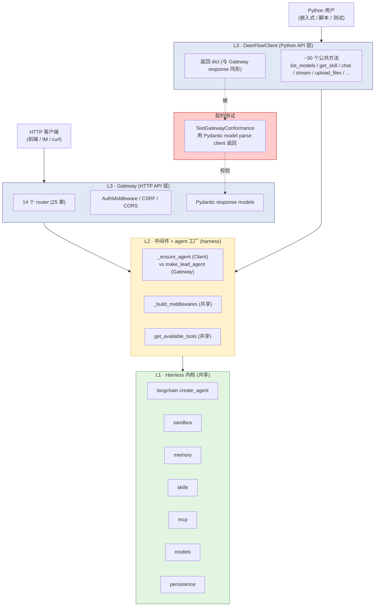
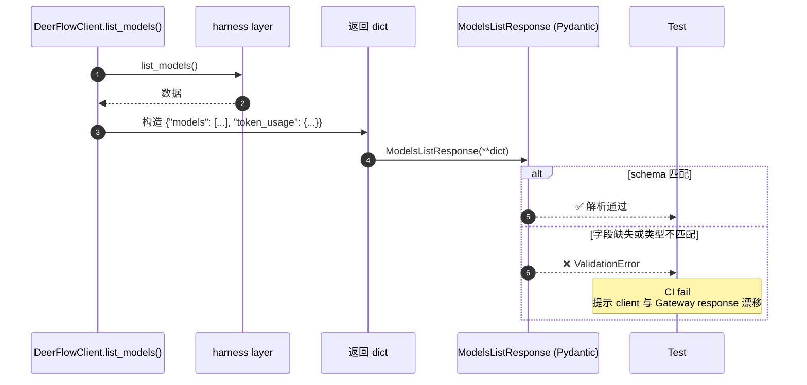
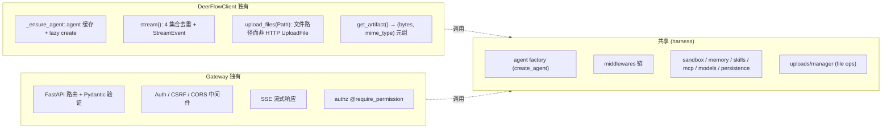

# 27 · DeerFlowClient 与 Gateway 一致性测试

> 工程实践层第 3 篇(收官)。前 26 章基本沿"Gateway → agent → 工具/沙箱/记忆..."主路径展开;**本章把目光转到"另一种产品形态"** —— 嵌入式 Python 客户端 `DeerFlowClient`。
>
> **同源 SDK / Server 哲学**:DeerFlowClient 不是"对 Gateway HTTP API 的薄壳 wrapper",而是**与 Gateway 平行的另一个入口**,共享 harness 内核(04 章已点)。
>
> 关键看点:**`_ensure_agent` 内部完整复现 `make_lead_agent` 的工厂逻辑、`TestGatewayConformance` 用 Pydantic 双向校验 schema 漂移、`stream()` 客户端去重 4 集合**(08 章已细讲)。

---

## 🎯 学习目标

读完这份文档,你能回答:

1. **DeerFlowClient 不是 HTTP wrapper —— 它共享什么和 Gateway?各自独立的是什么?** 给出三层(harness / 中间件 / API 层)的归属。
2. **`TestGatewayConformance` 通过 Pydantic 校验 client.list_models() 等 dict 返回值能解析成 Gateway 的 response model**。**这种"轻量契约测试"相比 OpenAPI codegen 有什么工程优势 / 劣势**?
3. **`DeerFlowClient._ensure_agent` 自己调 `_build_middlewares` + `apply_prompt_template` + `create_agent`** —— 几乎是 10 章 `make_lead_agent` 的复制粘贴。**这种重复是 bad design 还是有意为之**?
4. **Client `stream()` 用 4 集合(seen_ids / streamed_ids / counted_usage_ids / sent_additional_kwargs_by_id)做去重**(08 章已讲)—— **如果 Gateway 也实现类似客户端去重,SDK 用户还需要这一层吗**?
5. **`upload_files` 接受 `Path` 而 Gateway 接受 HTTP `UploadFile`** —— 这种"同一抽象不同入参形态"在 client.py 哪些方法上发生?Pydantic conformance 怎么校验它们?

---

## 🗂️ 源码定位

| 关注点 | 文件 / 行号 | 关键锚点 |
|---|---|---|
| Client 主类 | `packages/harness/deerflow/client.py`(~1300 行) | `DeerFlowClient` L80;`StreamEvent` L60;`StreamEventType` Literal |
| Agent 构造 | `client.py::_ensure_agent` L210;`_get_tools` L255 | 与 10 章 `_make_lead_agent` 高度相似但**复制不依赖** |
| stream 实现 | `client.py::stream` L489-L760 | 用 `agent.stream(stream_mode=["values","messages","custom"])` + 4 集合去重(08 章详讲) |
| Gateway 业务方法 | `client.py` L387-L1330 | `list_models` / `get_model` / `list_skills` / `get_skill` / `install_skill` / `get_mcp_config` / `update_mcp_config` / `get_memory` / `upload_files` / `list_uploads` / `get_artifact` / `list_threads` / `get_thread` 等 |
| Conformance 测试 | `backend/tests/test_client.py::TestGatewayConformance` L2302+ | 用 Pydantic response model parse client 返回 dict |
| Gateway 响应模型 | `app/gateway/routers/{models,mcp,memory,skills,uploads}.py` | `ModelsListResponse / ModelResponse / SkillsListResponse / SkillResponse / SkillInstallResponse / McpConfigResponse / MemoryConfigResponse / MemoryStatusResponse / UploadResponse` |
| 测试 fixture | `test_client.py` L26-L70 | `mock_app_config` —— minimal AppConfig mock |
| 上传 manager | `packages/harness/deerflow/uploads/manager.py` | `claim_unique_filename / enrich_file_listing / upload_virtual_path / upload_artifact_url`(client / Gateway 共用) |

---

## 🧭 架构图

### 1. SDK / Server 双形态的同源架构



### 2. Conformance 测试工作流



### 3. 三层归属对照



---

## 🔍 核心逻辑讲解

### Part 1 · "同源 SDK/Server"的工程哲学

#### 三层归属

| 层 | 内容 | 归属 |
|---|---|---|
| **L1 harness** | agent 工厂 / 中间件 / sandbox / memory / skills / mcp / models / persistence | **共享** —— 一份代码两边用 |
| **L2 中间件 + agent 工厂** | `_build_middlewares` / `apply_prompt_template` / `create_agent` | **共享 + 各自调用** |
| **L3 API 层** | HTTP routes(Gateway)+ Python methods(Client) | **独立实现** |

#### 与"经典 SDK"模式对比

**经典 SDK 模式**(如 OpenAI Python SDK):
- 用户 `client.chat.completions.create(...)` → SDK 内部 `httpx.post('https://api.openai.com/v1/...')` → 服务器跑 → 返回 JSON → SDK 解析回 Python object
- **SDK 是对 HTTP API 的薄壳 wrapper**
- 跨进程 / 跨网络

**DeerFlow 同源模式**:
- `client.list_models()` → 直接 `get_app_config().models` → 转 dict → 返回
- **不发 HTTP 请求** —— 进程内 import + 调用
- 但**返回的 dict 与 Gateway HTTP response 结构一致**

#### 这种设计带来什么?

| 维度 | 经典 SDK | 同源 SDK |
|---|---|---|
| 跑测试 | 需 mock HTTP | 直接 import 调 |
| 嵌入式 | 必须起服务 | 一行 import 就用 |
| 跨进程 / 跨网络 | 内置支持 | 不支持(需要走 Gateway) |
| 版本绑定 | 客户端可独立升级 | SDK 与 server 必须同版本 |
| 类型安全 | OpenAPI codegen → 强类型 | Pydantic conformance 校验 |
| 性能 | HTTP 开销 | 进程内零开销 |

DeerFlow 用户场景:
- **嵌入式**:写个 Python 脚本批量跑 100 个文档分析 —— 不想起 FastAPI / docker → 用 DeerFlowClient
- **测试**:CI 跑 agent 行为测试,**不需要真起 Gateway** → DeerFlowClient
- **HTTP 调用**:前端 / 第三方集成 → 走 Gateway

→ **同一份 harness 内核服务两种入口**,**API 层各自独立**(因为协议不同)。

### Part 2 · `_ensure_agent` 复刻 `make_lead_agent`

#### 关键代码段(简化)

```python
class DeerFlowClient:
    def _ensure_agent(self, config: RunnableConfig):
        cfg = config.get("configurable", {})
        # 提取与 10 章相同的 6 个决策变量
        agent_name = cfg.get("agent_name")
        thinking_enabled = cfg.get("thinking_enabled", True)
        model_name = cfg.get("model_name") or cfg.get("model")
        is_plan_mode = cfg.get("is_plan_mode", False)
        subagent_enabled = cfg.get("subagent_enabled", False)
        is_bootstrap = cfg.get("is_bootstrap", False)

        # 计算 agent_config_key 用于缓存判断
        agent_config_key = (agent_name, thinking_enabled, ..., model_name)
        if self._agent is not None and self._agent_config_key == agent_config_key:
            return self._agent                            # ⭐ 缓存命中

        # 否则从头构建(几乎等同 10 章 make_lead_agent)
        model = create_chat_model(name=model_name, thinking_enabled=thinking_enabled, ...)
        tools = self._get_tools(model_name=model_name, subagent_enabled=subagent_enabled)
        # ... filter by skill allowed-tools
        middleware = _build_middlewares(config, model_name=model_name, ..., custom_middlewares=self._middlewares)
        agent = create_agent(
            model=model,
            tools=tools,
            middleware=middleware,
            system_prompt=apply_prompt_template(...),
            state_schema=ThreadState,
        )
        # 手动挂 checkpointer
        if checkpointer:
            agent.checkpointer = checkpointer

        self._agent = agent
        self._agent_config_key = agent_config_key
        return agent
```

#### 为什么不直接调 `make_lead_agent`?

`lead_agent/agent.py::make_lead_agent` 签名是 `(config: RunnableConfig) -> CompiledStateGraph` —— Client 完全可以调它。**但 DeerFlow 选择复刻**,理由:

1. **Agent 缓存**:Client 是长寿命对象(用户脚本里持有多次 chat 调用)→ 必须 cache agent 实例,**避免每次 chat 都重建** middleware chain / tools / model。Gateway 是 stateless(每次请求 fresh agent),不需要 cache。
2. **Custom middleware 注入**:Client 暴露 `middlewares=[my_custom_mw]` 参数让用户传入自定义中间件 → 复刻时把它注入 `_build_middlewares(..., custom_middlewares=self._middlewares)`。Gateway 没这个 API 暴露。
3. **Checkpointer 自定义注入**:Client `__init__(checkpointer=...)` 允许用户传自定义 checkpointer(测试 mock / in-memory) → Gateway 的 checkpointer 来自 lifespan。
4. **agent_config_key 优化**:Client 用 tuple 作为 cache key —— 相同参数 chat 复用 agent。Gateway 是 per-request 不缓存。

#### 是否"代码重复"?

**确实是**少量重复(~30 行 with `_build_middlewares` + `apply_prompt_template` 等共享 helper),但**有意为之**:
- Client 关心"缓存 + 用户扩展点"
- Gateway 关心"per-request + auth/csrf 中间件链"
- **两者职责不同,共享底层 helper 已够;最外层 30 行各自实现 = 更清晰边界**

**反例**(更糟的设计):一个超复杂 `make_lead_agent(*, gateway_mode=True, cache=False, custom_middlewares=None, ...)` —— 用复杂参数压抑差异 → 维护性更差。

→ **"轻量复制 + 共享内核"是 DRY 的成熟实践**:不为消除 30 行重复牺牲设计清晰度。

### Part 3 · `TestGatewayConformance` 的设计

#### 测试核心模式

```python
class TestGatewayConformance:
    def test_list_models(self, mock_app_config):
        # 1. 配置一个 mock client
        with patch("deerflow.client.get_app_config", return_value=mock_app_config):
            client = DeerFlowClient()

        # 2. 调 client 方法,拿到 dict 返回
        result = client.list_models()

        # 3. 用 Gateway response model 解析 dict
        parsed = ModelsListResponse(**result)

        # 4. 断言关键字段
        assert len(parsed.models) == 1
        assert parsed.models[0].name == "test-model"
```

**关键步骤**:第 3 步 `ModelsListResponse(**result)` —— 如果 client 漏字段 / 字段类型错,Pydantic 在这里就 `ValidationError`。

#### 覆盖的方法(9 个 conformance 测试)

| 测试 | client 方法 | Gateway model |
|---|---|---|
| `test_list_models` | `client.list_models()` | `ModelsListResponse` |
| `test_get_model` | `client.get_model(name)` | `ModelResponse` |
| `test_list_skills` | `client.list_skills()` | `SkillsListResponse` |
| `test_get_skill` | `client.get_skill(name)` | `SkillResponse` |
| `test_install_skill` | `client.install_skill(path)` | `SkillInstallResponse` |
| `test_get_mcp_config` | `client.get_mcp_config()` | `McpConfigResponse` |
| `test_upload_files` | `client.upload_files(...)` | `UploadResponse` |
| `test_memory_config` | `client.get_memory_config()` | `MemoryConfigResponse` |
| `test_memory_status` | `client.get_memory_status()` | `MemoryStatusResponse` |

→ **全部 "dict 返回" 的 client 方法都有 conformance 测试**。流式方法(`stream / chat`)不在此列(返回 generator 不是 dict)。

#### "轻量契约"vs OpenAPI codegen

| 维度 | OpenAPI codegen | DeerFlow Pydantic conformance |
|---|---|---|
| 工具链 | Swagger / Stoplight / openapi-generator | 纯 Pydantic + pytest |
| 维护 | 必须维护 OpenAPI spec | 直接拿 router 里 Pydantic model |
| 客户端 | 自动生成跨语言 client(TS / Go / ...) | 仅 Python |
| 测试时机 | CI 跑生成 + diff | CI 跑 unit test |
| 漂移检测 | OpenAPI spec 与代码不一致需对账 | 一致性测试直接 fail |
| 学习曲线 | OpenAPI 概念 | Pydantic 标准用法 |

**DeerFlow 选 Pydantic conformance** 是因为:
1. **仅有 Python 客户端**(没跨语言需求) → 不需要 codegen
2. **router 已用 Pydantic** → conformance 免费复用
3. **快速反馈** → 测试在 unit test 里跑,**不需要起 server**
4. **小团队** → 维护 OpenAPI 太重

**OpenAPI 适合的场景**:
- 跨语言 SDK(JS / Java / Go / Rust)
- 公开 API 给第三方用
- 大团队多产品线

→ **DeerFlow 当前阶段 Pydantic 是对的;未来若要做公开 SaaS API + 跨语言 SDK,需要升级到 OpenAPI codegen**。

### Part 4 · 同抽象不同入参形态

#### `upload_files` 的两种入参

**Gateway** (`app/gateway/routers/uploads.py`):
```python
@router.post("/")
async def upload_files(thread_id: str, files: list[UploadFile]):
    # FastAPI 的 UploadFile - 内含 .file (BytesIO) / .filename / .content_type
    for upload_file in files:
        async with upload_file:
            content = await upload_file.read()
            # ... 写沙箱
```

**DeerFlowClient** (`client.py::upload_files`):
```python
def upload_files(self, thread_id: str, files: list[str | Path]) -> dict:
    """Embedded API takes Path objects directly."""
    for file_path in files:
        path = Path(file_path)
        if not path.is_file():
            raise ValueError(f"Not a file: {path}")
        # 内部 shutil.copy 到沙箱
        dest = uploads_dir / path.name
        shutil.copy(path, dest)
    return {"success": True, "files": [...]}
```

**两者**:
- **入参**:HTTP UploadFile vs `Path`
- **逻辑**:都调用 `claim_unique_filename / enrich_file_listing` 等共享 helper(`uploads/manager.py`)
- **返回**:**结构一致** —— `{"success": bool, "files": list, "message": str}`

#### `get_artifact` 的返回形态差异

**Gateway**:返回 FastAPI `FileResponse`(HTTP response object)
**Client**:返回 `tuple[bytes, str]`(文件内容 + MIME)

**为什么不同**:
- HTTP 客户端拿到 Response object,自己处理流式 / 下载
- Python 客户端拿到 bytes 直接用 —— **更符合 Python 习惯**

#### Conformance 怎么校验"不完全相同"?

这两个特例 **不在 TestGatewayConformance 列表**!因为返回类型本质不同(`bytes` vs `Response`),用 Pydantic 校验无意义。

**剩余的 conformance 校验**只覆盖"dict 返回" 方法 —— 这是个**明智的边界**:**conformance = 数据契约;非 dict 返回各有理由,不强求一致**。

### Part 5 · Stream 客户端去重 4 集合(回顾 08 章)

```python
def stream(self, message, thread_id=None, **kwargs):
    seen_ids: set[str] = set()
    streamed_ids: set[str] = set()
    counted_usage_ids: set[str] = set()
    sent_additional_kwargs_by_id: dict[str, dict[str, Any]] = {}
    cumulative_usage = {"input_tokens": 0, "output_tokens": 0, "total_tokens": 0}

    for item in self._agent.stream(
        state,
        config=config,
        stream_mode=["values", "messages", "custom"],
    ):
        ...
```

**08 章已详讲**这 4 个集合分别解决:
1. `seen_ids` — values 模式内部去重
2. `streamed_ids` — 跨 messages/values 模式去重(核心不变量)
3. `counted_usage_ids` — usage 防重复计费
4. `sent_additional_kwargs_by_id` — kwargs 增量发送

#### Gateway 也实现去重 → 用户还需要 client 这一层吗?

**Gateway 当前**:转发 LangGraph SSE 事件给前端 / IM channel —— **不做 dedup**,把责任推给客户端。

**理由**:
- 前端可能有自己的 message 渲染逻辑(用 message id 做 Map.set 的话天然 dedup)
- IM channel 走 `runs.stream()` 自己 buffer 文本
- Gateway 做 dedup 反而破坏"按事件传递"语义,**不同客户端有不同消费模式**

**DeerFlowClient 作为最便利的 Python 入口** → **替用户做 dedup** = 用户感知简单
**HTTP 客户端(前端 / IM)** → 自己决定怎么处理

→ **Client 比 Gateway 多做一步 dedup 是合理的"为 Python 用户优化"** —— 客户端 SDK 应该比 raw HTTP 更易用。

### Part 6 · agent_config_key 缓存策略

```python
agent_config_key = (
    agent_name, thinking_enabled, reasoning_effort,
    is_plan_mode, subagent_enabled, model_name,
)
if self._agent is not None and self._agent_config_key == agent_config_key:
    return self._agent
```

**6 维 tuple 作为 cache key**:任何一维变 → 重建 agent。

#### 重建成本

- `create_chat_model`:LangChain LLM provider 实例化,可能含 httpx client 建池
- `get_available_tools`:8-30 个工具的反射加载
- `_build_middlewares`:18 个中间件实例化
- `apply_prompt_template`:几 K 字符 prompt 拼接

总计单次重建约 50-200ms。如果用户用同一配置连续 chat 100 次 → 节省 5-20 秒。

#### 失效条件

```python
def reset_agent(self):
    """Force agent recreation on next call.

    Use after memory / skill / mcp config changes that affect prompt or tools.
    """
    self._agent = None
    self._agent_config_key = None
```

**显式失效**场景:
- `update_skill(name, enabled=True)` —— 改了 skills → prompt 变 → 必须重建
- `update_mcp_config(...)` —— 改了 MCP tools → 工具集变 → 重建
- `reload_memory()` —— 注:DynamicContext 注入是动态的,memory 改不影响 agent 实例(注入是 per-call)

→ **caching 是工程优化,但要清楚失效条件**;DeerFlow 在 `update_*` 方法内部自动调 `reset_agent()`。

---

## 🧩 体现的通用 Agent 设计模式

| 模式 | Client + Conformance 中的体现 |
|---|---|
| **Same-source SDK/Server** | client + gateway 共享 harness,API 层独立 |
| **Pydantic Schema Conformance** | 用 Pydantic model parse 返回 dict 校验 |
| **Caching with Config Key** | agent_config_key tuple 作 cache key |
| **Custom Middleware Extension** | `middlewares=[...]` 参数注入 client agent |
| **Streaming with Dedup** | 4 集合 + cumulative_usage |
| **Type-aware Input Adapter** | upload_files(Path) vs HTTP UploadFile |
| **Selective Conformance** | 只对 dict 返回的方法校验;特例例外 |

---

## 🧱 与 Agent Harness 六要素的对应关系

| 六要素 | Client 怎么提供基础设施 |
|---|---|
| ① 反馈循环 | `stream()` 提供 Python 友好的反馈接口 |
| ② 记忆持久化 | `get_memory / clear_memory / create_memory_fact / delete_memory_fact` 完整 CRUD |
| ③ 动态上下文 | `upload_files / list_uploads` 控制文件注入 |
| ④ 安全护栏 | reset_agent 失效缓存防止"过期 config 跑 agent" |
| ⑤ 工具集成 | `update_mcp_config / update_skill` 暴露给用户 |
| ⑥ 可观测性 | `get_thread / list_threads` 返回 Checkpointer 历史 |

---

## ⚠️ 常见坑与调试技巧

### 坑 1 · 改 config 后 client.stream() 没用上新配置

**症状**:用户改了 `config.yaml` 的 `models[0].model`,但 `client.chat(...)` 仍用旧模型。
**原因**:agent 被缓存,`agent_config_key` 没变。
**修复**:`client.reset_agent()` 显式失效;或者 `client.reload_app_config()`(它内部会 reset)。

### 坑 2 · `TestGatewayConformance` 漏校验新加字段

**症状**:Gateway 加了新字段 `models[].cost_tier`,client 没跟上,但 `ModelResponse(**dict)` 通过 —— 因为新字段是 `Optional`。
**改进**:Gateway model 加新字段时**优先用必填**(`Required[type]`),让 conformance 主动 fail。
**否则**:写显式断言 `assert "cost_tier" in result["models"][0]`。

### 坑 3 · Client 进程内多线程共享 self._agent

DeerFlowClient 默认**不是 thread-safe** —— `self._agent / self._agent_config_key` 共享变量。
**多线程同时调 chat()** → race condition(同时检查 cache → 同时重建)。
**修复**:加 `threading.Lock` 在 `_ensure_agent`;或者 user 自己保证每线程一个 client。

### 坑 4 · Custom middleware 顺序不对

```python
client = DeerFlowClient(middlewares=[MyAuditMW(), MyRateLimitMW()])
```

`_build_middlewares` 把 custom 放到 ClarificationMiddleware **之前**,但 custom 内部顺序由 list 决定 —— **MyAuditMW 先于 MyRateLimitMW**。
**坑**:用户期望"先限流再 audit",但写反 list → 行为不符合预期。
**调试**:11 章讲过中间件顺序约束;client 用户必须懂这个约束。

### 坑 5 · upload_files 路径含 unicode 文件名

用户 `client.upload_files(thread, ["北京报告.pdf"])` → 沙箱写入 OK,但某些上传 manager 路径校验失败。
**调试**:检查 `claim_unique_filename` 内部 normalize(NFC vs NFD)。**修复**:统一用 `unicodedata.normalize("NFC", filename)`。

---

## 🛠️ 动手实操

> 本 demo 演示 client 嵌入式调用 + 仿 conformance 测试。

### Demo · DeerFlowClient + Conformance 实测

```python
"""
DeerFlowClient + Conformance demo.

跑法:  PYTHONPATH=backend uv run python scripts/client_walkthrough.py

需要项目根有 config.yaml(可走真实 model,或用 mock)。
"""
import sys, os
from pathlib import Path
from unittest.mock import MagicMock, patch

sys.path.insert(0, "backend")
sys.path.insert(0, "backend/packages/harness")
os.chdir(Path(__file__).resolve().parents[1])

from deerflow.client import DeerFlowClient, StreamEvent


# ====== Case 1: 基本 list_models ======
print("\n" + "=" * 70)
print("CASE 1 · client.list_models() 真实调用")
print("=" * 70)

client = DeerFlowClient()
result = client.list_models()
print(f"  返回 keys: {list(result.keys())}")
print(f"  models 数: {len(result.get('models', []))}")
if result.get('models'):
    print(f"  第 1 个 model:")
    for k, v in result['models'][0].items():
        print(f"    {k}: {v}")


# ====== Case 2: list_skills ======
print("\n" + "=" * 70)
print("CASE 2 · client.list_skills()")
print("=" * 70)

result = client.list_skills()
print(f"  skills 数: {len(result.get('skills', []))}")
for skill in result.get('skills', [])[:3]:
    print(f"  {skill['name']}: {skill['description'][:50]}...")


# ====== Case 3: 模拟 Conformance —— 用 Pydantic 解析 ======
print("\n" + "=" * 70)
print("CASE 3 · Conformance: Pydantic 解析 client 返回 dict")
print("=" * 70)

from app.gateway.routers.models import ModelsListResponse, ModelResponse
from app.gateway.routers.skills import SkillsListResponse

# list_models
models_result = client.list_models()
try:
    parsed = ModelsListResponse(**models_result)
    print(f"  ✅ ModelsListResponse(**client.list_models()) 通过")
    print(f"     {len(parsed.models)} models")
except Exception as e:
    print(f"  ❌ {type(e).__name__}: {e}")

# get_model
if models_result.get('models'):
    first_name = models_result['models'][0]['name']
    single = client.get_model(first_name)
    if single is not None:
        try:
            parsed = ModelResponse(**single)
            print(f"  ✅ ModelResponse(**client.get_model({first_name!r})) 通过")
        except Exception as e:
            print(f"  ❌ get_model: {e}")

# list_skills
skills_result = client.list_skills()
try:
    parsed = SkillsListResponse(**skills_result)
    print(f"  ✅ SkillsListResponse(**client.list_skills()) 通过 ({len(parsed.skills)} skills)")
except Exception as e:
    print(f"  ❌ {type(e).__name__}: {e}")


# ====== Case 4: agent_config_key 缓存验证 ======
print("\n" + "=" * 70)
print("CASE 4 · agent caching with config key")
print("=" * 70)

# 第一次 chat — 触发 agent 构建
# (避免真调 LLM,我们 mock create_agent)
mock_agent = MagicMock()
mock_agent.stream.return_value = iter([])

with patch("deerflow.client.create_agent", return_value=mock_agent):
    with patch("deerflow.client.create_chat_model"):
        config = client._get_runnable_config("t1", thinking_enabled=True)
        a1 = client._ensure_agent(config)
        print(f"  首次 _ensure_agent → key={client._agent_config_key}")
        print(f"  agent 实例 id: {id(a1)}")

        # 第二次 ensure_agent 同配置 — 复用
        a2 = client._ensure_agent(config)
        print(f"  二次 _ensure_agent → 同 instance? {a1 is a2}")

        # 改一个变量 (thinking_enabled=False) — 重建
        config2 = client._get_runnable_config("t1", thinking_enabled=False)
        a3 = client._ensure_agent(config2)
        print(f"  改 thinking_enabled 后 → 新 instance? {a3 is not a1}")
        print(f"  新 key: {client._agent_config_key}")


# ====== Case 5: reset_agent 失效 ======
print("\n" + "=" * 70)
print("CASE 5 · reset_agent() 失效缓存")
print("=" * 70)

print(f"  当前 agent: {client._agent is not None}")
client.reset_agent()
print(f"  reset 后 agent: {client._agent}")
print(f"  reset 后 config_key: {client._agent_config_key}")


# ====== Case 6: 上传文件入参形态 ======
print("\n" + "=" * 70)
print("CASE 6 · upload_files 接受 Path / str(与 Gateway 不同)")
print("=" * 70)

import tempfile
with tempfile.NamedTemporaryFile(suffix=".txt", delete=False, mode="w") as f:
    f.write("hello world")
    tmp_path = f.name

try:
    result = client.upload_files(thread_id="test-thread-up", files=[tmp_path])
    print(f"  返回: {result}")
    # Conformance: Pydantic 校验
    from app.gateway.routers.uploads import UploadResponse
    try:
        parsed = UploadResponse(**result)
        print(f"  ✅ UploadResponse(**...) 通过")
    except Exception as e:
        print(f"  ❌ {type(e).__name__}: {e}")
finally:
    Path(tmp_path).unlink(missing_ok=True)
```

### 调试任务

1. **断点位置**:
   - `client.py::_ensure_agent` 第一行 `cfg = config.get("configurable", {})` —— 看 6 维参数提取
   - `agent_config_key == self._agent_config_key` —— 看缓存命中
   - `TestGatewayConformance::test_list_models` 的 `ModelsListResponse(**result)` —— 看 Pydantic 解析
2. **观察什么**:
   - Case 1 真实拉 config.yaml 中模型
   - Case 3 三个 conformance 检查全部 ✅
   - Case 4 同 config 复用 agent;改变量后重建
3. **人为制造异常**:
   - 让 client `list_models()` 返回缺 `models` 字段的 dict → `ModelsListResponse(**dict)` 抛 ValidationError —— 这正是 conformance 防漂移
   - Case 6 传 dir 而不是 file → ValueError

### 改造练习

1. **练习 A(简单)**:扩展 conformance —— 给 `client.list_threads()` 加 Pydantic 校验。
2. **练习 B(中等)**:让 `DeerFlowClient` thread-safe —— 在 `_ensure_agent` 加 `threading.Lock`,写多线程测试验证。
3. **挑战题**:实现"双向 conformance" —— Gateway 路由处理函数构造的 response dict **也**用 Pydantic 校验(`ModelsListResponse(**response_dict)`),保证 server side 也不漂移。

### 预期输出 & 验证方式

- Case 1-2:返回真实 config 数据
- Case 3:3 个 Pydantic 解析全 ✅
- Case 4:同 config 复用;变 config 重建
- Case 5:reset 后字段全 None
- Case 6:upload OK + UploadResponse 校验通过

---

## 🎤 面试视角

### 业务型大厂卷

**问 1**:DeerFlow 的"同源 SDK/Server"哲学**节省了 codegen 复杂度,但放弃了什么**?给一个具体场景说明哪种代价更值得。

> **教科书答案**:
> 节省:OpenAPI spec / 跨语言 client codegen 工具链。
> 放弃:
> 1. **跨语言 SDK**:只有 Python 用户能享受 SDK 体验,TS/Go/Java 必须直调 HTTP
> 2. **强类型客户端**:Pydantic 校验是 runtime;codegen 是编译期
> 3. **公开 API 不友好**:第三方对接看 OpenAPI 文档更标准
> 哪种更值得:
> - **小团队 / 内部 SaaS / 仅 Python 用户**:DeerFlow 哲学对。维护 OpenAPI 反而是负担。
> - **公开 API / 多语言客户**:必须 OpenAPI。
> 真实场景:**DeerFlow 当前是 Python 团队产品 + 自部署**,选 conformance 是对的。**未来若推 SaaS + JavaScript widget**,要补 OpenAPI。
> 加分项:可以提到混合策略 —— **核心 dict 用 Pydantic conformance(快速迭代);稳定 API 子集额外生成 OpenAPI 文档(给第三方)**。

**问 2**:`_ensure_agent` 中 agent 缓存用 6 维 tuple 作 key —— **你能给出至少 2 个潜在 bug** + 改进方案?

> **教科书答案**:
> bug 1:**memory 改了但 agent 不重建**
> - 用户调 `create_memory_fact` 加新事实 → 下次 chat 应该让 LLM 看到新 memory
> - 但 memory 注入是 `DynamicContextMiddleware` 在 `before_agent` 做(14 章) → agent 实例不需要重建
> - 但**如果用户改了 `memory.injection_enabled`** → 这个开关在 prompt template 内,需要重建。当前 `update_memory_config` 未触发 `reset_agent` → 静默 bug
> 改进:`update_*_config` 系列全部触发 reset
>
> bug 2:**custom_middlewares 没在 key 内**
> - 用户在 `DeerFlowClient(middlewares=[my_mw])` 初始化后,**运行中改 `client._middlewares.append(other_mw)`** → key 不变 → 不重建 → 新中间件不生效
> - 改进:把 `len(self._middlewares)` 加入 key;或者强制 `set_middlewares()` 触发 reset
>
> bug 3:**reasoning_effort 默认 None**
> - 用户第一次 chat with reasoning_effort=None,第二次 chat 没传(也是 None)→ key 相同 → 复用
> - 但中间用户**改了 config.yaml 默认 reasoning_effort** → key 仍 None == None → 不重建 → 用旧值
> - 改进:把 "config.yaml 当前的 mtime" 加入 key;或者依赖 `get_app_config()` 内部 mtime 失效 +`reset_agent` 联动

### 创业型 AI 公司卷

**问 3**:你团队要让 DeerFlow 真正变 SaaS,**保留 DeerFlowClient 嵌入式形态 + 同时支持 web JS SDK**。**给一个完整路线图**。

> **参考答案**:
> 6 步路线图:
> 1. **保留 client.py + Pydantic conformance**:嵌入式 Python 用户继续可用
> 2. **抽取共享 schema**:把 `app/gateway/routers/{models,...}.py` 里的 Pydantic models 移到独立 package `deerflow-schemas`(Python + 生成 JSON schema)
> 3. **生成 OpenAPI spec**:FastAPI 内置 `app.openapi()`,导出 `openapi.json`
> 4. **JS SDK codegen**:用 `openapi-typescript-codegen` / `openapi-fetch` 生成 TS 客户端
> 5. **CI 增强**:除 Pydantic conformance 外,加 `npm test` 跑 JS SDK 集成测试
> 6. **文档**:给 JS SDK 写独立 README + npm 发布
> 关键约束:
> - **schema 单一源** —— Pydantic 是 ground truth,OpenAPI 是导出物
> - **三层验证**:Pydantic conformance(嵌入)+ FastAPI 内置 schema 校验 + JS SDK runtime 检查
> 时间预估:**2-3 周可上线 v1 JS SDK**

**问 4**:`DeerFlowClient` 不 thread-safe。**你客户(B2B SaaS)反馈"多线程跑批量任务时偶发 KeyError"**。给完整调试 + 修复方案。

> **参考答案**:
> 调试 5 步:
> 1. **复现**:让客户提供最小复现代码(如 `ThreadPoolExecutor + map(client.chat, [...])`)
> 2. **加日志**:在 `_ensure_agent` 入口 + 出口加 `logger.debug(f"thread {tid} enter/exit ensure_agent")`
> 3. **看日志模式**:如果两线程在同一时刻进入 ensure_agent → race
> 4. **stress test**:本地用 50 线程并发 chat → 复现概率
> 5. **profile**:看 `client._agent` 在 race 期间什么状态
> 修复:
> ```python
> import threading
>
> class DeerFlowClient:
>     def __init__(self, ...):
>         self._agent_lock = threading.Lock()
>         ...
>
>     def _ensure_agent(self, config):
>         agent_config_key = ...
>         # Double-checked locking
>         if self._agent is not None and self._agent_config_key == agent_config_key:
>             return self._agent
>         with self._agent_lock:
>             # 锁内二次检查 — 另一线程可能已重建
>             if self._agent is not None and self._agent_config_key == agent_config_key:
>                 return self._agent
>             agent = self._build_agent(...)
>             self._agent = agent
>             self._agent_config_key = agent_config_key
>             return agent
> ```
> 这是 17 章 OAuthTokenManager 的 double-checked locking 同模式 —— **DeerFlow 内部已有先例,移植即可**。
> **客户 workaround**:每线程一个 client instance(更简单但内存翻倍)。

---

## 📚 延伸阅读

- **DeerFlow `client.py` 1300 行**:精读全文,理解嵌入式 API 完整能力。
- **`tests/test_client.py` 2300+ 行**:看 conformance 测试范例,学如何写"轻量契约"。
- **FastAPI OpenAPI 自动生成**:https://fastapi.tiangolo.com/tutorial/metadata/
- **17 章 double-checked locking**:OAuthTokenManager 思路同模式。
- **04 章 harness/app 双层架构**:回看一遍,理解 client 与 Gateway 在双层中的位置。

---

## 🎤 互动检查 —— 请回答这 3 个问题

> **两句话即可**。

1. **设计动机题**:DeerFlowClient + Gateway "同源" 哲学 —— **一句话**说明它共享什么 + 一句话说明它独立的是什么。
2. **机制理解题**:`TestGatewayConformance` 用 `ModelsListResponse(**client.list_models())` 校验。**这种校验在什么具体情况下会 fail**?给一个具体场景(如字段类型 / 字段缺失)。
3. **应用题**:你的同事提了 PR:把 `_ensure_agent` 删了,改成"每次 chat 都重建 agent"。**给两条理由**说明应该被拒绝。

回答后我们进入 **`28-design-tradeoffs-top10.md`** —— 设计权衡 Top 10 综合总结。
