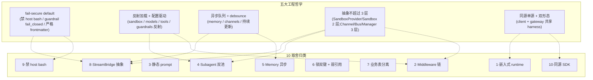

# 28 · 设计权衡 Top 10:全栈横切综述

> 面试串讲层第 1 篇。前 27 章是"由浅入深"的单模块精读;**本章把视角拉到天花板**,从全栈横切提炼 10 个最具面试价值的工程取舍。
>
> **本章用法**:不是新内容,而是**对前 27 章关键决策的检索 + 重新组织**。每个取舍都包含:
> - **决策本身**(DeerFlow 选了什么)
> - **放弃了什么 / 换来了什么**
> - **反例**(什么场景这个选择会失败 + DeerFlow 怎么补)
> - **面试展开点**(让你能在 5 分钟内向资深面试官讲透)
>
> 读完这一份,你应该能在白板上**默写出 10 个取舍 + 关键源码定位**,作为面试时的"全局心智图"。

---

## 🎯 学习目标

1. 拿到任意一个 DeerFlow 设计问题,能从这 10 个取舍中**定位最相关的 1-2 个**作为切入点。
2. 用"换来 vs 付出 + 反例 + 补救"三段式 framework 讲清每个取舍。
3. 把分散的源码事实**串成一张工程哲学网**:**fail-safe / 同源 / 反射 / 异步队列 / 抽象层不超过 3 层**。

---

## 🗂️ 10 个取舍速览

| # | 取舍 | 章节 | 决策 |
|---|---|---|---|
| 1 | **嵌入式 LangGraph runtime vs 独立 Server** | 06 | 嵌入 Gateway 同进程 |
| 2 | **Middleware 链 + create_agent vs 手写 StateGraph** | 02 / 10 / 11 | Middleware 抽象 |
| 3 | **system prompt 静态 + DynamicContext 注入 vs 动态拼 prompt** | 10 / 14 | 静态 + frozen-snapshot ID-swap |
| 4 | **Subagent 双线程池 + 全局 isolated event loop vs LangGraph 原生 Send** | 19 | 自建调度 |
| 5 | **Memory 异步队列 + 30s debounce + LLM 抽取 vs 同步实时** | 20 | 异步 + debounce |
| 6 | **`(sandbox_id, path)` WeakValueDictionary 锁 vs 全局锁** | 15 | 双键 + 弱引用 |
| 7 | **business 五表与 Checkpointer 表分离 vs 合并** | 24 | 分离 |
| 8 | **StreamBridge 抽象 + ring buffer + heartbeat vs 直接 astream** | 08 / 09 | 抽象层 |
| 9 | **LocalSandbox 默认禁 host bash vs 静默 / 直接禁** | 15 / 22 | 显式 opt-in + verbose 消息 |
| 10 | **同源 SDK/Server + Pydantic conformance vs OpenAPI codegen** | 04 / 27 | 同源 + 轻量契约 |

---

## 🧭 心智图

```mermaid
mindmap
  root((DeerFlow<br/>10 取舍))
    部署形态
      1·嵌入式 runtime
      10·同源 SDK/Server
    Agent 构造
      2·Middleware 链
      3·静态 prompt + 动态注入
    运行时调度
      4·Subagent 双池
      8·StreamBridge 抽象
    持久层
      5·Memory 异步队列
      7·业务表与 Checkpointer 分离
    安全与并发
      6·(sandbox_id,path) 弱引用锁
      9·禁 host bash + verbose 消息
```

---

## 🔍 10 个取舍精讲

### Trade-off 1 · 嵌入式 LangGraph runtime vs 独立 Server(06 章)

**决策**:DeerFlow Gateway 进程**内部直接** import `make_checkpointer` / `make_store` / `make_stream_bridge`,**不部署独立 LangGraph Server**。

**换来 vs 付出**:

| 换来 | 付出 |
|---|---|
| 部署简单(1 个容器而非 2) | 必须手写 LangGraph API 兼容子集 |
| 调用链短,所有中间件共享同一 FastAPI 栈 | LangGraph 升级要主动跟进 |
| 共享 lifespan / 资源池 | 与 LangGraph Studio 调试路径分离 |
| 端到端延迟少一跳 | 故障域共享 |

**反例**:**LangGraph Server v2 API 升级**,加了 deerflow router 没实现的字段 → langgraph-sdk-js 客户端期望此字段 → 报错。
**补救**:`TestGatewayConformance` 测试 + 紧锁 langgraph 版本 + langgraph.json 留独立 Server 兜底。

**面试展开点**:
- 为什么 GraphRAG / AutoGen Studio 都选嵌入式? —— 同样道理:**SaaS 化前,独立 Server 是过度工程化**
- 转向独立 Server 的 4 个触发信号:(a) graph 数量爆炸;(b) 多团队各跑各的;(c) graph 死循环影响业务 API;(d) 跨 region 弹性

---

### Trade-off 2 · Middleware 链 + `create_agent` vs 手写 StateGraph(02 / 10 / 11)

**决策**:DeerFlow 不手写 `graph.add_node + add_edge`,全部走 `langchain.agents.create_agent + middleware=[...]`。

**换来 vs 付出**:

| 换来 | 付出 |
|---|---|
| 18 个中间件可独立启停 / 排序 | 不能任意加 graph 节点 —— 必须能表达为 hook |
| LangSmith trace 每个 hook = 独立 span,可读性极高 | 中间件之间通信只能走 state |
| 同异步双轨 RunnableCallable 自动 | 钩子选错沉默失败(modify_model_request 被废弃但代码不报) |
| 6 钩子(`before_agent / before_model / wrap_model_call / after_model / after_agent / wrap_tool_call`) | state schema 改字段是破坏性变更 |

**反例**:**业务想引入 graph 级别的"图状工作流"**(如"先 A 节点 → 检查 → 分支 B/C → 汇总到 D")。
**补救**:用 `Command(goto=...)` 在 `wrap_tool_call` / `after_model` 做条件路由;或者用 subagent 委托。**重 graph 拓扑的场景 DeerFlow 不擅长**,该用 LangGraph 原生 StateGraph。

**面试展开点**:
- AOP / 洋葱模型直接类比 → 容易让人秒懂
- 中间件链 18 个位置不可调换的核心约束(11 章已详讲)
- 何时该 fork 加新 graph 节点而非新中间件:**节点是"流程",中间件是"横切关注点"**

---

### Trade-off 3 · System prompt 静态 + DynamicContext 注入 vs 动态拼(10 / 14)

**决策**:DeerFlow `apply_prompt_template` 生成的 system prompt **对所有用户 / 会话保持静态**;日期 / 记忆 / 跨日更新由 `DynamicContextMiddleware` 用**ID-swap** 注入到 first HumanMessage 的 `<system-reminder>` 块。

**换来 vs 付出**:

| 换来 | 付出 |
|---|---|
| Prompt cache 命中率最大化(2-5K tokens 静态前缀) | 实现复杂:ID-swap + hide_from_ui flag + dynamic_context_reminder flag |
| Memory / skills 动态变化不破坏 prefix | DynamicContextMiddleware 必须正确识别 reminder(`is_dynamic_context_reminder`) |
| 跨日更新只插一段短 reminder,不重写整 prompt | 学习曲线陡 —— 新人不理解为什么不直接拼 |

**反例**:**用户在 system prompt 期待个性化签名**("Hi Alice")。直觉做法 —— 把 user_name 拼进 system prompt → cache 失效。
**补救**:把签名注入到 `<system-reminder>` 或 first HumanMessage 前缀;**或者**接受 cache miss(若用户量小)。

**面试展开点**:
- OpenAI / Anthropic 的 prefix cache 折扣:命中部分 0.5x 价格 + 80% 首字节延迟降低
- 量化:典型 prompt 3000 tokens × 50 请求/用户/天 = 节省 50-150K cached tokens/天
- 这是 prompt engineering 工程化最具代表性的设计

---

### Trade-off 4 · Subagent 双线程池 vs LangGraph 原生 `Send`(19 章)

**决策**:DeerFlow **不用** LangGraph `Send(node, state)` 做 fan-out;自建 `SubagentExecutor` + `_scheduler_pool(3 workers)` + `_isolated_subagent_loop`(全局共享持久 loop) + `disallowed_tools=["task"]` 防套娃。

**换来 vs 付出**:

| 换来 | 付出 |
|---|---|
| 子 agent 完全独立上下文(不污染主对话) | 实现复杂:双池 + contextvar 跨线程传播 + token 桥接 |
| 超时(900s)/ 取消 / 限并发原生支持 | 必须自己维护"agent 跑在另一线程"的 race condition |
| token 通过 `_subagent_usage_cache + tool_call_id` 精确归回主 AIMessage | 不能像 Send 那样靠 reducer 简单合并结果 |

**反例**:**任务是"对 1000 个文档并行打分"**,纯计算无对话上下文 —— DeerFlow subagent 是 overkill(每个 agent 起 LLM 调用太重)。
**补救**:这种场景用 LangGraph 原生 `Send(score_node, {doc})` + reducer 合并 → 几行代码;或者绕过 agent 直接调底层函数。**DeerFlow 抽象不强求所有并发都走 subagent**。

**面试展开点**:
- Send = 节点级并发(函数级);Subagent = agent 级并发(LLM + 工具 + state)
- copy_context() 跨线程传 ContextVar 的细节(16 章 sync wrapper 没做,subagent 做了)
- MAX_CONCURRENT_SUBAGENTS=3 + `disallowed_tools=["task"]` = 防 3^5 = 243 个并发 LLM 爆炸

---

### Trade-off 5 · Memory 异步队列 + 30s debounce vs 同步实时(20 章)

**决策**:`MemoryMiddleware.after_agent` 把对话**入队**而非同步抽取;`MemoryUpdateQueue` 30 秒 debounce 合并多轮更新;后台 ThreadPool LLM 抽取 + per-user JSON 原子写。

**换来 vs 付出**:

| 换来 | 付出 |
|---|---|
| 用户 chat 响应不受 memory LLM 阻塞 | 进程退出时 queue 未 process → 记忆丢失 |
| 30s 内多次提交合并 → 节省 LLM 成本 | memory 不是实时一致 —— 用户期待"刚说的偏好下一轮立即生效"会失望 |
| 抽取失败不影响 agent run | 多机部署队列各自独立 → 必须 sticky 路由 |
| 30s 内可观察 correction / reinforcement signal(用户在 30s 内改口) | user_id 必须 enqueue 时显式捕获(contextvar 不跨 Timer 线程) |

**反例**:**对话进行中用户说"记住我喜欢简洁回答"**,下一轮 agent 还是冗长 → 用户困惑。
**补救**:用户显式 `/remember concise` 命令 → 走 `add_nowait`(不 debounce);或者前端在等 30s 后显示"记忆已更新"。

**面试展开点**:
- 写多读少(每条 chat 都可能写,但 prompt injection 才读)→ 异步合理
- ContextVar 跨 Timer 线程不传播 是常考的"高级 Python 并发知识"
- _fact_content_key = strip + casefold 是 80% 覆盖的实用方案 ;升级 embedding 的触发信号

---

### Trade-off 6 · `(sandbox_id, path)` `WeakValueDictionary` 锁 vs 全局锁(15 章)

**决策**:`file_operation_lock.py` 用 `(sandbox_id, path)` 双键 + `WeakValueDictionary` 自动 GC。

**换来 vs 付出**:

| 换来 | 付出 |
|---|---|
| 不同 sandbox 同路径并行(隔离正确) | `WeakValueDictionary` 有 GC 陷阱:取出 lock 后必须立即 `with`,否则被 GC |
| 不同路径并行(细粒度) | 多了"双层锁"(外层 `_FILE_OPERATION_LOCKS_GUARD` + 内层 file lock) |
| 长时间无访问的 lock 自动清,防内存泄露 | (sandbox_id, path) tuple 作 key 比简单 hash 慢一些 |

**反例**:**用户用同一 path 写大文件 50 GB**,锁持有 30 秒 → 同 thread 其他 path 操作不受影响,但**同 path 后续写会等 30s** —— 用户看似"卡住"。
**补救**:沙箱工具层加进度上报;或者大文件用 chunked 写入避免单一长锁。**当前架构不适合做 GB 级文件并发**。

**面试展开点**:
- 锁粒度优化的经典案例:全局 → table → row → cell
- WeakValueDictionary 的 GC 陷阱(必须 with 立即用)
- LocalSandbox 单例 + 锁双层防护 = 共享 sandbox 也能多线程安全

---

### Trade-off 7 · 业务五表与 Checkpointer 表分离(24 章)

**决策**:DeerFlow 业务用 5 张表(threads_meta / runs / run_events / feedback / users);LangGraph Checkpointer 用自己的 3 张(checkpoints / checkpoint_writes / checkpoint_blobs)。**两套不合并**。

**换来 vs 付出**:

| 换来 | 付出 |
|---|---|
| 业务表能跨 thread 查询(报表 / 审计 / 计费友好) | 多套 schema,Alembic 迁移要双管 |
| Checkpointer state 永远只是"工作内存",不被业务字段污染 | 同一 thread 既写 Checkpointer 又写业务表(两次落库) |
| run_events append-only + per-thread seq → 永久审计 | 业务层和 Checkpointer 跨表查询要应用层 join |
| Checkpointer 由 LangGraph 升级,业务表自己控制 | 跨表事务不能保证(append-only events 容忍最终一致) |

**反例**:**用户在 cancel 后 thread 状态错乱**:Checkpointer 已写部分 partial state,但 runs 表的 status 还是 running → 两边不一致。
**补救**:09 章 `_rollback_to_pre_run_checkpoint` 写新 checkpoint(不删旧)+ runs.status 显式更新 + run_events 写 run.end —— 三层 best-effort 同步。

**面试展开点**:
- CQRS:state 写一边、event 写另一边、各自优化
- 24 章讲过"合并到 Checkpointer 会怎样" —— 跨 thread 查询 / 行级权限 / 报表全废
- run_events 永不删 → 客户问"3 个月前那次对话" 可查

---

### Trade-off 8 · StreamBridge 抽象 + ring buffer + heartbeat(08 / 09)

**决策**:DeerFlow 不直接把 `agent.astream(...)` 暴露给前端;**中间加 `StreamBridge` 抽象**(MemoryStreamBridge 默认实现),提供:
- Per-run async queue + outbound callbacks
- Ring buffer(`queue_maxsize=256`)
- `subscribe(last_event_id=...)` 断线重连重放
- `heartbeat_interval=15s` 主动心跳
- 抽象基类预留 Redis / NATS 后端

**换来 vs 付出**:

| 换来 | 付出 |
|---|---|
| 生产者 / 消费者解耦,跨协程隔离 | 多一层延迟 |
| 断线重连不丢中间事件(ring buffer 256 内) | 单机 in-memory,多机部署要扩展实现 |
| 长任务自动心跳防代理断连 | 抽象本身 ≈ 200 行代码 |
| 未来切 Redis 不动业务代码 | DeerFlowClient 还要再做一层 dedup(08 章 4 集合) |

**反例**:**用户的 agent 跑超长任务(20 分钟),buffer 256 满了**,客户端断线重连发现"中间一段事件丢了"。
**补救**:
- 客户端识别 "warning: last_event_id not found" 友好降级
- 升级 `queue_maxsize` 到更高(代价:内存)
- 切换 Redis/Postgres bridge 持久化所有事件

**面试展开点**:
- Pub/Sub broker 经典抽象:为什么不直接 expose iterator
- ring buffer 的 retention window 设计:256 是经验值
- DeerFlowClient stream_mode 命名重映射(messages → messages-tuple)的边界设计

---

### Trade-off 9 · LocalSandbox 默认禁 host bash + verbose 消息(15 / 22)

**决策**:`is_host_bash_allowed()` 默认 False;调用 host bash 时返回 verbose 错误消息建议切 AioSandbox 或 opt-in `allow_host_bash: true`。

**换来 vs 付出**:

| 换来 | 付出 |
|---|---|
| 新手默认安全 —— 不会因为不懂 sandbox 就 `rm -rf /` | 真有信任本地 dev 场景的用户必须 opt-in |
| 错误消息可操作:告诉用户怎么修 | 比"完全不实现 execute_command"多一行代码 |
| Verbose security message > silent failure | 用户看到消息可能被吓退(其实是设计 |

**反例**:**纯本地 dev 用户**(单人开发,沙箱安全无关紧要)反复看到"Host bash disabled" 消息 → 觉得 DeerFlow 难用。
**补救**:首次启动 `make doctor` 检测,若是本地 dev 自动提示"要 opt-in 吗"。

**面试展开点**:
- 安全姿态默认值的设计哲学:fail-secure default + explicit opt-in
- 与坑爹的"silent disable"对比 —— 用户卡半天不知道
- 与 22 章 SandboxAudit fail-closed Guardrail 同哲学

---

### Trade-off 10 · 同源 SDK/Server + Pydantic conformance vs OpenAPI codegen(04 / 27)

**决策**:DeerFlowClient + Gateway 共享 harness 内核,**API 层各自独立**;`TestGatewayConformance` 用 Pydantic response model 校验 client dict 返回。

**换来 vs 付出**:

| 换来 | 付出 |
|---|---|
| 嵌入式 Python 用户**不需要起 server** 就能用 | 仅 Python 客户端;跨语言要另外做 |
| 测试方便(不 mock HTTP) | API 层有 30 行"重复"(_ensure_agent vs make_lead_agent) |
| Pydantic conformance 比 OpenAPI codegen 轻 | 公开 API 给第三方对接不够标准 |
| schema 漂移 CI 立即捕获 | 不强类型(runtime Pydantic 而非编译期) |

**反例**:**SaaS 化要发 JS / TS SDK**;Pydantic-only 路线不能覆盖。
**补救**:27 章给出 6 步路线图 —— 抽 schema 包 + 生成 OpenAPI + JS codegen + CI 双管。

**面试展开点**:
- 何时选哪种取决于"客户类型"(内部 Python 团队 vs 多语言外部)
- conformance 测试是"轻量契约";适合内部 / 小团队;不适合公开生态
- 9 个 conformance 测试覆盖所有 dict-返回方法,**特例不强求**(get_artifact 返回 bytes)

---

## 🧱 工程哲学网



---

## 🎤 面试 framework:从问题到取舍

#### "请讲一个 DeerFlow 你印象最深的设计"

回答 framework:
1. 用 1 句选取一个取舍(从 Top 10 挑)
2. 用 30 秒讲"决策本身"
3. 用 1 分钟讲"换来 vs 付出"
4. 用 30 秒讲一个反例
5. 用 30 秒讲补救方案

**示例**(用 Trade-off 4 Subagent):
> DeerFlow 不用 LangGraph 原生 Send 而自建 Subagent 双线程池。
>
> 决策:`SubagentExecutor` 用一个 ThreadPoolExecutor(3 workers) 调度 + 一个全局共享的持久 event loop 执行,默认 `disallowed_tools=["task"]` 防套娃。
>
> 换来:子 agent 完全独立上下文不污染主对话;原生支持超时 / 取消 / 限并发;token 通过 tool_call_id 缓存精确归回主 AIMessage。付出:实现复杂,要做 ContextVar 跨线程传播 + race condition 处理。
>
> 反例:纯计算并发(如 1000 个文档打分)用 Subagent overkill,该用原生 Send。
>
> 补救:Subagent 是 agent 级抽象,纯计算场景应该绕过它直接调底层函数。

---

#### "为什么 DeerFlow 选 X 而不是 Y"

把 Y 当作"反例",从 Top 10 找最近的取舍,直接讲"换来 / 付出 / 反例 / 补救"。

---

#### "如果让你重新设计 DeerFlow 你会改哪里"

挑 1-2 个取舍的"付出"做切入:
- "我会让 `_subagent_usage_cache` 加 TTL,防止 LLM retry 场景泄露"
- "我会把 MessageBus 抽成 Protocol,让多机部署可插拔"
- "我会给 _ensure_agent 加 double-checked locking 让 client thread-safe"

每个改进对应 Top 10 某个取舍的明确缺口 —— **你的回答既显示理解又显示批判**。

---

## 🎤 互动检查 —— 请回答这 3 个问题

> **两句话即可**。

1. **取舍归类题**:"为什么 DeerFlow 用反射加载 sandbox provider 而不是硬编码工厂?" 这对应 Top 10 的哪个取舍?为什么?
2. **反例题**:Trade-off 5(Memory 异步)在什么具体场景会让用户体验差?DeerFlow 提供了什么 escape hatch?
3. **设计哲学题**:本章总结的 5 大工程哲学中,**你认为哪一条最值得在自己项目里复用**?给一个具体场景说明。

回答后我们进入 **`29-interview-grand-summary.md`**(最终一份) —— 按 Agent Harness 六要素组织的面试串讲,含两套面试卷答案模板。
