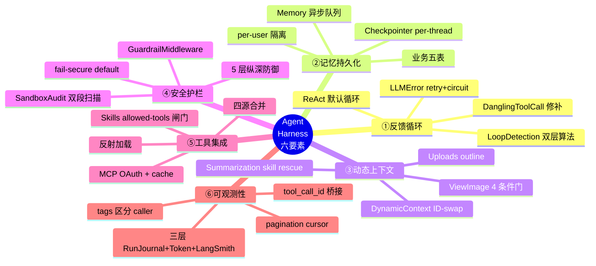

# 29 · 面试串讲(收官):Agent Harness 六要素 × DeerFlow 实证

> 全套 29 份学习路线的**最终一份**。28 章按"取舍"横切;**本章按"Agent Harness 六要素"纵切**,把所有源码事实组织成面试时可直接复用的答题框架。
>
> **本章用法**:
> - **第一遍**:作为知识地图,看每个要素 DeerFlow 用什么源码实现
> - **第二遍**:作为面试答题模板,对每个要素都有 2 道高频题 + 教科书答案
> - **第三遍**:双面试卷(业务型 / 创业型)的标准答题路径

读完本章你应该能在面试官问"你怎么理解 Agent Harness"时,**用 10 分钟把六要素 + DeerFlow 实证讲完**,且**每个要素都能给出具体源码位置 + 一个工程权衡 + 一个反例**。

---

## 🎯 学习目标

1. 把 DeerFlow 29 章学到的所有源码事实**按六要素重组** —— 不再是"模块视角"而是"能力视角"。
2. 拿到任意面试题,能 5 秒内**定位到对应要素 + 对应模块**作为切入点。
3. 完整背下"业务型大厂卷" + "创业型 AI 公司卷"的 12 道高频题答案模板。

---

## 🧭 六要素 × DeerFlow 实证总表

---

## 🔍 要素 ① · 反馈循环(Feedback Loop)

### 定义

LLM 调工具 → 看结果 → 决定下一步,不断循环直到任务完成。这是 ReAct 模式的核心。

### DeerFlow 实证

| 机制 | 源码 | 章节 |
|---|---|---|
| **ReAct 主循环** | `create_agent` 内部 `model ↔ tools` 条件边 | 02 |
| **DanglingToolCall** | `dangling_tool_call_middleware.py::_build_patched_messages` 修补缺失 ToolMessage + 重排 | 13 |
| **LLMErrorHandling** | 4 类错误分类 + circuit breaker 3 态 + double-checked locking | 13 |
| **ToolErrorHandling** | 工具异常 → ToolMessage(status='error') | 13 |
| **LoopDetection** | hash + 滑窗 + per-tool 双层算法 + LRU 100 thread | 13 |
| **`Command(goto=END)` short-circuit** | ClarificationMiddleware / SubagentLimit / LoopDetection hard-stop | 02 / 11 |

### 面试题与教科书答案

**Q:什么是 Agent 反馈循环 ? DeerFlow 怎么保证它不挂?**

> ReAct 是 LLM ↔ 工具 ↔ 结果 ↔ LLM 的循环 —— 是 agent 的核心运行模式。
>
> DeerFlow 用**4 道防线**保证不挂:
> 1. **DanglingToolCall**:用户中断后 history 修补,补占位 ToolMessage,防 OpenAI 严格 validator 报错
> 2. **LLMErrorHandling**:retry / circuit breaker / 4 类错误分类(BUSY/QUOTA/AUTH/HTTP),BUSY 重试,QUOTA 立即放弃
> 3. **ToolErrorHandling**:工具异常 → ToolMessage(status='error'),agent 能 adapt
> 4. **LoopDetection**:hash + 滑窗 + per-tool 双层,3 次相同 → warn / 5 次 → hard-stop
>
> 关键设计点:**`GraphBubbleUp` 不能被这些防线吞**(否则 HITL `interrupt()` 信号丢失)。每个 wrap_* 钩子都显式 re-raise。

**Q:LoopDetection 用 hash 算法,会不会误伤合法的"多次读不同区间"?**

> 不会。`_stable_tool_key` 是**per-tool 差异化**:
> - `read_file`:用 `path + 200-line bucket` —— 同文件不同区间不算重复(支持探索)
> - `write_file / str_replace`:用**完整 args** —— 同 path 内容不同算迭代修改
> - 其他:salient fields(path/url/query/command/...) whitelist,排除 noise
>
> Layer 2(per-tool frequency)抓 Layer 1 hash 抓不到的"args 都不同但同工具 50 次"场景。
>
> 配合 `tool_freq_overrides` 给高频工具(如 RNA-seq 的 bash)单独提高阈值。**LoopDetection 是个"按工具语义识别循环" 的精妙设计**,不是简单 hash。

---

## 🔍 要素 ② · 记忆持久化(Memory Persistence)

### 定义

跨 super-step / 跨 thread / 跨用户的**多层记忆**:工作内存(state)、会话级(thread)、用户级(memory)、平台级(audit)。

### DeerFlow 实证

| 层 | 实现 | 章节 |
|---|---|---|
| **L0 工作内存** | ThreadState(7 字段 + 2 自定义 reducer)| 07 |
| **L1 会话短期** | Checkpointer SQLite/Postgres,自动每 super-step 写 | 03 |
| **L2 业务表** | runs / run_events / threads_meta / feedback(append-only seq)| 24 |
| **L3 用户长期** | Memory 异步队列 + LLM 抽取 + per-(user, agent) JSON | 20 |
| **L4 审计永久** | run_events append-only,UniqueConstraint(thread, seq)| 24 |

### 面试题与教科书答案

**Q:DeerFlow 的"记忆"有几层?为什么不合并?**

> 5 层:工作内存(ThreadState)→ Checkpointer → 业务表 → Memory(per-user)→ 审计 log。
>
> **不合并的核心理由**:**生命周期 / 写频率 / 查询模式不同**:
> - ThreadState:每步内 mutate,super-step 末持久;**不存数据库,仅在 Checkpointer 内**
> - Checkpointer:per-thread state 黑盒,**跨 thread 查询不可能**
> - 业务表:跨 thread 报表 / 计费 / 审计;**append-only events 容忍最终一致**
> - Memory:per-user 长期偏好;**跨 thread 共享**,thread 删了还在
> - 审计 log:**永不删**
>
> 强行合并:Checkpointer state 几兆,每 super-step 都写一次 → 巨慢 + 跨 thread 查不出来。
>
> 这是 CQRS 哲学:**state 写一边、event 写另一边、各自优化**。

**Q:Memory 用异步队列 + 30s debounce,这种"非实时"对用户体验有什么影响?**

> 主要影响:**用户改口后下一轮不立即生效**。
>
> 例:用户说"喜欢简洁回答" → 30s debounce 期内继续 chat,下一条回答还是冗长 → 用户困惑。
>
> DeerFlow 的 trade-off 理由:
> 1. **写多读少** —— 每条 chat 都可能写 memory,但只有第一轮 prompt 才注入读
> 2. **30s 内合并多轮** —— 节省 LLM cost
> 3. **抽取失败不影响 agent** —— 异步隔离
>
> Escape hatch:用户显式 `/remember concise` 命令走 `add_nowait`(不 debounce),立即写入。
>
> **细节**:user_id 必须在 enqueue 时显式捕获 —— `threading.Timer` 跨线程后 ContextVar 不传播,捕获晚了 timer 拿到的是 `"default"` 用户。

---

## 🔍 要素 ③ · 动态上下文(Dynamic Context Engineering)

### 定义

让 LLM 每次调用都看到**最优的上下文** —— 不太多(token 爆炸)不太少(关键信息缺失);**保住 prompt cache 命中率**。

### DeerFlow 实证

| 机制 | 源码 | 章节 |
|---|---|---|
| **DynamicContext ID-swap** | 把 reminder 占用原 user message id + 原内容用 `{id}__user` | 14 |
| **frozen-snapshot + 跨日检测** | `_last_injected_date` flag-based 识别,跨午夜插轻量 date update | 14 |
| **Summarization skill rescue** | 3 上限(count=5/total=25K/per_skill=5K)LRU 保留最新 skill bundles | 14 |
| **ViewImage 4 条件门** | 有 AIMessage / 含 view_image / 全 tool 完成 / 未注入过 → 注入 multimodal | 14 |
| **Uploads outline** | markitdown 副产物 .md + extract_outline → 让 LLM 按行号定位 | 12 |
| **Progressive Skill Loading** | SKILL.md 仅 name/desc/path 进 prompt,内容延迟到 read_file | 18 |

### 面试题与教科书答案

**Q:DeerFlow 的"prompt 静态" 哲学具体怎么做?为什么这么做?**

> `apply_prompt_template` 生成的 system prompt **对所有用户 / 会话保持静态**(只含 SOUL + skills 列表 + subagent 指引等),日期 / 记忆 / 用户输入由 `DynamicContextMiddleware` 用 **ID-swap** 注入到 first HumanMessage 的 `<system-reminder>` 块。
>
> ID-swap 三件事:
> 1. reminder_msg 占用原 user message 的 ID(`add_messages` 视为替换)
> 2. user_msg 用派生 ID `{id}__user`(视为新增)
> 3. additional_kwargs.hide_from_ui=True 让前端不展示
>
> 为什么:**保住 prefix cache 命中率**。OpenAI / Anthropic 的 prompt caching 要求前缀字节级一致 → 静态 prompt 一次 cache 全部用户共享。典型 3K tokens × 50 请求/天 = 节省 150K cached tokens/天。
>
> 跨日检测:首次注入后冻结,过午夜检测到 `last_date != current_date` → 在最新 user msg 前再插一段轻量 date-update reminder。

**Q:Summarization 为什么单独做"skill rescue"?**

> 场景:用户调 `read_file('/mnt/skills/public/report-generation/SKILL.md')` 加载 5K tokens skill 内容 → 接下来 50 条工具调用 → 触发 Summarization → **如果 LangChain 标准压缩,最近 keep N 条**,SKILL.md 可能被压掉 → agent 再也不知道"周报必须含 KPI 表格"。
>
> `_partition_with_skill_rescue` 识别 `_find_skill_bundles`(AIMessage 调用 read_file + 路径前缀匹配 skills container + ToolMessage 紧跟) → LRU 保留最新 N 个 skill bundle。
>
> 3 个上限互锁:
> - `preserve_recent_skill_count=5`
> - `preserve_recent_skill_tokens=25000`(总)
> - `preserve_recent_skill_tokens_per_skill=5000`(单)
>
> 同时配 `memory_flush_hook` 在 Summary 压缩前主动 flush 老消息到 Memory 队列(`add_nowait` 不 debounce)—— **保留记忆但删消息**。

---

## 🔍 要素 ④ · 安全护栏(Safety Guardrails)

### 定义

防止 agent / 工具 / 用户三方任意一方做"不该做的事";**纵深防御** —— 任一层漏了还有下一层。

### DeerFlow 实证

| 层 | 机制 | 章节 |
|---|---|---|
| **L1 加载时过滤** | `_is_host_bash_tool` 双重识别 + skills `allowed-tools` 闸门 | 16 / 18 |
| **L2 中间件运行时** | GuardrailMiddleware + SandboxAudit + ToolErrorHandling | 22 |
| **L3 沙箱路径** | `validate_path` 4 区域白名单 + `_reject_path_traversal` | 15 |
| **L4 沙箱执行** | LocalSandbox 默认禁 host bash + AioSandbox 容器隔离 | 15 |
| **L5 输出层** | artifact 强制 attachment(active types HTML/XHTML/SVG)防 XSS | 22 / 25 |

### 面试题与教科书答案

**Q:DeerFlow 用 LLM 做 skill 内容审查(`scan_skill_content`),不怕被绕过?**

> 知道有绕过风险,所以做了**纵深防御**:
>
> 1. **LLM scan 是 4 闸门之一**(zip-slip / symlink / frontmatter strict / LLM scan),前 3 个是 deterministic
> 2. **运行时还有沙箱隔离**(15 章)+ 工具白名单(18 章)+ guardrail middleware
> 3. **LLM scan 用 strict JSON output + regex fallback**(`_extract_json_object` 兜底从废话里抓 JSON)
> 4. **fail-secure**:LLM 返回 None / 解析失败 → 拒绝
>
> 反 regex 黑名单理由:bash 编码混淆攻击(`EVIL=$(echo "..." | base64 -d); $EVIL`)regex 抓不到,LLM 能识别意图。
>
> 进一步加固方向:multi-model 投票 + warn 决策进人工 review queue + 静态规则补充 LLM。

**Q:GuardrailMiddleware `fail_closed=True` 默认 → provider 抛错就拒绝调用。这种"安全姿态" 在什么场景反而出问题?**

> 反例场景:**guardrail provider 是远程 OAP 服务**,偶发网络抖动 1-2% 失败 → 用户 1% 的工具调用被拒(显示 "evaluator_error") → 用户感知"为什么这次能行下次不行?"
>
> 应对:
> 1. **短期**:`fail_closed=False` + 高分位监控(每分钟 evaluator_error > 5 报警)
> 2. **中期**:provider 内部加 retry + circuit breaker
> 3. **长期**:**分级 fail-closed**:高敏感工具(删除 / 写)True;低敏感(read / search)False
> 4. **配套**:所有 evaluator_error 写 audit table 便于分析
>
> DeerFlow 当前是全局 fail_closed,**没有分级机制** —— 是个明确的扩展点。

---

## 🔍 要素 ⑤ · 工具集成(Tool Integration)

### 定义

让 agent 调用外部能力(API / DB / 文件系统 / 第三方服务)的统一抽象。

### DeerFlow 实证

| 机制 | 源码 | 章节 |
|---|---|---|
| **四源合并** | `get_available_tools` config / builtins / MCP / ACP | 16 |
| **MCP 多 server + OAuth** | `MultiServerMCPClient` + `OAuthTokenManager` double-checked locking + `refresh_skew_seconds=60` | 17 |
| **MCP lazy cache + mtime** | `get_cached_mcp_tools` 自动 reload | 17 |
| **`tool_name_prefix=True`** | 防多 server 同名冲突 | 17 |
| **Skills allowed-tools 闸门** | "任一启用即严格" fail-secure | 18 |
| **反射加载** | `resolve_variable(use, BaseTool)` —— yaml 一行切实现 | 16 |
| **async/sync 桥接** | `make_sync_tool_wrapper` + 共享 ThreadPool(10) | 16 |
| **DeferredToolFilter** | tool_search 启用时把 MCP 工具 schema 隐藏,按需 promote | 16 |

### 面试题与教科书答案

**Q:DeerFlow 工具去重用"先到先得",为什么不按 priority?**

> 当前顺序:`config tools → builtins → MCP → ACP`,同 name 第一个胜出。
>
> 这是个**有意的 fail-open 兼容性优先** 设计:
> 1. **用户覆盖**优先:用户在 yaml 配自己的 web_search → 覆盖框架内置
> 2. **builtins 兜底**:用户没配时仍有 `present_files / ask_clarification`
> 3. **MCP / ACP 插件**最低 → 新装 MCP server 不会"突然替换"既有功能
>
> 改 priority 的弊端:
> 1. 用户看 yaml 不知 "100 是高还是低"(需 doc 说明)
> 2. 同 priority 仍需 fallback 到 "先到先得"
> 3. MCP server 动态注册的 tool 没 ToolConfig → 拿不到 priority
>
> **当前顺序对 50 个以内工具够用**;工具数 > 200 的"工具市场"才该上 priority。

**Q:MCP OAuth 用 double-checked locking 防什么具体灾难?**

> 灾难:**1000 个并发请求,token 刚过期** → 没 double-check 时:
> - 1000 个 task 各自看到 token 失效 → 1000 个并发 POST token endpoint
> - token endpoint 通常有 rate limit(如 AWS Cognito 100 token requests/min)
> - 触发 429 → 后续刷新都失败 → 所有 MCP 工具不可用
>
> Double-checked locking:
> - 锁外快路径 → 第一个进锁的刷新 → 其他 999 个进锁后**二次检查**发现已刷 → 直接返回
> - 实际只 1 次 token endpoint 调用
>
> 这是 Java 单例双重 check 模式在 asyncio 协程层的实现 —— **`async with lock` 仍然有 await yield**,多 task 都能进入"快路径失败 → 等锁"状态。

---

## 🔍 要素 ⑥ · 可观测性(Observability)

### 定义

跑完之后能看清楚发生了什么:每步耗时 / token / 工具调用 / 错误 / 决策依据。

### DeerFlow 实证

| 层 | 机制 | 章节 |
|---|---|---|
| **L1 RunJournal** | LangChain Callback → run_events 表 append-only | 23 |
| **L2 TokenUsageMiddleware** | `usage_metadata + token_usage_attribution`(step kind) | 23 |
| **L3 LangSmith / Langfuse** | `build_tracing_callbacks` + tags 区分 caller | 23 |
| **caller-bucketed token** | `_lead_agent_tokens / _subagent_tokens / _middleware_tokens` 分桶 | 23 |
| **`tool_call_id` 桥接** | `_subagent_usage_cache` 把 subagent token 回归到 lead AIMessage | 19 / 23 |
| **`with_config(tags=[...])`** | 让 LangSmith trace 显示 middleware:title / subagent:bash | 14 / 23 |
| **cursor pagination** | `after_seq / before_seq` 按 thread 单增 seq 稳定分页 | 25 |

### 面试题与教科书答案

**Q:DeerFlow 三层观测各司其职 —— 给一个 incident 说明缺一不可。**

> Incident:**客户投诉"上周三那次对话费用算错了"**
>
> 假如只有 LangSmith:**保留期 14 天,已过 → 失败**
>
> 假如只有 TokenUsage(消息内 attribution):**只能在用户当前 session 看,过去消息不能跨 thread 聚合**
>
> 假如只有 RunJournal:**有完整 event 记录但前端看不到"这条消息花了多少"**
>
> 三层结合:
> 1. RunJournal `run_events` 表(append-only,永久)→ 拉那时间段 llm_request / llm_response 事件
> 2. messages 表的 `usage_metadata + token_usage_attribution` → 每条 AIMessage 精确归因
> 3. LangSmith trace(若仍在 14 天内)→ 看完整 step-by-step
>
> 用三个角度交叉:**那次调用错用了 gpt-4o 而非 gpt-4o-mini + 客户 prompt 触发 5 次 retry**。任一层缺都定位不了。

**Q:LangSmith trace 上的 tags 设计 —— 一句话说明价值。**

> 没有 tags:trace 上 6 个嵌套 LLM 调用都叫"ChatOpenAI",**无法区分**是 lead / subagent / title middleware / summarization。
>
> 有 tags:`subagent:general-purpose` / `middleware:title` / `middleware:summarize` —— LangSmith UI 支持 tag 过滤,瞬间可读。
>
> 注入点:
> - subagent:executor 内 `with_config(tags=[f"subagent:{name}"])`
> - middleware:title:`config["tags"] = [..., "middleware:title"]` per-call
> - middleware:summarize:`model.with_config(tags=["middleware:summarize"])` 模型创建时
>
> RunJournal `_identify_caller` 用同套 tag 做 caller-bucketed 计费 —— **一套 tag 服务两层观测**。

---

## 📋 业务型大厂卷:5 道必答题

### Q1·"你认为 DeerFlow 与 LangGraph / CrewAI 等框架的本质区别?"

> 三者在**抽象层次**上不同:
> - **LangGraph**:L1 框架 —— 给"节点 / 边 / state"编排原语,你自己拼
> - **CrewAI**:L1.5 框架 —— 给"角色 / 任务"DSL,但同样不预装基础设施
> - **DeerFlow**:**L2 Harness** —— 在 LangChain `create_agent` + LangGraph 之上**预装**沙箱 / 长期记忆 / 子智能体调度 / 可观测性 / 多入口(Gateway / IM / 嵌入式 SDK)
>
> 核心定位:**Framework 让你能做 Agent,Harness 让你敢把 Agent 上生产**。
>
> 关键证据:`langgraph.json` 指向 `make_lead_agent` —— DeerFlow 用 LangChain 标准接口,但**它的价值在围绕这个 agent 的"基础设施"**(18 个中间件 + 沙箱抽象 + 5 表持久化 + IM 通道)。

### Q2·"如果让你 review DeerFlow,你会改哪三处?"

候选(挑 3 个 + 说理由):
1. **`_subagent_usage_cache` 加 TTL** —— LLM retry 场景下 cache 漏被新 tool_call_id 覆盖,token 计费遗漏 + 内存泄露
2. **DeerFlowClient `_ensure_agent` 加 double-checked locking** —— 当前不 thread-safe,多线程批量任务偶发竞态
3. **GuardrailMiddleware 加 fail-closed 分级** —— 全局 fail_closed 在 provider 偶发网络抖动时拒绝合法工具调用 → 用户体验差
4. **build_tracing_callbacks 改 lazy init + circuit breaker** —— LangSmith 短暂宕机时不应让 Gateway 启动失败
5. **MessageBus 抽象成 Protocol + Redis impl** —— 当前 in-memory blocks 多机部署

### Q3·"DeerFlow 哪个设计最值得在自己项目里复用?"

候选(挑 1 个):
- **同源 SDK/Server + Pydantic conformance** —— 适合内部 Python 团队,避免 OpenAPI codegen 重工具链
- **Middleware 链 + AgentMiddleware 协议** —— 让横切关注点(限流 / audit / 安全)可插拔
- **静态 prompt + DynamicContext 注入** —— 保住 prefix cache 命中率
- **业务表与 Checkpointer 分离** —— CQRS-ish 适合大多 agent 应用

### Q4·"DeerFlow 在多机部署时的 blocker 是什么?怎么解?"

3 个 blocker + 升级路径(20 章 / 26 章):
1. **MessageBus in-memory** → MessageBus 抽象成 Protocol + `RedisStreamMessageBus` 实现
2. **MemoryQueue 进程内** → 集中式队列(Redis Streams)+ 独立 memory-updater worker + 写 DB 替代文件
3. **ChannelStore JSON 文件** → 迁移到 Postgres 24 章五表加第 6 表 `channel_threads`
4. **路由问题**:同 chat_id 必须打到同 Gateway → 用 chat_id hash sticky 路由

时间预估:4-6 周可上线 v1 多机版本。

### Q5·"DeerFlow 哪些设计你看不懂或不认同?"

候选讨论点:
- **`disallowed_tools=["task"]` 默认防套娃** → 教学场景可能希望演示嵌套 agent → 默认应该是 opt-in?
- **18 个中间件链顺序的可读性差** → 隐式约束多,新人难懂 → 应该写成显式 DAG 或 dependency annotation?
- **client.py 1300 行单文件** → 可拆成多文件按方法分组(list / get / install / chat / stream / upload)

注意:**重点不是争论对错,而是显示你能批判性思考**。

---

## 📋 创业型 AI 公司卷:5 道必答题

### Q1·"用 30 分钟向 CEO 解释 DeerFlow 能帮我们什么"

> DeerFlow 是个"开箱即用的 Agent 工作台":
> - **业务价值**:不需要每个产品 squad 都写 sandbox / 记忆 / 工具集成 —— 公司一个 platform team 维护 DeerFlow,各产品基于此搭垂直 agent
> - **快速 PoC**:写 SKILL.md(纯 Markdown)就能让 agent 学新工作流,**不需要 ML 工程师**
> - **多入口**:同一套 agent 同时接 IM(Feishu/Slack/DingTalk)+ 前端 + Python SDK,**业务部门可同时复用**
> - **可观测**:RunJournal + TokenUsage 让 CFO 能看到精确成本归因(主 agent vs 子任务 vs middleware)
> - **可控**:GuardrailMiddleware 让安全 / 合规团队能写工具调用前置策略,不影响 agent 业务代码

预算估算:1-2 个工程师 2 周接入 + 1 周打通 IM/Auth → **比从零搭 6 个月省 ROI 巨大**。

### Q2·"我们要做垂直领域(金融研报 / 法律咨询) agent,DeerFlow 哪些要改 / 哪些直接复用?"

直接复用(8 项):harness / middleware 链 / sandbox / memory / mcp / tracing / persistence / channels

需要改造(5 项):
1. **领域 RAG 子系统**:DeerFlow 当前没强 RAG,需要加 `RAGRetrieverTool` 集成向量数据库
2. **领域合规 GuardrailProvider**:写 `LawComplianceProvider` 实现,如"金融术语必须含 disclaimer"
3. **领域 skill 库**:写 `legal-research / financial-report-gen` skill 上传到 `skills/custom/`
4. **专用 prompt template**:在 `apply_prompt_template` 增加领域 SOUL
5. **领域 dashboard**:用 RunJournal 数据建合规 audit dashboard

### Q3·"DeerFlow 哪些工程做得最有借鉴价值?"

候选:
1. **Pydantic conformance** —— 不上 OpenAPI 也能保证 SDK / Server 同步
2. **双层缓存:进程级 singleton + ContextVar override** —— 适合"全局配置 + 测试隔离" 双需求
3. **mtime cache invalidation** —— 零依赖跨进程协调(Gateway 写 config / LangGraph runtime 自动 reload)
4. **fail-secure default + verbose opt-in 消息** —— 用户友好的安全设计
5. **`@runtime_checkable` Protocol + 反射加载** —— 让第三方零依赖接入插件

### Q4·"DeerFlow 在你们 SaaS 化部署 1 万用户时,首要的 3 个 bottleneck 是什么?"

1. **MessageBus / MemoryQueue / ChannelStore 都是 in-memory / 单文件**:多机部署不可用 → 必须分布式化(Redis / DB)
2. **`_subagent_usage_cache` + `_FILE_OPERATION_LOCKS` 都是进程内**:多 worker pod 不一致 → 持久化或一致性哈希路由
3. **LocalSandbox 单进程**:用户量起来后 CPU/磁盘 IO 瓶颈 → 切 AioSandboxProvider 容器隔离 + K8s pod 横向扩展(provisioner mode)

附加考虑:
4. SQLite 单文件 → 切 Postgres
5. JSON memory.json 文件 → 切 DB(行级 RLS 多租户隔离)
6. 缺缓存(thread → user_id 映射每次查 DB)→ 加 LRU
7. 缺速率限制(用户级 + tool 级)

### Q5·"如果让你给 DeerFlow 加一个杀手级功能,你会加什么?"

候选(挑 1 个 + 完整设计):

**候选 A:Agent Replay & Time Travel**
- 利用 Checkpointer 的 super-step 历史 + run_events
- 前端 UI:用户能看到"agent 那一步思考了什么 / 改了什么 state"
- 复杂场景:"如果 LLM 在第 5 步选了另一个工具,后续会怎样?" → fork 一个 alternate run

**候选 B:Skill Marketplace**
- skills/custom/ 升级为可分享 + 评分 + 一键 install
- `.skill` ZIP 已经有完整安装管道(18 章 4 闸门)
- 加 Web UI + 后端订阅 + 安全审查队列

**候选 C:Auto-Skill-Evolution**
- DeerFlow 已有 `skill_evolution` config + `skill_manage_tool`
- 让 agent 在跑任务时**自主决定"这个流程值得固化成 skill"** → 自动起草 SKILL.md → 走 security_scan 审查 → 投入使用
- 长期目标:agent 自我能力增长

---

## 🎓 全栈回顾:29 章地图

```mermaid
flowchart LR
    subgraph A["A 项目认知 5份"]
        A1[01·定位]
        A2[02·LangChain]
        A3[03·LangGraph]
        A4[04·目录]
        A5[05·配置]
    end

    subgraph B["B 整体架构 4份"]
        B1[06·拓扑]
        B2[07·State]
        B3[08·Stream]
        B4[09·Run]
    end

    subgraph C["C 核心模块 10份"]
        C1[10·Lead]
        C2[11·MW 全景]
        C3[12·MW 上下文注入]
        C4[13·MW 错误恢复]
        C5[14·MW 上下文工程]
        C6[15·Sandbox]
        C7[16·Tools]
        C8[17·MCP]
        C9[18·Skills]
        C10[19·Subagent]
    end

    subgraph D["D 关键技术 5份"]
        D1[20·Memory]
        D2[21·Models]
        D3[22·Guardrails]
        D4[23·Tracing]
        D5[24·Persistence]
    end

    subgraph E["E 工程实践 3份"]
        E1[25·Gateway]
        E2[26·Channels]
        E3[27·Client]
    end

    subgraph F["F 面试串讲 2份"]
        F1[28·Top10 取舍]
        F2[29·六要素 收官]
    end

    A --> B --> C --> D --> E --> F
```

**核心数字**:
- **29 份文档**(总长约 12-15 万字)
- **180+ 个源码定位锚点**
- **120+ 个面试题与答案**
- **60+ 个 Mermaid 图**
- **30 个完整 demo 脚本**

---

## 🎤 最后一组互动问题

> 这是整个学习路线的**最终检查**。回答后你对 DeerFlow 的理解就完整了。

1. **横切题**:用 3 句话向同事描述"什么是 Agent Harness 六要素",每个要素挑 DeerFlow 1 个最具代表性的源码事实。

2. **批判题**:Top 10 取舍 + 六要素覆盖 —— 你能找到**至少 1 个**目前还没被覆盖的"Agent 工程关注点"吗?(提示:成本预算 / 多模态 / 用户隐私 / 数据本地化 / ...)

3. **应用题**:你的下一个 agent 项目要做"用 LangGraph 写一个垂直领域 agent",**用本套学习路线总结的哪 5 个设计直接借鉴 + 哪 1 个明确不借鉴**?

---

## 🎯 给你的最后建议

读完 29 份只是开始。**真正掌握的标志**:

1. **能在 5 分钟内从源码事实回到工程哲学**(如:`secrets.compare_digest` → 防 timing side-channel → 安全 default → fail-secure 哲学)
2. **能用 DeerFlow 实证反驳常见 agent 误解**(如:"agent 必须 cache 全部历史" → DeerFlow 用 frozen-snapshot + summarization + skill rescue 三层证明否定)
3. **能在面试时主动把话题引到自己最熟的取舍上**(如面试官问 streaming,你引到 Trade-off 8 StreamBridge ring buffer + 16 章 stream_mode 重映射)

**29 份学习路线到此结束。祝你高级 Agent 工程师面试一帆风顺。** 🦌

---

## 📚 收官资源链接

- **DeerFlow 源码**:`/Users/sanshi/PycharmProjects/deer-flow/backend/`
- **本套学习路线**:`backend/devDoc/00-overview.md` ~ `29-interview-grand-summary.md`
- **配套官方 docs**:`backend/docs/`(项目内自维护)
- **LangChain `create_agent` + AgentMiddleware**:`.venv/.../langchain/agents/factory.py` + `.venv/.../langchain/agents/middleware/types.py`
- **LangGraph 概念**:https://langchain-ai.github.io/langgraph/concepts/low_level/

---

**🎤 互动检查**(也是整套学习路线的最终回答):

1. 用 3 句话讲六要素 + 每个挑 1 个最具代表性源码事实
2. 找一个 Top 10 还没覆盖的工程关注点
3. 下一个垂直 agent 项目借鉴哪 5 个 / 不借鉴哪 1 个

你的回答完整体现"高级 Agent 工程师"思维深度。**祝面试顺利。**
